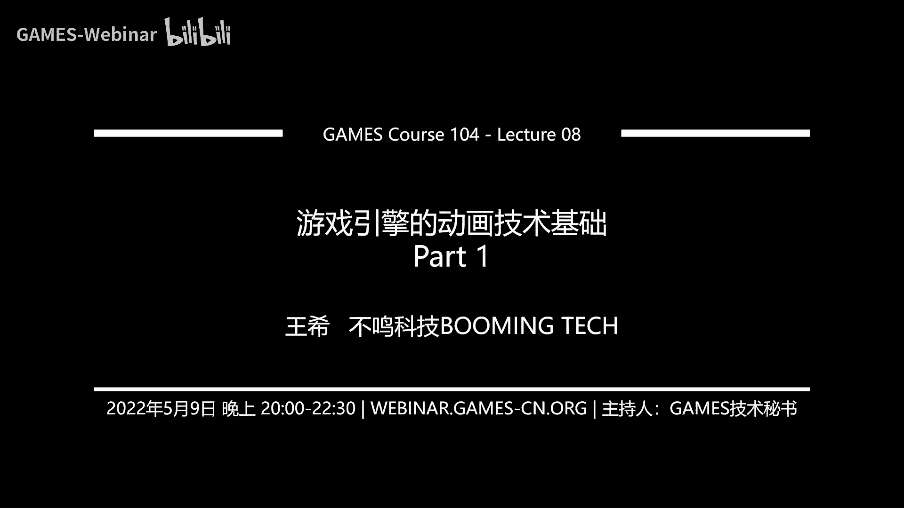

# 08. 游戏引擎的动画技术基础(上) 🎬 | GAMES104-现代游戏引擎：从入门到实践

在本节课中，我们将要学习游戏引擎动画技术的基础知识。我们将从动画的起源和基本原理开始，逐步深入到2D动画技术，并重点讲解3D动画的核心——蒙皮动画的数学基础。通过本节课，你将能够理解动画系统的基本构成和实现原理。

## 概述：动画的起源与挑战

人类自古以来就对动态的事物充满兴趣。早期人类通过绘画记录动态，例如岩石壁画和陶器上的连续动作图案。现代动画技术的基础是**视觉暂留现象**，即影像在人眼中会残留约1/24秒。这是电影、电视和游戏动画的理论基础。

早期动画的尝试包括“西洋景”和手翻书动画。游戏动画的理论和工具很大程度上借鉴自电影行业，从迪士尼的2D动画，到《侏罗纪公园》的计算机生成图像（CGI），再到完全由游戏引擎实时渲染的动画电影《ZUI》，技术不断演进。

在游戏引擎中实现动画面临独特挑战：
1.  **交互性**：游戏动画需要实时响应用户输入和游戏环境的变化，例如角色撞墙或被怪物攻击。
2.  **实时性**：所有动画计算必须在约30毫秒（1/30秒）内完成，同时还需兼顾渲染、物理、AI等其他系统。
3.  **数据与性能**：动画数据量巨大，高效的数据存取和计算是性能关键。
4.  **真实感**：对角色动作的自然度和真实感要求越来越高，包括动作融合、物理模拟和精细的面部表情。

本节课（上半部分）将涵盖动画系统的基础技术，学完后你将能够构建一个简单的带动画的游戏。课程内容分为：
1.  2D动画技术
2.  3D动画技术概述
3.  蒙皮动画的数学与实现细节
4.  动画数据处理（压缩）
5.  动画生产管线简介

下节课（下半部分）将介绍更高级的技术，如动画混合、反向动力学（IK）、动画状态机等。

---

## 2D动画技术 🖼️

2D动画技术是游戏引擎动画的鼻祖，至今仍在许多类型的游戏中广泛应用。

### 精灵动画 (Sprite Animation)

精灵动画的原理非常简单：将角色的每个动作帧绘制成单独的图片，然后在游戏中循环播放这些图片序列。

```
// 伪代码示例：播放精灵动画序列
for each frame in animation_frames:
    draw_sprite(frame)
    wait(frame_duration)
```

早期的经典游戏，如《超级马里奥》，都使用了这种技术。即使在高端的3D游戏中，精灵动画也并未消失，例如在粒子系统中，烟雾、爆炸等效果常使用序列帧图片来模拟动态。

### Live2D 技术

Live2D是一种更高级的2D动画技术，广泛应用于二次元风格的游戏中。它的核心思想是将角色拆分为多个图元（如头发、眼睛、眉毛），然后通过对这些图元进行**旋转**、**缩放**和**网格变形**来驱动动画。

以下是Live2D的工作流程：
1.  **图元拆分**：将角色分解为多个独立的图片元素。
2.  **层次与深度**：为每个图元设置深度值，定义它们之间的前后遮挡关系。
3.  **控制网格**：为每个图元生成一个控制网格，艺术家可以通过移动网格上的控制点来使图元变形。
4.  **关键帧动画**：艺术家为不同的姿态设置关键帧，系统会在关键帧之间进行插值，形成流畅的动画。

Live2D技术赋予了艺术家巨大的创作空间，且无需理解复杂的3D数学概念，就能创造出鲜活生动的2D角色动画。

---

## 3D动画技术概述 🤖

从2D过渡到3D，动画技术变得更加复杂。我们首先需要理解一个核心概念：**自由度**。

### 自由度 (Degrees of Freedom, DOF)

一个**刚体**在三维空间中的运动有六个自由度：
*   **3个平移自由度**：沿X、Y、Z轴的移动。
*   **3个旋转自由度**：绕X、Y、Z轴的旋转。

因此，常说的“6自由度”VR设备，就是指用户可以在虚拟世界中自由移动和旋转头部。

### 3D动画的几种形式

上一节我们介绍了2D动画，本节中我们来看看3D游戏中常见的几种动画形式。

1.  **刚体层次动画 (Rigid Hierarchical Animation)**
    类似于皮影戏，将角色的每个关节作为可动的刚体，连接成树状层次结构。早期3D游戏如《生化危机》就使用了这种技术，但缺点是关节处的模型容易发生穿插。

2.  **顶点动画 (Vertex Animation)**
    直接存储模型每个顶点随时间变化的位置（和法线）。这种方法数据量巨大，但非常适合表现柔体变形，如飘扬的旗帜、水流或布料模拟。数据常以纹理贴图的形式存储。

3.  **变形目标动画 (Morph Target Animation)**
    存储模型在不同表情或形状下的多个“目标”状态（如笑、哭、胖、瘦），通过在目标之间插值来实现平滑变形。这在捏脸系统和面部动画中非常常用。

4.  **蒙皮动画 (Skinning Animation)**
    这是现代3D游戏中最核心的角色动画技术。它结合了骨骼（刚体层次）和皮肤（网格模型）。每个皮肤顶点可以受到多根骨骼的影响，并分配不同的权重。当骨骼运动时，顶点位置由所有影响它的骨骼共同决定，从而产生平滑、自然的变形，避免穿插。

5.  **基于物理的动画 (Physics-based Animation)**
    通过物理模拟来驱动动画，例如布娃娃系统（Ragdoll）、衣物模拟、流体模拟等。它能产生非常真实且符合物理规律的效果，但计算成本较高。

6.  **反向动力学 (Inverse Kinematics, IK)**
    给定一个目标点（如手要抓取的位置），IK系统会自动计算角色链（如手臂）中各个关节应该如何旋转才能自然到达该目标。这在角色与环境交互时至关重要。

动画的创造主要来自两种方式：**手K动画**（动画师在软件中手动设置关键帧）和**动作捕捉**（记录真实演员的动作数据）。

---

## 蒙皮动画的数学基础 🧮

理解了3D动画的多种形式后，我们将深入探讨其中最核心的蒙皮动画的实现细节。这是所有高级动画技术的基础。

### 三个关键空间

在计算动画时，我们需要清楚地区分三个空间坐标系：

1.  **模型空间 (Model Space)**：以模型自身为中心的坐标系，也称为局部空间。这是模型顶点的原始坐标。
2.  **世界空间 (World Space)**：整个游戏场景统一的全局坐标系。模型通过**平移**、**旋转**、**缩放**变换从模型空间转换到世界空间。
3.  **局部骨骼空间 (Local Bone Space)**：每根骨骼自身的坐标系。动画数据（如关节旋转）通常首先在这个空间中定义。通过从根骨骼开始，逐级将子骨骼的变换叠加到父骨骼上，最终可以得到骨骼在模型空间中的变换。

动画计算的核心，就是将顶点从模型空间，经过受骨骼影响的变换，最终定位到世界空间的过程。

### 骨骼与关节

在游戏引擎中，我们通常存储和操作的是**关节**，而非视觉上的“骨头”。关节定义了旋转和平移，而两个关节之间则形成了一段骨骼。对于人形角色，行业有标准骨骼结构（如盆骨为根，衍生出脊椎和双腿），这便于动画资源的复用和交换。

### 表达旋转：从欧拉角到四元数

旋转是动画中最核心的操作。在3D空间中表达旋转并非易事。

**欧拉角 (Euler Angles)**
用三个绕坐标轴（X, Y, Z）的旋转角度（如`(α, β, γ)`）来描述方向。它非常直观（类似飞机的俯仰、偏航、滚转），但存在严重问题：
*   **万向节死锁**：当第二个旋转角为±90°时，第一和第三个旋转轴重合，丢失一个自由度。
*   **插值困难**：两个欧拉角之间的简单线性插值可能产生错误的旋转路径。
*   **叠加复杂**：组合多个旋转时计算繁琐且不直观。

**四元数 (Quaternion)**
四元数是一个四维超复数，形式为 **q = a + bi + cj + dk**，其中`a`为实部，`(b, c, d)`为虚部，`i, j, k`为满足特定乘法规则的虚数单位。
*   **单位四元数**可以完美表示3D空间中的任意旋转。
*   **旋转叠加**：对点`p`先后进行旋转`q1`和`q2`，等价于用四元数 **q = q2 * q1** 进行一次旋转。
*   **球面线性插值**：在两个四元数之间进行插值（`slerp`），可以得到平滑的旋转过渡。
*   **绕任意轴旋转**：给定旋转轴`(x, y, z)`和角度`θ`，对应的四元数为：
    ```
    q = [cos(θ/2), x*sin(θ/2), y*sin(θ/2), z*sin(θ/2)]
    ```

四元数解决了欧拉角的几乎所有缺陷，是游戏引擎中存储和计算旋转的标准工具。

### 蒙皮变换公式

蒙皮动画的最终计算在着色器中进行。对于每个顶点，其最终的世界空间位置由影响它的多根骨骼共同决定：

```
// 伪代码公式：顶点蒙皮计算
final_position = vec3(0, 0, 0);
for each bone that influences this vertex:
    // 1. 将顶点从模型空间变换到当前骨骼的局部空间
    local_pos = inverse(bone_bind_pose_matrix) * vertex_model_position;
    // 2. 将局部空间的顶点用当前骨骼的动画矩阵变换到模型空间
    animated_pos = bone_animation_matrix * local_pos;
    // 3. 加权累加
    final_position += animated_pos * vertex_weight_for_this_bone;
// 4. 将最终模型空间位置变换到世界空间
world_position = model_to_world_matrix * final_position;
```

其中：
*   **bone_bind_pose_matrix**：骨骼在绑定姿势（T-Pose或A-Pose）下的变换矩阵。
*   **bone_animation_matrix**：骨骼在当前动画帧下的变换矩阵。
*   **vertex_weight_for_this_bone**：该顶点受此骨骼影响的权重，所有权重之和为1。

---

## 总结 📚

本节课我们一起学习了游戏引擎动画技术的基础。
*   我们回顾了动画的历史和游戏动画面临的独特**挑战**。
*   我们探讨了**2D动画技术**，包括经典的精灵动画和更先进的Live2D系统。
*   我们概述了**3D动画**的多种形式，并指出**蒙皮动画**是现代角色动画的核心。
*   我们深入讲解了蒙皮动画的**数学基础**，重点理解了**三个空间坐标系**的区别，以及用**四元数**表达和计算3D旋转的优越性。

掌握这些基础概念和原理，是理解更复杂的动画混合、IK、状态机等技术的前提。在下节课中，我们将基于这些基础，继续探索现代游戏引擎中的高级动画系统。


---
*课程内容来源：GAMES104《现代游戏引擎：从入门到实践》第八讲（上）*