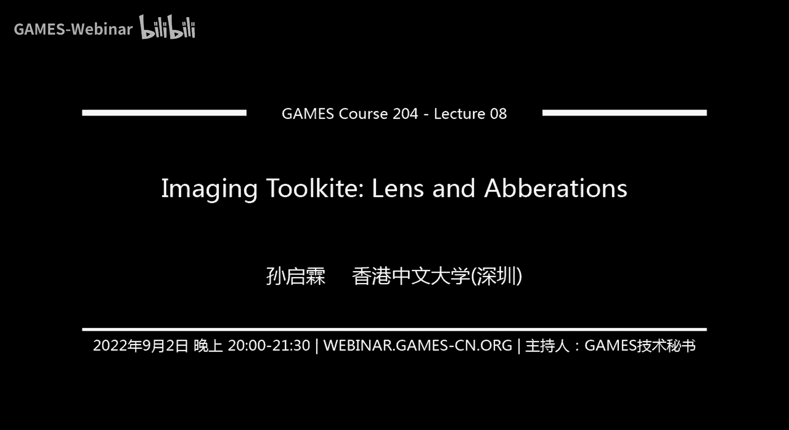
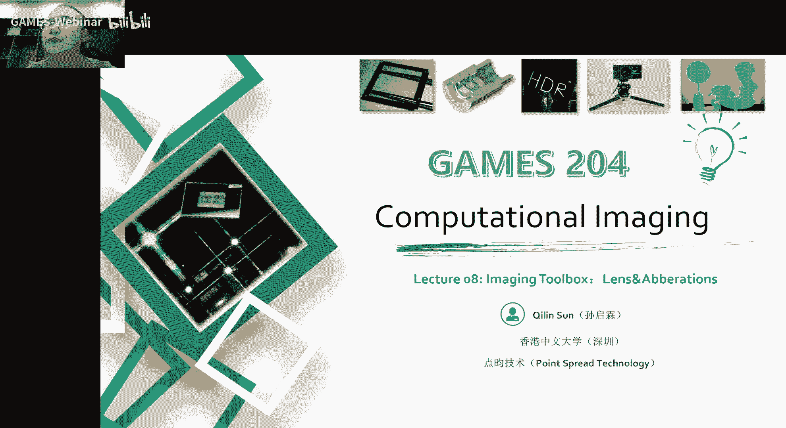
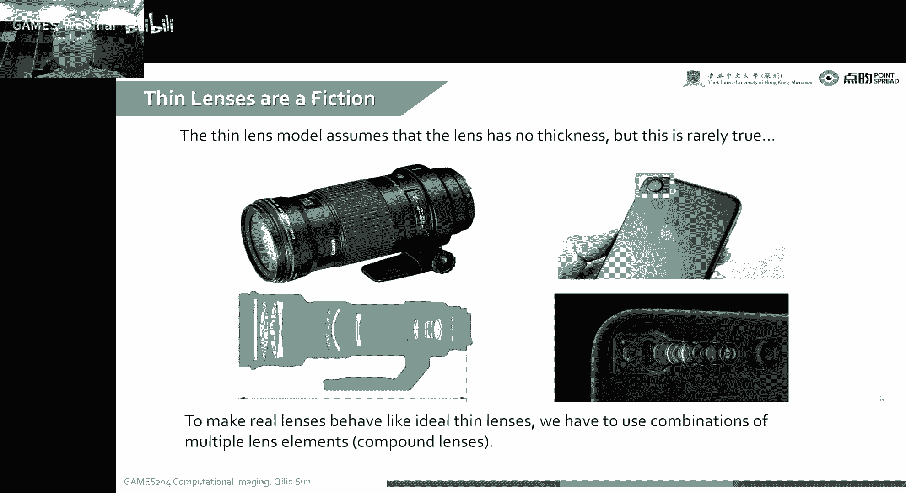
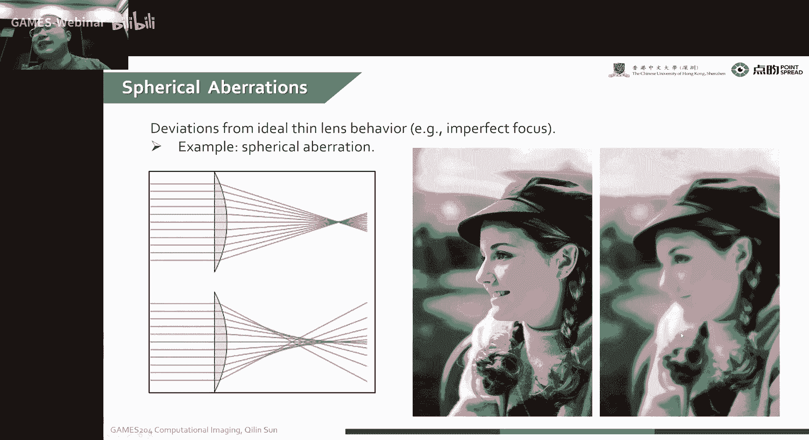
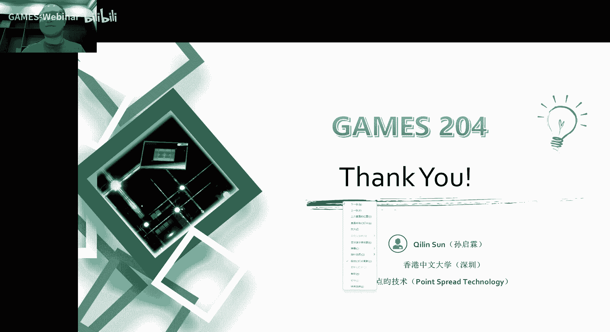

# 08.成像工具箱：透镜与像差 ｜ GAMES204-计算成像 - P1 - GAMES-Webinar - BV1md4y1G71q

声音可以听到吗，诶好诶，首先欢迎同学们回到games 204的课堂，嗯，上节课上两周，就是我们彭一帆老师给大家分享了一个就是display的一个知识，还有一个像a r display。

还有大家正常display就display整个内容是非常至关重要的，因为我们最后无论是对图形还是图像来说，要给大家做一个展示呃，是非常需要这个就to pay这一块的知识。

然后我又邀请了就是uc berkeley的康丽王老师啊，他是跟我以前一个组的队友呃，它是在整个智能光学成像啊，就大家听过一节课可能会知道什么样叫微放，cd，主要是用来干什么的。

就是我们这那就we found，就是所谓的拨前，就大家看到这个锅前就一层一层的锅，它传播过程中诶，比如说我要受到一个透镜和这个透镜加工的不是很理想诶。

这个拨弦这个时候就会受到这个不理想的这个面积的一个扰动，最后我拿到在传感器上拿到了一个图像，就会因为这个扰动的一个结果产生怎么样这种那样或者那样差，就可以最后测量这个呃透镜表面加工的一些缺陷啊。

同时也可以呃测量一下这个透镜表面变形，where we found sensing，这个是在整个呃智能仪器里面是有一些呃非常广泛的应用，今天呢我们就回到我们的主线的课程。

就是今天给大家分享这个image toolbox呃，这个主要讲两个部分，透镜到底是怎么成效的，也不只是我们就是传统的一个简单的透镜啊，我们可以从呃一个selemodel，也就是一个薄透镜的一个模型开始。

然后去给大家追溯呃，我这个不一样的材料，不一样的这个面型哦，对成像会有怎样的影响啊，这里面会给大家详细的讲解呃，这个近轴近似的情况下，我这个两个界面在一个弧，在一个弧形下面，我到底是怎么计算。

然后呢因为这种各种各样的一个设计的问题啊，比如说我们就是想喜欢用球面镜，因为球面镜加工起来还比较容易，上面也会比较低，在这个时候呢，就是我们非常容易带来各种各样的相差。

这个相差是直接影响我们最后拿到了相制的，所以说哎如何优化这个相差的，这个在我们这个这节课里面会详细地分析这个问题。

今天呢就是内容会比较密集啊啊就我们就分三个两个两个半主题，三个主题来给大家分享，第一个就是一个parallel optics，就是大家所谓的一个近轴近似的一个光学，这个可以详细的拆解。

我这个透镜的就是表面到底是呃会出现什么样的一个现象，然后去怎么计算它，然后第二个就是retransfor matrix，就是transfer matrix，是一个非常好用的工具，就我们这么一个透镜。

我通过这个retransfer matrix，我可以直接的比如一个一根光，然后它有一个发射的角度，我这一根光它会穿过一个位置，这个时候这就是一个光线的一个方程，光线的方程。

我透过这一个透镜的表面或者一个介质的表面，我会怎么样的变化，所以我这一个retransform matrix就可以直接的描述一根光线啊，经过透镜啊，或者是介质面怎么变到下一根光线这么一个过程啊。

它是一个非常简单的一个二元方程，而且也是可以像叠加，先把多个透镜组合在一起，就可以用这个return rs很容易的去描述整个光线变化的过程，然后最后呢就给大家分享的一个主题就是aboration。

就是and componenses，就是我们各种各样透镜啊，它都有自己的相差，无论是什么样的面型啊，没有常见的呃球差呀，呃会差呀，下载啊，厂区畸变啊，子午会杀或是会杀等等等等，各种各样的相差，嗯。

这些相差是怎么产生的，对我们图像会有怎样的一个质量的影响，嗯下面会给大家揭秘，然后到最后会教给大家一些方法，到底是怎么校正它，在这个课开始之前啊，先给大家说一下作业的问题。

就整个home one就是基本上已经改完了，就是我们这个整个coding的部分是在60%的成绩啊，然后最后结果的好坏就是占20%的成绩，然后我们这个结果呈现的一个就是report写的怎么样。

这个时候也是占20%的一个分数，就是从就是第一次作业的一个结果来看，就是呃感觉可能第一次作业是不是有点太多了，就是大家有很多呃完成的一个情况不是特别好，就只有嗯不多的同学就是做完了整个流程。

而且达到一个比较好的效果，然后我希望大家就是呃后面能继续就深入这个作业，因为我们课堂上讲解的知识，因为时间啊还有一些嗯就是内容的一个丰富程度，就不可能面面俱到，这个时候还是需要大家在课下多下功夫。

因为这个课程是就免费给大家去发放一些呃，大家以前很难学到的一些知识，就是这整个体系构建下来之后呃，其实要是能完整的学下来去，对大家有一个非常好的艺术，无论是在找工作。

还在大家对大家做研究来说都是非常有意义的，就还是希望大家能坚持下去，就把整个作业这个地方做好，然后第二次作业就是明天后天会给大家发放下去啊，第二次作业的主要内容就是一个hdr的一个fusion。

还有一个local tmap distay，是继续用我们前面那套框架，我们会把这个标准的一个嗯i s p的一个框架给放下去，就是有一个work one的标准答案，然后再基于这个代码框架。

然后再去加几个函数，一个第一个就是我们通过多次不同程度曝光呃，这么一个饶图啊，要给大家去做一个融合，那融合之后其实想要我们融合会得到一个非常高倍数的一个图像吧，比如说可能呃就是14位。

14位的每一张截图，然后我再融合，每隔四个stop融合七八张，最后可能拿到二三十位的一个图，我想想显显示在我们的一个显示器上就可以做一些local tmap，我给大家一些就reference的方法。

还有一些参考资料，大家可以呃查这些参考资料，去把这整个的fusion跟tmap实现呃，其实目的呢就是能达到一个最好看的一个效果，这个同学们也不一定非得局限在我们，就是给到了这个就是参考答案。

或者是嗯像你就是reference的一个参考资料，大家也想要实现更好的方法，也可以去呃搜索一些更新的方法啊，这个在我们最后的一个呃结果，因为你的结果更好看，会有一些加分的，来下面回到我们课堂的主题呃。

第一部分就是讲parallel object，也就是近轴光学，为什么要禁轴光学呢，因为我们在进球的时候有非常多的地方可以可以做近似的，因为可以做近似，就是我们很多的计算都可以变得非常简单。

这个时候我们用数学形式上去描述它啊，就会显得比较好看，呃在说这个呢我们就是想一看到一个这个clemodel，就sl model就是呃一个最简单最简单的这么一个透镜的模型，就是我们的一个几何光学啊。

特别是在图形学里面，我们非常希望我们这个复杂的透镜诶，最后可以简化成一个薄薄的一个纸片的这么一个薄透镜，我们不用考虑后透镜这么乱七八糟的性子，然后通过这种近似呃。

我们就可以非常容易的就是呃在图形学里面去做一些像聚焦呀，成像呀，就是光线的弯折呀，猫会很容易的通过这个薄透镜啊，然后去描述这个光线到底是怎么变化的，然后这个很简单啊，大家可能初中的时候就学过这个。

我们一个像比如说我在s的一个位置呃，这个物距的一个分之一加上相距分之一，最后等于焦距分之一，然后我们这个放大率呢呃实际上就是等于一个我最后项的一个大小。

就是s prime减f比上个f就是我最后的一个呃一个放大的一个程度，然后这里面这个薄透镜啊有两个假设哈，第一个假设就是我这个光因为是薄的嘛，因为而且像这个我们这种透镜这个中心这个位置啊。

你他虽然说一个弧面，但是我离中心的位置，我可以假设它是一个平的，它又是很薄的嘛，所以说这个时候光穿过光心的时候，就是光珠正宗的性的时候，我们可以可以理解为整个光线它的传播不受影响，就是它没有被偏折。

也没有被拐弯拉，那么一下他就是一个直的打过去，然后另一个假设就是嗯就是我一个平行光打过来，有这么一个平行光打过来，我最后这些平行光都是可以呃，对于理想的宝透镜啊，是都可以理想的汇集到这么一个点上。

无论是斜着入射的一个平行光，还是值得入射的平行光都可以呃理想的汇聚到我这个小品面上，但是实际上呢我们日常生活中的各种就真实的一个透镜啊，它是还是挺复杂的，呃我们比如说我这是一个例子啊。

就我们一个关于系统里面，就是其中把其中一个透镜单独拿出来，就整个透镜的表现它是由哪几个因素决定的呢，第一就是就是我整个透镜的一个面型，就是我这个透镜比如说是球面的呃，是抛物面的或者椭圆的，椭球面的。

这个时候这个透镜的面型是呃，决定整个透镜参数的一个决定性因素之一，那第二个就是呃透镜的一个本身的一个就是fting index，就是它的折射率，还有我介质外部介质的折射率，为什么要说外部介质呢。

比如说我们常见的一些呃那个汽油的显微镜，我要提高它的一个numerical app，我需要对这个样本进行精油，这个时候我们外面的介质也不再是空气了。

这时候我们就要考虑到外部环境的一个reflecting index，当然它本身的这个reflect index也是很重要的，然后第三就是整个孔径的一个，就这一个大小，就整个就是我特定的口径到底是多大啊。

这个也是呃整个透镜的一些决定性因素，但除此之外啊，我们要提高整个透镜的光学性质，我们经常会有很多做法，像光度光学镀膜，我有时候镀增透膜，有时候镀滤光膜，哎，有时候做uv膜，有时候做那种红外截止滤光片。

诶这种每一种膜它都有自己的一种特性，这个度这个透镜表面的镀膜呢啊是除了这三种呃这种决定因素之外，其他的一种非常重要的一个因素，就是说到这个透镜就不得不提的就是一个啊折射的一个问题。

就是大家就是以前就学过啊，这个snice law，我入射角是一个c盘，一假设空气哈空气这个呃这个折射率近似为一，然后水里面就是1。33，水里面1。33，然后我们这个入射角是sone，然后出射角是c2 。

我这两个之间的关系啊，实际上通过snl就可以很简单地描述出来，就是n介质里面的呃，就是介质one，但是我们这个其实这个snatch law是怎么来的呢，嗯其实啊这个里面有非常多的一个。

就是其实大家以前学过这个最短光程的原理，呃，比如说像大家以前上初中做物理竞赛的时候，呃，有就是比如说举个例子哈，就是一个人在河边走，不要在河边，我要走路，怎么在河里面，河里面有留宿。

一个人在就河里面随着流速在走，诶，我这个人怎么样，作为一个怎么样的路径才能最快的接到这个人呢，因为人在水里游，跟在路上走，他这个速度不一样，这个时候就跟我们现在遇到这种情况是一样的。

在在介质中就是光实际上我们就可以观测到的一个速度哈，它是不一样的，然后通过最短光程原理，我们就可以推导出这个nslog，这个有同学问啊，这个镀膜有啥优势，其实呃各种情况都有镀膜。

比如说大家做一个有非常多的一个镜片啊，这种时候我要做一个增透膜，就减少反射的时候，这个image 10000这个同学回答了这个减少反射的时候，就会可以很大程度的减少这个杂光。

就我最后可达到的图像相机就会很少受砸光的影响，比如说我们要想要做一个uv镜，就是我们像我们拍外部景观的时候呃，有非常多的一些像呃紫外的一个成分，这个紫外的成分也可以被我这个ccd或cmos感知到。

那这个时候其实这个时候就会导致颜色会有一定的偏移，就是我们就是不想要的一个颜色偏移，比如说我紫外多的时候，诶，我可能观察到的这个图像就偏蓝诶，这个时候就不答对了，但有时候红外比较多的时候呢。

我想要把红外给滤掉诶，这有时候就红外截止，说这个你们这一曼同学回答这个还是挺好的，来我们继续，然后我们这个理想的一个附近啊，从一个比如说我要从一个点发射一个光，我最后想要拿到一个完全平行的光诶。

这个理想的一个特定面是什么样子呢，其实一个对一个单的一个表面来说，单单单单介就是从一个介质入射到另一个介质啊，比如说空气注射到一个玻璃里面。

他理想的一个单的一个surface应该是一个hyperbolic，也就是抛物面的这么一个变形，才可以达到理想的从一个点发散成一个平行光，或者是反之，从一个平行光理想的汇聚到一个点，不产生相差。

这时候就会产生一个泡面呃，所以说呢我们有时候想从一个点就是唉比如说f1 ，我想要到达f2 ，然后中间啊就是从理想的汇聚到22，就是我们就可以用两个泡面的，一个就是平抛的一个透镜，然后去组合起来。

然后就可以从一个点f一直接映射到一个f2 ，就是f一的，像这个f2 就完全对称的这么一种情况，但是哈这个我们从来没有看到过，就是日常生活中从来没看到过这个抛物面的一个透镜，这是为什么呢。

就是大家其实最后就是因为经过这么多年的一个反复的一个摸索，就是我们会发现这个球面镜是更容易加工的，就是大家要做一个全面镜的一个模型，我只要知道半径，我可以非常容易的把这个球面镜的就加就加工出来。

就大家可能很多学光学工程的一个同学就自己磨不透镜诶，大家知道这个先开粗，也要把这个透镜这个粗模开出来，然后再去抛光它，然后这个时候球面镜就非常容易操作，但是你要加工其他的面型，然后就比较困难。

因为有很多参数你是不可控的，所以说就历史的原因就是让大家历史跟成本的原因，就是让就整个球面镜面镜是球面的啊，因为它更易于加工，还有更于对心，比如说两个呃两个透镜的两个面，一个是球面，一个是非球面诶。

这个时候诶还是可以对新的，因为我整个球面都是一样的，但是我两个都是非球面的时候，它的光轴加工的时候就很难达到它一个光轴的一个一致，这时候对加工跟对齐都会比较困难，但是呢这个球面它有一个问题。

就是我一个平行光，我打过来到一个球面，诶，这个时候我发现这个最后这个图他没有办法理想汇聚到了一个点，然后在这个下面上会产生一个呃斑一样的一个东西，就是一个点，不再是一个点了，它会产生一片这么一个光晕。

就是感冒到一个图像，然后感光感受到这个东西呢，这一片晕开的东西从点然后散开到一面，这个就叫点扩散函数，从一个点散开了，其实很容易理解，就是点扩散函数，然后因为球面引起的相差，也就是叫球差。

这个球差是为什么呢，就是我距离这个光轴距离不一样的时候，我最后汇聚到我整个光轴上的一个位置是不一样的，比如说我这个呃，像这个例子里面就是我离中心轴越远，我汇聚到地方越近。

但是我的观测始终是在一个面上进行的，对不对，我在这个就是相面上就拿到这么一个这么大一个班，但这个班呢然后会有一个强度的分布，这就是所谓的求差，当我们把这个如果假。

我们假设这个这个球面这个相差是就是每个市场都是一样的哈，就我们最后拍照的时候，假设都一样，这个是因为求差引起的这么一个相差，就相当于我这么一个点光的函数，实际上大概是长这样一个强度分布的平抛哈。

这么一个强度分布是在跟图像做一个二维点积，然后我们就会或多或少的发现诶这个图像变模糊了，这个时候我们就不想要这种相差，这个就是所谓的求差，我们去如何呃去叫这个球差呢。

我们继续在刚才这个这个这个球差到底是怎么产生的呢，我们要去描述它的时候，然后就需要啊学到一些就是整个近轴近似的一些知识，来去简单的去描述它啊，为什么要进轴呢，就我一个角角度特别小的时候。

这个c它远远小于就是派的时候，这个时候sin theta就近似等于theta，那cos theta也就是呃一减约等于一啊，tan theta也是约等于c然后我们用就第一阶第一阶的一个技术。

它勒级数展开啊，我们可以看到fc很小的时候，我们高阶都可以约等于零，这个时候就不考虑，这时候也可以约等于等于零，之后我们就可以拿到进轴的时候呃，sin theta是约等于theta。

cos theta等于一，那这个时候方便计算，然后这种然后再recall一下这个reaction啊，就我们刚才拿到了这个n sin sy等于sin sone，然后n to等于一个。

然后等一个n two乘以3c的to，这个时候我们要通过进球进四的时候，我们那个c3 e c t2 非常小的时候，那我们最后会拿到什么结果呢，是这样。

我们就可以非常简单的拿到这个sone n one sone，对one to sit to，因为这个已经通过近轴近似这个sc tone也就约等于c tone，我们要推理一个标准的从一个介质到另一个介质啊。

这个光线是怎么传播的，比如说我们object p我通过啊这么一个，比如说这是一个球面，一个球面，然后这是介质一，这是介介质and prime，诶，我这个时候我最后拿到了相反p这个到底是什么位置呢。

这个位置是啥，然后这个角度又是啥，对不对，我要想要得到他们之间的关系，我们要如何推理它，其实这个大家要是学过物理竞赛，可能是大学物理可能都会讲到这个进球的一个fing，这么一个问题，今天继续给大家呃。

就整个把这个推理一遍，我们考虑到这个object p啊，发出一个光线，然后v然后它的角度呢是you啊，这个距离就近似为l，然后呢我们这个这个点的一个位置啊，就高度就定义为h。

然后这个呢是e因为这个u已经非常小了，然后这个z z然后乘以u就是约等于这个h对吧，然后这个h呢实际上这个也是u啊，这很容易这个再乘一个这个u呢就是u方了。

这个时候就是e就等于一个就是等于一个巴拉巴拉乘u方，然后这个时候u方二阶小数对吧，这个所以说大家可以把这个这两个点近似成一个点，就是e约等于零，然后su就可以近似为h除以l也就是这个除以l那cos也有。

就很容易就是呃这个z除以l对吧，然后最后我们怎么样通过我们已知这个z已知这个已知这个u对吧，然后介质n n prime，那我们怎么样去求导，然后我们还要需要知道这个球的半径对吧。

这个球这个半径我只要得到这个p的一个p prime这么一个位置，然后我们去画一条辅助线，辅助线这个比如是一个呃球星，然后就可以拿到，这么一个关系，然后通过进球数进四，我们可以知道这个n prime对吧。

这个介质在这个地方的位置，通过它一个cs law，你就可以得到第一个方程，n i乘等于n撇乘以i撇，我们再继续啊，同时呢这个u也是这个u就是等于h z，那么通过然后从这个p prime看。

我们这个这个是未知量哈，z prime是未知量，我们要加这个未知量，这个u ram这个角度就等于h除以z对不对，那这个时候我们就可以联立得到这么两个方程，然后通过联立这两个方程呢。

我们我们这得到这么两个，但是我们还是因为未知量非常多嘛，这个h是未知量啊，z prime是未知量，这个r这个角度a也是不知道，但是我们有很多角度的关系，我们最后想要强调这个i跟二prime的关系。

对不对，然后这个时候我们又通过就是三角形的这个关系，就这个角i i prime就是a就等于一个i pm，加上个you from me，对不对，有这个三角的关系就可以得到，然后同理呢。

然后这个这个这个这个i呢就等于啥呢，就等于一个这两这个这个这个三角形，看这个三角形，看这个三角形对不对，然后这个i呢又等于一个u加上a对吧，这个i撇u跟a的关系，还有i，当然这两个就可以连接两个方程。

所以我们现在已经得到了四个方程了哈，就是uu撇i啊，还有关于这个a的一个方程，然后这个a呢因为h又很简单啊，我们这个r一是已知这个球面是已知的，球面半径是已知的，所以说这个a可以近似得到。

然后最后我们通过联立这些方程，就可以通过计算得我们这个i跟ip之间的关系，那我们最后消掉这个h，然后再把这个a也给消掉，然后最后我们拿到这个z跟z撇二个m撇之间的关系，然后把这几个变量之后消掉之后。

我们就可以拿到的呃，很容易的拿到呃，这这个就给大家看一下结果，就是我们拿到的结果就是消掉这个h我们可以拿到n，然后这是u加上a也就是i n i等于n prime啊，乘以a。u对不对，也就是把这两个方程。

也就是这两个角度的关系，就是第一个方程对不对，然后第二个方程是什么呢，就这边的介质n prime，然后乘上这么一个就是呃跟z之间的关系，把这个这个方程继续往下推理哈，把这个a换掉。

n等于这个a等于h除以r对吧，把这个换掉，换掉之后，我们就可以得到这个z跟z prime之间的关系，让我们这个r是已知的哈，然后我们z已知我们最后想要得到z撇，最后我们把这个z撇给推出来。

哎我们最后通过计算就可以得到这个zz z撇，就是通过这个方程啊简化一下，然后就可以拿到一个r乘以n撇，也是这个半径乘以n撇啊，比上个他们这两个呃就是介质之间的一个呃折射率的差，诶这个时候大家看这个嗯。

这个透镜这个公式是不是越来越接近于，我们就是正常成像的一个公式了，就大家越看嗯，约了约那个好看一些，然后这个时候我们真正的一个透镜又是什么样子呢，我们就日常生活中可以见到了一个透镜。

我们通常是由两个球面来构成的，那我用一个近似的一个方式，我们就把两个透镜连立起来，就是一个是正的一个弧面，一个是反的一个弧面，这个时候把这两个联立起来，就可以得到这个s0 ，从s0 发出一个从。

s到p这么两个之间的一个关系，我们就可以得到物距和像距，因为最后是通过两个介质嘛，物距跟像距，物距分之一加上相距分之一，就等一个n l，当这个时候还是考虑到呃，我们拿到了这个高斯是薄透镜啊。

这个也就d就是约等于零，不考虑这个厚度，就因为我们是都是进轴嘛，这个进轴这个位置是非常小，然后就推理得到了一个lmarket equation，就是n l也就是这个透镜里面的介质减上一。

然后乘上一个r一分之一，减上r2 分之一，就是两个透镜弧面的一个分之一差诶，这个时候大家看到这个东西是不是跟大家薄透进了这个f分之一，就一样的吗，实际上这个东西啊。

实际上就是你可以近似的理解为就等于f分之一，这个就是一个理想的一个薄透镜的这个成像的一个过程啊，它有非常多的一个一个性质啊，比如说这个这个叫我们就要又常常把它叫做高斯透镜。

然后我们从这个landmarx formula去推，我们这个就是物距分之一加上相距分之一，就等于一个f分之一，对不对，然后这个时候又又等于n l减一，然后比上两个呃半径分之一的差。

这个时候f分之一就等于中间，这个是我们就可以很轻松的就把这个f给求出来，也就是它的分之一对吧，这就是f，然后再回到我们这个薄透顶的这么一个模型啊，就我们最后我们可以看到。

我们就是他把它简化成我们正常的一个透镜的时候，我们可以只考虑去特别是薄透镜，我们可以只考虑这个f这个问题，就不要考虑两个球面r12 ，这个再加上这个折射率，大家算算半天就非常困难，非常累。

所以这个我们通常就简单的用一个f去表示这么一个薄透镜，然后下面给大家讲一下这个retransform matrix，我们再从这个薄透镜去出发啊，就是我们假设这个基于两个假设，一个就是胖头进四。

然后另一个假设就是一个薄透镜，我们有这么一根光从这发出来入射到透镜到这个位置，就是i这个位置c他i这个位置对不对，这根光他有一个穿过这个点，然后有这么c它这个方向，然后我最后通过这个透镜，我出来之后。

我们拿到这个光线就是变成x啊成然后从这个对不对，这是我们新出来的光线入射光线，我们如何描述从这个光线到这个光线变化的过程呢，这个时候我们就要考虑到这个retransfer matrix。

还是像我们我们只是在这个进度近视下去算它，因为这个进近速算起来比较容易，就是我们静音下这个sin西塔就约等于这个c塔啊，所以说这个角小的时候就比较容易算了，然后同时也是考虑到是一个薄透镜。

就不考虑这个入射点和出射点之间的距离，就是这个d就是一就把它当成零就好了，这个时候就方便大家计算，诶这个时候我们我们已知啊这个雾的一个位置是s i，离透镜的一个点的距离是s i。

然后这根光线的一个角度就是c的i，对不对，从一个，c塔对不对，这个地方就等于一个si乘以一个c塔i，那这个x0 等于啥呢，x0 其实它就等于它也等于这个，对不对，但是他同时还跟这个物距有关。

就是它也等一个s0 ，乘一个c0 ，这c其实是out，好像是s out，是s1 s2 ，然后最后我们想要知道他们俩之间的关系是个是个啥，然后我们就可以动用我们的工具，这一个我之前推导到了一个工具对吧。

然后我们知道这两这两个x1 t x2 ，把他俩把这个入射距离跟注射距离这两个关系，那拿到拿到之后，我们要想要，其实我们想要求的呢，实际上就是这么一个x0 跟三点，这两个都是未知量，我们已知量是啥嘞。

已知量就是c塔i x i还有个透镜的一个焦距，然后通过这个透镜的焦距公式，然后这两个又相等，对不对，我们就可以呃用两个方程解两个未知量，其实再结合这个等一个对这两个方程，一。

诶我把这个时候我就把这个s0 n c t0 解出来，对不对，你知道两个二元二次方程，这个很容易就可以解出来，这个出射光线的角度跟位置，诶这个时候我们发现，通过简化之后，最后这个结果还是哎挺好看的哈。

我们最后拿到一个matrix，然后对角线是一，然后我的这个，左下呢左左下这个这个二一这个二幺这个位置就是负的f分之一，所以说这个时候我们把这个2x2的这么一个矩阵，它也叫这个a abcd matrix。

就是光学里面的一个呃retransfer matrix，这就是大家最常见的一个retranser matrix，有了这个return matrix，我们可以描述一个透镜。

同时我们知道整个光学变化的过程都是线性的，这个时候我们就可以很简单地通过这么一个region matrix去描述，这整个一个复杂的透镜，非常容易的去描述，最后所有的操作都变成了一个矩阵相乘对吧。

这个时候诶大家变都变得非常开心，就变得非常简单容易，当然除了这个通过透镜的一个变化，我们还可以就是把整个光线在空间中自由传播的这么一个，也可以用这个region matrix来表示。

哎当然同样的像反射呀，呃折射呀或者平面折射呀，曲面折射啊，我都可以用这个reacation来表示，它基本上就是整个几个光圈里面很万能的啊这么一种表示方法，但这个时候我们在图形学里面去做计算的时候。

这个光线通过这个return max变化，我们也可以可以就很简单了，通过我们这个整个图形学的方法去把这个最后我们想要的相差呀，或者是渲染的一个图像拿到就这跟物理相关的一个图像近似的。

哪个不是完全理想的一个东西，然后当我们考虑到就是我们经常嗯会遇到这么一个光学的黑盒子，就是我们有很多就是比如说文件啊，就光学文件就没有，不是很方便，就是向外透露的时候，特别有非常多的企业。

比如说像比如说像比如说华为以前跟蔡司那会合作的那首诶，我这个蔡司我这个想设计不想给你，但是我又必须得给你一个，就这么一个黑盒子来给你去去描述这个光线是怎么变化的。

这个时候你就可以通过这个黑盒子来评估向日诶，这个时候怎么办呢，其实我们通常都是用一个retransform matrix来表示的，但是这个因为整个管理系统会变成一个有非常多的镜片之后，就会变得非常复杂。

就没有很多的精，他也不再是一个理想的薄透镜，也不是理想薄透镜的组合，还有各种各样就是非球面镜啊，然后各种各样的位置又有光缆嗯，然后又有又有世兰，在这个时候大家想要描述它。

通常就拿到一个非线性的这么一个remain的一个form，也就是这个x out sout，它它同样也是一个x x1 c它印的一个函数，但是我这个光线跟角度都必须用两个非线性的一个函数来表示。

这个时候我们去如何去通过这么一个最近的一个呃，这么一个映射函数来得到我们这个a d a b c d matrix，因为我们还是想简单的一个线性的一个变化，来表示我们最后的一个结果。

因为这样的话对大家处理来说就会变得非常容易，诶这个时候大家就想想到了一些数学上的方法，比如说这个时候a b c d等于啥，因为我们这个时候你要看，如果大家看这个方程不是很好看的话，对不对，就就是。

round f比round x i x求导，哎这个就没了，对不对，然后就可以拿到一个a诶，这个时候我们就发现嗯，当当然我们这个时候也要让这个进度进四去成立哈，就是这个c3 i非常小的时候。

就可以近似为把这个导数，把它的导数对对x的偏导数近似为呃，我们这个a b a b c d matrix之类的一个a，那同理，我们也可以对这个round s，跟那个对这个c ti求偏导。

这个时候我们就可以很容易地得到b，当然它是conditionally嗯，在这个比如说呃c塔i等于零的这个位置，对啊，这个时候我们就可以拿到一个近似的一个a b c分进去，它因为它描述非线性的过程。

它不是一个完全理想的一个线性过程，最后说我们通过这个求导，可以拿到一个近似的一个a b c d的一个matrix的过程，那当我们这个a b c max，比如说在我们空间里面，我们可以知道通过一个薄透镜。

这个a b c d matrix，它是一个f分之一这么一种感觉，对不对，但我们实际上我们也想看到的一个，比如说我在free space propagation，就是我们在自由空间里面传播的时候。

出生在那这个d就是近似等于零哈，咱不管他啊，这个这个时候近似不等于零，因为这是在自由空间中传播d这么一个过程，诶，我们我们发现这个入射角出射角是不变的啊。

但是我们这个si到x x一到x2 这个位置变化了个d，所以说我们在a b c d这个地方就加了个d，这个也很容易去推出来啊，啊当我们遇到一个折射面的时候，哎我们就发现这个d啊就是实际上是n一比n2 。

到了一个mirror的时候呢，mirror其实就是完全的一个位置就不变，就可以知道a是一，b是零，那c他角也不变，对不对，这个就可以拿到一个对称的一个matrix。

所以这个a b c d a matrix每个值的一个这值啊都是有它一定的意义，就是说我这个b啊通常跟这个空间传播这个横向的位置有关系，然后d呢就跟直率就是通常率有关系，然后像像这个d这种情况呢。

就是n一比n2 ，它等于它等于一，就是n一等于n2 ，这个时候诶这不就是不就是它没有变嘛，但实际上它这个我们要考虑这个theta的这个正负号，这个时候a b c d matrix就可以很完整的描述啊。

这个光在空间中的一个传播，然后讲到了一个刚才讲到了一个单透镜的传播，当然我们有很多透镜的时候，我把这很多这个透镜叠在一起的时候，这个时候我们想要表述它，而这个时候用了abcd matrix。

就是也就是refer matrix就会变得非常容易，那我们现在有三个透镜啊，就f1 f2 f3 ，那我这个input plan还是sin跟s i s e，然后拿到的位置是x in。

这个时候我们就可以把这三个retransmissions按顺序去做一个矩阵相乘，最后我们就可以拿到我们最后要输出的这个就s2 跟这个set out，就是它最后的值就非常简单的一个计算。

哎说到这个return of matrix，就是我们呃就学光学的同学可能会接触到，但是所以说要给其他的一些就是经常做算法呀，或者是做那底层图像处理。

同学去给大家补一下这个a b c d的一个matrix的违规知识，这对任何的一个光源系统，无论是它都复杂，我们都可以用这个retract matrix来描述它。

特别是像我们这种碟子在一队of tical system嗯，我们就有非常多的elements，每一个elements啊有不一样的这个retract matrix，同时比如说他们之间有空隙。

我们就可以用那个飞space propagation这个a abcd matrix，然后最后用他们的乘积来拿到，我们最后想要的结果，当然所有的这个return matrix只是在这个几何光学里面使用了。

这个是呃不太适用于我们一些混合的像抄表面啊，d e啊，这些元件的一个描述，就是我们通常还是局限于啊对几何光学的一个描述，但是在我们镜头设计的时候，这个retransform matrix是非常有用。

但大家有兴趣的话，可以做一些光学镜头成像的一些仿真，就比如说呃这个复杂透镜，我想要真正的复杂透镜，就我们就是整个腾讯学里面做渲染，大家很多时候都只是在用一个小孔成像的模型。

来对我们最后一个地方去做一个retracing啊，去去找跟着物体的焦点，那我们就可以通过这种abcd matrix来给大家做一个realistic and model，来去做一个渲染。

就可以拿到一个更加真实的像，类似于拍照的这么一种结果，嗯大家如果对这个有传送matrix感兴趣的话，可以大家建议大家读一下这个principle and applications were pencil tracy。

让大家感兴趣的话，可以读一下这两篇文章，他让我们嗯就经常做上瘾，同学就是可以想办法利用这个result matrix，就是就不再是像之前大家去追cos，大家如果对做cos做光追的时候啊，是非常困难的。

就是大家会经常问你追100根光线，最后拿不到一张非常好的图像，你会拿到那种星星点点的那种班的那种感觉啊，大家上过这个game 101的课，可能会学到过这个部分。

大家怎么样通过这个return of matrix嗯来去呃，大家可以仔细的思考一下，拜拜，然后第三个课题给大家分享，在这里的是一个components and elebrations。

就我们刚才讲到的都是不简单的一个薄透镜的模型，也就是还有一个就是晋州近四成像的模型，但是这种就是理想的薄透镜呢，它是在我们日常生活中是不存在的，真实的透镜是非常复杂的，就是我非常非常多的一个就是镜片啊。

然后每个镜片也不跟各种各样的变形，各种各样的一个位置，还有我们这个光缆啊，还有我们是蓝，还有我们这个入同出同等设置，它是一个非常困难，非常复杂的一个系统，哎到今天为止，就整个镜头的一个光源设计。

通常还是描描述为the art of optical n，现在还是一个艺术，而并不是一个科学，就是它背后的一个原理，大家很多时候摸得不是特别清楚，就这个时候啊。

因为我们整个透镜是一个非常高的一个非线性的一个过程，他在优化透镜，我这么多参数在一起优化，能不能收敛到一个好的地方呢，是不他说这个透镜优化到今天为止还是the art of obstacd。

那有这种真实的透镜呢，它就不可避免的就是有各种各样的相差呀，这个相差就是跟光源设计本身就是密切相关，就这举两个例子，这是一个单反透镜的一个模型，我没看到，还有非常多的一个镜片，用各种各样的镜片啊。

这几个镜片是有点对称的结构，这里面还有一些胶合透镜，这个胶合透镜通常是用来消色差的，后面我们会讲到，那这个时候嗯，比如说这种单反头型，它通常是有十几片，可能最多18片，20多片。

这个时候来矫正各种各样的相差，然后呢像我们的手机摄影到我们的手机，今天嗯，据我所知，现在已经很多做公益的公司已经开始研究八个镜片，有这么一个手机镜头，大家可以想象到这么小这么短的一个地方塞八个镜片。

它的难度是有多大，然后我知道大家学过非球面镜的同学，就知道我们后面有高阶参数，有很多个透镜的高级参数呢已经涉及到20节了，那为什么就是东西要涉及到这么多阶段啊，其实有两个原因。

第一个原因就是就它本身是一个非线性的过程，就是很多相差它不大好直接优化，就不得不去用更直接的一个接触来优化整个透镜成像的质量，那这个时候有时候大家对这个光学这个镜片摆放的位置。

就是横向的位置其实非常重要的，这个时候没有优化好，我们就不得不去优化更高阶的参数来去校正我最后的相差，当然这个最后呃你要优化的这么高，结实非常非常困难的，就大家这个要很敬佩这些光学设计的工程师。

就做了一些呃非常那种难做的一些东西，最后大家才可以拿到一个比较好的相机，当然这个也跟后面的一个算法密切相关，就是各个手机厂家呀，还有国外的三星oppo，无论是在光学上，传感器上嗯，还有照明上。

还有最后的算法上呃，各有各有所长，这个嗯最后才能使大家拿到这个这么便宜的一个手机，情况下，就可以拿到一个非常好的相机，这也极大地改变了一个大家的一个生产生活方式，然后下面就说一下相差。

因为这个相差是我们需要克服的东西，因为每个光源系统它都有自己的相差。

最简单的就是这么一个球差，球差就是我们离轴越大的时候，这个这个不一样的就是主轴外位置啊，比如说这个r的位置，它会遇到这个点，是不一样的啊，离得近的时候聚焦就非得去到这个位置。

这个球差它是实际上是沿着这么一个轴拿到了这么一个相差，就聚焦到不一样的一个光轴的一个位置，然后最后我的下面就一个，那我们最后这个下面就只有这么一个位置，所以说这个时候我们就拿到一个就是这么一个球差。

球差就会引起模糊，因为我们最后拿到那么一个点扩散函数，我们这个点光算函数，然后最后每个点都不再是一个点，它是一个班，这个时候我们相当于一个清晰的图像，我们最后可以拿到右边那么一个模糊的图像诶。

这个时候大家不喜欢，就想要把这个球差去干掉。

这个整个球杀的成因其实也是，就是它跟那个面形是就是一个球，球面是一个比较有关系的啊，比如说，当我们是这个时候，球差也经常在人眼里面就出现了，对我们，但是我们人眼是怎么叫的这个球差呢。

我们一个球面我们知道一个球面很难汇聚到一个点，就是我们可以看到在这个位置跟这个位置它都有一个汇聚，但是呢这个我们想要把这个球差校定掉，我们是不是可以校正一下这个球员的面形，诶。

这个地也就是他所谓的一个非球面这么一个设计诶，大家可以知道这人的眼睛啊，实际上是一个非球面镜，它它是一个复合透镜，人也不是一个单透镜，不只是晶状体，像我们前面的一个角膜。

也是对我们最后成像起到非常关键的一个屈光作用，说说这个大家做这个激光近视手术的时候，哎，通常就是把这个角膜上面打薄一点，就消一块出来诶，这个时候对你这个屈光度就会用到下降。

大家不要觉得这个做近视眼手术是削这个晶状体啊，这个肯定大家消不了，最后实际上削的是角膜，整个矫正球差我们大概总结了大概有四种方法，但会有更多的方法，我总结是有四种方法，第一种就是用一个符合途径。

我们用多个正球差跟一个多个负球差，比如说呃正确差了，像一个convex l跟一个复仇差一个conclength，就是一个凹透镜这种交替组合去减弱这个球差这么一种效果，那第二种方法嗯。

就是一个用一个更小的一个action，就是我更小的一个口径，这个时候也是可以降低这个球差的这么一个效果，大家可以想象，当我们这个这个口这个actor无限小的时候，它就是一个小孔，这个光都是穿过光心。

然后直接就穿过这个光心，大家就没有这个球差，就是理想的一个项目，对不对，这个更小的一个app是可以降低这个求差的，那第三种方法就是用折射率渐变的一个optical length。

如果大家学过光鲜的这种做法啊，这边可以看到诶，我们就直接改变这个就是一言不一样光轴它的一个折射率，我们可以通过一个p c b d啊，或者是一个化学气象沉积啊，就做一个光纤的预制棒。

把那个切下来当一个镜片诶，这个时候我们要通过精心设计这个折射率的时候，也是可以把这个球差给削减的，当然最常见这3年的办法就是大家真正到今天比较好加工，比较便宜的一个办法啊。

又想又想保到大的一个一个action，然后又不想用复合透镜啊，这个时候我们可以选择用非球面镜啊，非前面镜呢就是它不是一个球面，然后这个大家也很好理解它是怎么组成的呢，就我当我当我们看到这个透镜啊。

它离轴的一个位置，我们叫入，就是我们这个光轴在这个位置，它离轴的位置是o那我这个h就是也就是从顶点到这个面的一个距离，h6 他怎么表示呢，它是一个c成一个肉，这个是肉。

这个肉就是它的这个这个这个这个这个距离，这个c呢实际上也就是跟这个它是一个curvature，分之一，也就是1/2，也就是描述这个基本的一个球面，圆锥系数啊就可以啊，描述我这个面型里面是是不是椭圆啊。

圆啊，或者是呃这个抛物面啊，比如说当这个这个圆锥系数阿尔法，那这个我们把它简化起来，这个阿尔法等于零的时候，哎，这个时候就前面这个面它就是一个球面，对不对，然后除此之外还有跟这个肉相关的一个高阶参数。

这就是大家刚才描述的一个高阶参数，这个整个通过这个公式，就共同构成了我们这个非球面镜的描述，我们最后加工的时候在加工非球面镜还是非常有意思哈，这是怎么加工的呢，呃其实加工非全面应该是非常困难的。

就是大家通常是呃就直接呃如果要直接加工的话，就是先要比如说要先搞一个玻璃的，我加工这个玻璃的时候，先都可以用先用磨牙先加热，压成一个进，就比那个稍微厚一点的一个模型，或者是用一些金刚石车。

就把它车成一个稍微厚点的模型，那这个时候呢我们面前表面也没有达到这个要求，没有达到要求之后，我就这个时候这个过程叫开粗，开粗就是达到一个差不多的一个变形，开除完之后诶，我们再用单点式金刚石车。

诶那么一圈一圈把它拆出来，这就是一个标准的一个加工模式，当然拆出来之后会有刀纹诶，会刀完之后，这后面我们就必须用一种叫自由变抛光，因为这个磁流变抛光它是就是那个像沥青啊，我像类似沥青那种东西。

我通过去控制它的磁场，然后可以精准的控制整个沥青表面平面抛光的那个位置，因为这个抛多一点，抛少一点就会直接影响我的这个屈光可以相差，然后这个自由便是挺贵的，其实国内能做的地方也不多。

嗯我知道上海应物所是可以做这个啊，除了这个之外呃，像大家日常手机镜头生产的时候就不一样了，这个时候你要一个个去车这个透镜是非常困难的，这个成本比较高，良率也不好把控，这是咋弄的呢，人们就是通常去开模。

就是在一个高模或者是一个玻璃膜上，我先用就是这种加工设备，带点凝水车加工出来呃，加工作之后我把那个加热加热我的光纤材料，然后去住宿，就手机里面经常都是塑料的一个镜片去住宿，然后最后把这个拿出来。

这个就是大家所谓的非球面镜，有非球面积不只是可以叫球差，而非常多的相差都可以啊，通过非酋命令来去矫正，大家可以看到右边这个整个非球面镜最后获取的一个效果，跟一个球面镜汇聚效果的一个对比就非常明显。

可以通过设计让它去理想的绘制到一个点上，那球面呢通常它会有非常多的不一样的一个离轴距离，就会有一个非常多的一个汇聚的一个位置，然后下面给大家说一下这个彩色的想法，romantic operation。

这个就是romantic operation呢，实际上呃也叫那个imperfect focus，就是我们最后因为这个透镜我们之前学过就是不一样的折射率，会产生就是不一样对，比如说我这个红的折少一点。

来的折多一点，哎这个时候这个颜色就没办法汇聚到一个点上，不一样无长没法把汇聚到一个点上，这个时候就会产生彩色的相差，就这个就是大家常常说的一个阿倍数，这个阿倍数就是基于这个啊折射率。

根据不同波长变化来描述的这么一个值，所以说大家有时候配眼镜的时候，诶就看到诶，好家伙，这个阿贝数这个现在大家可以知道这个阿倍数到底是干什么的，然后如果这个就是这个材料啊，就是对不一样的这个波长。

它那个折射率不变，这个时候我们就可以把它认为是没有一个，后面这个就是彩色的一个色彩，这个是不大可能的，这个基本上都有嗯，所以说我们就通常我们的一个正一个正常的一个折射率的材料呢，这是我们有这么一个性质。

就是一个更短的一个波长，通常是有一个更高对应的一个更高的折射率，就是同一种材料越短的波长，然后我们就是就是折射率变大了，它对应的关键就是折射率大了，然后就是波长变得更短，也也可以说呃波长变短了。

折射率变高了，所以说我们可以从左边那个图就看出来，这个蓝色就是短波长偏执的更高，然后长波长偏执的更小，然后最后就产生了这么一个色散的一个感觉，啊这个叫呃to rome test，也就是红绿测试。

这个通常就是测眼睛的，这个就是有没有记者这么一个问题，大家可以仔细盯着这个e去看一下啊，去抬一下头，然后再去低一下头，去看一下这个e变相的过程，当然也可以，大家如果近视眼的话，就可以把这个眼镜给拿掉。

还得去看一下这个e，你可以看一下是红的清晰呢，还是这个黑的清晰呢，对不对，就红利测试呃，它主要是用于检查，就是被被检查者那个引擎的一个求进度是否适量，这个大家在配眼镜的时候会经常遇到这个问题。

就会经常遇到这个红利测试，这红绿测试它的原理呢就是用于就是不一样的颜色，它的折射率不一样，然后产生了一个色相差的这么一个原理，就是当然我们这个这个时候我们可以看到刚才说到了哈，这个折射率就是波长越短。

折射率越大，对不对，所以说我们这个绿的通常就是呈现在我们眼睛离上膜更远的位置，也是离就是前面那个透镜更近的一个位置，要相反，红光实际上就会呃基本上呈现在就是离就是透镜，我们眼睛的晶状体更远的一个位置。

就是我们在做这个屈光矫正，就是在我配眼镜的时候，这个度数大了呢，这个度数大了小了，会产生一个什么样的效果呢，我们可以看到这个因为短的波长，它的折射率更大了，它就成了像就会更偏浅一点。

然后长波长就更偏厚一些，然后呢相反的就是当我们校正啊这个度数，就是我们拿到眼镜上就看到这个绿的更清晰的时候，就说明这个绿色的就离顺网膜更近，当我看到这个红色更清晰的时候。

我们就可以认为这个红色离视网膜附近，然后呢这个时候我们就可以看到，这个时候我们有时候要说这个red clarity，到了这个当绿的清楚跟那个红的清楚啊，它都不是啊，一个理想的一个位置，断网了吗。

诶可以看到吗，嗯好我们继续，我们当红的清晰还是绿的，绿的清晰就说明唉我这个度数小了，红的清晰就说明这个度数大了，当然这个是黄绿光，就是就是黄光，这个清晰的时候。

就说明我们这个眼睛是正儿八经就校正的比较好的这么一个效果，但我们最后这个就是色差是怎么校正呢，我们通常有非常多的一个校正方法，就是我们有时候会用两种就是政策上跟负数算的一个途径交汇在一起。

哎就可以把正的姿态给负的姿态相互抵消掉，因为这个时候就是大家呃就经常进到一个消色差透镜，就是嗯双胶合透镜，但有时候双标和交的不好，大家也可以用更多的资金做一个三角核相对来做定这个idea就非常简单。

用lpair正反的一个相差相互校正来实现一个测算的一个矫正，当然这个除了这种方法啊，我们就要考虑到一个人眼，其实人眼啊就是没有办法很好的校正一个左外的一个色彩，就是大家可以看到嗯，这个眼睛怪的。

其实当然大家可能就是主外的视线不是特别好，虽然说人也是一个比较复合透镜，但是这个对于色差还叫的还真真是不是特别好，他技能就是很少程度的话呃，去降低这么一个颜色的色差。

当然这个跟后面人眼的人脑的处理也有关系，这cormac aberation最后拿到一个图像的一个结果是啥嘞，就它还可以看到边缘的地方就出现这样那样的一个色彩。

大家可以看到这边缘的地方会出现一些呃不太好看的一些色彩，然后这个给大家讲一个optic operations，也就是嗯比如说有有很多就是高级的一些相差，像会差啊，像畸变，然后会差是怎么形成的。

就是当我们这个入射光线不是平行于我这个光轴的时候，对不对，然后我最后我这个光线它聚焦这个位置，然后通常就是不在一个焦平面上，就是我聚焦，然后聚焦到他这个外面这个位置。

也就是聚焦大家可以看到可以注意到这些位置，然后我们在一个从这张图上就可以很清晰的看到，我这一个点透过斜着穿过这个光线的时候，诶我们看到诶就是穿过中心的位置，我们聚焦到这个线面上对吧。

然后我们就是稍微角度稍微大一点，我注意到这个项目后面了，就因为我们这个透镜啊就是不平行，我们最后理想的一个聚焦的项链是沿着这么一个轴分布的，我们最后我们在我们实际上这个绿色的这个下面上。

就看到了这这么对应的这么一个点，然后这个地方一个小圈，最后一个大圈，然后经过这么多一个积分，最后这么一个点就变成了一个像彗星一样一个尾巴，像一个三角这么一个尾巴，中间是很亮，然后后面越来越暗，越来越暗。

这么一个尾巴，这个时候就是要会插，就像彗星一样，所以说大家要会插，那会差是咋校正类，那也是就是传统的一套方法，就是我们可以用复合透镜，我们可以用一个透镜，用不一样的一个面型curvatures来去呃。

校正这个会差，它实际上啊这个会差，就是因为嗯在这在就是斜射的时候，就是它实际上聚焦的一个位置就不在一个相片上，就产生那么一圈一圈的东西，然后就是所谓的一个会差。

那另一种方法就是那个small actor，同样的话就是理想的小孔诶，通过这个small action，我最后就会看到小孔吧对吧，我就没有这种相差，就比较经典的一个光学设计的方法是啥呢。

这个经典的关于设计方法里面就是让那个入同，这个时候就是啊什么是入铜呢，入铜就是啊我这个光缆对我前面透镜的一个项出头了，就反之就是我那个最后面那个光学系统的一个项，这个时候就是整个入铜没出头。

我们当我们把这个入口的位置，我们就发现这两个地方是重合的，哎这个时候我们协助式的时候怎样都是可以通过这个项链的时候，这个时候就没有会差，也就是大家通过正确设置的这个入同的位置的时候啊。

就可以很好的去校正这个相差，当做一个单透镜啊，这个相差就可以通过一些，比如像弯月型的一个透镜，就是一个大图面加上一个小凸面，然后一个正反一个正正，然后来去呃，一定程度上去校正啊。

这个就是a smagic的这种相差，这个时候为什么呢，因为两个bending的那个透镜，这两个都是这样的弧面哈，做这样的弧面，我注射过来的时候嗯，可以就是不像两个都是就双凸面跟一个凸凹面在一个区别。

就是我在最后汇聚的过程中，我会有一定的程度对这个光学的一个分点进行改善，实际上这个时候就可以一定程度减少它就会差，但是会差其实对人人也是没有办法解决会差这个问题，因为人眼轴外市场。

因为这个视力也比较差吧，可能看的也不是很清楚，所以说人的眼睛设计的时候就没有管这个会差这个问题，所以说在特别是斜着进入研究的时候，大家可以边缘都模糊掉了，会刷大家也就不管了。

然后大家做这个图像校正的时候，就特别是拿过来一个相机，所以经常会说到这个distortion这个问题就是就是畸变的问题，还有畸变，就是畸变也是跟它是随着就是光轴变化的这么一个畸变，然后说一下人眼啊。

因为人眼他是一个比较复杂的系统，它有这个我们把这块就成像系统放大来看哈，它有个角膜，角膜实际上是有一定的屈光度的，你看大家可以看到是一个呃一个凸的一个这么一个面，这个时候大家把角膜这个地方抠薄一点。

这个时候就会诶这个屈光度就变小了，然后角膜后面就是一个瞳孔，瞳孔就是大家所谓的一个光缆，这是一个物理学的一个光缆哈，就是可以通过这个光缆调控这个光缆的大小，来可以调控这个最后的一个进光量。

同时这个光缆这个也可以进行一个消杂光，这两个透镜中间加个光缆是一个有一个消杂光的效果，就是使大家看了一个更清晰嗯，当然比如说大家有时候近视眼哈，对不对，这个前面的角膜就会被盖住一部分。

那实际上它是用一个更小的一个光轴来注射这个光线，最后大家就会看得比较清晰，当然大家也尽量少，是戴眼镜矫正是比较好的，然后最后呢给大家就是说一下这个哈勃望远镜的这个故事。

当然我们最早发射这个哈勃望远镜的时候，诶，我们我靠这个图像好像设计是有问题，然后我的边缘因为设计的当时那个最早那个透镜发射的时候，边缘设计的比较薄，就太平了，就跟我们实际的位置差了一个2000个微米啊。

放上太空之后，我靠这个也非常严重的一个球差，当然也有就是来自很多个镜面边缘的反射光啊，这个是产生非常大的一个球差，然后后来就没那么美味，几年就大家看这个左边这个图像诶，太糊了，这个咋办呢。

那时候人就我们就搞了一个就是正正球面相差的一个仪表，也叫做空间望远镜，光轴补偿校正模型，也就是这上面写的是一个cost a，用其中一个将球面向它校正过来，然后光线被汇聚到这个暗天体照相的时候。

就是按天体的光谱仪啊，和这个高达解析高解析的一个摄谱仪，最后我们在就相当于我们在太空里面塞了一个透镜来叫着这个想法，因为我把这个哈佛远镜把这个搞回来去修一修是挺贵的，但还不如再发射一个。

我这个人没想了一个办法，就是再造一个透镜，把之前那个相差给叫过来，这个就是矫正光学，就是给这个哈勃望远镜戴了个眼镜，诶，戴上眼镜之后果然就变得非常清晰了，然后最后大家都可以看到这个戴眼镜不戴眼镜。

拍出来这个星系的一个效果，但现在就大家这个处理算法能力越来越强了，就大家也非常多的一个底部的一个方法，就是我们可以把这个相差先标出来，然后去用一个need的求解逆问题。

去deep lear求解这个you competition的一个问题，嗯，来去做一个deep，这个后面我们会给大家布置一次作业啊，去做这个deep lear，然后通过一个物理学的prior。

我们可以知道，因为物理空间中我们很多信号都是稀疏的，那么这一个prior去做一个底部，这那我今天为什么要讲这么多，讲的那个相差，因为相差在关于系统里面或者成像系统里面，会起一个非常坏的一个效果啊。

然后我们有两种交通方法，一种就是工业交流，交流就是算法校正，当然无论你怎么矫正，这个都不可能是完全理想的，所以说也需要大家就继续钻研，就光学跟算法一些联合优化，这个相差来拿到最好的一个图像。

一个效果的一个图像，这个时候啊可以让大家最后捕获到了一个信号，更加清晰，更加亮丽啊，好，谢谢大家，大家有问题的话，可以继续问一下，哎有问题吗，有色散完成自定温度的，有的这个色散通常是嗯比如说我做多光谱。

我直接用一个呃光栅，或者是用一个棱镜，我把这个光谱散开，哎我用这个特色用色散，然后后面跟一行一排传感器，这个时候就可以把这个光谱来探测出来，这个时候就是利用色彩来完成特定的任务，后面有答案嘛。

作业肯定是有答案的，就大家可以通过这个作业系统里面去看到这个答案，因为第二次作业是基于第一次作业答案来继续做的，大家有什么作业，有什么问题可以在群里去问助教，嗯depth for colors，嗯。

这个是哎，确实是可以，当然这个有很多诶，直接用这种色散去编码deft，最后结果不是特别理想，开源代码模拟色彩嗯，这个用那个disc，没选直接写就可以了啊，这个裙子你你也早官网等那个应该就可以了。

自由曲面设计有跟踪的组，我觉得北里有个老师在做自由曲面设计，这可以关注一下他，自由曲面，其实唉自由曲面是个好东西，但是现在有啥问题呢，就是他加工的良率比较低，然后这个自由曲面就加工良率低的就没办法量产。

所以最后现在这个东西到底能不能行，也要看就大家最后加工生产工艺到底能不能呃，把这个东西去做出来，对如果大家做个自由曲面研究的话，大家可以试一试这个勒让德来描述这个曲面，这个我一直挺感兴趣。

但是一直没有时间是，大家可以试试这个罗朗德这个多项式来去描述这个自由曲面，因为乐上德他是一个正交完备的一个基底啊，它可以比这个比这个就是非就是那个泽林克去更好地描述这个变形。

然后大家有兴趣的话可以试一试手机镜片，现在目前大部分都是玻璃的，当然也有一些比较高端的透镜，是多数混合的，按这个塑料就便宜了，就这个就比较贵，但现在有一种新的工艺啊，叫wo的工艺。

就是把这个透镜做到一个微博上，我用加工半导体的那套玩那套方法啊，去加工，这个就是就是复杂的透镜，加工完之后，我用slice slice之后，然后再用mark对齐，这个时候可以做的非常小。

但现在这个生产良率到底怎么样，嗯这块业界做的怎么样，不是特别清楚，会差和球差会差，球差就是沿轴的一个汇聚的位置不一样，会差就是呃我这个斜着入射的时候，我们发现他那个聚焦的位置是在一个斜面上。

而不是一个平面上，比如说我们的向的平面上，这个时候就产生了求差跟会差，他是这个区别，如果大家没有别的问题，就今天的课就到这里，然后下节课嗯可能会给大家分享一些就是传感器。

最后我们传感器到底是怎么样拿到这个图像的，这个我们拿到头像之后，这个信号会有什么样的干扰，给这个分享完之后会给大家分享一个信号的基本处理，诶，好今天的课程就到这里。

