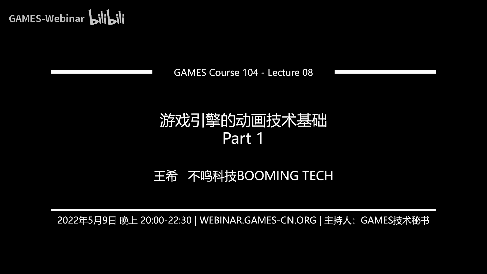
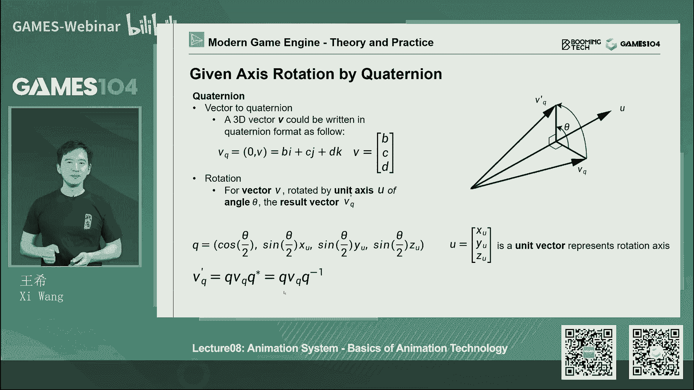
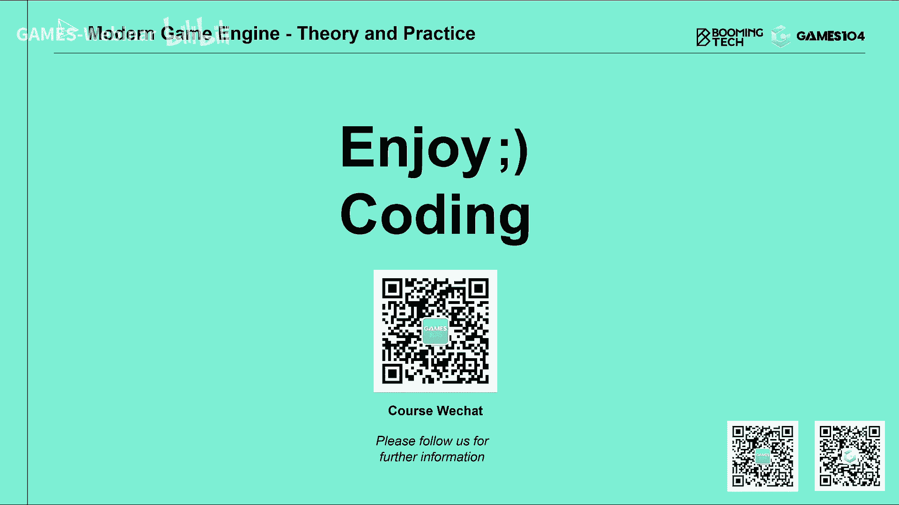

# 08.游戏引擎的动画技术基础(上) ｜ GAMES104-现代游戏引擎：从入门到实践 - P1：GAMES104_Lecture8 -01 - GAMES-Webinar - BV1jr4y1t7WR

Hello，大家好，那个欢迎大家回到games104，有现代游戏引擎的理论与世界，这个刚过了一个五一长假，大家感觉怎么样，休息的是不是好一点，然后我感觉我这个五一长假在那躺着，这个胡吃海喝。

好像吃胖了好多，我觉得大家应该也是每逢过节胖三斤吧，那么今天的话呢开始就是终于结束了，特别挑战的这个渲染这一趴，那我们这这一趴呢就开始讲我们的动画，那今天这个课件呢虽然比较长啊。

但是我个人觉得还是比较好懂，因为动画是蛮直观的，而且也非常的有意思，而且今天这节课的话呢，我会尝试把它最基础的原理给大家讲清楚，所以的话呢动画也是游戏中最重要的一个系统，所以非常值得大家去啊钻进去。

看看它里面有意思的东西，那么首先从动画系统，就是说为什么我们要做动画系统，实际上这个人类啊，在很早时代就开始对动物的东西很感兴趣，因为我们观察到的自然界它都是动作嘛，但是呢最早人类的表达方式只能绘画。

所以但是你会发现就是在几万年前，就是在岩石上，我们的先辈画的这个东西的时候，它都是动感很足，包括在先祖的陶器中，你会发现他画了一系列人物的动态，而不是只是一个竞争，所以那个时候没有投影的技术。

但是我想我们的先祖脑子里面想的，他就是一个动起来的世界，所以我们一直在探索这样的一个方法，那么其实呢直到就是近代，我们人人人类发现一个非常有意思的现象，就是著名的视觉残留的现象。

这其实也是现代所有的电视啊，所有的显示的设备的一个基础，理论的一个基础，也就是我们发现就是说当我们看到一个东西，这个影像在我们的眼里面会残留，大概1/24秒，而这个呢就是所有的电影，电视。

包括游戏以及游戏动画的一个基础的理论支撑，因为我们没有办法真的实现在这自然界里面，那种连续不断的，可以无限细分的这样的一个动画系统，而这里面的话，那就不得不提，我们早期的一个特别有意思的尝试了。

就是这个这个就是叫我们叫西洋景这样的东西，这个东西其实还蛮有意思的，就是以前在大家科学不发达的时候，很多那个我最近看了一部电影，他就讲你们的牧师的话，他就用这种方法，让大家的话呢能看到一个在投影上看到。

一个动的东西，你没有说是一个蜡烛或者什么，一个比较亮的一个东西，然后你会在很暗的地方看到一个洞的小人在走，包括那个小时候在纸上画的那个小人的动画，我记得我小时候读书的时候。

我是经常在这个我的每一本教科书上，都要画一个故事，就一个两个人在打架，怎么样，这个是我小时候最爱的一种游戏了，那么实际上的话呢，这个其实也就是现代动画的一个基础，那么从最早的就是说。

我们的动画的先驱是什么呢，首先是电影行业，可以这么认为，就是说游戏行业的动画的基础的理论，基础的工具都是来自于电影行业，那么从最早的迪士尼动画对吧，2D动画，然后呢。

到后面就是说我们在早期的七八十年代的时候，那时候最早的电影里面开始用了一些动画，生生成的这个虚像和实拍的石像合到一起，那报到后面就等到那个就是侏罗纪公园的时候，那我们的计算机。

动画技术已经到了一个非常高的高度，那个时候当美国的电影院里面，大家看到的那个就是非常震撼的，那个怪兽的时候，大家都觉得非常的震撼，其实今天我们在游戏中实现了很多，动画的效果的话，实际上实际上的话。

我们就在逼逼近这些离线渲染的效果，那包括像阿凡达对吧，达到了一个非常高的高度，我一直在讲，就是当年我看到阿凡达的时候，觉得这确实是我们未来要努力的方向，那么那么这里面呢也要提一个电影，就是那个ZUI。

ZUI的话呢，是实际上这是第一部，完全用游戏引擎实时渲染出了动画片，所以我觉得这也是代表了动画的未来的方向，就是以前我们这动画是个离线的东西，而今天呢变成了一个实时的东西。

那么这些动画的技术它底层到底是什么呢，其实从最早电影里面讲的话，它其实非常简单，它就是2D的，我一帧帧的手绘对吧，把它绘制出来，然后呢到后来的话呢，大家就发现了。

说诶我们可以就是说用那个很多个摄像机拍摄，这个演员的动作，他身上加了很多的marker，就很多的点，然后我通过光学的方法追踪这些点，就能够把人物的动作给给恢复出来，那这里面的话呢。

就是前段时间我也蛮喜欢的一部电影，就是那个战斗天使对吧，那个忘了叫什么战斗天使什么，然后的话呢，他就是你们的人物表现得非常的真实，非常的自然，那么它实际上也在用这样的一个动捕的技术，这个技术的话。

现在我相信在很多同学看到，那个电影的幕后的时候都能看得到，那这些技术的话，实际上也是我们游戏的动画的一个核心的基础，那接下来呢就来了教了我们讲游戏引擎了对吧，因为今天我们这节课不是讲电影节的动画。

怎么做的，我们是讲游戏里怎么怎么做的，但是呢这里面不得不highlight一下，就是我们的老祖宗绝对还是电影行业，那么从最早的，比如说最早期的动画，它其实非常的简单，就是几个几个图片翻来翻去对吧。

在这里面我们不得不提两个游戏，一个呢是就是199几年的这个这个波斯王子，大家仔细看这个波斯王子啊，这里面的那个小人，他的动作你看上去是不是特别灵活对吧，实际上他是用一张张图片做出来了。

那为什么这些人动作看上去那么的鲜活呢，事实上当时这个程序员他为了做波斯王子，他拍了他的弟弟，让他弟弟模仿了里面所有的动作，然后把里面的人物的动作，在那照片上一张一张的抠下来，做成了这个游戏里的相似。

所以在那个时代，波斯王子他的动作确实是非常的自然，你比如看这个小孩子，他一跳一下挂在那个上面的样子，是不是很自然，实际上今天我们虽然讲很高端的这个3D的，基于骨骼的动画技术。

但实际上我们追求的这种自然感，还是来自于真实的人类，而人类对这种自然的真实感的话，是非常非常的敏感的，那么另外一个的话呢，我想highlight就是这个doom对吧，那最早这个游戏的话。

它看上去是不是像一个3D的游戏，对不对，但实际上这个游戏，它完全是用2D的动画实现的，包括你看到那个墙体所有东西给你的空间感，它实际上是通过图片的变形实现的，而这里面的开枪包括怪物被打倒。

实际上是用一组的这个照片，根据你当前的相机角度，它贴上不同的贴片，让你以为你真的在一个3D的空间去渲染，旋转啊，去去去绘制这个东西，这也说明就是人类真的是非常非常的聪明，这也是我们游戏动画的一个鼻祖。

那么接下来的话呢也就是进入了3D时代，看我们开始有显卡了，那从最早的比如说像那个就是生化危机的时候，你看到这里面的人物开始有动画了，但那时候动画你会看到有很多穿帮的地方，待会我跟大家解释了为什么会穿帮。

因为它只是在动很硬的骨骼，到后面的话呢，我们开始用蒙皮动画，这个时候我们可以像一个真人一样的，这个动画看上去就非常的自然一点，但是呢其实这个动画你现在看的还是觉得很土，那到现在的话。

像神海这种越来越真实细腻，就是有既有物理的仿真，又有这个就是啊人物的非常自然的这种动画，那这也是代表了我们现代的游戏，动画的一个高度，所以今天这节课的话呢，我们着重给大家讲的。

就是我们现在游戏引擎的这些动画的一个，一些技术，那么讲到这个动画，动画技术在游戏引擎中的话呢，实际上我们不得不说他有很多的挑战，这个和大家想电影行业不太一样，电影行业我们做动画呢，他很多时候你做好了。

我就一帧一帧的播放给你就可以了对吧，但是在游戏里面他的第一个挑战是什么呢，因为在游戏中我们并不能预设玩家的行为，所以玩家在游戏中会遇到很多的东西，比如说我突然一开始走着走着，我突然决定要跑对吧。

跑的时候我突然一下子，我看到前面有个障碍物要去跳，跳起来之后我觉得有个东西我要抓住，所以其实在游戏的世界里面，他的动画是要和很多game play去互动的，也就是说，我们要这个。

就是说要接受很多来自于用户的输入，同时呢我的动画还受制于游戏的整个环境，比如说哎我跑到一半，我撞到一面墙，这个时候我要表现一个被撞到的动画，或者我走着走着，突然一个怪物把我抓起来，或者把我打倒。

那这些games play的东西，这些物理的反馈，我怎么能够在我的这个动画系统里面，能及时的反应，表现得非常自然，这就是游戏动画系统里面，它相对于游戏电影来讲的话，它的挑战的地方，那么另外一个的话呢。

也就是游戏引擎，我们从渲染那一趴，一直跟大家讲的就是游戏引擎，还有一个很大的挑战是什么呢，所有的东西都是实时的，Everything is real time，就是我想你无论你想了最复杂，最高端的算法。

他永远要在1/30秒里面把它烧完，还记住每一个系统，比如说我们前面讲到的绘制对吧，我们现在讲的动画，包括我们的游戏逻辑，我们的物理，我们的AI，这所有的东西都要竞争那个1/30秒。

也就是30ms的窗窗口，但是呢现代游戏呢，我们又希望这些啊游戏里的角色，他越越做越新颖，而且呢我们希望场景越来越宏大，这事实上给动画系统造来造成了巨大的挑战，因为它的挑战不仅仅是我们算不过来。

还包括什么呢，还包括就是我的动画数据本身非常的大，当我去不停的去取这些数据进行计算对吧，然后这个取来取去，还记得我们在渲染那一趴，讲的就是说当我在内存里面跳来跳去的时候，我的性能也是非常非常低的。

所以呢这也是在游戏引擎里面，动画系统的一个很大的挑战，所以今天我们会讲一个就是动画压缩，实际上也在解决这样的一个挑战，那么第三个呢，也就是说，实际上随着现代游戏的这个就是要求，越来越高的话。

我们对角色的这种自然感和真实度，要求也是非常的高，其实当我们的动画师在做做动画的时候呢，我们一般会预设一个，比如说你在一个无限延伸那个平面上，去做反复循环的动作，但是真实的在游戏里面的话。

你会发现角色他每时每刻都要接受，来自于用户的输入，那他的动作就会变得非常自然，你像那个最右边那个图里面的话，也就是现在在三游戏游戏里面，最火的叫motion matching技术对吧。

它是有很多很多动作融合在一起，让你看起来这个角色非常的鲜活，那包括的话呢，这个角色他还要跟环境进行，各种符合物理规则的互动，我们叫physics based animation。

还有呢更加的难的是什么呢，就是当我们的相机推得足够近的时候，我们就可以看到角色的脸，那时候我们就会进入人类最敏感的东西，叫做表情，实际上表情直到现在，在计算机那个游戏里面，都是一个非常挑战的东西。

你想做的质量很好的话，其实非常的难，这就是动画，我们对realistic的话也在提出越来越高的要求，因为现在大家已经越来越习惯，也就是动啊游戏引擎实现的效果逼近于电影，而且的话呢我们的屏幕也越来越大。

从4K降到8K，将来我们的V2，我们就希望有一个非常high fidelity的，这样的一个虚拟的人物站在我们的面前对吧，那么我们讲虚拟人技术的话，其实虚拟人技术里面最核心的，就是它的这个动画技术，好。

O，这就是游戏引擎里面动画技术的一个核心挑战，那今天的话呢，所以我们今天这两节课，大概可能我争取三个小时左右吧，那能全部讲完两节课，一个一个一节课，一半小时能够给大家构思一下。

就是说动画系统最核心的技术，我们把这个课程呢分成两派，第一趴呢就是今天我们会介绍一些非常基础的，关于动画系统系统的这些技术，也就是说你上完这节课，基本上你能做一个简单的带动画系统的游戏了。

那么我们会从什么时候开始开讲呢，可能会让大家有点意外，我们首先会讲2D的动画技术，为什么，因为我们这节课讲的是游戏引擎，对不对，大家不要认为今天的游戏全3D了。

其实这个星球上最popular的最赚钱的游戏，很其实是2D游戏，那么其实2D的动画技术，也是一个非常重要的技术，然后呢，接下来我们给大家讲一下3D的动画技术，而在3D动画技术，你们的好了。

我们会辟出一个专门的章节，给大家讲的就是蒙皮动画的真正的实施的细节，为什么呢，因为就是说大家提到3D动画呢，其实核心的就是这个蒙皮动画，也就是我们见的最多的游戏里面角色的动画。

但是呢蒙皮动画它的原理讲起来非常简单，但是当你钻下去，当你真的开始去写一个游戏引擎，不是只是简单的调用引擎的时候，你会发现这里面有很多的就是基础理论，基础数学的问题，那么我们今天这节课讲的是游戏引擎嘛。

所以我会跟大家讲一些真正细节的东西，这些东西是很重要，因为它就是动画是这样，你很多时候你认为你懂了，但是你写的时候，如果你对他那个他的基础知识，掌握的不够扎实的话，你可以写出很多的bug出来。

那么第4part呢，就是我们会讲一下动画数据的处理，那今天呢我们讲的是非常简单，但又是非常实用的一个东西，就动画数据是如何压缩的，因为这个也是呃，基本上今天你要如果写个游戏引擎的话。

动画数据是一定要压缩的，否则的话它会有很多的问题，那最后呢我们会给大家介绍一下，整个动画真正生产的pipeline，为什么呢，因为当我们去写游戏引擎的时候啊，你不是只是写引擎里面的那些东西。

你大概率可能会要写很多，3D max maya的这个插件，就是帮助艺术家把动画，导致你自己的引擎所能接受的这种格式，而这里面的话呢，你实际上是要对艺术家的整个动画，素材和数据生产的流程需要有所了解。

所以基本上听完今天第一节课的话，你就能做一个完整的动画的pipeline了，那么第二节课呢，我们会给大家介绍一些，就是相对来讲比较啊高端一点的东西，但这个高端其实也不算是什么啊，就是fancy的技术。

应该也属于现代游戏引擎的标配，比如说动画到底是怎么去blending呢，就是刚才我讲的，就是怎么根据我的游戏的操作逻辑，进行各种合理的混合，包括我们会介绍IK技术点，就是说动画和环境进行互动。

还有呢就是这个你的整个复杂的animation pipeline，还有呢就是说大家喜闻乐见的就是动画书，叫animation graph，它的设计原理，它有哪些节点，它是怎么怎么运作的。

然后最后呢我会跟大家去讲两个，就是说比较有意思的东西，就是说怎么去做人面部的，就是official animation，其实你们会发现就是facial animation。

和普通的形体的动画是两套技术体系，两套完全不同的方法论和技术上，那么最后呢会给大家讲一个比较有意思的，就是说诶我做了一个动画，A动画和这个A角色，我把它的形体变一变，比如说我本来是一个人在走路。

我能不能把它转移到一个大怪兽的走路上面，那就叫做animation retargeting，那这些技术呢就相对来讲，虽然呃就是说比这一第一节课讲的要难一点，但是呢如果你想做一个。

就是说3A级的游戏引擎的话呢，这些也属于入门级的一些技术体系，所以我们动画的两节课的话呢，就会讲一些非常标准的，就是现代游戏性的核心模块，那么其实呢还有就是比较前沿的动物。

比如像motion matching这种东西的话，我们可能会把整个课程上完之后，争取在高级课里面跟大家去讲，那么先在这两节课的话，我们把大家对于动画系统的基础一定要打好。

那如果你将来想成为一个游戏动画师啊，如果你想成为就是游戏的，这个就是说game play的这种这个designer，那么还有game play的programmer。

包括你在想做这个动画方面的这个专家的话，那这节课的内容的话跟你挂相关度会非常的高，那我们就先从这个我们的这个就是2D的动画，开始说下来对吧，那2D动画呢，事实上它也是我们整个游戏引擎动画的鼻祖。

那么最标准的就是我们叫做精灵动画，那其实他他的想法就非常的简单，就是我把游戏里的角色，然后呢把它整个动作一帧一帧一帧一帧，每一帧哒哒哒哒哒哒哒，全部把它记下来，然后呢我在游戏中循环播放。

是不是就是一个很完美的2D动画，其实我们童年的回忆其实全是这样的，2D的动画，我们不知道大家有没有玩过有一个游戏主机，什么任天堂啊，什么小霸王啊，暴露年龄系列对吧，我不知道在座的同学中。

有多少人见到过小霸王的那个机器，那个上面所有的游戏都是这种游戏的欢乐，都是用这个2D动画的技术做出来的，那这里面特别要讲的super maria，我记得我在第一节课。

我听大家讲的就是那个时代做游戏和游戏的人，他根本不需要游戏引擎，它们真的非常的聪明，比如像这只小蘑菇的话，当它开始动起来的时候，它实际上就是一张图，它就是把它flipping左右左右。

把它flak播放的时候，你就感觉到一个小家伙瞪着眼睛向你走过来，所以那个时候真的是因为资源很少，大家做东西还是非常具有想象力的，那么接下来的话呢，就是说我们随着这个计算机的发展，就像刚才我强调的。

像doom的话，他实际上就会意识到说诶，我如果让如何表现这个角色更加生动，我要让她觉得像个3D空间真实的角色的感觉，他实际上就在各个视角去踩了一系列他的动作，然后呢根据你的相机位置。

我在播放不同的spirit的动画，这样给你一种很虚拟的这种3D的感觉，实际上我真的也是非常的震惊，就是在那个时代他们就可以做的这么好，因为我入行的时候就是3D，所以我我我我我是当上这节课。

我在准备的时候，我才意识到，就是说原来doom是用2D的方法去做出来的，那么其实这样的技术啊，它虽然很古老，但是在现代游戏引擎里面，就算是一个很高端的纯3D的游戏，引游戏或者游戏引擎里面。

这个技术并没有完全消耗掉，因为在我们的这个很多游戏中的东西，比如像particle system，我们有一节专门的课给大家讲的就是粒子系统，其实party system，比如说大家看到那种烟和成的爆炸。

它爆炸出来的每个离子，那个离子呢它不是一个静态的一张图，它实际上是一个序列帧，就是你可以看到一个烟球，从慢慢的扩散开来的效果，其实在我们的2D的游戏，在特效系统里面还是非常广泛地应用起来的，一个系统。

而但是呢我们真正的大量的游戏，也就是大家经常那个氪金对吧，就是什么六先充个648的这种游戏呢，实际上是用了一个更高端的2D动画技术，就是我这里面要着重介绍的就是live two d。

当时你真的真的是个非常了不起的一个系统，就是说呃我个人还是蛮喜欢这个技术体系，就是非常简单，但是给艺术家的空间特别大，就是你看右边这个二次元的这个角色，非常的鲜活对吧，他就是用一系列图片通过变形。

通过编辑就可以形成，那这个live two d它是怎么用的，我觉得如果同学们你们如果想做卡牌游戏，想做二次元游戏，如果你没有觉得哎呀，我的预算有限，我的时间有限的话。

我觉得这一趴的话就是你们最关注的东西了，那么拉土地其实他的想法非常的简单，就是说诶我我把一个角色上面的所有的元素，比如她的头发，她的眼睛，她的眉毛变成一个个的小图源，我把这个图片拼在一起。

变成一个大资源放进去，那里面每个图源的话呢，实际上我们通过它的这个旋转放缩，还有呢WARING就变形，WARING呢就是简单来讲，就是你给他套一个框架，你对那个框架各种拉伸的时候。

它在每一个就是那个小的框架里的三角形也好，或者四边形好，它会进行一个叫我们叫做反射变换，然后通过这种变化的话，我就能够把它各种元素做出来，让你觉得很鲜活，那么这个听上去是不是诶真的有这么强吗。

我一看我以前也觉得他怎么可以做的这么好，包括我们有很多大作啊，就是比如说那个像这种所有的二次元的，这个少女这样的游戏，其实都是用这个技术做的，做的真的让我觉得非常的棒，没有想到。

就是就是拥有简单的二级技术就做出来了，那这里面的话呢它的方法其实非常简单，它首先呢会把所有的图源，把它设置设置成各种的深度，然后深度就可以定义，他说哎一会儿出现，一会出现对吧，包括他们之间的层次关系。

当它动起来的时候，互相不会乱，不会穿插，然后呢这里面的话呢，他会把每一个就是你的图片元素，生成一个控制网格，在这个网格上呢，你可以随随机的加入你的控制点，当你对那些点进行移动的时候。

这个图源也就跟着去变，这个就非常的聪明，也就是说当我比如说一个角色，我开心不开心，我的眉毛一会儿皱一会儿，一会儿那个弯下来笑，其实就用这种简单的技术就能实现了，因为二次元的话。

实际上这种表达本身就已经非常的具有表达力，那这个时候那当我就是说怎么去K1个动画呢，实际上你可以想想这么多图源，我一针，我第一个叫k friend，这一帧，我比如说我这一帧这个角色眼睛是闭的对吧。

下一帧这个角色眼睛闭了，再头动一下，再下一帧呢，哎我再摇摇头好，我这三针坐在一起，我把它串起来，一就在这k fk fence中间一帧帧过去的时候，你这时候就看到一个非常鲜活的角色出来。

所以这就是live to d的原理，这个工具，实际上我认为就是他非常符合艺术家的直觉，而且这也是少有几个，就是说不用非常复杂的理解什么3D呀，变化呀，这个什么那个什么三角形啊，这个这个投影啊，矩阵啊。

那么复杂的数学啊，就能做出一个很棒的游戏的，这样的一个一个一个体系，包括像unity unreal，包括我们自己的引擎，我们都会全面的支持live two d，我觉得这个他做的太好了。

我真的没有必要再做一遍，而且就是我我还是非常敬佩，就是说因为这个星球上最厉害的游戏，其实是2D游戏，不是3D游戏，3D游戏很多时候它就是技术上非常复杂，他做得非常真实，但是的话呢从游戏性上来讲的话。

2D游戏真的是王道，其实如果大家经常做引擎的时候，2D游戏引擎也是一个，很值得大家关注的一个方向，因为实际上有些很前沿的游戏游戏引擎的话，他的2D这一块做的非常的好。

而且我们我们也看到一些非常优秀的作品啊，他做的给你的感觉非常的好，就是说这里面其实有很多很有意思的，一些技术在里面好，所以呢但是今天我们的课程的主体，还是要回归到我们的这个104的核心的主题。

就是我们要做个3D的对吧，像阿凡达，像一个很棒的3A级游戏的游戏引擎，所以我们同时重点要放回到，我们的3D的动画技术，那首先第一趴呢我给大家快速的构思一下，如果你的游戏是个3D游戏的话。

你会用到哪些技术，那首先在讲这个3D动画技术的时候，之前呢，我先给大家介绍一个概念叫degree of freedom，就是自由度的概念对吧，指的就是说一个物体，他在这个就是它有多少个自由度。

也就是你可以在多少个维度去变化，包括我前段时间我们在看那个就是很有意思，国内模大厂他出了一个就是VR眼镜啊，是VR眼镜，还是啊对应该是VR眼镜，然后呢它上面有个核心的广告词，叫六D6DOF的这个设计。

让我觉得很多消费者可能看了之后就疯掉了，什么叫6DF对吧，那我接下来给大家解释一下什么叫6DOF，其实对于一个缸体来讲的话，它在整个三维空间运动的自由度，就是六个自由度，为什么呢。

首先它有平移的三个自由度，就是说你可以把它沿着XYZ3个方向去平移，对不对，那么如果你想象一个小方块的话，就你怎么动，它朝着你的方向永远朝着你，背，对你的方向永远背着你，这就是三个自由度。

就是三个degree of freedom，Three dio f，那么但是呢这是个刚体对吧，钢铁还有个能力是什么旋转，其实你会发现它旋转可以沿着三个轴旋转，对不对，我可以沿着X轴。

我以X轴为中心绕着它转，我也可以Y轴为中心绕着它转，我也可以Z轴为为中心绕着他转，所以你会发现在空间中的所有的钢铁，但这里面讲的是三维空间啊，它的整个自由度就是3+3，三个就是这个平移三个旋转。

所以所谓说的很高端的这个六自由度的VR眼镜，本质上就是你可以在这个世界，你可以这样看，这样看，可以上看下看，that's it就是这样了，所以买东西的时候，还是要学一点引擎的基础知识。

因为这样你至少不会被他这种广告词，给给带节奏带走，那么其实我们的整个游戏动画的话，它核心就是基于对自由度的表达，也就是我们去对这缸体的运动的一个表达，那么好，那我们在游戏里面的话呢。

我们做这个3D的动画的时候，其实最基础的就是一个，就是基于一个层次结构的一个缸体的一个动画，它其实非常像我们小时候看的那个皮影戏，就是说我们把角色的每个关节对吧，做成一个可动的东西，当我去动它的时候。

诶那个角色整个就动起来了，那么实际上这个关节呢，它本身会有一个叫树状结构，所以我们叫做hierarchy，就是一层一层的下来，那么其实从最早的古墓丽影开始的话啊。

不不是古墓丽输出那个resident evil的时候，你实际上就可以看到，就是说这些动画的基础，这也是最基础的动画，那个3D的动画系统，但是呢这个女人的话呢，它实际上有一个问题。

就是说我把我的这个mesh的每个地方，跟一根骨骼绑定的时候，当你骨骼动的时候，这些啊mesh它彼此会穿插的，对不对，大家想就像我们小时候看皮影戏的时候，它各个关节之间是不会互相穿插穿插。

所以呢这个时候就是啊，哦这个是一个大家很少见到的一个技术，叫做provilex animation，就是叫顶点动画，这个技术它可能会注意不到，但实际上你们玩的所有的3A游戏里面。

基本上应该都用了这个技术，比如说这边这个旗帜，你看到在游戏中，如果一个旗帜啊，这我们表现的特别好的话，要么他用的是这个物理的动画，要么呢它用的是顶点动画，因为这里面的话，你如果你想表达一个风吹过布料的。

这个效果的话，如果放骨骼，你都不知道要放多少根骨骼，但是呢你索性把它每一个顶点就是它的位置，随着时间的变化把它存下来，这个存下来呢我们一般会存两个texture。

第一个texture呢它的横向轴就是每一个顶点，顶点123456789十，假设你有1万个顶点，那就1万个，对不对，然后呢接下来呢假设你这个动画是有100帧，那我的数轴就是100帧。

我就索性把每个顶点的offset，就是它的平移存下来，但其实顶点一遍的时候，大家会觉得大家就知道它的表面的法向，是不会变，还记得在上一节课里面我讲过，就是说我直接用顶点的位置算法向。

有时候会算出问题对吧，那为了有的时候为了效率呢，我们就直接把他那个，就是因为你顶点的位置变了，在那一帧每个顶点的法向我也存下来，基本上这张图呢，一般我们是用物理引擎模拟出来。

就是我现在离线的把这东西模拟好，然后呢，我存储成这个这个vertex animation的这个texture，那这样我在引擎中就能够展现出非常真实的，这个旗帜的效果，包括下面这个弹幕也是一个顶点动画。

大家想象不到，就是如果我的游戏中的表，表现一个像水流的这种效果的话，假如像这样的效果的话，其实我也是用顶点动画去做的，那么接下来的话呢，也就是说其实哦这是wolf target的。

哎呀我我觉得我接下来讲吧，就是这个其实我认为这是两个，就是后面的技术了，那么wolf move animation呢，它其实也是一种也是一种顶点动画，但是呢他跟那个传统顶点动画不太一样。

就是说它是一个叫顶点影响权重的东西，那这个东西呢它会就是几种不同的key pose，就是每一个顶点的key frame之间去插值，这个东西在什么地方很有用呢，就是说我们在做人脸的时候。

相信很多小伙伴都特别喜欢玩，游戏里面的捏脸系统对吧，我我我，我一直认为很多游戏，它的捏脸系统就是游戏的本体，大家拿到一个游戏的话，愿意花三四个小时去捏个脸，捏个脸，那么其实为什么。

我可以一会儿这个人是个蒜头鼻，一会儿是个高天高尖鼻对吧，大家会觉得我是不是可以通过啊，你们买一根骨骼把它捏一捏，算放一放，是的确实可以这样，但是呢你会发现当你的这种变形过大的时候。

那个脸上的那些五官看上去就不自然了，而那个时候呢，实际上我们很多时候是在各个不同的模，f target的时间来进行插值，我们在下一节课讲这个FISHANIMATION的时候，会给大家详细讲。

而我们这节课呢非常重点的给大家讲的，就是就是就是3D的skin animation，就是蒙皮动画，为什么呢，因为我们在游戏中最多出现的对象是什么，是人啊，动物啊，我们人和动物最大的特点是什么呢。

就是说诶我们表面有一层皮肤对吧，它不会当随着我的身体动的时候，我的皮肤之间会自我穿插，但是呢我里面其实是一个缸体的骨骼，那为什么就是说当我的缸体骨骼在驱动的时候，那么我的蒙皮也跟着动，看上去那么自然呢。

实际上他一个核心的思想，就是说我每一个地，每很多每个顶点它受它影响的不止一个骨骼，而是多根骨骼在一起同时作用，这样的话我能保证，就是说当这个对象运动的时候，它是一个水密性的，叫watertight。

就是他不会互相穿插，那么它比早期的那种钢铁的skeleton，动画的话呢，要做的更好，这也是就是说我们现代游戏引擎，最常见的这个动画模型，那么其实呢就是说如果我们知道了，3D的这个就是蒙皮动画的话呢。

这里面就断开一笔，就是说其实这个技术呢在2D动画里面，现在也有很多人在用，为什么呢，因为它也是一样的问题，就是如果你只是用谷歌去驱动，一个个的小图片运动的话，那这些图片之间彼此肯定会有穿插，对不对。

你看上去就像这个所有的角色，看起来就像机器机器人一样，但是呢其实你用同样的原理，把2D的这个这个角色，也用磨皮动画的方法来做的话，你能看到这个人动的时候，他整个身体和相对自然的去去变形。

所以呢它的技术的原理是一致的，所以说也就是说我们今天在3D的这里面讲的，所有的数学运算，在2D里面也是完全起作用的，那么最后一种的动画形式呢，就是physics based animation。

这个也相对来讲就比较难了，比如说我们怎么去这个这个角色，他一旦受受击了，或者他死亡的时候，它就会进入一个我们叫做ragdoll rock door的，中文叫做布娃娃系统对吧，我相信很多同学都听过。

那么而且早期的时候，布娃系统把人做的跟沙袋一样，但现在的话呢不想做的，就是说，他既有一部分设计师设计的这种animation的感觉，又有整个人摔在地上的感觉，那么还有呢就是说物理的模拟。

它物理模拟的动画最用的最多的地方在哪里呢，就是我们的医疗，我相信大家现在很多小伙伴去玩游戏的时候，你们会非常在意这个医疗这个角色身上的衣料，表达的好不好，但是医疗模拟其实是游戏。

动画或者游戏物理里面最难的一个东西，包括像流体的木那个模拟，那么最后一个呢也是我们在下节课会讲的，就是IK，就是说诶我怎么样的保证我手永远能抓到一点，IK的全称叫啊反向动力学，就中文叫反向动力学。

它指的意思是什么呢，指的意思就是说我给定一个指定点，我的身身体就是这个角色该怎么运动，看上去才最自然，这件事情讲起来很简单，就比如说我在你面前放个苹果，你去抓它这个东西我是不需要训练你的，你天然就会了。

对不对，但是在游戏里面如何让这个动作整个一气呵成，实际上是非常非常复杂的，但大家会觉得这很奇怪，为什么电脑会比人笨，但是你仔细观察一下，你看看小朋友，当他在只有0~6个月的时候，你在他面前放个东西。

它其实是抓不住的，他要练习练习很久，才能够准确的一下子抓到苹果，所以我们人的话，我一直认为是用DEPING的方法，深度学习方法，经过了长达就是以年为单位的训练，终于练就了那种准确的抓取能力。

但今天的话呢我们在游戏里面的话，用什么算法也能模拟出人的这种聪明的话，实际上就是IK这个系统干的事情，所以physics based animation的话呢，实际上也是动画非常重要的一个。

一个一个一个分支方向，那基本上呢就是说呃animation，你在run time就是这些方法，那另外一个更重要也是我们讲的就是animation，Creation，就是如何去创造animation。

对吧，你那么传统的方法有两种，一种就是说我在编辑器里面有我们的动画师，手K动画，我们经常叫手K动画，K的意思是什么呢，叫k free，就是我我我是通过一个月的K分K这个动画，待会后面我跟大家详细的讲。

那还有就是motion capture对吧，就是动捕，动捕的话，现在基本上无论在电影还是游戏中，用的已经是非常非常的广泛了，好那接下来的话呢我们将进入这节课的话呢，真正就是比较核心的。

也是数学比较密集的这个爬，就说我们知道了就是蒙皮动画这个需求，那这个蒙皮动画到底是怎么做的，其实我们顺便把整个动画给大家讲清楚，那首先的话呢我们来跟他讲，就是如何给你一个一个一个一个模型。

我们叫做一个mesh，你是如何让它动起来的，其实讲起来呢他就五步非常简单，第一个呢我们先做一个模型，也也就是一个max在他的bounding pose对吧，那么第二个的话呢我们去做一个骨骼。

这个骨骼呢就跟人类的骨骼一样，它就内嵌在我们的皮肤之下对吧，那么他跟这个这个这个mesh的样子，正好是可以这个align到一起去的，然后呢这个时候我们给它刷上它的蒙皮，对啊，这个具体怎么刷，大家不用管。

就是我们刷上那个蒙皮了，就是给每个顶点说哎你该受哪个骨骼的影响，哪个骨骼对你的影响大一点，哪个骨骼对你影响小一点，听上去也很直觉对吧，第三个就是诶我们的animator，就开始让这个骨骼动起来了。

那你这些顶点不是被我刷了蒙皮了吗，他姐也就也就跟着动了，对不对，其实你想蒙皮动画的原理，是不是就这个原理非常的简单，但是呢，如果你真的开始动手去写这个代码的时候，你看到的情况大部分时候是这样的。

就是你看到那个骨骼诶真的在动了，但是那个角色他就一直傻站在这，或者是整个角色冻就冻飞掉了，其实大家在写这个动画系统的时候，特别是如果这些数学公式没有完全推倒，对的时候。

很多时候我们经常讲就把模型给写炸掉了，就是你本来这个角色好好的放在这儿，你一旦动画你写上去的时候，一般动画我们会在SHADER里面去做，vertex shader里面就是每个顶点要去计算。

经常有一个公式算错了，或者一个矩阵放错了之后，这个模型直接就炸开来了，所以的话呢，这个地方，为什么我们这节课真正的主体，会把这个地方讲清楚呢，因为这就是一切动画系统的foundation。

你把这个就是skinning的，就是蒙皮动画的这个数学和它的实现，整个搞明白了之后，其实你后面去理解IK啊，理解其他的一些动画的时候，其实难度就不大了，所以的话呢，这也是我们今天特别想跟大家讲明白的。

这个这个游戏引擎的基础好，那在讲蒙平的话之前的话呢，首先要跟大家讲三个空间，因为你的所有的计算就是在动画系统的计算，他都是在各自的空间里面的这个东西提上去，是不是有点抽象对吧，我们的空间不是很明确吗。

我的面前放着就是XYZ对吧，这个东西叫什么呢，这个我们叫做worst space，世界坐标系对吧，在游戏里面我们会建立坐标系，就像我在上一节课讲渲染的时候，我跟大家讲过，就是说在世界坐标系里面的话。

我们可以做的非常非常大，可以到一个整个太阳系的距离对吧，但是的话呢对于每一个我的角色来讲的话，实际上我有一个什么坐标系呢，是我自己的坐标系，那大家讲这个时候是不是就表示local坐标系呢，对不对。

哎不对，这个地方我们叫什么呢，叫做模型坐标系，也就是以我自己为中心的，比如说我站在这儿，我面前的这样的一个比如说两立方米的空间，它所定义的样子是我的local space。

那么我的model space啊，我自己都被带跑了，那我的模型坐标系和世界坐标系是什么关系呢，大家记住它不是一个简单的诶平移的关系啊，因为比如说我的朝向可能会变，对不对，我的整个人可能会这样仰过来对吧。

假设你踩在地球表面上，整个宇宙的坐标系的话，它是XYZ，但是你在地球的，比如说45度和南极北极，你的人的朝向是不是都发生变化，当然我只是开个玩笑，一般我们永远会认为我们是头朝上去，站在这儿呢对吧。

所以的话呢，其实从世界坐标系到我的模型坐标系，就发生了一个很大的，就是它就有了刚才教大教大家的那个东西，叫DOF，大家还记得吗，自由度对吧，其实有六个自由度的变化，就是我可能会发生平移。

XYZ我还会发生什么呢，旋转对吧，我沿着X轴Y轴Z轴去旋转，这样能定义我一个唯一的一个空间的，这样的一个一个姿态，讲到这儿已经很晕了，对不对，但是呢前面在rendering的时候。

其实我们也讲了这个概念，就是说你怎么从世界坐标系与模型坐标系变化，然后呢再进行投影对吧，其实讲的就是这个道理，但是呢做动画的时候有一个东西是在模型之上，还有个坐标系是什么呢，我们叫做local坐标系。

这个是有点抽象了，它叫局部坐标系，它指的是什么呢，就是我们在动画里面每一根骨骼，大家想我们的骨骼不是一根一根，一根一根上来嘛对吧，每一根骨骼它自己会发生什么呢，会发生这个平移对吧，会发生旋转。

那么它相对于你的模型坐标系，是不是又发生变化了，而且这个事情很讨厌的地方是什么呢，就是每一个骨骼它的这个标价，它的这个坐标系都是不一样的，也就是说当我想知道，比如说我们举个例子。

比如说我们有个朝向是这个坐标，当你在这个在它的根部，一路往他的手指尖去传递的时候，这个方向就可能发生很大的改变，比如说我现在的手掌的朝向，实际上是由我这个坐标系，这个坐标系，这个坐标系到这个坐标系。

比如整个一起形成的，它就一个一个传递过去，那我的整个动画顺序的表达，实际上很多时候我待会给大家解释，就是实际上是在局部坐标系的，就是local坐标系的，而你把logo图标是一路从它的根节点积分上来。

就是累累累算上来，你才能算成他的模型坐标系，你把模型坐标系考虑到这个角色，他自身站的位置和它的旋转，你才能把它变成世界坐标系，你只有把它变到世界坐标系的时候，这个角色才会被渲染，所以这三个坐标系的话。

是你我们在做动画系统之前，一定要搞得非常清楚的一个一个体系，那这个时候我们理解了三个坐标系的概念，我们就开始给这个角色构建它的骨骼了，那么其实骨骼呢大家可以想就是在角色中，骨骼我们可以任意的去构建。

对不对，但是在游戏的这个这个实践中的话呢，其实我们不会，我们一般对于比如说这个人类人形的物体，我们一般叫做这个BPD对吧，就是两足生物，我们会构建这样的一个，跟人类的骨骼非常接近的这样一个骨骼结构。

对不对，那么在这个骨骼结构里面啊，大家一定要记住，有个点就是它的起点在哪里，我们讲的是个树状结构对吧，大家想想这个缺点在哪里呢，其实一般是在人的胯部，我们叫做papers，就是你的脊椎的最后一根骨头。

那个地方我们叫papers，因为那个点出去之后呢，你会发现它向下就可以分化出你的两条腿，向上就是你的脊椎，脊椎决定你的身体是公的还是直的，对不对，然后呢到你的肩膀一展开诶，它就变成两只手。

所以它的中心点是在那个PIA，就是那个脊椎尾椎骨那个地方，但是呢我们有时候会做一个root放在那边，那么其实这个结构呢对于很多啊，游戏里面大部分应用就是够的，但是游戏里面我们还要做什么。

我们要做很多可爱的小动物对吧，小动物它就很讨厌了，因为小动物是趴在地上的，它叫什么呢，我们叫QUAL派的四足动物，那四足动物的骨架它就又不一样，那为什么我们要把它定义成这种标准的骨骼呢。

因为当我们去生产动画资源的时候，特别是当你去做motion caption的时候啊，包括资源的生产的时候，我们不太可能去生产那么多不一样的资源，如果你的骨骼就这个基础结构啊老是在变的话。

其实动画师他是很难做的，因为它有大量的资源库，如果你的骨骼拓扑老是在变，你一会儿以脚趾头为起点，一会儿以脑袋为起点对吧，那这些动画资源之间就很难复用，所以的话呢这个技术结构也是我们这个行业。

约定俗成的这样的一个结构，那在这里面的话呢，我们给大家clarify个概念，这个概念其实特别容易混淆，包括我们在游戏里面，包括我自己讲的时候，也会经常讲说骨骼，骨骼骨骼，我们用骨骼构建了。

这个这个这个这个这个skeleton，就是股价对不对，skeleton英文的意思就是骨架的意思，但实际上呢在游戏引擎里面，我们并不是真正表达的是五个，我们表达的是什么呢，是joint，就是关节。

也就是说实际上我们存储的，比如说是这个肘关节的数据，因为你肘关节前面连了个缸体的骨骼，所以当你的肘关节发生旋转变化的时候，或者发生偏移平移的时候，你的这个骨骼也会跟着动。

但是我们并不会直接存储骨骼的数据，那我这个肘关节的下一个子节点，就是下一个那个树状的节点是什么，是我的肘关节，对不对啊，这个这个手这个手腕关节，那这个手腕关节前面就控制了我的手掌。

所以实际上在游戏引擎里面我们听到了叫骨骼，骨骼的东西，它实际上是joint，是关节，两个关节之间定义了一个叫做这个这个骨头，但是呢没关系，大家在看，无论是游戏引擎的代码，包括你自己写的时候。

你真的把它写成蹦也没有关系，但是这里面的话呢，我想从数学上跟大家把它定义清楚，其实就是说joint呢它本身是有很多的自由度的，但是呢BM它本身是没有的，因为BM是有两个join的，联合在一起定义出来的。

而且你想啊，为什么说我们存的是join，不是BN，因为joint它是个刚体对吧，它不会被twist，但是呢你想我的骨骼啊，其实像这边的肌肉，我们是可以被twist，为什么呢，假设骨骼不是个钢铁啊。

因为我这边的这个骨骼，这个这个joint在这个地方对吧，这个哎那个这个肘这个地方，这个地方是另外一个一个一个joint，但我这两个join可以这样转，那这个就是这个小B这个地方，它实际上是被扭曲的。

对不对，在skinny动画里面我们也会看到这种扭曲，所以的话这就是BM的表达的，它的不严谨性就在这个地方好，其实呢在游戏中我们构建一个骨骼的时候呢，除了我们讲人正常的要的这些骨骼之外呢。

实际上我们还会加很多很奇怪的骨骼，这个这也是因为，我们今天要教大家做游戏引擎嘛，一般在游戏引擎里面会加很多很奇怪的，额外的骨骼，最最恐怖的时候，我们一个标准骨骼可能也就100多个左右吧。

但是呢我要考虑到这个人脸，我要做很多很细致的表情，我可能又要加七八十个甚至到100个骨骼，很多的细节，这眼睛眉毛的运动啊，比如说大家经常看到眼球的运动啊，我们下节课会讲，他都是用骨骼去驱动的。

然后呢游戏动画对这个人有很多的变形，比如说我们会要给他做个大翅膀对吧，大家想做的那种斗篷，还有这个我手上拿的这个武器对吧，各种各样的变形，这些骨骼呢，实际上都会加到这个角色的标准骨骼上面。

所以当我们想做一个游戏引擎的时候呢，一般首先第一步就要定义一个标准角色的，这个叫标准组合是多少，这个也是我们的ta团队就是技术，美术团队和技术团队最核心的要确定的东西，那么这里面就讲了。

比如说我手上拿了个大斧，那么我的武器实际上是有个叫武器mt骨骼，也就是我手上为了拿了个巨剑，还是拿个大斧，实际上它是mount到你手上一个叫weapon，这个这个这个这个这个joint上面的。

然后这个时候你看到这个，好像看着像两只手拿的武器，但一般来讲呢，很多动画师他是把这个武器单一的绑在手上的，那跟武器骨骼上的，一般我们都是角色用右手拿武器嘛对吧，就是右手骨骼，所以呢。

其实包括人骑乘在一个这个这个生物上面，它会有一个骑乘的这个joint这样一个骨骼点，那么就是说刚才也提到了，就是说我们虽然说很多股价啊，它实际上都是从这个就是尾椎这个地方，叫PVZ开始。

但是在真正的游戏引擎里面呢，我们一般会定义一个叫root的骨骼，root格一般会放定在比如说以人形为例啊，我们会定义它它两脚中间，那为什么这个我要放钉在这呢，大家想想看，比如说我们在游戏里面。

表达一个角色的移速对吧，或者他跳起来了，那你比如说我说这个人的离地高度是0。5米，如果你在这个就是说以PVS那个骨骼来存的话，当这个人蹲在那，或者说在那跳起来的时候，或者或者站起来。

它的离地高度都会变对吧，但是我们关心的离地高度一般指的是它的角，所以呢那个root的骨骼呢反而更加的自然，就是说当我们去决定一个角色的移速啊，他跳起来的高度的时候，我们一般从他root开始。

这就像什么呢，大家喜欢玩手办，对不对，你们无论那个手办摆出各种各样很漂亮的姿势，你发现没有手办，它下面总有一根支架，那根骨骼，那根骨骼是插到你的那个台座上面的，对不对。

那个台座你可以在你的桌子上移来移去，而那个支架插下来的就是我们的root骨骼，而这个骨骼呢其实非常的重要，那么另外一个呢很重要的骨骼是什么呢，就这个就这是一个给大家演示的一个问题了。

就是说假设我们一个表达像四肢动物的话，那么他的PVS骨骼就是它的尾椎骨骼在哪里，他的入睡在哪里，这个地方呢其实非常有意思，大家想象一下，我们一个演员如果想让他扮演一匹小马的话，那他的尾椎在哪里呢。

是不是正好在马的屁股那边，所以呢其实动画师一般会把他的PVS那个骨骼，放到他的尾椎那个地方，但是他的root呢，诶他就很聪明的放到那个母马的肚子下面，为什么呢，因为我现在要表达一个码的位置的时候。

我一般都会以它的中心点那个位置来表达，所以这个地方其实很有意思，就是你会发现，当这些骨骼结构在行业里面约定俗成的时候，它还有它很深的一个道理在里面，就是方便让我们对它的位置的表达，就非常的准确好。

那么就是这里面也讲了一个很重要的概念，就是说我们大家还记得，我们在前面在讲这个就是game play系统的时候，讲到那个object之间是有父子关系的，对不对，但为什么我们需要有父子关系呢。

因为在游戏中啊，有很多动画，很多角色之间的行为是绑定的，所以经典的就是人骑在马上，那这个东西是怎么做的呢，实际上人是播放人的动画，马是播放马的动画，我怎么让他的动画一致呢。

我在人的上面会有一个叫mt的这个joint，这个这个这个这个关节在马的马鞍那个位置，我们有也有一个mt的那个那个那个joint，这两个joint它就重合在一起，这个重合记住啊。

不是一个简单的XYZ空间的重合，还有什么呢，它的旋转重合，也就是说你可想象他那个坐标系，它的轴是整个对接在一起的，大家想象一个卡槽，它不是一个简单的一个点连接，点连接只是位置重合，它是连你的朝向。

就是当马前倾的时候，你人要跟着前倾，马后仰的时候，你要跟着后仰，这样的完美的卡在一起，这就实现了我们的BOUNDANIMATION，其实这个BOUNDANIMATION的话，对于角色来讲非常的重要。

我们有大量的叫做载具，比如说大家经常在游戏中看到的，比如说我开汽车，对不对，那角色是怎么开汽车呢，实际上就是你看到角色展开了一系列很花哨的，比如说拉开车门翻身跳进车里面，你看着很厉害吧。

但是他总有那一帧诶，这个角色的屁股，就绑死在那个汽车的某一个座椅上了，然后呢这个时候车怎么动人呢，就跟着动了，所以这其实就是游戏引擎里面，如何实现这个绑定动画的，而这个呢也是引擎必须要实现这个功能。

它一般会和跟play系统连接得非常的近，所以动画为什么我讲，就是说，如果大家想做这个game play的这个程序开发的话，一定要理解动画系统，因为这是他两个是不可分加的紧密关联的。

这里面的讲一个就是在工业上，我们一个常见的一个现象，就是说其实在早期的时候，我们在做游戏引擎的时候呢，我们会把角色的骨骼，角色和骨骼的绑定，我们用什么呢，我们叫TPOS。

我相信大家能想到TPOS很自然对吧，整个人双臂张开，对不对，但是呢随着现在的商业游戏的发展呢，大家逐渐会发现这个t pose有问题，就是这个角色的这个肩膀这个地方诶，他其实是被挤压的，比如说想象一下。

我要做一个比较复杂的这个角色，这边的肩胛的这种展开啊，变形的动作的时候，那你这边的精度其实就是不够，所以在现在3A游戏中的话呢，我们一般越来越多的用我们叫做apples，就是整个人站的相对自然一点。

那这个地方就会给它相对高的这样的一个精度，这个呢实际上也是行业里面一个一个实践，那么其实呢当我有了这样的一个骨骼，我有了这个mesh之后，实际上当我去动这个骨骼的时候，骨骼它比如说表达走。

当我把这个动作做出来之后，这一个静止的状态叫什么呢，我们叫做一个pose，Pose，这个词大家很熟吧，就是什么就是姿势吗，姿态，比如说你拍照片的时候，我说你摆个pose对，就是你在动画中。

我们一个pose指的就是一针你的镜在这，或者你手举在这儿，这就叫一个一个pose，那我们把很多的pose连到一起的时候呢，我们就会形成一个动画对吧，但是呢这里面在post里面呢，我们要讲一个细节哦。

我这个PPT上少了一行，就是说其实我们在真正的表达一个动画的，这个pose的时候呢，它是有九个自由度的，刚才我讲了一个钢铁的运动，不是只有旋转啊，只有平移和旋转嘛，但实际上呢在真正做动画的时候。

我们还有一个叫skill放缩，放缩在比如说很多动画里面其实是非常有用的，比如说我去做人脸的变形啊，我去做一些，比如说一些角色的弹性的一些变化的时候，我们需要用到放缩，这个呢其实比较简单，我们以后面再讲。

接下来这一趴就是我们今天这节课呢，相对来讲比较硬核的部分，就是真正就是他的数学是什么，在理解这个动画之前啊，你们会发现，就是说，如果我们的动画适用各个关键点表达的时候。

你们想我们手上的关节做得最多的运动是什么，是旋转对吧，这个旋转呢它很难，它就是它有很多的自由度，它不是一个简单的，就是说哎一个轴旋转，它有很多的旋转，我们的我们的人的关节也是设计得非常精巧的。

一个一个一个关节，那么如何能在3D空间表达旋转呢，这件事情还真的是不简单的，那么最简单的这个旋转，就是我们想2D空间里面对吧，我们假设重要的一个角度叫西塔，那他呢有两种表达，就是一个是在角度空间里面。

我们叫C塔角对吧，还有一种呢，就是我们的大名鼎鼎的笛卡尔坐标系，在这里面我们会告诉你说，它的旋转可以用一个向量表达，就是X等于这个R乘以一个cos的阿尔法对吧，Y等于21个sin阿尔法。

这样我就能表达这个一个旋转，当两个宣传，就是我们中学经常学着说诶，当我转完一个阿尔法，我再去转一个贝塔角，那就是扩散，就是阿尔法cos阿尔法加贝塔等于多少呢，我们小时候都学过这个工程的工那个方程是吧。

就我记得我在高中的时候，这个学的就是这个三角函数，我相信大家高考啊一定要背这些，应该是中考啊，中考就要背这些东西了，那么我在大学里面我们学了什么，学了线性代数，对不对，我们就可以用线性代数的方法。

把它的旋转表达表达成一个2×2的矩阵，大家看下面那个矩阵就是哎，它的横轴是cos c的负sin theta对吧，第二第二排就是那个什么sin theta，Cos theta。

然后呢我把任何一个向量XY放进去，我乘上它，它就能旋转，这个是什么呢，这就是二维空间的旋转矩阵，非常的elegant，非常的美，很好看，但是呢这件事情呢，到了三维之后就会变得复杂了。

首先三维空间它的旋转，因为在二维空间大家看啊，它的旋转的轴只有一个，就是绕着它的中心点，对不对，在三维空间的话，它不是轴变成两个，而是一下子变成了三个，你可以要绕着X轴做一个旋转对吧。

你也可以绕着Y轴做个旋转，你也可以绕着Z轴去做个旋转，实际上呢更难的是什么呢，你可以绕着任意轴去旋转，因为没有人，没有谁规定说我一个东西只能绕着一个特定的。

就是跟坐标对齐的access align的方向去旋转，那这个就表达起来就很麻烦了，但是呢数学家证明了，就是说你在这个空间上的任何一个旋转，我可以用这三个轴的旋转把你叠加出来。

那这里面有一个非常重要的一个点，就是说那假设我沿着这个轴依依次沿着X轴，Y轴，Z轴旋转，我沿着每个轴转的这个C塔，那阿尔法贝塔伽马的角度，其实呢我们就可以算出很多个，就是3×3的矩阵。

那么你注意就是说如果我只沿着X轴群呢，你会发现这个旋转矩阵里面的很多项它都是零，对吧，它其实真正有效的是你们的2×2，四个四个因子，其他的那个一和000都是配平的，这个公式大家自己可以推一下。

其实非常的简单，然后呢你就可以把这个旋转，这样的话，当我沿着X轴转一个阿尔法角度，沿着Y轴转一个贝塔角度，沿着Z轴线个那个伽马角度的话，那你把这三个矩阵垒成在一起，就得到下面的那个形式。

那个矩阵看上去很复杂，但计算机写起来是很简单的，然后呢，你把任何一个空间上的那个那个点，或者是方向XYZ带进去的话，你就能算出来它的沿着这三个旋转之后，它的样子，这就是一个典型的什么呢。

我们叫做欧拉欧拉角，欧拉角的话，我相信大家应该在高中的立体几何里面，或者解析几何，你应该学过这个概念对吧，欧拉角欧拉角也是一个很早期的，很经典的一个对三维空间旋转的这个表达，那么欧拉角这个东西啊。

实际上是非常重要的一个东西，比如说你们在这个玩所有的空战模拟游戏，包括你们去玩那个比如说航海游戏，或者说你们真的在开一个游艇，或者开一个飞机的时候，你会知道有个概念叫鸭肉peach对吧。

ya呢就是这个航向角对吧，我们一般传统的用那个FI来表达，那么那个peach呢我们叫做攻角，它指的是飞机在气动力的时候，哎我的这个对空气的攻角，那么就是大家peach这个词，就是这个网上进攻嘛意思。

那么就是比如说飞机失速对吧，他就是个这个屁是角太大导致的这个动力骤减，让飞机在空中就解体了对吧，那roll是什么呢，诶这个飞机这样自己的这个就是往左啊啊腰啊，这样摇摆，就我这样模拟一下，这个很笨拙。

但是基本上能表达这个鸭肉皮吃，其实鸭肉peach呢，它就是一种欧拉角的另外一种话术的表达，它也是其实你可以认为就是现在的导航啊，航空器啊，都是用这个很基础的概念，就是这个这个。

比如说你们要做一个vo vehicle系统，就载具系统，或者是这个就是那个空战模拟系统，这是你最核心的几个概念好，包括我们做气动力模拟的时候，我们也要用这个压轴皮尺这个概念在里面。

那也是欧拉角的一个一个一个典型案例，那么欧拉角呢其实它是有问题的，欧拉角最大的一个挑战是什么呢，之一不能讲的最大的挑战它是有很多问题，我们先讲一个，我自己认为我最讨厌的问题是什么。

就是你对它的计算是严格的，那个叫all the dependency，就是说顺序依赖的，就刚才我讲的就是说它沿着X轴转阿尔法，沿着Y轴转贝塔角，沿着Z轴转那个伽马角对吧，阿尔法贝塔伽马。

但是的话呢你去apply，这个运算的顺序不一样的话，其实你得出的角度是不一样的，大家可以想象我们在里面画了一个图，比如说我先沿着这个，这个就是说X轴转90度对吧。

我在沿着这个就是说Z轴转90度就转出来的，结果和你反过来转的话，它的结果是完全不一样对吧，这就是三维空间的复杂度，你就会发现就是说在二维上面没有这个问题，二维因为你只有一个度，只有零就好了。

这三维你有三个度，这三个度之间的话，它的旋转结果是完全是如果你的顺序错了，它的结果完全不一样，所以说当我们在用欧拉角的时候，一定要约定这个旋转顺序，就是必须是先沿X轴，再沿Y轴，等于ZZ轴。

否则整个顺序就是乱的，那么其实这个欧拉角这个东西啊，在我们的实践中，最有一个最贴近的一个实用价值的东西，就是万向节，万向节其实是非常符合人类对空间旋转，感知的一种表达，那么这里面的话呢。

就比如说在现代游戏引擎里面，其实我们让艺术家来表达旋转的时候，用的全是这个万向节的这个方法，也是个欧拉角，那万元节这个东西它为什么非常有用呢，我给大家举一个，就是大家可能注意不到的东西啊。

我们那个大家拍摄像的时候，有一种叫机头像机头架对吧，就是那个相机放在这，无论你怎么动，他那个朝向永远是对着那个屏幕的方向，这个东西它用的其实就是个万向节的技术，就有三个自由度的旋转，永远保证它的朝向。

包括大家喜欢飞的那个无人机，比如大疆无人机，它那个机头，你的飞机飞的时候其实有很多抖动啊，或者这个方向朝，但是你会发现你的画面总是很稳定，对不对，包括我们现在叫什么微云台啊，这种技术。

它实际上里面用的也是一个变了形的，这个万向节，保持这个方向就非常的稳定，那么另外一个呢也是一个非常重要的应用，是什么呢，陀螺仪，请大家想象一下，就是在没有GPS导航的时代，我们一个导弹打出去。

它是怎么样的不偏航的呢，实际上这里面呢，它有一个高速的旋转的一个陀螺，他这个陀螺呢因为它的惯性的原理，它始终指向一个方向，对不对，但是呢你这个这个导弹它身体它会这样，一会儿上一会儿左，一会儿右，对不对。

他怎么能保证那个陀螺永远指的一个方向呢，哎他这地方就其实就做了一个万向节，而且呢我去测量每一个节点呢旋转的角度，实际上我就知道你这个导弹的话，它的方向是怎么偏的，那么我把这个导弹在沿着时间轴上的。

所有的方向偏的这个方向做一个积分，和它的速度在一起积分啊，那我就可以算出什么呢，我其实就可以算出来它的轨迹，所以这个事情真的很了不起啊，就是就用这么简单的一个原理，就比如说我一根空速管测出我的速度。

再加上一个我的这个方向的积分，我就能够对我的这个导弹进行导航，当然了，那个时候的误差还是很大的对吧，我飞一个1000km，我能误差个几百米，但是这已经非常了不起了，所以其实你会发现就是游戏。

动画里面很多的数学的概念，实际上在真实的世界里面也是非常有用的东西，但是呢万向节呢它其实是有一个小问题的，我们还回归到刚才那个旋转的方程方程啊，你会发现高斯欧拉角的这个表达方式的话呢。

当你把它沿着Y轴转了90度之后，你会发现你因为X轴的旋转，它是这样转，对不对，你的Z轴啊，当你沿着Y轴转了一个就是90度之后啊，你的Z轴实际上转的跟X轴是共轴了。

那你这你这个时候沿着Z轴做的任何一个旋转，实际上它本身是没有太大意义，只有这两个旋转之间，就是我们叫做阿尔法角和伽马角之间的差值，才有真正的数学意义，这是什么呢，这就是我们经常讲的。

就是这个欧拉角的一个退化情况，这个退化情况会导致整个这个模型的旋转，是被锁死了，他就只能沿着那个方向，就就是定死了才转，另外一个呢他会给我们，再比如说我有两个空间上的旋转，我从旋转一到旋转二插值的时候。

在这个地方它就会出很大的问题，这也是欧拉角一个很挑战的一个地方，那么其实奥拉贾的话呢还有很多的，虽然它非常有用啊，我们非常符合人的直觉，其实呢它还有这个几个很两两个，我认为是比较难的问题。

第一个就是说它非常难以去插值，也就是说我给你一个欧拉角的旋转，就是阿尔法贝塔伽马一对吧，我还有一个阿尔法贝塔伽马二，他俩的差值呢，其实不能简单的用他两个线性上去做，因为你如果大家差一下。

你就知道这个值是是错的，第二个的话呢，就是说假设我有两个旋转，一个是阿尔法贝塔伽马，一，有另外一个旋转阿法贝塔伽马二，那他两个假设我按第一次旋转再加叠，加上第二次旋转。

就比如说像刚才我举得我们的动画的例子，就是说我这个关节做完了一个旋转，我在这个关节再做一次旋转，这个旋转比较复杂，我在这个方向再转一下，那最后我问这个手手掌面转成什么样子了，你会发现它不能用，简单的。

就是说阿尔法，贝塔伽马的一和，阿尔法跟贝塔伽马二两个的数学加在一起，他的这个值是错的，所以其实欧拉角的这个旋转的叫做combination，就是叠加实际上是非常的难，那么第三个呢。

也是一个他欧拉角一个最难的问题，就是刚才你会发现我对所有的旋转的表达呢，都是沿着这个就是坐标轴，也就是沿沿着这个xx就是那个X轴Y轴Z轴，但是大家想一想，在真实的世界里面，大部分的旋转。

它并不是严格的沿着空间上的XYZ去做的，举个例子，比如说当我的手是这样的时候，诶，我我可能要沿着这个斜向的这个角度，这个角度可能是呃指向空间的-45度啊，这个60度的这个角对吧。

我这个时候我做这样的一个旋转，大家发现没有，他其实是很很常见的，那我给定一个定轴，就是任意空间的一个app的一个方向的时候，这个旋转就会变得很很难，所以这其实就是说欧拉角呢。

一般来讲我们在给artist的做这个这个，这个编辑的时候，特别是物体的摆放的时候会经常用，但实际上呢在做动画的时候，我们不能用欧拉角，这就是因为欧拉角它本身不好，差值不好去叠加。

而且呢也没有办法很难做定轴运算，所以呢这是欧拉角一个很大的场数学的问题，但是它非常符合我们人的自然认知，所以这里面的话呢，就要引出我们大名鼎鼎的这个四元数了对吧，这个四元数真的是非常非常了不起。

我我在前几节课一直在讲这样一个概念，就是说我觉得我们的人类，一定要感谢这些非常伟大的数学家，当我们遇到一个真正，我们觉得我们要解决问题的时候，数学家一般在100到200年前。

他就已经把数学工具给你准备好了，那哈密尔顿也是一个非常了不起的一个人，这个人应该是个爵士，就是他非常厉害的一件事情是什么呢，就是说他他说那个他的他有次跟这，是他跟他跟他儿子的对话。

他说你的哥哥老是在问我说，对于三维空间的这个旋转能不能像负数一样，就非常简单的通过一些数学的RGB，就是那个代数运算，我就能完成这个旋转的叠加，然后呢就是汉密尔顿老先生呢，就每天在早饭散步。

通过这个桥的时候，都会在脑子里面去想这个问题，直到有一天他过桥的时候，突然产生了这个伟大的想法，叫四元数的想法，所以他去世之后呢，他的家乡人，就在他那个桥上刻了这个这个这段故事。

所以就是他确实是非常了不起的，把这件事情给解决掉，提出了一个叫四元数的概念，那么首先呢什么怎么就理解四元数呢，我们理解四元数之前，首先理解复数还是那个笛卡尔坐标系里面，其实复数它有一个非常好的性质。

就是说对于二维空间的任何一个旋转，那么我可以用一个归一化的一个负数值，就是A加BII就是那个负空间的那个轴，那么那么I的平方等于一这样一个定义，我将能够非常优优雅的表表达两个旋转的叠加。

大家记得刚才三角函数的公式，对不对，那么你发现A其实就是cos thetb，就是sin theta对吧，你这时候来了一个就是那个那个那个那个A撇，B撇，比如说cos伽马，那个3A伽马。

那么那个贝塔加伽马的叠加的话，实际上就可以用下面那个dot production，那个公式就可以完成，而且这个公式的话非常的简单，所以汉密尔顿老先生他就在想说，那对于三维空间的旋转对吧，他一下子多了。

就是比二维空间多了两个自由度的话，那我怎么去表达，那我这里面讲了一个非常粗暴的概念啊，就是因为三维空间的旋转，你是有三个轴，二维空间只有一个轴，所以我再加两个维度行不行，你看复数是实数加虚虚部对吧。

那我再加两个虚部是不是正好四元数，你看我这个解释听上去是不是很有道理对吧，但实际上呢这个解释是非常不正确的，那个我我我我们前段时间大家在研究的时候，我我我自己也做下去才发现。

就是说为什么四元数这东西work的，实际上只有在三维空间的旋转，我用四元数能够表达，你再往上走他就不行了，它实际上是用群论证明了这件事情，就是只有在这种特定的这个这个三维空间的，这个情况下。

你的这套数学方法是work的，但这个就非常的复杂，说实话我都没看懂，我记得我当年想研究一下，就是这个为什么这个好像五次以上的方程，就没有这个这个解析解的时候，还冒死去看了一点群论。

然后直接就被这个无情的教育了一遍，所以这个地方的话我就不带大家入坑了，因为我也没学会，那我当然素颜四元数的原理的话呢，其实是非常非常的elegant，非常的漂亮的，就是说它首先定义了三个虚无。

就是IJK3个序幕，那么我们对于任何一个，就是这个空间上的这个旋转，我们可以尝试用A加BA加C键加DK去表达，所以说大家在游戏引擎里面经常可以看到，CORTANCOTAN指的就是四元数。

那这里面的话呢它的三个虚轴呢，它实际上有一个数学规律的，就是I的平方就是负数，那个轴A等于一对吧，J的平方它也不是在十轴上，所以它的平方也等于一，那么K的平方呢也等于一，但这里面优雅的东西来了。

就是如果I乘积乘K等于什么呢，哎它也等于一，这个时候就很有意思了，我就问既然我知道I乘积乘K等于一的话，那我就问I乘积等于什么呢，这件事情好像很没有定义，对不对，哎这个时候我们就想起了数学的配平原理。

比如说我这里面叫I乘G乘K，我在后面再补个K，然后呢等于-1×2，K就等于负K对不对，那么因为I乘J呢，它的是个K平方，K平方是一，对不对，所以等于说负I界等于负K，所以呢I乘J等于什么呢，等于K。

其实你会发现它三个轴都有这样一个交换力，就是I乘J等于K那个J乘K等于I对吧，K乘I也等于J，这就是数学的优美，就是你定义了它的基础算数数学之后，它的整个一个交换和组合，它就全部定义出来了。

那么我对他的表达呢，一般我们有两种表达形式，一种就是我们三种吧，一般我们会写成，就，比如说哎我可以写成，就是A加IJK的这个这个虚部形式，有的时候呢我们也会用向量的形式去表达。

就是说哎他是一个就是一个一个一列的，四列的向量，有的时候呢我会用一个十步加一个虚部向量，比如说A加V的形式，V本身表达的是BCD也能表达，那么这个时候刚才我们定义了，就是说IJK的他们乘法关系的话。

那当我两个CORTI的乘法怎么定义呢，下面你看到那个矩阵了吗，那个矩阵的话是不是看上去很复杂，但是呢它实际上是非常简单的，就是说你得到了一个叫ABCD的，这个这个第一个containing。

你讲得到一个EFGH的第一个，第二个CONTAINAN的话，他两个乘法，你可以认为就是说A去乘上那个ED啊，就我或到了看嘛就E吧，E啊不对，应该是AA乘上EFGH的一个所有的虚实部。

然后呢他B再一次乘一遍，C在全部乘一遍，D再全部成一遍，然后这里面的话有的时候是I碰到了，有的是I键碰到了，有时候十步和J碰到了，你接下来那一组变换带过去，你发现你得到的就是这个矩阵。

这个矩阵其实是非常的简单，那在课上我不展开了，因为我没有办法就依次给大家推导，但是你会发现它你简单运算一下会非常有意思，它的运算就是那样的一个一个矩阵，而这里面的话呢我们就定义了一个东西。

就是哎这既然是一个空间上的一个某种轴啊，某种某种某种高高维数字，我们在这个无论在线性代数里面，在还是解析几何里面，我们会定义一个它的膜，对不对，那摩的话最长的定义是什么。

就是它的各个维度上的值就是A平方，B平方，C平方，B平方的根号对吧，平方根号也就是A它的膜，那么一个东西呢，它的膜假设等于一的话，我们认为呢它就是一个单位的一个四元数，单位向量。

那么这里面的话呢就跟负数一样的，我们引入了一个共轭的概念，就是说把它的虚部全部变成负数对吧，就是负B负C负C负D，那么其实呢这里面这个公式里面少写了一个，就是说如果我这个四元数它本身啊。

他是这个normalized，就是说是个单位的四元数的话，那么他的共轭就是它的逆，它的逆是怎么定义的，就是说这个四元数按照刚才那个乘法，乘上另外一个四元数，诶，正好等于一对吧，这个逆其实非常有用。

为什么逆就表示了，我假设四元数表达的是旋转的话，它的逆就表示了相反方向的旋转，他这个数学上就是这么定义的，这个概念，大家稍微稍微消化一下，其实呢它的核心原理跟复数非常的相像，但是呢他的乘法。

这个矩阵就是稍微计算步数多一点，那么当我有了这样一个四元数的时候，我们就会发现一个很有意思的事情了，就是这个东西呢大家就理解一下，就是说哎我们用四元数如何表达一个欧拉角，那他就这个汉密尔顿老先生。

就给出了这样的一个定义，这个呢和大家的理解可能不太一样，就是我们天然的会认为它不应该是不是一堆的，这个阿尔法贝塔伽马的这个sin和sin的组合，对不对，但是呢哈密尔顿给出的公式里面的话呢。

哎它都是二分之阿尔法，二分之贝塔，二分之伽马，那为什么他给出了这样的一个矩阵呢，这样呢这样的一个表达呢，是因为当我们用这个CORTI做旋转的时候，比如说我给你任何一个空间上的那个轴也好，坐标也好。

它假设它是这个这个这个就是它是BCD吧，这样的一个位置，那么我假设用CORTANA对它进行旋转的时候，你首先要把这个空间上的三维，变成那个就是COTAN的形式，四元数的形式，你把它的实部呢设成零。

然后呢你把它的这个就是三个轴，三个轴上的投影写到三个事务里面，就是BICJDK，那你对它进行这个表达之后，你的四元数对它进行旋转的话呢，实际上是用Q在第一个Q就是第一个旋转在前。

把那那个就是那个刚才你凑凑出来的那个，四元数夹在中间，然后呢再把他Q的那个me放到后面，记住啊，如果我们再去这个用那个负数去表达，旋转的时候，我只要就是哎，我这个轴承上那个负数就完了对吧。

但是呢你在三维空间表达旋转的时候，前后都要加一个，就是你要乘上它，再乘上个力，其实大家如果在学线性代数的时候，这个很像我们线性代数里面的那个SVD分解，对吧，我中间有一个就有一个有一个有个列。

向量放在中间，我就他叫那个什么叫做矩阵的秩，还叫什么来着哦，不叫质，叫矩阵的那个什么哎，i can lecture对吧，然后的话呢，两边放了一个这个这个这个标准矩阵，那边放个矩阵的逆，其实非常的像。

所以其实四元数，它的很多原理跟矩阵运算是非常非常接近的，那么你把刚才我们在第一节啊，上一次那个就是上一页里面定义的，就是说四元数运算的这个，比如说它的逆是怎么算出来的对吧，逆就是一个标准。

就是一个呃呃normalize的四元数的，他的公恶就是他的逆，然后呢，当这个两个四元数的乘法，实际上是一个矩阵的运算，那么其实你的连城就是Q和q-1的连城，你可以依次算过去，就是矩阵的连城吗。

那这个时候你就会得到一个非常有意思的公式，就是说我的任何一个空间上的，这个这个这个数字在rotation的时候，我实际上呢那个他做算出来就是一个三，一个3×3的矩阵。

这个矩阵因为它有有些项目就消掉了对吧，你只需要知道它的XYZ，那这个就是一个四元数的一个旋转的一个变化，那么这就意味着，就是说你不需要再去算什么sin或sin了，你实际上就是乘上这个矩阵。

这个这个任何一个方向，一个角度都可以被旋转起来，这就是非常有道理，非常有意思的一个东西，那么你有了四元数之后，我对他表达一个反向旋转的时候呢，我只要求它的那个那个叫逆就可以了，逆的话我讲过。

就是说如果他是个为标准化的四元数的话，你就是把他的IJK，整个反应变成负负数就可以了，是不是非常的简单，而呢那个当我有一个旋转QQ1，我还有一个旋转Q2，那我们假设想把一个点或者一个一个做一个。

一个向量，一个方向旋转，按照2Q1Q两次旋转怎么旋转的，其实他那个旋转的四元数呢就是Q1乘Q2，这个里面的话呢就是公式我不展开，但其实你们可以证明这两个事情是等价的，那么还有一个呢比较厉害的，就是说诶。

我怎么第一个就是我假设一个方向A方向，V1方向啊，U我要转的方向V怎么办，哎它其实它的原理是非常简单，我先定义一个W就是它的它的那个轴，大家想想差，首先我把那个U乘上个V叉乘个V啊。

叉成V就找到他那个向外延伸的那个轴，对不对，你想想大家想看两个方向，是不是定义了一个一个面，这个面的话是不是就可以有一个法向方向，所以呢我们用的右手坐标啊，右手原则的话。

我们可以找到一个它往外延伸的那个W的方向，这个时候呢你第一个四表那个第一个四元数，这个四元数呢它的这个就是十部，用这个下面那个公式去表达，就是U点VU点击V加上了开放的这个W点。

W加上那个就是那个优点V的这个平方，这个呢就是它的实物，它的虚部是什么呢，就是W本身就W如果你算出来它是XYZ的话，把XYZ把它放到他的那个，就是那个三个虚部里面去，这个课本身就能够表达。

这个从U向V的这样的一个旋转，它其实是非常的简单，但这里面的话都是有很多数学推导的，因为这节课的话我不想看，因为当时在我在做这个动画系统的时候，我也不会去过于的把这个公式再证明一遍。

基本上这些公式都被这个教科顺序拿过来，我们就可以直接用，而且呢你用完一遍之后，你会发现它用的基本上不会错，那么这里面的话呢就是你有了四元数之后，你想表达，就是说我沿着一个给定轴的旋转，也就非常的简单了。

其实呢他的想法也非常的简单，就是说哎你对于任何一个轴，你要去旋转它的时候，我其实定义了一个那个，一个围绕这个轴旋转的四元数，你会发现它的实部就是这个cos呢，它假如你要撞那个theta角嘛。

它的实部的话呢就是cos的二分之CA对吧，但是呢它的虚部呢是把那个轴的XYZ，放进去了，但是加上了sin的二分之theta，你用这个四元数去预算的话，你去任何一个向量都可以去转得过去。

所以这个你有了这个数学方法的话呢，就是说当我有了空间方向，我从给定了任何一个轴，比如说它是一个不不是轴对齐的轴的话，我其实就可以算出它的旋转了，所以你会发现，就是我们把一个非常复杂的空间的旋转。

包括大量的三角函数运算的这个问题的话，变成了一个非常简单的，就是linear egible线性代数的问题，这件事情其实非常的重要，因为同学们如果自己推导一下，就是说假设我全部用欧拉角。

我假设有第一组旋转就是阿尔法一贝塔一，伽马一，我有第二组旋转，阿尔法二，贝塔尔C那个伽马二，你把它两次旋转的结果，你想用一个叫阿尔法三，贝塔三，伽马三去表达的话，其实非常的难很复杂，而且可能还有多异性。

因为旋转它超过了二派，它不就转了一遍，而且你可以正向旋转，也可以反向旋转，那么这个里面的话呢，就是当你用四元数的时候，它就变得就是一些简单的，没有任何歧义的数学运算，所以CORTA的话。

实际上我认为是哈密尔顿对数学的一个，非常关键的贡献，而且这个贡献的话呢，我认为就是当我们进入了计算机时代，当我们进入了这个游戏的虚拟现实期待的时候，我们对其实他在做那个机械，在做钢铁的时候。

其实各种轨迹计算的时候，也是非常有用的一个东西，好那这就是我们整个游戏动画的一个数学基础，因为什么呢，因为rotation是动画的最核心的一个。

