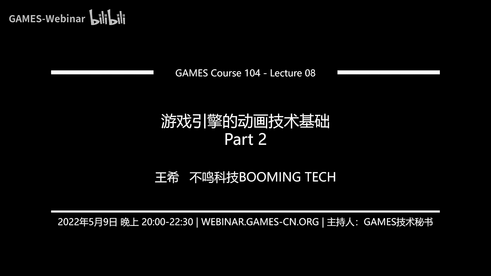
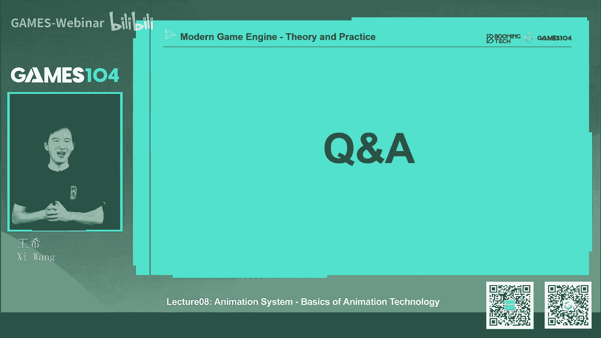

# 08.游戏引擎的动画技术基础(下) ｜ GAMES104-现代游戏引擎：从入门到实践 - P1：GAMES104_Lecture8 -02 - GAMES-Webinar - BV1fF411j7hA

好，那这个时候我们有了这个怎么去表达，rotation的数学基础的时候，我们这时候就可以表达每一个joint它的姿态了，那回到刚才我们讲的，就是说其实joint它首先有一个叫orientation。

orientation这个词呢其实跟rotation呢也很像，但是rotation更平民一点，orientation呢更能表达它叫空间上的朝向，那么空间上的朝向的话呢。

它实际上呃就是说在我的每个joint在任何时候，实际上都是它有各种各样的朝向的变化，这里面有个细节，就是说在大量的动画里面，大量的关节实际上它的运动都是以orientation，就是以旋转为主。

其实如果我们把关节只看它和它的腹部之，间的关系的时候，你会发现他很多时候不会发生平移，也不会发生放松，只有旋转，所以旋转的表达是动画的一个最核心的东西，那么就是说另外一个呢。

joint pose表达就是它的位置，这个位置呢指的就是空间上的平移，这个位置呢像我讲了两个joint之间，其实一般来讲不会变，就比如说我的父joint定在这的时候。

我的子joint他的position一般就是一个常数，不会变的对吧，你的负负骨骼转了之后，我相信的也就跟着转，但是呢在游戏引擎里面这个数值还是有用的，为什么呢，有些特殊的情况。

你比如说我们的人的那个PVS尾椎骨骼，它相对root的话，当这个人蹲在那儿站起来的时候，他的位置position是不是发生了变化，对不对，那么我整个这个角色站立和蹲下，都是要靠这根p vs骨骼顶起来。

所以这个骨骼有很多的平移的变化，那么第二个呢就是刚才我讲了，就是在人的这个表情动画里面，其实呢也有很多的平移的这个变化，还有呢就是在一些特殊的机械结构里面，比如说我们要做一个古代的弩。

弩箭这个弩箭它会拉开松起，拉开松起，那这个骨骼呢实际上也有这样的一个平移变化，但是在其他地方，如果你加了平移变化之后，这个角色看上去就会非常的奇怪，对吧嗯，那么joint这个姿态也是大家比较难理解的。

就是它的放缩变化，放缩变化呢实际上我们一般时候都会用，所以你如果看大量动画数据的话，scale这一项的话就是这个POS数据一般都是一一，大家都不懂，但是呢在在有些场合我们用的还是蛮多的。

比如说在我们的面部的表达的时候，我要做给他做个大眼睛，小眼睛对吧，我做个大鼻头高鼻头诶，这个时候我们会用到它的这个放缩的变化，而且放缩这里面我沿着X轴，Y轴，Z轴的放缩比例可能都不一样。

比如说我想做个阴沟比，还有我想做个很塌的鼻子，这个时候我就会用到它的这个这个，这个这个技术，所以呢这也是在动画中，有的时候我们用到的一个技术好，那其实对于任何一个joint一个关节，它的姿态的话呢。

实际上我们可以把它分解成三个元素旋转旋转，刚才我讲了，他是一个四元数对吧，那任何一个四元数呢，我可以把它展开成一个3×3的旋转矩阵，对不对，那么它的平移我们可以再转换成也是一个啊。

就是那个3×3的这样的一个一个矩阵，我们还有什么呢，还有放缩，那这里面的话呢，就是当我们把所有东西放在一起的时候，其实啊我们可以形成一个，就是这个一个一个3×3的，我们叫做啊应该是3×4的。

一个叫a fine matrix，那为什么呢，因为我们在表达平移的时候，实际上我们要加一个额外的是XYZ，还加上个一，那个一的话就是拼音，但是这里面的话呢就是说这个a fan matrix啊。

实际上它和我们在做那个投影的那个，那个那个矩阵不一样，投影矩阵的话呢，他的那个就是最后你算出来，他那个坐坐标XYZW的时候，你要把X除以WY除以WZ，它除以W才能表表示，这种就是就是透视变化对吧。

但是呢在骨骼动画里面的话，它这个矩阵我们叫做反射反射矩阵，它实际上是一个3×4的矩阵，它下面那个零零内列其实是不需要的，为什么呢，因为它永远是正交投影，大家仔细想就知道他永远是正交投影。

所以这个矩阵呢其实是非常重要的，实际上这也是我们在游戏里面对对骨骼，对顶点进行运算的核心数据系统，那么它的数据语言就是我刚才讲的旋转，我用四元数表达你ABCD对吧，你的你的TRC。

你的translation，你的平移，我用德尔塔XYZ表达放缩呢，我可以用就是那个AAASS，ASBC或者SXXYSZ来表达，我就能表达成一个反射矩阵，到这1part的话，同学们没有跟丢吧。

就是这个这就是你的joint的，表达了最核心的一个矩阵，那这个时候呢，我们当我们去表达一个joint的时候呢，哎这个地方开始有数学符号了啊，他真正的做法。

动画呢我们一般都会存储在他的local space里面，就是说我只会去成相对于他的父亲的这个变化，为什么呢，因为你会发现当一个角色在动的时候，很多骨骼其实是没有任何动画的，或者它只有一点点的旋转。

所以的话呢我们实际上对于每个骨骼来讲的话，我们知道几个概念，第一就是说我自身的这个复骨骼是谁，第二就是说我的这个腹骨骼，它在local space里面到底长什么样，那接下来我要求的东西是什么呢。

就是我这个骨骼，我这个joint我也讲错了，就这个这个关节，它在是在模型坐标，坐标系里面应该是什么样子的，那这个怎么做呢，实际上它是从他的这个根节点开始，一个骨骼，一个骨骼算下来，刚才我们是讲了。

你会得到这样一个反射矩阵嘛对吧，那它具体怎么算呢，实际上哦我们怎么讲了这个interpolation了，哎呀好吧，我先这个地方这个地方我觉得讲的是有点难了，那我先讲一下，就是为什么我们要把这个动画数据。

全部存到这个局部坐标系呢，其实它有一个数学原理的，就是说，当我的动画如果全部存在模型坐标系的时候，我因为我从第一个这个姿态到第二个字，代价是这样，如果我们每个关节点啊，它假设是在世界坐标啊。

在模型坐标系差值的时候，它插出来的动作啊，你的骨骨头它会一会变长，一会变的，为什么呢，因为如果你在模型这边也差值的话，你插出来的是条直线，大家看对不对，他两个位置变的时候。

它它的joint顶点位置它就会变成一条直线，那个骨骼看上去就是诶，就是他是走就是两点之间，比如说我第一针，我的我的我的胳膊在这儿对吧，我的第二针胳膊在这儿，那我的胳膊这个轴脚是不动的话，你发现没有。

你插出来的这个这个两个joint的位置，是不是正好在一个三角形，大家看我们的这个右边这个图就是model spy差值，但这个显然和我们人的认知是不一样对吧，而我们应该真正差指的是什么呢。

是这两个joint，这这这个joint的话，它的rotation，那么这个rotation的差值累积上去的话呢，你看到的就是一个骨骼，在定场的这样的一个旋转，所以说动画系统用局部坐标系进行插值的话。

它是有很深的一个数学原理在里面的，而这个时候呢我们先讲一个最简单的原理，就是说假设我只我的一个点，它只跟一根骨骼关联，记注意啊，一个顶点就是我在模型上的一个顶点，和一个骨骼关联。

大家特别容易搞混的东西是什么呢，我的骨骼，我的joint在这儿对吧，但是我跟他关联的这个这个顶点，在另外一个地方，它们之间是什么呢，还有一个相对位移的，大家仔细想是不是这样的对吧。

那我现在这个joint它本身动了，发生平移，发生旋转的时候，我希望我表皮上的这个这个皮肤，上的这个这个mesh也跟着相应动，这两个之间的数学是怎么去映射过来的，其实比大家想象的要复杂。

那这里面我怎么去表达它呢，其实他在数学上我们可以这么看，就是说对于任何一个顶点，一开始我人在a pose的时候，他呢这个顶点在模型空间，是不是有个有一个位置对吧，我们叫做那个V。

这个V呢我们用上表表达它是在哪个space里面，它在模型空间，mage表示它在模型空间里面，那么他那个B就表示是在绑定的时候位置对吧，那这个时候呢我的这个V啊，就是在那个local space的话。

相对那个绑定的那个那个那个骨骼的话，实际上也是有一个位置叫VBL对吧，那这个时候呢，我相对于我的这个这个绑在绑定的时候呢，我实际上是他那个那个骨骼啊，在mod设备里面有一个绑定，那个joint。

有个绑定的矩阵，刚才我们不是定义了一个FMRX吗，那个绑定矩阵它其实呢要满足一个恒等式，就是如果你这个绑定关系不变的话，当我这个joint的无论在空间上怎么移动，怎么旋转对吧。

我实际上我把我的这个顶点在local space，就相对你那个joint看上去的那个位置，和你一开始绑定的时候，它两个数据是不能变的，大家仔细看我们在这边画的这张图，就是右边这张图就是一开始的话。

在第绑定的时候，假设我们有个logo，那个标价我中间也有一个点，蓝色那个点，它相对于那个标价的话是个固定的位置对吧，当我的这个标价就是local space在被动的时候，再动到T的这一帧的时候。

那他的那个新的那个黄色的点，它在它的两个局部坐标向上投影，是不是要严格一致，否则这就不叫绑定了对吧，所以这样你会出现就是当这个关节在动的时候，这上面的表皮就跟着动，所以你会发现这里面有这样的一个恒等式。

这个恒等式里面有个关键的矩阵，就是说这一根骨骼在它绑定姿态的时候，它在模型坐标系里面的那个transform，就是那个翻译，那个那个那个那个那个叫fine matrix，那个叫什么来着。

哎呀我老是反应不过来，就是他那个叫反射变换的一个矩阵，这个矩阵是它最核心的一个矩阵，而且呢我们要求就是任何时候，当你这个肩关节点动了之后，我实际上我们两个的相对关系不能发生变化，我们只考虑一个。

就是说一个骨骼的情况下，那这个时候呢我们去看一个概念，就是说实际上我们的任何一个点，他在就任何一个关节，它在单位时间T的时候，它的在模型空间的位置啊，实际上你可以认为它从根节点的那个。

模型空间的那个那个那个矩阵一路的垒成上来，这个是没有问题的，就是就是一个transform叠一个穿刺孔，最后叠叠到我的手这个地方的这个矩阵，那么我实际上要满足的，就是刚才讲的那个恒等式。

就是说我的V在任何时候它在模型空间的位置，就是这个顶点变的那个位置，实际上等于什么呢，等于它的那个就是说他在绑定pose，那个矩阵的逆乘上呢，就是说在我的这个model space的时候。

那个那个那个那个joint，他在那个T的那个时刻的反射矩阵乘上呢，我在绑定时候的那个位置的相对关系，就是大家不要这个推导，大家自己可以推导一下，其实讲起来很抽象，但是简单来讲的话。

就是说我在这个顶点在绑定的时候有个位置，我乘上，我在绑定的时候，我这个上我的腹关节的，我绑定的关节的那个就是仿射矩阵的逆，我现在知道我们的相对位置，当你的这个关节这个这个位置呢。

在模型空间已经发生了很多变化的时候，我把这个相对位置再乘上，你这个变化，就可以得到我现在新的模型空间里面的这个值，所以这个值呢是就是我的新的坐标值，就这件事情其实大家经常在做这个东西的时候。

经常会忘记什么事，就把那个逆矩阵乘上去，就绑定的那个逆矩阵，所以我们在计算机运算的时候，在做那个动画的时候，我们一般在每一根骨骼，我们存的就是它的这个叫它的这个逆矩阵，再乘上它的这个。

就是说它当前动的在模型空间的矩阵，这个矩阵叫什么呢，就是我们叫做skinny matrix，skinny matrix就是我们的动画矩阵，就是我给你这个模型上的任何一个点，说只要你绑定。

比如说032号骨骼，你就要找到032和骨骼的这个skinny matrix，你把他在绑定的时候，你原始mesh里面的坐标的XYZ乘上这个sky mamx，就是这个骨架动过之后它的位置。

所以这里面的运算的话是要有把把一个绑定的，一个逆矩阵放进去的，所以这个时候我们去看那个，就是我们怎么去在计算机里面去存一个，股价信息的时候，你们如果看任何一个引擎的实现的时候。

你会发现它除了传我们所知道的，就是绑定的时候，比如说它的位置，他的放松放松一般是一一嘛就不动了对吧，还包括什么呢，还包括他的这个这个就是哦，那个那个那个QUATAN的rotation对吧。

就表达在空间的旋转，实际上它一般会存一个就是这个这根joint呢，这根关节在绑定的时候，它在空模型空间的那个那个那个变化的那个，它的逆矩阵在那，为什么呢，因为我在运算的时候，当我动股价的时候。

我会算出来这个joint的话，在新的动画pose下，它在模型空间的那个就是那个transform，那这两个transform呢，我要把这两个乘到一起，就得到了他的skinny matrix。

而这个SKINMATRIX的话，实际上就是当我知道这，当我在做vertex的这个空间的这个绘制的时候，我把老的这个模meshing的位置，乘上这个skinny的matrix的话，就是他新的位置。

所以这个实际上是，当大家再去做动画系统的时候，一定要牢记这个公式，这个公式是非常非常重要的一个公式，那么我们有了假设我这个人有70根骨骼对吧，那我把对骨骼进行编号，01234567，一直到69~70。

那实际上我算出来所有的这些skinny matrix的话，它形成一个就是pilot，就是一个一个表，也就是说因为我为什么要算这个表呢，其实很简单，就当我正式绘制的时候，我这一个角色身上的顶点输出多少呢。

可能是几万个对吧，那这几但是呢我的骨骼就几十个，所以说呢我不应该在每次算一个顶点的时候，我去再去算这个骨骼应该怎么样，我是要先把所有的骨骼它的位置算好，算好之后呢，我把他的这个就是那个蒙皮的矩阵送啊。

送送算好，那这样的话当我这些顶点用的时候，我就可以重用这些蒙皮矩阵的这些纸，那这个事情非常的重要，为什么呢，因为我们接下来会讲的就是说它这个母体啊，实际上是有很多的权重加在一起的。

那我实际上每一个那个每一个蒙，就是每一个joint这个矩阵会被访问很多很多次，所以必须得一圈算好，但这里面还有一个细节，就是刚才我们讲的就是，我们有三个三个坐标系嘛对吧。

从我们这里面讲的最多的是模型坐标系，但是呢这个模型本身在空间上是不是有位移，所以呢在游戏引擎里面，我们一般呢就是对这个磨皮矩阵的这个PALEA，会把它在世界坐标系里的那个那个transform。

也会乘上去，就是我们会再乘上一个矩阵，就是从模型坐标系向世界坐标系的，这个transform我也乘上去，所以你真正看到的这个skinny matrix呢，应该是就是这样的一个形式。

就是说它最外端是模型向世界的转换，第二个呢是你这个joint就是你依赖的这根骨骼，他在模型坐标系里面，最后它的这个pose是什么，就是它的变化是什么，然后呢要乘上一个，就是你在绑定的时候。

这个就是这个这个joint，它在它在模型坐标系里面的，这个这个这个这个transfer transform，就是变形的这个逆是什么，这三个乘到一起，就构成了我们的一个矩阵的pallet。

这个地方稍微有点抽象，如果同学们听不懂没关系，就是说你可以反复的来回推，因为刚才跟大家讲，就是在这边的公式里面，其实这个恒等式非常重要，也就是说下面那个就是你会它核心讲的道理。

就是说如果我的一个顶点相对于某一个joint，就是某一个关键点绑定之后，无论你撞的怎么动我，我这个顶点所在的新的位置，它相对于你这个就joint，相对于这个空间关系的话永远是不变的。

它其实整个就是用这个恒等去推出来，这个所有的绑定的原理，其实这个恒等的话，你把两边同时乘上一个矩阵的逆的话，你会发现它这个等式就变成了，我们这边的这个等式。

所以的话呢这就是这个就是skinny matrix的话，最核心的两个运算，第一个运算就是上一节上那个上上一个公司，就是说我的每一根骨骼，它是从根节点用local的transform，一路累积上来的对吧。

这个transform要包括旋转，平移放缩一路上来对吧，那么第二趴呢，就是说我一旦一路把他的在模型空间的变形，给他算出来之后，那我对于所有绑定的点，它的新的位置怎么算呢，我要承受你绑定时候的矩阵能力。

再乘上你当前的这个，你在模型空间的那个那个那个那个位移，那个那个那个那个就pose矩阵，然后呢我就能得到你的skinny matrix，这样的话我就能算出我的心的位置，那么我在真正渲染的时候呢。

我再加上一个，就是说你的从模型坐标系向世界坐标系的转换，那么这个时候我才能算出来，那么我们在做引擎的时候呢，我们在数据结构里面，会提前的把它矩阵的逆给存好，为什么呢，因为大家如果学过线性代数。

就知道我给你任何一个矩阵，虽然这个矩阵它是一个正交啊，它是一个就是A翻译矩阵，他的力是可以相对快的求导，但是本身还是比较慢，所以呢我们会提前把它矩阵的逆给求好，那这个就会预先存好。

所以说大家如果想做动画系统的话，这四页是很关键的事业，就是其实做动画系统我觉得就两个数学吧，第一个就是说COTAN的力东西要理解透，第二个呢，就是这个矩阵怎么一步步的去运算过来，这一排要理解透。

基本上你就可以去写这个，我们的这个这个这个动画了，那么接下来的话呢所谓的蒙皮动画，实际上呢它只是在这个基础上，让我们的一个顶点啊，任何一个表面上的点，能够和多个joint同时起作用，就多个关节起作用。

那它这个joint它的原理其实非常的简单，就是加权平均，那么他要求就是说诶我每一个顶点啊，就每一个那个表面上的点，它会和不止一个joint起作用，一般来讲的话呢这个数量它可以不设上限的。

但是一般来讲我们会不超过四个，就是说当我们要求相应的所有受他影响了，骨骼的话呢，它的加权必须要等于一，如果不等于一的话，就会出现很多很奇怪的变形，那么当我有了这个vt sky的话。

我怎么去算出它新的位置呢，其实这个过程呢就非常的直觉和简单，就是说我相对于我的依赖的joint1，我要算出我在模型空间的这个坐标系，对吧哦，我的我的我的新的坐标，我在相对于我的joint的二。

我也算出我的像在那个模型空间的第二个坐标，这两个坐标用一个加权，就是你一开始给的权做个平均就出来了，那这里面有个细节也是非常重要的，就是这个差值呢它必须是在模型空间。

不能够在joint the local space，为什么，因为local space每个joint都不一样，对不对，比如说这是joint的，一是joint的二对吧，那我joint的一转成这样了。

但joint那我还加了个旋转，那这个地方假设我的表皮有一个顶点，有一个有一个点的话，那其实呢我要用这个句型来算出它的新的位置，再用这个卷子算出另外二个位置，然后呢他两个在一起的话。

其实就能形成我们想要的那种twist的这个效果，所以这个是就是大家做真正的蒙皮动画的时候，注意所有的这个就是顶点的这个差值，一定是在模型坐标里做完，不，千万不能在local spss。

local space里面做，LOCPA1做你肯定就完蛋了，它实际上它也差不了好，那实际上呢我们有了这样的一些数学基础的话，我们就可以完全的进行我们的动画系统了，那这里面的话呢。

就是当我们一帧帧的pose做的连接在一起，这个呢我们在动画里面一般叫做一个CLIPSE，就是就是一组动画，我们家就我们或者叫做一个动画，克里斯在中国也不知道怎么翻译，就是说一个动画资产嘛。

就是我一个比一个走路的克里斯，我有个跳跃的clips，我有个跑步的clips，那么就是说真实在渲染的时候呢，其实我们会对他做什么做差值，因为CLIPSE的它一般存比如15帧或者20帧。

但是我们在游戏游戏里面的话呢，我的真的密度是很高，想象一下，比如说我们现在游戏里面一般是多少帧，120帧，60帧，对不对，但我动画资产不可能存60帧，存120帧。

所以很多时候呢我们要在这两个pose之间去插值，那差值呢，其实就是说它能够让这个动画，看起来更加的平滑，那差值呢这边我就讲的比较简单一点，比如说如果我对于我的这个就是位移，对于我的scale。

大家用线性插值基本上就都能看了，但是呢比较复杂的是rotation，那么rotation怎么做呢，实际上那个我们前面讲了quota嘛对吧，假设你一开始的旋转就是第一针的时候。

哎你这个joint的logo是Q1，第二种是Q2，那它的差值呢，实际上就是Q1和Q2的线性差值，再加个什么呢，再加上一个normalization，这样的话你就能得到一个旋转。

就像这个右边的下面这个图一样的，所以这个差值我们叫什么叫安乐，就是normalize，我的这个NERP它就可以旋转，这个呢其实在啊游戏引擎里面用的非常多，就是CORTANA一个很大的好处。

就是说如果你这时候给我的这个欧拉角的话，表达了旋转，或者你给我的是用那个就是矩阵transform rotation，矩阵表达旋转，我给你一个矩阵一和矩阵二是表达两个旋转，我问他们之间怎么插值。

实际上同学们想一想，这个计算其实非常的麻烦的，就是说至少我现在没有想出来说如果不用HOTAN，我怎么去做动画系统，我我我，我觉得就是说哈密尔顿，几乎给出了我们这个行业的唯一解。

那么NNP呢它其实是一个有一个细节，就是说其实角度差值为什么它很复杂，就是rotation的差值，实际上它有一个就是叫最短路径的原则，就是说两个旋转从旋转一插向旋转二人的。

以我们的人的perception的直觉，一般你都要沿着球面最短的路径，这就相当于是比如说你从北京到新疆对吧，你从北京直接飞过去，从北京飞到新疆是最短路径，但是呢你其实从北京往美国飞，然后然后沿着太平洋。

沿着大西洋，再从欧洲整个一路撞回来，你穿过亚欧大陆，你其实你也得到新疆，但是你那个路径是不是，它就是不符合人的直觉了，所以呢在这个地方呢我们加一个小小的运算。

就是说唉我们把CORTANA1dot product的口袋生二，这个值我得到的是大于零小于零，其实这个大于零小于零就代表了，如果是大于零，你就直接插上就好，如果是小于零的话呢，大于180度的角。

你就反向去查查就好了，那这个其实是一个很重要的处理，那这个东西如果你不去做的话，我们在我们在小引擎里面，其实已经做了这个处理，你看的就是这个角色的动画，如果那个你不去做这种最短路径的差值的话。

你会发现在某些时候那个关节会突然做个翻转，但是呢你加了这个最短路径的差值呢，诶他会看上去相对自然一点，所以这是啊小运行一个很重要的一个，一个一个一个属性好，那么在现在3A游戏中的话呢，就是你会发现。

就是说即使有这样的一个cod的差值，它有一个小小的问题，就是说它其实在角度空间中的这个差值旋转，就是你比如说你把它参数从00~11点点的，变的时候，它的速度是不均匀的，你会发现就是他一开始就是到中间慢。

到后面又开始快，它是一个，就是你如果对一个质量要求很高的动画的话呢，你会发现这个东西看上去有点不自然，所以呢现在在三游戏中，大家提出了一个叫SLP的概念，那SROP呢实际上也很简单。

就是说我把两个旋转之间的夹角theta给找出来，他用了一个阿克cos的运算，找出它的theta，然后呢我用那个theta哎一点点的差值，这个效果是比较好的，但是这个差值呢就是第一个它比较费。

它有一个反三角函数的运算对吧，我们都知道在计算机里面进行这种三角函数，特别是反三角形运算，它是很废的，它是要查表的，我不太可能现在在实时的真的去算，我要去查表去算，那么另外一个的话呢。

就是当C塔非常小的时候，那这个就是那个那个因为你用sin theta，就是因为你知道就theta很小，sin theta是不是很小，对不对，那这个你用它做分母，其实这个差值啊，它本身是不稳定的。

所以真正的在我们游戏的实践中呢，一般来讲会给定一个magic number，这个两个CORTAN就是两个旋转镜的夹角，如果它很小，我就不折腾了，用最简单的ENERP差值就完事了。

但是呢如果两个夹角比较大的话，哎我就用SLP，其实这两个方法都比较简单，如果同学们在写引擎的时候呢，我会建议按这个方法实现，基本上你能够达到这一代的这个效果，包括我们的小引擎。

其实小引擎现在我们只用了ENERP的方法，那我们后面的话可能就是说不定出个作业，让同学们写个s lf joint的共同方法，也就能帮助大家理解，CORTI和整个这个动画的这个运算好，那么其实讲到这儿啊。

其实动画的最核心的数学和它的原理，就讲完了对吧，虽然不好意思，我今天又超时了一一小时，38分钟了对吧，但是的话呢就是说呃，确实一个简单的动画系统给大家讲明白了，真的需要这么久。

那么这里面的话呢就是一个简单的动画，Rua pipeline，就是我首先呢有大量的动画的clips对吧，然后呢我们在每一帧都是我CLIPSE，就存在这个角色的各个pose，对不对。

那我就会找的就是它的当前帧和它的下一帧，其实我们这里的frame和post的概念是很相似的，然后这个时候呢，我们就算出它的这个就是interplay，就刚才我们讲的差值算法差。

除它现在真正的股价应该在这个pose，然后这个pose呢我会把它转换成model space里面对吧，我把它算好，算好之后就用刚才我讲的那个数学方法。

我把它算成我们的skinny matrix palate，就是说每一根骨骼表达成一个他的skinny magic，这样的话注意在这一趴的时候，一般来讲我们就会从CPU的运算，像GPU的运算的一个转换。

就显卡运算，就前面这一发传统的游戏引擎里面，都是在这个CPU算完的，但是后面这一盘呢我们一般会交给GPU啊，GPU里面的话呢，在他的word shader里面，我的每一个顶点就是几万个顶点，几百万个。

假设有skinny的这个顶点一般没有那么多了，就可以带ski的对象的话，一般在游戏里面也就是几十个到上百个，那么每一个的话几千个上万个点不同，然后呢他们就开始用这个这些这些skinny matrix。

真的让这些角色活灵活现的动起来，但是呢其实现在的游戏引擎里面，我一般讲叫GPU driven，实际上前面的那部分运算，现在也越来越多的游戏，特别是主流的3A游戏的话。

我们基本上也是全放在GPU里面去算了，因为这个CPU算实在是没有必要对吧，所以这个就是一个非常简单的动画的软弹，PAPI讲到这儿，基本上你的游戏就可以去做了，但是呢你真实的在游戏中啊。

还有一个很常见的一个技术就是动画压缩，那么动画压缩为什么很重要呢，实际上是我们会发现动画数据存储啊，它的数据量不像大家想象的那么小，那我举个游戏的例子吧，就比如说在一个游戏里面，比如说以撸啊撸为例。

我有100多个英雄对吧，每个英雄大概有5~10秒的这种动画，每一个动画呢一秒钟我要存30帧，30帧里面我要存它的这个平移，放缩和旋转的数据，这个加在一起，大家算一下，你会发现就这么一个简单的case。

你的数动画数据量将近两到三个G了，那这个数据量其实不能忽视的，其实现在游戏特别是3A游戏的话，它的动画量比这个还要大，因为我的模型的这个，这个就是因为你比如一个角色，一个动画。

它实际上是有70个70个关节嘛对吧，那70个关节的话，每个关节在每隔三每秒钟要存30个它的pose，每个pose里面又包括它的平移旋转和放缩，所以这个数据量非常的大，但是呢动画数据呢你仔细观察。

你会发现很有意思的特点，就是说其实对于同一个joint，你去看它，它很多数据是不变的，比如说大部分的骨骼，它的放缩是都是一个常数，就是一对吧，那么它的对大部分骨骼在local space看过了。

就刚才我一直在讲，就说哎他的那个就是位移其实也是不变的，对不对，因为我这个这个这个joint，和这个joint之间的位移，只要我这个骨骨头不打断，它一直都是连在一起的对吧，那么它大量的数据是什么呢。

是rotation，那么其实就算是rotation呢，你会发现啊，就是当我们表达很多角色动作的时候，你比如说像他的手指上，当他走的时候，他的手指头不会一边走，还一边捏来捏去，对不对。

很多时候他的手的这个手指头的这些这些，这很多十几根骨骼，它几乎没有什么rotation的动画，然后呢上臂呢虽然有一些，但是呢它的幅度也很小，但是你的大腿一块抬起来，一块放下去。

所以这边的数据它又会又会不一样，所以当我们观察到动画数据这个性质的时候，我们实际上就知道，怎么去降低它的数据的难度了啊，数据的量了，第一种方法呢就是说哎我们对于你那些不变的，那些就是那些track。

我们直接把你干掉，比如说scale，你干掉translation呢，我不要存那个沿时间轴和一串，我只要存一个值就完事了对吧，这个是非常常用的，也是很常见的一个东西，我们很快就能定义说哪些骨骼完全没有。

就是位移变化好，那这个时候这个时候呢对于rotation的话，我们压缩的方法引入一个关键的概念，就是k friend的观念，就是关键帧的概念，关键帧的意思就是说你的整个这个运动啊，这些信号。

其实我可以用一些关键帧别拉出来之后，在关键帧帧之间差值我就能表达，你那这个k phone之间的差值呢其实也非常的简单，它就是跟我们前面讲的MARSHIN的算法，比如说我先选取时间零零作为第一个关键帧。

我就依次往前走走走走走，在走的下个点之间，我们线性差值，当你的就是原始的数值和我差值出来的值，之间的误差超过了一定阈值的时候，诶我就把那个点退回来，把上一个点就输出它的关键帧。

然后再以它为起点再往前插对吧，就是一个martin算法，我永远保证你的error小于我的阈值，那我这个我就可以把原来，比如说几百帧的这个动画变成几十个关键帧，连接在一起的这样的一个动画。

那这些关键帧注意啊，它关键帧和关键帧之间的时间间距是不均等的，这取决于你的信号，在这个时间轴上的变化的频率，但这种差值呢对于旋转来讲的话呢，其实还是不太符合他真实的数据，我们去观察一下。

就是说其实啊在关节的旋转数据啊，即使你表达成CORTINA，它实际上很多时候是一个光滑的一个弧线，那么我们如果用线性差值的话呢，他很多时候表达的误差会很大，很就是你会要加很多的关键帧。

但是线性差值的好处是什么呢，就是在RUNTIME的时候，我计算很复杂很简单，而这里面的话呢就会引入大名鼎鼎的cut more曲线，对吧，卡通木曲线是一个非常经典的一个，就是polynomial。

就是多项式的一个曲线，它基本上就是三阶吧，那么这里面它有个参数叫阿尔法，就是它叫它叫锐度，一般我们只用阿尔法等于0。5，那么你给定任何两个点P1P2，你在他就P1往外延拖一个就是P0那个点。

P2往前拖一个P3那个点，那么你就可以定义的一个叫C0和C1连续的，这样的一个一个一个多项式曲线，这个曲线的话呢，你用这个方程去表达它就是那个曲线，这个曲线的话呢实际上是非常光滑的，很好看。

那么这个呢就是我今天不不不展开了，因为今天课程的量有点大，但是同学们这应该是一个will study的一个problem，基本上你做任何一个东西，你都要用的cut more曲线的。

那么你有了卡拉莫曲线之后，你会发现，我们去逼近一个真实的rotation的信号的时候，我们用的k phone的数量就会少很多，而且呢差值的时候，这个精度也会更好控制，这里面就是一个真实的案例。

就是我们拿了一个真实动画的一个rotation，的一个数据，然后呢用cut more曲线就一点一点的去逼近它，而这个过程的话呢，呃其实它都是离线计算的，所以大家不用担心这个计算很复杂，因为到实时的时候。

你你就你只能看到控制点，你最多只需要拿四个点的数据，用一个多项式计算机就能查出它的值，那么基本上用这个这是整个曲线的差值，那么对于他数值表达呢，我们也不会那么傻，就是说对于它的位移啊。

对于他的这个这个旋转都用那个那个浮点数，浮点数我在前面也讲过，浮点数32位对吧，32个beat，那它的存储量是非常大，压力也很大的，那这里面有一个很简单的方法，就是如果你的这个数字在数值在一个空间的话。

其实呢我可以用一个定点数来模拟你，它的基本思想呢也很简单，比如说假设我知道一个数值，它的范围假设是负，比如说50~120多，那实际上我可以把这个区间啊，把它规划到0~1上面。

这样你在里面任何一个数值的话，我可以比如用16位的这个整数来表达，你如果这个时候你用16位整数表达，你可以发现你可以表达到0。01，甚至更低一点的这个精度啊，更更更密的这个精度，更高的这个精度。

而这个对于很多的数值表达来讲，其实就已经够了，那这里面的话呢，就是说那我们怎么对四元数进行定点化的，这个数值压缩呢，这里面就要利用到四元数的一个，很有意思的数学特性，当我们对四元数进行归一化压缩的时候。

你会发现，虽然每每一个数值都有可能在正一之间波动，但是呢你把那个最大的那个数扔掉的话，其他三个数值啊，它一定会小于正二分之根号二，也就意味着是说，我只需要拿两位的这个哪两个beat存。

是哪一个位是最大值，那剩下的三个那个值的话，我把它存下来，我就可以通过规划反向算法，可以还原整个四元数，这个就是一个非常重要的观察，那这样的话我们在工业上就会发现，就是说你把他的这个虚部的三个量啊。

用大概是15个，就是比特就可以把它表达得非常的准确，所以在工业上我们去压缩一个四元数的时候，并不是傻乎乎的，存了四个float，存了四个float，大家想想它的多大，就是一个float，四个BT对吧。

四个float呢我们要再存啊，16个BT，这是很很废的，但是呢在我们的这个这个表达，你们拿一个四元数，我只要48个bit，48个币多少呢，就是六个BT，就我家大概压缩掉了将近70%以上的。

这个呃对60%多吧，这个额外的空间这个其实是非常的有用，所以动画数据的压缩啊，对于所有的引擎来讲，都是非常重要的一个一个一个东西，那这个的话呢，就是如果我们做一个真正的实战的，游戏引擎的话。

动画数据也是一定要压缩，但是呢做小引擎的时候其实是不需要的，比如像我们的PIO引擎，因为时间紧张，我们也不想搞得太复杂，所以我们的数据是没有压缩的，但是如果你真的要把它改成实战的话。

同学们一定要加入它的压缩算法在里面，那么这里面给大家讲一下，就是压缩其实会带来很多的问题，就是说虽然我每个关节的动画压缩的时候呢，我都把他的error控制住了，但是因为我们的动画是什么。

它是从一个关节传递到下一个关节，对不对，大家用很自然的方法去想一想，这个error会不会一直叫propagation，就是说一直传递下去，也就是说当你在这个地方，前面几个骨骼看的时候。

它的error还可以，但是当你从这个PV，一路传递到我的手指尖的时候，哎这个error就会大得有点离谱了对吧，而大家想想看我们的武器挂在那，武器是不是挂在手上，所以这个时候如果你动画压缩没有做好的话。

你会发现就是压缩完了动画，你手上拿的这个武器啊，他会一直在那抖啊抖啊抖，那这里面给大家举个例子，比如说他最最糟糕的情况是什么呢，就是当你拿了一个长柄武器的时候，你会发现动画压缩，如果我做的不好。

当这个角色做一个动作的时候，比如说我以前做halo的时候，我印象特别深，就是当时那个压缩就是我做的嘛，我做的第一版的时候，那个大块我们拿了一个很长的武器，他跳起来往地上一打的时候。

你会发现那个动画是砸到地上的时候，就开始噔噔噔噔噔在那抖，就跟那个触电了一样，就特别明显，而且包括他另外一只手不是抓着它吗，那个那个那个饼和那个手，他一直是错开来的，就是一直这样就是浮空的。

所以这就是动画压缩的时候，你会意识到，就是说不同的骨骼对于这个error，它的敏感度是完全不一样的，那这里面的话呢，就是我们用一些很简单的方法去定义这个error。

比如说我们去marry他的CORTANA，它的TRANSTRANSLATION，他的rotation呢这样error，但这个error的定义是最简单的。

但这个error呢其实是不符合人的perception的，因为我们动画压缩，本质上是希望你在人的认知上，不会产生这个差距，所以在行业里面，我们一般最关注的是什么呢，是visual error。

就是视觉上的error，那世界的error呢最粗暴的做法是什么，我把模型上的所有的点对吧，用你的动画压缩完，和没有压缩前的数据进行比较，告诉你，这个就是叫我们像素级的差距到底是多少。

大家想想这件事情怎么算，这个这个就算是你对不对，因为我有那么多动画，而且我每一帧都要算我几万个顶点，这不要死人吗，诶这个大家在行业里面，我们一般定义error的方法，实际上是定义两个垂直的点。

就在每个joint的定义，两个垂直点给出一定的offset，那么如果你这个就是特别敏感一点，我这个offset给大一点，如果呢就是它是一个小骨骼或者不重要的骨骼，我的office给小一点。

这个时候其实我用这个方法可以定量的去估计，说哎我的压缩前和压缩后，对于整个这个skeleton它的error到底产生了多少，其实我们比较一个两个压缩算法的好坏的时候，实际上也是用这个方法。

但是呢其实今天我讲的是最简单的压缩算法，实际上这个动画压缩啊，在现代游戏引擎里面，是一个非常重要的研究领域，其实到现在我认为也没有解决的非常的好，那这里面呢会给大家讲一个比较，比较简单的方法吧。

就是这里面的话就是我们会讲的是说，你在你骨架的不同位置的话，他这个对error的敏感度是不一样的，那这里面的话呢就是说有一个简单的想法，也是很直接的想法，就是说既然你的error会沿着我的股价。

一直在往上传递传递传递传递传递嘛对吧，那我上一上一根骨架，假设压缩出来产生一个error的话，我下一个下一个joint的话，我能不能反向的对它进行补偿，这个是不是很符合我们的认知对吧，其实在我们的系统。

比如说这个误差控制或者系统控制理论里面，经常有一种叫误差补偿的原理，就是这个原理，但是呢这个方法说起来是非常有道理的，但是你会发现，当你进行这种误差补偿的时候，实际上那个你本来在你的末端的这些骨骼。

它以前的动画数据啊，是一个非常平滑的低频数据，但是他为了要补偿上面四五跟六七根骨骼，传递过来的error的时候，因为每一个骨骼它的频率不一样，这些频率压缩完产生的error会依次叠加。

结果在你的这个终端骨骼上，会产生非常高频的这个数据，就导致了你的末端骨骼那个压动画压缩，第一个效果很差，第三个呢它会产生很多很奇怪的，这种就很高频的抖动，虽然你看到它的动动作不大，但是你会觉得有点怪。

其实在现在有些很前沿的方法，就是说我会把一些末端骨骼，用一些那个会存在一个单独的，就是在这个模型坐标系的track，这个这个说法叫做forward f i k就是forward and inverse。

conombic animation这个方法，但这个今天我不想看了，因为这个太复杂了，而且今天我的时间又超标了，我已经讲了快两个小时了，所以的话呢就跟大家讲就是动画压缩。

当你们真的在做这个商业级的游戏引擎的时候，这个地方一定要小心，就是说第一个你的数据一定要压缩，但是呢你只要压得不好，或者你的方法选的不对，他一定会产生很多很奇怪的error。

当你的artist要找你的时候，你就会把头发抓破，在想我到底哪一步做错了好，那最后呢就轻松一点吧，就跟大家讲讲这个动画到底是怎么做的对吧，就几页快速给大家讲一下，就是第一个呢就是说我们动画制作呢。

首先呢你要去构建一个mesh，注意就是我们在前面讲过，就是我们的美术在构建mesh的时候，都是那种很高精度的mesh，但是呢那种非常高精度的mesh，实际上做动画做skinny的时候是很麻烦的。

所以呢我们一般会用他的low poly mesh，就低精度的mesh去做他的这个动画，但这里面就有一个细节，就是说我为了保证这个动画的效果啊，在很多的关节的地方，我们的动画师会额外的加几拳的mesh。

这样保证当你去动的时候，这个地方不会变形，所以说你们将来做一个引擎程序员的时候，当一个就是角色动起来的时候，你们会发现他们会在很多关键的地方，会加一些额外的一圈的网格，就像刚才这个视频中。

我们的artist会在他的这个这个这个elbow，这个这个手肘这个地方，我们会加几拳的这个mesh，这个非常重要，那么接下来的话嗯，我们开始给他做股价，其实现代游戏引擎呢已经就，现在工具已经非常发达了。

比如像3D max maya，它有现成的by pad的股价，所以当我们的artist做好了这个APOS或者TPOS的，这个这个这个角色的时候，他可以直接在工具里面拉出一个骨架，然后一个个的把它对上。

这样的话我就可以完成一个，就是我可以定义了一个跟这个mesh相匹配的，这样一个绑定的这样的一个skeleton，而接下来呢也是最神奇的部分了哦，这里面还要再加上一些game play joint。

比如说这里面我要加上他的这个武器的骨骼，对吧，然后呢我会再加上什么呢，我会再加上他的那个PV和root连连到底触的骨骼，因为很多工具，你们的这些骨骼会让需要你自己加，这个时候也是最重要的。

就是它的skinny，那skinny呢是怎么做呢，就是现在很多工具呢它都是自动给你算出来的，就是其实自动的auto skinny，是现在比如说基于深度学习的这些一些前沿的。

这个这个这个这个就是引擎的算法里面，我们很热点研究的东西，为什么呢，因为现在最简单的skinny啊，像很多3D max maya，他已经算的非常好了，但是呢他这个时候算出来的这个skinny。

会让这个人看起来像像橡皮糖一样也很软，所以这个时候呢artist呢需要做一些手动的校正，就是这个地方诶，我希望关节的点在这，那这边的话呢就是这些权重，关节的其他权重不要传的太厉害对吧。

他要手动做一些调整，但这个呢已经比之前要快非常非常多了，所以这个地方我一直用一个词叫pad，真的是那个我看动画生元素的时候，有时候真的像画那个颜色一样，五颜六色的，就是它那个颜色是代表的。

就是每一根每一，比如说每个每一根骨骼，对我顶点影响的权重是多少，好那你有了这个之后呢，其实那个animator就开始做动画，做动画呢其实核心的思想，因为刚才我讲的live two d很像。

就是说它并不会一帧一帧，就是一秒钟做30帧的，那不得了，动画师就下不了班了，对不对，他其实跟LOTOD一样，它只做它的关键帧，设置，每个关键帧之间的时间间隔，当这东西做好了之后，诶这个角色他就能动了。

动起来，那么是这个时候，如果我们我们引擎的程序员干什么，我们要去写它的导出工具，这里面要讲一个细节，就是说大部分动画呢我们就直接导出，但是呢如果他的PVS，就是他的root假设也发生了位移。

这个一般在什么时候会发生呢，就是说比如他发起跳跃的时候，这个root也在变，对不对，那我们会在动画里面root，一般是不会把它这个动画存下来，我们把root单独导成另外一个叫位移曲线，这个曲线给引擎用。

所以呢这个是大家在写引擎的时候，一定要注意的一个小的细节，你有了这些东西的话，基本上一个完整的动画系统就已经实现了，所以呢这也是我们今天课程部分的话，最后一排就是说我们的数据。

最后导致各种各样的那个文件格式，比如说FBX文件格式就是我们常用的一个格式，就是你今天在现代游戏引擎里面，游戏里面看到各种各样的DC的动画，各种精确的表达，它基本上万变不离其宗。

就是用刚才那一整套的技术就能做出来，所以这个的话也就是大家很难想象，就是说我们用这种CORTANA，用这种matrix啊，用这种插值啊，卡特莫这些数据的变化。

最后我们让电脑能够表达出这样一个fancy的，现代游戏的这个动起来的这个世界，所以我个人的话也是认为是动画系统，是一个几乎所有想做引擎，想做game play。

想做这个游戏design的同学都要理解的一个系统，好今天我的课程部分差不多到这儿就啊结束了，接下来呢给大家讲一下，我们的上一节课的小作业，那首先呢首先非常开心啊，就是我们好多同学做完了我们的作业。

然后又真的是很多神来一笔，就是说呃就是PIO引擎，我们一开始呢是没有color grading，大家看起来就这么简单对吧，但是我这边随便取了我们几个同学的作业呀。

比如说我们这个同学就是无所谓同学做的作业，他这个滤镜就做的非常的专业，这个滤镜一看诶，有没有一点那个就是虚幻的感觉了对吧，其实我一直跟大家讲，就是这个所谓的大牌引擎，和一般的这个土鳖引擎区别很大，程度。

我觉得至少有五成以上的区别是在滤镜上面，那么也有同学做的非常的有艺术感，这张我也蛮喜欢的，我觉得哇这个这个很像这个夕阳残雪，就是今天我讲的夕阳残雪，那么当然了，还有一些很神来之笔的，就比如说这个作品啊。

当时那天我收到了之后，我就我就整个惊呆了，就这个同学说哎我是不是做了一个阴间滤镜，这个这肯定是写出了bug，但是大家也看到，就是说这个效果还是非常的魔幻的，假设我们作为一个非常魔幻风格的游戏的话。

我觉得这也是个非常好的一个CD，这也是就是说其实SHADER代码，包括渲染它很有意思的一个地方，就是你会产生很多很有趣的一些效果，那么实际上的话呢就是说我们的引擎系统，这两这两周呢。

我们在做这个进一步的去重新架构，就是说我们发现就是说作业的话，那同学们在里面写的时候，有些系统我们架的还是太难了，就是架的太抽象了，所以呢我们现在对这些系统，最近也在做进行一些升级和清理。

就让他这个逻辑更简单，更方便，同学们，然后加入你们的代码，因为我们是希望就是呃，大家学了这个游戏引擎的这个克制化，一定要做一点点小小的实践，特别是你将来想立志做游戏啊开发和游戏，游戏引擎开发。

那你做了一点小小的代码，其实你为了写那么一个小小的SHADER，你要看很多很多代码，这个时间其实这个过程肯定是比较麻烦的，这绝对比你做一个图形学的一个实验，要麻烦的多，但是的话呢你真的把这些代码。

那个就是看明白的话呢，就是说你会真的掌握引擎，它是一个什么一个系统，包括就是说我们上周的话，大家也看到了，我们开始更新我们的wiki了，第一前两个wiki做的还是比较大，就比较high level的。

就是我们讲一下最基础的数据流，其实后面随着我们的引擎的重构，我们会不断的就是想办法给同学们更新一下wiki，就是说大家如果有什么东西看不懂啊，不会用啊，不要不好意思，这是很正常的。

就是你们就直接给我们提问，因为有的时候我们自己是平时做引擎，做的比较久嘛，我们有时候是没有感觉的，就觉得这东西应该很简单吧，就算大家应该能明白吧，但是等我们开始跟同学们讲课，包括我自己在准备课件。

包括在收到同学们社区里面大家的反馈的时候，我才知道哦，原来这个地方我讲的好像有点超纲了对吧，我们想想怎么把它拉回来，那么所以这个地方的话呢，是一个我们社区共创的这样的一个过程，那么最后呢也给大家讲一下。

这个也要请我们的社区大家一起帮忙，就是啊有同学告诉我们说，我们的PO的那个引擎这个名字太普通了，就是好多引擎很多技术点了，用了这个名字，他说我们那个PIO引擎，因为以后大家用的会比较多嘛。

有可能会被大家说我们侵权了，虽然这个事情我们很委屈对吧，我们也没有任何商业的目的，所以呢后来我们就想了一下，我说要不这样，就大家伙一起这个，麻烦，大家，给我们的相遇琴取一个更好玩的一个名字对吧。

比如我们也是P打头，但是叫一个什么，我们自己造个词觉得很酷，因为这个引擎就属于我们社区的对吧，那就是名字大家一起来取，所以的话呢我们就想了一个投票网站，大家可以在这个周四之前的话。

大家觉得有什么有趣的名字，就直接在里面告诉我们，就在微信群里面告诉我们，然后的话这个社区里面那个扫二维码告诉我们，然后呢我们会在中间呢我想了一下，就是说我们会做一个小T恤，这么一个小的周边的纪念品。

就是我们我们也不要说是选中了谁的名字，我们就给谁奖励对吧，这东西也不公平，每个人取名字都有自己的艺术，我们就随机的去试，十个同学给大家发一些纪念品，那么最重要的是说，希望能争取和大家一起。

给我们的小引擎取个有意思的名字，因为这个这个小引擎的话，真的是可以带给大家，做很多大作业的一个利器吧，而且的话大家真的想引起我们一起摸啊，一起玩的话，大概我觉得就是半年到一年之后。

会有很多同学建立对现代游戏的引擎的一个，基础的认知和基础的结构感好，那这个地方呢也是拜托大家给我们帮忙，那今天的课程基本上就这些了，其实啊虽然休息了一周，但其实我们的课程组的同学们还是蛮辛苦的。

特别是最近我们在对引擎进行一次重构，就希望做的更简单，这里面有好多好多的工作量，包括我们自己连我都在一起跟大家去看代码，一起看怎么去弄好的，那今天就是我课程的全部了，那同学们有没有什么问题。

啊OK第一个同学的问题是说，顶点绑定的关节有数量限制吗，对这个课程我讲过，就是说啊原则上是没有的，你可以绑50个关节，但是呢在实践中的话呢，我们一般只取最多不超过四个，他的原因其实很简单。

就是说如果绑了太多之后，你在计算的时候，那个计算量是非常非常大的，那么你每个顶点都算一遍的话，这个这个就很废了，另外一个就是其实我们对关节，一个角色的关节数量的话呢，一般我们会做一些控制。

比如说最多不会超过255个，为什么呢，因为0~256，是不是正好用一个BT就可以去表达，比如说我我要存的那个绑定的，那个叫joint index的话，我用一个八位的，一个一个一个八个beat的。

这样的一个BT就可以表达，这样的话我存储上，包括数据访问上效率就会高很多，因为这个数据是每个顶点都要存的，所以说对这是有一定限制的，哇这个问题有点难，有同学问我说骨骼和场景碰撞的动画怎么做的。

这个其实是蛮难的，因为其实你你们我们会发现啊，就是很多所谓能和场景交互的，这个就是说这些动画的话，它实际上呢就是我并不是拿一根根，骨骼和场景算，这个其实很麻烦，因为实际上我当我们动物。

一个角色的骨骼的时候，其实我们看到了那个就是这些这些skinny，就是我们看到这个表面的这些模型，实际上只是一个visual的看的东西，它真正和场景互动的是什么呢，是钢铁。

就是我们会做一个richard body的一个顾客，这个我们在物理那怕你会跟大家去讲，就是说比如说我们人身上有75个对吧，一直到星期道小手指小手指，但是呢我们在做它的这个物理的相关的时候。

我只用了其中十几根骨骼，动了一些诶简简单单的圆柱或者方块，然后呢，这些圆柱和方块呢，确实是可以和静态的场景发生碰撞的，比如说我拿了一个刀对吧，我拿了个刀砍下去，这个刀砍到墙上去。

那其实是我刀上在我这个这个joint上面，就是这个关节上绑了一个，就是刚才我讲了拿武器的关节上，我绑了一个他的read body，它撞到那个墙的时候，诶我可以算出来它的焦点在哪里。

这个时候我可以跟沿着你的切割的那个轨道，形成火星，包括就是在很多游戏里面，现在很多引擎里面都是这样，就是说诶你这个人突然打出一拳或者做个动作，但前面有个东西的时候，他这一拳会停止掉。

甚至会变成另外一个动画，那这个里面的话，它实际上不是用那个skinny matrix去做了，他实际上是用的那个叫rigid body，Read the body，会告诉你说我的这个动画放到比如说D。

比如说我这个clips有100个pose对吧，我可能放比如一个攻击动作，我100个pose我可能放到第16个的时候，我就动不了了，因为我已经撞到一个东西了，这个时候我立马切到另外一个clip。

就是我这个这个攻击失败了，我说我这个手很疼，对，所以说这样，他是用另外一套系统解决这个问题的，啊这个同学问我说，MF target的动画和蒙皮动画是不是侧重点，是不是只是侧重点不同啊。

这个呢他两个的方法其实差别还是蛮大的，蒙皮动画呢，你核心动的是它的那个joint或者叫骨骼，然后呢通过骨骼就是一个骨骼可以驱动啊，几十个甚至上百个顶点，所以顶点上其实是不会存动画数据的。

但是more ftie的动画呢，它存的是那些顶点的位置，就是每一组顶点的位置，就是他的一个key friend，然后呢，我我的顶点在它的KF1，K分之二之间进行插值，这就是move target的动画。

他两个的话方法其实非常不一样，就是more发给动画的，更像是我刚才讲的那个vertex animation，就顶点动画，所以呢这个在下一节课的时候，我们讲人的脸怎么做的。

人脸上的表情怎么做的时候会讲的比较清楚，特别是大家特别喜欢的那个捏脸系统，好的今天的时间也比较长了，现在已经是两个小时零五分了，我们又刷了这个课程记录，所以今天的话呢我们的动画的第一节先到这，谢谢大家。

那我们争取下周再跟大家见面。

