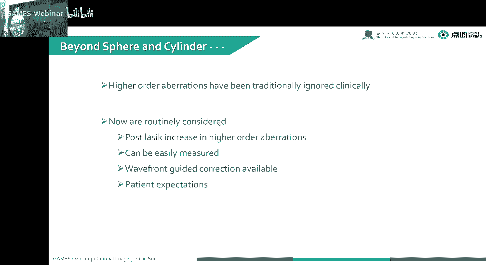
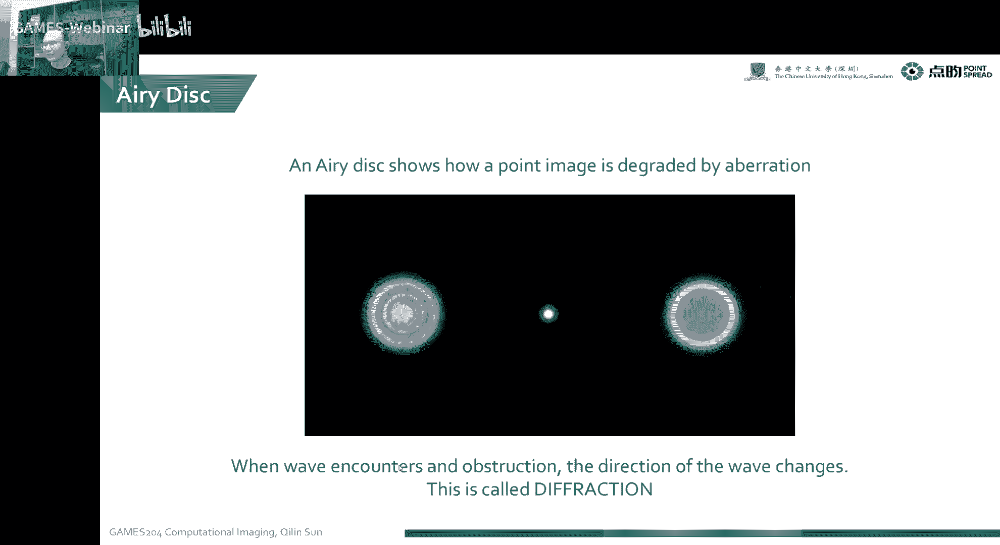
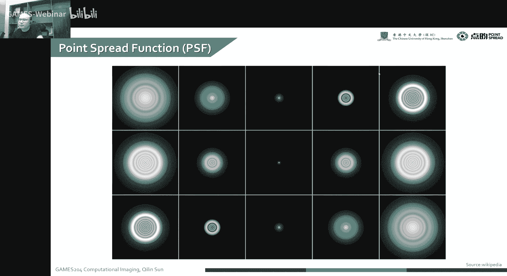
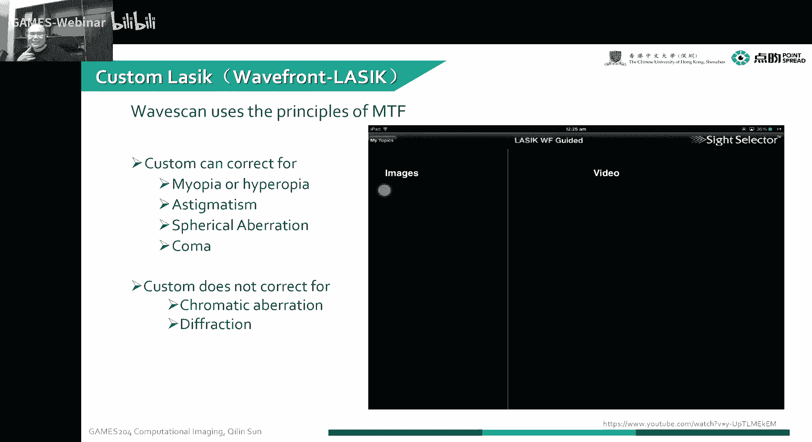
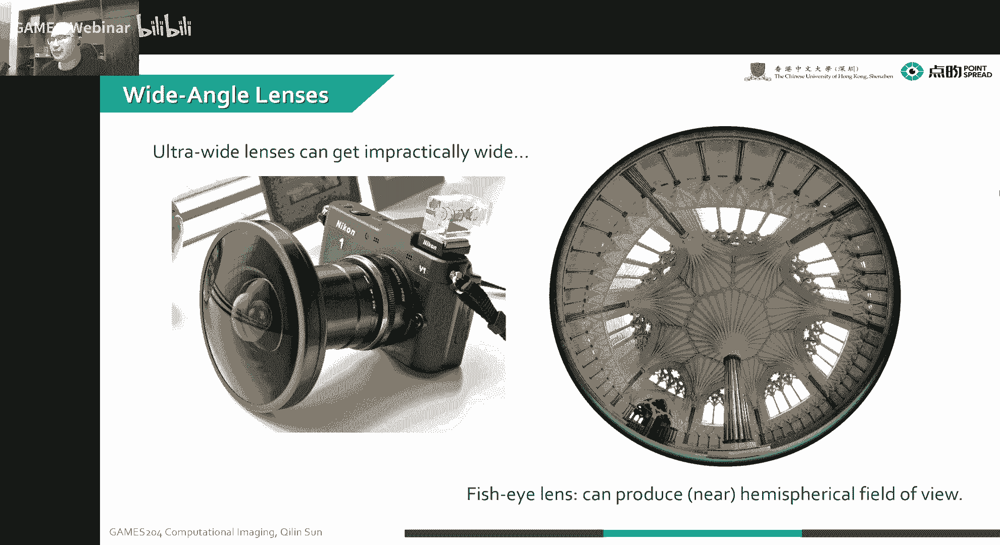
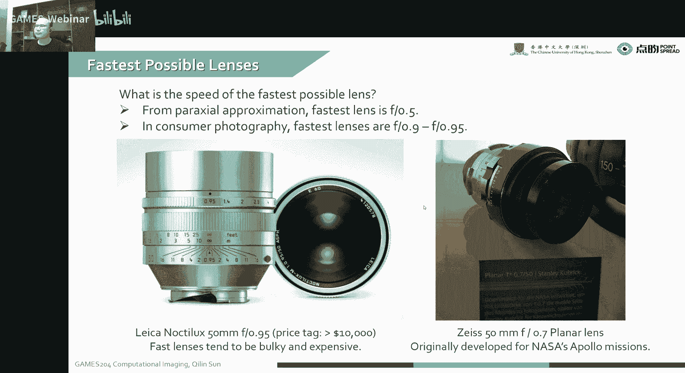
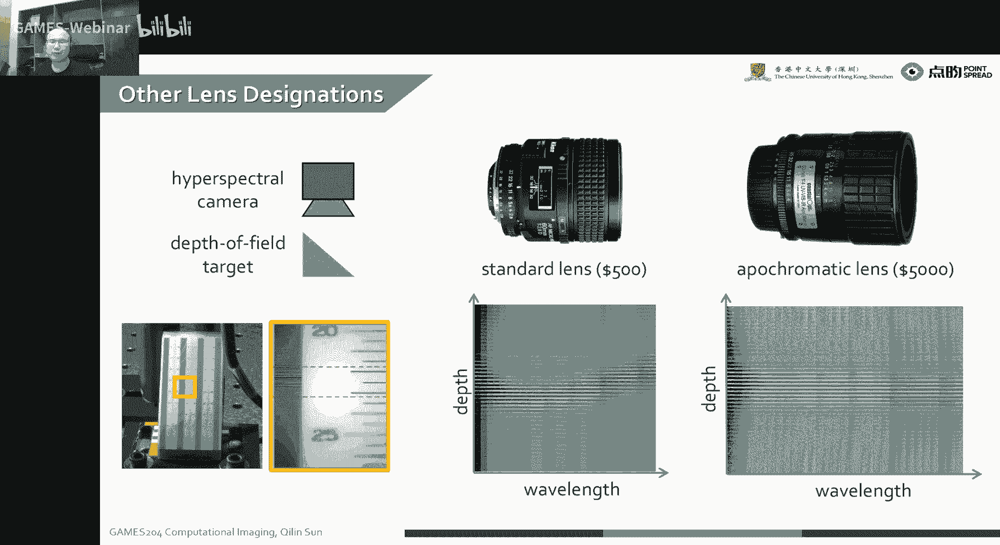
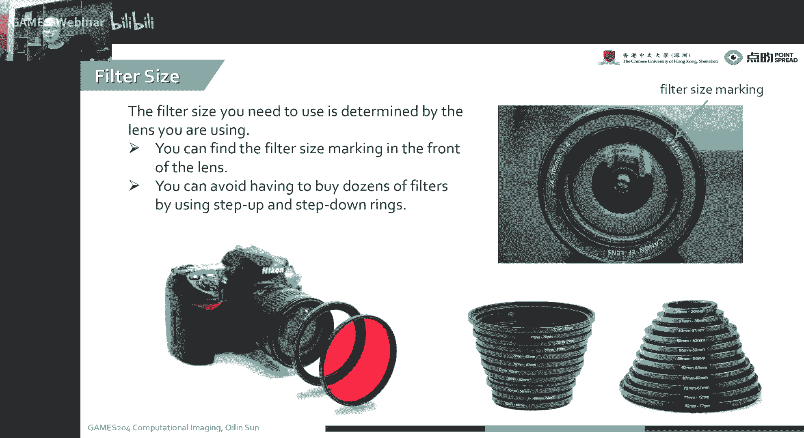

# 09.成像工具箱：波前分析／PSF／MTF和镜头组件 ｜ GAMES204-计算成像 - P1 - GAMES-Webinar - BV1de4y1C7st

那这个好不好使，这个再说好，今天咱就扯到这儿，咱开始今天的课程，就上节课我们讲到了，就是整个呃整个基本的一个光学系统，包括薄透镜模型嗯，像那种还有那种复杂的compound length。

当然最后给大家分析了这个成像的相差，这相差是怎么来的，我们怎么样去消掉这种相差，那今天呢我们就继续上节课的话题，就是我们这个相差是怎么分析的呢，就是我们嗯有一种专门的一种称法。

叫REFANALYSIS的，就是波前分析，目前分析啊里面又涉及到几个概念，包括我们的点扩散函数pbad function，然后跟点扩散函数对应的就是一个线扩散函数，是lspread function。

那有lfire function呢，还有我们要测它的物体的一个就是model，Transfunction，就是我的一个光学传递函数，有时候也叫optical transfunction。

这个时候我们就会用到一个edge spread function，但我们还会覆盖到一些镜头里面的一些，其他的一些光学组件啊，不过像presume呃，像那个嗯nd filter就是衰减片。

好像偏振片等等一些一些一些光学元器件啊，今天将在这节课里面给大家完全的搜，改到就是一个镜头，还有镜头相似的，相差的一个呃纠结的一个终结吧，相当于这节课过后，我们就会进入到下一部分的一个主题。

包括像噪声分析，还有一个呃写上算法的一个入门的一些问题。

这个波前分析呢就是我们分三个部分，包括像点扩散函数，线扩散函数，还有边缘的一个扩展函数，然后在它的频率呢，我们就可以得到一个model transfunction，也就是光学传递函数。

然后我们会再根据这个V方波前的一个分析呢，给出一些像拨弦的分析的应用，我们在从伯克利的王从利老师那呃，之前学到过新造过一些呃，像魏方的申请，也就是波前传感的一个讲座。

这里会给大家讲一些整个不间传导的基本概念，大家有兴趣的话，可以再回去听完这节课，再回去看一看这个未发申请到底是怎么回事，那除了这个播前分析啊，我们也会给大家讲一下这个整个透镜的一个design。

的这么一个基本的就组件，包括像filters presume，像我们单反的一个透镜是怎么构成的，下面我们进入第一个主题，就是we found analysis，就我们之前可以看到了很多相差，包括像球差。

还有像那个slider，就是柱面的一个差，但这个差的时候呃，这这这些东西呢就叫数据相差，我们有时候也会遇到一些他的高阶的相差，比如像二次三次的一个相等相等相差，但是这个时候我们之前就是不太好测量。

这些线长就很容易忽略掉呃，所以说这个时候我们想要啊，比如说我们要做一个准分子激光手术的时候，比如说要做致敬视或者治散光，我们怎么样去测量，就是我们眼睛里面这个相差到底是怎么样子，来给他定制一个三维形貌。

告诉激光，我这个角膜该怎么切呢，那这个呃除了对眼睛里面，这个就是激光手术的一个分析呢，我们还可以用用来去做啊，大气的一个，比如说大气一个扰动，怎么样把图像变得更清晰啊。

这个叫adaptive optics，也是对拨弦波相差的一个分析，我们知道以前学物理的时候，我们学到过拨弦是什么意思呢，播前就是呃，比如说一个点发出了一系列的等相位面，这个时候嗯就叫它一个等相面。

最前面的那个等下面就叫拨弦，但是这个拨弦呢其实我们今天就告诉大家，这个波形到底是怎么测量的。

跟我们的点扩散函数，光学传递函数MTF有什么样的关系，啊讲到这个危房申请，当然也要聊聊它的历史，这we found season呢，在80年代当时提出了一个跟苏联在冷战，这时候就提出来诶。

我们要一个星球大战的一个计划，包括出受到这个嗯，其实那时候也有电影啊，那个star wars，那个电影也是受到这个星球大战计划的影响，来拍摄出来的，当时我们受到想要关注到一个呃，比如说一个行星的时候。

因为受大气的扰动了，就是我们很难拍到一个清晰的图像，比如说像右边这张图啊，这个就是以前就直接，我们通过一个望远镜来拍摄呃，这个是天王星，还是好像我现我忘了来拍摄，可能应该是天王星。

本来是拍摄天文学这么一个图，发现诶这个怎么这么模糊，这个有大气的扰动，有大气的散射，我们怎么样啊，去对他这个来到大气，受大气扰动的这么一个这个一个呃图像，来给他做一个校正。

这个时候大家就发明了一个叫adaptive optics，就是我先对这个播前进行一个预叫声，然后最后再形成一个图像，也就是我对它呃成像的相差，先戴一个眼镜，就是它是当当然。

他这个眼镜是根据本身它测量值来去做一个，adapted的，除了这个大家也经常观测到，比如说天上的星星在闪啊，这个都是受到一些扰动这么一个影响。

然后说这个播前的这个为FCC呢，然后之前有个叫shake htman嗯，因为为什么要check up on，We found sensing，因为最早大概100多年前就有个叫HARTMAN。

这这哥们儿就第一次就想到了，对这个波像差进行分析，然后到了80年代有个叫帅哥，然后中文翻译就叫下课，然后呃在这个他在为了这个美国空军在工作，然后通过呃对哈特曼的一个方法的改进。

然后最后实现了一个在94年呃，呃在就80年代就有了哈，这80年代就实现了一个very fcc，然后量呢在94年把这个会发sensor，就用到了这个人眼，特别是人眼的这个激光手术，去其他的提前测量之中。

然后到了一个90年代末，这个逐渐运用到商业应用里，就是大家今天常见的一些呃准分子激光束啊，还有一些像嗯，我们透镜装配里面的一个装配的一个，拨弦分析的仪器，然后当我们我们知道。

我们一个完全平整的一个平面波，我们假设我拨弦是一个平的时候，这个时候理想的情况下我们会汇集到一个点，就就是我们要通过一个这个一个透镜影响透镜，它会绘制到一个点，但实际的情况我们局限于衍射的一个情况。

这个一个点它往往不能变成一个点，它会形成一个跟我这个口径，我们知道这个相关的一个这么一个班，我知道这个半径是1。2，拉姆达垂D，这个比如说这个艾里斑，然后呢这种现象就叫衍射，这之前我们提到过。

看，因为演示之后呢，我们又有一种概念叫点扩散函数，因为我们图像里面哦在五五空间中的一个点，但我成像经过一个关键系统，成像到一个传感器上，理想的情况下，我一个人一个点，对应的在一个相声选上的一个点。

对不对，但实际上由于本身光学系统的相差的问题，跟演示两种结果共同作用，当然还有镜头本身的缺陷，加工缺陷，也有可能这三个因素的共同作用，我们最后在图像传感器上拿到的，往往是一个非常大的一个班。

那么这一环一环的呢，经常就是受到衍生的影响，而扩散的大小呢就跟口径相关，但是本身这里面还夹杂了，它里面的一个相差的一个关系，共同构成了一个点宽的函数，在我们看到这的一个中心这个位置。

啊比如说像对焦的一个位置的情况下，函数，当我们这个项目就不在，我们对焦的这个项链的位置的时候，我们发现一个点往往会扩散成一个班，这个时候就会到左边跟右边，就是前面跟后面。

后面就会形成了很大的一个点扩散函数，这个时候我们承诺的项就不再信息了，每一个点都会受到这么一个大的一个圆，都会变成这么大一个圆环，最后我们的图像实际上是这么大一个圆环，跟我一个高频信号的一个卷积。

这个时候呃，我们这个点扩散函数实际上就变成了一个呃，一个光学的一个LAPISPUTER，我们把高频都滤掉了，这是我们定义了一下这个pspread function。

我们可以看到就正常的情况下，就这个平方的函数，它就是由中心到边缘，中心的地方非常亮，无论是受到衍射呀，还是就这个相差的一些影响，我们中心的地方，往往它的能量是比较高的，到了边缘它会急速下降。

然后衰减到一个我们可以忽略到忽略不计的值，啊右边这个是一个实际拍摄到了一个顶峰的函，数的每一个图层，这个点扩散函数呢，呃经常是用来去衡量我们实际的一个就物理，就是光学的一个分辨率的这么一个东西。

就是我们两个就点之间到底能不能分开，这个就决定了这个它的分辨率，而且这个点换函数呀，它不一定是对称的，比如我们考虑到会差的影响会差，再加上衍射，最后我们形成了这么一个呃不对称的，一个典范的函数。

也是非常常见，特别是在大市场的这么一种情况下，也就是说就是我们最后拿到了呃，我们最后一个相机好，在不同深度，不同视野的情况下，我实际的一个光学的分辨率是不一样的，所以说啊大家注意到这个问题啊。

一个相机它的各个地方的一个真实的分辨率，也可能也是不一样的，而且他特别容易受到，就整个视野就是各个中心市场边缘市场，还有各个呃深度之间的一个影响，这都会影响到它整个的一个光学分辨率，然后呢，对应的。

我们再把这个点扩散函数做一个复制变换，我们做变换到频域，然后实际上就我们就拿到了一个modulation，Transfunction，也就是它的一个光学传递函数，这实际上也就是它在频域的一个响应。

MTF呃，也是用来衡量，我最后实际上就是衡量最后这个光光学频率，能传通过这个光学系统，它还剩到了一个多少的一个比例，这么一个函数，后面我们会仔细讲到，这个简化函数跟MTF到底是怎么回事。

要说到点扩散函数，我们就我们要比如说我们要测量一个就MTF，不得不说一个概念，就是一个线扩散函数，这个线扩散函数是啥呢，它实际上就是我我一一根线，它上面有好多个点，每个点都会产生一个点框的函数，对不对。

然后跟这根线做一个condition，实际上我们就最后拿到了右边的这么一个线，框的函数，就是A作为一个很薄的一个薄片，一个墙，我最后会散开成什么样子，就一个冲击函数，还要乘一个线。

然后最后变成了一个线扩散函数，而我们这个关于传递函数一般是怎么测量呢，就是我们呃去如何去评估，这么一个光学系统的光学传递函数，那比如说像我们可以看到啊，我没有我的图像，就是这样黑条一个黑条。

一个白条间隔分布的，当我们通过一个透镜之后，哎我发现这个边缘好像变得不是很锐了，对不对，我们会有一定的频率损失啊，实际上就是我们变化到这个强弱，黑白就是零零值跟最高的值。

它的本身那个contrast是百分之百，对不对，我经过关系统之后，也发现很多频率损失了，我们在这个正式这个方波，他频率损失之后，比如说变成一个正弦波，因为我刚学传递函数，很多高频传传不过去了，诶。

这个时候我的一个contrast，就最高比最低的值变成90%了，对不对，这个时候我们这个我们定义这个modulation，TRANSFUNCTION是M，就是我们最后在图像上拿到了一个。

最大的一个对比度，实际上这个图像的一个呃最大值减最小值，比上一个最大值加最大值就是它的一个对比度，contrast就是它的一个AUDIVATION创作方式，我们叫它modulation。

他的传统function，实际上就是我们最后ME这个modulation，输出的modulation跟输出的modulation，这个也就是它对比度的一个对比值，就是它的一个就是MTF。

在我们实际的测量中，我通常会拿到这么一个这么悬的一个波纹，的这么一个测试版，测试版有各种各样不同啊，空间频率分布的这么一个SN的条纹也好，是黑白的条纹也好，我通过这么一个分辨率卡。

我们可以测到我们就输入的一个modulation contrast，跟输出的motivation contrast，他们的比值，实际上最后就是拿到我们的FMTF值，是MTF呢。

实际上又是这个点扩散函数的一个，物理意义上就是点扩散函数的一个数列变换，就是它的频频谱，我们可以很容易地想象到，我这个点化的函数越大，也是我高频预料越多就越平坦嘛，对不对，我们最后变换到一个频率。

我就发现诶，这个就越集中在一个小的一个值的地方，就是低频的一个值的地方，在这个MTF函数到底长什么样子呢，说到这个MTF在测量我们还要提到一个概念，就是age4Y的方式，刚才我们捡到一个线。

但是对一个边缘来说，比如说一个step，一个从零跳到一的这个地方，我跟一个顶峰的函数相作用，我们就会得到一个像右边这种一定要斜坡，这个叫就边缘的一个扩散函数叫ESF，就是理想的情况下，就是我们的MTF。

就是完全是一个应该是一个平台的，我们可以看到，就是完全不考虑频率的损失，就什么样都能过来，我们可以拿到最理想最理想的信号，这个时候就发现哎就是它完全平坦，但是这个是不太可能啊，因为本身无论是什么系统。

它往往它它的平，它的通过率都不可能是百分之百，所以说呢就真实的物理情况下，就是我们那个FMTF，就通常呃在最低频的情况下，我们可以看到横轴是一个低频，纵轴是一个就是就频率传递的一个比例。

就是在低频的情况下往往传的非常好，就是从一开始，然后频率越高和这个损失就越大，然后知道损失到没有，这是一个比较经典的这么一个就频率损失函数，就是光学传递函数，然后怎么去测量这个MTF呢。

其实这个测量MTF的这个方法非常多，然后我我们举个例子哈，嗯就除了像我们要，比如说我们要评评价整个光学系统的一个性能，常见的方法，比如刚才讲到了一个点cos函数，我们可以用瑞利判据学工业设计的同学呢。

可能会用到点列图，然后呢，其实这个MTF是在整个光学就是性能系统评价，或者是镜头加工制造中，运用最广泛的一种评价方式，这MTF曲线真实地反映了整个成像系统，误方信息传递到下方信息的一个能力。

MTF曲线一般就是我们可以仔细看一看，实际上是TCLPERMELIMETER或是lpaper millimeter，呃，纵向其实就是调制度的对比啊，就是我们看到其实MTF方法，计算方法也比较多呃。

最简单的比如像用条形目标，然后还有随机目标点框的函数法，还有带宽受限的激光散斑法，当然我们能接触到的最长，最常使用的就是这个就叫刀边练法，也叫这个santage method，这个是除了点矿的函数。

在工业界应用最普遍化，因为它比较容易，我打印到一个黑白的一个图，就有这么一个斜边，我就是很容易的就可以把这个MTF给算出来，这个比甚至比点炮的函数的方法其实更常用，因为我拿到一个点换的函数。

我很难拿到一个理想的一个小点，对不对，就是这个点化函数测量就是经常不是特别准，所以说这个刀柄刃法呢其实就比较容易，我们可以看到左边是实际拍摄的，造一个这么一个刀片刃。

就是一个实际上理想的情况下是一个斜边，然后经过一系列的这么经过，它跟我们这个点化函数的一个卷积，然后还有一个本身传感器这个网格状也要采样，我们就可以拿到整个就是各个位置之间的一个。

其实这个里面啊各样各种各样的一个配置，一个边缘的一个啊扩散函数都有，因为你看我们可以看看到斜边，就各各种各样的灰度，各种各样的梯度，就可以大致的就是计算出在各个频谱之间，各个频率之间。

它的一个就是modulation的一个contract，一个值之后，我们通过这么多个点，像素点那么不一样的一个卡萨尔级，就可以拿到我们的FTF曲线，你看我们当我拿到一系列的一个ESS啊。

对这个EF做一个一阶的一个微分，就可以拿到他的一个LSF，然后再通过做一个频率的变换，就可以拿到TF的值，啊说到这个为房产本身的这个应用网，我们知道整个光学的性质啊，就是从19世纪我们就发现光学。

它自己有这个它的一个玻璃二象性，然后呢，整个波前分析，实际上是描述了我这个光波的一个性质，但是我实际的图像，比如说嗯像我眼睛成像的时候，我一个点呃到一个视野中央，我穿过整个文件系统。

然后我们要对比跟一个理想成像的一个，相差的一个值，就是比如说一个点一个点列经过我的眼睛之后，这个点列变成什么样子，我们就需要对人眼最后成像的一个质量，或者是一个关于系统成像的质量进行分析。

这个就是we found analysis，比如说叫wave sky，我们可以看到呃。

我们一个定制的一个就准分子激光手术，因为人眼，人眼睛已经没办法在视网膜上呈现一个，非常好的像，但是这个时候我们想要通过激光手术来对人，眼球，就是人眼的这个嗯透镜系统，进行做一个手术的时候。

我们就怎么练怎么办呢，就是我们要校正近视眼，远视眼，这是散光嗯，矫正人员的相差，校正人员的会差，那么怎么样啊，去真正的校正一个过程是什么样子呢，下面给大家放一段，这个人眼这个校正的一个过程。

我们可以看到打一束光到视网膜下面，可以呈现出诶这个相差到底是什么样子，当我们知道这个三维形貌应该是什么样子之后，然后就把这个角膜抠开，然后用激光去根据这个形帽去扣掉一部分，把这个相差教程过来。

然后整个准分子激光手术时间就做完了，大家就可以拿到一个嗯，就就直接用眼睛看到一个比较清晰的像，当然这个做做手术有风险啊，这个不是很鼓励大家去做，那我们可以通过这种这么一种定制的一个。

we flak的一个就是水分子激光的扫描，扫描的时候就可以嗯，是拿到我们就相差到底是什么样子，来给大家眼球上精装体上做一个呃，最好的一个校正呃，这个同学说这个太可怕了。

确实是这个角膜刮开之后要抠掉一块东西，嗯是挺可怕的，这个恢复还是有一定风险的。

啊说到这个整个拨弦的一个分析呢，然后这个赛cut man，然后就分析了，就整个就从打一束光到眼底，那这个眼底在被这个视网膜反射回来，然后再返回到这个optical system。

然后最后去分析这个我们这个人眼的光学系统，到底有怎么样的一个相差，实际上我们就嗯对我们每个人也通过这种方法，都可以就扫描出来一个呃自己眼睛的一个，像他的一个面型。

有时候大家也叫他的fingerprint，就是演了一个指纹，这个对每个人也都是不一样的，那我们要分析这个就是波相差的时候，所以房子拨弦的时候，所以我们想要嗯直接算到。

因为我们的一个波就是危房的error，实际上就是就是这两个之间的一个差值，这个时候聪明的人们就想要想到诶，比如说我可以用一个LSLIARRAY，来把这每一个点的，每一个部分的一个拨弦盛出来。

像他可以跟一个标准的，就是没有像他的这么一个想去做对比，这个时候我们就可以把这个坡前的一个相差，分析出来，就是我们通常是用到一个点列图来去分析出来，怎么做的呢，就是像这种做法，就是我理想的情况下。

就我完成一个平面波，通过一个就是一个特定阵列，这个时候我们在我们的传感器上，可以拿到一个规则的这么一个点列图啊，这一个三只龙哥同学问，小口径光束的点列图和PSF嗯有什么区别。

你是在光学设计情况下拿到的点列图吗，实际上我们拿到点列图，你要是把那个强度绘制出来，是就是PSF哎，我们我们点列图只能看到它的密度嗯，所以说跟PSL本身还是有点不一样的，但你是可以把这个呃。

你你可以通过这个密度可以等效成是PSF，它是偏向于一种表示方法，那我们可以看到这个平面波，最后形成一个规则的一个这么一个点的阵列，然后当我们波长受到扰动的时候呢，像我们发现诶这个拨弦弯曲了。

我们最后横到了像这个整个项的位置就变形了，所以我坡前受到了一个影响，然后我们要怎么样去分析这个we found error，所以我们上面拿到一个标准的，这么一个点的阵列，下面拿了一个受扰动的一个阵列。

实际上我们要分析方向朝的error，就是算上面一个点阵跟下面一个点阵的，一个2MS的一个差值，就每个点我算它跟它标准点的一个距离，然后就可以拿到这个，我们最后的一个坡前的误差。

啊这个运用到人眼的情况下也会是这种情况，这标准的我拿了一个标准排列的一个sport gram，就是一个点列，然后受到人眼不减的一个影响呢，我们就发现这两个不重合，实际上我们做激光手术。

也就是我克这个角膜啊，就把这个角膜刻到呃，跟这个标准的一个阵列去重合的情况下，这个时候我们就成功了，看这个拨弦很容易嗯，可以通过一个three d valization的手段，来把这个就via的出来。

我们可以看到呃，像右边一个球差球差了一个面型，它就是一个和球一样的这么一个东西，所以有时候嗯以前人也考虑过做那种曲面的，像人也一样，可以做一个嗯啊这个球差是不大好纠正的，他大概就是这么一个面型。

然后还有柱状的面型，柱状线差的线程安TT安MANAGM就是散光，散光就是因为有柱状的那么一个嗯，影响铸造经济的影响，所以我们可以拿到看到的这个3D realization，是这样的，然后呢还有像这种啊。

Terry fold，就是三阶的四阶的这么一些相差哎，就三阶，其实你可以理解为三次函数，四阶就是四次函数，可以描述出来这么一种波纹状的相差，那我们算这个为front这个error的时候。

实际上就是两个点之间的一个rose me square对吧，就是理想的情况下，我们这个误差就是零，人眼其实人的视力是在逐渐退化的，比如说我们在小于四岁的时候，人眼的这个RMS5差通常是小一毫米。

就我们这些点列打出来，它的平均误差是小于毫米，但你超过60岁之后，就通常会变到0。25mm，说这个古代说的好啊，这个老眼昏花，这个视力确实是会随着年龄下降的，当然有一些人除外，当然有些很精神学术啊。

有很多老人目光如炬啊，这种只是比较特殊的一些情况，所以说我们做准准分子激光手术，其实还是哎呀，这个不建议大家做，啊说到这个呃，这个我们前面这个MTF平方算函数嗯，都讲完了，下面给大家分享一下。

这个length design的这么一个里面的，它是components，就是什么样子，比如说举个例子。

我们可以看到就是很夸张的那种广角的透镜，他左边那个是这个一种超广角透镜，我们可以才看到200多度这么一个图像，然后有的呢像fish i练习，特别是现在特别很多做那种全景相机的呀。

嗯做全景相机就想要看到非常大的视野，就是两个透镜有很多啊，成型机是两只，只有两个透镜啊，就正面一个透镜，正面一个透镜，反面一个透镜，我想看到一个全景，现在180度是不太够的，就他是有一些盲区。

而且因为这个市场大了，就是视野越来越大的时候，我们在边缘的地方，它的相机并不像中心那么好，所以这个时候嗯做这种VR360全景相机，我们就想要看到更大的一个视野。

这个时候我们就要用到fish islands，它最大可以做到220度，就是两个V2相机，一边220度，另一边也是220度，这个时候啊，哪怕它最边缘的时候，相机稍微差一些，他还是能看到的一个嗯。

整个拼接起来还不是太差的，这么一个边缘的情况啊，有时候大家也做上下拼接，它这个本身都是一个全景的问题，好像车载就是特别是嗯，比如像车载到一个电子后视镜，或者是倒车时的一个影像的这么一个，指挥的那么一个。

比如说就是一个摄像头吧，大家也是想看到一个摄像头，就看到一个更大的视野，这样的话其实整个系统的成本是最低的，但同时我捕获到的信息也是够的，这是一个超广角的一个特点，然后与之对应的。

大家有时候喜欢摄影的同学，会经常看到这个长枪短炮是吧，这个这种长枪就叫teleoto length，就是这种超长焦的镜头，有的可以做到800多毫米，就是非常长啊，大家想一下这个800mm这种大透镜啊。

这个透镜比你相机都大，我固定这个我用三脚架去拍摄的时候，我是应该固定固定在相机身上呢，还是固定到这个呃，这个就是长枪身上呢，是不是大家可以想想这个问题，他从配重的高角度角度来看。

实际上最后大家都是选择了，就是整个三脚架的支架，就直接知道这个长枪身上，这样对整个系统来说呃，有个比较好的一个平衡，就不会倒，当我们用镜头的时候会经常考虑到嗯，我们用这个一个定焦的镜头好呢。

还是用一个变焦的镜头好呢，对这固定镜头是呃，但是通常情况下，这个定焦跟变焦起来相比起来的优势在哪里，就我们看到很多专业的摄影师，他带一包镜头，全是定焦镜头，他为啥就不带一个呃一个氢键。

然后又不用换了一个那个就是变焦镜头，这是为什么呢，大家有没有想到这个原因到底是什么，整个就是zoom length，就是变焦系统设计的时候，它各个位置的相差不太容易考虑到。

就是整个地方所有的显卡都优化的非常好的，因为我们要最后我我是一个变化的过程，他在我就是相差设计的时候一定会有牺牲，无论是从视角的一个新视野的一个牺牲，光圈上的牺牲，还是一个嗯球球差啊。

或者是会差的一个牺牲都会比较大，但定焦就没有这个问题，我因为我是固定死的，我不用不需要考虑这个镜头，位置变化的这么一个过程，所以说这个时候，近焦镜头往往会有一个更加优异的表现。

但我是说这个一样价格的情况下，有那种特别贵的那种变焦镜头，也是质量非常好的，但是这个设计难度就完全不一样了，对差不多一样的价格的情况下，定焦镜头的表现是非常好的，比如像800块钱的一个佳能的一个小痰盂。

实际上它的一个成像质量是非常好的，就可以跟大几千块钱，甚至上万块钱的这么一个变焦系统去媲美，所以说大家为什么专业摄影师，就喜欢背那么一包的一个定焦镜头，然后说到这个镜头呢，嗯我们我们还要补充一个概念。

我们之前讲到过这个f number，但是我们没有讲到这个numerical apperture是啥，emer after这个定义是非常简单的哈，在这个最经常最经常使用的，是在这个显微镜里面啊。

因为可能后面会涉及到一些显微镜的知识，这个时候先给大家补一补，实际上就是嗯我后面这个是观测的这个面啊，实际上就是这个绊脚啊，sign这个theta，不过这里面有介质，我们就可以叫这个女娲会叫NFC。

这f number跟那个new VIP，这个我们之前讲过有介质的时候，这个要加个NFC，它，那这个exercise呢就是实际上我们在镜头里面，就是我们要调的这个物理学的这个光圈。

那我们可以看到这是常见的光圈，就可以比较算是比较大的，就是我们可以买到的就是F1。4，这个时候光圈就是非常大了，然后我们小一点就是F2。8，F四F八F16，然后就逐渐调小，让我们调这个过程中嗯。

我以前的老机透镜啊，经常会有一些手条，这个嗯exture size的一个环，就拧一拧就调，现在很多都变成电动的了，但是我们有有个概念叫stop，就是呃一级吧，像一有时候拍照的时候一定要一档。

然后每调一档的就是光圈，调一档，实际上就是调大一档，就是光圈，整个门就是进光量变大两倍，然后呢像我们人眼大概我们感受到了动态范围，这大概就是十几档啊，这个也会涉及到一些呃进进光量的一个问题。

圆形光圈跟六边形光圈有什么区别，这同学问了啊，为啥圆形光圈啊，这个六边形光圈它好弄，圆形光圈它不好弄，就一般就很难加工啊，这个圆形的光圈，所以说大家最后都做成六边形了，然后这个左边这个屋。

最左边那个为什么是圆的呢，因为这个最大就是这样啊，右边其实大家也想做成圆的，只是工程上不是很好做，成本划不来，还有六个或六个边，我其实六个卡片就行了，然后做成圆的，我得用无数个卡片，这个就非常困难。

啊说这个let speed的这个镜头的速度是啥。

实际上就是光圈大小，我光圈越大，我就可以在更短，在同一个传感器来说，那就可以用更短的时间内捕捉到一定的进光量，唉所以说呢就是这个快的一个镜头，充上对应的一个它的最大的一个光圈，算是比较大的。

也就是它的最小F数是比较大的，然后我们这个右右边像我们一个透镜，在这些地方就是标注了它的linen speed，实际上实际上就是它的一个F数，比如说大家标成一比3。5，虽然就是这个F数这个东西。

那么最快可以做到啥呢。

所以这个出厂目前为止哈，可以做到最大的一个光圈，最小的负数可以做到F0。5，就很恐怖的一个数字啊，大家更可能拿到好的单反就1。81。4，然后我们市面上就photography的一个认识到，0。9到0。

95，就已经是非常非常大的一个光圈了，然后下面这个左边这个是徕卡的一个50mm，F0。95这么一个高端超高端的一个镜头，那这个要超过1万美金的一个价格，就通常这种口径做的越大，它的一个越贵。

然后整体光学系统也就越复杂，右边这个是阿波罗的一个蔡司的透镜，因为我们在太空里面有非常暗的这些情况，就登月，特别是月球的背面啊，什么暗的地方拍不到，这个阿波罗就当时给蔡司做了一个这个planet l。

就是0。7的这么一个，0。7的这么一个F数啊，那个时候跟现在不一样哈，现在大家光学EEDA软件是非常发达的，那个时候纯靠人算诶，这个我觉得当时的这些科学家跟功能，是真是非常厉害，那除了这些哦。

我们还有一些像其他的一些特定的设计。

比如像MARKL马克雷斯，有时候也叫微距镜，就是它可以拍到嗯，就是非常大的一个就是尺寸的一个放大，就叫magnet magnifications，就可以最大可以基本做到一比一。

就是我本身这个下面的大小跟我传感器的大小，它的放大率可以做到一比一，所以叫马克罗斯叫微距镜，现在包括很多手机，也能支持这个微距的这么一个功能，啊麦克斯，他是呃诶诶我记得是哪家手机厂。

之前说了一个显微镜的功能，对不对，其实实际上就是一个马克认识，基本上靠近靠近焦点，它焦点稍微往前设计一下，都可以做到这么一个微距的一个效果，所以说这个我不记得是哪个厂家了。

然后还有一种叫ARCHROMATIC叫或者是apple py，实际上就是concern的一个透镜，就可以对一个颜色进行一个很好的一个校正，特别是嗯，大家有很多就是多光谱相机或者高光谱相机。

大家对整个呃颜色的一个分散，有非常高的要求的时候，这种ORROMATIC的设计就会变得就非常嗯，必要的一个，大家可以看一下右边这simple length，诶。

这个时候这fox error嗯应该是纵轴是不一样的，波长，右边是pocket error，我们可以看到simple length，它的波长跟fox error变得非常明显。

那我们这个APPROGRAMATIC就可以做到它的fox error，基本不大，随波长变化而变化，当然我们这种做高光谱相机，我们会又会有一些叫super chromatic，它就会下的更好。

当然也会更贵，现在高谱特别是卫星航空用的那种钢谱相机，他那个透镜一个可能要上百万，也是很贵的，除了这个为了降低相差，我们经常讲到这个非全面镜，非全面镜啊，之前也讲到过。

像我们就刚才讲到了这么一个half spectre camera，就我们要拍到一个很高很的光谱，需要一个非常均匀的一个颜色的一个分布，然后这个时候呢，我看到一个比如说500块的，一个标准的一个透镜。

我们拍在一样的深度，你会发现随着波长的变化不一样的深度诶，我这个最后那清晰的位置是不一样的，这我要想做扫描，特别是我扫描，比如说布料上面的一个光谱诶，这个时候波长不一样，清晰的位置不一样，这可咋办。

对啊，所以说有的很贵的一个apple cometic l，这个要超过5000美金一个就可以做到，随着波长的变化或者深度啊，就基本上都是清晰的这么一种效果。

好给大家分享一下future1些问题，就有个叫nature distributer，叫中性密度滤光片，为啥叫中性密度呢，实际上就是嗯它对不同波长的一个衰减，基本上都是一样的。

大家可以理解为它就是一个衰减片，可以让光变弱，因为我们有时候拍那种大夏天，大白天说你这个伤害比较大，哪怕你调到非常小的光圈的时候，这个时候还是非常亮，这时候就要上一个ending cut，把这个光变弱。

因为这个中距离对流光片这个材料非常好，它可以对400到700NM等值的一个下降，啊你这个而且这个你可以叠加使用，叠这50%的，你再叠一层，25%，再叠一层，就是1。5的三次方，诶可以这么叠加使用。

那除了这种均匀的一个晒脸面包片了，就摄影里面还有一种叫嗯讲graduate，Nature distppt，也就是渐变的滤光片，通常有两种，一种就是嗯那个软边的一个界面，还有一个就是硬边硬边的界面。

就是大家可以很明显的看到它的区别，但这些中心位置对方片，像这种界面的中心的方片有啥用输出来，所以大家拍那种有天空的时候，比如说天空非常亮，我那个下边这个山啊水啊就没有那么亮。

这我要拍这个时候我动态范围就很大了，我天太亮了，还想拍清楚下面的山上面就过曝了，呃这个基本不会引起向上，因为是平的嘛，然后我就特别亮特别暗，上面天特别亮，想拍清下边上边过曝了，拍清上边下边也看不清。

这时候加了这么一个呃渐变的一个NINFTER诶，那上边衰减强一点，下边是点慢一点，就可以看到这种效果，对不对，就可以把亮的暗的地方都可以拍的比较清楚，那除了常用的这个nt tutor。

这个偏振片其实也是非常常用的，就是我们通常拍电影，就拍照的时候会用到一个circle poem，就是跟我们这个眼镜的这么一个polo rider，是一样的，对面是一个大家拍照的时候用的一个呃。

POLARIZER的一个样子，它它会标明它的口径啊，大家可以看到这个口径是77mm，然后加这个这个偏振片有什么好处呢，第一个就是它可以降低，就是大气里面空气中的散射，也就是比如说我们就是有很多嗯。

写入到大气中的一个光，有非常多的光被散射掉了，那么这个散射的减弱之后，我就看到整个天空会更加蓝，更加漂亮啊，同时这个因为有很多啊受到雾的一些影响，因为雾的这呃光打到这个物上，也会引起也偏振的一些效应。

这个时候这些嗯这种雾的这种感觉啊，实际上就是一些偏振光偏振，那些杂光加入这个偏振片之后，就会变得更加清晰，也就是有起到一个去雾的这么一种效果，啊除了这个还可以嗯去减弱这个直接反射。

因为我们知道有些水面的一些反射，还是经过一个布鲁斯特角，那么反射会引起偏振，这时候加一个偏振片，就可可以把这个呃海色给去掉，太阳光是全部，但是你散射光是偏振的，大家可以看到这个反射的光通常带有偏执性。

就加个偏振片就可以比较好的力量，嗯还有一些比较常见的就是像这种color future，Just spectre future，这个就嗯用到一些嗯不是很常见的一些摄影的，一些需求，是的。

像比如说嗯像SATIC，或者是加一些嗯这种带颜色的滤镜，我们通常有这种浅色滤光片跟加色滤光片两种，就加速流光片，大家就是很容易理解，就是加起来是白的，浅色的就是加起来是黑的这么一种感觉。

下面左下角我看到了一个加速滤光片的一个，Translate curvature，那右边呢就是一个检测的一个CHARMIS，Curvature，实际上就是左边的，右边就是扣掉那那么一种区别。

啊这个本身各种各样的SUTER。

上面不是红的六宫片呀，nd cut呀，还是我们可以买到的这么嗯一种偏振片，它都是有它自己的标准大小的啊，比如说像右边这种30mm，70mm，17mm，这种大小可以直接挪到我们透镜的这么一个呃，镜头前面。

因为我们镜头前面是有一个它的标注，比如FI77毫米，就只有这个地方可以拧进去哦，77mm的这么一个嗯，就是这么一个对光片，比如说拿个相机举个例子哈，这么一个相机我们可以看到，诶这上面标注了一个72mm。

上面标注了一个72mm，也就是说我这个线头上面可以摞这么一个，72mm口径的一个嗯滤光片，然后这上面标注了一个它的一个速度是ED，3。5到5。6，这个就是呃，在各个位置上的一个最大的一个口径。

实际上就是最小的F数，然后还有一些棱镜的应用。

常见的棱镜呢，比如说像我们的直角棱镜，比如说叫right angle l，这歌里哪里边用的最多的，就是大家嗯就是潜望镜，就包括潜艇上的潜望镜，当然也包括今天手机上用到了一个，潜望式长焦透镜。

这里面就用到一个就是这种全反射的棱镜啊，通过这个棱镜呢就可以改变光路的，一个就是实际上把很长的一个长焦的光路，把它横过来，就像躺在手机里，这个就不至于我这个镜头模组太过突出。

但这个呃因为这个光路成本其实是比较高的，就是大家买手机的时候，就就可以看到在墙前方是强调的，这个这个这个这种手机啊，实际上是比较良心的，然后下面一种就是ta prison，就是无棱镜。

这个是大家在单法里面常见的一个文件，因为这个因为我们以前的那种老式单反啊，就是在电子不是那么发达的时候，他没有电子，它单反没有办法直接看到，我最后拍到的像是什么样子，他就做那么一个五棱镜。

然后把一部分光传感器分光分出来，分到一个小的一个视窗上面，大家肉眼就可以看到，这是一个物理的一个模棱镜，所以说那个时候就见过一个拨片，你看单次反射的一个情节就叫单反，单反的名字就是这么来的。

啊给大家看一下，这个翻译比较流行的一个问题啊，就是一个单反图鉴跟这个无法通镜，到底是有啥区别呢，下面说一下这个单反的一个结构，我们可以看到这个单反透镜的，一个非常复杂的一个镜头啊。

各种各样镜片的组合来消除相差，然后再A我们可以看到一个神奇的地方，这儿有个半透半反镜，好一部分光直接打到传感器上，内部用光就会诶反过来通过这个五棱镜，然后到这个观察窗上，这个观察窗上就可以看到。

我实际镜头拍到的一个图像是啥样的，哪怕到今天的一个，有那么一个电子后视镜的时候，大家有时候还是想看到真实的物理的，我相框里的相到底是什么样子，因为就是最后屏幕预览出来的图像啊。

经常会有一些动态范围的损失啊，不过ISP处理不是很完全啊，这个时候其实像质还是不如，这么一个物理的图形的好，我们可以看到第一部分前面的一个途径，然后第二部分就是一个半透半反镜A3，直接成像到传感器上。

就反过来到人眼之中，然后跟今天的这些微单啊，很多微单就没有想把这个无能键取消掉，因为我后面这通常有一个电子的那么一个视窗，或者是直接大家可能没看屏幕了，所见即所得，那我们可以看到新V单啊。

也没有这个五棱镜之后，实际上就会小非常多，就是上面那一段都可以砍掉，当然坏处就是我没有办法直接看到，真实的物理世界是什么样子，我看到的都是经过传感器捕捉的一个情况，今天给大家分析了一个做一个拨弦分析。

包括呃点扩散函数的概念呃，model transfunction的概念，还有这个module transfunction是怎么得来的啊，给大家介绍了一些就是we found sense的应用。

大家最后给大家抽一段时间就把整个透镜啊，相机的一个结构讲一下，然后下面的一些课程里面，我们就会讲到一些噪声，然后噪声是怎么处理，然后也会逐渐的设计一些数学的方法。

包括像这个half quetic bet method，我去可以去做一个底部，然后我会给大家讲一下像DM的算法啊，deep learning算法，然后最后嗯把这些算法应用到，比如像CODMATION啊。

special encoding和temper encoding里面啊，这个呃会把呃再花那么一两节课或两三节课啊，这个MAZINGTOBOTS讲完，我就可以进入到下一个章节。

就是呃competitional top box啊，大家有什么问题的话，可以在这里问一下，没有问题吗，没有问题，我们今天就到这里，感谢大家来到games204嗯，希望大家嗯再坚持下去学下去。

因为这个内容越来越精彩，MTF的测量要啥教程吗，这个不用啥教程，你就看到那一页刀变刃法，就是记住这个刀变刃法，这个是最常见的一种方法，我们拿到一张纸，一块一半黑一半白，这个角度，这个边刃角度不要太大。

78度，20度，然后拍了一张图好，通过对这张边缘的一个分析，我们得到它的配置，spider function啊啊做一个既分手，找到了他的LSPREFUNCTION，再做一个数列变换。

就拿到MTF这个嗯嗯不用啥教程，这个感兴趣的话可以直接搜一搜，应该有很多的方法都可以试一试，好像没有别的问题啊，反射光散射光是偏振的，就是你你比如说你这个散射，就是大气里面一个小液滴。

这个小液滴实际上它的小分子的一个反射，它就是小液滴的一个反射，实际上跟水的反射是一样的，它也是有布鲁斯特角，经过这么一个步，四大角的一个反射，就是一个反射光，那就是一个偏振光。

所以说为什么要加上大气里面散射光，实际上都是偏振的，它是就是受到分子的一些散射呃，镜头设计的难点主要就是对相差的校正嗯，因为这个镜头设计还是挺玄学的一个东西，就是我们要要叫相差，要想要大的口径。

比较小的体积，这个时候就需要在各个之间达到一个，比较好的折中，而且这个透镜设计的各个面型之间，它是一个非线性的一个过程，就是我光学传播它是不是线性，就我校各个参数的时候，尤其是顶点的位置。

很多时候都是凭着经验去设定，这个顶点的位置啊，材料啊，但也会有一些经典的一些指导指，比如说双螺丝的结构，然后这个时候像顶点的设计的位置啊，最后你能接触到的一个相差的程度，它本身优化的过程中。

它是一个非线性的，所以经常经常到收敛到可能会不收敛啊，可能就不收敛了，你这个设计是发散了，你就永远达不到，你最后想要设计的一个约束的值，那这些都是课件设计的一些难点，好既然大家没有别的问题。

就是感谢每天games204啊，下一周同一时间。

