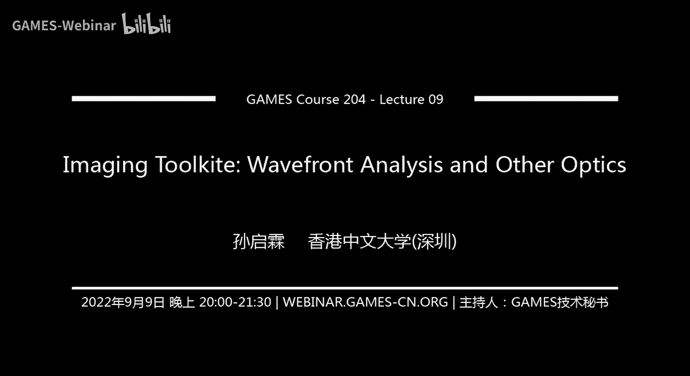
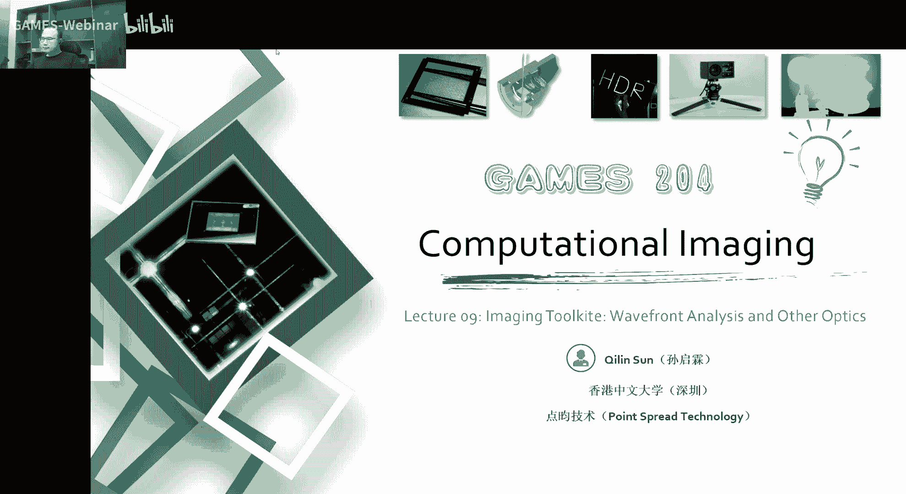
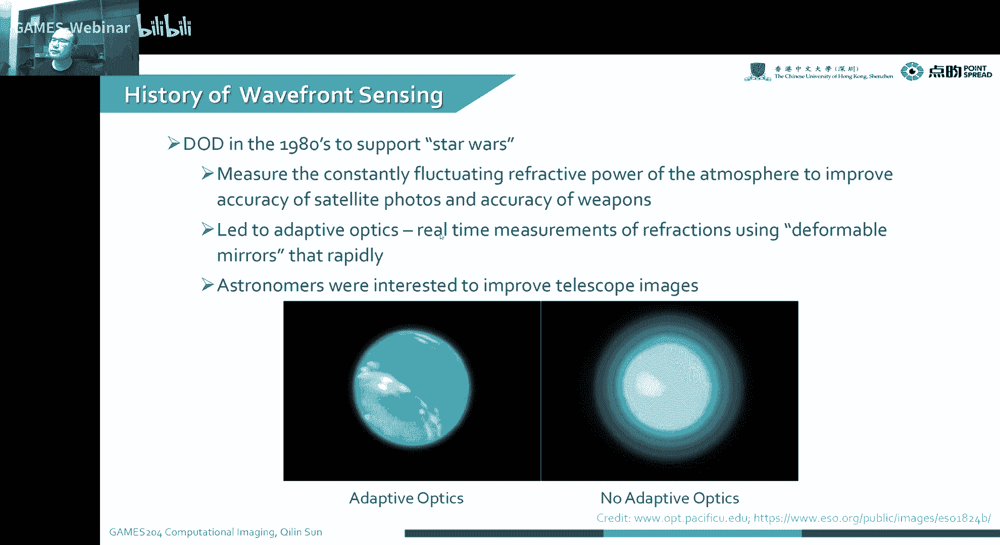
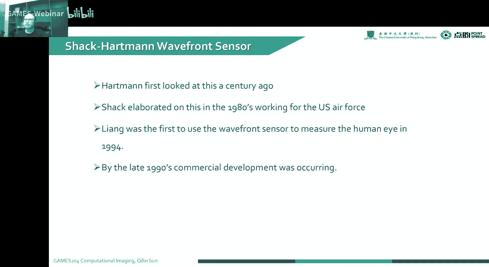
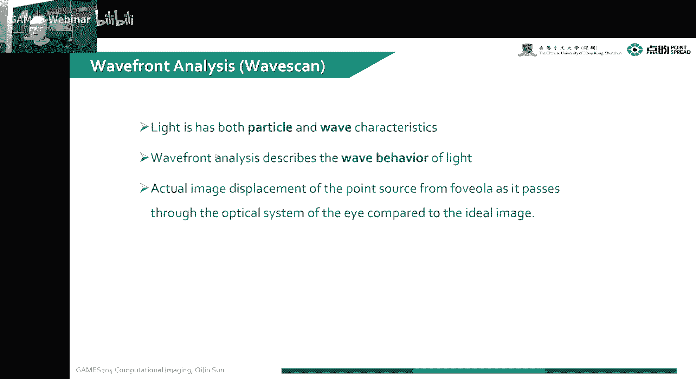
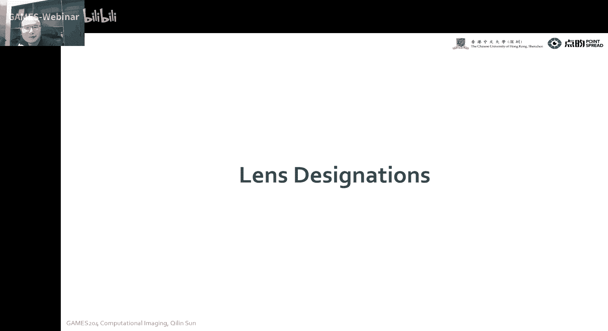
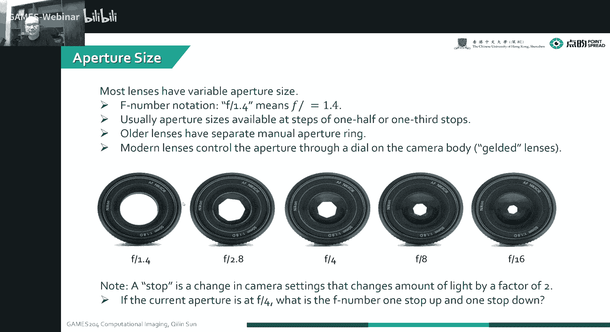
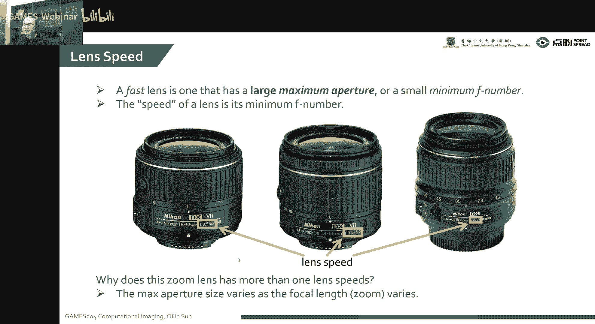
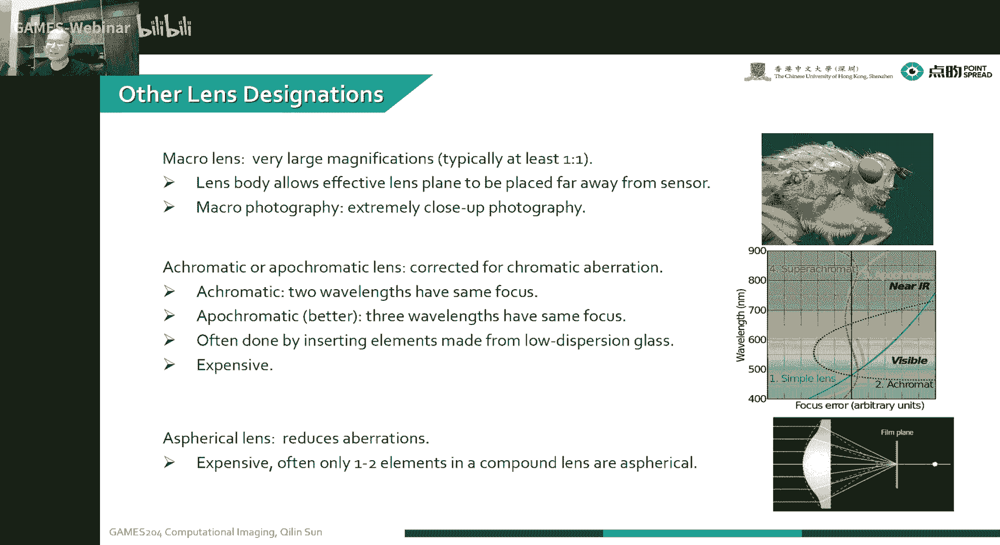
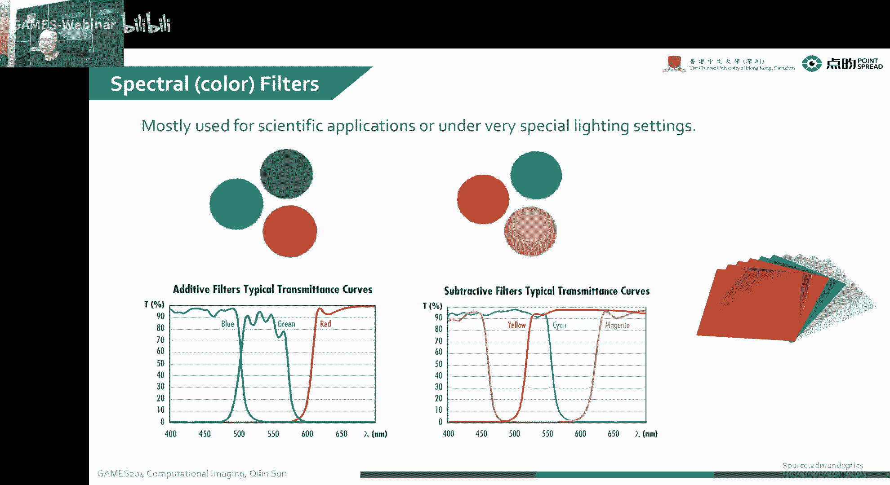

# 09. 成像工具箱：波前分析/PSF/MTF和镜头组件 ｜ GAMES204-计算成像 - P1 - GAMES-Webinar - BV1de4y1C7st

## 概述

在本节课中，我们将学习成像工具箱中的关键概念，包括波前分析、点扩散函数（PSF）、调制传递函数（MTF）以及镜头组件。我们将深入了解这些概念如何影响成像质量，并探讨它们在光学设计和成像系统中的应用。

## 波前分析

波前分析是一种用于分析光学系统成像质量的技术。它涉及以下概念：

* **点扩散函数（PSF）**：描述单个点光源通过光学系统后形成的图像。
* **线扩散函数（LSF）**：PSF在垂直方向上的投影，描述单个线光源通过光学系统后形成的图像。
* **边缘扩展函数（ESF）**：描述光学系统对边缘的响应。
* **光学传递函数（OTF）**：描述光学系统对空间频率的响应。

**公式**：

* PSF = OTF * 2π
* MTF = OTF(0)

## 点扩散函数（PSF）

PSF是波前分析的核心概念之一。它描述了单个点光源通过光学系统后形成的图像。PSF的大小和形状取决于光学系统的设计、材料、加工精度等因素。

**公式**：

* PSF = OTF * 2π

## 调制传递函数（MTF）

MTF是OTF在频率域的表示，它描述了光学系统对空间频率的响应。MTF的值越高，表示光学系统的成像质量越好。

**公式**：

* MTF = OTF(0)

## 镜头组件

镜头组件是构成光学系统的基本单元。以下是一些常见的镜头组件：

* **透镜**：用于聚焦光线。
* **棱镜**：用于改变光路。
* **滤光片**：用于过滤特定波长的光线。
* **光圈**：用于控制光量。

## 应用

波前分析、PSF、MTF和镜头组件在以下领域有广泛应用：

* **光学设计**：用于优化光学系统的设计，提高成像质量。
* **成像系统**：用于评估成像系统的性能。
* **激光加工**：用于控制激光束的形状和大小。
* **生物医学成像**：用于提高成像系统的分辨率。

## 总结

在本节课中，我们学习了成像工具箱中的关键概念，包括波前分析、PSF、MTF和镜头组件。我们了解到这些概念如何影响成像质量，并探讨了它们在光学设计和成像系统中的应用。希望这些知识能够帮助您更好地理解成像系统的工作原理。