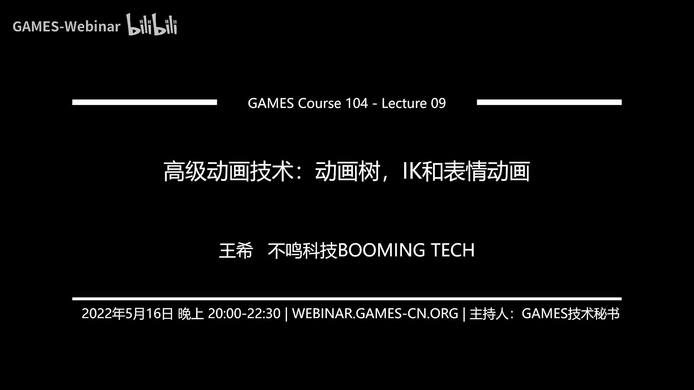

# 09.高级动画技术：动画树、IK和表情动画 ｜ GAMES104-现代游戏引擎：从入门到实践 - P1：GAMES104_Lecture 09 - GAMES-Webinar - BV1pY411F7pA

嗨大家好，欢迎大家回到games104，现代游戏引擎的理论与实践，然后在开始我们今天的课程之前的话呢，我先highlight一下，我们最近收到同学们的作业，然后真的是很很震撼啊。

就是我们的同学们真的人才济济，你像这个卡通化的渲染，是不是觉得非常的酷，那么再给大家看一个啊，这个是很风格化的一个效果，然后再看一个最后一个是最酷的，我认为直接上了motion blur这个效果了。

然后我是觉得就是我知道同学们做这个作业，做的头疼，肚子疼确实挺难的，就是就像我讲的，就是说呃其实理解一个算法不难，难的是在于一个很庞大的系统里面，怎么去把这个算法做进去，但是的话呢我觉得有这么多。

那个就是我们的好同学，我们的学霸做的这么好，也给大家一点鼓励，但确实就是我们的那个课程组的话也很辛苦，就是在一个一个的看同学们的作业，每天都有惊喜，然后另外一个的话呢。

就是那个给大家做简单做一些前排课程的反馈，因为其实因为这段时间准备课程，准备的特别的辛苦，然后呢我们自己很自责，就是我们课程组觉得跟同学们的互动，还是做的不够，然后呢，所以呢就让我在课程中呢。

给大家做一些我们的课程组的反馈，比如说大家反应，就是说PIA的引擎的源代码，看起来还是有点难啊，这个确实是这样的，就是说我们自己也在那个看这个代码，我们觉得代码架的还是不够好，就是不够简单，不够清晰。

所以我们正在做一件事情，就是说对整个引擎代码进行一次重构，然后的话让整个这个架构更加清晰，更加的好理解，然后我们后面的话呢会持续性的，因为在上上周，上周我们在出了一些wiki嘛。

然后呢我们这些在后面就是这个重构完之后，会出一批新的这个wiki的文档，帮助大家去理解这个引擎，所以说大家如果看不懂的话，不要不好意思，肯定不是你一个人，那就直接告诉我们的课程组，那我们这边来改进。

就你看不懂一定是我们的错，那么第二个的话，就是那个大家说那个挖坑的那一层API特别难懂，这个地方的话呢，我觉得实际上真的是我们当时犯了一个错误，因为那个时候我们在考虑说，我们教大家做引擎的话呢。

就是说选择一个更加现代的，更加前沿的这样的一个平台，这个平台一致性也会好一点，但是呢实际上因为win这样，上次我的课上讲的就是，他非常的趋向于硬件底层，所以说对于初学者来讲的话，确实蛮抽象的。

不像学OPENGL啊，就很简单，很易上手，所以的话呢这件事情我们想了想，好像重新改吧，好像有比较难，我们打算的就是把那个上面那层，就是我我们以前讲过的那个叫RIHIG层，就是绘制渲染的这个虚拟化。

这一层的话呢，我们把它抽象的更干净，更好懂一点，这样的话呢再配上一些我们的文档，然后呢让大家能更方便的理解这个，这个就是说我们的渲染是怎么发生的，而且尽量不需要碰到wen的非常底层的API。

那么另外一个的话呢，就是说大家也说我们需要一些更多的学习资料，因为很多算法在课上，我们只是蜻蜓点水的点过去了，大家后面还是需要看这件事情的话呢，就是我们呃确实大家说的很对，所以我们后面可能会准备。

就是在我们的引擎的小网啊，小引擎的网站上，放上一些我们的一些参考资料的链链接，可能因为有些文章它是有版权问题的，我没有办法把那个原文直接给大家，但是我会把链接给大家，方便同学们自己去下载和阅读。

这件事情，我觉得可能需要大概一两周的时间，因为最近我们还得认真的准备课程，所以有可能是在，就是后面两节物理课程结束之后，我们有一个星期的break的时候，我们把这个事情给同学们准备好。

然后呢包括另外一个就是同学们普遍反应，就是真的第一次做作业了，我记得很很很有意思，在之前大家老是问我说我们的作业，我们的作业呢当我们的第一次作业布出来之后，大家就说哎呀，我们的时间不够。

所以呢就是现在看到同学们都很想做这个，做完这个座位，但是呢时间又不够，所以的话呢我们决定把这个第一份作业的时间，截止日期的话延长到这个月的30号，这样的话，大家就可以有更多的时间去写这个作业。

然后有什么问题的话，也可以跟我们课程组去，这个就是说去反馈，那最后一个的话，那就是我们要隆重隆重的感谢一下同学们，给我们的小引擎取名字，我们真的是非常感动啊，大家取的名字都非常的有才华。

我们现在已经收到了将近两三百个名字了吧，而且每个名字质量都很高，同学们不是说只是给了一个名字，嗨写了很长一段话告诉我们说，我对这个小引擎的想法和预示了，其实看到这一趴的时候，我们课程组还是蛮感动的。

因为实话实说，准备这个课程，我们从去年年底开始都没休息好，真的花了很多很多心血，在想怎么去怎么去准备这些东西，然后写这些小引擎，有时候我们会说我们为什么辛苦干嘛呢，但是看到同学们在给我们取名字的时候。

那份用心，那份真的把这个小引擎当成我们自己的一个，我叫做一个playground，就是我们自己玩的一个游乐场的感觉，突然一下子我们觉得心里很温暖温暖，比如像下有有有同学就给我们取了个名字。

叫做啊叫做那个breaking亲，他说这就是我们自己的这个花园，我们一砖一瓦去构建它对吧，还有同学叫我们叫派引擎，什么意思，就是说诶，我希望这个小引擎能像太阳，无穷无尽的能够绵延下去。

这这也是我觉得我们这个社区吧，大家最想看到的一件事情，就是说这门课程，就是虽然我们会有他的第一个part，这个finish的那个时候，但是我们一起通过这个小引擎，这个小社区在一起去连接。

那么特别有意思的，还有人写诗，我这里面特别用了我们一个同学写的一首诗，叫做什么晴空一鹤排云上对吧，引得这个诗情，这个什么腾九霄，我觉得就太棒了，那个最后两个字我看不清楚，因为我被摄像机挡了。

但是我当时看到这个词是我就是哇我的天呐，我都想把它打印出来，挂在我的办公室，就说嗯这是我们做引擎人的这个乐趣，所以说啊在before我开始今天的这个课程，之前的话呢，我还是再次的感谢一下我们社区。

你们的小伙伴真的有你们的这些声音，有你们的支持，我们课程组做这个课程，在最更有动力好，那接下来就开始我今天课程的正文了，那今天的这节课程呢，我们就继续我们上一节课，那个的内容。

就上一节课我们讲什么讲动画系统对吧，上一节课大家花了很长时间听我讲了，那么绕来绕去的四元数，讲了一大堆的公式，但是这个公式说实话比渲染还是少很多了，然后呢终于搞明白说唉呀给了一个一组骨骼。

我到底怎么让这个骨骼动动起来，我这个骨骼动起来之后，我蒙这个蒙皮的一个网格，怎么样，像真的像人的皮肤一样，也能跟着骨骼去动，但是的话呢我们学了那么多，其实呢是一个基础的动画浏览，而今天这节课呢。

我要跟大家讲一些高级的动画技术了，这些技术的话，实际上是现在现代游戏引擎技术里面，最实战的一些技术好，大家准备好冒险了吗，首先的话呢就是给大家看一下，这是我们上节课学的东西是什么。

比如说我们理解了DCC动画是在DCC里面，怎么怎么通过控制那个骨骼的运动，做出我们各种各样的效果，然后呢我们也知道引擎怎么把这些动画导进去，怎么去做各种各样的蒙皮动画对吧。

然后这个看上去我已经知道一切了然于心了，我们还知道什么叫做动画pipeline，但是大家想一想看，如果我用DCC，你生成了几十个，上百个甚至上千个这一个一个的动画，那它就是一个一个的动画。

那为什么今天我们玩起现在这些游戏的时候，我发现他你们的这些角色的动画行云流水，你看不出来他是动画A动画B动画C，好像都是完全自然地连接在一起了，那这件事情是怎么发生的呢。

这其实就是今天我们这节课要讲的重点，就是当我们有所有的这些动画的算法，我们知道有所有的动画素材的时候，怎么样的，让我们游戏里面这个角色真的按照我的意愿，活活灵活现起来那么好。

所以呢第一趴也就是叫动画blending，也就是说，当我有几百上千的这个动画的素材的时候，我们叫做CLIPSE的时候，那么在游戏引擎中啊，我们不是依次的去播放它，或者是随机的播放它。

我们实际上是要把很多的动画的素材，按照一定的规则，根据我的game play把它blender在一起，所以动画的blending，其实是动画的最重要的一个底层系统，那么在这里面的话。

我们讲一个简单的例子，就是比如说还是我们小引擎的这个角色对吧，我们做了一个他走的动画，假设假设是0。1啊，1。5米每秒，那么我再做一个他跑的动画是3米每秒，那我现在假设这个角色我现在是从走逐渐到跑。

从1。5米每秒，慢慢的到3米每秒，这个中间我怎么去过渡它的动画，我们不可能是说为每一个速度做过动画对吧，我相信学学到games104的同学都知道，游戏引擎绝对不会这么傻，我们多聪明啊。

那我们就在想着怎么办，那么如果只是到了一个速度的，设个阈值切换的话，那就会出现在我们的这个，就是下面的第三张图里，你会看到一个很明显的切换，我们肯定也不会那么傻，所以同学们一定会一拍脑袋说。

那不很简单吗，我们要做这个线性差值，也就是在你在第四张图看到的结果，就是诶，你能看到一个很smooth的这样的一个transition，从这个走路跑，这其实就是动画blending的一个。

最基础的一个原理，也是而且这也是最经典的案例，就是为什么我们要动画要做blending，就是因为我们要无极变速好，那布兰妮怎么做呢，其实在上节课基本上讲的已经非常清楚了，就是learn对吧，线性差值。

那我们讲的就是每一个joint，它它的无论它的平移，他的放缩，它的旋转，特别是旋转，因为旋转是最多嘛，那我们要去进行这个就是rotation的差值，那我们也讲到了quota的话，你可以用ENERP啊。

你可以用ATHLOR，whatever什么ERP，但反正就是可以去做线性差值，但是呢不同于在上节课里面，我们的差值都是什么呢，比如说我有无数个key free，我去插值一个动画是什么呢。

它本质上是在一个动画的clips内部，一直就是在真与真之间去插值，而这个差值呢就blending的差值呢，是在不同的动画，比如说在我走和跑的各取一帧进行差值，所以这是在两个clips之间差值。

这一点的话是一定要分清楚的，因为所有的动画的blending，都是在多个CLIPSE之间来进行插值，那这个差值的话，我相信上完上一课的，上一节课的同学的话，一般应该知道这个算法该怎么写了。

所以这地方我就不赘述了，而今天我们就讲一些这个乐谱，怎么这个这个这个blending怎么做，首先第一点就是我们怎么去算两边的权重对吧，那这个方法呢其实非常的直觉，就以我们这个数。

就以这个从走到跑的这个案例吧，那么我们首先要引入一个我怎么算他的weight，其实非常的直觉，如果你是因为移动速度发生了变化，那我就用速度作为一个这个自变量。

然后我可以推推导出来你的weight怎么变化，那假设我们的跑步的速度是这个speed2，走路的速度是speed1，那我其实可以根据当前的4B的，我就可以算出来，我的第一就是走路动画的VT1是多少。

跑的动画V2多少，那大家只要保证V1加VT2等于一对吧，那我速度越来越快，我wait12的就是从0~1之间过渡，那就基本上就OK了，这个东西的话呢，我写了这一盘的话，同学们肯定觉得啊，这个我也会对吧。

那这就是一个很简单的一个啊线性差值，根据这个那个你的靠近哪个信号，我去选择它的权重重一点，这是很直觉的好，接下来讲的这一趴呢是当我们做布兰妮的时候，特别容易忽视的问题。

其实啊当我们在做这个动画CLIPSE的时候，其实首先能做这种差值的动画，很多时候我们希望它是循环的，大家想一想，当我在走路的时候，当我在跑的时候，我们的不平是不是不一样的对吧。

我跑的时候不平会不会相对快一点，我走的时候步频相对短一点，那其实在这里面的话，我们这两个动画之间实际上是并不同步的，那你差值的时候，你该用我的跑的哪一帧，走的哪一帧呢，这个其实是在动画布莱尼系统里面。

特别就是基本的一个问题，所以但是一开始大家做的时候很难会意识不到，所以这个时候我们就会要求动画师，在做动画的时候，你无论这个循环动画做多长，但是首先你必须是循环的。

而且比如说假设走路动画都是左右脚各迈一次，那跑的动画也得是左右脚各迈一次，而且呢你就是那个脚落地的时间，最好大概是一致，这个时候我们要把它两个循环动画的时间规划，这样我的差值才能够保证说当我的时间。

比如说是零的时候，我们的脚都没有提，0。5，0。25的时候诶，我的左脚踢到空中了，0。5的时候哎，左脚落下来了，0。75的时候，右脚踢到空中了，0。1的时候，右脚又落下来，要重新开始对吧。

这个时间的timeline alignment，实际上是很多动画可以blender的一个基础，而且这里面就是让大家意识到，就是说其实动画的blender，它特别容易让你觉得直觉上非常的简单。

非常的就是很好理解，但是的话呢如果你对这些基础的概念，如果理解的它不够准确的话，你特别容易写出各种各样的bug，比如说如果你的时间online做不好的话，比如说你的速度和这个差值没做好。

你会发现这个人走路在地上就ice skating，就是说脚在地上滑步，这是为什么呢，比如说你的那个啊啊就是你的那个速度，他没有跟那个你的两边的权重，产生一个合理的关系。

包括推进的那个步进的速度也没有配合的话，它就会产生滑步，而在游戏中的滑步，是一个我们一定要解决的问题，所以你有了这样一个非常简单的算法的话。

你就完成了一个最简单的animation blending系统，你就可以得到任何一个无极变速的动画表情，看到这一趴的话，我相信很多同学都会觉得嗯我懂了，原来这个高端的游戏就是这么做的，就这么简单啊。

确实就这么简单，比如说像我们的小引擎里面，好像已经实现了一个最简单的blending，但是的话呢它和我们真正的就是游戏引擎，你用的全套的动画系统来讲的话，还差得很远，但这个是一切的基础。

好接下来我们再讲一点有意思的东西了，那其实啊你会发现这个blending，它实际上是有异味的变量，然后呢左右去控制它整个blending，那我们再讲一个有意思的事情，就是说假设我现在有一个这个角色。

有一个向前走的这个动画，然后呢我还有一个叫向左走的动画，我还有一个向右走的动画，那大家想想看，我们在玩游戏的时候，这个角色是不受我控制，一会儿左，一会儿右，对不对，那实际上按照上一节课的那个思啊。

按照上一趴的那个思想的话，是不是我可以让这个轴在左右之间自由的差值，然后选择在这个就是三个动画中的百分比对吧，那么这个差值叫什么呢，就是一维的blank space，但这里面大家注意一个细节啊。

我这里只是举了三个采样点动画，刚才那个动画走和work的话啊，就work和run的话只有两个动画，我们只在两点之间差值，对不对，但是你发现没有，这里面把这个东西general generalize。

就说虽然我还是一个一维这段差值，但是呢我的采样点不是两个了，是三个了对吧，那大家想想看，是不是我可以再加四个，再加五个，比如说我往左边慢移动和左边快移动，和站在中间直接往前走，还是往右边慢移动。

往右边快移动，我可以变成五个采样动画，是不是也是一样的，所以说这里面有一个细节，就是说当我们做这个意维的动画的，这个bland space的话，实际上我们并没有规定这些采样点的总数，这些clip的总数。

同时我们也并不要求，这些CLIPSE在这个轴上是均匀分布的，它可以有的时候密一点，有时候输一点，比如说人在正常走的时候，动画动作变化不大，但是他一旦开始侧翼的时候，他动作发生了很大的变化。

很可能在一个很小的速度，我都切换成另外一个动画了，然后但是呢，当我在向更快的速度往侧面走的时候，这个速度动动作变化又没有那么大，直到发生显著的变化，我再切换到第三个动画。

所以说它的分布其实也是可以不均匀的，这就是我们叫做blank space概念，那这是一维对吧，那同学们肯定会讲，你这个做的不完整的，因为我往就算我往前走，我可以走得快走得慢，我往左走一样也可以走得快。

走的我甚至可以往斜走路方走，那怎么办，诶，这个时候很自然的，我们就需要一个二维的blank space，现在刚才大家讲的就是我站在中间，我是这个idol的，站在最下面那个点是idol的，我站在这不动诶。

我我往前走的点是work，是是走的，我再往前走就run对吧，如果我的这个采样点只是往前走的话，我就是从idol到work到run的这样的一个变化，那同样的就是我在往左前方走出那个右前方左。

我往这个这个就是说左前方跑，右前方跑，那整个这个角色的动画就会完全不一样，那这个时候我们是不是得到了一个二维的，一个采样空间，这个采样空间的每一个采样点，就是一个动画的素材。

我们用它来表达这个角色的整个动画行为，大家注意啊，就是在这里面，Ban space man，所有的动画克里斯都是要求循环的，如果不循环，大家都不循环，就一次性播放网，如果要循环，大家所有人都循环。

否则的话就会产生很多很奇怪的东西好，那但是呢我们的动画师呢，是观察生活非常细腻的人，他会告诉我们的游戏引擎程序员说，这个我们发现一个细节，就是说当这个人他从走到跑的时候，如果他加上横侧向移动的话。

它会很快的进入到一个侧向跑的状态，因为侧向跑的时候人身体很难保持平衡，所以说如果它的速度只要超过一个简单的意识，他就开始必须要切换到跑的动画了，否则看上去很不真实，这个东西讲起来很细节啊。

但是如果你们以后跟动画师团队去合作的时候，你会发现他们对人的动作的行为，就是肢体的这种变化是非常非常敏感的，这个时候就回到刚才我讲的那个概念，就是这些动画素材的话，在采用空间让它的分布其实是不均匀的。

他们可以随机的散布在各个点上，也就是动画师觉得这个地方，我需要一个更细腻的表达，那个地方我可能会再加一个CLIPSE，那作为引擎程序员，我们怎么办，那好吧，随便你怎么放，我都理解了。

然后接下来我们要去选择差值，但是你看这里面我们就有这么多动画了，对不对，你看这里面我们大概有七八个动画，那我难道每次不烂的时候，要把七八个动画不烂在一起，然后我就算他们的平均全中。

这个呢好像这个计算机一个是比较费，因为我每一个动画CLIPSE，我首先要去算出来，他当前这一帧的动画是什么样子，然后我就要把七八个pose在一起进行blending，那这个计算量是不是会非常大。

哎这个时候我们发现一个规律，就是我们用DRI3角化的方法，DN3角形是个数学方法，大家如果有兴趣的话，可以去查一下，其实非常简单，就是我给了你一堆二维空间的点，其实这个算法在三维也可以变成台球会哦。

三维好像比较复杂，二维的话其实算法比较简单，我就是根据你的这些这些点，这些顶点我可以生成这个空间的三角形划分，那么你现在这个时候，你在任何一个速度这个轴上，你在任何一个方向。

这个人就确定了二维空间一个唯一的点，那我就会选择临近的三个这个动画clips，然后呢用BIOCENTRIC，大家还记得我们在前面反复讲到的重心坐标，对吧，那个方法去在这个三个顶点里面。

就三个动画的CLIPSE里面去插值，所以这个呢是一个完整的2D的，ban space的一个实现，而波兰space的话呢，在我们的游戏引擎早期是非常好的解决了，就是说艺术家只需要做几个角色行为的动画。

但是呢我们可以在整个游戏引擎里面，实现一个非常丝滑的角色的运动，所以说我们的小引擎现在ban space还没有实现，所以说不定我们会把这个ban space，作为我们小引擎的一个作业，不给大家啊。

现在我我我先不剧透，我只是说这是一个非常好的一个，就是做作业练习的一个东西，因为你会发现这个奇迹就会发生，就是说你本来看到一个很离散的动画，然后呢但是如果你有了一个ban space的话。

你会发现你用你的摇杆去控制它的时候，唉无论以什么速度，无论你什么朝向这个角色的行为，看上去好像都很舒服，很smooth好，这就是tod black space的一个概念，这是我们在做动画的。

这个就是real time的处理的时候，一个非常核心的，也是非常基本的一个数据单元，基本上现在游戏引擎，无论最高端的游戏吧，虽然我们讲很多游戏都是号称是这个。

就是data driven的这个那个这个这个这个match making的，这个这个就是这个就是那个这样的一个动画，但实际上呢ban space的话呢，实际上还是一个非常基本的一个元素。

很多地方还是要用到它那个，那接下来我们有了这样一个曲线方法，我们问题是不是解决了呢，我们发现又来了第二个问题，就是说，我们就这还是以我们的一个小机器人为例，他对特别喜欢大家，很欢迎大家来跟他玩。

他要鼓掌对吧，但是我们小汽车有很多的pose，他可能一会儿站在这儿，他也可能蹲在这，大家觉得这个小机器人很可爱，那么我这个机器人甚至可能在走，那么在这样的一个情况下，我们还希望给他混合一个鼓掌的动画。

但是我们知道鼓掌的动画，我不可能为每个姿势都做一个，我可能只能做上半身，但是我下半身的行为又会不一样，那怎么办，我相信聪明的同学们应该很快就能想到，很简单嘛，我们对skeleton做一个mask。

就是说有些动画它只apply到你的上半身，有些动画呢我只apply到下半身，比如说我的下半身apply，一个这个人蹲在那儿的动画对吧，我的上半身呢apply，一个就是这个这个鼓掌的动画。

我而且这个动画树那个，因为你只有这一部分的这个joints，参与了这个动画，它的动画的数据量是不是变得更小，而且因为你有这个mask，所以说当它apply到skeleton的时候。

只要拍到一半的左右的骨骼，那我的计算量也会下降很多，这个时候我就可以自由的，把两种甚至更多的动画，在这个角色身上进行混合，这也是一种blending，就是skeleton mask blending。

那你有了这样的一个API的话，或者这样的一个方法的话，你就可以实现这样的一个效果对吧，你就看到小机器人无论是什么造型，无论在什么位置都在鼓掌，欢迎我们，所以说这也是我觉得是个非常好的，小引擎的作业啊。

大家可以拿这个效果来做这个作业，OK所以这是我们的叫做skeleton mask blending，好再给大家讲最后一种blending，假设我们对这个小引擎提出，这个机器人提出更高的要求。

你不仅要对我鼓掌，你还要向我点头示意，这个这里面有有一个引擎的要求，叫做你要向着我去点头，因为鼓掌你可以这样对吧，你可以你可以可以这样，但是你的头我们希望机器人总始终朝着我，假设我做了个点头。

我做了一个向前点头，向左点点头，向右点头，那这个时候我要让他有各种坐姿，我要让他这个手在不停的鼓，而且我还希望他的头看着我不停的点，而这个时候怎么做呢，其实这里面就有一个很重要的blending呢。

我们叫做attitude blending，什么意思呢，就是在这一个动画里面，我们不仅只作用到这个skeleton的局局部，而且呢我们只存他的这个动画的这个变化量，而不而不至于那个就是存它的绝对量。

这样的话我们在你无论怎么渲染的对吧，无论怎么动SKT的结构结果之上，我再加上一个extra的旋转呢，或者是这个translation啊，或者是这个scale。

这个时候我们就可以在上面又去apply1层动画，这个时候你有这样的一个技术的话呢，诶你就可以实现这样的一个效果，就是你看到很多的机器人在这对，冲着你去点头了对吧，这个其实就是非常的简单。

就是这个呢也就是在我刚才讲的三种补蓝顶，第一种是非常简单的LP，就是线性补蓝顶全身的，还有一种我们叫做mask blending，他只是对一个局部的进行blending。

第三种呢叫做additive blending，就是说你们blending全部做完了之后，我再给你上面加一个修饰，加一个差分量，这三种不ending，基本上是游戏性里面blending的最主体的东西。

那有了这个东西的话呢，呃我们基本上就可以做动画了，但这里面要讲一个细节，就是说其实这种editor blending啊，如果做的不好，是特别容易产生各种呃，我们称之为叫broken case的。

就是比如说吧啊，我们这个角色本身做了一个转身的这个动作，他的脖子已经扭了，然后你再给他加上一个扭头，看别人的这个动作的话，他的脖子可能就超过了它的旋转的这个上限了。

所以这个时候你这个角色看上去非常不自然，所以说adam blending的话，一般都会做起来非常的谨慎，而且这是我后面要讲的，就是在后面在规划这个角色运动的时候，我们会非常有意识地避免。

就是过度的叠加这些动画，因为它会让有些joint的行为非常的异常，OK好，这个基本上就是我们的blending呢，就是这个三件套啊，应该是四件套吧，就是说首先大家理解什么叫一维和二维的这个。

band space对吧，然后呢理解了非常简单的，就是说线性的或者是双线性的，或者三角形的边三角形差值的这种blending，然后呢我们理解了居skeleton mask的blending。

还有呢就是说if blending，就是再加上你offset边那个，就是偏移量的种blending，那基本上你有了这些东西之后，你就可以把那几百个上千个动画，按照你想要的方法把它各种叠加在一起。

根据你的game play，这个其实就已经可以做一些简单的小游戏了，其实如果你这时候不在乎，这个引擎是真的给artist用，你自己直接用来做游戏的话，有了这四个算法基本够用了好。

那但是呢我们的这个引擎设计师是不满足的，为什么，因为我们的目标是要做工具，我们不是做算法，工具的目标是什么呢，就是我们要把它变成一个，可以教给我们的设计师，教给我们的艺术家。

能够自由地构建他的世界的东西，那这里面我们对这个动画的表达呢，就会希望拥有一种更可视化的，更形式化的话去表达，这里面要介绍一个大名鼎鼎的概念，叫做呃animmation state machine。

这个单词拼错了，不好意思，应该是呃也就action也可以，反正这个词我们有的时候一般都叫state machine，状态机，那么状态机的概念呢，为什么这个在动画中很重要。

因为刚才我们只是讲了blending对吧，但是其实在动画系统中，他很多时候是状态在切换的，我们举一个非常简单的例子，就大家还记得在上一节课的时候，我们讲的就是说一个角色，我们作为一个跳起来的动画的时候。

我们要把它的位移去掉，对不对，因为什么呢，因为在游戏中啊，这个角色跳多高，包括多久能落地，都不是动画能作死的，大家想象一下，比如说我站在一个斜坡上，我站在一个台阶上，我从台阶上跳下来。

虽然我跳的高度是一定的，但是因为我跳下来这个台阶的深度我并不知道，所以我并不知道什么时候落地，所以一般我们会做三个动画，第一个动画呢就最上面的这个叫做起跳，第二个动画是什么呢，叫做空中的loop。

也就是说你在空中浮空的时候，很优雅的把你的腿啊，手啊摆来摆去说啊，我现在飞在空中，I believe，i can fly对吧，那最后一个呢就是我的天，我要快落地了。

这个时候呢有一个叫landing的动画，一般我们一个奖品实际上会拆成三个动画，这个时候你会发现你没有办法去blending它了，因为它不是个blending的问题，它是个什么呢。

它是一个就是彼此依赖的一个状态切换的问题，就是当我决定按下一个button，比如说像XBOX经常按的是A键是吧，我记得A键就跳，那我按A的时候，或者XBOX那个叉那个PS圈的时候，诶。

我播放这个角色起跳了，当这个角色跳到他的高点的时候，这个时候我应该播放什么东西呢，应该是在空中的那个loop哦，不是高点，就是说起跳动作播放完之后，我就要切到他的loop，为什么呢。

那个时候因为他向上还有惯性嘛对吧，然后他就开始有惯性了，在那边，但他他就悬崖，那我并不知道他马上就要落下来，还是下面是一个无尽的悬崖，如果是无尽的悬崖，它就会一直这样啊啊啊这样摆。

然后呢唉当它快落地的时候，我这个时候记住啊，这里面其实有个很复杂的东西，就是我不是说落地那一瞬间，我播放落地的动画，实际上是快落地的时候，一般是快落地的时候，我会让这个角色做出一种紧张的姿势。

然后准备落地诶，我要播放这个落地的动画，当然这个这个是比较讲究的，如果你不那么讲究的话，是你检测它的位置到D的时候，你播放一个脚去削减势能的动作，Anyway，这个都可以。

你会发现它是在三个状态里面是有序的切换的，而这个呢就是一个非常经典的状态机的要求，所以这个时候我们再去看动画的时候，就会不一样了，那我们就需要定义动画的状态机，那动画的状态机呢其实一般就有两种核心元素。

第一个恒元素呢叫做它的这个节点，也就是说我们的动画的那个CLIPSE，就是原来的原始的动画素材，是它的节点，对不对，其实呢你可以把一个整个一个ban space，比如说我们的刚才讲的那个诶。

前后左右这个在一起怎么混合，你也可以把它打包成一个节点对吧，你甚至可以把一个动画的蓝图都放进去做下，这里面我就借用于aria的概念吧，就是整个一个动画可以混合的速度可以放在去，它非常的灵活。

那么但是呢这个里面它的，它最终产出的一定是一个动画，就是一个pose，一个pose to animmation，然后呢当这个东西呢它又满足了一定条件之后，它会从状态A就node a切到note b。

就是我们叫STA或者到STB，所以叫动画的这个状态机的话呢，它实际上核心的元素就是一个可以反复循环，或者叫循环输出动画的这样的一个，就是这个它的state或者叫做note，还有什么呢，就是满足条件。

我就自动的从这个node a切到node b的这样的，一个过程，回到刚才我们那个案例里面，这里面是一个非常简单的这个SM的一个案例，就是你从爱豆开始，当我收到了这个玩家跳起来的这个动画的时候。

我可能就会进入到jump的那个新jump那个节点，那jump那个节点首先是jump start是吧，然后在jump loop这个jump，首先jump star，他可能觉得哎我到了高点的时候。

jump star就停掉了，我就变成jump loop，这个JBLOOP里面啊，它一直会循环，直到他说我要落地了，这个时候这个状态就切换到a landing，到landing之后。

landing他要把自己播完之后，他才能回到这个人的idol，所以这你只有这样的一个系统的话呢，这个角色的行为才是看上去是自然的，那么这里面的transition的话呢，其实就比较复杂。

我这里面给出了一个最简单的定义，比如说你只需要知道它的起点是谁，它的终点是谁对吧，那么这里面的话你还说哎，我之间要不要去做这个差值啊，如果差值的话，我从动画A的话，B不要马上过来。

我中间有一个布兰妮的过程，可能是比如说0。2秒，0。3秒，0。2秒是我以前我们以前经常用的一个magic number，我也不知道为什么很多artist都喜欢填0。2秒，好像这个数字看上去就那么舒服。

但其实真正复杂的是什么，是这个transition是在什么时候激活，待会儿我们会讲就是它其实有很多的条件出发，而且呢这里面讲一个比较复杂的概念，就是一个完整的动画状态机的实现的话。

它的transition条件可能是不止一个的，可能是很多个好，那这里面就讲一个fade，这个fade呢讲一个非常简单的一个数学原理，就是fade一般有两种，一种就是我从动画一到动画二之间。

就是动画一越来它的它的贡献量越来越少，动画二的贡献量越来越越多对吧，这是一个非常容易理解的一种差值，就是smooth transition，但是的话呢其实还有一种是什么呢。

就是frozen transition，就是说我的动画一要切动画二的时候，我动画一呢先停住，然后呢动画二这个时候逐渐逐渐的进来，但是这个是基于你现在动画一的这个基础，这件事情有点抽象，比较难理解啊。

但是实际上的话呢在我们的动画系统中，真的是有用处的，就是有些动作当你要发生切换的时候，你继续在播放动动作一的这个动作的话，它和动作二在一起混合的时候，看上去反而更不自然，就以刚才这个起跳为例的话。

如果你之前用smooth transition的话，你会觉得这个人在空中还在试图跑步，再怎么样，这当然也是一种这个跨栏的演示方法了，但是呢动画二那种。

就是说frozen那个这个transition的话呢，你会觉得诶这个人好像试图停一下，在原地起跳，你说到底哪个好呢，我觉得这个是artist决定的，但作为我们的engine designer的话呢。

我们实际上要给大家提供一个选项，这你们再多说一句，就是说其实啊这个两个信号之间的fade，是有非常多讲究的，就大家啊看到这里面这么多，名目繁多的曲线对吧，其实本质上就是要接，还记得我以前跟大家讲。

那个就是那个那个那个就是那个啊，材质模型的时候就讲过，说诶这个这个信号到底要尖锐一点呢，还是下面的，还是下面的波峰要拖得再长一点，其实大家都只是在找各种各样的可能的形状，比较多的形状就两种。

一种是linear，就是线性的差值对吧，还有一种是什么呢，我们叫做easy easy out，什么意思，就是用cubic的方法，或者用BASA曲线，就是A先平平的在中间长得比较快一点。

到结束的时候再慢一点，这个是用的比较多的，其他的其实像什么指数啊，这些东西至少在我们的动画系统里面，用的是比较少的，你会发现动画是大部分时候要么就是线性差值，要么就是这个EZEZL的差值。

但是呢不妨碍大家知道这些基础的这个理论，因为这个东西的话，其实在我们的引擎很多地方都会用到，比如后面我讲的party系统的时候，他的很多particle的这个这个这个明暗的变化。

可能就要用这种这些曲线来表达，那这里面的话呢给大家举一个真实的案例，就是说这是用unreal引擎做了一个案例吧，这是一个一个一个ASM的案例，那在这里面，大家看到那个上面每一个小小的那个双箭头。

其实就表示了一个transition，你打开那个transition的话，你看到里面有很多的属性，这里的属性比较复杂，我就不一一展开了，那这里面的话你会看到就是说哎，他这里面你看的特别清楚的是。

我的这个duration到底要插值多久，包括呢我大概是什么样的一种插值类型，它单这里面有一个比较复杂的东西，在这个图上没有展开出来，就是我这个什么时候发生，这个transition的条件到底是什么。

对吧，这个地方其实非常的有意思，然后呢再讲给大家讲，这个我我在后面讲，但这里面大家注意到一件事情，就是说其实这里面的每一个每一个note，或者叫每一个st，它不是大家想象中非常简单的一个动画的素材。

实际上呢这里面的话，你点开来可以发现，它可以做成一个非常复杂的一个动画蓝图，就是很多很多动画，在你们又按照一定的规则去融合，当然你也可以只放一个，比如刚才我们在前面讲的一个ED的VD。

或者2D的这个two d的这个blank space，这都可以，其实这也是为什么，我我这节课在讲动画树的时候啊，我大量的用了unreal做案例，因为其实我们比较下来，我个人认为。

荣耀的这个动画系统设计的是非常好的，它一个很大的我认为设计的比较好的地方，就在于就是说它实际上非常灵活，你可以根据自己的需要自由的嵌套，自由的组合，而且呢它的很多的这个图标啊，包括交互设计啊。

非常符合设计师的直觉，所以如果诸位想做游戏引擎，想做游戏引擎，你的这个动画树系统的话，或者叫动画蓝图系统的话，我觉得要是一个非常好的一个参考，而且也非常符合我们讲动画系统这个概念好。

那其实呢当我们有了这个就是动画状态机的，这个基础的话，我们真实的在游戏中的表达一个角色的时候呢，在最古典的时代，我们用的一个东西叫做layered a s m，就是多层次的这个动画状态机。

比如说这个角色的上半身，我们有一套复杂的状态机，比如说表达他，比如受击啊，或者说他各种攻击别人的动作啊，然后下半身的话呢我会根据我的一玩家的control，比如说哎我这个角色在跑跳走对吧。

然后的话呢我两层东西叠在一起，就是这个上一个管，上面那个管下半身，还有个人可能管这个头，还有的还有一层可能是管这个这个角色的受击，所以你几层状态机做好之后，基本上能够在游戏中表达一个。

活灵活现的这样的一个角色，这里面我举了个例子，比如像鬼泣五的这个例子，你会发现这个角色为什么你觉得很有打击感，因为他下身跳的各种动作，和他上身打怪的各种攻击动作，是基本上是可以独立控制的。

这样你会觉得这个角色特别的火，而不那么僵对吧，这就是layer sm的一个很大的好处，那这也是一个最经典的一个设计，但是的话呢就是说现代游戏引擎里面，我们基本上切到了什么呢，就是动画树了。

那动画树这个概念，我相信同学们应该至少虽然没有用过吧，或者很多同学已经用过了，应该是久仰大名了，那动画树最原始的这个idea，至少我个人的理解啊，是从表达式数开始的，因为大家想想看。

如果我layer的SM无非不就是信号，A加B加C加D嘛对吧，那其实我们对整个动画的表达，实际上可以表达成一种，就是比如说速度空运算对吧，动画A加动画B然后呢可能在TV点C对吧，再再受制于什么东西。

所以说这个东西其实如果是这样的，一个表达式的话，我们是不是用一个数的形式是不是更好，所以大家仔细看动画树啊，其实动画树的话，它其实是一个就是一个一个单向展开的一个数，它并不是一个图。

它最终一定要有一个流出的这个节点，就像你作为一个表达式数一样，最终有一个中有一个那个根节点好，那动画树呢它你们的节点就像我前面介绍过的，其实非常的简单，比如说它最最常用的就是线性插值节点，但大家注意啊。

在动画树里面，线性插值节点的一，最简单的二元线性差值的话呢，你输出的是个权重对吧，比如说零就零就表示这个我全部选用CLIPA，如果一的话，我就全部选用cb ca cb，那我加0。5的话各取一半。

那么但是的话呢，这个这个这个系统还是三通道的系统，这个时候呢它的权重我们一般会单独让你输入，就是VT1，Vt 2v3，你自己来控制它对吧，这个很像是不是很像那个电路板。

然后呢如包括刚才我们讲的editing blending，在动画树里面也有专门的节点，你可以把它放进去，也可以做你想做的事情，那么这个时候去刚才我们讲的lay了，SM的话。

是不是可以很轻松的用这样的一个结构的，动画树就可以表达出来，所以说啊动画树呢，你可以认为是layered sm的一个超级，那么也就是说它可以做表达，所有的layered sm能表达的东西。

但是动画树呢它真正的酷的地方就在于，它实际上是一个递归结构，至少我在这个游戏引擎，现在游戏引擎里面，我看到大家越来越把它变得更general，举个例子就是这里面我还是不得不highlight的一下。

就是那个虚幻引擎，就是说他在动画树的节点设计中非常的灵活，就是说它既可以是一个动画的素材，也可以是一个就是那个ban space，也可以是一个ASM，这样的话你最终只要输出一个节点就可以了。

刚才我讲了那个一个ASM，就是说动画状态机点开了之后，它里面又屏内嵌很多的note，这些note中间呢又可以在内嵌一颗小动画树对吧，这个听上去就很丧心病狂了，你这个就是就是你套我，我套你。

但这东西你觉得很复杂吧，但其实如果写过编程的同学，就知道我的类的定义，类的时间就可以，你套我我套里，就是这个代码就可以互相套起来嘛，所以的话呢这些数据怎么去组织，怎么去归类。

实际上这个结构就给我们的设计师提供了一个，非常大的一个一个自定义的空间，那么看这些节点呢，我们一般都叫做叶节点，那么在业绩点往上的话呢，我们有很多这种中间的计算机点。

最常见的就是刚才我讲的就是各种loop节点，对吧，你无论是additive还是这个mask的，还是这个只是二两通道的，三通道的还是多通道的，那么就是说这里面的话呢是一个非常简单的。

这个就是unreal animmation blueprint，这样一个案例，大家可以看到就是说两个就是ASM，就是动画状态机，他们的输出就接受了一个控制信号，诶输出了最终玩家的这个动作。

这里面的话呢我们要讲的就是说，听上去好像很简单，但是这一棵动画树放在这儿的话，它为什么可以一直在变换它的输出，对不对，你这样说，你的数的数据放在那是静态的，它为什么可以根据我的鼠标的啊，鼠标键盘的输出。

包括游戏的状态，它会产生不同的pose呢，这里面呢有一个关键的东西，就是说其实动画树它最核心的，你要定义它的控制变量，也就是说在这个动画树中的话，我们会定义大量的这个变量。

暴露给外面的game play系统，它来控制，就是说A他会告诉你说，比如说我现在的移动速度，我现在的朝向，我现在的健康状态，我是不是现在要跳起来，比如说我现在是不是受到了别人的攻击。

而这些大量的控制变量的话，实际上就会改变这棵树里面的什么呢，混合行为，你可以想象成，就是动画树是无数个流着水的管道管，每个管道汇在一起的话，它有一个阀门会控制说我用红颜色的水，液体多一点。

还是蓝颜色的液体多一点，这个阀门呢就是用控制变量来控制的，那我假设有12种颜色对吧，按照各种数学规律，我预先放好在这边可以一层层的混合的时候，那我只要输入这个阀门的控制变量的话。

是不是就可以决定最终流出来，混合出来的那个液体，那个水的颜色，大家想象一下，假设一个有颜色的水管的话，是不是这样一个逻辑，实际上动画树的控制变量，实际上是动画树的灵魂，它能控制住整个行为。

那这个这里面这个讲起来就比较复杂了，就非常的多，但这里面给大家讲一个基本的概念，比如说呃在虚幻引擎里面，就这举他例子，它定义类东西叫VERABLE，其实我们一般也会定义这个词叫VERABLE。

就是说这个一个变量它会暴露出来，然后呢这里web大家注意有两类，一类呢就是环境的一些参数，就像刚才我讲的，比如我的速度，我的朝向，我的健康值对吧，我会根据我的健康值，比如说我现在血量只有一半了。

那我的动作可能会切换到那种哎呀，很虚弱的那种动作，这种动作可能动画是体现做好了，如果呢诶我血量很满，那我这时候动作是另外一组动作，走起来这个昂首挺步的，反正两组动作我都是混合在这。

但是呢那个开关就取决于我的血量，是不是大于50%，这个是不是很好理解对吧，这是一种，还有一种是什么呢，我们称之为叫做event，就是说当一件事情发生的时候，我会去修改一些变量。

但这个修改呢一般来讲是event发生的时候，我会把动画树里面的一些局部的一些，标记给修改掉，举个例子，比如说现在我手上拿了一把步枪对吧，我突然这个接到一个指令，说我要把步枪换成一个火箭筒好了。

那这个时候我拿枪，我的动画，上半身的动画就会彻底的从这样的一个动作，变成了这样的一个动作躺在这儿了对吧，那这个信号呢一旦来的时候，我就会修改我动画树内部的一些状态里面。

就我们一般就如果大家有编程的技术的话，你可以认为这就是类中间的这个private的，这个就是我私有的这个变量，但是呢它可以被外部的一个状态激活并且修改，所以其实大家对动画树的理解，你可以理解成它有两趴。

第一趴呢是决定这些动画像流水一样的，各种颜色的动画，通过这些阀门控制它怎么去混合，那这个阀门怎么控制呢，其实在动画树中呢还有很大的一块代码啊，有一块这个计算机构去算，我每个阀门的开放的百分比。

那这些呢就通过我的变量，通过外部的控制信号，来在动画树中进行一些简单的加减乘除比较，或者说那个对那这这这些运算是最常见的，能实现我想要的效果，所以呢大家如果真的想实现一个高级的。

就是动画树的这个动画系统的话呢，那我会非常建议大家去认真的研究一下，这个虚幻引擎，因为它是我目前见过做得非常完备的一个系统，那么这里面的话呢，你会看见你会理解这里面基本的概念，而这节课上的话呢。

我觉得我把这些最基础的概念教给大家，就是说实际上你有了这两层概念的话，你基本上就能够搭建一个动画树系统，比如说你现在想做个引擎的话，你说哎呀这个太复杂了，我搞不了这么多，其实很简单。

你可以定义一些接口的一些啊一些变量，这些变量的话呢让你的game play系统可以去修改它，而你的动画系统呢做好了之后，它在每个节点读取这些变量，然后呢你允许它支持一些简单的，比如说加减乘除。

比较大小或者是等于的运算，实际上呢你也可以实现一个A，有点那么个意思的动画系统了，所以说我们土法炼钢也也是可以练出来的，那么这里面的话呢就是一个哎这个气，这其实是按荣耀五里面一个最基础的一个。

动画树的教程，他其实这个教程讲的就比较清楚，131313的就动画树的其实实现了流派啊，每一家厂商其实都有点区别，比如说你看dice引擎就是death fb引擎的话，它会也有很多自己的节点对吧。

因为根据产品不同，游戏不同，但是呢最基础的概念基本上就是这样，大家是大同小异的，大家知道了动画树这些东西啊，其实我们一个角色的动画系统，就角色的运动基本上就能表现出来，你能够表现这个角色。

是让这个跟这个games play环境连接在一起，但是呢角色它的运他的动画呀不是孤立的，它实际上是和环境在一起的，而且跟环境在一起呢，他这跟环境有很多对他的约束，所以这里面我会跟大家先讲几个基本的概念。

就是说其实我们前面讲的所有的动画，它是什么呢，它是我们叫做forward condemics，也就是说我们去驱动关节，从根到上一节节往前走对吧，动画树的混合也是这个道理。

就是驱动往前就是这个forward的，就是往前传递的这样的一个动力学的东西，但是呢反向动力学inverse conomics的意思是什么呢，就是说哎假设我约束好，我就是要让你的手抓到这个点。

那你这个动画该怎么做，对不对，就是我我现在前排，上节课我们已经提到这个概念对吧，这样的一个有约束的这个反向去解，你每一个joint怎么用的话呢，我们叫做反向动力学，而这个东西呢其实在游戏中非常的有用。

比如说那个最经典的就是游戏中，你能抓到一个把手对吧，你能够这个这个这个摔跤的时候，你能抓到一个人，那么其实呢在游戏引擎中，我们怎么样的帮助设计师，帮助这个就是去表达说，我希望这个爵士的某一个骨骼的运动。

符合我这个反向动力学的约束呢，我们叫做and effecture，就是末端的这个这个这个效果器，那么也就是说我们会在这个股上说，我要加个n effect，我希望它总是能够贴到地上，这是什么。

这就是贴地的需求对吧，那在这里面的话呢，一个最经典的案例，就是说当角色在一个颠簸不平的地上走的时候，我们希望它的脚总是踩在地面上，但是动画树做动画的时候，大家如果看过动画师做的动画。

它永远假设面前是一望无垠的平地的，所以大家看早期游戏的时候，那些角色都是在地上，就是这样，就是各种乱踩一漆皮，特别明显的就是上楼梯嘛，所以在这种情况下呢，我们特别希望就是哎呀。

有一个大神能够在我这个角色迈出去，每一步的时候，他都能够帮助这个角色，就是把他的脚按在那个地面之上，那这些怎么怎么解决呢，其实最简单的解决方法叫做a two bone ik，就只有两个B约束的。

IK就是以这个人的为例的话，那么他的大腿和他的小腿那个两根骨头，是不是代表了三角形的两个边，然后呢我的目标点也确定了，那其实目标点离我这个就是大腿根部的，这个距离的话，是不是也是去年，那我就知道了。

三条边长，三条边长的话呢，其实我们就可以唯一的确定一个三角形，因为一个最简单的这个这个初中的三角函数，我们就可以知道说你的大腿要迈多少度，小腿迈了多少度，我就可以算出你的动画。

这个呢就是一个非常简单的max叫two pi k对吧，用一个简单的两个球球教的问题，但是呢这里面有个比较讨厌的事情是什么呢，就是当我去给定一个约束点，给定一个大小腿的这两个骨骼的时候。

你会发现它的解是其实相当于它的解空间，是两个球的交点，它解除了一个圆环，也就是在圆环上的任何一个点的话，这个解都是有效的，所以就以这个角色为例的话，大家是不是发现，他无论是内八字还是外八字对吧。

他这个动作实际上都是可以，保证他的脚踩的那个点的，但是这个的话我们的艺术家肯定是不答应的，那咱们解决这个问题呢也非常的简单，那我们让艺术家呢说你这个人不是往前走吗。

那你给我一个reference vector，告诉我说，如果我需要做IK我的腿，他的整个这个朝向应该朝什么方向好，那我就在沿着那个朝向的方向，去找他的那个姐姐，这个解法其实非常的简单。

就是说我通过那个我求一个，因为你给了我一个REFERVOR，再加上我的那个大腿的这个，这个和卧底目的点的连线，我可以确定一个平面对吧，拿了个平面和那个圆环一一交点，肯定就有两个交点。

那其中有一个交点是正向的，一个焦点是反向的，用一个简单的三角，那个就是那个就是那个vector的这个cross，就是呃不是cross rector dot，就向量的点击大于零，就是同向小于零，就是逆向。

你就可以解释那个点了，这个时候你就基本上可以非常完美的解决，这个就是脚踩在地上的问题，而且这也是IK最简单的方式，但是呢这个世界上的事情就是不是那么简单，就是如果这个事情这么简单，我们就很开心了。

事实上的话呢，IK的scenario比这个要复杂很多了，比如说我们要让这个角色看一个方向，look up对吧，那我们在角色这个脖子这个地方，其实有很多根骨骼的，包括当我们的角色在空中飞舞的时候。

它要抓住一个东西，包括呢就是说我们在游戏中的话呢，其实有很多这种上下左右翻飞全身的这种IK，那么这个IP真正难的地方在哪里呢，就是说如果你参与这个IK的这个join的，不止两个，你有一条链的时候。

你怎么去写对吧，他有两个问题，第一个就是说这个自由度太高，自由度太高，大家觉得在方程中啊，就是表示他的他那个high dimension高维方程，而且它是个非线性的方程，因为它有大量的旋转角度。

角角度在里面，它不是个线性方程，所以接下来很蛋疼，那第二件事情呢，关键是它的解有无穷多个，就以刚才以就就以这张图上为例的话，你连接了这个起点和目标点，它的joint是不是有很多种可能性。

实际上它是无限种多种可能性，所以在游戏引擎里面，我们怎么能解决这种常见的这种IK呢，那这里面的话呢呃我们首先第一件事情是说，我们得判断这玩意能不能够能不能够得着，因为你想你花了半天。

写一个常见的这个IK问题的话，如果他本来就够不着，我们是不是在浪费我们的时间，这里面给大家讲两个非常简单的这个东西，就是说在大家在解决这种真正的IK问题的，比如说我要用身体去购置一个苹果。

就比如说这时候我刚好两个胳膊不够，我这身体还要前倾的话，你首先要判断我能不能够得着它，有一个最简单的方法，但这个方法其实是后面会讲，他其实是不完整的，就是说哎我把所有的骨骼全拉直了，我的长度够不够。

如果长度不够，我是不是肯定是不够的，对不对，第二种是什么呢，我把最长的一根骨骼放在这，我把所有的骨骼对着它去折，如果这两个这些骨骼无论怎么折的话，它他没有办法覆盖那个最长的骨骼。

其实我在我的靠近我的区域，其实也有一个盲区，这个是大家在写这种IK的时候，经常会忽略的事情，然后呢你会发现你在解了很久，就是拿不到一个解，然后有的时候如果上面写的不好，他就会无限次迭代下去。

这就会在会在这个地方去踩坑，那么那接下来拿到这个东西的时候，我们怎么怎么去解呢，那这边还有更难的一个问题是什么呢，就是实际上对于一个人形的这个角色来讲，我们的骨骼是不能乱动的，其实我们每个joint。

它的活动范围都是有他自己的约束的，比如说我们脚那个大腿和这个，就是和跨这个地方的话，是一个标准的一个叫球状的这个关节，就是它是你会发现大腿身上的骨头像个小圆球，然后它在你的这个盆骨那边诶。

可以来回转转转转转对吧，然后呢你的脚踝那个地方和那个脚，就是脚踝和那个上上面那个腿，下小腿骨那个地方那个关节的话呢，它这个可以平移的这样的一个像小磨盘，也在平一面对吧，那我们的脖子这个地方是什么呢。

像个pivot，它可以这样转来转去，那我们最熟悉的比如说像手掌，手掌是个什么呢，是个叫马鞍面的关节，叫SEL这种马鞍型的关节，然后呢你会发现为什么手掌我可以前后这样转，很方便，但是诶我这样转的时候。

好像活动方面就有限了，怎么样做游戏引擎有意思吧，你会发现我们上次讲做渲染的时候，大家觉得诶你要上懂天文，下懂地理，接下来就说哎呀，我做游戏引擎，我还成为一个解剖学家，你还要理解人体的骨骼结构确实是这样。

就是其实如果我们要想把一个角色做的好的话，我们确实需要知道你的这个解剖型结构，大概是怎么回事，这个东西叫什么呢，这叫constrain of joints。

就是说我当我去做一个人体的skeleton的时候，就bypad skeleton的时候，他每个joy是有它的一个特定的活动范围的，而这个时候我们放到一起再去解它的话，这是不是很痛苦，所以这就是IK啊。

就是对于常练的AK很蛋疼的一件事情，好那这里面的话呢我们先讲一讲这个东西，就是为什么这么重要，比如说大家看在这这里面我选了几个游戏啊，这是我们课程组的小伙伴找到了，我觉得他们真的很棒，真的找到了。

勾起了我很多童年的回忆，就是大家一定记得在游戏里面，各种各样的这个这个这个有趣的镜头对吧，其实都是IK惹的祸，因为他的join的那个约束没有控制好之后，方程解报了，然后你会发现当比如说像他最右边的。

最左边的那个时候，这个球员他在开球的时候，因为他一脚踢到另外一个人，他就开始解AK了，结果解错了，整个人这个就解解非解炸掉了对吧，那这里面这个裁判也是一样的，就是说他因为撞到了一个人。

他整个这个手的姿势全部扭掉了，最有最有趣的就是这个探员，你看他的脑袋啪撞了一个将近360度，所以其实我们在玩游戏的时候，经特别是那种受击动画，特别是那种特别剧烈的动画，你很容易会hit到这种IK导致的。

这个这个这个一些很weird的一些situation，所以这就是为什么CONSTRAME这是非常重要，在我们的AK系统中好，先不吓唬大家，就是说这里面的话呢，我们今天会介绍几个非常经典的算法。

这个算法都不是我尽可能会讲的比较简单，那么尽可能放水啊，我今天就争取能放放水，那么其实跟大家讲它的核心速度是什么呢，我们首先用最heuristic的，就是说启发式的算法去解决它。

因为你真的解决那么复杂的这个，高维非线性方程啊，这个其实很麻烦，就是你当然你可以用语有些线程的数值方法，但是那个方法第一个本身它不一定稳定，第二个它非常的expensive。

所以呢我们的这个engineer的话，在游戏引擎研发中啊，确实非常的聪明，引入了一些算法，比如说最著名的一个算法，我认为就是CCD算法，这个算法其实想想法非常的简单，就是你不是要向目标点吗，那很简单。

我把你的节点最末端那个那个那个joint，我先呢把它往这个你的上一根的joint，和那个目标点之间的连线方向去翻，这样我就把我就靠近他，对不对，这个时候呢我再去翻下一根骨头，也是以以此类推。

我就一路翻一翻，你就会感觉这个整个这个骨头，是尝试往东端点不变，尝试往那个目标那个地方去翻滚，然后这个时候呢，我再把这个算法再从端点再做一遍，这个时候你如果一开始是内翻的话，那么下一趴是不是应该外翻诶。

当你进行若干次这样迭代的时候，你会发现你会越来越接近对吧，最终几乎是完全重合在那个目标点上了，这个方法呢就叫做CCD，其实非常的简单和淳朴，但这里面注意一个细节，就是这个事例中你会觉得好像第一次诶。

就基本就翻到了对吧，但实际上在真实的游戏里面的话，这种CCD迭代隔十几次很正常，但他每一次计算呢其实也不复杂，这也是一个目前行业里面大家觉得最经典的，也是最简单的一个多练的一个IK算法。

那么当然CCD呢我们可以对他做很多的优化，比如说你看这个算法会出一个问题，就是说哎一开始你放的太猛烈了，猛烈的点到后面呢，你翻的好像觉得这个感觉就没有那么点意思，感觉这个人。

就比如说你这个上半身已经歪的已经不行了，但是你的腰好像还是笔直的，就感觉不对，诶他后面就会做很多的优化，比如说诶我每一次我方的那个目标点，一开始呢我在目标点做一个相对大的一个范围。

你方的大致到那个目标点，目标点就差不多了，然后呢我第二次迭代的时候，我逐渐往那个中心点去收缩，让它看起来更像一点，或者说呢我每一次翻的时候，我的角度变化，我给它设个上限，不允许你超过这个变化。

这样的话也能够让这个旋转的话，在整个骨骼上均摊一点，那这个它的数学原理是什么呢，首先我给我得给实话实说，跟大家承认啊，这全是骇客，他的数学原理是什么呢，就是说其实我认为就是表面的这种呃弹簧吧。

它的内部的能量最低，就是假设我们原始的骨骼状态，是一个已经固定好的一个弹簧，那你去掰每个joint的时候，那个掰的角度越大，它是不是那个弹性的那个系数，就会有那个那个能量，就那个势能就越大。

储存在弹簧里面，对不对，那你把一个joy的搬的很多的话，它能量是以二次方往里面去涨对吧，哎他现在的意思就是说，大家想象一个一个无数个弹簧联想的链条，如果你掰它两头的时候。

它是不是呢相对均匀的把这个这个把这个形变，或者把这个joint的这个这个bad band，在这个joint之间去分散的，它本质上要的是这么一个结果，但只是啊找了无数的hack。

所以其实啊我们在理解各种IK算法的时候，你用这个弹簧的这个连接棒的模型的话，你就能理解它的算法到底为什么会这么设计，那么其实呢这个里面如果我们假设，就是说那个在做一些更自然的，一些一些旋转的话。

其实也就这个原理，比如说我们会让越比如说我们可以约定说，越靠近根节点的那个那个那个它的旋转，这个幅度就越小，越在业界点的话，旋转速度越大，其实也符合我们讲这个总体的势能。

向偏小的方向去旋转的这样一个原则，这是一个非常简单好用的算法，其实如果同学们有兴趣的话，可以自己写一下，要不我们把这个CCD作为我们的动画系统，作业的题目对吧，也我觉得这个题目也非常好。

因为这也是我特别喜欢的那种小算法，那么这里面还要介绍另外一个大名鼎鼎的算法，我们叫做fabric，发给这个名字，听上去非常的高大上，但其实他翻译起来非常的直觉。

叫做forward and backward，reaching inverse condemics对吧，那后面两个词就是IK了对吧，就是前面四个字呢，说人话就是我向前去迭代一遍，我向后再去迭代一遍。

然后呢我就反复的来来回回，我解决了AK问题，所以大家记HRC就这么记就好了，那FACTK的原理其实呢这个非常的简单，就是说它不同于CCD啊，就是我老是把那些骨骼掰来掰去的嘛，他说哎呀你们太麻烦了。

我只做他的位移，就是他的想法是说我先从这个端点开始，把第一个joint，强行的拉到那个目标点那个地方去，然后呢我再根据他的上一个那个join，还没有动的那个join，和那个目标点之间连一根线。

我再把骨骼旋转的那个那个连线上去，但是呢这样的话，因为骨骼的长度固定在哪嘛，所以我一定会滋出去，对不对，好，我呲出去了之后，那我下一根骨要跟我连，对不对，好，下一个骨骼。

也是就把我支出去的那个反向的那个端点，作为他的目标点，也跟他去对上了，然后呢还以此无法炮制，就一个一个往上窜，一直穿到最后一根根节点的骨骼，那这样会出现什么结果呢，就出现了那个根节点结飞了，对不对对吧。

就是我我为了让你们去凑那个目标点，所以我把我的根据点动了，诶这个时候他的backward power就来了，说哎呀这样不行啊，那我自从我把这个整个链条倒过来，我从那个根节点开始。

先把根节点拉回到原来的那个原点，诶它又发生了偏移，然后一次哒哒哒哒哒哒，一路拉到他的这个他的那个这个这头的端头，那这样这头端头就会出现一些误差，但是呢一般你这样迭代啊，你会发现经过这一来一回啊。

你首先是把这个这个原始五个根节点，还是锁住了，同时呢这个整个骨骼链还是满足了我们的约束，但是呢这个时候他最远端的那根骨骼，离目标点的距离明显就会近很多了，除非你这个目目标达不到啊。

这个时候我们再如法炮制，再来一遍，就是这个forward and backward，Forward，Backward，经过若干次迭代，你你会发现诶，我的这个端点就会非常接近于我的目标点。

但是这两个算法无论是CCD还是fabric，我个人觉得他都要设置一个ERROTOLERANCE，好像是他也不能完全保证，你就一定能够hit到哪个目标目标点，但是的话呢，就是说基本上能够得到一个。

我们可以接受的结果，包括写fabric这个算法，最早的这个老哥的论文的话，我们前段前段时间备课的时候，我们还查了一遍，结果这个老哥在论文中，clan说我这个算法效率要比CCD更高，然后当时我就在想。

那为什么在行业里面到现在我们还在用CCD呢，两个就是两个都在平行在用，也没说这个一个取代掉谁对吧，后来我发现这个老哥给的所有的性能的数据，大家知道MAD lab这个东西的话呢。

它的性能和真实的就是引擎跑出来的性能，是没有可比性的，所以呢我后来就想还是算了，我就不用他这个结论了，我也不敢说fabric一定比CCD快，但是呢这是目前在做这个IK的话。

如果你想做一个简单的常量IK的话，最主流的两个算法好，那么fabric的话呢其实跟CCD一样的，它也能处理一些，就是我们叫做这个啊约束的问题，实际上的话呢就是当你有约束的时候。

fabric的话它其实非常的简单，就是说你第一个链条你一动的时候，你根据你约束的这个转动范围诶，我去求一个垂直平面，然后呢我在上面投影，我那个投影点作为我的target的点。

这样我把我的第一个就让你的动掉，然后呢如果每个骨骼都有join，都有那个约束的话呢，我就依次这样去投，其实这跟刚才讲CCD啊那个道理一样，刚才CD那一趴我没有讲。

其实CCD也能够去处理约束他的核心的思想，就是说我谷歌每次动的时候，我不要超过那个约束就好了，这样的话，就等于说我第一次这根骨够不着的时候，我就交给第二根骨骼去够，这样的话实际上也能解决骨骼约束的问题。

但是呢他们两个共同的问题，都是说需要无数次的来回迭代，比如说一个几十根骨骼的链条的话，迭代个几十次是很正常的好，那其实呢刚才讲的所有的约束啊，它都比较简单，就是说它都是一个单一的约束点。

但是真正在游戏引擎中啊，我们经常会发现我们游戏输出点特别多，举个例子，比如说攀岩对吧，那这个时候你的左脚，你的右脚都要分别踩到岩石哪个地方，你的手还得够到另外一个点。

那你整个这个角色这个skeleton啊，整个被拉伸的，所以大家想象一下，就说为什么我们经常开玩笑说，育碧大育碧爬墙党，我们总是在这样的嘲讽一笔，但是呢今天的话我们讲到动画这一趴的时候。

我得给他们这个稍微这个洗脱点罪名，因为实际上你要做一个爬墙的时候，活灵活现的这样一个character的话，从动画系统来讲的话，门槛其实是非常高的，因为最难的就是它的整个一个IK和动画，混合的体现。

也就是大家想像刚才举这个例子，像这个是ZELDA的例子，就是说当我去攀岩的时候，我同时要控制的AK点，可能要达到三个甚至四个以上，那么这个时候这个角色的行为会怎么样。

那所以的话呢这个时候呢我就跟大家讲一句，I这个多控制点的IK呢，它最多n effect or，就是那个末端是那个效果器的时候，这个IK最大的难点就是，当我用刚才那些简单的算法，我去把一个点构造的话。

那我因为我的共同那个节点发生变化的时候，其他的点再去够它的目标点的时候，就会把这个点偏来偏去，那事实上呢在CCD啊，还有那个fabric的话呢，也提出了一道叫多constrain的解决方法。

在这里面我就不展开了，因为它我个人觉得还是比较high的，那么在行业里面最经典的一个解法是什么呢，叫做这个雅克比矩阵的解法，这个东西大家又看到了，又嗅到了我们104课程的久违的气息了，对吧。

我我已经感到了这个这个不好意思，这个前方高能预警，但是呢我得跟大家讲，这是个这是个假假情报，First along，为什么呢，因为我们经过慎重的研究和决定，我们认为就是在动画这节课。

我们要保持整个动画课程的轻松愉快，所以我们决定把非常复杂有趣的，这个亚克比矩阵的话呢，放到我们后面两节课讲讲那个物理系统的时候，跟大家去讲，但这里面就跟大家讲一下雅克比矩阵，一个最简单的概念。

就是说实际上当我们一个长链条，你的这个每一个轴的旋转，它假设每个轴都有SA选，那个都是个旋转对吧，其实你当你这些这一堆旋转之后，实际上你的端点在空间就是一个坐标值，就是一个位置。

那这个位置就是随着你的旋转一直在变的话，这个位置点一直在变，对不对，那我多个约束点其实就是多个位置点的问题，那这个呢你可以把就是角度想象成一个向量，比如说X对吧，然后呢把他们最后那些end point。

就是你要控制的那些端点在空间上的位置，想象成是一个，就是关于X这个角度值的一个方程，那这个方程的话呢，它它它的它的它的自变量是个是个，是个是个向量了对吧，它的输出呢其实是一个三维空间的vector。

这个听上去有点抽象了，有点高能了，然后呢它和目标点之间的这个距离，或者说啊或者是空间的位移吧，它也可以成为它的一个结果，那雅克比呢他就说你对于这样的一种方程组啊，空间上的高维方程组。

其实你可以用它的这个梯度，就是说在任何一个当前的角度，就是这个这个就是当前摆的这个pose情况下，诶，你动那么一点点，他的这个微分，就是对你最终的点那个产生那个距离，那个那个微分呢。

其实可以表达成一个它的趋向性的，也就是它的导数的这个矩阵，这个听上去是不是有点抽象了，所以今天这节课我就不展开了，但是呢其实它的核心思想是什么呢，就是说当我去优化一个。

我从我这个长臂假设里面有三四根骨骼，我到这个点，我既然知道这个趋势的时候，我其实可以解这个矩阵，那我比如说我先把目标点设置的，离我的这个点非常的近，那我尝试我可以反向求出来。

我每个角度要动作小德尔塔theta是多少，我让他离这个点再近一点，然后呢，我再去往前走一小步，我在一起求出每一个计算机的，走的小小的delta theta，我又再往前进一点，经过我一次次的构造这个矩阵。

然后再反向求解这个矩阵，就求出了每一根轴的一点一点，1。1。1点的变化，最后A让他能hit到我的点，听上去是不是很简单对吧，但我知道我是在骗你们的，这个这个东西还真的是不简单，就是亚克比矩阵的话啊。

求解起来还是挺复杂的，那今天的话呢，我就不跟同学们讲这么硬核的东西了，因为我说好了，要留给那个啊物理那一趴对吧，物理那一趴将充满了各种正能量，那所以的话呢就是说大家最简单的一个理解，就是说。

用雅克比矩阵方法去优化这个多目标点的话，它实际上是一个逐渐逼近的过程，就是每一次我从当前的端点，向我的目标点靠近那么一小步，然后呢求解一个每个joint应该转的这个角度数。

然后呢这个时候当然这个其实是有误差的，诶，我转完之后我再算出我真实的位置，然后呢再去构造一个亚克比矩阵，然后再去求解，所以这个呢其实是啊，我们的这个游戏引擎行业的话。

在过去吧一个非常标准的一个就是多joint，然后呢多约束的一个IK的一个解法，但实话实说他的计算机非常的复杂，而且呢也比较费，所以有很多的工作就是在讲，怎么样能快速的去解求解这个雅克比矩阵。

实际上的话呢在行业里面，我们IK的东西啊用的也还是非常多，包括像现在就是这个physics space的这个方法，就基于物理的IK的方法，因为其实AK有的时候它不是一个纯的，一个叫焦点约束的问题。

它实际上还有它的物理的这个合理性，包括基于position based的dynamics，这个是啊，像现在前沿的一些引擎也在用的一个方法，包括就是说啊基于这个PPT的这个full body的。

这个这个这样的一个IK，也是现在大家比较hot的一些方法，所以呢我现在看，我们现在看的就是你KB矩阵的话，是一个经典解法，但是呢physics based。

包括属于position based的方法的话呢，也在越来越热，所以其实啊，IK实际上是一个非常难的一个问题，到现在为止，IK还是有很多的挑战，比如说我解完一个IKIK，它会假设你的骨骼是纯抽象的。

它没有空间的体积，但是当我给他蒙上蒙皮的时候，这些IK解出来的结果会自我穿插，自我交叠，这个问题其实还是比较难解决，还有呢就是说哎我们的IK，很多时候都是说我有个约束点对吧，但是你想想看。

就是你刚才这个这个这个乐队的例子，我前面的约束还没有到我的面前，但是呢人实际上是有这个perception，我们身上是有这个预知的，所以你会早早地弯下腰，让自己能够穿过去，其实这件事情说起来很简单啊。

但是在游戏里面做起来其实并不简单，如果你现在回想一下，我们看过很多3A大作吧，你看到那个角色跟环境诶，能够很聪明的做出，这样或者那样的一个互动的话，实际上都是我们的designer。

老老早在那边放了很多的这种就是检测题，说哦你要靠近一个洞啊，这个时候我就让这个角色很聪明的知道怎么去，这个就是说弯下腰，当然我这个检测器可以自动生成。

但是呢真的能够就是perception这个environment，然后呢能够非常像human like的，去控制我的身体的姿态，这件事情其实也是个非常难的一个问题。

那么还有就是更自然的这个人类的这个行为学，比如说IK解说啊，他有个东西，他不管他不管什么东西，他不管平衡的问题，这是我们做出的每一个动作，实际上它都是重心是要平衡的，比如说哪个角是支撑脚对吧。

你的重心在哪里，都要符合这个动力学的规律，而这一点，在目前刚才我讲的所有的IK算法里面，都不会去解决，这就是为什么现在游戏里面很多的IK，看上去就不是那么自然的一个原因，所以其实IK呢是一个。

非常现在还在快速演进的这样的一个研究领域，就是我们课程组找了一个资料，发现其实在过去的十几年里面，IK方面的文章是越来越多，特别是最近的这10年，为什么最近10年IK的算法大爆发呢。

因为就是说随着我们的3A游戏，要求越来越高的话，那我们希望这个角色更加的就是environment advice，就是以前的这个游戏啊，角色就是自说自话，我放出一个大招对吧。

我这个不管我这一拳塞到墙里面了，还是打穿到别人的肚子里面了，都没关系，反正就是这个我的意思就到了，但是现在的3A游戏，包括我们一些高端的游戏产品的话，我们非常在意这个角色看上去是不是真实可信。

所以呢IK的话呢，就今天我觉得上完这个104的课程，同学，我觉得take away两件事情就是关于IK这1part，第一大家知道了三个比较经典的算法，一个是CCD，一个是这个就是fabric。

还有一个就是说知道有个有个数学工具，叫做夹克比矩阵就可以了，但CCD和fabric的话，我希望大家能够理解透，然后呢你平时做一个简单游戏的话呢，你用TOBAK基本上可以了。

但是呢如果你自己的数学基础特别的好，而且对这件事情特别感兴趣，这个强烈推荐，IK是一个非常有意思的一个研究方向，而且你研究到后来，你会发现你和这个人工智能。

和这个就是说和这个这个一些perception，一些行为关系还是蛮大的，在这一点上的话，我我是不敢妄称专家的，因为我觉得这里面很多团队做的非常的好，所以其实IK为什么这么重要呢。

因为在一个实战性的游戏引擎里面，IK会实实在在的改变动画的pipeline，大家还记得上一节课，我们讲了这个动画的pipeline对吧，还是比较简单，就是A我把动画的这个CLIPSE拿到之后。

我们导成各种各样的这个这个pose对吧，再把pose再一起去blend，但是呢你有了IK之后的话呢，你就要先把这个blend pose啊，把它反向算到这个模型坐标系，你还要把它反向算什么呢。

算到世界坐标系，这个时候我要跟在这个世界，就是在世界坐标系里面，也就是在我的环境里面的各个约束在一起，去反向的去结算，我的AK就是每根骨骼该怎么去调整，然后根据这个IK的话呢。

我再去调整我要提交给我的渲染器的动画，所以这个过程呢在动画开发里面我们叫做什么，叫做post process对吧，这个这个地方的后处理，和我们在渲染的一节课的后处理，讲的不是一个概念。

但是呢这个动画系统process process，很多时候指的就是IK，就是说让我的动画符合，对于环境的各种各样的约束，所以这有了这一趴之后，才是一个基本完整的一个动画的PAPI，讲到这儿的话。

我们就讲一点比较轻松的吧，就大家最喜闻乐见的是什么，就是这个可爱的小姐姐，各种各样非常可爱的游戏里面的角色，那么一个角色你让人觉得可爱的话呢，这也是我们动画系统干的很重要的活，叫做表情动画对吧。

那这里面的话这个这个对吧，跳票了的游戏总是要跟大家道个歉吧，连道歉都可以道歉的，这么萌，我就选择了原谅，那么其实这里面的话，这个角色之所以让大家这么这么感动，这么有感觉的话，就是他的整个表情。

这个人物的表面做的非常的细腻，那表情的话怎么做呢，其实先讲一个非常学院派的概念，就是人的表情是怎么来的，是他下面有很多很多跟肌肉，我记得如果没没记错的话，应该是40多个肌肉吧，哦对我上面写了43个肌肉。

然后的话呢他有的是横向的，有的是纵向的，有的是这个这个这个这个放缩的这种肌肉，能够形成人的表情，其实人人类的飞手在进化学上是有很多讨论的，就是说整个动物界好像只有人类，进化出如此丰富。

如此细腻的表现系统，甚至我们认为就是人类社会，之所以能进化出这种高级文明，就是因为我们这种表情，帮助了我们在族群内部的沟通，包括为什么你们要养宠物，就是其实大部分动物是读不懂人类的表情的。

而我们的狗跟着人类上万年，他是少有的几个能够看得懂人类的表情的，这个生物的物种，因为人类的表情是非常非常subtle的，所以说你们家的狗你一定要真实，因为它是真的会对你察言观色的，就是表情。

为什么他这么难呢，就这里面就举个例子，就这你们是一个演员的表演，你发现没有，她从嫌弃你到喜欢你，就是有点暧昧，他几乎没有明显的动他的五官，但是我相信我们所有的同学，仔细看这个视频的时候。

你能看出他微表情的变化对吧，我们我们叫做subtle和subtle的这种expression，那这就是表情特别难以做的一个东西，就是过去在早年我们在做计算机的这个，人物角色的时候啊。

实际上那个只能做简单的角色，就开口张口说话，然后呢还有这个大笑哭对吧，都非常的浮夸，但是你看现代的游戏引擎，它就越做越细腻，越做越真实，这其实就在追求这样的一种真实度，因为它的精度要求是非常非常高的。

那怎么去表达这个表情呢，那这个不得不感谢我们的电影行业，其实在很久以前，电影行业就引入了一个叫做就是那个FA cs，这个系统就是那个facial action coding system。

它把人类常用的表情归纳成了46种，就是标准的叫action unit，这就是叫叫这表情单元，然后呢，他认为就是你的表情就可以用，46种表情单元就可以表达出来，这件事情真的是做的非常的了不起。

这一点我不得不说，就是说啊就是他那种怎么说呢，就是电影行业的这些老哥，是有非常好的这种理工科的基础，他用这种很工科的方法，去把这么一个文科的事情给他给就定量化了。

就像我上次在讲post process的时候，我在讲这个电影行业一出来，我们的所有的这个滤镜都瞬间这个失色了，这电影工业的同学说，我我来教你们做表情的时候，我们游戏行业的人基本上说大哥，你告诉我怎么做。

你说怎么做我就怎么做，你说的永远是对的，确实是这样，因为他们对这种真速度的这种要求啊，是远远高于我们的游戏行业，特别是大家看了最近几年奥斯卡电影的话，你会发现就是这种虚拟拍摄。

虚拟角色的这个水平是越来越高，所以他们是走在这个行业真正的前沿，那这里面的话呢就是说其实这些AU的话呢，可以用某种方式可以进行组合，举个例子，比如这里面这个男人的眉毛诶，皱起来他是一个AU对吧。

眼睛睁大又是一个AU，然后呢你可以表达一个东西，就是眉毛那个这个这个放下来，然后呢眼睛真大，这个其实动作我自己试过一次，我发现还是有点难的，后来我才知道，其实这些专业的演员啊。

实际上他的表情肌是要经过专门的训练的，反正我是做不到，但是呢其实我们需要理解一个概念，就是说哎这些就是这个表情动画单元，实际上可以像我们的这个函数一样，可以自由地组合组合出各种各样的表情。

那你有这样的一个FS这样一个概念之后，实际上我们很多东西可以做了，这里面要不得不提到，就是其实这里面apple的话呢也做了很多的工作，他会发现就是说嗯他把这么多的AU啊，归他觉得46个太多了。

他把它总结成了我们实用的28个，然后呢28个最核心的AU，然后呢其中他发现有23个是对称的，比如说我的眼睛闭和开对吧，左眼闭单眼皮的闭合开，右眼皮的闭合开，你只要存一个就可以了，然后呢你两个同时开的。

就是眼睛睁开两个同时闭，就两个镜避开，也可以睁一个闭一个对吧，所以因为人体的大量的表现，其它都是这个对称的，所以呢在我们的行业里面，我们一般用28个这个COACTIONAU就好了，那这个的话呢。

也是感谢apple给我们做了这样的一个总结，那有了这个概念之后，其实就比较简单了，对不对，我们在上一节课讲过一个很重要的动画，叫什么叫vertex animmation对吧，顶点动画。

每个顶点我存一个动画，那不很简单吗，我你不就说你不就是28个AU吗，我每个AU我想一个动画行不行，哎我这个时候这个角色，我这个嘴巴沾一嘴巴歪一下对吧，眼睛睁开了，这个表情，两个叠在一起。

我就能形成我一个想要的表情，这个看上去是不是非常的简单，是的，这个是非常简单，但是呢这种简单的线性叠加会产生一个小问题，就是说如果我存的是每个顶点，在这个表情下的位置。

那我对动画的叠加呢就是一个乐产生的结果，可能不是我想的，举个例子，我的第一个动画是这个人张大了嘴，眼睛真的很大，这个动画我第二个我想混合的表情是，他闭上眼睛是闭上眼睛张大嘴。

你会发现你把这两个就是表情合到一起，做一个线性的加法的时候，你得到的这个角色呢是嘴巴是张开了的，但是他的眼睛呢是半半闭着的，这样的一个结果，为什么眼睛张开和眼睛闭中间差距不是半闭的。

所以实际上当我去表达一个AU的时候，因为刚才那个图中，你会发现他一个AU都是在脸上的局部，做这样的处理，所以我们想要的结果是什么呢，我的嘴巴这个区域我要用你张嘴的这个动画，但是呢我眼睛这个地方的话呢。

我是想用百分之百的用的是我闭眼的动画，所以呢我们在真实的存一个AU的时候，存的是什么呢，它的这个表情下，他那个区域相对于他的neutral face，就中性表情下的顶点的offset。

这样的话我们就可以自由的把这些动画，就是合在一起，这个方法叫什么呢，就是我们的morptarget animation，所以其实大家如果看游戏啊，大部分的游戏表情的动画，都是用这个用这个技术去做的。

那么这里面的话呢就比如像这个女性的角色，她的各种动画表情的话，其实就可以用做，那为什么大家会很奇怪，说我们为什么不用那个骨骼动画去做呢，其实国动画可以做，但国动画呢它有的时候他表达一个简单的。

比如说眼睛皮皮张开啊，合并是可以的，但是呢你表达一个就嘴巴A往前嘟嘟嘴啊，收收嘴这种东西，其实骨骼动画表达起来就比较麻烦，而且也不自然，所以呢一些细腻的动画表现。

其实主要用的就是MORPTARGETANIMMATION，其实大家如果学完了前面的渲染，理解了什么叫做project animation的话，实际上理解这个表情动画的这个表达方式的话。

或者绘制方式的话就非常的简单，但是呢这个东西的话，实际上就像在我们的游戏引擎实战中啊，它不会完全只用MORPTANANIMMATION，实际上在现在的这个游戏里面的话。

我们还是会用骨骼做大量的这个动画的，这个表情，动画的表演，为什么呢，谷歌它有很多好处，举个例子，比如说角色的眼球对吧，你用MF就很难做，眼球很灵动啊，它一会儿左一会儿右，对不对，这肯定就是得用骨骼去做。

包括刚才我提到了一些比较大的这个动作啊，就是比如嘴巴张开啊，这些东西的话也很有用，其实还有个更有用的东西是什么呢，就是大家特别喜欢的那个捏脸对吧，我对我把一个我给你一张标准的脸，你列出一个你想要的脸。

其实这里面既有这个莫夫的这个功劳，又有这个骨骼的功劳，但这里面的话呢这个模型就会比较复杂了，而且这个东西的话呢，它其实它不是一个引擎技术的问题，它实际上是我们的我们的艺术家同学他有多强。

所以这个东西在一个3A级游戏里面，特别是像我们经常玩的那种韩式游戏里面，他光一个捏脸系统，可能是一个团队做3年以上，所以我们经常讲的恋恋本身就是一个游戏，因为这个实话实说，我们要对这件事情表表达敬畏。

因为它的复杂度，它的工作量真的就在那个地方，你要花大量的时间去精细的调，那个就是表皮下的骨骼，同时的话呢要做大量的他的这个MF的这个target，这样的animation。

让这个角色的话有各种各样的这个外形，有各种各样的变化，而且动起来各种表情看上去很自然，那么其实呢这里面再顺便给大家提一下，就是说在引擎中啊，我们表达表情不只是用这个几何表达。

其实如果你做一个2D的这个动画，Texture，是不是也能表达这个角色的各种各样的动画，大家还记得上节课我们讲的那个，就是live two d的方法吗。

其实你想如果把live two d变成一张texture的话，那么它的结果变成texture，把它apply到一个几何上，是不是也能表现各种活灵活现的角色的效果，所以这其实对于那种很多的卡通化渲染的。

游戏来讲的话，我觉得他绝对比那个move的，就move target animation和那个骨骼动画更实用，而且效率更高，那么最后一个呢，这个就是纯属于这种科研性质了。

就是说实际上现在还有一批人在研究，非常前沿的，就是真正的把那个43块肌肉动起来，来表达一个人，这里面的话他要非常细腻的定义，说诶我的骨骼的运动，骨骼上面的肌肉的运动，肌肉在牵动我皮肤的运动。

这件事情的话呢，现在有些初步的结果，但是目前在游戏引擎中看的比较少，更多的可能是在影视行业里面，大家在用，那么但是它的结果确实非常的漂亮，而且也许随着未来，我们的计算机的算力足够强的话。

我们不用再用这么复杂的这个这个move，Target animmation，因为MOTANMATION虽然算法非常简单啊，但是它的数据存储量是很大的，另外一个的话呢就是说他的那个就是计算量。

随着我的表面上的这个细节越来越多的话，它也会越来越这个复杂，所以说这个呢，也许未来会成为我们更高精度的角色的表达，所以fish mation的话实际上是一个非常前沿领域，因为简单做做很简单。

但是你真的要做的非常好的话，非常挑战，比如说像unreal的matter human，我认为这是目前整个行业的这个天花板，也就是他对这个角色很多细腻的微表情的表达，包括你看他眼珠。

包括他的整个这个角色的这种自然态和真实态，就大家想一下，如果要做得这么好，这么自然的话，它可能不仅仅是我怎么去用MORPTARGET，animation和骨骼动画来表达了，其实还包括什么呢。

你怎么去capture，怎么去采集到这个东西，也就是说它不像我们的动作动作，可以在身上绑几个绑点，我就可以采集对吧，它实际上现在飞驰的采集呢是一个相机对着你，但相机对着你拍到的是一帧帧的照片。

我怎么从你的一帧帧的这个video中，能够decomposed，就是解构出你的表情，你是皱眉了，你是你你的这个颧骨这边动了一下，还是你脸上挤出了一个诶小酒窝小笑纹，这个其实是非常非常挑战的一个技术。

但是呢很很感谢我们这个行业，就是这个技术呢，目前也相对来讲有一些很好的基础，也有有些成熟，但是呢做到像这个质量的话，还是有很多的挑战，这就是今天我们简单讲一下，就是这个表情动画这一趴。

那最后呢跟同学们讲一个，就是这个比较简单的东西了，就是也比较简单，就是说哎动画的这个重定向，Animmation targeting，它的核心的应用场景是什么呢，就是说实际上在我们做这个动画系统的时候。

我们当然希望对于每一个角色，动画师都给我做很多很多动画，这个角色活灵活现，但实际上动画是做不到对吧，特别是当我们现在越来越多的依赖于motion，Capture，就动捕设备的时候。

我不可能为不同的高低胖瘦的这个角色，都会重新录一套完整的动画，所以呢其实ANIMMATIONRETARGETING的话，就是说我把一个角色的动画诶，也能apply到另外一个身材比例不一样的。

动画上面的话呢，这其实是一个刚需，所以呢那RETARGETING它核心的话，那个要解决的问题就是说我们采集一套动画，可以应用在各种各样的角色上面，那这里面首先呢我们定义它的。

这个就是一个名词学terminology，就是说大家现在知道，就是这个这个以后你们出去跟人家讲说，我学过这个游戏引擎的话，就可以讲这些很专业的词汇了，比如说我的动画RETARGETING。

首先你原始的采集那个动画的角色叫什么呢，叫source character，就是原角色，你要去apply动画到另外一个目标学生呢，我们叫做target character。

那原角色上面那个原始的一个动画，比如说走啊跑跳诶，我们叫做source animation，那你apply到那个目标角色上了，你看到那个动画叫什么呢，叫target amation，听上去非常的高大上。

但实际上就非常的简单和直觉对吧，你这个一个是数据源，一个是我的数据的目的地对吧，你角色就叫原角色对吧，动画就叫就叫原动画那一样的，反之亦然好这就是名词，因为这个名词定义好了，后面的和后面就好理解了。

那实际上呢，其实当我去把这个原动画里面的这个角色，里面的这个这个动画apply到这个目标角色时候，比如说具体以以这里面这个例子，这个女的character，她个子身高。

甚至姿态都和那个大怪物长得是不是不太一样，你看那大概我是不是有点口碑，但她个子很高对吧，那个那个女孩子长得比较直，那他这里的动画怎么去表达呢，其实很简单，我骨骼一根对一根对吧，那谷歌之间它是有位移的。

对不对，比如说那个大怪物的那个那个那个那个脖子，这个地方可能是2米多高，那个女孩子可能只有1米4，1米5左右，但没关系，我们就认为他们还是一对应的，我去忽略他所有的这种位移项，那么另外一个的话呢。

就是说当我这个动画在动的时候，这个女生比如说点个头，他向前把这个脖子，这个地方骨骼往前掰了30度，但是他一开始的角度是垂直的对吧，但是大怪物呢他那个脖子呢，大怪物可能有点有点驼背。

他一开始这个脖子是想向前倾了，比如说15度，那这个动画怎么去LY呢，这个时候动画我们去LY的时候是apply，它相对于原始的bounding pose的旋转的位移，这个是个很小的细节。

但这个细节非常的重要，就是否则的话，你本来是一个站在那儿口着背的这个怪物，但是的话驮着背的怪物，当你去被RETARGETING，一个A站的站姿很笔直的一个女孩子的这个，比如说走路动画的时候。

你会发现在播放这个动画的时候，那个大概我一下子就站直了，所以呢其实我们传递过去的是动画的，这个相对的这个旋转，相对的放缩和相对的位移，相对于它的Bunny pose。

而不是绝对的就是local space旋转，这是个小细节，当然了就是我们在动画存储的时候，很多时候我们存的就是相对的旋转，和这个scale和位移，所以的话呢这个问题不大。

但是呢这个如果根据你的存储模式吧，如果你存的是logo space里面绝对的这个旋转的话，这个地方要做个小小的变化，就是说如果这个大胳膊一开始是驼背的时候，播放他的动画的时候，我们希望它还是驼背的。

要保持他那个整个的姿态，因为你们如果真实的跟artist在一起合作的时候，你会发现他对这个这个角色一开始的这种姿态，比如说是耸肩的，是驼背的，其实就是这个角色本身的这个定义好，那有了这样一个东西之后呢。

其实就比较简单了，就是我们把所有的这个旋转动画诶，把它的旋转动画的对应，依次的apply到对应的骨骼上去，这个角色就能动起来，那么如果这个角色呢他有这种translation，就是平移动画的话呢。

那我们怎么办呢，我们把它所有波及到这个骨骼啊，把它的相对长度这个考虑进去，然后呢按等比例的去放松，这个讲起来有点简单，但实际做起来有点复杂，但是我会更详细的解释，那么放缩也是一样的。

放缩就是直接等比例放过去就拉倒了，那基本上你能得到一个A，有点意思的这样的一个角色的动画，那这里面特别容易出问题的是什么呢，就是这个角色的两只腿，因为你看啊那个就是每一个角色。

他的这个大腿小腿的比例身高都不一样，你强行的把这个动画放出去之后，你会发现这个角色大概率他双脚是浮空的，最简单的做法是什么呢，就是A我通过这个角色的腰线连到地面，就知道这个角色身高。

那这样的话当我去播放这个位移动画的时候，我播放完之后，我会把这个角色按照他的等比例算它的位移，比如说这个大怪物的在这个腰线这个地方的话，可能它离地面是一米对吧，当然那个那个那个女生那个角色腰线的离地面。

可能比如说0。8米，那我就会相应的把这个位移的话往上提一下，这个时候能缓解一下这个角色的双脚离离离离，那个离空的问题，同时的话呢，如果你这个角色是在走，我们经常会把这个位移呀，会也存在这个off。

作为一个offset的曲线存在这个动画中，那我们希望这个角色走的速度，跟他他的腰眼离地的高度成正比，也就是说假设这个巨大怪兽他的腰离地是一米，那个那个女生离地高度是0。8米的话。

那那个大怪兽播放同样动画的时候，它的移动速度也要快一点点，否则的话你会觉得两只脚在地上，那个凭空滑滑步脚哎，那个foot skating，我讲过那个脚在地上滑步，就像你滑冰一样的脚在那滑。

但是人没有往前走对吧，或者说人走路太快跟脚滑的不一致，这个是特别明显的一种，我们叫做artifacts，但是实际上呢对于大部分的时候，我们会发现，如果两个角色体型差的很多的时候，这种问题也不能被解决。

为什么呢，因为这里面举个例子，这两个角色诶，他的这三它的高度都是一样，这左边的最左边的是它source啊，右边的是两个两个target，你发现两个target的跟那个左边的source的腰部。

腰部的高度都是一样的，但是呢他的大腿关节的长短不一样的时候，当你播放一个A这个角色，蹲在那儿的动画的时候，你发现没有诶，这两个target一个是小腿太长，直接钻地而出，一个小腿太短，直接悬空了。

所以呢这个时候，实际上我们要是真的做RETARGETING的时候，我们实实际上是要有一些IK的，就是说要把他的脚锁死在地上，这个时候你看上去才自然，所以其实REDARKLING啊要想做的好。

还有很多的小细节才能让你做的比较好，但是呢有的时候这个问题也不用太怕，就是很多时候我们的RETARGETING呢，是采取离线的方法去做好，就比如说我游戏里就那些角色，我动画师做完了一个角色的动画的时候。

其实我可以用离线的一些软件，包括一些更高级的算法，可以把这个他的这个动画，RETARGETING做得更加的自然和真实，那这里面的话他在讲一个更有意思的东西啊，就是说我们刚才讲的所有的。

其实有个隐含的假设，就是说这个动画在不同角色之间传递，它的骨骼结，拓扑结构都是一样的，但事实上的话呢我们做各种各样的角色，它的骨骼真的是不一致的对吧，比如说以这里每个例子。

就左边的这个最右边的这个这个这个角色，只有一根spin的这个骨骼，但是呢就是这个spin就是你的那个脊椎骨骼，但是呢中间那个角色，其实也就是我们最右边那个角色的话呢，它有三根骨骼，那他两个之间的动画。

是不是可以可以互相传递的，这里面我就不展开了，因为对面的算法就会有非常多，我给大家讲一个最简单的方法吧，就是我们其实可以根根据骨骼名字去找对应，你会发现它们之间共同的骨骼很多。

好在两个共同骨骼之间的话呢，我们可以定义一种类似的关系，这里面我讲一个就是大名鼎鼎的那个NVIDIA对吧，我们的那个就是那个那个那个N卡的，这个这个黄老仙这个这个NVNVIDIAOMINVERSE。

这个这个很牛逼的这个系统，他怎么解决这个问题，他其实非常简单，就是把这两个名字相同的骨骼，中间的所有的骨骼看成一个映射，都映射到0~1，那好，那我实际上就可以在这个。

比如说我的我的target是我的source是四跟五个，我的target只有三根五个，那我就把根据他们每个骨骼相对之间的长度，我可以规划到0~1之间的一个参数，对不对，那我比如说第一根骨骼。

我觉得看它的参数，它很可能在就是source骨骼两个骨中间的一个点，那我就在那中间点找他那个位置，然后呢我就把那个骨骼这个点诶插上去，然后呢我再去插到第二个点，再插地上，你发现没有。

就是说他虽然每根骨骼并不会严格的，和那个source的骨骼完全的一致，但是它大体上也呈现出了这个形状对吧，这个算法其实是非常的符合直觉和简单的，但是呢效果来讲的话，我觉得做的还是不错的，大家去看一下啊。

就是这是那个ominous里面，这个RETARGETING的一个结果，我个人觉得还是非常expressive，因为我们知道就是你录这样的一个动画，其实陌生captain还是很麻烦的，我真的。

如果把这个动画在这么多，大大小小的角色上再做一遍的话，其实挺难的，当然能做的这么好的话，我怀疑可能不止这么一个简单的算法，你可能还是需要有一些比如说啊DEPING的算法。

或者一些更human behavior的这个natural的一些处理，让这些角色看上去更自然一点，不过呢RETARGETING呢其实还是有很多挑战的，就跟刚才IK一样，如果你真的想做的话。

其实RETARGETING也是一个非常hot的一个research的领域，那这里面有很多问题很难解决，比如说角色的自穿插问题对吧，因为我们刚才就跟就跟刚才AK一样，就是我所有的计算都是假设一个抽象的。

没有空间体积的这样的一个骨骼，那当我一个瘦瘦的女生的一个动作，我去apply一个胖胖的角色上的时候，他觉那个角色自身的手会穿出我自己的身体，你看这个图上展示的很清楚，还有就是其实很多动作呢它是有寓意的。

比如说鼓掌对吧，那鼓掌的时候，我如果这两个角色的肩宽不一样的时候，实际上RETK完之后，这个手它就合不起来了对吧，那还有就是说也是更难的，就是RETARGETING完之后，其实我比如像有些比如像走跑跳。

或者说哎我去尝试去购一个东西的时候，他的身体是要追求一种平衡感的对吧，其实还有一种符合动力学的自然感的东西，那你在作为TURKETING的时候，如何能保证这件事情，其实这就是RETARGETING的话。

那现在一些比较hot的研究问题，但是呢如果你的角色之间相差，没有那么那么大的时候，其实很多时候return的结果是可以接受的，所以这也是啊这个技术啊，在游戏引擎里面比较有用的一个啊，比较难的一个东西。

但是这个技术其实是非常的有用，因为当我们去做一个大型游戏，大型产品的时候啊，你一定要有这样的一个技术，这样呢我们动画师才不会反复的做大量的动画，会这样会累死他们，那其实呢这种RETARGETING啊。

不止在这个skeleton动画骨骼动画上面，其实我们在前面讲到这个move target animation呢，实际上他也有RETARGET的问题，为什么呢，因为其实举个简单的例子是。

我们在做人脸的时候，我们一般会把人脸的top全部一致化对吧，我会表达各种各样的人脸，那么在捏脸的时候，你通过骨骼一变动就跟整个脸都不一样了，但是这个时候我做的这个表情动画，可能是基于一张标准脸做出来的。

当这个脸发生变化的时候，动画我要保持它的一致，实际上呢因为在前面讲的这些动画，它本身呢是通过这个就是说顶点的，相对有一俱存的，很多时候你会发现APOLLY的结果还可以，但是呢只有一种情况会大家要小心。

就是说还是跟刚才鼓掌一样的，就是有些动作它是有寓意的，比如说眼睛闭上这个动作，当这个角色他的眼睛做得大了那么一点点的话，那你原来那个你的animation。

就是你你的morptarget animation，他是眼睛可以闭上了，这个时候他的眼睛其实是闭不上的，所以你要处理这样的，也包括嘴巴也是一样的，对不对，我们的嘴巴张开，就说这个人嘴巴很紧张，闭起来。

但这也是个约束，所以的话呢这个时候呢，我们会加入一些额外的约束点，说这个动画里面，我希望这些顶点它是一定要重合到一起去的，那么像这里面我们就上眼睑和下眼睑，我们会加一些约束点。

那这个做法其实呢就今天不展开，其实也是比较简单，就是我先apply动画完之后诶，我发现这些点控制点没有重合，我强行的把这些点拉的重合起来，然后用一个简单的拉普拉斯算子，拉普拉斯算子，你可以理解成。

就是我去模拟一个这个像那个橡皮表面对吧，你拉几个点诶，其他的那个点就跟着他也有一点弹性，一样的被他拉上来了，然后呢这样的话我整个这个眼睛就能闭得起来。

所以这个当我们去做这个就是animation retargeting，Fish，ANIMMATIONRETARGETING的时候呢，这也是一个非常重要，大家需要考虑的东西，但具体的算法呢其实不难。

大家可以查到他的资料，所以讲到这1part的话，我们的动画基本上就全部讲完了，就是说大家掌握了这门这两节课里面讲的，所有东西的话，我们基本上就可以做一个完整的这个动画系统，那么大家在在这节课里面。

我们这个我们这节课是，既然叫做高级动画系统嘛，大家能够这个学到的东西是什么呢，第一个呢我们我们理解就是说blending animation，blending实际上是一个非常重要的一个系统。

它实际上就是说连接了我们的game play，和我们的动画系统，也就是说我们通过game play去control我的这个动画，布莱尼系统，无论你是这个啊动画状态机。

还是一个这个blender treat对吧，你都是有很多信号控制我，然后呢我能混合出各种你想要的动作，所以这是一个FK的，就是forward condemics的一个核心系统。

也就是我们基本的输出一个基础的角色的动作，然后接下来的话呢，因为我们这个角色是在环境中，跟环境有各种互动，那我们所以需要inverse indemix，就是说给这个角色再加入环境的反向约束。

让这个角色跟环境的互动看上去更加的自然，而我们用这种骨骼，再加上这个MORPTARGETMATION的方法诶，能实现一个更精细的角色的这个表情，的这个表达ANIMMATION。

那这样我一个角色身体的动作也有了，脸上的动作也有了，那我们就有他的全套了，对不对，然后然后呢就是最后一点呢，就是说哎当我们游戏中的角色的外形，无论他的长相还是他的身高体重都会有变化。

我们通过RETARGETING让一有限的动画资源，能够在各种各样的角色上都能用得起来，因为这个东西当我们比如说你去做一个广场，这上面可能有几千甚至上万的，那上万可能太多了。

几百上千的这种NPC几百个是很常见的，那你希望他们的高矮胖瘦都不太一样对吧，但是你让他们都要走来走去，这个时候你一定要用RETARGETING这个技术的，那么所以的话RETARGETING。

就是说相当于我的能量放大器，把我的这个动画的这个能能力，放到了多种多样的这样的一个游戏的角色里面，所以这就是我们的啊，一套基本完整的一个高级的动画系统，有了这样一套系统的话，你基本上就能做一个。

看上去很像那么回事的一个游戏了，当然了，就是很多事情都是这样的，就是入门容易精通难，其实这里面的每一个点，比如像动画树也好，如果大家有兴趣的话，你会发现这里面的水很深，就是你们有很多很多的概念。

就是你需要去理解，需要很久，结合你的产品，IK刚才我也讲了，就是研究起来是非常的辛苦对吧，有大量的数学，我今天还没有抛出我那个最高能的雅克比矩阵，大家同学们等着我下节课争取把它抛出来。

然后呢还有就是表情动画，表情动画还好，不是很难，但是呢它的素材做起来是比较辛苦的，那么还有就是说RETARGETING，RETARGETING的话呢，啊我认为是不是那么难，但是你要想做得好。

其实是非常难的一个东西，好这就是我们动画系统的全部，O那终于我们把我们的两节的游戏引擎，动画系统，这课讲完了，哎呀我终于又卸下了一个很大的报复，我现在每讲完一个系统，我感觉我就如释重负啊。

讲完rendering，我就再也不看rendering了，我好像从此以后不要再做这个这个SHADER了，那么讲完ANIMMATION，我从此我再也不讲ANIMMATION了，累死了，那最后呢收官一下。

跟同学们轻松一下，就跟他跟大家汇报一下，就是我们的小引擎，那么小引擎的话，就像咱们在前面跟大家讲的，就是说非常感谢社区的同学们给我们的反馈，然后呢，我们这边的话。

也在积极的对小引擎进行一个REFACTORY，就是说因为我们希望把它改的真的大家方便，大家去理解去用，所以呢在明天我们可能会上传一个新的版本，就是这一次呢我们主要把关卡。

还有那个g o component系统重新把它重构一遍，包括editor和这个引擎的RUNTIME的分层，我们觉得之前设计的不够好，我们把它清的再好一点，所以这段时间的话我们是自己看那些代码。

其实一边备课嘛，但是呃我们会看代码的时候，会现在已经越来越能理解就是大家的视角了，就是会觉得哦，我们之前的有些架构有点想当然了，就是确实是你觉得他专业吧，他也不够专业，你说他这个清晰吧，它又不够清晰。

其实我们自己还蛮自责的，所以的话呢我们就是大概会分成两三次左右，就对小引擎进行这种reflection，然后呢我们逐步的放出来，所以争取在明天的话呢，我们放出它一个新的版本，这次主要是会把关卡机O系统。

还有component系统进行一次refection，而且不会把这个editor和引擎分的更清楚一点，同时的话呢还有同学们很多的bug，我们也修掉了，这里面比如说那个显卡之间，几个显卡之间打架的问题啊。

包括一些就是挖坑的一些问题，我们都把它修掉，还做了一些简单的这个优化，所以的话也特别感谢就是我们社区，你们的小伙伴在GITHUB上对我们的反馈和支持，我们也非常希望小引擎能和大家一起，这个往前走。

那么我们更加要珍惜这个plot这个这个名字，因为啊我们的名字征集的活动，现在也差不多已经接近尾声了，我们到时候会跟大家一起，在这个200多个名字中选出我们最喜欢的名字，去命名我们的小引擎。

好的那到今天到这里的话，我们今天的课程基本上就结束了，再次感谢我们的社区的小伙伴们，还有我们的课程组的小伙伴们，其实虽然我今天站在这讲，但是大部分的工作都是我们课程组的小伙伴们，他们做完了。

他们真的很辛苦，就是说这些课件的准备，包括小引擎的迭代，还有是同学们的很多的作业互动，都是我们的小伙伴们一起就是弄完的，所以我有时候挺不好意思，我觉得事情都是大家做了，结果我在这站在这儿了。

所以同学们如果要感谢的话，一定要多多感谢这些课程组的小伙伴们好，那今天的课程就到此结束了，同学们有没有什么问题啊，有个同学问我说有没有三维的blank space，这个问题问的我无言以对，为什么呢。

确实呃我确实没看过三维的blank space，理论上应该是可以的，因为你其实可以加入更多的控制变量控制在，但实际上的话，在实际中好像没有看过三位的ban space，他其实我猜测的道理是这样的。

就是说如果是二维的blank space，大家看到那个图啊，在一张图你看到那个点动来动去非常的直观，而且你加更多的CLIPSE的话呢，也知道往哪加，如果给你一个三维的这个blank space的话。

你在三维空间加这一点的话，至少这个加起来就比较费劲一点对吧，大家如果有学过3D max的使用，就会知道你要花很久习惯那个旋转啊，标点啊就很头疼，但是如果你有真的三个控制变量差值的需求，怎么做呢。

其实比较简单，就是说你做两个blank space，然后呢中间再加个LP的节点，就是那个不缺你们loop的节点，把第三个维度变成loop节点的控制变量，其实呢在现代的现代的很多的动画树里面。

都提供了那个叫做那个就是alias这种方法，就是你那个呃动那个2D的BSPACE呢，你可以把它就是通过alias的方法去重复两份，作为它的两个输入，然后进行插值，其实就可以了。

所以我我我我认为三位的ban space的话，现在哦他应该不能重复，不需要用的A6S他两个bless输出，那个两个bless space应该不一样的，然后呢再通过一个lb就会形成三维的差值啊，面部表情。

有同学问我说，面部表情是不是也是通过顶点动画做的，其实呢我今天课程讲的呢，就是说太倾向于那个MORPTARGETANIMMATION了，其实面部表情我认为至少我个人的经验是一半，一半就是骨骼动画。

你不能忽略它，其实骨骼动画还是很重要的，但是呢more for target，是最后就是我认为画龙点睛的那一趴，但实际上呢大家可能会注意不到，做面部表情的时候，有的时候这个你的法向贴图。

也是你表面上那个贴图的变化，比如说我有的我们有时候做表情的时候，你不是几何变了，而是你表面的那个皱纹发生了变化，这个时候对你这个面部表情的影响也非常大，所以说我们想表现一个，非常活灵活现的一个角色。

它是多系统共同作用的结果，就是说我很难讲哪个最重要，但是你如果想做一个好的这个fish expression的话，实际上这些比如说skeleton的动画，骨骼动画。

这个这个MORPTARGETANIMMATION，就是基于蒙皮的这个MV的这个动画，再加上这种dynamic的这种，比如说bump map的这种texture啊，或者说甚至是一些材质的变化。

实际上综合在一起，让你产生了一个非常真实的角色的感觉，这里面讲下去的话就非常的深了，实际上这方面的话，其实电影行业的同学们研究的是非常非常的深，好还有没问题，哇这个这个问题问的太挑战了，我被同学问到。

说动画领域里面有没有什么最前沿的问题，其实啊实际上刚才在课程中已经讲的，比如像IK真的把IK写好非常难，因为IK最难的是啊，其实数数学上总是能解得出来，最难的是你这个解看上去非常像人。

比如说我购一个东西的时候，我的腰部的扭转，腿部的动作的配合对吧，包括我手的动作看上去很自然，比如你够个很高的地方，如果这个人只是这样够的话，你会觉得这个动作很僵，但是如果你发现他的脚尖稍微垫了一下。

你会觉得很自然，那这样的一个就是非常human like的东西，它就很难，那么动画系统里面的话，其实我们在高级课里面会讲，那个就是说那个就是说哎那个animation的这个。

那个那个就就就就就那个就是基于那个matching的，这样的一个一个animation的这样的一个blending，对吧，这个现在也用的非常多，为什么呢。

因为它的整个那个space里面space非常的大，我怎么去快速的searching，怎么用deep选择最好的解，这个其实也是一个比较前沿的方向，大家还有什么问题，OK好的，那今天差不多也是一个多小时了。

差不多已经是还有15分钟，又是两个小时了，所以的话啊，今天我们要不先这样，非常谢谢大家，那个我们下周再见，下周就进入我们高能的games，104物理那一趴。

