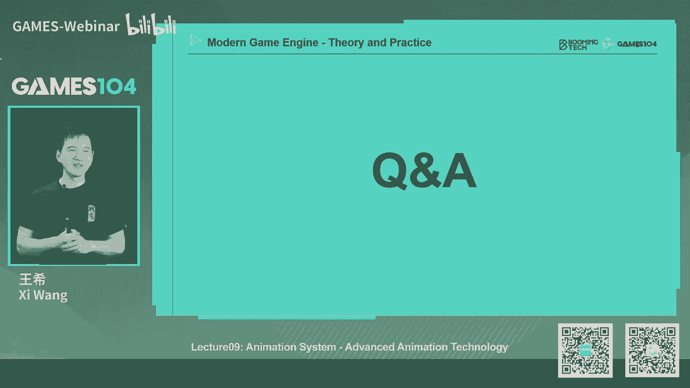
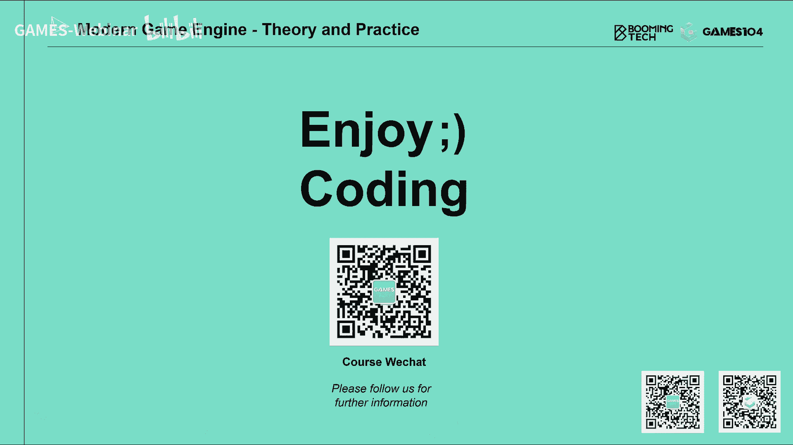

# 🎬 课程09：高级动画技术：动画树、IK和表情动画

在本节课中，我们将深入探讨现代游戏引擎中的高级动画技术。我们将学习如何将多个动画片段流畅地混合在一起，如何使用反向动力学（IK）让角色与环境自然互动，以及如何实现生动的面部表情动画。这些技术是构建一个真实可信、活灵活现的游戏角色的关键。

---

## 📊 动画混合技术

上一节我们介绍了基础的骨骼动画与蒙皮。本节中我们来看看如何将多个动画片段（Clips）平滑地混合，以实现角色动作的无缝过渡。

### 线性混合

动画混合的核心思想是线性插值。例如，一个角色从走到跑，我们可以根据其当前速度，在“走”和“跑”两个动画片段之间进行插值，而不是生硬地切换。

以下是计算混合权重的简单公式：
```
weight_walk = (speed_run - current_speed) / (speed_run - speed_walk)
weight_run = 1 - weight_walk
```
其中，`speed_walk` 和 `speed_run` 分别是走路和跑步动画对应的预设速度，`current_speed` 是角色当前的实际速度。确保 `weight_walk + weight_run = 1`。

### 混合空间

当控制变量不止一个时（如同时控制移动速度和方向），就需要使用混合空间。

*   **一维混合空间**：例如，用摇杆控制角色向左慢走、向左快走、站立、向右慢走、向右快走。这些动画片段在速度轴上可以不均匀分布。
*   **二维混合空间**：这是更常见的情况，例如用摇杆的X和Y轴控制角色向各个方向移动。动画师会制作多个方向（如前、后、左、右、斜向）的动画作为采样点。

以下是实现二维混合空间的一种方法：
1.  将所有动画采样点置于二维坐标中。
2.  使用**德劳内三角剖分**算法，将这些点连接成三角形网格。
3.  对于任意输入的控制向量（即二维空间中的一个点），找到其所在的三角形。
4.  使用该三角形三个顶点（即三个动画片段）的**重心坐标**进行插值，得到最终的动画姿势。

### 骨骼遮罩混合与叠加混合

有时我们只希望动画影响角色的特定部位。

*   **骨骼遮罩混合**：为动画指定一个骨骼遮罩，只让受影响的骨骼参与混合。例如，下半身播放走路动画，上半身同时播放挥手动画。
*   **叠加混合**：在基础动画之上，再叠加一个表示变化量的动画（通常是旋转或位移的偏移量）。例如，在角色各种姿势的基础上，叠加一个“点头”或“看向玩家”的动画。但需注意过度叠加可能导致关节旋转异常。

---

## 🌳 动画状态机与动画树

仅仅有混合还不够，我们需要一个系统来管理角色动画状态之间的逻辑切换与复杂组合。

### 动画状态机

动画状态机定义了角色动画的各种状态（节点）以及状态间的转换条件。例如，一个跳跃动作可以分解为“起跳”、“空中循环”、“落地”三个状态节点，并根据角色是否按下跳跃键、是否到达最高点、是否接触地面等条件进行切换。

每个转换可以定义过渡时间（如0.2秒）和过渡曲线（如线性或缓入缓出），以实现平滑的状态切换。

### 动画树

动画树是动画状态机更强大、更灵活的演进。它将动画混合表达为一棵节点树，最终输出一个动画姿势。

*   **节点类型**：
    *   **叶子节点**：通常是原始的动画片段、混合空间或一个子状态机。
    *   **中间节点**：执行混合操作的节点，如线性插值节点、叠加混合节点、骨骼遮罩节点等。
*   **控制变量**：动画树的灵魂。游戏逻辑（如玩家输入、角色血量、环境状态）通过修改变量（如 `speed`, `health`, `is_jumping`）来影响动画树中各个混合节点的权重，从而控制最终输出的动画。
*   **嵌套与递归**：动画树的强大之处在于其可嵌套性。一个状态机节点内部可以包含另一棵动画树，提供了极高的自定义能力。

通过动画树，设计师可以直观地搭建出极其复杂的角色动画行为逻辑。

---

## 🤖 反向动力学

之前我们讨论的都是前向动力学：从根骨骼开始逐级驱动子骨骼。而反向动力学则相反：给定末端效应器（如手或脚）的目标位置，反向求解整条骨骼链中各个关节应如何旋转。

### 两骨骼IK

这是最简单的情况，例如调整角色的脚踝位置使其踩踏地面。已知大腿骨长度 `L1`、小腿骨长度 `L2` 以及目标点 `P`，可以通过解三角形唯一确定膝关节的角度。但解空间是一个圆环，通常还需要一个参考向量（如角色面朝方向）来从两个可能的解中选出正确的一个。

### 多骨骼IK

对于更长的骨骼链（如整条手臂或脊柱），求解更为复杂。以下是两个经典算法：

1.  **循环坐标下降法**：一种启发式迭代算法。从末端关节开始，将其向目标点方向旋转一小步；然后处理上一个关节，重复此过程；再从根关节向末端关节进行反向调整。多次迭代后，末端效应器将逐渐逼近目标点。此算法简单高效，易于加入关节约束。
2.  **FABRIK算法**：另一种迭代算法。分为向前和向后两个阶段。向前阶段从末端开始，将关节逐个拉向目标点；向后阶段从根关节开始，将关节逐个拉回原始位置。经过多次迭代收敛。其思想也易于结合关节角度限制。

### 雅可比矩阵与物理IK

对于多目标点约束（如攀岩时双手双脚都需要固定）或要求解更符合物理规律的运动，会使用更数学化的方法，如基于雅可比矩阵的数值优化方法，或基于物理的IK解法。这些方法计算量更大，但能产生更自然、更稳定的结果。

IK的挑战在于解的自然性（像人）、避免骨骼穿插、以及保持角色平衡。

---

## 😀 表情动画

让角色面部生动起来是提升沉浸感的关键。

### 动作编码系统与形变动画

电影工业广泛使用的FACS系统将人类表情分解为数十个**动作单元**。在游戏中，我们常用形变动画来实现。

*   **形变动画**：为每个AU制作一个形变目标（Morph Target），存储该表情下所有顶点相对于中性表情的偏移量。
*   **混合**：通过线性混合多个AU的形变目标，可以组合出复杂的表情。例如，混合“张嘴”和“闭眼”两个目标，可以得到“打哈欠”的表情。
*   **结合骨骼动画**：对于眼球转动、下颌开合等大范围运动，通常使用骨骼动画。细腻的皮肤褶皱、酒窝等则用形变动画表现。二者结合，并辅以法线贴图等材质变化，能创造出极其逼真的面部表情。

### 表情动画的重定向

与身体动画类似，我们也希望一套表情动画能用于不同脸型的角色。基本方法是将形变偏移量直接应用到目标模型上。但对于有明确接触约束的动作（如闭眼、抿嘴），需要额外的处理（如使用拉普拉斯变形）来保证上下眼睑、嘴唇等部位能正确闭合。

---

## 🔄 动画重定向

动画重定向旨在将一套动画（源动画）应用到骨骼结构或比例不同的角色（目标角色）上。

### 基本重定向

核心是保持骨骼间的相对旋转。将源动画中每一根骨骼相对于其绑定姿势的旋转，直接应用到目标角色的对应骨骼上。对于位移和缩放，则根据骨骼长度比例进行缩放。

### 挑战与优化

简单的重定向会导致问题，如脚部悬空或踩入地面（因腿长不同）。解决方案包括：
1.  根据角色身高比例调整根骨骼的垂直位移。
2.  在重定向后，对脚部等关键部位施加IK，将其约束在地面上。
3.  对于拓扑结构不同的骨骼（如脊椎骨数量不同），可以通过在骨骼链上参数化映射来解决。

高质量的重定向还需要处理骨骼穿插、动作语义保持（如鼓掌时双手要能合拢）等问题，是一个活跃的研究领域。

---

## 📝 总结

本节课中我们一起学习了现代游戏引擎中三大高级动画技术：

1.  **动画混合与架构**：我们掌握了通过混合空间、状态机和动画树，将大量动画素材组织起来，并受游戏逻辑驱动，形成连贯角色行为的方法。这是前向动力学的核心。
2.  **反向动力学**：我们了解了IK如何让角色的动作与环境约束（如踩踏地面、抓握物体）相结合，大大增强了互动的真实感。CCD和FABRIK是实用的算法起点。
3.  **表情动画与重定向**：我们学习了如何通过形变动画和骨骼动画创造生动的面部表情，以及如何通过重定向技术最大化动画资源的利用率，让不同体型、不同面貌的角色都能“动起来”。





掌握这些技术，你就拥有了构建一个专业级游戏角色动画系统的基础。每一项技术深入下去都有广阔的探索空间，希望本节课能为你打开这扇大门。