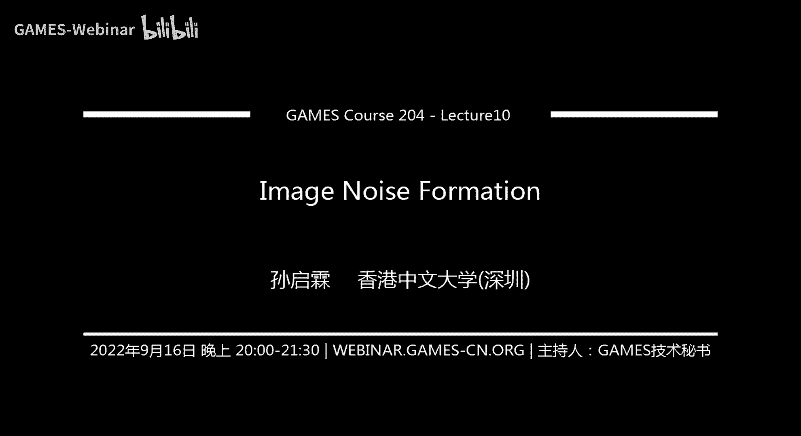
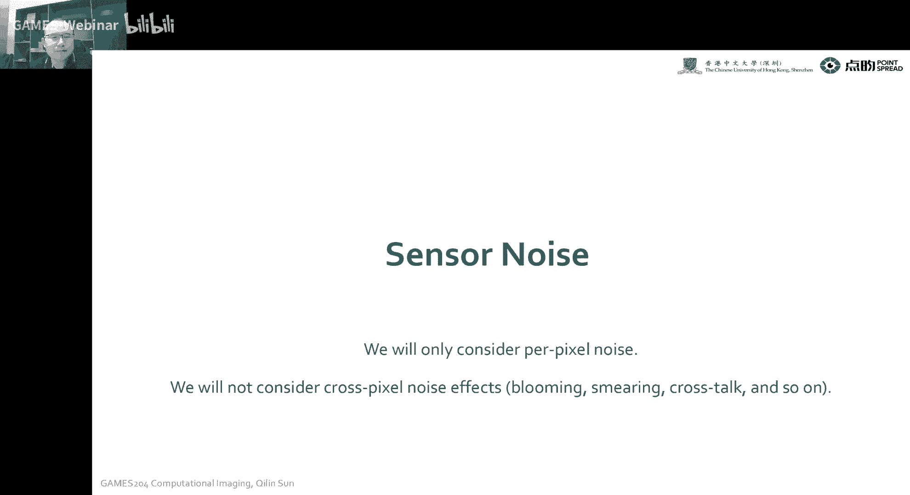
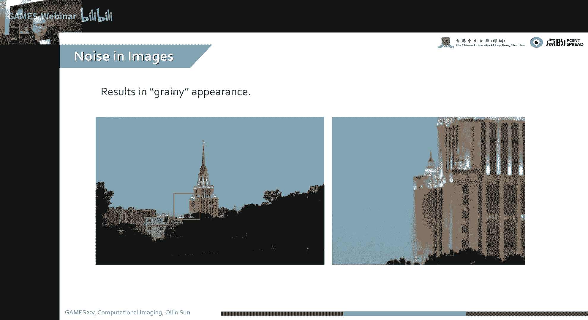
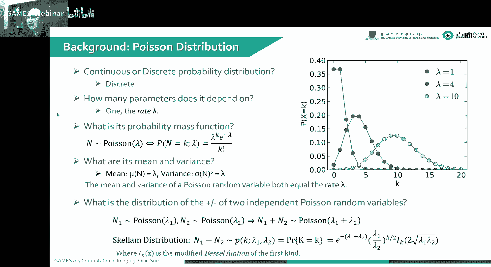
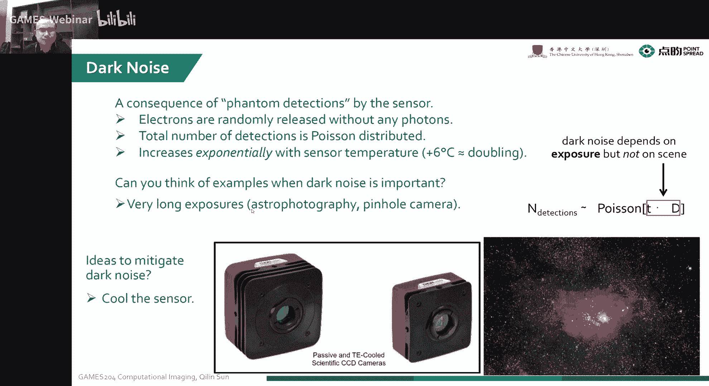
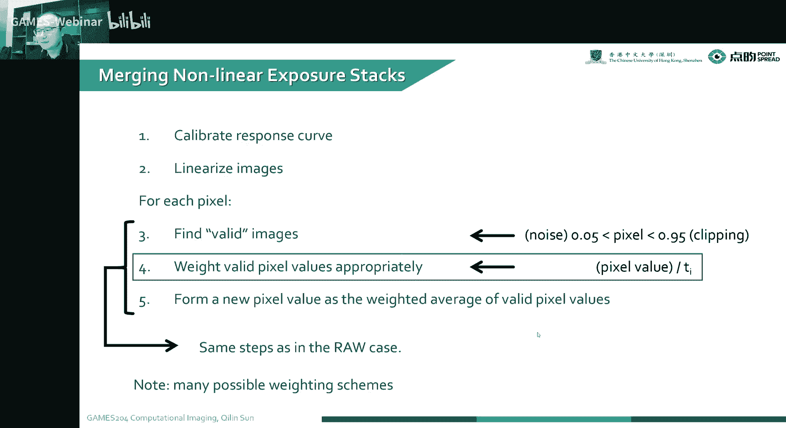
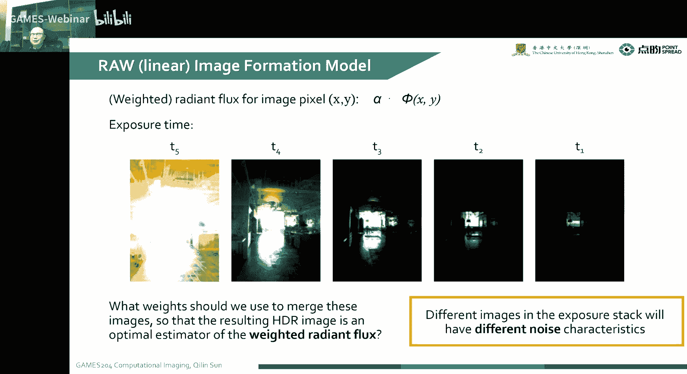
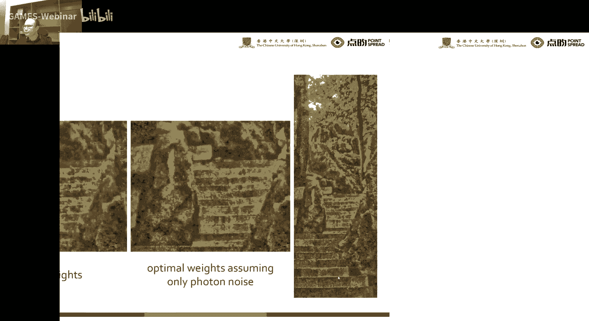
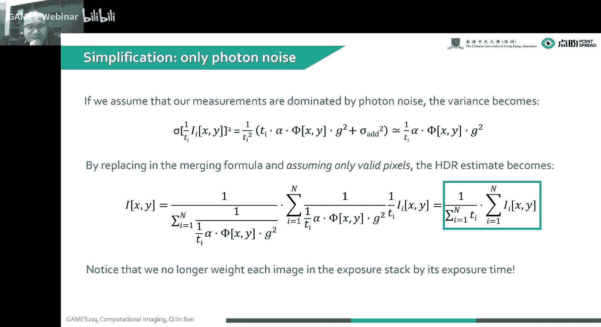

# 10. 成像过程的噪声分析 ｜ GAMES204-计算成像 - P1 - GAMES-Webinar - BV1NV4y1u7xd

**概述**： 本节课将深入探讨成像过程中的噪声问题，分析噪声的形成过程、影响以及如何进行噪声标定和优化。

### 1. 噪声的类型

*   **固定模式噪声 (FPN)**: 由传感器本身的缺陷引起，例如像素排列、电路设计等。
*   **随机噪声**:
    *   **光子噪声 (PN)**: 由光子到达传感器时的随机性引起。
    *   **暗电流噪声 (DCN)**: 由传感器内部的电子运动引起。
    *   **读出噪声 (RON)**: 由传感器读出电路的噪声引起。
    *   **量化噪声 (QN)**: 由模数转换过程中的量化误差引起。

### 2. 噪声的形成过程

1.  **光子到达传感器**： 物体反射或发出的光子到达传感器，产生光电流。
2.  **暗电流**： 传感器内部存在暗电流，会引入噪声。
3.  **光电转换**： 光电流转换为模拟电压信号。
4.  **放大**： 模拟电压信号经过放大器放大。
5.  **模数转换**： 模拟电压信号转换为数字信号。
6.  **量化**： 数字信号进行量化，引入量化噪声。

### 3. 噪声标定

*   **暗电流标定**： 通过拍摄全黑图像，计算暗电流的均值和方差。
*   **读出噪声标定**： 通过拍摄灰度图像，在不同灰度级别下计算读出噪声的均值和方差。
*   **量化噪声标定**： 通过测量ADC的分辨率，计算量化噪声的方差。

### 4. 噪声优化

*   **降低曝光时间**： 减少光子噪声。
*   **降低ISO值**： 减少读出噪声。
*   **使用低噪声传感器**： 选择低噪声的传感器。
*   **图像融合**： 将多张图像融合，降低噪声。

### 5. 应用实例：HDR 合成

*   **噪声模型**： 建立噪声模型，考虑噪声对图像质量的影响。
*   **最优位置**： 根据噪声模型，选择最优的HDR合成位置，提高图像质量。

**总结**： 本节课深入探讨了成像过程中的噪声问题，分析了噪声的类型、形成过程、标定和优化方法。通过学习本节课，可以更好地理解噪声对图像质量的影响，并采取相应的措施降低噪声，提高图像质量。