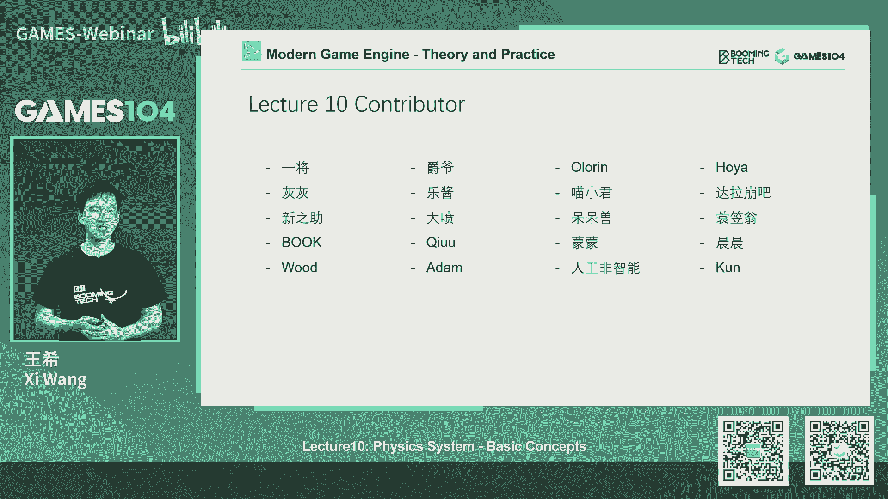

# 课程10：游戏引擎中物理系统的基础理论和算法 🎮 | GAMES104-现代游戏引擎：从入门到实践

在本节课中，我们将学习游戏引擎物理系统的基础理论和核心算法。物理系统是构建游戏世界真实感与交互性的基石，理解其基本概念对于使用或开发游戏引擎至关重要。

---

## 课程概述与社区更新

在开始今天的课程之前，先同步一下社区动态和小引擎的更新计划。

我们计划在未来开源 MetaPasser，目前暂未开源是担心其编译过程过于复杂，增加初学者的学习负担。我们会在小引擎架构更稳定后推进此事。

关于小引擎的 Wiki 文档，我们会持续编写和更新，以帮助大家更好地理解其约3万行代码的结构。

有同学提议用专业视角分析游戏中的穿帮镜头，但作为开发者，我们深知制作复杂系统的艰辛，因此更关注整体游戏性，而非个别瑕疵。

上周发起了为小引擎征名的活动，收到了许多有趣的建议。课程组正在核查名称的可用性，之后会将候选名单及寓意公布在社区，由大家投票决定。

明天小引擎将有一次较大更新。首先，感谢社区贡献者，为引擎加入了 FXAA 抗锯齿功能。其次，我们重构了引擎框架，简化了过于复杂的单例机制和组件系统，让生命周期管理更清晰。渲染管线也经过了大幅精简和优化，移除了冗余概念，目前提供了一个更简单的 RHI（渲染硬件接口）版本。此外，编辑器和引擎的输入处理等分层也变得更加清晰。还有社区贡献的代码编辑辅助工具，提升了在不同 IDE 中的开发体验。希望新版本能让代码更易读、更易上手。

我们对 Pilot 这个小引擎已有感情，其图标也很喜欢，但最终会采用社区投票选出的新名字。

---

## 物理系统的重要性

上一节我们同步了社区和引擎的进展，现在正式进入课程内容。我们从动画模块进入到物理模块。

物理系统至关重要，它是玩家对游戏世界产生直觉认知的核心。没有物理，玩家很难相信世界的真实性。角色的运动、与环境的互动都依赖物理。

物理能构建动态环境，直接影响游戏玩法。例如，一堵墙会改变玩家的视野和战术策略。

物理创造了真实、可交互的世界。例如，在 VR 游戏中，物理模拟能带来极强的沉浸感。

现代游戏引擎中的许多表现，如粒子、烟雾、水体和布料模拟，都高度依赖物理系统。

以上种种，都依赖于游戏内的物理系统或物理引擎。因其复杂性，我们计划用两节课讲解。本节课聚焦基础概念，让大家理解如何用物理语言描述世界，以及物理引擎的核心元素与关系。我们会点到一些底层算法，但初学者只需掌握基本概念，知道如何接入一个物理引擎即可。下节课将探讨更高级的主题，如角色控制、布娃娃系统、破坏模拟、载具系统以及前沿的位置动力学（PBD）方法。

---

## 物理世界的基本对象：Actor 与 Shape

首先，我们需要理解物理世界中的基本对象，一般称为 Actor 或 Shape。

在游戏引擎中，我们实际上在两个世界中进行模拟：一个是渲染与动画表现的视觉世界；另一个是进行逻辑与物理模拟的“孪生”世界。物理 Actor 就存在于这个逻辑世界中。

物理 Actor 主要分为四类：

以下是各类 Actor 的详细介绍：

1.  **静态 Actor**：在场景中固定不动的物体，如地面、墙壁。它们是游戏中数量最多的物理对象，构成了世界的基础碰撞体积。
2.  **动态 Actor**：符合动力学原理的物体，如可以被推动的箱子。它们会受到力、重力、摩擦力的影响，产生运动。
3.  **触发器**：一种特殊的 Actor，用于游戏逻辑触发。当其他 Actor 进入其范围时，会触发特定事件（如开门）。它不参与物理解算，只负责发送消息。
4.  **运动学 Actor**：由游戏逻辑（如动画）直接驱动位置和旋转的物体，其运动不遵循牛顿力学。它常用于需要精确控制的物体（如角色的某些骨骼），但因其“反物理”的特性，若处理不当，在与动态物体交互时可能产生巨大的力，导致物理模拟不稳定，是常见的 Bug 来源。

回顾一下，理解物理引擎首先要理解其处理的对象：静态物体构成世界基础；动态物体提供符合物理的运动；触发器连接游戏逻辑；运动学物体提供精确控制但需谨慎使用。

---

## Actor 的形状：Shape

Actor 有一个关键属性：Shape（形状）。在物理计算中，为了高效进行碰撞检测等运算，我们通常使用解析形式简单的几何体来近似表示物体。

以下是几种常见的物理 Shape：

1.  **球体**：由一个中心点和半径定义。求交计算最简单。
2.  **胶囊体**：由两个半球体和一个圆柱体组成。常用于近似表示游戏中的角色。
3.  **长方体**：由中心点、尺寸和朝向定义。应用广泛。
4.  **凸包**：一个封闭的、没有凹陷部分的多面体。能表达更复杂的形状，但计算成本高于前三种。
5.  **三角形网格**：用网格数据精确表示复杂形状（如整个建筑）。通常仅用于静态物体，因为动态碰撞检测计算量极大。
6.  **高度场**：用于表示地形，是处理地面碰撞的高效方式。

每种 Shape 都有其适用场景。球体用于球类物体；胶囊体用于人形角色；长方体用于大多数规则物体；凸包用于较复杂的可破碎物体；三角形网格用于精细的静态场景；高度场专用于地形。

在游戏中使用 Shape 的原则是：**用尽可能简单的形状进行近似包裹**。能使用球体、胶囊体、长方体时，就不要使用更复杂的凸包或三角形网格，以优化性能。

---

## Shape 的属性和物理材质

Shape 除了几何形状，还有其他重要属性。

**质量与密度**：每个 Shape 需要定义其质量或密度，这决定了物体受力后的运动惯性。物理引擎通常假设物体的质量是均匀分布的。

**质心**：物体的质量中心。在进行旋转模拟（特别是载具系统）时，质心的位置至关重要，它直接影响物体的稳定性。

**物理材质**：此处的物理材质与渲染中的 PBR 材质不同，它定义的是物体表面的物理交互属性。

物理材质主要定义两个属性：
*   **摩擦力**：物体表面粗糙程度的度量。
*   **弹性**：物体碰撞后恢复原状的能力，即反弹系数。

设置不同的物理材质，会使物体的行为（如滑动、弹跳）截然不同。一些引擎可能提供更多参数。

---

## 力与运动

有了物体（Actor/Shape），接下来需要让它们动起来，这就需要引入“力”。牛顿力学告诉我们，力是改变物体运动状态的原因。

游戏中最常用的两种力是：
*   **持续力**：如重力、拉力、摩擦力。它们在一段时间内持续作用，影响物体的运动。
*   **冲量**：在极短时间内施加的力，如爆炸冲击、撞击。它可以瞬间改变物体的动量。

这两种力本质相关：力乘以作用时间就等于冲量。

---

## 运动的数学描述：数值积分

在游戏世界中，我们用离散的数学方法来模拟连续的运动。

**牛顿第一定律（匀速直线运动）** 可以用以下公式描述：
*   速度不变：`V(t+Δt) = V(t)`
*   位置更新：`X(t+Δt) = X(t) + V * Δt`

**牛顿第二定律（力与加速度）** 描述了更普遍的情况。当物体受外力作用时，其速度会改变。在变加速运动中，我们需要通过积分来计算速度和位置。

核心问题是：我们无法在计算机中求得连续运动的解析解，只能将时间切成小段（Δt），用数值积分的方法进行近似模拟。

以下是三种常见的数值积分方法：

1.  **显式欧拉法**：用当前时刻的状态预估下一时刻。
    *   公式：`V(t+Δt) = V(t) + a(t) * Δt`； `X(t+Δt) = X(t) + V(t) * Δt`
    *   **优点**：简单直观。
    *   **缺点**：稳定性差，容易导致能量不守恒，模拟可能发散（如轨道越来越远）。

2.  **隐式欧拉法**：用未来时刻的状态反向推算当前。
    *   **优点**：无条件稳定，能量会衰减但不会爆炸。
    *   **缺点**：需要求解方程，计算复杂。

3.  **半隐式欧拉法**（推荐）：一种折中且高效稳定的方法。
    *   步骤：
        1.  用当前受力计算加速度：`a(t) = F(t) / m`
        2.  用加速度更新速度：`V(t+Δt) = V(t) + a(t) * Δt`
        3.  用**新速度**更新位置：`X(t+Δt) = X(t) + V(t+Δt) * Δt`
    *   它假设在 Δt 时间内力保持不变，用更新后的速度来计算位移，在稳定性和计算成本之间取得了良好平衡，是游戏物理模拟中最常用的方法。

通过数值积分，我们得以在离散的时间步长中模拟连续的物理世界。

---

## 刚体动力学基础

之前我们主要将物体视为质点，只考虑其位置移动。但真实物体还有旋转，这就需要引入**刚体动力学**。刚体假设物体内部各点相对位置不变。

描述刚体旋转涉及以下概念，它们与质点运动的概念有对应关系：

| 质点运动 | 刚体旋转 | 描述 |
| :--- | :--- | :--- |
| 位置 **X** | 姿态 **Orientation** | 物体的朝向，可用旋转矩阵或四元数表示。 |
| 速度 **V** | 角速度 **ω** | 一个向量，方向表示旋转轴，长度表示旋转快慢（弧度/秒）。 |
| 加速度 **a** | 角加速度 **α** | 角速度的变化率。 |
| 质量 **m** | 转动惯量 **I** | 一个 3x3 的张量，描述物体抵抗旋转改变的程度，取决于质量和形状分布。 |
| 动量 **p = m·v** | 角动量 **L = I·ω** | 旋转运动的“运动量”，在不受外力矩时守恒。 |
| 力 **F** | 力矩 **τ** | 引起旋转改变的原因，`τ = r × F`，其中 r 是力臂向量。 |

这些概念构成了刚体运动的基础方程。在实际使用中，物理引擎会根据你提供的 Shape 和密度自动计算转动惯量。开发者需要理解这些概念的对应关系，但通常无需手动推导复杂公式。

一个简单的例子是花样滑冰运动员：收拢手臂时，转动惯量减小，由于角动量守恒，角速度会增大，从而旋转得更快。

---

## 碰撞检测

物理对象要相互作用，必须检测它们是否接触，这就是**碰撞检测**。关闭碰撞检测，物体就会像幽灵一样穿过彼此。

现代物理引擎的碰撞检测通常分为两个阶段：

1.  **粗检测**：快速筛选出**可能**发生碰撞的物体对，剔除明显不碰撞的物体。常用算法有：
    *   **BVH**：层次包围盒树。动态更新效率高，适合物体频繁移动的场景。
    *   **Sort and Sweep**：将物体的轴对齐包围盒投影到坐标轴上并排序。如果两个物体在所有轴上的投影区间都重叠，则它们可能碰撞。该方法对静态居多的场景效率极高。

2.  **精检测**：对粗检测筛选出的物体对，进行精确的几何求交计算，并获取碰撞详细信息（碰撞点、法线、穿透深度）。这些信息对于物理响应和游戏反馈（如播放声音、特效）至关重要。

对于简单形状（球、胶囊、长方体），求交算法相对直接。对于复杂的凸包形状，则需要更高级的算法：

*   **GJK 算法**：基于**闵可夫斯基差**概念的迭代算法。它将两个凸包是否相交的问题，转化为一个点（原点）是否在另一个凸包（两凸包的闵可夫斯基差）内的问题。该算法能快速收敛，得出是否碰撞的结论。
*   **分离轴定理**：该定理指出，两个凸包若不相交，则必定存在一条直线（或一个平面），能将它们在直线上的投影分开。算法通过检测两个凸包所有面的法向轴以及所有边的叉乘方向构成的潜在分离轴，来判断是否分离。只要找到一个分离轴，即可判定不相交。

这些算法思想优美且高效，是物理引擎的核心。在实际开发中，我们通常直接使用物理引擎提供的功能，但理解其原理有助于更好地使用和调试。

---

## 碰撞响应与约束求解

检测到碰撞后，需要解决碰撞，即让物体分开并做出符合物理规律的反应。

早期简单的方法是施加**惩罚力**，根据穿透深度施加一个反向力将物体推开。但这种方法容易导致力过大，使物体“炸飞”，显得不真实。

现代物理引擎更常使用**约束求解**的方法。它将物理问题转化为数学上的约束优化问题（借鉴拉格朗日力学）。当发生穿透时，求解器会尝试施加一系列小的冲量（而非单个大力），迭代地修正物体的速度和位置，直到满足“不穿透”等约束条件，并且误差在可接受范围内。

常用的迭代算法是**高斯-赛德尔**方法。求解器会设定最大迭代次数或误差阈值作为退出条件。这种方法能得到更稳定、更真实的碰撞效果。

---

## 物理查询

除了被动检测碰撞，游戏逻辑经常需要主动向物理世界提问，这就是**物理查询**。

主要有三种类型的查询：

1.  **射线检测**：发射一条射线，检测沿途击中的物体。
    *   `RaycastMultiple`：返回所有击中点。
    *   `RaycastClosest`：返回最近的击中点。
    *   `RaycastAny`：只关心是否击中，不关心具体点，性能最高。
2.  **形状扫描**：将一个形状（如胶囊体）沿路径扫描，检测其扫过的体积内是否发生碰撞。这对于角色移动检测非常有用。
3.  **重叠检测**：给定一个形状，检测在当前世界中有哪些物体与其体积有重叠。常用于爆炸范围判定等。

为了提高查询效率，物理对象通常会分到不同的**碰撞层**。查询时可以指定只检测特定层的物体，例如子弹不检测触发器。

---

## 性能优化与高级概念

物理模拟计算量大，需要精心优化。

*   **岛屿与休眠**：物理引擎会将相互关联的动态物体分组为“岛屿”。当一个岛屿内所有物体都趋于静止（速度低于阈值）时，整个岛屿会进入“休眠”状态，引擎不再对其进行物理计算，直到有外力将其唤醒。这能大幅提升性能。
*   **连续碰撞检测**：当物体移动速度过快时，可能在两帧之间直接穿过另一个薄物体，称为“隧道效应”。CCD 通过在两帧之间进行更密集的检测或使用扫描形状来避免此问题，对高速运动的物体（如子弹、赛车）很重要。
*   **确定性**：对于网络游戏，确保在不同客户端上，相同的输入经过物理模拟后得到完全相同的结果，称为确定性。这非常困难，受浮点数精度、迭代顺序、积分步长等多种因素影响。实现确定性是物理引擎的挑战之一，它对于网络同步至关重要。

---

## 总结

本节课我们一起学习了游戏引擎物理系统的基础理论和核心算法。

我们首先了解了物理系统在构建游戏真实感和玩法方面的重要性。然后，深入探讨了物理世界的基本构成元素：四种类型的 Actor（静态、动态、触发器、运动学）以及各种简化后的 Shape（球体、胶囊体等）。

我们学习了如何通过力和数值积分（特别是半隐式欧拉法）来描述和模拟物体的运动。接着，引入了刚体动力学的概念，将旋转运动与质点运动进行类比。

在碰撞处理部分，我们了解了粗检测和精检测的两阶段流程，以及 GJK 算法和分离轴定理的核心思想。碰撞响应则从简单的惩罚力发展到现代的约束求解方法。

此外，我们还介绍了物理查询的常见操作、以及岛屿休眠、CCD、确定性等高级概念和性能优化手段。

物理系统是游戏引擎中最复杂也最迷人的模块之一，它用数学和代码构建了虚拟世界的运行法则。掌握这些基础知识，是进一步使用或开发物理功能的关键。下节课，我们将探索角色控制、布娃娃、破坏等更高级的物理应用。