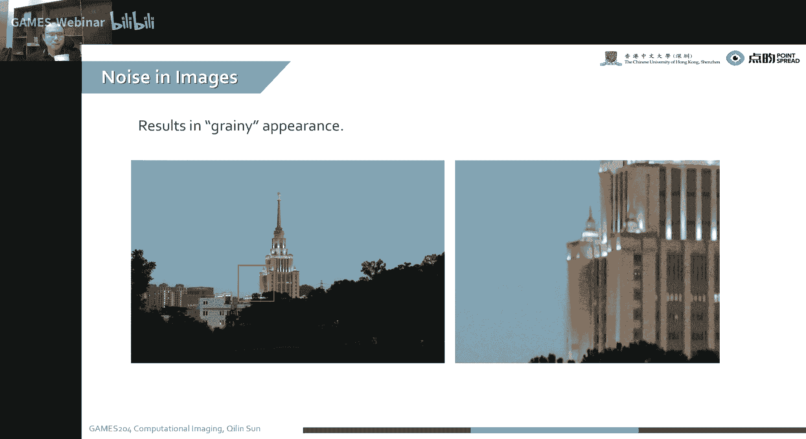
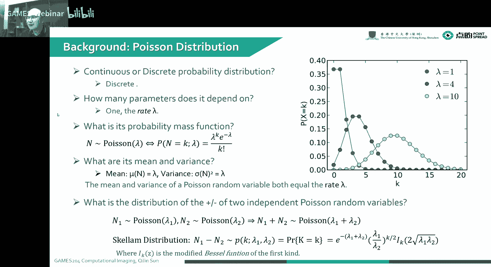
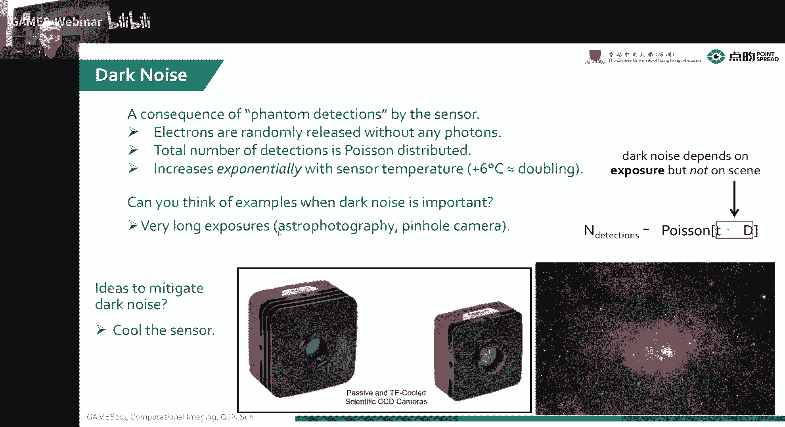
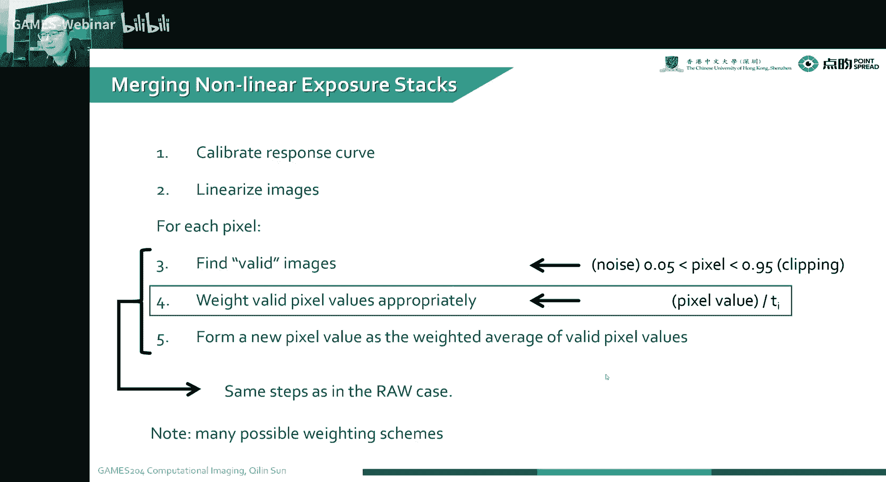
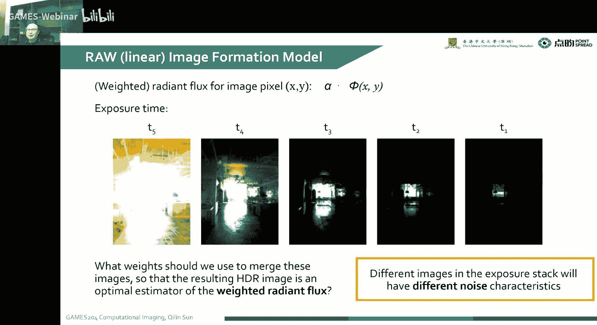
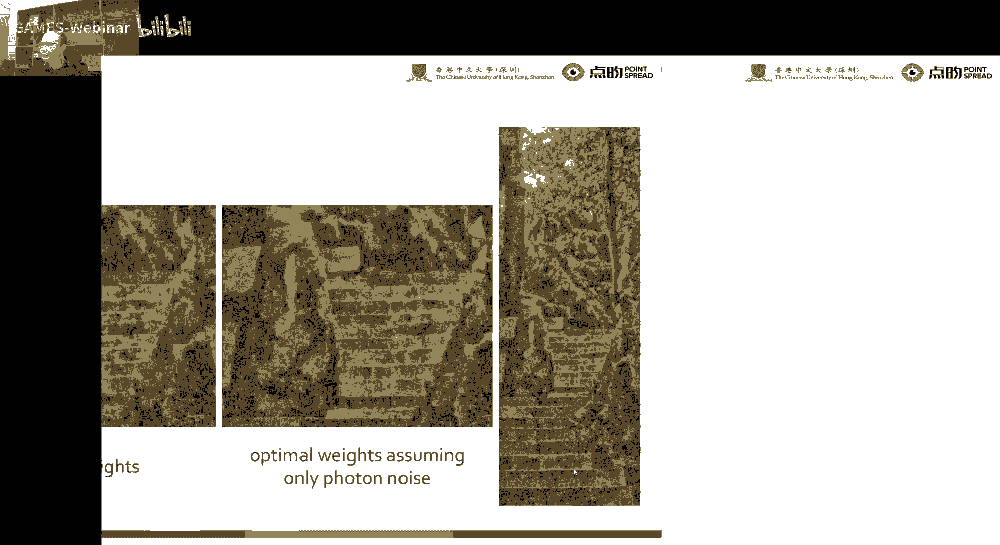

# 10.成像过程的噪声分析 ｜ GAMES204-计算成像 - P1 - GAMES-Webinar - BV1NV4y1u7xd

今天会给大家嗯这个聊一聊这个噪声的问题，因为本身对我们一个计算成像的一个系统，大家我们知道，有时候我们的图像最后的捕捉在传感器上，就是一个图像，经过一个image formation的图像再加一个噪声。

实际上这个噪声本身是对我们整个计算摄影，恢复逆问题的一个瓶颈所在，也就是这个噪声会直接影响到你之后呃，就恢复的质量，假设就是比如说我们简单一点，做一个ct里面的random transform。

完全没有噪声的情况下，就可以直接恢复出来，理想的一个三维的，一个就是人的一个身体细胞结构诶，但是有这个噪声呢，就会呃，直接限制我们这个最后拿到了这个图像的质量，或者是最后恢复出来信号的质量。

但除了这个噪声的瓶颈，我们还有带宽的瓶颈，就整体计算摄影就有两个瓶颈问题，一个就是噪声，另外一个就是大家可以理解为是呃，这个就是整个系统的带宽，也包括光学系统的带宽，还有这个嗯最后传感器的一个带宽。

再等一等这个大家八点的时候正式开始，就今天就给大家分享，我们从这个光，然后我们打到传感器，到最后我们拿到绕图这个读出来，这个究竟这个噪声一步一步是怎么形成的，而且这个会对。

比如说像我们之前讲到了一个HDR这个fusion，我们之前讲到的HDR fusion会受造成影响吗，怎么样才能拿到一个最优的，这么一个这么一个fusion的位置。

所以说今天就给大家分享这个image noise formation，这一块还挺好玩的，因为从传感器啊本身这个噪声是非常复杂的，我们先从一个固定模式噪声，也叫fixed patternoise出发。

就是它有非常多的来源哈，除了像我们常见到的一个呃，我们课上讲课上会讲到的一个光子噪声啊，啊还有暗电流噪声，这个本身这个固定Python noise，首先它是跟暗电流的非一致性有关系。

就我们这个属性以及很多工艺的问题嗯，这个很多信号它一致性不是特别好，那所以说就是为什么很多这个手机主摄，就是很多大的一些手机厂家，手机主摄用的基本上永远都是，当然高端机型号永远都是这个用的都是索尼的。

就是因为索尼这个工艺好，导致他这个一致性比较好，所以对整个研发工程师，后面做这些乱七八糟的标定啊，噪声估计啊我没有那么麻烦，所以大家选主设的时候，通常会选择索尼的一个主摄，那其他家通常都是嗯。

在一些就是不是很专业的图像的一个啊，防止去流片，比如说像台积电，他留那种电路很厉害啊，但是如果做这个图像传感器啊，它那个工艺比索尼还是差了一些，但除了这些。

还有一些嗯跟像素相关的一个fix pc noise，还有像行列，我们读出了一个fix pd noise，这个还有一些跟阴影相关，跟SHADER相关啊，还跟边缘这个市场相关，这个这个固定模式造成啊。

其实本身就已经是挺复杂的了，但除了这个固定模式噪声，我们嗯就是更跟我们更息息相关的，是一个就是暂态噪声，比较temple noise，就包括我们的就是读书噪声，放大噪声，还有复位噪声，还有光子散粒噪声。

然后这个时候都会影响到我们，最后拿到了成像的一个质量，那除此之外，就像我们知道，就是哪怕我们完全在黑暗的情况下，我这个图像传感器读出来的值，总还是有一些就是完全黑暗的情况下拿到的值。

这个时候就叫按电荷的积累，也就是有暗电流，最后积累按电荷，然后按电荷呢，就会始终会有一个那么小的一个噪声值在那，但是这个按电荷呢，又会限制了我整个图像传感器的一个动态范围，对不对。

大家可以想我出图像传感器动态范围，就是我捕捉到最大值，比如最小值，我这个安田鹤搁这儿，好家伙，这个最小值始终有个值，它们之间的比值就会受到这个暗电荷，也就是暗电流暗噪声的一个影响。

所以说今天就给大家正式分享啊，这个一个就是image noise的一个formation，今天我们我们会从三个角度，四个角度吧来给大家分享这个噪声，然后结合三个呃。

包括像整个image sensor noise的一个形成过程啊，我们这个signal to noise ratio，我们噪声去怎么去标定，然后就根据因为像我们之前讲过到这个HDRMOJ。

但是很多在不同层级，不同曝光等级下，我们最后这个造受到噪声的影响，我们之前的那个只是考虑到就radiant flux，然后去确定它的一个位置，这个时候是不是特别科学，就我们有没有一种方法去发现它的一个。

optimal位置，那么考虑噪声的情况下，找到一个最优的一个位置，在各个通道之间呢，就是说今天就呃要给大家说一下这个噪声，那这个噪声我们就首先忽略掉，我们只考虑到每个像素自己的噪声啊。

就是因为这个cross channel，这个这个这个噪声还是特别复杂，就不在课上去给大家覆盖这些问题了。

说到图像里的噪声，就我们这个手机一拍照，好家伙，这个直接一拍，看着挺好看，但是我们放大放大，放大到非常小的一些细节的时候，特别是我们拍，特别是白天或者傍晚拍那个天空诶，我们就可以看到右边这个。

像一粒一粒的这种噪声的感觉，所以大家这个对这个观感非常不好，这个就是出现在图像里的噪声，而且这个噪声还得是经过一定的滤波之后哈，那个本身那个噪声实际上还是比较大的。

那我们复习一下，就是我们前面几节课就讲到这个从hot到raw image，的一个简略的过程啊，之前我们给大家说打了个预防针，他这个过程呢就是我们光子打到传感器上。

这个传感器呢有它自己的一个fixed patternoise，也就是有他的大current啊，啊一些引起的一个呃fixed patternoise，然后本身还有一个还有一个他自己的。

因为光子随机到达传感器上，引起了一个photo noise，然后经过一系列的放大，然后还有一个增益啊，包括模拟的增益啊，还有ISO诶，这个时候又会因为这个IP的FY，这个过程中又引入噪声。

然后这个过程之后，我们要把这个模拟转换成数字哎，这个ADC也会产生噪声，但除了这个里面标的哈，这个我们在实际操作中，还会经常发现这个ADC啊，它有个参考电瓶，我们这个比如说把一个信号要拆解成12位嗯。

没接他，我们我们没接，把这个做量化，但这个时候我们里面一层一层的比较器，它是有一个参考电瓶的，诶，这个参考电瓶的这个电源质量，还会引入其他额外的噪声，这个对后面成像质量影响非常大，说这个。

但是这一般课程会覆盖不到这些问题，这跟很多电路设计就会比较有比较大的关系，本身这个image noise这个是怎么形成的呢，就是我们可以看到我们这个就是我们就是整个，首先是我们物体。

然后物体反射的光或物体发的光，它产生的一个radio flux，我们把它记为FI，这个FI抵达经过透，经过透镜，穿过透镜就抵达这个传感器，然后另一边呢就本身受限于期间自己。

他有自己的一个dark current，这个也会影响我们这个本身最后的一个，噪声的问题，诶这个大CURRENCE啊，我们就可以拿到在这个这个传感器上，这个传感器上它经过啊一系列这个曝光啊。

包括考虑到情感游戏本身的一个就是量子效率，比如说把它记为阿尔法诶，这个时候我们就会引入整个图像的一个，因为光子技术产生噪声，这个我们把它叫photo noise，然后因为本身就是要传感器自身的缺陷嗯。

包括像电子空穴对啊，不断的产生跟烟灭产生的电子啊，啊这个有叫dark current，呃，noise啊，有时候专业点的名词，这个叫额蟹符合唉，这个大家学这个半导体的时候，就可能会学到这个名词。

所以第一步我们就把呃，当然我们也会有其他的一些，因为非机性引起的噪声，这个我们是只考虑一个单个像素吗，我就不考虑这个问题了，当然这个我们也把这个曝光的情况下忽略掉，这个曝光其实就等效于clip。

超过这个值之后就捕捉不到了，就相当于clip一下，所以这个时候我们的噪声就有两部分，第一部分就是那么光子的一个基数噪声诶，第二个部分就是它的一个呃，这个因为暗电流引起的这个噪声。

但是这个暗电流啊它本身是一种热噪声啊，它实际上也是一个泊松过程，这个我们后面会讲到，然后这两个就加在一起，这两个噪声加上信号，我们就可以拿到一个就是模拟的一个电压值，就是L我们在这个地方。

然后这个时候这个L是叠加了啊，这个radiant flux在这个时间上的积分诶，再加上这个大CURRENCE在这个时间上的积分对吧，这个时候我就拿到了一个模拟的电压值，然后再经过这个模拟的放大。

就模拟放大有两部分，一个是对感光度ISO的调节，另一个就是一个模拟的增益，实际上这个ISO调啊基本上就是在调模拟增益呃，这个因为ISO本身这个感光度，是对一个模拟的胶片来去呃，描述模拟胶片的感光度的。

但是实际上我们这个数码相机他没有这回事，实际上我们最后调的也就是一个，就ADC的一个增益，就是那个运放的一个增益，所以说这个时候就会呃，比如说像我们就是在过这个运放之前，哎，我们这个放大的这个电压啊。

加点什么噪声，这个时候就会引起这个read out noise，然后经过这个放大之后，我们拿到了一个放大过后的一个模拟电压值，G就是放大过的L就是G哎，这个记忆我们要对它进行模数转换。

这个模拟电压值变成数字电压值，这个时候我们就会因为引起这个量化，ING的噪声，我们这时候叫量化噪声，这个叫A就这个叫AD c noise是ADC，noise本身就包含他自己的本身。

这个additive的一个noise，还有一个量化造成两部分啊，这个量化噪声我们暂时不考虑这个地方，那考虑到这个大家给大家补一下基础哈，就是我们这个正常的一个就是高斯分布。

也叫normal distribution，这个normal distribution呢就是我们从问题出发，就我们这个normal distribution，它是一个连续的这么一个呃。

Ability distribution function，也就是概率密度函数，它是一个连续的，然后这实际上这个大家可能都学过啊，就是啊总共有几个参数来描述这么一个。

就normal distribution呢，实际上我们有俩，第一个就是它的一个均值，我们即为谬，然后另一个就是它的一个呃叫标准差，我们叫standard deviation，是sigma。

那本身这个PDF也就是它的就是概率密度函数，这个咋写呢，实际上就是你记得n proportional to normal，然后这个就是它的一个分布，然后把前面这个均值写在前面，然后这个方差写到后面。

而最后我们就可以拿到它的一个呃，这个随X分布的这么一个函数，就随cos分布的函数，实际上这个就是正态分布，大家已经非常熟啊，这个大概其实就长得像这种中型这么一种感觉，然后我们也知道。

这个就是整个就是这个就正态分布的一个均值，跟它的方差，这个大家都学过，然后问一个问题啊，就是两个就是正态分布的一个核，这个是个啥分布嘞，其实它还是一个正态分布，对不对。

就是当然我们这个要把这个均值给扣掉，就不考虑就是让它是zero in的一个值，就是我们就沿着中心轴分布的，这么一个状态函数，把它们加起来，我们还会拿到一个新的一个正态分布的函数。

当然这个如果你这个没有值不一样，它最后就不一样了哈，这个大家要注意哈，这一定要是没有值一样的时候，这个才可以，考虑到另一种常见的分布嗯，这个我们本身这个background的就是把这个破松分布。

这个破松分布是个咋回事呢，实际上就是我们可以理解为，这个一个车站就陆陆续会来人，看来人他有一个速率哎，这个时候来的时候哎，就会产生一个他来了数据lambda，他来了个过程叫叫泊松过程诶，但是我们来了。

这个最后来了多少个人在这个分布呢，实际上就叫破松分布，host本身它是一个连续的，就是一个离散的一个过程啊，他只用一个呃破松的一个速率啊，拉姆达就表示就可以了啊。

本身啊这个叫poverty massive function，也就是这个概率累积函数，然后最后我那个破松分布咋表示呢，实际上就可以表示为啊，P当N等于K的时候。

他这个方程一它这个是一个lambda的一个方，关于兰姆达的一个方程，也就是lambda k e的负兰姆达，比上一个K阶乘的那么一个泊松分布的值，唉这个时候我们就可以看到它这个均值是啥嘞。

哎均值就是它的一个速率，这个方差是啥呢，方差也是它的速率啊，大家有兴趣的话，可以用一个最大自然估计啊，去估一下这个泊松分布的均值和方差，当然我们当这个K趋于无限大的时候，就是我们这个K值很大哈。

就是诶这个时候大家会发生什么现象呢，其实这个当这个K指标，就是相当于我们积累到一定程度的时候，就是做很多次累加，这个时候泊松分布就是等效成呃，这个正态分布诶，这个就是他大家用这个概率模型来去算一算。

这个就知道了，当然我们考虑到这个两个普通过程相加，它诶他是直接就是一个普通过程，这有两个，因为只有一个呃，这个RT嘛我们可以考虑到一个车站来两拨人，一个穿红衣服，一个穿蓝衣服的，红衣服的速率是兰姆达一。

蓝衣蓝衣服速率是兰姆达二，这个时候同时就来个人的概率是多少呢，莱姆一兰达一加兰姆达二，对不对，这个时候就是这个泊松分布的过程，当然我们这个地方说了一个scum distribution。

就两个破松相减的这么一个过程，这个时候会用到啥地方呢，就我们比如说一些比较特殊的一些传感器，叫那个top tom fly的传感器，它那个传感器比较特殊，它是一个传感器，后面有两个就是积分的一个B。

然后我用一个那池子去选，然后最后我拿到的值是两个，就是积分池子的相减，我两个池子里面都是一个普通分布诶，这个时候我们拿到了就是这个相减的值，就是两个破洞分布的相减，哎我们拿到了整个噪声的分布。

实际上就是一个skelement distribution，这个叫SKELEMENTRIDIRIBUTION，这不是很常见诶，这个是咋表示呢，这个式子就比较复杂了。

我们就需要一个modify的一个贝塞尔方程，就是第一就是第一种方式的一个贝塔方程，来表示它，所以说就是有时候解这个top啊，这个噪声就是很烦人，就是连续播了一个time of flight。

我们讲刚开始拿着这个噪声，好家伙，这是一个scp noise诶，这个时候就大家就变得非常不开心就变了，所以说这个连续波的一个timer flash，噪声是比较难去除的，就他这个模型我们之前解过啊。

这个模型他不是秃的诶，这个就不好解，给它补完这个基础的一个扩充噪声之后呢，啊波斯噪声它是嗯基本上它是在自然界里面。

就是就是不得不发生的一种现象嘛，就是我们公子抵达这种一种随机的一种，概率的一个问题，而且呢这个它每个光子抵达的这个事件啊，都是独立的诶，我们最后就积累到了这个公子的一个积分，就是最后的一个分布啊。

实际上就是一个破窗分布，哎我们这个有时候也叫它散力噪声，或者是呃烧车，叫叫消特噪声，我们最后拿到这个DIRIBUTION是啥呢，我们这个在一定的时间内。

我们这个积分时间T然后我们这个radiant flux，诶，我们这整个光子来了一个radiant flags，给我们最后的一个exposure诶，结合在一起，我们就可以拿到我们的这个关于这个泊松。

本身就是就是我们就是光子到达传感器本身，拿到一个detection的这么一个normal distribution，就是一个distribution啊，就post distribution。

唉当我们看到这个，我们对它进行一个简单的一个仿真哈，就是我们在不同的一面的情况下，哎我们PHOTOPIXEL就当我们不断增强，不断增强这个曝光量，我们可以看到这个噪声，其实它本身噪声是越来越大。

但是性噪比会越来越高，这个时候看的图像就会比较好看，所以说这个有时候大家想把这个蓬松噪声，可以干掉吗，这也干不掉，因为我们无论怎么样，我光子到达传感器的一个噪声，但是没有办法去去掉，哎。

但是哎聪明的科学家就可以考虑到，我这个dark nose是啥呢，就是我们考本身考虑到本身器件啊，就我们电子就是随机的，就是就是运动，然后就是随机的做，额且符合这个过程就完全不考虑光子。

我把这个整个测试的时候都盖上一个，还有黑盖啊，我们最后拿到了一个跟器件相关的一个，破损噪声，哎这个时候这个这跟器件相关的破损噪声呢，它是随温度变化而变化的，我们一般知道啊。

他这个它是一个随着温度指数变化的，一个这么一个噪声等级，就是我们每加六度，我们这个噪声，它的这个关于关于器件本身的一个热的一个，散力噪声就会翻倍，所以说大家想把这个暗噪声给扣掉，这个时候咋办呢。

就像是制冷，特别是在一些深空望远镜，就是我们要做那个拍那种很远的一些地方，诶，本身这个就是已经非常暗了，我们要曝光非常长的时间，诶，这个时候本身这个大大大，noise就已经产生了非常严重的影响了。

我不想要这个影响，所以说我们就要对相机进行制冷，而除此之外啊，像我们这个在我们医疗领域比较常用的，这个叫EMCCD，就是它是一个电荷增强的一个CCD，它非常灵敏诶，这个时候我们这个比如说我们现在很多。

每天都要做核酸啊，要做核酸这个过程是咋回事呢，就我们大家先采样，就是在我们喉咙捅一捅，这个片段，然后经过用那种化学方，就化学的方法做PCR扩增，因为我们采用到那个本身那个DNA链条太少了嘛。

很难对这个呃，就是很难让这个就是基建直接捕捉到，我们用那个PCR扩增之后，然后再给他做那个荧光标记，有不一样的剪辑对，有不一样的就是不一样的剪辑对，给它配不一样的一个配对的标记，诶，这个标标记完之后。

再扩增完之后，但是这个信号还是非常弱，所以说大家就不是很想要这个呃，因为dark nose做影响，所以说最后用一个制冷型的em CD来捕捉这个，我们这个就是碱基对，就是人的核酸。

这个人测测病毒的核酸碱基对啊，这个这个信号，所以说啊这是我们在医疗里面的一个应用，制冷箱相机。

为什么这个问一个问题啊，为什么我们的这个光子来的噪声，跟这个DK就是DK noise，这个都是一个泊松过程的，就是我们这个光子噪声我们很容易理解，它就是一个人到了一个地方的一个问题。

就是它有一定的速率诶，这个时候我们就很容易理解，但就本身暗噪声呢，他为啥也是一个破碎分布，实际上就是这个按噪声，实际上就是本身这个器件自己的一个散力噪声，它确实是一个普通温度。

就有很多大家想要呃产生这种就噪声的时候，就通常也会采用一些半导体的方法，来产生一个真正的这种一种噪声，然后再考虑到我们这个整个成像的这个noise，Image formation，我们考虑到啊。

最开始这个sradio flux，还有大cad诶，我们最后之前我拿到了，就是这个我们最后拿到了这个在analog voltage，这个read这个L到底是个啥呢，是不是我们要除了这个信号。

这个本身我们还要考虑就这两个噪声输出，noise跟这个dark noise这个voltage l是个啥呢，这个L本身它是一个photo detection的一个DIRIBUTION。

再加上我们这个就是我们暗暗噪声，叫这个phantom，也就是ghost鬼鬼噪声，暗噪声就莫名其妙就来了一个噪声，把这两个distribution加在一起，就可以拿到我们最后一个L的一个值。

当然本身就会受到这两个，就是分布的一个方差的影响，实际上这个方差一直跟他那个噪声就息息相关，那我们这两个噪声啊，它都是一个泊松噪声，然后第一个泊松噪声就是跟那个radio flash。

在时间上的一个积分，然后呢第二个分布呢，实际上就是我那个dark currents，就是按电流这时间的一个积分，所以说我最后拿到了一个就是在L就L的值啊，就是这两个蓬松噪声直接相加。

为我们呃前面在补充知识的过程中，知道两个扩充直接增加它还是一个扩充，直接把它的一个速率相加就可以了，所以说这个过程就比较简单，我们就拿到了一个呃，关于这个lambda，这个就是这个速率。

lambda就等于一个T乘一个阿尔法法，加上一个D的这么一个值，所以我们最后再进入我们这个运放放大器，运算放大器之前拿到了一个模拟的电压值，就是一个婆娑噪声啊，他这个也不是不是pro上，这是普通分布。

还跟那个就是radiant flux，跟这个按噪声相关的这么一个破松分布，然后呢我们就唉经过这个就是叫A，叫analog amplify，就是运算放大器，这个运算放大器本身呢这个噪声是咋来的呢。

就是我们就本身对这个运放啊，它在我们就是做这个放大之前，就我们本身这个包括像我们说不定这个电源呀，嗯或者是本身这个运放自己的一些电压，它有一些抖动，在放大前放大后都会有些抖动。

诶这个抖动是跟我们这个场景是没有关系的，场景跟曝光是没有关系，他自己就在抖诶，这个抖动通常是一个高斯的一个一个一个分布，所以说就是它是呃我们就把这个叫read noise，它是一个跟高斯相关的。

就是高斯分布的一个呃噪声值，它的我们用sigma read来表示，然后另一个呢就是ADC的这么一个noise，它会引入这个量化噪声，也就是给我一个很小的信号诶，我采样的时候哎，就怕那个采样到一个台阶。

要么台阶上面要往台阶下边哎，中间那个值就会被这个台阶化了，这叫connection error，我们这个也是一个normal distribution，就是我放到上面那个台阶，给放到下面那个台阶。

它的概率它是一个呃跟高斯分布相关的，但是我们这个暗噪声是对这种比较暗的一，些场景啊，是关系非常大的，我们都可以看到下面这张图啊，是我们标定的一个dark pixel，就是我们完全就是把那个镜头盖上。

你最后拿到了这么一个图，那本身经过我们上一步已经拿到了，这个模拟的电压值，它是一个跟这个嗯就是sin的，一个就是本身场景的一个radiant flags，跟这个暗电流相关的一个泊松分布。

唉我们这个时候经过增益啊，经过放大，我们这个增益有个叫GG，它是一个本身一个模拟放大K乘以ISO，大家直接记住这个G就可以了，不要管这里面这些东西，然后我们要说这个在这个G上面，有加了哪些噪声。

我们上一步拿到了一个模拟电压值，一个泊松，一个泊松分布的一个L这么一个电压值，然后乘以这一步的增益诶，但是我们要加上这个增益，带来了一个高斯分布的这么一个噪声，所以说哎我们这个增益的带来的噪声也要承受。

那么一个放大，就是就是放大之前的一个啊，这个噪声跟这个ISO也是没有关系，这个就是独立的一个噪声在这，然后我们最后我们经过这个就是这个AABC之后，我们还要把就是整个放大的这个噪声G，再加上一个。

因为ADC引起引入了这个噪声来之后，我们就把这个G值再加上一个NADC，唉，最后就拿到了我们初步的这么一个呃，饶的这么一个图像啊，这个噪声啊究竟去怎么表示它呢，它的这个mean跟它的一个方差哎。

又是什么样子的呢，我们就怎么估计它，这个我们下面会给大家一一解释开来，就我们上一步已经拿到了这个L，然后这一步又拿到了这个G，这个G呢，实际上就是上一步的一个模拟电压值L，乘上一个增益。

再加上本身这个因为增益带来的噪声，然后再乘一个g n read noise，我们要这个时候，我们要把它转化成一个经过模数，就是模拟数字转换，就把它变成一个数字信号，这个时候我们要在这个G的基础上。

就是我们增益过后的这个型号的基础上，再转化成一个跟ABC相关的一个就是呃，就quantization相关的一个normal distribution，这个时候我们就可以拿到。

最后我们这个I图像I这个信号是啥样子，然后我们就写到了这个I等于L乘G，这个G就是呃第一步的这个增益，然后这个n read呢，实际上就是呃，就是因为放大带来了这部高斯噪声。

然后呢后面再加上一个因为ADC引入的噪声，哎我们最后拿到这个图像是这样子，但我们想要求这个就是关于这个最后的一个，digital signal的一个就是均值，打球呢我就求它的expectation。

因为我们知道这个均值就相加，我们可以把它拆开的对吧，它是一个线性的，拆开之后诶，前面第一步这个G是一个定值啊，那L是一个泊松噪声对吧，哎我们前面是一个泊松分布，我们最后拿到就是一个泊松。

泊松速率就T那种AF加上D，然后乘以一个前面是一个泊松的一个速率，然后再乘以一个放大的值，后面呢，因为n read，跟NABC都是一个zero in的一个高斯分布，所以说它的一个均值也是零。

哎所以说我们最后拿到了一个期望值，哎实际上就是我的这个图像过来的速率，也就是强度，同样过来的数据，其实就是大家可以理解为强度啊，强度乘以增益诶，这个时候是不是就跟信号直接相关了呢，当然我们这个均值啊。

就是我们拿到了这个最后这个图像的这个值啊，它还会有一定的一个方差的分布，就是受本身噪声的影响，哎我们这个最后拿到了信号I，我们它的一个就是方差是怎么算的啊，同样用这种就是线性分解的方法。

把这每一步都分解开来，我们知道第一步，这个这个西格玛lg还有一个泊松过程对吧，投送过程中一个方差唉，实际上这个很容易，因为我们把这个G增益拿出来，就是线性值拿出来就是一个G方。

前面这个它的方差还是一个它的速率，对不对，然后第二步这个G也是一个常数，拿出来，它的方差就是一个呃跟瑞的相关，直接相关的一个高，就是那个那个高斯分布的一个啊方差，然后最后就是一个AABC的方差。

唉我们最后就拿到这个图像呃，这个信号的本身，这个方差分布，前面我们这个期望值，实际上就是就是最准，最准准确的一个信号的值诶，然后下面会受到一个various的影响，就它方差的影响。

就会在这个图像就是信号值基础上，就是看着会有那种呃噪声分布的这种感觉啊，然后对这个因为我们本身去就算这个，就实际上去计算这个它的这个图像的一个命根，就均值跟方差的时候诶，这个时候我们通常就是用多次测量。

多次线性的测量来去估算这个命根方差，因为有时候不是特别好，有些值我们不是特别不知道，所以说这个时候就需要这种测量的方式来去，在现实中嗯，就踩多张图来算这个mean跟variance，比如说简单一点。

我直接就一个点，就一张图曝光100次对吧，就每个像素里面求个平均，就把它当成一个均值诶，然后本身这个像素值的波动，然后那么估一下就把这个方差给估出来了，然后我们就是已经拿到了这整个从呃。

图像的这个radiant flags跟ga currents，到我们最后拿到一个饶的一个原始的值，这个时候我们知道它的一个均值EI，实际上就是这个radiant flux到来的速率。

再加上这个暗电流的噪声，但这个暗电流噪声实际上就大家看着很难受，他永远伴随着这个图像的信号一直在这儿，对不对，在我们看到方差的时候，那方差除了这个伴随着这个current d信号本身。

然后还有跟后面的一些additive，就是后面再加上的可加性噪声，就是高速噪声相关，然后我们要怎么样去结合这个read and AD c noise，然后把它这个变成一个单个的夹心噪声，我们表示的时候。

想把这两个噪声合到一起来表示，对不对，实际上我们知道这个RENOISE乘以增益，实际上还是一个高斯分布，ADC本身也是个高斯分布，我们把它加一起哎，我们这个把这个合成一个NI的，叫叫叫加性。

直接叫它一个加性噪声哎，这个就好了，这个就我们最后把这个两个一体对待，就是那这个家庭噪声本身的，一个就是分布是咋样的嘞，就我们这两个独立的这么一个normal distribution。

is zero mean呀，它是零均值的哎，我们实际上就是可以把它合成为一个，实际上还是一个平均值，然后把它一个方差合到一起，这样就可以就他们根号的一个平方和，那我们可以看到啊。

这个不不考虑就是整个图像跟这个大current，只考虑我们后面引入的噪声，就我们在这个anima voltage经在这了，就当我们这个有时候想把这个大carry抠掉，我们后面会教大家怎么把这个扣掉。

然后我们最后就拿到一个A加上一个G，加NDC，那么这些噪声去怎么样考虑它呢，我们对它就是会图像质量是怎么影响它呢，就我们其实我们这个问一个问题啊，我们这个最后拿着这个imagine tasting。

他是一个无偏估计，他是他是对那个整个sin的radiant flag，的一个无偏估计吗，也就是他这个它的均值跟这个reading flex的均值，它是一个呃直接线性相关的一个过程嘛，实际上不是的。

因为我们本身要考虑这个就是暗噪声，也就是因为暗电流音器的这个噪声，它最后在这个本身我们拿到了这个信号，这个均值上有一个加了一个TD乘G这么一个值，但是我无论我们去怎么样去，比如说拍很多张图去融合啊。

但是这个是始终是没有办法，把这个跟信号直接绑在一起的，这个dark noise去给干掉了，对不对，因为我们经过多次融合，我们把这个zero in的一些噪声。

就把后面的read noise跟ADC noise都给平均掉了，但是我们没有办法平均掉这个dark noise，诶，这个dark noise就很有意思了，这个时候我们要考虑，比如很亮的一些场景。

很亮的一些场景，这个是谁占据主要的这个，这地位呢就是我们这个场景特别亮，哎，这个时候我们这个dark noise本身，这个值相比这个量的一个信号值就小很多，所以说这个时候因为光子产生的噪声。

就是photo noise counting，那个noise实际上就占了主导地位，但是这个时候扩充噪声啊，就是因为它这个场景很亮，这个K这个值就比较大，所以说我们这个时候看到的。

实际上就是一个高斯分布的一个噪声，对不对，就是它的这个本身光子的一个过程够大，它就是一个高斯噪声，但是这个场景非常暗的时候，咋办呢，这个本身的editive noise就会变得非常明显。

就我们有时候就不是很喜欢这噪声啊，我们想把这些所有的噪声都给干掉，当然这个就很难就不大，可能，就哪怕就是现在我们有很多，有新的传感器技术啊，就像矿卡也没sensor。

或者是我们现在这里列的一个叫single phoenergy，Darray，就是单光子雪崩光电这块阵列，这个是技术型的呀，那他这个本身这个counting的，这个就是get打开的过程。

然后光子打到它击中的概率，这个过程还是一个破损过程，但最后他这个分布会改变啊，哪怕这么灵敏的器件，就是甚至你上了那个光电倍增管诶，这个时候你本身，这个破损噪声啊，就光子破损噪声还是在那。

因为光子它钢铁这个过程，它这就是物理性质，就这样了，是不是，说我们对这个噪声进行一个稍微的一个总结，就我们在这一个比较亮的一个像素，我这个photo noise占主导，它是跟直接场景直接相关的。

我们对一个暗的像素呢，它整个后面的一个家庭噪声，也就是read跟着AD c noise呃，就占了一个指导，这个跟场景是无关的，我们这个low so ADC noise就赞助到hs photo。

and read noise就占主导，这个就是G内部，我们可以直接从下面的一个公式啊，去看到这么一个结果，唉经过很长的一个长时间曝光的，我们这个暗噪声啊，就会产生一个比较坏的影响。

所以说这个但是这个暗噪声呢，本身是一个跟温度相关的，一个就是大家想要把这个dark noise给干掉，这个时候就可以给它降温，就是做制冷，啊说到噪声啊，这不得不说到这个信号跟噪声的比，我们叫信噪比。

我们考虑到这个信噪比呢，就先说一说这个本身嗯，我们这个噪声的一个就是绝对值啊，就是我们实际上就是呃噪声分布的一个值，我们我们对这个本身这个图像信号，我用它的一个就是分布减掉它的一个均值。

然后再去掉一个均值，就可以拿到这个zero ma的一个呃这个信号，这个噪声的一个分布，然后本身呢这个信号实际上就对阿里这一个，这个一个期望值比上我们这是它的一个方差诶，这个时候我们就可以拿到这个信号。

对噪声的一个比值，我们叫信噪比，当噪声就是降低的时候，我们这个就是方差就会减减减小，对不对，就是下面这个分母减小了，但是信号值呢不变，这个时候我们的一个信噪比是变高了，唉这个时候对不对，就SR就变高了。

当我们把这个全都写出来了，就把这个信号跟噪声的这个值直接写出来，我们信号噪声就是预定的flux成增益，而我们把再把下面这个方差前述写出来之后，当我们不考虑这个就是大current noise啊。

就是因为暗电流引起了噪声的时候，哎我们就把前面这个R西格玛平方，实际上那就把这个前面这一部分给抠掉，然后当我们就是要考虑到这种情况，就是我们这个曝光值跟flux是非常大的时候，就我们就信号比较亮嘛。

这个时候我们SNR是怎么怎么去近似它呢，所以说这个时候本身信号值比较比较大，所以说就前面这一部分值会比较大，对不对，实际上这个值大了之后，我们这个西格玛read，跟那个西格玛ADC就显得比较小了。

就把它忽略掉，可以忽略掉之后，我们就可以看到这个SNR就等于TA乘以F，实际上就是跟那个场景的亮度啊，就场景来了一个radiant flex是直接相关的，对不对，当我们忽略掉，把这个忽略掉。

这个跟场景相关的一个噪声呢，这个时候我们就把这个前面这个地方给扣掉，这个时候会发生啥呢，就就是在非常暗的情况下，我们后面那一部分占主导对吧，这个时候信噪比实际上往往是比较低的。

因为这个后面这个占主导了嘛，所以我们最后IS个方，II的平方A就可以近似为下面这一部分，所以说这个时候醒脑鼻通常是比较差的，就是大家看到的图非常燥，所以说我们可以看到这一部分，就是我们就是非常亮的场景。

就是一个photo noise limited的一个场景，然后非常暗的情况呢，就是因为加视频噪声哎，限制了这么一种场景，所以我们可以看到这个SNR跟本身这个，radio flags的一个关系。

说这个时候有时候呃就会大家就是回馈想一想，这个做那个伽马变换的时候，我们这个伽马在很小的值的时候，唉，我们通常会给它一个线性的，一个变换的一个区间，对不对，我们不在很暗很暗的地方不邋遢。

就是因为这很暗的地方，有一些这种不好的一些家庭噪声，在这个地方放大之后，就反而把一些不好的噪声给放开了，所以说这个时候对我们本身这个观感啊，就是不是特别好，我干脆就把这个暗的地方给给抠掉，就不看了。

对不对，但大家就是现在很多时候选手机的时候，诶，这个我们上个1亿像素对吧，但问一个问题，就是我们在就是同样的一个面积的情况下，我是像素多了好还是像素少了，信噪比好呢，但只考虑性噪比啊，哪个好呢。

就这个答案是挺显而易见的，因为我们把这个整个噪声的一个emerge formation，写出来之后，唉，我们就发现诶这个一个pixel l获得更大的曝光量，因为往往是更好的。

因为我们家境噪声唉只加了一次，对不对，那同样的就是像我们这边问了一个问题啊，就是一个一次长曝光跟多次短短曝光放在一起，也不考虑后面算法，因为会现在算法可能有些比较比较好，就是多次短曝光中去融合一起。

可以拿到一个更好的一个呃这种值，但是本身从信号本身就是一次长曝光，理论上是要比多次短曝光还要好的，因为我们一次转报，因因为一次长曝光是加加性，噪声就只加了那么一次对吧，而都是短曝光。

它本身就是在多头完框之后再加起来，哎这个后面那个噪声就加了好多次，所以说这个时候我们不确定性更大了，就是一次长曝光会更好，那同样的道理就是那么一个大像素好呢，还是四个小像素好呢，其实要从信噪比。

单从信号本身的角度来看，我们看是一个大像素，结果会比较好，哎所以说当然这个会影响这个横向的分辨率啊，这个也不太好说说，大家现在包括现在，苹果新的一代都已经上到5000万像素了。

这个也不再坚持以前的1200万像素了，因为可能其他的一个竞品啊，就是长期的5000万1亿，这个apple也受不了了，就已经开始加上来了，但是本身我们更希望在传感器本身，在光学设计本身。

还有在后面算法本身都有一定的提升，这样才给我们一些更好的限制，啊再一个比较好玩的问题啊，就我们增大曝光值，增大ISO或者是我数字放大这张图像哪个好呢，只考虑我们只考虑这个绕图类。

这个时候其实是增大曝光量是最好的一个选择，增大曝光量，虽然就增加了整个破松噪声，但是实际上我们这个read noise就是家境噪声，实际上就是固定的，我们最后虽然破损造成大了，但是我们最后我们可以看到。

这个信噪比是变高了的，要增加ISO呢，实际上就是S1点选择，我们这个时候增加了这个蓬松噪声，但是增加了这个read noise，但是这个AD c noise哎还是不变，我们最后要是用数字去放大。

那那就最坏了，我们前面该有的噪声全都给它放大了，对不对，啊最后一个就是大家刚开始提到了一个嗯，就是同样面积下像素少好，像素少了好还是像素多了好，从单纯信号噪声信号本身考虑啊，还是呃像素越大越好。

我们这个说到了今天为止啊，嗯前几年就是大家比的就是手机，就是整个像素越做越小，越做越小，诶这个时候的光学设计特别好了，这两年又倒回来了，我们这个传感器就越做越大，然后一拼比较好的相纸。

这也就是风水轮流转啊，这个，但是这个面积越大呀，它本身这个我们半导体加工的时候，流片成本就越贵，所以大家买这种这种传感器啊，就是一样的工艺节点的情况下，这个面积越大它就越贵，所以说这个挑手机的时候。

当然你要去调教技术本身啊，跟调教本身这个谁的底大，就谁的拍照基本上就是越好的，它的调教的上限就会越高，我们这个噪声是怎么去标定它呢，我们之前讲到了这个我们整个噪声啊，它的一个分布，它是一个一步经过一步。

我们这个模拟的一个电压L，经过一步一步的放大，引入噪声，经过在量化再引入噪声，这个我们去如何去估它的一个均值跟方差呢，就是有时候我们有很多不确定的值啊，我们这个sigma的sigma DC。

给我们这个放大的增益，这个K就有好几个不确定的值，那这个dark current d啊也是一个不确定的噪声，我们这个噪声去怎么估计它呢，所以说这个就当开始D呢，其实有一个比较简单粗暴的一个办法。

就是大家直接把镜头给盖住，盖住就全黑了，对不对，然后我们这个时候，但本身这个大大current它还是有一定的分布，这个全黑的时候诶，我们这时候捕捉到很多的值，把它加在一起，平均一下对吧。

我们就可以拿到这个跟大current相关的一个，泊松分布，也就是我这个就是an91，我叫bug frame，那本身呢，我们为什么我们这个duck frame，就是对我们这个估这个。

但是carry on d很有用呢，就是这个时候我们就是本身这个radio flag，就是零了对吧，我们这个从公式来看，我们前面这部分就是零了，后面就只有这个预定的flax。

我这个不到的值只是因为这个暗电流引起的，我们这个时候把它剪掉，实际上理论好了，让我们再减掉一个好的值，就是本身它分布还会受影响，但是把这个值剪掉之后，基本上就可以只是认为呃。

我们这个图像受到这个就是sin本身影响，但我们如果这个分布方差特别大的时候，这个也不是能忽略哈，它还是会影响我们最后成像的质量，那当我们把这个D给扣掉，对这个叫dark current，哎。

我们这个时候因为这个DK cars，这个暗噪声挺多的，不光是按电流，暗电流积分引起暗电荷，按电荷读出来，它就是按噪声，然后把这个暗电流，这个时候通过标点的方式，把它进行一定程度的给去除啊。

这个咱咱就不考虑它了，咱把后面所有的这个跟D相关的，这个这个值全都给扣掉，就会引起什么变化呢，唉这个咱只考虑这个四点的flag，跟那个场景相关，然后在后面经过增益放大诶，这一下子就最后我们这个均值方差。

就是显得挺干净，然后这个时候我们想要估的另一个另三个值啊，就是这个西格玛瑞德，然后sigma DC，其实K它其实本身这些，整个这三个东西结合在一起，都是一个高斯分布的假性噪声对吧。

其实有时候我们是可以把它，当然我们一些参数固定的时候下，是可以把它那么一起去考虑的，然后我们去怎么考虑它呢，就像嗯我们还是用一个就AI NO model，就是我们在剪掉这个按就是就是按按那么一帧。

然后之后我们去考虑啊，整个去怎么估这后面的这些家庭噪声，就家庭噪声实际上也比较好处理了，因为它是一个高斯分布的，它不像前面嗯就是大parents啊，或者是跟SN相关的一个泊松噪声。

那么难去加速噪声是比较好弄的，所以这个时候大家就如果学过一些，就是图像处理的一些嗯，同学啊就会看到这么一个鬼skill的一个靶标，这个grace girl的靶标啊，就是它会有非常多的结，对不对。

我们这这一个台阶，两个台阶，三个台阶就会呃，然后最后我们在不同台阶不同的灰度值下面，就捕捉到一个命跟variance相关的这么一个函数，对我们就把这一块把一整条，然后去算它的一个方差哎。

把这一整条的一个平均，就当它是均值诶，我们就可以通过绘制绘制出来一个呃，mean和VANCE相关的这么一个函数，我经过就是一就是整个来个最小乘法，搞个就是就是这种一次函数啊。

这个加性噪声就跟密相关的一个加性噪声，我们就可以把这个加进噪声的一个曲线，也可给勾出来，对不对，这个是这个家庭噪声啊，实际上是跟我这个命直接相关的，这么一个噪声就命值越大，我这个加性噪声就是线性的。

基本上都是线性的，跟他有一定的关系，当然我们要注意到这个我所有的这些噪声标点，都是基于绕土的嗯，大家经常会出就是做vision，做多了的同学可能就拿到了，直接就是一张RGB的一张图。

但这种RGB的图这个噪声分布就变得非常乱啊，这个我们经过，那我们之前之前自己也写过ISP，写过这个经过这个ISP之后，整个噪声的分布就破坏了，所以这个时候我们在这里处理的。

说的都是基于绕土的一个noise处理，因为这个它分布没有破坏，我们要处理的时候也是最容易的说，目前为止就是呃，我们知道基本上所有的手机厂商，它的一个噪声处理诶，都在向饶组的一个噪声处理去去呃去去迈进吧。

就包括我们自己也做了，饶玉的一个BMBD的一个IP扣的，都是在绕狱里面去处理它，诶这个我们最后想提一下，就是我们经过多次曝光融合，来做这个HDR margin的时候，我们这个噪声H会怎么样。

影响我们这个最后的位置呢，诶考虑到这个噪声的时候，我们怎么样拿到这个optimal的位置，来对这个hr morgan，产生一个最好的一个merge的效果呢，其实其实这个可以留给大家当一个附加作业啊。

就大家在做完这个嗯第二次作业之后，大家可以考虑这一页slide，就是这个这次slides所讲的这个optimal with，大家可以估一估，我们本身就是我给你们像拍的那个照片，他那个噪声啊。

然后根据这个噪声去选一个比较好的位置，本身我复习一下这个就HDR margin的一个过程啊，啊前两步实际上就是LINURISE，那我给大家的图直接直接就是绕图了，就直接就是线性空间的一个图。

那对于我们每个像素来说，我们要发现一个value的image pixels，也就是说我们特别小的情况下，比如小于小于0。05或者大于0。95，我们就这个像我们这个像素就不考虑了，就不给它权重了，对不对。

当我们考虑这个有效的像素的这个值的时候，哎我们这个这个时候就要考虑这个像素值，像素值呃，给它一定的一个位置，最后把它卷起来，我这个位次怎么算呢，我们像我们根据我们之前，我们直接根据这个像素的亮度来算了。

对不对，但是这个时候我没有噪声了，这个问题就变得有点复杂了呀，这个就怎么解决呢。

就像我们之前上节课上上节课学的呀，这个位置直接就是通过这么一算，now is leeping就拿到了，但是这个时候我就知道这个时候它不是最好的，我们想要的就是最好的，这个咋办呢。

哎我们要考虑到这个radiant flux of，不就是整个图像的一个radiant flux，我们把它这个这个这这一个像素点来说，XY来说它是阿尔法乘以一个F的一个XY，哎我们这个曝光时间。

比如说像五次曝光TT1到T5，然后曝光时间长不一样，但是我们这个位置是怎么样，根据这个reading flux来做这个位置呢，我们把这个噪声噪声模型已经学到了呀，我们把这个噪声模型考虑进去，咋办呢。

所以我们首先做一个简单的一个就是估计，我们当我们考虑到，比如我做了很多次曝光的时候，就是一个无偏估计的一个XY的值，就是两个实际上就是两个像素的一个intensity嘛，就是一个强度值嘛。

我们考虑到它的一个等相等曝光的情况下，唉，我们这个时候无偏估计它的一个均值ex y，实际上就是这个像素的值I对吧，唉我们这个我们现在的时候就是考虑到一个，我们最后我们最后相加的和，因为我现在也曝光了很。

就是两个两个两张两张图啊，等长曝光或者是不等长曝光，我们最后拿到就是真实的信号，是实际上是这两个值的一个线性叠加，我们就选一了with嘛，总和是一样的，诶，这个是这个时候就给一个A。

然后再一个再给一个另一个信号值，一减A再让它向下拉起来等于一，那但是这个XY又有不一样的一个噪声分布，然后我们对这整个新的一个，就是要选取的一个Z值，取它的一个均值就是取他的一个期望值，哎。

我们这个我发现取它的期望值之后哎，这个时候还是等于这个像素值，对不对，然后我们这个因为像素值一定，因为我们已经因为这个A也A跟E减A，这个是我们给的嘛，它实际上就是一个粗的一个线性。

结合这一两个点之间的一个选一个点嘛，然后最后把它加起来，就是这个我们知道像素的值I应该是不变的，但我们的任务是啥呢，我们任务是要把这个两个和相加了一个方差，给它降到最小，这个时候我们最后恢复出来的图。

受到了噪声影响是最小的，但我们对这个Z啊，我们要减掉这个均值之后，就我上传一个，就是就是跟就是零均值为零的一个方差的时候，那我们就算到这个sigma z方，就等于一个A方乘一个sigma x方。

加上一个E减A方除以sigma y方，哎，我们这个时候怎么去把这个sigma z方，变成最小的，所以实际上就是我们这个HDR就最优的，HDR margin的这么一个玩法。

就是我们要minimize和各种组合之间的一个，最小的一个方差，这有点绕口啊，实际上我们对这个Z方处理的时候，哎我们实际上它本身是一个凸的一个组合嘛，我们大家学会图优化的时候，大家这个凸的是最好办的。

因为兔子本身就是一个，它有一个极值点，极值点就是它的一个最优的一个点，哎我们，这个A取个偏导，让它等于零，就拿到了我们的极值点，对不对，因为我们这个中间这个参数就是A。

就sigma z的方选了A我们把这个展开啊，让它等于零，实际上就是我们它的导数等于零，就是2a sigma就是2a sigma x乘以二，减掉个西格玛方，然后这个sorry就写写的不是很好。

然后2×1减二等二等于零，这两个一联立把这个A就解出来了，解出来之后我们发现A就等于sigma y方，比上个SIGMX方加上个西格玛Y方，或者是我们把这个一减A洗掉，这个这这是一样的，对不对。

当我们把这些所有的东西都连连在一起之后，对吧，我们发现这个我们这个Z值，前面那一部分就是CMX方，CMY方，然后后面这个就是跟XL跟XY相关，是他们这一种线性的组合，对不对。

但是我们考虑到我们就是一个general的一个case，它不是两个图去做融合，它是多个图去做融合，诶，这个时候怎么办呢，我们就可以把这个方程直接联立相加，实际上就可以拿到这么一个Z的一个方程。

实际上前面是一个就是一个，normalization的一个factor，后面就是就跟就variance相关的一个proportion，唉这个时候这个就整个这个权重的一个方法。

实际上叫这个fisher waiting，这哥们叫fisher，然后它是一个这种蓝噪声的一个estimator，然后我们回到这个hr就是融合的这种过程，我们当就是我们就考虑不考虑这个按CLIVE跟。

然后在你同时也对这个dark frame，就是他这个dark current给剪掉了，然后我们这个时候测量到了一个INTESTYXY，把它去啊。

然后呢与它对应的一个export time t把它默认起来，这个时候我们就要把这个intense的值，让它跟T无关，取一个unity里，就是跟单位相关的一个值要除以T。

所以说根据我们这边之前的一个非射微停，我们就可以直接拿到这个htr intensity rates，这个这个大家都有函数啊，这个是可以直接算的，那这个时候我们最后拿到了这个图，他的VANCE是怎么算呢。

当然我们也可以用前面讲到了一个AF的一个，Noise model，我们对这个sigma，然后T分之一，然后对这个i intensity去求解的时候，我们最后我就可以拿到。

对每一个就是per pixel的位置，就是我们算上面那个式子的时候，把下面这个每一个图里面的一个variance算出来，然后带进去之后唉，最后我们就可以拿到一个最优的这么一个位置，是多少。

当我们算这个最优的一个位置啊，我们就要求，那么第一个我们要知道这个噪声的模型是啥，我要不知道噪声的模型是啥的时候唉，这个时候就没有办法把这个自由的位置去固准。

然后我们也要知道这个reading的flag是啥，所以说这个时候我们要对暗电流要做提，前的一个标定，所以整体这个故事就变得非常有意思，特别是这个比较，我们要考虑这个比较亮的这些像素的时候。

我们就可以忽略掉这个editive noise，所以说我们在这个像素，在单位时间内的像素的一个方差，哎我们就可以最后忽略到这个加线的噪声，我们就可以看到右边有这么一个值。

唉当我们就是考虑到这个MORTY的这个呃，这个这个方程的时候，就我们只考虑到这个有效的一些像素诶，这个整个HDR的一个就是估计啊，就变成呃这些在这些有效的像素里面。

就在跟他的跟时间相关的一个权重的一个相加，当然也要考虑到呃，我们去前面计算得到的一个，就是不考虑这个additive noise了嘛，所以说这个时候呃，干脆就是直接就是跟图像相关了。

因为我们dark就是按键按噪声去掉了啊，这个嘉兴噪声呢又不是很明显，就是我们拍的每一张图都比较亮诶，这个时候整个模型就变得非常简单，也就是大家呃之前看到了一个简单的一个像素，之间的一个按比例的一个融合。

当我们看到这个不一样的一个，就是优化过的一个位置。

跟这个没有优化的位置做一个比较呢，大家可以看到左边就是之前前面那节课，就是第六节课讲到了一个，直接用他那个公式去算一个位置，这个时候我靠这个噪声要变得呃，这个有点儿吓人儿，但是经过我们这个优化呢。

其实就是我们把很多暗处的这些噪声啊，就给它抑制掉了，这个时候我们去做融合的时候，哎，这个时候我们就可以看到它的效果，会比这种直接傻呵呵的，我们就融在一起啊，会好很多，就大家在作业里面可以去试一试啊。

这个找找感觉，当然这是最好的这种假设啊。

就是我们只有这个跟光子相关的一些噪声，就是完全跟信号，还有他自己的其他的像bug current noise呀，哎像这些家庭噪声啊都没有的时候，是我们最理想的一个时候。

但考虑到一个general的case，我们也要考虑到诶，这个嗯在按电流噪声是不用考虑的，因为我们已经去掉了，这个时候就要考虑到这个家庭噪声，我们对这个家庭噪声取他一个均值的时候，那均值的时候当然是零。

这个家庭噪声是zero in的一个normal distribution，这时候拿到的是值是零，诶这个时候我们要求它的一个vance various，就是看着哎就很难受是吧，这一大串跟信号有相关。

跟增益有相关，跟这个家庭噪声有相关，我们可以看到这个standard with跟这个optimal with，最后融合出来这个效果，左边那个噪声的那种感觉是非常大的，右边哎经过这个我们选择这个噪声。

实际上就是这个位置就是选噪声比较小的嘛，简言之就是选噪声比较小的，选性价比比较高的，对不对，然后根据这个实际上它本身信噪比啊，然后去选一个合适的位置，大家可以仔细看一看，回去算一算那个位置。

他是可以把那个信噪比单独抽出来去算一算吧，所以说这个跟心脏比相关，所以最后根据这个信噪比啊，就拿到一个optimal的位置啊，这个就很很好玩也很神奇啊。

大家有空的话可以读一读这个north optimal，North optimal capture for hr range photography，这个三位大佬写了一个论文啊。

这个包括free to do run，还有william freeman，这这都是业界大佬写了一个那么一个论文，然后我们可以看到从这个从这个大脑里面，论文里面就可以直接看到呃。

我们这个这就优化过的一个capture，跟没有优化的一个capture，他们最后拿到了一个图像的一个区别，就是我们可以看到，理想情况下广告juice这个是非常好的。

但是我们通过这个s n r optimal quence，就是我们这个心脏比优化的一个啊融合啊，就可以看到这个还是效果还是非常明显，你直接传统的这个噪声会小非常多，就是这个时候我们整个图像的质量。

就会达到一个比较好的效果，这个小图大家看不出来啊，这个在以后读论文审论文的时候，就一定要把这个图放到大大的去看，这样才能看到这个效果的区别，所有的很多这种喜欢灌水的一些同学啊，就那个论文就放得非常小。

这个时候审稿人看的时候就非常难受，唉结果大家最后使用稿的时候呢，还是会翻的就放的非常大去看看，就是你放的越小，大家就会想放的越大，去看区别到底在什么地方，所以这个时候就是大家做论文，做学问的时候。

一定要注意，就是放图就放大图，把这种嗯要展现的就是哪怕是RTX也好，还是最终提升的效果也好，这个对大家就是后面审稿人看到的时候，都会有一个更好的一个印象，来说明。

你这个东西真是一个很solid的一个过程，就我们审稿审的很多了嘛，就是就会发现诶这个还是图大了，一个重的概率会更大一些，好今天就给大家介绍了整个噪声形成的过程。

也给大家介绍了一个secret noise rachel，然后我们就噪声进行了标定，然后最后给大家举了一个应用的实例，就是我们对这个optimal就是hr margin的时候。

我们考虑到本身性噪比的一个影响，我们去怎么样去选它一个最优的一个位置，哎今天的课程就到这里啊，大家有什么同学问题的话，可以啊去快速的问一下，大家有什么问题吗，图大对这个能放大点还是放大点。

嗯这个你可以问一下，就是哪些地方没有听明白，这个我特别长的问题，就可以课下去单独问，什么什么叫蓝噪声，蓝噪声实际上大家学过图形学，应该对蓝老师有一定的印象啊，就是这个蓝噪声就大家采样的时候啊。

特别是视网膜采样，它那个分布，实际上就是按蓝噪声来进行一个排布，就是在最小的一个概率下，就是最小的采样点的情况下，可以采到最优的一种效果，优化噪声是哪个地方优化噪声的，是哪个地方优化噪声和什么的相加。

也就是说这个最后HDRMOGI的时候优化噪声的吗，是这是这个地方吗，这就是我像素在单位时间内的一个，就是就是一个方差网，我们要把这个方差作为最小，对你方差做到最小啊，这个。

如果你这个这个这个地方就是它是一个photo noise，占主导，就是你很亮的一个地方，这时候家庭噪声比前面这些东西就小了很多，所以说这个时候你的加强噪声就可以忽略，就是比较亮的场景。

但是考虑到一个前面的这个亮暗，都有这个问题啊，我给你翻回去看一看，考虑到这个亮暗都有的时候，我们这个有时候噪声就不能近似了，就直接拿这这这讲了，就噪声就不能进四了，我说就要考虑到哎。

这个噪声就是实际上它的信噪比，我们最后这个位置，是根据根据这个信噪比来相关了，我们就根据这个fisher with把这个加起来之后，就要考虑到这个地方如果没有，就是按噪声很那个的时候就要给那个。

然后另一个同学就会问噪声类型如何辨识，给到那些图片，嗯这个要看你时间长的感觉，比如说我们看到一个图有明显的横竖的条纹，哎，这个时候一般就是因为这个按噪声，不是就不是就是fix pternoise引起的。

就是它跟本身器件相关的一个fix patternoise，然后呢我们看到就是比较暗的图像，就是比较暗的场景，哎，这个时候通常是因为蓬松噪声，它的类型通常是蓬松噪声，因为本身信号不够亮吗。

它整个分布还是啊婆松分布，这时候是婆娑噪声呃，站在比较主导，就显得会投资噪声会比较大，但是这个时候按噪声比信号噪声也比较大，这个时候呃，投速噪声跟高速噪声都会有一定的影响，但非常非常亮的情况下诶。

当然我们这个时候，我们这个家性噪声就可以忽略不计，然后呢我们这个特别亮的情况下呢，这个泊松噪声也是变成了一个高斯分布诶，这个时候就很爽，大家就把简称当成一个白噪声就好了，量长久当一个白噪声就好了。

所以同学们还有啥问题吗，好感谢同学们来到204，如果大家有什么问题的话，大家可以课下在群里一问呃，有我和助教都可以为大家去解答。

