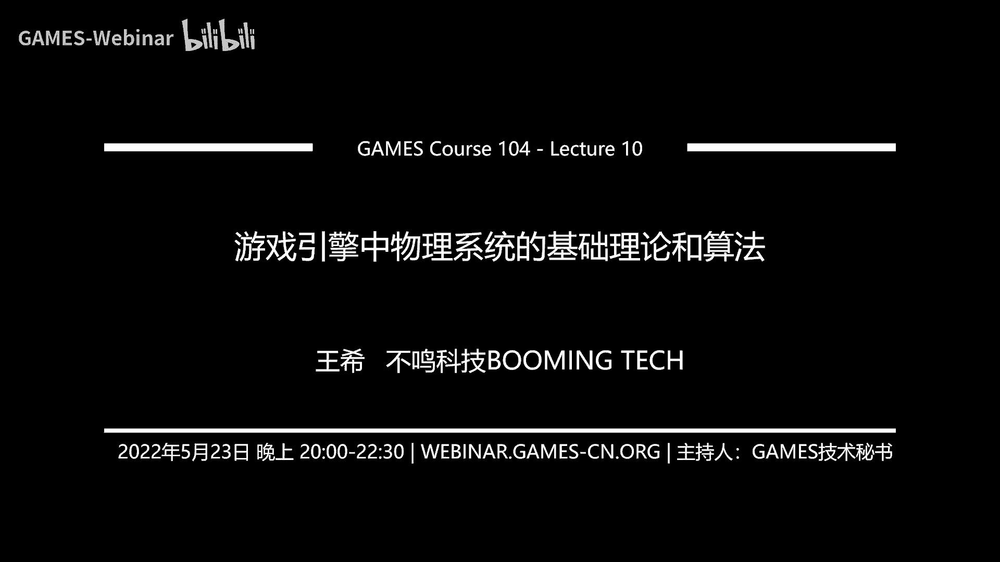
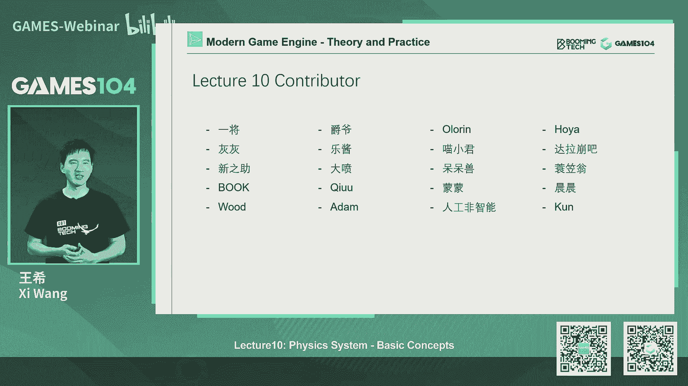
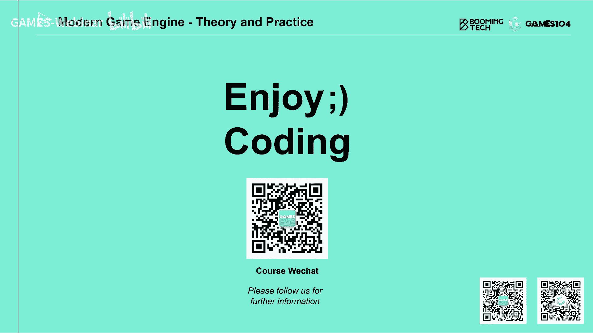

# 10.游戏引擎中物理系统的基础理论和算法 ｜ GAMES104-现代游戏引擎：从入门到实践 - P1：GAMES104_Lecture10 - GAMES-Webinar - BV16U4y117VU

Hello大家好。

欢迎大家回到GAMES104现代游戏引擎的理论与实践，我是王熙，马上就要期末考试了，我知道同学们现在越来越忙，然后我们的课程也会变得越来越有意思，那么在开始我们今天的课程之前的话。

我们先给同学们反馈一些，我们在社区里面听到大家的声音，比如说有同学在问我们说，MataPasser什么时候我们可以开源，这个我们后面是有开源的计划的，现在之所以第一次没有开源的话。

是因为我们担心会导致编译过于的复杂，所以的话呢，因为现在很多同学理解小引擎，就已经是蛮吃力了，所以我们打算把这个小引擎的问题先解决之后，后面也算答应大家，我们会有MataPasser。

会给我们的社区开源起来，那么第二个同学也同样在问我们说，我们是不是要写更多的Wiki，去介绍我们小引擎的结构，那这个是的，我们后面会坚持去写，因为那个小引擎虽然很小，大概现在有3万多行代码了，但是的话。

真的去读起来理解起来，还是有一定的困难，所以呢，我们会持续的通过Wiki的形式，给同学们给社区贡献一些资料，帮助大家快速的理解小引擎的结构，那么还有同学问我们说，能不能用专业的游戏引擎开发的这个视角。

去分析一下，有些游戏里面那些，比如说穿帮的MG的镜头，这个的话就是，我看到那个B站上，已经有同学听我回答了，就是说这个问题我们不敢做，因为这个太过分了，对吧，就是其实我们做一个游戏，做个游戏引擎。

其实都非常的难，所以的话呢，我们作为一个专业的游戏的从业者，或者开发者，我们是非常能理解，就是说做个那么复杂的系统里面，会有一些，在某些特殊的情况下，遇到一些特殊的问题，所以的话呢。

我们更多的会去看它整体的游戏性，而不会去点评的一个两个那个bug，因为我们自己写游戏，写引擎，实话实说也写出了很多的bug，我都不好意思讲，就像我以前，我记得我在第一节课，跟大家讲我以前经历的时候。

我好像觉得，当时我在最早在国外做，Halo做那个主机游戏的时候，我觉得我贡献了几个很很很，应该是很严重的bug，我每每不但不引以为耻还引以为傲，那么最后一个的话呢，就是那个我们上周开始。

让同学们给我们的小引擎取名字，对吧，那真的很感谢大家，给我们取了非常多有意思的名字，然后这一周呢，我们课程组的话，在网上认真查了一下，看看这些名字有没有重复，然后呢我们争取把几个。

没有重复的名字给取出来，然后呢到时候发到我们的社区里面，给大家投票，我们也会把就是取名字的同学，为什么取这个名字，它的寓意是什么，也给也放一并放到我们的投票里面，说白了就是我们希望让社区一起。

来选择我们的小引擎的名字，那么说到小引擎的话呢，就是明天我们的小引擎，还将会有一个比较大的更新，那首先要感谢我们的小伙伴，还给我们第一个小伙伴，完整贡献的feature。

就FXA加入到我们的小引擎里面去了，另外一个的话呢，就是说今天大家一开始承诺的，我们认为小引擎一开始的架构呢，就想的太多了，做的太复杂了，中间有些代码太绕，所以的话呢，我们最后那一天就痛定思痛。

我们说我们决定把小引擎，重新refactoring一下，那经过了差不多两个多星期的努力吧，我们基本上把框架framework，给简化掉了，比如说我们认为那种，比较复杂的singleton机制。

其实完全没有必要，而且也会让很多的，生命周期管理比较复杂，我们把它彻底的简化掉，让大家更容易去理解它，那包括component的系统，也变得更简单和清晰，那么另外一个的话就是，我自己认为就是。

我们的rendering那一part的话呢，一开始又是woken，然后呢又加上了很多中间的概念，让大家比较难以理解，所以的话呢，我们的课程组的小伙伴们，这段时间也是花了很多心血。

把rendering做了一次大的清洗，就是把整个它的pipeline啊，整个体系啊，变得要更简单更清晰很多，不过我们的引擎小组跟我讲说，我们的RHI这次只提供了一个，比较简单的版本。

所以大家基本能看会清晰一点，但其实后面我们还会，再持续的优化，争取这些东西的话呢，能够让我们同学，能够更快的进入到小引擎，那后面的话，我们会根据同学们的情况，然后再看要不要补充，一些文档给大家。

那同时的话呢，我们还把这个就以前，编辑器和引擎这两个分层，包括特别像鼠标键盘的输入啊，这些东西我们分得不够清楚，那在新的版本里面，我们把它分得尽可能清楚了，另外一个还感谢我们社区内的小伙伴。

跟我们贡献了就是说，给其他的一些编辑器，帮助你去在其他编辑器里面，编写代码的这样的一个，就是辅助性的编辑的，这样的一个帮助，这样的话就是让我们，就是无论你是用Visual Studio。

还是用其他的编辑器的话，你的就是开发起来的体验，就会好很多，真的是社区的力量很大，所以的话，我们争取明天能够更新的版本，希望明天的上传，不要crash掉大家，然后呢，希望明天的上传的话。

能让大家就是读起来代码，更简单更容易上手，所以这是我们的课程开始之前，给大家同步一下，我们社区里发生的事情，还有我们最近要做的一些，那个小引擎的更新，那么其实说实话，这个Pilot的这个小引擎。

我们已经很有感情了，说实话这个图标我也很喜欢，真的有点舍不得把它换掉，但是看看我们大家取的名字吧，我们挑一个更好的名字来，最后给它命名，好，那接下来就开始，我们今天的课程的正片了。

就是我们终于从动画进入到，我们伟大的这个物理的这一part了，物理确实真的是太伟大了，那个我们自己这一周在备课的时候，真的是这个觉得，哎呀这个太有意思了，对吧，无数的数学，又是无数的积分，对不对。

然后保证大家看了之后，两腿发抖，但是我大家不要慌，我们会尽可能用最简单的语言，把这个最核心的概念，给大家去讲清楚，那么今天的课程呢，也比较卷，又是一个100多页的PPT啊。

我争取能够在90分钟之内能讲完，如果讲到两个小时的话，我知道大家你们会不会介意的，因为我知道大家的惯用词就是，继续拖，没问题拖吧，好，那我就随性的开始讲我们的物理，那首先的话呢。

对游戏来讲物理非常的重要，因为物理是游戏里面最重要的，玩家对这个世界的直觉认知的一个表达，对吧，可以这么说一个游戏引擎，它如果没有物理的话，你很难去相信这个世界是真实的，就是当你去做任何的输入操作。

当你的游戏里的角色去运动的时候，你会感受到这个世界在跟你去互动，那同时的话呢，就是物理呢，它还有一个很重要的作用，就是给我们构建一个动态的环境，这个环境的话，在很多游戏里面。

它甚至是直接影响了你的gameplay，举个例子，我前面有座墙，那我的视野，我的战术就会发生很大的变化，这你们就不得不提一下，我们大名鼎鼎的彩溜对不对，我觉得彩溜的核心，就是玩各种穿墙啊钻地板啊。

这也是真的很厉害，就是在FPS这么卷的一个赛道，你们彩溜自己开辟了一条全新的赛道，所以它也是一个最经典的，就是Dynamic Environment，就是整个动态环境的，这样的一个游戏的类型。

那么第三个呢，我觉得物理其实会给你创造一个，就是非常真实的可互动的，这种交互的这个世界，这里面就必须要提一下，这个半条命的Alex对吧，就是我觉得，它是现在VR的这个巅峰之作，那相信所有玩的同学的话呢。

除了它的移动，说实话我还是不是很适应，但是我觉得它对这个世界的，这种真实感的感觉，做的真是到极致的，特别是这里面，我是特别喜欢把什么椅子啊，什么这个垃圾桶啊，扔到洗衣机里面转来转去，然后我就盯着洗衣机。

那个滚筒看半天，我说嗯这个做的还真的挺好玩的，对所以说其实你知道吗，就是物理很能满足很多游戏，像我这样的游戏玩家的恶趣味，实在无聊了，能盯着一个滚筒洗衣机，看个大概十几分钟都没有问题。

那么另外一个的话呢，就是其实在现代的游戏引擎，我们很多的表现，特别像比如说Particle，一些Smoke，比如像水体，这种表达的时候，它完全的就是依赖物理，当然还有大命令的这个衣料对吧，Cloth。

我们这个衣服的那个就是抖棚，抖得好不好，小姐姐的跑起来，那个衣服是不是足够飘逸，那都是影响我们对这个游戏质量判断的，一个核心的点，那以上讲的种种啊，它都是依赖于，就是游戏里面的这个物理系统。

或者我们叫做物理引擎，因为物理本身已经足够复杂，足够有难度了，那么在这个就今天，我们整个物理的这一part呢，我们规划了两节课，今天这节课呢，我们把大家最基本的概念教给大家，就是说让大家知道说。

我怎么用这个物理的语言去表达这个世界，这个物理的世界，你们到底有哪些元素，它们之间到底是什么关系，那么这节课呢，我们会点到一些概念，甚至会点到一些，就是物理引擎的底层算法，但是同学们不用慌。

因为如果你不想去碰这么硬核的东西的话，你就把这节课，你们最基本的概念理解透之后，你就会知道说，如果我做一个游戏引擎，我怎么去接入一个物理引擎就可以了，那么第二节课呢，我们就会讲一些比较高级的一些东西了。

比如说角色怎么去控制对吧，比如说我们的Ragdoll，布娃娃系统怎么做，还有我们的破坏怎么做，我们的医疗怎么仿真，还有我们的载具系统怎么做，当然还要跟大家提到一个，现在越来越火的概念叫做PBD。

基于未知的物理引擎，这个其实在最新的一代的一线引擎里面，大家已经在逐渐引入这些概念了，但是至少我们传统的结构就是说，第一节课把基础概念全部教给大家，而第二节课呢，可以给大家开拓一下视野。

让大家知道一些比较有意思的前沿的一些东西，好那我们先从基础的概念开始，那首先的话呢，你构建这个物理世界，这个物理世界首先我们要，这个你的对象，在物理世界里面的对象。

我一般叫做actor或者叫做shapes，这两个概念是很接近的，比如说就以我们小明做的这个，这个现在战争这个游戏为案例啊，你看到这个世界里面小人跑来跑去对吧，其实它有一个在物理世界里的孪生。

每一个小人他都有一个个的小的actor，跟他去对应，有的时候你看到的这个小胶囊，你把他打死了之后，他突然变成很多的小球对吧，还可以在地上飞来飞去，其实我们计算机引擎里面，游戏引擎里面。

去对游戏的这个世界模拟的话，实际上是在这个右边的这个世界里面，而左边的呢，其实就是我们在之前课程里面讲，rendering啊，讲动画啊，跟大家讲的东西，那只是让你去表现去表达。

而真正的游戏的逻辑游戏的表现，是在这一边，是它是我真正的，我们有的时候说这是游戏的logical part，而那一part呢是游戏的rendering part，所以一般物理很多时候。

我们是把它放在游戏逻辑这一part，但这个概念也不一定，比如说我们假设用物理做particle的话，你说这个东西到底是属于游戏逻辑呢，还是属于表现呢，对吧，它这个两者都有可能都要有，好。

那其实actor呢，第一类actor也是最简单的是什么呢，就是叫静态的actor，就static actor，比如说你地上看到很多的挡板，它呢就放在那儿，它就不动，或者是一个曲面，那么你在这个世界。

你的移动会受制于这些静态的物体的阻挡，所以说static actor，在任何大部分的游戏里面，是量最大的，包括我刚才讲的大鸣鼎的彩六对吧，虽然你看了彩六，你的东西那么多，但是它绝大部分还是静态的。

但是它会预先设计好，有些东西是动态的，你可以把它摧毁掉，比如说彩六里面，你不是每张桌子都可以摧毁的，对不对，有些桌子有些灶台，你就是摧毁不了的，它就是设计过的东西，好，那么第二类呢，也是大家比较熟悉的。

就是动态的actor，比如说像这里面的这些箱子，对吧，它是符合物理原理的，你拿脚踹它一下，它就往前滑，你把它放在斜面上，它也会摩擦力和这个重力的作用，它会产生惯性，而这类的actor。

我们叫做动态的dynamic actor，就是它是符合叫什么呢，这里面dynamic，它讲的是动力学原理，而不是这个我们讲的这个怎么说的，就是说它是动态的，当然它也是动态的。

就动力学dynamics的话，其实是在我们的物理学概念里面，就指的是叫动力学，对吧，好，那第三类呢，其实是比较少见的，就是大家不太熟悉的，但其实很常见，就是trigger。

trigger这个东西很有意思，它是跟游戏逻辑高度相关的，就是说一般来讲，我们用它做过逻辑，就当你走到一个门前，比如说大家想象一下，我们如果要做一个超市，超市有一个自动门，当有任何一个客人。

假设是一个角色，走进那个门的时候，其实呢如果在游戏中的话，我会在前面放一个trigger，然后呢当任何一个pom，就是任何一个，角色走进到那个角色面前的时候，走进到那个trigger前面的话。

我就触发一个消息，然后呢就让那个门打开了，大家如果还记得，这好像已经是很久很久以前的事情了，我们讲这个游戏世界，怎么样通过消息，通过event相互之间联动对吧，这个时候就联起来了。

它这个所有的世界的发起方，其实都是在这个trigger里面的，包括我们上节课讲那个就是动画术，动画术实际上，blueprint它最难的一个东西是什么呢，就是它有很多event去改变这些动画的状态。

这些event它的来源在哪里呢，其实trigger是一个很大的一个贡献者，然后呢最后一个，我们要讲一类非常特殊的物理的actor，这里面我首先引用一下，我们大名鼎鼎的阿罗马斯克，讲的一句话。

他这句话讲得特别有意思，他就说他发现人类定义的所有的法律，都会被人去违背，但是呢只有physics law是不能违背的，但是这句话说的呢，很对很有道理，但是呢在我们的游戏世界里面。

我们还真的有违反物理原理的东西，就是呢我们叫的kinemics，就是说就是这个中文不知道怎么翻译啊，因为IK我们叫反向动力学对吧，那个kinemics就是叫动力学，或者叫什么我忘了中文怎么翻译。

他的意思就是说，根据游戏的需要，我把有些actor，把它给动来动去，比如像这里面两个甲板，他们两个就是kinemics的这样的actor，这样的一个actor的话呢，就是说它本质上是反物理的。

它本身比如说它的运动并不会符合，比如说牛顿的一二三定理，这完全是我们的设计师的动作，我再给你们讲个细节，比如说在游戏里面啊，我们这个人去跑步，跑步这个过程是符合物理学原理的对不对。

但是呢我们真实的去动他的这个，他的actor的时候呢，他就是个典型的kinemics actor，就是说你在跑的时候，你的手会动的时候，是有动画驱动的，动画告诉你说你在下一帧，把手移到这儿。

他到底是符合那个加速度呢，还是阻力呢还是什么，不用的你就告诉这个物理世界说，我的手此时已经在这儿了，那这么一个了不起的反物理的actor的话呢，在游戏的gameplay中是非常有用的。

但是呢就是因为他不符合物理原理，他会给我们游戏引来很多的麻烦，这个视频大家能看得明白，其实是这样的，就是你试图靠近那一只小小的野兽，当小小的野兽去踹你脚的时候，注意这个时候你是有重量的对吧。

你是有惯性的，所以你的重量和惯性呢实际上是有限的，当那个牛拿脚踢你一下的时候，他那个脚上肯定绑了一个，kinemics的一个骨骼，一个一个一个actor，他撞你一下，因为他是反物理的，所以到你这边。

有可能如果处理的不好的话，给你的作用力，或者那个充量，他可能就变成无穷大了，大家还记得就是，大家如果注意观察，你们在玩很多游戏的时候，特别是物理优化做得不够好的时候，经常就会发现，你突然自己就飞掉了。

或者某个东西突然就飞了，其实这个飞的原因很多时候，都是由这种kinemics actor会导致的，原因很简单就是，在一个完全符合物理约束的世界里面，你老人家突然开始反物理了，结果会导致很多的。

就是数学的运算，会在那个时候，我们叫做degenerate，就是会失效掉，然后可能算出个无穷大了，这个时候就很麻烦，所以的话，这个也是我们的游戏的，一个经典的一个bug之源，所以大家以后在游戏中的话。

你肯定会用的kinemics actor，但是呢，我一般就是说，写到这一趴的时候，大家一定要小心，这个比如说举个例子，比如在游戏里面，比如说你面前有个箱子，很多人去推他的时候，如果这个例没有设置好的话。

那个箱子直接就飞掉了，飞得无穷远处都有可能，好，这就是我们最经典的游戏里面的这些actor，所以的话呢回顾一下，就是怎么去理解一个游戏里面的物理引擎，首先理解它处理的对象，其实它就这四种对象。

就主要总体来讲，第一种是静态的actor，就是你的这个世界的基础的，阻碍你的这些东西，那么还有一个就是动态的actor，就是这里面可以动的东西，但是动态的actor一般来讲，不要做的太多，多了之后。

因为你静态的actor是不用解算的，每一帧都是那样，但是动态的actor的话，你每一帧都要算，它大概是什么一个状态，它受了多少力，那么还有一类呢，就是参与gameplay。

但是呢跟物理世界的解算没有关系的，就是我们叫做trigger，对吧，就是出发器而已，那第三类呢，就是大家很重要，一定要用，但是呢要慎重地去用的，就是kinetic actor，这种的话就叫。

哎真的我突然忘了这个中文叫啥了，应该叫动力，动力学这个actor，应该是这样吧，没关系，反正大家都懂的对吧，好那接下来，actor呢，它有一个最重要的一个属性呢，我们叫做shapes，它的形状。

那么因为在这个物理世界里面，就是我们的解算，其实复杂度是非常高的，大家如果写过立体几何的运算的话，就知道有多痛苦，比如说我问大家，我让你求解一个东西，比如说给你一个四面体，对吧四面体，给你再和一个。

比如说一个一个一个，一个比如说二十面的，但是不规则的一个一个凸，凸多边形去求交，如果大家去写一下的话，你会发现体和体之间的求交算法是很复杂的，所以当我们的这个就是物理引擎设计者，在设计物理引擎的时候。

我们就会首先刻意用那种，用解析的方法，能够快速表达的形体，作为基础的这个actor的形状，比如说最简单的就是球，对吧球是不是最简单，就你只要给一个顶点，给一个半径，你就可以定义三维空间的一个球。

对吧这个顶点一动球就动了，所以球球的球交啊，球的移动啊，球的碰撞检测应该是最简单的，对吧那么接下来第二种呢，就是球的变种，我们叫做capsule胶囊，就上下顶两个球中间放个圆柱，这个算法也很简单。

第三种呢我们叫做box，box呢我们这边画的是一个，是一个正方体，但其实box在物理引擎里面，可以不是正方体，很多时候是长方形的对吧，我们假设用box表达一个，比如说门啊这些东西，那然后呢第四种呢。

就是相对更贵了，我们叫convex hull，叫凸包或者叫凸多面体，它本质上呢就是，它必须是一个封闭的，一个空间的一个包裹，它不能有洞啊，不能露出来对不对，第二个呢它必须是凸包，就是说凸包的意思是什么。

就是我沿着任何一个面，做无限延伸的这个面，它呢不会就是那个，交到它其他的面，简单来讲就是你的形体，一定往外凸的对吧，而不应该是你们有这种，反向的折痕，当然了除了这个点之外呢，其实还有一种我们叫做。

那个manifold的，但这个讲起来就更，数学一个概念我们就不讲了，凸包就凸多面体大家都懂的，凸多面体呢它的特点就是什么呢，就是这个它能表达的形状，会更多样一点，当然其实有的时候啊，在物理引擎里面。

你还可以用triangle mesh，你还可以就是用这个，一个高纯图来表达，这个世界的Axia对吧，我们还记得大家前面，在讲绘制的时候讲地形，地形不就是用，hide field去表达的吗，诶对。

那这个时候我如果在这个地形上，扔一个球它弹来弹去的话，我总不能对这个地形，做个凸包吧，那你怎么做，做死你啊对不对，你得把它分得很开，你如果用那个box，去表达一个地形，那也是弄死你了。

所以呢我们的物理引擎，很体贴我们也会支持hide field，这就是Actor的shape，那么它每一种shape啊，它都有自己的应用场景，比如像球的话，大家想想想，我们在游戏引擎里面对吧。

无论你做一个桌球游戏，还是做一个各种球的运动吧，那你的Actor肯定用球是最好的，但其实在我们的游戏引擎里面，很多时候表达一些小的东西的时候，它虽然可能是各种各样的形状。

但是我们可以大致用球对它进行表达，那么第二种呢，就是这个Capsule，Capsule呢，实际上它的应用场景非常大，比如说，刚才我们一直在展示那些角色嘛，基本上，呃，现代游戏里面，就是很多游戏。

对一个角色的这种表达，都是用胶囊，就是想想我们角色一般身高一米七一米八对吧，我们一般会做个差不多一米八到一米九的一个，小胶囊，把人包在中间，这个小胶囊就是人的全部了，你如果去看很多游戏的。

假设你打开它的开发模型啊，你会发现这个人上下裹了一个，这个一个小胶囊特别可爱，对，所以说胶囊是在游戏中用的蛮多的，表达这种ByPie的这种人形物体的一种很好的一种表达，好，那么Box刚才也讲了。

就是它用处非常多了，就这里面的还要注意一个细节，就是说很多时候我们的这种包裹是个approximation，所以说对于那种非常精细的，比如说结构的话，我们其实是用Box大致的表达就可以了。

因为物理它确实你想做的非常精细，它实际上是很废的，就是说计算复杂度很高，那么还有一种呢，就是我们讲的Convex Mesh对吧，那Convex Mesh的话呢，其实在解决一些比较复杂的这种形体的时候。

我们会用比如像这里面这个单，这个这个案例是非常复杂了，就是说它这个是用虚幻引擎做了一个可破坏地形的这样表达，这里面砸出的每个碎片，你看到它的运动是要符合一定的物理学原理的。

那这个之所以让你看上去比较逼真的话是，它那个石头的话几乎是用Convex Mesh去表达，但是呢它这个只能算局部，如果算的多的话，其实也非常的废，好，那还有呢就是Triangle Mesh。

Triangle Mesh的话呢，也是现在有物理引擎逐渐在提供的一个功能，因为确实比如像这样一个房子，你用这个Box去表达，你用其他表达都不太合适，但是呢这种Triangle Mesh。

第一个要求你是密闭的，第二个呢目前在物理引擎里面的话呢，我们一般只允许静态物用这个东西，也就是你动来动去的时候，你想这个房子我动来动去再去跟别人去求交的话，待会我们后面会讲到这种求交碰撞算法的时候。

你会发现这件事情就是特别的复杂，特别的难，但是呢确实在有些时候，你还是必须要用Triangle Mesh这种Shape去表达一个世界，好，那最后一个呢就是刚才已经讲到的Head Field对吧。

那刚才讲的就是地形的时候，Head Field非常的有用，那这也是我们对物理世界的这个Shape的表达，所以同学们对这几个概念一定要记得非常的牢，因为当你真的在做一个游戏引擎的时候。

你可能不需要知道物理是怎么去算的，这个数学方法是什么，但是呢对每一种Actor，每一种Shape的基本概念，一定要理解得非常的清楚，而且千万不要乱用，因为物理这个东西啊，你一旦用错了之后。

你会发现你的游戏突然变得特别的慢，或者说经常莫名其妙的会产生各种Bug，但是你又不知道为什么，因为那个结算实际上它的数学非常的复杂，那个可能比，大家觉得那个Rendering已经很复杂了对吧。

大家觉得动画已经很复杂了，但是跟物理的复杂比起来，那简直就是小物见大物，好，那所以的话呢就是说，当我们去用这个Shape去做围绕着一些物体，形成一个个Actor的，注意啊这里面就是说。

在游戏世界里面我们的一切东西是什么，叫做object叫对象对不对，但是呢在物理世界里面，我们干了一个事儿，就是给这些我们在乎的这些对象，全部给它包成了一个Actor，那这个包的过程中呢。

我们的Shape其实呢有一个很重要的原则，就是它是一个Approximation，就是说它只是一个估计，不需要包得非常的精细，第二个的话呢就是，你能用最简单的Shape包裹的时候，尽量不要用复杂的。

举个例子比如说，假设你能用球，能用胶囊，能用Box去包裹一个东西的时候，尽量的不要用Convex Hole，就是那个涂面体对吧，然后呢你如果能用前面这几种，那就更不要用什么呢。

更不要用Triangle Mesh，因为它们一个比一个复杂，那Head Field呢全局就一个，那大家用一用也就算了，但是它也是只能处理静态的东西，所以说这个是，当我们在做游戏的时候。

这个是我们很重要的一个原则，因为当你有几千个，甚至上万个对象的时候，你就知道这件事情不能乱来了，好，那么其实Shape它有很多的属性，比如说，因为你是对物理的世界的描述，比如说我同样做两个球。

你打它一下，给它一个充量，它能飞多远，这里面决定因素是什么，是它的重量对不对，所以其实对于每一个Shape，你有一个很重要的属性是什么呢，就是要么你设定它的质量，要么你设定它的密度。

那么这两个设置你都可以，其实大家想想看，如果我知道这个世界是个B包的话，无论你是个球还是个胶囊，还是一个Convex hole，实际上你给了我的密度，我也能反算出你的质量，那么其实这里面是非常有意思的。

就注意在这个物理引擎里面，我们假设每个Actor每个Shape，它的质量是均匀的，就均匀质量这件事情，其实非常的重要，为什么呢，因为我这里面就举了一个很有意思的例子，这个叫干波体。

我不知道大家有没有听说过这个东西，它是数学家研究出来，就是我们以前认为，任何一个形体，它在这个空间上，它一定有三个左右的稳定点，叫稳定平衡点，三个或者三个以上，但是呢，数学家总是无法证明这件事。

直到有一天有个数学家，真的做出了一个，只有一个静稳态点的，这个叫匀质物体，意思就是说，这个东西它密度是均匀的，但是它永远会在一个点上，就逐渐趋向稳定，这件事情非常有意思，你们想了布导翁。

布导翁它怎么做出来的，它的质量是不均匀的，但是你如果有均匀的做过物体的话，你会发现，它总是有好几个平衡点，但是只有这个形状，目前我们发现的，它只有一个静平衡点，那这个东西为什么有用呢，大家举个例子。

你们回想一下，你们想想那个大海龟，其实大海龟的那个龟的，龟壳的形状，就是近似这个形体，就使得它，当你把它翻过来的时候，它会当当当当当，会自己又翻正了，其实这个是有一定用处的，但这个形体非常难做。

它的误差我如果没记错的话，只要超过千分之一，还是万分之一，它就没有这样的一个力学特性，所以这个小东西的话，好像要上百美金你才能买得到，所以这也是我觉得，大家去理解物理引擎，特别微妙的地方就是说。

你的计算只要稍微有点误差，它的表现和行为就会完全不一样，那么在每个shape呢，还有一个很重要的属性，其实就是它的那个质心，因为质心呢，这个东西呢，在一般的你在做物理模拟的时候，可能大家不会觉得很重要。

但是比如说你在做一些特殊的形体，比如说vehicle，就是载具系统的时候，质心其实非常重要，它直接决定了你的车的稳定性对吧，大家想象一下，我做一个模拟的越野，比如像dirt这样的一个。

越野拉力赛车游戏的时候，你去组建你的车，你去调整你的这个车的中心高度的时候，其实对你驾驶感会差别非常非常大，虽然这都在虚拟的世界里，所以这也是shape很重要的一个属性，好那其实呢，shape呢。

就是在物理世界里面表达的话，我们有一个很重要的概念，叫什么呢，叫物理材质，physics material，我记得我在前面去讲那个渲染的时候，我讲的那个PPR的概念对吧。

就是讲那个physics material，然后呢，其实那个东西也自称叫物理，但此处的物理和那个时候的物理是两个物理，那个物理就PPR讲的物理呢，它是符合物理的光学特征，但是呢。

当我们在大家在做游戏引擎的时候，你就会必然遇到一个叫physics material的概念，叫物理材质的概念，这里面定义什么东西呢，我们定义什么呢，定义这个表面的摩擦力是多少，对吧。

定义它的这个就是那个弹性是多少，这件事情你设置好了之后，你扔到物理引擎里面的时候，它的行为就会完全不一样，大家能想象，比如说我做一个橡皮的一个小的物件，然后放在一个桌面上。

我对桌面假设我的这个游戏设计成，就是说我来去推着这个桌子抖来抖去，那它的行为和我设置成一个光滑的玻璃的，比如说一个玻璃弹珠的，它的行为是不是会完全不一样，大家想想对吧，那包括就是我要做一个橡皮的小鸭子。

和做一个钢的小鸭子，你把它扔出去，可怜的小鸭子，它在地上弹的情况是不是也是完全不一样，所以说它的弹性也是不一样的，所以这个呢就是今天我只讲了两个最简单的物理的property。

就是物理的material的属于，一个是摩擦力，一个是那个它的弹性，实际上的话呢，有的引擎它的你的参数会更多，所以这就是物理世界，和这个就是我们叫做游戏世界不太一样。

包括这个physics material，再跟大家多说一句啊，就是我们在做这个游戏引擎的时候，我们很多时候会告诉你，它是什么材质，什么材质的时候呢，有的时候它会跟你的生效，跟你的特效都会有关联。

但是呢这个呢就是更广泛的，我们叫做physics material的概念，好，那有了这些所有的对象，我们叫做actor对吧，我们可以操作的这些物体，在物理世界有物体，接下来这个牛顿爵也讲了一句话。

就是你把这宇宙放在这没有用的，宇宙是死的需要什么，刘爵爷说我们需要有力，就是第一推动，当然我们后来知道，刘爵爷你错了，这个世界的运动才是本身对吧，不需要额外的力，那好我们在物理世界里面，我们真的需要力。

没有力这个世界就是僵着的，那力是什么呢，就力其实啊是游戏里面最重要的，就是让这actor能够动起来的东西，那么最常见的力是什么呢，比如说拉力对吧，重力摩擦力，那比如说在这里面的话，每一个角色。

比如说一个角色，你假设受击了，他死亡了之后，他为什么ragdoll会倒在地上呢，就是因为有重力，拉着他一节一节的往地上倒，这个时候就是重力的作用，包括一个比如说，你在游戏中打死了一个敌人。

这个敌人从山上就滑下来了，这是什么，这是重力和摩擦力的，共同的作用结果，所以这种力呢，就是一个比较长期的稳定的力，但是呢，在我们的这个游戏世界里面，还有一种力，我们叫做充力。

就是impulse或者叫充量，就是说实际上当游戏里发生一些极端的行为，比如说一辆车撞了这个角色，或者说旁边有个巨大的爆炸，这个角色呢，他其实就会受到一个充量，我们经常讲的时候，是可以把人给炸飞对吧。

那你可以把人炸飞的话，这其实就是一个充力，那这个时候呢，你可以看到一个就是说，一个叫impulse的充量的东西，可以把一个物体给推开，所以这两种力呢，是游戏里面最常用的力，但这两个你可以说是一致的。

也可以说不一样，因为一般来讲我们叫做那个力啊，力乘上时间就是它的充量嘛，对吧，好，那么有了这个力，有了物体之后，接下来我们就可以定义这个世界的移动了，movement了，那在这里面的话呢。

就是很有意思啊，就是讲到物理的时候，我们就很有种时光穿越的感觉，你会发现把我们的，我们个人来讲，把我们从初中时代开始，到大学时代学的东西全部给捋了一遍，对吧，然后呢从这个人类的这个科学历史上，你会发现。

你就一下子回到了16 17世纪开始，然后你就去思考这些问题，比如说大名鼎鼎的牛顿第一定理，对吧，就是说当一个物体，它的运动没有受到力的话，它就倾向于保持匀速直线运动，对吧，我们小时候学那个。

这个这个这个，学物理的时候，初中嘛，我们都学过这个概念，但是呢，这里面我要去讲一下，非常有意思的一个概念了，就是说实际上，在我们上中学的时候，我们对这种运动的表达，很多时候都是用那种。

怎么说非常形象和直观的方法去表达，但是在我们的这个，现代游戏引擎里面的话，在游戏的世界里面，其实我们是用很数学的方法去表达运动，比如说这里面的话，我怎么去表达一个匀速直线运动呢。

你看到下面的公式是这样的，就是你的速度V在T+ΔT的时候，应该是等于VT，就是说你在过了ΔT的时间，你的速度和你现在的速度是相等的，所以呢，你的位置position就是X，在T+ΔT的时候。

就等于你当前T时间的XT，加上呢V这个方向，乘上了ΔT，你看看，大家看到这一趴的时候，是不是觉得，这不就是，对吧，为什么一个很简单的事情，你要用这种方法给我写呢，你是几个意思呢，对吧，本来我们可以懂的。

牛顿第一定理，你突然说的我就不懂了，在这种简单的case下，我承认，确实这种写法呢，是比较绕的，但是呢，我们接着往下看，那牛爵爷的第二定律是什么呢，他讲的是说，当有个外力的时候。

你的加速度是跟你的力的大小成正比，对吧，跟你的这个就是这个，重量成反比，什么叫重量，什么叫质量，质量在物理学上的话，的定义就是说，是一个物体，阻抗它的运动变化的，那个量，对吧，你越不愿意。

别人改变你的运动状态，这个你的质量就越大，这个倒是在在物理学上，是一个非常有意思的概念，就是质量的本质是什么，当然现在物理学会告诉你质量的本质，实际上是你的这个就是这个各种微观离子。

和那个那个这个希克斯场之间的，这个相互作用对吧，那就更神秘了，那个简直，这个太太有意思了，就真的很抽象，但是呢，我们最简单的解释就是，哎，一个物体，因为单纯的重量，它是不存在的，对吧。

重量是一个不存在的物理概念，但质量是什么，就是说，我拒绝改变我的物理状态的这种这种这种倾向性，那么，这个时候你会发现，就是说，它的这个V的变化，实际上呢，是跟你的这个就是跟你位置的关系，是个平方的关系。

那写的一个更简单的一个方程是什么呢，就是说，哎，你的位置在T加ΔT的时候，是等于你当前的位置就是X的T，再加上呢，你在当前的速度V乘上了ΔT对吧，这是匀速直线运动给你的方程，再加上个1/2的AΔT平方。

这里面其实跟我们初中高中学的那个方程是没有区别的，1/2AT平方，大家都记得吧，我的位移公式，如果我是匀速直线运动就是这样，但这里面你会发现没有，它所有的这个时间的偏移值，都是ΔT。

这个ΔT的本质是什么呢，就是说，如果我的力，就这里面讲了一个有意思的问题了，哎，假设这个力它是不均匀的，一直在变，对吧，想象一下啊，比如说，一个弹簧，就是大家在中学的时候，我们学过弹簧质点模型，对吧。

但其实大家想想看，就是弹簧的那个周期，它为什么是一定的，比如说或者说我们在中学时候学的那个摆，它为什么它是，不管你把它拉的多高，它来回的周期都是一定的，大家仔细想想这件事情，其实简单嘛，其实不简单。

为什么，因为就以那个摆为例，在它任何一个时刻，它受到的力的大小方向都是在变的，对不对，那它为什么最后算出来，哎，那个周期总是一定的，那这里面简单讲一下，就是说，它实际上是一个数学计算的结果。

而不是它的这个物理的规律的本身，我不知道大家能不能理解我讲的这句话，就是说，因为你会发现那个方程解到最后那个解，它的周期是一个，跟你只跟臂长有关，只是各种因素约掉了，但实际上，它的真实计算过程。

是一个非常复杂的就是，变加速的一个过程，那么其实在我们的物理世界里面，大部分的这个运动啊，它都是这样的一个关系，就是它上面所受到的力，会随着时间去变化，那这个时候你会发现，你很难表达它了。

这样的一个在时间上速度一直受的力不同，速度一直在变化的这么情况，那这个时候呢，我们就给出了这样的一个方程，你看这个地方就开始有点有意思了，对吧，就是我的速度，它在delta t的时间之后。

应该是你当前的速度，加上呢，从现在这个时刻开始，到delta t时间，你给我的加速度和那个时间的积分，好，这是我速度的时间的变化量，好，那个，那我的空间的位置怎么说，我空间位置是什么，是我当前的位置。

加上，诶，我当前这个速度，注意啊，这里面的vtp，那个tp实际上是两重积分，它速度本身是个积分，然后呢，速度积分出来，在当前每个t的那个积分的时候，再在外面再来一层积分，然后我才能记住它的位置。

同学们想一想，这件事情是不是很，有点难了，对吧，大家如果真的，当然我知道我们这节课很多同学，我们有很多高中的小伙伴也在听我们课，听到这大家可能会觉得太高能了，这个东西怎么算的，没关系。

其实你只要知道这个东西，它是怎么来的就可以了，就是说，它就是一层层的，就这样，就是一个小数，一个小数的积起来，就是累积起来，成为我的，我的这个结果，但是呢，你在数学上怎么去表达这件事情，这就非常的麻烦。

那这件事情是不是很抽象呢，实话实说，在游戏的世界里面，非常的常见，你看，大家总喷别人的游戏引擎，这个这个物理做的很差，这里面我们自己是做引擎的，对不对，自己做引擎，那我们就挑战一下。

我跟大家讲个最简单的运动，比如说一个地球绕着太阳运动，对吧，那地球绕着太阳运动呢，它这里面有个很简单的约束，就是假设最简单的，我们做一个叫圆形轨道，我们不要讲椭圆了，最简单的圆形轨道。

那它就绕着一个固定半径，那为什么这个球呢，绕着固定半径呢，是因为，它的正好的这个这个这个，就是圆周运动的这个离心力，和它的万有引力，实现了一个平衡，就在任何一个点上，它往前走的时候，它给它的这个引力。

对吧，和它的这个这个这个，就是它产生的离心力之间达到一个平衡，那这就是一个多向量的，这个约束的问题，就是你的位置和你的这个旋转，和你的速度，和你的脚速度，都形成一个一个关系，这个听上去好像不难对吧，诶。

怎么去表达一个圆周运动呢，那，我们在中学物理的时候，很容易证明说，Position XT，就是随着时间的轴T，那你这个XT呢，实际上就是，它在空间中正好画了一个圆圈，我们现在把问题变得更简单。

就是个2D的问题了啊，那，它的速度呢，实际上等于，就是，你的位置一直跟着T的这个，这个这个这个导数，那实际上这个速度就一直沿着圆周，诶，先是往这边往这边往下往下往下往下往下往下，然后再回来对不对。

好大家觉得诶，好像不难，你去求它的解析解非常的简单，但是大家想象一下啊，假设我不告诉你这个东西，它真的能形成一个圆周，我只是给你讲一个它的力，随着它的位置和距离的约束，我让你在计算机的物理引擎里面。

去一个step一个step一个step，去模拟一个圆周运动，这个讲起来有点抽象啊，或者简单来讲就是说，我只告诉你说，怎么去画一条线的方法，当你按着，把这个时间切成非常小的一片。

每一片你都按照我的原则去画这个线，最后你发现你画出来的是一个圆，这个时候，诶这个画的方法就是对的，否则的话呢，你这个画的方法就是错的，这个讲起来，因为什么大家还记得我前面在讲，我们的游戏世界里的一切。

它实际上都是把这个时间切成了一小片一小片，大家还记得我们在第二期讲的叫tick tick tick，我曾经说过就是说，我甚至觉得我们的世界就是虚拟的，上帝它的tick是什么，是一个普朗克时间对吧。

我们的世界的整个逻辑也是一个tick一个tick，只是它是时的负，我如果没记错应该是负40次还是负32次，34次方的这个秒，所以它非常非常的小，你感觉不到，但是的话呢，就在游戏引擎里面我们是多少呢。

1/30秒，这样的一个一个tick，比如说我假设是一秒钟转一圈的这个圆，那大家想想看，哦这个这个，我现在这个转速应该是一秒钟一弧度，大概是呃，大概是三两三秒钟左右吧，可能我们就能转一圈，那好。

那我去算它每一个点的位置和每一个点的受力，我是不是就能得到这个圆周运动呢，这是一个最直接的算法，那我们就算一下看看啊，就是说，对于每个位置，我们就把它变成一个，随着时间上的它的速度的积分。

然后呢算出它的下一个位置对吧，就是从t0到t1，那假设我们怎么去算它，这里面就要引入我们大名鼎鼎的这个这个这个，又是上古时代的数学家，我们伟大的欧拉先生对吧，欧拉先生大家注意看没有。

他老先生只有一只眼睛，他据说年轻的时候瞎了一只眼睛，我们经常，而且好像是五十多岁的时候，另外一只眼睛也瞎了，就是我们经常会探讨说，如果欧拉先生的眼睛没有失明的话，我们人类的数学可能还要再往前去。

提早这个这个进入文明的更大一步，那么欧拉先生在他的著名的这个就calculus，就是说这个积分学里面的话，他就讲到了一个叫欧拉积分的文的东西，其实说实话，我是觉得很神奇的，就是说那个时候也没计算机对吧。

我们那个时代的数学家，为什么对这个问题研究的这么透彻，让我觉得也是非常的神奇，那么他就提出了一个简单的想法，就是说我把整个事件切成一小片一小片，我怎么做，我可以这么做，就是说我在当前t0的时候。

我根据你的位置，根据你的这个就是说你这个位置所产生的力，我去算出你的加速度，根据加速度，我会算出说你到下一个时间点的位置，那个速度是什么，那么同时的话呢，根据你当前的速度。

记住我用的是当前的速度乘上了delta t，因为你的速度还没有变嘛，你的这个速度变化是在下一秒发生的，我算出你的下一个位置是什么，大家想想看，这是不是跟我们的直觉想法是一样的，就是说我在第一秒的时候。

我现在位置在010，我的速度是1，好那我在算第二秒的时候，我的位置是多少呢，我的位置就是1了，因为我移动了一步，但是呢因为我受到了一个加速，我这个速度就变成了这个，比如说变成了2对吧。

我在下一秒变成了3，这样的话我就一点点的积上去，当然我想得有点夸张了，但是这个呢确实是一个非常简单的，一个就是数值积分算法，这个算法叫什么呢，叫显示欧拉积分，那这个积分的话呢实际上非常符合我们的直觉。

但是呢，它有一个非常简单的一个问题，就是说你总是用当前的状态去预估，未来的状态的时候，它会导致整个这个积分过程啊，它的这个就是叫做能量不守恒，或者说这个积分过程是无法收敛的，举个例子就是说。

以刚才那个小球的位置，这个球不是受到了我们的万有引力吗，对吧，但这里面我写个简单的力的方程，就比如说它的那个受到的力，总是对于负xy，如果一个理想的解析解呢，它是一个完美的球，但是呢你用显示欧拉积分。

你会发现这个球的轨道，因为你老是来不及把它的方向往回去掰，那个力总是会慢一拍，这个这个球的运动轨径呢，就会无限的发散下去，而且呢它运转的速度会越来越快，这意味着什么呢，能量凭空创造出来。

哎这个很有意思吧，就是我本来它的运转是符合我们的物理学原理的，对吧，但是呢我虽然用了正确的公式，但是哎我去在因为我在游戏里面，我没有办法去真的去就是在像上帝一样，用那么小的普朗克时间去迭代它。

最后它的能量实际上是不守恒的，这个是非常有意思的，大家记得我们在讲那个逢模型的时候就讲过，逢模型那个光照模型，它最大的问题是什么，就能量不守恒对吧，所以其实显示欧拉法的话。

它在整个迭代中很容易出现叫做不收敛的问题，注意啊我今天讲的是非常非常简单的，但实际上呢只有一套非常严格的数学证明，就为什么这个东西它是不收敛的，其实我也没有完全看懂，我只是知道这个结论。

就是说这里面就是我们用MATLAB做了个案例，这个是我们课程组现做的，非常有意思，我们的小伙伴有MATLAB高人，他就跟我演示了，大家演示了一下，就是说随着我的步长越来越小。

哎我这个圆周运动模拟的时候呢，它确实会越来越接近于它的ground truth，但是呢它还是最终会逐渐的衰减掉，这个非常像真实的物理世界，比如说地球绕着太阳转，但是我们一边转一边消耗掉我的这个这个能量。

能量转化为成引力波，所以我们轨道就越飘越远越飘远对吧，但是这个这个就很像这个感觉，这就是最简单的欧拉方法，它会导致的一个问题，那么怎么去解决这个问题呢，就是说啊讲它的那个优点，就是说非常简单对吧。

缺点就是它的stability是有很严重的问题的，而且能量在这过程中是不守恒的，那个大家只要记住这个结论就好了，那这个时候呢就产生了著名的叫影视欧拉法，影视欧拉法的它的想法就很简单，它说这样吧。

你就把这个你要去算它未来的这个速度，你就把它时间积分完那个速度反向的给求出来，记住啊，这时候它的力和那个速度都是反向的，这个就是个影视欧拉法，那影视欧拉法呢，它其实一个核心的改变就是。

它是用未来的速度去，未来的力去反向的算你的位移，这个讲起来很简单，那实际上如果这个力是受制于它的位置的话，你位置又不知道对吧，你怎么知道未来的这个速度是怎么变化的，其实这个非常的复杂，我举个例子。

比如说我还是模拟那个就是地球绕着太阳转，我说我现在在t在零的时候，我过一秒钟之后或者过零点五秒钟之后，地球在哪个位置，其实这个时候啊，如果你在计算机里模拟的时候，地球的位置也变了，地球受到的引力。

这个就是地球太阳的距离也发生变化，所以地球受到的引力，地球受到引力的方向都在发生变化，而且在这个过程呢，是在这个一秒钟呢是连续发生的，这个时候你去模拟地球的运转的时候，很多时候它其实是很难算的。

但是呢引射欧拉法的意思就是我不管，我假设你有解析的方法，能够拿到就是t加一的时候，你的速度是多少，我用t加一反向的去对你进行approximation，这个方法呢，实际上欧拉老先生提出来，很厉害。

因为它有一个特点是什么呢，它是conservative的，就是它的能量实际上是会内向的，就是它不会爆炸掉，但是呢其实它的能量是会衰减的，但是呢因为这个东西大家会觉得，哇那这个能量衰减是不是也很不好。

但在我们真实的物理引擎里面的话，我们一般都会有摩擦力呀，空气阻力的存在啊，所以除非那种最极端的情况，它这种能量衰减呢，其实用户是注意不到的，而且随着你的步长越来越小，比如像这里面我举个例子，比如说到0。

03的时候，它这个衰减是很慢很慢的，所以你很多时候误以为，它是受到了空气阻力和摩擦力，但这个方法它有一个很大的好处是什么呢，就是它是稳定的，它不会爆炸掉，其实在我们做物理引擎的时候。

我们最重要的一点就是说，我们希望我们对这个世界的表达，它就算整个世界静下来，我都是可以接受的，千万这个世界不要变成一个涌动机，就能量凭空的产生出来了，那如果产生这种情况的话，我认为这个物理引擎就搭错了。

对吧，这个很有意思，就是我们能接受我们的能量转化成热能，通过摩擦力空气阻力转化成热能，但是我们不太能接受，就是这个世界的能量会越来越多，所以这个引式欧拉方法，其实有很大牛的数学家，已经给我们证明了说。

它是一个稳定解，但是这个证明本身也是非常复杂的，这个说实话我也没看懂，太复杂了，本人数学能力还是有限的，这就像我们在学很多高数的东西，你直接就说这个结论我认了，具体怎么证明。

交给历史上伟大的数学家去解决吧，但是这确实是我们一个很重要的数学工具，那今天呢我要跟大家讲的这个方法呢，这个是同学们如果在做物理的任何一个计算的时候，我们推荐大家用的方法叫半引式欧拉方法。

它的想法其实呢很直觉，说实话当时，我觉得这非常符合我们作为程序员的直觉，就是OK，引式欧拉法有问题，你就是用当前的那个时间的那个V来计算，肯定是有问题的对吧，引式欧拉法，你说用V1，你牛逼。

但是的问题是，V1我怎么算呢，对吧，你的速度，你的位置也在变，受的力也在变，然后我要把这个位置力积分成速度，速度再又反过来影响我的这个位置，这简直就是这个怎么说呢。

我叫做这个到底是机身弹弹还是弹身机的问题，他说同志们你们别别折腾了，非常简单，首先的话呢，我用当前你受的力，就是根据牛顿的这个第二定律，我可以算出你的加速，对不对，然后呢。

我就可以知道说在Delta E之后，你的速度的变化应该多少，这时候这个速度呢，我上面画了一个横就表示是，这个我假设你的速度是VT1，然后呢，我再用这个VT1啊，去做你的这个积分。

这里面一个很重要的变化是什么，就是我是假设你的力是不变的，就是力不会受着你的位置的变化去变，这个假设其实是很危险的，为什么呢，因为对于很多，比如说你拿一个橡皮筋套着一个球，让这个球绕着这个橡皮筋转。

这个球啊，他如果跑得远，这个力就会变大，球跑得近，力就变少对吧，那这个时候，他的运动啊，实际上是跟他的位置是有关系的，就是他受到的力，是跟他位置有关系的，那同样的就是说，假设是地球绕太阳转。

这个万有引力也是跟距离，跟他的位置是有关系的，但是呢，半引式的欧拉积分的话，我就不管，我就说我假设你下一个Delta T的时间的时候，这个力是不变的，我得锁一个吧，那我可以。

我可以approximate，你在T1的时候，你的速度是多少，好，我用你未来的这个速度，乘上Delta T，给出是你未来的这个时间点，这个方法其实是非常好操作，而且非常易于让计算机处理，但是呢。

他直到一九八几年才有人提出来，这个方法，他很神奇的一件事情是什么呢，就是他在数学上，其实是非常的稳定，这也是我们小伙伴拿的这个，Metalab做了一个实验，你发现没有，我自己也很surprise。

因为我以前是知道这些概念，但是的话，说实话我都没有意识到，他真的那么灵验，就是像刚才那个圆周运动的案例的时候，你会发现，他的迭代就会稳定很多，所以说当我们在做一些，比如说单摆呀，做一些这个东西的旋转。

这些运动的时候，我们会一般推荐大家，用这种半引式欧拉积分的这个思想，因为他能保证你的，这个稳定性，但是呢，这个半引式的这个方法呢，其实他也是有问题的，就是当时这个提示做方法的人，他也证明了就是说。

当你去做一些，比如说剪斜振动啊，或者是圆周运动的时候，那个三引扩散运动的时候，这种半引式的积分呢，他积分出来的这个周期，会比ground truth略长那么一点点，就会导致他一个小小的相位差。

那这里面的话，又是一套非常精深的数学证明，这也不是我们做游戏的人，需要解决的问题，所以简单来讲的话呢，其实如果我们在物理，游戏的这个物理世界里面，我们要对这个世界，真实发生的物理过程进行模拟的时候。

我们99。9%的时候，我们其实是没有办法，用一个解析的方法去去，就是说解析方法，大家知道就是我，搞出一个方程式，我可以用方程式直接求求出来，就是说哎，现在假设是T0对吧，我到T1的时候。

每个东西所在的状态，这是不可能很难的，而且很多时候是不可能的，因为大家知道，大部分的物理过程，它是没有解析解的，只有极少数被抽象了，理想化的物理过程才有解析解，对吧，那这个时候。

我必须要用分布的方法去模拟它，但是我用分布的方法模拟它的时候，它其实就是一个积分过程，但这个积分过程的话呢，就是我们有很多的稳定的和不稳定的解，那么半稳半半影式的欧拉积分的话呢，实际上是目前我们用上去。

觉得是性价比最高，而且也是非常稳定的一个解，好，你有了这样的一个数学工具的时候，我们就可以在游戏世界里面，用一个离散的这个计算，去模拟这样一个连续的世界的过程，好，那讲到这儿的话。

我们既然又有了这个物体，对吧，我们又有了这个力，然后呢我们又懂了，有了力之后，我们又懂了这个物理学，那个运动的定理，然后呢我们就可以知道，而且我们知道有了运动的定理之后，我怎么去对它进行这个运动的模拟。

对吧，那我们这个世界就可以全动起来了，这事情是这么简单吗，那就太简单了，物理引擎如果这么简单就太简单了，其实这个时候呢，就到物理引擎，我认为，有点硬核的part了，就是钢体动力学，什么叫钢体动力学呢。

其实啊我们刚才学的几乎所有的东西，它实际上都是假设这个里面所有的对象，它都是一个质点，就是说我们不考虑它的旋转，对吧，它就是有一个有位置，有质量的东西，然后呢它符合我们讲的这个就是，哎速度的定理，对吧。

符合它的加速的定理，那么符合所有的，比如说它的动量，动量是什么，质量乘上一个它的速度，它的这个就是说，它的能量E=mc²，啊错了，E=mv²，不是mc²啊，1/2mv²，那么这个呢就是我们的。

就是最简单的对这个世界的表达，但实际上啊，我们的世界上大部分的物体，它都有什么呢，它都是有一个形状的，那有了个形状之后呢，就比如说你就算你扔出一个小石头吧，你可以想象那个小石头是个质点，对不对。

但是其实那个小石头它是有形状的，人家扔出去的时候，还要在空中不仅要画出一个优美的弧线，人家还要自己来个优美的自旋，对不对，好这个时候就进入了我们大名鼎鼎的，叫钢体动力学了，就这东西还要旋转了。

那这个时候旋转，大家还记得我们在讲动画的时候，通篇都是在讲旋转对不对，对首先你有个姿态orientation，对吧orientation怎么表达，大家还记得我们前面讲过，你可以用矩阵表达。

你可以用四元素表达，这个地方就有点高能了，对不对，哎我们还有什么呢，还有角速度，对吧，我假设绕了一个轴旋转，我有个转速，对吧，还有什么呢，哎角加速度，假设我可能会越转越快，也可能越转越慢。

比如说我们一个小石头在空中转的时候，有空气阻力的原因，它是不是转速会越来越慢，对不对，它就有个角加速度，哎还有一个更高能的概念是什么呢，叫转动灌量，对吧，或者说叫转动灌量的这个这个这个张量。

叫那个inertial tensor，对吧，这个东西就很抽象了，什么它们什么叫做转动灌量，大家就觉得头大了，还有什么呢，就是这个这个角动量，对吧，动量已经让我很头疼了，还有个叫角动量，还有什么呢。

还有叫力矩，这每个概念听上去都非常的抽象，那今天呢，我今天在备课的时候，我们一开始准备了很多很多的页，跟大家把这一个一个的概念给大家去讲，后来我一想，我说哎呀，其实其他部分做物理做游戏引擎的同学呢。

你是不用自己去写这个物理引擎的，我们一般都会用第三方的物理引擎，对吧，而且如果我花了太多时间去讲这些钢体动力学的基础概念的话，这个讲它数学怎么推演的话，我觉得这个应该是大学大物老师应该讲的课，所以呢。

在我们这节课里面的话，我会把这些基本的概念跟大家做一个科普，但是呢，具体这个公式怎么去推演的，它怎么去演变过来的，同学们如果感兴趣的话，你们可以去去推导，但是呢，我要讲这些概念其实非常的重要。

就是说包括我自己的备课的过程中啊，也是帮助我去把这些概念重新梳理了一遍，那首先跟大家去讲，就是说其实这个钢体啊，首先它是一个旋转，它有个假设是什么呢，就是说大家想象一下旋转是什么，我们的所有的物质啊。

它都是由原子构成的，原子你可以想象成是一个，呃原子可能都非常非常小的一个球，你可以认为它就是个支点，对吧，那原子本身它当然有我们叫自旋或者这些东西，但其实这个自旋跟我们正在旋转不是一个概念，对不对，好。

那本身这个旋转是不存在的，那旋转在对钢体为什么有意义呢，就是说这些离子之间用各种力束缚在一起，当我的A要去运动的时候，因为BCD把它束缚住了，它两个之间相对关系不能发生变化，所以说如果每一个。

比如说一个石头上的每一个原子的话，你给它一个运动的话，它倾向于都是做匀速直线运动，它为什么能够转起来呢，其实是一个内部的力和力之间的内部的约束造成的，所以说的话呢，其实我们讲旋转讲这个东西的时候。

一般只对钢体是有价值的，如果你是个柔体的话，这个过程就会变得更加的复杂，大家想想看，如果我们要做个物理引擎，我这个就给大家科普一下，就是说如果你要做一个，比如说橡皮糖，这个软软的橡皮糖。

你去做它一个旋转和甩动的这个效果的话，如果你想做的非常的逼真的话，这个过程其实非常的难，但是你如果用简单的交链去表达它，应该也还可以，所以这就是钢体动力学是一切的这种旋转的这个基础，好。

那首先我怎么去表达一个旋转呢，首先我要去表达它的姿态，那这个其实比较简单，就是要么用一个旋转矩阵对吧，这个3300的一个旋转矩阵，就能表达你在空间上任何一种姿态，或者用一个。

我们前面讲了quaternion四元数，我就把你这个姿态给表达出来了，那么，有了姿态，我就要问，我现在既然我斜在这了，我要开始转了，对不对，我的旋转怎么表达，首先呢，我们有个东西叫做角速度，角速度呢。

其实大家想象它的最基本的概念应该是什么，应该是我的一根旋转轴，对不对，然后呢绕着这个轴的转速，那我怎么去表达一个角速度呢，其实呢，我们的数学家发明了一个很聪明的方法，他说啊，他在你的这个钢体的表面。

找任何一个不通过轴心的点，那么这个点呢，他在任何一个时刻，它是不是有个切向的速度，对不对，对吧，然后呢，这个点呢，他从那个点连向你的轴，是不是有一根垂直到我们的这个就是。

这个这个就是旋转轴中心的那个那个那个轴，那个就那个叫我们叫二，那我把这个v和二，我们做一个叉肌，就是一个右手法则，对吧，那我当我这样去旋转它的时候，你会发现，它指向的那个方向，哎。

正好就是我的旋转轴方向，然后呢，如果我这个我的这个膜，就是我这个向量的膜，膜长就是它的长度，就代表了我的角速度是多少，但是角速度一般用弧度去表达，大家知道，在我们高中学弧度的时候，大家知道弧度这个概念。

它其实没有单位的，它只是个比例，对不对，那么好，这个哎，它这个膜长就是它的这个角速度，这个非常巧妙，就是用一个三个的vector，三个vector，它既表达了它的旋转轴，又表达了它的旋转速度。

注意这里面，我的旋转，比如说我一会儿，同样绕这个轴，哎，我一会儿这样转，我一会儿这样转，在这个就是角速度里面，怎么去表达呢，实际上你可以用那个w的朝向，它顺着这个轴的方向，就表示，哎。

我是在做这样的一个历史性运动，对吧，就如果从这个轴看过去，但如果我反过来的话，哎，就是假设这个轴是反的话，就表示我绕着这个轴，做这个就是顺时针运转，所以其实这个非常的巧妙，就是说，用一个简单的数学方式。

就表达出了一个钢体的旋转的，这个角速度，那么接下来呢，哎，我们有了角速度之后，我们把角速度乘上了dt，我们是不是就得到了一个角加速度，这个也是非常了不起的一个东西，但是注意啊。

就是这里面如果轴本身也发生了变化的话，实际上会比较复杂，就是这里面其实表达的是一个非常简单的过程，但今天我不展开这个因为过于复杂了，好，那么接下来怎么去理解叫转动惯量呢，这个概念其实是非常的抽象的。

它简单的去解释啊，就是一个物体放在这儿，那么，它的本身一个内在的属性是什么，是质量对不对，但是质量的话呢，它是分散在整个这个形体上的，那么，我这个物体假设绕着自己的支星做旋转的话。

如果你整体上看这个物体，它的，sorry，它的哇，它的速度是不是零对吧，但是你这个时候它有没有能量了，它有能量对不对，它能量在哪里，大家想想看，能量是在每一个质点的自身的运动上面对吧，那我想象一下。

任何我把这个形体拆成无数个小的质点，是不是每一个质点都有一个，绕着圆心的一瞬间的那个速度，而且这个速度跟它到那个圆心的空间位置，到那个旋转轴的空间位置是有关系的，对吧，简单来讲的话就是。

如果我们讲一个能量是等于1/2mv平方的话，那你把这个m，就是拆成无数个小质点，那么对于任何一个就是m的一个质点，它假设距离它的那个旋转轴的半径为2的话，那么你是不是可以把它的，它的限速度是多少。

是这个角速度w，w omega乘上一个r，就是它角速度，那你会发现，这公式就变成了叫1/2 m，然后呢，这个2平方，2omega平方，那你把这个m2平方合到一起的话，是不是好像是另外一个物理量纲，对吧。

这个物理量纲呢，其实就是我们的叫这个转动惯量的一个基础定义，这里面就能解释，就是说刚才像这样一个长方形，它这个质量是没有变化的，但是你绕着它不同轴去转的时候，它的这个转动惯量是完全不一样的，就对吧。

一般你们的经验就是，长轴转起来会费劲一点，短轴转起来比较快一点，但是呢我这个解释是非常简单粗暴的，实际上转动惯量它是一个，它不是一个就是说标量，它是一个3×3的一个张量，所以这个呢就是钢体力学。

你们会跟大家去讲，今天我们展开，包括我把这个物体再旋转一下的话，你会发现，它的那个就是这个，你要跟那个转值曲正整个传到一起去，你才能算出它的转动惯量，这里面一个就举个最简单的例子，就是说。

我假设这个钢体中间用一根，无线细的一根棒子连，这个棒子是硬的，那么我假设一头是M1，一头是M2，它的位置分别在X1Y1Z1，就是一头的话在X2Y2Z2，那么它的质心，是用它两个的质量的平均值算出来。

对不对，那这个加全算出来，那么它的转动惯量，就是下面这个3×3的这个矩阵，是不是很复杂，没关系，其实呢你真的写到计算机里面，它就是这么个东西，其实很简单，不像大家想的那么复杂，而这个转动惯量的话呢。

对于游戏引擎来讲，其实是非常的重要的，因为就是说你必须要能算出，但这个东西是现在引擎全部给你累制好了，因为你组建Arcter的时候，你只要告诉它，我有一个比如说，你是个球，你是个胶囊。

还是你是个convex hole，实际上它的数学工具就把你算好了，你把密度给好，它就给你算出来，在当前姿态下的转动惯量，那这里面的话，最经典的一个案例就是说，我们的芭蕾舞运动员，张开来旋转。

我把它收起来旋转的时候，这个时候因为我的脚动量守恒吧，这个时候我的运动员的转速就会发生变化，其实就是这个很有意思的原理，所以这里面引入了一个很著名的概念，叫脚动量，对吧脚动量是守恒的。

其实那个跟大家科普一个很有意思的概念，就是说，其实动量守恒和脚动量守恒的，它不是一个定律，它不是大家猜出来的东西，而是个定理，是可以被证明的，但是它是基于一个假设，就是说。

我记得是个法国很著名的一个女物理学家，她证明了她说，就是如果宇宙中的各种规则，假设我做一个物理实验，在任何一个地点，做出来的实验结果必须是一致的话，它叫物理规律的叫空间一致性。

她最后推出的结论就是动量守恒，她再给了第二个假设说，如果任何一个物理定律叫朝向一致性，就是说你在这个朝向做的实验，和另外一个朝向做的实验，物理规律都是高度一致的话，它可以通过这个来证明叫脚动量守恒。

这个是非常有意思的，真的就是说，我觉得这也是数学的一个美妙的地方，就是它总是跟物理之间来回互相呼应，所以脚动量也是一个宇宙的基本概念，就是脚动量是守恒的，但是注意啊，就是能量它其实不守恒的对吧。

但是在我们游戏世界里面，能量还是守恒的，我们毕竟还很少用的相通论的东西，在我们的游戏引擎里面，好，其实还有一个很著名的概念，就是力矩，力矩的概念，其实也是非常常见的，大家如果买越野车的话，你们就知道。

你车的马力可能有的时候不是最重要的，最重要的是扭矩要大，扭矩要大什么意思，就是说我掰那个轮胎转起来，那个力量就大，它实际上就是，我的力加上一个力臂的长度，我相信这个在我们高中的时候，应该学过这个概念。

对不对，但注意这里面我们对力矩的表达呢，它其实也是用了一个项量，它是用你力的方向，然后呢，差程上你在你那个指向那个转轴中心的那个轴，你会发现这两个项量的差程非常有意思，一成换去的，力矩的方向。

它一定是跟你的旋转轴重合的，它要么朝上要么朝下，其实朝上朝下暗指了你的力矩的方向，所以就是非常复杂的钢体动力学，它用我们线性代数，就可以非常优美的去表达它，好，你有了这些概念的话呢，实际上。

它只是我们再去做这个一个，有钢体动力学的基础的物理引擎的一个基础，这里面有很多的概念，对吧，就今天我在这个课堂上，因为受制于时间，我没有办法非常详细的把这个数据推导全部展开，这里面的话呢。

大家只是感受一些最基本的映射关系，比如说我们的朝向，其实在我们的这个，就是粒子动力学里面，它表达的就是你的位置，对吧，就是你的X，那么我们角速度就等价于在这个就是，我们的这个粒子动力学里面的速度，对吧。

我们的角加速度就等于等同于就约等于，就是对应于加速度，那么我的这个就是转动惯量，实际上呢就类似于在钢体，就是在那个质点动力学里面的这个质量，那么这个时候我的角动量的话，其实呢就约等于我们的动量。

就它俩等价关系，就是对应关系，不能叫等价关系，那包括我们的力就跟力矩去动力，其实你会发现，钢体动力学里面，讲旋转的一系列公式，跟这边的就普通的牛顿力学的，123的公式是非常接近的，所以我一直在讲。

钢体动力学呢，它是一个数学演绎的结果，它并不是物理学的本质，物理学的本质是那一个个的离子，每个离子遵循了，牛顿学的第一定理和第二定理，但是你会发现，只要我引入了这些，这个粒子之间的相对位置。

不能够变化的这个约束之后，我就能解除，钢体动力学的这一系列的数学方程，对吧，但这里面我们不用展开，就包括我们，就算大家自己在做物理引擎的时候呢，实际上的话，你也不用去推演这些公式。

你只要直接拿来用就可以了，而且这些概念，你一一对应的去理解它，其实用起来也还是挺方便的，这个东西讲起来很简单对不对，但真实做起来呢，没有那么简单，那我给大家讲一个很简单的例子，比如说，假设同学们说。

我懂了所有这个物理引擎的，这个置点运动和这个旋转运动，对不对，我们做一个非常简单的游戏吧，叫打桌球的游戏，我相信大家从小就玩过这个游戏，对不对，而且这也是我们认为最简单的游戏类型，但是呢。

当我们开始在做游戏引擎的时候，当我们就做一个这么简单的一个桌游的时候，实际上呢，你用到的数学工具还不简单，而且很容易写错，我这里面先讲一个最简单的一个案例，就是说，当我们去打桌球的时候。

我们桌球最大的一个玄妙是什么，就是我得让这个球啊，如果直来直去地打，这个球是很简单的对不对，但是大家经常会发现，我们的球杆是故意不去打球的中心点，我们要打它的侧面，为什么呢，我们要让球能够旋转起来对吧。

那我现在我们就讲一个最简单的案例，就是说，当你的球杆去从这个球的侧面去击打这个球，然后呢，这个，我们假设要考虑这个桌面台子的摩擦力的话，你会发现这个问题变得极为的复杂，那我们假设说，OK简单一点。

我们假设这个台子是无限光滑的，没有地面的摩擦力，对吧，第二呢就是说，其实我们会发现，当我们击打这个球的时候，有种可能性就是说，你这个球杆和球表面的摩擦力不够，你看很有意思，跟地面是没有摩擦力。

但是球杆和球之间是要有摩擦力的，这样会导致什么，就是我们假设它的摩擦力足够大，这样那个球杆不会打滑，就是说你的力，它可以被完美的分解成为一个，就指向球的置心的力，和指向球的表面的这个切向力，对吧。

否则的话，如果你在跳杆的时候，这个切向力就会发生变化，那么好，这个球杆应该怎么做，你会发现，当你去推导的时候，你会发现第一个，用质点动力学的方法，你要动量守恒，就是它虽然受到了，两个不同方向的力。

但是它的置心的运动，还是要和你球杆击打的方向是一致的，这个是不是有点反直觉，就你打了一个球的侧面，但是如果地表是无限光滑的话，这个球呢，还是会直线的往前去走，它到底这个速度多大呢，实际上取决于第一。

你击打它的力量，力F对吧，还有什么呢，你持续的时间，F乘上个T是什么，就是充量对不对，你会发现没有意思，就是这个时候你给它一个充量，它就会转化成这个动量，所以这个时候动量是守恒的，但注意啊。

真是真实的情况，当我们球杆击打一个球的时候，在那击到的一瞬间，到球脱离你的话，这个力其实一直在变的，大家想想看，其实并不简单对吧，好，我这个时候呢，还给它了一个，就是沿着这个球表面。

一个切向的这个力对吧，这个力也会持续一段时间，这是什么力，这不就是我们讲的这个扭矩吗，对不对，这个扭矩持续了一段时间，叫什么呢，它就形成了一个叫做脚充量，好，你这个球受到了一个脚充量之后。

脚充量会导致什么呢，这个球自身，是不是有一个转动惯量，对吧，我把这个脚充量，除上你的转动惯量，其实我可以得到什么东西呢，我会得到你的转速，就是你的一个脚速度，所以我就可以根据，我给你的脚充量是多少。

我可以算出，最后这个球打出去之后，它的旋转速度是多少，你发现没有，其实这里面，我已经做了大量大量的简化了，对吧，其实对于台球这个案例来讲的话，一个非常复杂的概念就是，它的球台的表面还有摩擦。

那你去表达起来就会更难，所以其实，为什么说物理引擎它非常的重要，就是说，我们在生活中，很多习以为常的事情，我们觉得很简单，很符合我们的直觉，但是呢，它的数学本质，其实是非常复杂的，而这个数学本质呢。

在我们的游戏中的话，我们就没有办法，我们必须要用最简单的，01加减，对吧，其实如果计算机，它只能做这种加减亿或运算，我们要把整个物理世界给模拟出来，所以这也是做游戏引擎，非常有意思的地方。

就是我一直在讲，就是说，做游戏引擎的感觉，就跟做上帝一样的，就是你要去理解世界的，Basic的这个Basic的Law，就是世界基础的运转原理，然后呢，在你的这个01的这个世界里面。

Approximate就是模拟，那个就是古迹吧，然后呢，Simulate模拟，这个模拟的物理原理，能够实现，让用户，让玩家觉得一个真实的世界，所以今天我讲的这个案例，就是虽然我们前面已经花了将近。

70多分钟了，对吧，讲了这些物理的，这些基础的概念，实话实说，我讲的是非常非常的，蜻蜓点水，就这里面每个章节讲下去都很，都有很多很有意思的东西，但是呢因为这个东西我觉得，同学们如果感兴趣的话。

这些资料都是能找得到的，就是你对任何一趴感兴趣，比如说你的钢体动力学，特别感兴趣的话，哇这一趴是非常有意思的，很多很有意思的这个东西，那也就是说，有了这么多的东西之后，你做一个最简单的桌球游戏。

你会发现，你想做的逼真的话，还是缺了很多东西，这就是这个，我觉得物理引擎，它非常美妙的一个地方，好，那么我们知道了前面的物体的，所有的运动，对吧，我们知道所有的，这个形体怎么去表达。

那实际上在物理这个世界里面，你要让这些东西能够相互作用，很多时候，你离不开的一个小伙伴，叫什么呢，叫collision detection，因为否则的话，就是这里面有个案例，就是如果我们把整个。

collision detection关掉之后，你会发现这些物体，你们这些actor，彼此之间是没有关系的，我们就像幽灵一样的穿过彼此，对吧，那么这个物理世界，你会觉得极其的不真实。

而且我们最希望看到的，就是他们彼此之间的相互作用，这个彼此之间怎么相互作用呢，你会发现，当你去写它这个物理引擎的时候，你的第一件事情是，我们到底有没有撞伤，这件事情在我们的，现实的物理世界。

你会觉得很自然，对不对，你一看这个车就撞到这个人了嘛，对吧，那个箱子就撞到我的脚了嘛，那我就知道我撞伤了，但是你在这样的一个，纯用数学的方法表达的，这样的一个游戏世界里面，你怎么去知道。

这两个东西撞伤呢，其实并不简单，那么这里面的话呢，就跟大家介绍，两个最基本的概念，就是说，在现代游戏引擎里面，我们做这个碰撞检测，我们会用两个阶段，第一个阶段呢，我们叫做初筛，就是初步的方法。

就是Broad Face，就是说，我们就是大致的用物体的，这个就是AABB，大家还记得AABB是什么，叫Axis Aligned Bounding Box，就是说跟轴同向的。

这些一些一些Bounding Box，快速的把这些物体，能否碰撞，给它计算出来，就是我不管你的这个形状什么，我给你一个Bounding Box，对吧，而且这Bounding Box是最简单的。

跟轴全部是一致的，我就给你判断出来，说你们有没有可能碰撞，如果你们有可能碰撞的话，我在到Narrow Face这个时候，我们就会精细的检测，第一你们俩会不会碰撞，第二我会碰撞，你的碰撞点是在哪里，对吧。

你的碰撞方向在哪里，你的碰撞深度有多深，所以呢，就是这个思想呢，几乎在所有的引擎里面，都是一个标准思想，那么快速的判断呢，最经典的做法呢，其实，就是这是一个。

Broad Face和Narrow Face的，一个基础的结构，那么这个Broad Face的话呢，其实它，简单的做法就是说，我们一般会用两种方法，一种是什么呢，我们叫BVH对吧，还有一种呢。

叫做Sort and Sweep，这两个方法都非常的有意思，我想特别想给大家介绍一下，第一种方法，BVH前面也讲过了，就Bounding Box，Bounding Walling Hierarchy。

对吧，它简单来讲就是用一个，树状结构，把空间进行一个Bounding Walling的划分，其实在前面图形学，在那个渲染那一part的话，我们已经反复介绍过这个概念了，那么BVH呢。

它有一个很优异的特点是什么，就是当这个环境里的东西，一直在发生变化的时候，它更新起来的成本非常的低，就这里面有一个例子，就是当这些物体在动的时候，你会发现，它每一次的，每一个物体的运动。

它只会调动一到两个，这个BVH的节点的变化，所以BVH呢，它的动态更新的方法，是非常成熟的，那么我其实可以用BVH，快速地帮我去检测可能的碰撞，那么这个方法的话呢，其实用的还是蛮多的，但是呢。

它还没有另外一个方法更快，这个方法叫什么呢，叫做Sort and Sweep，它其实是一个非常简单的一个观察，就是说，如果你所有的这种bonding，它都是跟轴一样的话，其实你们两个之间呢。

如果要碰撞啊，其实非常的简单，就是比如说以二维空间为例，我把每一个bonding的，它有一个mean和mark对不对，我把它进行排序，就是我的左边界和右边界，就是我的左边界和我的右边界。

和你的左边界和右边界，这些数字就是Amean Amax，Bmean Bmax，Cmean Cmax在一起，我在一起排序，如果在这个轴上啊，我们两个是分离的话，那是不是，我一定你会发现就是说。

一个Amean Amax和Bmean Bmax，是不可能产生交错的情况的，对不对，要么就是Bmean Bmax，然后Amean Amax，要么就是这个，就是Amean Amax Bmean Bmax。

它两个就肯定是符合这个顺序的，如果发生了就是，Amax和Bmean之间交错了，就这个顺序乱了，我就知道咱哥们可能又有交集，但是你沿着一个轴去判断，它可能是不准的对吧，因为也许我们只是在空间上。

在这个X轴上，我们是投影上，我们是重叠了，但在Y轴上我们可能不重叠，那怎么办呢，很简单，我沿着Y轴再去做一次简单的排序，如果我发现Y轴那边，我们两个也打架了，注意啊，这是对A B。

他们之间有没有碰撞的时候，就是必须是在两个轴上，都发生了这种交叠的情况，我们就知道你们两个撞了，这是一个非常简单的，用排序的方法，我就知道你这个Bunny Box，有没有碰撞的方法，那这个方法呢。

其实非常的简单，但是它还有一个很神奇的特性，就是说，当我一个东西，它发生这样的一个运动的时候，我只需要，我相信大家学过数据结构吗，数据结构里面有一个很重要的东西，叫排序算法对吧，那么我假设对一列数字。

这个数字可能很大，因为我一个场景里的物体可能非常多，比如几千个，我已经排好序的话，这个时候，当我把一个，就是我要插入一个新数据，这个数据或者说，我对这个数据进行加减运算的时候，实际上就会导致。

它的那个位置发生变化，对不对，那么它的这个计算量，是不是会很低，如果这个数组本身已经排好序了，你只在动一个数字的时候，实际上你的计算量会非常的低，对吧，其实这就是Sort and Sweep。

一个最核心的一个想法，就是说，我第一次你构建这个世界的时候，因为这个世界上百分之，一般来讲我们在游戏的这个引擎里面，游戏的世界里面，大部分的物体都是静态物体，所以说呢。

你一旦把这个世界上的Bunny Box，排序好之后呢，它就不太会动的，只有少量的动态物体不安分，一直在动对吧，那没关系，你动的时候，我只对你进行局部的调整，我能判断你是否碰着。

所以这种Sort and Sweep的算法，它效率非常非常的高，而且确实非常的巧妙，我们后面还会介绍一个算法，其实跟这个思想有点，叫分离轴算法吧，跟这个想法很接近，很有想法，很一样。

所以其实为什么我们会，就是做一个碰撞检测，都会发明这么多的方法呢，其实最核心的一个点就是说，我们游戏引擎，对效率的要求非常的高，当你在这么复杂的物理世界里面，你动来动去对吧，我每隔三十分之一秒。

我就要把上万个，这么复杂的形体检测一下，所以这个时候就是我们真正的挑战，好，所以关于这个，Broadface的话呢，大家只要记住这两个简单的方法，BVS Sort and Sweep。

That's it 就可以了，那，好，那在详细的就Narrowface的时候，其实才是真正的数学的挑战，就是说，想象一下我给你两个形体，大家怎么知道，它两个之间，真正的交点，我告诉你，它两个可能相交。

但是我要让你算出来，它的交点是哪一个，它的交点有几个，交点插进去的深度到底有多深，对吧，你两个碰撞的那个面的，法向朝在哪里，这件事情其实大家仔细想想，它非常的复杂，而这个东西为什么这么重要呢。

比如说两个带有一定弹性的，这样的一个Box，撞到一起的时候，在物理世界里面，它可能会穿插对不对，这个时候我要把它弹开，你就必须要知道，到底是哪个点撞上它了，第二个就是这个撞了，大概有多厉害。

就是我们叫撞的这个深度，第三个就是撞的这个方向，为什么呢，因为想象一下，我把一个箱子从高空扔下来，它肯定是，有的时候它在转，它一只脚扎到了地面，对吧，这个时候它就产生了一个，这个时候它就产生了一个。

这个时候它就会产生一个，反向的推力，这个箱子就在地面上打转，对不对，那你如何让这个箱子，很自然地转起来的话，事实上你就需要知道，这些很详细的碰撞的信息，这个信息其实啊，对于我们的游戏。

就算你不用物理引擎的话，你就不用自己写物理引擎，你在用物理引擎，这些信息对你都很重要，为什么，想象一下啊，比如说我们做一个金属的箱子，我把它从高空扔下来，它撞到地面上，你想听到的是什么呢。

第一个你想听到的是，第一个你要知道，它什么时候撞了，对吧，你要检测到这个颗粒伞，第二个你需要知道什么呢，我需要听到声音，我要在那个点挂一个sound effect，对吧，这个sound effect呢。

要取决于什么呢，我撞击的烈度，对不对，撞击的角度，每个角度，它的声音是不一样的，它是在播放一些火花，一些particle，对吧，增强这个效果，所以这些东西的话，其实对于游戏引擎来讲。

还是很重要的一些信息，好，那怎么去拿到这个信息呢，这里面的话呢，就是有很多的方法，其实呢，最简单的就是，如果我这个世界都是用球，都是用这个capsule，胶囊，对吧，去表达或者box表达。

它的算法其实蛮简单的，就这里面我简单点一点，但是呢，如果你是个秃猫怎么办，哎，这里面我要跟大家讲，稍微有点高能的方法，但今天这节课的话呢，我还是就是秉持我的承诺，就不会讲得太深的这个数学，讲最简单。

让大家理解他的想法，这里面有两个非常值得，大家关注的算法，一个叫做，Minskovsky这个，这个距离场的算法，还有一个就是这个，分离轴，分离轴那个定理，这两个东西都很有用，而且，我觉得这两个算法呢。

其实不止在做物理引擎，其实你们在做游戏引擎，其他的地方都有可能会用到，我们先讲最简单的算法吧，比如说，两个球之间的球角，其实很简单对吧，两个球心一连，如果它的距离小于，R1加R2，怎么意思。

哥们你们就撞到一起去了，对吧，因为球是一个最好求解的，这样的一个，一个物理数学的表达，那么，交点也很好求，所以这地方我们就不展开了，对吧，包括它交的深度啊，它的方向，那么如果你是一个，胶囊的话呢。

其实也很简单，首先你两头的球，要去求一求，对不对，中间其实是什么呢，它是个slink的，是个圆柱，圆柱和一个球的交点，怎么求呢，比大家想象的要简单，就是说，我用圆柱中间那个线段的，和球心求一条垂线。

实际上就是那个圆柱，圆柱中心离球最近的距离，好这两个，就是那个垂足和球中心的，那个距离的话，假设小于，圆柱的半径，再加上球的半径的话，就表示我们俩交到一起了，是不是很简单，对吧。

当然还有很多边界条件的处理，但我这边不展开了，那同样的，就是capsule的capsule呢，实际上也是大同小异的，我也不展开了，好，接下来，假设你是两个图包怎么办，哎这里面我们就要，你看我每次啊。

我们的Games 101课程，如果出现了，这个某位老哥的这个这个画像的话，就表示，这是我们在向这个伟大的数学家去致敬，对吧，这里面我们就要向，明可夫斯基的去致敬，确实是一个非常天才的一个，一个数学家。

他提出了明可夫和的这个概念，什么意思呢，就是说，大家想象一下，我在空间中给你一个，一个很多个点，那么这个点的话，假设有个点击A，有个点击B，对吧，那么点击A加点击B呢，点击你们的A，你们的每一个点。

他都可以和点击B里的任何一个点去加，他这个加出来的结果，是不是也是个集合，对不对，同学们是不是听到了，有点高能了，怎么这个地方开始来集合论了，对吧，哎不好意思啊，这个地方真的是有集合的概念。

但这里面很多的加法的结果，可能是相同的，相同我们就去从，它就形成了一个集合，那这个呢，是对于有限的一个点，你们可以得出这个结果，对吧，但是如果是无限多个点呢，举个例子啊，比如说这个时候我们一个形体。

有一个点A，这是空间中的一个点，这个集合你们就一个点，对不对，还有一个点呢，还有一个集合是什么呢，它是点B，它三角形B，在这个三角形里面，它是不是有无穷无限多个点，对不对，好，一个集合加另外一个集合。

就明可夫的这个和是什么概念呢，它其实是这个东西，就是你把B里的任何一个点，加上A的时候，是不是相当于，B被加了一个位移，对吧，所以你A加B之后，得出来的它其实就是一个新的集合，这个就是我们小时候。

在经常讲叫无穷加无穷，就无穷元素加无穷元素得到什么东西，我记得我在那个时候，学这些数学概念的时候，我觉得我整个人就觉得很不好了，我说，你们搞这种东西有意思吗，等我开始去学这个计算机的时候。

学游戏引擎的时候，我发现这东西还真的有用处，所以说，当你开始学做游戏引擎的时候，你这时候会突然有种很想回到学校，再去把你的数学老师的门敲开，说老师能不能再教我一遍的这种冲动，我现在就有很强的这种冲动。

对吧，好，这是比较简单的概念，那假设A本身它是一个一条线，就是我在三角形里面，所有的顶点和这个线的点，进行一次加法的话，你会发现你得到的形状是什么呢，是这样的一个东西，就是说，它在这些所有加出来的点。

在空间上形成了这样的一个，你感觉像三角形被拖拽了一下，沿着这个线的方向，被拖拽了一下这个形体，这个东西是不是很有意思，非常有意思吧，好，那接下来说，如果A里面也有无穷多个点，B里面也有无穷多个点，对吧。

这个A也是个三角形，B也是三角形，那么按照明可夫的加法的定义，是怎么得到什么结果呢，你会发现，你得到的是这么一个结果，非常有意思吧，就是说，你可以感觉就是说，我把这个B沿着这个A描述的空间。

我在它三角形的每一个顶点，沿着它走了一遍，我最后在空间中画出的这个轮廓，就是我们两个形体的明可夫和，这里面我要特别表扬一下，我们课程组的小伙伴，真的同学们真的要给他们点个赞，因为当时我们在课间。

准备到这一part的时候，真的是太抽象了，我真的不知道怎么跟大家去讲，没想到同学们，用这么漂亮的画头软件，把这个概念一下子画出来，其实我在上大学的时候，我应该是大学毕业之后了，研究生的时候。

我在做科研的时候，我才接触到这些概念，说实话，当时我的论文都写出来了，我对这些概念的理解都不是特别通透，但是我们的课程组的小伙伴，把这些概念画出来之后，我才觉得，这是我见过。

讲明可夫斯基和的一个最好的一个案例，对就是这样的一个感觉，好，那这就非常有意思了，对不对，其实这里面有一个很有意思的定理，这个定理我们就不展开了，但这个大家可以很容易的去证明，就是说。

我给你两个凸多面体，他们两个在空间中包裹的这个点，他们的明可夫和，实际上就是，他们所有的顶点的和，稍等啊，在空间中形成了一个凸包，就是说，他们的所有的顶点的一一着对去组合，形成新的加法，形成的顶点的话。

有些点是在这个凸包的，就是顶点上面，就是在他的那个顶点上面，还有些点是在这个凸包的内部，但是呢，你这个凸包就是有这些点构成的，这个就是叫明可夫，这个是一个，明可夫和的话，对于凸的这个空间包裹的话。

它就有这个特性，这个特性非常的重要，好，大家会想，你讲了这么多，对于我们这个，讲两个物体，它之间有没有交点有什么关系，难道说你把这个，这个A的凸包，加上B的凸包，用明可夫和求出来，你这个。

得到一个更奇怪的一个形体，它的意义是什么呢，大家别着急，再给我大概两三页PPT的时间，跟大家讲明白，好，这个时候呢，我们既然有了加法了，我们要定义一个，另外一个更神奇的概念，叫明可夫减法。

比如说这里面我有个形体B，对吧，我呢，我要做A减B怎么办，其实呢，这个图画的顺序有点反，因为我们应该先把A画出来，没关系，我们先把B画，B是倍减数，对吧，我们把B呢，所有的顶点XY，全部把它反向成。

就是说，负的XY，稍等，这个地方，这个动画，这是个动画，它全部变成一个负的XY，所以我就得出了一个，叫负B的，这个空间上的点击，对不对，然后呢，我假设以前有一个形体A，其实呢，我只要把A加上这个负B。

就可以得到明可夫的减法，这就得到一个更有意思的，一个形体了，叫A减B了，那么这个形体呢，为什么A减B这个东西很重要呢，因为啊，你会发现一个很有意思的数学观察，就是，对于两个图包而言。

他们的明可夫的这个X，就是明可夫的stiffness的话，如果，它形成的这个新的这个图包，它如果就是，A B之间，他们有交点的话，他们这个图包啊，一定会过原点，这个大家想想，是不是很好理解，就是说。

因为只要A B两个集合里面，只要有两个点的重合的话，那这两个点的减法，是不是一定是零，那么转换到，我的明可夫的这个X，形成的这个形体里面，它是一定要过原点的，怎么样你看这个，就是我就觉得这个数学家。

确实很了不起，我们程序员想解决的问题，数学家他可以，可以把你变成一个，非常抽象的数学符号，最后告诉你说，一个最简单的数学观察，就是说，你把两个convex hole，就两个涂涂面体。

他们的明可夫四极减法，形成的一个，一个新的更复杂的涂涂面体，只要它通过原点，他们两个之间，一定是有交点的，他就是这么算出来的，那么这个时候，你有了这个东西的话，你怎么去算，他们之间的这个。

就怎么去判断这个点，有没有过点点，这里面有一个比较，有趣的算法叫GGK算法，那今天的话呢，我觉得在课程上，我就不展开了，但他最简单的一个想法，是什么呢，就是说，我先去随便给一个方向，比如垂直上下方向。

我找到两个形体的，就是最靠上的一个点，就是一个形体，我找最上的，一个形体我找最下的，最顶端的一个点，他两个点的减值，他一定会变成，我形成的明可夫减法，形成的那个形状的一个顶点，我用这个顶点呢。

向原点去连一根线，这个时候呢，我会形成他的一条垂线，垂线之后呢，我再去找，它垂直那个方向的，一个我们叫做，这个名字我忘了，好像叫做极端点，还叫什么什么什么特征点，我在外面什么什么点，这个点的话呢。

我就把它，再去在原来的形体上，再找到两个极端的这个点，然后呢，我就形成了一个，最简单的一个一个simplex，就是一个一个一个单纯形，这个时候我就形成个三角形，其实我就可以判断说，哎你这个点是不是。

你的原点是不是在我三角形里面，这时候你会得到两个结果，一个结果是我在里面，还有一个结果我不在里面，在里面的就不用讲了，对不对，那我肯定就是，我包含了原点，我们两个肯定就相较了。

但是如果我们不在里面怎么办，哎他接下来要找，最靠近外面的一条边，我这个新的这个边，我再去向原型连线，我又找了一个方向，我再去找他的这个极端点，然后呢，我把整个这个形体，这个叫这个单纯型，继续往外推。

我依次来推，直到推到什么呢，直到推到，我最外面的那个边，我推不动了，哎我这个今天这个遥控笔，好像有点，哦他全部做成动画了，所以比较慢，没关系，然后呢，直到推到最外面一个边，如果我推到最后一个边了。

我发现，我已经走不动了，但是呢，我还没有找到原点，就说明，我们两个形体，他就不交集了，大家觉得很奇怪，说我已经知道，他所有的顶点了，对吧，那我去，为什么不直接去算呢，你直接去算是可以的，但是呢。

你这个计算复杂度呢，是比较高，你用这个GJK算法的话呢，你在很快的一个线性的时间里面，你就能完成这个，交点的判断计算，对，大家如果有兴趣的话，可以上网Google一下这个算法，那么同样的。

你们俩有交点的话呢，他可以很快的形成这样的一个，就是单纯型，然后呢，稍等，然后你去找这个，这个继续找他的连线，然后呢，找他的交点，这个case里面画的，他那根方向正好跟那个轴是重合了，没关系。

然后这个时候，我们再去找一个方向，你会发现，你找一到两次之后，你会得到一个三角形，这个三角形里面，包含了一个原点，三角形里面，是不是包含了原点，大家知道怎么算吗，其实非常简单，就是我算原点。

在我的三角形的中心坐标，对吧，那么如果你算出来的三个值，他都是在0到1之间，说明他在三角形内部，如果中间出现了一个负1，对吧，那就出现了一个负数，那就表明，这个你在我外面。

其实也非常的简单的这样一个表达，所以这个呢，算法呢，其实是，其实这个算法，实际上是现在游戏里面用的非常多的一个算法，那么，基本上包括这个算法，还有一个更深的一步的演进，就是他有很多的优化。

还有一个就是你可以用它来估算，你穿透的彼此交连的深度，因为大家仔细看看，就是沿着那个圆心啊，你那个厚度，其实很多时候表明了你彼此之间穿越的深度，但这个今天我就不展开了，这个，还有一个很重要的一个。

就是其实在刚才讲的这些东西的时候，我想给大家表达的一个观点是什么呢，就是说这里的每一个数学方法，大家可以在课后再网上去google，可以看得明白，而且有很多非常好的一些动画演示，会把这个算法的思想。

算法的具体的推导过程，跟大家去讲，但是呢，大家在这节课中的话，我觉得更多的是学会两个思想，第一个，Minkow这个思想，其实非常的了不起，就是把两个凸包求交的问题，转化成一个就是一个多面体。

是否穿过圆心的问题，那多面体呢，你知道它所有的顶点，你去找它是否穿过圆心，本身计算复杂度又很高，哎，7JK算法又用一个，它其实是有点像牛顿迭代法一样，就快速的沿着趋势最快的方向去逼近，去去就是贴那个点。

就是以，它就是永远是尽可能的，往那个原点那个方向去靠，直到我靠不动为止，对吧，它其实是一个迭代思想，能快速的迭代到，我最终是yes和no的那个结，这两个思想的话，我倒是非常推荐同学们能够掌握。

那接下来要讲的这个算法呢，也是一样的就是，算法的细节有很多，但是呢，我在课程中讲的更多的是他的思想，就是比如说分离轴原理，啊，这其实是一个分离轴的一个定律，是可以被证明的一个定理。

那简单的讲的意思是什么呢，就对于在空间上的，一个凸多面体，比如说我这里面举个例子，就简单的2D的概念的话，你一定能找到一根轴，在这根轴上，两个物体的投影，它一定是分开来的，哎，这个很有意思对吧。

就是说比如说，我一个二维空间的两个形体，我一定能画一条线，假设他们两个是分开来的话，我一定能找到一根线，这根线的话呢，就是说，你把所有的顶点往我的线上投，它两个的顶点之间是没有交集的。

那么这个定理再往后走一步呢，就是说，如果你是两个凸多面体的话呢，我用它的凸多面体的这个边，就假设2D，我用边作为一个轴的话，我一定能找到一根轴，能够把这个空间，就是你，所有的顶点一定在我的左侧。

一定在我的右侧，这个是不是很符合我们的直觉，对不对，如果这两个相交的话，你这根轴你就很难找到，好，那这个东西怎么去证明这个事情呢，这个证明的话，我今天就不展开了，但是他简单的想法就是说，对于任何一个。

两个这个就是那个形体的话，你，对形体A，你找到它一条边，你画掉，画了一个那个它的延长线对吧，你在用它的那个垂线方向，作为一根分离轴，然后你把它，你会因为知道就是，这一侧的这个它的，因为它是凸多面体嘛。

它自身的顶点肯定在这个轴的这一侧，那你另外那一侧的话，所有的顶点如果在它另外一侧，就表示我们彼此之间是分离了，就这么个原理，那么它整个这个做法呢，有一个细节是什么呢，就是说，你啊这里面就比较复杂了。

我就不展开了，它的一个细节就是说，我去要检测，我们彼此之间的这个分离的话呢，就是我要把A形体里面的每一条边，去依次检测B形体的每个顶点，然后这个事情这样做的话，你整个做完之后发现，你都分不开来怎么办。

哎没关系，我再把B里面的所有的顶点，所有的边，作为这个分离轴，分离轴的基础，我再把A里面的所有的顶点再检测一遍，这个里面有个很重要的一个细节啊，这个具体的分离轴原理的话，大家可以自己去看。

但这里面我觉得有个很重要的点，跟大家去讲就是，它是一个只要有一个轴，能够把A B分开来的话，那A B它就是不相交的，对吧，这个你当你把所有的轴都做完了，那A B都分不开来的话，这个时候我们就说。

这两个东西它是有交集的，这个其实是很有意思的一件事，就是说它必须它是一个叫做，怎么说呢，叫做充分不必要条件，对吧，就是说你只要有一根轴，它就分开了就可以了，但是呢，你所有的这个边全部要检测一遍。

但是它的基础的原理就是我们讲，就是两个形体在空间中，如果它两个是没有相交的话，我一定能找到一根轴，哎你的投影是分开了的，这是它最基础的想法，那么它对于突多边形的话呢，你可以发现这根轴呢。

你可以用它的边做的那根垂线来做，这是它核心的一个点，那么这个方法呢，在3D上我们去衍生它的时候呢，实际上要注意一个细节，就是说3D啊，这个两个形体分离的时候，它其实是一个面的关系。

那么我两个突多面体的话，我的每一个面都是我的一个分离轴的选项，那么但是这个面呢，你把所有的面都检测一遍的话，假设所有的面都检测完之后，是不是就能判定，比如说我检测两个突多面体的所有的面，我就可以判定说。

哎你这个两个东西就是那个分开的，就是必须交在一起的，这个本身是不成立的，这个讲起来就比较抽象了，就是说这其实有很多数学家给出了证明，那这个时候呢，你还要加一步额外的检测，就是说你用它的每一条边。

和它那个边在另外一个形体之间的那个边啊，形成了这个差距形成了一个平面，就两个vector在一起，它互相差距的形成一个平面，你再用那根平面再去检测它，你就等于说你检测完它的突多面体的每个面之后。

你还要再检测它的每一条边，那这样的话，如果你把这些所有的这个就是这个原始的，这个突多面体的表面和你算出来的，这个就用边算出来表面都检测完之后，发现你还是分不开了，那确实它两个就相较的。

只要中间有任何一个它可以分开的话，它就是这个分开的两个形体，它两个之间没有交点，所以呢，无论是分离球原理的话，还是刚才我们讲的明可夫斯基，那个difference原理的话，实际上都是希望能够用。

假设你有mn乘n个这个，这个比如说第一个突多面体是m个面，第二个突多面体是n个面的话，他都希望这个计算，能控制在m+n的这个时间里面的解决，因为你如果算不好的话，你就是m乘n的时间，所以这是一个。

哦不对它应该是m乘n的，因为它这个是一次去迭代，所以简单来讲的话，就是说这两个原理的话呢，是我们在做物理的时候经常用的两个算法，其实算法的细节的话，有很多的小细节，有的时候连我自己都会。

写着写着就会弄晕掉，但是呢你真的去写这个算法的时候，你对着教科书去写，应该问题也不会很大，好，所以呢，其实这个是两个最基础的，我们叫做collision detection的算法，就是这个算法呢。

但是呢我要跟大家讲，就是我们讲的都是最基础的一个算法，那比如说，以分离轴原理为例的话，就是你要算它的加速的时候，那么你在上一次检测的时候，假设这两个东西，它没有被那个撞到，对不对。

你一定找到了一张分离轴，那么你下一次，比如说这两个物体的这个位置，发生了一点点的变化，对吧，你再去算一遍的时候，所以Brutal Force的算法，是把它整个再算一遍，但是呢，有一个很简单的小hack。

就是说你把上一次算出来的分离轴，会作为你这一次启动的轴，用它来进行迭代，这样的话呢，就是它会证明说，这样速度会更快一点，就是收敛的速度会更快一点，所以这里面，你真的在做一个物理引擎的时候。

你有很多的小细节需要你注意，那么我个人觉得就是，大部分的游戏引擎开发者的话呢，大家是不会自己，需要亲自的写这个算法，你实际上在物理引擎里面，可以直接用的，但是呢这些思想，我觉得大家可以用下来，好。

最后呢就跟大家讲一下这个，Collision，你既然已经检测到它的碰撞了，这个时候，我们怎么去解决这个问题，这个地方是比较高能的，其实我在上一节课里面讲的，就是那个，雅克比矩阵对吧。

我说雅克比矩阵本身是非常复杂的，其实在物理上用的特别的多，但是呢，后来我们在备课的时候，我想了想，哎雅克比矩阵还是不要讲了，因为说实话那玩意儿讲起来，那今天这节课，我们就可以不用下课了，对吧。

所以呢我们今天呢，更多的跟大家讲一下，就是Collision，如果这两个东西碰撞了，在物理引擎里怎么处理，那么最，这个首先碰撞这件事情啊，在这个，动来动去的这个物理的这个世界里面，是非常常见的，但是呢。

我们实际上是有很多的约束的，就比如说两个钢器，我们不能穿透彼此，但是呢，你给了一个delta的时间，两个各自算自己的位置，很可能在下一个tick的时候，他两个就互相穿过去了，对不对，好那怎么。

如果发生了碰撞，用刚才那么复杂的方法，我终于检测到碰撞了，我怎么办，哎这个时候，我们是要想办法，把他两个物体给它分开来，这个很直觉对吧，那怎么分开呢，最直接和粗暴的做法呢，是我们加一个，就是这个。

叫penalty force，就是说，你们两个是在一起撞得很开心，对不对，我给你们俩各自加一个比较大的力，把你们俩推开了，其实这个方法呀，在早期的物理引擎里面，是很常用的一个方法，但这个方法的话呢。

实际上会产生很多的问题，这就是为什么，我们在早期的物理引擎的时候，经常会发现，有些复杂的物理模拟，东西堆在一起，或叠在一起的时候，突然这个箱子会啪一下就炸开来，因为同学们可能没有见过这样的游戏。

但是我们在早年在写这个游戏引擎的时候，经常会发现，就是你做一些钢体的模拟的时候，给它一个很小的力，但是因为它彼此之间会经常产生穿插，穿插之后呢，引擎就会给它一个，就叫惩罚力，然后结果把那个物体。

推得迅速的飞开，就看起来非常的假，所以其实这都是因为你用了一个，就是他用了最简单的penalty force这个方法，但现代物理引擎啊，其实用这个方法已经比较少了，这里面的话呢，大家就会把力学的问题。

变成一个数学的叫约束问题，这个数学约束什么意思，就是刚才我们讲的牛顿力学，对吧，第一定理第二定理，它其实看上去非常的简单和直觉，但事实上，有另外一套力学，叫拉格朗力学，它实际上是把所有的力学过程。

变成了一个数学上的约束，你用这些约束去解它的约束的时候，你发现，你解出来它的运动规律，是符合牛顿力学的所有的规律的，但是呢，它把整个力学变成了一个反向约束的东西，这个就跟我想的就是非常的抽象。

它非常的就是这个theory，但是呢，它是另外一种方法去表达世界，而这种方法的话呢，其实对于我们的物理引擎来讲，反而更加的友好，因为计算机会更加友好，举个例子，比如说。

我一旦发生了这样的一个就是穿插之后，传统的做法就是，我给你一个反向的这个惩罚力，对吧，我把两个东西推开，这东西就出去了，但是我讲这个力给大给小，你根本不知道怎么合适，但是呢，你用拉格朗力的方法。

我用解约束的方法，我会尝试的给它一个小的充量，但这个充量，我并不是真的把这个物体移动了，我给你充量的这个这个引入的这个充量呢，我再去解拉格朗的那个约束，解了之后，我会发现，它还不满足我的约束。

它会有偏差，好，我把那个pick去那个偏差，我再去给你一个小充量，对吧，我再去解你那个拉格朗的那个约束，这样我就反复的解啊解啊解迭代，当我优化到足够多步步骤的时候，我认为这个误差已经可以接受了。

这个时候呢，我就能输出我的结果，这个听上去很抽象，对吧，但是呢，实际上这个是游戏引擎里面非常重要的一种，就是啊，就是我们的就是让这个物理世界能够稳定，能够平衡的一个解的一个机制。

那么这个一个用一个最简单的例子啊，去解释一下，比如说这两个物体之间发生了这个，比如说这个箱子落下来，这两个物体之间发生交点的时候，你很可能随机的会认为有一个点，它受到了，给他一个很大的惩罚力。

比如说我在碰到的顶点A，就靠这边的点，我给他一个1号点吧，我给他一个充量，但是呢，这个充量你会发现，它其实并不满足我要的约束，这个时候我就要用这个，拉个朗日的方法去约束它。

这样我就会不停的迭代不停的迭代，最后呢，你迭代的结果你会发现，它给了均匀的左边和右边一个合适的一个小小的充量，这就让这个物体，它就停在了我的这个地表的表面，这个过程实际上数学上是比较复杂。

中间会牵扯到像什么亚克比矩阵这些东西，今天我不展开，但这个方法就是来回的小充量迭代的方法，有一个学术上的名词叫什么呢，叫这个高斯塞德尔方法，这个方法的话呢，其实是现代物理引擎最常用的一个算法。

而且这种迭代过程呢，一般我们会有两个退出量，第一个退出量就是你迭代到多少的误差，我们就让你退出了，还有一个呢，就是说你迭代的次数实在太多了，哥们我不管了，我就把你放在这吧，所以这个呢。

其实是一个很常用的方法，好，那么接下来讲完这一part呢，实际上我讲的非常的简单，但实际上它是非常高能的一块，除非你自己想做物理引擎的话，那么大萌同学你们知道这个概念就可以了，就是说你去。

你就要去理解就是说物理世界的模拟，它很容易做的是不稳定的，它需要有一套就约束求解器，能够让这个物理世界呢，最后它变得稳定下来，好，那么其实在这物理引擎中啊，大家更常用的一些概念。

比如说叫场景sync array，就是场景的这个，query的意思就是说，我简单的解释一下吧，就是说我们在物理世界里面，我们经常会问说，我现在子弹打出去了，那么它能打中一个东西吗。

这个过程叫query对吧，那么这个其实就是最著名的recast，我记得在讲rendering的时候，我们反复在讲就是recast，比如说我们大家都喜欢retracing。

其实retracing的本质是用recast实现的，那么其实跟这个要解决的问题是一样的，那么recast的话呢，实际上在游戏中做单刀啊，做过程中用处其实非常的大，那这里面的话呢，就跟大家去讲一下。

就是说那么，其实呢recast呢，一般我们有三种，一种就是multiple hit，就是说一根射线射出去，所有的焦点都给我，我就需要知道这是multiple hit，那么呢还有就是最近的这个焦点，对吧。

最近的这个hit给我，比如说我们经常一个子弹打出去，我说前面站了一排人，我到底打中了哪个老哥，那就是选最近的对不对，还有一个呢叫any hit，就是说，我这个子弹打出去，到底有没有被人挡住。

我不care，你告诉我的是最近点还是最远点，那么考大家一个小小的问题，就是说，这三种的这个recast的话，哪个成本最低，对吧，那简单不卖关子了，其实是any hit，它是最低，为什么呢。

因为它不需要对结果进行排序，就是你只要有焦点给我就可以了，所以它的速度是最快的，所以这里面科普一下，就大家如果，用那个最新的显卡的，那个光追的那个API的时候，你会发现就是，当你射一根ray出去的时候。

它就会问你说，你到底要的是any hit，还是什么东西，其实跟这个道理一样，那么另外一个物理引擎常用的是什么，就是我们叫sweep，就是一个体我扫过去，sweep其实也是非常有用的。

就是对于整个物理来讲，就是说，比如说我们的一个，一个角色在移动的时候，它实际上就是它的胶囊在sweep，而不是一根点，因为这个胶囊，它上下左右是有体积的，对吧，那我无论是我的头上，比如有个屋檐挡住我了。

还是我脚上一个台阶挡住我了，那我就应该被挡住，所以呢，sweep就很少，这个东西也是非常有用的东西，那么第三种呢，就是那个我们也经常用的叫overlap，就是说我给你个形状，问在这个物理世界里面。

跟其他东西有没有碰撞，那前面我们讲了collision detection的话，讲得那么复杂的话，那overlap大家会觉得，这个其实也是很好理解的，那么这个东西怎么有用呢。

比如说我们这里面做爆炸的时候，当一颗手雷在爆炸的时候，我怎么知道它能炸到哪些人呢，实际上就是用简单的overlap去做的，就是我形成了一个新的一个形体，我说这个球状形体overlap有哪些actor。

那它就会被触动起来，所以overlap也是比较有用的，好，那么其实呢，这里面讲一个细节，就是同学们在做这个就是物理引擎的时候，或者是在做这个物理或调用物理引擎的时候，你一定要对这个世界进行分组。

就是你要比如说哪些是属于这个character或者porn，就是说是这种人人形的这种可交互的这种，这个角色类的物体对吧，哪些是静态物体，比如说障碍物对吧，我们叫static。

哪些呢是可以动的dynamic的东西，哪些是trigger，那这个东西collision group呢，其实是一个很重要的概念，因为比如说当我射一根光锥，是我子弹打出去的时候。

其实你并不会关注说trigger对吧，trigger你就直接穿过去了，所以说你实际上要做collision的时候，只是那个pornstatic或者是dynamic。

所以其实在做所有的这个物理的query运算的时候，你都会告诉他说，我到底跟哪些东西会发生碰撞，其实就是基于这个原理，好，那讲了这么多了，已经快一小时五十分钟了，我嗓子都讲哑了。

但是说实话我觉得很不好意思，因为我在这节课里面，我只能点到一些很基础的概念，那最后我收官的时候用几分钟啊，跟大家讲几个物理引擎很重要的概念，第一个概念呢，就是说其实在物理引擎的这个世界里面。

他是会把很多的物体，分成一个个的叫做island，你可以简单讲就把物体分组，他什么意思呢，就是因为这些物理的对象啊，在世界上是散布的，那么我不可能每一个真的手，就每个三十分钟一秒。

我要对整个这个物理世界进行计算一遍，因为你其实会发现这个计算量非常的大，就刚才我讲一个简单的collision对吧，简单的运动，比如说大家还记得这个半影式高斯积分吗，大家想想看我的天哪。

那就要算死你对吧，那么这个时候呢，我们就会把这个物理世界，分成一个个的island，那分成它的好处是什么呢，就是说如果一个地方，他没有更多的力的输入，没有更多的这个就是，物理的所有的对象运动。

已经相对稳定的时候，我就把这个island让他sleep，所以其实一个物理引擎，它的性能好坏啊，很多时候取决于你去分组，包括让这些物理对象sleep的水平越高，因为这样你能让你的计算。

更加集中到你想表达的东西，对吧这个sleep化的很形象，那么这件事情其实真的非常重要，为什么呢因为大家仔细想想，我一直在跟大家讲就是，一个游戏每隔三十分之一秒，最慢啊我要更新一次对不对，我只有33毫秒。

但是注意啊，33毫秒里面给我们物理的时间，一般只有两三毫秒对吧，物理引擎最多占到三毫秒到四毫秒，你再多了不好意思，别人就要跟你打架了，所以说其实我们的计算空间非常的少，所以这个是个很重要的概念。

就是island和sleeping的概念，就是对物理世界的表达，你很重要的一个控制，那么另外一个是什么呢，就是这个是大家如果在做，更精细的游戏的时候，你会遇到一个概念叫CCD，CCD这是个很长。

就是你们如果在用物理引擎的时候，你会经常会问说，我这次运动要不要打开CCD，大家会说CCD是什么东西，CCD的全称叫做，Continuous Collision Detection，就是连续碰撞检测。

为什么你看这里面这个案例，就是这是一个3A大作，对吧我们不点名了，一般讲人bug的时候，我们就不点名，就是你会发现，当这个角色高速移动的时候，为什么他的脑袋，直接卡在墙里面去了。

其实并不是他的算法写错了，而是说因为他的移动速度过快，在当前帧我在位置A，到下一帧的时候，他的位置其实已经，直接穿过了那个障碍物了，那么在这两个中间，因为我们的检测，是基于你的两个行李的检测。

他就会发现我的两个actor，其实是没有交集的，他这个人就穿过去了，所以这个东西有个说法，叫做Tunneling，就是说碎穿效应怎么样，像不像量子力学，我们的游戏里面，也有量子力学的概念，有碎穿效应。

这个问题就很麻烦，那这个问题怎么解呢，最简单的解法就是，老子不解了，简单粗暴，比如说我们做地面下面的，这个形体的时候，我们干脆把所有的障碍物，比如说做墙体的时候，把墙做厚一点，这样的话。

当所有物体运动的时候，你去移动deltaT的时候，我都尽量的不让你去穿过我，因为有些小的物体，比如说地上放了一个，小的垃圾桶，对吧，它质量很轻，你旁边扔个手雷，啪，手雷的冲量很大。

那个垃圾桶就很快速地飞出去了，然后你会发现就是说，如果你这个检测没做好，那么它就直接穿了很多墙，就过去了，所以我们以前在做游戏的时候，经常会跟美术讲说，求你不要把地板和墙做得太薄，但是美术说。

我这个就是个木板房子，我不可能做得很厚，那怎么办呢，这个时候我们就只能用这种，CCT的方法，但CCT的数学方法，讲起来也比较细了，那简单讲就是说，我们会做一个保守的估计，就是说我们可以说。

从这个物体到环境里面，它最安全的移动距离是多少，在这个安全移动距离之前随便你动，但是你到靠近的时候，我会把步伐调密，我会再做更详细的检测，包括同学们注意到，我们前面讲的sweeping对吧。

sweeping其实也能解决这个问题，但sweeping呢，它很多时候只是对简单的，比如说胶囊和球体作用，对于convex hole的话呢，确实是要做一些单独的处理的，所以说CCT呢。

是现代物理引擎里面，很常用的一个功能，特别是对于主角，对于一些跟玩家视觉表现，直接相关的东西的话，CCT是个很重要的概念，好那最后，我们呢要跟大家讲一个，这个可以讲是物理引擎的，这个圣杯吧。

叫做deterministic，就是确定性，怎么样很有意思吧，就是什么叫不确定性原理，原来在我们的这个，游戏的这个虚拟世界的物理里面，我们追求的是一种确定性，对吧我们要让那个就是这个，这个不确定性原理。

在我们这个世界里消失，那为什么确定性很重要呢，因为我们大量的游戏啊，其实现在都是online gaming，但是呢大家知道，online gaming它的本质是什么，就是我玩家A的这个世界。

和玩家B我们虽然在一起联网，但实际上我们是什么，我记得我在第一节课就讲过，我们是一个平行宇宙，也就是说我在我的计算机，这个世界里面模拟的，那个虚拟世界，它有全套的物理的运算和法则。

你在你的那个世界里面的话呢，也是你你你我们只是用，一样的物理法则，但是呢你是独立模拟计算的，但是呢我们彼此的感知，认为我们看到的是，同一个世界对吧，但是在我的世界里面，这个墙是直立的，在你的世界里面。

这个墙如果倒了，那我们两个的gameplay体验，是不是就彻底完蛋了，对吧那么所以的话呢，在做物理世界的模拟的时候，我们希望就是确定的输入，确定的游戏规则，它最后得出的结果，一定是一模一样的。

这个呢就是物理的确定性，但是呢是真实的情况，有刚才那么多复杂的数学运算，这里面有很多这个这个这个积分对吧，也有很多的微分，很多的迭代，大量的浮点性运算，这种确定性啊，实际上是非常难以保证的。

这里面我给大家举个例子，就是这是一个非常网上，非常经典的一个案例，就是说这样的一个形体，我在进行模拟的，它其实是一模一样的输入，只是跑在两个不同的电脑上，一个好像是不同的帧率吧，比如说你的电脑好一点。

我的电脑差一点，它模拟出来的结果，实际上是完全不一致的，那么如果这东西，只是一个visual particle，也没有关系对吧，但如果这些小石头，它是影响你gameplay的。

比如说我的一个小玩具机器人，怎么翻过这个按钮的话，那么翻过这些障碍物的话，那它对整个游戏行为，是有一个很深的影响，所以游戏引擎，它是不是deterministic，实际上是现代游戏引擎，非常需要。

重要的一个对物理引擎的要求，那么它这里面的话呢，就是怎么去解决它呢，其实第一个就是，我们希望在不同的终端，物理引擎的模拟，它都是不尝是一致的，比如说你是每秒用30帧，我必须每秒用30帧，第二个呢。

我们这里面有大量的，约束的求解算法，迭代的算法，我们希望迭代的不尝，包括迭代算法的这个顺序，都是一致的，举个例子，刚才我们不是在讲，collision detection嘛对不对。

刚才讲了GGK算法对吧，那你是，或者说刚才讲的那个SAT算法，就是说分离轴原理，你到底选择哪一条边，哪一个轴，第一个开始计算，实际上这个顺序本身，都会对你的结果是有影响的，那么还有一个。

更加让人家头疼的东西，是什么呢，就是我们叫做浮点数的不稳定，对吧，我记得我在宣传的时候，讲过就浮点数，它对世界的表达，是有精度无差的对不对，那么大家如果都严格的，那个执行IEEE的标准，浮点数呢。

它是能保证一致性的，但是呢，比如说显卡上面，不同的CPU上面，移动端和PC上面，它的实现都是有差别的，那这个时候，你怎么能保证它的确定性呢，那这里面这个作者，就给了一个，一个有意思的案例。

这个这里面几张图啊，我们选择的是，我个人认为是，现在这个做物理引擎的，一个大牛，他一直在研究这个问题，他这里面就讲了一个恋摆，就是你挂在一个地上，两个链子，一个小三体对不对，当你去甩下来的时候。

这个绿色的是它的一个解析解，那么红色的是什么呢，就是用它的这个，就是我们逐步的，物理仿生解出来的解，你会发现，这两个解之间，是非常不稳定的，我现在讲到这儿的话，很多同学会想到，这个三体了对不对。

虽然这个跟三体的问题，不是一样的问题，因为他讲的不是引力的问题，但是大家已经能看到，一种混沌的东西在里面了，就是说，你的每一次对这个世界的模拟，有那么一小点一小点的误差，它最后形成的这个激烈误差。

就会放得非常的大，当然了，就是现代的这个物理引擎，实际上是花了非常多的力气，在解决就是deterministic的问题，那么包括就是最新的，比如像虚幻的那个chaos引擎。

它就自称是能够解决deterministic，但是我们现在也做了一些比较，觉得这里面还是有很多，很挑战的问题，但是的话呢，为什么deterministic这么重要呢，因为如果物理引擎，它是确定性的话。

我们可以做一个很简单的事情，就是说，A的客户端和B的客户端，C的客户端，我们彼此之间，不需要再同步那么多复杂的物理状态了，我们只需要同步彼此的输入，我们就可以看到一个相同的物理世界，这件事情的话呢。

其实非常的重要，所以我每每啊，就是想到这一步的时候，我都会想一个问题，就是说，我们每个人认知到的世界就知道，大家有没有看过一个，现代物理学的一个流派，他认为客观世界是不存在的，对吧。

我们看到的所有的世界都是主观的，都是我们人感知到的，我感知到的世界，和你感知到的世界，是一个不一样的世界，那么我们彼此之间是怎么同步的呢，我们怎么保证我们看到的信息是一致的。

这个物理世界的表达是deterministic的呢，其实这是一个非常有意思的一个哲学问题，所以我讲就是做游戏引擎，你做到最后，你会发现，你真的很能理解这些，现代物理学家所想的问题，到最后你就会学的。

我们的世界说不定也是虚拟的，好，那么就是我们今天讲的第一part的物理引擎，讲了整整两个小时，那么其实物理对现在游戏来讲非常重要，但是的话，它也非常的难，就是直到今天，我们很多的这种3A大作。

它其实在物理上都会很容易出问题，比如像这次，这个女人这只野猪，她就被卡在门里面了，你会觉得她很笨，但实际上写过物理的人就知道，那是一个controller，在很用力的，那个actor很用力的挤出来。

包括这个时候这个角色，她站起来，她的actor已经穿到椅子的actor里面，这个时候，collision detection，她就没办法去解这个问题了，包括最著名的这个这个骑墙问题，其实我们的游戏。

这个问题困扰了我们整整有两件事情，我们一直在想解决，我们一直在想，就是说怎么去解决这个问题，既让玩家觉得自然，又让人觉得合理，对吧，所以说其实，我们把很多的游戏，这个物理的这种bug，把它拿出来的话。

其实还是蛮多的，所以的话呢，就是这也是物理，这个这个对游戏引擎来讲，非常美妙的一个东西，它也很难，但又让你觉得特别的酷，好，那OK，整整两个小时，那个我们的物理的第一讲，最基础的东西，整个全部讲完了。

也非常感谢我们的课程组的小伙伴，那个我觉得这节课准备的质量，其实非常的高，因为确实物理，你真的展开讲，它的信息量非常的大，所以我们花了很长很长时间，去想说到底跟大家去讲哪一部分，就讲到什么深度。

也是在不断的，根据我们小伙伴们的反馈。

我们去优化它，所以这就是我今天的课程的全部，那么同学们有没有什么问题，我先喝点水，OK，先看看大家有没有什么问题啊，这个同学问我的问题是，物理模拟越逼真，就越能被称为好游戏吗，这显然不是了，游戏本身呢。

它是游戏性，就是说游戏性，它是游戏的核心，就像有些游戏完全没有物理，它也是个非常好的游戏，但是呢，物理仿真越逼真的话，它从游戏引擎的技术水平，特别是物理引擎的技术水平来讲的话。

这确实是一个非常高的一个标志，而且的话呢，非常仿逼真的物理模拟的话呢，确实能产生很多很有意思的玩法，因为我我自己观察到的一个现象，就是说有些游戏啊，它就是因为做的非常的逼真。

玩家可以用它玩出很多很有意思的花样，很有意思的玩法，因为人天然的会对这些物理的这种，Physics Law的这些东西会感兴趣，好的，还有没有什么问题，哇这个问题问得也非常有，有同学问我们说。

游戏的动画渲染，还有这个就是，那个物理的Tick速度是不是一样的，这个问题问得就非常挑战了，其实最简单的这个解法的话呢，是在游戏里面，渲染和动画的Tick速度是差不多的，因为你想，当我的角色动的时候。

对吧，我希望我的每一帧的时候，这个角色都是要动一动的，那么那个物理呢，一般我们是归属于Logic的，那么Logic的话呢，有的时候，假设我屏幕渲染到已经到60帧了，120帧了，那我的物理呢。

不一定非要Tick到那么细，因为其实我们很多的算法，就在追求它的稳定性，就是保证在这个步长不需要很密的情况下，我也能达到相应的结果，但这件事情呢，其实我觉得现在的游戏引擎，也在发生一些变化。

就是说有些物理的Tick速度，我是不是可以更慢一点，对吧，假如我的算法本身做得更好，那么我Tick出两个结果之间，我是不是可以通过一个位置差值，让你感觉这个过程也是连续的。

但这里面差值可能就包括它的位置啊，也包括它的旋转，对吧，那么动画呢也是一样的，就是说我们的动画会做得非常的细腻，但是你会发现有的时候，我们之所以让帧率那么高的话，实际上是我们希望它的那个。

比如说相机的移动更加的丝滑，对吧，镜头的旋转更加的丝滑，可能并不需要那个角色，它的动的那么那么那么那么那么的细，所以但这里面的话就是我觉得，其实我不能说是一定。

但是呢最古老的或者说最经典的practice呢，一般是就是渲染和动画Tick的速度是差不多的，那么的话呢物理的话呢，是跟逻辑的Tick都是一样的，一般来讲物理和逻辑就锁死在30帧了，对吧。

逻辑其实还可以再慢一点，有的时候在我们有些游戏里面，逻辑如果不那么是，就是那个时间敏感的话，甚至是一秒钟15帧10帧都是可以的，那物理呢有的时候，我们为了保持连续性的时候。

物理可能是在30帧左右一直稳定，所以真实的游戏引擎在实践中的话，这几个Tick的时间呢实际上都是可以去调整的，哇，那还有同学问我一个问题就是，第三个问题是，有可能用GPU做物理计算吗，实际上是可以的。

那个包括就是说，现在的CUDA架构的话，我们很多物理的计算，实际上是可以迁移到GPU上来做的，包括特别是像布料模拟啊，Particle系统啊，包括水面模拟啊。

但是特别是现在的Computer Shader，会让这件事情变得非常的快，所以现在有些物理引擎的话，也是逐渐的，其实现在物理已经有能力用一部分的GPU了。

比如说为什么NVIDIA一直很大力的去推动PhysicsX嘛，对吧，那实际上他也是为了自己卖显卡去做广告，因为我可以把很多算法用CUDA的核去加速，因为大家如果仔细研究一下物理的运算的话。

大量的运算它都是可以变形化的，好这个问题也很有意思，就有同学问我说，第四个问题是说，现在的网络游戏一般是把物理放在服务器嘛，其实这个东西很难一言以蔽之，至少以我有限的行业经验，其实在很多的网络游戏里面。

其实并没有真正的影响游戏战斗结果的物理，他怎么解释呢，就是说其实我们大部分的，比如大家想象一下，我们以前玩像魔兽这样的游戏的时候，他早期的时候连物理都不太会有，后来现在有越来越多物理的东西。

他更多的只是表现，我们放在客户端让你彼此看到，哎这件事情好像真的在发生很酷，对吧，看到了爆炸看到了破损，但是呢在服务器端的话呢，我们一般不会去run一个物理的计算，所以呢他大部分的比如说战斗结算。

世界的变化，他都是用规则去表达的，很多的网游，他实际上是没有在服务器端的物理，但是在现代的一些游戏，特别是我们追求一些，比如说3D的打击感的这样的游戏的时候，我们有些游戏确实尝试。

在物理引擎放到服务器端，但是一旦我把物理引擎放到服务器端，我们就要避免面临的一个困难是什么呢，就是刚才我讲的deterministic，就是说我在客户端，同学打个比方啊，比如说有一个可以被破坏的墙。

然后呢一枚RPG打上去之后，在上面凿了一个洞，这个洞大小实际上如果用物理算的话，其实每个客户端算的都是不一样的，这个时候我的一个枪手非常潇洒的，正好我自己觉得我依托着那个洞的边缘，往外射出去的子弹。

或者是别人打向我的时候，我认为我的身体都被这个洞保护起来了，但实际上的话，每个人的结果他都是不一样的，所以的话呢，就是说，其实在服务器上做物理运算的时候，他最麻烦的一件事情就是说。

我在服务器上算出的物理世界，要向我各个客户端去同步，而这件事情的话呢，其实是比较麻烦，真正大家现在，有很多人在尝试的一个方法，就是刚才我讲的，如果这个物理引擎，它能保证deterministic的话呢。

我们可以尝试用那种叫真同步的方法，就是说，我整个游戏的状态和游戏的物理世界的模拟，都是deterministic的，这样的话，我只要在各个客户端之间同步彼此的输入，我们看到的游戏世界都是一致的。

比如说我最早在做这个3A游戏的这个网络版的时候，就是共动模式的时候，co-op的模式的时候，我们用的就是真同步的这个模型，其实我们只是同步彼此的输入，在两个玩家各自的主机上，其实在做各自那个独立的模拟。

但是我们能保证你的结果永远是一致的，对吧，这个是可以保证的，所以说在服务器端加物理引擎的话呢，现在有不排除有些产品在尝试，但是的话呢，我自己个人见的还是比较少，而且我觉得这里面还有很多的技术困难。

但我个人认为啊，随着这个物理引擎的deterministic这个问题解决的越来越好的话，包括未来的游戏的发展方向是越来越强调交互的话，我认为这可能是一个很重要的一个发展方向。

好的今天终于打破我们心得记录将近两个小时零七分钟了，对吧，所以的话我们今天问题先到这儿，那谢谢大家，我们下周再见，(音乐)，(音乐)，(音乐)，(音乐)，(音乐)，(音乐)，(音乐)，(音乐)。

(音乐)，(音乐)，(音乐)，(音乐)，(音乐)，(音乐)，(音乐)，(CC字幕製作：貝爾)，(CC字幕製作：貝爾)，(CC字幕製作：貝爾)，(CC字幕製作：貝爾)。

MING PAO CANADA | MING PAO TORONTO。

