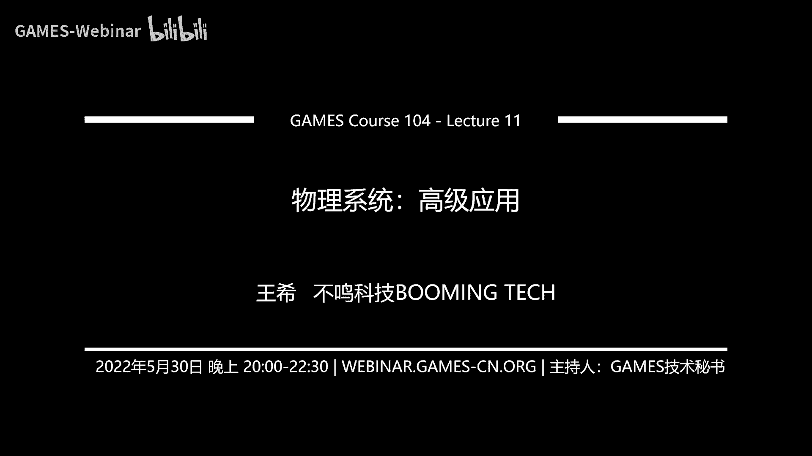
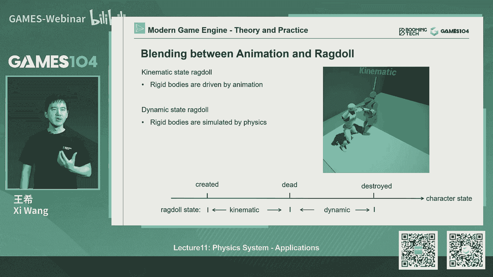
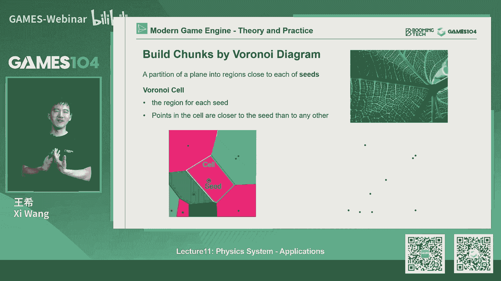
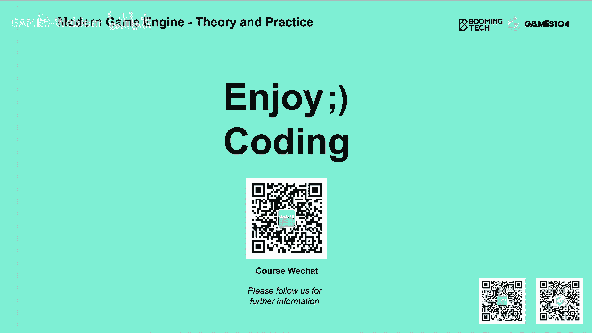

# 🎮 课程11：物理系统的高级应用 | GAMES104-现代游戏引擎：从入门到实践

在本节课中，我们将深入探讨物理引擎在游戏开发中的高级应用场景。我们将从角色控制器的基础概念出发，逐步了解布娃娃系统、布料模拟、破坏系统、载具模拟，并最终触及前沿的基于位置的动力学（PBD）与扩展PBD（XPBD）算法。这些内容将帮助你理解如何将物理引擎的强大能力，转化为游戏中生动、可信且富有表现力的交互体验。

---

## 🧍 角色控制器

上一节我们介绍了物理引擎的基础概念，如刚体动力学和碰撞检测。本节中我们来看看如何将这些概念应用于游戏中最核心的交互元素——角色控制器。

角色控制器并非一个纯粹的物理动态物体。它更像是一个“运动学”或“反物理”的物体，其设计目标是让角色的移动符合玩家的直觉，而非完全遵循物理定律。例如，玩家希望角色能紧贴地面、拥有无限大的摩擦力，甚至能进行瞬间传送。

一个典型的角色控制器通常使用一个胶囊体形状的碰撞体来包裹角色。这个胶囊体通常有两层：内层用于精确碰撞，外层则作为一层“保护膜”，防止角色卡进缝隙或离墙体过近，从而避免相机穿模等视觉问题。

以下是实现一个基础角色控制器时需要考虑的几个关键功能：

*   **滑动处理**：当角色撞到墙壁时，不应被完全阻挡，而应能沿着墙面平滑移动。这需要实现一个滑动算法。
*   **台阶跨越**：角色应能自动踏上一定高度内的台阶，避免被微小障碍物卡住。这通常通过尝试将控制器轻微抬升并前移来实现。
*   **坡度限制**：需要设置一个最大可攀爬坡度。当斜坡角度超过此限制时，角色将无法站立并会滑落。
*   **姿态变化**：角色在不同姿态（站立、蹲伏、匍匐）下，控制器的大小和形状需要动态变化。切换姿态时需注意时序，避免因形状突变导致角色被卡住。
*   **与环境互动**：角色可以推动动态物体。当控制器与物体碰撞时，可以根据角色的速度施加一个冲量给该物体。
*   **动态平台**：当角色站在移动的平台上时，需要将角色逻辑上与平台绑定，确保其相对位置稳定，避免因物理结算延迟导致的抖动。

总结来说，角色控制器没有特别高深的技术，但充满了需要精心处理的细节。这些细节直接决定了游戏的操作手感和角色与世界的交互质量，是游戏体验的核心组成部分。

---

## 🪆 布娃娃系统

在角色控制器之后，另一个广泛使用物理模拟来增强表现力的系统是布娃娃系统。它主要用于处理角色失去意识或死亡后的物理状态，使角色的倒地、跌落等动作更加自然，并与环境产生互动。

布娃娃系统的核心思想是将角色的关键关节（如盆骨、胸腔、四肢）用物理刚体替代，并用符合人体解剖学的关节约束连接起来。这些约束限制了关节的自由度（例如，肘部只能在一个平面上弯曲），从而模拟出更真实的人体物理行为。

从动画驱动切换到布娃娃驱动需要一个平滑的过渡。通常不会在动画的最后一帧直接切换，而是在动画播放到70%-80%时，开始将物理模拟的结果与动画姿态进行混合，最终完全交由物理引擎计算。

更高级的应用是“动画与物理混合”。在这种模式下，动画系统提供角色的基础姿态和速度，物理引擎在此基础上结合环境交互（如被拖动、受击）进行计算，最终将物理结果与动画输出进行混合。这能产生既有角色自身意志，又符合物理规律的生动行为，例如角色被超能力举起时的挣扎动作。

---

## 👗 布料模拟

布料模拟是提升角色视觉真实感的关键技术。现代游戏引擎主要采用基于网格的共模拟方法来实现实时布料效果。

首先，需要为布料生成一个用于物理模拟的简化网格，其面数远低于渲染网格。然后，在这个物理网格上刷权重，越靠近身体固定点（如肩膀、腰部）的顶点，其移动自由度越低，以防止布料飞离身体或过度穿模。

布料模拟的力学基础是**弹簧质点模型**。将布料网格的顶点视为质点，顶点之间的边视为弹簧。每个质点在模拟中会受到多种力的影响：

*   **重力**：`F_gravity = m * g`
*   **风力**：一个持续施加的力。
*   **空气阻力**：`F_drag = -k_drag * v` （与速度方向相反，大小成线性关系）
*   **弹簧力**：包含胡克定律产生的弹力 `F_spring = -k * (x - x_rest)` 和阻尼力 `F_damping = -k_d * v`，阻尼力用于消耗能量，防止系统无限振荡。

对于积分方法，除了上一节介绍的半隐式欧拉积分，布料模拟中常用**韦尔莱积分**。它通过当前帧和上一帧的位置来直接计算下一帧的位置，避免了直接使用速度可能带来的不稳定性，其核心公式近似为：
`x_{t+Δt} ≈ 2*x_t - x_{t-Δt} + a * Δt²`

然而，目前最主流的布料模拟算法是**基于位置的动力学**。PBD跳过了“力->加速度->速度->位置”的传统流程，直接将物理规律描述为关于位置的约束（如“两点间距离应等于原长”），然后通过求解约束系统来直接更新位置。这种方法更稳定、高效，能更好地处理复杂情况。

布料模拟最大的挑战之一是**自碰撞检测与解决**。当布料层数较多或剧烈运动时，布料自身会相互穿透。解决方法包括：加厚碰撞体、使用更细的模拟子步长、限制顶点最大速度、或在布料内部构建符号距离场（SDF）来产生排斥力等。

---

## 💥 破坏系统

破坏系统为游戏世界增加了可塑性和动态玩法。其核心是将一个物体预先分割成许多碎片，并组织成层次结构（通常是一棵树）。碎片之间通过“连接”关联，每个连接有一个“强度”值。

当物体受到冲击时（例如被子弹击中），物理引擎会计算冲击点产生的冲量。根据冲量大小和碎片的连接强度，可以计算出造成的“伤害”。如果伤害值超过连接强度，该连接就会断裂。断裂的影响会以冲击点为中心，按一定公式（如线性衰减）向周围碎片传播。

碎片的生成可以使用**沃罗诺伊分割**算法。在物体包围盒内随机撒点，根据这些种子点将空间分割成多个区域，每个区域内的点离其种子点最近，从而形成自然的破碎图案。对于3D物体，还需要结合**德劳内三角化**算法生成四面体网格。

破坏系统的挑战在于性能与同步。瞬间生成成百上千个需要进行物理模拟的刚体碎片，计算开销巨大。在多人游戏中，还需保证不同客户端上物理模拟的确定性，否则碎片落点可能不一致，导致玩法问题。

---

## 🚗 载具模拟

载具模拟是物理引擎的另一个经典应用。一个基础的车辆模型包含以下组件：

1.  **底盘刚体**：代表车辆的主体。
2.  **车轮与悬挂**：每个车轮通过弹簧（悬挂系统）与底盘连接。弹簧的压缩和拉伸模拟了车辆的颠簸。
3.  **驱动力**：发动机产生扭矩，经过变速箱和差速器分配后，转化为车轮对地面的静摩擦力，推动车辆前进。
4.  **轮胎力**：分为纵向力（驱动/制动）和侧向力（转向）。侧向力是一种滑动摩擦力，它使车辆能够转弯。轮胎力的大小受摩擦系数和车辆重心位置影响。
5.  **重心**：车辆的重量分布中心，极大地影响车辆的操控特性（如转向不足或过度）。

一个重要的概念是**阿克曼转向几何**。为了使车辆在转弯时四个轮子都做纯滚动，避免侧滑，内侧转向轮需要比外侧转向轮转动更大的角度。

通过调整发动机扭矩曲线、轮胎摩擦系数、悬挂刚度、重心位置等参数，可以模拟出从卡丁车到拉力赛车等不同手感、不同特性的车辆。

---

## ⚙️ 前沿：PBD与XPBD

最后，我们简要探讨物理模拟的前沿方向：基于位置的动力学及其扩展。

传统的牛顿力学方法通过计算力来驱动运动。而PBD则采用**拉格朗日力学**的视角，将所有的物理规律（如不可拉伸、碰撞）都表述为一系列关于位置的**约束** `C(x) = 0`。

PBD的核心是一个迭代求解过程。在每一帧，它先根据惯性预测顶点的位置，然后检测碰撞并生成碰撞约束。接着，它循环处理所有约束：计算约束函数在当前位置下的**雅可比矩阵**（表示位置变化对约束值的影响趋势），然后沿着使约束值减小的方向，以一定的步长调整顶点位置。如此迭代，直到所有约束都被近似满足或达到迭代次数上限。

PBD的优势在于稳定性和高效性，特别适合布料、软体等模拟。

**XPBD** 是对PBD的扩展，它引入了**柔度矩阵**的概念。在PBD中，约束是“硬”的，必须被满足。而XPBD允许为每条约束指定一个“柔度”参数，从而可以描述从刚性到柔性的各种材料。其约束方程升格为包含柔度矩阵的能量形式，通过最小化系统势能来求解。这使得XPBD能更自然、更统一地处理混合刚柔性的复杂物理场景，是当前物理引擎研究的热点。

---

## 📚 总结与作业

本节课中我们一起学习了物理引擎在游戏中的五大高级应用：角色控制器、布娃娃系统、布料模拟、破坏系统和载具模拟，并了解了前沿的PBD/XPBD算法。这些系统将物理计算转化为游戏中生动的交互和视觉表现，是构建沉浸式游戏世界的基石。

**课程作业**将围绕动画与物理的整合展开：
1.  **基础作业**：在小引擎中实现一个动画状态机，让角色能够完成走、跑、跳、落地等动作的平滑过渡。
2.  **进阶作业**：实现一个完整的角色控制器，要求具备墙面滑动、台阶跨越、坡度限制等基本功能，并能稳定地在复杂环境中移动。

希望你能通过实践，深入理解这些系统是如何协同工作，共同塑造出我们所游玩的精彩游戏世界的。