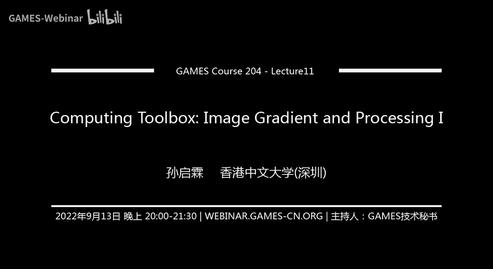
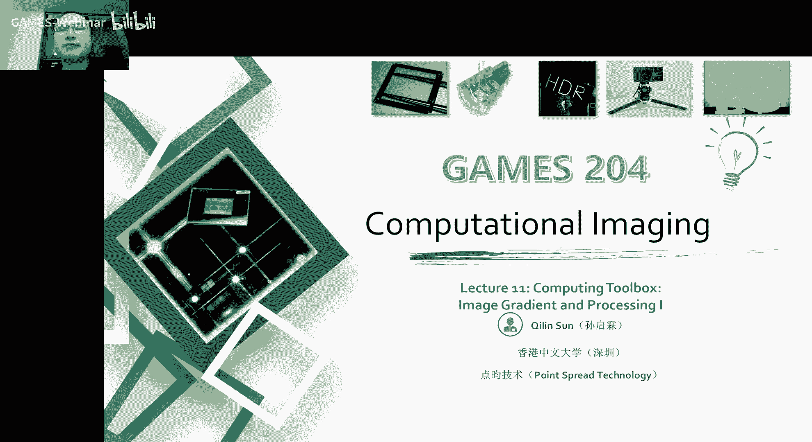
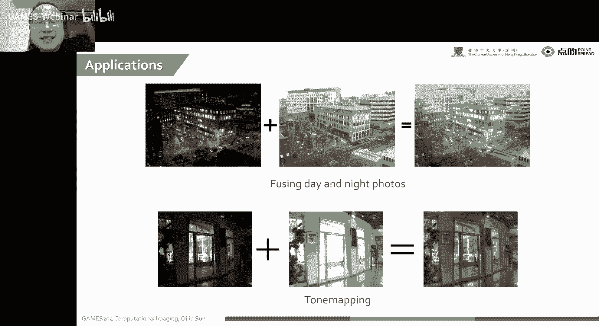
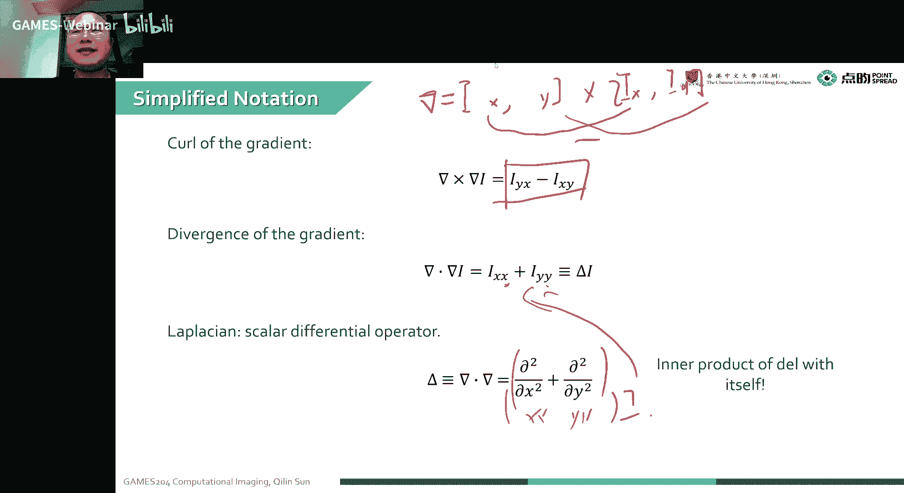
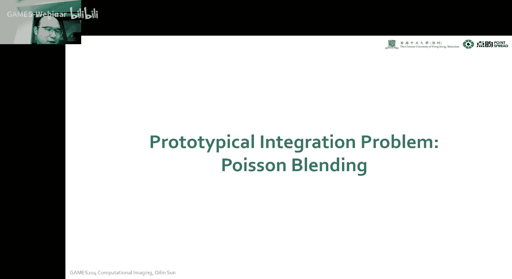
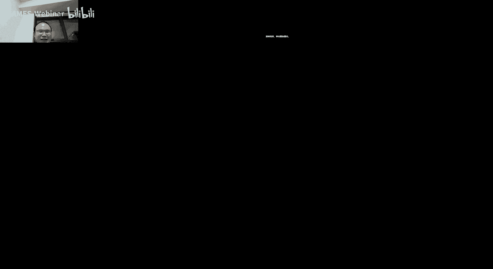

# 11.计算工具箱：成像梯度与处理 ｜ GAMES204-计算成像 - P1 - GAMES-Webinar - BV14B4y177Mv

今天要给大家掰扯掰扯这个image gradient他们的内容呃，我们上一节课是讲到了这个我们就是整个image成像的过程的最后一关，也就是噪声，就我们从一个原始的一个光学信号。

然后我们经过它在物理空间中的传播诶，然后到达透镜，到达透镜之后呢，然后我们会经过一系列的，比如说调制啊，诶最后到达传感器，诶，上节课我们就把这个整个成像的一个过程啊，就给大家完整的描述就是下来了。

然后从这节课开始，我们就开始进入了一个新的阶段，也就是我们进入到整个一个computing的一个two books，就是我们计算摄影里面就是计算的这么一个工具啊。

这套工具箱会有非常多的呃一些有意思的算法啊，然后告诉大家一些啊对一个image gradient的一个基础的处理，其实呃大家如果喜欢p图的话，就是可以经常遇到我们这个整个图像拼接边缘的问题。

就是最早的时候大家可能直接把这个图抠出来，然后边缘阿尔法通道一平均诶，这个时候就把一张图贴到另一张图上了，但是实际上呃我们会有一些更好的办法，就是我们并不是想把一个图直接扣到另一张图上。

其实我们想要看到的事情啊，就是实际上是我们在我们目标图上把这个图像自然的生长出来，诶这个事情就变得非常有意思，呃这个就可以很无痕的把一些图像拼接起来，所以说今天这节课就会给大家呃。

从这个image规定的这个方式开始给大家呃讲一讲这个就computing这个历程，然后呢后面会给大家逐渐介绍一些比较高级的应用啊，比如说像嗯有一个half quetic speeting method。

那就是我怎么样解一个图优化的方程，因为我们呃之前就eming to box讲的就是我们整个成像的过程，我们可以用一个operator或者用一个matrix来表示我们成像的过程。

然后呢呃我们那个这个target function啊，就可以根据这个image formation model跟我们的目标就是感受到了一个信号，诶。

就是给我们第一节课讲的那个嗯这个cost ftg的target cost function唉，通过这个我们就可以解一个优化函数，当然这里面会有非常多的一些约束啊，唉。

我们也学到过这个有这个就weak por跟strong prior啊，vg rider wag prior呢，其实这个我们今天这节课讲到了一个鬼点子。

就是一个非常嗯基础性的这么一个图像的一个统计的先验知识，然后除此之外哎我们就可以呃，也可以在这个约束在这个它的一个复利叶语或者一个小波域去加约束，当然了，有的还可以就是把那个把那个就是我们后面的一个呃。

像learning por或者是甚至一个specific的一个pr去加进来啊，伊万你可以看看他在不在这个直播间里，后面呢有一些display的课会让伊万老师给大家讲解。

对tv norm也是一个呃就是一个很常见的一个image pro，因为像为什么要有这个total variation，total variation，实际上就是我们假设呃这个图像它本身是稀疏的。

或者是它的一个规定性等，man是稀疏的诶，我们知道这个我们可以看到一个图啊，里面有非常多的内容诶，但是我们看到图像的梯度长的时候，哎我们就发现这个边缘的这个点呀，比它整体的一个点是非常小的。

所以我有时候就minimize这个tv n哎这个mini tv是啥呢，是我们经常就是mini ma图像的一个规定的一个tv哎，mini它之前有啥好处呢，比如说我这个图像有噪声的时候，哎就可以加一个tv。

就让它平滑一下，对不对，就可以把这个噪声诶给一定程度上去掉，然后还可以有啥呢，比如说啊我这个两个啊，这个同学说了一个deep image power，这个也是有的，大家解优化函数的时候。

其实可以代入非常多乱七八糟的一个fire吧，就当它的一个呃这个后面的一个约束函数，这个甚至bm c d这种东西都可以搞进去，这个非常有意思的，然后这个整个优化的一些比如说像a d m m啊。

我们有时间的话也会给大家分享一下这个proximal erator，讲完这个之后，我们也会给大家cover一下，就是呃一些一部分常常见的神经网络，就是大家在解决摄影的时候也常见的一些神经网络。

因为这个哪怕现在技术已经做的非常好了，就是学术界大家把技术做的非常好，但是工业界用这个神经网络的还不是特别多，因为很多这个场景它那个能耗跟成本划不来，所以说就给大家讲一些比较常见的一些网络。

然后为什么网络设计成这个样子来对，我们这个底层的这个computer image起作用啊，这个也会给大家分析一下，那这个就是我们整个课堂的一个computing。

就是computing to box这一部分，然后这一部分过后啊，就会给大家分享的一些optical in就是temple encoding，嗯，然后就special the main coding。

但还有一些呃其他其他乱七八糟的一些啊，这个special的一个topics，当然special topics我们会尽量的缩短一下，就每节课的一个内容，因为这个special topics可能太具体了。

大家学起来可能会比较吃力，诶好了，我们这时间差不多了，首先欢迎同学们来到我们的game 204计算摄影，现在摄影目前这个整个工业界的应用应该是越来越广泛啊，今天给大家分享了一个主题。

就是我们计算的一个tall box，也就是它的一个第一课，给大家分享这个image gradient，还有在gradient dm是怎么做处理的。

首先我们要给大家分享一下，讲一下这个在规定性走位我们都有哪些应用，就是大家可能有非常多这个耳熟能详的应用啊，或者拍照啊啊，或者是就是影视制作呀，都有非常多可以直接应用的案例诶，然后造一个简介之后呢。

给大家分享一下整个呃就是gradient跟厂的一些基础知识，然后再给大家讲一下这个就可以积分的一个vector fields，最后呃举一个实例，实例就是一个破松bending，也就是扩充融合。

这个也就是非常好的一种基于规定，然后在一个目标的图像上，就把我们想要的一个融合的一部分给它，根据gradient的分布长出来，它不再是一个抠图往上贴的一个过程。

它是根据gradient一个让gradient连续的，根据gradient连续性让它长出来这么一个过程，这个扩充bin是非常有意思的，他是跟本身啊，就是我们电厂那个破松方程，它是从那个地方借鉴来的。

所以说诶这个地方就叫psbending，然后这个gradient to my image processing，诶，都有啥可以玩的呢，唉然后最典型的应用就是我整个就破松融合，唉比如说我们左边哈。

我们看到左左上这个地方诶，我们有一个我们目标的这么一个呃目标了这么一张贴图吧，我们想把这个这个色块诶提到我们的目标图像上，也就是我们背景底色上有这个色块，对不对，诶当我们发现我们这个如果直接贴的话。

诶这上面的背景跟我们本身的这个图像的柜背景它非常就不和谐，然后怎么办呢，诶这个时候我们有一种方法就叫破松融合，我们可以看一下右边这个都是就是用通过破松融合来实现的，而这么一张图像融合。

这个就基本没有违和感啊，这个大家在很多就是影视制作会经常看到呃，一些像嗯这种便宜的五毛特效啊，当然也不能算是五毛特效，这个还是效果还是比较好的，这个大概是论文是大概是2004年的。

还是2005年的一篇西瓜的论文，自那之后，大家在一个呃这个整个图片上，就整个加上一个这么一个物体做融合的时候，就不再像以前我们这个图形群里面，special effect怎么这么复杂的一个计算。

就这么贵的一个计算就不需要诶，这个时候我们就可以拿一个很低的成本a来把我们想要的元素，融入到我们这个想要的画面里面，啊除了除此之外。

我这个gradient image processing还有哪些应用呢，比如说我们这个玻璃上的一个反射，我要把这个反射去除，这里面就遇到一个什么idea呢。

就我们可以看到左边的一张图跟右边左边的一张图是融合了一个，你看那个玻璃上有一个大概一个黑白棋盘格的这么一个反，射的一个图像，诶我们观测到这个图像有什么性质呢。

我们反射的图像跟我们本体的图像大概有什么性质呢，其实呢这就是基于一个假设，根据图像本身啊，我们知道这个图像的gradient它是非常稀疏的，那样的话我们这个反射，的图像，它的规定呢是不是也是很稀疏的呢。

是不是这个时候就可以有这么一个约束，就是我背景图像跟我们反射图像它的鬼点子哎，这基本上是不太可能重合的，对不对。

我们可以根据这一个image prior就可以轻松的把这个glass reflection给去掉，很还有很经典的应用啊，就是我想p图抠图啊，我把这个图就没有这种边缘，artifc的时候给他嗯。

挪过来挪过去就是或者是拼图啊，这四个色块拼在一起诶，这个时候都是整个规定的动漫imaging的啊，一些就是好处跟应用诶，这个我们可以看到右边这张图完全就像在一张图里面有一种感觉。

当然我们呃搞一点比较花活的操作。

就可以把这个呃白天跟夜晚的景象，我们在同一张图啊，这同一个位置我们拍一张白天的图，拍一张晚上的图，诶我们把这两个图融合起来会是啥效果呢，诶这个我们就可以看到白天跟晚上这两张图融合在一起。

就可以拿到右边的一种很神奇的一种效果，哈哈那下面这个是一种tm的一个案例，就是我们要把and的跟量的结合在一起，然后形成一张亮暗细节都很鲜明的这么一张图像，诶这个就是它在一个tmap里面的内容。

也是在我们规定域去处理的，实际上我们在规定的预处理啊，他就是根据我们在这个他给的image上，我们的规定呢，它的分布跟我们想要的就是就是我们source，因为是鬼脸呢，它是一直在那上面生长。

这个就是我们这个规定动脉的一个问题，因为很多信息都是存在边缘的，啊这是一个比较经典的论文。

大家可以看到这个呃，它是叫intestitute of imaging editing toys，这个就给大家展示了各种各样啊不一样的这个图像的一个操作，但是这个基本上都是根据这个规定。

动漫的一个optientation framework来实现的。

当然我们这个规定的动漫，它整个处理是根据什么样的一个链路呢，就是我们有一个原始的一个original image，诶，我们现在先把这个原图的一个gradient不出来。

同时呢我们也可以对这个鬼脸呢进行一定的操作，哎我们这个时候就可以对我拿到这个鬼点的一个厂了嘛，因为我们比如说一张图，我把这个xy方向各求一个导，哎。

这x y方向我们就从一个黑白的图就变成一个二维的一个图啊，这个图一个是x规定的，一个是y规定的，这就变成一个矢量场了，我们通过对这个规定的field咱们进行编辑，然，后再进行合成诶。

这个时候我们就可以拿到我们这个编辑过的一个图像，它的整体的一个链路是这个样子，然后给大家介绍一下这个呃鬼点子跟厂的一个基础知识，就是简单一点就是我们在一个2d的图像上来定义这个一个vector。

比如说我一个标量场，标量场是啥意思呢，呃就是，它就是可以你可以理解为是就是图像上的一个点啊，它是就是一个标量，然后矢量场的就可以认为一个点上记录为记录了诶，不同的一个就就有两个值嘛。

就是它到rt空间的art空间的一个映射唉，比如说我这个u跟v一个像素上有两个诶，这个就是一个矢量差，然后举个例子哈，像我们那个黑白图，黑白图就是一个标量场哎。

我每个像素点上这个像素阵列上每个点上都只有一个值诶，但是两个channel的一个图像呢，有一个南通道，或者是有一个一个通道是x gradient的，一个通道是y规定的哎。

这个时候我们就一个点上有两个值或者三个值，这个时候它就变成了矢量场，无论是表示颜色的矢量场，还是表示啊这个梯度的矢量场诶，这个我们就可以理解为只要是我一个像素点啊，大于两个值。

这个时候你就可以把它理解为一个web fields，当然更高维的也是可以的，比我们像呃我们的一个视频，我一个像素点上记录了一串值诶这个时候也是啊，可以理解为是一个随时间变化的一个呃。

mac or phd，唉这个怎么去计算呢，我们用这个它叫vector deficial operator，我们有时候把它记成nova，nova就是对xy方向分别求导了一个operator。

然后我们就把这个lava姑且集成为一个2d的一个向量哎，一个就是对x方向求导的算子，然后第二个元素就是对y方向求导了一个算子，然后我们这个规定它这个算子是啥意思呢。

就是规定的算子本身就是我们这个前面的那个nba，然后乘以一个标量场，就是比如说我们把这个拿给我们的这个图像，这个黑白，比如说这个i是一个xy，是一个黑白图像，诶，把它把nank gradient的相乘。

而最后我们就可以拿到他的鬼点子，好，我们可以拿到，你看我们上下第一个元素对x方向求导，第二个方向对y方向求偏导，诶我们跟这个黑白图像i x y作用之后，就可以拿到x方向的梯度，y方向的梯度。

然后与此同时呢，我们也可以看到这个divergence，divergence就叫散度，散度是啥呢，散度就是拉不拉跟一个标量场跟一个矢量场的内积，这个我们知道两个vector的内积啊，它就是一个标量。

对不对，实际上我们就拿到的是什么呢，哪里是对u v对u求x方向偏导，跟v y方向偏的一个标量和，然后克这个是啥呢，克这个叫玄度，大家学电磁场的时候可能学过这个旋度，它是它遵循的一个右手螺旋法则。

它是一个啊，我们这个呃差分算子跟这个一个矢量场的一个cross product叫差成诶，这个插成之后啊，它还是一个我们这两个矢量，插成它还是一个矢量嘛，它是而且方向是遵守遵循这个右手螺旋法则。

然后同样的我们就是遵循我们线性代数里面的这个对角线法则，在这个方程前面的那减后面的，然后乘以这个第三个方向，这个就是我们最后诶这个求它的一个旋度的这么一个结果。

然后呢嗯但是哈本身哈就是刨掉我们最后算出来那个方向，它前面那个系数就是我们呃对这个求他选度的前面那个系数，实际上还是一个标量，就是前面除了刨掉方向，前面就是还是一个标量。

啊求它把我们把这些东西都结合起来看一下啊，比如说我们求这个规定和这个散步，我们知道这个i但是xy对不对，这个实际上就是我们可以看到，德尔塔那个拉姆达x y2 x y sorry。

拿不到i xy等于一个啥嘞，等一个看到对x方向求偏导，然后对y方向求偏导，对不对，我们求叉乘诶，这个nva又等于啥呢，那么大就等于一个round 1 round x，round 1 round y。

是不是诶我们这两个球比差成拿到了什么呢，实际上就是我们可以看到第二第一项乘以第二项减掉个，减掉个第二项乘第一项，哎实际上把这个前面这个合并起来，就得到我们这个规定它的一个呃玄度。

当我们对这个规定呢求散度啊，这个我也看到我们前面我们这个image的briliant，是就是我们这个地方标标标记住的，我们对它求散度呢，实际上就是我这个两个项分别点乘相加起来，对不对。

这个也就是在x方向，在x方向二次求导，再加上y方向的二次求导a这个时候，我们就拿到了一个嗯叫德尔塔r xy，这个嗯有时候这个也叫拉普拉斯算子，叫scholar deficial operator。

实际上你可以理解为是一个啊拉斯拉拉布拉斯算算算子，实际上我们算的时候就可以把它理解为两个这个，拿不拿扇子，的一个内积，对这个就是非常简单，然后我又有没有检验要点技法呢，其实啊简单点记法。

实际上诶我们就run的老是round x，round y，这个也挺难受的，对不对，我们最后就干脆就用一个角标，哎我们下面标了一个x的时候，诶这个角标就是对x方向求t那对y下面角标标了一个小y的时候。

就是对外y方向来求偏导，诶，这个时候我们整个写的时候就会显得非常简洁，然后再看一看我们呃这个旋度的一个计算，你看我们这个实实际上还是我们这个拉不拉就等于啥啥啥小撇x对吧，这一个小小撇y诶，这个叉乘号。

我们这个，i x i y诶，这个时候就变得非常漂亮诶，第一项，两个e相减就可以拿到我们最后的这个规定，它的一个旋度，同样的话，那它的散度啊更简单，a就是x上面写一个y，后面写一个就可以拿到它的散度。

看拉普拉斯算子诶，直接我们就说这么一看，就是两个小x两个小y这对吧，然后我们把这个作用到一个i上，就可以直接拿到这么一个i xx加上i yy，这是一个简洁的技法，我们可以看到我们这个一个图像呢。

它的一个灰度图就是左边它是一个标量场，我们可以看到右边是它的一个呃一个gradient的一个矢量场，这个我们把它这个intensity用三维的一个mesh去表示出来啊，我也可以看到亮的地方诶。

凸的高一点，诶，暗的地方往下凹一点，这个它是一个标准的一个标量场，这些标准的一个标量场，哎当我们计算出它的一个鬼脸的时候。

我们看到我们对x方向求偏导，就可以拿到第一个图像，是中间上面第一个最左边是我们的原始的一个grace skill的一个level图，而我们对x方向求这个偏导，我们可以看到像这种这个是x方向。

像这些柱子这些地方我们可以看到这个鬼点还是很明显的，然后同样的我们对外方向求偏导也是这个方向，我也看到我们这个原本的这个灰度图啊，对外方向求偏导之后，诶，诶确实是因为比如说这条线剪这条线。

它基本上在这个y方向基本上是看不到的，但是呢这里面有个地方需要注意到，我们这个最gradient xy方向分别求偏导的时候，我们是把这一个灰度的一个这么一个标量场。

变成了一个有xy方向的规定的一个呃矢量场，本来是r图到r这么一个空间变换，后来变我们变成了r two到r two的这么一个空间变换，这个时候我们最后拿到了一个两个方向的这个，这个实际上就是一个矢量场。

像我一般啊，就是我们像数学上求导的时候，诶，我们这个喜欢打球呢，比如说就像上面这个我们对x方向求偏导，我们假设有一个微小的变化，这个h h很小哈，诶我们在x方向稍微有点变化，然后减掉原本那个位置。

然后求他了一个，一个里面一个这么一个技巧，在这个极小变化下的一个da的一个变化值，诶，这个时候就是它的一个导数，但是对我们的这么一个离散的图像呢，你要是个h啊，它基本上你要让它是零或者零点几。

这个不现实，但这个时候大家通常就喜欢用哎，我这个都是像素啊，都是整数的，我这个导数不就是实际上就是求差嘛，对不对，我这个单位的一个x方向和y方向的一个变化，诶这个h我设置成一不就好了吗。

这个时候我们这个求这图像的一个梯度就变得非常简单，实际上就是错位的剪，那么一下对吧，但是我们可以思考一下这个错位的剪一下，我们可不可以用一个conversion的一个卷积的方式，卷积的和来去表示它呢。

诶我们现在比如说有两个卷积核啊，左边这个是x加1y减掉个xy，我们现在右边给出来这个两个中一个kl，哪个kl对应着我们左边这个公式呢，我们是加一的位置减掉前后面的位置。

实际上就是后面的位置减掉前面的位置，对不对，实际上我们就可以用一个这种一跟-1的这么一个，简单的这么一个filter替代我们最后啊这个差分的一个形式。

因为这个我们计算这种卷积对我们的就计算机来说它是比较省内存的，就我们当然也有很多vector计算，同学们喜欢只有我们两张图，比如说mac python里面两张图，那么错一位相减a不就行了吗。

这个时候有时候会比较吃内存啊，所以说有时候大家就直接干脆诶搞个小剪辑，就把这个整个事儿就给处理了，但有的时候像除了我们这个错位相减啊，有时候大家还会把这个中心这个点忽略掉诶，我直接我把这个h设成二。

但是我中中间这个点中间这个点忽略掉，我直接x加一的位置，减掉x减一的位置，再除以二，这个东西呢叫中心差分，但这个中心差分有时候就比我们这个直接做差分误差小，当然也不是绝对的，这个就要看具体情况。

但我们可以看到这个最后，x方向我们知道了这个它是在x方向这么一个fs相减，y方向呢其实也很容易啊，我们去把这个x的地方换成y，实际上就是对它做一个transpose，对不对，实际上就是还是一个一-1。

只是换了一个方向的这么一个future，当然这个整体还是非常简单的，诶当然我们这个拉普拉斯算子又能怎么算呢，对不对，我们想一想啊，这个，我们在x方向求为了一次比呃，这就是拉普拉斯，实际上就是两个。

就是x方向求了个二阶偏导，加上y方向求了个二阶偏导，对不对，我们实际上就是把这个x方向求两次偏导呢，实际上就是我这个fter，看跟这个做了两次convolution对吧。

但我们知道conclusion和conclusion之间，这个实际上是对i哈，前面这个这卡做了两次康复注释呢，我们就可以把这个写在一起诶，这个时候这个是啥呢，这个一我知道这第一个，做卷积哈，一-1。

这个一乘以一个-11哈，然后下边这个地方就是，一，-1，-1，然后乘以一，实际上就是，最后我们拿到了实际上是一个一-21这么一个东西，然后同同理，我们在y方向达到了一-21这么一个东西，对不对。

我们把这两个方向的一个拉普拉斯加起来，就可以等效拿到右边这个拉斯拉普拉斯这么一个扇子，也就是一一-411这么一个简单的一个算子诶，这个时候我们发现二阶导实际上就是一个简单的一个拉普拉斯，对不对。

这个拉普拉斯fter也是非常简单诶，中间是一个-4，旁边啊，就上下左右各一个一就完了，对不对，当然我们有时候要注意到我们这个最后求到的这个值，我们还要进行一步下一步的验证。

就是我们最后求着这个拉普拉斯算子跟我们在x y方向分别求两次导，加起来到底是不是一样呢，比如我们看看内部啊，我对他求一个拉布达，实际上就是拿到一个xy方向的一个鬼点子。

我再给他一个做一个divergence operator，就是一个点乘啊，就是他这个算子给他做一个点乘，是不是就等于拉普拉斯特呢，这个我们下面用实验来验证一下，诶我们可以看到这个x y方向的鬼点子。

诶这个我们去怎么验证呢，我们对x y方向分别继续求导，然后再验证，哎我们这个拉普拉斯算出来的图跟我们这二阶求导，然后再相加的这个值到底是不是一样，但这个在我们看到这个结果之前。

就我们需要呃先抛出来两个问题啊，就是我们后面会给，我们后面会给大家讲一下啊，就是整个图像的一个，融合了integration的这么一个过程，但是对这个vector field它是怎么样啊。

什么时候这个可以做这个对这个vc field做了integration呢，它本身是有一定的一些信息或者是条件是缺失的，然后这个我们是怎么样把这个东西给它算出来呢，这个先抛出来两个问题，但像对上一页。

我我刚才给大家问到这个验证这个问题啊，大家呃回去感兴趣的话，可以就是我们分别对x y，然后去求个导，就就拿那么一张图像去求个导，然后再求一个二阶导，把它加起来。

然后呢另一张图直接用一个二维的一个拉普拉斯算子，大家算一算它之间那个差到底是不是零，首先说这个integrable fields，就我们已经就是说有了一个就是这种矢量场u和v啊。

假设啊这个u和v就是两张图吧，就我们可以看到我们右边给了一个例子，就是两张图，我们用这两张图怎么样去拼出来这么一个标量图标，一个标量的一个图i我们两个这么一个原图像。

u和v我们要拼出来这么一个i这么一个图像，然后这个需要满足啥条件呢，就我们追我们假设这个x y u跟v分别是呃，这个这个矢量场就两个元素分别是x方向的梯度跟y方向的梯度。

也就是我们最后的这个目标图像需要满足这么一个条件，对x方向求偏导，就等于这个图，然后对于y方向求偏导，就满足这个图我们需要满足这么一个条件，但我们知道我们这一个规定的求散度，这个它理论上这个值应该是零。

对不对，就是我们之前呃，上次刚才给大家留了个小亏子，理论上我这个，它的这个旋度啊，这个鬼脸的fi长的一个旋度，它理论上应该是等于零才对，因为我们这个xy方向求梯度，y方向求梯度，它理论上应该是相等的。

这个给大家验证一下哈，诶这个rx i y我们求到了，诶我们可以拿到这个德尔塔i，然后ti之后呢，诶我们对这个德尔塔i求它的一个散度，实际上就是让它等于零。

然后最后r x i y rx y跟i y x0 上这两个值应该是相等的，就我们这个可以用实验去验证一下，它这个是相等的，因为本身这个玩意儿这个玄度它本身是一个无源场啊，这这这是一个无源场无人场。

他这个球它的根选度呃呃呃有这是无缘无缘场，有人场无人场，他这个无烟场，他这个深度它就是等于零，这个是可以借鉴一些物理上的一个玩法，但我们知道呃这个时候已经知道让他让这个对规定的field求旋度。

它等于零，然后就可以得到i y x跟rx y也是前后顺序求导，并不影响我最后的一个结果，这个时候它理论上这两个地方就是相等的，这是我们就是对后面做了一个图像的一个integro。

就是integrable，就是呃它的一个前置的一个条件，这个时候我们再看这张图，现在我们已经知道对我们这个目标的这个图像，就我们的目标图像，目标图像对x y分别求导，然后我们就可以满足。

我们就有这么两个条件，但是呢这个又需要满足一个什么条件呢，它的一个3度就是等于零，也就是round u对y方向的偏导，跟round v在x方向的偏导它应该是相等的。

所以说这个就解答了刚才啊这个第一个问题，就什么时候这个integration它是可能呢，也就是我们用散度去check，这个就是我们混合到了这个偏方，偏方程在二阶二阶导的情况下是不是相等。

二阶的一个偏微分，就是x y方向它是不是相等，这是我们的一个呃，就是做那个integration的一个前提条件，对这个同学呃，这个1996同学说这个smart这确实是的。

因为我们图像本身它这个规定太细了，你这个你求它的一个难度，你求它的一个选度的话，他确实理论上该吸的地方就已经没了，它二阶的地方应该就就没了，所以说我们就是i y x就跟i x y连上这个箱子本身。

还是由于这个图像的一个稀疏，图像信号本身的规定呢，它是非常稀疏的，当然我们考虑到这个integration这个问题的时候，就我们想要就重就重新，就是重建，就是根据这个诡异点的重新长出来这么一张图。

它有一些什么样的应用呢，就是比如说我们去通过这个shading来去估它的一个形状，然后还有一个比较好玩的就叫光度立体，大家如果学过这个computer vision的同学啊。

可能会对这个光度立体立体比较手写，就是我们一个光照达到一个物体上，我们去切换它不同的角度诶，这个时候我们就可以，但那相机固定不动啊，我这个光照换到不同的角度，假设我们这个材材料是比较均一的。

我们表本身表面那个abele，这个时候我们就可以计算它那个vector的一个，就是它表面的一个呃那个叫法，线方向的一个fs，然后把这个通过光度立体的办法啊，去把这个呃图像算成一个三维的一个出来。

然后第二个玩法呢就是这个玩法呢啊，就是我们对这个image gradient进行一个操作，比如说像这个tom making image editing啊，或者是这个消光啊，或者是融合诶去诶。

就马赛克这个都是这个image规定直接进行操作的一些玩法，那除此之外我们还可以第三题的一个规定进行呃搞一些玩法，比如说像我们mesh，就我们大家可能马上301。

刘立刚老师会开一个呃这个这个loop divation的这些课程啊，这个match editing这个就跟这个integration，problem有关，当然我们还可以对一些video啊进行操作。

但是我们这个地方我们要实现这个integration的这个问题诶，它会有一个非常大的一个挑战啊，就是我们这些矢量场很多时候就是不大可逆啊，这个它不大好恢复成一个比较好的一个标量场。

就是但是这个时候呢我们就不得不利用一些小trick，就我们有一些近似的一些小trick，来把这个那个矢量场就可以比较好的融合成一个，我们最后的一个标量场，啊这个怎么玩呢，举个例子。

这个第一个例子就是我们这个破松bin这么一个过程，这个破松融合这个这个bblinding就是融合的意思，这个破除融合是啥呢，就是我们之前看到了这个普通融合这么一个例子。

我们可以看到像传统的一个copy piece的，是我们把这一块，传统的一个copy paste是我们把这一块图像诶直接扣过来，然后放到我们的目标图像上，对不对，但是整个扩充融合它干的不是让两幅图像叠加。

这个大家不能把这个东西理解为直接的一个叠加，那这个普通融合到底是一个什么样的思想呢，实际上扩充融合是让这个目标图像在融合的部分，就是根据它的gradient长出来。

这个原图像就是它不是一个简单的一个这个图像叠加或者是抠图啊，在贴上它是根据gradient让它斜率连续变化的情况下，然后让它在我们的目标图像上把这一块想要贴上去的东西给它长出来，诶，这个就很特。

这个就很有意思啊，这个本身它是根据这个本身我们目标图像的自己的特点哎，来生成的这么一个图像，所以说我们最后看到的像右边这张就是呃扩充融合这个图啊，就看得非常自然，就好像是这么一个呃空中花园飘在那里一样。

这个怎么掉了，不好意思，这个刚才手抖，哎我们讲到了第几页了，我这个进进行扩充融合，它的一个核心思想是什么呢，就我们在做融合的时候嗯，就是我们要把这个尽可能的把这个鬼脸让他就连续的呃就表达在一起。

这个时候我们就看到了这个图像诶，就会更加自然，比如说我们从左边那个原图上，我们想要把这两个光源抠出来，放到我们就是第二张图像这么一个目标上面，然后我们像传统的一个copy peace。

我们把这个随便一抠，但是呢我们通过泊松混合图层融合诶，我们就可以把这两个光源，都可以很自然地融合到我们这个目标的一个图像上，这个时候我们就首先要对整个啊进行一个定义。

我们给定了一个source，这就把这个g啊记为一个short image，就右边这个我想要把这一块，但这个也是一个记号，我们要把这个融合到这个目标函数上，这个我们的目标图像是啥呢，是一个把它记为s。

也就是这个地方是一个s，然后呢我们有一个or omega，也就是我们目标的这么一个区域，然后我们现在有一个intemplation function，也就是我们这个啊就是往上插值的这么一个方程。

然后本身呢我对我目标上面，目标函数上面就是我们这边s2 实际上就是我们的目标图像，就是我们这个目标图像，我们把它记为f2 ，我们这个时候想要看到哪个参数是未知的呢。

我们知道这个source function就这个把它抠出来，这个要贴上去的图肯定是已知的，我们的目标底呢这个s大家肯定也是一致的，这个我们目标的区域，也就是我们要贴图或者是抠出来这一块。

这个区域这个时候也是知道的，哎我们最后的一个destination function，当然就是我们最后这个要往上贴的这个区域，这个时候这块也是已知的，未知的是啥呢，未知的其实就是我们里边这一块。

我们想要把这个地方就是an interpret出来的这一块区域，这个f是未知的一块图像，我们可以看到这个f是我们的一个目标，我们要把这个f解出来，在这个omega区域里面。

把这个f很好的跟后面的背景融在一起，我们要解了一个函数，其实就是这个f它是一块区域，但是这块区域每个都有一个小像素，但这个f需要满足一个什么条件呢。

就是我们想要把这个sars就是原图像融合到我们的目标图像上，哎这个时候f需要满足到什么情况呢，我们目标区域内有这个目标区域内，跟我的一个source function，比如像这一块。

第一个我们就想要它的一个鬼点的是两个图像的拐点的相等，这个时候诶我们融合之后跟没有融合之前，这个时候就是本身你你看它这个内容不是应该不应该有改变，对不对，所以说它的规定呢在这个omega区域内部。

我们第二条让它相等，除了这个内部它的规定呢它相等之外呢，我们还要加一个约束条件，也就是我这个背景的一个就是目标的一个背景图像，跟我这个要中间要插出来这个图像。

它的一个boundary应该在这个欧米伽区域的这么一个约束下，也就是在这个德尔塔omega这个区间，里面这个时候我们满足这两个约束条件的时候，我们这个图像我们可以才可以就最后我们拿到了一个融合后的图像。

我们才可以理解为跟之前的啊原图也好，跟之前的背背景图也好，哎都没有一个很大的一个差别，也就是我们需要解决的一个就是内容的规定连续六相等一个问题，第二个就是我们boundary。

就我们边缘的地方啊要比较好看，所以这个不同混合的过程呢就是呃它的一个integrate vector field，这叫nt，它是要需要满足一个叫嗯狄利克雷的边界条件，这个是一个常微分方程，常微分方程的。

第一类边界条件，数学上这个叫啊狄雷克a和边界条件，实际上就是在我们这个图像上这一块，而实际上它就是一个就是这个图像的边缘，这么一个run到omega这么一个区间。

我们想要通过一个呃解一个最小二乘法的时候，来解这么一个呃破松混合的一个过程，当然我们要解一个啊最小二乘的一个呃函数嘛，我们就要先把这个目标函数解出来，我们要先把这个目标写出来之后，才能对它做优化。

对不对，然后呢，所以我们可以看到这个叫rational problem，这个函数是啥意思呢，就是我们要把，德尔塔f实际上就是我们对我们这个目标图像，我们最后的一个目标图像诶，它在x y方向的一个呃偏导。

实际上就是我们目标目标头上的鬼点子啊，v又是个啥呢，那个原图像g我们好把它提上来，那个他的在x y方向的鬼点子，对不对，我们就是刚开始写到那两个方程，就是我们需要让德尔塔f就是拉姆的f等一个lvg。

然后在这个，omega这么一个域里面，然后第二个呢就是我们刚才讲到的一个边界条件，就是我们最后想要拿到了一个integration的这么一个图。

实际上它在边缘的地方应该跟我的这个背景的这个图它应该是相等的，对吧，我们在这个放到omega这个地方应该是相等的，就有了这么一个地方，我们就可以呃解这么一个方程，然后这个嗯我们会慢慢给大家道来哈。

这个第一项实际上就是gradient，这个我们刚才已经讲解到了，这个v实际上就是呃就是source图像，我们需要贴着那个图像的一个gradient，然后呢外面实际上就是在bug上面满足一个条件就可以了。

然后我们可以看到这个nf v，还有这个后面这个呃f star和f前面这个地方是一个标量，它是一个是一个矢量，右边呢实际上是一个标量的地方，让它相等，然后呢我们这个，对我们这个扩充怎么解这个扩充方程呢。

首先我们要可以求一下这个图像的一个按点，对不对，我们可以看到很很容易的看到是像这种目标函数，它理论上是不是就是一个二次方程，虽然说我们大家有很多的维度，因为非常多的一个element。

那本身呢这一个目标函数是一个凸的，是一个凸函数，我们知道凸函数有啥好处呢，凸函数有个好处，就是它有极大或极小值，对不对，我无论你这个用的什么优化方法诶，我这个最后都能解到一个最好的值。

呃当然这个不是满志的时候，这个有可能有很多解哈，但是这个解析值的情况是是这种，我们对这个德尔塔f它求它的一个拉普拉斯，也就是二阶安点的时候跟他这个v的一个divergence，哎。

这个时候我们一阶的地方，已经让它相等了，对我们二阶的时候是不是也得让它相等才对呢，那我们就可以继续看啊，后面的一些故事，我看到就是之前我们讲过，目标函数跟我们目标的一个图像。

跟我们最终的一个融合好的图像，就是我们这个sars图像，它的一个规定呢，在这个我们要融合的区域内应该是相等的，然后呢同时它这个边界也要满足它相当的一个条件，那也就是说我们这个v这个地方就是德尔塔g。

然后我们这这个v求它的一个散度哎，就是我们刚才讲到了一个d i v，然后作用到这个，大不了g这个上面，这不好意思，这个刚才讲那个了，ppt卡了，不好意思不好意思，这个ppt卡了，我给大家再再掰扯一遍哈。

要刷新一下这个，就这个目标函数，就我们可以看到，我们现在有一个，我们刚才讲到了，就是德尔塔f就是nf f的一个梯度，跟这个g的梯度，就是我们source图的梯度诶，应该在这个欧米伽的区域是相等的。

那同时呢我们要满足这个边界条件啊，就是我们最后要融合的这么一个区域，跟我们呃背景这个区域在这个boundary loomega这个区间a应该是相等的，然后在第一项和第二项分别代表什么呢，哎这个就看哎。

第一项就是我们第一步就是在x y方向的规定的分别相等，然后第二步呢实际上就是在帮助的地方，他应该在这个boundary里融合前，融合后这个标量的地方应该是相等的。

但是我们看到这个minimize这个function的时候，它就是一个两个方式的一个sobedience now，它本身这个我们可以看到跟这个一二次方程类似，它实际上是一个凸函数。

这个凸函数有啥好性质呢，就是它通函数有个极值，但我们本身哈还是围绕着这两个条件来看的，就是目标的图像，目标这个图像的一个x y方向梯度跟原图像的x方向梯度应该相等。

然后同时我们需要考虑到这个它的鞍点就是二阶的一个拉普拉斯，这个时候他的二阶拉普拉斯是不是也应该相等呢，哎我们就可以看到啊，就是拉普拉斯就f这种目标区域的一个拉普拉斯二阶导。

应该是跟我们最后一个目标的一个梯度的一个呃散度，也就是他在就是我们这个目标函数的一个方向梯度，再求个3度应该是相等的，因为本身一阶梯度都相等了嘛，这个我们要让它一样看起来一样就变化了，更连续。

这个二阶的梯度应该也是相等的，对不对，说当我们满足还是这两个条件啊，所以说这个，输入的这个uv实际上就是我们source图像的一个x y方向的一个导数，这个就是呃变得非常简单明晰。

当然对这个x y方向的导数给它再求一个呃3度，就他求他一个二阶的一个3度，这个时候诶那这个，德尔塔g等一个，这个跟这个f的就是x方向的二阶导相等，然后我们去怎么样解这个普通方程呢。

让它相等的目的实际上就是国电的更延续，我们看起来会非常自然，怎么样解这个破分方程呢，我们呃其实解这个破分方程啊也不是特别困难，我们前面我们对这个普通方，我这个拉普拉斯算子。

拉普拉斯算子我通常把它写成一个operator呢，它是一个卷积的形式，而且x方向的一个差分，它是一个filter诶，y方向的一个差分，他也是一个一个一-1的一个fter。

所以说呢在我们就是对这个图像进行操作的时候，诶我们就取一个deltf，就是他的拉普拉斯fter进行一个这么一个our plator写上去，然后呢呃我们也可以呃用这个像素相加相减的这么一个过程。

就是下面这个地方，这是一个dissection的表示，实际上就是呃这中间-4，然后其他几个地方相加，然后我们就有时候要解一个线性方程，你怎么把它变成一个线性方程呢。

现在我们拿到的是一个拉普拉斯的operator，对不对，我们这个时候目标就是这个f的拉普拉斯，跟这个就是我目标的一个梯度场的一个divergence，让它相等，诶这个我们写写硬写下来也可以看成这个样子。

那相等我们可不可以用一些线性的方式来表达它呢，就是我们可以看到我们把这个我们的目标函数f，比如说他一个二维的图像，打到这个拍掉，拍成一个长条，我们就把上面这个计算的这个公式。

通过这种拍成这个长条的一种方式来写成一个vector对吧，我们这个每个elements跟它对应的这么一个加减，实际上它就可以把这个拉普拉斯这么一个3x3的矩阵。

拍成这么一个a这么一个长条a然后用一个内积的方式诶，直接就把这个呃线性的表述出来，我们最后的一个b就把它写成a f等于b，a就是一个对应的拉普拉斯的一个matrix，二维不好算。

我就把它拍成一个一维的长条，然后最后我们需要的时候再把它变回去，当然我们要把这个一维的每个像素，操作的时候都有这么一个意味的长条，但这个时候我们就看到诶。

我们要想把所有的这个图像都通通的用一个线性的一个，就是拉普拉斯的一个算子去表示，哎，这个时候我们把它拼成一个大的一个a哈，诶就我们就在对角线上，那你们我们就拿到一个d，然后呢这是一个非常恐怖的一个数字。

因为我们的整个图像是m乘n的，然后每一个点我图像的大小是m乘n，每个点都有一个matrix来表示它，对不对，然后我们最后要对所有的像素，也就是m一个像素，然后把它这个整体写成一个大，的一个matrix。

我靠这个就是a m n乘以m n这么大一个超级巨大的一个mhx，这个大家觉得很恐怖，实际上我们可以看到啊，这中间那个diagonal是一个-4的，然后边上呢我们可以看到还是有一的哈。

因为这因为这个它是一个有一的这么一个地方，所以说它不是一个简单的一个对角的一个简单的一个对角的一个mrx，所以说这个我们有时候就不能用一个一去把这个提出来，这个提不出来啊，对不对。

这个时候我们算起来就非常困难，是不是因为它太大了，本身呢我们也不大好的一个进行直接，简化啊，这但是这个时候也可以用sparse present，就是它大部分地方都是零，基本上也就在对角线上，这个地方有。

那这有多少个元素呢，我对角线上我们知道这个size是m乘n，然后再加上旁边派的一直接上整体的数量，也就是3m乘n这么多个点，就是大家就是可以用spark的，我们不需要用m n乘m n的平方。

n的平方这么多，那么m n乘以三这么多个位置表示也就够了，然后我们要剪让它这个f的一个拉普拉斯，等于这个最后我们目标函数的一个梯度的一个呃散度，我把这个大的方程都写在一起哈。

我这个f是我目标去要求的一个值，我们前面有一个大的一个拉普拉斯的一个呃一个大maxx，那么右边呃是我们因为这个source是已知的嘛，我们这个source。

就是已知就是source的一个vector field，就是我们最后要往上贴的那一块它的鬼脸，然后再散度，再求和散度都是已知的，这个时候我们中间要求的哎，就是中间这个f这个大长条。

这是一个一个m乘以n的一个大长条，哎这个时候我们把前面中间这一块就写，可以写成一个大的matrix，也就是a，就a f等于b，也就是a，a sorry，卡了不好意思，到哪儿了，对就是这个地方。

a f等于b啊，右边就是b我们要求的一个大actor f，就这，但这个边缘的地方要大家要注意一下，就不能直接嗯上来，就算就是有时候要考虑一下这个边缘的，这个就是帮助了一个问题，有时候大家用就是pad啊。

这个或者是直接reflection，这些都是可以的，哎这个时候我们考虑到我实际上拿到的是一个a f减b的这么一个，cost function，我们想要它们之间的一个l尽可能小，那理论上等于零是最好的啊。

当然这个等于零是非常困难，然后这个a f减b它在这里是一个，线性的一个函数，a f减b这个地方是一个线性的函数，是不是不是线性函数啊，sorry，它是一个凸的函数，我们把这个写开呢，这不需要解开。

我们对这个求导就好了，哎我们让这个哎呀我这个笔设置一下，不好意思，我们对这个e s l求导，实际上就是拿到了一个a transport，然后a transport，然后括号里面a f减b让它等于零。

对不对，诶这个怎么写的不好使了，你看我重新翻译一下啊，诶这个为什么不好使了，我们可以看到这个对他求一个偏导，e s求个偏导，我们就可以看到呃，实际上就是a transport括弧af减b来让它等于零。

但是我们知道这个a transport我们就拿到一个让他等于零吗，实际上是我们求它的极值，它的这个极值啊，实际上就是我们最后要求的这个f这个a实际上是非常大的一个matrix。

然后a transport a呢它还是一个m乘m m n的平方，乘m n的平方a这么大一个超级大的一个矩阵，那对他球迷基本上是不太现实的，你不大可能就是直接对这么大一个没水的球逆啊。

这个计算量得是超级巨大，是不是，但这个也有他自己应对的一个方法，就是我们可以看到这是一个af等于b的一个问题，一般的话呃我们会有一些专门的一些pl server，也就是呃类似词汇的一些server呃。

比如说像我control gredients，就是我们叫共轭梯度法，当然我们还有一些像multic grade approach，i preconditional approach，诶。

这些我们就是这个方程到底怎么解，诶，这个时候我们在下一节课会给大家覆盖到呃，怎么解这么一个扩散方程，今天呢给大家介绍了一个就是在古典德曼的基础的一些知识，还有一些呃basic就是我们这个规定到底怎么算。

然，后我们这个integrable vector fields，还有最后啊举个例子就是pm benning，下节课我就给大家继续讲这个破bendy的那个计算的问题，大家有什么问题可以问一下a这么大。

这个这个这个这个零同学问这个a这么大，求你不大可能吧，这个你想这个假设一张图纸一照就一就1000x1000，这个图不算大，对不对，然后他1100兆的平方就是一个哥，就是一个g。

然后一个g的这么一个大的这么一个就一个一个边嘛，一边是一个一个边，就是一个g的像素了，然后另一边又是一个g1 g乘以g，这个是一gg是多少啊，这个这么大是不大可能求逆的，就是大家没那么大的内存。

也不大可能呃去在内存里面反复读写cpu去算算，所以说这个时候啊就会用一些就是iteration的方法，这个方法有很多哈，呃这个会给大家下节课介绍一下这个像ctrl i gradient这种方法。

当然还有一些像传统的一些像贾克比迭代诶，或者是那个牛顿迭代，这个都是有办法去把这个东西解出来的，这个就是我要看一下它的这个能效比，这同学们有啥问题吗，这个可以快速问一下，就上下一课之前。

贾克比迭代是一个比较基础的一种迭代方法，但除了这个之外，我觉得ctrl v鬼脸可能会更好一些，它他这个速度会快一些，当然这个除此之外，下节课会给大家讲一些其他的一些融合的玩法。

比如说像我们这个text诶，怎么去替换别的texture，这个地方也是非常有意思的一些玩法，大家同学们可以下节课继续啊，把这个这这个image规定的这块继续完成下来，这个就非常多。

有意思的image editing都可以通过这个gradient这个操作来进行完成，虽然说这个块已经搞了挺长时间了，这个这块知识应该有了个接近20年了，0405年是一个非常火的那么一阵。

但这个到今天还是挺火，大家有很多地方是可以交叉应用的，特别是我们像tmaking哎这些地方就都可以利用到这个鬼脸的一些知识，因为这个gradient在图像里面，特别是成像里面，它永远都不会过时。

就我们所有的呃这个这个图像它都有这么一个性质啊，第二次作业的截止日期是好像是25号晚上，我有点记不清了，因为作业里面会写到啊，对课前有同学问这个通道开了吗，应该是开了助教。

我记得是把这个第二次上交作业的通道打开了，第二次作业相比第一次作业会稍微简单一些，是第二第一次作业呃，这个当时我觉得很简单，但是后来听大家反，应好像内容有点太多了。

就虽然说每一个环节大家实现起来都没有什么太大的难度，但这个环节一太一太多了呢，就是大家不知道这个环节做的到底对不对，所以说这个时候就不知道就整个串起来，一旦出问题哎。

那就很难找到这个问题出现到底在出现在啥地方，那第二次作业就好多了，我们就实现两个特定的任务，local tommy跟hdr fusion，这个就会好一些，然后期待大家展示一些很漂亮的结果。

就哪怕现在有很多乱七八糟的软件就做出来，融合效果并不好，而且这个第二次作业吸取了第一次，做作业这个教训，然后给大家一个工具软件，可以让大家对比一下嗯。

就最后融合出来的效果跟这个你们自己算出来的效果是不是差不太多，然后就可以check一下，你融合了这个hdr图像，还有你最后tommy变成图像呃，这个正确度大家可以先用我给的那个工具先自己check一下。

大家对这堂课的这个image规定的有啥问题吗，其实这堂课很基础，就是我们我们目标厂目标的那张图跟我们这个sars的图，它规定的应该是相等，然后在帮助的这个地方哎也让它相等啊。

这个我不记得工具人证明了这个，就在下这个作业的时候里面就有这个工具了。

诶难道是我放忘了放吗，这个叫picture not，我要我要忘的话，待会我就发群里好了，对不对，放了是吧，我记得我放了没忘这个事，同学们还有啥问题吗，好没有问题，就嗯再次感谢大家来到gz 204。

希望大家把计算摄影啊继续好好学学这个没有mac os的嗯，这个我不是很清楚啊，这个你可以从官网下一个，就是或者是从再搜一搜，下一个可能是我记得应该是有mac的，应该是有mac的，我看一眼。

如果这个mac没有的话，那就下一个类似的这个问题也不大，对，因为这种软件非常多，麦克也可能有自己的工具，这个大家不用太担心，对好，那再次感谢大家好，希望大家有个愉快的周末。

