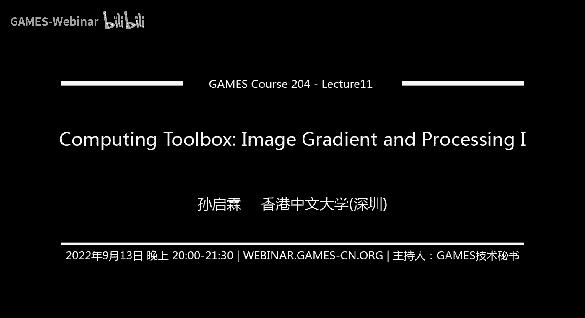
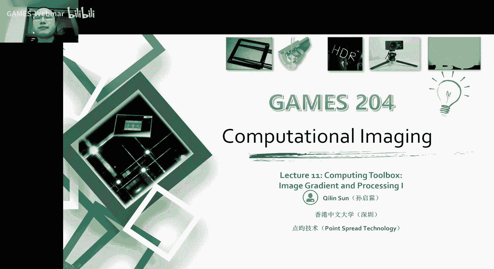
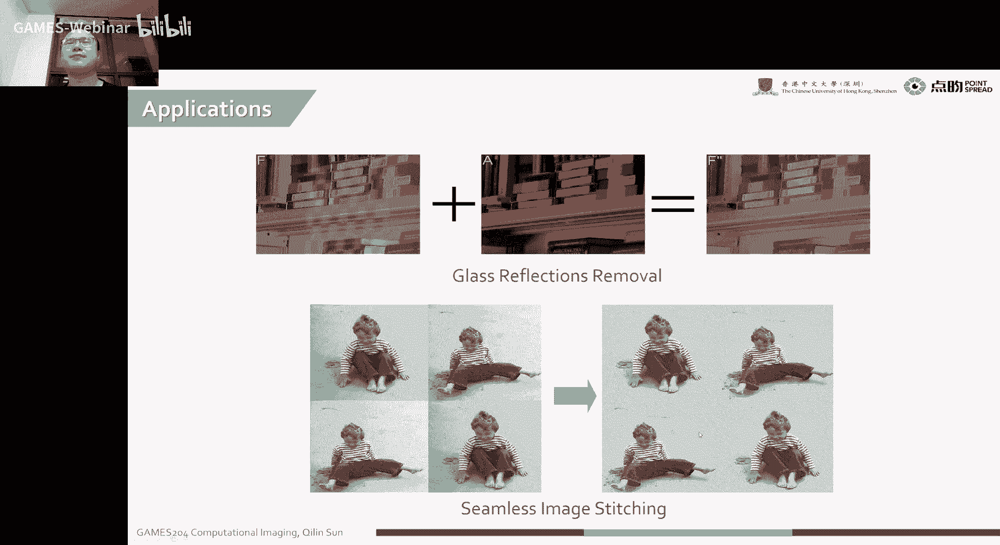
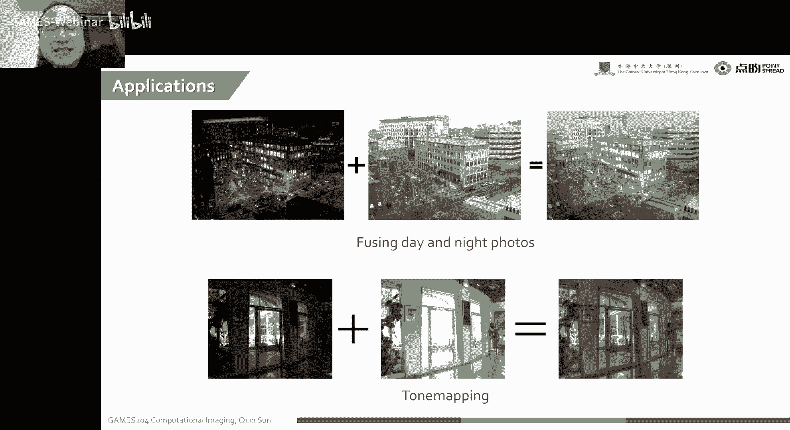
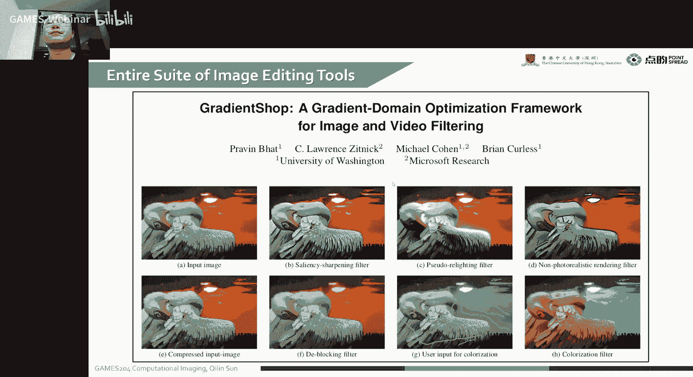
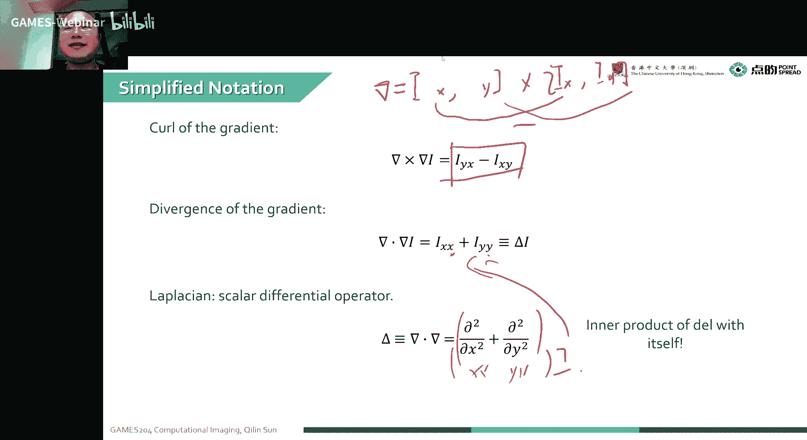
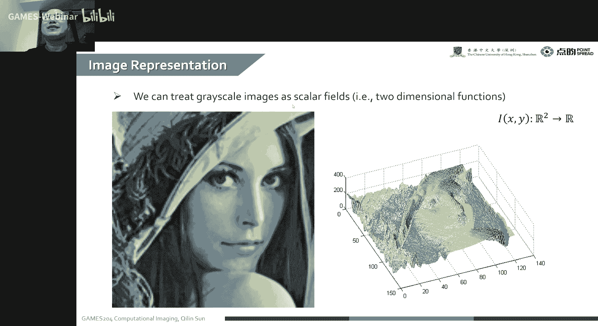
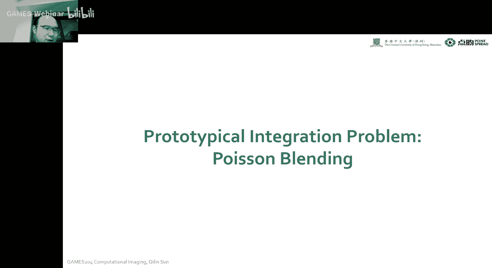
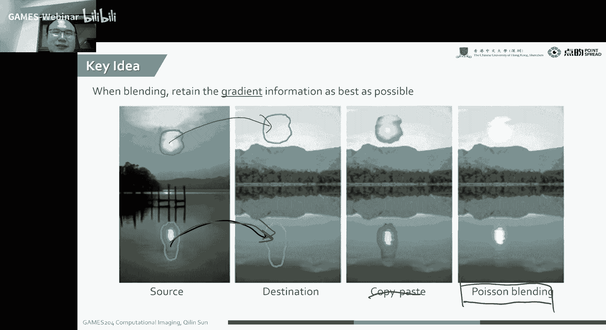
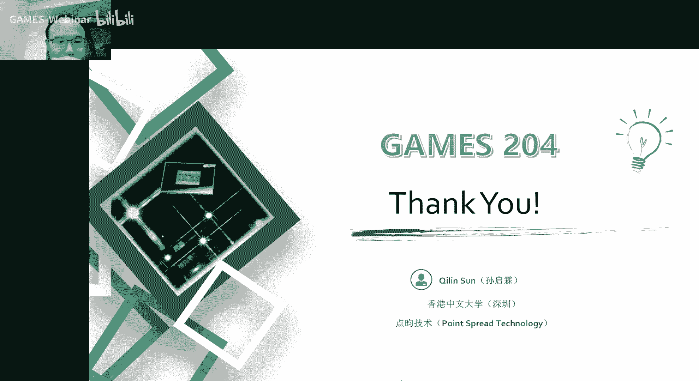

# 11.计算工具箱：成像梯度与处理 ｜ GAMES204-计算成像 - P1 - GAMES-Webinar - BV14B4y177Mv

## 概述

在本节课中，我们将学习成像梯度及其在图像处理中的应用。我们将探讨图像梯度的计算方法、性质以及其在图像融合、图像编辑等领域的应用。

## 图像梯度的应用

以下是图像梯度的几个主要应用：

* **图像融合**：例如，将白天和夜晚的图像融合在一起，得到一张具有丰富细节的图像。
* **图像编辑**：例如，去除玻璃上的反射、进行图像拼接等。
* **图像恢复**：例如，通过图像梯度进行图像去噪、图像增强等。

## 图像梯度的计算

图像梯度的计算方法如下：

1. **计算图像梯度**：使用卷积算子对图像进行卷积操作，得到图像的梯度图。
2. **计算散度**：对图像梯度进行散度运算，得到图像的散度。
3. **计算旋度**：对图像梯度进行旋度运算，得到图像的旋度。

## 图像梯度的性质

图像梯度的性质如下：

* **稀疏性**：图像的梯度通常在边缘处较为明显，而在图像内部较为稀疏。
* **连续性**：图像的梯度在边缘处连续变化。

## 图像梯度的应用实例

以下是一些图像梯度的应用实例：

* **图像融合**：例如，使用图像梯度进行图像融合，得到一张具有丰富细节的图像。
* **图像编辑**：例如，使用图像梯度进行图像编辑，去除玻璃上的反射、进行图像拼接等。
* **图像恢复**：例如，使用图像梯度进行图像恢复，进行图像去噪、图像增强等。

## 总结

本节课介绍了成像梯度及其在图像处理中的应用。我们学习了图像梯度的计算方法、性质以及其在图像融合、图像编辑等领域的应用。希望这节课的内容能够帮助大家更好地理解图像梯度的概念和应用。