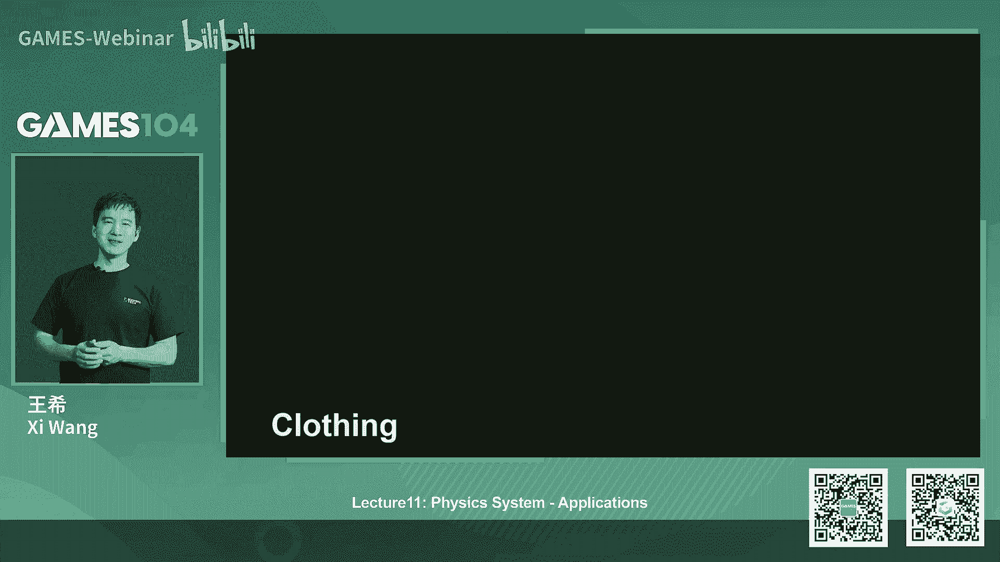
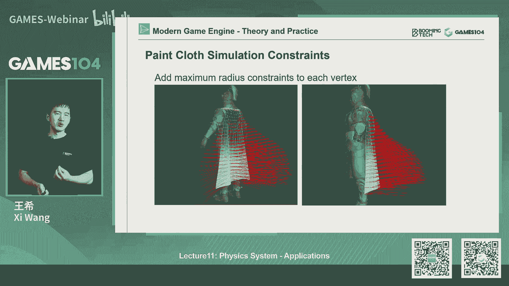
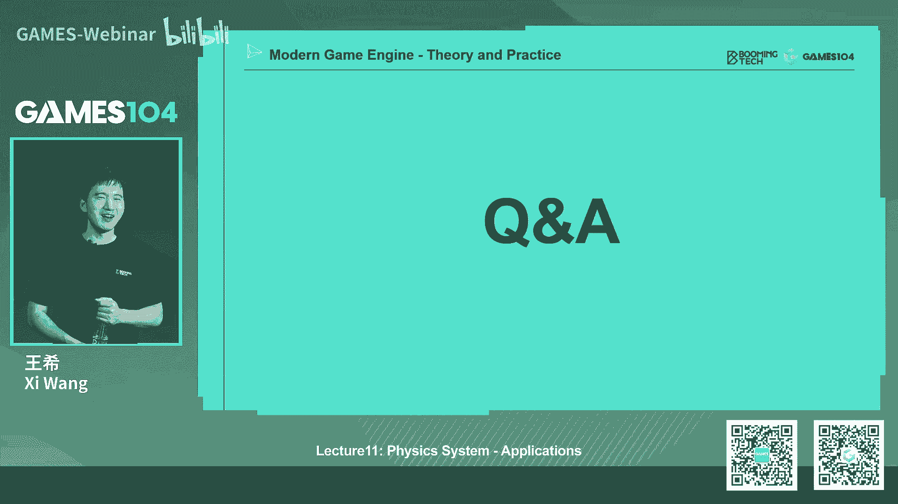

# 11.物理系统：高级应用 ｜ GAMES104-现代游戏引擎：从入门到实践 - P1：GAMES104_Lecture11 - GAMES-Webinar - BV1Ya411j7ds

Hello，大家好，我是广西，欢迎大家回到games104，现代游戏引擎的理论与实践，又到了一周一次和大家见面的时候了，我们这一节课讲完之后，后面又可以休息一周，想到这一点的话。

整个课课程组就特别的开心，因为我每一周准备课程的时候，大家都非常的那个压力很大，那么我们压力很大，我怀疑我们同学们现在压力也很大，因为现在是不是考试季啊，我看到好多小伙伴在那个那个在弹幕里面说。

这个考试考的怎么样，还有我们好多同学现在毕业，我觉得大家应该都是在为了自己的未来在努力，所以一起加油吧，然后呢在开始我们今天的课程之前的话呢，我先那个回答一下来自于我们社区的一些问题，那其实挺好玩的。

真的每次我们的课程视频上上B站之后，那个后面的那个回复，就会有很多很有意思的东西，比如说有同学在问我们说，在哪可以问到我们游戏的那个，关于回答各种各样的问题啊，那么其实的话呢就是说在GITHUB上的话。

还是要有discussion panel，那大家可以在里面的话，自由的去交流各种各样对小引擎的看法，或者我们关于引擎的问题，然后呢我们也拉了各种各样的微信群，然后呢我们有好几个微信群了。

大家可以加到我们的微信群里面，这个微信群的话呢，在我们的课程官网上大家也能找到，因为在这些群里面呀，在这个就是群里面，我们的那个课程组的小伙伴都在里面，就是大家有什么问题的话，艾特他们。

他们会尽可能就最快的速度，会转给我们这个课程组，还有各位技术的小伙伴，然后给大家尽可能尽快的回答，那么还有同学就问我们说，诶这个小引擎什么时候集成这个物理引擎，这个问题问的非常的到到到到位啊。

因为其实我们这一趴是讲物理嘛，结果我们的小引擎没有物理引擎，所以呢我们在这个明天的更新中，我们会把物理引擎集成进去，这是一个我认为这还是很重大，很开心的一件事情，然后呢还有同学问我们说。

希望我们提供更多的参考资料，比如说我们看的论文哪，看的这些这个代码这些讲座啊，这个问题提的我觉得这个需求提的特别的好，我们自己也在检讨，说我们只顾去准备课程啊，其实我自己有一个文件夹。

里面快有100多篇论文了吧，就是因为在准备课课程的时候，我们的小伙伴就去找各种各样的资料，然后我还有自己要去看这些资料，那么所以呢在今天的课程中，我们专门在课件中留了大概4~5页，就把我们这一节课件的。

所有的参考资料都放上去了，所以等同小伙伴们下载这个这节课程的，PDF的时候，就可以找到所有的论文和资料啊，非常谢谢小伙伴们给我的反馈啊，因为真的大家不提的话，我们完全意识不到这个需求。

那么还有小伙伴问我们说，诶我每次听你们讲课程，然后的话呢就是说只是讲到一个一个的知识点，但是我不知道这一个个知识点是用什么道理，把它串起来的，我我需要把它编理解成一个故事，一个有逻辑的故事。

才能方便我能理解这些知识点，其实这个问题问的其实蛮难的，因为我们在准备课程的时候呢，是花了很多时间去想我们讲什么，那个不讲什么，包括我们讲的顺序，先讲什么，后讲什么，最简单的去解释一下。

就是说呃在整个课程准备过程中的话呢，我们一直在模拟一件事情，就是说假设我来需要写一个哎，能够做得出来游戏的这样一个游戏引擎啊，因为游戏引擎的知识点特别多，但是我们只挑说我做出一个基本的这样的一个。

A功能齐全的游戏，我需要知道哪些知识，然后呢我们就按照这个flow，把整个知识点串到一起去了，然后呢这里面的话每个知识点的话，因为我们在课程中的话也在不断的调整，就是说尽量的避免讲到非常低调的一些算法。

因为非常低调的算法，它讲解来是特别的细，一个个公式的推导，所以其实我们花了很多的时间，干一件什么事情呢，就是说把每一个知识点，我们提取它最难懂或者最核心的那一个点，我把那个点点通，因为我们的假设就是说。

如果你真的要去实现这个东西的时候，你一定要去看他的原文，看看原文的时候，你会发现一上来很容易很容易看不明白，就像我上次讲课，说有同学看小引擎的时候看我们耀对吧，我就说你知道他的要点之后，你多看几遍。

可能有一下子你突然就明白了，那这个东西你就get到了，所以呢课程上我们讲什么呢，我们就讲那个像衣服的领子一样，我就把那个领子那个地方把它拎出来，像今天我们要讲一个比较复杂的技术。

像PPT其实它非常的复杂，而且数学上也很抽象，我其实我们是花了很久，我们写了大概有三四十页的PPT，然后最后凝凝练起来就这十页左右，但是实验的话呢，我们自己认为是把它最核心的思想给讲出来了。

那么还有最后一个的话，就同学们问我们说诶，有同学问我这个很专业的问题，他就说哎我用了一个模拟擎，然后这个引擎在比如说移动端啊，PC上console上跑出来的结果都是不一样的，那么他想很想知道。

说真实的这个游戏引擎里面的物理引擎，它到底在设备上怎么运行的，其实这个问题问的就很很有意思了，因为我们上一节课里面讲了一个概念，叫deterministic，实际上这个deterministic。

就是同学的这个问题的一个答案，就是说其实就算是现在商业级的游戏引擎，它都没有办法保证在不同的硬件平台上，它跑出的结果是一样的，比如说因为你的iteration就迭代的不长。

你的这个浮点数的精精度它都会有很大的差别，所以的话呢就是同一个引擎写出来的产品，在移动端就是我们的那个IPAD，那个IPHONE上面，比如说在我们的PC上面，在我们的那个XBOX上面跑出来的。

演算出来的结果应该是不一样的，这个地方的话就是说我们需要做大量的处理，才能保证这个逻辑的一致性，所以呢这些就是对我们社区同学们的问题，的一个简要的回答，好那么在开讲课之前，第二件事情。

也是这个也是给大家告诉一个好消息，就是明天5月31号，我们的最新的版本0。06版本也要上线了，那这个版本第一个呢就是刚才我已经剧透了，我认为是一个big move，就是说我们的joy我们接入了物理引擎。

我们进入了一个比较简单轻量的物理引擎，叫joy，这个引擎虽然是很简单很清淡，我们挑了半天，我们觉得他足够的干净，足够的好理解，那么大家千万不要小看这个引擎啊，你们知道有一款大作就是这个啊。

horizon就地平线，他用的就是这个物理引擎，所以你看看我们虽然写的是个小引擎，但我们跟3A大作用的是同一个物理引擎，大家是不是觉得很有牌面对吧，那么接下来的话呢这个是我个人的心愿，就是一我。

我我上次看过我们小引擎的第一版的时候，我我就我自己苦恼了半天，我说哎呀，我们的这个rendering那一层做的太抽象了，然后就是绕来绕去绕来绕去，然后我们的课程组的小伙伴。

这将近有花了两到三个星期的时间，认认真真的把我们的小引擎的rendering那一层，把它给清理的尽可能的干净了，那么那个后面的话呢，其实最新的代码我也没看到，但是的话呢就是等这个明天上线之后。

我跟大家一起来看，然后我们看这个小引擎的这个新的代码，是不是更简单更好懂了，那么同时的话呢我们还修了一些bug，也非常感谢，就是我们社区的小伙伴，还有我们课程组的小伙伴一起做了满足的工作。

其实在最近的这一个多月的话，其实我们课程组是花了蛮多时间去进行这种，就是我们的代码的优化的，因为我们现在因为一边在准备课程，其实没有时间去拍那个就是啊小引擎的讲解啊，或者准备这些更多的资料。

所以我们就会对自己提个要求，就是尽可能的让小引擎就是让大家好懂，那这里面的话呢跟大家说一点，就是说我们大概把小引擎做到一个，功能基本齐全，然后的话呢代码足够清晰的时候，我们对它的更新会暂时告一。

就是暂时缓一缓，因为我们不想把这个系统做的过于复杂，因为好多同学都是第一次接触，这么复杂的这个系统，所以如果我们功能堆得太多，搞得过于复杂的话，又会像我们一开始犯的错误样。

就让同学们学习和进入起来就很难，所以也非常感谢就是大家给我们的反馈，因为没有大家的反馈的话，我们有的时候自己做错了都不知道，然后现在我们的课程开了将近两三个月了，大家给了我们很多反馈之后。

我们慢慢慢慢的就课程也好呀，还有小引擎也好，市区也好，我们有点感觉了，知道怎么跟大家去互动啊，好，那最后就是正式的宣布，他在我们的这个小引擎的命名，这个活动终于告一段落了，那其实经过大家审慎的投票。

那目前看到我们这个得票第一的名字是PICO，对吧，这个单词其实我也不知道，你看我我在美国呆了那么多年，居然这个单词我也不知道，后来那个课程组告诉我说哦，这个叫短笛的意思，就代表我们的引擎短小精悍。

然后我觉得这个名字挺可爱的，比如说PICO，Pico low low low low low，我可以搭很多漏，而且更好的一点是，他可以重用我们以前设计的那个P的，那个那个icon。

我不知道那个P的icon会不会给别人撞啊，反正anyway就是既然是落子无悔了，社区的同学们已经选了这个名字，我管它是什么名字，我们就用了吧，那那就是说啊，如果大家没有反对的意见的话。

那我们就把我们的小引擎升级成PICO，但是可能有些东西在那个重命名啊，特别是代码重命名可能需要花一点时间，我不知道GITHUB上能不能remake啊，说不定不能ren anyway。

就是说啊至少我们有一个名字了，这是根news好，这些就是今天和大家，那个就是我们我们一些反馈，那我们接下来就开始我们今天正式的课程，就是物理引擎的第2part，今天呢讲的是物理引擎的应用。

其实呢也是很多很高级的一些应用，就是物理引擎到底怎么样子，在游戏的这个场景里面实战起来，那么上一节课呢，我们讲了物理引擎的很基础的一些概念对吧，告诉大家了什么，就是说哎read the body。

动力学是什么，怎么怎么做的，我们知道CLICHINTECTION怎么算呢对吧，其实到这个地方是有点高能的，我知道那像SHRESOLUTION的话呢，实际上我只是点了一下，根本没有展开那个算法。

那个算法其实非常的dirty，有很多的细节在里面，那么像SQUIRY啊，像其他的一些物理的东西的话呢，我们都点到了，那其实最核心的就是大家知道，就是说那个牛顿力学simulation的基础算法。

几个欧拉的显那个显影视积分对吧，欧拉的这个这个这个就是说显示积分，欧拉的半隐式积分，这些东西都是非常重要的一些概念，包括那个刚体动力学的旋转对吧，我们还记得例句对吧，我们知道它的转动惯量。

知道他的这个角角动量，那个动量这些概念，这些概念其实非常的重要，那么我们有了这些基础的概念，我们有了这些基础的server之后，实际上接下来的话呢我们就看怎么去应用它，所以今天的话呢给大家讲一些。

我们的应用的场景，那首先第一趴呢就是这个character controller，就在这个物理世界里面，我们的角色到底是怎么动的，大家会觉得很简单，角色不是就是我自己动一动就可以了嘛对吧。

然后但是问题是你是在一个物理的世界里面，你的运动和这个世界到底什么关系呢，那首先大家想到动的话，我们首先想到的是什么呢，哎dynamic object，动态物体，对不对。

我这个我我在physical engine里面有动态的东西，那我就放个动态的东西嘛，但事实上的话呢，character control它不是这个概念。

就是说如果我放了一个dynamic object的话呢，它实际上是有它的质量，它有它的摩擦力，虽然他非常的真实，但是呢它和人的控制的直觉，是有很大的不一样的，就是你站在地上。

你不会意识到说我在地面上是有是有摩擦力的，你会觉得我我想站哪，我就站在那儿对吧，所以在我的认知世界里面，我们认为我们和地面的摩擦力几乎是无限的，而且呢我们也不认为我们自己是个弹性体对吧。

我们认为我永远是紧贴着地面，而且呢我们的加速转向，甚至我希望有teleport，teleport的意思是什么呢，我是一个魔法，打个响，指从A点到B点。

所以其实呢character control它是一个反物理系统，而不是一个真实的物理系统，所以还记得上一节课我们讲的就是说actor，有一种叫做叫做topic actor，对不对。

那condemic action的话呢，实际上character control，就是他一个很典型的一个应用，在这里面它是反物理的，你看到这里面那个小绿人站在这，无论什么东西撞它，它都会把它弹开。

这就是我们的character control好，那么为什么会有这个东西呢，其实最早啊，其实早期的游戏没有真正的物理引擎，那我们作为game developer，我发现一件事情。

就是说我们如何去让这个游戏里面角色的行为，符合我的认知的时候，其实我写了大量的hack的代码，比如说多少度坡你能爬的上去啊，我当我开始起跑的时候，我的加速度应该什么样子，我停下来应该是一种感觉啊。

我撞到墙之后，这个人应该是什么反应啊，这些大家会觉得诶这不是很简单吗，就比如在真实世界里面，我们和世界的交互就是这样的，但是呢在游戏世界里，你会发现这些东西，每一个细节你都会去需要单独处理。

在这里面呢我就不展开，待会儿我给大家讲CTRL的时候，你会发现讲完一个最简单的control的概念，但是你会发现有很多种特殊的情况需要处理，这些情况你不处理的话，当你做成一个游戏的时候。

你玩起来就会觉得很奇怪，所以这节课这一趴的话呢，讲的是一个非常时尚的，只要你作为一个游戏，只要游戏里没有主角的话，你基本上就需要知道这些概念，那么好，首先我们讲这个control怎么去构建。

实际上也比较简单对吧，我们就用一个刚才讲的CONNEC的一个actor，我构建了一个一个一个东西，把我自己包起来，那一般做什么形状呢，我们知道可以用一个box，我们也可以用一个图包对吧。

但实际上呢至少在我看到很多产品里面，大家用的比较多的是什么，是个胶囊诶，这个胶囊就很有意思了，你仔细看那个胶囊啊，它有两层，一层是外面一点的，稍微肥那么一点，一层呢是小一点的，小一点点的干什么事情呢。

就是我真的跟别人去撞了，就是我撞到，那而那个外面那一圈是什么呢，你可以认为它是一层保护膜，它防止你去离别人的东西太近，当你高速移动的时候对吧，如果我那个胶囊一不小心就卡进去了，我就卡住了，这是一个用处。

其实还有一个用处是什么呢，就是如果你想想看我们的游戏，就是大家如果学过图形学的话，知道我们的相机有个什么东西叫做镜平面对吧，那么当我做第一人称射击的时候，如果我的角色撞了离那个平面太近的时候。

是不是会出现你看到墙背后的东西的，这样的一个bug，我不知道大家有没有玩早期的一些游戏啊，你经常会发现就当你的脸贴墙足够近的时候，你看到墙背后的东西了，实际上这一层保护呢，它也是防止就是角色离墙太近。

这样的话很多时候相机也会产生的bug，但相机其实更复杂了，有时候我们相机会做一些叫相机碰撞，那么我有了这个东西之后，这个角色可以在环境里移动了，对不对，但实际上它一个比较复杂的东西是什么呢。

就是我在运动中，我当前的位置是X对吧，我变成X加一的时候，哎我实际上可能被一个东西撞着，撞住之后呢，我们天然的想法是阻挡就停在那儿，对不对，但实际上人人的perception。

或者我们人的天然认知是什么，你应该沿着墙去划一下，这个时候你要去写一个叫sliding的一个算法，在这里面你看这个角色他已经走到墙上的人，你会发现他虽然脚往前迈，但整个人横移。

如果你们现在玩几乎所有的这个游戏的话，无论是3A还是一般的游戏，基本上都会做这个系统，所以说大家如果实现自己的character controller的话，诶这是你必须要写的一个东西。

我记得我在第一趴讲课那个小引擎的时候，我就想哎我们一开始没有做物理，所以我们的人到了墙上的时候，它还不能sliding，其实就是这个功能我们还没有实现，那么第二个的话呢，就是说其实在真实的环境中。

我没有办法保证整个游戏环境，它都是那个连续的，我们会最经常遇到的东西是什么呢，是台阶，那么我们就要让这个角色他不会，比如说有一个几厘米高的一个障碍物，我一个半2米高的人走不过去，这是很不科学的，对不对。

所以呢stepping，其实也是一个非常重要的一个角色系统，那这个东西怎么做的呢，其实就是当我每一次每一帧，我要移动这个角色的时候，我就会尝试把这个controller诶，往高台那么一点点往前走。

那这里面就会产生一些很有意思的bug了，我不知道大家以前在游戏游戏里没有遇到，就是如果设计师没有设计好，他那个屋顶设计的稍微矮那么一点点的话，我们就会把角色卡进去，我记得我以前在做这个halo的时候。

我刚去的时候，我的设计师就会告诉我们的设计师，就会告诉我说，我们在做所有的门的时候，都比正常人要通过的门要大大一点，大大概大概30%到40左右吧，他就为了防止这个这个角色被卡在，那个门的入口的地方了。

所以其实这个地方的话就是刚才我刚才讲的，这里面有很多的这个HARDCODE，但这个东西非常的重要，因为你其实当我们在做一个游戏的时候，我们是希望用户的体验非常的自然和流畅。

所以out stepping的话呢，也是一个非常重要的一个系统，一个一个也不叫系统，就是非常重要的一个feature，你必须在你的control里面去实现，还有一个是什么呢，就是说哎我们看到一个斜坡。

我们下意识的反应是什么，我要冲上去，所以呢当你去设计这个control的时候，一般我们都会设设定一个叫做你的MAXIPHONE的，这个这个slope的角度，就是当你的角，当这个slope。

就是这个这个坡度大于某个角的时候，他就开始滑了，哎注意啊，他不是上不去，它是你可以跳上去冲上去，它还给它滑下来，所以这里面其实是蛮有点就是很有意思，就是说他又有那么一点点物理的感觉，它又不完全物理。

如果我们在动画系统做的更加的精细的话，大家还记得上次我们在讲动画系统讲课，说动画系统有个叫ASM对吧，就animation machine，那么大家仔细想想，一个人如果冲上土坡的时候。

他的那个脚的动作其实做的精细的话，不应该是用走路的动作，对不对，他有一种尝试往上去攀岩，然后呢当它往下滑步的时候，他要尝试去那个就踹两下，保证自己不要这个这个这个摔下来，所以其实啊，大家如果想表现一个。

非常活灵活现的一个人类角色的话，你会发现无论是这个物理系统还是动画系统，有很多的细节在做，所以呢这个slope也是一个非常重要的设置，如果电动用不设置，会发生什么情况呢，你会发现这个人会飞檐走壁了。

在游戏世界里面，它就可以沿着那个沿着一个你看起来80度，90度的悬崖，他就一路就蹭上去了，我相信这个东西的话呢，在其实在就算是3A游戏里面，也是个非常常见的一个bug。

我知道很多的B站上的视频都是给你展示说，如何利用这个物理的bug，沿着墙一路就跑到地图边界之外对吧，或者爬到一个极高的地方，那个地方本来我们都不应该爬得上去的，实际上这也说明就是说。

其实你想做好一个好的control的话，事实上还是蛮复杂的，所以当我们去写我们的这个小的游戏的时候，我们的引擎一定要提供，这个就是slope limit的设置的功能好。

那其实呢这里面还有一个很重要的细节，就是说这不叫细节，其实我认为也是很重要的，一个一个一个在我们实现character controller，要注意的东西，这个地方其实我自己当年都写出很多的bug。

就是说当角色他有很多姿态，比如说大家如果玩一个射击游戏，我们的角色有多少姿态，比如说站着射击，对不对，还有什么呢，还有我半蹲着设计对吧，还有什么，还有最猥琐的，比如说我要当一个这个这个狙击手的话对吧。

我们叫做老鹰对吧，我们就趴在地上，我们就那个时候你的controller，它其实形状是要发生变化的，否则的话它会就会出现叫做诶，你明明觉得我能通过，但是你就是过不去的情况。

那这个时候呢有一个很重要的实施方式，就是比如说一个人在通过管道的时候，他蹲在那儿对吧，他这时候突然发出来一个站起来的指令，那个时候你千万不能一上来就把他的control更新了，因为你一旦更新之后。

物理他很多运算实际上它是瞬间的嘛，那你在做下一步迭代的时候，他会认为你的controller就已经卡在这个管子的，比如像刚才那个tunnel，那个隧道的不上不下的地方，你就动不了，你就说你收也收不回来。

你往前往后，他的认为物理计算机都认为你被卡死了，其实在很多的游戏中，我们会出现角色做一些动作被卡死的情况，其实就是在这些时序上出了问题，所以character controller。

他讲的所有的东西都非常的简单，但是的话呢如果你不仔细的去做它，当你面对一个非常复杂的这个，游戏的environment的时候，你就会产生无数的bug，这也就是为什么游戏QA压力很大，也是个原因。

就是因为它实际上基础原理讲起来都非常简单，但是的话呢在游戏的世界里面，各种各样的情况非常的多，那接下来再讲一个这个大家啊，这个还比较简单，就是说其实character controller呢。

它实际上和环境还是有互动的，比如说我们碰到那种各种dynamic的物体的话，我们实际上是把它推开，那怎么推开呢，其实很简单，就是character controln呢，一般来讲如果你用的是物理引擎。

它会告诉你一些回调函数，说哎不好意思，我抓了某某某，这个时候呢你可以根据自己的速度，根据自己的这个字，你觉得我的重量输出去一个冲量，这个冲量的话呢，apply到这个物体上去，那其他的物体就能被推动。

这个其实是我跟环境的互动，但这里面环境互动一个，我认为比较容易出问题的地方是什么，就是如果你的controller是站在一个动的东西上，因为刚才我们所有的demo它的环境都是静态的，对不对。

但如果环境本身是动的呢，比如说一个platform，大家想想看，我们在一个物理的解散环境里面，我放个control下面的平台，在动的时候，我们好像没有什么约束约束，他不会维持自己的状态。

所以说如果你不去做特殊处理的话，那个角色他就会当那个台子冻掉之后，诶这个角色就掉下来了，其实我以前在做很多游戏，比如说我们做一个巨大的飞船对吧，那个飞船的话他要往前飞或者往上下飞，其实上下也是一样的。

就是上下的时候呢，你会觉得诶动的时候，上面的这个角色因为物理的约束它会比较顶，对不对，但是你会发现它这个物理的结算，它是有一个就一帧左右的这样的一个波动的，你会发现那个角色就会一直这样，当当当当当。

就是说台子深一点啊，他被顶上来，台子上来他就被顶上来，它之间总是有一帧的这种误差，所以实际上像这种情况下，我们要用recast，就是我们要检测说你到底是站在哪一个平台，那个平台如果是动的话。

大概率也是个物体好，你说我现在就站在这个物体上了，那这个时候呢，我们一般就会把它两个逻辑上绑在一起，所以除非你有更多的就你有新的移动的输出，那我就会是head cut code。

保证这个control和这个被就是你step on的这个物体的，相对关系不会发生变化，所以这个地方是个完全的hack，但是的话呢这件事情对物理引擎其实蛮重要的，当然有同学会讲说这个好耶，听上去很粗暴啊。

比如说我的一个台子突然加速对吧，我这个人好像站立不稳，会摔倒，甚至会掉下来，这种情况也是合理的，你说的没错，这种情况确实是合理的，但是呢如果我们要做到这种精细度的话呢，我们需要专门的去写，专门的去处理。

所以其实我觉得对control这个东西的总结是什么呢，就是它没有什么特别难的技术，但是呢它有无数的小细节，而且呢每个小细节你都是通过各种各样，你自己认为这个角色该怎么运动的一个处理。

所以我认为它是cut code，但是呢你会发现他又和用户的这种感受，是直接相关的，所以一个游戏，比如说我们经常讲的它的操作感对吧，它的移动感其实就已经被定制在这儿，比如说你去玩一个魂系列游戏对吧。

那你们角色的移动，和你玩一个像那个荒野大镖客，那种很写实的游戏，那个角色的移动和环境的感觉对吧，和你玩一个像SUPERMARIA或者sonic，这种非常快速的游戏，那种角色的感觉是完全不一样的。

而这种difference的话呢，其实有很大一部分是来自于我们在control上的，实现了不同，所以当我们做个引擎的时候呢，我们需要把这些接口都开放给我们的开发者。

让他们来去TK他自己想要的这个角色的style，所以这是control，这也是我们真正用起来，物理世界的这个第一趴好，那么第2part是什么，也是大家经常会遇到的东西，就是RAGDO。

翻译成中文叫什么叫布娃娃系统对吧，我一直觉得这个名字翻译的特别的萌，就是让我觉得啊，我我总是我脑子中，总是想象一个这个五颜六色的，彩色的一个布娃娃，然后就在这个游戏室里搬来搬去对吧。

但anyway这个没关系，这个反正我们知道RAGDOLL是什么就可以了，这只是我刚刚学这个概念的时候，我脑子里出现了一个很奇怪的幻想，那这个RT系统啊，其实对物理引擎对这个游戏世界非常的重要，为什么呢。

因为其实我们很多动画都是假设环境是预定的，但真实的在游戏的environment里面的话呢，它的环境是很复杂的，那这时候你会发现说，如果我只是播放动画的话，这个角色他的行为。

它实际上跟环境是没有一个互动关系，就像这个face里面，就是说假设我们做了一个就是啊2assassinate，就是说刺杀的这样的一个动画组，一般来讲这种动画呢是是双人动画，就是说两个人在同时播一个动画。

当我的攻击者的动画播完没关系，他站在那儿对吧，但是我被攻击者，他被assassin玩，就是被刺杀完之后呢，他应该会失去意识，这个时候他如果只是播放他的，这个就是被机动画的最后一帧的话。

当你在一个悬崖边或者在一个斜坡上的话，他整个人就僵在那儿，就会如果这个斜坡啊，这个情况会更糟糕，你会发现他整个人斜插在那个那个坡上，感觉非常的违和，而这个时候你就需要RAGDOLL系统接管。

让这个人像真的一个失去意识的肢体一样，自己就摔下去了，那这样看上去很真实，讲解一下我们的最右边的这个动图，大家看到的东西，那么瑞克多怎么做呢，其实大家学完了动画那一趴。

rock door其实也并不是特别难理解，就是说哦那我明白了，我不是有很多的join吗，join之间那个有很多的骨骼对吧，那好我呢就是把这些关键性的joint。

用一个大的这个ragile body把它连起来，注意啊，这里面比如说我一个角色身上的骨骼，可能有三四十个，甚至是七八十个，但是呢我们因为RAGDOLL的做的时候呢，我要让它的计算不要过度复杂。

所以rog do一般不会太多，最多也就十几个吧，也就这么多了，所以呢它基本上是一个比较模糊的，这样的一个表达关系，就这里面的话蓝色的区域就是大家看到的，就是说一个个的RT body是最右边的话。

那一个蓝色区域，那个红色的点就是我们选中挂RAGDOLL，就是其实我们一般用两个joint之间连了一个，就是reheal body，看这些register body通过那些join连在一起的话。

诶就是我们的这个那个RAGDOLL的整个的核心，计算的这个物理对象，那么在这里面的话呢，其实哎我们复习一下，在上一节课应该是上上节课讲动画技术的时候，我们就讲到就是说joint每个joint啊。

它实际上是有一个constrained，那为什么有constrained，这符合人体的解剖学原理对吧，比如说像我们的手，我们是只能这样运动，这是HG对吧，但是呢实际上我们好像还可以这样移动对吧。

这个这个移动好像是用这块的技术，还是谷歌，Anyway，就是说其实我们每一个joint它的类型，它的自由度实际上并不是完全的六自由度，实际上很多时候连三自由度都达不到，它是严格的被约束住的。

那这件事情呢对于rua do来讲解非常的重要，因为动画师啊，他去首K的时候，他脑子中是有一个人体的动力学意识的，他不会乱做的对吧，但是你当你把这东西交给我们的，物理引擎的时候，物理琴说我才不知道呢。

你如果告诉我说这只是一群被关节连，就被一些胶链连接在一起的这些沙袋的话，那我可以给你冻出各种很妖娆的姿势出来，那这里面就有一个example，你们可以看到就是说，当我们用一个点拎着一个角色的时候。

左边的这个他是设置了正确的，符合人体解剖学的join，你看到他的他这个动作看上去还是比较自然，Huali，对不对，右边那个就是OK你们都是链接连在一起了，你看这个动作看上去就比较妖娆了，对不对。

如果大家如果回想一下，很早期的一些低成本的游戏的时候，你们会经常看到这种很有趣的这个人体的行为，不过说实话我个人还是蛮喜欢这个设计的，因为这让我想起了一个我很喜欢玩的游戏，大家能回想起来吗。

人类一败涂地对吧，他那个joy就是很灵活的把joy设置了一遍，结果让我得到了一种前所未有的一种喜感，但anyway，但是我们今天讲的是正经的啊，我们讲的是正经的3A游戏的这个jolt怎么做。

所以呢咱们就得学一些正经的这个joint，怎么去加他的约束，那么其实join的约束呢，大家也不要特别担心，实际上在现在的这个所有的DCC工具里面，以及设计设置rock豆的每个join的时候呢。

它实际上把全部的六个自由度全部开放给你了，但是呢你可以在里面通过约束的方式实现，就是你各种想要的说我，我限制他只能做这个轴向的旋转，或者只能做HG的这样的一个一个翻转，或者像一个那个。

就是比如说像那个那个那个什么B的那种方式，只能去旋转，其实实际上的话呢，就是他现在的很多设置都是全部开放给你，你自己来约束它，但这个东西的话呢，实际上就是在我们真实的这个游戏引擎里面。

特别是我们这些joint的约束，我们尽量不会让所有的美术同学去做，因为很多时候对他们来讲太抽象了，我们一般会交给谁呢，大家可能听说过这个工种叫做技术美术工种，这帮都是一个又懂比较懂技术。

同时呢在美术方面经验也比较比较，那个就是啊比较久的同学，它能够细条，根据我们对人体结构的理解，细条每一个rag dog join的约束，那这个时候其实调的好啊，调得不好，其实差别还是挺大的。

这里面就有个例子，其实无论是左边右边啊，这两个约束条的都还OK，但是呢当你细看的时候，你会发现如果调的不够准的话，这个人在地上就会有各种各样很奇怪的东西，就是要么这个胳膊就钻到地下去了。

要么就这个人的姿态看着非常的不能贴地吧，我们就不能贴地，所以说呢其实rag doll的话呢，一般来讲你设定好绑定好这些joint的约束，做好之后呢，在整个游戏生命周期里面，我们一般是不会动它的。

就是把它放在那儿了，好那这里面其实就讲一个很有意思的事情啊，就是说大家刚才看的就是RAGDOLL，实际上我们大概只有，比如说十根不到的这个这个register body对吧，去动我整个body。

当我身体上有几十根的这种骨骼，那我因为我的skinny animation，是基于我的skeleton去做的，对不对，所以其实这里面还有一部反向的映射，就是说我怎么把布克多的这个动作。

映射到我的skeleton上去，大家还记得我们在上一节课讲animation的时候，我们曾经讲了一个概念，我不知道大家还记不记得，叫做animation retargeting。

就是说我把两个骨架不同的动画互相映射，大家想想看，其实我从一个reactor算出来的结果，反向的去驱动一个skeleton的话，是不是一个animation retargeting的问题。

其实他用的思路就是这样一个思路，就比如说我们去看人体这个这个角色身上，完整的skeleton里面的骨骼的话，有些骨骼呢实际上是和RAGDOLL完全重合的，我们叫做active jolt对吧。

他就是参与了我的整个actor的那个那个，RAGDOLL的这个运算，还有一些是什么呢，就是是在我最后一根那个RKO的那个，那个骨骼之外往外延伸的，比如说我们用rock do做到这个手的胳膊这个地方。

那手掌之外的这些骨骼，像这些骨骼，你原来是什么pose，我就放在什么的，我就不动你了，反正就是你这个动了，我就跟着动对吧，我就这些这些这些东西叫什么呢，我们叫做leaf joints。

那就继续进行延伸就好了，但是呢比较麻烦的是什么呢，诶在两个就是在一个就是那个RAGDOLL，richard body里面的话呢，它中间还有很多跟过渡性骨骼，大家还记得我们在讲那个animation。

RETARGETING的时候，其实我们有很多方法对吧，就是说诶我可以根据你的动作，我把这个动画呢这个这个pose，这两个pose之间一路的差值过去，然后均匀地分散到各个谷歌上去，实际上在这个地方的话。

那么ary targeting，就是一个非常重要的这个应用场景，所以中间那些joint我们叫做intermedia joint，那么它的pose实际上是同前后两根REACD的。

那个pose之间的差值出来的，这个方法的话呢，就能够把整个skeleton由rad来驱动，所以这个就大家刚才看到所有的demo，他就是用这个体系做的，那么RAGDO呢在真实的引擎实现中啊。

有一个细节就是说，其实呢他不可能永远是rock door的，我们看到的角色大部分都是什么呢，都是动画驱动的，所以它从动画到rock dog之间是有一个过渡的，大家仔细看一下这个case里面。

其实他前面可能百分之就是之前那个动画，大概播到70%到80的时候，诶我们一般不会到最后一帧，我们说哦这个人已经这个失去这个角色，已经失去知觉了，哎我们开始慢慢慢慢的可能到最后一帧。

最后一帧前把整个动画全部切到RAGDOLL，所以刚才你发现就当这个骨骼变成红色的时候，就是我们开始把整个运算交给了物理运算，那么这里面其实就引入了一个，非常有意思的概念。

就是动画和物理仿真之间的边界在哪里，其实这也是现代游戏引擎啊，特别注重的一些一个实现的一个细节，这个细节的话直接影响了你的角色活灵活现。

所以这里面的话呢，今天我给大家就点一个概念，就是power record，就是说，实际上刚才像刚才那个刺杀那个例子里面，其实在RAGDOLL和animation，之间有一个很明显的分界线，对不对。

但实际上在我们的现代游戏中啊，很多时候我们是把动画和物理混合在一起用了，为什么呢，因为举荐里面的一个例子，就这个主角他抱着一个小女生，这个小女生晕倒了，那么这个小女生晕倒呢，如果我完全的交给物理去做。

大家想想看小女生晕倒，他是不是那个没有意思的对吧，当你移动的时候呢，这个小女生的手就开始各种甩，但是你会发现他甩的特别像，很很不真实，因为那时候是个小女生，只是昏倒了。

所以你看这个中间那个结果看上去就很奇怪，那么如果呢我用二，我要我让那个artist，去专门做一个小女生的这样的一个动画，那个动画里面的话呢，你会发现就是说他的pattern是非常repeat的。

就是说虽然你做的很有表现力，很符合那个就是半昏迷状态的一个女孩子，但是他整个过程中，实际上这个这个这个角色看上去就是看久了，就会觉得很重复，所以这个时候啊，实际上我们是会把物理的输出和动画的输出。

之间作为一个互相的一个blending，这个讲解起来就比较复杂了，其实我们可以认为就是我们要动画输出，作为他一个初始状态，把它作为一个数，因为动画不仅提供了一个pose，还提供了什么，提供它的速度。

它的转动惯量，我们把这些东西呢放到我的物理结算里面去，再结合它整个这个角色在空间上的这个位移，哎我再给它产生一个新的光亮和角动量对吧，这个时候我物理算出个结果，然后呢我在物理和动画之间再进行一个差值。

这样我一帧帧的动画播放，我在一帧帧的物理模拟，这样我能产生一个看上去又像一个人类的行为，但又符合又有点物理的失控的感觉，这个例子呢还有更好的一个例子是什么，我不知道大家以前有没有玩过那个新战。

就是33A大作版的那个就是主机版的性价，中间有一种东西，就是你把那个你用超能力把一个人给举起来，你领的那个那个就是，比如说帝国战士的那个脖子，那个帝国克隆战士的话，他就会开始就各种挣扎。

你可以把他这样拿到左边，拉到右边，你会发现这个角色他自身的也有自我的意识，但是当你去把它往左边去移动的时候，他的身体会不由自主地往另外一个方向去甩，而这个时候如果完全用动画去做的话，那动画是会累死。

那怎么办，诶，我这里面就是用这种power recordo，在动画和物理之间来回的去去去blending去过渡，所以这个其实也是我自己个人还蛮看好的，一个就是在引擎里面的一个实现。

因为随着我们对游戏品质要求越来越高，我们越来越不满足于就是说动画是预先设好的，这个循环的animation loop，我们更希望就是环境用户的输入，给角色的行为带来更多的随机性和多样性，所以的话呢。

rag doll是一个很重要的一个基础系统，但是在他之上的话，有很多很有意思的东西可以去衍生，那RAGDOLL的话呢，我们就讲到这儿，那接下来的话呢也是我们的物理系统，最重要的一个大客户啊。

这真这真真实实是我们物理系统的大客户，就是我们的医疗系统，因为其实怎么说呢，就是现代游戏这个对于人物的，其实我们今天讲的虽然是意料，但是大家如果想了解一下，比如人物的毛发对吧，然后跟这个东西很接近。

但毛发比它更复杂，毛发是一丝一丝的，我我在一开始讲课就毛发，我们我们在课程中不展开讲了，因为那玩意儿讲起来又是又是一堆东西，但意料的话呢跟他有一些异曲同工之妙，那么实际上我在我看认为啊就是一个角色。

你去看他怎么样真实，他其实整个角色你把它建模做得非常的细，做得非常的真实，但它是静态的，你怎么觉得他是活的呢，我觉得第一个是他的表情对吧，他的表情让你觉得很真实，第二个呢就是哎她的头发，当她回眸一笑。

他的左摇，他的头发微微动，那个一个小刘海的波动文化，你觉得哇这个角色很可爱对吧。

那这里面二次元的这个同学们应该很懂，我在讲什么，还有一个是什么呢，就是医疗，因为医疗太实在是太重要了，就是你这个小姐姐的衣服好不好看，实际上就是在看你在游戏中的这个角色的衣，衣服模拟的是不是足够灵动。

那么其实医疗呢从最早期的做法，其实想象的非常的简单，什么呢，哎我们就用动画去做对吧，你不就是这个走走，让他一些东西飘一飘嘛，我在里面买几根骨骼，还大家还记得我在讲动画，一开始就讲课，就是说其实很多游戏。

特别是早期的游戏啊，他给标准的角色上埋了很多骨骼，有些谷歌就是用来做衣料的飘动的，比如说以前大家会觉得诶，我的游戏里面有那种披风对吧，那披风怎么动的，1000就是放了三条骨骼，然后呢衣料往上一放。

诶这个衣料动画是做好了，当我跑走的时候，这个衣料比如比如说你往左边跑，往右边跑，诶这个骨骼相应的就变一变，然后你动画反正是差值的嘛，你看上去其实也挺像那么回事，这个方法呢实际上还是非常实用的。

它在什么地方特别有用的，就是比如说在移动端的游戏中，其实很多移动端的游戏，到现在它的布料系统并不是真实的物理模拟，原因很简单，谁都跑不动，真实的物理server很费，那。

诶我用这个简单的动画系统就可以做出，我们想要的医疗系统，其实也还是蛮好看的，那么第二种呢，刚才我们不是讲了ROG多吗，对不对，唉我把这个东西交给物理系统的这个结算。

那这样的话我做几根就是register body的，这样的一个RAGDOLL的骨骼，然后呢这样的话才能实现什么呢，就当我这个角色走来走去，甚至我风给他吹一个力的时候，诶这个衣料好像也能飘了起来。

就是这个叫什么呢，叫dynamic bone，动力学骨骼，实际上如果刚才讲的是那个那个那个，Kandemic bone，就是说ANIMANIMATED这个BB的话，那这个呢就是dynamic bone。

动力学谱的方法做医疗，实际上呢这个在早期的PC游戏中，也是非常常见的，因为那个时候我们已经有了基础的物理，计算机了，但是呢我们又舍不得上，那么expensive的布料模拟。

那我们用几根动力学给我放在这儿，那基本上也能实现整个衣服非常灵动的效果，但是呢今天的课程我们给大家讲的就是，稍微有意思一点，这也是现在游戏引擎发展的一个主流趋势。

就是说我们用mesh base的方法去进行COSIMULATION，这样在这里面的话，你看见所有几乎所有动物的东西啊，它都是布料啊，这些布料的话呢，它实际上都是用网格的方法。

就是一个顶点一个点的做物理学的解释动出来，那这里面大家看到颜色的不同的，但是我们会解释为什么每个颜色不同，那么其实这种mesh based cost simulation的话，第一步就是说。

我得把我要做的这个物体的这个mesh找到，那这个物体的mesh呢真实渲染用的mesh啊，一般都会非常的细腻，非常的detail，你如果真的把这个几千个点，上万个点交给这个simulation。

simulator去做simulation的话，大部分的物理引擎会当场死给你看，所以呢我们一般会对医疗，每个东西我们会做一个就是physical mass，就会相对来讲它的这个密度啊。

会比原来大概小一个四五倍，是很正常，甚至是十倍以上，比如说你本来这个布料是4000个面的，但是呢我在做模拟的时候，可能是四五百个面，基本上效果就可以了，因为其实他也是有点像那个呃。

就是vertex animation一样的，就是有些vertex其实可以通过那个，比如大家还记得我们前面讲过很多白，虽然这个那个把CENTRIC那个TEMPLATION吗，方法我就可以把一些洞。

把他的一些运动，可以插值到那些其他的顶点里面去，当我们有了这样的一个一个一个，一个physical mesh的时候呢，我们一般会做一个权重的刷，大家想想看，很少有意料，真的是飘在空中的风吹得满地跑了。

大部分的衣料是不是穿在人的身上面，对不对，那我这个衣服穿在这个角色上面，我们大家是不是不能接受，说比如一个披风对吧，走两步，这个披风布料一模拟它就飞了对吧，那衣服要废了，这肯定就有问题了，那怎么办呢。

我们就会在每一个这个physics smash上面的话，画出它可以移动的范围，那一般来讲越靠近身体，越靠近固定固定点的地方呢，我们会把他的那个就是约束权重给它降下去，就是让他就是位置不要动。

特别是比如说做披风的时候，沿着脖子的这一圈，我们会说你的flexibility，你或者是你的freedom就是零，你就在那别动了，但是越往下我会给你的空间就越大。

但这里面有一个general practice，就是说我们在靠近身体的地方的话呢，会允许它动一动，但是呢也会不让它的幅度太大，为什么呢，因为幅度太大之后，他就特别容易和这个角色穿模，其实衣料穿模。

我可以认为在目前的游戏引擎中，都很难解决的问题，但是现在越好的引擎啊，解决的越好，但这里面是有很多的挑战和问题在里面的。

那么其实呢接下来的话呢作为artist来讲，它就比较简单了，它就可以设置很多，比如说我的意料的硬度啊，我的音意料的这个切向的，这种这种韧劲是多少呀，我能不能那个ANTIBAND啊。

能不能阻碍这种这种这种折叠啊，这种能力对吧，那作为artist来讲，它就设置参数，但这件事情它就能够让我们生产出各种各样的，比如说丝绸质感的皮革质感的衣料，对吧，当然我们要结合我们的rendering。

那一趴讲的PB2，我让他才是看的更正常，讲到这一趴，大家是不是觉得都很简单，都比较好懂对吧，但事实上我们作为引擎的开发者的话，我们的世界不是这样的，我们看到的世界是什么呢，首先衣料怎么模拟。

这个时候我们会发现，就是说我们能用的工具居然是我们那个，这应该是初中物理的这个课程了吧，弹簧质点模型，我们只能把这个意料想象成无数的弹簧支点，就是我自己也有很深的感受。

就是经常我们的artist会跟我们狂喷，说你的衣料做的不好啦，又穿了，怎么做都不像了，但是我们真的在写这些底层算法的人，我们就知道哥哥，你不知道我们有多痛苦啊，因为你今天看到这么漂亮的这些衣料的话。

实际上是由无数个无数个质点和弹簧，模拟出来的，然后呢每一帧我都要做大量的结算，那先先讲它最简单的结算，就是一个弹簧上面的质点，它受到的力是怎么怎么来的，第一种力是什么呢，就是我们叫做行便利。

就是说你拉开离开他的那个recipes，就是说他的那个就是这个这个零张力的那个位，置的时候，只根据你的位移，你无论是正向的负向，它就会得到一个相反方向的这个弹性力对吧，这个用胡克定理讲。

就是你的位移乘上你的这个弹簧系数非常简单，另外一个还有什么呢，这个是大家很多时候会忽略掉的，就是说这个系统它是有一个叫dumpling的力，dumpling的力叫这个dumpling这个词是什么意思呢。

就是衰减，其实我们在做真正的物理系统的时候，dumpling是非常重要的，那在这里面的话，你首先能看到的一个衰减是什么，我这个质点在移动的时候，我会受到空气的阻力对吧，实际上在这个医疗里面。

这个空气阻力是非常重要的，为什么呢，因为我们虽然用的是弹簧质点模型，但是大家仔细想想，我们的衣服可是不是一个个的质点，它实际上每一个每一个质点和弹簧之间，表达的是一小块的面积啊。

所以那一小块面积所受到的空气阻力，其实并不低的对吧，而且dumpling为什么很重要呢，这个但这一边是荡开一笔了，就是说无论我们去做什么样的一个物理模，模拟系统，如果你不去设置一个dumpling啊。

它很可能因为有大量的数值迭代计算，包括公式上可能有些不准确的地方，包括浮点算运算的这个这样的一个一个误差，它的能量可能会爆炸，因为大家想象一下，我做过浮点运算，我一直做加法乘法除法。

然后呢每次都溢出那么一点点，当你迭代个几千次，几万次的时候，最后的结果是什么，实际上你是不知道，而dumpling呢，它会让你的迭代稳定性提高特别多，所以这是一个绝对的黑科技，大家一定要用好。

那我现在有了一个弹簧，一个支点，这个问题好解决，对吧好，那我接下来我要做个医疗，我怎么去构建我的弹簧质点模型呢，那实际上的话呢大家现在的做法是A，我去做很多的这种一把衣料，均匀地看成一个个的支点。

然后呢我在它的横向纵向加上很多弹簧，你这样加行不行，其实也还可以，但是呢你会发现，这个时候当你去ban的这个弹簧的时候，它几乎是没有什么这个阻阻挠力的，所以我们一般有的时候会加他的。

在cross里面会加个弹簧，实际上有的时候我们会专门加一些弹簧，横跨几个支点，就是比如说我要表，表现一种非常硬的这种布料的时候，我对他的单子的惩罚就会很大，那这个时候我会比如说横跨两三个支点。

加一根弹簧，就是不让你折来折去，如果这个弹簧系统构建的就是过于稀疏的话，你做出的布料给人的感觉是什么呢，就是特别的吸软软的，都不太真实了，但是你说这东西对不对呢，我个人觉得对于某些某些布料举个例子啊。

比如说像丝绸这种感觉还是挺挺有感觉的，所以其实我认为就是这个做医疗的，这个这个力学模型啊，很多时候它就是一个经验经验，一个hack，你自己构建一个模型，那么在这个里面的好像是行业用的比较多的。

那好我们完整的讲一下，说诶，这里面，当我把我的一个质点放到一个完整的布料里面，我们会受到哪些力呢，哎这个时候就比较复杂了，就是对于中间的那个红色的点来讲，我们会收到哪些礼，第一个大家很容易忘记的。

我们是生活在地球上的，地球上有什么有重力，对其实在做所有的衣料模拟的时候，你千万不要忘了重力，为什么呢，因为你如果没有重力的话，这个衣料飘起来之后，它就永远飞掉了，它不会落下来的对吧。

必须要重力把所有人就落下来，那么第二个是什么呢，就是风为什么风是单独的呢，因为大家想想看啊，当我穿着这个这个披风，我这个像风一样的男子这样跑起来对吧，飞起来从悬崖上跳下来，那实际上你包括其他风了吧。

那个时候这个风啊，它是一个consistent apply到你身上的一个力，这个风力其实非常的重要，所以呢这也是让我们大部分游戏，如果没有风力的话，那个斗篷都是耷拉下来的，虽然角色动的时候动两下。

但是你只要一停，它就耷拉下来，只有有风的时候，才让这个角色看上去就那么的有个性对吧，其实如果大家玩一些二次元游戏的时候，你就知道那个角色的披风，永远是和他的身体形成一个完美的一个家教。

让你觉得这个角色看上去，总是那么的膨胀和有立体感，也是这个道理，那么好，接下来呢就是我刚才提到的就是空气阻力对吧，这个空气阻力呢取决于你当前的速度，所以刚才这个就是一般来讲，我们用个最简单的公式。

就是它跟速度成一个线性比值，其实这个是这个东西，基本是啊，怎么说呢，其实如果严格的讲的话，它应该是速度的平方，但是我们这边不要去纠结这个细节了，在低速情况下，我就用线性简单的模拟一下。

而接下来就是说你周边所有的弹簧，从各个方向对你施展的力，注意弹簧给你施展，你是有两种的，一个是胡克定理决定的弹力，对不对，还有一个是什么，大家很容易忽忽略了，叫dumpling。

就是说弹簧它也不是一直能动的，就是如果你只有虎颗粒的话，大家想想看这个弹簧会怎么样，它会永远的做简谐振动对吧，如果你现在做过医疗模拟的话，你只要扰动它一个顶点一下，如果按照这个理论模型的话。

他会不会永远的来回答，哒哒哒哒哒，这样动，对不对，这是你想要的结果吗，不是大家想要的结果，所以我们一定要加个dumpling，就是弹簧，你虽然给了他一个初始的输出之后，它动了动了动了。

因为内部的摩擦力啊，就是把你的机械能变成热能之后，哎它就能停得下来，所以这是一个真正的当我们做医疗的时候，我们看到的这个物理世界的模型好，那我们怎么去积分它，我有了这个模型之后。

其实这里面的每一每式子的每一项，并不那么难算，那这里面的话呢，我们要给大家讲一个非常有意思的积分，叫word的积分，它它的积分的巧妙的地方是什么呢，就是如果这里面我们用到了，比如说你在空间上的位置对吧。

还取决于你的速度，那么位置和速度之间又是一个相互反向，积分的这个关系其实是有点小复杂的，但我们真正的医疗模拟的时候，我记得我们在上节课我们讲过，叫半隐式欧拉积分，我也跟大家分析过。

就是说半影视欧拉积分的话呢，它既具有很方便的计算，它与影视欧拉积分其实算起来更方便，而且呢他更加的收敛，但是的话呢后面的数学大牛就是VLAD，他提出了一个方法，就是说诶既然半影是很好的话。

那我可以把你的这个积分呢变成只跟速度有关，而且呢更加的稳顶，我这边重点给大家讲一下这个积分的思想啊，就是首先大家想想办饮食积分是什么概念，就是说我首先我的在德尔塔T时间之后。

我的速度是不是有我当前的速度，再加上一个我的加速度乘上一个时间对吧，那么我新的位移就是X的T加德尔塔T的时候，是不是你当前的位置加上V的，就是德尔塔T后的速度，就是未来的这个速度乘上了德尔塔T，对不对。

这里面的话呢，它就有一个很有趣的一个observation，是这样的，就是你的速度，比如说你当前的速度是什么，是由什么决定，实际上是你当前的位置，应该有你上一个德尔塔T时间的位置。

加上的你当前的速度乘上个德尔塔T，为什么呢，因为你当前的速度也是由你上一帧半音时，而来的，这个这个方法是很巧妙的，这个SERVATION，那这样的话呢，你当你把这个公式放到一起去整理的时候啊。

你就会发现，其实VT你可以用这个上一帧的位置，和德尔塔T的关系就能表达出来，所以他把这两个式子一整理，你就会发现啊，就是他最后得出的结论就是XT加德尔塔T呢，它是等于是个指东西，叫做两倍的XT。

就是当前的这个位置减下去上一帧的位置，然后再乘上你的AAHA值，有什么唯一动决定就是你的受的力决定，对不对，再乘上一个德尔塔T的平方，就是时间的平方，那么这个公式它为什么很巧妙的。

大家会觉得这不是数学上是等价的吗，你有什么好说的，但是大家仔细想想，当我们在做这个就是模拟的时候，我们每一帧每一个tick tick tick，我模拟的最准确的是什么，是你的位置。

其实你的速度是用我的位置反推过来的，而且呢我有当前帧的位置，其实我在cash一下上一帧的位置也不难对吧，那我下一帧的位置的话呢，他就把这个事情简化成了，叫做上一帧的位置和这一帧的位置，再加上我受到的力。

我用这个简单的方程，我就能算出来你的这个下一站的位置在哪里，我指那么这个积分，你在数学上看上去是等价的对吧，但实际上它是一个非常好的一个平衡，为什么呢，因为如果你老是用未。

就是那个就是用那个速度去算速度，在某一个瞬间的时候，可能会变得非常大或者是不稳定，一旦你某些速度不稳定之后，你这个积分本身就会变得这个integration，就会变得非常的不稳定，而VT的话呢。

它就非常巧妙的把这种不稳定的，因此给它去掉了，而且word积分实际上也是更快的，所以在我们的布料模拟之后的话呢，我们很多时候用VERTT积分，这个来取代半隐式欧拉积分，大大大家注意一个细节。

就是说实际上从思想上是和半隐式的欧拉积分，是等价的，那这一趴的数学呢实际上大家后面仔细看，其实并不是特别的难理解，而且我个人觉得是蛮巧妙的一个方法好，那么其实呢我在这一盘还不展开。

但是后面我给大家提一下，其实布料模拟啊，现在最主流的方法实际上是PPT，就是position based dynamics，就是基于位置的动力学模拟，它的好处是什么呢，就是它的简单的思想。

我在这边只提一句，就是说如果刚才我教我教给大家的方法，它是一个很标准的一个经典力学的方法，就是牛顿力学的方法，就是说根据约束，我可以算出它的力，根据力我算出它的速度，根据它的速我算出它的位移对吧。

这个是一个非常合理的一个因果关系，但是呢有一套另外一套的数学，就是我们以前讲的拉格朗日数学，他把所有的力学关系描述成了一堆数学的，叫约束，他认为所有的力学过程，必须要符合我的数学约束。

我是直接用constrain约束，直接解除你的位置，而我不再去关心你的速度，这个非常的巧妙，那么这种解法它的好处是什么呢，就是它能处理一些非常复杂的情况，同时呢它这个server本身是非常的稳定的。

就其实复不复杂呢，我觉得仁者见仁智者见智，但是他的server第一个是会比较快，第二个呢它能够在一些非常复杂的，非常的就是说精度敏感的情况，讲解的非常的稳定，像这里面这一条几万个面的龙。

我用一块布料从头上划过去，其实这个case大家如果真的学过物理模拟的话，就知道这个case非常的难，其实到现在这个这个视频我拿过来的话，我一直在跟课程组的小伙伴上在讨论。

说这个demo它到底是real time还是not real time，其实我们知道就算不是real time的话，这个demo也是非常复杂，很难写的好，所以的话呢pd呢我在后面会单独去讲。

但是大家知道就是说在现代的游戏引擎啊，引擎中，越来越多的布料模拟，使用的其实不是刚才那个简单的弹簧支顶，我他用的还是弹簧质点模型，但是呢不再是用简单的速度加速度方法去解，而是用PPT的思想去解好。

关于布料这一趴呢，我们算法server讲到这儿，但是布料里面一个特别特别恶心的东西，是什么呢，叫自穿插SOLICATION对吧，像这边的，像我们的那个左边的这个布料，大家看。

如果我们把SELFICATION关掉之后，它的布料之间就会互相穿插，然后那么薄的东西一穿插之后，你基本上没法看，就这里面的例子，就是它两面用了两个不同的颜色嘛，就算两边的颜色一样。

比如说里面的衣服和外面的衣服花纹不一样，当它动起来的时候，两个布料在在一起是会经常打架的，特别在取色身上哦，我们今天课程组还在商量，就大家都说这个布料的CLICHEN，这个其实挺讲解的，我说是。

而且现在是越来越重要，因为我们现在在表达一个角色的时候，他的衣服都要穿好几层，那每一层布料都在做自我的模拟，刚才大家看了已经觉得有点高能了，对不对，但是大家想想看，当我这么多层布料在一起模拟的时候。

怎么办对吧，那万一穿插了，比如说一个这个这个这个比如说一个小的，这个里面的T恤甲是蓝色的，外面罩了一件外套，比如说是白色的，好那个蓝色的外那个T恤老是穿透出来，出现在白色的外套上面，大家一看哇。

这个游戏很渣渣，很这个质量不行，其实这就是我们真实的在做游戏引擎，特别是做物理引擎的时候，我们所面临的一个巨大的一个挑战，那这里面的话呢我就给大家简单的去点一下，现在的一些常用的方法。

比如说最土的方法怎么样，我把布料的这个这个物理模拟模型把它加厚，就意思意思就是说你虽然是穿过去了，但是呢你只要穿的不够深，我还是不让你去透出来对吧，但这个就很土了，还有呢。

就是说我把布料的物理仿真的步伐变得更细，拆成很多subs step，这样的话当我就能够保证在我server去解的时候呢，我不会过深的穿透过你的这个布料，这个也是一个，就是我们认为。

用计算复杂度来换这个稳定性的问题，那么还有一种方法呢，就是我们叫做maximum velocity，就刚才我提到，就是说其实真正在布料模拟的时候，有的时候速度这一项它其实是不稳定的。

所以呢很多时候的穿插，就是说你就是大家如果真的解那个物理server，你会发现一个问题是，当一个东西它穿过去之后，他不除非你专门处理它，否则是弹不回来的，他就真的穿过去了。

因为他会认为那个状态又是一个物理的稳定态，大家仔细想想，就是说你把一个一个一个缸，一个缸体击穿到另一个缸体，是不是，击穿之后他如果能穿得了，它在里面停下来，其实也是个稳定的状态，对不对。

它也符合我们的物理学的约束，那这个时候呢他就设置了一个maximum speed，就保证在每个subs step上的话，你不会把它穿得过深，这样你还能弹回来，那么一个更精更精确的做法呢，他就加一个立场。

这个立场呢它一般会设置在布布布料的里面，就是说当你穿过去之后，那个立场它能检测出来那个立场全是负向立场，他就把你的东西往回往往回顶，就是我在讲图形学的时候。

讲过一个叫sdf sin distance field对吧，其实它就相当于在布料里面建了一层，这个负向的sign sdf的这个distance field，当我有一个模拟simulation。

有一块布料它穿到我的里面去之后，我这个SDF就起作用了，就会给你产生一个反向的impulse管理，在提听出来，反正anyway，这里面的话，其实真正的实施和骇客其实是非常非常多的。

那为什么这里面我给大家点一下呢，我只是想让大家知道，就是说其实classsimulation self collision detection的话呢，实际上是一个非常重要的一个model。

也是很重要的一个课题，其实不止布料自己之间了，还包括就是布料和缸体之间，因为我们在角色，比如特别是角色在动的时候啊，我们的物理的这个body，实际上是比真实的角色要要简单的对吧，它并不完全重合。

但是呢你的布料一旦跟这个这个，比如说你的大腿表达，用SELENDER去碰撞的时候，它会碰撞出一个不正确的一个结果，那么如果我的这个钢铁在某个角度的话呢，它占用的体积是比真实的，我的这个体积要小的话。

就会出现叫做我的物理系统，认为我已经把你顶出去了，但是呢诶你当我去渲染的时候，我那个地方的皮肤又露出来了，这个时候就很尴尬，就所以大家以前在看很多的早期游戏的时候，这种布料模拟的话。

很容易出过你单身的大部分早期游戏的时候，是不会用真实的物理去进行布料模拟，他很多时候就像我刚才讲了一个动画的方法，用这个其他的方法来实现，所以呢还好，所以这也是在未来，大家实现这种高品质游戏的时候。

其实是也是一个必须要解决的一个问题，其实实话实说，我到现在也没认为我知道一个很好的解，我这个还是一个非常前沿的，大家都在研究的一个领域，那么好，讲完这么难的数学的布料，接下来讲一个比较有意思的系统。

就是这个破坏系统的，破坏系统在我们的游戏引擎中是由来已久了，而且我觉得这也是属于大家特别喜闻乐见的一，个东西对吧，就是从超级马里奥时代，我觉得最大的乐趣就是把人家强撞的一塌糊涂，你就觉得哇。

我这个我感觉我是在创造这个世界的玩法，那么其实呢就是破坏系统呢，对于现代游戏引擎来讲是非常重要的，因为它实际上它不仅是一种视觉表现，更到现在已经越来越变成一种，可以跟play的东西了。

比如像我们大名鼎鼎的彩六对吧，那你在墙上打洞，在什么地方打洞，用什么枪打洞，这可就是你最核心的一个战术了，所以实际上我个人，就像上次我记得我在讲那个graphics的时候。

我讲过一个就是walker base的这个turn的表达，我就想为什么我会对那个东西个人很感兴趣，因为我一直在幻想，就是有一个游戏，我能够自由的去挖战壕，自由的去挖地道，自由的去拆掉别人墙。

构筑各种我想要的公式，那样的游戏是我觉得那是游戏的本身，所以我认为destruction的这个系统的话，实际上就是给用户了这样的一种自由，那么好，那么destruction怎么实现的呢。

其实他想起来也并不简单，就是并不复杂，就是说当我给你一个没有被破坏的物体的时候，其实啊你用一种hierarchy的方法，你可以把这个物体分成一节一节一节的碎片，那么这一节的碎片的话呢。

我们一般会用HT的方法把它组织起来，这样会让你的这个破坏，这个碎片看上去更有结构感，其实我们看见就是说当我打一个东西的时候，他不是你打在他不同的地方，它不会一下子全部碎掉了对吧。

你会感觉有些地方A打掉了一大片，有的地方就掉了一点点，那这个碎片的话呢，我是用自动生成的方法把它生生成出来，形成一个树状的结构，当我有了这样的一个树状结构之后呢，我接下来建立一个什么呢，它它的连接关系。

就是你可以理解成，就是碎片A和碎片B之间的话，它的连接到底有多牢固对吧，这个地方我就形成了很多的H，大家想想这里面的一个DEFGH，这些碎片的话，实际上它们就会有相应的连接线。

这也是一个游戏引擎里面一个标准的一个课件，告诉你说你怎么去做一个可以破坏的物体，那么每一个connection，实际上它都有一个就是它的权重叫value，这个value就表示它能够承受的多大的冲击。

或者多大的这个力，那这个这个数值呢其实表达的是什么呢，就是它的这个我们叫做印度，那么这个印度怎么起作用呢，很简单，当我来了一个东西撞我的时候，大家还记得我们在物理引擎里面讲的是什么，是一个冲量对吧。

Impulse，那么这个印度呢就会说，OK你冲量和我的impulse之间算出了一个值，就是你的冲量和我的硬度之间形成一个值，这个值就是你对我是真实形成的一个damage，当你这个damage。

这个值超过我一开始设定的那个阈值的话，那我这个东西就断了就对吧，他是这么一个简单段，但这里面其实有非常多的问题的，因为我个人虽然说，这也是游戏引擎里面经常的一个时间，但我一直在思考的一个问题。

就是说首先impulse是有量纲的对吧，但印度这个量纲的话呢，和我们真实在物理学上的量纲是不太一致的，大家知道物理学的印度是有什么十级对吧，大家记得金刚石石，对不对。

然后他讲的那个硬度指的是两个东西摁在一起，我多大了，尽力下去之后，它不炸掉和你这种在冲击力之下，他不会去炸掉这个硬度，我个人认为他在物理学上是有不一样的表达了，因为物理学上你真的一个东西能打断的话。

还有什么，除了印度还有什么，还有它的韧度，就是它的任力，包括就是说他之所以产生那个折断效应，实际上是在那个点上产生的应力，超过了我的阈值，但是呢当这个当这个artist。

我让他去标识这里面的23是100的时候，实际上artist是完全没有概念的，他就会觉得哦，那我标个300吧，标个100吧，好像就像那么回事，但实际上它的物理学意义鬼才知道，没人知道对吧。

然后呢我们还假模假样的搞了个这么个公式，就是说当我有一个球打中一个点的时候，哎我们会把它所有的这个damage，以一个一个同心圆的方法分散出去，这个这个公式看上去特别高大上，实际上非常的简单。

就是我装的这个点在一个相对小的范围里面，所有人受到的damage都是一样的，就是你的impulse都是一样的，然后呢当这个就是这个点的话呢，就是足够的，就是扩散的时候，他逐渐就从这个百分之百的这个冲击。

到0%的冲击，然后做个做个差值，但是特别honest，我觉得这全是hack，就是说我不认为，今天我们在做这个destruction系统的时候，这个问题有个很好的讲解，因为我今天跟我们课程组合在一起。

举个例子，比如说我们我很难跟artist讲，就说你拿一个步枪子弹，你去打一颗子弹，大家知道一个步枪子弹所射出去的这个冲，这个冲力啊是非常大的，可以达到几千焦耳的这样的一个能量对吧。

但是的话呢我们比如说啊我们一个人，他用很大的力气去撞一个墙，你所产生的冲量大概也就几十焦耳对吧，但是你如果我真的做一个东西的时候，我artist说诶这个这一面墙我用子弹一打，这个墙就掉掉了对吧。

但是呢我用人撞这个墙总是撞不开，其实有的时候你会觉得有一点奇怪，所以这个呢也是我认为就是说只是在引擎中，大家会这么做，但其实我相信在未来一个更加的物理追问的，这样一个游戏世界里面的话呢。

我相信他有一些更好的一个表达，那这里面的话呢就是说当我这样的一个物体，我已经把他的这个CHK，就是这种destruction的唱K分好了之后呢，我就会把它放在这个世界里面。

一般我们会做这个supporting graph，就是说他会这个东西会挂在某个地方，比如他一个窗子就挂在窗子frame里面对吧，他如果是在墙上的一个突出部，那就挂在墙上了。

这样的好处就是说当他产生了这种破坏的时候，它实际上只会对那个区域会产生一个破坏效果，而不会把整个这个就是东西给破坏掉，那么这个东西唱K到底怎么生成的，这个图好像有点问题，实际上那个我们这个图是要展示的。

就是你在那个角受了力之后，他就那一那一侧掉下来了，但我相信同学们学到这一趴的时候，应该都已经知道自己怎么会想，因为我们前面讲的东西比这个要复杂得多，这个地方是非常的直觉，那怎么样的自动生成唱歌呢。

因为你不能老是让人家美术去帮你，把这个东西分割好吧，但其实有的时候我们还真的让美术分割，因为美术分割有时候它会形成我们想要的结果，那这里面最常用的算法就是大名鼎鼎的vi算法，我相信上次我们上节课。

我们在讲那个语音的时候，讲noise生成的，好像就提到过大名鼎鼎的模拟算法。

它简单来讲就是你在空间上随机撒一些种子，然后呢，你把这个空间分割成一个到每一个种子的距离，都对等的这个边界，这个东西在生物学上是很有用的，其实你们小时候如果看过那个生物课。

你们那个细胞你看到那个细胞核对吧，特别是植物细胞，细胞和细胞壁形成的那个划分，就是一个标准的warning划分，哎我这个很有意思，我其实整个细胞的生长，它是非常符合这个数学规律的。

那么就是我现在给你一个形体的时候，比如说一个2D的mesh，实际上我就给他，我算他一个绑定，然后呢我就随机的产生一些种子点，然后呢形成的纹理划分之后诶，我就能形成这样的一个碎片。

大家看看这个碎片看上去是不是就很很自然，很真实，所以其实数学是非常简单的，那么如果你是个3D，实际上我也是用这个类似的算法，但是呢我RONI对空间形成划分之后呢，我还得用一个就是那个DERISE的算法。

把它就是空间进行三角化，这个DRUNNING算法化简化三角化呢稍微有点复杂，但其实也不难，大家如果想查就可以查得到它，简单来讲就是我可以把空间划分成无数个，就TJHEER，就是说这个就是四面体。

就四面体的话完成一个对空间的划分，因为你本身的形体是各种各样的，所以说你用这些台式，黑色角去划分的空间的时候，你会得到一些看上去非常有意思的这些碎片，就像这个雕像一样的对吧，你给他算出一个绑定，你。

然后呢用那个那个那个DCT的那个DERIA的算法，把它分成这个四边形的，就是四面体的空间，提速的时候，再配合上它本来的形状，就看上去就很很真实，很自然。

但是to be honest这个东西看上去还是比较粗糙，但这里面有一个非常有意思的一个细节，这也是我特别想让大家注意到的，就是当一个形体，比如说我们建一个模的时候，我给它形成一个贴图对吧。

那这个贴图看上去就很好看，但是当我把这个花瓶打碎的时候，你会发现最难的一件事情啊，实际上我要生成一个就是volin texture，就是说因为比如说一棵树啊，树可能不大，树不太容易打碎啊。

比如说一个大理石，你把它打碎的时候，你在断痕处看到的是很多大理石的花纹，对不对，那个花纹实际上是有一个分布的，那个切口处的纹理啊，其实生成是比较复杂的，而这种东西的话呢。

一般当我们做真的做3D破碎的时候，特别是这种大体量的3D破碎，比如说一个雕像的破碎对吧，比如说一个砖墙的破碎的时候，我们就会要处理这个断口处的纹理生成的问题，那这里面一般有两个流派了，一个流派。

就是说哎我干脆就是有一套procedure的方法，生成3D的涡轮texture，你这样用的时候就直接去我的VOLTEXTURE的事，但是大家知道3D的texture，无论从生成到采样都很复杂对吧。

还有一种方法的话呢，就是我离线把这些texture uv都给你算好，所以一旦你碎了之后，哎我就把你的渲染切过去，所以这个东西其实蛮复杂的，而且它在一瞬间啊，那个破坏的一瞬间。

它就要为每一个碎片生成一个它的rigid body，因为碎片之间最复杂的是什么，他们彼此之间还要碰撞，所以destruction啊，在很多游戏中是一个非常expensive的一个东西。

比如说在我们的很多游戏实践中啊，就这些DEBRICK就是我打出来的这些碎片，一般来讲不不要不要让他去参加物理逻呃，游戏逻辑的结算，其实在我们在座很多游戏的时候，很多人都说我特别希望有一炮把那个墙给轰塌。

然后墙掉下来的石头把这个角色给砸死，对这件事情我们都觉得很好玩，但实际上你会发现除了单机游戏之外，大部分的网游他都不敢这么做，为什么呢，因为我们讲过那个deterministic对吧。

同一个物理事件在不同的玩家的终端上，它模拟出来的结果都是不一样的，那如果不一样的话，他那个轨迹砸下来的弹道，包括角色的位置同步都不一样，所以很很可能在你的世界里面，你认为那个石头把一个人砸死了。

但是呢在另外一个时间点，他看起来完全没有砸到，所以呢这也是就是destruction系统，它在未来一个非常大的一个挑战，当然我们也知道有些物理引擎也在client，他说他能解决这个问题。

那么这个destruction的这个这个CHK生成啊，实际上是有很多的更多的细节了，比如说在一些比较好的引擎里面，这里面我举了的例子，就是，实际上你可以指定说我生成的这个这个。

这个fracture的这个pattern是什么，比如说它更均匀地碎掉，还是说它更结构化一点，就是有大大小小，还有可能比如像玻璃这种，它是沿着一个方向快速的就是极化掉。

那这个的话呢就会给我们的artist更大的空间，去表达他要表达的世界，那么所以呢其实我们在整个物理引擎来讲的话，destruction是一个很重要的环节，一般来讲的话。

我们是把它放在collision之后，就是因为很多的destruction事件，都是在clean社会发生的，比如说一个东西掉下来了，或者说我射出去了一个子弹，但是这个这个可能更像是SQUIRY了对吧。

或者我砸出去的一个一个一个球，这个球最后撞到一个东西，或者我我一个一个character，他撞到一个东西之后，哎我们会发生这种就是说那个destruction的事件。

然后我们去update它所有的这个这个碎片，其实更复杂的情况是什么，就是我一个东西它已经碎了诶，我我害怕跟碎片再进行一些互动，实际上的话呢，这个就是物理引擎写下来就很麻烦，但是确实要写，那么其实的话呢。

就是在真实的物理引擎和游戏引擎里面的，distraction啊，我们一般会加很多的回调事件，它要配合相应的就是这种生效或者是效果，因为你的这个破坏，一旦没有了这些生效和party系统的话。

你会觉得它的真实感有很多的问题，简单来讲，比如说我一个破坏生成了一些比较大的碎片，当这些碎片落到地上的时候，你是不是应该看到一些小小的烟尘，你还应该听到一些声音对吧。

其实在我们在写物理引擎做物理结算的时候，实际上每一个碎片它变成一个raid body的时候，当它和环境发生这种contact的时候，你都要给你的上层的用户提供一些回调的函数。

让他决定说我是否要播放一个特效，我是否要播放一个生效，否则的话你那个场景看上去再酷，它实际上也是很塑料，所以大家到这一趴的话呢，我希望让同学们能感受到，就是说在做一个真实的游戏的这个物理引擎。

它其实啊复杂度还是非常高，因为人对这种fidelity就是这种真实性的东西啊，它的PROCEPTION，特别是物理感的东西是非常非常敏锐的好，那么其实呢就是destruction呢，我觉得最大的问题。

刚才我已经反复点到这件事情，就是说大家会觉得游戏中非常酷的一个东西，但实际上在现代游戏中呢，我们一般都会非常谨慎的使用，因为一旦参与破坏的东西多少，它生成的碎片可能是成千上万，而且接下去以这个例子。

你看这个是我们实时录下来的，这是我们在那个joint引擎里面做的模拟，这个案例里面的话，你会发现它的速度就很慢，为什么它碎成了这个上几百块，上千块的碎片的时候，他每个碎片都在高速的互相碰撞，互相结算。

这样你才能看到这种碎片逐渐散开的效果，否则的话这些碎片散开了之后全叠到一起去了，但是你看到这么很自然的翻转，散开的这个效果的话，在物理解上里面其实是非常非常的复杂的，这就是我认为就是大家很多时候在讲。

我们的游戏引擎嘛，在我看来的话，就是如果我们认为真实的世界是一个大的，一个simulation，就是上帝写的一个模拟器的话，那我们人类写的模拟器在它面前，那简直就是小巫见大巫啊。

简直都这个不知道差到哪里去了，所以说我们未来的游戏引擎，它其实对算力的需求是非常巨大的，就比今天的算力再大两个三个数量级，我们都会消耗得掉，因为我们会有很多的细节需要表达，就刚才我讲的那个布料对吧。

包括像头发系统，像这个物理的破坏系统，实际上你想做得好的话，它对算力的需求非常的高，另外一个就是说它的系统对，这个就是计算的复杂，就是那个算法的复杂度实际上也会高很多很多，今天我们做了很多的模拟。

都是做了大量的简化，所以呢这一点的话，当当当我们讲的DISCORTION这1part的时候，希望同学们建立这样一个基础的概念，好接下来给大家讲一个这个destruction的话呢。

提一下就比较常见的应用啊，比如说像PHX里面最著名的那个apex这个系统，就是一个最著名的一个destruction，一个系统，这个早年也是很惊艳的一个系统，那现在的话呢它把它升级到了blast了。

然后呢这个NVD啊，他现在想搞那个ominous，就开始偷偷摸摸的把他的开源协议也换掉了，而且呢那个physics也也不再去维护和更新了，对吧，你懂的，这个这个这个黄教主总是那么的那个英明神武，然后呢。

把我们这个这个这个老百姓的快乐，全部给切断掉了，那么当然了，还有很著名的，比如像那个havoc引擎，当年也是以破坏文明的，那havoc的话呢，自从被应该是被微软收购之后吧，就是非常非常的贵对吧。

而且维护起来好像也没有那么积极了，那么当然了，现在还有这个就是unreal引擎，虚幻引擎的这个KOS的这个物理引擎，那么这个呢号称是完全用XPPT的算法，待会我给大家解释什么XPPT。

然后呢号称是性能最强的这样的一个物理引擎，但是呢就是在目前的行业工业界那么好，就在我们的游戏行业里面，大家实战中用的还不多，所以呢这个东西还有待观察，看它的真实的效果对，接下来给大家讲了这一趴呢。

就我个人是最喜欢的一趴是什么，是vehicle载具系统，我个人为什么那么喜欢呢，因为从我开始会写游戏引擎的时候，就可以，或者说从我动了念头想去写游戏的时候，我就自己想写一个这样的一个赛车游戏。

我觉得这个小车坐起来真的很可爱，我做各种地形，我自己会对着他津津有味的玩个一晚上，完全没有问题对吧，我所以所以就是我一直在想说，一辆小车是怎么做的，那今天呢我就给大家做个简单的这个科普。

就是说在游戏引擎里面，因为这也是属于游戏引擎的一个服务，就是我们一般来讲vehicle是physics engine，PC通过游戏引擎开放给开发者的一个标准接口，那么好。

我们要知道这个一个vehicle怎么做的，其实vehicle啊他的表达有很多变种，比如说这个我们中国大名鼎鼎的，什么叫这个这个什么什么飞车对吧，各种各样的飞车，有各种很炫酷的技术。

很多人认为我是这个什么什么飞车的漂移大神，对不对，那么这个道非常真实的，比如说像FA像need for speed，Need to be honest，我个人觉得need of speed。

不是一个以写实著称的游戏，那个那个赛车游戏啊，我一直认为FA是比较写实的，还有一个忘了叫什么了，反正这个东西是非常拉仇恨的一场讨论，就是每一个每个人都有自己，最爱的一个赛车游戏。

让彼此就互相看不上对方对吧，但anyway，就是说有一大批的这个赛车游戏的话呢，其实是非常非常做的，非常非常真实的，特别像那个dirt对吧，就是那个以拉力赛，越野赛为为著称的这样一个赛车的游戏。

那我们怎么在游戏世界里面表达一个就是赛车，一辆车呢，其实非常的简单，但是我这边讲的是最简单的模型啊，OK我们给他一个这样的一个一个一个，一个一个一个缸体放在上面，那下面呢我放两个轮子，两个轮子是什么呢。

其实就是弹簧对吧，但是这个轮子和地面是有contact，那这个缸体在动的时候，这个地面一直在变，那个缸体一直在动，它就会不停的压缩和和拉伸，那个弹簧是什么，就是我们叫做汽车的悬挂系统。

如果你们回头看看你们家的车啊，你会发现每辆车你仔细看它的轮，轮子的轴承和那个车架连接的地方，都有那种一圈圈的那个弹簧，那就是全悬挂系统，有的车更牛逼的，我记得好像什么空气悬挂，还有什么什么什么液压悬挂。

我就不知道了，反正特别的专业啊，但anyway，他其实你可以把它理解成一个弹簧，那好这样的话这个车如果能动的话，它是不是就是已经能模拟一个车，上下上下翻翻滚的这个样子了。

那这个时候其实车是怎么能动起来的呢，首先它有一个驱动力对吧，Traction false，驱动力从什么地方来，是由engine来对吧，engine其实会输出一个东西，什么东西呢叫做扭矩。

那么大家如果在那个，就是你们如果喜欢买那种越野车的时候，买这种大马力的车的时候，比如说著名的美式肌肉车直线加速之王的话，它实际上那个车最高速度并不高，但是它的扭矩脱口特别大，扭矩大就表示他的那个加速大。

但是这个汽车的扭矩啊实际上是很复杂的，如果真实的大家做真实的赛车游戏啊，我们会写一个什么呢，叫发动机转速，油门和它的扭矩之间的关系，那是一条很奇怪的一个曲线，但没关系。

这个交给这个小引擎工程师去给我输出来，我也不管这个参数，我就读进来了对吧，所以大家如果玩赛车游戏的时候，你们会发现就是不同的赛车，你的这个油门的感觉对吧，和加速感觉是完全不一样的。

包括你买真实的车也是在这边有区别，那么好，这个扭矩啊，它要经过在传统的汽油车要通过什么呢，一个叫档位器，就是变速箱对吧，shift就是我换挡，这变速箱还有什么呢，还有一个差速器。

把这个扭矩给差分到你的各个轮子里面，差速器这个概念比较高端，其实我说实话不是所有的车都有差速器，但是我据说现在所有的新新车都是有差速器的，差速器，我知道以前的理解是什么，就是越野赛车的时候。

他的那个每个轮子它的力量分配是不一样的，比如说我有一只轮子悬空了，有一只轮子抓到地面了，他就差数据会更多的那个talk扭扭矩，移到它这一侧，能抓到地面的轮子上，帮助这个车车脱困。

但我不知道这东西已经成了标配了，这样就转化成你真实的扭曲，而这个真实的扭矩的话呢，它实际上和你的这个这个这个地面上的，这个旋转，这个这个轴，这个这个就是这个半径输出去之后，那么我就可以算出一个什么东西。

算出你在地面上产生的一个真实的，向前的这个力，这个力就是我汽车往前的这个驱动力，所以这就是汽车和地面啊，就往前动了一个技术点，就是说白了它是一个静摩擦力，它不是个不是个叫。

我记得我们以前学过滑动摩擦力和静摩擦对吧，其实轮胎只要不打滑，只要你不弯漂移的话，它和地面的摩擦关系是个静摩擦关系，就是它始终是在那个点上形成一个链接的好，那这个车呢实际上还有一个力是什么呢，是悬挂。

悬挂的一个力呢，其实比较简单，就是说它有一个REPLES，这个车就放在这儿，但是车在跑的过程中动，对不对，如果你这个轮胎放长了，这个车就会往下压，试图往下压，你这个车呢如果比如说从一个坡下来之后。

车身往下惯性气候，他就试图把你车往上顶对吧，因为你有四个轮子，四个悬挂，所以呢这个车你会出现这种，左摇右晃的这种现象，但是如果做的好，调校的好，你这个车本身就比较稳，所以呢它有一个suspension。

就是悬挂的这个动力好，还有什么呢，就是轮胎力，轮胎力其实比大家想象的比较复杂，其实汽车在移动的时候，它为什么可以转向，它有两个轮胎里，一个轮胎里呢是沿着它的，这个就是镜像的这个摩擦力。

就long titude的摩擦力，这个实际上你可以理解成，就是说他如果只是前轮的导向轮的话，它就是一个单纯的沿着前轮的这个，镜像的这样的一个力，这个力的话呢就是你的阻力而已，但是如果是驱动轮的话。

它实际上要加上一个你往前推的这个driver，这个力对吧，它形成这样的一个往前进的这个TXT的这个力，那么关键的一个力是什么呢，就是它的切下面，因为当我们的轮胎打了一个方向之后，你移动方向是A。

但是呢你的轮胎往这样去走了之后，它会产生一个切向力，这个切向力的话呢实际上是一个滑动摩擦力，而这个滑动摩擦力呢，实际上就是我们汽车一个很重要的一个导向力，那么这个力呢它的大小既受制于我的摩擦系数。

其实也受制于我的重心，因为你想大家想想看，我的重心越靠前的话，我那边的压力是不是越大，重心越后，那边压力就越小，所以这个也会影响到我的整个力的分分布，所以其实如果我们解解一个车的导向方程的话。

你会发现你要把这两个力分开算，你才能算出来这个车啊，有多大的力气往一边去转，而且你会发现为什么这个轮胎打了之后，它会有的时候会出现打滑，其实也是这个道理，因为它每一个摩擦力都有上限好。

这是一个最最简单的一个汽车模型，To be honest，但是呢这已经不妨碍我做一个非常简单的，我自己自娱自乐的一个汽车模特汽车游戏了，当然你想做FA，你想做need speed，这个还太远了。

但是我做一个简单的小飞车游戏，我觉得还是可以的好，这个时候的话呢一个很重要的概念就是重心，重心实际上是那个set up max的话呢，它实际上是对车的驾驶的体感影响特别大，但其实它的计算方法也非常简单。

就是你你前后两个支点对吧，前前轮组，后轮组在中间的那个那个重量的那个中心点，就在他们中间找一个点，这个这个点的话，其实很多时候也是你车最关键的一个属性，大家知道对车的重心啊。

特别是小车影响最大的东西是什么呢，至少在汽油车时代影响最大的是那个发动机，因为汽油车有发动机的密度是最大的，一个大铁坨子，放到前面重心就靠前了，放到后面重心就靠后了对吧。

那么这也是那个就是啊到这里面有个细节，就是如果你要做那个轿车的话，其实在早年的很多轿车都是前轮既当导向轮，又当驱动轮的，所以那个就是前驱车的这个啊，待会我也讲了，就是说前驱车的转向力就会比较差，OK好。

那么其实重心的话呢，实际上对车子的影响是蛮大的，就是说一般来讲你的重心如果太靠前的话，当你去做这个车子飞升的时候，它就很容易一头栽下去，这个车子就不太稳定，如果重心偏后的话呢。

这个车呢它会在飞跃的时候相对稳定，大家如果玩过拉力赛车，就会知道哎这个点好像很重要对吧，所以我们经常讲的汽车调校，还有一个是什么呢，就是重心会对你的汽车的拐弯产生影响，一般来讲如果重心比较靠前。

那你骑车拐弯的时候，它的转向力就不足，那为什么呢，其实很简单，大家还记得我们在学那个刚体动力学的时候，讲过，就是有一个叫那个转动惯量对吧，应该是那个叫那个那个叫什么来着，哎呦突然想不起转动惯量中文。

Anyway，那么当那个就是重心靠前的时候啊，你会让相对于那个就是你的这个转动中心，那个转动惯量中心的时候，你的那个转向的利弊啊不够长，所以它的扭矩不够大，所以你的转向是不足的，这就是我们讲就是前驱车。

因为发动机靠前导致它的转向不足，但是像一些跑车的时候，它的发动机会逐渐的往后靠，它的重心就往中间往中间一点，但这个时候呢它的它的驱动呢又在后面，它的导向呢就在前面，这个车的转向性能就会好于那些前驱车。

其实就是这个道理，所以这里面也可以很容易地，用刚体动力学的方法可以讲出来，那其实这而且呢大家会注意，就是在我们在做一个真实的汽车模拟的时候，因为汽车这个弹性系统嘛，因为它车身的地方和那个车的几个轮子。

它有个悬挂，因为这里面还有一个转动的关系对吧，所以它的重心呢会当我去加速的时候，重心会稍微的往后移那么一点点，大家如果自己开过车，就知道会有一种感觉，对我们经常讲的内容诶，好像感觉车子一加速。

整个车头好像稍微抬那么一点点对吧，我减刹车的时候，你会觉得车头稍微按下去一点点，你的重心其实也有一点点的偏差，而这个东西的话呢，实际上在汽车的动力学模拟的时候，也是一个很重要的一个东西。

叫WETRANSFER，对吧好，那这里呢给大家讲一个很有意思的东西，叫做这个就是那个就是argument的这个转向角，它实际上讲的意思是什么呢，就是如果我的汽车的两个导向轮，假设都打一样的方向角的时候。

其实它外侧的轮呢实际上是空转的，它是在那被拖着走的，它的转向力其实是不足，所以呢它有一个数学的方法，就是内侧的轮它实际上转的更多一点，而外侧的轮呢转的稍微小，它指向是一个很远的一个旋转中心。

然后呢以他那个连接线做垂线决定我的角度，这个非常的微妙，就是因为你的车本身是有宽度的汽车，如果同学没开过车，就知道车不像我们的人，我们的人可以这样来回这样运动，但车呢它是个刚体，所以当你做运动的时候。

你其实要考虑到车自身的宽度，其实像这个ark米转向角的话呢，也是考虑到车是个缸体，也就是相对两个轮胎，它的前后关系是不能发生变化的，所以这个时候当你想让转向的时候，两边的导向轮都最大限度地发挥它的。

转向作用的时候，它实际上是有一个小小的角度差的，大家不要觉得这种很高深啊，如果大家学的是汽车的工程学的话，这就是一个标配，就是现在所有的汽车它里面都有这个系统，所以才使得我们驾驶起来。

觉得这个车诶好像很丝滑，但实际上人家做了一个非常精细的，一个数学运算，如果没有这个角度的处理的话，你会发现就是你的这个旋转的话，它会非常的不稳定，它就会变成一个螺旋衰减线。

但是呢如果你有了这个arching这个角度的，这个叫嚣了，你就可以让这个车开出一个完美的弧线，怎么样，很有意思吧，其实其实我是觉得物理，数学这个东西非常的巧妙，然后呢它离我们的生活真的非常的近。

而这个东西的话，当我们在做游戏的时候，你会发现你真的什么都要懂，我记得同学们在留言中在讲课，诶，最后一游戏引擎，怎么我什么都要明白，确实是这样的，因为我们干的活是什么，我们干的是上帝的活。

我们在做一个就是人类世界的simulator，所以我们要符模拟几乎所有的物理规律，所以这个的话呢也是做汽车模拟，很关键的一个点，我们有了这些东西的时候，其实我们基本上就能模拟辆车。

最后给大家讲一个东西是什么呢，就是说汽车的轮胎很多时候你会觉得很简单，我就是做一个简单的这样的一个recast，我就知道了高度，但实际上的话呢在真实的这个赛车游戏里面，我们都会用一个球。

或者用一个圆去做这个sweeping，Sweeping，这样我就能知道跟这个环境真实的焦点在哪里，这样的话你的整个这个运动看上去的真真实，那么有了以上的这些所有的模型之后。

你就用我们前面讲的那种弹簧质点对吧，速度这个惯性这些动力学，你其实就可以作为一个，非常简单的汽车模拟游戏了，而且这个东西非常的有意思，因为你调校它的每一个参数，比如说那个轮胎的摩擦力。

发动机的扭矩和他那个发动机的扭矩，随着转速的变化曲线，包括你的重心的位置，你就可以做出各种各样不同质感的车了，其实我知道很多同学喜欢玩一种游戏，我不知道大家有没有玩过。

就是说啊给你很多的building block，然后呢它有各种各样的物理的，这个比如说发动机的功率啊，它的摩擦力啊，一些连接关系啊，你做出各种各样的小机械，然后比比如说我们去竞速对吧。

我们去这个互相打架，看谁把谁拆了，其实我个人是特别喜欢这种类型的游戏的，因为他给我无限的创造可能性，所以说VIP系统的话呢，它是真的能给大家带来这种感觉的一个系统，所以讲到这儿的话。

我希望同学们应该大概知道，一辆一个车的模拟是怎么做的，但是呢如果我们自己不去写这个VIP系统，也没关系，你懂了这些概念之后，你去看一个标准的物理引擎里面，VIP系统的等于是AAPI的话。

他基本上也是按照这个逻辑去构建，它几乎所有的接口，所以你接下来你要做的事情很简单，只需要调各个参数就可以了，这个就可以造出一辆你心仪的车，但是呢今天这个课程中啊，有些东西我们没有讲，举个简单的例子啊。

虽然我们学会了这些V格系统，但我想问我们怎么去造一辆坦克呢对吧，坦克的下面是什么，是个履带，其实我们几乎所有的游戏，只要一做到坦克这件事情的话，大家都很头疼，因为坦克你想做的很真实的话，它还是蛮复杂的。

因为你仔细看那个履带，他当你地上有一个有一个破破的东西的时候，它的履带还会变形，它那有些轮子可以上来就下来，然后呢有些是驱动轮对吧，而且它是左右转速不同，会导致这个这个坦克的转动。

所以我就讲就是说真的在做物理型的时候，你做下去会有很多有意思的细节，包括在这节课中，我们没有讲解一个东西是什么叫飞行模拟，其实那个就是那个airplane的这种系统。

我曾经有一次就是在国内一个非常著名的一个，飞行模拟的一个一个一个啊一个一个平台，我在那边看他们的后台系统，当时我们打开那个飞机的模拟的，那个物理参数的时候，当时我表示我已经完全看傻了。

但是这些东西呢又是非常专业的，所以这也是物理引擎特别有意思的东西，非常希望大家有机会啊，钻下去就光光一个vehicle，光一个那个比如像坦克，像bot轮船，它的这个模型，船的模型。

包括像那个飞机的模型对吧，其实就很有意思，讲到这的时候，大家是不是脑子中出现了啊，我们可以做一个叫海陆空一体的，这个一个战争模拟游戏了对吧，确实是我也是很喜欢这种游戏的，所以这里面有很多很有意思的。

可以值得大家去遵义那个去钻研，那关于车呢，我们就讲到这儿了，好最后这一节课呢，我们最高能的一个part，就是说给大家介绍一些比较前沿的东西吧，叫什么叫PBD，什么叫XPPD对吧，这个听上去非常的高端。

那首先的话呢传统的E呢，就跟大家就是挖挖这个，这个这个像祭拜一下仙人，那这里面我们不得不去膜拜一下，我们的数学界的这个这个先贤，就是这个拉格朗日，其实大家知道我们现在学的很多的力学，特别是在高中和阶段。

我们学的都是什么，牛顿力学，像我讲的，你是用速度质点对吧，惯性加速度，好像匀速直线运动就能解释整个世界，但是呢这个其实从数学上看并不美妙，更像是一群工程师的想法，但是拉格朗日他的思维方式。

就是有一套完全不一样的力学，叫拉格朗日力学，他的思维方式是这样，其实他把整个力学的规律描述成一系列的约束，然后呢他用约束去反向定义运动，他你会发现一个很巧妙的东西。

就是说所有的运动都可以被反向运动规律吧，都可以被这些约束反向的求解回来，这件事情是非常了不起的，比如说我们假设要求你的这个约束，是这个动量守恒，实际上牛顿的这个啊应该是第一定律吧。

就可以就可以直接退出来，你就必须是匀速直线运动，否则你的动量就是不守恒的，简单来讲就是这样的对吧，那么所以的话呢，就是那个拉格朗日的这个力学，是非常了不起的东西，特别是大家上大学之后，其实我也没有。

大学的时候也没学过，因为我当时学的是啊计算机，但实际上如果大家学的是大学的高等物理的话，可能要接触到这些这些知识，那在我们的物理引擎里面，拉格朗日的这个力学对我们的帮助是什么呢。

就是说他把我们很多力学的计算，变成了一个求解约束的问题，这里面给大家举一个比较简单的例子啊，大家还记得我们在上节课讲了一个，A匀速圆周运动嘛对吧，那这个运动我不管它是匀速还是不匀速啊。

在这里面它其实有一个约束的，约束是什么呢，就是说这个点它始终绕着那个圆点不超过一，就是以围绕着距离为二的方向去去运动，那么其实我们要描述成一个就是约束，我要求它等于零对吧，我可以把这个运动描述成什么呢。

就是X假设是他的那个位置，它的模减去二恒等于零，这是不是就它的约束，那在这里面的话，我对速度的约束是什么呢，速度是你这个关于空间位置的约束，把它对时间上求一个偏导，这个时候我对他求了个导。

那么我对面dd t c x我就这个地方呢，我就用一个就是说我们的求导的展开对吧，这是属于我们叫枣树可以展开的这个原理，你会发现就是说我可以把它变成一个这个约束，关于空间位置的这个导数。

就是DC到DX和这个DX到DT，DX到DT是什么呢，就是你的速度对吧，你会发现你的速度乘上前面就是那个那个约束，关于空间位置的这个导数，它两个乘积的话永远是零，但这里面其实比较复杂，它身上是个向量对吧。

大家先脑补一下，而前面的这个约束关于空间位置的变化呢，这个东西是什么呢，就是大名鼎鼎的夹克比矩阵，其实我在讲那个动画的时候，讲AK的时候就讲过那个DKP取胜的存在对吧，在上一节课好像也提到了一点。

讲课比之上，其实讲课比之上，我觉得真的是一个非常了不起的一个，数学的观察，就是说我我确实是没有办法用一个，用一个很简单很直接的话，给他解释他的这个数学，数学的这个直观的想象，在我的理解中。

就是当我一个系统，比如大家想象一个教练，就是我想构建一个顶，我记得我上次说过，就是那我在思考，就是当我每个东西动那么一点点，动那么一点点之后，最后离我想要的结果，它到底是变得更近了，变得更远。

这个趋势是什么，其实讲课比矩阵的话，更多的表达的是一个趋势的变化量，而这一点的话呢实际上是一个非常重要的，就是迭代法的一个一个思考题，大家如果学过牛顿迭代法，就是我一个方程式让我去解。

我也不知道怎么去解怎么办，诶我随便先假猜测一个值，然后呢我求在那个点上的导数，那个导数呢就是表示这个值我对他扰动一点点，它的趋势是什么好，我就朝着那个最靠近我那个趋势的方向去。

德尔塔X德尔塔X德尔塔X居家，最终我会加到那个点，所以这个夹克比矩阵，你可以认为它就是一个对这个，对这个约束的一个导数，在那个点上的导数，他就告诉你说，你如果想下一步尝试的时候，你沿着这个方向尝试。

你以最快的速度就能收敛到我那个点，其实它最简单的一个数学解释，就是这个解释其实不是数学，我觉得是我个人发明的一个空间学姐，因为我是一个很依赖于空间想象的一个人，就是你让我真的对一堆数学公式我会很崩溃。

但是呢你让我去面对诶，一个空气上的一个弹簧啊，一个支点，一个什么东西的时候，诶，我会想象的特别好，那么其实对于弹簧质点模型里面，你也可以一样的用这种约束去表达，你会发现当你有两个支点XX2的时候。

他可以乱动，对不对，但是它中间应该反满足，这个就是他要回到他的Rest pose，那么实际上它的约束是什么呢，就是X1减X2，它两个之间的距离就是那个模长诶。

他减那个他我们的Rest pse那个距离它等于零，这就是我对一个弹簧的约束，那么我怎么去有了这些约束东西的时候，我怎么去迭代去找他的点呢，这里面就要去讲一下一个大名鼎鼎的PPT的。

这个思想其实刚才我讲的夹克比矩阵对吧，那么假设我一开始有这个点，所有的点在空间上就是X1234，56789 11，直到N，那么实际上呢，我认为他这个所有的约束为零的那个状态，以以那个我们右边的图为例啊。

就是那个实现的那个形状，但我现在很不幸，我在他最外面那个点对吧，你会发现啊，就是说你求出这个函数的这个讲课比矩阵，哎呀这个地方就讲解来比较复杂了，这个这个方面，其实我一点点的讲还是蛮有意思的。

但是呢它最简单的一个理解，就是说在我当前那个点的话，我去求他一个夹克比矩阵，我就知道他的那个取倾向性是什么，它就往哪儿去指，然后呢接下来呢我就要猜我的步伐，那个number mea到底是多少，然后呢。

当我就是永远沿着那个那个他的那个切线，那个就是那个应该叫倒垂直那个方向走一个，我认为它应该的步长去逼近，我要的那个就是你所有的约束都为零的那个点，其实这个东西啊，在解那个就是IK的时候也是一样的。

就当我人身上有很多的joint对吧，每个教练都会自己动啊，我要往这边来一点，每个joint都会自己动，当我到这个点的时候，其实你可以理解成，就是我每个join都试着去动一下对吧，每个角。

那我其实用一个讲课比矩阵，它就会告诉我一个趋势，说如果你想go这个点的话，你这个joint得收起来，你这个专业可能要去打开，你这个专业可能也要打开，这个时候你就能够到上面这个点，实际上讲课比起传套话。

他能算出就是在当前的这个姿态下，你要想靠近你的目标点的话，你每一个约就每一个变量，他应该去扰动的趋势是什么，但这个趋势呢当你的扰动量变大的时候呢，他这个趋势就不准了对吧。

所以呢它会有一个number mea的步长的计算，而在我们的PPT里面的话呢，我们最核心的思想就是说我们不去算速度了，我们也不算什么加速度，我们也不算什么力，什么都不算，我们只算一个事情。

就是说你把所有的这种物理系统，都描述成一系列复杂的关于你位置的约束，因为你就以那个医疗为例吧，它实际上你本质上，这个医疗是有一系列的约束构成的，对不对，那我用夹克比矩阵去算它，在每一个当前的pose下。

我应该往哪个方向扰动，我就一直扰动扰动扰动，但是每一次我都动一点点，动一点点之后呢，我再去算我是不是满足这个约束，如果不满足的话，我把这个过程再重复一遍，所以大家可以把就是对这个PPT的理解啊。

在我看来就是一个啊超级的牛顿迭代法，但是它的核心思想呢，用的是拉格朗日力学的方法，就是说把所有的比如说碰撞也好呀，惯性也好耶，加速度也好，全部我不管你372 11，我全部把你变成了一组的约束的。

这个这个这个这个这个矩阵，然后呢我求出你的这个这个趋势，然后呢沿着你的趋势去不停的去扰动，你的每个顶点，就这么个思想，就是你可以认为它像套圈，一圈圈圈圈圈去逼近那个结果，所以它是个迭代式算法。

那么PPT最核心的一个点就在于，就是说他因为把所有的物理学的规律，都抽象成约束了，包括比如像碰撞，它也是把它变成一个约束了，那你以前在解这种牛顿力学的这种速度啊，加速这些。

可能会导致你的这个iteration或者simulation，不稳定的东西的话，把它给优化掉，所以真实的这个数学啊讲讲起来就比较复杂了，那我们诶有一个传统的异能是什么，就是听大家的意见。

在这节课一开始的时候，同学们就讲课，说要求我们提供参考资料，所以呢我们在这个这个课件的后面几页，就会把PPT详细的这个这个文章啊发出来，因为PPT，它其实最早的篇章应该是2007年的文章。

那篇文章还发表了一个非常小的会议上，但是确实是一个非常巧妙的思想，那么就是说哎呀我的天呐，这个地方就很高能了，就是实际上啊你要算那个德尔塔，其实这里面你可以看到，就是说啊这个公式里面的话呢，啊。

你就算你每一个顶点应该往前移动的，一个小小的步长，而它的德尔塔X的那个方向呢，就是德尔塔X是所有的定点的移动啊，它实际上是沿着这个甲克比矩阵的方向，跟他的那个讲课比值的那个模长之间，一个二次方的比。

这个公式其实啊我自己是真的推导过的，还蛮有意思的，一步一步的推下来，其实特别好玩，就是它本质上是要解个什么方程，就是这边就是说我在C的XK，加上一个德尔塔X之后，这个约束他还是尽可能的逼近零。

它这个里面他做了一部简化，就是我先把这个C的X加DX呢用泰勒展开，把它展开了，然后把高阶项全部扔掉，因为有些是德尔塔X的平方，有的DX3次方，一般在我们这种就是说在simulation的时候。

我们认为德尔塔克非常的小，所以我们会把高阶全部扔掉，然后接下来我们就去求说啊，那我这个德尔塔到底是多少呢，诶他又假设了一件事情，就是说我德尔塔的方向，一定是沿着一个亚克比矩阵的那个，切线方向去走。

所以我认为我是我要选择我要走的步长，拉姆达到底是多少，然后呢他把这个东西呢反向了再带回来诶，就得到了这样的一个方程，这样的方程的话你就会发现你消消消，你就可以反向的算出来我的number a是多少。

算出了NELA，我又知道了我要走的方向，你把NELA乘上，那个他的那个就是那个雅克比矩阵，给定的那个方向的话，实际上就是我们要的这个这个疑似迭代了补偿，其实整个PPT就是这个算法。

我本来不想讲解那个数学的，但是其实这个公式呢，如果大家学过这个高等的这个，偏分分的东西的话，大概能看得明白，包括如果大家读原文的话，其实这是我认为它最核心的一个思想。

所以PPT呢你去理解它实际上是蛮简单，这是一个非常经典的PPT的一个一个代码，你可以发现就是你的约束会在变，你的环境在变，但是呢它基础的循环不会变，一上来我就是按照这个step去iteration。

那首先在每一部里面的话呢，我先把这个就是说所有的这个V，把所有的V全放上去，这里面是做了一个就是半音式的积分，然后接下来呢我去算我把地方全变了的时候，我看有没有碰撞，如果有碰撞的话。

本质上就等于是我给你这个系统加了一个约束，就是说我第一步因为我知道你当前的位了对吧，我知道你的这个这个上一帧的位置了，我其实可以算出我当前这一阵的位置，对不对，但是我当前这个位置算出来的时候呢。

实际上很多时候可能是有问题的，他可能有穿插对吧，他可能钻到地下去了，我这样的话呢，我用这个这个general collection的话呢，把这些科生的约束也也算出来了，好这个时候我就有两组约束了。

第一组约束是什么，是我布料，以布料为例啊，我布料本身我的这个不能被拉升的这个约束，对不对，还有一个什么呢，还有就是说我不能够这个这个这个穿模，我不能够这个这个这个就是说自我碰撞，这个约束。

这约束我也放进去了，好接下来就开始用刚才那个那个方法，就是那个我我认为叫做用夹克比矩阵的，超级的这个打个双引号的这个牛顿迭代法，我就开始每一次按照一个number补偿去迭代，直到两个结果，哪两个结果呢。

一就是我真的把这个所有的constrain的这个，这个这个误差小于某个我给定的epsilon，一个小的值，就这个迭代会一直下去，或者说呢哎哎呀大哥，你已经迭代了十几部了，也差不多了，别再闹了。

那就不迭代了，就放在这了对吧，那么这两个终止条件我们就停止接单，这个时候其实我们就会算出，真正的我们认为在这一帧的情况下，你应该停留的位置在哪里，你应该就是获得的这个就是这个速度在哪里。

那我们呢还会基于这个速度给它加一个dumpling，那为什么这个dumpling很重要呢，因为就是刚才也讲过，就是这个系统的话，如果不加上一个速度的dumpling的话。

这个PPT的这个这个server很可能会不稳定，会炸掉，大家可以试一下，把这个地方关掉对吧，我自己呢这个PPT我是没写过的，但是呢我在读他的原文的时候，他就反复强调这个事情。

就是说这个dumpling是一定要加的好，但是PPT呢其实是一个非常呃，现在来讲是越来越热的一个东西，特别是像医疗的模拟的话，基本上都在用PPT这个思想也可以理解成，就是说早期的物理引擎。

比如说这次我们给大家接的那个joint引擎，它还是传统的这个基于这个就是顶点，基于速度的物理引擎，但PPT引擎就是说PPT，他就说用影视的这种约束的方法去解它的好处，就是说它整个这个解第一个收敛会很快。

第二个呢它比较稳定，不太容易出现异异常的情况，比如像在布料系统里面的话，PPT是一个非常重要的一个方法，基本上大家现在都在用PPT了，那么懂了这个知道PPT的概念的话呢，其实XPPT就不太难懂了。

XPT呢这个东西呢现在也慢慢的越来越火，这也是现在物理引擎一个比较前沿的一个方向，比如说像虚幻五，他自己猛推的，属于自己的那个chaos的那个物理引擎的话，他自称就是用的XPPT，那么XPPT呢。

你可以理解成就是个PPT的一个优化，就是说他在这个PPT中间引入了一个量，这个量叫做stiffness，就是说我的这个约束它到底是一个硬约束，还是个软约束，注意啊，这里面很有意思。

就是说他的这个SYPHUS的话，在那个地方，如果这个约束如果是个零，那个STEPHENCORE是零的话，它的它的导数就是1÷0才是无穷大，就表示我这个约束非常的STEVE，你别惹我，你惹我。

我就把你的能量给你直接炸掉对吧，如果我这个东西其实是可以软软的，没关系，你可以有足够大的弹性和误差的时候，我的这个stiffness是相对小一点，所以它有点抽象，所以他写进去的时候。

都是会用阿尔法和阿尔法的那个导数，就是阿尔法的那个一来做，那么其实呢，这个时候我们如果以前的一个方程又优化了，那个那个那个就是约束方程是CX的话呢，其实我自己对PXPPT的理解啊，在这里面的话。

我只能必须得承认我的理解还比较粗浅，但是大家可以顺着这个思路去看下去，实际上我认为它是把这个以前的约束方程，升格成了一个叫做compliance matrix，就是叫服从度矩阵。

这个矩阵呢其实是什么样的，就是下面写到的这个UX，这个UX的话呢，它实际上你可以认为就是他把CX和CX的转置，中间，把他的STENNESS沉进去了，然后前面加了个1/2，这个玩意儿。

其实看上去好像大家觉得很奇怪，这个一个变化之后，为什么他就诶有点意思了，我给大家一个最简单的我个人的土法理解啊，其实我是特别喜欢用土法理，去理解一个高深的算法，大家想象一下。

如果你把这个约束想象成一个弹簧，那么这个stiffness，你可以把它理解成就是弹簧的硬度对吧，就是它为零的时候，这个弹簧硬度就无穷大，那么它的导数就是虎克常数，那么CX是什么呢。

就是那个那个偏移量就或者叫做误差，你可以理解成位移，那么一个弹簧它的误差偏移量多少的时候，是不是就是二分之1KX平方，大家可以推导一下，一个弹簧所储存的势能。

就是你把它从Rest pose拉开来的位移的平方，但是如果这个不是一个单一维的弹簧，它可能是个多维的系统的时候，实际上你把他这个约束，就会变成一个矩阵的形式，那矩阵乘以矩阵的转置。

中间再加上一个这样的一个STEFFNESS的话，实际上他从他的这个这个数学的逻辑上，其实你可以认为，就是说这个系统内涵的一种势能，它本质上就是让你去优化，让这个势能足够的小，但是这个XPPT。

它有一个很大的好处是什么呢，就是说它可以给逐条的约束，增加它的这个stiffness，简单来讲，就比如说像这里面展示的一个案例，就是那个硬币在来回的抖动对吧，他这个约束呢就是一个非常硬的约束。

这个时候他身边的就会射的很高，你能看到那种非常合理的这种高频的抖动，大家知道其实在传统的物理模拟里面，刚提模拟里面这个case是比较难解决的，那么但是呢对于比如说软的木料啊，软的布料。

或者是一些我们叫做一个一个一个一个，比如说软软的这种，柔性的或者可塑性的形体的话，这个STEPHENIST我就可以放得比较弱，而这些东西放到一起之后，特别是布料对吧，我是比较柔软的。

所以有些约束我其实可以约束的轻一点，那我就可以在一个方程里面，根据对每条约束设定它的stiffness的话，我就可以一个方程把它解出来，这其实是我个人认为XPPPPD最大的好处。

这方面的话呢实际上有很多的专家，其实那个啊那个就是说大家去看那个太极嘛，就昨天我还跟那个胡彦明在讲，我说哎，我们可以Q1下你们的太极的这个课程对吧，那实际上在他们那边的话呢。

其实PPTXPPT的这个SL的话，实际上是啊一个很重要的一个，这个这个就是说这个语言的application，那么简单来讲的话呢，就是XPPT在现代的游戏引擎里面的话呢，已经越来越popular。

这也是我们现在也比较关注的一个方向，那么但是呢很遗憾的就是说，这个东西是刚刚这两年兴起的，还没有经过工业化的大规模检验，其实我们也在看，比如说这个算法的稳定度，这个算法的这个数值的可控性和精度。

是不是能保证住，包括在对于游戏各种各样复杂的场景，因为游戏对这个物理式的表达，它不仅是物理的模拟的真实性，还有很多的可控性，那么这一点的话呢，实际上也是啊现代物理引擎，一个比较前沿的一个发展方向。

所以这里面很那个我们的数学就不展开了，大家记住，这里面引入了一个complex match matrix，在我的理解中，这个matrix的话是一个势能的一种表达，基本上讲到这个的话呢。

我们物理的两节课终于讲完了，讲的我又是嗓子哑了，我先喝口水，然后终于到了大家最喜闻乐见的环节了，就对吧，大家天天问我们说要么不作业，那好吧，那既然我们憋了四节课才会布一次作业的话。

那这个作业的那个量就不会太小，那我们这次这个作业呢，就是基于我们前四节课讲的物理和动画，会把那个jolt引擎接进去给大家，那我们希望大家做，就是一个基础作业和一个就是高级作业，技术作业，作业呢。

我们希望同学们在引擎中实现一个小小的，动画的混合系统，一个动画的状态机，大家还记得我们在上一节课讲课的，这个animation state machine嘛，对不对，那这里面的话。

你看这个角色从慢走走向正常的走到快跑，然后还能跳一下，大家还记得在我们的动画的状态机里面讲过，你比如说这个角色走跑跳跳起来在landing，其实这里面有很多的动画的这个blending的问题。

那么这个肯定是要用到steam machine的，那么这些动画的素材呢我们会提供给大家，那希望大家的话呢，能够在我们的小引擎中实现一个，非常简单的角色的这样的一个状态机，那么第二个呢。

课程呢就是我们想提的一个需求啊，一个要求就是大家实现一个最简单的，Character controller，那么大家知道就是刚才我讲课就是KKCTRL，有很多属性，比如说我走到墙上的话，我不会把它挡住。

而是我能一路滑过去，对不对，而且我也不会穿墙而过，那这里面还有很多的小细节，举个例子啊，比如说这个角色跳起来撞到墙了，如果这个control做得不够好，你会发现那个角色就整个吸在墙上，墙上去了。

因为物理已经不会告诉你这个人会掉下来了，对吧，诶你这个时候还要能让它自己的滑下来，所以这样的话就是还有一点，就是，比如说我们的世界会做的很多的，起起伏伏的东西嘛，这个角色在走的时候，在跳的时候。

比如说他跳起来，他就能真的落到一个表面上，而现在的我们的那个就是啊，游戏在小引擎中的实现的话，如果我没记错的话，应该是非常粗暴的一个recasting，所以的话呢我希望同学们用control的思想。

实现一个真正的control，所以的话这也是我们从6月1号开始对吧，哎呀不好意思，真的好坏啊，6月儿童节给大家补作业，而且同学们现在还有这个考试，我知道很多同学期末考试，很多同学有毕业设计。

毕业季毕业设计应该已经做完了，那么大家如果有兴趣的话呢，可以在未来的这个这个就是几周里面，去挑战一下这个作业，因为这个作业你如果做完之后的话，就表示你真的懂了这个动画系统，真的懂了，物理系统怎么用。

那真的就是一个游戏引擎的使用的基础，那么最后那个大家如果有任何问题的话，大家也不要紧张，就是说到我们的课程的官网上，直接问我们的课程组，因为不论是我这边没有跟大家讲清楚，课程题目是什么呀。

还是说大家真的不知道怎么下手的话，不要不好意思，直接找我们课程组，课程组帮忙，我们会帮大家去解决这些问题，那最后的话呢就跟大家分享一下，我们最喜闻乐见的部分了，就是我们的reference了。

终于我们的104开始有reference，那我们呢课程组的小伙伴还是很用心的，把今天讲的character controller，Rock door，所有的论文放在这了。

还有呢就是大家讲的这个class系统的论文，也放在这了对吧，然后呢还有我们的破坏系统论文也放在这了，对吧，居然还有中文的资料，然后呢还有什么呢，还有我们的这个微课系统也放在这了。

还有刚才讲的这个特别高端的PPT系统，也放在这了，所以同学们如果对我们今天讲的任何一趴，感兴趣的话，就可以在这里面去找到你想要的资料，这个也会以后也会成为我们games，104的一个惯例吧。

我们就在这边立个flag，争取每节课都给同学们提供一个详细的，我们的reference文档，因为这些文档确实在我们准备课课程中的话，都是认真的读过，认真的理解过，确保我们给大家讲的东西。

在我们的能力之下尽可能的正确，OK好，那今天的课程就到这儿了，那个说实话，我们课程组的小伙伴真的非常的辛苦，我现在都有点不好意思了，就是那个很多时候怎么说呢，我认为他们花的精力比我多很多很多。

很多才能准备一个这么高质量的课程，我自己也非常的感动，那那么就是我们一起感谢一下他们的好，那就是今天我的课程的全部，同学们有没有什么问题，我先喝口水，好的同学们有什么问题吗，啊哇哈第一个问题就好难。

同学问我说，为什么游戏里的布娃娃会鬼畜啊，这个问题呢其实就两点吧，第一点的话呢就是说刚才我也讲了，就是如果那个joint它做的不够好的话，很容易产生鬼畜的结果，但是joint约束就算做好了之后。

会不会产生鬼会的，因为在真实的游戏世界里面啊，一个布娃娃系统，它的初始的这个运动，很多时候是动画系统输入给他的，动画系统就在我们前面，第一节课讲那个讲物理的时候，讲课是动画驱动的这个东西的运动。

它是个CONDEMIC物体，就是说它是一个反物理学的一个东西，他输出的例句，输入的那个就是他的那个impose，有可能在某种计算机下会变成无穷大，另外一个的话呢，就是说我真实的物理世界有大量的这种。

比如说actor，他们是符合物理规律的时候，比如说特别像静态的vector，静态factor在这个你去撞他的时候，你可以认为它的那个就是整个质量，和它的那个动量是无穷大的。

所以你会发现很多的REACD的东西，它一旦进入到一个复杂的环境里面，就是你比如说你社死了一个角色，你把这个角色调到一个很小的一个，一个坑道里面，那他整个RAGDOLL的行为就会非常的奇怪啊。

因为有的时候RAGDOLL的约束的话，他让这个人一定会穿过，那个就没办法装进那个狭小的区间，但是呢他又不小心某一帧他就进去了，进去了之后在里面就是这个它的物理的SIMILATION，它就会不稳定。

其实物理的simulation的稳定，实际上是一个非常难的一个问题，所以在我们的就是我经常讲解，就是我们所有的物理解算都是iteration对吧，但是真正好的物理引擎，或者说一个做物理引擎功率很高的人。

它就在于我什么时候stop iteration就停在那儿了，但是stop停的不好的话，你会出现一个就是我们经常讲的就是一个东西，正好卡在一半，卡得住了，好，你一旦卡上去了，你后面除非你给他。

就其实你后面给他加再大的力，至少在物理引擎里面，你是没办法，他两个分开了，很多时候我们得high的把他们两个分开了，其实我们以前在做角色的时候，经常会出现，就是这个碰撞，这个物理仿真没解决好之后。

一个角色就卡在一个地方，他就是也是这个原因，所以RAGDOLL的话呢，因为这个这些所有的action的运动，全是交给物理模拟的，所以有很很有可能会卡在一个地方，或者说很有可能会产生一些。

就是没有办法dumpling掉的这种扰动，这个这种很奇怪的速度量，惯性量，然后在里面来回的系统里面震荡，就震荡来震荡去，第二个问题是同学问，我说就是爆炸和可破坏物体之间的，交那个交互啊。

其实这个东西呢它是由两部的，不是一步完成的，就是当我们在游戏的game play系统里面说，这个地方发生了一个爆炸之后呢，一般我们会有一个叫爆炸区域，爆炸区域呢，一般它是一个沿着中心衰减的一个冲量场。

大家这个很好理解吧，就是我在靠中间的地方冲量就很大，越靠你旁边冲量就越小，当我有一个另外一个可破坏物体，他受到了这个就是它检测到了，说我在爆炸区域里面之后，它其实可以根据你的爆炸的这个。

这个离爆炸中心的距离算出自己的冲量，刚才我们已经讲了，就是说你有了一个冲量之后，我可以根据你的HARDLESS，就算出你的这个这个，这个破坏的那个系数是多少对吧，就是其实就是冲量除杀哈德斯。

然后那个值如果大于我们一开始预设的那个，就是每一个chunk之间的那个connection，那个最大的容忍度的话，那这个时候就发生它整个碎裂或者破坏了，这个问题有点难，有同学问我说有没有实时的音效模拟。

它到底算不算物理模拟啊，实际上的话呢，声音系统和物理系统是两个系统，基本上我们没有，我没有看到一个物理引擎里面它会带声音系统，但是今天为什么我会提到声音和particle呢。

就是说其实这里面就引就引出了，就是物理引擎，如果我们自己做物理引擎的时候，有个很重要的机制叫call back，是他是什么意思呢，就是说当我在某一帧就某一个事件发生的时候，我一定要交给其他这个引擎。

一个回调的一个能力，就是说我知道，比如说呃我现在把这个雕像炸成了十几块，那当这些碎片自己之间发生碰撞，或者碎片撞到地上或者某一个环境物体的时候，我会有一个产生这样的一个call back。

告诉我说诶你到底撞到什么东西，你撞到它的力量角度点在哪里，这个时候其实是交给这个引擎自己去决定，说我是不是产生一个particle，我是不是产生一个音效对吧，那么在很多时候呢，我们不会做的这么精细。

但是在某些特殊的场合的时候，比如说你真的离得特别特别近，或者说呢这个东西特别特别的巨大，那么一些对于比较大的一些碎块的话，我们确实要做一个，比如说这个石头砸到地上的那个声音，包括他们自身碰撞的声音。

那这个系统的话呢，它是两个非常分开的系统去处理的，但是呢中间是通过我们的游戏引擎，把它们连到一起去，那么这个call back也不是说你每次产生意见，产生事件，它就call back，实际上有也。

你可以是这一帧整个物理模拟完之后，我一个query，把所有的这种collision的事件全部拿到也可以的，就是你如果catch的那边对吧，所以它是两个系统，哇这个同学问的问题很有意思。

他说如果我要让物理系统非常的符合现实，那还需要用的controller吗，实话实说，如果极度的现实的话，就不应该有control了，因为我们人的移动的话，不是因为跟汽车一样，就是我们身体输出一个扭矩。

在我们的脚上和地面，脚跟轮胎一样，形成了一个一个摩擦力对吧，让我的整个人往前走，那原则上来讲的话，用物理引擎，你可以把东西全部都做一遍的，但是事实上的话呢，在游戏中的话呢，我们一般不会这么做。

所以这这里面其实就引发了一个，非常经典的一个一个辩论，就是说我们在游戏引擎中，是不是物理模拟做的越真实，越细腻越好，我个人的答案是NO，因为就是说因为我以前在做科研的时候。

我们经常会跟ground truth去比，比如说一个小球，一个烟过去，然后沿着烟形成一个很漂亮的形状对吧，一个小船在水里面，就用那个就是那个那个那个never choke那个方程。

让它模拟各种水面的波动都很好看，但实际上呢当我们在游戏的时候，我个人一直认为游戏的核心，它是一个趣味性的东西，它是一个playable的东西，所以是一个用户自我表达的东西。

所以他对世界的模拟我认为是达到一个精度，它能反映出用户的需求就可以了，而过度追求物理的那种仿真的无限细节的话，实际上在有就从根本的角度来讲，我认为有的时候它是一种destruction，就是一种干扰。

比如说我们经常会看到有些3A大作，它的整个战场环境做的非常的细腻，非常的复杂，对啊烟尘满天飞啊，气氛感足足的，但是你真的玩这个游戏的时候，你发现除了一开始觉得他很酷啊。

但是你玩起来你觉得这个游戏不是特别好玩，因为你大家回想一下，我们在真实的世界里，我们真实世界是上帝写的模拟器，它的模拟精度应该是百分之百，对不对，但是99%的时候，你并不会不会觉得这个世界很好玩对吧。

那其实呢在游戏世界里面也是一样的，所以我认为就是说在游戏引擎里面，这个物理模拟它实际上是一种表达，足够就可以了，而不需要过度追求它的这个细腻度和仿真度，但追求细腻度的仿真度呢，在很多比如说像cg对吧。

就是电影的影视动画里面，这个要求确实是非常高的，他真的要求的非常非常的细，但很多时候我们会用离线渲染的方法去表达它，哇这个问题问的好挑战啊，他说你没研究过虚幻里面五里面，上万个碎片是怎么优化的。

呃实话实说，那一趴我还没有用，还没看到哈，就是还没有真的去优化，但是我在虚幻五里面，我看了一下它的整个效能啊，就是呃它一个很重要的就是那个GPU particle。

还有很多的物理的那种碎片的particle，但是我看到的情况是，他们那个一旦这些东西全开了之后，帧率掉的还是蛮厉害的，就是虚幻五目前的版本好像还是很吃性能的，但是优化的话呢你要仔细看他的话呢。

我猜大概率可能就是把它扔到很多核并行计算，因为其实物理的很多运算它全部是可以并行的，包括甚至我可以用GPU追问的方法，用一些GPU方法去加速它，但真实的从物理算法来讲的话呢，我觉得如果你选择了。

就是说牛顿力学的就是顶点速度法，或者是用的PPT算法，或者他那个cos自己说的XP算法的话呢，SA本身的话呃，应该它的性能应该是基本上是会定在那了，但是呢你可以在很多的hack。

很多的trick把它优化，所以简单来讲的话，这一趴我没有看过，但是我目前自己的体感，就是至少从他的几个demo上来看的话，他的有些demo的这个帧率还是有很大的一个，提高的空间，好的。

是不是就这些问题了，好的好，那谢谢大家，那我们那个两周后见，今天我们终于完成了一个大的section，然后呢，我们下一那个下下周在新的章节界面，好。

