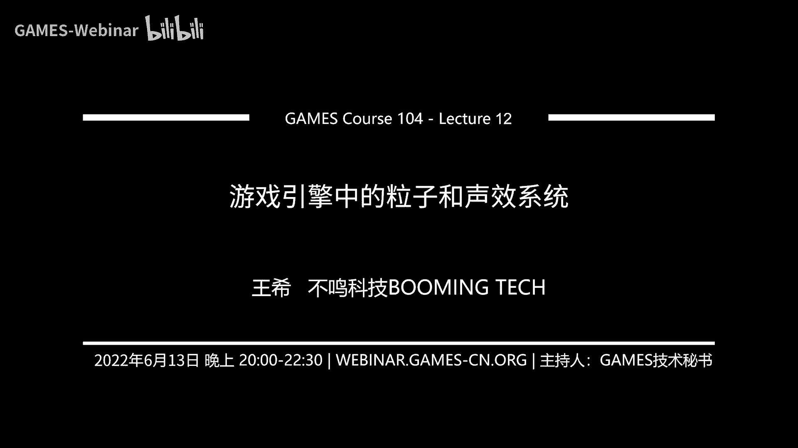
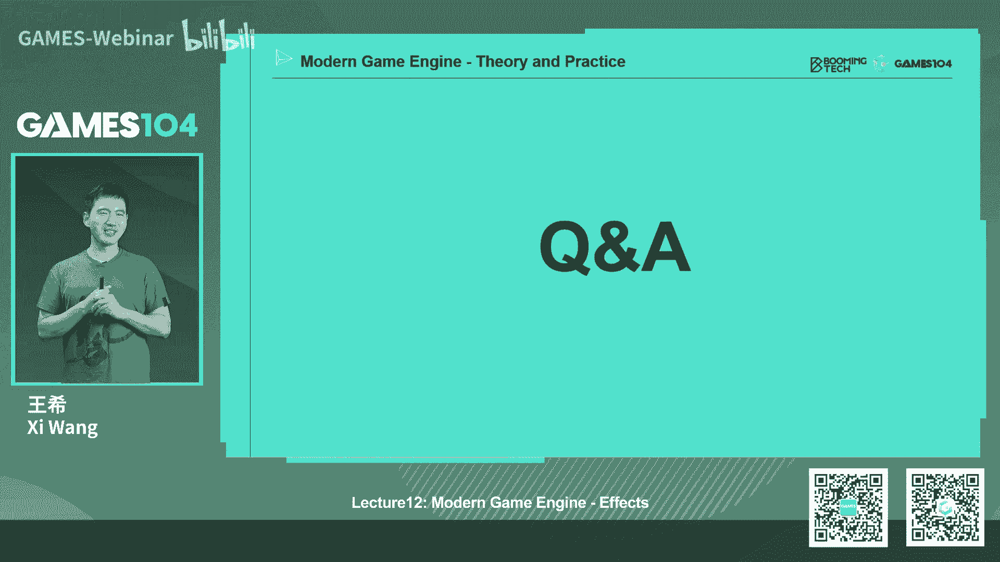
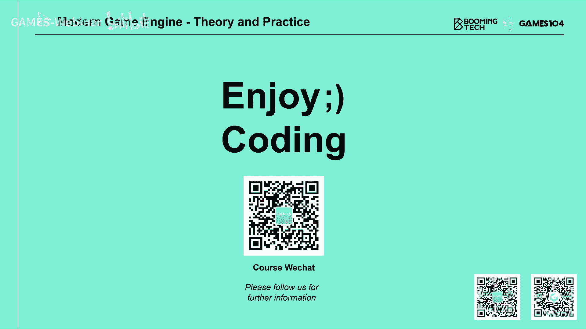

# 12.游戏引擎中的粒子和声效系统 ｜ GAMES104-现代游戏引擎：从入门到实践 - P1 - GAMES-Webinar - BV1bU4y1R7x5

Hello，大家好，欢迎回到games104现代游戏引擎的理论与实践，我是王希，那个又两周没有和大家见面了，大家端午节休息的怎么样，我知道大家刚刚过完高考完，然后毕业马上要来，我的期末考试，马上要来。

我的接下来就是我的暑假，所以的话呢我觉得同学们最近应该是非常的忙，然后忙到我们最近也是一头转向，今天我才发现我的钟没有对齐，所以我们发现我的时间居然误差了，将近有半分钟左右，下次我们一定把它校正。

然后那个即将来了暑假嘛，很多同学们可能有的大学已经毕业了，然后有些同学准备好自己暑假的安排，反正我的104课程呢就会一直陪着大家对吧，我们继续讲我的知识，讲我的那个维护我的小引擎。

然后同学们也可以过一个非常充实的暑假，嗯那在那个开始今天的课程之前的话呢，先跟大家就是做一些我的社区里面，同学们的声音的一些反馈，首先的话就是上周我们上上一次课程，应该是上上周。

我们决定了我的新引擎的那个名字叫PICO，这个名字还是蛮可爱的，我个人是蛮喜欢这个这个名字的，然后呢我的就是设计师团队呢，就拜托我的设计师团队花了这个一个星期，好好的设计一下新的我的引擎的icon。

然后我们基本的想法就是不要变得太多，尽量继承大家已经习惯的东西，所以我们就设计出了我的新的这个icon，那这个新的icon是个什么东西呢，就是我们查了一下PICO，这个单词的意思是意大利语。

短笛的意思是一种非常小，但是音域特别广的一种乐器，我觉得这个蛮好的，就很像我的小引擎，就是虽然我们是一个小小引擎，但是我们大家一起努力，其实可以越做越丰富，越做越有趣，所以还蛮契合我的意思的。

然后在设计这个图标的时候，它上面设计了很多孔，然后我就问设计师这些孔代表什么，然后我才知道大家的想法是这样，就是说我们上面那个空洞代表的是零，然后呢那个短笛的形状代表的是一。

所以一和零又构建了我的计算机世界，哎我就觉得好胖啊，哈哈就是一下子我觉得这个icon好有寓意，所以的话呢在接下来的话呢，我们还有很多工作要做，因为我们要把那个polo的引擎里面的代码的，命名啊。

文件名啊，还有我的那个GITHUB上的工程名，可能都要发生一些变化，所以这个事情的话，预计我们还要再持续个一个一个星期左右，然后呢争取能够完成我的小引擎，正式定名为PICO这个引擎的这个这个工程对吧。

这也是一件让我们还蛮兴奋的一件事情，另外一个的话呢，就是上周的很多同学已经把作业交上来，我们还是蛮震撼的，就是像这个做的就非常的完备，非常的震撼，怎么样，我觉得任何时候，当我们觉得作业很难的时候。

总会有人超额完成，甚至有人觉得这个作业是不是太简单了，这个我从读书时代就明白这个道理，就是你觉得考试不可能有人满分的卷子，总是有人会做满分，然后就是这像这个做的就非常的好吧。

所我的动画差值blending，包括我的这个那个controller的，所我的这个stepping，还有那个墙上的sliding全部做出来了，我觉得这个做的还是蛮完备的。

其实大家看这个是不是很像一个小游戏的样子，是的，所以我的小引擎代码虽然很小，但是大家基于它做一些你想做的小游戏的话，其实难度并不是很大，而且因为这是知识引擎代码全部开放嘛。

所以将来你可以对它做各种变化的，空间也是非常大的，那么其实呢就是我们也在跟同学们交流的时候，发现同学们做这个作业的也没有那么一帆风顺，经常会踩到一些坑，包括我们自己的同学也试做一下。

然后呢我们总结了一些比较容易踩坑的地方，比如说我们在做这个动画权重差值的时候，因为有的时候不是只是两个动画差值，有时候可能会三个甚至四个更多的动画在插值，因为这个整个控制的状态比较多嘛。

所以大家注意那个动画差值的总权重，一定要归一化，否则的话就会出现一些很奇怪的一些bug，然后呢我们在课程上讲的那个就是动画，blending的时候，一定要用S2，不要用那个简单的一个ENERP的差值。

因为你用一个简单的差值的话，就可能会出现一瞬间，就是当COTAN就出现了钝角之间差值的时候，他就会感觉很不自然对吧，但是那一瞬间它就插过去了，所以的话呢这个是我们在做这个系统的时候，同学们一定要小心。

然后啊另外一个呢还有一个比较有意思的东西，就是说很多同学说哎无论我怎么做，我这个ASM怎么做，我的这个小人的角色都有点滑步对吧，然后总是觉得自己是不是哪做错了，这一点的话呢，我们跟大家讲。

大家千万不要为这个事情这个有太大的压力，因为啊，我们其实这次提供的动画素材量并不够的，因为你真正要做到完美的脚，没有滑步的效果的话，其实要需要大量的素材，比如说人物的斜向移动啊，这些横向移动啊。

我们都要提供一些素材，让这个角色看上去更加的真实，而且这样的话我们在插值的时候，这个误差会更小，但是这一次因为是个小引擎，所以我们没有把它做的特别的复杂，所以的话呢在某些情况下。

比如说突然走跑跳突然变的时候，不是突然跳起来落地还带带一点前移的时候，比如说你跑着跑着突然跳起来，和和你慢慢走跳起来对吧，和你加上加上一点斜向移动等等，复杂的组合情况下。

它确实可能会产生产生一些滑步的情况，所以呢大家的话不要为此而纠结，不要因此而怀疑自己，代码写错了，因为动画系统真的想做到尽善尽美的话，它本身就是非常非常难的，所以的话这些是我的同学们在做上一次。

是上一个单元作业的时候，很容易遇到的问题，所以我们104课程的话呢，就是不会每一节课布置作业，但是呢其实每个章节布置作业，它的难度和他的工作量还是有保障的，就是说我觉得。

如果同学们把我们就前面几节课的作业，都能做得完的话，实话实说，你基本上会对基础的引擎架构是有所了解的，那接下来的话呢进入我们今天的课程的正文了，今天的课程正文讲什么呢，我们就讲特效系统对吧。

就特殊的效果，那核心来讲的话，特效系统的话呢，我们有两大盘，一大盘呢就是粒子系统，还有一趴呢是我的声音系统，其实这个都是大家很熟悉喜闻乐见的东西了，比如说像粒子系统，像这个是星战的游戏。

你们的这个效果怎么样，看上去还是非常酷吧，因为像这种只要塞F对，就SAFI，就是科幻的类型的游戏的话，其实粒子系统是个非常关键的一个系统，它几乎这个成就了我，我们游戏的整体的这种质感的东西。

都靠它来去表达这种打击感呀，这种这种效果感都要靠它拉满，那么粒子系统的话呢，其实是一个非常重要的系统，这里面我们讲鬼泣对吧，像那个老头环，还有像我的这个这个就是啊这几个，其他的像在下面的游戏。

我就不一点名了吧，但是的话我突然脑子里反应为，我突然想把那个什么那个翻译翻译过来，我突然翻译我翻译不过来了，那个对马老师混啊，不是代码混，脑子晕了，没玩法打铁，Ok anyway。

就是说其实啊在我们以前在做游戏的时候，我开个玩笑，就是比如说我们要玩很多的网游的话，你很多时候你的付费都是为特效付费的，为什么就是你发现你充实，让你的角色变得越来越强的话。

它本质上就是把以前那个一个大剑，砍出去的粒子再做大一倍，做大两倍而已，对大家回想一下，是不是以前傻乎乎的，充个648得到的效果，是不是就这样的一个变化，所以说粒子系统有的时候我们开玩笑，就是啊。

是游戏里面这个变现能力最强的这种游戏系统，当然了，我们是做游戏引擎技术的，另外一个就是，我个人还是比较推崇做这种3A型游戏，所以说的话呢，粒子系统更多的是跟游戏的内容去表达。

但这一年反向的也能说明一件事情，就是说其实粒子系统的话对这个游戏的表现力，角色的打击感，游戏的game play，其实是影响非常大的一个系统，那么今天的话呢，给大家介绍粒子系统的时候的话呢。

我会先从相对简单的开始介绍起来，其实粒子系统啊，它最早定义的时候是在电来自于电影行业，并不是这个游戏行业，就是最早的粒子系统引入的话，那是1982年的这个星，那个星际迷航里面的那个。

就是那个可汗之怒那里面的，他他当时做那个效果，他说所有这种fuzzy object它定义了一种叫proc system，就是管他的整个产生以及生命周期中的动画，以及整个生命周期的管理，然后呢。

这个的文章呢就出现在了191983年，就第2年的这个c rap上面，就是那个呃那个就是那个transaction graphics，这是我们在图形学领域大名鼎鼎的一个杂志，我们早年都是这个还是图形学的。

这个这个我们就皇冠上的这种杂志吧，我们一直都是以他为为荣的，那么上面最早定义了这个party system这个概念，那么其实呢到后面，游戏行业逐渐的越来越复杂的时候，我们就引入了粒子系统。

这个我应该大概率应该是在3D游戏时代之后，粒子系统就会越来越普及，那么其实一个particle就是一个粒子，它首先我们讲party system，它最基础的构建元素是什么呢，是一个粒子，那一个粒子。

它你可以理解成，这空间中一个小点或者一个小面片，我的有什么东西，然后呢你可以看到它有几个基本的属性，比如说它的位置啊，它的速度啊，它的尺寸啊，它的颜色啊，包括他现在的他现在生命周期啊。

它比如说它已经产生了五秒钟还是六秒钟对吧，这就是一个很简单很直觉的，比如说我们想象一下，我们一个锤子打下去会蹦出很多火花，那每个火花就是个粒子，对不对，所以说这其实是一个非常好理解的一个东西。

那么每一个粒子呢其实它是有一个生命周期的，生命周期中的话呢，它首先被spawn出来，就是被创生出来，然后呢它有一个运动的属性，比如它有个速度对吧，然后呢它各种颜色也会变化，同时呢它还会跟环境的那个互动。

比如说我撞到一个东西会反弹，比如说我会受到风力的影响，我会受到重力的影响，然后呢诶他还有个生命的lifespan，就是说它的生命的这个寿命，它的寿命到了寿命它会自动消灭掉。

否则的话你不断产生粒子系统的话，这个粒子如果没有死亡的话，整个游戏环境里面的这个粒子会不会越来越多，那这样整个系统就跑不动了，其实粒子系统很容易写出的bug，就是粒子的这个这个生命周期没管理好。

导致系统崩啊，系统的资源消耗殆尽，所以这其实就是一个最最简单的一个，粒子的生命周期的管理，那么这个时候呢我们还有一个很有意思的东西，就是image，就是粒子的发射器，大家想象对吧，就是想象一下。

就是我的这个这个粒子，就从一个小发饰，心里的不断腾腾腾腾腾就扔出来，扔出各种各样的小球，然后每个小球呢，它又有自己的刚才讲的那些属性，它就会形成自己的运动轨迹，那发射器会给他一些什么呢。

有的时候会给他一些随机的初始值，比如说我要表演，我要表演一个像喷泉的东西的话，那我的粒子它发射的时候，初速度不能够是同一个速度，对不对，它之间速度大小是有一个小小的随机，然后呢它的方向有点小小的cg。

这样你看上去像一个喷泉的效果，所以IMMETER真的是，这也是非常好理解的一个概念，其实今天的整个talk的话，一开始的这几part都比较简单的，非常的直观，很很容易很容易理解，然后呢。

诶当我们把很多个IMMETER放在一起的时候，我们叫做一个system，就是system粒子系统，你可以理解成就是这些image在一起的组合，当然了，其实更严格的讲的话。

是这么多的image和它发射出来的所有的party，在正在活着的，或者已经还在管理中的party的一个总和，那么实际上为什么我们要定义一个system呢，因为你会发现在游戏中，我们真正的表达一个效果。

比如像这里面一个火焰燃烧的效果，我们实际上是有很多种不同的particle的，比如说我要有那种就是火焰的本身比较大，比较暗的这种比较亮的这种party，就表示我的火焰对吧。

那火焰从火的根部出来到中间开始变得最亮，然后再叠加到上面也逐渐暗淡下去，那么我上面还有一些飞着的火星，火星又是一名particle，它的轨道又不太一样，还有什么呢，还有烟对吧，你看这三种东西合到一起。

才能形成一个看上去很真实的一个火的效果，其实同学们去看一下游戏中的那种啊，特效的话，其实就是用这种组合方法给它做出来的，那么再举个例子，比如说一个一个最简单的是这个这个石头的，就是被击中了。

这个一个弹药击中了石头爆炸的这么一个粒子，你可以发现它实际上也是有诶，直接击中的时候冲击的那一下的烟尘对吧，往四周扩散的这种，这个比较四散的这种这种炸开的东西，还包括很多碎片。

DEBRICK这种碎片形成，所以说其实我们的effect artist，就是特效艺术家的话，它最核心的研究的就是这个组合怎么样子，我们在真实世界里看到了一些这种效果之后，我怎么用一个一个简单的系统组合。

来生成我们想要的效果，这就是粒子系统，非常有意思，其实也是非常好的理解，那么粒子系统的话呢，实际上它的那个particle sport，实际上如果image它只是在一个点上的话。

我们其实是最常用的一种image，对不对，但实际上呢我的IMETER可以做的更复杂，比如说我可以限定一个空间的区域，比如说我希望你在一个box的这个空间，或者一个SFA的空间。

或者是capital的空间去生成我的particle对吧，当然我开的速度，这样我的形成各种各样复杂的形状，那我甚至可以拿一个mesh，就是比如像这里面一个洞的这个人，我在他身上采样。

然后用他身上采样出来的随机点生成我的party，这可是形成一些更酷炫的效果，所以其实拍这个系统啊，对于比如说啊不仅是对游戏啊，其实对于影视后期特效行业来讲，那都是一个最最重要的一个一个关键性系统吧。

所以我们经常讲那个啊一个电影的特效，做的不好，我们今天会说什么叫五毛钱的特效对吧，那这个这里面黑的东西是什么呢，就是说啊particle如果做得好，你会觉得他非常的效果增益，让你觉得很真实，很有感觉。

如果发这个做的不好呢，你就感觉一群简单的面片满天飞，这就是啊展现出我的粒子系统设计的好坏，还有我的特效艺术家的水平高低，那个就在这地方体现出来，那么其实呢particle呢就是SPA的话呢。

你会发现就是说它本身party sport，也有很多可以定制的东西，比如说我们可以让它连续的随机的哒哒哒哒，往外喷对吧，比如就比如说我刚才讲了一个，喷喷泉的这种案例，那么它也可以变成什么呢。

就是说哎periodic，就是说我到了一定时间随机的碰突然爆发，1111批出来，那这样的话你根据你要表达的效果不同的话，在EMOR这边的话，你其实可以设置各种各样的不同的，这个它的行为模型。

那么当我们这个span就是那个image spawn了很多，particle出来之后，这个particle在这个空间上的这个所有的行为，我们叫什么呢，我们叫做simulate，就是模拟。

那就simulate的话呢，他首先要模拟就是说我的particle，每一个particle出来，它受到的各种各样的立场的作用，比如说它受到重，一定，很多时候我们要考虑它受到重力的作用对吧。

他要受到重力还说了什么呢，空气阻力对不对，还有什么呢，还有风的扰动，比如说大家玩那个对马岛之魂的时候对吧，最有印象的不就是信仰之风嘛，对不对，那么信仰之风的话，他那个就是说就是模拟那种particle。

沿着风吹的那个方向的那种感觉，给你指引方向，所以这三个是我们particle最常受到的力的影响，那么其实的话呢就是在simulate的时候呢，其实就跟我们之前在讲那个啊物理那一趴，很接近。

就是说我每个particle呢，你可以认为就是一个非常小的物理的质点，那么他大家还记得我们那那节课上讲了，各种各样的时候显示积分，影视积分办理时积分对吧，whatever你用什么，其实粒子系统还好。

因为它不是需要严格的物理准确，所以说一般来讲大家就是用最简单的显示积分，就可以了，然后的话呢就是我们每一帧根据当前的速度，根据我受到的力决定我下一帧的这个决定，我受影响的速度和下一帧的位移速度方向。

就一点一点的把它记下来，其实就非常简单，那么这个过程中我正在形成这种一个喷泉啊，或者是往上撒的这种炸弹的爆炸，或者一些各种各样的奇怪的效果，其实这个效果做的其实可以非常的真实，那么其实当我们在。

但在这个赛季simulation的过程中呢，其实我们扰动的不仅仅是它的位置速度，还有什么呢，还有他各种各样的这个这个其他的参数，比如说我要让它旋转起来，这样看上去是更真实对吧，那我们还可以什么呢。

我看还可以改变它的颜色，就是它的颜色在过程中间可以一直在变，比如刚才我们讲了一个火焰，你在做那个火焰的时候，那个particle产生出来的时候，它一开始的颜色可能是暗红色。

到中间的时候是温度最高的时候变得发亮，然后再飞得更高一点的时候，因为温度损失得很厉害嘛，它就会变得暗，这样的话你能感感感觉产生了一个火的效果，其实严格来讲的话，火焰在不同的高度，它的颜色都是不一样的。

大家还记得我们学过黑体辐射对吧，就不同温度的这个辐射体的颜色都是不一样的，那么包括呢它的尺寸，因为很多东西它在扩散，比如像烟，我们做它的particle的时候，他一开始是浓密的小小的。

然后呢慢慢越来越扩散越大，它的它越来越淡，但是呢他的覆覆盖的空间的范围越来越大，所以这些参数的变化，都是我们在做simulation的时候最重要的一个计算，那么这个计算呢一般在早期的PC系统来讲。

其实非常简单，基本上都预先设定好，然后交给artist调整一下它的参数基本够用了，但现在拍这个系统的话呢，已经变得越来越复杂了，那么更复杂的就是说我们还希望这个particle啊。

他在simulation的时候还和环境有互动，举个例子，就是说我们在人的认知中，我们总是会认为你喷出去的这个粒子遇到了，比如说有些障碍物的时候，它会被反弹，它会被阻挡，对不对，那么这件事情呢。

如果我们直接调用物理系统的话呢，实际上会非常的慢，但是呢你想一下，就是说像我们一个系统，动辄就撒出几百个甚至上千个particle，那我们对它的模拟的话呢，就需要一种非常高效的物理碰撞检测算法。

后面会讲的细节，但是呢其实对整个世界的collection，也是这个系统非常重要的一个属性要求好，那么这个simulation的过程的话，就构建了整个particle的生命周期的管理。

那么particle的话呢，每个出来之后，其实大家想象的它并不是一个抽象的一个质点，那么particle是什么呢，particle一般来讲有各种各样的形态，那么最常用的形态是什么呢。

最常用的是bear world bebo这个词呢，呃翻译成中文不知道怎么翻译了，反正就是它就是一种使，就是你做一个面，一个阔的他始终朝向你的camera，就是无论你camera怎么转。

这个b bot总是嘲笑你，我们做的这个事例，同学们把camera freeze freeze出了，就告诉你说，你现在看到这个火和烟，它其实是一群永远朝向你的这个party面的。

但是呢这个单位会让大家有点误解，实际上应该做的是，我无论怎么转，你总是会觉得那个particle总是朝向我的这一点，为什么是它是有用的，因为在真实的在做particle的时候。

我们那个那个每个party的颜色和外观一直在变化，所以呢你可能会被那个变化吸引走，你注意不到说那个particle一直朝着你的转，如果那个particle是一张静态的图的话。

它假如它的阿尔法它的内容不发生变化的话呢，大家其实是非常容易意识到，就是说这个particle是由一个永远朝向camera，camera的比尔波的构成，所以这个是啊我们在做PC系统的时候。

一个小trick，就是说你在做particle，如果做b bot的时候呢，如果这个particle本身尺寸很小，那你没关系，用一些颜色，有些简单的东西你能表达，如果这个part比较大的话呢。

我们一般建议你用animate texture，就是说它的那个外观总是随着时间在变化，这样的话就是作为用户来讲，不会注意到说你是用很多小面片，模拟空间中的一种体量感的东西。

所以这是一个非常有意思的一个小trick，那billboard的particle呢，实际上是particle系统，最经典也是最古老的一个东西，就是基本上你可以认为就是早期的particle系统。

基本上讲的就是比ba particle，但是呢随着游戏变得越来越复杂的时候，我们就发现不够了，比如说我们要表现各种各样的小的，这种碎屑的时候，那你可能要模拟很多的小的这种碎片钢铁。

所以有的时候我们用MARMESH直接作为particle，那这里面注意注意一下，就是说这些mesh的话呢，一般来讲需要有一些随机性，最简单的一个随机啊，就是假设我做不了很多REMARCH怎么办。

诶我把每一个match的T把它转个角度，然后把它大小放缩一下，甚至会做一些XYZ方向呢随机的放缩，这样也能让你产生一种它的不一样的感觉，注意大家在做PC系统的时候，我们一般都会追求一种随机感。

尽量避免一种重复感，所以这里面的话呢是我们在设计作为引擎，去提供PC系统的时候，你会发现你最重要的是给artist提供各种随机的，可调整的量，他们特别喜欢在里面说，诶。

你给我告你把所有的变量都允许我随机一下，这样的话我做出的效果看上去才会自然和真实，那么第三种呢，particle呢也是一种大家可能比较少见，但其实在游戏中非常常用的一种particle。

我们叫做ribbon，Ribon particle，或者有的人叫做ban particle，他的意思是什么呢，就是你的这条particle，它脱出的是一条光带。

大家想象一下这个particle什么叫有用啊，实际上是在这个打个比方，比如说我们在游戏中打出一条这个一根，那一根很厉害的这个加了魔法的剑，那个箭的尾迹在空中，是不是打出了一条漂亮的抛物线的那个丝带。

而当你有很多很多人这样去做的时候，是不是就形成了一条一条的袋子，这种东西就是ribon particle，那么rain particle呢，它的它的核心的点是什么呢。

就是这个particle在飞行的过程中啊，它会不断地拉出一个一个一个额外的控制节点，然后呢他认为我是应该有一定宽宽度，把这一个个的控制点连接在一起的，这样一个绶带，这个东西在很多我们在control。

比如说轨迹对吧，或者我刀剑划过去的一道弧度，上面是非常有用的，基本上我们在游戏里面，要表现出一些空间的这种时空滞留感，比如打出一个气功弹对吧，一个一个气功波打出去。

这也是一个很典型的ribbon text啊，BON那个particle，那么rain particle的话呢，他实际上呢有一个小小的挑战，就是说如果我们只是把这一个个的离散点去，我们连接在一起的时候。

你会发现我们连出来是一条一折一折一折的线，所以呢当我们真的在去实现这个ribbon，particle的时候的话呢，我们一般会采用样条曲线差值，大家在前面的动画系统啊，物理系统啊。

还有更前面的rendering系统里面，应该对我们的样条曲线，应该是这个非常熟悉了吧，那这里面给大家小小的科普一下，一般来讲在做ribon particle的时候，他们我们一般会用cut more曲线。

那为什么用cut more曲线呢，第一个就是cut more曲线比较简单，大家还记得cut more曲线就是一个啊，应该是个二三阶还是二阶的，一个一个PANORMAL的公式就可以直接插出来。

那么第二个的话呢，它可以严格的保证你插出来的这条曲线，是通过所有的控制点的，所以呢这样的话呢，我只要在这个控制点之间再插入若干的点，形成一小节一小节的这个transition的话。

那整个这个特效看上去就会圆滑很多，所以的话呢这个当我们去大家做游戏引擎，如果你要做project系统的话，一般来讲你提供这三类，比如说bill board，这个mesh和ribbon particle。

按照刚才我讲的，就是你要加入一些尽可能多的这个随机扰动，然后呢你做ribon particle的时候，一定要注意加入那个cat more的这个插值曲线，让这个texture。

让这个这个插值出来的shape看上去性能的平滑，那你基本上就可以做一个简单的小的游戏引擎，用的PC系统了，其实十几年前啊，我们在做帕克系统的时候，差不多也就这些东西就够用了，那么其实呢这个系统的话呢。

它从基本原理上来讲非常的简单对吧，当然我的我的强调一下，我在前面这一趴讲的party系统，都是最基础的party系统，但是因为这门课还有些门基础课，所以给大家讲的就是最经典的。

particle系统的核心要素，那么其实呢就是这么简单的party系统，当我们真的去做他的绘制的时候，你会发现我们有很多的挑战，那你们最大的一个挑战是什么呢，哎我的老朋友又来了。

大家还记得我们在讲rendering pipeline的时候，我就讲过，就是说其实啊透明物排序是我们游戏渲染中的，挥之不去的一个噩梦，因为它非常的就是你非常的这个非常的，这个常用。

就是到时你到时候你都会用到，但是呢如果你做不好或者做的效率特别低的话，效果就会一塌糊涂，就觉得像这个粒子里面，就是说如果你一次看这些透明我的话，那你排序的和没有排序的结果的话，看上去感觉是完全不一样的。

那么它核心的点就是我的画，透明物永远是要从最远的那个透明木画的，最近的一个透明，我这样一层层的覆盖，这样的阿尔法布兰妮的结果才是正确的，如果我的顺序是乱的，其实我产生的结果也会是乱的。

人的眼睛一眼就能看得出来，那么这样的话对于系统来讲的话，这就是个超级大的问题了，因为大家想象一下，在场景里面我去做一些玻璃墙，做什么东西，我大不了做个几十块也就不得了了对吧，那我去那个绘制它的时候。

实际上也还好，这个排序我还能排得出来，而且每一个范围基本能够控制，但是大家想象一下这个系统，我在游戏中动辄就能产生几百，上千个这样的一个beer board，那我怎么去排他们前后关系呢。

那么这里面呢就有两大流派，第一大流派呢就是说哎我全局的进行排序，就是说我不管你是用哪个particle系统，哪个em特性的particle，你比如说有的有的，有的系统产生了50个particle。

我的系统产生了100个party，我的系统产生70particle，我把你们这200多个particle全部合到一起拍，就像这里面的粒子就是绿色的，是一个immature existence。

红色是ISTENCE，他们之间的话对于每个particle来讲，他们之间是交叠的，那没关系，我就自己按顺序排，那这样我排出来的结果就是正确的，但是呢在真实的这个大家就知道，因为排序你越多的元素参与的话。

它排序的成本就越高，而且因为我们每个派系统绘制的时候呢，实际上我们有很多参数的设置都是要求一致的，那你这样的话来回跳的绘制啊，其实成本很高，实际上在很多的particle系统里面的话。

我们只能按EMETER进行排序，就是说诶你这个在前在后，那这样的话两个靠得非常近的IMETER，就会产生什么问题呢，就会产生这样的，就是说哎你看虽然其实真实的情况。

绿色的particle和红色的particle之间有很多胶底，但是你现在看上去好像所有的绿色都在前面，因为绿色的那个IMETER可能靠相机稍微近一点，这其实是我们在party系统非常常见的一个问题。

就是如果你们看一些早期的游戏啊，他经常就是当你的相机发生动的时候，你会发现比如说有些smoke column就是烟柱，还有一些什么特效，它会突然一下就闪动了。

这这种情况下一般就是particle sorting出了问题，但是如果今天大家在写游戏引擎的话，特别是入门的话，我会建议大家先不要去写那个global的那个shot，因为那个写起来比较麻烦。

而且后面会讲到一些GPU更复杂的一些算法，你先写一个最简单的per imeter sorting的话，能够解决你部分的问题，但是这个锁定它如果不解决，产生的后果是非常严重的，比如这里面这个粒子。

里面那个就是那条带子的那个ribbon，它就是一个particle，它实际上是穿过这些particle我的眼中间而入的，但是因为他的bounding volume，是总是在靠近最靠近相机的。

所以它会被排序到最后，所以你会觉得那个那个光标它是穿过，就是浮在所有的烟之上，那么你再看下面一个例子，就是如果我用global shooting的话，我就是把这个ribbon的每一节。

和你的这个particle进行排序的话，你会发现诶看上去好像现在的结果就对了，所以大家看看，所以说其实transparency的物体的排序和渲染，其实是游戏引擎里面特别要仔细去处理，随着现在的这个游戏。

它的环境越做越复杂，真的就是我们很多游戏里面那种气氛感，都是有大量的particle，大量的我们叫做ambient的东西让你感觉出来了，比如说我们举个例子，比如说我们表达一个一个你到一个地方去。

这个环境的感觉，你可能在那走，你没有意识到，但是我为了让你觉得这个环境是真实的，你的脚下可能有几千上万个那种大气的，微微扰动的particle在那流动，所以你会觉得这个地方的空气，就这个地方环境是活的。

是有很多互动的，包括你的脚走出的每一步，风吹过来的落叶，天上这个一些鸟雀在飞，这些东西才让你觉得这个世界是真实的，所以说一个好的游戏和坏的游戏，其实对于这种particle系统的依赖度。

其实差别是非常非常大的，就我们讲高质量的游戏的话，那么其实的话呢，particle系统的sorting的话是是一个挑战，另外一个还有很大的挑战是什么呢，这也是大家很多时候，我经常会意识不到的一件事情。

就是说其实啊那个系统看起来非常的简单，只是一些简单的诶，每一个粒子这样移动来移动去移动来取，但是呢它很多时候是我们游戏的性能杀手，为什么呢，我们绘制透不透明的物体啊，无论这个世界多复杂。

我们只需要绘制最后一个像素，什么意思，就是说当我一根视线看过去，我可能看到非常多复杂的几何层次，对不对，但是呢我有一个叫z buffer，z buffer会把所有后面的最后面的东西全部滤掉。

只留下最靠近我的眼睛的那个点，然后呢我对它进行shading，特别是deer的shading，就是说我所有的屏幕上，比如说100万个像素点，我只需要设定一四，但是当我们去绘制透明物的时候，但是透明物呢。

如果这个透明物来自于环境还好还好，因为你一根视线看过去的话，那你顶多也就看到过，比如说七八个透明物就不得了了，但是party system那简直就是丧，就是这个怎么说呢。

我称之为叫trouble maker，就是说你面前有一个烟的一个爆炸，然后呢，其实在你眼面前迅速就可以怼出几十个，甚至上百个，有你整个屏幕那么大的这个particle。

然后所以我们以前经常叫做overdraw，就是说同一个像素我被绘制了多少次，那大家想想看一个屏幕大小的particle，它就是1100多万个像素点对吧，那么我怼他个就是几十个甚至上百个的时候。

那就是几个亿甚至十几个亿的计算量级，那其实你会发现游戏的帧率就会迅速的下降，所以其实在游戏中的话，它这个系统很多时候会把你的游戏的帧率，迅迅速的下降了，所以在现代游戏中的话呢。

我们基本上会用的一个技术就是half resolution，什么意思，就是说哎我服了你了，你很厉害，那我怎么办，既然你是这种很faster的东西对吧，那我怎么办呢。

哎我把屏幕的resolution整个减少一半，当然了，我要把z buffer也减少一半，然后呢我把你这些所有透明的物体，特别是particle全部在一，就是1/4的。

就是那个像素数量就是half resolution，就是XY都缩小一半，它的总像素量是不是少了四倍，然后呢我把你这些透明物渲染上去，注意这里面有个细节，第一就是说，如果你的Z是在这个已经当仓破了。

这bug之后的话，那就不需要绘制了，第二呢，你这些所有的particle的这个这个啊，这些透明物的这个这个算出来结果的话，一定要集体算一个阿尔法，然后呢，这个阿尔法再和我的这个就是前面的。

OPAC的物体进行blending，当然我的blending的过程是一个up的过程，这里面做一些简单的差值，一些变化，一些扰动，我就能得到一个非常不错的效果，其实在游戏引擎里面，现在越来越多的这个渲染。

我们已经开始用half resolution了，这个好处是什么呢，就是说我们会发现在现在游戏里面，随着我们游戏显示器的分辨率越来越高对吧，之前是1080P，我讲的是大概啊差不多有200多万那个像素。

如果是4K的话，那就是差不多接近1000万的像素对吧，我们后面还有8K的显示器不得了，那就那个像素量就特别大了，就是说即使在现在超强的GPU的话，我们也做不到全尺寸的渲染。

所以我们一定会用当山坡林的方法去做，当然了，这里面有讲到了著名鼎鼎的，比如大名鼎门，像大力水手DRSSR，就是其实up sampling down sampling的，就是用低精度的绘制。

然后再用一些算法把它放回系统网站，其实是现在渲染里面一个非常常用的一个技术，那么当然在帕克斯里面的话呢，希望大家去写的时候一定要小心，就是说它非常容易出现，就是你觉得一个很简单的效果。

突然把你的游戏的帧率就降下来，但这里面我们还有一些更更多更复杂的算法，比如说以前我们在做PC系统时，如果我们发现这些particle离相机特别近的时候，我们会cut掉一些particle。

就是或者说我们用一些其他的方法，就是降低那种就是在同一个像素点上，重复化的这个particle的数量，这也是一个非常重要的，particle系统的一个功能好，那么讲了这么多的话，其实part6系统的话。

它最大的问题，无论是绘制，其实还有一个它的本身，simulation对效率的影响也特别大，因为对于现代游戏来讲的话，我们很容易在一个场景里面，可以达到几万甚至是上10万的帕克数量。

我们才能产生我们想要的这样的一个效果，那么这么多的particle，我的每一帧都要对它进行各种各样的这个，计算处理，实际上对于CPU来讲是一个很重大的负载，那么大家想想。

这种东西是不是天在我的rendering讲过GPU，对不对，GPU是干什么用的，GPU是不是特别善于处理这种海量的并发的东西，所以呢这个时候大家就很自然地想到说。

诶我能不能把这个系统直接扔到GPU上去管理，但是呢particle它有一个比较复杂的东西，是什么呢，它有个生命周期，就是说它不是说一直在那算，而他每时每刻都会有新的particle产生。

也会有很多particle死亡，那这里面的话，我怎么在这样一个简单的GPU硬件上，实现了它的模拟呢，那我在这节课的话呢，不讲不讲的特别细，但是给大家讲一个基本的概念，所以同学们如果有兴趣的话。

自己想写part这个系统，我会建议就是大家写两套，先去写一个CPU的particle，接下来呢，按照我接下来这个课里面讲的这个思路，也尝试写一个GPU的版本，其实GP版本蛮有趣的。

那么首先的话呢我们去想说唉，我们怎么把这个pk系统放到GPU上去，你会发现有很多很多的好处，比如说第一个我肯定可以用GPU的并行化的算力，对不对，另外一个就是说我去读z buffer。

我去对frame buffer进行各种各样的处，理和计算的时候，实际上不用再把以前的z buffer再去读回来，进行处理，我直接可以全部的在这个就是GPU，你全部搞完。

所以这是一个最简单的GPU particle的一个框架，对大家会发现他所有红色的区域，以前是在CPU里做的，现在全部移到了GPU，那它具体怎么做呢，其实他的思路非常的简单。

第一个呢我们会定义一个叫particle pool，这个铺呢大家想想看，就是诶我用一串标准的数据结构，描述了所有的particle的描述数据，比如说你的位置，你的速度，你的颜色，你的尺寸。

你的其他的一些meta的information对吧，比如说你的texture uv，whatever好，我定义一个标准的数据结构，那我假设我的整个系统的容量最多的容量。

10万个particle在我的系统里面去，然后呢我再管一个东西是什么呢，叫做DEADLIST，就是说这个是我的上限，那我现在所有的一个part都没有，那我的DL是满的对吧。

我再存一个值叫deadlist count对吧，就是我说哎我现在有这个这里面举个例子，假设是八个，然后呢我还有一个什么呢，还有我现在需要活着的party list，现在一开始是空的，但这个时候。

当我一个image在GPU里面产生了particle的时候，哎我假设产生了五个particle，这个时候呢我就从那个DEADLIST里面，从尾巴开始去取五个空位出来，大家想想这是不是一个标准的一个。

就是这个这个这个一个链表的插入，这个这个插入和那个释放的操作，对不对，我我是啊，这个这应该是个是个队列，就始终从它尾巴上去取它的数据，应该是个站吧，应该是个站，我使用松尾尾巴取数据。

然后呢我塞到我我的列表里面去，这样的话我三四我就取了3456号particle，说是活的，我把数据填上去了，然后呢DEADLIST里面只有三个数据了，这样我就知道现在有活的particle了。

然后这个时候呢我在GPU里面，假设我的时间take又往前走了一步，我就开始算了，我的哪个particle活，哪个particle死，我发现当然了，我首先要看我的所有活着的particle。

我的particle不用管，我所有的活的particle进行一次simulation，我发现诶6号particle已经死了，那怎么办，那我从就把6号particle加到dead list里面去。

同时的话呢其实呢我对particle那个active，那个alive list0啊，其实进行traverse的时候，我同时在写下一个friend lilist，我的叫做alive list1。

这个时候呢如果我认为我的自己还是活着的，比如像345我的没问题，我就三写一个一下五，四写一个一下，五写一个一下，当我去similate party6的时候，发现六六死了。

那我把6appended到DEADLIST上去，同时的话呢我就skip掉，往LEVELIST1里面去写六这个编号，然后呢接下来我再走七，这些东西在CPU上写的是很好写的，对不对。

但是在GPU上好不好写呢，在以前的GPU上是很难写的，但是自从有了computer shader之后，这事就变得非常的简单，因为computer shader提供了一个就是原子操作。

就是你可以在一个一组计算中，我可以设置一个就是全局变量，这个其实它叫一个局部变量，然后呢啊我们可以保证它的原子性，我的就是说我我虽然是BACHELLE在运行，但是当我去读写那个变量的时候。

我们都是保证它的原子性的，所以这是确实是COMPUSHA一个很好的一个属性，所以这样的话，我实际上用了一个简单的双8buffer的这个策略，就可以每一个tick在GPU中啊。

在那个就是那个computer shader，其实也是GP了，computer shader中算出来每一个particle，它的生命周期的变化和它的属性的变化，然后呢。

把它反向的更新到我们活着的这个particle，列表里面，和死的particle列表，这样呢我再做个buffer swaring，我就得到了下一帧我要绘制的particle。

那么接下来我在做一件什么事情呢，因为我的这些数据全在GPU了，对不对，接下来呢我还能做一个更大的一个优势，就是说我可以在里面做view frost calling。

那为什么这件事情再做起来就非常的方便呢，因为啊其实view first colin呢，也是个非常简单的计算机，它特别适合用GPU去算，那么我这样的话就可以得到一个所有visible的。

就是说可见的particle的列表，这样的话，我又进一步减少了我要绘制的列表的数量，但这里面有个细节啊，同学们说诶为什么我view russian calling那个alive list。

他不会反向的去改变alive list，这是为什么呢，因为其实一个particle是死是活啊，他跟你看不看，但是没有关系的，大家想想看，比如说我这边射出了一群一群烟火，你不去看它，它还在空中飞，对不对。

当你回头去看他的时候，如果你因为上一帧看不见它，你把它从那个活的列表中给干掉的话，一回头的时候是不是他就没有了，是不是该产生了一些很奇怪的效果，所以的话呢。

就是接下来的计算全是view dependent了，也就是说particle simulation是跟view是没有关系的，所以你simulation出来，所有在在我的周围环境中活跃的particle。

我会再做一个单独的叫view fluster calling，我就把你这些particle给你给取出来，然后接下来我还做一件什么事情呢，诶我还可以去做这个跟depth buffer进行这个。

进行这个比较，同时呢我还要做什么呢，我还要去做他的这个就是sorting，Sorting，我也全在GPU里面做，但是我会讲sorting的细节，然后这个时候我基于这个alive的particle的话。

我声称我要我要去渲染用的vertex和index buffer，这样这个这个地方的话呢有很多小细节，但这些细节我相信同学们自己研究一下，都知道怎么去写，所以这其实就是个GPU。

particle系统的一个非常简单的一个思想，其实这个思想很好用，非常好用，其实你们在做任何的，就是这种集群性的这种运算啊，这些这个东西的话都可以按这个思路进行管理，因为你一上来构建一个P。

知道我所用的计算的上限，然后呢用一个LIVELIST，就是活的active的这些东西的列表，就指向一个它的数据的index，然后呢哪一些被recycle，就是我们叫dead list，就是死亡的列表。

然后这两个列表之间的index来回swap，来回交换的时候，就能够完成一个对一个很动态的系统的管理，这是一个非常常用的一套结构，那这里面就讲一个细节，就是因为我的product系统最难的东西是什么。

是排序对吧，sorting就是我们刚才讲了，如果你不排序的话，而且我们希望的是什么是global sorting，这么多particle，我们要在全局的排个先后，那以前这些数据都是在。

就是在这个就是我的组组内存上，然后我的CPU是可以排序的，那就是用我们在数据结构里面教的最简单的，比如快速排序法呀，什么什么这个这个这个冒泡排序法对吧，N平方当然没有人会用冒泡排序法了。

那么哎我们还是能排序的，但是现在问题是我到了GPU上，我怎么排序呢，那这里面的话呢其实有很多很好的算法，我这边给大家讲几个最经典的一个思路，就是叫mega salt merge，Salt。

merge salt的话呢，他的想法其实非常简单，就是就是我们在学排那个排序的中，有一个方法，就是我们把一个大的数列的排序，分解成无数个已经排好序的数列的整合的过程，也就是说。

比如说我第一步把所有相邻的两个元素，大小排序排好，我就得到了无数个小小的已经排好序的数列，对不对，然后呢这个时候我在每两个一组一组合，因为你那边已经排好序了，所以呢。

我其实把你二进四的时候就会非常的简单，这里面你会发现就是我这个排序的时候，只要用log n的时间就可以了，然后我四进八的时候，因为你两个独立的四的数列也也好，其实我每一次每个地方我选取一个元素的时候。

我只需要我自己的，这个时候我自己数列也不用找了，因为我知道后面的数据一定比我大，我只要在你的那个数列中去查找呃，有哪些数据在我的前面，他怎么去，其实非常的简单，就是一个二分查找法就可以了。

所以的话呢这种merge salt的思想是，每一步我的计算都是log n的，然后呢诶我整个这个计算的复杂度，其实就是那个呃，就是那个就是n log的一个一个计算。

所以这个其实是一个非常快速的一个计算方法，那么回到回到我们在GPU上去做这件事情的话呢，你会发现有两种非常简单的策略，就是我得到了无数个数列，比如说我在问我的，就是我找到我的每一个元素的时候。

比如在已经做得好的元素里面，我取一个放到我的，这个就是啊我的目标数列中的话，我会去问说我能不能放在这个位置，其实呢你只需要找你自己都不用比了，你跟别人去比，跟别人去比的话呢，你只要在别人那二分查找。

如果你发现别人，那个上一次那个游标节点和你的节点之间，没有冲突的话，你就可以把它放上去，这个具体的算法讲起来就比较比较用语言讲，特别的麻烦，这个最好要画图，那么这里面的话呢，其实你会发现。

就是说这个时候你的SHADER就可以写了，因为你每一个SHADER的话，其实就是对于每个数字，每个元素，他只需要自己去和另外的那个，就是source的那个数组里面做一次二分查找，就可以找到自己的点。

那么这样的一依次找下来的话呢，你就能够得到最终一个已经排序好的节点，当然了，这里面其实是有一篇参考文献的，我这里就不不展开了，结果到时候我们在会后的话会把文献给大家，这个作者呢他就做了两个比较。

他说啊其实在GPU中去进行这种sin的话，是一个很常用的操作嘛，那么左边的第一种方法的话呢，是一个非常符合人直觉的方法，也就是说我把两个source，已经排好的数组都变了一遍。

然后呢这个过程中我就能得到我想要的结果，但是呢它会出现一个什么问题呢，就是说啊他在写的时候，它的地址是一直跳来跳去的，那么这个写的时候一直跳来跳去的话呢，会让这个magic coherence。

a cash coherence降得非常低，他说如果你想象一个就是几10K，几十和几10K的东西进行排序的时候，这个内存跳起来就会非常的大，他说这个效率其实是非常非常低的。

那么他所以推荐我的做法是什么呢，他反过来去算，他说我对于我的目标那个矩阵上的任何一个点，我在两个source的这个这个这个数列上的话呢，去寻找我该应用聊的那个元素，然后呢这个反向的去找，这样的话。

我每次写的这个顺序就是12345，一路写下来，他说这种方法就是max2是更好的方法，具体的实现的话呢，同学们自己去研究一下，但它最核心的思想就是，如果给你两个已经排好序的数组。

你怎样把它合成一个排过去的速度，这其实是以前的，就是merge排序法的一个最核心的一个一个思路，但是在GPU上的话呢，你需要考虑到就硬件实现上的这种可行性，那么基本上在行业里面我们用的比较多的话呢。

是第二种方法，确实他可以依次的去往那个做得好的数字，你去写，而这个东西的话呢，又是我们在GPU上实现系统特别重要的，一个小的技术细节，但是同学们听不懂啊，没有关系，因为我这边其实我觉得我也没有讲清楚。

因为具体的来讲的话，那真的就是一个数字，一个数字去移，让你去找那个数字，但是的话呢大家看了这个参考文献，看了他的PPT的话呢，应该大概就能明白我们这节课讲的这个算法诶，好像我们这个PPT。

是我没有把参考文献放上去，我们下一我的课后给大家补上，那么其实呢，在其实当我们把整个这个particle放在GPU上，还有个好处是什么呢，就是说哎我们可以进行更复杂了，比如说我的碰撞，那碰撞。

如果让每个粒子真实的和物理的这个引擎啊，大家还记得我们上节课讲物理引擎吗，都结算一遍，那个速度是很慢的，所以呢其实在行业里面，大家很多时候用的是什么呢，就是那个用我的death buffer。

就是view dependent，就是用screen space这个深度，我们模拟出一个空间的这个几何形状，然后呢particle在这里面进行碰撞。

所以呢我们直接从depth buffer里面去取它的值，然后呢跟这个就是particle进行碰撞，这个效果呢其实还是不错的，像这个结果就是一个典型的。

用那个就是说screen space depth buffer，然后呢我们做这个碰撞，其实很多时候他肯定是远远好于没有，这个就是collision induction and particle。

所以这part这个系统永远都是在效果和，这个就是计算效率之间，做trade off的这么一个系统，好，其实呢系统呢，我前面讲的这些都是比较基本的实现，比如像gp particle。

现在已经基本上成为现代引擎的一个标配了，对吧，然后的话呢但是呢其实party系统它做的深的时候，有很多更复杂的应用，举个例子，比如说我们要展现一个人群，Crowd。

就很多很多的这个这个人或者是鸟或者是动，其实大家以前觉得诶这是不是物体在上面走了，这其实呢在很多游戏产品中，我的引擎中提供的是一种particle，系统的这种能力，比如像这里面对吧。

大家看到这些人跑来跑去，它其实就是product系统，那么这个东西它是如何做到呢，像这个是星战里面的一个demo嘛对吧，那么其实呢，它实际上把这些游戏里面的这些角色，变成一个个的就是mesh。

这个mesh是一个particle，我的PC可以卖，注意啊，这个时候这个mesh的话不仅是一个mesh，它还是可以动的，我在每个顶点上我去存一个，它受控于哪个B，注意。

这时候因为我是用particle所说的相对简单一点，所以我就不用那么复杂的skinny，所以我每个顶点的一般来讲我只存一个，就是影响我的BB，就是大家还记得我们在讲animation讲过。

就是如果没有skinny的话，就是一个骨骼，就是每个顶点只受一根骨骼控制的话，我们会出现一些骨骼转起来就断裂对吧，不会像sky那样看上去那么真实，但是没有关系。

因为就是你都已经那么小了这个particle了，我们不会注意到，就是当这样动的时候，这边会产生一个小小的裂缝，那么有了这样的一个就是skeleton。

和那个就是最简单的skinny的information的时候，哎我们就可以把这个这个小小的particle，它所有可能的动画，就所有状态下的动画状态，1234567对吧，这个动画和在这个状态的时候。

他比如他在他对他速度的影响，它是往前走，往后走，还是停止全部CODEC成一个texture，然后呢每个particle它不是一个simulation，simulation的话。

我把以前一个简单的一个加减乘除，比如速度加减变成一个什么呢，变成一个状态机，就是每个particle的话呢，他在就是在自己的这个每个时间点，在状态机之间来回切换，这个时候大家发现没有。

particle系统变得有点意思了对吧，不再是那么简单的，只是速度加位移加重力了，其实particle每个系统内部，就是每个particle内部，可以维持一个小小的状态机。

这样的话它可以在这些状态中来回的切换，那我再做一个更复杂的，就是比如说我如何让它在这个世界上去，流动起来，那就最简单的说我给他一个速度，那所有的人都是往一个方向走，给一些随机，这个当然看上去是OK的。

但是想象一下，如果我要我要表现这样的一个效果的时候，实际上呢我希望它是沿着道路去走，我不希望他走进建筑物，对不对，这里面的话呢它就会形成一个厂，这个厂是什么呢，就是我们前面讲过的SDF。

就是这个就是带正负号的这个distance field对吧，就是有正负号的distant field的话，他就会告诉你说，哎你现在是在inner还是在外面，那么随着你的那个就值越来越接近零。

我就知道你越来越接近某个障碍物，那么呢我这个我有了SDF之后呢，我可以算出整个场景比任何一个地方，它的这个空间的那个，就像一个道路一样的一个导向图。

这个导向图的话呢我们叫做directional field，那么它只要存两个量就可以了，这个时候我给这个任何一个particle，就是一个角色有一个指引性，比如你在这个点sport。

我说你应该去那个方向那么好，他就会受这个就像受了一股力的影响一样，就在这里面就开始飘起来了，然后你你在你看起来，你觉得这个人在动，当然了，我的particle的那个state machine里面的话呢。

其实我会加入一些随机量，就是走到一半的时候，我会让他产生一些随机的状态切换，这个时候你在看到这个party的时候，就会觉得他真的非常的真实，这是一个非常有意思的东西，在这里面你可以看到这些角色。

它会绕过这个障碍物，然后呢大体上往一个方向去走对吧，甚至我可以加入一些状态，就是哎如果我看到有其他的particle，我会相应的把它避开来，所以其实这个在crowd模拟的话，它最核心的底层系统的话是。

就是particle系统的这样的一个一个方向，实际上这也意味着，就是part这个系统，和大家最开始的前面讲的那个过程，那个东西的话呢不太一样，就前面讲的其实是非常简单的，或者我们叫做古典的系统。

而现代派系统的话呢，其实比大家理解的要复杂的多很多很多，那这里面举个例子，比如像这个例子，这个例子是我们取的unreal，最新的几个demo的粒子，其实我觉得做的是非常非常的好。

就是你会发现就是mesh对吧，它可以从mesh变成一个image，形成很多的particle，然后经过一些控制的路径之后，他又回在这些party又汇聚成另外一个mesh，然后呢又产生很多的行为。

然后呢我从一个可渲染的mesh，又把它打散成各种各样的一个一个一个碎片的，Particle，这些所有的动作其实它都是通过系统来实现的，那比如说讲一个更更有意思的，比如说像这种群体的模拟对吧。

这个好像以前我们叫做swan这个系统，它其实也是用particle，jim particle呢，他会感知到主角的位置啊，环境的一些变化呀，去吸收一些环境的信号量啊，跟环境的几何会产生一些互动啊。

这些其实在现代游戏中的话都是非常重要的，一些系统，所以大家去理解今天的游戏引擎的perk，系统的话呢，就是说实际上它的复杂度，已经远远超过我们最原始的一个理解了，那这里面的话呢给大家举一个简单的例子。

比如做早期的park系统的话呢，我们做起来其实蛮简单的，就是哎我们预先设定好几种IMASTER的造型，然后每个IMETER开放各种各样的参数，让artist去控制，然后呢。

我们在预先设定好各种各样的particle的类型，就是一个emit，你选择发射什么类型的particle，然后每一种particle我给你设定一个，比如说你是个mesh particle。

你我就可以说诶你要用哪个几何，你对他哪些东西进行什么样的扰动对吧，然后你觉得产生影响的效果，如果你是ribbon的话，我就会说哎你的这个颜色变化是怎么变化呀，你的这个伪纪怎么个脱法呀。

等等一大堆的东西啊，那么实际上就能产生很多我们想要的效果，通过这些imeter particle的组合，就能定义出各种各样的效果，但是呢在现代的游戏引擎里面的话。

其实从每一个particle的simulation，就是一个PARTIC被打出去之后，他在这个生命周期里面，到底发生了什么样的一些变化，比如说它怎么样通过UV的变化。

让你感觉那个particle一直在变形对吧，比如说我要读取环境变量，我需要知道我周围有没有一些啊扰动我的东西，或者说我周围最近的一个neighbor，particle是什么等等。

这些变化的量其实都要读取，那么包括image本身，它其实也是要读取，也是可以去让用户自己定义的，所以这一点上的话呢，其实我们再看这个现在particle的系统的发展，就是这些同学们需要有所了解的。

我个人认为就是做的最好的是虚幻引擎的，NIAGARA的这个最新一代的这个particle系统，因为他确实是把过去的那种，故我们基于stock base的这种particle系统。

和完全基于这种脚本化的可视化图，脚本化的这种part6系统全部结合起来，虽然那个系统非常的复杂，同学们如果研究的话，就会发现他非常的复杂，就是我们做过一个分析。

就是说整个ARA代码中将近有100多万行代码，就是这个系统，大家想象一下，就这么一个PARTIC系统，写了100多万行代码，大家想想这里面有多复杂，但是确实它对于现代游戏来讲的话。

其实是非常重要的一个系统，所以这也是我们games104这个课的这个精神，就是说呃我们会把最基础的，最基本的概念叫告诉大家，同时的话呢我们也会告诉大家，就是说这个行业最前沿发展到什么方向。

所以我个人觉得就是说，如果同学们真的想精专于particle系统的话，我觉得以这个系统NIAGARA系统为为蓝本的话，花个就是几个月，甚至半年的时间去深度钻研的话，我的收获是非常非常大的。

这也是游戏引擎的一个灭一个有意思的地方，就是说他任何一个子系统都足够，大家钻研足够久，这是一个非常有深度的一个一个一个行业好，所以讲到这儿的话呢，基本上把我们游戏的啊，最重要的一个粒子系统讲完了。

大家是不是有点觉得哎，没有想到原来粒子系统这么有趣，可以做这么多有趣的东西，确实是他可以做的东西非常非常的多，当然这里面我们也要感谢我的artist，其实在游戏公司里面有一个角色叫做。

Technique artist，他们其实也，我认为他们也承担了非常重要的研发的角色，是在用他们的聪明才智，他们的想象力，使得我们这些工程师啊，就是越来越这个广阔的，越来越深入地意识到。

就是这些底层系统它的可行性，它的可能性，所以的话呢其实粒子系统从它最早一九差不多，现在有30多年前，40多年前提出来啊，整整40年，1982年40年了，那么到今天的话发展的这么庞大而复杂。

这里面确实有我们很多technical artist的贡献，所以差不多讲到这儿，我们的粒子系统基本上就讲清楚了吧，给大家就是浅尝即止，点到为止好，那接下来呢就给大家讲我的SD系统。

这个其实受制于我们课时的安排啊，所以说我的特效系统只有一个课室，然后呢就是我们既要把粒子系统讲清楚，要把SN的讲清楚，其实实话实说，这两个这两趴都可以至少支撑一个完整的section。

其实甚至两个两个section都是可以的，所以的话今天的话呢我在讲这个声音系统的话，对游戏来讲的话也只能是浅尝，就是讲到一些最核心的概念，让同学们有概念，就是说在游戏引擎中，声音它到底有多复杂。

他到底承担了什么关键的一个角色，因为其实力粒子效果系统EFFEX4M的话，一般来讲粒子系统和声音系统是不分家的，就是很多效果系统到最后你一定是要挂生效了，没有生效，那个粒子我看上去就非常的假，对吧好。

那我们就讲什么叫声音，那首先的话呢就是audio，对于声音对于我的游戏来讲的话，是一个非常重要的一个组成部分，它基本上是对用户对这个世界的认可感知，互动性对吧，包括情绪的带入，完全是依据声音。

所以我个人一直都很，我认为在每年的一个TGA啊，上面有一个很重的奖，就是我的最佳音乐奖和最佳声效奖，因为这两个奖的话，其实是非常考验团队的水平的，就是而且好的这种游戏作品的话。

这两个东西做的绝对是没有问题的，绝对是让你觉得哇，那个音乐让你一下子情绪就带进去了，那个音效真的让你身临其境，比如说以前让我印象特别深的，比如像DESPACE死亡空间对吧。

包括像那个就是那个啊就是死亡搁浅的声音，包括像很多恐怖游戏的声音，确实你会发现那个sound engineer，就是生效工程师和sound designer，实际上是这些游戏的真正的灵魂。

那么sound为什么这么重要呢，我给大家举个例子，就是大家看这里面这个视频，完全的安静对吧，大家觉得嗯这好像看上去是一个恐怖游戏，但是好像没有任何的感觉，这就是个就是一个镜头。

但是我们把声音真的放出来的话，大家感受一下，我都不想停了，因为我特别喜欢那个带着别人玩恐怖游戏，因为我特别享受，看别人被吓的这个这个花容失色的样子对吧，这是所有男生的这个恶趣味。

所以说实话就是我觉得那个就是声音，其实对游戏的影响是直接的，因为讲一个进化学的理论啊，就是人的大脑是从脑干开始发育的，那么脑干是什么呢，就是大脑最开始是感应，就是在这很古老古老的时代啊。

实际上它并不是有思维的器官，它是个感应周围环境振动的习惯，所以我们对震动的感知是从脑脑干开始的，所以声音你会发现一个特点是什么呢，就是说他对你情绪的影响是最直觉的，我相信很多同学都有这样一个经验。

就是如果我让你看一部电影，我把他的声音关掉，你看了之后，你其实会觉得很奇怪，你没有感觉的，但是如果我把画面关掉，只听声音，其实你脑子中是可以构建这种画面感的，这就是因为声音。

它对人的这种认知的影响是更加fundamental，更加本本的呢，这也是我一直在讲，就是说在很多的游戏引擎设计中，大家会对audio这件事情不够不够重视，或者说在做游戏的时候吧。

大家对audio不够重视，但是我认为真的一个好的游戏的话，声音是非常重要的，因为它实际上很多时候，相比我们做那种很炫酷的画面来讲啊，他真的是一个事半功倍的东西，其实很多好的游戏音乐都是没得说的。

比如说像陈星汉的journey对吧，那个音乐一旦响起的时候，我的感觉就不一样了，所以说这一点的话真的非常的重要，那么声音的话呢，第一个亮你的感觉就是音量的大小，我们叫做volume对吧。

那音量大小本质上你可以认为就是声音的振幅，那么我这边有一个小小的音频，大家感觉一下注意啊，有点刺耳，就大家可以感觉到这个声音的大小，在发生变化吗，这当然就是单一的曲子，所以你听着特别的难受，特别的单调。

但这就是声音的基础，那么声音的音量是什么呢，其实呢它本质上就是你感受到的，空气中的压强的变化，声音其实它主体是一个纵波，就是空气被压缩弹开，压缩弹开一个纵波，当然了，这个纵波本身也会导致一定的横波。

那么它其实在单位的面积，就会给你产生一定的压强对吧，那这个压强呢就是你感受到音量的大小，那么我们经常接触到的一个音量的单位，是什么呢，叫分贝，那分贝怎么来的呢，给大家讲一下。

就是说其实呢分贝它是一个非常有意思的一个，始于我认为是人体认知的这么一个概念，就是说它首先定义了一个叫最小的分贝为零的，那个那个压强，最小人类能感觉到那个压强，那个压强它描述是什么呢。

就是大概一个蚊子离你3米发出的声音，诶我跟你讲，我看到这一趴的时候，我是特别有画面感的，因为我夏夏天的时候经常被蚊子招惹，然后我就觉得嗯确实是3米之外，有蚊子向我靠近的时候，我就有感觉。

我就特别想跳起来，一下子拍死他对，那就是我们人类能感知到最小的声音，你看到没有，进化还是很有道理的，就是让你建立的最低，低到的远程预警雷达的声音，那么它基于那个文字拍动，产生的空气压强下的那个声音啊。

我们以它为基数，那其他的声音的话呢，以它进行那个就是log的对比，就每十倍我们一个台阶，然后这个台阶呢我乘上个21，也就意味着就是说分贝为零，就是3米之外文字的上翅膀对吧，那分贝为一是二是什么概念。

就是那个声音产生压强的十倍对吧，那分贝为40就是100倍，那60就是1000倍，所以大家会发现就是上去的时候，等我到一，比如说120dB，人类人类能容忍的，那个听到了容忍的极限的时候。

那基本上是他的大概是啊100万倍了对吧，那么其实它就形成了一个log为单位的，这样的一个压强，那么P0的话，它的压强大概是两二十，这个没有怕的这样的一个压强。

所以其实这也是我们对声音的一个perception，就是它不是一个线性的，其实它是一个logo base的，这个还是蛮有道理的一件事情，就跟我们以前在学那个，比如大家知道地震地震地震的列强度对吧。

它其实也是这个概念，就是诶我的每一级地震之间好像是能量，如果没记错，好像是差的是十倍还是20倍吧，反正就挺大的一个一个值，所以说地震差一级的话，其实它的力度会差很多很多的，它它能量会差很多很多。

所以其实我们对我的感知也是这个，这是大家第一次真的理解了分配，那这个概念，大家会觉得哎，我们是不是在科普一个科学概念啊，不好意思，我们今天讲的是个游戏引擎的课程，我们我们当然会讲很多科学知识。

但是呢这个东西对游戏引擎非常重要，因为你会发现我们在游戏引擎设计的时候，我们开放给我们的audio designers，声音设计师用了所有的工具里面，它不是调这个声音的VOLIN的。

直接指他所有声音的volume，全部用这个分贝或者类分贝的这个数值表达，都是以20的log10次幂来表达，这样的话能符合人对声音的自然认知，这个是非常有意思的好，那么声音呢还有一个叫peach。

就是我的这个声音到底是尖锐还是不尖锐对吧，那么它其实的话呢就本质上就是声音的频率，大家都知道就是频率越高，你听上去声音就越尖，那我们人耳能听到的什么，大概是20到五十五千赫兹，就这个是声音的一个范围。

在这里给大家听一个，这个具体发生了变化，对不对，这其实就是升学的一个基础，就是我们听到所有的声音，就是由这些东西构成的，那么我们有了这些屁事之后呢，我们就想诶什么，我们就把这么多不同的这个这个频率的波。

叠在一起，这个波的跌的跌的形式不同，就会产生一个东西叫什么呢，叫做音色，其实音色你可以认为是有很多的激波，就是那个叫OVERTM叠在一起形成的东西，比如同样一个调，我是用钢琴演奏的，我是用小提琴演奏的。

我是用这个这个这个，这个这个其他的乐器出来的话，你看到的东西会完全不一样，举个例子，大家听这段声音，对吧，感觉到了吗，完全不一样，这就是我的音色，音色你可以理解的就是频率大家都差不多。

但是呢我的波我其实叠的那个激波是不一样的，或者每个低波的那个权重是不一样的，跟你听到的不同的区别，那么好，其实呢这里面就讲一个，既然空气它是一个就是那个声音是一个纵波嘛，那当你去收缩的时候。

假设我在给你发过来一个让空气舒张的波的话，这两个波之间会不会形成一个抵消呢，确实它就会产生一个非常有意思的抵消效果，这就是我的降噪耳机的原理，所以其实我们降噪耳机本质上就是把声波。

他先侦测出空气中的声波的，这个这个这个这个face它的相位和它的波的强度，然后呢我加上一个位移，把它反向的位移给我打过去之后，哎，两个波及反向底下它可能不是一个反向位移，它的是个抵消，就是真的抵消。

就是这样就形成了我们的降噪耳机的原理，其实这个在游戏中的用处其实用处不大，但是呢，我们顺便讲个比较有意思的一个科学概念吧，好上面讲的东西非常的理论啊，但是大家需要知道的是什么呢。

就是在我们我们如果我们做一个游戏引擎的话，我们需要知道人的听觉的范围，我们会知道是说话是在一个相应的，这个就是说频率和它的，这个就是分贝的范围之内，那我们能听到的这个音乐在一个范围之内，然后呢。

在我们听到的一个就是整个的音乐里面会更大，比如说我们听到一些环境噪音，比如一些爆炸声，那么它的分贝数和它的那个频率，在于更大的范围，这里面有个细节，就是说虽然我们人耳能听到的频率。

我们说我们能识别的频率是20到50HZ，但是呢其实高于50HZ，比如说到了这个1万赫兹的时候啊，实际上人还是有所感知的，他虽然你听不见，但是呢它会扰动你听的音色，所以当我们去做电影或者做一些高水平的音。

那个就声音录制的时候，实际上我们表达的声音的频率，是要高于5000HZ的，这个也是就是说，听觉是个很重要的一种心理感受，这种震动的感受的话，人体的感受是非常敏感的，那其实呢声音它在空气中是无限连续的嘛。

那在我们游戏中的话，或者在我的计算机中的话，我们是要把声音从这个无限连续的信号，变成一个离散信号，就是我们要把它DIGITALIZE，那这里面就有一个很有意思的问题，就是说我们怎么去在这个就是游戏。

在这个计算机上表达声音的，这里面就引入大名鼎鼎的就是那个啊就是PCM，就是这个叫什么呢，叫脉冲代码，这个调制器这种方法叫那个就是那个pose code，那么这里面他其实他的想法其实非常的简单。

就是我对于你这种波动的信号，我的第一个进行采样，采样率来的数据呢，你还是个浮点型，对不对，无限精度好，我对它进行框架ALIZATION，就是把它变成一个可以存储的，定点型的这个数据对吧。

那么好不一定是定点啊，我也可以用浮点数存储它没关系，我就反正把它存下来，第三个呢我要对它进行编码，编码的目的就是让他去压缩，让他去表达，那么这其实就是PCM一个最简单的思想，那么对于声波这个东西呢。

大家想象一下啊，它最基本的东西不就是一个波浪无数的波吗，我们说诶人能听见波的这个波，这个这个频率的范围不是有一个范围呢，从20HZ到那个5000HZ对吧，那伟大的香农先生，他就提出了一个香农采样定理。

他就说对任何一个频率的信号，你只要采样的是那个密度是它频率的两倍，它就可以表示无损，所以实际上我们对声波的采样，只需要超过5K以上，比如说是他两倍或者四倍或者八倍就可以了。

但实际上我的采样率会稍微高一点点，因为我刚才讲的就是说，我们实际上虽然我们能区分的声音不超过5K，但实际上很多的更高频的声音，对我们的音质是有影响的，所以呢我们会采样率会略高一点，但没关系。

然后呢我们采样完之后呢，我们对采样的每个数据诶，我们进行它的就是量化处理，以及CORONIZEDCOTNIZE叫什么呢，叫做beat depth，那一般来讲一下，现代的这个就是音频的方法的话呢。

我们有的时候会用比如说14个比特，有的人是用24个比特去存它的这个量，这里面有一个细节在里面，我没有展开啊，但实际上刚才我们讲的就是声音啊，它其实我们对它的感知，它的强度是一个非线性的，对不对。

所以呢他这CORTATION呢也有很多流派，有的是用现行的方法，就是老老实实的就是123456789十，比如说我存到100万，我存这个变化，有的人呢codex的时候，我只是用那个对数。

用对数的方法就是用指示的方法去传达，这样的话呢能够最大效率的利用我的存储空间，那各种方法其实大家都有各有利弊了，我们就不展开了，这里面有很多人做了僵硬的比较和分析，那么其实呢有了这些方法之后。

我们就可以啊，把自然界的一切的声音，转化成一个在计算机里面存储的声音，这件事情其实真的不是在像大家想的那么，trigger的事情，就是在我刚刚接触电脑的时候，电脑其实是不能够放音乐的。

那时候电脑只能发出那个我记得好像叫media音，还叫什么，就是好像是八位的那个音，那个音是很差很差的，早期的游戏就是用mini音去写出来的，就包括你们回想一下那个比如说像SUPERMARIA。

像魂斗罗的音乐，都是用那种最简单的那个声音发出来的音乐，所以其实直到很后面，才有真正的电脑的音乐的播放器，那这里面就有很多的格式出来，比如像wave格式，像那个m p three是很后面的一个格式了。

还有flag是那个就是无损的格式对吧，像OGG的格式，其实每种音乐格式啊，大家去看，我们在里面也是给大家做了一个简单的总结，其实有一些是无损的，比如像wave和flag就是无损的，那么有一些那些mp3。

我们知道的和OGG它都是有损的，它就相当于说我是以以损失一定量的质量，但是呢我会极大的节约我的存储空间，这个对音乐存储其实意义非常的大，那么这里面的话呢给大家讲一个细节，就是说其实在游戏中的话。

我们一般用的比较多的不是这个无损的格式，因为这个数据量太大，其实你的对游戏来讲的话，我们一般不会用无损的音乐格式，那么我们一般会用有损有损的话，大家会说为什么我们我们可不可以用mp3。

其实mp3呢有两个问题，第一个问题呢，就是说它mp3这个格式设计的时候有个瑕疵，它只支持立体声，什么叫立体声呢，就是只有左右两个声道，而不能支持，比如说5。1音源的这个声音的这个采样。

这个在游戏中的话呢，我们很多时候需要环绕音，那mp3就不能支持了，还有一点是什么呢，就是mp3呢是有非常重的专利保护，那就意味着说我要是支持mp3格式的话，我的引擎还要给他专利付费，大家想想诶。

有点意思了，这有点像我们写芯片，写操作系统，我们突然遇到了专利墙，确实在游戏引擎里面有些数据格式，有些算法是有专利的，那所以呢在游戏引擎里面，大家还约定俗成吗，现在越来越多的人会选选用OGG这个格式。

为什么呢，因为OGG这个格式它没有专利保护，所以谁都可以用，这个很有意思，就是你花了很多心思设计的一个格式，你申请了专利之后就没人肯用了，你不申请专利呢，反而用的人非常非常的多。

这也是我们讲的开源的精神嘛，就像我们小引擎也是个开源引擎，也是一个道理好，所以呢其实每一种声音，就是每一种声音的格式的话呢，它都有各有利弊的，那么这个地方呢我希望同学们，当你在做引擎的时候。

一定要区分清楚，就是说知道我们该用什么东西，那么其实你有了这个声音的基础原理，我们知道了声强，我们知道了声音的这个音色，我们知道了就是声音的存储的格式，并且把它整个数字化了，那其实是不是。

我们就能做一个游戏引擎的声音系统了，其实这里面只是一个开始，因为游戏引擎最难最难的事，如何在一个三维的空间去注意啊，我们讲的一般讲的游戏，已经讲的都是三维游戏引擎，我去构建一个声音的场。

让你感觉在这个世界里发生各种各样的事情，所以在三维空间如何去渲染声音，是一个很难的问题，注意啊，这里面这个词也用了一个渲染，确实它又是一套非常独立的一个渲染系统，这跟我们的这个就是光学的渲染是两个概念。

但是其实它的复杂度，甚至他的专业度，我个人认为是超过了官，也不能说超过吧，至少他有足够深的东西，其实很多算法我也没有完全搞得特别清楚，但是我知道这些基本的概念，所以同学们如果将来有兴趣写自己的。

这个声学引擎的话，我会建议大家很认真仔细的去理解，这些非常复杂的声学概念好，那首先的话呢就是在三维空间的话，我们实际上有无数的深远，每个声源呢它本身是很简单，就是一段声音的source对吧，举这个例子。

比如说这是一段柴火在烧的粒子，但是呢这个柴火你在这个世界的不同位置，你听上去的感觉这就是不一样了，大家最简单的一个理解是不是越近的地方，它的火声越大对吧，越远的地方它的声音越小，对不对。

但是呢诶它在你的左边，在你右边怎么区分呢，那我怎么知道我和这个声源之间的关系呢，所以呢这个时候在我做渲染的时候，就像我们在做这个光学渲染的时候，我们需要一个什么，需要一个camera对吧。

我们需要一个观察者，他去对这个空间进行观察对吧，大家还记得在rendering的时候，我们说camera有什么属性哦，有他的position，有它的朝向，还有它的orientation对吧。

然后我们算出一个view frustr矩阵，听上去是不是很简单诶，在深学的渲染中的话，我们首先要引入的一个东西是什么呢，叫做listener，这个listener呢其实一样的，它也有，即它有这么几个量。

第一我要有我的位置，我在哪，一般来讲A跟我的角色上面身上对不对，如果你做个FPS游戏，没错，就在你的角色身上，但是呢如果你做一个TPS，第三人称设计游戏的时候，诶这个listener的位置还是蛮讲究的。

你放到相机的时候会有点奇怪，你会觉得诶好像你人已经进入了什么地方，但是好像声音没有听到，你放到那个人身上也有点情况，因为你的视觉上又觉得我离他有点距离，一般来讲会放在啊你和他就是你的。

你现在观察者的点和那个角色中间的某个点，那这个点就很玄学了对吧，就是很多游戏会自己调整，那么还有什么呢，就是速度，为什么这里面有点意思了，就是我们算那个，我们在做那个就是光学渲染的时候呢。

相机的速度一般是不考虑，但其实也是考虑的，比如说我要做motion blur的时候，我是需要考虑的，对不对，当然在声学里面的话呢，我们也要考虑这个考虑，待会解释就是大名鼎鼎的多普勒现象对吧。

我们需要考虑这个速度还有什么呢，就是我的朝向我，我的是这样的，我是侧过耳朵听还是正向他听，我听到的东西都是不一样的，所以listener对声学的渲染也是非常重要的，它是一个几何量好，那这个时候呢。

我们就要基于它构建一个声音的空间感，那声音的空间感是怎么来的呢，其实这个问题啊，是有很多的专家很认真的去研究过的，这个其实非常有意思，就是啊当我们对世界的感知只有左耳和右耳，对不对。

那我怎么去区分这个因缘离我的远近呢，那最简单的一个理解就是诶，声音他从左边和右边如果靠近我的左边一点，我左边听的音量会稍微大一点，因为右边隔着你的整个头部，它会稍微小一点，对不对。

所以从声音的大小我能听出区别对吧，但其实呢我们人的感知能力是非常非常强的，我不仅仅是大小，还有什么呢，还有它到达我左右耳的时间的差距，我就能感知出它的这个就是比如说几行啊，应该是十几毫秒的差距。

人就能感知出它的空间位置的关系的变化，这个是非常神奇的一件事情对吧，还有什么呢，还有就同样一个声音到达我左右左右的时候，它的音色会发生一点点的变化，而这种变化的话也会形成我对空间的感知。

其实我这边跟大家讲一个有意思的概念，就是大家以以前我们在家里面构建音箱的时候，大家都喜欢说哎，我的家里构建一个5。1的环绕音箱，对不对，有的人更有钱一点，我做过气电影的音箱，我记得当时那个在博士。

他这个博士是全球最著名的一个，就是当然了，他其实不是最专业的专业级，大家不用博士，但是的话呢就是我们大众去买的时候，都会觉得博士是最高端的，他做了一个研究，他说其实我只作为音箱，只有两个speaker。

但是呢我可以让你产生一个真正的空间感，就是你会感受到一架直升飞机从你的前面飞过，你的头顶又飞到你头后面，大家会觉得很奇怪，那左右耳不是对称的吗，那我听不到声音的区别，为什么我能感觉到这样的变化呢。

他的解释就是说，其实人的大脑和耳朵，经过就是百万年的进化之化，实际上我们的大脑很很敏锐的，能够通过这些刚上面讲的三个小小的变化，我就能够反向的就是那个绘制出来这个东西，大概是在什么空间位置。

这也是我们亿万年进化的一种本能，所以我们以前讲叫听声，变那个变那个什么变武器来的方向，其实我个人相信啊，它还是有它的科学原理的，因为我们如果对听觉有足够的了解，你会发现这件事情你通过它的相位。

通过他的那个就是音声音，同一个声音频率的微妙的变化，通过他之间的深深差的话，你确实就能得到这个空间感，而这个过程的话呢，我们叫做PN，那么penny的话呢。

其实就是说当我的speaker有很多个channel，很多通道的时候，我通过调整在通道上的不同的声音的大小，甚至包括音色，包括它的latency，我能让你产生这种虚拟的空间的感觉。

这个过程我们叫做penny这个算法，那么今天给大家讲的就是最简单的，比如说哎我怎么样让你感受到声音从左到右，比如说一个东西在移动，我怎么感觉到，那最简单的做法就是我线性的，比如说我把这边的音响从左边诶。

移一点点移到右边去，那就是一个线性的这样的一个移动，对不对，但实际上这里有个很有意思的一个细节，就是人对声音的感知啊，其实是你的音强的这个平方，你感受到power，所以呢。

这个时候就会出现一个数学上很有意思的事情，就是说当我这个声音源正在我的面前的时候，因为我的power都是用平方算的，你会发现你的声音就会小一半的感觉，这个事情非常神奇啊，我给大家听一个例子。

这个例子就是从左到右移动声源，大家注意啊，这时候就此处应该戴上耳机会听得更清楚，你会发现中当那个声源移到你中间的时候，声音好像小了那么一点点，然后一会儿又恢复了，大家听一下，大家感觉到没有。

就是中间有一段，你会觉得那个声音好像小了那么一点，实际上呢它的总音音响是没有变化的，但是他就是面power，他是那个音强的这个平方，所以呢你感受到的是那个东西，那好那就时候怎么办呢。

哎我们一般用一个就是这个啊，最简单的算法，就是我保证你的平方永远是为1。0就可以了，这是我的一种归一化的方法，那怎么归一化呢，其实也比较简单，就是我用过最简单的sign cos n的函数就好了嘛，对吧。

就是sin cos，我们讲一个是early in，一个是early那个easy in y easy out对吧，或者是那个那个这样一个方法，那在前面讲差池的时候，我们也讲过这个方法，然后大家听一下啊。

对啊，这个时候听上去是不是发现诶，他的声音好像基本保持一致，其实中间还有一点点误差，其实这个呢是一个很很很简单的一个TRICKER，但是我们在做penny的时候，实际上我们是需要这样的一个技术的。

但是这里面讲的是最简单的，从左耳到右耳了，那我们再讲更复杂的，比如说我们真的在一个空间上去表达一个方位，这个这个声音就比较复杂，就大家真的要用心去听，我们那个白色的点就代表音源的位置。

然后你会发现音源的位置一直在变的时候，你虽然只有左右耳在听，但是你会感觉他的声音真的在变化，我的更左边一点哎，我的最右边，往中间来一点，然后到你的后面，到你的更后面，然后呢到你的前面。

我不知道同学们的设备行不行啊，如果你们是用手机去看的话，我会建议大家插个小小的耳机，所以这其实是声音啊，audio designer很神奇的地方，但是这里面的就是说，当我的声源在我的不同位置。

我的每一个左右声道的我要发生的变化的话，实际上是有大量的就是采集和测算组织出来，这样这样一个经验的变化，不是一个简单的数学运算，实际上呢这个东西呢是符合人体的心理学，认知的。

这个实际上在很多的这个就是音频的公司的话，他们是做了大量的实验，那在我们计算机渲染中的话呢，我们只要把这些数据真的给他搬过来，就是说，比如说我可以对两边的这个音量进行调整，有的时候可能是调整它的位向移。

有的时候我会调整它的，这个就是说他的那个就是那个，甚至我的频率进行一些调整，让你感受到诶我的是在空间形成一个定位感，这个其实比如说啊大家如果买那种高级音箱，比如5。1音箱的时候。

你在家的时候就会有技师上门，帮你去校正和定位，他干的就是这个事儿，就是让你在这个对这个声音的空间感，是做的非常的准确，而不是只是简单的说啊，声音到了左边，声音到了右边。

你要能听出前后左右上下的这种空间感，那这种就是一个定位的比较好的一个空间音箱，注意在这个时候，如果你们家的沙发或者什么位置变了的时候，你听的声音就已经有点不太一样了，当然我们打游戏的人也不需要这样。

我的打游戏就是两个大耳机一戴我就可以了，所以的话呢一般来讲在游戏的生效中，我们目前主力的还是专注在就stereo display，就是说我两个耳朵的双耳的这种渲染的效果，达到最优嗯。

所以这个东西的话呢是声音伸长的空间感，是由一个我的非常重要的一个，一个一个渲染的一个元素，这里面的话呢就是说啊有一些简单的公式，但是呢更多的是一些经验的公式，实现在我们的就是audio的引擎里面去好。

那么声音呢还有一个很重要的属性，我们叫做attenuation，就是声音的衰弱，注意刚才你听到的声音是没有衰落的，只是在空间位置不同，那衰弱就我的最简单的理解，就是说越远声音越小，对不对。

但实际上在游戏引擎里面，我们要实现的声音的attenuation系统啊，比这个要复杂得多，因为同样的音源，当你在距离你不同的位置的时候，它的高频和低频都会它的衰弱都会发生变化，这是为什么呢。

因为就是说举个例子，比如说当你在你们你们啊如果看那个电影，或者说在真实的世界，你会发现啊，你有些高频的声音，你稍微远一点点，你其实就听不太清楚了，但是呢那种轰隆轰隆的那种低频的声音，你会听得非常的远。

当然在我们的游戏的世界里面呢，有的时候我们为了表达一些效果，我们会在某一个区域把它的高频也会强化，然后呢在后面的话我会逐渐回到很低频的区域，就是叫base的一个区域，这里面的话我们就以吃鸡游戏为例。

因为吃鸡游戏最重要的一点是什么，你听到了枪声，你要根据这个枪声的这个这个这个这个感觉，判断开枪的人离你的远近对吧，那这里面给大家讲一下这个东西是怎么做到的，你会发现就是哎当你跑到中等距离的时候。

这时候高频的那种就是回响，混响会变得比较重对吧，然后呢哎当你跑得再远的时候，高频的混响逐渐的就消失掉了，这时候你听到的更多的是他那种低频的声音，这个呢实际上在我的audio engineer做的时候。

或者或者sound designer做的时候，这三个音乐都会单独制作，让你之间进行插值，但是你听上去的感觉，就能够判断他的声音的远远近的变化，所以说如果我们去做一个O。

就是游戏引擎里面的audio这个部分的时候，这个地方是一个非常重要的问题，但是现代游戏引擎，一般我的audio呢都是用中间件来解决的，所以中间件里面一般都会提供这样的一个。

一个一个一个一个工具SDK给你，让你去做这个声音的这个ATTENSI，其实声音的ATTENTIATION对于游戏来讲非常重要，他很多时候给你构建这个世界的空间感，举个例子。

比如说最简单的attention就是一个一个球形吧，就刚即使你刚才那样随着距离变化的话，实际上你往前后左右跑都是一样的，对不对，但是呢想象一下比较复杂的一个情况，就是诶我要做一个小溪，流水的小溪。

那我不能大家想要流水的小溪，它是它的声音，每个地方都有对吧，每个地方都在流，但是你就想，你怎么可能在游戏中放无数个线性的声源呢，你只能放一个深渊，那怎么办，你第一种叫capsule。

就是那种哎长圆柱胶囊的这样的一个，就是声音的衰减的shift，这样就你现在模拟什么东西呢，就是哎你你靠近小溪的时候，你大致感觉就是你离它越近，声音越大，离她越远，声音越小。

但是呢你沿着小溪镜像去走的时候，这个声音不会特别的变化，这个其实在游戏中非常的常见，那更复杂的，比如说我定义一个空间域，比如说这个盒子状的区域，那我希望这个TENNATION的话呢。

就是我想模拟这个声音是被墙阻隔阻隔住的话，那我的attention就是以这个盒子为单位，就是出了那个某一个范围，他就开始迅速的衰减，其实这就是我们应该没有办法在游戏世界里面，真实的进行生产的模拟。

其实我们用这个attenuation呢，就给你制造了一种空间感，其实这件事情是非常的重要，包括它的混响也是受这个影响，那再讲一个，就是比如说我们在游戏里面要做一个高音喇叭。

大家知道高音喇叭输出输出的生长，它实际上是有一定的定向性的，那实际上的话呢我们就要用这种qun shape的，这ATTINATION就能模拟这种诶，你走到喇叭面前，听着声音特别的吵，很刺耳。

你稍微跑开一点点，诶，感觉声音帅还可以，勉强可以接受，其实这个东西都是用attenuation实现的，这也就是说attention的话呢，对于这个声音的这个场空间的构造，其实意义非常大。

大家想想都很简单的东西对吧，但是当我们去在做一个真实的游戏引擎的时候，做一个真实的生效场的时候，就是如何在构建一个3D空间的时候，你发现这些东西都非常的重要，那接下来的话呢，比如说更复杂的就是环境。

如果我们其实同样的声音被阻挡，有两种，一种是什么呢，就abstraction什么意思，就是说我有个障碍物，但障碍物你会发现声音啊，它是个波不，当它被阻挡的时候，他到那个被阻挡屋的那个。

比如说边缘的那个地方，它就会产生新的这个波的扩散是什么，波的衍射对吧，大家想象一下我们小时候学的那个小孔，那个那个波的干涉的时候，你就会发现每个拐角的地方，又会形成一个新的波源。

所以呢这个时候你听到那个声音和，假设这个波完全被阻挡了，就注意啊，比如说我隔了一面墙，其实我还是能听到墙那边的声音是什么呢，因为是声音推动这个强震动，然后这个墙又把这边的空气有震动了。

所以我们也听到声音，那么其实在生长的这个系统里面的话，这两种东西的处理方法是完全不一样的，那么最简单的做法的话呢，就是说哎我们去做一些recasting，就是从声源设一些R，然后就散开来发散一下。

就有点像那个我们在在前面讲渲染的时候，讲过一个，就是说诶我们用蒙特卡罗积分的方法对吧，我随机设一些瑞，然后呢我们去3sampling，我们去采样，当然这个方法非常废了，但是如果对于一些非常重要的声音。

比如说啊我在打游戏中最重要的是什么，近处有颗手雷爆炸，那我们要因为其实这个事情比较简单，就是重要的event我是知道的，然后呢最重要的listener是谁，是你自己。

所以event只有一个listener这一个，这个时候呢我在现代游戏中，我加一些RECOSTING的计算的话，也能够大致模拟这样的效果，所以这个其实对现代游戏引擎来讲，还是蛮重要的。

因为比如说你玩一个射击游戏的话，你根据一个手雷爆炸声，它是传过来闷闷的，还是说诶听上去好像有点小，但是明显感觉是在拐角那边的时候，你能判断战斗是在哪发生，所以这件事情又非常的重要，所以这也是说声音啊。

对于现在游戏的game play来讲是极为重要的，我的这句话的话，相信所有玩吃鸡游戏对吧，玩cs的游戏的玩家一定是非常赞同我的观点的，这个简直就是这两个游戏，你拿掉耳机之后，你基本上站立直接就没了。

对不对，所以说其实这两种声音源的处理方法，也是现代游戏引擎非常重要的两个系统，那么接下来呢讲一个更复杂的概念，在这边我不展开了，就是混响，混响呢，其实是我们对游戏的空间感影响特别大的东西，大家想象一下。

我们在那个游戏中经常有这样的场景，比如说你在一个教堂里面跟NPC对话对吧，比如说你骑着啊，比如说你骑着一匹马穿过一个桥洞对吧，你听到的马蹄声就会发生变化，这个就是混响，混响在我们的现实世界里面。

是跟空间感跟材质感影响特别大的一个东西，那么混响呢，它一般来讲我们有333个东西构成，第一个叫干音，就是说你真实发出的声音没有经过任何反射，直接到你耳朵的，就directly到你的耳朵的声音。

我们叫做干音，那么另外一个呢就是echo，就是诶你的是那个声音打到一面墙上，再反打到某个材质上，反射到你声音，叫做这个你的这个echo回音对吧，我们比如说对着一个大的这个水泥墙，一个空腔，我喊一嗓子。

我可以听到自己的回音，唉，光有干音和回音够不够，其实不是的，你还有什么呢，还有他的尾音，就是那个声音啊，回音那个音除了静音的耳朵，其实很多声音是弹到另外一个面，然后来回弹弹弹弹弹弹弹弹。

就会形成这样的一个几乎无限的循环，当然了，每一次都会有能量的衰减，它就会形成一个tale，那么这个回音和tell在我们的声音的系统里面，我们一般叫什么呢，叫做诗音，叫vet对吧。

你说这个audio designer很有意思啊，他们用了一个dry and vet两个词就定义了，但是呢一个简简单单的dry and vet，其实就能定义出完全不一样的一个，空间的容积的感觉。

那么在这里面的话呢，其实它有几个关键的量，第一个就是说诶你的声音是这个材料，是不是吸我的声波，大家会发现啊，就是不同的材质，对不同的声音的吸收是不一样的，还有一个什么呢，因为你空间的大小不同。

他的这个声音来回的这个就是latency，这个延迟delay是不一样的，那么其实这里面呢有一个简单的表格，大家会发现一个很有意思的特点，就是说不同的材质啊，对不同波段的这个声音吸收率是不一样的。

有的材质特别善于吸收高频的声音，有的材质特别吸收这个低频的声音，比如说我们最近在研究那个消音版吧，因为我们在在做一些办公室的这个，声音的处理的时候，我们就非常有意思的，就买的那种一个一小块板子上面。

做了很多方方向的这种条件，包括我们在做一个专门的声音采集室，也是在解决这样的一个问题，其实所以最近我的升学的东西蛮感兴趣的，因为我们花了好多心血去做这个录音室，和专门的声音叫啊叫声音合成式。

就是要保证他的升学达到一定的标准，所以我也被迫掌握了一点点的这个知识，所以确实你看到这个表格，你会发现哦，原来升学是很有意思，就是说它对它是一个材质和空间的一个，几何学的东西。

然后呢最后能实现你想要的一个结果，那这里面有个细节，就是说我们听到的声音啊，如果完全没有回音，只有干音的话，那个声音听上去你会非常难受，我的人无论是说话还是放音乐，你是一定要听到一些reverb。

就是一些混音的东西的，大家都有一个生活中的经验是什么，我们唱歌什么时候最好听，是不是在浴室时候唱歌最好听，我们很多同学都觉得自己在浴室里面都是麦霸，原因很简单，因为浴室里的混音效果是最好的。

那么其实呢在我的这个就是说，各种各样的audio的引擎里面的话呢，其实对这个事情呢，他就用一个很简单的概念就定义清楚了，第一个就是诶我的高音的分量是多少啊，我这个我的写到最后了吧。

其实第一个他他第二个呢，就是我的诗音的分量是多少，第三个是什么呢，哎我的声音来的时候，他的list就是pre delay，就是它的延迟是多少，它一般是以秒为单位，有的时候延迟可以达到0。5秒。

那就表达是一个很空旷的这样的感觉，比如山谷里的感觉也可能是0。16秒，零点多少秒，那么还有一个是什么呢，叫half，Racial，half是什么呢，就是说因为我很难去精准的定义这个声音。

对不同频率的声音的这种啊，reverb的这种这种强度大小的变化，对不对，它就统一的定义了一个量，这个量呢大概在0。5到十之间，他就说呢诶你在这个高频和低频中间，到底是你对高频的这个这个混音。

这个效果更强一点，还是对低频的混音效果更强一点，那么就用这么一个简单的量，这四个量，artist就能做出你很多你想要的这个效果，所以这个混音的话实际上是现代这个audio engine。

就是声音引擎非常重要的一个基础性的功能，那么另外一个的话呢，就刚才大家同学们可能也我的，我怀疑我的一讲声音的时候，同学们就会怀疑，就会猜到，我要讲的就是大名鼎鼎的多普勒效应式的，在游戏里面的话。

多普勒效应也是一个非常重要的一个效果，因为你比如说你敢敢像这个场景里面，你感受一架飞机扑面而来的时候好吧，实际上他的飞机的声音是不变的，但就是因为跟你的距离和速度发生关系的时候，哎一直在变化对吧。

这个是一个我的中式英语有讲过的，那多普勒的原理其实也是非常简单，就是说因为你在运运动介质中运动的时候，你一直会产生这个波，这个波就以那个点为圆心扩散，所以呢他最后当你感受到那个震动的频率，就会不一样。

其实这个的话呢，实际上在啊其实不仅是在升学啊，甚至在光学中都是有用处的，比如说像那个啊，我记得好像那个我们讲我们中国的那个，就是那个高能粒子研究研究了，就超高速的那个宇宙射线打中大气层的时候。

它会出现一个叫什么辐射，那个辐射就是因为它那个粒子的速度，那个那个大于它在那个介质中的光速，然后呢就会产生一些很有趣的辐射，其实跟这个原理是有点像的，所以说多普勒效果的话，是一个非常重要的一个效果。

那么这也是我们在游戏中对速度的感知，特别重要的一个效果，比如说当你在高速移动，比如说我在开车的时候对吧，当我在空中进行追击作战的时候，甚至有有一颗子弹从我旁边送打过去的时候，其实在游戏引擎中。

多普勒的效果是非常重要，因为它是一个打击感和速度感，很重要的一个来源好，那么其实讲了这么多声音啊，其实声音现在的发展和更复杂了，比如说我们现在如果渲染我的游戏引擎，渲染或者是采集。

我们是来自于这个就是啊整个生产的采集，就是说因为我们现在假设所有的声音采集，都是有一个listener，就是左右耳，但是想象一下，我并不知道listener在哪里，我能不能采集一个整个声场呢。

这个需求其实在以前是没有，但现在如果随着VR的需求越来越强的时候，其实我们需要对整个生产进行采集，这里面只是点一下，就是在VR的这个采集的时候，我们是对空间上进行声音的采样，就在这个案例里面。

大家感觉到那个红色的点，就是我一直在变的这个空间，然后你会感觉到这个声音的小提琴的声音，一直在平衡，正在变化，所以说我们今天讲声音最重要的是一种临场感，其实我自己啊，家里还是有蛮不错的一个声音的设备。

但是呢，就是我们比如说我们去听那个，交响乐的乐队的时候，我自己亲身的感受就是如果我在现场去听，和我在家里用我的音响设备去听的时候，你会感觉完全完全不一样，所以这也是我觉得声音这件事情的话啊。

离做到我们想要的临场感，还是有很多很多的事情可以做的到，特别是大家去玩一些3A游戏的时候，我是特别推荐一个，就是说你在一个很安静的地方，找一个非常好的耳机，或者是一个非常好的一个环绕音箱。

再去玩那个游戏，你会感觉他的感觉是完全不一样，这也是我一直认为一个高品质的游戏啊，他对声音的这个把握和表现一定要非常的到位，那么其实呢这边顺便给大家讲一句声音呢，现在其实虽然我们讲游戏引擎。

声音是个非常重要的组成部分，但是呢一般来讲，很少有游戏引擎团队，会自己直接去写声音的引擎，一般我们会用中间键，那么这里面最大面积有两个，一个是f mod，一个是w wise对吧。

那现在f mod呢好像维护的有一点拉胯，所以w vs越来越受大家重视，单身的最新的游戏游戏引擎，他们也会意识到，就是说可能还是需要自己直接去写声音，引擎对吧，比如说像ARREAL对吧，那么所以的话呢。

其实声音的MIDWELL是一个非常重要的一个东西，那声声音的middle为什么这么重要呢，实际上他是让他给我们的audio designer，提供了一个非常符合他们的习惯的，一个调音环境。

这样的话呢让我的audio engineer，我们在游戏引擎工程师里面的话，我只专注于如何在3D世界里面去进行，这些声音的组合渲染，而我们会把声音的生产或者是管理，全部交给了AUDESIGNER。

其实渲染的有一部分，也是由这些meteor来完成的，那这里面的话呢给大家举个例子，就是这里面比如说我们拿我放一个视频，就这里面是一个简单的音效，诶。

我的audio designer在这个mile world里面，它有这样的一个界面对吧，它可以加上一个效果器，然后呢可以给他加上，就是刚才讲的那个reverb，就是婚姻的时候诶。

它可以给它加上各种各样的干湿音，效果和空间的效果，这就是我的audio designer每天在做的东西，当然了，我今天讲的所有的声音啊，还是实话实说，还是声音的基础，实际上你真的作为一个复杂的世界的话。

那个声音其实非常的复杂，举个例子吧，比如说以那个最新的那个这一作，我们那个就是啊，就是PS5的一个猛推的一个游戏蜘蛛侠对吧，那大家会发现，就是他为了表现一个曼哈顿的这个音场的效果。

大家想象一个城市里面的音乐，是不是非常的复杂对吧，其实当你在城市的每一个点，每个区域，他的混音效果都是不一样的，所以他为此专门做了一套算法，把整个曼哈顿的每个区域的。

他的混音的这个效果都归因纳成了不同的类型，然后呢形成了这样一个不同颜色的分布图，然后这个时候才能实现，那个SPIDERMAN在曼哈顿穿来穿去的时候，你听到整个城市的感觉不一样，接下来有段视频。

这段视频里面的话呢，他把这个蜘蛛侠的其他的音效全关了，比如他的脚步声啊，空气中的其他声音，就让你去听那个环境原因，大家感觉一下，这里面每一个蓝色的点就代表了一个姻缘。

所以我们经常讲说大家想玩开放世界的游戏，其实开放世界的游戏引擎，技术的要求是非常高的，当然你要做的质量很高，如果做得非常简单，也是很容易的一件事情，所以讲到这一趴的话。

我们今天的课程差不多所有的内容全部讲完了，差不多也快两个小时吧，一个小时40分钟，不过今天PPT准备的实在是内容量太大了，我们到最后一刻还在改，因为确实这2part的内容特别多，我们做了很多减法。

所以忘了一件事，我忘了把那个就是我的那个reference的那些，就是供大家学习的参考资料补上去，我们争取在后面发的这个PDF上给大家补上去，那么再次感谢我的那个课程组的小伙伴。

就是那个大家很辛苦准备了这期的课程，然后呢，今天我的课程的部分就到此了，那同学们有没有什么问题可以问我啊，这个同学问我的问题很有意思，他说他想写一个CPU上的粒子系统。

是不是很适合用ECS系统去去去开发，其实呢这个首先大的方向是对的，确实是如果用最简单的这种编程模型的话呢，做了你的效率一定是非常低的，因为你的你的数据一块块层，然后的话呢你去访问他。

你去处理它效率都很低，用ECS的思想就是把数据全部集中在一起，那这样处理起来是非常好，但是呢他不需要用的那么复杂的，什么这个什么NTT啊，这些概念了，它其实就是一个非常简单的。

我认为是那个就是那个就是那个DOP的，开发概念，就是DORANGE的programming，就是面向数据的编程，就是你把所有party系统的数据全部集中在一起，然后呢一类particle。

一个process把数据啪就处理完了，那个效率是很高，然后在中间的话呢你还可以用SMD，就是我们上次以前讲过，就是一条主直令，同时进行四条浮浮点数的vector运算的指令，那这样算起来速度就会很快。

所以这个基本的架构的话呢，其实已经非常成熟了，但是呢这个实话实说，我们无论在这个CPU上优化了多好，它一定是比GPU上是要慢的，但是呢就是说实际上这两个东西呢，都是有存在的价值。

因为GPU上实现的particle，虽然现在computer是非常的强大，但是呢他还是有很多的决心局限，就有些比较复杂行为的particle没办法做，而这一点呢就是我的CPU的这个优势。

所以的话呢CPU上的一个高性能的particle，系统的实现，对于现代游戏引擎来讲还是有实战价值的，哇这个问题问得好，专业同学问我说，粒子系统可以和我们前面讲的动画系统，和物理系统相结合吗，啊实话实说。

这是yes的，特别是对于现代的这个粒子系统来讲的话，虽然最早期的粒子系统，就是你看到一些小东西飞来飞去对吧，但是你看我们在这节课中讲的，那些比较复杂的那些粒子系统的话，首先比如说它有大量的环境的互动。

那么这个时候其实我们会用到物理系统，甚至有些最前沿的粒子系统的话，都加入了一些物理的解算，它能够保证这些东西能够，符合一定的物理学规律，它比如说我们能表现一个悬挂着的这种这个，教练对吧。

或者是很多小球之间彼此之间进行刚性结算，不会不会就是穿插到一起去，那么的话呢就是动画就更重要了，就比如像我们这次讲的crowd的话，实际上你可以认为它就在粒子系统里面。

实现了一个非常轻量的一个动画系统对吧，这是我们把一个轻量的动画系统，in banded into我的一个粒子系统，但其实反过来讲讲哈，就是粒子系统也可以直接从动画系统中间，形成这样的一个融合。

比如说我们在很多很复杂的效果，比如说一个角色诶走着走着，他突然变成了很多的沙尘这样效果，那这个里面就是有些有这样一个融合的需求，其实啊现代粒子系统，有的时候它其实和我们的影视特效系统。

是深度结合在一起的，比如举个例子吧，比如说像胡迪尼对吧，他是我们现在看到很多很酷的这种影视特效的，这个工具，那么它的效果，它的它的很多表现，越来越多的集成到我们现代的游戏引擎里面了。

甚至数据之间是实现了互通，第三个问题是同学问，我说刚才那个crowd的粒子系统的话，你们的SDF就是空间的，就是有正负向的，这个距离场的话是预预先送，算好了吗，啊这个在早期的引擎中呢。

还真的是运气算好的，比如说我给你一个巨大的城市对吧，那我肯定我就有它的设计图，这个城市也不会变，那我肯定可以算好，包括我上过的那个direction field，但是其实呢在现代游戏引擎里面。

特别是我们有了越来越多的这种，比如说global in an ination，就是全局光照的这样的一些计算，因为其实很多全局光照算法，他上来就需要你对这个空间算这个SDF，所以呢其实这个SDF的话呢。

在游戏引擎里面，我们认为是可以real time直接算出来，但是它的精度可能没有那么高对吧，包括我们可能是要把它算的view dependent的一点，就是说哎跟着离我的眼睛看得近的地方。

我的这个密精度高一点，远的地方我的微低一点，但现在在现在这个现代的GPU上的话呢，算一个场景的SDF的话已经不是特别难了，我们可以实时去算它，所以SDF有的时候会成为很多计算机的，我认为是标配。

比如说我算好一个场景的SDF，我可以用它来去扰动particle对吧，我的particle在空中乱飞的时候，我让他不要穿到我的物体里面去，那么特别是有些GPU追问的particle的话。

用SDF算出来的效果就真的是非常的好，你能感觉他好像沿着那个物体的表面在流动，这个是一个我们认为非常重要的效果，但同时的话呢我也可以用它来做我的GI，我的全局光照，哇这个问题有点难。

同学问我说游戏中的音效数据是怎么组织的，其实呢游戏中的音效数据的组织还是蛮复杂的，那么比如说以一个实战的引擎为例，一般我们会接入一个以那个audio midware中间件。

比如说我们接入f mode或者接入w wise，其实在音乐家在那个audio designer事件里面，他只是放入了很多的声音的clips，就是说诶就像动画我放入很多原始的数据，然后呢在游戏引擎里面。

我们会触发各种各样的event，然后各种各样的事件的时候，就会触发各种各样声音的混合的需求，然后当这些混合器，它就会从这些clips里面选出这些声音，根据我们刚才讲的混音的方法呀，或者播放的规则。

他们进行这个生成各种各样的音乐，但在游戏中的话呢，我们会进行8G的控制，比如同一时刻，我最多播放的音源的数量不能超过多少个对吧，这个这个就非常简单，这就是我的声音资源的国际最基础的管理。

你可以认为就是我假设一个游戏，我用了1000个声源，那我1000个声源就会在启动的时候，加载到我的内存中，或者加载我的硬盘，在我的硬盘上，然后我用的时候我就调用它，但实际上的话呢。

在现在的一些声音的这个中间件，包括我的引擎中都会提供这种different loading，什么意思，就是说很多的特别是音乐，特别是有一些效果，我们确定用不到的时候，我们就不去加载它。

否则的话你会发现游戏，光光把它的音乐和音效加载进来的话，哎你就吃掉了几百兆甚至是上戏的内存，但我们游戏中内存是最就是最稀缺的一个资源，所以现在的音效和音乐的资源的管理的话呢，更像是我的场景啊，网格啊。

动画的管理啊，就是用到了我去调用它，这里面就会有一套比较复杂的，就是调用的规则体系，但是呢它基础的思想就是，比如说我以关卡为单位，我把这个关卡所有用到的音效和声音，我有一个表格。

那我就把这个相应的东西漏进来，我切换关卡的时候呢，哎我重用的部分我保留下来，我不需要的地方把它移除掉，我再去加载，就是新需要这个就是两边的difference，我把它下载进来。

所以这个呢也是就是现代的游戏引擎，音效的一个啊音效资源的一个管理方法，好的，那我今天的话差不多也是一小时50分钟，那今天要不先这样好的，谢谢大家，那我们争取在下周下周我们再见面。

OK好。

