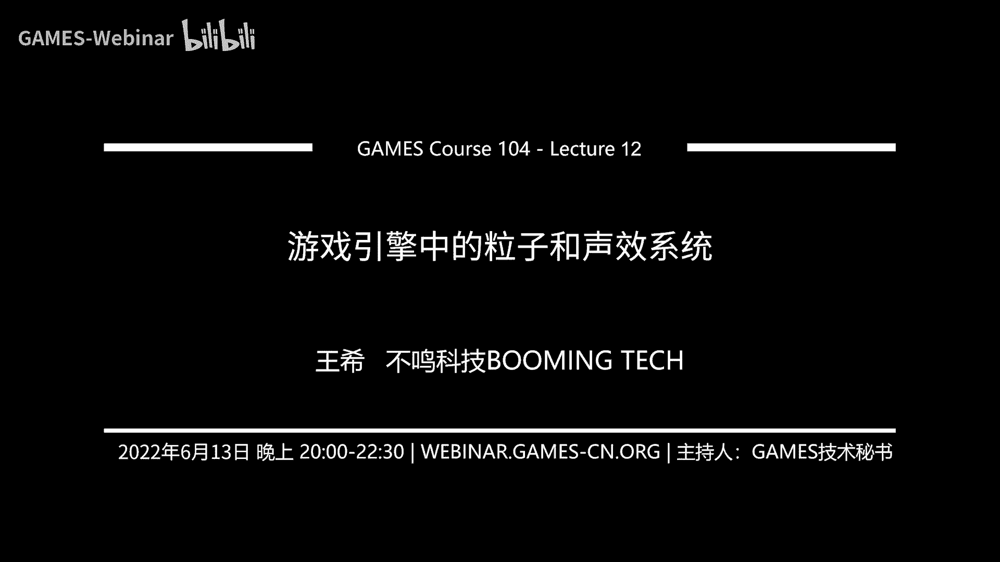
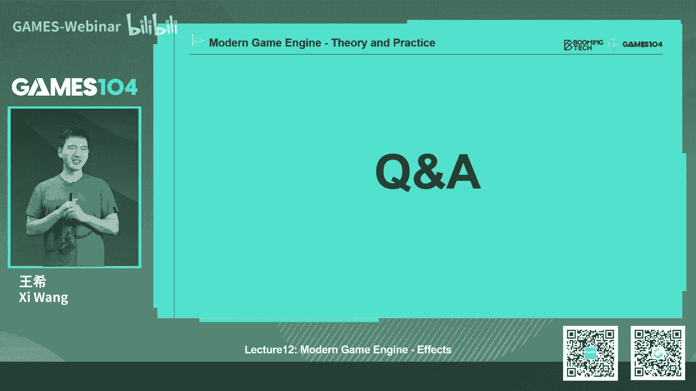

# 课程12：游戏引擎中的粒子和声效系统 🎮 | GAMES104-现代游戏引擎：从入门到实践

在本节课中，我们将学习游戏引擎中两个至关重要的特效系统：粒子系统和声效系统。粒子系统负责创造游戏中各种视觉特效，如火焰、烟雾和爆炸；而声效系统则构建了游戏世界的听觉体验，直接影响玩家的沉浸感和情绪。我们将从基础概念入手，逐步深入到现代引擎中的实现原理与技术挑战。

## 粒子系统基础

上一节我们概述了本课程的主要内容，本节中我们来看看粒子系统的基础构成。粒子系统是游戏视觉表现力的核心，它通过模拟大量微小粒子（Particle）的行为来创造复杂的视觉效果。

一个粒子是系统中最基础的构建元素，可以理解为空间中的一个点或小面片。每个粒子都拥有一系列随时间变化的属性。

以下是粒子的核心属性：
*   **位置**：粒子在三维空间中的坐标。
*   **速度**：粒子运动的方向和速率。
*   **尺寸**：粒子的大小。
*   **颜色**：粒子的颜色，通常可以随时间变化。
*   **生命周期**：粒子从产生到消亡的持续时间。

粒子由发射器（Emitter）产生。发射器定义了粒子产生的源头和初始状态。

以下是发射器的常见功能：
*   **生成位置**：可以是一个点、一个区域（如立方体、球体）或从一个模型表面采样。
*   **初始属性**：为生成的粒子赋予初始位置、速度、尺寸等，这些值通常可以加入随机性以显得自然。
*   **发射模式**：可以是连续喷射，也可以是周期性爆发。

多个发射器及其产生的所有粒子共同构成了一个粒子系统（Particle System）。一个复杂的视觉效果（如火焰）通常由多个不同类型的粒子系统组合而成，例如同时表现火焰主体、飞溅的火星和产生的烟雾。

## 粒子的模拟与渲染

了解了粒子的基础构成后，本节中我们来看看粒子在生命周期内是如何被模拟和最终绘制到屏幕上的。粒子被发射后，其运动和行为由模拟（Simulation）过程控制。

模拟过程根据物理规律（或艺术化规则）更新每个粒子的状态。粒子在模拟中会受到各种力的影响。

以下是影响粒子的常见作用力：
*   **重力**：使粒子向下加速。
*   **空气阻力**：减缓粒子的运动。
*   **风力**：为粒子提供方向性的推动力。

除了位置和速度，模拟过程还会更新粒子的其他视觉属性，如颜色、尺寸和旋转，以模拟如火焰由红变亮再变暗的效果。

粒子在屏幕上需要被渲染出来。最常见的粒子形态是公告板（Billboard），即一个始终面向摄像机的四边形面片。为了避免玩家注意到面片始终朝向相机，通常会使用动态变化的纹理。

除了公告板，粒子还可以有其他形态。

以下是常见的粒子渲染形态：
*   **网格粒子**：使用三维模型作为粒子，适合表现碎片、人群等。
*   ** ribbon粒子**：粒子运动轨迹会拖拽出一条光带，适合表现刀光、弹道轨迹等。其路径通常使用Catmull-Rom样条曲线进行平滑插值。

粒子渲染面临两大核心挑战：排序和性能。由于粒子大多是半透明物体，必须按照从远到近的顺序绘制才能得到正确的混合效果。全局排序效果最好但计算量大；按发射器排序效率高，但可能在不同发射器的粒子交错时产生错误。

粒子系统极易造成过度绘制（Overdraw），即同一个像素被多次绘制，严重消耗性能。常见的优化手段包括使用半分辨率渲染粒子，以及根据粒子与相机的距离进行裁剪。

## 现代GPU粒子系统

上一节我们讨论了CPU粒子系统的挑战，本节中我们来看看如何利用GPU的强大并行计算能力来高效实现粒子系统。将粒子模拟移至GPU可以极大提升性能，特别适合处理海量粒子。

GPU粒子系统的核心思想是使用一个固定大小的粒子池（Particle Pool）和两个列表来管理粒子状态。

以下是GPU粒子管理的关键数据结构：
*   **粒子池**：一个存储所有粒子属性（位置、速度等）的数组，定义了系统可容纳的最大粒子数。
*   **存活列表**：一个列表，记录当前所有“活着”的粒子在粒子池中的索引。
*   **死亡列表**：一个列表，记录当前所有“空闲”（可复用）的粒子在粒子池中的索引。

其工作流程基于双缓冲和计算着色器（Compute Shader）。每一帧，计算着色器并行处理存活列表中的所有粒子：更新其属性，判断其是否死亡。将存活粒子写入新的存活列表，将死亡粒子的索引移回死亡列表。新粒子从死亡列表头部取出索引进行初始化。这个过程充分利用了GPU的并行特性。

在GPU上进行全局排序（Global Sorting）是一个关键且复杂的步骤。一种高效的GPU排序算法是归并排序（Merge Sort）的变种。其核心思想是将大数组排序分解为多个已排序小数组的合并。在GPU实现中，通过让每个元素在目标数组中反向查找自己应有的位置，可以保证写入的内存连续性，从而获得更高性能。

GPU粒子系统还能方便地实现基于屏幕空间深度缓冲（Screen-Space Depth Buffer）的简单碰撞检测，让粒子与场景几何体发生互动，而无需调用完整的物理引擎。

## 粒子系统的进阶应用

基础的粒子系统已经能创造丰富效果，但现代游戏引擎中的粒子系统已演变得极为复杂和强大。粒子系统不再局限于简单的运动模拟，而是可以集成状态机、动画甚至群体行为模拟。

一个高级应用是使用粒子系统来模拟人群（Crowd Simulation）。每个粒子代表一个角色，拥有一个简化的骨骼动画状态机。所有可能的动画姿势被烘焙成纹理。每个粒子根据其状态（行走、奔跑、闲置）从纹理中采样对应的姿势进行渲染，并通过一个预计算的方向场（Directional Field）来引导群体沿路径移动并避开障碍物。

现代粒子系统（如虚幻引擎的Niagara）提供了高度可视化和可编程的框架，允许特效美术师通过节点图灵活地控制每一个粒子的行为、与其他系统的交互以及复杂的生成逻辑。这使得粒子系统能够实现诸如物体聚散变形、与场景深度交互等电影级特效。

## 声效系统基础

讲完了视觉上的粒子系统，本节我们转向构建游戏世界听觉体验的声效系统。声音对于游戏的沉浸感、情绪引导和玩法都至关重要，其影响甚至比画面更为直接和本能。

声音有三个基本的物理属性，对应人的听觉感知。

以下是声音的核心属性：
*   **音量**：人耳感知的声音强弱，由声波的振幅决定。其单位分贝（dB）是一个对数标度，`L = 20 * log10(P / P0)`，其中P是声压，P0是参考声压（约20微帕）。
*   **音高**：人耳感知的声音高低，由声波的频率决定。人耳可听范围约为20Hz到20kHz。
*   **音色**：由声波的具体波形决定，即使音高和音量相同，不同乐器或声源的声音也不同，这是因为它们包含的谐波成分不同。

计算机通过脉冲编码调制（PCM）将连续的模拟声音信号数字化。根据香农采样定理，采样频率至少需为声音最高频率的两倍（如44.1kHz）。采样后的振幅值被量化为固定位深（如16-bit）的数字进行存储和编码。游戏常用有损压缩格式（如OGG Vorbis）来节省资源，因其无专利限制且支持多声道。

## 三维声效渲染

在三维游戏世界中，声音需要根据声源和听者的相对位置进行动态渲染，以营造空间感。这个过程称为音频渲染（Audio Rendering）。

听者（Listener）是音频渲染的“观察点”，通常附着在玩家角色或相机上。听者具有位置、朝向和速度（用于多普勒效应）等属性。

空间感主要通过以下三种线索营造：
*   **声强差**：距离声源较近的耳朵听到的声音更大。
*   **时间差**：声音到达双耳有微小的时间差。
*   **音色差**：声音在传播中，特别是绕过头部时，不同频率成分衰减不同。

声像定位（Panning）算法通过调整左右声道的音量、延迟和均衡，模拟声源在水平方向上的移动。为了保持移动过程中总响度感知不变，常使用三角函数进行归一化：`左声道增益 = sin(θ)， 右声道增益 = cos(θ)`，其中θ是声源相对于正前方的角度。

衰减（Attenuation）模拟声音随距离减弱的效果。它不仅改变总体音量，还会根据距离调整高低频的比例（空气对高频吸收更强），这对于判断枪声远近等玩法至关重要。衰减区域可以定义为球形、胶囊体（模拟溪流）或锥形（模拟喇叭），以匹配不同声源特性。

## 环境声学与高级概念

上一节介绍了基础的3D声音定位，本节我们探讨更复杂的环境声学效果，它们对于塑造空间的真实感极为关键。声音在环境中传播时，会与物体和空间结构发生复杂的相互作用。

混响（Reverb）是塑造空间感最重要的效果之一。它由直达声、早期反射和后期混响尾音构成。在音频引擎中，混响常用几个关键参数供设计师调节。

以下是混响的核心控制参数：
*   **干湿比**：直达声（干）与混响声（湿）的比例。
*   **衰减时间**：声音衰减60分贝所需的时间，与空间大小和材质相关。
*   **预延迟**：直达声与第一次反射声之间的时间差。
*   **高频衰减**：控制混响中高频成分的衰减速度。

遮挡（Occlusion）和衍射（Diffraction）处理声音被障碍物阻挡和绕射的效果。简单实现可以通过从声源到听者发射射线进行检测，并根据材质属性过滤特定频率。更精确的模拟则需要复杂的声学追踪计算。

多普勒效应（Doppler Effect）模拟因听者与声源相对运动而导致的音高变化。当声源朝向听者运动时，听到的音调变高；远离时音调变低。其频率变化公式为：`f‘ = f * (v + vo) / (v + vs)`，其中f为原频率，v为声速，vo为听者速度，vs为声源速度。

现代大型游戏（如开放世界）需要管理成千上万个环境声源，并动态计算不同区域的混响属性。这通常依赖音频中间件（如Wwise、FMOD）提供的强大工具链和运行时库，它们为声音设计师提供了图形化的工作流程，并与游戏引擎深度集成。

## 总结

本节课中，我们一起学习了游戏引擎中两大核心特效系统。我们从粒子系统的基本概念出发，了解了粒子、发射器和系统的构成，探讨了模拟、渲染的挑战以及CPU和GPU的不同实现方案，并看到了现代粒子系统在群体模拟和电影化特效方面的强大能力。

在声效系统部分，我们学习了声音的物理基础与数字化，深入探讨了如何在三维空间中渲染声音，包括声像定位、衰减、混响、遮挡和多普勒效应等关键技术，这些共同构建了令人信服的听觉空间。

粒子与声效系统虽然一个主视觉、一个主听觉，但在游戏体验中紧密配合，是创造沉浸感不可或缺的支柱。它们的发展也体现了游戏引擎技术在追求极致表现力与运行效率之间的不断平衡与创新。

