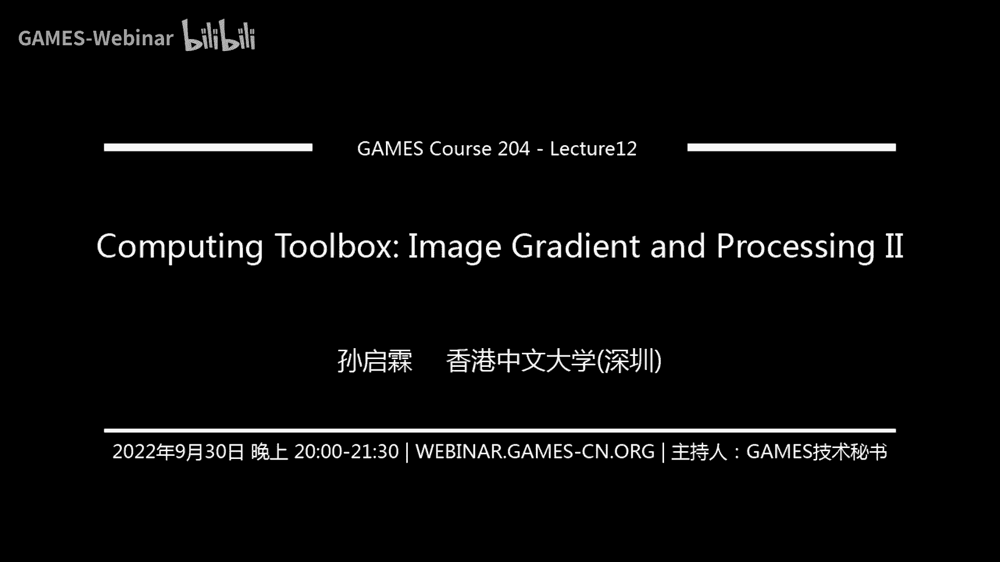

# 12.计算工具箱：成像梯度与处理 II ｜ GAMES204-计算成像 - P1 - GAMES-Webinar - BV1BP411E7sw

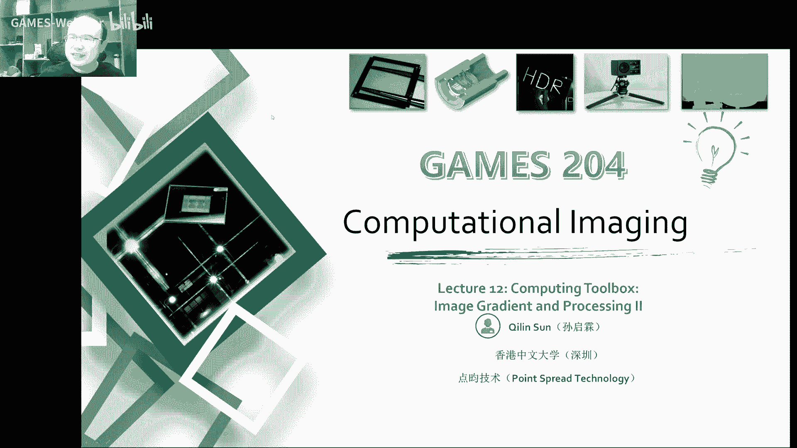

## 概述

在本节课中，我们将继续探讨计算成像中的成像梯度与处理。我们将深入探讨图像梯度、图像稀疏性、共轭梯度法以及图像编辑等主题。

## 图像梯度

图像梯度是图像中像素值变化率的一种度量。它可以帮助我们理解图像中的边缘和纹理信息。

**公式**：

$$
\text{梯度} = \left( \frac{\partial I}{\partial x}, \frac{\partial I}{\partial y} \right)
$$

其中，$I$ 表示图像，$x$ 和 $y$ 分别表示图像的横纵坐标。

## 图像稀疏性

图像稀疏性是指图像中大部分像素值都为零或接近零的性质。这种性质可以帮助我们有效地进行图像处理。

**公式**：

$$
\text{稀疏性} = \frac{\text{非零像素数}}{\text{总像素数}}
$$

## 共轭梯度法

共轭梯度法是一种用于求解线性方程组的迭代方法。它可以帮助我们快速地找到图像梯度下降的最优解。

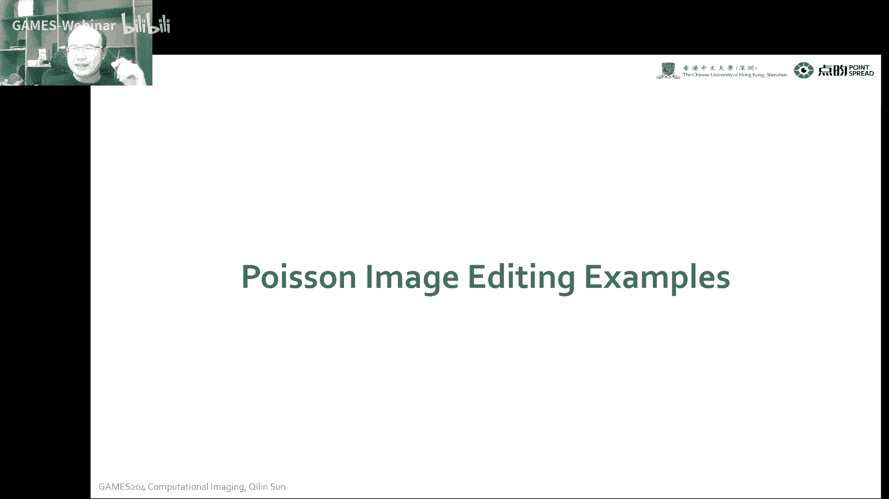

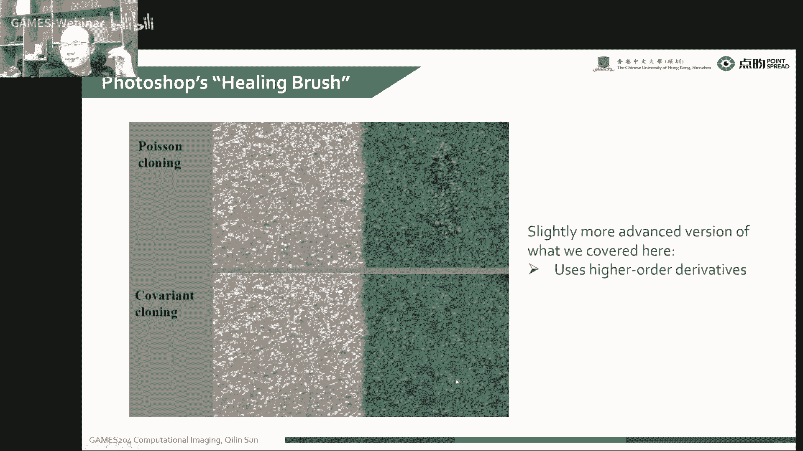

**公式**：

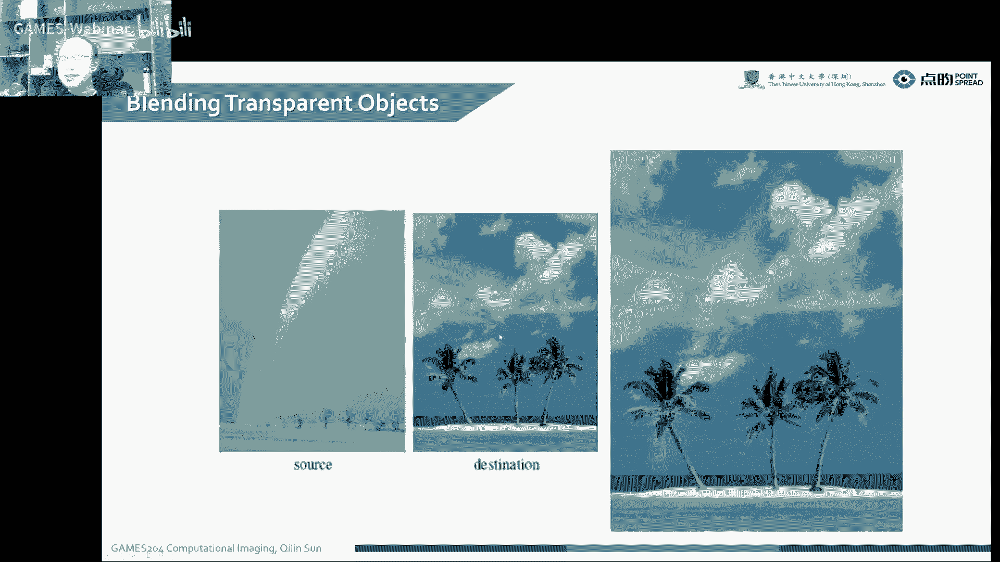

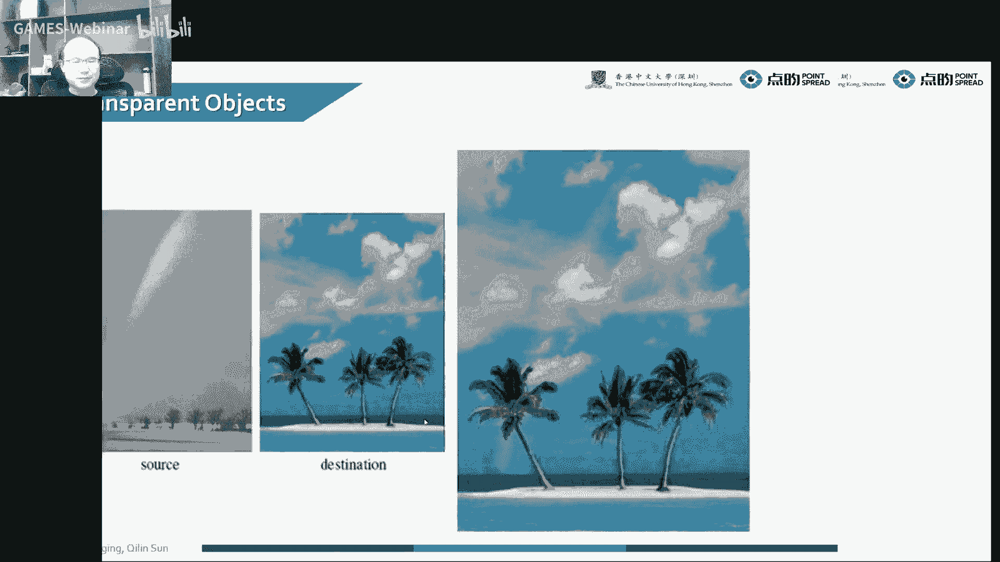

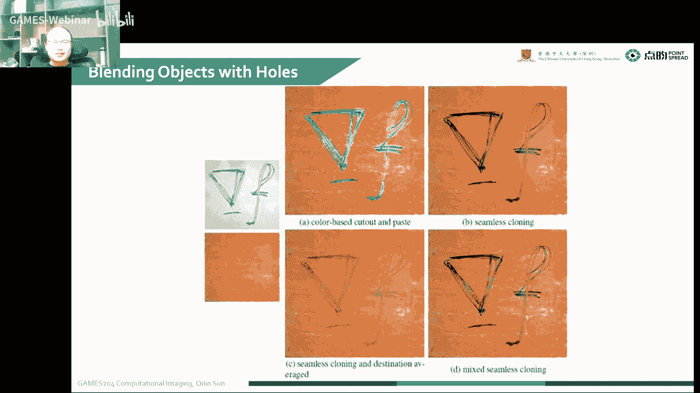

$$
x_{k+1} = x_k - \alpha_k A^T (A x_k - b)
$$

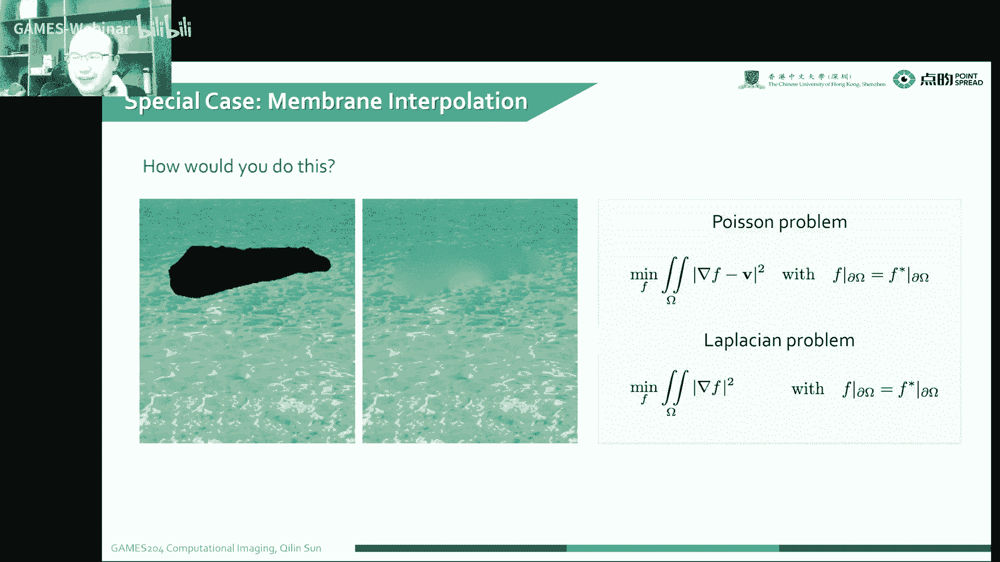

其中，$x_k$ 表示第 $k$ 次迭代的解，$A$ 表示系数矩阵，$b$ 表示常数向量，$\alpha_k$ 表示步长。

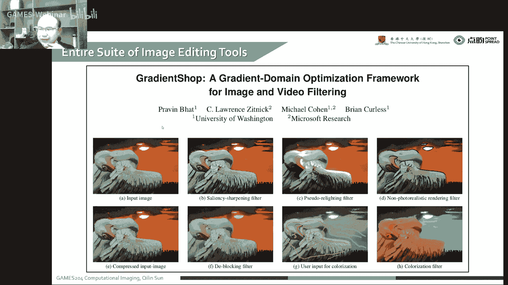

## 图像编辑

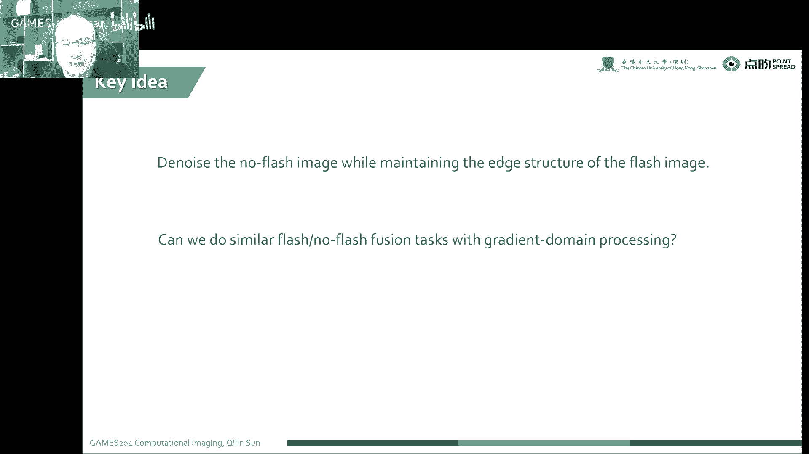

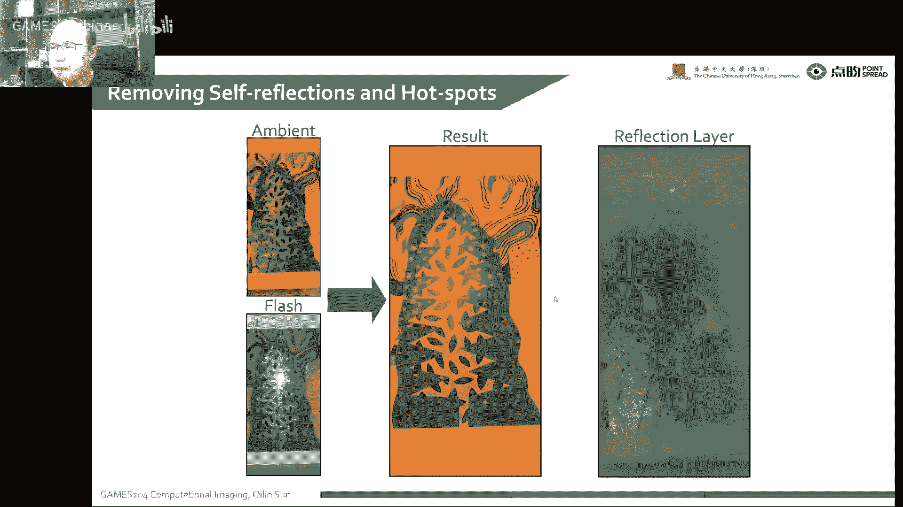

图像编辑是指对图像进行修改和增强的过程。我们可以使用图像梯度、图像稀疏性和共轭梯度法来实现各种图像编辑任务。

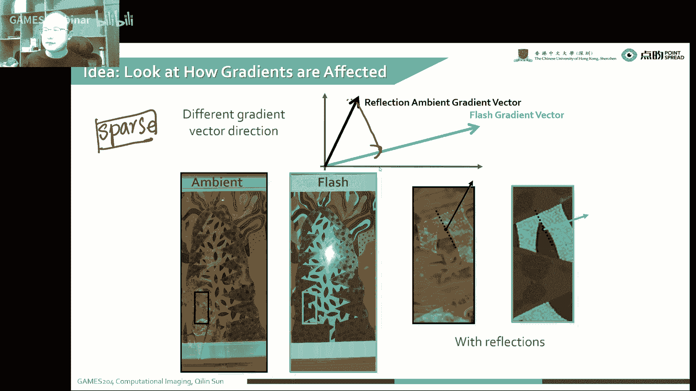

### 修复刷子

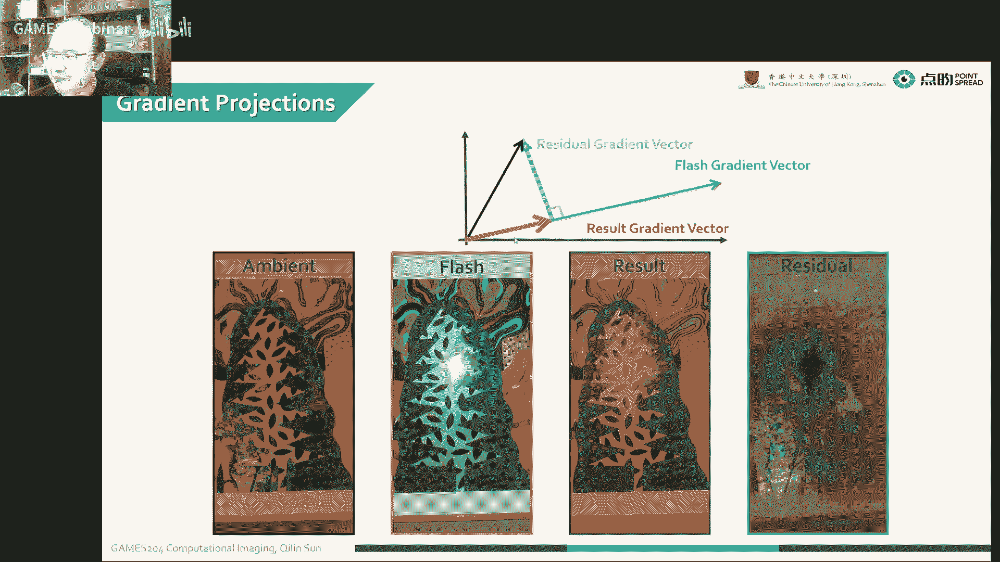

修复刷子是一种用于修复图像中损坏区域的工具。它可以使用图像梯度来找到相似区域，并将它们复制到损坏区域。

### 克隆工具

克隆工具是一种用于复制图像中特定区域的工具。它可以使用图像梯度来找到相似区域，并将它们复制到目标区域。

### 锐化工具

锐化工具是一种用于增强图像中边缘和纹理的工具。它可以使用图像梯度来找到边缘信息，并将其增强。

## 总结

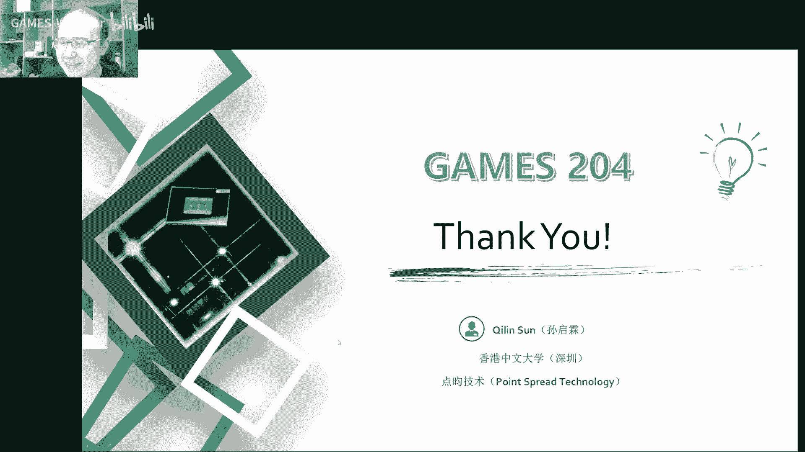

在本节课中，我们学习了图像梯度、图像稀疏性、共轭梯度法和图像编辑等主题。这些知识可以帮助我们更好地理解计算成像，并实现各种图像处理任务。