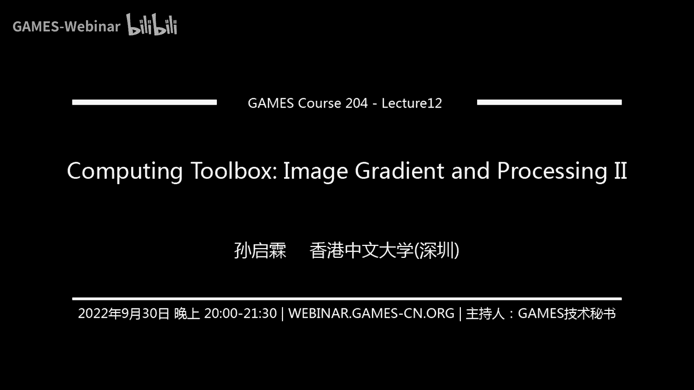
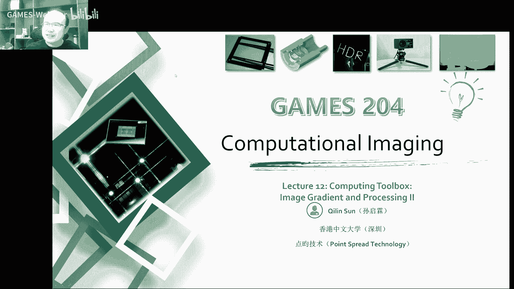
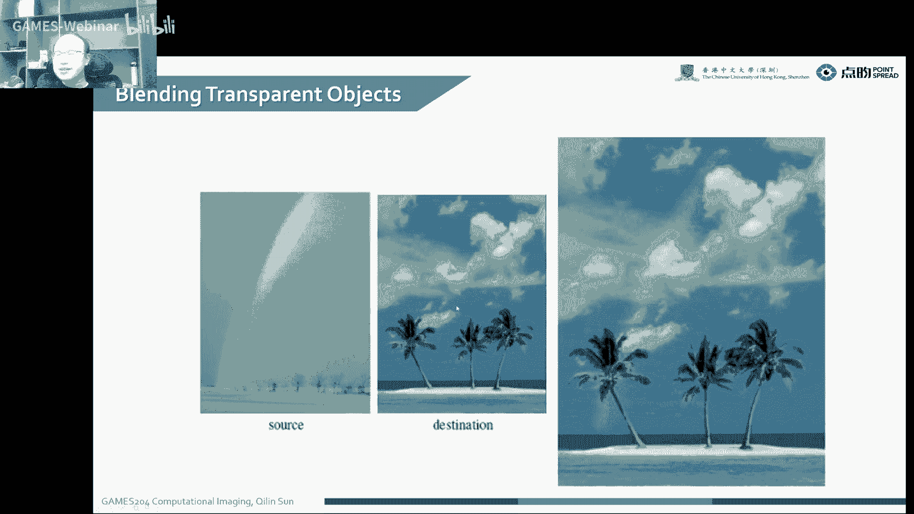
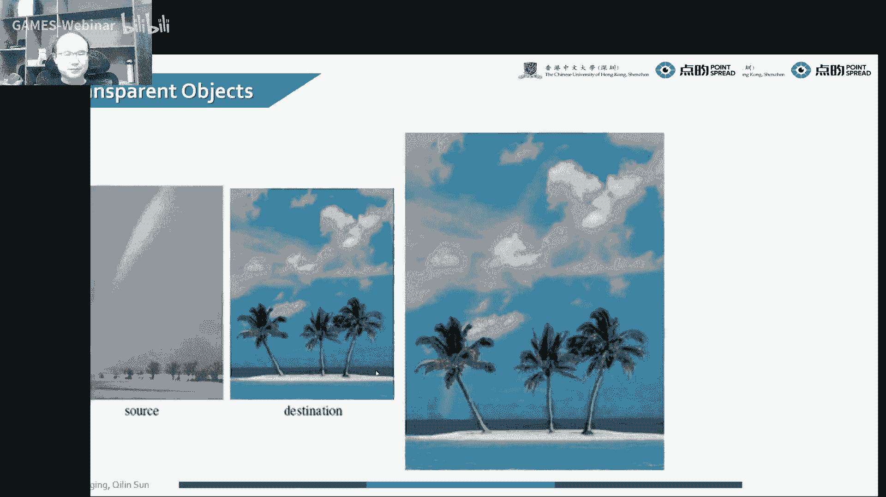
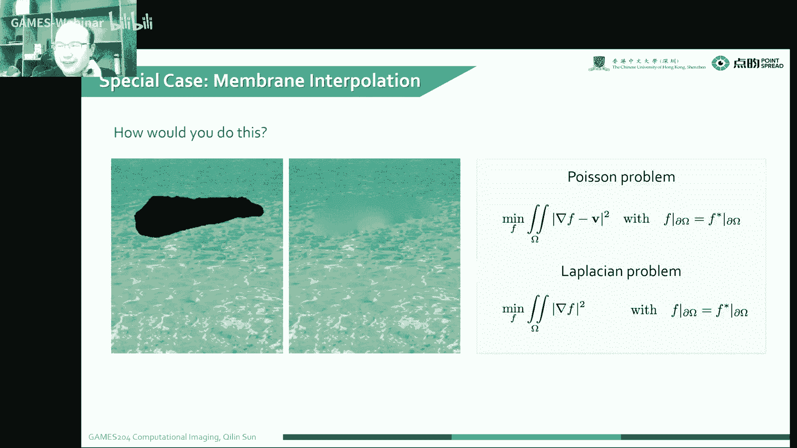
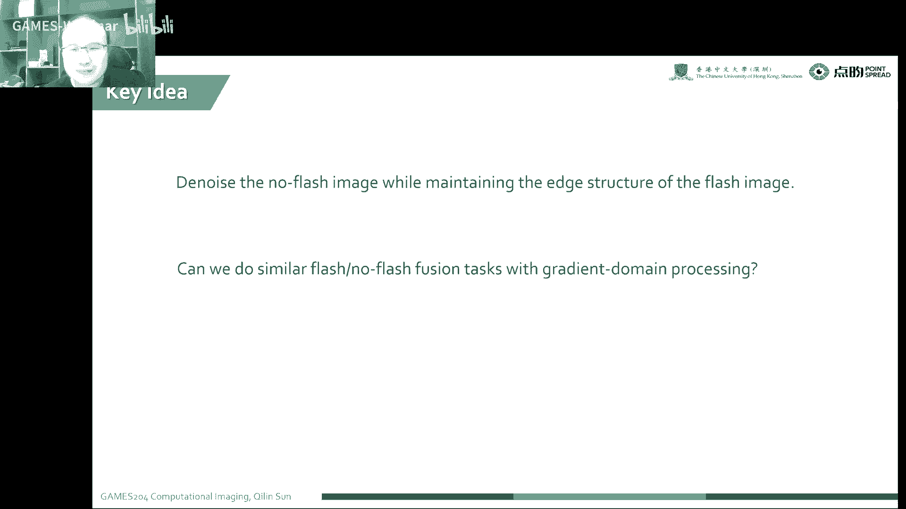
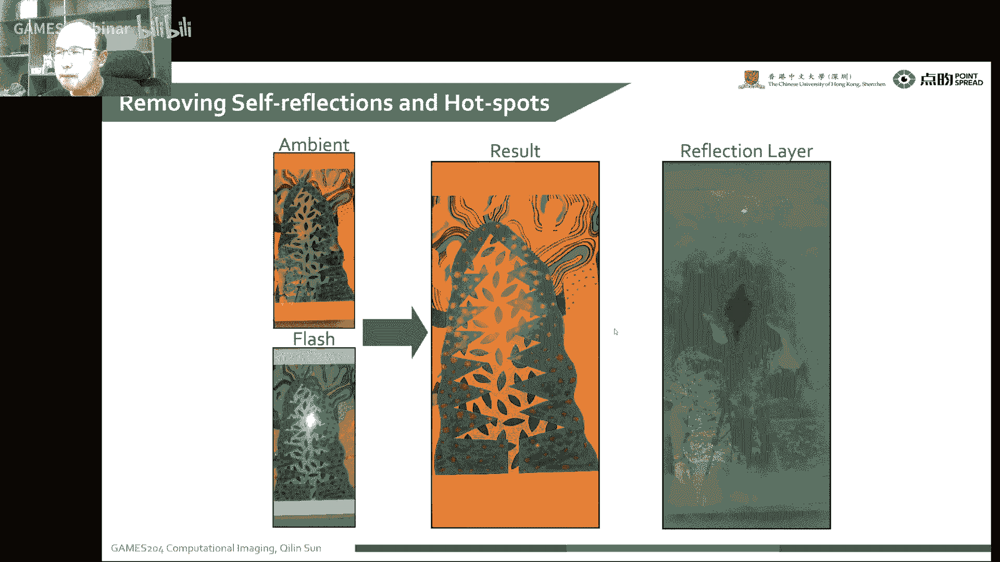
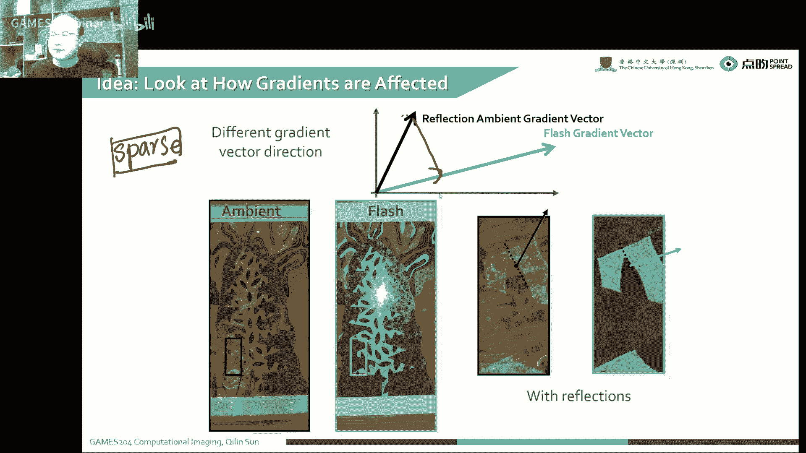

# 12.计算工具箱：成像梯度与处理 II ｜ GAMES204-计算成像 - P1 - GAMES-Webinar - BV1BP411E7sw

嗨同学们，大家好好了，欢迎来到games 204，那同学们久等了，今天要给大家分享的一个是，就是上一期上一节课的续集，也就是image鬼点子，你们这gradient呢，本身是一个有非常神奇的性质。

就是我们刚才之前讲到了一个破损，不容扩充混合的一个问题，图上长出来，就是我们后面想要的那张图，这个就跟以前传统的一些图像拼接呀，就会有一些非常大的有效的提升，我们基本上是看不到。

就是我们最后图像上看到是什么情况，比如说呃像以前大家很多就做photoshop的同学，喜欢ps photoshop，photoshop哎，就用到了非常多的一些呃破损不ending。

或者是呃一些新的一些bendy的一些方式，这个基本上很多都是基于规定的去做的，所以说呃这个image gradient，它是对图像融合呀，或者是是一个非常大的一个帮助的，当然除此之外。

因为这鬼点本身还有自己的性质，比如说它的一个sparity，今天我们会讲到一个呃，就是关于图像sparity的一个性质的分析，也就是说我们什么叫spars呢，这种这个图像里面它的规定大部分都是零。

就是边缘占整个整体像素数的时候是，非常小的一个比例，所以说呃，最后我们通过这个spy给它做一个约束，我们做很多计算摄影逆问题的时候，就会有一个呃更好的一个效果吧，嗯这个想想要不要给大家布置一次作业。

关于这个研究的规定，可以的啊，上一节课最后是讲到了，我们讲到一个图像的，一个autoptimization的问题啊，在比较简单啊，但是与以前我们像学数学，我们现在是对于整张大图去做它的一个list。

我们看到了上上节课一个呃，像一个一个大的一个拉普拉斯的一个matrix，就表示啊这个图图像的这个鬼点子，但今天我们会看到，要实现这么大一个规定呢，是你大v rix就是m n乘m n的一个超。

大的一个冰水比这个是不太现实，所以我们就可以用考ution的方式，来快速的实现啊，我们这个matrix的功能，就是，我们最后无论是从写这个东西，到最后去实现它。

我们都可以用conclusion来来替代它，牛顿法，但今天会给大家讲到一个就共轭梯度法，共轭梯度法就我们有很多问题啊，就是最后我们归结为，就形成一个a x减b的一个问题，x减b等于零二。

也就是a x等于b诶，我们解这个方法，其实就像刚才讲的那几种方法一样，这个时候是我们一个摄影或者是，推行学里面就比如说求焦点呀，也是求解一个ax等于b的问题，就是我们计算机里面。

做了一个非常多的一个工作，今天要给大家继续讲解这个computing toolbox，就是image gradient and processing，然后第二讲。

再次欢迎同学们来到gains 204的课堂。

上节课我们已经把这个整个破风的过程，列出来了，但是我们并没有一个很好的一个server，去快速解，这个最后一个ax等于b的问题啊，虽然说我们最后不是a x，但是它是一个呃可以写成这种形式。

然后呢解完这个pal server，就是这个pbi的基本问题，我们去解决啊，考虑这个vication解决完之后它有哪些用途呢，比如说像psl image editor啊。

今天还会给大家晒一个非常有意思的一个，topic的，就是一个flash is not flash的photography，它的融合怎么样去除反射，这个是一个非常简单的方法。

就是我不知道现在有些手机厂家也没有，把这个用上，当，我们考虑这个背景环境跟这个flash的一些呃，打打出来flash，这两张图我们就可以很好的融合出一张啊，非常好看的一个图啊，就把这个反射呀。

还有这个那就是它本身有一个亮点，过曝了一个点给去掉，所以这个在flash ptograp里面会经常用到，那最后给大家科普一下，现在的一个规定的camera，还有在光学端，还有在一个时间域去做一个低分手。

当然时间域可能大家也会听说的比较多啊，在时间域的一个低分数呃，通常就是叫event camera，有时候也叫dynamic vation，叫dvs，首先要给大家讲解的是一个有效的一个，扩充求解器本身哈。

这个玩意儿还是呃在求解一个线性的一个，逆问题吧，但是怎么解的呢，就我们上节课啊，我们知道我们要想对这一个变分的，一个问题啊，就是我们想minimize啊，这个target f跟我就是就我这个tp。

就是我们target的目标图像的规定，跟我们这个v，他们就是不就是本身的这个，lion的一个规定，让他们相在我们的一个利用区域内相符合，然后呢同时也要满足这个边界条件。

就说怎么样去minimize他们之间的一个差，然后又要考虑他这个bd condition，就我们，知道这个madf，实际上就是对xy方向分别求偏导，对不对，然后呢，嗯我们要把这个我们知道这个nf。

在x y方向分别求偏导的时候，呃，我们也是可以用一个x y方向的一个future，就是一-1或者是y方向的一-1，这么一个future做一个conclusion。

来去替代这么一个大型的一个liniqua，实际上它是非常简单的一个算子，然后呢，就是当我们面临，就是我们要求解我们的图像诶，我们这个f啊是我们的目标图像，然后我们把这个上面这个公式就上一页。

这个公式拉姆达f减低，也就是这个时候让他等一个，实际上就是minimize诶，然后是呃这么一个不f减b这么一个情况，对不对，然后这个时候这个g黑f跟v，分别代表着什么呢，大家可以思考一下哈，这个g啊。

这时候f啊我们都考虑抽象的函数f，我们可以不用管它这个f到底是什么形式，在这个时候，我们f的这个时候是一张图像，f是一个图像，这个g呢，实际上我们知道g是对f两个方向，分别求偏导诶。

这个时候我不想用这个大型的linux来表示，我们就可以用一个aerator的形式，也就是我们xy方向的一个conclusion，来表示他对f去规定子v呢，它还还当然还是他自己这个g。

这个时候就变成一个对xy方向分别求规，定成一个procreate，那我们这个时候我们要解决这个问题，我们先把这个先不考虑这个帮助condition，你考虑帮助ming会稍微复杂一些。

我们先教大家怎么求解，这么一个线性的一个优化问题，就是一个凸的一个to的二阶的作，无论是它高级的维度，它本质无论它的维度是有多高啊，它本质上都是一样的，像我们这个要再说白一点哈，这个就是一个二次方程诶。

我们就可以用一个gradient的一个，decent的一个方式来解，那么一个二阶的方程，下面来给大家share一下，这个方法到底是什么呢，是吧，大家可以看到这个g啊，实际上就是聚在一起的。

一个就是差离散的一个鬼点子，我们就可以在x y方向分别用一-1，这么一个fter来表示，那f呢是我们最后要求的一个呃图，在它的一个xy gradient，就是一个我们未知的那个。

tv mage的一个规定，我们要优化的呢就是我们winner，就是我们实际上in source image gradient，这个大家就比较好理解了，怎么样解决这个呃优化的问题呢。

就我们知道我们可以把这整个的一个cost，function有时候也叫loss function啊，这个呃有时候被大家叫成cost function，或者是target cofunction。

我们用它用e f呃，它是什么的方程呢，就是g也就相当于这个拉布拉，然后我们用一个composition fifter来表示，v就是xy，就是呃g在x y方向分别求偏导，我们要想简单一点形式，像这么一个。

哪怕他就是你，你想只只想让他这个抽象的一个形式啊，我们对它求偏导，对x求偏导，然后让它等于零，不就是极值呢，那这个地方肯定是的，因为我们这个很明显，它这个gf减v的平方啊，它是一个凸函数。

无论是它有多少维度，它是一个凸的凸的意味着啥呢，它总有总能找到一个最优解，当然这个时候他只有一个最优解的时候啊，又没有local，又没有一个局部的极小值，极大值，哎我们这个时候对他对f求助链等。

然后让它等于零，诶这个时候就是它有直直的位置，对不对，然后我们就可以诶很轻松的求解，这个这个是怎么过审的呢，实际上就是记p gf减六对吧，我们先对外面那一层，下面最外面那一层让他等一个零。

理论上这个应该是写个1/2哈，这个比如说大家因为让他等于零了，大家有时候也不考虑这个前面有没有系数，就说这个就让它等于零，实际上就可以写成这么一个形式，让它等于零呢，我们就得到呃，我们要解这么一个方程。

就把这个呃，我们最后想要求解它给f表示出来，实际上我们可以看到哈，这个gt g等一个gt 6，对不对，我们f很明显是不是g t g transports呃，这个就是它的一个逆那个gt没有。

就是最后的结果，当然这个时候如果这么求解的话，我们要一定要保证啊，这个g是一个满志的一个matrix，要不然他那个解空间会稍微大一些，就不是唯一解，但是有的时候我们要解那么一个，线性能力问题啊。

就是像我们知道从上一节指导，我们这个g本身，它就是一个m乘n的平方的，一个超大的一个vector，就我们把一个m m n，mmn乘m n的一个大图拍成一个长条，拍成一个vector，诶。

这是有有一个可能是chinese of parameters，然后这个这么大一个没法算诶，没发散咋办呢，我聪明的人们就想用鬼点底线的方式，我们不需要算他，这个就最后的一个前面的一个matrix是啥。

我们用一些算子的方式，或者conution的方式哎，来把这个大型的一个线性计算，转化成一个卷积的形，式，这个时候诶剪辑大家对一个大家计算机啊，cpu也是比较友好的，诶这个时候就可以很大的提高效率。

这个鬼脸descent是咋玩的，同样的，我们对这个run的e，对那个我们的一个loss function求对f求偏导，诶我们这个时候，我们为了简便计算啊，就把这个gt g表示成一个matrix a对吧。

它是一个g本身，g本身是一个对mn乘m的一个大matrix，哎不管了，这个实际上就是operator诶，这个时候a实际上就是一个，拉普拉斯的一个operator啊，这可以3x3的一个看不出是哎。

这个时候大家都变得非常舒服，非常少对吧，然后把这个g t m它就是一个常数，我们把它记成b，首先把它切成b是，所以说最后哎，我们就把这个整个写成一个，a f减b的一个形式，然后呢。

我们的这个r这af减b，就是他如果不是在极值点的时候，这个时候，然后为什么加了个负号呢，因为它是离极值点的一个距离，所以说我们加了一个负号在这唉，我的每步的目标是啥呢。

就是让我们这个要求的这个f什么要mini的，这个f对要求的f每一步规定，第三就是每一步更接近f的这个极值，也就是我们想要用这个迭代的方式，然后他每一步哎加上这个residual，让它更接近它的一个机制。

所以我们就用一个迭代，就是f第n加一步，等一个f d n步加上一个step size，就是一个步长，然后再加上一个dn的recedu，然后这个步长选起来，是有非常多的一个问题啊，这个大家会给大家呃。

待会给大家讲一个最优的补偿，但理论上就最简单最简单的一个情况下，但考虑到一个一元二次方程对吧，这个是ef还有一个f的方程，我们在这个时候bf，然后我们直接咳咳咳，让这个德尔塔一塔就在这个时候。

那就找到这几点了，对不对，所以待会可以给大家讲，这个最佳的补偿是怎么找的，我们通过这么几次迭代，当我们这个recedure小于一个switch后的时候，诶这个时候我们就可以理解为。

这个就这个优化它收敛了，就收敛到一个呃我们想要的一个地方，就它跟我们的一个想要的一个f，它这个值就很接近了，大家就可以理解为它是最后的结果，然后怎么样去找到这个最优的补偿呢是吧，刚才我们看到d就是ef。

它实际上它就是gf减六，但是呢就是对他f加一步，我们用这个fi来替代它，这个时候我们可以观察到对f加一个step，这个e的函e的函数，实际上它是一个关于这个步长的一个函数。

我们就可以啊对这个不长进行优化，当然我们知道如果对这个步长求偏导，让它等于零，他就会找到一个极值，那这个极值是啥呢，为什么让他的这个极值就让它的规定，对一塔的一个求偏导的一个呃，让它值等于零呢。

这个时候我们就可以拿到最佳的波长呢，这个还是从一个简单的一个，一元二次函数来说起，就这个大家有时候会这个地方会很抽象，就是我们为什么对这个一塔对不长求偏导，然后让他等于零，就可以拿到一个最佳的不长。

其实大家这个时候有点迷迷糊糊，又觉得有点道理，又又不是很明白这个道理是啥，对不对，然后呢就随便画一个e s函数，实际上还是e f对吧，然后这个地方就是f，然后我们这这个点哈e fi，然后fi这个点对吧。

然后我们要求这个fi加一的时候，诶这个地方是fi哈，这个就是eti乘以这个receipt本身，这个receipt离知识点就是这个i i，对不对，实际上就是哎我们给它一个微小的变化。

这个一塔i给他来个小小的一个德尔塔，微小的变化，这个是趋于一个是一个小值的，我们发现如果在这些地方，我们这个不长变化一点点小值，我们发现这个德尔塔fi，实际上是对这个一塔求偏导的时候。

它是一个比较大的值的，对不对，但是我们发现在这个极值点，大家观察一下，这个你run e f i加一个g比这个，但是按本身这个地方，我们首先这个是不是已经趋于零了对吧，e f i这个地方在极值点哈。

这两个就是说在极值点左右，这个就就是零啊，它就等于零啊，就不用那个它就等于零，那你也不用管分母了，所以说就是一塔在对一塔求偏导的时候，a让它等于零，也就是这个就是最佳的弧长的一个位置。

知识点就记得他在家里不常规，所以说它很高维度的情况下也同样适用，然后我们呃，用一个二次函数来给大家画出来，会让大家更容易理解一些，啊同样的就是我们对这个解这个规定，descent的时候。

我们就可以通过这么一种迭代的方式，来把它解出来，最后我们pf的一个resgo，之前有个负号码，第able接口就是b减去一个一个a f i，然后这个一塔呢最优的不长啊。

就是d i d i x就是做transport，然后比上个r a，然后底下呢也是同样带一个a，这么一个相同的，然后呢在最佳步长求出来之后，我们呃这个d i加e f i加一步，就可以通过f加上一个步长乘。

加上他的c格，来逐渐逼近，我们最终一个想要的一个tx的值，这么做有什么好处呢，大家想一想，我做这个鬼点decent的时候有什么好处，这实际上我们这个a啊，这个a实际上这个就是用g translg。

我们这个时候实际上是表示，一个拉普拉斯的一个，就是这么一个，卷积它变成一个operator，你把它当成一个operator，不要把它当成mrx，就我们其实际上我们是对a啊，本身就没有任何操作。

本来它是一个m8 m乘n，然后乘以m乘以一个超大的一个矩阵，那这个时候我们用这种迭代的方式，这根本就没有算法，哎，我们实际上操作的就只有一个，拉普拉斯的卷积，对不对，然后我们要算的是啥呢。

实际上只是or receire，这个vector，跟我们最后他给的这个图像的一个大概，百分一，把这个图像开成长条诶，我们只求了他们的一个矩阵相乘，这个效率是非常高的。

然后呢这个a它又是一个拉普拉斯matrix，你直接用一个卷积就把这个糊弄过去了，当然也不是糊弄，这是完全等效的，这个就非常快速的来，可以求解到我们最后想要的解，而不是求解一个非常大型的一个线性方程。

当然我们在实际应用中啊，我们还会有一些更加快速的一些求解器，叫ctrl quit，规定的这个叫共轭梯度法，同样是我们这么一个cost function ef，那么求解它的时候呢。

呃我们就需要一个rt的一个计算，就是我们啊在这个呃，这个怎么给大家解释呢，就是我从头给大家解释一下吧，这个本身哈我们嗯就定义一个，那我们就先说一个解一个ax，等于b的一个问题，解这么一个问题呢。

就我们这个时候就有时候，大家觉得求个呃规定的decent就不够快，诶我们这时候就可以构构建一个虚函数啊，就是嗯比如说，构建一个这么一个虚函数，fx，然后呢就等于一个啥呢，它是因为构建一个关于x的函数啊。

这个1/2的ex transports a，然后ax减去个b transfx，对不对，然后让它的一个对x偏导round fx，然后比上个round x组装一个a x减b对吧，我们要求诶这么一个东西出来。

诶这个时候我们去怎么求它呢，因为刚开始我们讲了一个鬼脸descent，实际上就是先求当前求导的一个位置，就是就是德尔塔f，就是求一个deltf sk等于一个位置，然后同时呢呃找一个最优的一个步长。

然后不断迭代，搞这么一个圈，一个迭代就最后拿到一个呃最后的结果了，但是呢我们还会有一个更快的一个方法，这个只要规定descent，就就讲这个供货梯度呢，就必须先给大家讲一讲，就是整个正交坐标系。

就是我们有一组向量p，然后p呢是有一个有一系列的这个小vector，组成了cn，然后里面任意一个任意的di跟dg个向量，也就是p i d跟pg对一个pi trl a p g，他就可以这个a是正定的哈。

a是a是正定的，就是他没有零值跟或者值它正定，它是一个正定矩阵，然后对这么一个正定矩阵a，我们在这一个这一组向量，p这一组向量里面，任意找两个这么两个向量诶，然后我p i transpose a。

然后pg等于零，然后呢我们就怎么定义呢，就是p这个大size，对a这么一个正定的一个矩阵是共，是就是叫共轭，当然我们要对一个这一个，高维的一个函数啊，高维的函数那也是一样的。

这个对于一个高维的函数来说呃，我们就可以把这个就是简单理解为，这个这个p这个sp里面，这些vector都是正交的，对这个呃大家遇到这个正交，就是一个它是一个正交完备系，细数它的一个正正在往内吸哎。

勒让德这个系数，热，让德这个那也是一个完备的，一个正交的一个系数空间，诶这个这个有点扯远了哈，大家给大家继续讲这个规定，desc，然后比如说像我们嗯其实最后这，个a啊，就是a的特征向量。

实际上就是就我们这个a啊，正面去正面的一个max它的一个特征，它的一个特征向量就是一组供货向量，就是一组这个叫供货向量，然后我们对这个fx，就我们把这个3x，其实是可以当成一些数啊。

我们从p0 这个点开始哈，从p0 这个点开始诶，p0 就等一个，对这个residual的一个值对吧，然后我们从p0 开始，然后再把p1 p2 ，p2 p n这个全都推出来，然后推出来啊。

到一个这么一个正交的一个完备的一个系，然后呢，我们就可以知道p一就等于一个啥呢，第一就等于一个看好，这个应该是等于一个负的ds x0 ，加上一个贝塔ip 0对吧，我们是正交的，然后，给他加一个偏移。

然后因为是正交嘛，然后应该p，乘一个a然后它的transport乘a，再乘以，那个，他最后应该得到的是一个零的这么一个解，然后因为他因为这个是pg等于零，我就从这个地方连开始，然后求一一开始求二。

对不对，这个时候嗯，就可以非常快速的去解出来这个，然后我们把这个p一啊，跟那个p0 同时带入这个matrix，诶，我们就可以把这个贝塔i给解出来，就是这是叫贝塔一，这是第一步，就等一个啥呢。

等一个它的分母p0 ，transpose a好，dfx x一就是x1 ，然后这个是p their transport a p0 ，诶这个系数也算出来了，我们就可以根据这样一步一步，如，何去迭代。

但我们最后写出来哈，实际上就是实际上就是这么一圈，对recedure，它的步长跟他recedure就是这么求出来的，当然这个是广告梯度，其实并不难哈，大家求的时候就是稍微注意一点，不要把公式写错就好了。

这个可能就matlab写，可能也就个五六毫，这个实际上这个是这是贝塔一哈，这个贝塔k的等于啥呢，贝塔k实际上就是等一个pk减一，transport a date，等着开，每一步都是这么过来的哈。

你这个时候算的时候还要注意一下奇偶性，这个有时候这个图像这个奇数，偶数可能会出问题，这个大家可能呃写代码的时候就会注意到，到时候会给大家讲一，就有遇到问题了，会给大家讲一下，这个不遇到问题。

这个我也讲不出来，然后呃这个然后讲了这么多呢，就是本身这个cfb的规定，那有啥好处呢，实际上这是我们每一步都去找他，一个最就是正交的，去找他一个最最大的一个梯度，下降一个位置，就我每每个每个p啊。

p1 p2 p3 p4 ，他对这个正定矩阵a都是一个正交的，我们在这个正交的一个情况下，就是始终去找他，他就一个点，因为这个时候就呃比较好，收敛到一个比较好的位置吧，就是一般好像过过梯度。

如果要不是发散哈，就是他会在n次迭代就收敛，他这个收敛速度还是呃比规范design呢，还是好很多的，所以说这个规定，这个ctrl t gradient，本身是大型的线性求解器里面啊。

就是通常使用的一种方法，当然大家在解这个后面的优化函数，里面也会用到，也会经常会用到这些风管记录法，我建议大家同学们回去之后，可以找一个写一段代码，稍微练一练，然后好应应对我们下一次的作业的来临。

当然我们像光梯度本身一个好处啊，但我们每一步也只是用了一个简单的卷积，并没有去上一些很复杂的一个大型星星，在这个计算，我们每一步呢也只需要呃，基本上就是一个iteration，就每就每。

个etivation只需要一个conclusion，那计算量也是比较呃小的，但我们为了更快速的求解，这个就ctrl这个鬼脸的一个线性求解，去密的不问题啊。

那这里面也建筑到了一个mate view的一个思想，就是大家学图形学的时候，肯定会学会mm是吧，实际上就是在像一个金字塔型的，就是不断下采样这么一个过程，就是我们每一步，对下一步初始化的一个值呢。

都可以建立在一个更小的分辨率的一个，结果上来去求解，比如说像我们这儿这第一步哈，诶我现在一个最小的分辨率，就像这么一个金字塔，诶我在现在一个最小的一个分辨率，先求一个解对吧，这个像素很少对啊。

比如说可能是呃，就1/256或1/512，这么一个小一个像素上，比上这是512的图，唉这就是256128 64 32，假设最小是32号，我们就先用这个32个图，然后来求解这么一个f诶。

这个然后再塞上采样，上采样到上一个阶段哈，到f64 哎，把这个上采样的值，当成对64x64的这么一个ctrl里，规定一个初始化的一个值，诶再来对上太阳一次，再把这个迭代几次，然后找到一个128。

只作为下一步的初始化的值，直到我们的原图，这个时候是因为它整个初始初始的一个值，更接近他呢，我们最后的一个目标值哎，这个时候我们就可以非常快速的一个，converge，就是也就收敛到我们想要的这么一个。

就是数据上，这个会让大家试一试吧，这个非常好玩的，用每一步初始化的时候就用上，就用一个law resolution的结果来去做初始化，这个到最后，我们的大图迭代次数就会变得非常少。

当然我们要先这个时候让大家回顾一下，我们整个的一个就变分的一个问题啊，我们这个扩散方程大，考虑到我们这个边缘的时候，我们除了求解这个本身，让它这个两个方向的规定是match之外。

我们还要考虑到这个bb的condition，比，较dh来帮助，condition，就是我们对这个precise情，就是先对这个做一个预处理啊，就我们要就解决这个af等于b的一个，现金的一个问题。

就是如果我们有一个可以e的一个直径，p对吧，但是我们对这一个可逆哈，这我们对这个p左左右两边，就a f等于b各成这么一个immortal matrix，p的一个逆啊，实际上它不影响这两个等式成立。

对不对，理想的情况下，我们这个这个理想的情况下，我们这个p啊跟a是一样的诶，这个时候就是a了，这个就变成一个identity matrix是吧，这个我们这个题就解出来了对吧。

这个但这个是很难遇到这种情况，我们一般也是不大可能直接遇到，这么好的情况，大家都都不用求解了，当然就说平时是遇到的，但实际上哈，如果我们想要的是这个p的逆乘，以a就是我们前面这么一块。

它有一个我们想要最后这个值更稳定，就是我们稳定了，对一个matrix稳定来说，实际上就是它的一个condition number更加稳定，也就是我们对应的一个，就其一直啊，就mhy对角线上。

所以说我们这个线性的系统就会变得一个，比较稳定了，就数值上会比较稳定，就是说我们想要用什么样的一个p值，来对这么一个线性函数来进行初始化呢，来进行预处理呢，所以说一个标准的一种玩法就是贾克比。

就是我们用这么一个甲克比，就是这个甲比呢，实际上是啊a的对角线这么一个值，因为对角线求你很容易嘛，这个就直接分之一就完了，所以说呢这是这是第一种玩法，当然还有更一些更有效的一些非抗毒性的。

大家可以试一试，所以说当然了，这个加了这个贾克比，等于这个对角线的时候也不一定是最好的，当然啊大家可以验证一下，就是做一些不一样的实验来证明一下，这个贾克比等于它对角线的时候，就a的对角线的时候诶。

它对整个的一个呃就是condition number，有没有让它更好，有没有，回到这个问题，就我们之前啊，这个matrix要解这么一个p乘p的matrix，一个是m乘n，这都是图啊，可能就是1k乘以k。

他们再乘以个1k乘以k这么一个图啊，好家伙，这个有这个elements太多了，大家不大好解这么一个东西，那边缘的地方大家要注意啊，边缘的地方大家最好拍进一下，或者是做一个。

当我们考虑帮助commission的时候，呃，我们明知道一些地方是好的，我们就不需要去算它，对不对，所以说在我算之前，通常就是先搞那么一个mask，诶，我搞一个mask，把这些地方不想要算的地方。

比如说像s们在这些区域呃，就不用update，就把这些屏蔽掉，哎我只update我想要update规定的那些地方，那就先搞那个mask，然后呢，第二个思路是啥呢，就是我们用convolution。

然后去击败一个拉普拉，shmrx，实际上就是用一个3x3的一个小矩阵，就替代了一个mn乘m n的，一个巨大型的一个计算的一个矩阵，然后呢，第三个就是用古典desc来去快速的求解。

我们这个mask引过的一些地方，就是需要update的地方，比如说我们需要update嗯，这个omega跟这个这些地方，对不对，对不错，我们需要就是up的这些地方，然后其他的地方我们就嗯。

这就直接给他out了，就不让他们再继续操作了，然后我们就可以用鬼点design或者contribute，不点des来快速的求解，我们最后它位置的这个f的这个值，嗯这个时候可能大家都有点懵了哈。

这个这个也很正常，就是给大家想解释的一个是什么呢，就是大家要求解一个呃，特别大的一个问题的时候，我们要培养一个抽象思维，我们要把整个的问题先去像这种，big map是什么，然后再把比如说我们这几张图。

我们就可以用一个f来表示，这就是它的一个抽象表示，唉当我们把这个抽象能力先锻炼好之后，我们再去解一些这个抽象框架下的，一个具象的问题的时候，大家就会把这个问题做了一个非常容易。

就是也就是大家以前所说的一个，架构能力啊，就是说但是现在不可能是我们教育啊，还不是特别完善的一些问题，就是给大家抽象思维的培养啊，并没有从很早的一个时间来做这个事情，那也就是一个问题啊。

你越能抽象的简单，就你能把一个问题出现的越简单，也就是你能解决的问题就更复杂，但是我也希望同学们在以后的就是，无论是工作还是研究生涯中，都能去主动地培养一些这样抽象的思维，把一个更大的问题。

通过抽象层级表达的方式，先去把这个框架理清，那就跟今天解这个，比如说解解的ctrlated gram的例子，就是大家就从呃整个的一个抽象的一个map，诶，我们找到了一个正交，正交的一个向量向量组。

然后从第一步找一个向量，第二步找一个向量诶，让它在一个正交的一个区间里面去左下降，这个时候就可以最快速的找到，我们最优的一个解，这个都是一个嗯从抽象到具象的一个过程，因为古人已经把我们这个具象的问题呃。

也不是古人啊，就近代就很多问题都已经解决掉了，但现在就是比如说很多地方，就比拼大家的一个抽象的一个能力的，一个问题出现问题的能力，而现在下面给大家介绍一下这个pose。

image editing的一个example，就是简单里面这个这个叫healing brush。

也就是嗯大家就是做photoshop的时候，就把一个这个叫什么刷子类，有点想不起来了，这个叫healing brush，就是把一块另一块东西拖到这个地方，叫黑in brush。

对于photoshop里的一个功能，那这是我们第一种是pschloe，就是用ps的方式把一边其他的一些图案，就是融合到这些地方，当然我们还有一些更高级的一些方法，就是我们考虑到这个高阶的一个dt。

我们像之前规定的只是考虑b阶了，那我们要后面还还还想考虑一下一个，我们规定的一个走向，所以说考虑二阶的规定的时候，有时候叫covian chloe，这个当然我会看这个效果会更好一些哈。

基本上看不出来这个是真是假，但有些时候我们的比如说我们的目标函数。

就是我们这个原始函数g啊，倒数里面有g往往的目标函数，把我的目标函数，s往上贴的时候，哎我们这个g比较暗的时候咋办呢，就我们ctrl比较低，我们想要往有很亮的图上去贴，你就会发现这个贴上的图。

它的对比度这个丢失对吧，然后怎么解决这个问题呢，其实很多时候还是借鉴了这个人眼的一个，lock space的响应，这人眼啊，我们去把这个整个空间进到一个log里，就小值变得更大一些，大值也没有变得更大。

所以说就拉到一个比较好的一个区间里面，就跟人眼的响应，将近四楼要借助这个思想，大家做在这个log space做beni，就可以收获到一个比较好的一个结果，然后考虑到其他的，比如像我把上面这张脸抠下来。

一块图贴到莫娜丽莎上面诶，那直接copy f能达到这种效果，不是很自然诶，我们用com blame，就可以拿到一个比较自然的一种结果，还有像这个就是透明的一些问题。

我们这个source image是一个彩虹，那贴到我们这个蓝天白云上面，这个时候也是pbb可以干的一件事。

啊这还有一些呃考虑到这个像这个混合。

所以像这种嗯混合的问题啊，加上这个搭载f往这个背景上贴的问题，像我们直接去把这个color提取出来，贴上去之后你发现效果还可以哈，这个当然这个边缘的时候，有时候会有一些白的呀，像就是特别是过渡的地方。

会有一些不太好一些art ex，然后用一些sty，就我们把这个呃克隆过去，然后在一些做一些缝合的一些方法诶，就发现诶这好家伙，这块背景全模糊了，当然我们要这个时候聪明的人们就想着诶。

我把这个ony的一些背景，做一个1/2平均，是不是就显得更自然一些呢，当然这个都不是特别好，就是因为我们那个整个规定呢，是在上面找那些方法，就是max similar colony。

就可以得到这种这样的一个效果，除此之外，大家还可以做一些像图像的编辑啊。

比如说我们这个他给的是一个小黄花诶，我把这个抠一下，先把背景换掉诶背景直接换一个颜色，这个时候就变得非常容易，当然我可以也可以直接对这个target，给它变个色，就变成橘黄色的话。

这样的话就让大家呃的一个photoshop的一个世界，也就更加精彩，就很容易的大家去做图像的编辑，给大家看看这个收缩效果，你拖一下呀，什么磨下皮啊，这个大家手上只是一个操作，但是他后面还是做了。

我们呃非常多的一些相关的一些计算，但像这样就比如说这个玩法叫遮瑕，有时候大家可能也理解为像什么磨皮呀，这可能就是我没用过photoshop吧，这可能就是photoshop磨皮的功能，还可以看到诶。

左边右边这个把这个背景都磨掉了，诶右边这个本来是有一个喷漆，然后通过这个磨一磨，都可以把这个呃本身才是不好的tx去掉，实际上它是什么呢，就我把相似的区域哎，我通过呃这么一个选取拖拽的方式。

把那个背景就用一个另一块地方，用另一块地方tt给他补上，那个思想一定它就补能补，这个大家想想是能还能补点别的呢，啊这是一个text sharping，就是我们这个梨子跟这个orange这个por。

换一换，你看梨子，梨子上面可能会有很多锈斑啊，但橙子会很光滑，大家把这个橙子上面搞点梨子锈斑诶，就是可以右边这种感觉说这个图啊，到今天为止看的就是可能都是假的，就有些很难看到真图啊。

所以说这个还有一些像呃像是不动的，这种情况下也是可以的，就是我们想要把我们图像上一块tector诶，扣下来去来去补这个洞，那实际上嗯我们可以用破损problem，或者一个拉巴斯的一个方式。

来来把这个洞给堵上，这是也是整个规定to my processing的，或者是破损不灵敏本身啊，干了那么一件啊普通的这么一个事，大家有兴趣的话可以看一下这个论文。

就是规定的shop叫accordido，my opposition form of for image and video fury，诶这个地方讲到了非常多的，就是这个代购链呢里面操作的一些方法。

这个可能是1516年的一篇paper，好像记记录的很清楚了，但是我们最常见的一种规定的操作的方法。

其实是隐藏在我们生活中啊，叫我们是把这个flash这个闪光灯好好的用，那么一下是可以达到非常好的一个效果，然后这个闪光灯到底是怎么玩儿呢，就我们可以看到这两张图，左边这个图就是打上闪光灯拍照的图。

右边呢就是没有闪光灯拍照图，我们可以看到当有闪光灯的帮助的时候，哎因为它比较亮嘛，整个的性价比比较高，我们看起来图就是嗯噪声会小一些，然后呢边缘很锐利，当然了，它的缺点就是他这个人工的灯照上去的。

它这个光，谱跟人啊，人也看到了不是特别一样，但是就是有一种那种宅人路口的一种感觉，当然就没有flash的时候，实际上是跟人眼看到的是一回事，基本上那这个时候因为它很暗，就会有造成的影响。

唉然后就因为i嘛，这个边缘细节和对比度也会下降，但是它是通过本身的语自然光来照亮的，就是看起来实际上是比较真实自然的，但是我们就是一个手机拍照，或者一个相机拍照就开flash。

关flash我们都可以自己控制，有没有一种办法，就是我们又想要flash的优点，但是又想要就是not flash的优点呢，有没有，办法把这两个优点结合起来呢，其实这整个蓬松，本来艇也是干了这么一件事。

但告诉大家怎么在鬼地点，怎么去玩这个事呢，哪怕我们就像nflash image，我们对它做一个dnoise，这可能是b mtd处理了，看起来会好一些，但是实际上有些地方细节还是被抹不掉了。

哎这个是原图哈，造成非常严重诶，看着可能还可以哈，但是还不够好，大家怎么样能变得更好呢，我们的中心思想先让它变得好呃，就是我们要flash的优点，又要nflash优点，它的一个核心idea是啥呢。

首先我们要想我们的目的，我们要保留什么，就是对一个not flash image，首先我们想要the noise对吧，但是denise我们就想要保住它的一个边缘，那这个时候其实这个是挺矛盾的。

他这个始终这个这个噪声，它对边缘的一个频率是有干扰的，所以说这两个很难兼得，然后我们能不能把这个flash的一个，在规定的等待，去往这个not flash的地方去融合呢，同时也解决这个造成问题了，哎。

这个时候就是聪明的人类，就想到了非常有意思的方法，首先说一下这个我们自然光的图。

跟flash pad to有什么问题，各自有什么问题，就一个自然照亮的一个图，iphant light，我们也可以看到它是比较容易有反光的，对吧，比如说像这个大家放大了看哎。

这个地方就是有很明显的这个地方，就一个有一个比较明显的这么一个圆的，一个反光，那我们开了个闪光灯呢，闪光灯像那种镜面，它就是一个镜子呀，哇这个立马就来了一个像这种亮斑啊，在这个地方诶。

这个我们能不能把这两个结合一下，把这个reflection跟这个亮斑叫hosport，给去掉呢，这个怎么玩呢，我们想一想它的规定动脉到底是呃，发生了啥呢，我们对这两张图融合，我们想要的是啥呢。

一个好的一个图，em的照亮张图，没有噪声，又好又keep到的它的鬼点子，然后呢，就把这个reflection layer就给就给它的规定，它本身不相符的地方哎，就把它分离开。

这个时候大家把它叫成gradient，叫reflection the year，把这个好的全留下了，把这个不好的全都踢走对吧，这个怎么做呢，其实有一个就是非常简单的算法。

就我们无论是对环境光照亮了这张图。

还是一个flash，就是我们的闪光灯照亮了这张图，就我们知道这整个图像的拐点的，它应该是在一个方向的，就是我们对这个图像本身的内容，他应该是一个就是在一个方向的，对不对，大家仔细思考一下，环境。

光照亮可以flash光照亮我同一个物体的边缘，当然是在同一个方向，对不对，就是梯度，它就是在同一个空间的空间的方向，只不过只不过是我开了闪光灯之后，我的这个规定呢值会稍微大一些。

也就是我们这个vector稍微长一些，值大一些，但是不影响我们的方向是没有改变的，对不对，但是我本身的reflection和我flash那些hot sport，这些地方跟我原本想要的背景。

它的规定在零上应该是不重合的，对吧不重，合会发生什么样的现象呢，诶这个我们就可以看到这个reflected，ambili规定的facture，就是我们不是背景本身它的一个规定的哎，它会有这么一个服务值。

朝这么一个方向，对不对，然后这个其实就是很明显，大家可以看到这个反反射的这个位，当有这个reflection的时候，我们也可以看到你很明显的，它的这个规定是受到反射的，这个图像的一个影响。

它整个规定的方向会有改变，一般哈就是因为一个什么性质呢，就是我们图像本身还是有一个spa的性质，还有这个spark的性质，我们就可以理解为两个，就是这个所有的基本上不点的都是零哈。

所以说我们两张不一样的特殊点，它理论上他们的就是最后相乘的那个值，非常非常小，就两个无穷小相乘，就是二阶无穷小啊，那就基本上可以忽略了，对不对，其实我们用到的也是这么一个思想。

当然我们这个reflection的一个ambient light，这个时候就会因为它不可能综合吧，实际上就可以分解成两部分，这个规定实际上就是本身我们后面物体，本身物体造成一个鬼脸的。

跟我这个flash造成一个鬼脸的，我们我把这个reflection往这个flash，规定的上面去投影，哎你就可以拿到一个receive固定的，就是这个我们最后的结果呢。

就是这个黄箭头标的，我们就是想要的一个gradient vector，也就是我们实际上就把这个反光跟这个flash，都去掉了这么一种结果，哎这个时候其实计算量非常简单啊，大家两个图各自求一个鬼脸啊。

找一下方向不一样的位置，然后做一个投影，诶，这个时候我们就可以非常容易的，把这个我们想要的一个干净的，又有好的规定，又有比较小的噪声，同时也把反光跟我过曝的一些，拍摄了一个反。

这是一个非常就是简单实用的一个idea，就是可能现在有一些手机上已经用到了，这些功能，大家可以拍照试一试哈，就对着晚上对着这个呃镜子拍一拍，或者对着这个玻璃半透明的玻璃拍一拍，看看啊。

你们开了闪光灯的时候，你最后那个结果到底咋样，如果你这个手机去把这个反光啊，给你自己的倒影去掉了诶，这说明这手机计算摄影做的还可以啊，那本身做起来就非常容易，flash分别求x y方向的一个固定的诶。

然后对这个规定呢做一个投影诶，投影出来的就一个没有噪声，噪声噪声又小，然后呃那个规定，它也就是它的边缘也被保持住了，这么两个规定了，然后把它合成起来，哎就可以拿到那个挺好的，最后一个结果。

啊说了这么多啊，就是其实现在还有一些很新型的camera，就叫规定的camer，有这个时候鬼点子，其实呃实际上就是差分啊，我们为什么要鬼点子呢，就是我们很多自然界的信息，大部分都是保存在边缘。

这些位置就我们自然界的图像的边缘啊，通常都是稀疏的，特别是我们两个图像融合有反射去除，我们利用的就是规定，它本身假设它不重合吗，两个稀疏的它可能重合的可能性也不大。

所以这是一个非常好的一个nature prior，而且呢这个规律它因为它是稀疏的，就是它的值很少，我们要存储的数据量实际上是非常少的，也就是为什么有时候大家像人啊，或者是昆虫啊，他那个眼睛观测到。

对一些运动会会更加敏感，对不对，其实际上我们人眼啊，始终是对边缘更敏感的，就哪怕到了今天在自动驾驶领域，大家为了这个整个自动自动驾驶的一个，就整个视频呀，或者那个摄像头定了一个标准。

叫contrast detection probability，就说这叫cdp啊，这个是一篇硕士论文啊，但是目前已经成为工业界的标准，就是我们对一个后面的目标，特别是vision的一些problem。

就我们目标检测的时候，我们通常都是对这，些边缘更敏感，这也就是有时候，大家为什么想要一个规定的camer，这有篇论文啊，叫why i want gradient camera raspa写的。

首先呢为什么我们要记住鬼点的，首先规定呢它的值非常少，我们很多的图像传感器，它的一个速度啊，通常都是被数据传输的能力而限制了，所以说呢它传输的数据少了，我们就可以拿到一个更快的一个速度。

但是呢数据量也很小，只是一个边缘的一个数据量传出来了，同时呢它还可以有一个很大的动态范围，这个你们想想你们要有一个鬼点开门，直接拍到鬼点的诶，我们就可以直接利用这个拍到的鬼点子，用一个pm s。

而且重建一张图像，是不是，然后在这个matter的鬼脸呢，直接重建一张图像，但是有时候呃，大家说说这个有些非常多的一些论文啊，就这几年因为一份的camer这个语音的camera，大家组合到边缘。

但实际上拿着这个引文的camera，大家不知道干啥，就是顶多是做个插针啊，或者是提高一下这个帧率啊，诶这个当然这个本身这个event camera，它是有一个更好的速度，更大的更大范围。

这个我们要用好的话，还是可以有一些比较好的一些应用，当然是现在可能还在一些探索的一些，初级阶段，就是整个应用并没有铺开，所以说我们还是可以用破松shower。

来结合了这个event camera去做不少有意思的事情，大家说一下，我们要获得这个gradient有几种玩法呢，然后第一种玩法就是我们改变这个传感器，我们可以牺牲一个方向的分辨率啊。

比如说这个x方向的分辨率，然后呢把两个像素就当成一个组啊，像素组诶，我们用一个模拟的一个差分的一个放大器，模拟的一个差分放大器，我们最，后只把这个差分搞出来，然后通过放大呀，然后再a d c。

最后我们直接就可以得到，就两个像素之间的一个鬼点子，对不对，大家可以用四个x y方向你都算了，这个有啥好处呢啊这个有啥，先说一下缺点，缺点就是提升分辨率了，而且呢我们这个感光的区域也是形成一半。

还有俩像素倒腾一个嘛，而且呢，为什么有有时候大家想这个，直接用一个模拟的差分，而不是用最后数字的差分吗，就我们就第九还是第十节课，我们讲这个noise image formation model的时候。

我们会分析了噪声来源，我们这个噪声对，当然我们前面最基础的信号，我们就知道有前面有一个dark noise，还有一个photo noise，就是本身光子积分的过程，一个noise，这个时候。

我们后面的一些造成了editality noise，就在曾毅在我们最后读出的那个白噪声诶，在我们你想想，我们读出的数都是有这两个白噪声的，哎我们最后的数字图像做相减的时候，做查分的时候。

这个白噪声也会对后面的结果产生影响，当然我们把这个这一步放到前面呢，就我们只把前面那个噪声，就是前面那个我后面的噪声，是相当于只用了一次，我只有一次放大和一次a d c，来读出了这么一个家庭造型。

在上面，就说这整个事情就会变得更可控一些，就是整个editing noise就是减弱了，但本身哈我们做差分的时候，我们就可以降低一下它的倍数嘛，就是我们采样速度实际上是更快的，就是最理想的情况下。

就是我们达到触发条件的时候，我们就去踩这个图像，就其他地方不踩，我只踩一个触发，有这个差分够大的时候，然后再去踩它，这个时候就是事件传感器，当然这个事件传感器不是呃。

它是在temple the man in去查分，这个后面我们会给大家讲到，本身这个基底啊，就是刚才给大家讲了，就是你这个dark noise跟这个hoto noise哎，这本身都有不可避免。

但是后面editality noise哎，这个时候就可以避免一下，这个数字读出来之后，再详解引起的一个呃每个误差，那本身我们考虑到前面就两个像素做，差分的时候。

你知道这个dark noise跟photo noise，本身就是一个破充过程，对不对，就你这个两个扩充过程相加啊，它还是普通过程，就是一个新的扩充过程，诶这个时候他这个噪声来源上面两个扩充。

这个放大器来一个real noise，还有a b c noise，怎么来一个，后面这个咱不管了，都是假象造成的，能考虑前面的这两个噪声，破声，噪声相减就得到了啥呢，这个我们课上讲到了这两个破松造成相减。

我们最后实际上是拿到了一个，gm noise，这个叫gm noise，课上也给大家讲了，这个skin of noise到底是个怎么回事，所以说这个sclage是很头疼的哈。

就是大家这个我以前试过想剪一个优化方，可能解了个ska noise，就发现这个还有一些基点呀，还有一些不可丢的一些点，这个就搞得非常麻烦，这个schedule很头疼。

特别是这个在这个在time of flight camera，就是top c，其实top现在本身本质上也是一个像素，有两个b，一个像素，一个像素有两个b哈，在两个并积分的过程中也是破损。

造成这两个你一个top两个像一个两个，后面两个就是就是b啊，相减的时候也是两个方向的点，最后每个就是top本身的饶图诶，也是有这么个skylar noise，哎，这个时候就非常头疼了。

所以说整个模拟就是continuous wave的一个time，flat，就变得非常难做，他那个噪声模型啊挺难的，然后另一种玩法呢，就是我们通过光学的方式，来把这个边缘去给它搞出来。

就我们可以看到左边是一个，比如说我们去apply一些optif，然后我们有一个就是微透镜啊，然后呢下面就有一些他的age future，template，age future。

就是大家可以看到右边的一个age future，一个形态诶，可以看到横着竖着，然后就斜着呀这种的qq，然后后面底下呢是一个复to detector，就是一个就是一个探测器，但有病的时候。

这些这个这些微结构啊，就可以把这个光栅上，实际上就是有这个变化的时候，就是光栅在这个方向，就是光在这个光栅方向有变化的时候，这个时候就可以呃进入到这个传感器，然后没有呢就可以被拦住了。

这个时候我们就可以拿到，直接拿到这个result的一个固定map，当然这这种玩法也是有很多缺点的哈，这个缺点是啥呢，首先就是因为他前面加了规定的fter了，这个时候我们本身的进光量是降低了的。

因为我们已经挡住了很多光嘛，第二个就是我们不是就像做这种光学系统，也不是特别容易，但这个我们刚才讲到了一个规定的camera，就可以搞这个sensor或者搞optics来实现。

当然这个还有一种新型的一个temple，relievent camer，这个叫叫时间相机啊，它只能记录在事件发生的一个边缘，大家可以看到左边这么一个事件相机，它记录的都是一些边缘的信息。

就是边缘有变化的时候，我去触发让我传播过来的一个指示，触发边缘的一些数据就变得非常小，当然特别是这个有时候也叫dance cubation sense，也叫dvs，所以说这个可能大家会见到。

当然我也知道有很多嗯，像消费电子想用到这些东西，就是但是因为搞明白就用它干嘛，这个嗯我可以帮大家想一想啊，哈这个时间相机是怎么回事呢，比如说我们一个传统的相机，我要拍这个一个黑点。

在一个圆盘上运动这么一个过程，我们可以看到传统的一帧一帧的图像，哎每一帧这个圆点有一个变化，但事件相机呢我每一帧图和传送带的变化，只是这个边缘变化的过程，就是我们传出来的图。

只有这个边缘这么小一圈圈这么个地方，然后呢本身像我们如果我们不考虑这个，没有这个就不考虑这种鱼的一些信息啊，就没有这种游戏，信息就是没有，就是就是完全一个静止的一个状态，哎每一帧图出来就没有任何变化诶。

所以说这个时候我们这个规定的，本身没有拍出啥东西，就是最后一个no，问这个一是降低一个根号，二是速度很快，我只需要传我记录下来的一个事件，然后第三呢就是它本身可能就纯，大家很多时候就做了差分。

过的比较细就完了，所以他这个最后拿到的都是一些边缘，这个even的camera呢就是大家很想用，但是总感觉这个挺鸡肋，食之无味，弃之有肉，也就是其实现在很多学术界还是需要对，这个一定的。

规模进行进一步的探索，来发掘它商业上的应用，我相信就是有一天也不远吧，这个问的camera，还是会走进大家的日常生活之中，在这些文的camera，在一些robotics里的应用，我只救了这些边缘。

这是一些像盒子呀，像kitchen啊，物体啊这些一些记录一些边缘的信息，诶，有人也拿过呃，这个边缘去做那个图像的一些增强啊，边缘增强啊，或者是呃dex边缘增强啊，其实这个大家都可以自己想一想。

这个到底有啥用，这这同学说的，但愿这个希望是的，因为这个毕竟是仿生的嘛，我感觉他还是，后面我们那个整个研究基础上来之后，还会有一些仿生的一些应用吧，这个肯定是少不了的，那这是一些参考的一些文件。

大家感兴趣可以自己看看，今天就给大家主要分享啊啊这个boss的sober，大家记住啊，这个古典decent并抗拒古典，特别要想清楚这个control green，它的每一个一个reset p。

它对一个正经的矩阵内，确可是a它是相互正交的，这个大家要理清楚，而且正交的方式我是比较有把握，收敛到一个呃比较有机知识点，当然这个时候，我们今天面临的问题是凸的问题啊，当然还有一些就是非凸的问题。

大家有时候就会讲一讲，这个就是soft taxi固件descent啊，或者是呃就是统计的一个cvt固件的，这个大家后面应该都会遇到，然后给大家分享两个经典的应用，一个是psu mate action。

你这图像编辑，第二个就是flash的pop，诶，这个flash flog大家可以比较容易的去试一试，然后最后就是给大家讲一个有古典的camera，还有一个optics的方式，还有一个汉字分手的方式。

来实现这一点点的态度，大家可以仔细想想，这个规定到底有什么用，不定的carry了，哎希望大家有个愉快的11啊，今天的课程就到这里，大家有什么问题可以去快速问一下，大家有什么问题吗。

呃现在有很多用神经网络来做普通混合的，这个我见过有非常多了，就比如说大家不动啊，实际上干的都是这个破碎不连的过程，但我没有去看他哪个结果好啊，但是我知道是有的，其实这个大家很多时候用干就来嗯。

这个做这个pos bending，但实际上大家想一想啊，我用这个神经网络，神经网络是干啥的，本身我们前面的神经网络层次，都是在把整个图像的一个特征进行分解，我们把这个图像的特征去抽取出来。

后面的一些网络呢，实际上大家通常可以理解为是一个encoder，就是我们把前面提取出来的特征，再去给它组合起来，但实际上放松不能紧，实际就是你要别做这么一个任务的时候。

他就是对这个feature的一个重组，我们也是对一个feature的融合，只是提取的过程，是我在一个我们一个已知的一个prior，往下来进行这么一个提取和融合，就是大家可能后面接触的多了。

就会发现天下武功都是套路都一样，你无论是用神经网络也好，还是用这个那个就是我们优化的方式也好，它本身都是呃，基于它对整个成像过程的，一个物理过程的一个探索，同学们还有问题吗，好家乡同学没有问题。

那祝大家呃10 11快乐，这个那11，大家就11期间就不给大家布置作业了，就之前的作业在11期间会放出来，大家好好巩固一下，玩一玩，11过后，我们就给大家搞一个合同混合的，这么一个题去玩一玩。

