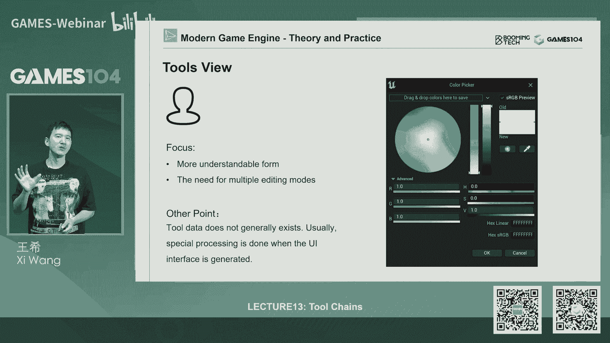
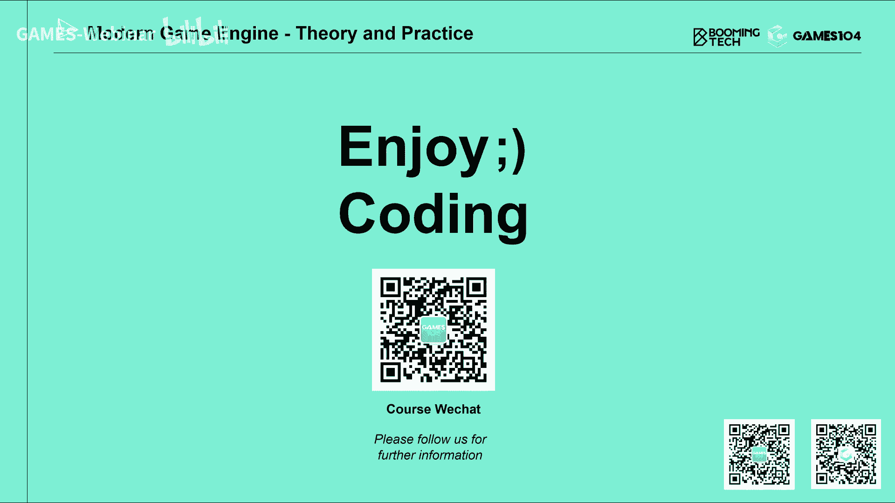

# 13.引擎工具链基础 ｜ GAMES104-现代游戏引擎：从入门到实践 - P1 - GAMES-Webinar - BV11T411G7qB

欢迎回到games104，现在游戏引擎的理论与实践，哎呀我忘了拿我的遥控笔了啊，现在已经是哎你找到了，然后现在那个就是已经是6月下旬了，不知道同学们有没有开始进入暑假，我反正是有点不太习惯。

因为我以前印象中暑假总是在7月份开始，为什么6月中旬我们就进入暑假了呢，所以我要花点时间稍微试一下，但不管怎么样的话啊，我希望同学们有一个非常快乐的一个暑假，那首先的话呢。

回答一下我们社区女同学们给我们提的问题，那其实在过去的一个多星期吧，我们在社区里面大概回答了还是蛮多问题，大概有200多个问题吧，各种各样的问题都有，不过呢我们现在发现一个小小的问题。

就女同学悄悄的告诉我们说，那个有些问题，其实他们有些很简单很基本的问题，但是呢他们不知道这样的问题是不是合适问，或者说很怕自己问出来，显得自己好像我的水平是不是不够高啊，我非常能理解这种感受。

因为我以前也是这样的，我特别怕那个有人问有没有问题，我又问哎，我问了一个问题，大家都看见，我都笑了，其实这是很正常的一个担心，但是呢我觉得就是，这其实就是我们要克服的东西。

我反而觉得大家千万千万不要觉得，你的问题简单，每个问题都应该值得被回答的，只要有同学有问题，只要有同学问题不懂，那就是我们games104的责任，我们要跟大家讲明白了，跟大家去讲懂，所以呢有的时候。

我们真的想听到大家那些真实的问题，因为很多时候如果我没有得到大家的问题的话，我们会误判，我们会以为这个问题其实很简单，这个就这个那个公式可能很简单，这个方法可能是大家都好很好。

懂这个地方我是不是可以讲的简单一点，但是当我们收到了，同学们越来越多的问题的时候，我们就会意识到哦，然后那一趴同学们还没有基本的概念，我们需要给大家解释清楚，因为其实这门课程的跨度是蛮大的嘛。

就是从比如说大家看看有一点点编程基础，甚至是没有基础，到已经有从业了好些年的我们的行业内的同学，但是我讲的话就是说呃，其实每一个我们的课程的同学，你的问题都应该被尊重。

所以我特别鼓励大家把你的问题提出来，千万不要不好意思，因为我作为我来讲的话，至少我是很愿意那个回答这些问题的，而且这也是我们的一个责任，另外一个的话呢就大家也讲了，小引擎，大家阅读起来有很多困难对吧。

然后呢我们现在确实在一公在做一篇那个文档，做一个文档，就是试图结结合大家的问题，把小引擎中的一些难点，一些困难点给大家整理出来，因为最近在准备课件呢是压力特别大啊，今天我们这一节课的课件。

准备的是我们压力最大的一节课件吧，然后的话，所以的话呢实际上分给小引擎的时间不够多，这也是我们这个课程本身的挑战，因为104的课程，和其他课程有一点很大的不同，是说我们所有的东西都是现做的。

就是说它不像其他的课程，老师们都有在大学里讲课的课件对吧，游戏引擎这个东西的话，首先他的资料非常的分散，而且很多的技术啊概念啊，在行业内大家都是有debate，就是都是有争论的。

然后呢我们就会非常的小心谨慎，然后因为我们认为这是个中立的课程嘛，所以我们就会把各方面的资料都搜集搜集一下，然后基于我们对行业的理解，尽可能给出一个A记，这个相对中立。

然后呢又相对客观的一个一个一个描述，如果实在我们搞不清楚，我们就承认我们不懂，我们搞不清楚跟大家讲问题在哪里，所以的话呢就这个课程准备会花很多的时间了，那我们后面会把更多的时间分给我们的小引擎。

给大家更多的解释，我们在准备这个文档，那么另外一个的话呢，就是说其实同学们有很多问题，关于我们的小引擎呢，比如说我们最近收到最多的几个问题，比如同学问我们说，为什么你们要选用win这个API呢。

这个好抽象，好难啊对吧，这个同学们在学习图形学的时候，一上来学的是什么，肯定是open吉尔，我学图形学，我学的就open吉尔对吧，这个这个什么set一个VIEWPORT对吧，set一个gr。

You look at，一个最好最好用的叫GRUT，那个那个那个工具上来设置一个什么look at，就可以把所有东西全部搞完，那么为什么我们会选择win这么抽象，这么复杂的一个东西啊。

这里面的话呢我们要跟同学们汇报一下，就是我们的想法，就是首先的话呢，就是就像我在那个图TOGRAPHICS，那节课里面讲到的，就是呃104的课程，特别想让同学们明白，就是啊我们的游戏引擎这个行业。

它真正的未来的一个发展方向，那么这个毫无疑问的就是说现代graphics硬件，特别是有信心，我们会走向越越来越用户可以定制，可以自我去规划pipeline的这个时代。

特别像computer sor这些东西起来之后，所以的话呢像van像DX12，它的设计理念相对于上一代的graphic a API，比如像DX11对吧，那个open gl的早期的版本。

那是有有一个代际差的，所以呢我们就给大家直接打开了一个hard模式，就是说直接我们就看未来，因为同学们今天学的这些知识，你今天很难学不懂，没有关系，但是呢你至少你的foundation是正确的。

然后你未来如果你真的想在这方面精进的时候，其实你的基础就相当于你上来就直接学，学习这个下一代的东西了，就没有在这个浪费在这个前面的东西，就像我们国家造航母一样，对不对，我们直接上来电磁弹射了。

我们就不要搞蒸汽弹射了，对不对，因为那个技术积累的也没什么用处对吧，这个逻辑其实就是这样的，那么当然但是的话呢就是说呃选择，我可能还有一个点，就是说他是真正跨平台的，因为DX12和van其实是等价的。

但是呢DX12它主要是面向windows平台，那我们很多同学有的人在Mac，有的人在LINUX上对吧，包括在移动端上面，所以的话呢wen在这一点上是有很大的优势的。

那么接下来的话呢我们这所以在这节课程呢，我们给同学们提供了两个reference的这个网站，大家有什么关于motion的问题，在上面可以查到，具体的PICOLA的上面的问题的话呢。

可以直接问我们的课程组，那么另外一个同学问我比较多的问题，就是说哎我们什么时候能用开源，这个这个就是说我们的matt passer对吧，就是我们的反射的这个这个处理器。

那这个其实是也是最嗯应该就是难度比较大吧，就是其实这里面要用到一点点的这个LLVM呢，这些就是说这个这个这个C浪的，这些东西在里面，但这个东西的话呢，其实我们在后面首先要在课程配合课程。

因为我们这节课要讲啊工具，工具的高级里面会给大家讲反射，摆设里面会跟大家讲一下它的一些基础原理，应该是在工具这节课讲完之后，我们差不多同学们开始把这个代码开源出来，但是具体的时间的话呢。

也给我们课程有一点点点时间，就是我们要还要再做点准备，然后包括文档各方面尽可能配套的齐全一点，但是呢大家不用担心，这个地方我们一定会开源的，因为我们小引擎的精神就是开源嘛对吧，那么还有同学们就问我们说。

就是说哎呀，我的这个小引擎的环境好难搭建起来，这个其实我们非常能理解，因为呃实际上我们是一个两难问题了，就是一开始比如说像我学编程的时候，那我就是用那个简单的VC打开了，我就可以直接建个工程对吧。

那在那小引擎里面，其实对大家有一个很大的卡点，就是说你需要用一个SEMAKER去生成，你的整个一个project ution文件对吧，而且你都你如果是Mac，如果你是这个PC，它的方法都不一样。

这个呢跟之前我们的遇到的调困难也是一样的，就是说如果你想提供一个，跨平台的解决方案的话，我们没有别的选择，SEMAKER就是一个最好的一个选项，但是这就是我们的一个门槛。

所以其实呢呃我所以我的建议就是同学们，第一个包括我自己在聊，我其实因为小引擎最开始环境搭建不是我做的，是我们团队同学们一起做的，那然后我也是严格的按照read me1步步操作。

然后呢其中有几个地方的修改，还是因为我操作遇到了卡点，然后我们大家一起来修改它，那么另外一个的话呢，就是啊同学们的话呢就是可以查一些资料，我们这边也给大家一点点的这个。

environment setup的这个资料，那同学们其实如果以上步骤都用过了，还是有问题的话，就像我一上来讲那样，大家不要不好意思，直接就问我们就好了嘛，我们有那么多的微信群，大家就问我们。

然后我们课程组的小伙伴们，还是会非常的积极给大家回答，所以的话，希望同学们能尽快的进入到，皮克拉这个小引擎里面去遨游，那么其实皮克勒引擎的话呢，它本身的feature呢我们目前来讲。

经过这差不多有两三个月的发展机，特别是课程开始之后的一个多月，因为也收集到同学们的反馈，很多同学也在基于它开发，那我们基本的体系，其实已经构建的还算是比较完备了。

包括那个playing editor整个一个编辑模式啊，包括我们有基于forward ring的整个技术架构，shadow啊，我们的那个就是动画系统，还有我们最近刚刚接入的我们的物理系统。

有同学在问我们说，诶为什么你们要接joy这个小物理引擎，那我跟大家分享一点小小的背景故事啊，首先这个引擎呢我们是真的认真挑过的，因为我们要选择一个非常清亮的一个物理引擎，因为因为物理引擎的选项很多啊。

比如像我们以前啊都用过的，像havoc physics x对吧，那包括就是还有其他的一些开源的物理引擎，那为什么选择joy，就是因为它很轻很小，就是如果大家有兴趣的话，你可以进去读的，如果我没记错的话。

他只有几万行代码，另外一个的话就是这个引擎虽然小，但是诶人家是被大作用过的，就是然后像horizon地平线这样的作品都用过，它作为他的这个物理引擎，所以我觉得它本身算法呀，稳定性啊。

鲁邦性能没有什么太大的问题，所以的话呢我们就把它接进来，这样，因为我们认为，就是如果大家想做一个小小的游戏引擎，没有物理的这一趴的话呢，感觉就会差很多，那么在最近的话呢，随着我们大家一起努力。

我们把character啊，MOTO系统也都装了，装了进去，所以今天的小引擎呢，实际上呃基本上已经满完备了，它本身还能继续windows linux，Mac os，就像我们同学讲的是。

我为什么要学104这门课，我觉得你学完104这门课，至少有一点就是你在做毕设的时候，你去pica这个引擎做出来的东西，我保证你可以秒杀你的这个那个室友对吧，那么所以的话呢。

这就是呃我觉得一个非常有意思的，一个一个一个一个一个目标吧，就是我们的课程目标就是学完104，人均一个自研引擎，那今天的话呢就是先花10分钟，跟同学们回答一下我们前面的问题。

那接下来开始我们今天的正主了，今天这节课讲什么呢，我们今天就讲一个这个游戏引擎里面，我认为是最默默无闻的奉献者，就是工具链对吧，因为在游戏里面我们看到的都是，比如说把每一个游戏引擎，它在宣传自己的时候。

没做的时候，都说你看我有什么什么特别厉害的光照的效果，特别厉害的视觉效果，特别厉害的逼真的物理仿真，很少有人会讲说诶我的工具是有哪些进化，为什么呢，因为大家听不懂对吧，老百姓哪知道什么工具是什么。

但是呢你在看他的第二天，基本上基本上是第一趴的时候，到第2part的时候，才会跟你跟专面向专业知识讲诶，同学们，我们最近工具又做了什么升级，但是呢一般像我们真正做引擎的人的话，第一趴我们看看也就过了。

基本上5分钟就明白了，但是呢我们会真正花时间看的是，他在工具上做了什么变化，因为这才是引擎最核心的一个东西，好那整个引擎的工具链呢其实是非常大的，一个就是一个一个就是一个一个模块，那这个模块的话呢。

我们其实大家知道，我们最近课程的日程做了调整，本来工具链我们只有一节课的，但是我们做完准备之后，发现工具链一节课根本讲不完，所以我们就把它毅力是真的多加了一个课程，当然了，有另外一个模块被我们挤掉了。

一个课程我们就不点名了，好可怜，那个模块被我们挤掉了，那么我们工具链的话呢，就是我们今天第一趴先讲它的基础，就是说诶你怎么去构建一个最简单的工具链，怎么能解决他的资源加载，这个存储。

包括就是怎么能够让这些工序之间不要打架，能形成一个链条，就数据可以可以传递，怎么样实现一个最简单的就是那个what you see is，What you get，就是说所见即所得的这样的编辑。

包括工具链的这个plugin系统，这是一个工具链最基础的东西，那么到第二讲的时候呢，我们会讲一些相对比较高级的东西，第一就是说在一个实战型的游戏的这个这个，pipeline中。

这些工具到底是怎么在一起协同工作的对吧，你到底需要哪些编辑器，每个编辑器的实际的要点是什么，那么第二呢，我们会跟大家讲一些工具链比较深的，比如像反射，大家很关心的。

也是大家一直想问我们要的matt faster的源代码，如果你不懂这个反射的这一趴的话呢，那个源代码给大家，大家可能也很难看得懂对吧，包括在讲一些高级的概念，比如说像协同编辑。

所以的话呢我们把整个工序分成两趴，第一趴基础，第二趴高级还是我们的传统节奏好，那我们就开始我们的这个就是，首先给大家讲一下，游戏引擎的工具链到底是什么，首先的话呢，其实这是一个我们自己画的一个游戏引擎。

架构图吧，就是我们已经跟大家讲，就是说游戏引擎它本身的复杂度啊，真的像一个小型的操作系统，基本上现在一个游戏引擎都要达到，千万级代码的这个复杂度，那么在很多时候呢，我们看到的很多人都会把渲染。

或者把一个这个这个rendering当成一个游戏引擎，但其实游戏引擎渲染只是其中很小的1part，那我们会说物理仿真是不是游戏引擎呢，物理仿真也是其中的一趴对吧。

那好网络通讯这个状态模拟是不是这个物理引，游戏引擎呢也是其中的一盘好，你把这些东西全部合到一起了，你得到的东西是什么呢，是一个one time，就是它的一个我们叫做engine erra。

但是在engine之上有大量的工具，其实我们在第一节课也讲到了，比如说各种各样的editor对吧，比如说大家最常见的就是场景编辑器，我在这儿可以构建一个我想要的世界。

然后这里面的话我要编辑各种各样的游戏逻辑，像连电路板一样的，我们一般叫做graphic editor或者叫blue print一样，有些游戏里面叫blue print。

游戏引擎叫blue print对吧，我们还有各种各样的这个材质编辑器，SHADER编辑器对吧，还有脚本编辑器，各种各样的东西，那这一系列常常的东西啊，它的复杂度或者说它的整个体量，一般来讲。

如果对于一个成熟的商业引擎来讲的话，它的复杂度是会超过软弹的，也就是说我们觉得RUNTIME代码很难写，对不对，但是引擎的工具链的代码的话，它的总开发量，开发成本实际上是会高于引擎本身的。

这个是一个就商业级引擎里面的一个general practice，那么这么一个庞大的庞杂的系统的话呢，实际上它的基础最坏的基础是什么呢，我们叫做DCC就是DCC，指的是就是说各种各样的。

比如像3D max maya zbrush，就是PHOTOSHOP对吧，还有那个现在比较火的，像胡迪尼这些第三方的这些软件，它们生成大量的资产素材，这些数据都是易购的，它要经过我们的工具工具链。

然后呢行进入到我们的整个的引擎的pipeline，那这个地方的话有一个词儿，就是那个大家以前讲过的，就是那个ACP对吧，就是那个就是acid conditioning piapi。

那么工具链其实就在这个CP这一层好，那么工具链呢实际上它真正解决的问题是什么，这个也是我想让所有学过游戏引擎开发的同学，你将来拿去跟那些没有学过以前的同学去解释，你问为什么引擎要做工具，工具。

核心解决问题是什么，那别人如果告诉你说哎他只是为了做编辑，生成游戏数据的那会，我你就可以嘲笑他，说，不好意思，你这个讲的还是业余的，我给你讲一个最专业的观点是什么。

其实引擎工具它最核心解决的问题是什么呢，不是其实只是仅仅是为了造游戏，实际上是什么呢，它在调和几种不同思维方式的人在一起，协同工作的这么一个平台，为什么呢，其实我大家想象一下一个游戏团队。

他真实的情况是什么，最最简单的有三类人，第一类人呢当然是我们思维方式特别严谨，动手能力非常强的程序员同学对吧，那么他们就是每天加了个眼镜，穿着格子衬衫的程序员同学，那一定是非常严谨，逻辑性很强。

什么事情都要跟你讲逻辑，还有一类是什么，我们的artist artist，他不在乎你的这个算法是怎么回事，你的这个光照模型的底层数学物理，物理原理是什么，我要这个颜，这个这个山水更暖一点。

我看见那个更冷一点，对吧哈，我然后我要这个场景，这个角色动起来的话更有质感一点，好吧，这些语言和我们程序的语言是完全不搭嘎的，所以他对这个世界的理解是非常感性的，非常非定量的，但是呢它又非常敏锐的。

那么artist对这个就是游戏的这个，它的它的表达，实际上是一种用户体验向的一种表达，好接下来还有是理派人是什么呢，就是我们的设计师非常有创意，对不对，哎我希望那一拳打下去。

能够能够打出一个非常爆炸的伤害，而且我每一下打击的时候，我一上来速度要慢，突然一下子加速，我要的就是这种打击感，我要的那种刀刀，这个什么刀刀入肉，拳拳入肉的那种感觉。

那designer的想法又是不一样的，他很在乎就是游戏的打击反馈，很在乎游戏的这种数值的合理，那这三类人在一起的话，其实他所需要的这个就对于同样一个游戏，这三个人打开各自的工具的时候。

看到的东西是完全不一样的，对程序员看见的是各种数据在跑这个场景里，有多少个静态，有多少个公仔舞对吧，而艺术家看见的是什么，诶，这个色彩我要调，我上次在上节课给大家讲的color grading对吧。

还记得吗，就这个就是artist，非常符合artist的感觉，我要的是这种感，这张照片的这种这种年代感，完了程序员就疯掉了，但是artist明白他怎么去表达这个世界，那他需要有自己的工具。

当然其实跟真正需要的更复杂，那么designer看见的是什么呢，一堆的这种这个这个策划数据，比如说我打击出去的P，我打出一个叫什么攻击体，就是在我的角色前面画一个形成一个方块。

你的每个刀回过去的地方形成一堆方块，然后哪些是暴击区，哪些是轻机区对吧，然后哪一个地方我能把对方打出硬直，所以其实我们的工具实际上是让这几种，说完全不同语言的人在一起，能够共同演奏一首乐曲。

所以我经常把我们的一个游戏团队，想象成是一个乐队，是一个交响乐队，然后呢游戏引擎的话呢就是调和啊，游戏引擎to chain，工具链，就是调和这种不同设定的人在一起工作的。

这样的一个基础的foundation，就是呃基础的这样的一个基建的一个东西，所以这是我们理解就是说这个游戏引擎啊，two chain在整个游戏研发中的一个定位就是它，所以它在设计中的话。

他要充分考虑到不同的使用者的这个思维习，惯和要点是不同的，这个需求不同好，所以的话呢其实以这个为例的话，大家看见这个引擎在就是这个工具链，这是我们选的real为案例吗。

就是从一样输出的白魔的这样一个关卡，那你们看见artist，它会在各种各样的工具里面换来换去，它一会儿构建你的材质，一会儿做一个小的物体，然后迅速的去摆放，最终的话呢能形成自己这样的一个世界。

这这其实这里面就看到，这大概将近30秒的这样编程里面，其实它已经involve了很多，很多的工具模块在里面，我在后面会详细详细讲到这里面，比如像particle有这个材质的那个party蓝图对吧。

各种各样的东西在里面，这里面还更多的只是展示了artist，实际上策划那边的话还没有完全展开，那么工具如果我们想要做工具的话，那首先最难的一个东西是什么呢，是各种各样的GUIJI是什么。

就是这个graphics user interface，就是说其实啊我们的无论设计师也好，还是美术也好，当我们面对这个这个游戏引擎的时候，面对我打开工具链的时候，我要输入大量的数字，我要调很多东西。

稍等我喝点水，然后其实呢，你就会有大量的user interface的东西在里面，那这个在最早期的时候，大家知道我们啊，应该大家可能还不记得最早的这个月，人机交互界面是什么，全是文本对吧。

在最早的叫有一个操作系统叫DOS系统，到那个DOS时代，然后逐渐变成了windows时代，而现代游戏引擎，我们的工具链，用到的GOI其实是非常非常复杂的，那么有各种各样的控件在这里面。

这么丰富和复杂的UI的话，其实你要作为一个游戏引擎的工具链的时候，你首先要会驾驭这么多的GUI的东西，那这个事情简单吗，其实非常的复杂，那么这里面的话呢有两大类，大的这种实现的方式。

第一种呢我们叫做immediate mode，就是直接模式，它其实非常简单，也很淳朴，就是说OK我想画一个这个编辑框，我想画一个下拉框，我想画个按钮，OK我就画吧，直接画上去，你决定画就画这样。

每一帧的时候有游戏逻辑，直接告诉我的这个GOUEI系统，说我要画上我的控件，那这样的话呢就直接打到这个空间上去了，而这种模型呢其实是非常简单和好用的，它的好处就是直接直接简单，而且的话呢也非常的这个快。

非常容易去剖了胎，但是它的坏处是什么呢，就是说扩展性是有限的，另外一个的话呢，就是说其实他会把很多的业务压力，压到了我们的逻辑这一点，那么其实在其实现在有些引擎呢，就是它的GI系统部分还在用。

比如像unity的UGI对吧，包括像OMGUI系统，包括像我们的小引擎的GI系统，也是这样一个直接模型，它比较简单，但是因为它实现起来比较简单嘛，但是呢另外一种，当我们去做工具gr的模型的话呢。

我们一般会用什么呢，叫RETURMODE，这个return mode的话，大家解释一下，就是最简单的一个理解，就是当我要决定画什么什么东西的时候，我并不是直接画到屏幕上去，我是先说诶。

我要画画一个box，这个box是大小尺寸是什么，我把这些所有的信息全部交给一个一个一个，其实很像我们讲的graphics里面的command，buffer一样的，我把我所有的这些指令全存储在这儿。

然后到了那个GUI的自己绘制的，那个逻辑的时候，他自己根据我已经存的这些指令自己去画了，这样的好处是什么呢，我相当于把这个游戏的这个逻辑和，和这个rendering好吧，把这个就是这个UEI的。

这个不就经常讲的游戏会混了，其实工具它的这个GUI的话两个分开来了，那么这个模型的话呢，它的好处就是说扩展性非常的强，而且性能也很好，为什么，因为你的这些命令全部catch到一起。

它不会是逻辑执行到一层，他就画一次，而是说全放在一起统一处理，另外一个的话呢，就是说如果你不去改变它，你就不用再去更新它的指令，这个其实呢也是非常符合我们的这个游戏，架构的理论模型。

所以说其实目前大部分的游戏工具，用的GI模型的话呢，实际上是这个return mode，那么比如像unreal的这个这个UI啊，比如像最著名的WPF。

就是windows的那个那个presentation foundation，就是windows的那个就是他做UI的那个框架，包括像大家特别喜欢的qt，我知道在大学里面同学们做很多课件。

做很多实验的时候特别喜欢QQ，因为我也蛮喜欢qt的对吧，其实也是用这样的一个模型去做的，所以说这其实是我们在搭建机UEI系统，最主要的两个大的方式，那我们肯定会推荐大家用这个return mode。

那么因为GUI是我在做工具的第一个房间，就是我首先性能画绘画空间，我不会画空间，那怎么给大家做工件呢，做工具呢对不对好，但是这个return mode实际上再往深处去讲的话呢，它有很多的叫设计的细节。

这个细节是什么，叫我们叫design pattern，就是你的数据怎么去组织，你的绘制，怎么你的view怎么去组织，所以这里面同学们如果学过design pattern，女同学的话。

一定会想到说诶这个地方我们是不是要讲一些，比如说MVVM啊，MVPMVC啊，啊对你猜对了，其实这个地方是非常重要的，就是在我们在讲design pattern的时候。

就讲这个就是整个工具的UI系统的构建的时候，其实design pattern非常的重要，否则的话呢你很容易去写诶，一个两个工具，写一个两个功能，当时当你写到一个工具里面有上百个功能。

然后十几十几个工具在一起的时候，如果你不去遵循或者遵守某一个design pattern的话，那至少以我的开发的经验来讲的话，基本上一定会炸的，这也是做游戏引擎很有趣的一件事。

就是说它是一个非常考验我们的，就是工程架构能力的这样的一个软件开发，那么在这里面的话，最著名的几个pattern的话，比如说我们称为鼻祖的叫VC这个model对吧，这个是这个就是1978年提出来的。

这个是真的很早真的很了不起的一个model，它其实最早要解决的问题其实非常的简单，就是说哎以前我在做UI的时候，我UI中有大量的代码去修改我的数据，数据中间有很多逻辑，那你这个UEI万一改错了怎么办。

而且数据要改逻辑，你们的那个叫view要改你们逻辑你的数据，然后逻辑又要改UEI的呈现，它两个代码系统就全绕合在一起了，所以说在40多年前，大家就提出了MVC这个模型，这个模型其实我个人的理解啊。

就是大家很多人对control理解每个人都不一样，但我个人的理解就是，我认为他其实把这个数据流清晰化了，也就是说你从model是单向的到view，然后view呢不能够再反过来写model。

所以所以所以说你可以认为，就是model这个把数据输送给view了，但是model本身不会被弄脏，然后呢，你如果想修改这个model里面的logic的，这些数据的话，你只能通过control。

它会进行各种处理，各种过滤，然后再去修改你的model这样的一个结构，这个环流的话因为变成单行线了嘛，所以很清晰，很容易切断，很容易管理这个就像我们城市里面交通的时候，如果都是双行线。

然后全交错在一起的时候，你就很难管理交通，对不对，你们会发现诶，有些地方为什么实现了一个叫这个这个，单行线的管理，其实也是这个逻辑，那么其实这个MVC的话呢，实际上是一个最经典的。

就是一个把这个就是view和model decoupling，开来的一个架构，这个架构的话呢实际上现直到现在吧，在web前端还有很多用处，而且的话呢大家也是就是对他做了很多的变种，很多的眼镜。

真的它的变种是我目前知道是最多的一个，一个pattern了吧，那么在MVC之后呢，另外一个模型的话就是MVP模型，其实我比如说我在我在当时大学VC的时候，我的第一反应就是为什么我这个时候还要把view。

还要去知道model呢，对不对，我view可不可以完全不知道model的存在诶，我后来等我学到MVP的时候，我就发现哦，原来我这个笑话别人老早就想到了，其实MVP我可以认为是一个更彻底的一个。

把view和model decoupling的一个模型，就是说OK，你view完全就不知道数据的逻辑的存在了，那么这里面只管这个他自己的各种展示的空间。

那么presenter呢他负责从model里取数据，然后呢呈现给view，也负责从view里面的这个用户交互反馈给model，这样的话他这个好处是什么呢，就是像我们这种超大型的软件工程。

我有很多的功能模块嘛对吧，其实我们最大的一个需求是什么呢，就是unit test，就是说我要做单元测试，比如说我要测试你的逻辑，对不对，那你你的UI做还是没做，你做成什么样。

其实跟我的这个model的正确性没有太大的关系了，大家想想对不对，比如说我的model里面一个叫学生成绩排名系统，我的model里面有学生，这个学校这个什么三好学生评判系统。

那和你在view中怎么去展示三好学生的话，是不是没有什么关系，那这个MVP模型里面的话，就是说他把这个就分得很开，那这个的话呢，其实是一个我个人认为更干净的一个摘取，那么这个摘取的话呢。

实际上它当然它带来的代价是什么呢，就是他把所有的复杂度扔到了presenter，this presenter变成什么了，就是他得既听得懂model的语言，又听得懂view的语言。

你看就是他在这中间人是最辛苦的，他得懂两种完全不同的语言，这时候view也轻松了，model也轻松了，其实MVP模型写不好的话，其实presenter经常会写的非常的臃肿和肥大，但是呢。

其实呢在目前的整个工具的实践中的话呢，我个人比较推荐呢是第三种模型是MVVM，就是说哎这个名字听上去，很多同学应该非常熟了，因为这个我如果没记错的话，最早是微软提出来的，那么你可以认为就是说。

其实它跟MVCVP都有很深的关系，但是我个人认为它有一个很深的一个，有一个很重大的一个决定，是他非常了不起的一个决定，就是说他第一个像MVP模型一样的，就是他把view和model也是彻底分开了。

他只是把中间那一层它不再叫这个，就是presenter了，它叫什么呢，叫view model，它它这个关系呢不再是用代码哎，写死了，就是说我在V那个presenter里面去。

基于query view的这个API，E l corn model api，他用了一种机制叫做founding的机制，这个绑定机制就非常了不起，就是他观察到一个非常重要的一个事实，就是什么呢。

实际上在我们去做各种各样的工具的时候，就跟刚才我讲工具的价值一个道理，就是说你是要把几种完全不同设定的人，放在一起工作，比如说我去设置一个工具的整个UI的时候，实际上它是什么呢。

它是ux designer，交互设计师，他不会写代码的，他也不想写代码，他在乎的东西是什么呢，就是哎我这个按钮放在这是不是合适，我这样按钮按下去，他就下拉框还是个滑动轨，这样更合理一点，更好看。

我应该用什么颜色一点什么呀，所以他希望一个完全独立的一个ecosystem，一个环境里面去定制自己的用户交互，因为他只对用户交互和体验负责，所以的话呢其实那个view的话，他不要再去写什么逻辑。

也不需要知道别人的东西，他希望用最简单的，比如说用XML或者是那个ZA这个语言，我直接表现这种就是这种cascade的这种类，要的东西对吧，而且这里面的话呢我们尽量实现，要实现他们想要的所见即所得。

然后view model的话呢是程序员写的，我要把这个数据绑定起来，但其实只是定义了一种简单的绑定关系，那么真正复杂的model，那我自己去写我自己的数据，那么实际上这里面有一个非常大的好处。

就是说那个model和view，真的是彻底彻底的分离开来了，那么这样的一个系统的话呢，它非常的干净，但是这就要求你如果想实现MVV的模型的话呢，你必须要在已经现成的框架里面，比如像WPF。

他就给你提供了很好的框架，就是很多设计师你用那个就是啊ZARA这个脚本，或者用他的编辑器，就可以自动生成各种各样的UEI，然后呢你写一些非常简单的c#的代码，你就可以把这UEI全部就可以做出来。

所以说以前我们在用C语言，C加加语言写UEI的时候很痛苦，而且很难debug，经常是UEI就崩掉了，但是今天大家用c#的话，你会发现哇非常的灵活，非常的方便，而且别人写好的空间。

我也很容易的思路都用起来，这其实就是MVI模型这个很大的一个好处，灵活性，当然了，这个模型的话呢，其实他也有自己的一个困难，就是第一个，我认为它是需要在他自己的那个生态里面。

就比如说你要去做这个这个MV模型，在windows的情况下，你最好的选择，目前我看到的还是WPF对吧，但是你这样做完之后，就以前像那个mono啊，像这些东西做的不够好，比如现在那个DNA的那个框架。

在LINUX上支持的不是特别好的时候，那我想把它清迁移到LINUX呢，我想把它迁移到Mac上怎么办，那就很很很痛苦，所以说这个时候你实际上是，你对这个环境的要求就比较高。

第二个的话呢就是对于一些比较简单的，极其简单的UI需求的话呢，这个框架呢它本身的就是这个可维护性，或者叫DEBUGABILITY，本身也有一点点挑战，因为其实大家特别容易在哪个地方，在邦尼那个地方出错。

因为这两个无论是view你去定义它对吧，view model你去定义它，它两个呢你只是做了一些declaration，当然这个逻辑到底是不是真的是对的，这个逻辑之间的关联是不是真的是有效的。

你不把整个系统跑起来的话，你是没有办法验证的，如果这里面的数据出问题的话，就debug起来是比较痛苦的，但是呢这毫不妨碍，就是MVVM的话是一个在商业上已经被证明了，非常成功的一个模型。

当然这个模型其实现在也还在不断的演进，因为啊确实我们现代软件系统越来越复杂，所以说其实我们再去思考，就现代软件系统的时候，就是比如说做到to train这一块的话，我们一般跟大家去讲。

就是说尽量不要自己去造轮子，因为我们的关注点首先是游戏引擎，游戏里的东西，所以我们在做two chain的时候，在我们写我们to change的GI这个体系的时候，首先to change的GI体系。

刚才再强调一下，非常的重要，而且呢它需要需要有非常强的工程可扩展性，你才能够支撑你全部的需求，那我们的建议就是说大家不要自己造轮子，选择最成熟的结构和方案，比如说我有有些小引擎，你如果真的急了。

你想用qt去写，其实我认为也是可以的，但这一定比你自己去写一个要靠谱的多，对吧好，所以的话呢就是说讲到这儿，大家首先明白，就是GI大概以什么框架去构建呢，那么如果你在windows下的话。

如果你不考虑跨平台，那WPF肯定是个比较好的一个选项，那那你就follow mv m的这个模型，这样的话你能够快速的构建各种各样，你想要的工具，你有了这样的一个东西的话，接下来你要面对的问题是什么呢。

就是数据对吧，我们有在这个工具链里面，传递的就是大量的数据，那数据第一个需求是什么呢，就是哎load and save，就是我加载或者是存储，因为数据我不太老师在内存中放的对吧，那么这个事情呢。

其实等等我们真正设计这个工具链的时候，它并不是一个很trivial的问题，就并不是一个非常简单的问题，那么首先跟大家讲一个学术名词啊，这个名词其实非常高大上。

这个叫serialization and deserialization，序列化与反序列化，听上去好像非常的高大上，其实就是啊这个save and load就反过来。

serialization就是存出去，把它变成一个可以传递的一个二进制的块儿，this alization就是把一个二进制块，把它变成一个我能够内存中可以解，可以处理的这样的一个数据。

那么但是呢就是这里面大家特别容易犯的一个，一个误解什么的，就是SATION和DISORATION并不只是单纯的指的是文件，实际上这两个概念是很广泛的，比如说SATISATION。

它不只是存成我的磁盘上的文件，我还可以存成我的数据库里面的一个block data，就是说因为我很多数据，比如说我一个对象的描述对吧，我一个object的GO，大家记得我们游戏讲一切都是GO。

其实我的CEO的状态，可以把它serialize成一个二进制的数据块，我可以把它存到数据库中，我用object id去引用它，这样的话我随时随地可以去访问它，还有呢就是我还可以把它存到网络上去。

就是说啊这不叫疼，叫传输了，就是说我的客户端A向客户端二，或者向服务器发送一个消息的时候，实际上我要把我的一个机油的那个所有的描述，也要把它serialization乘一个二进制的数据流。

然后通过网络协议传到另外一个客户端，另外客户端拿到这个二进制的数据流怎么办呢，他要对他进行DISCIALIZATION，然后呢把那个机油再构建出来，其实我们的整个游戏特别是网络。

我们后面还有一张会跟同学们讲，那个就是networking，就是说怎么去做可以互联的游戏的话，会跟大家详细的讲，这里面有很多有意思的东西，但是selection disciation的话。

也是networking的一个很重要的一个foundation，所以这两个概念的话呢是啊，可以讲是现代游戏，现代系统，特别是现代游戏引擎吧，我们认为是个非常foundation的概念，因为在工具链。

在游戏引擎里面，就是我们每天面对的就是数据的，你把它打打包好，解包打包好解包，就是我们每天日常干的活儿好，那其实呢这个打包的方法，最简单的方法是什么呢，是text文件，哎大家不要笑啊。

text文件虽然非常简单啊，但是其实实际上在最早期的时候啊，比如说我们讲那个网络之间的通讯，大家想象一下是怎么做的，诶我们可以用text铭文做的，大家还听我相信同学们看见很多，这就是互联网的八卦。

就是某某某这个很牛逼的，这个什么这个这个某某国的重点什么系统，结果呢，它的这个重要的信息都是用text铭文存的对吧，所以你看这件事情，是不是让大家都觉得笑掉大牙，但实际上这是个很常见的一个事情。

就是说其实TT它有很多好处，第一个呢就是说它本身是非常容易，就是理解被人去赌的，第二个的话呢，你用任何一个工具就能打开它，这样的话你去debug，你去追踪，你去分析特别的容易。

那么实际上的话呢TT在最早比如说啊，同学们如果学那个就是学图形学的话，最早应该接触过一种格式叫点OBG格式，这个是个非常古老的格式，那这个格式里面它就是真的很淳朴，说哎V打头机表示我是个vertex啊。

接下来三个三个text是告诉我的顶点坐标，然后呢我好像记得是T打头还是什么打头，就表示三角形还是M打头，我有点忘了，就是呃应该是T打头还是什么打头，它表示一个三角形，然后就表示三角形对吧。

index123456789十，那么其实这些呢最古老的text format，真的就是每个程序员自己想到一出，是一出就定了的，但是呢等到后来大家就会发现啊，我们这样胡乱定是有问题的，后来就出现了一些。

更多的一些就是我们叫结构化描述语言，比如说XML对吧，XML包括像HTML这些语言，其实XML是个非常了不起的一个发明，就是说他意识到了就这些文本，它实际上是个容器，然后呢它通过一个树状的一个标注系统。

能够把任何一种结构化的信息都放进去，那么这个东西的话呢其实是很多系统的一个foundation，那当然后来大家就发现就是哎呀，XML这个废话特别多对吧，每个描述都一大堆，那个标号啊，间号一大堆。

后来有人就提出了更轻量的一些方法，比如说像JASONJASON就是它的功能跟XML非常接近，但是呢JASON他的这个语法，就是它的这个文件大小就会小很多。

另外一个呢它的passer就是它的处理也会快很多，那么像包括像那个压秒这些语言，所以其实啊就是text file，如果大家在做引擎，做工具链的时候，如果你做的体量不是特别复杂的时候。

我倒是非常推荐大家先用text file去上手，因为你一开始写的时候会有很多的bug，这也是同学们问我的问题，就是为什么这个PICO我们选择了JASON这个语言，其实就是为了方便大家阅读和理解。

比如说我如果用二进制的格式的话，同学们根本不知道那个数据里藏了什么东西，而且它的数据的读取也非常的抽象，然后最后进了引擎之后，数据正确了不得了，谢天谢地，数据错误了呢，你就觉得哎呀完蛋了，我我都不知道。

无从下手，因为大家如果debug过，对那个二进制的数据的解析的时候，你就知道那个事情真的是非常的痛苦，所以的话呢我们当时就选择了，就是说用JASON作为我们这个数据的语言，那当然其实类似的选择。

比如像unity，它也提供了一种就是A纯文本的方式，去存储你的S的，包括像那个就是那个corue engine的话，它也有一个就是类似于用那个CHARML或者，JASON的这样存储模型。

其实我如果大家在写这个引擎的时候呢，我会推荐大家就是首先支持text f，这样的话，就相当于给你的引擎加入了一个debug mode，就是哎你任何一个数据错了，你先把数据转成那个textbook md。

然后debug1遍，如果没有问题，你才转成八点后买的，这个其实是一个非常好的一个option，那么第二种呢也是大家很自然会想到的对吧，我这么这个这么蠢的，存了那么多的。

这个这个这个这个这个文字肯定是最慢的嘛，那我直接用BUE去存，那这个其实呢就是它的存储容量，肯定是很有优势的，比如像unity他一上来啊，Unreal，它的所有的模型里面基本上都是binary的。

比如CRYIN也有binary mode对吧，所以的话呢，这个呢其实我认为是很自然的一个东西，就是如果你有了一个基于text的一个结构的表达，你把它转成二进制的话，实际上也是非常自然的一个表达。

那么这两个的好处呢，我相信不用我讲，同学们也能猜到，就是二进制会小很多，举这样一个模型的例子的话，同样是用FBX就FX的话呢是行业，你现在特别特别通用的一种，这个数据模型的表达格式，对不对，他就很聪明。

它提供了两种format，一种for binary，一种for text对吧，这就是for deparability，那么你会发现就是text的这个文件，基本上接近于这个binary的十倍以上对。

而且呢大家都知道就是我读二进制的时候啊，我几乎不要进行语语法处理，但是我要读文本的时候，实际上我要做语法passing什么意思呢，就是说我得把你的逗号句号尖角号，然后要做包括你的注释。

我都要做语法的语义的过滤对吧，我要生成一个ST，然后呢基因的语义我再把你keyword build dictionary，我要做很多很多的处理，其实那个text的加载速度。

应该确实比巴黎人慢的就将近十倍不止，所以呢这个就是一个debug很好的mod，但是呢确实比如说像我们的真正的，你要做一个上线的游戏的时候，那你的资产包括你的整个asset的格式。

一定是要换成BINNER的，还有一个点是什么，你不想被别人破解，所以的话呢其实我们如果再讲一下的话，那asset其实有的时候我们需要加密的加密，那就是另外一套很神奇的算法了，今天就不展开了。

那么其实呢在这个资产里面，我们会发现很有意思的一件事情，就是说其实我们打开一个游戏的关卡，你会发现你们很多资产是重复的，那么那怎么办，那我们最自然的想法是什么呢，诶我们其实把有些资产。

比如说一栋房子变成另外一个资产对吧，比如说我要表达一个场景的时候，我这个场景里面有1000栋房子，但是一千一千栋房子可以用20种房子去表达，所以呢这个时候，其实在我们定义我们的数据结构的时候。

我们要引出一种很重要的东西，叫做asset reference，就资产的引用，这个其实当我们在定义一种，就无论你是二进制的还是text format的，这样的一个S系统的时候。

你一定要支持就是cross five的这种引用，因为你有了这样的引用之后，你才能把这些重复的东西全部给提取出来，这也是当我们去做一个引擎工具链的时候，实际上你面对的不是一块巨大的数据，你面对的是什么呢。

是成千上万的离散的文件，而且这些文件之间呢它们彼此之间是关联的，比如说你做个特效对啊，你觉得特效就是我自己的，对不对，诶不好意思，你做个特效，你首先可能引用到一个诶特效的蓝图对吧，如果是real的话。

你可能会用到什么呢，你自己的本身的这个texture，我需要用到这个动动画的texture，我可能要用到那个的animation，所以它的过程其实蛮复杂的，这就是游戏引擎。

就是游戏引擎reference，为什么重要，就是你可以认为游戏里面是上上万上10万，上百万的这些资产文件，他们是像一个出网一样的，彼此关联在一起，所以的话呢这也是reference的引用驱虫。

实际上是我们的资产系统，最核心的一个底层逻辑，也是工具链的最核心的底层逻辑，好，那么你有了这样一个reference的话，有一个最简单的做法就是诶，我在一个尖顶的房子，在我的场景里出现了十次。

我只需要放它十次的引用，那么这个十次都是这个房子什么的，我们叫做instance，就是它的一个实例，而你那个房子本身的定义本身叫什么呢，它是它的definition对吧。

这个我在之前好像在instant deapi里，反复跟大家讲这个概念，但是呢当我们在做工具链，特别是因为工具链，会直接影响到你底层的数据结构嘛，那其实你会遇到一个真实的情况，就是在做实战程序游戏的时候。

其实很多时候artist诶，这个时候就反映出artist课，程序员思维方式不同了，比如说这个artist把一个房子，比如一块地板，我考了十遍之后，那作为程序员的想法就是，哎你我都已经让你能考十遍了对吧。

而且我还只用了一份的存储空间，我已经很厉害了，对不对，但是说不好意思，我觉得考了十遍，虽然它分散在各个地方，你提供了让它旋转放缩各种变化，但是我觉得还是不过瘾，我想把其中五个的贴图给换了。

换成其他的贴图，这个程序员就很抓透了，他就说啊，那你只要换了他的这个比如说它的贴图，那就你应该做一种新的定义呀，但是呢诶不好意思，就是作为我们的艺术家，他不会这样去做，因为他在那个编辑环境里面。

他希望所见即所得，就是我看见这个贴图不爽，我马上就要把这个图换掉，那这个时候呢，其实我们在工具链中对每一个对象，对对它进行实例化的时候，我们要给他做各种各样的，就提供一种叫做warrens的能力。

就是做它的变种的能力，那这个时候呢实际上就会要求我们啊稍等，其实呢就会要求我们说诶，我能够直接在工具链中，把一个物体做出它的变化，那最简单粗暴的做法是什么，诶，我把这个物体在我的这个关卡里面。

再拷贝一份对吧，然后你想改啥就改，大哥你牛你你你考完之后，随便你怎么改，但这个做法的话，显然从数据处理上呢，它是一个低效的做法，为什么呢，因为你可能一个物体的描述，我有成千上万的数据对吧。

可能是比如说几百个数据，你只动了一个，比如说它的颜色，它的一张贴图的纹理的这个路径，那其实你改的东西很少，还有一点，就是说，比如说我向总体上对的东西进行一个调整，比如说我把他的一个网格做了调整。

我希望其他的他的分身都要相应的发生变化，但是一旦你拷贝之后呢，他们之间的关联就彻底断掉了，所以呢这个时候我们引入了一个很重要的概念，叫什么呢，叫做DINHERITANCE，这个的话呢。

实际上也是工具链一个非常重要的，一个底层技术，就是说我们当用户在这么多工具中，来回走的时候，它会产生很多数据嘛，其实数据是可以继承的，对数据是可以继承，大家在学这个就是啊高级语言的时候。

大家在学C加加对吧，我们定义了一个类，我们的类的派生，它就是继承于它的父类，对不对，好像就是我的方法，我的很容易可以继承，那么数据可以继承什么意思，就是诶我一个111个structure的一个实例。

比如说我把它的长宽高的设了个数值，我另外一个数据呢是既乘以你刚才那个，比如说长高一个一个正方体的box，但是呢我长宽都不改，我只改你的高，诶，我这个数据就是给你继承的，而数据继承的话呢。

也是我们在做这个引擎工具链的时候，一个非常重要的一个方法，这个方法其实你说它难吧也不难，也就是说，实际上就在于我们的定义这个数据资产的时候，定义asset格式的时候，大家刚才讲的。

比如像我们这个用的是类似于CHARA的格式，那实际上你加入一些相应的属性段，描述说，哎我这个数据它其实是继承于哪一个那个数据，然后呢但是我哪个field我要改掉了，我就把它改掉，那这样的话。

当我们工具链或者我们的引擎，读到这一块数据的时候，我就知道先把原始数据朝拷过来，然后呢根据你的修改的部分把它修改掉，这样我就造出了一个新的数据，所以其实非常的有意思啊。

这个实际上在你去大家去理解工具链的时候，实际上工具链玩的全是数据，就是它实际上是各种各样的数据，在各个工具之间流来流去，那么怎么去深刻地理解数据，怎么样的保证数据的这个灵活多样性，但又不会混乱。

实际上是我们在做to chain的时候，一个非常核心的一个一个发力点，这个概念还蛮好玩的，那我们把这些数据我们知道怎么去存在的对吧，我们把这个数据存到硬盘上，就是那个其实刚才我讲了那么多。

我只是把serialization part给讲好了，怎么样，我的标题叫low and save，但其实讲了半天，我只讲了如何定义数据，如何save数据，那真正难的问题就来了。

这个磁盘上的数据我怎么去漏的，他呢就是我怎么去DCALIZATION呢，唉这事儿其实并不简单，这个呢如果你不去做引擎的同学，大家不用太关心对吧，反正format的人家一定好，我直接用就好了。

但是如果我们games104的小伙伴，大家想做自己的引擎，想定义自己的工具链的话，那这一盘的话同学们要去听一听了，诶实际上这个事情其实是我们对一个asset，加载进来之后，我们并不是像大家想象的。

我沿着文件一通读就完事儿了，实际上它是一个passing的过程，什么叫passing课程，大家想象一下我们一个场景文文件，它里面有很多的数据块，每个数据块有很多field。

有些field的话呢它有不同的value，不同的type对吧，那你怎么去处理它，实际上呢你是要对整个文件进行，不不是说依次去读它，你要对整个文件进行扫描，然后呢扫描的时候的话呢。

你要去去检查每一个field是不是存在，比如说你检测到一个一个key value，它的名字叫什么好，你接下来说诶我找到你的值了好，我把你的名字值type，我就把你放到一块，变成一个pal。

但是有的时候我我说诶，你你指向了你们另外一块数据，但那块数据呢其实我还没有没有读到，大家想象一下，我我们看一个数据的时候是一个完整的，就是整合在一起看，但是其电脑大家讲记得我以前讲过图灵机，对不对。

图灵机是什么，是一个纸袋，他这样只能一次一次去打，但是呢它有一个小小的memory，这个纸袋一直打写memory memory是另外一条纸带了，那我看到一个是一个数据库，比如说你现在要用到这个你这个呃。

比如说吧你这个动画啊，不说错了，比如说你这个角色，他的第三个动作是要用到动画305好，305动画还没读，那我再继续往后读读读读，读到后面的时候诶，我动画305的那个动画我才能读过来。

读过来之后我才知道这个数据是什么，所以说其实这里面的话呢，我并不是一上来把所有的数据全部加载进来，而我一上来是先要把这个数据拆分成，一个个的语义，然后呢把这些所有的关键的key，这些value。

这些type全放在一起，它会生成一个什么样的东西呢，哎大家看我们最后生成一个所有的field的这个key，然后呢它是什么类型，还有它的这个值形成一个树状结构，大家如果去分析一下所有所有的像XML。

像JASON这样的语言的话，你会发现它无论多复杂的这个文件，这个asset它都是个树状结构，其实在我们在做游戏引擎的这个资产，asset的管理的时候，我们也是用了这种结构，就用树状结构。

其实这个很像什么呢，很像那个就是那个大学那个编译器的时候，那个a s d tree对吧，就是你写了一段很长的这个，文本的这个源代码诶，其实交给编译器的时候，他管你写的这个这个这个妙笔生花。

给你生成了一群非常抽象的s d tr，AST长什么样呢，大家稍安勿躁，我们在下一节课给大家讲反射的时候，会让大家见识一下，那个这个这个这个很就是让你觉得大跌眼镜的，STT长什么样的这个结构。

但今天我们展开，但是呢它的逻辑上其实也是像这样的一个结构，其实这就是我们对世界的表达，就像我们去理解这个宇宙，理解这个世界，其实如果我把对象一个个都罗列的时候，我们是没有办法理解这个宇宙的对吧。

那我们怎么去理解这个国家很简单，我记得我在上节课的，在前几好几节课讲过这个概念，就是诶我们构建一个树状结构，我们首先第一个题，第一个根节点叫什么叫国家好，我们把国家怎么分呢，诶我把国家分成审审。

分成市是在分成这个就是每一个区诶，这另外一个呢我在这个市里面，每个区里面我在分人，但每个人怎么样，然后这个国家另外的一趴，比如另外一个业绩点是什么，我是按企业啊，行业按部门按部队这样一个个分诶。

我用一个树状结构，就可以把一个极其庞大复杂的系统给表达出来，而且这里面的话呢，他们彼此之间还可以相互引用对吧，比如说有一个个体的人，他属于哪个神啊，哪个市哪个省，哪个市的一个人。

但是呢他又属于哪一个政府部门对吧，他又是从事什么职业，然后他和谁谁谁又有什么配偶关系，所以其实啊这样的一个树状结构，它就彼此之间能够相互引用，实际上就是我们的一个asset的一个，真正底层的结构。

那么这个时候如果我们去加载一个，就是text format的话呢，实际上前面需要一个非常复杂的一个passing课程，比如说大家去理解一下，就看我们的小引擎。

我们不是用JASONJASON作为我们的数据载体吗，你可以你如果读那段代码，你会发现我们首先调用的是那个第三方的库，它把JSON的文件就变成了这样，一个一个一个tree的structure。

然后呢他们也它也可以叫做dictionary一个字典，然后呢我要任何数据我就问他，然后我就可以通过他的第二次处理，我可以拿到我想要的我的资产，但如果你是二进制的话呢，其实一般在二进制的头部。

我们会把这个树状描述存下来，就比如说我有多少个field，它的名字叫什么，他的type，它的它的位移在哪里，就是数据在那里，第二个就是他到底什么态度，因为我知道tab就知道我要读多久。

我先把整个这个二进制文件的描述放在前头，那接下来的数据我就可以快速的去处理了，所以的话呢，这个其实当我们去做DESERIALIZATION的时候，这是一个非常重要的一个方法，OK好。

那么但但是呢如果我们用二进制做distortion，特别是我们在做真正的工具链的时候啊，大家要特别特别注意一个事情，就是ending这个词是不是大家觉得很很神奇，这个ending中文叫什么呢，说句实话。

我也不知道中文叫什么，反正而且这个东西在我个人看来是我，我我是满满满觉得这个头疼的一个事儿，就是说呃大家知不知道，就是在我们计算机这个系统的早期的话，有两派之争，一个叫big ending。

叫leader，你这个很像甜豆浆和咸豆浆之争，真的是特别特别无聊，但是给我们惹了很大的麻烦，就是说同样一个比如说一个整数，你是把第一位存在前面，比如说把个十百千万第一位存在。

但是二进制里面是倒不是个十百千万对吧，就是低位我存在前面，还是把高位存在前面诶，这两派就打起来了，那么比如像INTEL的X86架构，它就是一个little ending对吧。

但是呢比如说像IBM的power pc架构诶，它就来了个big ending，你说这有意思没意思对吧，但是呢没办法，这就是事实，比如说我们要兼容LINUX不同的这个硬件平台，我们要兼容这个Mac。

还兼容那个就是说各种android的，还有还有就是那个游戏主机，还有那个就是PC，哎我们就得要解决这个很奇怪的问题，但这个问题呢你说它复杂吗，也不复杂，我跟大家讲一下。

就是说在当我们做游戏引擎工具链的时候，我们实际上呢是这么解决这个问题的，就是说在工具链里面，我们一般会约定好我整工具链，比如说我们一般是去PC作为它的这个编辑器嘛。

那我全部统一锁死为lut ending对吧，然后呢无论各种编辑器里面我就用，但是呢当我在做DISCIALIZATION的时候，也就是说当我加载这些数据的时候，比如说我突然发现诶。

我好像是在一个PLAYSTATION上面去解压缩我的数据，对不对，我用一个swapping，就是把所有的little ending的数据，把它变成一个beginning的数据，但这个过程其实可以离线做。

就是说当我去给PS5打包的时候，我把这事给做好，这也是可以的，但是呢就是当我们去写引擎to chain的时候，这个确实要注意，包括我们现在都已经遇到这个问题了，所以的话呢就是同学们如果做引擎的时候，诶。

知道跨平台里面，这个ending就是一个很头疼的一个小问题，好那么讲到这儿，大家就会觉得哎呀，我基本上虽然我好像听得半懂不懂，我好像已经知道这个工具链基于此，基于S系统怎么去构建了对吧。

我既知道GUI怎么做了，我也知道这些数据怎么去组织了，接下来我接下来的问问老师，怎么去构建这些编辑，我基本上就能做，对不对，哎我现在跟大家讲一个更有意思，也是，其实我一直认为是做工具链最难的一个问题。

就是说你怎么能做到，就是说资产的这个版本的兼容性，哎这个大家就很难理解了，为什么还有一个版本兼容呢，比如说同学们，你们在用word的时候对吧，有多少人意识到其实word是个非常难写的软件。

比如说我是2010版的word对吧，然后呢我编辑了一个文档，诶，这个时候我假设是一个2019版，2020版的这个word，现在应该是2023了吧，版本的这个这个word出来，我还要能打开。

2015版本的那个那个word文件诶，这个向下兼容大家想想怎么写，而且大家想要哦，这很简单嘛，我就check一下版本号，衣服你的版本对应20142010，我怎么怎么样对吧，那当然你这个做法也是可以的。

但是我们在想更偏激的做法，就是假设你这个资产是啊二，这个这个文件是2023，编辑完了，那你二零这个一零的版本能不能打开，那现在反正沃特的处理是很糟糕的，实话实说，他基本上是没办法打开的，他说哎呀。

你这个好像是版本号更高，我打开不了对吧，但实际上的话呢，其实在我们在做游戏引擎工具的时候，我们要支持版本的兼容性，就是这原因是什么呢，首先大家想象一下，一个游戏真实的研发过程有多久，大概是3年左右。

那么在一年在3年前，大家做了很多资产，比如说我编辑了一个很漂亮的动画对吧，我做了一个很酷的场景，那我引擎会不停的升级，我的工具也在不停的升级，我会加很多很多的数据，我可以删掉一些数据诶。

那难道我们的美术3年前做的那个场景，就不能打开吗，那你想想看美术是不是要跟你拼命，对不对，人家工作了几个月的成果，你以为你老人家版本升级，大家就就就完蛋了对吧，那么还有一点是什么呢。

就是说诶就是我这是就是过去的数据向，就是叫我们叫这个叫做backward compatibility，就是向后兼容对吧，那我们在讲for compatibility什么意思呢。

就是说诶在我们一个团队里面啊，其实大家很多时候，版本工具基本上每隔一两天就升级，但有的时候同学们呢它的工具还是老的工具，但是呢他要打开未来的人类，就未来的同学们的版本创造的这个这个素材。

这个情况其实是有的，那我们也希望这个工具不要崩掉，这个引擎还继续能跑，其实这个需求呢大家会觉得诶，好像如果我做好这个团队的管理对吧，我用老的平台跑未来的数据，这个事情应该不需要，但事实上呢在很多环境中。

特别是在我们叫做分布式部署的环境里面啊，这个需求是很刚需的，这个特别像同学们特别想知道的什么，元宇宙对吧，我个人一直认为元宇宙这个概念现在很不成熟，因为就是呃他就有大量的这个问题。

就是说比如说我几年前开发的一个应用，我未来来的数据，比如说我来自于啊未来这个别人生产的那个application，产生了一个虚拟人，他怎么进入到我3年前开发的一个，就比如说一个虚拟游戏场的这个环境，诶。

他在我这也能玩，我不能因为这个他的那个application，我再去升级我的游戏，常因为很可能做了老的application，那个团队他已经他已经解散掉了对吧。

其实在METAVERSE上会有很多这样的application，它实际上是跑不起来的，但这里面讲的就比较深了，但是我想跟同学讲了一个概念，就是说，其实当我们定义一个真正的一个，商业级的游戏引擎的时候。

事实上这个就是这个资产的版本的compatibility，实际上是一个非常专业，非常重要的一个东西需要思考的，那这个问题怎么解呢，那我们先讲一下你可能遇到的情况，其实他讲起来也很简单。

就是你会遇到两种情况，一种就是你的一个field其实被人给删掉了对吧，比如在这里面我的这个transform被人干掉了，对不对，还有一种是什么呢，唉未来我系统越做越复杂，我就越加越多。

但是呢你的数据文件还放在那，你得把它打开来，对不对，那怎么办呢，其实这里面的话呢，有一个比较这个简单粗暴的做法，就比如说我们看一下荣耀怎么干呢，他很简单，他说呢我每一个资产我程序员手写版本号对吧。

那我就检查了，说哎我现在已经已经升级到7号版本了，但是你的你的你的资产还是6号版本，我就知道有一个数据，你就是那个没有的，那好怎么办，我给你塞一个就是default value对吧，塞入一个一个缺省值。

如果你你你的数据多了，那我就不读，你把你那个数据我虽然还读，但我不处理它，把它跳过去，这个方法实话实说啊，我个人啊不是特别敢苟同，就是我个人觉得方法处理的不好，因为这个随着一个系统有有3年。

4年以上的发育的话，你会发现你要兼容的这个版本的，这个这个这个version number就越来越多越来越多，这个是很糟糕的一个方法，这里面的话给大家推荐一个做法吧。

这个做法的话呢实际上是这个啊google提出来了，就google他们也遇到了这样的问题，其实我特别想，因为google它是全球可能最大的一个分布式系统，的这样的一个应用场景，那么他就肯定会遇到这种问题。

因为在他的平台上要跑成百上千种，不同生态的这个软件，这些软件的话呢都是有不同的开发商开发，对不对，然后呢版本也各自有不同的频率在在在更替，然后之前的数据还会来回通讯对吧，那这个张三的软件更新了。

李四的软件没有更新，网络的软件又更又又又又又又回退了好了，那这里的数据的通讯就全部完成，全部全部全部完蛋了，那么google就提出了一个叫po buffer这样的一个format。

其实他的想法我个人认为又简单又好使，其实非常简单粗暴，就是说它要求你在定义每一个数据field，就是一个属性的时候，你给它生成一个unique id，这个id呢你保证它是一直单调递增就好了。

这样的话就是当你的数据一直在更新的时候，我就比较说你这个id有没有发生变化，是不是很简单很好使对吧，但是呢实话实说啊，我我很想吐槽的一件事，就是他的这个就是语法定义，让我觉得真的不敢恭维你。

大家看一下就上面写了，就是说哎这个string GUI d等于一，string file name等于二，哎我的天，我当时看到这个我的，因为作为一个这个这个这个有点强迫症的C加，加的这个开发者的话。

我会觉得大哥你这不是让我再付这个缺省值吗，我我我觉得如果像我们这种插面空的话，或者JASON控的话，我会说你给我加个冒号，什么什么UID什么，这个这个等于一我都好一点，我都能忍。

你让我这个这个feel的直接等于一，我就会觉得你是在负确认值，但是呢可能大家习惯了也就好了，他肯定我相信姑姑大大，他她这么做一定是有他的道理的，我不懂，只能说明我的水平不够。

所以呢大家可能可以无视我这段点评啊，但是大家可以去学习他的这个思维方式，就是说这个方式其实非常的好，因为这个就是当你面对大量的，就是我们的一个游戏引擎啊，它实际上跟google面临的环境是有点像。

因为它有大量的模块，都有不同的开发者去开发和维护他的版本变化，很快它会产生，像比如说一个像一个商业级的游戏引擎，它的数据format格式，格式可以达到几十甚至到上百种，而且呢。

这每一种格式都是由不同的团队，去开发和维护的，然后但是我们的artist他在打开一个工具的时候，比如说打开一个地图编辑器的时候，他可能会同时面对几十种完全异构的数据，那我们怎么能保证这个整个工具体系的。

鲁棒性的话，在这一点上就是叫这个版本兼容性的话，是一个非常重要的一个核心指标，其实在网络环境下，在分布式部署情况下，这个问题会变得更加的复杂，所以我一跟同学们讲，我就说游戏引擎是一个大型软件工程。

其实这个时候大家应该有一点点感觉了对吧，你想你要伺候那个成百上千的这些，我们的艺术家，老爷我们的设计师老爷的话，实际上是要求你这个系统做的还是相当鲁邦的，那接下来的话呢又又到了，我刚才已经点到这个词了。

就是如何让你的工具变得更加鲁棒一点呢，你要知道就是当我在做一个游戏引擎的时候，昨天跟大家讲就是游戏引擎，做游戏引擎是在整个游戏团队里面，大家会觉得我们的地位是不是很高诶，实际上你们错了。

做游戏引擎的团队是地位最低的，为什么呢，因为我们在服务所有的人，包括程序员，因为程序员要基于游戏引擎开发游戏嘛，就是给你们举个例子吧，比如说在我们这个行业里面，如果一款游戏失败了。

这个大家首先想到背锅的是谁，不是什么策划，不是美术，不是程序，一定是游戏引擎，对不起，我的游戏引擎选错了，所以我这个游戏就失败了，诶这个所以游戏引擎的话，大家如果想做游戏引擎的话，一定要有这个觉悟。

就是做好背锅侠的准备对吧，那作为我们这种背锅侠呢，我们就这个非常小心谨慎，我们就说诶那既然我要背那么多锅，那我就索性这个把我这个做的再鲁棒一点对吧，这样少挨点骂，所以呢其实特别是工具链来讲的话。

它的鲁棒性要求是非常高的，因为实际上游戏引擎一旦工具链出问题的话，对整个团队的影响是非常大，大家想象一下，如果你的游戏引擎工具崩了，那你几百人一上午什么事情干不了，等着你把这个bug修好。

你想想看你作为一个引擎开发者，你的内心压力有多大，反正我们是亲身经历过的那种感觉，真的是如坐针毡，你会觉得欠了大家很多很多钱的感觉，所以的话呢让工具的棒易用，其实是工具链的一个非常核心的点。

那作为一个游戏引擎开发商，怎么让工具变得鲁棒呢，那首先的话诶也是大家最需要的东西，就是undo redo，对这个东西听上去，其实当我们一开始在做一个工具链的时候，比如像我最早在做编辑器的时候。

我会想到很多粉丝的feature，比如说我要做个很酷的这个植被，刷一刷子刷过去，山川河流都给你变出来对吧，然后呢我要做最酷的悬崖峭壁，这个这个各种各样的东西，我要做这个刮风下雨。

但实际上你会发现artist跟你讲，诶大哥我刚才做了一个误操作怎么办，你把这个数据删掉，重新再来一遍对吧，你你就疯掉了，你会发现就是所有的编辑器，editor到最后最核心的功能其实就是这个安度锐度。

而且呢对于游戏引擎来讲的话，安度锐度其实非常的复杂，为什么，他的就是他的很多数据编辑是correlate的，举个例子啊，比如说我现在改了一个房子的颜色，诶房子没问题对吧，我我绕着房子旁边种了一些树。

也没有问题，这个时候我突然决定把地面往上拉，个这个这个34米形成了小土坡，然后这时候这个房子和树啊，它都会相应地发生变化，然后呢我看这个房子不错，我在旁边在自动释放是吧，生成一些这个DECO。

就生成房子周边的那个一圈的那种诶，这个往外延拓的这种这种沙地空白地的感觉，唉这个时候当你要undo的叫你undo的时候，你会发现你有些难度会影响到其他人，比如说你首先把那房子给干了。

那个旁边那个地那一圈低调可能就有问题，当你把刚才地形的山山山地调整的去改了之后，你刚才种的那些树，可能它的角度很多人都会发生变化，所以说其实在游戏引擎里面，这种undo和redo的话。

彼此之间是有很深的correlation，而且很多肽，那么另外一个的话呢，就是你做的再好的工具，你都会什么呢，你都会crash，然后你crash之后。

人家艺术家他这个编辑了一个小时的东西对吧，人家也不会想着去存盘，然后突然就crush掉了之后，那怎么办，那就是要你的命了，对不对，还我数据，我怎么还，我又不会画画，我又不会那个做关卡，这个时候。

作为这个游戏引擎的to chain的开发者的话，实际上这个东西就是我们一个非常需要花时间，去想明白的一个一个问题，怎么去解决，诶，幸好我们有伟大的一个design pattern来支持我们，这个问题呢。

其实在这个软件体系里面是一个will study problem，就是一个被研究的非常透的问题，大家今天用word对吧，用POWERPOINT写PPT，然后用word写文档，你们知道就是当你挂了之后。

你再打开的时候，他会告诉你有个recovery，对不对，然后呢redo难度都会非常方便，其实呢它就是一个非常标准的叫command，这个pattern，也就是说我们把用户所有的操作。

把它分解成无数的小的command，然后呢我这小的command它就会逐渐累加，然后呢它会非常原子化的头发，但注意啊，这里面讲一个细节，是不是每一个用户的操作对应一个common。

实际上有的时候用户的一步操作，我们会分解成好多好多common的，这是有一定道理的，就是我们尽量让come on的原子化，那么这个时候呢，我们会把这些command定时的存到我们的磁盘上。

这样万一我系统挂了的时候，我从磁盘上去找对吧，当用户突然响了，诶，我要去undo的时候，这其实就是啊我们叫做简单的说法，叫做这个revoke和invoke，就是暗度学术的做法，我们叫in revoke。

那好那我把刚才内部操作给回退出去，所以呢这个pattern的话呢，也是非常符合人的直觉，但是今天如果同学们要加自己的to chain的时候，我会非常建议在很早期的阶段，就把这一套结构架好。

因为你这套结果一开始的话，你在早期架的时候，你随着你的工具链的功能越来越复杂的话，你在不断的丰富和完善它，那你这个系统就会比较稳定，你千万不要就to change，你做的已经比较大了。

你再开始做这套系统，那我告诉你这个事情非常的痛苦对吧，因为我们自己是经历过这个痛苦的，我们知道这个事很麻烦对吧，那真的是一天上百个bug扑面而来的感受，我们大家想象一下，这个是压力很大的好。

那么其实呢common definition，比大家想象的要简单的多了，最简单的描述就是每个command，你要给他一个UEID，我待会解释为什么你要有UEID对吧，然后呢你要有一串data。

然后这当然得command，你要它是一个interface，就是你每一种的command要自己去定义的，那么接下来最核心的就是两个函数什么呢，一个叫invoke，Invoke。

就是诶我这个come on要去执行它对吧，还有一个函数叫什么呢，叫river这个函数我退出了，我不干了，我退回去一步，那么还有两个函数呢，大家可能被注意不到，教serialize。

Deserialize，但是大家仔细想想，这个其实也是有道理的，就是说哎我把这个command我存到磁盘上，怎么存对吧，我从磁盘加载怎么加载，当然有的时候呢。

其实我们一些比较多的这些come on的操作的话，我们甚至会存在自拍，就是在内存文件中，甚至会存在内存dB中都是有可能的，所有的serialization和DESSERATION其实很重要，还有一点。

这个待会我们在下节课会讲的，就是说诶如果我们要做协同编辑的时候，这个东西是不是也是有用的好，那我们接着往下讲，就是为什么我们要一个UE对吧，为什么每个come on我们要给个编号呢。

其实这个编号呢首先它是唯一的累加的，当你这种command在不断的累加唯一性的时候，大家意味着什么，这是不是就意味着一种诶隐含的序列，这个东西为什么这么重要呢，因为当我在进行回退就是revoke的时候。

当我进行recovery的时候，我是希望他的执行要严格地遵循原始的顺序，这就是大家知道就是在真正编辑操作的时候，大家会知道很多操作，如果你执行的顺序不一样的话，它的结果是不是会完全不一样对吧。

这个大家很好理解吧，所以的话呢其实UID就是一个保证这个顺序的，就是单调递增的一个核心的一个点，这一点的话在写common系统的时候，大家一定要注意，那么另外一个的话呢。

其实在这个common系统中的话呢，一般不是common系统自己写的，而是什么呢，是由那个数据自身提供了这个标准的思路，ALIZATION和第四人类线的方法，这样也就相当于比如说我一个GO对吧。

我要说aleue object，我加一个GO，那好那这个机构资深，它要提供诶，我把我当前在内存中，我这个角色，比如说我这个character全部的状态，能够series下来的这个方法。

那么come on，系统就说OK我现在决定创建一个角色好，这个角色所有的数据调查，那个角色数据就是character，那个GO的那个里面的就是game object。

你们的serialization的方法，他把这数据给存下来了，所以这个呢也是，当我们去实现这套common系统的时候，它也可以变相的逼着我们，把整个引擎的系统都写得非常的干净，这样能让我们的引擎。

所有的操作都能够原子化好，那么其实呢就是在command系统里面啊，其实目前人大家总结下来其实就是三类的，command是最标准的，第一类呢我们认为就at，就是其实你就创建一个诶一个对象对吧。

它可能是个极有可能是别的东西，第二类就是我们把一个对象给删了，第三个呢我们对对象的一个值进行改变，就是改变对象的一个field，比如说哎我改变一个一个对象的，它的速度，一个大小一个field。

其实你会发现，无论多么复杂的这样的一个API系统，用这三类的command基本上就能表达了，其实大家去研究，如果有有空去研究一下，那个就是那个文本编辑器。

其实文本编辑器它的所有的revoke invoke的话，基本上就是用这三类操作就能解决了，这是非常了不起的一件事啊，就是增加一个text，删除一个text和呃，更新一个text，基本上就能解决。

这其实也很有道理的一件事，所以呢其实这个实际上就是我们的工具链的，一个基础的开发的逻辑，你发现没，我讲了这么多，没有讲一句话，这个到底工具链怎么写，为什么呢，因为每个工具的写法都是不一样的。

但是呢大家这个foundation比如像S的系统，像这个command系统，像这些这个GUI的体系要答对，实际上大家是在做图称最重要的基础，这也是就是让大家不要去急着写，我经常看到有些同学会说。

诶我做了一个编辑器，做的特别帅，你看我这个地图可以拖动什么东西，做的很好，是的，你这个东西单独做一个是很容易，你做十几个功能没有问题，但是你真的开始面对一个editor，你面对上百工的。

然后你有十几个不同的editor的时候，你会发现如果前面的这些事情没做对的话，你会非常痛苦，好接下来呢就是为什么这件事情那么重要，就是因为我们要构建的不是一个单一的工具，我们构建的是什么呢。

是一个two chain，对工具链，我们有很多的工具在一起好不好，他们彼此之间是有血缘关系的，要彼此通讯，彼此联系，互相说的话，互相能听得懂，这就是一个很挑战的一件事儿。

那么其实呢这个to chain就像我前面讲的，它其实是面对完全不一样的user对吧，那每个月的需求不一样，那么如果我每一个to啊他单独去写的话，实际上这个工具链它是没有可扩展性，也没有可维护性的。

因为这些数据全部都是异构的，大学刚才我虽然我讲了很多ACS怎么去定义，对不对，但是这asset之间每一个工序长得都不一样，那我们彼此之间我的编辑器怎么写啊对吧，我的我我。

我一会儿要编这个这个这个一个一个点光源，我一会儿要编一个角色动作，我一会要编一个场景的这个低调的分布，那么这个其实每个数据我都知道怎么定义，但它彼此之间是异构的，所以呢这里面呢就引入了一个非常重要的一。

个思维方法，就是我从各种各样的这个都要心中找出共性，那么当我们打开一个数据的时候，你会发现诶其实再复杂的数据，它都是有很多简单的building block构成的，比如说我们去描述一个点光源的时候。

你其实有的是什么，很多时候都是诶他的一个vector3的，一个它的坐标，它的点点的位置，它的方向也是vector3诶，他有一个什么呢，它有一个颜色对吧，各种各样的颜色，比如说NB的DIFFICKER。

对不对，这其实都是一些非常基础的一些building block，在这里面我们就观察到一件事情，就是说其实任何复杂的数据，我们可以把它描述成一些简单数据的集，这个像什么呢，就像我们现在物理学。

虽然这个世界非常的复杂，但是我们会找到基础的原子，108种原子，我就可以通过它的组合去表达，这个世界的任何一种物质对吧，那么好，如果这些原则我们来找到，接下来我们需要什么呢，哎我们需要一个东西。

这个东西叫什么呢，我们叫做schema schema呢，其实我觉得这是这个词很有意思啊，就我这是这个标题，是我自己写的，就是a description structure，就是说是一种描述的结构。

用一种更简单的话去讲，就是说啊就像刚才我举的原子这个例子，那么这个schema更像什么呢，更像分子式诶，这个有点意思了吧，就是他描述的这个物质是由哪些原子构成的，就像今天我要定义一个长方形啊。

第一个长方体其实它的描述就是三个量，就float x y z代表了它的长宽高，对不对，如果我要表示表示一个圆的话，其实我就一个量float2他就表示出来了，那么这个float加一个东西。

这个结构就是一个schema，那你按照这个schema写出的数据，它就是一致的，所以schema系统的话呢，是游戏工具链最核心的一个底层，就是说所有的在游戏这个工具链里面流流转的，这样的一个数据的话。

它都是要用schema统一的描述和定义的，这样的话我的数据彼此才能解读，比如说我一个啊，比如说地图编辑器打开了一个角色，这个橘右进来，那角色他如有，如果有了CHEMA，我就知道哦。

这个character name叫什么，这个character的这个这个这个声，它的放缩是多少，他用的是哪个mesh，他用的是哪个动画，那这样的一个角色一拖到我的编辑器里的时候。

我编辑器在那个panel里面就会出现他的名字，他的动画，然后呢你点那个动画的播放诶，这个角色他自己可以就可以动起来了，这些代码全部不是他的code，它全是通过schema告诉各种各样的工具。

你该怎么去理解这个数据，它每一个数据的语义到底是什么，那么好，那么其实呢就是说，schema是一个非常重要的表达，因为我用这些简单的building block。

我性能表达一些high level的数据，举个例子，比如说我们的一条curve curve是很重要的，在游戏引擎状况，就比如说我们在粒子系统中，我们怎么去表达这个一个色带的，随着时间的变化对吧。

那我可以把它RGB通道变成客户，那其实呢在schema里面你可以表现成什么呢，哎表达成一组这个点的这个集合，那么在scar你就可以表达出来，那么其实你用这个最简单的元素。

用schema去构建出了各种各样，你想要的HILIP这个数据，那么就是说其实schema呢它本身是非常复杂的，但我记得里面给大家讲几个概念，就是说第一schema的话呢，你要设计它的时候。

它需要有继承关系，这也就是说，这个其实这个是非常像我们高级语言的，这个类的派生继承，因为schema本身就描述了一种类嘛，比如说我们定义的一个东西叫做啊，人人的schema有什么对吧好，我有他的身高。

他的他的他的长相，他的这个这个这个这个体重等等，所有的数据好，这是我的第一个一类数据叫什么呢，叫军人好，这个军人这个schema其实你不用再重写一遍，你其实可以从人的这个schema派生出来。

你再加两个field，比如说它的战斗力是多少对吧，它的血量是多少，对不对，这些数据你就有了对吧，你再派生一个，比如叫商人，商人送人派生的唉，你可以说他有钱有多少，他的这个经商能力是多少。

其实这个schema的话呢，实际上就非常像我们的高级语言，你们的角色对应，所以在这里面的实现有两种流派，有一类流派，它真的就是用高级语言直接定义的哦，待会我会讲到。

那么还有一个呢就是在schema里面的话呢，我们要允许他去互相reference data，就在前面EEE我也讲过了，就是reference data非常重要，比如说我去定义一个车的描述的时候。

我就会说有些field的，它是指向了另外一个资产和数据对吧，所以说其实我们这些asset之间的关联的话，有一个是动态的，就是数据之间真实的就是S之间关联，还有一种呢就是类型之间的关联。

你可以看到一个比如说我去表达一个角色，这个角色呢它会引用到一堆的文件，比如说网格啊，动画呀对吧，行为数啊这些文件好诶，我在这个网格，这个就是我的这个这个mesh这个文件里面，又会影响到什么呢，哎纹理啊。

贴图啊，这些文件就可以全部的这个就会引用到，所以这个也是非常有意思的，就是说其实我们在数据定义层面，也会形成一个关系数，所以当我们在这个游戏引擎构建的时候，首先大家一定要构建一个schema系统。

第二呢你在设计schema系统的时候呢，我会强烈推荐大家去建立，schema之间可以去继承，这样的话，我可以不断的去去派生出各种各样的变种，第二个的话，在中间我要允许用户去定义，各种各样的数据应用。

那么刚才提到，就是说schema的定义它其实非常像高级语言，所以呢它就产生了两个流派，有一类流派呢，他就是诶直接用那个类似脚本的这样的语言，或者用XML用什么语言，JASON其实也可以。

我就直接定义了schema，OK完事，这个这个数据很干净对吧，那么的话呢他用一套方法，直接把这个东西反射成这个引擎的代码，让引擎直接根据schema，就知道怎么去读资产文件了，包括资产文件怎么读。

怎么写，怎么编辑，它全部自动生成对吧，这个地方我就不展开了，其实这里应该画一张更更有意思的一个图，还有一种方法是什么呢，其实就是大家非常熟悉的，比如像unreal的做法是什么。

我其实定义了一个C加加高级语言的一个类，但是呢我通过一个红去描述唉，说我这个东西是一个matter的一个数据，我可以反射的好诶，我接下来就这个我这个对应的数据有，然后这里面，但是呢它里面定义了很多变量。

对不对，我也不用所有的变量，我看见这几个变量，我是希望他在那个就是文件中是有反射的对吧，包括一些方法我都能反射，其实大家回想一下，我们的QA引擎用的是哪个方法对吧。

我们pk ue引擎用的其实是defined in the code，其实我们跟AL的方法是一样的对吧，但其实我们另外一种话，我们也写过哪种方法，哪个好哪个坏呢，啊这个说句实话，我是很难给出评判的。

因为我个人觉得这两种方法各有利弊，那首先比如想这个用stand alone的文件去定义呢，它的好处是什么呢，就是说他非常非常好理解，而且呢这个就是说他真的是彻底的。

把这个数据的定义和工程实践彻底剥离开了，但是它比较麻烦的一件事情是什么呢，第一个就是说它需要有一个就是自动的代码，渲染器，叫代码生成器，根据你的chema passing生成各种各样的代码。

它很容易出现一个问题，就是说你的schema版本可能是过新的，或者过老的，但是呢你的引擎二进制呢可能跟它版本不一致，当然我们有很多方法可以检测啊，比如说他发现4K码是错的，那引擎就拒绝启动，对吧。

死给你看，那你说啊，我知道了，我schema文件配错了，但有的时候对于非技术性的同学，他就觉得这个事特别的蛋疼，所以这两个之间版本不兼容啊，实际上是这种方法是经常会遇到的问题。

那么第二个呢就是经常会遇到的问题，就是说在这种文本方式的话呢，我很难定义，就是说比如说这一个人这个角色，其实他有很多的接口，它可以做很多动作的，比如说我们叫做API，那你其实你没有办法去定义的对吧。

但其实当我们定义一个东西的描述的时候，其实我还可以描述它能做什么事情，那这个时候呢啊实际上这个分开的文本方式会，其实他可以做，你真的强行去写，通过反射，我把函数名写在那对吧，我在加C加加你反射一下。

我总是能找得到的，对不对，但这个事情就显得有点笨，所以一般来讲，如果你真的把它剥开了的话，我们真的把它彻头彻尾的变成一个数据的定义，那么这一点的话呢，反而在引擎就是用code代码直接定义4K码。

反而是有它的优势，就是说它可以直接的，就是说把一些方法也包进去，另外一个的话呢，因为它它的数据定义和它的引擎是高度匹配的，所以你一编译完之后，他整个就一套全全下来了，所以他不太会出现两个版本不兼容。

但是他的问题是什么呢，他的问题就是比较复杂，就是经常特别比如举个例子吧，比如说像那个虚幻引擎，就大家用很多，很多使用者会发现一个问题，就是说当你去真正去动这些引擎代码，改变一些数据结构定义的时候。

经常已经就死给你看了对吧，编译说诶就挂了，或者编译可编的过，但是跑起来就挂了，崩了之后你就要花很长时间去debug，而且如果像我刚才讲的，如果你的工具链炸掉了的话，那么这个对整个团队的影响就会非常大。

当然这个我们会通过一些UE，UE来来尽可能的覆盖嘛，所以的话呢一般来讲就是在code中定义的schema，对于这种巨型系统来讲的话呢，它对你工程的稳定性和架构的鲁棒性，要求是蛮高的。

否则的话特别容易把整个引擎加，工具链一起搞死的这种情况，所以的话呢两种方法你很难说好坏，但各有利弊，所以啊同学们可以根据自己的选择去选择，那我们这次做PICO的时候的话呢。

呃我们是想教给大家一些有意思的概念，所以我们就选择了这个就是这个这个，这个这个就是again的这个方法，这个方法的话呢，其实大家一直很想知道那个matter pasa，怎么work的嘛。

实际上你你看懂了metaphor这个机制的话，你就不会觉得像虚幻引擎的反射，有那个就很难理解了对吧，其实它的核心底层逻辑是非常接近的好，那其实呢就是说，其实我们schema也反映了一件事情是什么呢。

就是说同样一个数据在我的工具链中，在我的整个这个游戏的生产体系里面，它有三张脸，他的第一张脸呢实际上是给硬盘的，就是我存到硬盘中了，刚才我讲了，你可以存成二进制的，你也可以存成这个。

就是那个文本格式的对吧，反正呢它这个它的存储空间很大，随便你怎么存都可以，但是实际上如果一个真正商业级游戏的时候呢，我们还是会很在意它的存储空间，因为啊，比如说你几十个G和上百个G的体验。

是完全不一样的，而且那个如果上百G的文本加载那个速度，那可是非常感人的，这个这个应该没有任何一个商业级的游戏公司，会这么干，那么在内存中呢没有的选择，他一定是二进制的，但是呢它的核心都是什么呢。

就是以这个处理为目标的，第三个还有一张脸是什么呢，哎在整个工具中给用户使用的，它也是第三张脸，那么在这个就是说那个内存中的话呢，我们一切是以这个数据以高效处理为目标的，所以说呢我的数据结构定义的时候。

都是为了各种数学变化，比如说加减乘除，比如说拷贝添加删除速度快为为他的依据，那么在这个内存中的话呢，就是在存储中的话呢，我们一般会尽量以节约存储空间，这里面举个例子，比如说像那个一个矩阵。

我们的投影矩阵，很多时候呢，其实你只虽然它是个4×4的矩阵啊，但实际上你能用到的一般是四，4×3或者是3×3，那哦33×3加一，那这个时候呢，我们一般就会做很多数据的压缩处理。

这个也是一个非常重要的一个方法，但是最有意思的我们认为是工具的这个view，工具这个view，那么这里面讲一个细节，就是说我们实际上schema定义的，比如说一个color，你看到的就是三个。

比如说整数，但实际上在工序里面，我们就会把它变成A大家可以看到的颜色，这边你看到的是几个不同颜色的标记对吧，实际上你在点开来之后，你可以看到一个，非常符合人的理解的一个调色板。

这就是工具最核心要解决的问题，就是我要对不同的人展开不同的view。

举个简单的例子啊，比如说在设置一个引擎数据的时候，很多时候我们会设置角度角度，在引擎中，一般我们用弧度，为什么呢，在所有的那个数学库中，它的max，比如说sign cos。

tan的这种计算全部是基于弧度的对吧，因为你们如果理解计算机里面怎么算，是数学运算的时候，你就知道弧度是最基础的计算方法，但是唉你跟artist讲说，你输入一个3/4派二次，怎么算不就封掉了嘛，对不对。

那这个时候实际上我们输出的全是欧拉角，比如说270度对吧，180度，360度，45度，这时候大家人人类就非常好理解，其实类似这样的东西啊，在整个工具链里面非常重要，这就是我们在设计工具链的时候。

一定要把这个数据变成一个，人类可以理解的一个view，那同时的话呢有些数据它非常的复杂，怎么办，我们可以提供两种UE，一种view是default，简单的view就是我只放必要的，你可以调的数据。

有些地方呢我会放一些比较丰富的展开的，这样的一个view，其实也都在解决这样的一个问题，所以这个其实在做工具链的时候是非常重要的，这就意味着当我们在第一schema的时候，我们对于每一种数据类型。

实际上我们要提供一个可以为他定制，不同view的这样的一种能力，这也是当我们再去做to chain的时候，很重要的一种方法，那么最后呢给大家讲一个就是大家很小啊，这这不是最后就是哎也是个很酷的名字。

就是WYSIWYG对吧，现在是个缩写，满天飞的东西，就是大家看见这个肯定会觉得哇，这什么玩意儿这么长，这么诡异对吧，不有没有YYDS那么传神，但这个呢其实是一个很酷的一句话。

叫what do you see is，What you get，就是所见即所得，这可以理解成，就是说，在我们构建整个工具体系的一个核心精神，那为什么这件事情很重要呢。

因为其实工具啊对于我们的这个artist来讲，它是一个非常重要的一个，就是啊一个一个preview的一个东西，就是说其实最早以前很多游戏引擎的工具，它是独立去写的，早期的时候。

但是为什么后来artist不满意，因为我不能够接受，就是说我在你的编辑器里调出的效果，比如说它的光光照，它的材质质感，这个人物的动作和我在真实游戏，跑起来的东西是不一样的，如果这两个是不一样的话。

那美术的校呢艺术家的效能将极度的下降，所以说他要求在这个工具链里面，实现一比一的百分之百还原的一个preview，就是我要知道这东西讲什么呀，否则这个东西材质我没法做。

那么对于designer来讲是什么呢，工具链是一个非常重要的一个，game played prototype的一个工具，它要在这边最快速的方法去prototype它的工具，比如像这里面。

比如说诶我快速的决定加一组墙去阻断，这时候我要感受一下，我这个人玩家拿到这把枪的时候，我射击的感觉，我的整个能看到什么，我不能看见什么，这个地方设计师也是需要我最快的速度，最低的成本去尝试不同的。

比如说关卡的layout，这就是就是大家无论是设计设计好还是美，艺术家也好，对工具链提出的要求就是我希望所见即所得，那之前怎么做呢，就这里面要讲的就是工具链，在整个引擎里面的架构方法。

其实最早期的架构呢，我们一般是把工具链独立放在一边，因为大家知道工具链的逻辑是非常复杂的，它有很多的编辑啊，你想象一下，比如说一个简单的物理，你对它进行拖动和移动操作。

他知道那个简单的那个那个叫那个小旋钮，旋钮叫gadget，实际上协调的逻辑很复杂，为什么它要实实现那种自动吸附啊，然后呢旋转的时候要按整数角，比如五度与旋转呢，而且自动alignment。

而且你这个快捷键切换在旋转那个平移放缩，来回切换，而且你还要自动对齐，大家如果用过vile，用过word这些软件，就知道这些细节其实非常的多，这里面有很多很脏的代码，而且非常的这个special。

所以你最自然的感觉就是诶，我需要保持一个非常clean的我的引擎对吧，那你呢可以给我共享一些代码，OK但是你的工具链这些脏的，比如说如何编辑一个动画，如何做这个这个行为树，如何去去管理这种资产的。

比如说做这种摆放这些东西，你全部给独立的，它是一个独立的工具链，但是这种架构呢它会出一个比较严重的问题，就是什么呢，就是说诶你特别是在artist那一趴，真的所见非所得。

那么对于designer来讲的话呢，你虽然能够帮我快速摆放，但是我没有办法直接在游戏中去play，一模一样的东西，所以这种方法现在的话呢，在商业级引擎中用的已经越来越少了。

现在大家真正用的比较多的架构是什么呢，就是诶我把工具整个架在游戏之上，说白了就是我在工具里面直接调用的是游戏，大家首先想到的是什么，就是场地图编辑器，对不对，我在地图编辑器里面，我可以直接编辑这个场景。

然后呢哎我一键就可以去play，那我肯定需要这个，但实际上我给大家讲，比如说不只是地图地图编辑器啊，比如说我做特效编辑器，那我希望呢他一上来也是游戏引擎好的，OK不好意思，他也是游戏引擎。

那么其实的话呢，包括像那个就是比如说大家像动画编辑器对吧，还有一些cinematic，就是比如说像艾瑞亚，你们最著名的sequencer这个编辑器，其实下面跑的就是一个游戏，那这样的好处是什么呢。

就是说哎我调好的材质，我做好的动作，我调好的光，我设计好了一个特效，我我在游戏中看到的东西，和在编辑器里看的东西是一模一样的，所以这个方法呢它本身开发起来啊，其实从设计架构上要求是蛮高的。

因为要求游戏引擎，它能够向上兼容编辑器的需求，但是的话呢它带来的好处，特别是对于生产效率的帮助是巨大的，所以说在现代商业级游戏里面的话呢，我们一般都会采用这个架构，包括PICO。

其实用的也是这个架构对吧，叫硬件这个模型，那这个应变模型的话呢，它实际上就会要求在引擎的RUNTIME上面，我们要加一层asha thing，就是编辑的这个场景，这里面和管理我所有编辑的整个逻辑。

这些这些，比如说UEI编辑相关的各种各样的，中间的这种数据和状态，然后呢再往上呢，我会生成我独立的编辑的UEI，就刚才我讲的GI，它这个体系就往一层层上去了，所以这个结构其实你维护起来的话呢。

是比较复杂，但是呢我们会给同学们讲的，就是说如果你们想做一个好的，这个就是游戏的工具链的话，我们会非常强烈推荐大家用这个模型，当然未来这个结构被淘汰了呢也是有可能的，肯定有人发明更好的结构了。

目前为止的话，行业你大概会觉得这个结构是最好的，因为它能真正实现我们的所见即所得，那么这个时候的话呢，另外一个很重要的概念是什么呢，就是playing editor，就说这个呢也是符合这个。

特别是对于啊其实不仅对设计师吧，其实对艺术家来讲也很重要，就是说呃我做好了一个关卡，实际上我去编他的时候，和我真的去玩它的时候感觉是不一样的，对不对，比如说我作为一个关卡设计师，我做IPS对吧。

我做了个关卡，我想感受一下我在里面打枪穿的感觉，所以我希望一键就能play这个功能，叫做API，就playing editor，那么APIE呢，实际上是现代游戏引擎很核心的一个需求。

但APIE呢有两个实现的方法，第一个呢是我在编辑器里面直接就可以play了，对吧，就playing editor，还有一种呢是什么呢，就是当你去点这个API按钮的时候。

我会形成一个专门的叫API mod，你可以理解成，就是把我现在编辑的所有的东西再拷贝一份，我启动一个游戏，然后呢在里面再跑一份，那你显然第二种方法是不是很麻烦，对不对，第一种方法是不是更简单。

实际上的话呢这两种方法各有利弊，比如说就是我直接在editor里面去跑的话，它其实这个结构就比较比较简单，而且呢它是非常容易实现的，就等于等于说我把编辑的状态，直接就可以无缝的去play了。

比如说我们的皮克勒小引擎，就是这个模型，大家在我上次跟大家讲的就是学了小引擎，有个特点，就是你现在如果这个角色你跑跑跑，跑到一某一帧的时候，你突然说诶我要编辑了，你会发现在编辑器里面。

这个角色他就停在那个位置，他就在做那个动作，这其实就是playing editor这个结构，这个结构呢它的优点是什么呢，非常的简单，但是它的缺点是什么呢。

诶editing的这个数据和游戏的这个引擎的数据呢，它有的时候会混到一起去，混到一起会出什么问题呢，给大家讲一个简单的情况，就是比如说我们editor里面有大量的数据对吧。

它会污染游戏play的逻逻辑的数据，但是理论上我们会认为分开对不对，但你写这么复杂的系统，有的时候你分布的分布分布的特别清楚，那这个时候我们可能会出现一个问题。

就是诶这个玩法在editor模式里面没有bug，没有问题，但是呢当我编程独立的游戏的时候，诶编程那个release版的时候，突然你发现了遇到了一些问题，反之亦然，就可能有一个问题诶。

你在这个就是editor版里面有问题，但是在那个就是那个在游戏里跑团又没有问题，但这个其实你可以认为是个bug，但实际上确实你很多时候那么复杂的系统啊，你很难把它加在临清。

所以呢就是比如说像unreal，他采取的模型是什么呢，就playing piano word，就是说我把现在所有的editing的世界，整个把这个物体再在一个pie。

那个一个一个沙盒里面全部重新创造一遍，我把环境全部重置一下，然后呢，这个时候我在这个APIE的mod里面去玩这个游戏，相当于我多花了一些内存，给这个世界做了一个单独的player的分身。

这个逻辑呢其实它能解决这个问题，而且呢它本身更能模拟游戏的单独的一个环境，其实呢这个结构呢，我个人认为就是，如果你要做一个大型的复杂的游戏的话，我倒会建议这种模型，这种模型的话虽然你会浪费很多内存。

但现在内存还好对吧，我们像我们电脑配个60多G的内存，也能配得出来，实际上的话呢是一个比较好的一个方法，所以的话呢大家在下这个游戏引擎，工具链的时候，大家可以在这两个模型中自己去选择。

就是选择适合你自己的模型，如果你做的是个小型的，比如说啊不是特别复杂的一个游戏引擎的话，那我觉得就是那个playing editor其实基本上就够用了，但是如果你真的希望能够商用级的。

给很多很多人用起来的话，而且面对是个复杂的一个游戏系统的话，我们会建议你会考虑就是playing API的这个模型，会更好一点，那么对吧，这个这是我们真正的最后1part了。

就是one more thing了对吧，plugin对，这个真的是one more thing，为什么呢，因为讲到这儿，基本上你所有的工具该怎么做，你都知道怎么做，那为什么我们还要做plugin呢。

因为是这样的，就是说其实啊我们做一个游戏引擎，你要知识的游戏是千变万化，完全不受你控制，你根本想象不到，作为一个游戏引擎开发者，你根本不知道你的用户会用它做什么样的游戏，然后它需要什么样的功能。

我们我们从来不会自大的认为，我们做出了所有我们用户需要的工具，这是不可能的，所以我们一定要允许我们的用户，他自由的开发各种各样的工具，比如像这里面这是UE的一个插件对吧，是一个第三方开发者。

他可以自由的开发一个完整的一个，水体交互的插件，你水的这种各种各样的属性啊，它都可以在里面去调，他怎么去模拟，怎么去仿真对吧，其实这个实际上奠定了现代游戏的，我们叫stability。

就是它的可扩展性其实非常的重要，那么其实插件呢实际上是现代商业引擎，最重要的一种开发能力，所以我们经常在讲的就是，现代游戏引擎的本质是什么，我认为是个up，就是它是个平台。

在这上面的话可以集成各种各样的功能，这都是由第三方开发者去开发的，举个例子，比如说大家去打开3D max maya对吧，比如像胡迪尼，像那个ZBRUSH，其实呢它都有大量的插件。

就是提供了丰富的功能给大家，就是能快速的完成功能，因为能适应你千变万化的需求，所以插件是个很重要的一个系统，那么插件它对于我们整个引擎的要求是什么，特别工具链引擎，实际上我们需要提供大量的API。

这些API的话呢能够开放给第三方开发者，他通过我们的接口能够注册各种各样，他想要的功能，并且定制他的药药的UEI，然后呢能对这个世界进行自己所想要的偏激，那么其实呢在这里面的话。

这个这个API的设计就非常的重要，比如说我们要在我们的to b上加一个API，E的按钮，对不对，那我就要说诶，我知道你的API我要注册，把我的这个plugin注册进去，然后呢把我的按钮创建进去。

这个时候我的pluck manager就会帮我，把整个这个世界给构建起来，那么其实今天当我们去设计一个游，戏引擎的时候，其实你的可扩展性，plugin的这个方便的能力，其实我们认为是个刚需吧。

就是说所以的话呢就是比如像这里面，就是说你的arrow ue里面去，你家加入在它，在它的主MANUE中加入加入一个你想要定制的menu，其实是非常简单的，这个地方的话就是现在的成熟的商业引擎的话。

知识方面发展的真的是非常的好，同学们如果想真的想做引擎往前走的话，我会非常建议大家去向这些引擎去学习，看看它怎么去提供这些接口，让我们的这个引擎变得真的有可扩展性，那么这也反过来啊。

对我们的整个引擎架构提出了一个要求，就是说你要尽可能把你的各种功能API化，你自己的这个编辑器功能，比如说我们做一个level editor，我想做地编，我想做产品编辑，我想做自动grouping。

做prefab，我尽量通过调用这些API的方式组合起来的，那这样的话呢，当别人去开发我们这个引擎的插件的时候，我们彼此是平等的对吧，你用插件，我也用插件，那这样的话。

就是说他至少不会受到太强的这样一个限制，所以的话呢这也是就是说现代游戏引擎的话，在做架构的时候，一定对它的可扩展性，对于他未来的这个无限的扩张的很兼容性的话，提出了一个非常高的一个架构性需求。

所以同学们如果励志啊想做游戏引擎，大家肯定会希望我说我，我我知道各种各样很很厉害的算法对吧，我会做很多很多很多的效果，但是我希望同学们意识到一件事，就是说做现代游戏引擎。

其实它是一个软件工程学的一个问题，然后呢它最核心的东西就是你要搭一个平台，能够让成百上千甚至上万甚至上10万，这些优秀的工程师，这个创造者和你一起来工作，这样的话你的这个平台才可能会成功，所以的话呢。

这个就是我想，就是当我们第一章讲基础工具的话，我最后想跟大家讲的就是可扩展性，是工具的一个很核心的一个诉求，那以上呢就是我今天的这个，就是这个报告的内容，那今那个按照我们的惯例。

那我们最后可以和大家分享一下，我们的一些reference，就是我们找到了一些，就是在准备这篇课件的时候，我们准备了一些参考文献，那接下来的话呢，就是也感谢一下我们课程组的小伙伴，大家真的是非常的辛苦。

非常的感谢，其实哈昨天夜里两三点钟大家还在搞，然后今天是到最后大概不到30分钟吧，我们才把今天的课程定下来，之前的话真的所有人头发皮都已经快抓没了，都快都快抓掉了吧，所以说压力其实非常大。

但是希望同学们能对我们的工作满意好了，那大家有没有什么问题问我们关于这节课哇，这个第一个问题是问的很很很大啊，就是工具链开发需要的能力是什么啊，其实这个这个问题是蛮有意思的，我个人的理解啊。

就是工具链开发第一个需要的能力，就是说你对游戏的这个基本的制作，有一个基本的理解，你最好有时间可以参与一些游戏的真实的开发，你真实看到就是设计师啊，艺术家怎么去工作的。

这样你能理解就特别理解我前面讲的那句话，就是但他大大家的这个思维方式，真的差别非常非常大，很有意思的，但是每个人都是非常合理的对吧，那么第二个的话呢，就是说你对软件架构，软件工程特别感兴趣。

你并不一定需要知道很多很精深的算法，但是呢你要有非常好的这个软件系统，架构师的这种思维方式，因为工具链最核心的是软件架构，就是说一个功能，你用你有十种不同的方法做出来，但是好的真的只有那一两种，为什么。

因为好的方法它在未来有真正的可扩展性，所以的话呢我觉得就是说，如果你有一颗励志做软件架构师的心，然后呢你本身又对游戏很感兴趣，我觉得你就可以成为一个非常好的，工具链开发的这样的一个一个开发者。

好还有没有问题，诶这个能再说一遍web前端什么，唉这个问题问的很有意思了，就是女同学问我说，工具链用外部前端做的多不多，诶这个是一个非常前沿的一个讨论啊，其实我自己现在也没有下最后的结论。

就是我们内部已经做了很多场讨论，首先的话呢现在工具链的话呢，用web前端的好像还不多，比如像大家很熟悉的，比如像aa unity对吧，包括像一些其他的事件引擎，但是呢随着现在外部。

比如现H5越来越强大对吧，包括外部的开发效率越来越高，懂的人越来越多，其实我自己现在也一直在思考，就是说基于web的这样的一个前端的这样的一个，工具的开发的话，是不是也是一个为了很好的一个方向。

因为确实它的底层逻辑，底层结构很多东西是很接近的，特别是基于刚才那个就是说啊，就是那个in game mode的这种方法的做工具链，其实你最比较复杂的东西，我们是全部交给了引擎来处理吗。

那其实跟用户的交互，比如那些UEI对吧，那些逻辑衣服逻辑用web前端的方法去做的话，其实效率说不定还是挺高的，所以这一点的话呢，我现在更prefer就是它是一个open question。

如果同学们对这事情有兴趣的话，我非常希望大家能够拉我们的教研组，那个课程组，我们一起讨论这个，我去我我我很想把它变成一个RNG的课题，说不定我们可以去外部技术，做出一个完全不一样的。

那个一个工具链体系出来，对啊，比如说我们拿PICO下手，对不对，我们PO真正的工具链体系，可以全部web的技术去做一做，我们看看这里面有没有什么坑，因为确实确实啊就是这种专业的游戏软件啊。

专业的软件选型的时候，很多时候有很多很性感的技术在那边诱惑我们，但是很多时候大家会啊考虑到，就是很多的工程上的不确定性，因为一旦一个决定下了之后，它的成本是非常高的，所以我们会比较谨慎。

但是呢这毫不妨碍我们大胆的去想象一下，用一些前沿的技术去表达，哇这个问题就问得更有意思，有同学问我说协同编辑有没有很好的实现，那首先的话呢以目前行业来看，我觉得实现的还在一个早期阶段。

包括像aria five，最近的它最大的卖点就是协同编辑嘛对吧，也提出了很多的概念，那么那但是的话呢我觉得就是首先内容的话，我们会在下一节课跟大家简单的讲一下，就是协同编辑怎么去怎么去实现。

如果大家有兴趣的话，其实你就算基于PICO引擎哈，你都可以做一个非常简单的，协同编辑的一个实验，这个当然了，我不会把它做成作业，因为这个话有点有点难的，但是的话呢就是说呃我认为协同编辑这件事情。

它的重要性也是一个在非常快速的提升，包括大家的方案也会越来越成熟，我个人很相信大概在5年左右吧，协同编辑这个问题，其实会得到一个非常好的一个解决，那么这里面它的基础理论已经基本成熟了。

接下来就是大量的工程问题需要解决，因为无论任何一个商业级的游戏引擎啊，现在都是千万行代码的这样规模，所以呢它是一个很复杂的一个系统，你让它全面的支持协同编辑的话。

那么你又不想又想保证这些功能不会丢失的话，其实在工程上的挑战，比如很多向前兼容的这些问题的话，其实还是蛮复杂的，举个例子，比如说大家都觉得word很厉害对吧，word实际上是啊。

非常成熟的一个一个一个文字编辑系统，那么但是我们一旦把它word云化，让大家协同编辑，你会发现他被迫要做很多的减法，包括这个系统，我们也看到在过去几年就发展得非常快，那今天的话我们用各种各种网上的这个。

协同编辑软件，那么现在感觉已经越来越顺手了，大家看到这个过程的话，可能需要三到5年的迭代和完善，但直到今天的话，你在本地区编辑word的那种强大性，易用性还是会超过协同编辑的那个网上那个word。

其实呢这一点其实很能反映我们的游戏引擎，将来要面临的问题，好OK好的，今天时间那个控制的比较好，大概是一个半一个小时45分钟，那那个就是首先那个谢谢大家，那我们下一节课的话跟大家讲一些game in。

那个game游戏引擎里面的工具链的，更有趣的一些内容，好的，那我们今天就到这。

谢谢大家。

