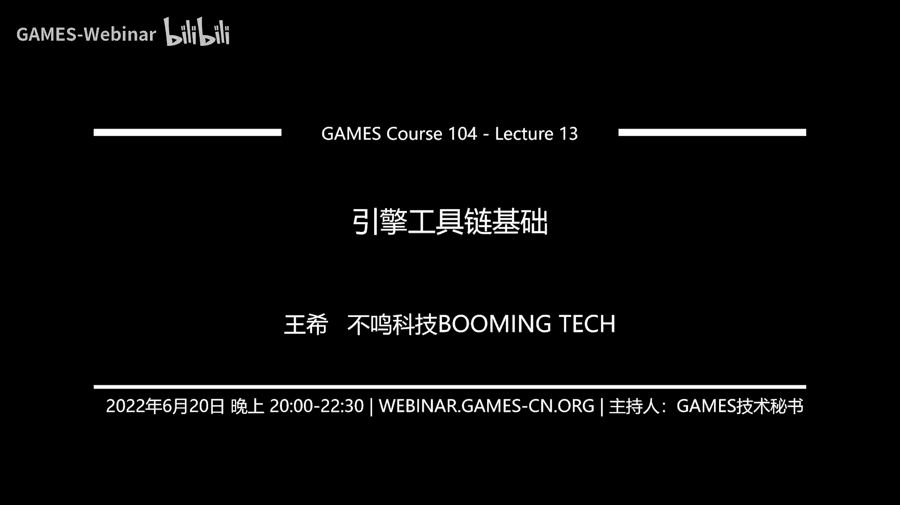
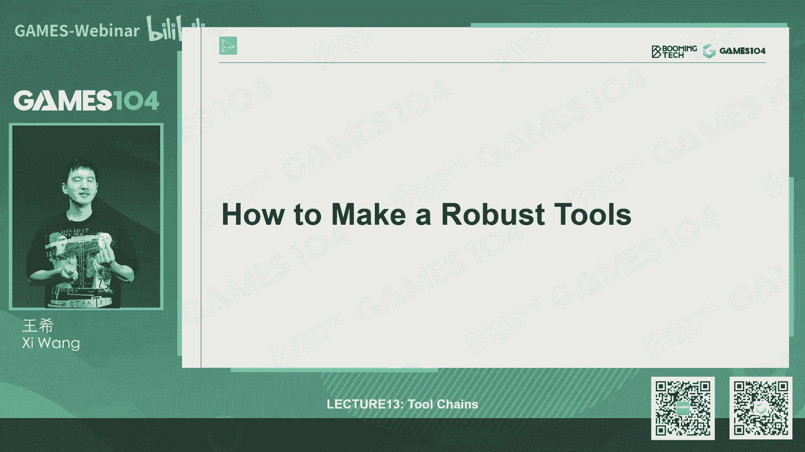

# 课程13：引擎工具链基础 🛠️ | GAMES104-现代游戏引擎：从入门到实践

在本节课中，我们将学习游戏引擎工具链的基础知识。工具链是游戏引擎中默默无闻但至关重要的部分，它负责协调不同角色（如程序员、美术师、设计师）协同工作，将各种异构数据转化为游戏可用的资产。我们将从工具链的定位、核心概念到基础架构，一步步解析其工作原理。

## 工具链的定位与价值

游戏引擎工具链的核心价值，在于调和几种不同思维方式的人在一起协同工作的平台。一个游戏团队通常包含三类人：逻辑严谨的程序员、感性敏锐的美术师和注重体验与反馈的设计师。工具链需要为这些使用不同“语言”的成员提供一个共同工作的基础。

## 图形用户界面基础

构建工具链的第一个挑战是处理复杂的图形用户界面。GUI的实现主要有两种模式：

*   **直接模式**：每一帧由游戏逻辑直接告诉GUI系统绘制控件。其优点是简单、快速、易于移植，但扩展性有限，且将业务逻辑压力集中在逻辑层。
*   **保留模式**：将绘制指令（如画一个多大尺寸的Box）存储起来，由GUI系统在绘制时统一处理。其优点是逻辑与渲染分离、扩展性强、性能好，是现代工具链的主流选择。

在保留模式基础上，为了管理复杂的UI逻辑，需要遵循特定的设计模式，将视图与数据模型解耦。以下是三种经典模式：

1.  **MVC**：将数据、视图和控制逻辑分离，形成单向数据流（Model -> View），View不能直接写Model，需通过Controller。这是最经典的解耦架构。
2.  **MVP**：View完全不知道Model的存在，由Presenter负责从Model取数据给View，并处理View的交互反馈给Model。这种模式更彻底地分离了View和Model，便于单元测试，但Presenter可能变得臃肿。
3.  **MVVM**：通过数据绑定机制，将View和Model彻底分离。View由交互设计师用声明式语言（如XAML）定义，ViewModel由程序员编写，定义简单的绑定关系。这种模式非常灵活，是现代商业工具（如WPF）的基石，但对特定生态依赖较强。

对于工具链开发，建议不要重复造轮子，应选择成熟的框架（如WPF、Qt）来构建稳定、可扩展的GUI体系。

## 数据的序列化与反序列化

工具链处理的核心是数据，首要需求是加载与保存。这涉及到序列化与反序列化。

*   **序列化**：将内存中的对象状态转换为可存储或传输的格式（如二进制块、数据库记录、网络数据流）。
*   **反序列化**：将存储的格式重新构建为内存中的对象。

数据存储格式主要有两类：

*   **文本格式**：如JSON、XML、YAML。优点是易于人类阅读、调试，任何文本工具都能打开，是极佳的调试模式。缺点是文件体积大，解析速度慢。
*   **二进制格式**：优点是文件体积小，加载速度快，且易于加密防止破解。是上线游戏的必然选择。

一个实用的策略是同时支持文本和二进制格式，用文本格式作为调试和开发时的可读版本，最终发布时转换为二进制格式。

在定义数据结构时，必须支持**资产引用**。游戏由成千上万个彼此关联的资产文件构成，通过引用可以避免重复存储相同的资产定义。同时，还需要支持**数据继承**，允许美术师在实例上直接修改部分属性（如贴图），而无需创建全新的资产定义，这提高了编辑的灵活性。

反序列化加载数据时，并非简单顺序读取。无论是文本还是二进制格式，都需要一个**解析**过程，将文件内容构建成一个**树状结构**。这类似于编译器的抽象语法树，是理解复杂资产关系的基础。对于二进制格式，通常在文件头部存储这个树状结构的描述（各字段的名称、类型、偏移量），以便快速定位和读取数据。

跨平台时需注意**字节序**问题。工具链内部可统一约定一种字节序（如小端序），在为目标平台打包时，再进行必要的字节交换。

## 资产版本兼容性

商业游戏开发周期长，引擎和工具会不断升级，必须保证新旧版本资产文件的兼容性。这包括向后兼容（新工具打开旧资产）和向前兼容（旧工具打开新资产）。

简单的版本号检查并填充默认值的方法在长期维护中会变得难以管理。一个更优雅的方案是采用类似 **Protocol Buffers** 的思路：为每个数据字段分配一个唯一且单调递增的ID。这样，在读取数据时，通过ID来识别字段，无论字段顺序如何变化、是否有新增或删除字段，都能正确处理。这对于由多个团队维护、拥有几十上百种数据格式的大型引擎至关重要。

## 工具的鲁棒性：撤销/重做与自动恢复

工具链的鲁棒性要求极高，核心功能之一是**撤销与重做**。在游戏编辑中，操作常常是关联的，例如修改地形会影响其上的房屋和树木。

实现这一功能的标准模式是**命令模式**。将用户的所有操作原子化为一个个**Command**对象。每个Command至少包含：
*   唯一ID（用于保证执行顺序）
*   执行（`invoke`）
*   撤销（`revoke`）
*   序列化与反序列化（用于持久化，实现崩溃恢复）

绝大多数编辑操作可以归结为三类原子Command：**增加**对象、**删除**对象、**修改**对象的某个字段。通过定时将Command序列化到磁盘，可以实现崩溃后的数据恢复。

## 统一的数据描述：模式

工具链需要处理大量异构数据。解决方案是从中找出共性，用基础的构建块（如`float`, `vector3`, `color`）来描述复杂数据。这种描述结构称为**模式**。

模式定义了数据的“分子式”，它使得不同工具能理解同一份数据。例如，一个“角色”模式定义了其包含的字段（如位置、网格引用、动画引用），这样无论是地图编辑器还是动画编辑器，都能正确解析和展示角色数据。

模式设计应支持：
1.  **继承**：可以从基础模式派生出更具体的模式，减少重复定义。
2.  **引用**：模式中的字段可以引用其他资产或数据。

模式的实现有两种流派：
*   **独立文件定义**：用JSON、XML等文件单独定义模式。优点是与代码彻底分离，易于理解；缺点是需要额外的代码生成器，易出现模式与引擎代码版本不匹配的问题。
*   **代码内定义**：在C++等代码中用特定宏或标记定义模式（如Unreal Engine）。优点是模式与引擎紧密集成，编译后即保证一致；缺点是修改数据结构容易引发整个引擎的编译和稳定性问题。

数据在工具链中呈现“三张脸”：
1.  **存储脸**：在磁盘上，追求空间效率。
2.  **内存脸**：在内存中，追求处理效率。
3.  **视图脸**：在工具中，追求人类可读和易用性。例如，角度在内存中用弧度，但在工具UI中显示为度数；颜色显示为调色板而非RGB数值。工具应为同一种数据类型提供定制不同视图的能力。

## 核心架构：所见即所得

工具链的核心精神是**所见即所得**。美术师和设计师要求在编辑器中看到的效果与最终游戏运行时完全一致。

现代游戏引擎普遍采用的架构是**将工具链构建在游戏运行时之上**。编辑器本身就是一个特殊的游戏模式，它直接调用游戏引擎的运行时来渲染和模拟。这样，在编辑器中调整的光照、材质、动作，与打包后游戏中的效果完全一致。

实现“所见即所得”编辑时，有两种播放模式：
*   **编辑器内播放**：直接在编辑状态切换为游戏状态。实现简单，但编辑数据与游戏数据可能相互污染。
*   **独立进程播放**：将当前编辑的世界复制一份，在一个独立的沙盒进程中运行。更纯净，更能模拟最终游戏环境，但消耗更多内存。对于复杂的大型游戏项目，这是更推荐的方式。

## 可扩展性：插件系统

没有任何引擎能预知用户的所有需求，因此**插件系统**是现代商业引擎的刚需。它允许第三方开发者扩展引擎功能，开发自定义工具。

插件系统要求引擎提供丰富的API，让插件能够：
*   注册自定义功能。
*   在现有UI中添加按钮、菜单。
*   访问和修改游戏世界的数据。

这就要求引擎自身的功能也尽量通过清晰的API模块化构建，使得插件开发与引擎内置功能开发站在同一起跑线上，极大地提升了引擎的平台性和生态活力。

## 总结

本节课我们一起学习了游戏引擎工具链的基础知识。我们了解了工具链作为协调不同角色协同工作平台的核心价值；探讨了构建GUI的两种模式及MVC/MVP/MVVM设计模式；深入研究了数据的序列化、反序列化、资产引用、继承以及棘手的版本兼容性问题；掌握了通过命令模式实现撤销/重做和崩溃恢复来保证工具鲁棒性的方法；认识了统一数据描述的“模式”概念及其两种实现流派；理解了“所见即所得”的编辑理念及其两种架构实现；最后，我们看到了插件系统对于引擎生态扩展的重要性。这些基础构成了强大、稳定、易用的游戏开发工具链的基石。