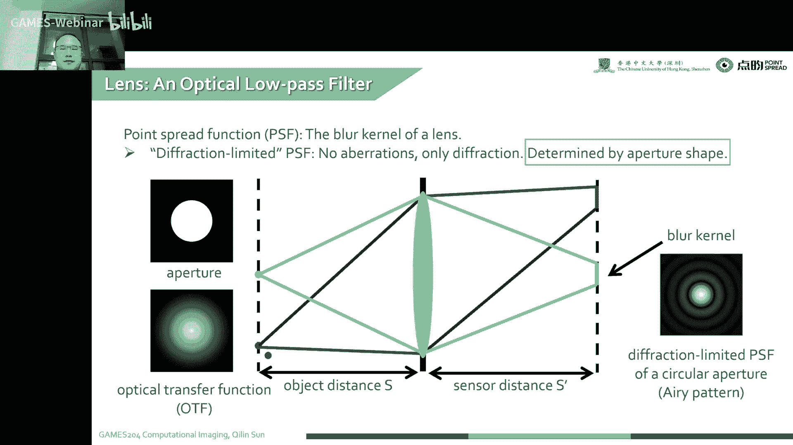
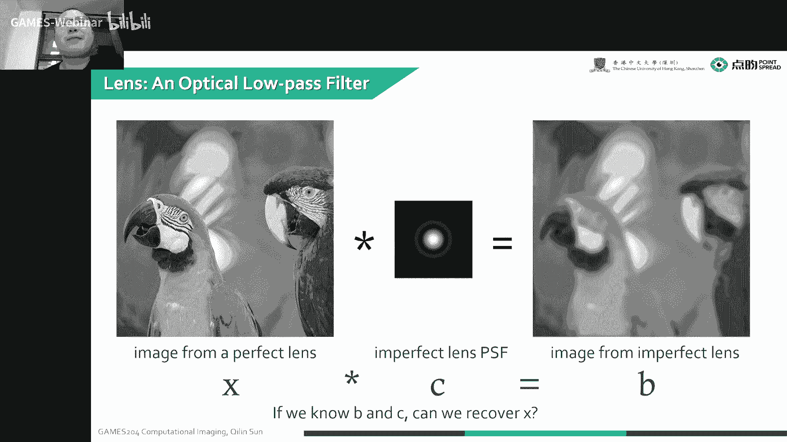
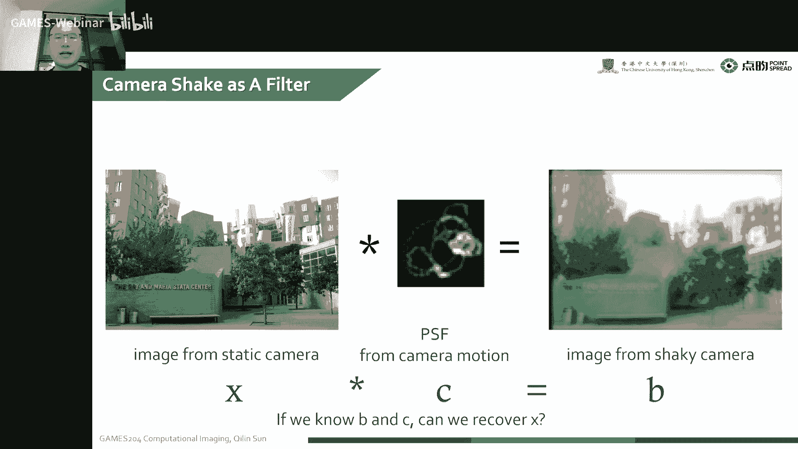
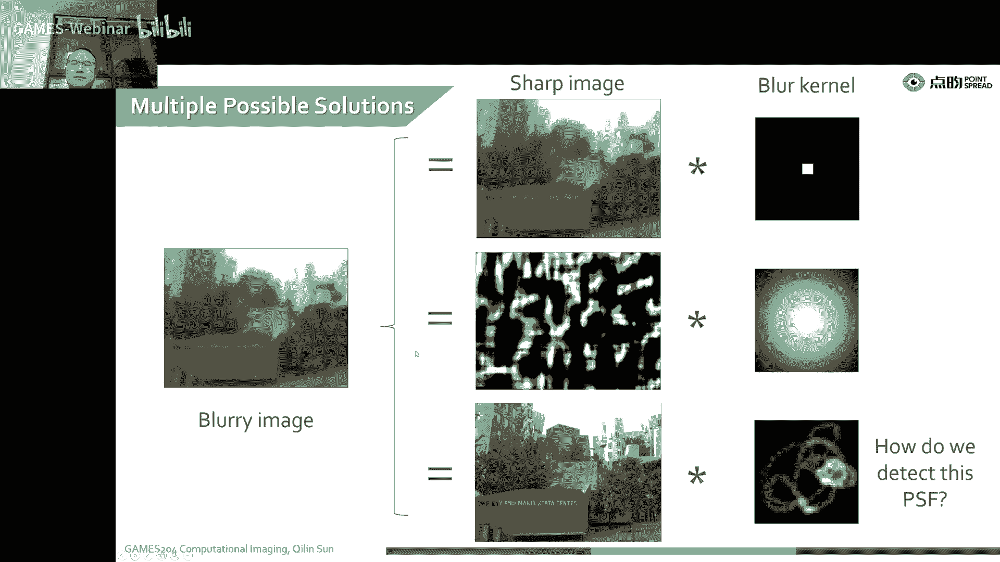
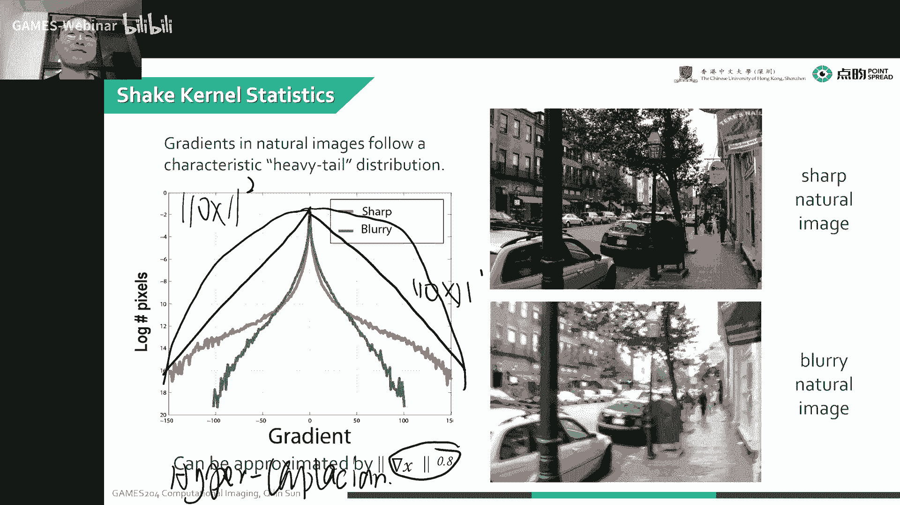
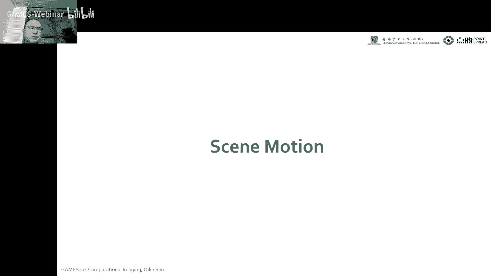
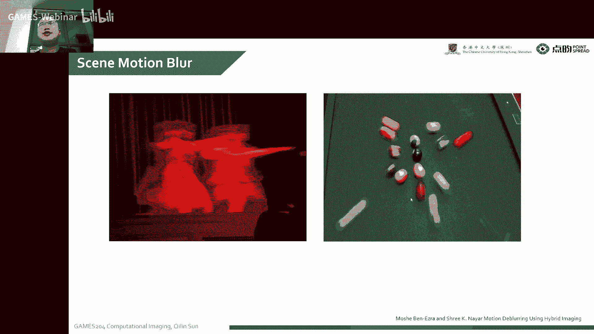
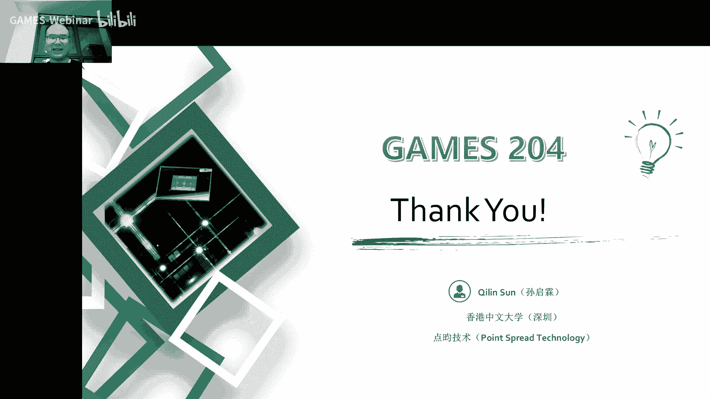

# 13.计算工具箱：图像模糊 ｜ GAMES204-计算成像 - P1 - GAMES-Webinar - BV1qe4y1v75r

好欢迎同学们回到计算成像的课堂，其实前几天呀就是自从我上节课讲过了那个flash跟not flash葡萄过费，也就是我们整个图像，我们手机拍照的时候要拍两针，先把我们最后那个反射去除掉。

这个这个很不幸啊，我试了市面上大部分手机这个都不行，这些功能都没有的加进去，这个还是希望同学们以后步入工作呃，相关的要做相关的工作呢，可以把这个功能加进去，我们是找了好多同学。

就是把市面上主流手机都测了一下，就是打开闪光灯，我去拍照的时候，他并没有对这个就是这种玻璃啊，表面的一个是flex进行纠正，所以说这个这个还希望同学们以后啊多多多多努力，最近昨天啊，昨天还是前天啊。

这是我们在上海嘉定开了整个计算成像的会议，也非常多一些新的内容嗯，也是非常有趣的一些内容啊，还有它在应用上都有非常多的一个进展，希望同学们也关注一下这个计算成像会议，嗯，应该是现在已经是开完了。

就是大家可以在整个计算成像官方的一个网站上去看一看，大家最新的内容，就我看到了有非常多有意思的内容啊，这个已经达到了几赫兹的这么一个速率，这个非常惊人，我感觉这个单光子的一个3d成像已经非常接近极限了。

非常接近极限了，这当然这也非常有意思，但目前为止就是嗯我们看到了很多就是单光子的成像呃，也像3d成像，当然本身啊这个我们最后都是基于一个新的器件啊，叫spd，也就是单光子雪崩光电二极管阵列，诶。

我们这也有单点的，也有单光子的，就是现在嗯世界上有非常多的一些小公司啊，已经开始用了，第一个真正的一个大规模应用的就是iphone 12 pro啊，那是上了一个一个小的expect之列。

当然它的设计比较精巧，他在照明的地方就是做了一个很科学的一个调制照明，就是我最后拍摄的还是一系列的点阵，然后呢它是通过一个vexcel一个成功的一个vcr管，诶，这个这个vs管子。

它不像我一个简单的一个只是点亮跟灭的这么一种reaccel管，它是有很多个引脚，这个引脚可以控制一下这个照亮照亮这个点的一个微微的变化，诶这个时候我就可以通过一个电控的一个扫描诶。

来最后呃通过一个时域的一个呃牺牲一点时间啊，就来扫描一个比较大的一个呃，点云精力当然也不是特别大哈，因为手机很多地方都局限于功耗问题，诶后来呃目前国内的一些产品上呃，还是没有用到这些3d成像。

当然以前嗯大概1617年吧，就是可能是哪家公司，我忘了，可能是oppo，但是用了一个etf的技术，后来apple用了一个t top，但这几年可能是就这2年吧，就是大家并没有找到在一个手机上。

这个3d成像到底能怎么用，所以说呃这一块就是整个市场上有有一点渐渐萎缩的趋势，当然我们呃整个的一个成像链路来看，就从低维向高维发展永远是一个趋势，就是我们也不至于介怀，整个市场就稍微有点下滑。

但也可能是受经济影响呃，它的整个整个的一个趋势还是向低位向高纬的一个呃趋势迈进，哎我们这个six d f呀，或者是更高维度的一些这个信息捕捉过来之后，诶，它实际上是我们后面构建这整个元宇宙的一个基础。

唉这个课前再给大家锤一扯，就是现在的一个目前的市场态势，当然要同学们要看到什么新技术的话，也欢迎在群里啊给大家共享一下，唉后面就是给大家掰扯一下，就是这个作业啊，马上下周出吧，我会把下一次作业或者出去。

就关于前两次作业啊，其实难度不是特别大哈，就是特别是第二次作业就基本上对是第一个对第一次作业的一个延伸，那第三次作业难度也不是特别大啊，因为我觉得这个毕竟是一门公开课嘛，如果不是太难的作业。

可能呃会影响同学们的积极性啊，所以说i s p嗯，第一节课给做的是i s t，因为i s t每个环节都不是特别难，但是可能大家会堆在一起之后，发现各种各样的bug就出现了，当然这个也不是啊。

这个地方是比较难的哈，因为工业里面呃用的环节多了，它就会出现各种各样的可能性，我们那除了想解决最后一个效果问题的时候啊，也是要解决一些corner case，这些collar case，比如像鬼影啊啊。

或者像一个呃快速的一个自动变焦啊，这个地方是没有给大家呃加进去的，因为这个只拍一个图，就没有办法给大家做一个像工业一样的一个s t，但是这整个链路我相信大家都已经是比较熟了。

这个时候嗯相信大家工作以后也会比较有帮助对啊，整个东西有一个完整的一个背，叛那后面呢呃我们后面的课程里会渐渐的涉及一些优化的方法，还有一个学术界使用了一些算法呀，那整个计算成像的课题哎比较多哈。

这个我们也不可能完全覆盖到，但主流的方法跟解决方案，这个大家会给大家覆盖到，其实大家想一想，这个计算摄影其实挺简单的，就干了两件事，第一个是光学编码，第二个就是用算法把编码的信息给提取出来。

哎无论是你想要把它变得shop一些呢，还是去个now，去个造呢，还是高级一点，我要做个呃image editing，它本质上都是调制和解调的这么一个过程。

就是说诶这个时候大家可以总结出来一个自己的套路哈，这解条里面有哪些算法可以用，调制过程，有哪些方法可以用诶，这个时候大家对整个的领域就有一个big plan，嗯好了，时间差不多了。

就是今天呃正式的给大家分享一下，就是我们computing toolbox里面非常重要的一个环节，就是image blue，这本来是想放在一节课讲的，但是后来看到这个。

因为这不乐跟迪普勒两个一起讲一点内容太多了，所以说呢就把嗯这一堂超长的课就拆成两节课，嗯诶这个时候其实啊伯乐大概我们总结一下基本的一种地面就不乐意，大概有四种成因，实际上很多时候就是因为手抖引起了诶。

我们物体的运动也会引起不，还有本身呢我们透镜的一些缺陷啊，还有加工的缺陷，还有衍射极限诶，这个时候也会影响我最后成像的一个不落的一个过程啊，其实最后呢还有一个就是auto focus。

我们知道我们无论是怎么样直接拖进这个透镜，都涉及一个谨慎的问题，所以说呢就我们大概总结了这个image ber大概有四种啊，image brea成一诶，我给大家今天这节课给大家一一的拆迁。

为什么我们的这个这个图像会产生这个不乐，然后我们这个blo那怎么解决的呢，啊解决的话我会给大家留到下一节课，下节课我们会啊介绍各种各样的一个deep乐的一种方法。

这个时候就给大家引入一种新的方法叫half codc splitting啊，同时也会给大家来介绍一下呃，transformer的方法，呀啊优化的方法呀，那针对这个布莱尔，它有各种各样的一种解法。

其实到最后大家应用的过程中就会有啊一个自己的一个想法，我们对于什么样的场景，对什么样的一个br诶，我们这个是怎么用它，当然现在有很多博乐啊，我是想对这个video，特别是比如运动相机。

唉我想对这个video直接debuted就是real time的，对我捕捉过来的video deep，这个时候又该怎么办呢，诶这整个blur and the deep这个过程中。

大家就会对整个的一个模糊啊，就跟去模糊诶，有一个非常完整的这么一个直观的一个解决方案，就在脑中，脑大，家脑中要有一个完整的一个解决方案，要抽象这个问题，然后去解决它，就刚才说到了，我们有四个b乐的来源。

还有加工的曲线，其实这个很简单啊，就可以理解为我们这个相差，还有它本身的physical limit，就是透镜，它本身都有口径嘛，怎么样，我们都是有一个演示的限制诶，我们这有这演示的限制呢。

就会生成一个像爱理班一样的这么一个点扩散函数，这个时候是会引起唉我们图像的一个不，那后面还有camera shake，这个是大家可能特别是手机摄影里面最常面对的一种ber，就是在拍照的时候。

手不大可能像三甲将一样这么稳，所以说这个时候唉通常我们的一个手机啊或者是一个相机啊，通常是会有些抖的，这个时候就会产生整个相机的一个blog诶，我们去怎么样去呃，就做一个盲选盲区卷积呀。

或者是怎么样是dj做这个模式理论诶，这个后面会给大家一一掰扯清楚，后面就是cd不了就运动的物体，这个很简单，还有就是受限于透镜本身的一个，还有一个depth of fi的一个问题。

什么叫depth defocus，这种引起的不是，先说一下有这个途径设计加工，还有物理的一个限制哈，我们知道对一个理想的一个透镜来说，我们想要嗯就是物空间的一个点，屋面上的一个点。

我要想要呈呈现理想的情况下，我会在下面上形成一个点，对不对，无论是啊尾炎的一个光轴呢，还是在一个比较大的一个啊这to view的一个情况下，我们理想的情况下都是可以从下面的一个点汇聚到呃。

这个雾面的一个点，汇聚到下面的一个点，当然这个实际的情况下，我们真正的一个透镜呢，通常情况下我们一个点一个在路面上的一个点诶，到了下面的情况下会成为一个班对吧，这个没有办法，就是我们本身这个真实的透镜。

它就是这种性质，就是，在一个点在一个图像上，它不再是一个点，它而且它是一个呃这么一个模糊的一个班的情况下，哎我这个时候我图像拿到的应该是什么样子呢，就实际上我们最后捕捉到了一个图像。

通常就是有一种blur的一种感觉啊，就是最后模糊，这是它的一个直观印象，我们的一个直观印象，当然我们可以看到它这个和的大小啊，就这整个对应的这一个班，我们就说叫他不乐克隆，通常像这种情况下。

哎我们有这个shift verance，就是随着空间深度变化的跟不变化的两种波兰的核，那大家都非常喜欢这种不随着市场变化呀，会随着深深度变化的一个不是各种诶，当然这种很难存在哈。

就一般好像我们这种这个这种布莱克的啊，通常都是随着市场变化的，唉当然也有特殊情况，比如说像我们这个camera shake，一般在这整个画面都是随着一个方向啊，记不对，所以这个时候解反而比较容易。

当然说到这个length imperfection就是有透镜的不完美，就它大概有两个来源，第一个就是透镜的相差啊，那不考虑加工问题哈，有突进的相差，之前我们也讲到了啊，这种低级啊高级相差，向散场曲畸变。

子午会差不是会差诶，还有一些像那种就是彩色matic oration，唉，这些地方都会引起我最后图像了一个模糊，但是我们就很喜欢一些叫shift emt的一些呃相差，因为他这个最后底部的情况下。

我这个和就已经知道了，比如说举一个例子哈，比较讨厌的地方，比如像会差会查这个这种想法，就特别讨厌诶，我随着整个市场随着不一样的一个距物体的一个深度，哎我这个点头呢还是都在变化。

这个时候对大家解这个去补乐的时候就变得非常困难啊，所以说大家通常对这个会差是非常讨厌，非常反感，哎，除了这个本身相差的一个问题，衍射也是啊形成不乐的一个重要原因，比如说像就是我们左下角这个意思。

当我们有一个透镜口径比较小的时候，诶这个时候衍射效应就比较严重，这个时候大家也可以参考一下这个小孔成像诶，你发现这个小这个孔特别小，特别小的时候，这个光透过去，这个它不再是直线了。

它就会受到一个演示的影响，当你这个小孔成像特别大的时候，这个孔啊它最后成像也会模糊，对不对，所以说这个小孔成像啊就是挺鸡肋的诶，他没有办法无限的小，因为会受到衍射的一个影响，诶它也不能太大，太大的话。

诶这个时候就会有一个本身就是小孔比较大，难以在光，就不是延迟性传播吗，诶它本身，而且他自己哈口气都特别小，我只能通过那个小狗的光，所以说小孔成像啊就逐渐被历史淘汰了啊，右边那个就是啊。

举个例子就是平面波穿过一个比较大的一个一个孔，这个时候我们就发现诶这个整个波扩散的不是那么厉害，我们可以这么理解哈，它一个大的一个这个孔的时候，我们可以理解为上面每一个点都是一个小孔。

唉我一个一个单点我会产生一个球面波，经过也是会变成一个球面波，但是有这么多个点，就是这么多个球面波的一个叠加对吧，但是我们这个时候就会慢慢写的，其实屏蔽一下能量更汇聚一些呃。

这个会给大家后面做一个详细的一个解释，这个给大家展示了一个呃，因为这个衍射极限产生了一个ps，但我们不考虑这个这个情况下，我们不考虑这个相差哈，我们只考虑这个衍射引起的问题，这个衍射是被什么限制住了呢。

实际上衍射是被口径限制住的一种局限，也就是说我们的布洛克诺啊，大概就像右面长了一个像一个一个环一样的感觉，这个叫衍射环，这个有时候大家如果要呃这个也就是也可以，大家认为这是一个爱理班。

他实际上就是整个口径的一个分裂变化，就是这个关系也挺明确哈，因为像我们透镜都比较长了，你就可以理解为它是一个原厂的一个颜色诶，这个时候整个透镜的口径跟这个后面的一个bloco的一个关系。

大概就是一个复利叶变换的关系，这个这是单透镜的情况，多透镜的情况下，通常呃就是一个action，就是孔蓝的一个自裂变换，这个在后面的一些就是coded action的那个章节的话。

会给大家详细的讲解他们之间的关系啊，这个也不是特别难哈，但这里面嗯我们要给大家分享一下，就是演示的一些基础知识，就我们用这个弗朗和费衍射呃，来描述我们整个的一个就成像的一个过程。

因为本身大概分镜衍射是一个进程衍射，然后弗朗和费衍射是一个原厂颜色啊，这个具体的分界线哦，我记得不是特别清楚了，应该是你可以理解为大于100个栏目的，好像是100哈，我记不清了，大约100个兰姆达。

你就可以认为是一个呃弗朗和费衍射唉，这个时候你最后发现这个数量和分演示的公式啊，除去前面那一大串乱七八糟的一个系数，后面的真正的变带变量的地方实际上就是一个数列变换，你甭管它系数是多少。

后面就是一个数列变换，哎这个时候大家变得非常喜欢啊，然后第二个就是我们假设我们用的是一个非相干光，就是我们这个假设我们这个最后测量的光，它不是激光啊，这个时候就我们正常拍摄，他也不会用激光去照明。

当然也是这种，当然也有这种特殊情况，就像我们那个time of flight camera，或者是我们呃就是做这种深度测量的时候，我们通常是要用激光照明的，但也有一些结构光也是需要激光照明的，这是特。

殊情况啊，这个我们会在一个特殊的例子里面会给大家举报这个激光照明的情况，那我们考虑到比如说我们举一个e d的例子，就是我蛮地的defection，我们有这么一个呃方波吧，就是沿着中心轴对称的一个方波。

假设单位的一个呃单位高度的一个方法啊，我们做一个分离变换，首先我们做一个分裂变换诶，然后那个方向呢我们做一个自相关，我们这两个拿到了一个是什么样子呢。

同学们可以告诉我我们这个一个方波这么一个方做了一个穿复列变换，我们最后拿到的是一个什么样的函数呢，大家可以打在公屏里面去说一说是一个什么样的函数，然后我们做自相一个，方波做一个自相关。

他拿到了又是一个什么样的函数呢，对诶这位小朋友，这个三只龙哥，这位同学诶就可以快速的反应过来了，这是一个think方式，我们大家做自相关的自相关，就是大家也很简单哈，这个直接就是一个tt一个方程。

只要这一个方变成一个叫三角三角波，对不对，我们这个时候比如说我们对这个think function，就是我们给它做一个平方，这个时候拿到了一个图像，诶，跟这个三角波做一个分裂变换，诶我们可以拿到诶。

这个很神奇哈，我们最后拿到了一个function，就是整个think函数的平方，但这个实际上大家学过信号与系统，这个其实非常简单，就是频率的乘等于11的绝，11的长等于p的卷，对不对。

我们可以看到比如说第一个上面那个那那个分支，刚开始我们做了一个数列变换，来我们在频域频域相乘对吧，我们拿到了最后的一个sc的平方，下面我们是在频率先卷卷完后再分裂变换，实际上跟下面整个过程就是等价的。

当然同样的一个原理，我们也可以延伸到二维，当然我们可以想象一下，我们这个方波稍微大一些的时候，哎就是我们这个周期变得更长了，我们这个sc方式应该是变得怎么样呢，想象一下我在我的食欲里面。

我这个周期变长了，对不对，也就是这个x变成了一个，乘一个系数就成了阿尔法对吧，阿尔法x，然后这个think变成阿尔法x，有think的这里面变大了，也就是说这个就变成一个呃它的分之一。

这实际上就是大家可以看到哈，比如说这个阿尔法等于1/2诶，我这个时候我整个think函数就变得更窄，这同学回答的很对，在下面的呢你发现这个方波更宽的时候，这次点击它的整个三角波也变得更宽了。

实际上就是一个呃频谱展宽了，哎频谱展宽之后，这个这个不是啊，这个整个时域展宽了，时域展宽之后呢，我的频谱就变得更窄了，最后最后拿到了，一个think的一个平方实际上就会变成一个更窄。

哎大家加上我们这个更宽的情况下，我们可以看到这个好家伙，这个频率这个做了分离变换，频率里面变得更窄了，那我我们也可以想象到无线宽的时候，对不对，大家就这个阿尔法现在是1/10。

这个阿尔法变成无穷分之一呢，然后这个think就变成了一个dfunction对吧，也就是变成一个呃冲击响应，做分离变换之后就是一个冲击响应，然后呢，当然你这个无线宽之后，这个三角波也变成了一个平的了。

对不对，无论怎么自己卷也是平的，对不对，哎做分裂变换，平了之后还是一个呃德尔塔波，就是，无限假设这个泡沫无限换的一个情况下，但这种情况下，当我们延伸到二维，比如我们的口径是这么一个圆。

我们这个口径给自己做一个自相关呢，我们就会拿到一个像中间这一个不乐的一种感觉，当我们对它就这个不乐的，可能做一个分裂变换来，我们就可以拿到一个就是在飞机刚关非相干光照明的情况下。

诶这个ture就我这个呃action对应的一个点扩散函数就可以拿到了，但我们也可以很容易的想到我更大的一个口径，我最后的点扩散函数实际上就是越小的，就是我能量就越集中。

这个时候因为点扩散函数引起了一个blu诶就会更小，所以说啊有时候大家就特别喜欢那种超大口径的透镜，特别是在天文探测里面是吧，比如说我要看到一个几亿光年外的一个星星，这个时候口径就直接决定的分辨率。

因为其他地方的相差啊已经非常小了哈，这个时候我们整个望远镜的口径啊，就直接决定了最后分辨的极限是多少，当然像这种啊，因为就是衍射而限制的这种呃，defer就是要限制分辨率的，就也发生在显微镜里面。

就是大家显微镜里面通常啊这个有点不一样啊，这个显微镜里面是用一个new micro aperture来表示这个课程没讲过了，怎么样去提高显微镜的一个分辨率呢，所以聪明的人类就想到了汽油这种方法。

就我增加就我物镜跟我sample的一个之间的一个reflecting index，这个时候它的一个new map app就会相应的变大，实际上它的衍射极限就会有所提升，也就是他的一个点上班就会变小。

分辨能力也上去了，但有一些聪明的人类啊，甚至把这种方法用到了光刻里，就是我最后我那个光刻机做芯片的时候，要把那个图案投影到我们这个加工了一个违法上，也就是晶圆上。

这个时候也是有效的提高了一个new micracture，也有这种清叶的方法，这个是可能是90年代尼康提出来的一种清洁的方法，所以说那个时候呃这种制成啊，那时候紫光源不是特别好啊。

就大概是呃极紫外光源可能还没有做出来，大家想要通过现有的一个紫外光源来提高它的一个分辨率，也就是提高我正常能力，这个时候就会选择汽油嗯，来解决极限，还有这么一个问题，大家可以看到诶。

我把这个这个这个口径调大一些，我们就可以看到之后，分辨能力就有所提升，呃大家思考这么一个问题哈，我们为什么想要一个这种圆形的，一个我们想要为什么想要一个圆形的口径，这方的不行吗，三角形的不行吗。

右边形的不行吗，为什么大家更倾向一个圆形的这么一个app，大家想一想这个问题啊，这个方形的是不是也挺好诶，我加工一个方孔好像没啥问题，六边形呢也可以啊，大家想一想，就是我们是第几节课。

第二节课就课前给大家分享了一个新闻，就是我们那个微博万境，他的那个透镜啊，就是一个六边形的透镜，大家想一想，六边形的透镜最后成像产生了什么样子呢，这个为什么我们更加倾向于圆，而不是一个六边形的透镜。

对不对，再想一想，其实这个很容易呃，解答就是我们可以看到我们这个action对应的一个点开的函数啊，实际上大家可以理解为是一个带系数的分裂变换，我们一个圆形的一个分裂变换。

它还是一个就是这种中心对称的一种布料，当然我们像当然比如说举个例子，我们拿到一个这种方形的一个孔径诶，我这时候做一个分裂变换，他就可以拿到一个各项异性的一个点空调函数。

这个时候对大家去做底部链其实是呃挺不利的这么一个情况，就是他不乐能量，它在某一些方向哎太集中了，其实这个对后面视觉观感呀，还是后面处理就不是特别好处理，当然就举一些极限的例子哈。

比如说像我们这种十字形的这种点光的函数啊，右边这种十字形的点光的函数，在遇到那种过曝的情况下，就是有有一个灯特别特别亮，就我这个能量过于集中在x y两个方向的时候，就会非常引起周边的一些像素饱和掉。

这个时候对后面的算法处理是非常不利的，就是我那些好的一些像素被因为你这个饱和了，好家伙，这个最后大家都没法处理了，那圆形的啊，这个最后干扰的一些像素的一些额数量会更少一些，当然除了这个，比如像韦伯万境。

我们看到的是一个六角666芒星一样的一个地方的函数，这都是一个各项异性的一个bl的内核，当然在这个计算摄影里面啊，我们有时候也会故意的设计一些这种各项硬性的一个blo呃，来，就比如保留一些高频呀。

或者是一些什么情况下在里面对我们后面的信息恢复更加有利，当然这是啊另一种情况，这是我们故意设计，它是成这个样子啊，一般的话大家还是想要一个各项同性的这么一个不赖的内核。

诶这个时候大家可以看到我的一个actor圆形的孔径。

那个action，诶，这个时候我们其实是可以生成一个optical transer function，唉我们通过这个optical transfunction，就实际上也就是这个孔径在一个f f t。

实际上实际上是f f t啊，大家然后在我们这个相面上就是f f t平方，就是我们这个项链它只能并且只能这个拿到最后的一个intesting嘛，实际上是拿到一个整幅强度，这个时候有时候大家也叫艾米班。

这个实际上就是它整个成像的一个过程，我这个大小不可能的大小，就取决于我最后整个透镜的一个孔径的一个大小，还有行动，唉当然我们受限于当这个衍射极限的时候。

这个透镜啊自己啊实际上就表现为一个optical law fast future。

就是光学上的一个低通滤波器，就是我们受限于这个顶峰散函数了，我们在频谱里面实际上就是pp里面画了个圆对吧，就我们这个外面的一个圆，外头这个高频啊全都被我这个孔径给限制掉了。

就是说有一些高频的细节会受到影响，但我们这个怎么表示呢，其实表示也很简单，就是我有一个自然情况下理想的一个高清的一个呃这种图像诶，我经过这个套件之后，经过这个of table lost future。

我最后实际上就是跟我这个点光弹数相卷积到频域里面，就看我们两个频谱相乘，简单的一个点乘哎，就是就是它了，我最后就拿到了一个blue的这么一个图像，就我们17号就是blur的图像，我们记为b啊。

这个卷积核我记为c perfect，这个图像我们记为x就是我们要求的图像，我们观察到图像，我们在这个图像传感器上刮察到的实际上是b对不对，这个不列的一个图像，我们这个blocl呢就是模糊盒。

实际上也是可以通过一个标定的方法去来获得的，所以说这个通常情况下我们是知道了b知道了c，我们想要求的呢是这个x我们是怎么样去求他呢，但我这节课只是把这个呃formation列出来。

下节课我会给大家讲一个详细的解答方法，诶下面说就是第二个呃。

这个blog来源就是camera shake，就我们就是也就是相机抖动，或者是理解为手抖也可以，没问题，这是一个重中之重啊，这是本节课的重中之重，这个也是呃很多手机相机厂家做那些光学防抖啊。

或者是电子防抖的，然后都是为了解决这个camera shake的问题，说到camera是个本身我们会形成一个motion的一个psf，也就是我运动的一个点，换上函数诶。

这张图就给大家呃说出来了一个啊这么一个就整个motion的一个过程，大家可以看到整个纵向的轴，实际上就是我最后在图像传感器上积分的能量，它是一个跟什么相关的函数呢，它是一个呃速度分之一。

你可以理解为我这个特别高的地方向红的地方诶，我移动速度特别慢，我就是在这个时候我接他的时间更长，所以说这个地方会高高了低了，xy方向就是就是正常的一个空间空间分辨的方向。

所以说我们这个motion的一个点空的函数，运动的点空的函数，它是一个关于什么的方程呢，第一首先它是跟我这个motion的一个路径，就是我手抖啊或者相机抖动的一个路径相关的。

第二个呢它是随着一个motion的一个speed，也就是我整个相机或者手就抖的哪个地方快，哪个地方慢的一个函数，所以说我们这个纵轴啊，它虽然说是能量，实际上它呃也就是一个速度分之一啊，就是速度快的地方。

我这个地方能量积分就小一些，速度慢的地方，这个能量积分就多一些诶，它是关于这个数分之一的这么，一个函数，那我们实际的情况下就可以看到一个camera motion啊。

就是中间这么一个motion的一个情况，像这个地方就是速度比较快，我在这地方抖的时候速度比较快，他这个能量就少一些，像这些比较亮的地方呢，就我在这个地方抖动的比较慢，这个时候能量积分的就更多一些。

其实要是大家对整个就是物理学的多一些哈，就是大家会观察到，就我这个motion path是拐点的地方，通常是能量比较大的地方，就特别是变向我抖动变向拐点的地方，这个时候它的能量是通常比较大，的。

同样我们可以描述整个b乐的过程啊，就是一个呃就是一个干净的一个图像，x跟几个black kernel c卷积形成一个啊shake的一个模糊的一个图像，b实际上我们要求的还是这么一个。

知道了c跟b求这个x这么一个过程，嗯嗯大家直接从这个图像想要解他哎是不是不对，c做个逆卷积是不是就行了，当然这个情况下我们很多呃这种点击的过程中会有信息的损失，我们直接做一个节点机呢。

比如像维纳滤波通常会有一些不好的artifex，那这个时候我们通常是要加一些物理学的约束，就我们自然界的图像是什么样子，通过这些物理学的约束和同系的约束来来，最后实现我们想要的一个结果。

因为我们最后要产生这么一个ber的图像。

不是有可能有非常多的这么一种情况呢，就比如说我这个图像本身就是糊的，我这个布料看着好像是一个理想的点，我这个时候也会产生一个古乐的图像对吧，像我有这么一个乱七八糟的一个呃，就是能量分布的时候诶。

我卷积了这么一个大的一个盒，哎我也是可以产生这么一个blog image，对不对，那还有一种情况就是我们就真实自然界发生的情况下，哎我们这个非常清晰的图像卷积了一个呃布料的和。

这个时候我就也会拿到这么一个bug，实际，上我要解一个逆卷积的时候啊，就非常拿到非常非常多的一个flotion，就非常多的解解空间比较大，就我们可能拿到非常多乱七八糟的结果，不是我们想要的。

但是这种解空间比较大，它本身是一个一个病态的一个问题，就是他有一些信息的损失，我们要想要解出来这么一个病态问题，那个解空间比较大，我们要怎么办呢，实际上就是加约束，首先呢那加一些哪些哪些的约束呢。

我们可以做约束的地方有两点，第一个就是图像本身的一个约束，就是我们这个首先啊我们是想让奥姆的图像更加的像一个nature的，一个自然的一个图像，对不对，然后第二个就是我们的这个科隆。

因为这个camera shake引起了克隆，它应该像一个motion p s f，唉我们是用这两个b来去进行再进一步的抽象，我们就可以拿到根据这两个我们这个方向来拿到他的一个图像约束。

进而来约束最后的一个解空间，就是我们考虑到这个自然的一个图像，就我们自然图像会有一个什么样的一个情况呢，这是一个红色的这个图像，红色的这个曲线是自然图像一个鬼脸的一个分布，我们可以看到这个横轴啊。

就是我这个整个图像的一个规定的一个值，我们自然的图像通常是一个比较长的尾巴的，这意味着什么呢，就是我们这个统计的一个指的就是就是我们有很多高频低频的地方，它的一个分布规定只是小的地方当然是比较多啊。

因为我们本身这个就是比较sparse的一个图像，当然我们在一些鬼脸特别大，就是梯度特别大的地方也是有值的，那这个时候有时候有时候也会把这个呃标记为这么一个，嗯标记为这么一个hyperlaution。

就是就是hyper拉伸的这一种表示，就是这个图像这鬼点的一个方向，大概是一个0。8的这么一个一个hyper拉拉伸啊，说到这个hp拉伸啊，这本身的这个，拉普拉斯的分布是怎么样的呢，就给大家画了一下哈。

这个本身的一个拉普拉斯分布啊，它大概就是，这个这个是x你可以理解为一对吧，当然你要像这种呢，就是，这二阶的那我们要本身啊，像我们这个规定的分布大概就是一个0。8，这个叫hp拉拉。

但是我们也可以看到就是我们不认的图像，它的一个不点是咋分布的呢，因为不乐嘛，我们会有一些高频的损失，特别是一些大的鬼点头就会被模糊掉了，所以说我们在特别是一些比较大的一个规定的情况下。

我们这个时候通常哎我们这个统计值就会有点衰减，实际上我们最后要优化的一个图像的目标，就是我把这个蓝色的这个br的一个图像恢复到跟这个sharp的图像，sharp的自然的图像，这个红色的分布曲线一致。

这个曲线响应大概是0。8哈，是从很多自然界的图像中统计出来的，就是大家就认为这是一个自然界的规律就好了，所以说我们从这图像本身的一个角度出发。

我们这个整个图像的拐点的分布啊，也就是我最后的一个hla的一个约束，也就是呃round x0。8这么一个，这么一个约束，然后考虑到最后的这个点cos函数呢。

就我们要让我们的这个点风散函数更像一个motion kernel，首先一般好像我们这个手抖的地方，它是有一个路径，实际上也就是在我们这个路径上，每个地方划了一条线，其实我们像这种布莱克诺啊。

一般它都是有一个稀疏的一种情况，因为我就是在一个面上画了，在一个呃运动的面上画了几根线嘛，就是我这个点它就是都是线，所以说这个时候它本身应该是稀疏的，这个时候是可以作为约束的。

哎而且第二个点呢就是它本身是连续的，我抖嘛不可能中间会有断断续续，我这个相机啊，它的运动的一个过程肯定是一个连续的，这是第二个对这个kindle的约束，然后第三呢就是我们因为它是一个速度分之一的函数。

就是它没有负值啊，它都是正值，所以说我们就有了从图像上这个层面，还有从这个brother ko两个层面的约束，但是我们用到这些information，我是怎么对这个图像最后来实现了一个嗯。

就ban就是decaution呢，这个时候我们该怎么办呢，哎我们从先从统计的地方先说一下，这个还是先说一下这个整个的一个image formation。

就是先假定我们最后图像传感器上观察到了这个ber image，我们记为b啊，blur kernel就是c，然后sharp image就是我们要求的一个x，实际上是我们已知这个不断克隆跟b的情况下。

就是我们观察到的是b，我们要估的这个值就是x观察到了b，我们要估这个x它是一个关于什么的函数呢，首先就是我们可以把这个理解为，首先这个把这个把这个前面这个概率拆分，我们就可以把b估出来。

这个是最大自然估计，也就是本身就是data term的一个约束，就是我们这个普莱尔玩的图像要跟sharp image叫对应上，就是我们这第一层关系，然后第二层关系呢就是整个图像传感器。

就是整个自然图像它自己的一个约束关系，也就是image prior，就是我们刚才讲到从image那个层面就给他建立了一个约束，那第三个呢就是我们从这个博乐克隆来建立的三个约束，他第一是他是啊永远是正值。

第二个就是它是稀疏的，第三个就是呃这个是连续的，这就是不乐方向的一个prior，最后我们怎么样去把这个方程建立起来呢，实际上我们最后要解的一个方程啊，我们在图像传感器上诶所拿到的就是一个，不料的一个。

b然后我们这个c也是已知的，然后我们要求的就是这个x这就是我们的一个dterm，那么有时候也叫data facility，就是无论我观察到了b啊，我这个要求的x跟这个估出来这个bloco做卷积之后。

这个时候他一定两边要相等才对，要是不相等的话，就说明我们要求的这个latent image x就是有问题了，那第二个点呢就是一个hp拉伸的一个约束，这个它是符合一个0。8的一个分布。

也比较符合就是自然界的图像的一个分布啊，这个当然有时候大家也会说是0。5~0。8哈，当然大部分就是默认的情况下，0。8是最好，那第三个呢实际上是啥呢，为什么让这个c最小呢，实际上c就是不带坑呢。

它本身是稀疏的，这个地方我们只呃做了一个稀疏的一个约束，因为可能我们要再加一个那个连续性啊，这个这个不大好解，这个这已经挺复杂了，这个这个时候解的时候一定要已经要把他这个拆做迭代，然后再解了。

我们再加一些东西，可能就就就不大好解了，所以说这个时候通常人们也会有选择性的忽略，当然我们这个每一项对应的这个我们已经讲到了，当然它在就我们刚才那种图像里面，它应该是怎么表示呢。

就是我们的data term，就是意味着我这个sharp的一个image，我这个dimm就给他这个shop image跟这个我估出来的这个blocal，就做一个卷积。

就会拿到一个buried image，然后呢呃同理就是我们第二就是nature image pro，就是自然图像的一个呃这一个呃分布诶，为何如何获取c啊，其实这个c啊在我们解的这个过程中，他是不知道的。

就是我这个c跟x都是一个变量，我要解这个方程，我要同时优化x跟c，所以说就因为x这个c本身是稀疏的嘛，我们在后面加上这么一个运动项，我们最后来求解这个就是这个cost function的时候。

我们是把这个x跟c同时解决出来的，所以说这个我们在解这个sharp image，同时也把这个c估出来了，然后这个斗六八同学问图像辛焱为什么可以这么加约束，因为它自然分布确实就是这个样子。

因为我们加了之后，这个就是符合它本身的一个自然界图像的一个统计规律，这个时候我们是可以把它加进去的，来，大家可以理解为，连续性约束可以用lost box表示出来，比如说啊大家要求这个你可以求一下。

就是这个整个uber color每个点沿着它就是法线，就是它那个法向量的一个连续性诶，这个时候如果不连续的话，这个地方也是可以表示出来的，当然这个时候就不大好解，有时候加这个就是这种系数性的已经够了。

你再加多的话，你就可能不收敛了，这个我们也经常遇到这种情况，你就解着解着乱七八糟东西加多了你就不收敛了，这个就就不大好，所以大家理解为这个nature image trial，大家可以看到就不认识图像。

它通常一些高频就大的规定的会有损失，然后这个shop图像呢就是它一些大的规定呢它是比较多的，大家加这个约束，实际上就是把一些不利的地方，它那个对比度强行拉上去了，可以这么理解。

实际上就是整个对比度进行增强，所以说啊，为什么我们要把这个蓝的这个blair的一个分布曲线，拉到跟这个shop里面的一样，是不是，然后同时这个时候呢我们前面又符合这个data term。

data pdity，这个时候就可以解出来一个比较好的结果，但我迭代的过程中也把这个布莱克l也给解出来了，后面下节课我会给大家详细的讲解这个这个这个优化方程怎么解啊，这个cos方程到底咋解。

那我们来验证一下哈，然后我input的一个图像长这个样，是不是我们只是简简单单的做一个就解解卷积的时候，比如说，只是做一个就是deconclusion，这个时候我们可以看到做一个简单的地图。

我们不加任何约束，可能看到的呃，这个非常难过啊，这个就各种artifact都解出来了，实际上也就是我们最后想要勾到了一个物理模型本身啊，就是这个bloco的模型跟这种真实的长得不太一样。

这个时候我们这个整个受约束的一个cost function这个目标函数啊，就会呃很好的解决呃，这上面的一个artifacts的问题啊，实际上就是它让它更符合自然界的一个分布规律。

大家可以看到这个呃这个inverse laws，就我们这个cost function的，就跟那个pixel dency diy的一个关系，我们可以看到我最优的一个解啊，就inverse lose。

这个就是cos方cost方式的分之一，这个点实际上就是它的一个第一个最优的点，我们可以可以认为嗯它是一个optimal的一个速度，也是最佳的一个c跟x解出来了。

当然啊我们也可以看到我们最后这个pixel intense，就是像素密度更大的时候，我们也会就可能会产生一些不好的一些解啊，就是解出来各种各样的artifacts。

所以说我们这个有时候有这么多解的情况下，我就不好办了，不办好办好了，就是这个时候咋办呢，实际上有时候大家就给出这么一个方案，对那个是最大值，那不是那是分之一啊，cos分之一实际上是最小值。

对就这对这个cos function来说是最小值，所以说有时候有这么多解的情况下就不大好办，这个咋办呢，就是有时候同学们就会就是会想到这么一种哈，就是我不太好对这个极值点直接拿到。

我就干脆搞一个wet average，就我对这各种各样的一个solution哎，做一个简单的一个加权的一个变换。

所以说我们可以看到通过一个我们通过一个加权的一个变换，我们就可以拿拿到一个比较接近最后一个真实的一个kernel的一个情况，所以说当然这个也不是特别好哈，我们这也是没办法，你不大能确定那个值是最好的。

所以说你这时候做了个加减变换啊，加权的一个相加，就是拿到一个呃不是特别好，也不是特别差的这么一个结果，所以我们对这个这artifacts本身啊。

还有这个最后布出来的那个盒，他有自己有非常多的一些呃对应关系，比如说举个例子哈，像上面的一些就是本身我们最后估出来了一个block对吧，下面这个呃实际上就是我们最后对应的一个image pting。

大家可以看到啊，这各种各样这个布莱克隆产生了一个图像是啥样子，然后另一个来源呢就是我们说到第三个呃。

这个motion这个blog来源就是整个motion blur，就是就是场景object的一个运动的一个问题。

但这个呃就非常经典了，就是当我们就哪怕是我在理想情况下，如果把这个相机啊干脆就固定在那，就我用一个三脚架固定在那诶，这个时候但是我那个曝光时间比较长，因为有很多像拍电影啊，你这个时候我就是24帧。

每一帧曝光时间就那么长，诶但是我这个运动速度比较快，就会有一些motion b到，特别是我们舞台表演，左边那个图是我们一个舞台表演的一种情况，诶这个时候就发现这整个人都模糊掉了。

当然这个呃模糊的路径呢也会跟着这个物体运动的路径而变化而变化，但这个smotion是比这个camera sh更复杂，因为我不能限制这个整个c像camera一样，它有一个固定的一个不认路径对吧。

像我们人体它有比如说举个例子哈，有人呀脑袋呀，手啊，这种身体啊，你各个地方运动的一个方向都不一样，所以说各个地方都会产生对象的不认，这个地方是比较棘手的，所以说通常大家会分派式去做这件事。

也就是估一下在不同的一个位置，我最后的motion kernel到底是怎么样的，哎所以说在有些时候大家也会想到这种h264 h2 v265 编码。

我们也是要把这个motion reaction都算出来了，这个有很多底层图像处理啊，有非常多的相同之处啊，右边这个是一个呃这个这个开球的这个motion ber，就大家可以。

当然从这个motion pl大家可以看到哪个球运动的快的，英军能慢，这个也是一目了然。

那最后一种不论产生来源呢，这个大家给大家之前讲过哈，这个是叫因为景深引起了一个呃defocus的一个问题，这个有时候也叫autumn focus bar。

让我们回顾一下这个auto focus blog是怎么产生的，比如说像我们这vocal plan，在这个focban上，我们理想的一个点可以在我最后的双向传感器上形成一个点。

但是我们把这个物体放得比较近的时候，我们在这个图像传感器上就形成一个弥散圆，这个弥散圆我们把它称为这个circle confusion，他这个离散元，当然这个弥散盐只要不超过呃一个像素的一个大小哈。

这个我们还可以认为它是清晰的，所以说呃这一个像素在前面跟在这个focal plan的一个前面，跟后面对应的两个点之间啊，我们就可以算出来这个景深对吧，当然对应的我们也可以啊。

根据这个弥散圆的大小把这个胶真给算出来，这个都是呃跟那个像素，跟前面这个口径和息息相关的这么一个像，这是另一种情况，就是在交钱交货，我们可以看到都会形成这么一个呃focus of blur。

这种就没有办法，这个是所有的透镜都会有这么一个谨慎的问题啊，这也就是out of the fox的一个问题，这是我们之前一篇文章里的图哈。

像这个so lab，第一个是so lab的一个啊非球面镜啊，他是啊其实也是比较好的，单投进了基本上算是是一个非常好的一个单透镜，就ai i50 ，我们对焦的地方，我们看到1米的地方。

它呃有一个非常小的一个点光的函数，能量非常集中，也就意味着我在这个1米的地方，我最后看到的图像是非常清晰的，但是哎在不同的一个对焦位置都会产生一个不一样大小的一个bloco。

同理的像呃我们这种ac 254，它是两个非全面镜的一个组合，特定啊表现稍微好一些，稍微好一些啊，无论是呃对这个胶面还是一个就离交的一个位置都是比较好，但也没有特别好啊，这0。5米跟1米的地方。

大家看到这个布料都非常严重啊，这个颜色也不是变哈，它是这个能量是不一样的一个波长，它对应的这个点光的函数就会有变化，而后面我们其实当时是设计了一个嗯这种一个景深延展，一种透镜啊，这个但是目的就是1米的。

看着更不清，这是啥意思啊，哈哈当时就设计了这个景深延展透镜，也就是让中心的能量啊，就也不能说一样好吧，就是各个景深一样坏，但是我这么坏的情况下，我这都能解出来的，那这个文章那时候是21年发表在cpf上。

就是端到端的一个复杂透镜的设计，当然我当时我们是用这个呃米苏吧兔呃来做一个deep reducing，就是说这个时候嗯大家就可以啊，用这套工具来直接用物理模型来设计这个整个复杂的透镜。

那这也不会有一些像我们之前工作呃，有一些像单单词的衍射透镜啊，那个时候通常就是禁酒啊，单面啊，这，个时候我们就可以对复杂透进行设计，这个时候也就是一个对一个谨慎的一个应用。

大家有兴趣的话可以自己去看一下。

我们desu default本身啊在我们日常生活中非常常见，就我们比如说简单了下左上角，我们各种各样的小小小灯泡拍成一个点，有时候叫broken，这个大家在摄影领域啊，非常喜欢有这种聚焦啊这种感觉。

实际上啊这个虚焦可以强调本身物体啊，在我们这个场景里面的一个重要性，这个时候它本质上就是啊我们这个tax defocus的一个问题，就是我对焦的位置是清晰的。

李教授这个模糊大家爱摄影的同学也会经常看到诶这么一种画面，大家尤其是嗯拿着手机或者相机拍一些近处的一些花呀啊，或者是，那个小虫子呀，或者这种情况下哎。

这个时候都会有这种很明显的这个呃depth defaults的问题啊，这个有时候当然也特别是一些微距透镜，可以拍微距的，这就叫marco length，这个length可能会比较贵。

支持mark lins的一些途径嗯，反正大家买手机会买买买买这个呃相机的时候就可以注意一下，maro lx是比较好的，比较贵，好今天的课程就分享到这里啊。

主要给大家分析了整个emmamage bro的来源，也就是从两个方向，第一个就是我设计跟我设计的相差，跟我加工出来产生了一个图像偏差，诶。

第二个就是这个衍射极限比较重要的是camera shake这个问题，camera shake啊，因为手抖这个每个人就不大可能太稳哈，这个手不大可能不抖，就是就是哪怕没有帕金森这个手他也一定是会抖的。

就是说camera shake一直也是呃手机跟相机领域呃主要解决的一个问题，这个我们也把它整个image formation约束，也就是符合这个呃拉普就是hyper拉拉的一个分布这么一个约束。

第二个就是本身我们想到了这个bloco的约束，布洛克呢有三个约束啊，第一它是sparse，这个是我们用到了，还有两个没有用到的，就是没原料的，两个约束呢，就是第一个就是它本身是连续的。

然后第二个呢它本身都是正值，但这个就不太好解了，所以说有时候大家加一个sparse就够了，当然也会注意到一些实在是不大好找到最优解的时候，我们就可以呃换一种方式，就是搞一个权，重的加权来。

最后实现一个差不多的一个比较好的一个结果，然后就是same motion smotion啊，本身解法啊，这整个这几个这这这几个步骤啊，最后嗯最后解的都是一个这么一个卡普拉普拉伸的一个问题。

最后就是depth of default，这个也都很常见，当然我们实际拍摄图像的时候，正常情况下我们都是所有的这种motion bro，这种各种各样的不都混合在一起，那这个时候大家就会变得非常难受诶。

在拍照的情况下，本身拍照摄影啊，这种情况下本身还会有一个噪声的影响，哎我这个噪声跟这个b乐一起出现的时候，诶这个时候又会变的故事又变得更不一样了，假设我这个图像信号非常小，这个时候又有陌生不乐。

我最后不论那个过程我都不干净，都受造成影响了，在这个时候就解起来就比较困难，所以有时候夜景视频啊，为什么现在呃这个手机做的或者是相机啊做的都不是特别好，就是暗夜视频这个问题就是魔神不热噪声啊。

各种各样的问题就是都不是比较难解决的啊，这个sparity对sparity是用直接用这个bloco的一个l y nm来约束的，就是让他的一个l one norm最小，对同学们有什么其他问题的话。

也可以问一下。

啊今天是控制的时间比较好，没有超时，大家有什么问题吗，所以刚才呃课堂上大家问了非常有意思的问题啊，d r t加rt是啥，对墨水里边感觉效果哎现在做了嗯是都不大好，这个也没有很完美。

这个本身是一个病态的逆问题吧，啊可谓光追啊，可谓光追，这个没有开源，这个已经有一些商业化的一个应用，那我们会准备呃后面一些呃更成熟一些的话，会开源的磨合的物理尺寸，这个不好说，嗨这有的人手抖的厉害。

有的人手抖的就是小一点，这个最后模糊盒有可能会几百上千个像素，嗯相机做那么好，其实也是改善了每个人的一个生产生活方式，就大家真正的迈向了就是全民拍照的一个时代啊，大家想象一下。

我们当年就是小时候你的10年前啊，拿这个诺基亚拍照的时候，那时候还有不止诺基亚金立语音王，那个像素估计可能得有10万，那个时候拍照能拍出来的东西就行了，当然随着时代的进一步啊。

整个对相机要求是实际上是越来越高的，大家实际上想要的是一个跟自然界一样的一个体验，就我在家我的一个取悦我自己的眼睛，取悦自己的大脑，让大家更开心，相机做的更好。

对普通人还是还是很大程度上提高大家的幸福度吧，呃实际镜头的p sf啊是怎么测出来的，这位同学问这个，这个有非常多的测试测试方法，比如说你搞一个点阵。

当然你看这个是呃就是镜头的p s不是motional嗯，比如说搞一系列的点阵，不同市场的一个点阵或者不同深度哎，搞一些这点阵的一个光源，然后就直接拍到啊，这个图像的一个点光的函数。

这个时候是可以直接拍出来的，但有的时候还有一种另一种玩法，就是我整做一个大板哈，每个板都是一个二维码一样的一个随机随机班，这个随机的这一个二维码就会产生不一样的不认，然后我们在呃我们已知他的光柱子嘛。

我们就可以把这个不是求出来，这是另一种方法，我感觉这个后面的一种，方法可能会好一些，因为我们这种有一个点阵的时候，通常会受限于这个相机的一个动态汉化的问题，就是他有时候不是特别准啊，不是特别准。

用啥server做minimization，minimization，这个是呃有很多sa哈，大家可以用这个half queting啊，也可以用这个a d m m，也可以用这个prom operator。

这个我们后面的课程会都会涉及到，嗯纯z max算的p s f，实际上你最后你发现你设计出来加工的多好，和你实际的p s f也不一样，实际上z max算的是，但是这max本身这个工具还有没有点问题啊。

他算算那个p sf，你的光线少了，可能确实不是特别准，而且他算的这个p s f它是通过三个基准波长来算的，它并不是像自然界一个连续的一个这么一个波来算的。

实际上它是呃跟我们真正的就是自然界里面拍的p s是有偏差的，但是我们不一样的光源，它的p s f也不一样，因为不同光谱它响应的一个点开，它的加起来它是不一样的，所以说你是硬说z max吧。

跟自然界里面都不一样，不一样的光源，太阳底下太阳光源啊，灯光啊，照着这个ph都不一样，所以说这个问题是挺复杂的，当然你要最后解不了，就说有有些同学想可能问那个z max算ps s f。

可能是呃想用这个the max仿的p s f去解底部，那这个时候我们发现这个解的都不是很好哈，就跟我们外界真正的拍照那个p财富还是有一定的偏差的，同学们还有什么其他问题吗，对这是spectrum。

是其中一个问题，但实际上最后你做出来那个p s后稍微新偏一点啊，或者是招牌位置偏一点，加工精度差一点，他最后都不一样，最后竟然很多时候仿真跟实际情况，大家做的时候就发现做实验的时候老是结果不是特别好。

他对各种各样的问题，spectrum是它本身仿真上就不准了，然后还有就是加工的最新的一些问题，就是很多非球面镜讲到这个非球面镜，就不得不讲到这个他们加工这个问题哈。

这两个非球面镜最后这个中心轴啊稍微有点偏差，那个相差影响千差万别，这好家伙在最后怼很多片的时候，又会有更更麻烦的一些问题，就是手机里面哈，我们这每个面基本上都是非球面。

就是说这个手机镜头它的一个加工对齐还是比较精密的，我们是每加工每每这个装配一个就一个镜片，我们是边装边测，边装边测哈，他不是一次性装好再去那个是要不然就不大好弄了，但是像我们一些相机镜头。

通常还是以球面镜为主，球面就不需要对新装歪一点，可能影响也不大，但大家还是尽量的让那个主光轴转一些，这个还是转一下好，同学们还有啥其他问题吗，好现在没有其他问题的话，今天的课程就到这里。

再次感谢大家来到games，204下节课会给大家讲一下deep这个问题啊，这同学问我自己磨过镜片吧，这磨过的这个可能也不是很准，那时候是那种，但我自己只磨过这种球面镜啊，就是非球面镜。

基本上都是那种单点金刚石车去车的或者五六机车的free form的，哎这个同学问的很有意思啊，这个free form的啊，这个镜头优化这个这个解释更多的哈，这本来你像非球面镜，你优化的时候就已经是很多。

这这不是不光是追求命令，哪怕是球面镜最后优化的时候，基本上就是一个玄学了，就是你这个顶点的位置啊，这个时候他都会有非常多的解，因为我们整个就是光学系统的优化，就考虑到我们三维空间的一个分布啊。

它本身就是一个非常高度的非线性的一个优化问题，就你要是优化了这么一个随form的透镜，它更是一个这么一个非酋这个nonlinear的一个问题，所以说最后他那个无穷解啊，你可以理解为这个无穷解的n倍。

他会有更多的一个解，当然这个时候也会这么优化，也会有更多的一个要求吧，所以，通常大家优化这个free farm的时候，就会加各种各样的约束，就是根据我最后想要的设计的目标来去加他的约束。

也也有时候也会根据加工的一些能力来设它的约束，同学们还有啥问题吗，对你说的free fm，这个我还想再扯一点哈，就现在工业界就很多厂家在尝试对这个free fm进行量产。

但是到最后可能现在大家良率都不是很高，也就是目前为什么，就是free form并没有在大家日常生活中大规模应用的一个原因，特别是一些不对称的一些free flength，这个加工起来是是比较麻烦。

同学们还有什么问题吗，好既然同学没有问题了，再次感谢大家来到gx 204，好，谢谢大家。

