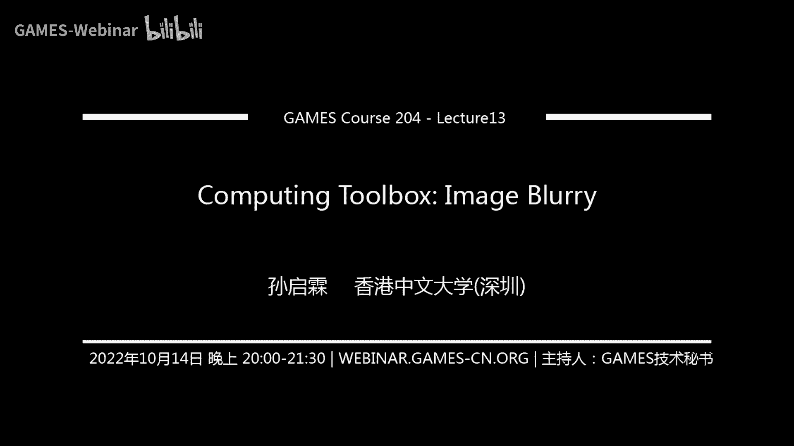
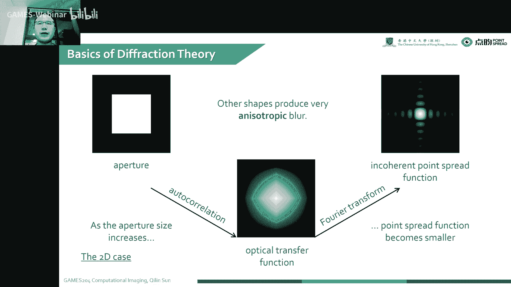
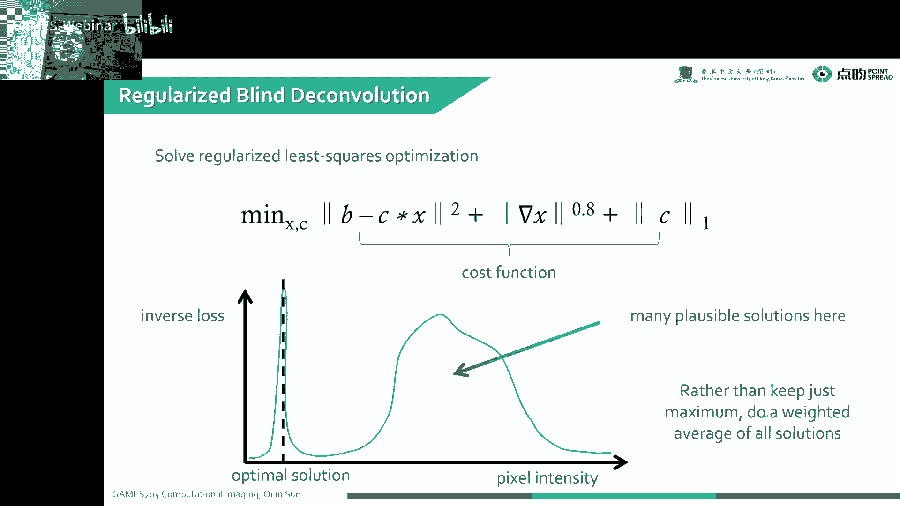
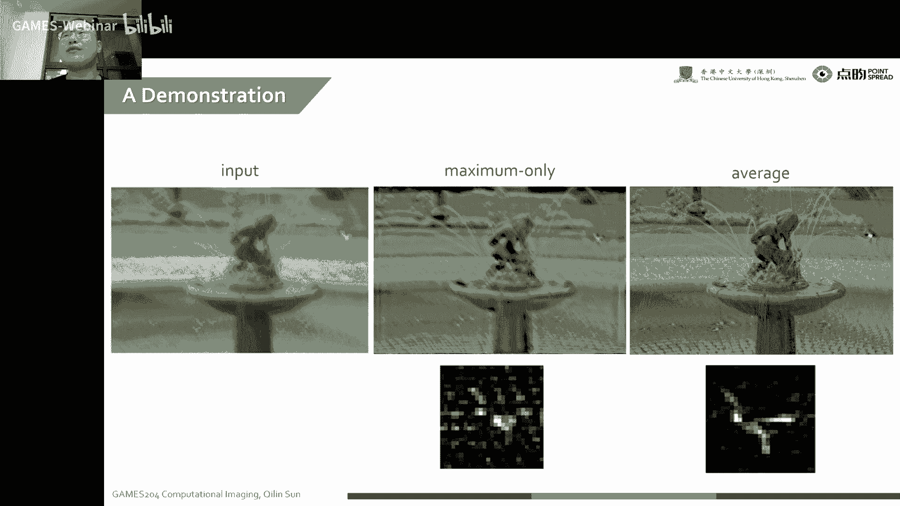
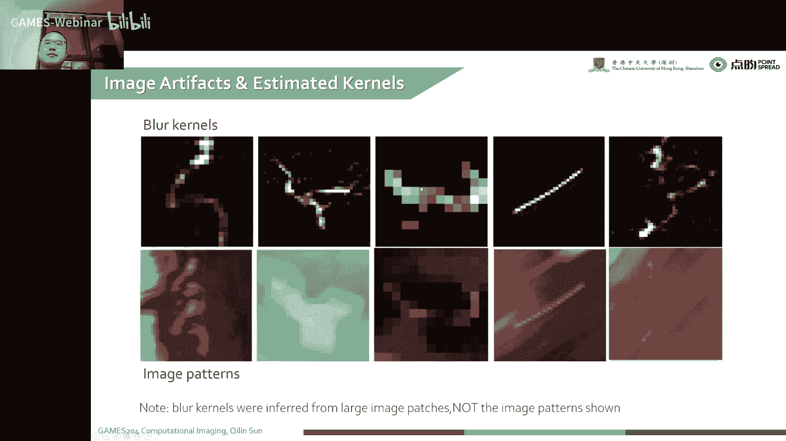
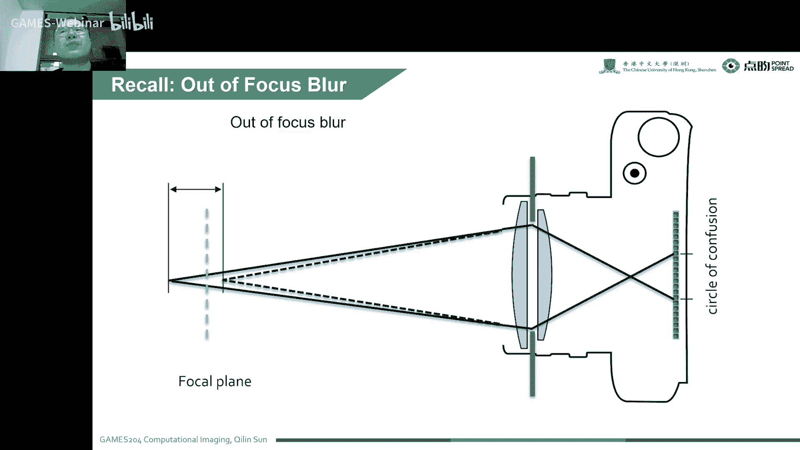
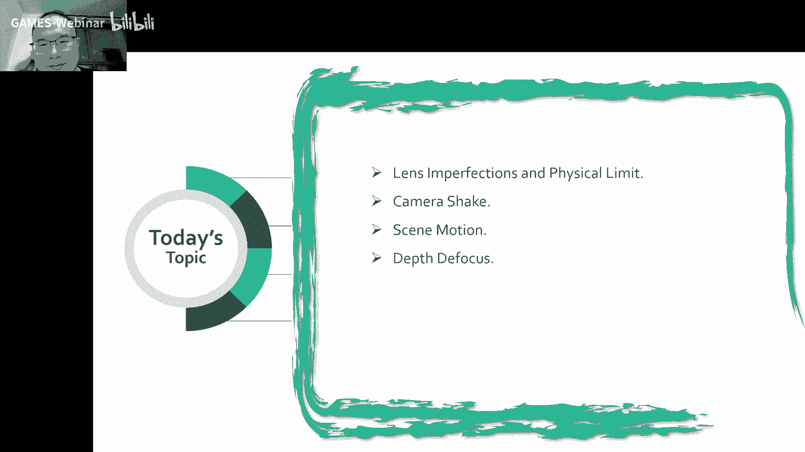

# 13. 计算工具箱：图像模糊 ｜ GAMES204-计算成像 - P1 - GAMES-Webinar - BV1qe4y1v75r

## 概述

在本节课中，我们将学习图像模糊的来源和解决方法。图像模糊是计算成像中常见的问题，它会影响图像的清晰度和质量。我们将探讨图像模糊的四种主要来源，并介绍相应的解决方法。

## 图像模糊的来源

图像模糊主要来自以下四个方面：

1. **光学系统缺陷**：包括透镜的球差、彗差、像散、场曲和畸变等。
2. **衍射极限**：由于衍射效应，透镜的分辨率受到限制，导致图像模糊。
3. **相机抖动**：由于手抖或相机抖动，图像在曝光过程中发生移动，导致图像模糊。
4. **景深限制**：当物体距离相机较远时，部分物体无法在图像传感器上形成清晰的像，导致图像模糊。

## 解决方法

### 光学系统缺陷

* **优化光学设计**：通过优化透镜的设计，减少球差、彗差、像散、场曲和畸变等缺陷。
* **使用非球面透镜**：非球面透镜可以更好地控制光线的传播，减少光学系统缺陷。

### 衍射极限

* **提高透镜口径**：增大透镜口径可以减少衍射效应，提高图像分辨率。
* **使用超分辨率技术**：通过超分辨率技术可以恢复图像中丢失的细节。

### 相机抖动

* **光学防抖**：通过光学防抖技术可以减少相机抖动对图像的影响。
* **电子防抖**：通过电子防抖技术可以延长曝光时间，减少相机抖动对图像的影响。
* **图像去模糊算法**：通过图像去模糊算法可以恢复由于相机抖动导致的模糊图像。

### 景深限制

* **使用大光圈**：使用大光圈可以增加景深，使更多物体在图像传感器上形成清晰的像。
* **使用浅景深技术**：通过浅景深技术可以突出前景或背景，使图像更具艺术感。

## 总结

本节课介绍了图像模糊的来源和解决方法。通过了解图像模糊的成因，我们可以采取相应的措施来提高图像质量。在下一节课中，我们将学习图像去模糊算法。