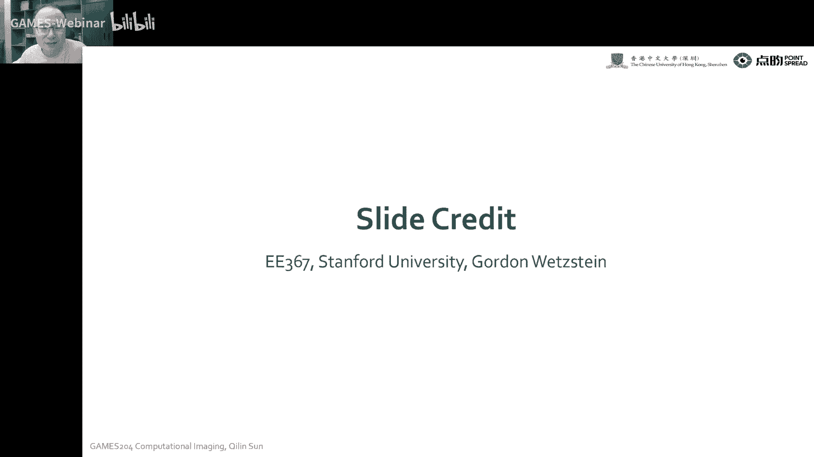
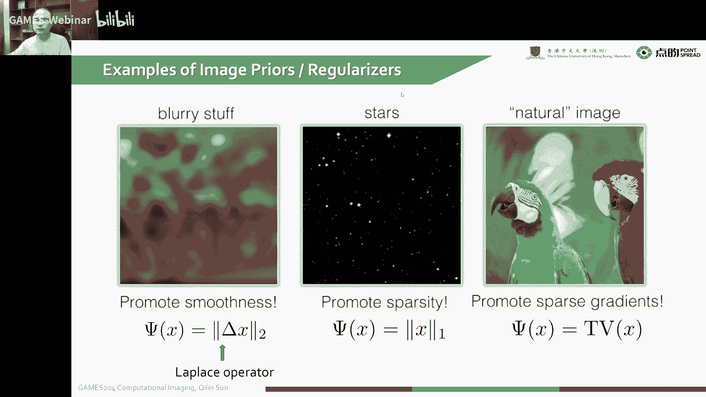
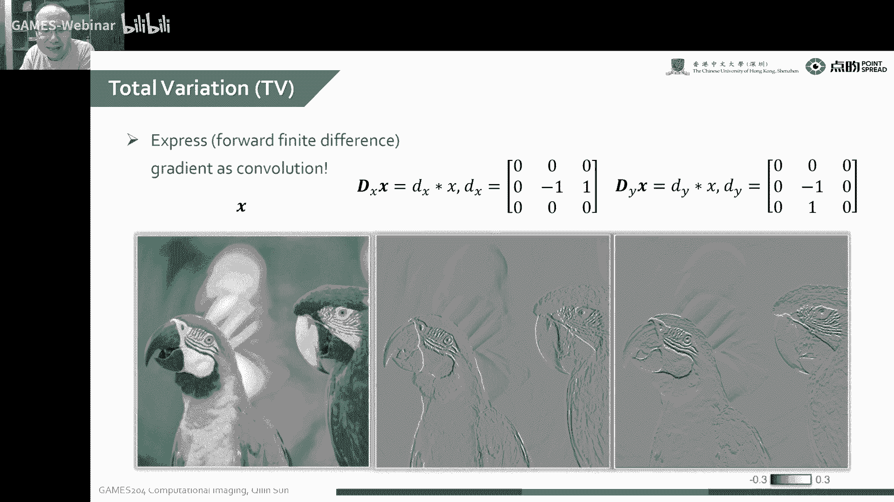
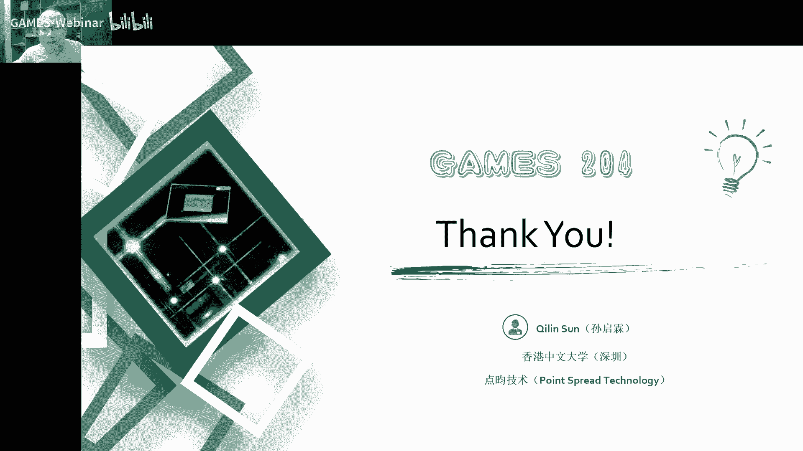

# 课程14：去模糊与成像逆问题剖析 🧩 | GAMES204-计算成像

在本节课中，我们将学习如何通过优化方法解决图像去模糊等成像逆问题。我们将从经典的维纳滤波入手，逐步构建并求解一个包含数据保真项和图像先验约束的优化模型，最终掌握一套解决此类问题的通用流程。

---

## 成像模型与逆问题

上一节我们介绍了正向的成像过程。本节中，我们来看看如何用数学模型描述成像，并构建逆问题。

成像过程可以抽象为一个线性模型。我们观测到的模糊且有噪声的图像 `b`，是由清晰的原始图像 `x` 经过一个模糊核 `c`（也称为点扩散函数 PSF）卷积，再加上噪声 `η` 得到的。这个过程可以用公式表示：

**`b = c * x + η`**

其中，`*` 表示卷积操作。在频域中，卷积变为乘法，因此公式可以写为：

**`B = C · X + N`**

这里的 `B`、`C`、`X`、`N` 分别是 `b`、`c`、`x`、`η` 的傅里叶变换。

我们的目标是求解逆问题：在已知模糊图像 `b` 和模糊核 `c` 的情况下，恢复出清晰的原始图像 `x`。如果不考虑噪声，在频域中直接做逆滤波（`X = B / C`）即可。然而，实际中噪声总是存在，直接逆滤波会放大噪声，导致结果毫无意义。

---

## 从维纳滤波到正则化

为了解决噪声放大问题，我们需要更稳健的方法。维纳滤波在20世纪40年代被提出，它在求解时考虑了噪声的功率谱，其频域解为：

**`X_hat = (C* · B) / (|C|² + N/S)`**

其中 `C*` 是 `C` 的复共轭，`N` 是噪声功率，`S` 是信号功率。当信噪比（SNR）很高时，结果接近逆滤波；当 SNR 很低时，结果被严重抑制以避免噪声放大。

维纳滤波是一个特例。更通用的思路是构建一个优化问题。我们将成像模型重写为矩阵形式：

**`b = A x + η`**

这里 `A` 是代表整个成像系统（如模糊）的矩阵。我们的目标是找到最可能的 `x`。通过最大后验概率估计，并取负对数，可以推导出以下优化目标函数：

**`argmin_x [ ||A x - b||² + λ R(x) ]`**

这个目标函数包含两部分：
1.  **数据保真项** `||A x - b||²`：要求重建的图像 `x` 经过系统 `A` 后，应尽可能接近观测值 `b`。
2.  **正则化项** `λ R(x)`：引入关于图像 `x` 的先验知识，约束解空间，使病态问题变得适定。`λ` 是权衡两项重要性的参数。

---

## 图像先验：全变分正则化

以下是几种常见的图像先验约束。本节课我们重点介绍其中一种强大且经典的正则化方法。

全变分正则化假设自然图像的梯度是稀疏的，即图像大部分区域是平滑的，变化主要发生在边缘。其目标是最小化图像的总变分。对于离散图像 `x`，其总变分通常定义为梯度幅值的 L1 范数之和：

**`TV(x) = Σ_i,j √[(x_{i+1,j} - x_{i,j})² + (x_{i,j+1} - x_{i,j})²]`**

或者采用各向同性的简化形式：

**`TV(x) = Σ_i,j (|x_{i+1,j} - x_{i,j}| + |x_{i,j+1} - x_{i,j}|)`**

使用 L1 范数（绝对值）比 L2 范数（平方和）更能促进梯度稀疏性，从而更好地保持边缘清晰度。因此，我们的优化问题具体化为：

**`argmin_x [ ||A x - b||² + λ TV(x) ]`**

---

## 求解：Half-Quadratic Splitting 算法

我们已经构建了优化问题，但目标函数中包含不可导的 L1 范数，直接求解困难。本节中我们来看看如何使用 Half-Quadratic Splitting 算法来有效求解。

HQS 算法的核心思想是引入辅助变量 `z`，将原问题转化为一个等价但更容易处理的约束优化问题。我们令 `z` 近似等于图像的梯度 `D x`（`D` 为梯度算子），则问题变为：

**`argmin_{x, z} [ ||A x - b||² + λ ||z||₁ ]`， 满足 `z = D x`**

然后，我们使用增广拉格朗日法或惩罚函数法将约束放松，得到以下无约束问题：

**`argmin_{x, z} [ ||A x - b||² + λ ||z||₁ + (ρ/2) ||z - D x||² ]`**

这里 `ρ` 是一个惩罚参数，随着迭代增大。接下来，我们通过交替优化 `x` 和 `z` 来求解。

**交替优化步骤：**

1.  **固定 `z`，更新 `x`**：
    此时问题变为：
    **`argmin_x [ ||A x - b||² + (ρ/2) ||z - D x||² ]`**
    这是一个关于 `x` 的二次函数（L2范数），可通过求导等于零直接求解线性方程组：
    **`(AᵀA + (ρ/2) DᵀD) x = Aᵀb + (ρ/2) Dᵀ z`**
    对于卷积形式的 `A`，可在频域高效求解。

2.  **固定 `x`，更新 `z`**：
    此时问题变为：
    **`argmin_z [ λ ||z||₁ + (ρ/2) ||z - D x||² ]`**
    这个问题的解有一个闭合形式，称为软阈值收缩：
    **`z = sign(D x) · max( |D x| - λ/ρ, 0 )`**
    这个操作会将 `D x` 中绝对值小于 `λ/ρ` 的分量置零，从而实现梯度稀疏。

通过反复迭代上述两步，直到 `x` 和 `z` 的变化足够小，我们就得到了最终的去模糊图像 `x`。

---

## 扩展与总结

本节课中，我们一起学习了解决图像去模糊等逆问题的完整流程。

我们首先建立了成像的线性模型，并指出了直接求解的病态性。然后，我们通过引入贝叶斯框架和最大后验概率估计，将问题转化为一个包含数据保真项和正则化项的优化问题。我们重点介绍了**全变分正则化**作为图像先验，它能有效促进图像梯度的稀疏性，保持边缘。最后，我们详细讲解了使用 **Half-Quadratic Splitting 算法** 来求解这个包含非光滑 L1 范数的优化问题，其核心是引入辅助变量并进行交替优化。

这套“建模 → 加正则化 → 优化求解”的范式是解决成像逆问题的通用套路。正则化项 `R(x)` 可以替换为其他先验（如基于深度学习的先验），成像算子 `A` 也可以扩展到更复杂的物理模型（如非均匀模糊、光场成像等）。掌握这一基础框架后，你就能灵活地将其应用于各种计算成像问题中。

---
**核心公式与代码概念总结：**
*   **成像模型**：`b = A x + η`
*   **优化目标**：`argmin_x [ ||A x - b||² + λ R(x) ]`
*   **TV正则化**：`R(x) = Σ |∇x|` (L1范数)
*   **软阈值收缩（更新z）**：`z = sign(v) · max( |v| - τ, 0 )`，其中 `v = D x`，`τ = λ/ρ`。