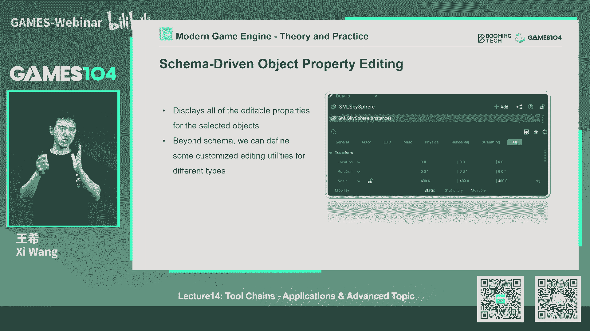

# 14.引擎工具链高级概念与应用 ｜ GAMES104-现代游戏引擎：从入门到实践 - P1 - GAMES-Webinar - BV1QN4y1u78P

哈喽嗨大家好，跟大家汇报一下，我前两天刚刚从海南飞回来，所以今天下午刚刚到杭州，然后晚上直接冲进了我们的直播间，然后那个首先的话按照我们的惯例，首先跟同学们回答一些来自于我们社区的问题。

那首先那个同学很多同学问我们说，上一节课布置的作业，马上这节课要布置新的作业了，那我们上一节课作业还要不要继续去教，那实际上的话呢就是说呃我们考虑到很多同学，因为很多同学做的速度非常的快。

当然也有很多同学的话呢，还要花很多的时间，慢慢熟悉我们小引擎的代码和东西，所以呢我们决定还是把这课程的时间延长一点，另外一点的话就是我们也发现在B站上，因为B站特别好嘛，就是视频会一直放在那。

会不断的新同学进入到我们的社区，然后呢大家有的人还在还在补上前面的课程，所以等到新的课程能能够做的时候，可能还需要一点时间，所以的话呢我们决定暂时的话，还是把这个新的课程的这个啊。

这个上一节课的作业的这个时间继续往后延，然后具体什么时候我们能够so that dine的话呢，我们在争取在后面一节课程跟大家，或者在那个微信上跟大家在同步，反正简单来讲的话。

我们尽可能把这件事情变得flexible一点，因为确实照顾到，就是这个课程现在的周期已经非常长，长达接近三四个月，所以每个同学进入的时间啊，水平都有波动，那我们尽可能让大家都能兼容的了。

那么另外一个的话呢也回答一下同学们的问题，其实这个问题蛮有意思的，我们选了几个比较有意思的问题，就有同学问我们说，哎你们为什么不用像那个什么FBX啊，这些公开的这些格式啊，对吧，那么其实的话呢。

首先就是这些格式是直接来自DCC软件了，包括这些这些格式呢，现在有很多人在用，那么但是的话呢，我们当时其实最核心的一个考虑这两件事情，第一个就是我们尽可能让那个PICO引擎，越简单越好。

如果我要支持FBX格式的话，大家如果研究一下，就是FBX格式是非常成熟丰富和完善的，那我们就需要接入一个完整的，迪斯萨斯第三方库，然后呢去让大家去，这个就是处理这个FBX文件的格式。

包括这些数据读进来之后，我们还在做一部比较复杂的转换，当时我们在想，就是说如何让同学们能够快速的理解像反射呀，引擎的基础，数据流的架构啊等等这些东西，包括我们考虑的，就是在真正的商业级引擎里面的话呢。

我们一般不会直接用这种啊TCC的格式，因为IP格式虽然非常好，作业文件就是在不同的工作室啊，或者是那个工序之间传输，文件是个很好的，中间我们叫intermedia format。

但是呢它并不是一个效率或者引擎，friendly的这么一个格式，因为对于真正的游戏来讲的话，我们的这个数据格式要求它的效率，比如它的packaging，它可以加密，它可以流式传输。

它可以那个就是说对可以留市场等等，这些要求是非常的高，那么所以的话呢，我们就想说让同学们一上来就能够习惯，或者适应这种，就是说诶小就是customize the fireformat。

而且能够你的schema系统，能够和这些东西能够连接起来的，这样的一个设计，所以我们相当于用一个最简单的格式，把这套机制教给大家，因为从schema反射到你的custom format。

它是一个完整的一个组合关系，那么另外一个同学没人问我一个问题，就说诶你们为什么没有用那个，在Mac版本中没有用meta，而是直接用了这个就是那个那个model的VK，这个东西放在上面。

就是其实这个原因很简单，首先我们已经被同学们狂喷了，说你们为什么要van对吧，因为相比open gl的话，van实际上复杂很多，我也跟大家解释过，就是说呃当时我们的考虑是说。

让同学们直接接触现代的这个GPU的一些，API的一些结构，因为它真的是非常啊接近于driver的这个写法，效率是最高的，也是最具有工业化的这样一个基础的一个东西，那么welcome本身已经非常复杂了。

那这个时候我如果再去上一个DX12版本，再去上一个metal的版本，那肯定是最好的，就是说它肯定是性能最好，也是最符合各个平台的设定，但是首先的话我们开发团队的话，工作量会非常的大。

因为同时要支持三个版本，大家想象一下，我们是一个就是开源小引擎，其实同学们都是用业余时间在写，另外一个的话呢，就是同学们掌握和学习起来的话，可能门槛会更高，要理解。

比如说他的第一层的这个就是RH这一层对吧，抽象的更好，然后接下来的话要针对不同的平台，我们用不同的版本，所以的话基于这个考虑的话呢，我们一上来说OK统一的用motion一个版本，其他的平台搞不定的话。

我就强行的用一个中间件把它给转过去对吧，就像那个我们现在在那个，其实在Mac上还是metal的指令，但只是我们写的时候只写了这个van，但是呢它自动把我翻译成matter的，原生态指令而已。

所以这也是我们的一个考虑，那么就是说我们上节课的那课程作业的话，给大家讲的就是我们尽可能的给大家延期到，就是这个月的中下旬，如果有必要的话，我们再去研究，因为这也是同学们特别关心的一个问题。

好的我们的q and a part花了我们的6分钟，那我们先给大家讲到这为止，因为今天我稍微有点delay，所以的话呢我这边稍微赶一点时间，说话语速有点高，同学们原谅一下好。

今天进入到我们的课程的正题了，就继续讲工具对吧，其实工具真的是博大精深，那今天的话呢，这节课其实是我们比较难以准备的一节课，为什么呢，上一节课讲的全是工具链的一些基本的，fundamental的原理。

那这节课呢实际上我们要讲一些高级的，讲一些应用的东西，但是我们在讲的时候，我一直在思考的一个问题，就是说如何把这一节课不要变成一个，就是像我们在比如说在各大视频网上。

随便能找到大量的这个叫游戏引擎的使用的，这种这种这个教你怎么使用游戏引擎对吧，给你介绍每个工具的详细的功能，怎么去用它，怎么去组合，怎么组合你的变化，因为那这个呢更像是一个游戏引擎教学视频。

但今天呢我们讲的还是一个，就是如何去编写或者架构自己的一个游戏引擎，所以今天其实你看到我我们的课程准备中啊，我个人觉得是我们最精分的一节课程，但是呢我们在尽我们的所所能。

就是说尽可能的讲一些就是fundamental的，就是底层的东西，然后呢上面的一些application我们会点一下，因为你没有，确实是如果我们不知道application的话。

大家不理解底层为什么这么写，但是呢如果我们只专注于上面的application的话呢，哎我们又会忽视掉下面，其实它有一层底层的架构解决方案，所以这是我们这节课尝试想找到的，这样的一个平衡点。

好那话不多说，给大家介绍一下我们这节课的主要内容，那么这节课的话呢，我们大概分成这么几个part，第一个呢，我们还是非常快速的，让同学们对这个游戏的真正的production，有一个感觉对吧。

那么第二个的话呢，就是说我们呢接下来会围绕着一个重点呢，也是我们一直搭同学们最熟悉的叫地图编辑器，基本上所有摸过游戏引擎的同学，都知道这个东西对吧，那我们今天要简单讲一下诶。

如果我们要架构一个地图地图编辑器，我们怎么去架构，那第三个的话呢，我们其实在上一节课给大家讲的就是，plugin对吧，插件机制是工具体系最核心的一个机制，那今天的话呢我会稍微展开一点点。

跟同学们讨论一下，就是说一个plugin architecture该怎么做，就是在游戏引擎里面，Plugin accture，到底他这个有哪些坑，怎么去，就是可能会在哪上踩雷对吧。

那么后面的话呢会跟他讲两个重点呢，非常有意思的系统，第一个就是说一个线性的一个叙事性系统，在工具体怎么表达，但我这里面会用sequencer举个例子，但是同学们一定要意识到，就是在游戏中啊。

线性系统绝不止一个SEQUER，其实很多系统它都是线性的，就是说你希望点一个play开始，然后呢他依次会发生所有你想发生的事情，那么第四这啊倒数第二排的话，也是同学们这个一直很期待的。

就是很多同学问我们说，诶，能不能给我们讲一下，小引擎里面的这个反射系统是怎么做的对吧，那么其实的话呢在这节课里面呢，我们会稍微花几页笔墨跟同学们详细的讲一下，我们都反射到底是怎么东西。

因为反射我们认为四工具链里面，做game play的一个非常重要的一个基础，那最后的话呢会给大家点一下，一个比较有意思的东西，高级的东西就是协作式编辑，因为我们认为就是说协作式的编辑工具的话呢。

会将是下一代游戏引擎发展的一个重点方向，对吧，因为我们现在要处理的游戏世界越来越丰富，越来越复杂了，所以呢这就是我们今天的主要内容，首先的话呢大家一起来看一下。

就是说游戏的production到底是什么一个状态，那这是一段小小的视频，这个就是那个育碧的这个各各他自己的，in house的这个引擎，你可以看到，就是说。

其实在这样的一个真实的游戏studio里面的话，大家会在艺术家会用各种各样的工具，有人在建这个场景的layout，有人在设计的game play，然后当我们点了一个一键的play之后，哎。

在这里面游戏用户会产生各种各样复杂的行为，但这里面有大量的比如说用词，就我们叫做那个，就是那个那个那个叫PGC对吧，程序化方法自动生成的东西，也有大量的for designer的这样的一个。

FIRMWORK和框架性的东西，那么在这里面的话呢，artist就是说甚至可以变换，自动化的生成一个整个城市，那么这里面当然还有很多的，比如说我们叫做concept artist。

他设置这个角色和场景的外观对吧，然后呢我们要生成大量的那个那个model alex，它生成3D的模型，这些东西这些所有东西全部连接在一起，形成了我们一个真正的一个商业级游戏的production。

那最后交个交付到大家手上的东西，是非常的非常有意思的，你可以看到一个非常有趣的游戏，但这个游戏这里面的话，就说所有的东西它都是有语义的，所有的东西都尽可能让玩家能够可交互，可playable的。

Ok anyway，那我们继续讲一下，就是说其实呢整个工具链，它还有一个很大的一个挑战，就是说真正在实战的游戏中的话，我们知道就是游戏有很多类型，在这里教给大家一个有意思的词儿，叫JA。

我们经常讲游戏类型对吧，英文怎么说叫JA这个词呢，其实来自于法语，就表示各种各样不同类型的游戏，比如说我们讲RBGFPS对吧，这个这个MOBA都都叫JA，那其实对于不同java的游戏的话呢。

实际上他所要做的这种编辑操作，它的这种game play的设置，甚至关卡的layout都会完全关，关卡的组织规范都会完全不一样，那么这个其实也是我们工具体系，一个非常复杂的一个东西，那么工具体系的话。

但这样的一个结构和体系的话呢，实际上我们要和很多的工具在一起了，这张图的话大家有点熟悉对吧，这是我们在这个就是games，在第一节课也给大家展示了这样的一张图，包括这也是我推荐的那本教材。

叫game engine architecture，里面很经典的一张图，但这里面的话我要跟大家讲一个fax，就是说实际上这张图是错的，什么意思呢，就是说这张图根本就没有把游戏的工具层画全。

这里面缺了很多很多的工具，包括有些工具的关系，可能现代游戏引擎已经发生了一些变化，但是没有关系，我只想让大家看这个图，就明白一个道理，就是说，其实在真正做这个工具链，体系设计的时候的话呢。

我们实际上是要解决，就像我一上来讲，就是解决来自于完全不同的思维方式，就是艺术家设计师，程序员在一起能够协同协作的问题，而且在整个过程中的话呢，我们都要保证那个很高大上的原则是什么，WYSIWYG对吧。

这个这个名字比YYDS听上去酷多了，就是所见即所得，而且这个呢实际上是现代游戏生产中，一个非常重要的一个指标，为什么，因为我们在跟大量的艺术家，设计师在一起工作的时，他们会发现。

如果我们没有办法再工具这一层，保证大家的所见所得的话，它会极大地影响到游戏产品的不仅是效率，就是效率肯定是周期会变长，对不对，还要影响那个它的质量，为什么呢，因为比如举个例子吧。

比如说level artist，如果a level designer就是有那个关卡设计师，如果他不能真的快速的看到他调整完的关卡，长什么样子，而且自己真的能身临其境的在中间走，其实他很多时候的判断。

比如说这个地方我希望天上一个落石，那个地方我希望有一个小怪蹦出来，那个体验实际上是全错的，他完全不能模拟用户真实的体验，如果你不能带入到用户真实的体验中的话，那你给出来的设计一定是不好的。

那这就对工具产生了一个非常大的一个挑战，为什么呢，因为其实大家如果我待会会讲的，就是如果在做工具的时候，你有大量的就是额外的信息，额外的操作，才能够允许艺术家或者设计师，真的对它进行编辑和调整对吧。

甚至我还要解决同步版本控制的问题，但是你又要求这一切的东西，就是看起来跟真实的游戏一模一样，这个其实啊，这两个东西有的时候是忠孝不可两全的，但是呢就是我们在上一节课也讲到了，就是说我们最后大家总结出来。

就是说把游戏，直接把工具直接包在游戏引擎外面，是一个现在大家公认的比较好的企划，但这个也会给游戏引擎带来一些挑战，我后面会很详细的讲到这一点好，那么其实呢我们先从一个工具开始讲起来对吧。

因为我们这个游戏引擎课，并不需要讲所有的游戏工具链上的工具，因为那个工具量，那个数量可能是几十个为单位的，那我们就讲一个word editor，就是word是地图编辑器呢。

实际上很多人在讲word extra是一个哎，我就是拖拉拽的一个工具，对不对，各种东西拖拉拽，但是其实从我们专业的游戏，引擎架构的思想来讲的话，我们认为他是个hub，什么意思呢。

就是说它实际上是一个平台，我们把各种各样的我们在游戏的世界里面，需要构建的逻辑玩法，场景内容在中间进行，能够插进去的这样的一个平台，所以我们上节课讲到plugin的机制，所以这一点的话呢。

是当我们自己去架构自己的word的时候，首先把这句话记在脑子里面，你千万不要一上来就写编辑器，写写这种就是这个这个类似3D max的拖拽，选的这种逻辑，这种东西重不重要，非常的重要。

但是呢你会让你很快速的这种方法，会让你快速的得到一个诶，看上去很酷的这样的一个编辑器，而且你甚至产生一个错觉，说诶我是不是可以跟unreal pk一下了对吧，我以前就经常看到我们那个很多论坛上。

就会说啊，我这个什么什么东西超过了虚化，那其实从就是专业的游戏体研发来讲的话，我觉得我们还是要非常尊重那些优秀的，商业级的引擎，因为确实他们去是他们的核心，不在于一个一个的feature。

而在于整个体系，我是按什么一种逻辑把它架构起来的，所以这是我认为，就当我们去做世界编辑器的时候，最先在脑中建立了这样的一个概念好，那我们打开我们还是以虚幻为例吧，你看一个虚幻的源码，打开来。

你会发现它的上面买的时东西特别多，比如说你可以看到VIEWPORT对吧，你看到上面很多的按钮图吧，你可以看到layout啊，这个什么layers levels啊，什么outlier details。

对不对，还有counter brother1大堆东西，那当然你看着很复杂，而且这只是面板展示的方式之一啊，如果你打开一个商业级引擎的这个what editor的话，它的面板可以切换到很多很多的view。

对不对，比如说我们看那个我们的一个，真实的游戏团队的话，你会发现比如说同样是一个引擎打开来，如果是做animation的，如果是做那个场景编辑的对吧，如果是做玩法编辑的，它的面板就完全不一样的。

这这就是解释了就是为什么就像我讲这个world editor，它是个hub，就是说实际上它集成了很多功能，但是呢对于不同的用户，它又呈现出了不同的view，那么在这样的一个庞大的这样的一个体系中。

最重要的几个体系是什么呢，我这边就给我个人的理解给大家总结一下，抛砖引玉一下，第一个呢我认为最重要的是什么呢，诶editor里面的那个VIEWPORT对吧，这个VIEWPORT是什么呢，就是最重要的。

我们的用户和你想构建的游戏事件交互的窗口，那么这个东西他是怎么做的呢，其实在上一节课我们已经点赞了，我这边再明确讲一下，就是它其实下面跑的就是一个游戏引擎，就是一个游戏，但是呢这个游戏的版本呢。

我上面打了个flag叫editor mode，因为在这个editor mode下呢，你就能做很多真实的游戏不能做的事情啊，比如说我的我的相机可以自由的飞来飞去对吧，我可以无视所有的碰撞。

我可以把很多东西变成透明的，然后呢我可以显示很多debug draw，While wifi mode，对不对，那么这里面会提供很多的，我们叫做gadget，就是说诶那个小坐标系给你显示一下呀。

选点选选选那个点，取那个点曲啊，选中啊，还有一些东西，grouping啊，line啊，这些这些东西这些基础的操作的话呢，最基础的一些东西，是需要在引擎里用native code给你说的。

因为这样效率也非常高，但是呢上面一些更复杂的逻辑，当然我们可以用编辑器自己来处理，那这里面有一个很有意思的细节，就是说这就意味着我们的引擎的代码，会有一些代码是叫editor only的代码。

那么这个东西的话呢，它的版本就是不一样的，那么这里面我就特别给大家注意一件事，当我们自己架构自己的引擎的时候，这也是初级的，这个这个新入行的同学特别容易犯的一个错误，是什么呢。

就是说如果我们不小心把这些编辑器的代码，编译到我们上线发布的游戏里面去的话，那么这极有可能会成为别人写外挂的一个，很重要的这个入口对吧，就是诶我我让整个世界都透明了。

我我让这个什么什么东西选取直接就有了对吧，或者我可以直接飞来飞去了，当然了也有，但是其实外挂并不是这么写的，但是如果我们不小心把这个H的代码的话，放出去的话，只要人家找到那些函数名和指针的话。

它其实用起来特别的方便，所以的话呢，就是这个是我们在所有的引擎架构的时候，我们都会问，因为特别是在一个大型的游戏团队啊，啊游戏引擎团的人数是非常多的，工程师的话会到上百人左右。

那就特别容易出现一些没有经验的，我们的开发的同学会诶，应我们的策划和设计师要求，做了一个工具和功能，大家都觉得很好用，然后呢策划和设计那个美术都很满意，但是的话呢就是他忘了把这段代码。

把它包在那个就是editor onion那个红下面，结果这段代码就被编译出去了，然后有的时候会产生这样的一个问题，所以这件事情的话呢，就是说一定要区分区分了，所以VIEWPORT这件事情的话。

大家记住记牢了，就是说它实际上就是跑的是一个完整的游戏，这件事情非常的重要，因为它是最基本的一个保证知识，那个我们讲的所见即所得，因为特别是对于artist很敏感的，比如像才智对吧，我做了一个无效。

我的光从这边打过来，我希望他反射几下，把一个角色给照亮，包括我做一个过场动画，我希望那个角色正好走进阴影，这些是很细腻的一个光和反射，它必须要通过这样的一个架构才能实现得了。

所以Viper是你做WORDOR最重要的一个，一个和他是最好不要做plugin的，它本身也没有必要做plugin，但这里面要讲一个有意思的细节是什么呢。

就是说呃实际上在一个真正的这个world editor，商业级的word editor里面的话呢，VIEWPORT有的时候不止一个的，就比如说你在做过场动画的时候，哎你编辑的是一个VIEWPORT的。

但是你还希望有个VIEWPORT去看它，你甚至会做好几个VIP的，所以呢当我们去做一个编辑系统架构的时候呢，我们经常要让VIP的支持多个view，其实这里面的话，其实对你的引擎架构也提出了一个要求。

为什么呢，因为你不能把数据同时拷贝好几分，对不对，那你编辑了一个数据的时候，你还要像那个好几分的引擎，你考同步数据吗，那不相当于在本地写了一个小型的网络，同步了嘛，对不对，所以的话呢。

当我们再去写这样editor viewport的时候的话呢，我们实际上是要对引擎那边要做个改造，就是让它能兼容多个view，当然有的时候在我们某些游戏中的话，我们也也需要实现这种画中画。

所以也作为我们的一个需求，那么第二个呢很重要的一个窗口是什么呢，就是说在我们的整个这个游戏世界里面啊，其实我们有很多很多的东西，比如说我们天空都有语音，有角色在编辑器里面的话呢。

就是我们其实要编辑的元素特别的多对吧，我们有天上的语音，地上的这个这个NPC树上的那个那个一花，一木一草，那么这里面有一个很重要的原则，就是其实我们在第一节课，第二节课就特别是第二节课讲的特别清楚。

就是说所有的东西都是物体，都是那个object，那么这里面object呢在编辑器里面的话呢，我们也会讲说所有的object都是editable的，就是说都是可被编辑的，但是当然了，不同的引擎说法不一样。

比如说虚幻引擎里面我们会叫他actor对吧，那个unity里面我们会叫他object，比如像我们我自己做的引擎的话，我会叫他object，对不对，但这不重要，重要的就是说其实啊我们会发现，不论你是什么。

在这个世界里的对象，你都是有一些可以编辑的东西，比如说我要至少能选中你吧对吧，我至少能改变你的位置吧，我至少能旋转你吧，对不对，然后呢我点中你的时候，我想编辑你的一些属性吧。

所以这个呢也是当我们去做word editor的时候，我们最核心的要思考的第一件事情，就是说在架构上，就是说我要把这个世界你的一切的东西，比如说大地天空语音，你是天上的飞鸟。

每一个人都把它抽象成一个common，这样的一个editable object，对吧，这这跟enery object还有一点点不太一样，就是它相当于那个object再往上再走一步。

那么其实呢这里面就产生第二个问题了，这也是我在讲的，就是大家如果在下个word editicia，你会遇到的问题，就是说我们实际上一个真实的实战的一个，游戏产品来讲的话，一个场景里面对象数有多少呢。

基本上至少是几千个甚至是上万个甚至更多，大家有没有想象过，就是如果我给你一个文件目录里面，给你上万个文件，你怎么去管理它，其实你很多时候不会管你，你看到的文件是123456789十对吧，好，没问题。

你都记住了，但第二天你回来再打开这个编辑器的时候，问D973号文件，它到底是什么东西，你看他根本不知道，当然你说哎呦，我可以通过文件名，但是当你的对象数足够足够多的时候，实际上这个东西你已经完全失控了。

注意啊，这里面你看到的还不是对象文件，它是不会重复的，对不对，那么但是的话呢，我们在这个世界里面，看到大量的是对象的instance，它的一个一个instance，那么好，就是那这个数量就会非常大。

所以你会发现在一个商业级的游戏引擎里面，当我们设计它的word ash的时候，我要对这么多的对象object，我要设计出很多种不同的view，比如说最经典的是树状的view，就是我把这些物体诶。

我给它进行归类对吧，我一个个目录去存储它，那么唉我有的时候会把它分成不同的layer，就是说啊这个是地上的植被，这个是城市左边的这个建筑群，那边的话是所有的地上的这个这个这个石头。

这样的话我用大的这个layer去去把它进行，归类的话，我也可以把它进行group，但其实这样的话还不够，有的时候我们还需要什么，还有search去寻找它，所以说其实你会发现一个商业级的引擎的话呢。

它对于这样的一个lisper objects的话呢，它会提供了很多种view，而对于artist来讲的话，我们会根据artist的习惯，比如说有的人我就是喜欢做这个啊，我是做environment。

我只是专门做天空大气系统的ALICE的那好，我会对其他的view我都不重要，我会让你们都锁住，不让你去边它，或者说我把它引掉，让我专注的去调整上面的这个天空，云和雨这种感觉的效果的东西。

然后我再把你接回来，我再看你的效果，所以说当我们去设计这样的一个word editor的时候，我们的object系统一定要把就是记得上节课讲过的，他我们的模型什么MVVM模型，对不对。

数据model一定要动起来，它的view其实可以提供很多种不同的view，完全可以根据艺术家的情况，甚至在未来可以允许不同的，这个就是designer或者artist，他用不同的view去管理它的对象。

那么其实呢，这个时候，当我们有了这样的一个view的列表的时候，大家想到最正常的情况是什么，就是我们最直观的编辑是什么，诶不是什么特殊的编辑器，就是在这个地图编辑里面，我选中一个东西。

我就想直接编辑它的属性，比如说我选择MPC，我想设置它的血量，对不对，那这个时候呢，我们在上一节课讲的schema系统就很重要了，就是说我点中它，我通过schema可以反射出来。

他身上到底挂了有多少的属性数据，那么我们的编辑器，可以自动的根据你的属性的类型，生成它所需要的这个编辑界面，所以说像这样的一个界面的话，几乎是所有的引擎的这个word editor总有一个小panel。

比如像ARIAL里面这个panel叫什么，叫detail对吧，像有的隐形叫properties，对不对，这都可以，但是的话呢这就让你去可以编辑这个东西。

这个呢也是当我们去构建word editor的时候。

这个window是一定要需要在的好，那么这最后呢，这也是就是说我们在做引擎的时候，非常重要的一个东西，这个是我希望大家在写引擎的时候，一定要注意的一个东西，就是counter brother，诶。

我这里面我要小小的这个这个自夸一下，我们的PILA对吧，我pick a真的是一个小到不能再小的一个引擎，就几万行代码，但是的话呢当时架构的时候这么小的引擎。

我们的团队还是架构了counter brother，当时我看到这个架构的时候，我还真的非常的惊喜，为什么呢，因为其实真实的一个游戏引擎是做什么的，可是给大家做游戏开发的，对不对好。

那么游戏开发的实际情况是什么呢，就是你想啊，我们一个游戏产品有几十个甚至上百个artist，然后呢我们会生产什么呢，我们会生产几十几几十件甚至几啊几几10万件，是几万到几10万件的不同的资产。

这里的资产有什么，有动画对吧，有三维的模型，还有什么呢，声音效果，还有我们想要的一些漂亮的UI贴图，动图这些东西，这些东西啊，它实际上是非常丰富和复杂的，那我们最直观的想这东西怎么管理。

其实在我刚刚进入游戏引擎这个行业的时候，我们怎么做呢，我们其实那时候没有counter browser，我们就唉有一个technic artist，他非常的厉害，他也很有经验。

它会根据你的产品把所有的资产设定好，比如说我那时做halo好，halo3对吧，所有的资产比如说objects，对不对，你的这个这个foolish就植被对吧，这个什么objects。

你去看你们还有什么vehicle载具，什么weapon枪对吧，分得很清楚，然后呢这里面再点进去，你再分哪些是哪个目录，是贴图的，哪个目录是模型的，哪个目录是原始数据的哇，我的天呐，就是你钻下去。

发现是一个非常深的一个树状结构，然后呢好我们的artist，当然我们的团队很很遵守规则，大家都把这个数据都放进去了，形成了一个很漂亮的一个ree view，但这个问题就来了，当我做完了halo3之后。

我要做halo4怎么办，对吧，黑龙寺不是所有资产都全部重新来过一遍，对不对，我很多资产还要从黑龙三去继承的，那好这你们的资产怎么去重用呢，怎么去共同管理呢，对不对，比如说我我一个艺术家在做黑楼四的时候。

我想用黑龙三你们的某一把枪，哎呀，那我还得到那个目录里面去找，那好了，那这个资产到底应该放到黑龙三的目录，还黑罗斯的目录，你讲不清楚了，对不对，而且这个目录结构呢一旦设置好。

很多时候他是3年到4年前有一个人设置好的，他很多时候是不能预判整个游戏发展到后来的，这种复杂的变化对吧，我们后面会产生很多很多不同的需求，所以差不多在这个就是说小10年前吧。

就是大家提出了这个content browser这个想法，实际上在我看来，在这里面的话，我们当然还会支持这种基于文件夹，文件夹的这样一个结构的东西，但是它更多的只是个view。

而我们怎么去看待这所有的资产呢，我们会认为它就像放到一个巨大的那个，ocean的里面，一个池子里面，然后呢这些资产扔进去，你只需要知道它是你要什么东西，你要它叫什么名字，然后你就能检索到它。

它你就能够去挂了它，然后呢你可以根据你不同的项目，形成这个资产的一个view对吧，这个view你也可以用树状去管理，但是没关系，这资产放在那儿，你不用管，甚至这个资产都不需要放到你的本地。

它可以放到一个数据库里面，其实那个在最早我刚开始我们在加引擎的时候，最早学引擎的时候，现在还在美国的时候，我们就很有很有兴趣的研究一个概念，就是说诶我们要不要在本地都不要存这些资产。

因为这数据都特别特别大对吧，我们把它放在一个studio的，一个中央的这个数据仓库里面，然后呢每个人你需要用到什么资产的时候，你只是把它用到你的内存里面，因为你本质上是要跑个游戏嘛。

这样的话就避免就避省去了这些几个T的资产，在各上百台机器中来回考的这个时间，而且的话还有很多的预计算可以提前做掉，但这个我今天就不展开了，但是这个content browser的话。

实际上就是这件事情的一个，最重要的一个解决方案，也就是说我们真的把这个是asset，从一个静态的文件目录变成了一个资源的海洋，所以说ocean这个词的话，其实在现在很多现代游戏引擎的企业里面啊。

游戏公司的企业里面都已经用到了，所以说的话呢，今天如果我们假设一个面向未来的游戏情的话。

那counter browser是大家必须要考虑的东西，那么其实讲完这些东西的话，大家基本上你再去分析啊，就是这个word editor上的各种小元件的话，你基本上也就清楚，What，你仔细看它。

他无非也就解决三个问题，第一个layout的问题对吧，我各种东西的就是摆放啊，一些东西的碰撞啊检测，还有呢就是以地形为基础的，比如说上面的植被，上面的这个这个decorator。

就是各种各样的小的杂物对吧，还有什么呢，还有我们要的environment，比如天空啊，天光啊，光源啊这些所有的东西，那么其实的话呢，这些东西呢就是一个最基本的WORDASH。

我们用的各种unit或者叫各各个系统，那么在这里面的话，大家很关心啊，那我这个what一下去写，他说最关键的东西是什么呢，啊第一步要写的东西是什么呢，那么其实如果架构没有问题的话。

那第一个要写的诶还真的是鼠标的选取，因为鼠标的选曲啊其实是一切的基础，实际上我们在用很多编辑器，你觉得顺手不顺手，实际上跟鼠标选曲写的好坏有很大的关系，很多时候鼠标的选取甚至是模糊一点。

让你就是让艺术家用起来更自然，那么好，这里面有两种比较简单的做法了，一种比如说我用recasting，就是说既然我这个世界里所有的物体，我都有包围盒对吧，那我就recasting呗，我就cos一下。

我就hit到他了，那这个的话呢实际上他用的其实是物理引擎，或者说我对这个世界的物理表示，他有的时候呢你说他要做的粗做一下是很快的，但是呢如果我要做得很精准，因为你们知道一个物体的形状是七扭八拐的，对吧。

我一个角色站在那儿，你在远处看着小小的就就那一小块儿，但是呢他可能有几万个三角形面片，然后我我用它的胶囊去做做选取的话，可能你想选的是他身后的那棵树，但是你发现你错误的选择前面的人。

所以这个时候呢有的人就有的引擎的做法，就是说哎我直接加一个额外的选取帧，就是说我把每个object id打在这个frame buffer上，然后呢你就去取到那个像素，取到那个问题就可以了。

这个方法其实就是哎这就是刚才我讲的，就是你如果引擎跑的是editor mode的话，你可能就要加一个这个extra的pass，去渲染这样的一个带有object id的这样一个texture。

那么这个肯定会费一点，但没关系嘛，一般来讲我们做做编辑时候，用的电脑会比玩家的电脑会更好，就是说大家如果你做过主机开发，就知道，比如说像那个PLAYSTATION和XBOX的话。

它都有一个叫开发者dev mode，就是开发者版本它额外的跟以前内存，但是的话呢我们讲我们的开发者，PC的话也是一样的，我们会额外的加很多内存，都配最好的显卡，所以我们的程序员经常会犯的。

一个一个踩了一个坑，就是说诶在我的本机跑起来完全没有问题啊，为什么在用户那边电脑卡呀，很多手是因为我为了能做开发，做编辑用的这种电脑的话，配置都是比较高的，artist有时候也会这样，但没关系。

这都是细节，所以其实呢首先鼠标能选中一个物体，这件事就得认真写一写，但这里面有个细节，就是说，我们假设这个场景里面有很多透明性的物体，打个比方，比如说很多particle对吧。

你想选中国particle怎么办，你想选中一块玻璃怎么办，如果按照我们之前讲的说透明物的话，它是不写入DEBUFFER的，对不对，他会被直接过滤掉，所以这个时候的话呢。

你们要需要写一些特殊的代码和逻辑去表达它，举个例子，比如像particle很多引起你的做法怎么办呢，哎我在party发生器那个地方，我作为一个虚拟体对吧，其实你选中的不是那个particle。

你选的可能是下面那个根的那个虚拟，你把它选中就给拖来拖去，拖来拖去了，那么对于其他的一些更复杂的选取的话呢，一般来讲我们都会有一些特殊的code来解决它，所以真的大家再做一个，就是游戏引擎的选取的话。

你会发现你要考虑的情况下特别的特别的多好，那其实呢当我们可以选取一个物体的时候，大家会发现，就是在游戏引擎里面有大量的物体的，我们叫做transform操作，什么意思呢，就是把它平移旋转，还有什么呢。

放松对吧，这个在我们在一开始讲那个object的时候，我在讲物理讲述的都讲了大量的这个这个东西，但是其实在做word ash editor的时候，这些地方反而是特别容易出问题的，为什么呢。

因为这个地方的话就是有大量的，比如说3D max maya，包括像其他的游戏引擎，给我们的artist的，形成了非常多的一些优良的操作习惯，这些习惯都是经过很多项目常年总结下来。

你会发现就是一个简单的旋转，那当你按哪个热键会出现旋转的空间，旋转的空间，当你的鼠标往上移动的时候，移动到那个那个get的百分之多少的时候，诶，它的X轴的旋转还是Y轴的旋转，Z轴的旋转会被高亮对吧。

都会这个有很多讲究，如果你做的不好，别人用起来就非常不认识，我给你讲，大家讲个小例子，就比如说在我们在做旋转的时候，你会发现我只要鼠标一动就旋转好了，对不对，诶但是我们的设计师需要一个模式。

是说我希望整度数旋转，比如每隔五度旋转一下，这样方便我什么呢，诶很快的对齐，比如说90度，45度，这个180度是吧，135度这几个常用的度数或者是30度，60度，所以这些东西的话呢。

就是如果真的想写得好的话，很多时候你会写好几个月，而且很细心的打磨，所以这个地方为什么跟大家去讲呢，这也是说其实在我们在真的做一个word editor这样的，或者说一个工具链的时候。

它其实大的框架很容易讲得清楚，但是的话当我们真正去写它的时候，你会发现你要想写得好，还是有很高的这个门槛的，这也是就是说商业级引擎，让大家觉得很敬畏的地方好，那么接下来我们有了这样的两个工具。

我们就可以摆摆layout了，对不对，那接下来我们就说哎，我们地形和地形相关的一些吧，地形的话在前面GRX的那个那个那趴的话，大家都知道地形我知道很简单，不就是一个高度图嘛，对不对。

高度图无非就是个high field，再加上一个texture吗，对的确实就是这么简单，然后呢你再加上这高度图到底怎么生成的呢，那我在前面讲了那个PCC对吧，用程序化自动生成，但实际上呢在现在游戏中。

很多时候我们可能还要加很多的其他小工具，那另外一个这上面不止不止是一个山川河流，对不对，我们有大量的这种植被啊，大量的地形的变化呀，这些东西是怎么生成的，那在我们去构建一个word editor的时候。

我们最核心要提供的模块是什么，这里面呢我只给大家点几个，比较常重要的一个模块，那大家首先猜到了就是哎对high brush，就是说我能够对高度进行这种刷。

那这个大家想象一下1heat press是不是非常简单，对不对，定义好了吗，一个追杀嘛，或者一个平台删，我就给你拉起来嘛，但实际上当大家对于一个有限密度的这个high field。

这个网格进行做笔刷操作的时候，你会发现对这个信号进行合理化的，smooth是最重要的，也就是说你会发现艺术家，你你你觉得你提供了所有的药的形状的功能，但艺术家说我总是拉不出我想要那个山的形状。

因为其实你们的差距并不是你的笔刷种类，而是什么呢，是你拉出来之后，其实艺术家希望他的过度尽可能的自然，那这个自然是怎么定义的，所以这个smooth就是有很多的细节和讲究。

包括大家想象一下我们的high field，那个船狗是斜着的，一个个过去的对吧，实际上它它你可以理理解成这个布，它本身是沿着某一个轴向被切割过的，当你去拉高度的时候，拉的不好，你会发现它有个很明显的。

沿着你那个选择45度切向的，那个那个过渡角，你就能感觉到那个height那边的，是有点ZZ的那种感觉，所以其实的话呢，如何去有效的，就是让这个刷出来的山看上去更smooth。

更自然的话实际上是个high的笔，刷一个很重要的东西，另外一个的话呢，也是我们在实践中发现的一个点，就是说其实艺术家很多时候希望的是什么呢，他也需要一种可扩展的能力，虽然我们作为技术人员。

会给大家提供很多的笔刷，但是当我们真的写一个游戏引擎的时候，我会强烈建议大家提供艺术家，可以自己导入一个高度图，自己定义一个笔刷的能力，其实这个东西会让他们乐此不疲，当然了。

就是大家如果研究一下胡迪尼的话，你会发现就是说这方面他做的更加的强大，这也是就是说当我们去做工具的时候，首先就是不要专注的是哎我的算法多么的厉害，而是说我的这个东西可它的扩展性有多强，知识速工具。

首先脑子中要想了一个问题，那么另外一种笔刷呢就是非常非常常见，就是叫instance brush，就是说刷各种各样的实体，比如说刷那个小的那个那个detail对吧。

刷decorator就是地面上的那个小小草，当然也包括刷这个tree，那么这个东西其实是一个非常直觉的东西，就是当我要大面积的刷草种树的时候，我就会用这个方法去做，但这里面会有个很有意思的点是什么呢。

就是说啊首先他这个方法非常的简单，非常的好对吧，比如像刷数，我一下能刷很多很多输出来，那么每一棵树都是独立的存储，这样的话其实我真的能实现，就是说当我去看它的时候，它在这个位置。

我游戏跑起来它一定在这个位置，这个数现在是一个偏黄色的树，游戏跑起来它一定也是偏黄色的树，因为这些所有的属性全部定就是静态的，放在那儿，那这个时候如果我对这一棵树不满意对吧，我或者说说想挖一条小道出来。

那我可以上手一个一个去改也没有问题，所以这是instant base的一个非常好的一个方一个点，但是它的缺点是什么呢，就是啊如果大家以一个实战型的游戏来看的话，比如说你方圆几十平方公里。

你会发现光你把这些树的位置去存一存，它的内存占用就已经非常大了，然后的话呢它有很多的预处理，其实非常的麻烦，但是呢这个东西的话呢，后面可能要用一些PGC的方法去解决它，那这里面就不展开。

但这个呢不妨碍就是说instant笔刷是游戏的引擎，一个很关键的一个笔刷好，那么另外一个呢我就不展开了，就是说实际上这个听上去很像有心情了，因为具体的算法我在图形学科已经讲过了。

就说哎你需要对光大量的光源的摆放，其实现代游戏引擎啊，随着我们的GPU能力越来越强，我有时候觉得我们越来越像那个电影行业，就是你知道，就是当我们在电影里面拍摄一个场景的时候。

实际上我们的艺术家会布置很多辅助性光源，会把那个角色刻画的特别好，或者会把那个就是说呃，某一个场景的气氛渲染的特别好，其实现在游戏研发的时候，很多时候气氛都是靠这种光啊，滤镜啊，包括这个天空的云啊。

天光啊打出来的，那这些environment的话呢，实际上都是啊有各种各样的插件来协作去完成，那么我们今天再去做这个word editor的时候，一定要给这些插件留下空间。

其实呢这里面就是what edita，我认为就是大家在在思考的时候特别容易忽略，但是有很重要的一点，就是说实际上我刚才讲的这一个个的插件，你说他坐下来难不难，其实不难，因为你知道了前面所有的这个算法的。

对不对，真正难的是什么呢，哎这些东西在于彼此是有一些规则的，举个例子，比如说我们在这个世界里要修一条路，诶，这个路就有很多规则了，比如说路上不能长树，对不对，是不能树长了路中江。

而且呢我的那些杂草也不应该长在路的两边，对吧，然后呢这个路我画出来，我认为是一个方向，对不对，但是如果我的train有高低起伏的话，我这个路不能够什么逢山开山，逢水架桥对吧。

他应该是沿着这个terrain的起伏有一个起伏，但是呢他又要修改tern，为什么，因为大家知道路得平嘛对吧，你头上有的时候是斜的，你你们没有很少看到那个路修的是倾斜十度，15度对吧，那所以路实际上呢。

它既要符合那个terrain的高低，他又要在turn上进行一个切割的这个操作，然后呢还有什么呢，就是说诶就是说我们的这个就是说啊，我们的一些石头或者是一些其他的东西的话呢，就是它应该碎石子。

它应该沿着路的两边有一个路基的这样的东西，所以说其实啊一个最简单的一个roll的系统，大家理解一下，我们在上节课讲rose系统很简单对吧，你就拉个LIN就完事了，但实际上你真的在一个word里面。

做一个rose系统的话是很麻烦的，大家说诶那我可不可以不处理对吧，我很简单，我大不了，首先把路弄好之后，我开始artist上手，该砍树的砍树，该把decade清理掉，清理掉，对不对。

然后turn我上手去修，同学们想象一下这个工作量是不是非常大，OK没关系，我我我我忍受得了，这工作量很大，但第二个问题就来了，这个问题其实也是更严重的一个问题，就是说今天我作为一个lol artist。

我认为这个路这样开是有道理的对吧，但是我的designer，我的设计师说你录这样修的时候，我的那个比如说这个这个这个战斗，这个combat就没法打了，就敌人直接就冲过来了对吧，我我得在这边做个拐角。

这样的话呢我可以在这边设埋伏对吧，这样敌人那个大炮不能直接射到我，这样的话我的游戏才有的玩儿好了，设计师那个那个那个LEVELIST被要求重新改，这个这个这个录的这个方向的时候，大家知道吗。

这个时候就整个就完蛋了，因为你前面做的所有的工作全部得重做一遍，所以其实我们必须要用一种procedure的方法，就是程序的方法自动解决这个问题，而这个时候怎么办。

哎唯一呢就我们就是一套rule system，就是我们通过一套复杂的这种GRAF，把这些入都表达出来，然后呢我们把原始的数据分层分的很清楚，比如说这是你的画好的tree的分布对吧。

这是你的这个road的分布，这是你上面的这些object的分布，因为我们不希望这个TRA，涨到这个这个房子里面，对不对，我们希望房子周边多少米之内不能长树好，包括你的河流水在哪里，我也标标注出来。

然后呢，这些所有的地形元素我全部都有，之后我交给计算机，用我的规则体系生成一套我们想要的，这样的一个合理的数的分布，这个时候这个效果才是对的，这件事情讲讲很简单，其实你真的让它简单生成一下很简单。

但这里面我个人认为，一直以来我一直在思考或者想解决的一个问题，叫deterministic，什么意思，就是说当我改了一个局域的时候，如果我这个数的分布，因为树的分布，大家希望是随机的嘛对吧。

但是呢我希望其他已经生成好了，我已经满意的地方，那些树不要再全部重新生成一遍，因为有的时候我对你上次生的结果是很满意的，我只想改个局部，所以说如何能保证这种generate data。

它具有一种叫做locality，就是说局部性其实是一个实战化的，这个就是word editor很重要的一个一个一个属性，那在这里给大家，因为这门课的话呢，我们只是给大家打个基础，让大家意识到。

就是说其实环境编辑最重要的就是这套rule system，那给大家看这个别人做完了一个结果，我觉得这个结果还是蛮impressive的，其实但这个呢，实际上已经不算是什么先进的技术了。

基本上商业性引擎都要提供这样的功能，大家可以看到他一上来再刷这些植被的时候，他会很快的检测到，就是有路有石头的地方，它就会那个让开，包括像这么大件的树，它也是这样，而且呢。

这个时候他如果对这个路进行改造的时候，所有的植被都会相应的发生变化，其实这个技术差不多在十几年前的哈，大家就开始在研究，到今天的话呢，其实特别是基于这个DEPLANAI的，这些技术的成熟啊。

实际上这件事情已经是非常非常的，这个will study problem，就是大家都已经解决的相当好的一个问题了，但是这里面真正难的问题是什么呢，就是说如何去定义一套形式化的语言。

让我们的设计师能够定义这套规则，包括这套规则很简单很易懂，很好维护，这其实是一个很很有意思的，而且这里面再讲个游戏的细节啊，就是说真正在啊我记得罗没记错，应该十几年前吧，那个CRYTEK引擎的时候。

他们就有很多人在做这个东西，他们要精细到什么程度呢，就是说我们在热带地区的植被，它应该是什么一个规则对吧，我到了高纬度寒带地区的植被是什么，东半球是什么，西半球是什么，对吧。

它你会发现它的规则都有一些细微的变化，包括比如说我们用这种方法自动生成，比如像城市对吧，那其实不同的这个亚洲风格的城市，日本风格对吧，比如说这个这个欧美风格，欧洲风格和美国的这个大都市风格。

都完全不一样，所以的话呢这里面其实真的钻研下去，就会非常的有意思，那么其实呢刚才讲了这些这么多东西啊，实际上他都不可能一上来，全部写到我们的word action里面，对不对。

那这个时候的话呢我们就明白，我们需要用plugin这个机这个机制，那事实上在大量的商业游戏的，商业软件的这个实践中，我们都会用这个plugin这个机制，比如像著名的qt对不对，然后呢像这个浏览器。

像我们的ARREAL都是用这个插件的结构，那么实际上的话我们再回头看，我当我们去构建一个word extra的时候，你会发现啊，你看到的是一个矩阵，这个矩阵里面的话呢有两个维度，一个维度是什么呢。

各个系统，比如说mesh的编辑系统对吧，particle的系统对不对，我们还有这个动画的系统诶，你会发现它正好和我们以前讲object component里面。

一个个的component类型发生了这样的一个勾连，对不对，诶其实里面还有一个纵向的维度是什么呢，比如说我要编辑一个NPC对吧，我要编辑环境，你们的这种像bird这种，我们叫做那个叫做这个这个群。

叫种群，叫群，就是那个就一群物种呢叫那个词叫什么叫herb，还叫什么一个词的那个系统对吧，比如说哎我们还要做其他的天空这样的系统，那你会发现也就是说这个纵向的这个呃，横纵纵向的这个各种类型的物体。

和横向的各个系统之间形成一个交叉矩阵，那我问大家一个问题，那如果我们要给一个word editor设计plugin的时候，我们到底是应该按照这个纵向的，object类型的去切分，还是按照横向的。

就是说各个系统进行切换，比如说party system来进行切换，那其实这个问题的答案呢是都要，这也是今天我这节课想跟大家具体讲一下，就what editor里面plugin在设计的时候。

大家需要考虑的问题，因为实际上举个例子，比如说party system，大家想想看，当我做好了一个word的架构的时候，party system是不是最好用plug init形式单独做。

不要把它变成word or的一个内嵌功能，因为你可能有各种各样的party，比如说我做了一个普通的一个系统，对不对，我今天发现显卡特别的强，我想实现一个GPU driven的particle。

叫GPU particle，那么GPU particle呢，它可能会和一般的particle有一点点区别，那最简单的做法是什么，我要通过一个plugin干，将来对吧，我的形式会发生变化。

那么那个但是的话呢，比如说今天我要做一个这个，就是说诶一个NPC的行为，那NPC行为的话，它实际上可能当我想这个插件我想写的是说诶，你可以直接选择这个NPC的职业年龄。

他的所属的这个这个这个他的行为模型好，这个时候我想影响的是什么呢，诶我要影响的是我要随机给它一个外观，我要随机他一个性格，我要我甚至要影响他的animation，他的AS的所有的行为对吧。

包括他可以交互的东西，所以说其实啊在一个真正的word editor里面的话，我们实际上要支持这种矩阵性性的，这个数据的支撑访问，让任何一个plugin能够纵向的，横向的都要去对这个世界进行进行影响。

这里面就回到一个非常有意思的问题了，就是说大家如果学过这个软件工程的话，应该知道就plugin其实有很多种模型对吧，那这里面有大名鼎鼎的，比如说覆盖模型，对不对，就是说我新版本的plugin。

就能够把老的这个plugin的功能全部盖掉，直接用我的功能，那这个东西在游戏引擎有没有用，当然有用了，对不对，比如说我今天要做一个地形编辑O引擎，原神提供了一个版本。

但是呢今天我要做一个这个地形编辑的话呢，我希望我想做一个像小小星球这样的一个东西，就是我希望整个地区地面全是curve的，然后呢哎我呢是能形成一个SOPHIA，这样的话我的所有的摆放都在上面可以去做。

那这个时候就意味着什么呢，哎意味着你的这个新的地形的plugin，最好能够覆盖掉以前那个老的party，你可是你要解决的问题我是完全不一样的对吧，那么他在parking还有一个模式是什么呢。

我们叫做这个啊，Distribute，就是说所有的plugin都是独自工作，每个人解决自己的问题，互相不影响，最后结果合到一起，那这个这个模型就更不用讲了。

大家想象一下在我们的word editor里面，是不是大部分的plug in都是这样的，比如说我做particle的对吧，就跟那个地形没有太大关系，对不对，那我是做那个就是说其他的打光。

我比如说做那个light的这个部署的plugin，可能跟这个particle又没有什么太大关系对吧，所以其实的话呢我们的plugin，大部分时候，大家感受到的其实都是这种分布式的。

就大家分分头自己把活干完就合到一起来去，来那个分公式的，然后最后形成几个协作的这样一个机制啊，这种模型我们是不是在word里面都要用到，对吧好，那这个时候还有一种著名著名的方法叫pipeline。

就是我的数据一个串一个一个串一个，那我们在做这个这个editor会不会用到呢，唉实话实说，我们会用到，为什么呢，当我们进行这种数据处理和导出的时候，打个比方，比如说我们要做一个物理这个物理的效果。

那物理的效果它的前面的东西是什么呢，我要对这个世界进行partition，就是比如对一个对象进行几何的切割，对吧，我希望用一个几何的插件，形成我想要的碎片的类型，那这个呢我的物理的那个pk。

更多的只是设置它的物理属性，那这个时候实际上我的那个几何的那个plugin，插进来之后，它的输出输出就是我的输出，而它呢会插在我前面，先对数据进行处理，那么最后一个这就是洋葱圈了，洋葱圈的意思就是说。

哎我要和别的pokey进行输入和输出，同时操作，那这件事情听上去好像有点抽象了对吧，那这么复杂的结构我们会用吗，刚才我讲的那个比如像rule system对吧，他其实就是有点像杨同学。

为什么他几乎会和所有的plugin都会talk，他要读那个地形的笔刷的那个plugin对吧，他要读那个地形，他要读什么呢，所有的decorator那个plugin就是刷direct。

director的plugin对吧，他需要那个读那个所有的那个tree啊，foliage的这个plugin我都要读诶，我根据我读来的数据之后呢，我自己对它进行处理，处理完之后我还把结果反过来写回去。

改写你们的状态，所以这里面我想跟大家讲的东西是什么呢，就是说今天当我们真的站在一个引擎的视角，去架构一个就是world editor或者各种各样的editor的时候，大家在你的设计结构上。

一定要保持一种很强的开放性，因为当一个真实的游戏production的需求来，他对工具的要求的话，实际上各种plugin的模型它都会用到，所以千万不要上来，先给个假设，说，我要求所有的BGIN都怎么怎。

么按这个模式去走啊，至少以我个人的工程实践来讲的话，我觉得这事好像搞不定对，所以说有的时候我想就是做软件工程，有的时候真的就是在啊，我认为在两个很精分的需求中间达到一个平衡。

就是说我们去追求这个软件体系的那种，严谨性和一致性，但是的话呢我们要理解工程上我为了解决问题，其实我明白我的scenario非常的复杂，所以我必须要妥协，我必须要允许很多种不同的pattern。

在我的系统中能够和谐地共存，所以这里面就讲到一个很有意思的问题，就是最近我们哦，你知道我们程序员万年不变的话题是哪个语言，是世界上最好的语言对吧，那么有的时候我们会看到有些评论说，哎这个从学术上讲。

这个语言设计的不够elegant，就是不够优雅，然后我作为一个工程师的话，作为一个码农，我就很不屑于这句话，我说优雅有什么用呢，一点用处都没有对吧，他不能解决我的问题，所有能帮我解决问题的语言。

他都是好语言，所以说其实当我们去研究这个plugin的设计，pattern的时候，我们我我会建议大家，秉持着这种实用主义的原则，任何一个架构只要能解决我们的问题，那就是个好的架构。

其实plugin里面的话呢，其他的问题其实真的是非常的复杂，举个例子，就是说，当我们一个庞大的一个游戏引擎体系，发育起来之后，你会发现引擎的内核你会不停的升级对吧，你的版本结构，你的数据我会升级。

但是呢你很多plugin它并不能够严格的保证，按照你的这个版本结构进行升级，对不对，那这个时候最理想的情况当然是，我每次引擎一升级，所有的plugin全部升级一遍对吧，但这件事情其实做不到。

特别是对于那种大型的商业引擎，那么都有成千上万的人为他写插件，那这个时候这些插件的不同版本的兼容性，将会是一个非常大的问题，所以这也是希望大家在一开始设计这些接口，的时候，就要考虑的清楚。

比如说我们对接口进行版本编号，你这个pk只用了我这样的一些SDK的话，这个SDK是有个版本号的，那个版本号只要不变的话，你的plugin我认为是有效的，但是如果我发现我要变了的话，我就无效。

但是呢这里面有一个很很难的挑战是什么呢，就是说作为引擎的研发者的时候，你虽然开放出这些接口，你根本不知道那些plugin的老哥，是怎么去用这些接口的，很可能他用了一个你完全想不到的方式，这个把这个接口。

这个这个去修改了你内部的数据好，你也不知道，当你对你内部的结构进行升级的时候，那个老哥的东西可能直接就崩掉了，但你认为我的接口函数没有变啊，我柯南给你做的服务都提供了呀，那我为什么会崩掉呢。

但有的时候你就会产生这样的问题，所以简单来讲的话呢，就是说其实一个好的，就是一个引擎的设计的话呢，在这个地方是特别能够体现出它的功力的，这一点上，我实话实说，我认为还是蛮难的，非常难。

所以同学们在一开始去加个游戏引擎的时候呢，也不要对自己提那么高的要求，说句实话，至少pica没有认真的考虑这个问题，我们做的还是比较简单的，因为怕同学们太难，但是呢当你从业，比如说五到10年左右的时候。

诶，你确实可以认真地考虑这个问题，我个人认为就是说呃编程10年以下的话，考虑这个问题为时过早，真的就是我自己一直认为，就是说我不认为我不建议，就是程序员写了几年代码之后，就觉得我要做管理。

实际上技术开发了很多东西的话，你没有10年到20年的沉淀的话，很多时候你很难理解他的这种复杂度，它能体系的那个丰富度，所以的话呢架构真的是我认为架构师是程序员，程序员的终极归宿吧，OK好。

那这就是这个我们讲这个，这次详细的结合我们的word editor，跟同学们讲了一下这个plugin这个结构，那接下来呢给大家讲个有意思的东西了，就是说诶我们在游戏中的话。

怎么样去表达一种线性的这个叙事性的东西，因为其实啊在就是我们讲在游戏中啊，一个最重要的挑战是什么呢，我们叫做startling对吧，其实我经常嘲笑，就是很多3A游戏做到后来他不是游戏了。

它就是个交互电影，确实是虽然我个人是觉得哎呀这不是游戏啊，这违反了游戏的精神，但实话实说，我作为一个玩家，我还是很enjoy的，而且这让我云游戏起来一点都没有罪恶感，我觉得这个游戏我就不需要买了。

我云完了之后，这个游戏80%以上的内容我已经知道了，为什么我还辛苦自己受苦，完成了剩下的20%的交互部分呢，所以说但是呢这不妨碍就是说在游戏世界里面，我们的叙事非常的重要，你们可以看到。

就是我们的游戏做的越来越像电影，就是每一个镜头，每一个角色的动作，每一个光每一次爆炸对吧，每一次这个这个入场都是被精心设计过，而这一切的东西发生在哪里呢，它其实啊是发生在一个时间轴上。

也就是说在这个时间轴里面诶，到什么时候我开播放什么一个背景音，这个时候我应该播放什么样的一个爆炸的效果，诶这个时候我应该希望角色做一个什么，比如说打招呼或者开枪的这样的一个动作对吧。

或者说躲进掩体的一个动作，那这个时候其实啊你会发现我们有大量的元素，或者parameter，是在时间上在发生了这样的一个变化，那这里面的话呢我就举一个例子，因为这个东西讲的有点抽象。

那我就用一个比较看得见摸得着的例子，就是大家看到虚幻五里面，虚幻里面很重要的概念叫sequencer对吧，在这里面的话呢，其实呢它对于每一个物体在这个世界里，object的变化。

我定义了一个东西叫什么呢，叫track，它当然在虚幻里我们叫做actor了对吧，那在这个track里面的话呢，实际上我们对它的每一任何一条属性，都可以定义一个在时间轴上的变化，然后呢。

当我们把这些变化集中在一个时间timeline上的话，我设定了一些叫ky friend的东西，就是它每个关键的变化节点，我在这个key friend之间差值，你用线性也好，你用那个就是那个QQ差距也好。

那都是我们的选择，那这些东西结合在一起，我们就形成了一个sequence，那么这个sequence的话呢，实际上我们就可以用这些简单的东西，最后展现出一个让你觉得很丰富的，这样的一个世界。

其实你可以理解成就是说我今天要拍一部电影，那我们正常的想法就是诶你有三个演员对吧，好123action，所有人开始说话，对话动作对不对，但是在游戏世界里面，这件事情是非常难的，我们怎么做，我们会这样做。

OK演员一，OK你的动作是走到桌前拿起书开始读，然后呢，这个整个时间是多少秒，是五秒，好，这个走到桌子是几秒，那个拿起书是几秒，读是几秒，诶，这个2号演员你你你要做什么，你要坐到椅子上开始张口说一段话。

这段话说的几秒几秒好，2号演员全部按照要求做了，第33万元呢是坐在他对面，坐下来也开口讲话好，当我把这三个演员的timeline align套一起之后，诶，你发现当我一点一个播放的时候。

你看到的画面就是有一个演，有演员一在认真读书，演员二和演员三，在图书馆坐在椅子上开始聊天，你看到的东西是在同时发生，但是呢真正在游戏世界里面，这些东西是一次一次一次一个个去做的，这个设计非常的有意思。

这就是我经常跟大家讲，就是为什么游戏这么难做，就是作为用户来讲的话，你看到的一件事儿都是诶好像顺理成章，就是应该这样，但是在游戏这个引擎和游戏世界里面的话，所有的东西我们都要用零和一，用一行行脚本。

一行行代码，让他一个一个要素的生成，当这些要素合到一起的时候，还要非常的合理，你觉得这个事情符合你对自然的认知，所以我经常讲就是我们是躲在零一之后，或者说我们是躲在像素之后的人。

那么这里面就举一个很简单的例子，就比如说我们如何让一个小鸡在这里面动起来，对吧，那以按L为例的话，你首先是要把这个小鸡绑在这个，这个就是object上面去，你绑到audio，那接下来诶我这边有个动画。

它也播放不了，我们后面可以播放一下，那么接下来的话呢，就是说哎我们实际上要这个用一个东西，我来用一下鼠标来，我回到上一个吧，就是我先把这个小鸡绑到绑成一个track对吧，这个时候的话呢。

哎我这个小鸡就开始可以定义他的行为了，然后呢我把他的transform把它的位移绑上去，它就有了一个叫property track，好来，这个时候的话呢。

唉我们构建了这样的一个property check的时候，我们把这个transform绑上去之后，诶第三件事情我们就可以做了，第三件事情我们可以做的是什么呢，哎我们可以给这个小鸡。

它是在每个不同的位置设置一个k free关键帧，大家如果看完我们动画的话，就觉得这个太简单了对吧，我也知道啊，不就是个位移吗，我设置一个一个在第一个时间轴上放在一个位，一个位置。

第二时间轴放到第二个位置，那你这个沿着时间轴一走，它不就形成了一个差值了吗，对很简单，那这个时候如果我对小鸡希望形，形成一个路径的规划的话呢，那我就可以非常的简单，那我实际上就可以让他在几个K分之间。

来回走来走去，实际上你可以看到就是说在各个关系中，我们改的到底是什么呢，就是它的一个component的一个parameter，就是transform，它的位置可以来一句。

但这里面这个case非常的简单，这个小鸡看上去特别特别的傻，但是呢同学们我们看到的游戏里面，那些刚才我一上来放的那个视频中，比如说那个黑黑客，那个黑客帝国reload里面的那些酷炫的表演。

实际上就是一个一个角色，一个个效果在这个timeline上表达出来的，包括像刚才那个战地那个视频里面，你看到哇真的是很棒对吧，很精彩，所有的事情都在发生，但实际上呢这就是很多个设计师。

他在一帧就是一个K分，一个分成员，一个object一一个object把它序列放好，最后我们看到的这样的一个结果，所以其实这个东西啊，对于整个游戏的工具体系来讲是非常重要的。

就是工具体系实际上有一大类的需求，就是在时间轴上去让parameter动起来，或者让对象动起来，这里面不止讲的是剧情，包括我们讲的生效，包括我们讲的游戏里面的一些UI对吧。

其实UI的话很多时候你点一个东西，它后来发生了一系列的事情，比如说那个比如说举个例子啊，比如说你你暴击了一个人对吧，产生了一系列的什么击杀头衔，包括你who kill了谁对吧，暴击率是多少，包括对对。

我能看的见面，这一切全是在一个时间轴上去发生的，就UI体系里面也有大量的这种，基于timeline的这样的一个顺序，所以我们举了sequencer作为一个例子，就是让同学们知道。

就是说其实你看到那些复杂的这种线性的，沿着时间轴的交互，它都是这样的一个体系，就是说用了一个体系叫timeline，然后timeline里面的话，我们修改各个对象的这个属性，那么UI控件的话也是一样的。

你供它属性，那你控制那个光源，控制天空那个的光照，你控制这个你现在场景，你甚至这个一下子可以切换场景对吧，其实很多过场动画还是偷偷的，把场景都会换掉的，那么也是用了这样的一套架构来去发声。

在这里面引出我们非常有趣的一个话题，是什么呢，就是反射和games play，为什么大家看啊，其实刚才我讲的那个sequencer这个体系的话，它最核心的就是在时间轴上去调了。

以前component里的几个parameter，对不对，那这件事是怎么做到的，就是我怎么我的工具是怎么知道去修改，那个RUNTIME里面那个对象的那个数据呢，我这个中间链接是怎么建立起来的。

当然知道我们有schema，对schema只是帮你描述了，但是你得找到那个数据啊，你得set and get，对不对，你首先知道他当前的数据，你还要去改它的数据，哎。

这里面就引入了我们很重要的就是reflection，可以说reflection也是sequencer的一个foundation之一好，那么实际上的话呢就是在我们在做game play的时候。

其实你会发现在游戏中的game play，是非常丰富和复杂的，而且我今天作为一个引擎的话，其实我根本不会知道啊，未来基于这个引擎开发的各种各样的游戏的话，它会有什么样的一种EMPLAY。

比如说在这里面举个例子，我希望有个激光对吧，我顶上去之后它能发生什么事情，它能够射出一根箭，这根箭能够拉动，有什么东西，这些东西不可能写到引擎里面，对不对，那说同学们会说没关系啊。

我们可以用数据配置把这个逻辑配出来，实际上你会发现有的是玩法，它是用数据配不出来的对吧，就是说任何语言它的表达都是有上限的，数据本身也是一种语言嘛，那怎么办，我们要允许就是说那个我们的游戏开发团队。

基于这个引擎不断地扩展它的玩法，不断不断增加新的接口，新的功能对吧，哎这个工具我要必须要要要来支持他，那这个时候实际上大家最熟悉的东西就来了，就是说哎我们各种各样的。

就是基于visual的这种script语言，其实呢大家很熟悉的叫blue print了，blue print只是这个visual script语言的一种，实际上大家看我们现在的很多的引擎。

包括一些游戏之外的应用里面，都会用到这样的一个方法，什么意思呢，这个东西其实从某种意义上有点我们叫做啊，有点像现在很流行的一个概念，叫做低代码或者零代码开发，也就是说你不需要用代码。

你就可以构建你的东西，那么在游戏这里面的话呢，我们实话实说，我们处理的情况是最最复杂的，在游戏引擎里面，那么在游戏引擎里面，我们设计这样一个visual scripting语言。

我们最核心要解决的问题是什么，那么实际上是这个是呃，可视化编程语言的可扩展性，道理很简单，如果这个编程语言是预设预设好的，各种节点对吧，然后我只是去开放各种接口，让你连接这件事情难不难，你其实有点挑战。

但是呢可以做不难，但是他有个很大的缺陷是什么，就是说，就像我今天我要去加一个新的feature的时候，那我今天假设左边定义了一个角色，他就跳的这个一个角色对吧，那我在右边的话。

就需要在我的可视化节点代码中就说诶好，我知道每个人类有一跳这样的动作，那我明天说不好意思，我支持了这个角色，他还可以这个停止跳这个动作，那我是不是在工具这一层也要再加一行代码，使得工具里面那个那个节点。

他要增加一个一个接口，而且它能正确地调用那个函数，这个调用函数我一般我们叫做invoke对吧，那这样的话，实际上你会发现，就是说我们在这个一旦增加了游戏逻辑之后，我那边就会要不停的去修改我的工作单位。

当然我可以通过那个C加加的派生和继承，我只是不会用每次改它的基本结构，我只是派生一个新类，我可以支持这个事儿，但是工具那边的话就会变得非常的复杂，这就是一个不可扩展，不可维护的东西。

所以这个时候呢大家最喜欢的东西就来了，就是说诶反射，反射呢其实是游戏高级语言里面，一个非常常用的一个概念，这也是最近这些年啊，我觉得语言一个很大的情况，因为在早期的语言比较像汇编对吧，比如像C加。

我们是没有反射的，对不对，大家什么东西都是我们上来手写我的，我的感觉就有点像那个，我记得我以前在读书的时候，我们在幻想一种画面，就是半夜寝室里面那个亮的灯，有人在拿着小刀在光盘上刻出一个操作系统，对吧。

因为操作大家知道那个早期的那个存储，它都是那一个个那个词典嘛，我们只在YY那种最土法炼钢的感觉，但是呢其实那些比如像汇编啊，比如说像C语言啊，这些语言确实是他没有反射。

它实际上它就是一段非常native的代码，扔给机器就跑了，但是呢实际上当我们到java，到c#这种高级语言的时候，实际上我们全面的都支持了反射，反射，实际上也就意味着说，当我写黄银行代码之后。

实际上系统会告诉我说，你到底有哪些新的功能被暴暴露出来，这样的话当我们这个其他的调用者，它并不需要跟你的代码链接编译到一起，它实际上就可以，这个知道能够调取这些新的功能接口的入口。

这个是一个非常重要的一个，一个现代语言的一个拓展，而且这在工程上来讲的话，其实我记得我在呃是很早很早以前，我们在最早架前几代引擎的时候，因为我们没有用高级语言嘛，就是引擎里面我们都是用那个CC和C加加。

然后我们用了很多很奇怪的这个模板的hack，其实它的核心目的是什么呢，就是因为找到类似这种反射的感觉，就是诶我定了一个结构，定义了一些方法，我外面的接口我能够不需要跟你重新编译，我就能把你的方法找到。

我就能调用，你等我们有了反射之后，我们就知道，哎呀我们这些工作到后来全是无用功，那么反射怎么做呢，唉其实呢反射啊，这个待会我再讲反射怎么做啊，其实反射我们认为呢，它实际上就是在代码和工具之间。

在引擎里面构建了一个很好的桥梁，就是我的引擎实现了一些功能，它写好了之后，我通过网反射，我生成一个表，告诉我说你这个引擎开放了哪些类的接口，有哪些功能，有哪些数据，你可以访问。

并且生成了一堆的这个诶invoke，你去调用它的函数，一堆的这种set and get，你可以修改和改变它的变量，这个时候等我写工具的时候就会非常的简单，比如说我写一个我的脚本语言，我定义了一个。

我发现你们你定义了一个功能叫做人啊，这个人有很多属性对吧，比如说他的身高体重，他的血量唉，我都可以set and get，然后呢我发现你可以让他走跑跳诶，这些功能我都有，那当我在我的可视化脚本语言里面。

我创建一个节点叫做人的时候，它的所有的这些属性参数，节点全部都可以这个显示出来，而且还有一点什么呢，我们知道我知道它的类型是什么意思，就是说哎比如说像那个走跑跳是一个动作，那我就可以去invoke它。

它可能是个三角形的标记，就这个节点你动作流可以走过来，那么他如果是属性的话呢，它是个property诶，我可以显示它，我甚至可以编辑它，我可以找一个modifier，可以可以修改它。

比如说我把你的血量减伤这个武器的伤害，最后得再重新得到你的一个新的血量，我用一个脚本，用一个简单的贴那个那个visual scripting的这个图，就可以把这个算法给写出来。

大家会说诶我作为一个程序员，这个东西让我去写个代码会更简单，而且更好，第八个对不对，为什么你要用这种visual scripting的方法去解解决呢，这件事情的话其实让我也研究和思考了很久。

就是我以前一直都不理解，说其实脚本也很方便，我可以对这个引擎功能进行扩展，而且我作为程序用debug写的效率最高对吧，也很方便，而且我还可以def啊，为什么大家后来会用VSCOTT这个语言。

那我自己后来的理解是这样，就是说我们作为程序员的话呢，我们天然的会认为这东西很方便，但是对于大量的设计师和艺术家来讲的话，他们光光建立那一套语言的编译环境，包括确保按照你的语法去写，不会出错。

这个事情对他的门槛是非常非常高的，他们很多时候需要的是什么，就是这个块拖进来，你看到不同颜色的接口和蓝色的接口，连蓝色的线，红色的接口连红色的线对吧，红色对红色，蓝色对蓝色，三角对三角方块的方块。

圆形对圆形，其实对于他们来讲，是一种最自然的一种表达方式，所以的话呢我现在也自己被洗脑了，我认为就是说visual scripting，实际上是引擎未来发展的一个方向，因为它真的能够把引擎。

开放给足够多的这个用户，所以r reflection反射就是，如果你们认为这是一个正确的方向的话，它就是构建在引擎和工具之间的，一个重要的一个桥梁，好这个时候我们就讲一个有意思的细节了。

我们这个课程一般来讲是不会讲细节的，但今天为什么一定要讲细节呢，因为课程里面的同学们一直在插那句，我们说请请课程组织讲一下，我们那个PICO的反射到底是怎么做的，那今天的话我们就夹带点私货给大家讲一下。

就是在C加里面，我们到底是怎么实现这个这个这个反射的，这个事情呢，其实呢讲起来没啥秘密，非常的简单，就是我们实际上大家知道啊，就是我们所有的现代高级语言，他都要通过一个类似GP2规范的这样一个。

编译系统，把它编译出去，那么整个编译过程呢也不是我们自己能瞎写的，实际上他也有一套非常规范的pipeline，比如说你前面要进行语法分析，要passing对吧，你要生成这个s st抽象语法树。

然后呢你还要对它进行形成一个中间代码，中间代码再生成我们的target code，就是我们机器能跑的，那所以整个这套pipeline，已经在过去的几十年里面，有我们无数的先贤。

已经整理总结的非常的完善了，谢天谢地啊，正好还有大量的开源的这样的一个编译器，比如说C浪对吧，它其实非常的好，它可以把你的这个语言翻译成这个这个AST，就抽象语法书，大家仔细观察一下。

当我们给你一个C加里面的一个类，和它的变量的定义的时候，你发现没有，他经过了这个这个高C浪的这样的，一个分析之后，它会形成一个非常好被解读的，这样的一个一个一个就是语言的这个表。

它其实是树状结构的一个表，而这个表的话，那里面我们就可以很容易地把任何一个类，它的接口的函数，接口的这个就是他的那个member web全部提取出来，其实他这个东西是不区分语言呢，你其他的语言扔进去。

它也能处理，那好我们有了这样的一个东西之后，大家想想，我去生成我们想要的这个schema，应该是很简单的对吧，皮克洛呢我们就比较土，我们就选的是那个C浪，C浪，为什么选C浪呢，其实有很多原因了。

第一个它看源本身，而且很模块化，你可以自由的加载，而且呢它本身也是一个非常稳定成熟，也是被最广泛验证过的这么一个平台，所以呢我们PGA的选择就是选择一个A，大家觉得最简单最可靠的一个插件吧。

但我个人认为C浪是个很好的选择，大家甚至如果有兴趣的话，也可以通过这个皮克拉，你们怎么去用这个C浪的话，也能知道PC浪最简单的一个用法好，那么其实呢，那我们当我们把这个C加的代码，拿来处理的时候。

我们实际上就可以生成我们的schema对吧，这个schema，但是大家注意啊，就是在PICO里面的话呢，我们并没有显示的把这个schema文件存出来，我们只是在内存中定义了一个四维码。

大家可以找到那个数据结构好，那其实呢这个在讲一个细节，就是说实际上呢反射呢比大家想象的，要有一些更精准的控制，为什么呢，因为我们一个引擎代码对吧，就算提高了有几万行代码，那你们可能有几百个。

甚至上应该有几百个数据结构，我并不是所有的数据结构我都需要反射的，对不对，我们实际上很多时候是需要和资源打交道的，数据才要反射，那怎么办呢，哎我们通过定义一些描述词。

大家注意到在pillar里面有两个描述词，第一种叫做那个class，定义一个类，那个红写了一个红啊，然后这里面说我后面写了个FS，什么意思。

就是说我这个class里面所有的member variable，都要被反射出来，唉这个看上去没毛病对吧，但是呢实际上我们在定义有些累的时候呢，我们并不希望所有的memorable都要被反射出来。

为什么呢，因为有些变量并不需要跟内存啊，并不需要跟磁盘之间就文件之间交换，它实际上是我计算中间结果有这个有这个需求，对不对，诶，你在后面加个描述词叫什么呢，哎就是white list only对吧。

这样我就知道了哦，那这个类里面的话呢虽然有十个不同的，慢慢吧，举个例子啊，但是呢只有我看到的叫meta enable，那个那个描关键词的时候，我就知道哦，这些东西我要把它反射成我想要的那个，那个数据。

那这东西怎么实现的呢，这里面讲一个细节，这里面就不好意思讲个细节了，其实这个东西实际上是通过宏来，实际上大家如果对C加加语言有了解的话，你会发现其实我们的编译器，我如果是真的编译它ex e的时候。

这些所有的描述全部都是无效的，但是呢如果我们去编译它的这个，reflection的时候，我要获取reflection的时候，实际上我的if define，把它define成那样的一个标标识。

但这里面注意就是说在那个C浪，它提供了一个方法，就是你可以定义一个，attribute的一个特殊关键词，ash里面有一种类型叫做annotation，就是标记，然后呢你可以把各种标记打进去。

那你在你最后生成的SD代码里面，他会给你生成叫那个tribute的括号annotation，然后把你的文字放进去，我们只要检测到这个东西的时候，我们就知道哦，你下面到底想让我干什么，所以大家仔细看。

看上去非常神秘啊，一个C代码放在这，我就能生成所有的反射啊，这些东西，但实际上它就是一个非常简单的，就是我成员叫字符游戏吧对吧，大家会发现就是编程，程序员到最后对字符的非常的敏感。

就是因为就是呃我我分享一个小故事，就是程序员到后来基本上都有强迫症，因为程序员对什么这个缩进啊，什么时候打逗号啊，比如说大括号，到底同行不同行都非常的这个geek，都甚至为此会这么有劲对吧。

两方吵的面红耳脸红，脖子粗，实际上就是因为我们的这个职业属性，会让我们对这些东西特别的敏感，就是因为你看到所有精妙的游戏啊，这些东西它本质上它都是一个字符游戏而已，所以说这里面的话就跟大家讲一些细节。

就是让第一次让大家明白，就是皮克拉的反射到底是怎么做的，其实皮克勒的反射的话还蛮具有代表性的，比如说大家想如果想学习一下unreal的反射，怎么做的话呢，荣耀虽然比我们做的复杂。

但是它基础的方法和结构跟这个非常接近好，那么其实这里面的话呢，诶讲完了这个反射之后，大家就知道了哦，那我我给一段C加代码，只要加上你的这些特殊的标记，我就能够自动找到你们所有偶像的结构，这是没错的。

而且我还能生成它的schema描述，这也没有问题，但是呢这还不够，因为我的工序我要大量的去访问，修改这里的数据，调用你们的方法，对不对，所以呢我们要是每个reflection。

我要生成它很多的ACCESSOR，就讲你可以理解成就是三类函数吧，叫get set invoke，对不对，就是我是获取一些数值，改变一些数据，或者我找到一个方法之后，我把这个方法给调用一遍对吧。

invoke他一下，那么这个呢就牵扯到一个非常有意思的概念，叫代码渲染，大家想象一下，我们一个引擎需要反射的类可能有几十个，那我把反射做出来之后，那这些函数谁去写呢，如果这个函数变成了。

也是需要我程序员去写的话，首先这些代码其实非常的荣誉，第二个不是说好了自动化吗，说好了接口自动生成吗，你为什么又突然又让我去写代码了，所以呢这里面就有个很有意思的工具，叫做代码渲染了。

那么这个东西呢其实也不是什么高深的概念，因为实际上在web端的话，大家很早就发现这个问题了，就是我要生成各种各样的页面，但是呢它的逻辑其实是大同小异的，但是呢只是它的数据不一样，那我希望这个前端的代码。

它是能自动生成的对吧，比如像这里面我要显示两个不同，UI51改变的是什么，是三里面三个颜色的那个名字，其他东西我一概不变，那这个时候呢，实际上代码渲染是一个非常好的一个工具。

其实我现在都几乎找不到他什么缺点，反正它的好处是什么呢，第一个就是说能够大量的减少荣誉代码开发，甚至呢它会减少你犯错，因为渲染出来的代码一次性，第八个通过之后以后很少会出错。

就像我们做的那个schema系统的话，其实那个代码放在那差不多也快10年了，但是几乎不出错的，为什么，因为这些代码全是自动生成的，如果出错，他早就出错了，如果不出错，你就写10万行，生成100万行。

它也不会出错，那么还有一点是什么呢，它是非常完美的把数据和逻辑进行了分离，就以前我们在写代码的时候，其实有些东西我们认为是数据的东西，那我必须要写进去，对不对，但现在我们可以实现就是数据和逻辑。

更加彻底的decoupling，所以代码渲染就是，当我们在架构一个大型系统的时候，我一直认为就是能够通过自动化生成的代码，尽量的自动化生成，不要自己手写，因为手写的过程是不可控的。

很容易就是你昨天那个版本写的没有问题，后天那版本写出来就是有问题了，那么在PICO里面的话呢，我们用了一个非常有意思的小工具，就是那个mustache，mustache的那个英文的原意叫什么呢。

叫这个胡子，确实因为这个他要求你在描述你的代码的时候，加很多的这个大括号对吧，感觉像这个人套了很多大胡子一样，然后呢他通过你的数据的语法的翻译诶，自动的把你渲染出你想要的代码，这个东西其实非常的简单。

而且也是很稳定的一个系统，所以在我们的皮克勒引擎中的话呢，我们也这是我们真正实战的，在内存中生成的这个CHEMA数据，然后呢哎我们写好了这样的一个模板描述，我们就可以自动的生成它各种各样的代码。

更具体的细节的话，同学们就可以看，所以同学们今天啊基本上听完这两趴的话，如果大家的技术基础过关的话，基本上就能够猜看懂皮克拉的这个代码生成器，是怎么做的了，他首先就是调这个叫那个C浪对吧。

声称我们内存中的schema，然后在生成schema之后呢，我们根据我们预先写好的这些程序的模板，再调master生成我们大量的excel code，这样就能实现我的引擎里面，可以定义任何一个结构。

在编辑器里面就能互相看到，对吧好，那么基本上讲到这儿的话，我们的引擎工具链讲完了，就是这些东西，那么当然了，真实的引擎工具是非常复杂的，那我再讲下去的话呢，我觉得我讲的就基本上就是要这个。

什么引擎教学课程了对吧，引擎教学课程这个东西说实话我并不擅长，我不是个特别好的引擎的使用者，但是我非常有兴趣，就是架构讨论引擎的架构好，这里面的话呢我在这节课里面呢，我再额外的补充一个小小的一部分。

就是说，其实我个人认为就是在现代游戏引擎，有一个很重要的发展方向，叫做协同编辑，为什么呢，因为大家看现在的3A游戏啊，包括我们经常讲开放世界，这个数据量和数据的维度。

远远超过我们一个人能够handle的一个，这个这个就是这个能力，那这个时候呢，我们客观上就需要很多人共同编辑，那只要大家一共同编辑啊，这个事情就很头疼，比如说当你要编辑这么大规模的一个一个场景，对吧。

你你这个里面有大量的素材，这些素材可能有几十个，甚至上百个artist共同产生，那我们彼此之间怎么样的可以不打架呢，当然我们说我们全部用P4PCC对吧，proceed方法生成对的。

这个听上去好像很了不起，但是真正游戏的核心啊，它还是一个叫做novelty，就是就是说它具有一定的这个叫新鲜度，或者说叫做这个就是叫啊生动度了，nobody就怎么创新度，那么这就意味着说。

如果一个P7算法足够成熟之后，实际上他的pattern还是会很容易被玩家发现，所以我们还是需要大量的artist，他的灵光一闪的创意，但我这句话说的很有天一点为时过早，说不定那个按照阿拉马斯的想法。

2030年我们实现了强人强人工智能，nobody这件事情我们也可以交给那个AI去解决，这是有可能的，那我们的这个工具体系会再重新设计一遍，包括我们很多的artist可能会因此失忆啊，这是个很悲惨的故事。

那我们今天我们先假设强人工智能还很遥远，那我们实际上就还需要，就是很多人在一起共同协作，那怎么协作呢，那其实协作的话呢，其实最容易出的问题就是冲突，也就是说我去改了一个东西，和你改的东西发生了冲突。

所以呢在传统的做法中呢，我们会把这个场景分成很多很多的不同的文件，然后呢让你编辑完之后，你们去merge对吧，这个做法其实是很笨，但是呢其实也很有效，那在这里面的话呢。

就是说我们会把物体进行不同的划分嘛，那里面有三种完全啊，三种独立的这个划分思路，举个例子啊，第一个就是我把世界进行分层，比如说编辑地形的编辑地形，编辑植被的编辑植被，编辑建筑物的编辑建筑物。

或者甚至是我的，我在物体里面会区分说，你编辑的是建筑物还是周围的小装饰物对吧，那这样的话呢，每一个不同layer的东西放在不同的分层里面，每一个artist只编辑自己的分子，这样好不好好的。

但是呢这里面会出现一个比较大的问题，是什么呢，就是说哎其实这个分层你很难分得特别好，而且呢很多时候不同层，不同层的东西是有相互依赖的，举个例子啊，比如说我们做地形的artist，他做完地形。

一旦对地形进行修改之后，那你上面的那些植被，那些东西的排布，是不是相应的都要发生变化对吧，举个最简单的例子，就是说啊我的一个artist改变了这个房子的位置，那你在周边种的所有的树对吧。

包括你对地面进行调整，是不是都要相应的发生变化，但如果这件事情是在三个互相看不见的artist，一起来做的话，这个地方就会产生无数的问题，所以分层是一个最古老的方法，很早很早以前引擎就已经支持了。

但是的话呢确实也是一个，我们认为在真你真的开始协作的时候，问题其实非常的多，但是我们这个里面有个很土的做法，就是三个artist的轮流做对吧，第一个做完，然后把它的分层锁定，另外一个是基于基于它继续做。

这样是可以的，但是你真的想就是同时去做的时候，他很多时候效果就很差，那么好，那么一种更土的做法将来了更有意思，做法就是我对世界进行划分，我分成块一块二块三块四块五对吧好，那这个就很简单。

我们就是反正这个地块的事情归你了，那个地块已经归我了对吧，这个事情呢也是非常简单好用，但是它会出现一个有意思的问题是什么呢，就是说我们有很多房子，比如说我就是跨界了，怎么办对吧，比如说我作为一个山脉。

我作为一个植被作业，做一个分布一一个湖湖泊，我很可能会跨两个界，所以那我是不是要支持不规则的世界画面，其实这件事情啊在那个真实世界里面很存在，举个例子吧，比如说我们我我以前看过很多。

那个就是有意思的旅行的这个小小小文章，大家讲在很多欧洲国家的那个国际上，有一栋房子，左边属于一个国家，右边属于国家对吧，那你这个怎么去解决这个房子归属的问题呢，对吧，包括有一些山也是这样的。

一些河流也是这样，所以说其实这个对世界的划分，很多时候啊是一个非常有效的，它能解决很多问题，但是呢在有些地方他又很难解决这个一些cross，这个boundary这些case怎么解决。

但是呢我们在看一个场景，特别是一玩家去看一个场景，它是连续的，所以说如果这个世界真的是割裂的时候，如果你感觉到边界那边很明显的区别的话，很多时候艺术家啊，玩家是接受不了了，当然了，这里我们有很多方法。

比如说最后再来一波artist，对边界这个地方在进行专门的修理，这也是可以的，所以这个方法的话也是一个非常简单的使用的，一个方法，那么另外一个呢下面给大家只是提一下吧。

这个因为也是现在刚刚在推出的一些技术，比如像unreal five最近推的这个one file projector，就是OFPA，他这个就很极端了，他说你们既然觉得这个世界容易冲突，对不对。

好游戏世界里面每个对象，我就给你创建一个文件对吧，你们每个人只改自己的文件，你们彼此再也不会冲突了，这个听上去非常的了不起，我个人觉得也是非常了不起的，一个一个一个尝试。

但是呢这个就是我自己也是简单看了一下，OFPA吧，就是包括我们团队也在交流，就是说他的问题它会产生无数的小文件，当然其实他也不会那么傻，他会做做了很多机制对于小文件进行管理，但这个事实上的话。

那就会产生两个比较现实的问题，就是说当我进行版本管理的时候，比如说我地形这个我这个场景做完之后，我要去提交一个新的版本的时候，我发现我要提交很多很多的文件。

这个大家如果用过真正的source control的软件，你就知道source Ctrl软件的话，比如像p four，比如像SBN对吧，如果你一下子做大量文件的版本管理的话，这个对他们来讲就很痛苦。

他们到最后你会发现整个工作室都卡住了，卡不动，更新不了这个数据，包括就是我们在cooking的时候，因为我这些碎文件我不能在内存中，就是也是这么多碎文件，这个到时候会让我的游戏的性能特别低。

所以呢它实际上在cooking的时候呢，要把这些所有文件还是打包到我的，一个level的文件里面去，那这样的话呢，就会使得在我在对数据进行打包的时候，有了一个额外的过程。

而且这个时候你面对的可能是上万的，这种小文件，大家如果对操作系统有所了解的话，你会发现操作系统最恨什么东西呢，最恨的就是小文件，所以的话呢，这会产生很多的额外的这样的一个负载。

所以这个技术呢但我个人认为就是虚幻，提出来肯定是有它的道理的，就是说他一定我们想到东西，他也也想到了，所以实际上的话，我认为这也是个非常值得大家关注的一个，前沿的方向，因为这里面我讲的每一个问题。

它总是有一些技术方法可以绕过去的，而这个方法确实是能彻底的解决，就是协同编辑里产生冲突问题，当然了，这里面我讲的是协同编辑里面，最简单的就是哎，我们几个人各自编辑在一起合的，实际上协同编辑啊。

我们的终极状态是什么呢，我们同时在编辑，也就是说张三李四王五在编辑的时候，彼此之间都能看到，而这个时候呢实际上就要有一套网络的架构，就是说一般来讲我们是在局域网里面，就是说在工作室里面。

内网的性能非常高，诶我编的东西别人都能看到，这里面真正的难度呢其实不是状态的同步，难度是什么呢，保持它的语义的高度一致性，大家还记得，我们在这个就是上一节课里面讲到一个概念，就是那个啊，诶稍等。

就是上节课我们讲的就是说一个叫command的概念，对不对，我们我就讲过，就是说我们在做这个工具系统做编辑的时候，我们实际上争取把用户的每一个操作，比如说一个拖动，一个选取一个平移对吧，一个改颜色。

一个改材质，一个改一个参数，包括sequence里面每一个key frame对吧，K分的增加删除全部变成原子化的操作，变成一个command，然后呢我们在不同的大家所有人的电脑上。

我同步你的command，这样的话的好处就是说能够让这个协同编辑，就真的能够去写了这件事情，我讲起来其实非常简单，其实我们将来这一趴，准备的PPT页数是蛮多的，后来被我全部删掉了。

因为确实讲起来就太深太复杂了，真的是很难讲，那么但是呢它的核心就是说，你要对整个编辑操作进行原子化处理，实际上是你协同编辑的一个基础，如果你没有这样的一个基础的话呢。

那你所谓的协同编辑它一定是个hack，就是你可能看到大概上看上去很像那么回事，但是当艺术家真的用的时候，他会发现很多地方违反了人的直觉，这个是这个东西非常的有意思，就是人对很多协同，就比如说他的直觉。

就像是几个小朋友在一起在画布上画画一样的，那么他会认为比如说你画了个蓝色，我画一个紫色，如果你蓝色先画下去，我紫色再画下去，我的紫色穿过你蓝色的区域，就应该把你覆盖掉，因为我在你的后面，对不对。

然后这个时候，另外一个小朋友再点了一个绿色的点，诶，他那个点可能点了一半在蓝色区域，一半在紫色区好，这时候那个画紫色的那个那个那个小伙伴，他又说我想暗度一下，我觉得我刚才做的不好，哎呀这个问题就来了。

那这个点的那个那个那个绿色的点，和那个那条红色的那个杠子杠子之间的话，他们之间到底有什么关系，其实呢这也是我们认为，就是说做协同编辑非常难的一个问题，是怎么解决undo redo对吧。

包括呢怎么让不同的operation没人进行，那这里面的话呢其实有很多啊，非常前沿的一些设计吧，就是说那我们先讲一个最简单的做法，比如说我加各种锁，比如说一个对象，我给他加个锁对吧，这是很自然的。

就是二例子说这一篇东西都是我的了，是所有的意思都被我锁上了，好你们不能编辑了，那很好，大家肯定没有冲突对吧，但是这里面所会产生竞争了，那么还有一种呢，就是说哎这个资源是我的，你不能动啊。

这个有的时候是有用的，那举个例子，比如说啊我去做一个模型，这个模型的话，我现在打算改它的材质，但我不希望其他人再去改它的材质，因为我们彼此之间会冲突，那我就会显示的告诉你这个资源，我锁上了这个信号。

可以以几10ms的速度瞬间同步给别人，但是呢即使有这样的两个锁的话，实际上你在处理它的安do redo的时候，还是有非常多的问题，因为有的时候你创建了一个一个instance，你对它进行编辑。

然后别人觉得你成分很好，这棵树很好，对你的树又进行了其他调整，然后呢你过了一会儿就觉得这个数不对，你想用再重新种棵树，你把那个树诶那个按度一下对吧，那可能那个老师做的所有操作，可能当场就会崩掉。

所以这其实是我们在做这个编辑的时候，是特别复杂的一个问题，那这里面当然也有一些pattern了，比如说去OT对吧，operating那个这个transform的方法对吧，其实非常的理论很难。

比如说像我们真正在引擎，你们经常用的叫CRTT这个方法，就是说哎我们希望通过一套规则体系，让这个conflict变成free，然后呢可以，但是呢他让各个状态，在各个就是那个终端那边都能同步。

但这里面展开了就非常的细节了，但这个其实我也跟大家讲过，就说其实协同编辑是一个，在理论上非常热的一个领域，因为现在随着网络的普及啊，就协同操作是一个越来越重要的需求，那么比如我在上节课讲到的。

就是像文本编辑对吧，大家用的各种各样的网上的文本编辑器，已经是越来越成熟了，大家还记得早期的时候我印象特别深，早期最早我用google doc的时候，google doc功能是蛮限制的。

当时第一次我们发现，我们彼此能看见对方的边界的时候，实际上就还是很震撼的，那么今天的话呢协同编辑，比如像他PS啊，用的做的非常好了，已经很成熟了，大家可以看到，但这个过程是非常非常的漫长。

那么其实的话呢，就是现在的协同编辑里面的话呢，我们有很多种flow在一起，也会就是说竞争，比如说现在我们会比较推荐的是什么呢，就是说诶你把所有的操作不要直接apply，它的最终结果。

先找一个server，把所有的操作全在一起，结算完之后再统一的发挥给大家，这就有点像什么呢，有点像我们以前做的那个网络架构里面，cs模型，就是说所有的客户端只是发起你的动作。

然后你不要操作有server统一结算完之后，把最终的结果返回给每个client，你们自己去看对吧，那你们有至少这个问题的好处是什么呢，你没有争议，你付出的代价是一点点的延迟，但这个东西的话呢。

在一个局域网的情况下是可以接受的，这其实也是现在这个很多协同编辑的，就是这个那个那个游戏引擎的话，会采用的这样的一个结构，但这里面可能会带来的一个，有意思的问题是什么呢。

就是说那个如果客户端那台机器炸了，没关系，大家就炸了对吧，但是如果被选做服务器的，那个那个那个艺术家的机器，假设炸掉之后，那一群人直接就崩掉了，所以这个系统的健壮性和鲁棒性的话呢。

其实也还是有一些东西需要去设计一下的，所以这件事情的话呢，我认为还在一个非常早期的阶段，但是我我会觉得这是一个我自己个人，也是我认为下一代游戏引擎研发很关键的，很前沿的一个一个方向。

所以在这边的课程的话呢，我也跟大家去点一下，让大家有点感觉，那基本上呢讲到这一节课的话呢，我们这个这一趴的东西基本上就讲完了，那现在的话呢，其实哎又到了我们又一个section对吧。

就是四节课基本上结束的时候，也给大家布作业了，那么上一节首先我讲了上一节课的作业的，我们的时间还可以往后推，就同学们不要着急，其实我们并不认为，同学们需要把所有的作业做完，而且呢大家如果需要更多的时间。

我们的我们的课程组的小伙伴，还有我们的很多共商观的小伙伴，其实他们真的很认真负责，大家都会很耐心地帮大家答疑解惑，给大家解决问题，那么接下来就讲我们这节课的作业是什么，其实讲完了整个工具体系啊。

讲完了这些反射系统，我们有一个想法，就是说如果是同学们最想了解，最想掌握的呢是PULA这个小引擎对吧，那PILA小引擎呢，我觉得最核心的就是它的资产，包括同学问我说，为什么我们要自己的这个format。

JASON这个format对吧，包括我们A做了这个自自动的，schema和反射系统，然后呢在我们的editor里面可以自动的去，那个就是说产生所有的编辑界面对吧。

我们甚至做了一个小小的content browser，我们出现了旁边的property panel，所以呢我们这一期的作业呢，是一个开放性的命题，就是如果同学们知道了，这个反射系统这些东西的时候。

我们希望我们这作业标题是这样，大家自己听好，就是大家可以尝试在我们的这个就是资产里面，asset里面定义一种自己的属性，比如说大家发现我们现在第一个机构对吧，我们知道它有read the body。

他有他的mesh，它有它的animation，对不对，比如现在你想对这个世界做一点小小的逻辑，无论做什么都可以啊，比如说你希望这个角色会会是这个自动的打枪，或者有个血量对吧，比如说我想有个血量。

我要增加它的血量的这样的一个一个属性，这样我从高处跳下来会摔死，打打个预防好，包括我从多高摔下来，我受到伤害是多少，这两个变量我想定义好好，那请尝试在皮克拉这个引擎里面，把这些属性增加到我们的这个。

character的这个里面去，然后呢你可以在编辑源码，你可以编辑它，而且呢你一键点play的时候，这些属性真的能跟你的引擎代码起作用，当然因为现在我们的二次开发的接口，还没完全开放出来。

所以你还需要直接改那个皮克拉的代码，没关系的，但是呢你至少从这个资产，从那个JASON的一个就是S的文件，到引擎内部的这个这个这个数据，到整个编辑器这条链路全部打通打通，那么如果这件事情大家做完的话。

我们会认为大家就是真正掌握了，我们的这个就是说这套schema反射，asset编辑器的这套体系，这道题目其实是蛮开放的，那么当然了，我这边只给大家举个例子，比如血量这个例子对吧。

其实同学们可以自由的发挥，就是你只要定义了你自己的cosmos的data，通过整个这套反射schema系统能够反射上来，同时的话在资产里面这个数据真的能读的，读的进来，存的出去。

然后呢他真实的能产生游戏的game play的效果，那我们认为同学们这个作业就做完了，那同样的提交作业的方法呢也是老的方法，就是大家把自己的作业的思路，实现了代码和效果的截图展示出来，发给我们就好了。

我们给大家帮助，给大家一些反馈，包括同学们有什么困难的话，我们的共商观也会帮大家来解决，好不好，Ok，那这一次是我们第一次，尝试做一个开放性的作业，因为这个作业我们本来我想做个三破。

但是其实啊对于我们来讲，因为我们写了pk了，所以我们这个对我们很简单对吧，但是的话呢我相信对同学们来讲的话，一上来摸一摸它还是有些挑战好，那今天这就是我们课程的全部，能够给大家呈现我们的高质量内容。

另外一个好像是这节课讲完之后，我们又可以休息一个星期了，对于我来讲的话，非常开心啊，我又可以过一个好的周末了，我们的小团队也可以过个好的周末好，那今天的课程全部在这儿，那接下来同学们有没有什么问题哦。

对老规矩就是会出现我们的reference，就是那个把我们找的资料也给同学们去分享，好的，那同学们有没有什么问题对，就是刚才我们讲的，这次这个作业是比较开放的嘛，所以顺便补充一句啊。

就是我们有一些更加详细的一些作业要求，我们会放到官网上，同学们有什么问题的话，随时可以问我们好，那同学们有没有什么问题，在线上可以问我们的呢，啊同学们，我们说小引擎的反射系统会输出详细的代码。

讲解文档吗，哎这个东西啊，我们的课程组真的是在准备，可能会通过wiki的形式给大家，当然也有可能通过视频的形式看到，wicked的形式会更好，因为它的系统会更加的全面给大家，同学们，第二个问题很有意思。

有同学问我说反射会不会影响运行效率，实际上的话呢，就反射对于引擎来讲没有什么影响，因为它本身那些反射代码你不用它，它不会产生任何的overhead，但是的话呢当你再去工具里面。

去这个频繁的调用这些反射的代码，比如说get and set invoke，包括就是说因为在工具里面，很多时候，我们是通过字符串去找到那些函数的指针嘛，你要找那个map嘛。

这个字符串根据字符串去search，当然我们可以把字符串优化成那个一个id，我们叫做string id的东西，我会反射，我会我的减速会更快一点，但是呢这个事情过程的话，本身有的时候会产生效率。

特别是对于那种就是大批量的这些数据的，那个编辑，打个比方，比如说刚才我们讲的那个，就是刷草和植被的那个刷子，可能一下子它会创建很多的物体，很多物体属性都要被射一遍，包括我们在做sequencer的时候。

我们要改变很多的parameter对吧，那这里面的话呢在编辑的时候，可能会有一些效率的影响，但是呢在run time的时候呢，这些数据还好不会影响，因为反射主要是在editing它会用到的东西。

啊这个同学问的问题就比较挑战了，就是说在现在的游戏开发中，DCC工具和引擎工具之间的分工到底是什么，首先这个问题是非常大，也非常的难，因为呃说句实话，我自己现在有的时候也有一点点的晕。

我跟大家讲一个两个有意思的一个发展方向，第一个就是说其实在现代的有那个DCC工具，比如说3D max maya，包括像ZBRUSH，包括像那个胡迪尼，其实越来越强大，真的他们很多时候都prefer。

就是说诶，你能够在我的工具里面做尽可能多的东西，我甚至能提供一个类引擎RUNTIME的preview给你，你甚至可以把你的引擎集成进来，给我做一个viewer对吧，我可以让你做很多的view这个东西。

那么这其实是DCD工具在五推的一个方向，但是的话呢，我又发现另外一个有意思的趋势是什么呢，就是说在现在一些前沿的引擎里面，我们希望把很多第四次的功能，直接集成到引擎里面来。

那么这个原因是有是有很深的道理的，我举个简单的例子啊，比如说大家如果看虚幻五的发布中，有一个系统叫rain系统，那么也就是说我可以在引擎里面直接手K动画，大家知道就是我们以前在游戏已经教过，你的动画。

是由max maya这些ADC的软件做的，对不对，但但是呢在我们实战的游戏研发中，我们会出现一个问题是什么呢，比如说我那边也场景中有一个啊，有一个这个这个这个比如说有个扶手，然后呢。

我希望这个角色他是手抓着这个扶手跟你说话，诶那这个时候就很有意思了，就是说我怎么能做一个动画，让这个角色能够非常准确的抓住这个扶手呢，这件事情就很麻烦，那怎么办，传统做法是这样的。

我们会把那个场景导成一个建模，导到3D max maya里面，因为这个模型本来就有嘛，对不对，好，我把那个角色放在，我想他放在那个位置，然后呢，让artist在max min里面精准的把那个手放上去。

然后开始给你巴拉巴拉，开始说话，然后呢整个这个动画我再倒回到引擎里面去，我只要把角色的朝向位置大小全部对准之后，你可以看到在游戏的这个比如说过场动画里面，这个角色就能精准做这个操作，大家仔细想想。

这个过程是不是特别的麻烦，是非常非常的痛苦，对不对，那么我们就会发现artist希望是说，既然你们的引擎工具做的那么强大了，你作为一个把这个角色首K1下，这个动画有什么难，我们想想好像也不难。

确实我可以做啊，好那我们就干脆把这动画这盘也就做掉了，包括就是你会发现，比如说有些引擎，它会直接把一些DC的工具直接买进来，集成到达的体系里面去，所以说其实我看到的是什么呢，我很难讲两边在分家。

我看到的是大量大量的融合，所以这个呢其实也是符合引擎作为一个生产力，工具的一个客观需求，就是说它实际上是以艺术家怎么方便怎么来，所以我个人也比较关注的一个方向，也就是说在引擎里面的话。

怎么把这些DCC的功能直接集成到引擎里面来，这样减少artist在这个不同的工具之间，来回切换的痛苦，因为刚才大家看到我画的那张图。

那张图是那个game engine architecture里面那张图吗，实际上我一直讲那个图是比较古老的嘛，就是它比较传统，事实上在每一个DC的工具。

它的exporter importer数据来回倒一次的时候，就会产生一次呃，产生错误的这样的一个机会，包括会极大的下降我们的内容生产的效率，而且让整个内容生产变得更加的不直观，而且很容易出错。

所以的话呢这个两边的融合，这个趋势现在特别的明显，所以你让我说哪个工具归d cc，哪个归我们的这个引擎的话，我认为这个边界是动态的，一直在变化好的，那今天的话就是再次谢谢大家，那我们争取在下一节课。

我们再见，下节课，非常有意。

Skin play，OK好拜拜。

