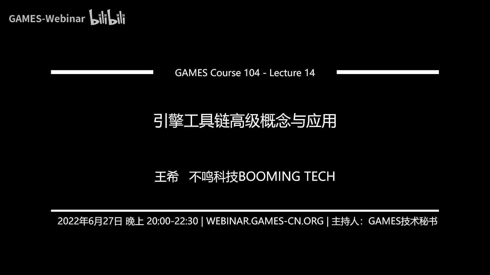
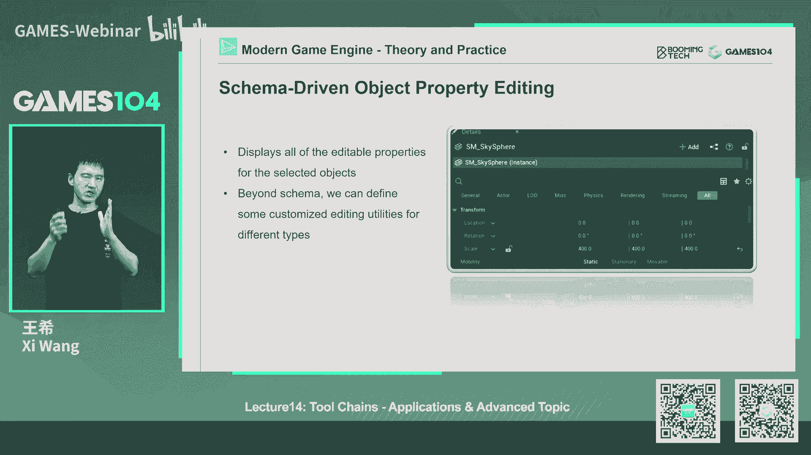
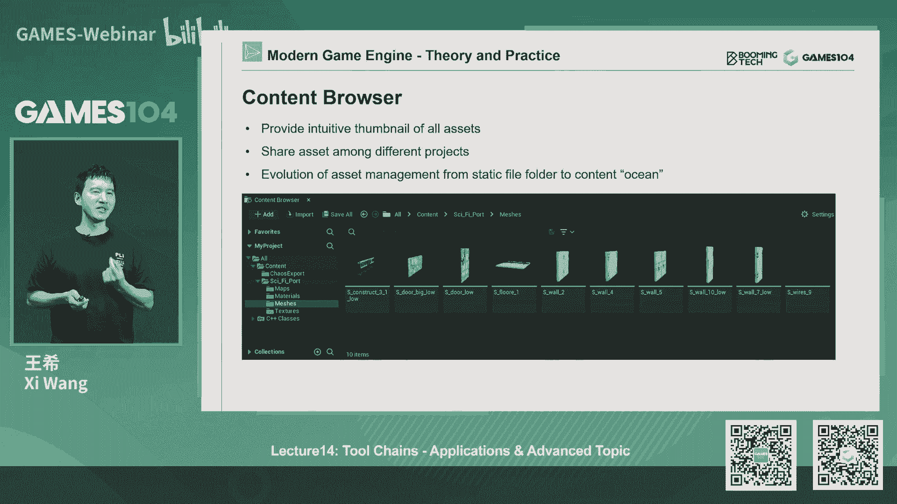
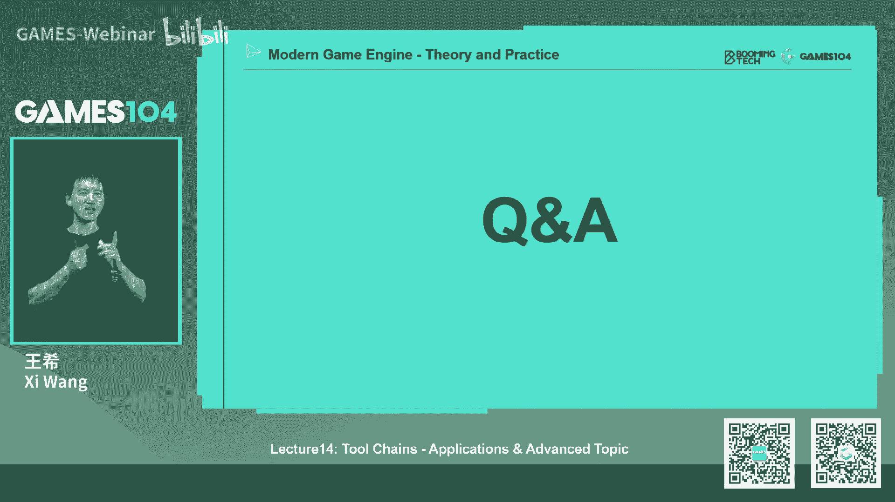
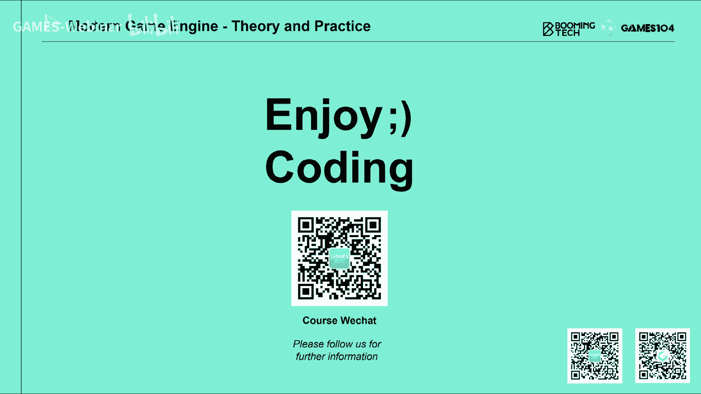

# 课程14：引擎工具链高级概念与应用 🛠️ | GAMES104-现代游戏引擎：从入门到实践

在本节课中，我们将深入探讨游戏引擎工具链的高级概念与应用。我们将从游戏生产的实际状态出发，重点分析地图编辑器的架构设计、插件系统的实现模式、线性叙事系统的表达方式，以及反射系统在工具链中的核心作用。最后，我们还将展望下一代游戏引擎的重要发展方向——协作式编辑。

## 游戏生产状态概览 🎬

上一节我们介绍了工具链的基本原理，本节中我们来看看真实的游戏生产是什么状态。

在真实的游戏工作室中，艺术家和设计师会使用各种各样的工具协同工作。有人负责场景布局，有人设计游戏玩法。当点击“播放”按钮后，游戏世界会呈现出复杂的行为，其中包含了大量程序化生成的内容和为设计师定制的框架。从概念设计到3D模型生成，所有环节连接在一起，构成了商业级游戏的生产管线。最终交付给玩家的，是一个所有元素都具有语义、可交互、可玩的游戏世界。

整个工具链还面临一个巨大挑战：游戏类型繁多。对于不同类型的游戏，其所需的编辑操作、玩法设置甚至关卡组织规范都完全不同。这使得工具链体系变得非常复杂。

## 世界编辑器：核心枢纽与架构设计 🗺️

工具链包含数十种工具，我们无法一一讲解。本节我们将聚焦于一个核心工具——世界编辑器，并探讨其架构设计。

在专业的游戏引擎架构思想中，世界编辑器不仅仅是一个拖拽工具，更是一个**平台**或**枢纽**。它是我们将游戏世界中需要构建的逻辑、玩法、场景内容集成进来的平台。因此，在架构自己的世界编辑器时，首先要建立这个概念：它是一个允许各种功能插件插入的平台。

### 世界编辑器的核心窗口

一个商业级的世界编辑器界面复杂，包含多种面板和视图。对于不同的用户（如动画师、场景美术、玩法设计师），其呈现的面板也完全不同。这印证了世界编辑器作为枢纽的特性：它集成了许多功能，但为不同用户呈现不同的视图。

以下是几个最重要的体系：

1.  **视口**：这是用户与游戏世界交互的核心窗口。其底层运行的是一个完整的游戏实例，但处于“编辑模式”。在此模式下，可以实现自由飞行相机、无视碰撞、显示调试信息等游戏运行时无法进行的操作。这意味着引擎代码中会存在“仅编辑器”的代码，必须小心不要将其编译到最终发布的游戏中。

2.  **对象列表与视图**：游戏世界中的所有物体都是可编辑的对象。当场景中的对象数量达到成千上万个时，如何管理它们成为挑战。商业级引擎会提供多种视图来管理对象，例如树状视图、分层视图、搜索功能等。数据模型与视图分离，允许不同的艺术家根据习惯使用不同的视图。

3.  **属性面板**：当选中一个对象时，需要通过属性面板直接编辑其属性。这依赖于上一节介绍的**Schema反射系统**。编辑器可以自动根据对象属性的类型，生成相应的编辑界面。

4.  **内容浏览器**：这是现代游戏引擎中至关重要的部分。它将资产从静态的文件目录管理，转变为“资源的海洋”。资产被放入一个巨大的池中，用户可以通过名称、标签等方式检索和使用它们，而无需关心其物理存储路径。这支持了跨项目的资产重用和高效协作。

### 基础功能的实现细节

有了基本的架构思路，实现时首先要解决的是基础交互功能。

*   **鼠标选取**：这是一切编辑操作的基础。通常有两种做法：一是使用物理引擎进行射线检测；二是在编辑模式下，增加一个额外的渲染通道，将每个对象的ID渲染到帧缓冲区，通过像素拾取来获取对象ID。后者更精确，但会消耗额外性能。
*   **变换操作**：对物体的平移、旋转、缩放操作。虽然基础，但需要精心打磨以符合艺术家从专业DCC软件带来的操作习惯，例如支持整度数旋转、多种Gizmo交互模式等。

### 环境编辑与规则系统

接下来，我们看看如何编辑地形和环境。

*   **地形笔刷**：如高度笔刷、实例笔刷（用于刷草、树木等）。核心难点不在于笔刷种类，而在于如何使笔刷操作的结果过渡自然平滑。此外，提供艺术家自定义笔刷（如导入高度图）的能力非常重要。
*   **规则系统**：这是环境编辑的核心。例如，修一条路时，需要自动处理“路上不长树”、“路面需平整”、“路基要有碎石”等规则。一个更复杂的需求是**确定性**和**局部性**：当修改局部环境时，系统应只重新生成受影响的部分，而其他已满意的区域保持不变。这需要一套形式化的规则语言，让设计师能够定义和维护复杂的生成逻辑。

## 插件架构：灵活性与工程实践 🔌

上一节我们介绍了插件机制是工具链的核心。本节中我们来看看在游戏引擎中实现插件架构的具体考量和挑战。

在世界编辑器中，功能可以看作一个矩阵：纵向是各种对象类型（如NPC、环境物体），横向是各个系统（如网格系统、粒子系统、动画系统）。插件设计需要同时支持这两个维度的扩展。

### 插件模型

在软件工程中，插件有几种常见模型，在游戏引擎中都会用到：

1.  **覆盖模型**：新插件完全覆盖旧插件的功能。例如，用一个全新的曲面地形插件替换原有的地形系统。
2.  **分布式模型**：各插件独立工作，互不影响，最后将结果合并。大部分编辑器插件属于此类，如粒子编辑器、灯光布置工具。
3.  **流水线模型**：插件按顺序处理数据。例如，几何处理插件在物理插件之前运行，先切割模型，再设置物理属性。
4.  **洋葱圈模型**：插件需要与其他插件进行输入输出交互。例如，规则系统插件需要读取地形、植被等插件的数 据，处理后再将结果写回，影响其他插件的状态。

### 工程挑战

设计插件架构时，必须保持高度的开放性，以应对未来未知的生产需求。同时，也面临严峻的工程挑战：

*   **版本兼容性**：引擎内核会不断升级，但第三方插件可能无法同步更新。需要设计一套接口版本管理机制。
*   **接口误用**：引擎开发者无法预知插件作者会如何（或错误地）使用开放接口。当引擎内部数据结构升级时，即使接口函数不变，也可能导致依赖内部实现的插件崩溃。

架构设计需要在严谨一致性和解决实际问题的灵活性之间找到平衡。秉持实用主义原则：任何能优雅解决实际问题的架构，都是好架构。

## 线性叙事系统：时间轴上的表达 ⏱️

游戏中充满了线性的叙事性内容，如过场动画、UI序列反馈等。本节我们来看看如何在工具中表达这种基于时间轴的变化。

我们以虚幻引擎的**Sequencer**为例。其核心概念是：为世界中的每个对象（Actor）创建一条轨道，然后可以对该对象的任意属性在时间轴上定义变化。通过设置关键帧，并在关键帧之间进行插值，就形成了丰富的动态序列。

这个过程本质上是**在时间轴上修改各个对象组件的参数**。无论是控制角色移动、光源变化、播放音效还是切换场景，都基于这一体系。

这引出了一个核心问题：工具是如何知道并能够修改运行时对象的数据的呢？这就引入了下一个核心概念——反射。

## 反射：连接引擎与工具的桥梁 🔄

反射是连接引擎实现与工具编辑的关键桥梁，也是实现可视化脚本等高级玩法编辑的基础。

### 反射的作用

在高级语言中，反射允许系统在运行时探查类型的结构（如类、方法、属性）。在游戏引擎中，反射使得工具能够：
*   自动获知引擎暴露了哪些类、属性和方法。
*   动态地调用方法或获取/设置属性值。
*   为可视化脚本系统提供节点和接口。

如果没有反射，工具层就需要为引擎的每一次功能扩展而手动修改代码，这将不可维护。

### 反射的实现（以PICCOLO引擎为例）

许多同学关心如何在C++中实现反射。PICCOLO引擎的做法具有代表性：

1.  **利用编译器前端**：使用**Clang**库对C++源代码进行解析。Clang能将代码转换为抽象语法树，从中可以轻松提取类、成员变量、方法等信息。
2.  **自定义注解**：通过宏定义，在代码中为需要反射的类或成员添加自定义标记。Clang会将这些标记解析为注解。反射生成器通过检测这些注解，来决定哪些内容需要被反射。
3.  **代码生成**：反射信息获取后，需要生成对应的访问器代码。PICCOLO使用**Mustache**模板引擎进行代码渲染。通过编写模板，可以自动生成大量的`Get`、`Set`、`Invoke`函数代码，避免了手写的重复和错误。

这套流程实现了从C++代码到内存中的Schema数据，再到工具层可用的接口代码的自动化生成。

## 协作式编辑：下一代引擎的发展方向 👥

随着游戏世界越来越庞大复杂，需要多人同时编辑同一场景。协作式编辑将成为下一代游戏引擎的重点发展方向。

### 传统协作方式及其问题

1.  **分层编辑**：将世界按内容分层，如地形层、建筑层、植被层。问题在于各层之间存在依赖，一层修改可能影响其他层。
2.  **分块编辑**：将世界划分为不同地块，分配给不同人。问题在于跨越边界的物体难以处理。
3.  **单文件每对象**：如虚幻5的“One File Per Actor”，每个对象存为独立文件，彻底避免冲突。但会带来海量小文件的管理和性能挑战。

### 协同编辑的核心基础

实现实时协同编辑（多人同时编辑并即时看到彼此改动）的核心基础是**操作原子化**。即将用户的每一次编辑操作（拖动、修改参数等）都封装为一个**命令**。通过网络同步这些命令，在所有客户端上按相同顺序执行，即可达成状态一致。

### 挑战与解决方案

协同编辑的难点在于处理冲突和撤销/重做。

*   **锁机制**：对资源或对象加锁，防止同时修改。
*   **操作转换**：使用**OT**等技术，定义规则来解决操作冲突，使各终端最终状态一致。
*   **客户端-服务器模型**：所有操作先发送到中央服务器，由服务器统一结算、排序后，将结果广播给所有客户端。这能保证一致性，但会引入少量延迟，且需要处理服务器容错。

协作式编辑在理论上和实践上都是前沿领域，但无疑是未来提升大型游戏生产效能的必由之路。

## 课程总结与作业 📚

本节课我们一起学习了游戏引擎工具链的高级应用。我们从宏观的游戏生产流程切入，深入剖析了世界编辑器作为功能枢纽的架构思想，探讨了插件系统灵活性与工程实践的平衡，分析了通过时间轴表达线性叙事的Sequencer系统，并揭示了反射机制作为连接代码与工具的核心桥梁的实现原理。最后，我们展望了协作式编辑这一前沿发展方向。

### 本节作业

本次作业是一个开放性命题，旨在让大家实践反射系统的完整链路。

**作业要求**：在PICCOLO引擎中，尝试为角色或其他对象定义一个新的自定义属性，并让整个编辑和运行链路生效。
例如，为角色增加“血量”属性，并实现“从高处坠落会根据高度扣血”的逻辑。

**你需要完成**：
1.  在C++代码中定义新的组件或属性，并使用反射宏标记。
2.  确保该属性能在资产文件中序列化/反序列化。
3.  在编辑器中能够显示和编辑该属性。
4.  在游戏运行时，该属性能正常生效，影响游戏逻辑。

通过完成这个作业，你将真正掌握从数据定义、反射生成、资产编辑到运行时逻辑的完整工具链体系。

---
**参考资料**：本节课提及的相关资料与扩展阅读内容，已发布在课程官方网站上。