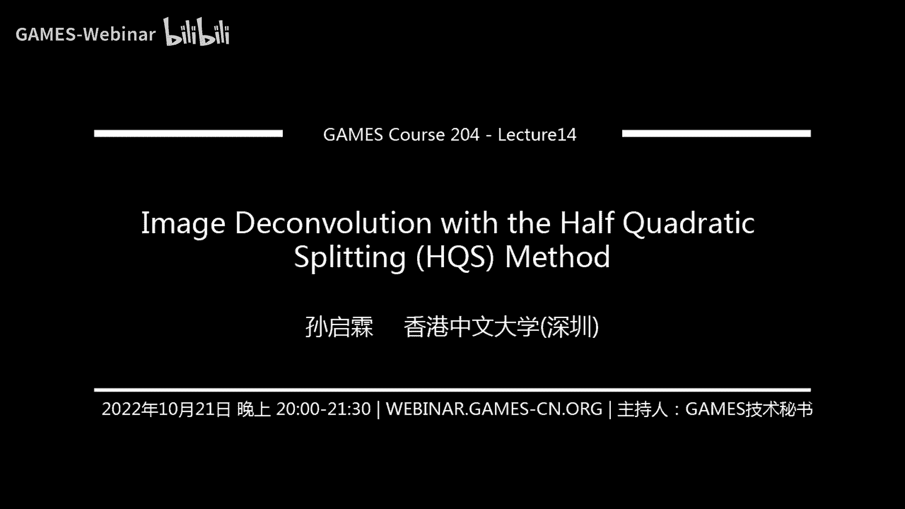
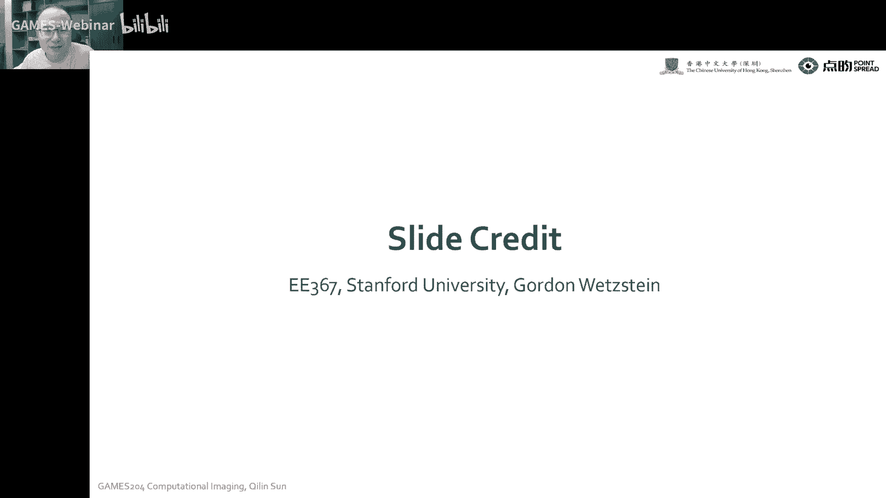
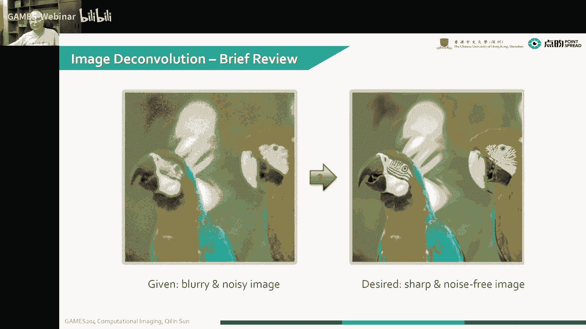
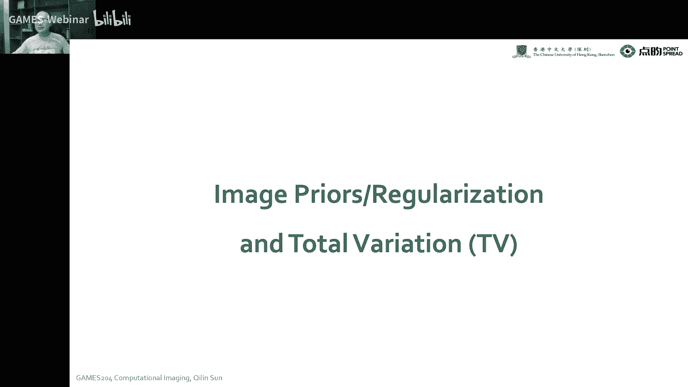
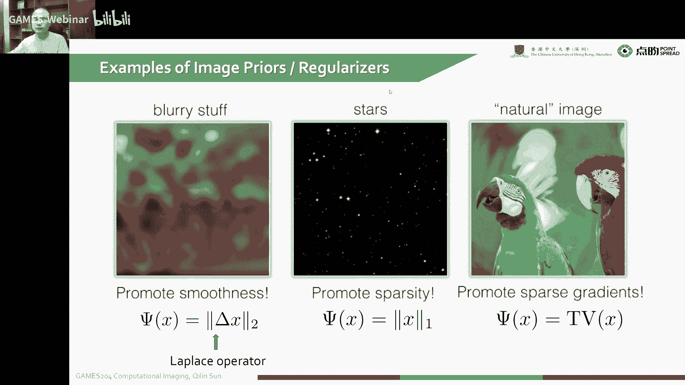
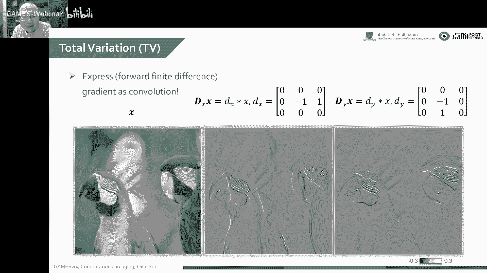
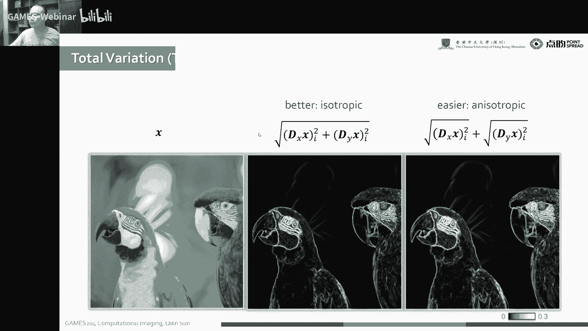
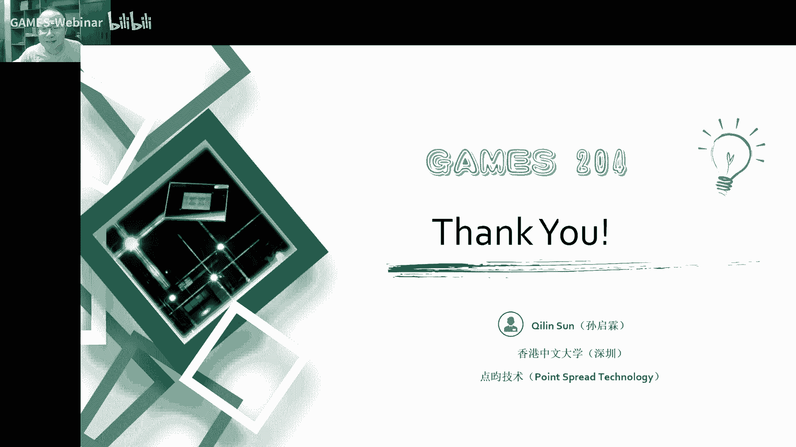

# 14.去模糊与成像逆问题剖析 ｜ GAMES204-计算成像 - P1 - GAMES-Webinar - BV1Xd4y1C7v3

它是一个比较经典的一个优化的算法，这是我们给这个优化的例子呢，就是我们上节课讲到了这个，你们不是说我们有讲的布拉德一个极大成功嘛，还有一个bassical limit带来的成功，嗯还有像呃这个手抖啊。

或者是物体的运动带来的一个fla，那当然还有它本身其他其他的那大气散射呀，或者是接着闪，也有可能一起主要的这个，但是这些所有的问题啊，纠结下来就可以呃把这个information给它写出来。

哎最后我们再让他们现场处决到我们这个信号啊，通过我们这边的手段，你去求解个密问题，是可以把我们想要的一个肯定的信号比较好做的啊。

今天我们就从这个最基本的一个优化的一个手段叫have the relemon来入手，来给大家进入啊真正的一个密问题的一个阶段，首先呢要给大家呃分享一下这个比那个宠物省的一个历史嗯。

然后再给大家讲一下整个我们这个mage formation，怎么样把它用一个半月出的一个protect来描述起来，这个这个我们这个成像的一个问题，然后描述用这个翻译师啊，贝叶斯来这个描述完之后。

我们就构建了这么一个inverse problem，哎但是构建是我们跑五不能，我们会发现比如说到一些噪声啊，或者一些呃其他的一些不好的一些因素影响你想要解这个应问题，经常会有一些很低pose的一个问题。

就是我们写的问题通常都是动态，那解这个病态的问题呢，诶而且同时啊我们还会遇到我们最后要点一个cos function，这个时候我们就需要一些and nutria。

或者是呃一些我们learning fire来做一个衣服，而且今天给大家科普一下这个呃本身形象的一个bug，还有规定的spy来讲，比如说要要符合蘑菇，可以加个拉普拉斯的一个优势诶，还有这种么样的一种约束。

这个是可以先帮我们限制几个解决金，哎，最后通过一个up for that me，哎我们把这个linux conversion的一个例子就呈现给大家来，再加上本身一个后面的噪声。

唉通过这么一个例子就可以给大家解，到底我们这个里面formation怎么写啊，加一个那个微信符合怎么解诶，这个它是一个比较通用的套路哈，希望大家把这些套路都掌握好以后，你要再介入什么物理模型啊。

都可以很轻易的把这个套路套进去，然后最后求取到我们想要的结果，来设计这么一个单机，啊这个是从我师兄golden vp那借了很多live，大家可以关注一下这个funch。

首先呢要给大家讲一下这个mad conclusion，说到这个类似长5t像我们通常我们的图像传感线上达到图像，其实通常镜像左右，那首先哎我们这个经历了各种各样的一些不乐的因素，我们这个图像就变得模糊。

同时呢你传感器我们知道我们也分析了一个传感器上的一个教程，我这个有这么要，同时呢我们之后拿到了一个图啊，就是又有模糊，又有造成干扰的这么张图片，但是大家想要的是什么，一个可能大家想要的一个结果。

而往往是我又要清晰，又不常含有噪声，这个问题怎么解决呢。

其实，大家就可以通过一个媒体conclusion的方式，而同时啊我们首先啊我们通常观测我们在同样成长身上的观测，比如说你把它记为b这个b啊，还有噪声，还有不认我们这个干净的一个图像呢。

就2d里的插图以及，然后这个c呢就通常就是我们所说的布洛克，就是我选择不乐的过程和这个c最后呢呃通过这么一个noise啊，今天只给大家提供一个ng诺，夏节课会给大家设计一下波斯诺。

这个时候就我们整个靠方程要稍微给你普通方程来稍微讲一下啊，但这个整个套路点套路都是大差不差，最后呢我们呃首先规定一下我们的max formulation model，我是一个flag。

图像通常就是一个convolution，就是一个不好的一个不乐盒吧，这个c跟我们干净的图像进行一个convusion，最后再加上一个告诉，然后呢呃其实我们这个也可以把它的频率去解一下，这个这是剪辑啊。

这个体育的那个时域的卷就等于个体育的乘，对不对，我这个把它做分离变换，变成简单的相乘，然后再给它逆回来是吧，所以这个一二这个问题是相等，我要求解这么硬性问题呢，就我们已知b然后已知c我要求减x。

大家有时候放到平面不考虑噪声了，这个确实是直接诶或者两个频率一相乘，再做一个reverse变换就可以拿到我想要的这个x我的xp的一个好的，当然这个就不考虑造成了，但是你不考虑噪声。

往往会有一些呃非常不好的结果，就是我做个造成一点，我有灵敏，这时候咋办，唉这个问题就变得嗯就很难过很难过哈，就最后你没有这个有噪声的情况下，你最后啊求解这种机密。

就是你vertising的时候就会提供非常差，所以说呢，20世纪父母年代就大概嗯这可能是80年前了哈，有一个叫维纳的一个老哥哎，另外一个维纳利波，他是它实际上还是求解一个最优的一个电竞方程的一个解。

但是呢这个时候我们要考虑啊这个噪声的，把这个音噪声，然后我求解了一个本身实际上也是处理一个正常情况嗯，最后我们就可以拿到带屏蔽的一个点，它是跟一个造成相关的一个分解的一个办法。

然后在评语里面我们知道b b妹子就等于c或conclusion，跟这个就是一个干净的，就像x和conduct，然后呢我们有时候也是可以把这个c啊嗯写成一个微型形式。

很好表示写成一个大飞机用的mation的表现，来举个例子，比如说我们做这个五分基础问题，就我们考虑到光柱是左边的一个非常干净的这么一张图诶，我们在直角三角机场就是拿到图呢，假如说没有造成。

这也是非常干净，但是只是有一点不认，这个时候我们是做一个简单的一个呃revertising，这个时候我觉得这个平均值也相同啊，我们就可以没有弹幕干扰，我分析拿到非常干净清晰的。

但是呢一点点造成的干扰就会使我们结果变得非常坏，但我们这个噪声大的时候会变得更坏诶这个时候就怎办呢，这时候就是聪明的人类，就是我们提到了一个1940年那个时代维纳斯的一个维纳，就我们把这个噪声也考虑到。

直接让我求解问题的时候，就是呃我求解，我这个对我要预估了这个tag，然后跟我自身的一个让他data facility，其实要尽可能的一些相对啊，这个也是我们后面啊求解，这个也是非常一致的。

五维纳滤波就很好的解决这个问题，就哪怕有一点点噪声，哎我这个听过这个维纳滤波也是可以比较好的，分不出来这个形态当然也不是特别好，它还会有一些模糊，因为它毕竟还是一个病态的命令呃，这个sr又低呢。

就我实际上我最后我们可以从这个直接可以从这个公式观察到哎，生来越高对吧，我这个价非常高，加上无限高这一项一项就是零，对不对，这枪就是零，我们这个上下都是一消。

实际上就是一个很干净的一个就很干净的这么一个图了啊，这个s a r走出了这个西格玛像相机的噪声，我们是有专门的专利方法，就是像拍这个这个灰度卡在一个基金照明下，有一个过度卡的增加的百分率。

哎我们就可以像上节课之前我们讲这个来进行，然后像一般这种图像的，他这个噪声啊，这个这个噪声是我们自己家的这个呃虽然我们自己心里有数，对sr让大家直播间有时候要真的犯法。

就是很多时候就直接不考虑它的一些像按电流啊，就是直接减掉了，我就考虑后面x no，然后就拍了很多张avg一起之后，拿一张的一个图也要去归这个公主来听啊，像这个也都不是很懂，你要用沽的话嗯。

其实也不是特别好这个，但我们看到这个sr角的时候，在底下这个就是变特别大，所以说我们这个分母变大之后，这个实际上就意味着模拟一些，平面的种子，这个时候我那个blue就会没有办法，所以说特别好。

那这个是跟sn啊给我们信号的一个新道具新相关，所以说呢我们这个mac cot是什么本身啊，它是一个静态的一个应用，就是我们会有非常多非常多的一些血来满足我们这一个因素条件。

所以说这个我们还想加一些另外的因素来使我们解就更加好看，更加复合，自然还有甜美的一些规律对吧，这个时候我们就需要加一个room叫in pri，就是实现图像的一个约束。

我同学们也会经历很多自然界统计的规律啊，或者是自己人经验的一些规律来建立自己的华尔，那我们要求解这么一个例问题时，我们要想想要把一个它一个概，把它描述成一个概率统计模型，就把这个英文写。

然后一个概率数据模型我去优化了一个视频，诶最后我们要怎么样，你慢慢说起来，我们要求解一个问题的，就是我们有没图的，这种就是在我朋友身上拿到的一个b就等于一个a x加斯塔，a就是我们所做的一个mit什么。

这是我真实的一个呃信号，通过我们的相机系统哎，这个时候就a a可以是不乐啊，也可以这些变换，这个时候那就经过一系列的测试信号进行，通过一系列的变化，或者是congo那样再加上噪声。

实际上就是我们最后的几个可能性，mod通常大家都写成一个ax加上一个道上的一个效果，其中的s就是我想要的粗炮，它是符合一个就是这个吧，是你的一个这个没，有造成这款是零的一个。

那么就有一个加上方向有一定的理解，然后伊特呢就是一个造型，白道是他是帮他和西格玛方的西格玛的一个白道，fla呢，就是我这个信号经过这个a的一个a的一个象征系统的一个调试诶，然后再结合这个噪声。

就是我们这个最后拿到了测量传感器，拿到了一个它的一个分析，我们的一个observation，就是我们观测到的一些东西，实际上是定语是吧，唉当然我们是在一个condition，是在x跟西格玛。

这个时候我们就可以把这个你最后拿到这个币啊，就是我们观测的地，实际上，是符合这么一个高度分布的，然后每个像素我们都结合起来，就是把这些东西都调成就，最后达达到我们那个整张图上。

它的一个观测就是它的一个连成，哎我们就发现我们的这个根据这个3月入了我们这个最后的一个pcr，我们实际上观测到了b我们要铺x对吧，这个西格玛就知道了，这噪声是知道的，因为这个我们先把这个噪声铺下诶。

这个把他这个拆解出来，你就可以找到之前弄一个qb，然后是根据我们的观测，根据我们的观测b然后paptional哎，对我们这个pd condition s是什么p s后面呢我们这里通常就要跑二诶。

这个时候我们是想要通过一个最大自然估计啊，就是我们想要让这个呃概率最大，对不对，实际上就是让它一个概率的复数最，小是吧，就咱取个log，学会了好解啊。

取log也会影响这个嗯这个函数的选项就让我们要让这个概率最大，我要哭出来，最顶级车里的指数概率最大诶，我加个括号就是求他一个最小的就是阿克曼，就阿根廷，然后呢我们从已知的观测地。

然后再推出这个x是不是哎呀melix这么一个方程，那英语有选logo，就我们这很多地方都可以写成一个在这个相加的一个过程，实际上我们最后拿到了一个公式，就是可以记为这么一点。

就arc m2 倍根号方分之一，加上个b减a x nl phon要加上一个后面的一个，revision，这是我们通过最大自然估计就是推出来这么一个优化的100度。

实际上就是我们就需要优化作用函数来处理到我们最想要的结果，本身呢就是我们这个带点控的一项，通常叫revise，然后我们把这个cost function分成两步，前面那一部分。

the debut dele，大家可以理解为哈，这个我这个b也是就a x加上一个噪声对吧，这个噪声是临床分布的，也是他的now应该是最小，实际上大家这个不考虑噪声啊，这个玩意就应该相等。

但是我们这个时候他不知道，我不知道它是啥，我们要保证通过这个相机模型a哎，我调试过这个我们想要的进行s应该是我们观测是相对这个啊，data和vity也没啥可疑问的。

但是我们要限制的这个解空间通常还是要后面一些约束我啊，有一些哪些人就是我的，最后一个信号s应该符合哪些自然的一些图像的些分布，或者是用已知经验的一个形象的一个分布，这个是呃要有一个约束。

然后呢我这个要先给大家科普一下都有哪些约束，第这个什么是pv呢。

就是来给大家讲一讲，这个就没ur，我这边有s的例子，这第一个假如说我们想要增强和这个图像的模糊程度，这怎么办呢，就是我这个fw，你看我这个地方要moi这个bat对吧。

哎我这个时候就可以把整个图像里面的它的边缘拉出来，溜拉发声，通过这么一个东西把x电源拿出来，哎我把这个边缘都优化小了对吧，这个时候电源都变小了，这个图像就算用变模糊了对吧，那比如像我们拍星空。

我星空星星点点诶，但是大部分情况都是空的，都没死，这个时候我就这个说明拍清楚这张图本身的这个自然不像s，它应该是自己就比较低级，也没什么电器相互比，但我们自然的一个图像，它活着什么规律呢。

是一个the progravity，实际上就是它的整个鬼脸的，就是我头像的一个鬼脸的bust，这个在我们前面啊，就while i want the gradient in caa。

这个时候给大家提过这个事，对自然图像通常它的一个边缘buff和它这个边缘norm，它应该是一个动画小的值或者对面名的名词，这是一个比较经典的这个mate 2。

那说到这个pv啊，其实有些很简单，它只是呃就是相当于我们把这一张图片哦，所有的规定都求出来对吧，我把这个组件求出来之后，再把这个加起来，这就是他的toto不行，因为我一个点的变化是一点的。

vation toto vision，就是把这些点的变化都加起来，也就是把那些鬼点都加起来，这个啊非常努力，那我们这个求这个推演的时候也给大家讲过，假如我他妈一个泛指把它记为d s。

然后我对这个图像求的时候，实际上就是一个呃后一定一的这么一个规程，就可以很轻松的把这个就不点的存在就很，轻松的这个锤子，这个地方你就分别把我们这个x和y方向的这个规定的说出来。

就是这个todo liation，顾名思义也是非常简单，这个每个点的变化叫very reset，来就是toto的，然后但是我们要mini就行了，就是这个toto就是整个的一个变化变化量哎。

这个时候就可以构建我们一个cos f，因为这个让他尽可能的小鬼，脸上本身buff和这个就符合我们对自然图像的经济，对就tv这个同学说过，某科学的同学说这个tv作文好像很早可能比这个还早。

因为这个人的这个智慧还是挺厉害的啊，特别是以前古老的科学家，就是上个世纪的科学家，当时在计算工具没那么发达，和大家很多时候都是摸索这个就图像啊，或者是像我们信号的一些自然规律。

本身这个covariation最早，这个电机的维修点应该是用静音去优化这一点，但他为什么这个东西视角里面是数学这种出来的，可能非常早，可能估计得有一两百年了，这么一个地方大家也可以翻一翻。

有些还有一些很多人老论文就可以拿到非常多的灵感，来应用到今天的一些呃科学问题。

大家尽情的去回顾一下古早的一些问题。

当我们刚才讲到了一个xy方向的一个这个gradient，当然我们有时候呢因为xy方向本身求的时候，他没有各项异性不是特别好，所以说呢我们就求助电的时候，我们就干净，一不做二不休是吧。

x y方向我求个平方，对你每一次方向推进它，我就是直接求出它那个方向诶，这个时候出去，那就拿到了一个呃各项ropic的一个photovation对吧，把这些加起来构建一个cf。

那简单一点就是或者x方加y方，这个最后可能在求解这个方面，但这个问题都不大，这个问题都不大，哎这个时候我们就真正的是注入到这个pvation，就是我们举个例子啊，因为它本身是比较怕对它规定的。

一般是boss，就是我们他回电大部分都是没有指望，也就是因为它plus就是我们最后把它加起来，把所有的规律加起来，应该是一个比较小值，有比较小的问题，这个时候就符合我们图像和自然cd。

因为我们大部分的一个自然图像都是边缘这个信息嘛，就这么边缘是记录了一些比较，所以说这个就让他进行的选，然后这个tv就可以变成这么一天到这就非常同性也好，非常异性也好。

我们都可以通过呃这个pvation来就接触的每个点呢，这个这个ta有点离，就是刚才强调了每个点的变化，就是一个vation covation，就是它加起来哎，这个时候我们就可以用一个l y mo。

就有的人大家也会用这个q nf now tv的now，这个最后优化的效果不是特别好，就是为啥呢，就是因为他那个尖的那个地方嗯，就是有时候不可谓，而且本身这个l one我直接优化的时候，它是两个直线方程。

这个更符合我们这个直线工具的规律，这个优化的时候嗯，效果会稍微更加好一点，比如说大家通常形容它的一个外nda，而不是absolute value，而不是用它的一个n。

你最后边缘剪出来的边缘会更加清晰一些，实际上这个为什么比偏低的就是l two靠近那个基础的地方，它有点太小了，有什么解优化的那些地方收敛的就是没有特别非常经典的时候，他那个边缘是会有一些模式。

这个大家可以注意一下，这个整个pvation是整个就是没有公布信息之前啊，就这个特殊位简直是占据了半壁江山，就大家通常都是构建这么一个优化函数，它有非常多的一些呃有意思的作品。

对这个这个女生叫老贝也很厉害，他之前搞过一个pp拉bation，但他也推上过这个我们这个用lslight的一个光场相机的图片，他也就put it actor，也是啊，老板当时提出来的。

访问the norm of，开始这些很经典的文章，大家都推荐一下，可以这个都是关于这个凸透的a神，当然除了像我们自然提倡啊，这个托头人士也经常用于像深度图像的一个优化，怎么样去保别渠道。

这个都非常有一个很大的一个问题，当然我们有这么一个期待求解的一个优化问题，我们已经描述出来，就a x减b再加一个rather rider，我们最后的解读解这个问题呢，对不对。

就我们这个目标目标函数已经列出来了，我要尽可能的让这个目标更小，对不对，像第一部分就是我们的一个data flag，就我这个观测模型，就我最后推相机模型，还有我要推出的特制的s。

还要符合他一个嗯就值的一个保值的一个，然后第二个部分就是我这个要下载的那个来着，就说让他不练的，我这有一个位置，我这个number马越强，对不对，就是把整个鬼点的，那个值啊在这里面占权重就越大。

是不是这个时候也就是我们高频增加的更多啊，这个这个这个也会引起一些就是不好的，阿德盖茨，那小了呢，那这个优惠比较模糊，写出来这个大家这个套餐啊，在我们呃一些解优化的问题。

这个套餐也是一个呃呃这么一个玄学的一个问题，这个调大小小最后的结果影响的都不好，一些优化的解器，这个是一种方法，但是我们也不希望大家掌握一些更底层的一些知识，就是我们这些不到点球。

而且像我们这哪怕到了今天有很多这身体得解那些求解器，就解的也不是特别好，就收敛的会比较慢，因为大家就掌握这个优化的前进性能，也可以去改一改，就是怎么就比如说我用一个a b mm去替换其中某些环节，诶。

处理完之后这步就进的自由好了，下一步再来这个时，候就可以对我们整个的一个计划，就是说这个就是不光是优化问题，这个新的游戏里面的优化问题，也可以借鉴优秀的资产，在主角就听到了一个half。

在这个级别在北我们已知啊，我们的那个object function对我们的目标还对，就是一个1%，是最后我们后面求的时候发表示这个要求的哎，这个时候前面的这和ity加后面的一个lego vier。

我们把这个套装选一个目标函数，就重新写为就是fx加tz的这么一个假设，我们现在用的是一个啊就是鬼点和一个pvation，就是随便个bug，就是这个我们就自备了。

就像jz实际上啊就表示为g x减z等于零是吧，我这里用一个新的引入了一个新的一个变量，一定实际上它是作为呃x的一个节点的，实际上这个地方是逐渐引到了，所以他的操作和这个美丽的空间上去。

我就可以把这个整个的可靠方程给他一个fx加t v啊，但是我要优化呢，都是优化这两个参数，对不对，然后它要符合gx减z成员这么一个要求，那我们把这个ctrl d x y等于零点进来点进来对吧。

把它作为一个看剧，提到我们整个的一个就叫拉格朗的函数，这个拉格朗的函数，这个图的这个应该在这里面，这个图应该是能保证的，这个规定l i no，再加一个iphone，这个肯定是负的。

当然有时候呃感觉有有些有些时候会有会涂好就会哭，你就点点点的，不知道点哪去了，所以说这个这个这个问题咱回头再单独列出，把这个点进去之后，我们就可以构建成一个安装方式，但有些同学可能已经学过了一个。

就在这里想问大家一个问题，你通过这个拉布尔函数就看出来这个a d i就我们这个它的switch letter，在两者之间有什么样的区别呢，大家有没有学过的，这个可以给大家。

分享一下这个从这个我们这个阿克曼函数就可以看出，我们这个up加一个图形跟a b之间的一个区别，就是本身好像a d m它那个构建的拉杆横叫augmenting的拉格式，它是一个中长型的拉杆机。

实际上除了我们这里，比如说我们既要解这个方，用一个电源去解这个函数的时候，那除了我们列出来的一项，他还要增加一个一个工程项来去，作为一个是让我们整个就解的更加更快一些吧。

这个我在一个专门大家可以讲一下这个up或者x0 和a之间的区别，当然这个最后呢从性能表现来说，还有一个一应性来说，这个还是这点能不能弄一筹，当然这个就h6 s大家也是好好好掌握一下，我都可，能用。

我们把这个拉装完函数解出来之后，实际上我们就是要交替的去优化这个值分配对吧，因为这个z跟x相关了，但是我们把这个单独写出来，就是为了呃我们可以分步骤的就分别优化x n z交替的优化s。

这个时候最后就可以不断的收敛，不断的收敛，收敛到就想a的心，我们在优化x的时候，我是可以把这个z当成一个优化v的时候呢，就把这一步的x当成常数就交替的优化，那我们在我们这个这个这个就是c9 。

就没有说没有找到一个阈值的时候，这个时候就没有收敛，没有这，点我就交替的优化它好了，我们现现在第一步，那优化这个x实际上优化的过程，我们这个有有个东西叫proximal officer，也就是近端分子。

我们现在只考虑有s哈，这个z现在就是一个常数，我们要优化这个拉格朗日，也就是minimus这个ip对吧，这个类常数，c类常数对吧，不管它这样，我们从这里面拿到的就像是fx加上1/2周，然后在后面就拉了。

这是我们第一步要优化，还有一个问题，然后第二步把这个x fix掉，我现在第二步这个x乘以一个常数，我现在优化z是吧，或者fx，所以说已经变成常数了，我们一优化的是后面这一项。

实际上我们最后这一个侧目就df点对它的一个now，这个时候已经是作为两部的一个音节，就是我两部啊，这个做实际上是构建x跟z的一个观点，这个时候就是看的标注的，我们在每一步优化的时候。

都要考虑到这个rgrier这个一些问题，所以说呢呃解这个拉过日的时候呢，我们就可以像刚才讲的分别去优化这个x p b，你有个变量对正面优化这个x z，直到他收敛拿到一个我们最后想要的一个结果。

所想要的一个x，当然我们有时候也会把这个就快直接写出来了，像fx就是呃实际上是c减b对不对，减去一个data com z呢，实际上就是不合后面的这个就是一个后面取一个推荐的位置，一个关系啊。

有空位中间一个关系，从这里面我们可以看到，这时候我们变量x对我们最后想要求的一个shop里面，然后呢c呢实现原理的就是就conclusion也好，就一个没有防卫性也好。

反正不管就是一个好图变一个快速的一个过程，对大家之前那个旁边声音就会给大家讲，然后呢这个z啊实际上就我们就加了一个like vb，对他大概是这个这个要考虑xy方向。

这个也就是这是它的size是整个s的两倍，也就像是x两倍，这个考虑xy方程，这个大家注意一下就好，b等下就求个主导，这个也没啥问题，答这个问题就从这儿就来了，我们要分别求这个两步哈。

第一步是优化得到减cf的优化z我这两步我把这个我，们的目标函数解出来之后怎么优化它们，第一个我们就发现这个科的话，它是两个lsnow对吧，这个时候诶大家发现这个时候不是很喜欢，很简单是吧。

这个实际上就是一个你你不要把这个展现一个非常大的一个maj，那就抽象一点，这玩意就是一个idol的函数，我求个导诶，是不是就可以很快速的把这个x x求出来了，直接导到它等于零，有它的地址，对不对。

这是一个严格的一个图标，他这个机制就一定是学计算机，但哪怕这个最后可能呃这个我当这个c跟d可能会比较难难用，那最后大家，点的时候通常是一个就靠这个怼脸来快速求解啊，这个第一步。

那第二步呢要求它的一个toc主要去mini ma这么一个函数吧，这个就是b n t z平方加上一个z对吧，这个v是边角，这个时候我们是怎么对，还是老板号，其实这个也是一个凸函数。

l y呢two呢它也是一个凸函数，其实它是围绕着这么一个来给大家划拉一下吧，这个可能这个这个地方有点费解哈，先给大家划拉一下，谢谢，实际上我们这个关键z的这些反应技能，denied，它就是一个。

再加上一个嗯，就是这样一个结，讲一个一个一个这个加上一个这个对吧，你重写那么好看简单，这个时候我们去怎么修理它的一个机制呢，实际上很简单啊，我们就直接简单一点，对这个对这个z指导就行。

这个后面这一部分人都知道好求啊，b x减z这个求导直接这个拿出来就行，但这个l y norm这个怎么抽到，这同学们有没有这种感觉，这个l y norm和大修道这个求导也非常简单啊。

这个l y那我们求导实际上我不会取唉，我这个时候我在这个中心点之前，这也就是正值的时候，这个跟它原本的还是保持一致，而负值的时候就变个方向对吧，然后小于一个threx的时候呢，我就把它设为零是吧。

这个求导其实是非常简单的，就是正-2个斜率在这前面，就是你这个大了就是正确率，把这个一个小一个负的力在这个几小时的一个收听呢，我就把它设为零去了，这玩意这方法叫soft poly。

这个这个后面就是大家都能想到这两部戏都变得非常容易，求第一步求导创作这个局面呢，把这块写出来，第二步哎求导结合这个方式出来头顶的一个位置哎，这两步都很容易写啊，然后再交替的就把这个迭代。

直到这个函数收敛为止，把这个写下来，可能会直接下来了，其实这个没那么没那么没那么简单，没那么容易啊，不是没那么没那么复杂，大家求个导的时候把它解开啊，解开可能看着跟大家也没必要去拍，就直接吃早就上。

特别是cf求导的就是r b和c t v c temple，然后这个把这1/2全拔掉对吧，这个就是一开头全后面的呃，z在几小时他没有啊，他这个导数存在，你就给了个出来做一些，我这个小鱼就不错了。

直接就零了，没有啥早就去找对，他的需要他那个极值在那个变化的点是不同的，所以说就干脆有小于一个在那个范围内很小一个范围内，就一技能一个范围内，你干脆就让它在这个地方没走就可以了。

在我们最前面第一步求导就发现让c trl，然后这一块等于零，就拿到这个，这个时候我们就需要解了这么一个x，实际上写这个x嗯，按理发还是挺配对的，就是要一个confident提炼来。

最好对应的抗体应该比那本身这个解空间还是比较大，你点的时候可能你要直接解哈，就这个非常超大一个miss，我在之前看看讲过，如果有魔，王要用这种迭代的方法来求解这么一个这是a减b的这个问题。

实际上这个大家可以看到从这个term来看，实际上我把这个c tc还有这个rob tb拿出来，实际上是一个x的系统，后面是再点一个常数值，本身就是一个x减b的问题。

这个大家给大家讲过怎么解答这个config jam这个解法比较好，比较推荐大家使用，然后呢这个解出来x之后，然后第二步这个我们就把这个f x这部哈，就是新的一个x换那个旧的对吧，当然这个求解过程中呢。

其实大家偷偷的直接在平面的去写它也是可以的，你直接因为其余的成本频率低频率成本11点，这个变换一下，大家可以稍微调一下，就可以非常把这容易的把这个这这一部分就是实际上是a就a x对吧。

这个部分实际上我们就观测，实际上就是d这个时候就变得非常容易把这个最后调料值个解出来，然后我们这个x这一步之后，我们要交替的啊去更新这个x和z的一个值，然后歌曲z呢就是要通过频率的一个方法。

其实也很简单，大家就都是这个意思，那这个地方啊大家看看是不是很像这个文章里波啊，这波实际上基本上就是大差不差，因为后面跟的可以去，有时间在这个不能动动哈，这个大家不能直接等，这里面有很多这些参数。

比如像c的fp，啊这个我课后会给大家分享一个详细的一个治疗过程，这个大家可以看一下照的点，那么一个可能优化的一个函数设置，这个就挺简单的，很简单，就是电话一成立除是吧，这个很容易。

这个时候就是我们这个函数实际上是第一个就是l m nm在这个地方，然后这样就是为了一个at to，这个时候就是刚才我们说到的一个，stop threat to。

就是我们这个软玉值的一个把它c s p就软硬着扇子的，实际上比较简单比较简单，今天是我，最后的这个中心的这个是dx是吧，这个值应该是我们这个cs不是10号。

当它大于大于这个这个小的一个battle的意思时候，哎就是我们现在是我们刚才讲的那个函数的前面那一段，就是前面的斜率对吧，前面写的就是我们记为呃这个六点卡帕屏幕，实际上就是我们这个前面序组成一层就好。

把这个lab其中一个常数拿出来，这个就是二分之，就是可以把这个前面z玩2万呢加上一个二兰姆达分之六，然后再乘上这么一个细节，比如说这个呃这个大家只是把它当成一个系统就好。

前面的斜率跟后面的一些呃斜率因为小于一个绿植的时候，大家就把它当成圆，这个就好了，因为这个中心我们两个直线拐点的地方，他那个地方不可导不可导，这时候在这里哎。

所以说这个时候我们就可以通过这一个top transcoding的一个方法，来去把这个位置它复制掉，我们这个up配的这个z是因为上一部的x里面是这一步，已经作为一个性格上的直接把这个给带进来。

然后去每一个像素的原因是up的影响，这个号也非常的强，所以说，我们这种ex y的一个就是这个fc后面它叫一个program operator，the poor bor，是什么翻译，可能记不很清了。

但是可能是叫近端分子，就prom quor，这个大家注意一下这个车位就好了，就是说我们最后这个你看大家倍的x的时候，我们很简单求了这么一个嗯，就是解这么一个建议方程就好了对吧。

这个大家就明确明确一下用的ctrl 5点，但也不一定好，一个图非常大的时候，你要小图128x256，但大图的话这个速度确实会快很多，然后阿贝的完了又是这给大家强调一下啊。

嗯这个mini max你把这个lamba提出来之后，长度嘛不用管它，这个实际上就是可以在v加上，也就是alem这么一个，然后我update这个day的时候，也有同学呢。

我一个tober就可以把它就一个就一个boss来说，fate就可以把它截出来，当然我们有时候要是想要去优化这个用一个dnoy，就是我们现在比如举个例子，我们现在做到什么对吧。

我们也可以把这个the regular i换一下，就不一定是cd，比如说我们把这个赛季换成一个就是一个比如说一个innoy，一个cv，这也是可以的，我们，也可以把这个带队换成一个人。

not for me，也可以换成一个变3d哎，但是我们这个not vious，我要提前的标准就是呃lamba do u，现在一个not vi，实际上我们实际上我这个rap rider是可以随便换的。

你在update的过程中，你怎么样对这个the outfitting就是操作其实问题不大，最后反正你操作完之后还是这张图是吧，就是说呃有时候也推荐大家尝试一下各种各样的一个方案。

最后加个除了这个把这个pk我换成一个小的一个cn，也是可以做这个优化迭代的，对这个就非常有意思，大家都可以试一下，而且以前的那些，论文很少见，大家这么做，前两天大家工作了。

其实我感觉可能把这个tv啊换成一个cn，作为一个ravi可能更有意思，大家可以搞搞论文啊啊这个这个意思，当然我们最后抵抗version的时候，我就看到这个我们加了一个tv。

对我们就本身这个插件里面就非常干净的，我们比较各种各样的方法，比如说第一个是我们直接的一个medicine，它造成是这样，我们观众要的，然后呢加一个伟大的国，伟大的波。

可以看到它的一个恢复的一个信道比啊，可以得到pf啊，可以得到这1。5分之，然后呢就是一个aa加一个tv可以做到20分钟，然后他不在你的直接上，直接用一个哈佛的基础加一个tv的约束诶，这个可以搞到21。

3，比这个adim稍微好一点，但是前面，这个adam hs其实大差不差大差不差，影响也没有什么很明显，但是我们这个时候把这个pvation换成一个小的一个cn小神经网络，来做个说哎。

这个时候又会有一点提升，可以到r6。7个分别，那本身我们要用a d m的话，可能会写的更好，就比这个因为叠到30层就解决，就是本身这个前面优化的一个问题，就是我们比较不一样的一个温度，比较不一样的优。

给大家总结了一下这个up在那个slemv代码，那我们用一个denny的一个regular，就是我们呃目的啊就出了一个情况，我们想去到的时候，哎我们这个先呃首先搞这两个usually一下。

就这个xy这两个变量吧，你先用单可以用名字，应该设法留下，然后再不满足收敛条件下，我们去优化的去分别携带x t z是吧，每一步都是求一个x x x的一个cos，然后求一个这个pom。

然后最后啊然后这个点最后一个靠something收敛，就是这种收敛，然后呢本身这个用一个tv搜一个叫la，实际上嗯这个也很简单哈，就是实际上就是把这个段子，把这个f z这个扇子换成一个零件。

成一个扇子给我，就是这个打法不差，非常简单，然后第二步这个tv我直接用一个top 3封面截出来，这个就写第二部啊，这个也不对，上面这个就是这个电脑。

就其实啊这整个这一节课下来就是大家可以看到实际上这两部对吧，我们兵部是优化s和z当成一个常数，第二步优化z把x当成常数，这样携带一次，最后结果就承载了这个非常简单非常简单。

实际上在我们这交替的去求这么一个，这个这个有bo知道这个receipt收敛，那我们看一下它整个的这么一个过程是什么样的，就我们给到一个flab求x求求对出x球队，然后最后收敛之后。

我们就可以达到一个多的一个，好就是近端的一个牌子，进端的一个这个提醒，大家就再回复一，就positial就是在这一步我求个解，比如说我这个地方是我的r c4 d和up dd，然后我要求他点这个过程。

就talk about it这个东西里面，这个其实看起来就这一步，我忽略掉其他的变量，我可以在这一步学到他的一个，而且实际上就是调节模，就是近端近端分子，就我这个变量，我在这个只考虑这个变量，其他。

x和z差多少中距离的，这个跟x也没关系，我最后看rec罗差多少中距离的，这是我最后的一call方式，然后我每优化一步就会拿到一个receo对吧，然后这个vivo是够小的时候，在这个时候就可根据迭代了。

就每一步这一步这个没看过，这个基本不变就成为收敛，是一个收敛，诶也回到我们的课堂，对实际上这整个的过程，总结一下啊，总结一下这整个的过程，就我们一些power meter，车远是x平。

那肯定是下面的这个x兵，这本身是借，应该理论上应该无限趋近于g对，就是，当然我们想要考虑到一个就是用一个小时网络去做一个，比如一个dener to the regular lever，就cometer。

这个时候我们也可以用一些啊，求一个神经网络的办法替代我们这个优化的过程，比如像一个nt，然后也可以用一些tv，这两个大家都可以试一试，就这个问题，你这边的就这两步迭代。

这个就have project dt，下面下节课会给大家讲一下这个a d m a d m m，它跟up主的releon不一样的地方是，它需要一个增强型的拉格朗，我这个时候我用这个增强型拉光王团队。

本身这个迭代其实也都是那种手机，都是交易成子嘛，这个也是优化一部s优化一个位，只是a d m会稍微更加科举一些，他收集的题还有收敛都会更快一些，这个a。零是我常给大家强烈推荐大家掌握一种方法，嗯。

今天时间控制的比较好，也给大家从上节课这个正向的一个image formation，因为之前我们考虑的都是普通的父进程上了，这个就不太考虑啊，一些我们自己加的一些对整个的一个相机的一个模组是那个a啊。

其实可以直接进，比如说举个例子，像codor那个a啊，那个p s f我都可以出变化，哎这个点的pop其实都一样，我们最后都是写成一个a x减b，再加上后面一个叫做rati个选项。

然后这整个静态摄影的问题就整来整去，大家整明白之后发现天下武功这破套路都一样，这个陈同学这个人啊，这个很好，这个也希望大家能真正的把这一门课写下去，因为到目前为止，我们有非常多的一些难题啊。

还是没有解决，哪怕我们这个领域已经做了22 30年了吧，但我目前感觉来说还是一个初级阶段，还非常多的一个坑可以做，所以说也希望大家在这个领域里可以更进一步，得有什么问题，大家可以问一下，啊对了。

这个大家要期中考试的话，可以先跟我说一声，现在把这个时间记住，可以的，这个这个地方是一定不会给大家再往a，好像这个地方还有一个a b mm，你看这个优化还有什么改进思路啊，其实。

还有一些哈其实本身就是大家把那个immediate formation，那个a2 就是相机的一个模型成像的一个模型，a这个地方现在也有一些老师哈，我看有一些主把那个a啊用一个小时内去替代。

因为有一些相差不大，好描述的时候，我直接用一个神经网络去生成的相差，所以说你不只是我们最后一个reviver time，可以一个小电网小程序网络去替代它，我前面一个像成像的模型也可以。

当然我们还是更希望大家用一个真正的物理模型，因为真正的物理模型就更准确一点，就哪怕现在就神经网络本身还是泛化性不是特别好，所以特别好，所以说能尽可能的描述还是尽可描述，所以说像我们最近的一个工作。

就是做一个普达附近的设计，就可以把直接就把这个平面formation通过一个啊，首先这个推进的方式来直接把这个相机的模型a表示起来，这个时候就描述的更加准确，因为以前很多像我们这种做新的摄影的问题。

就这个a啊，这个变化过程都不是特别久，就很多时候都用进去，但我跟那个渲染就渲染结合呢，我就直接，把这些所有的这个相差，我说你今天把我甭管我这个这个a数学不好表现，但是我推荐渲染的方式来表现。

这个也会比较有意思，有数学作业可以联系我啊，这许大家知道知道这些论文啊都可以，这同学们还有啥问题吗，重庆就感觉思路我想一想，可能还有一个还有一个就是我们课后交流吧，这个那个什么文章叫啥，谁的问题。

对是的，这个现在已经从现在结果这个之前21年的片段呢，实际上都是这么做的，当然那么这个时候我们只做了一个extension def的，金拉的cpu的两个可恢复，其实还有更多的核心性。

大家想做的话都是可以连续，同学们还有啥问题吗，那个eboy就问的是哪篇文章了，好模拟的成像a的过程嗯，那个叫底层或者推动for compact。

对end to end complex design就几分解一些，然后用神经网络模拟这个相差的那个那叫o delix，签一张叫，但突然间他胖了起来，感觉都差不多，这个年龄还这倒也有些对，昨天好。

那个好像我就记不清了，那个老师那个文章写的也非常好，模拟本身的一个像他的一个，好再次感谢大家聆听，如果没有问题的话，我们今天就到这里，还不感谢大家回到电车204，也希望大家肯定能继续坚持下去。

好好的把这个解压，因为我们国内还是国外有非常多的应用啊，就是嗯还是很缺人才的，深空探测啊，这个都是需要一些现在摄影的一些背景，但是很多地方都缺这方面的人才。

我希望就是把大家都培养出一个能独挡一面的一个人才。

这个嗯也感谢大家好。