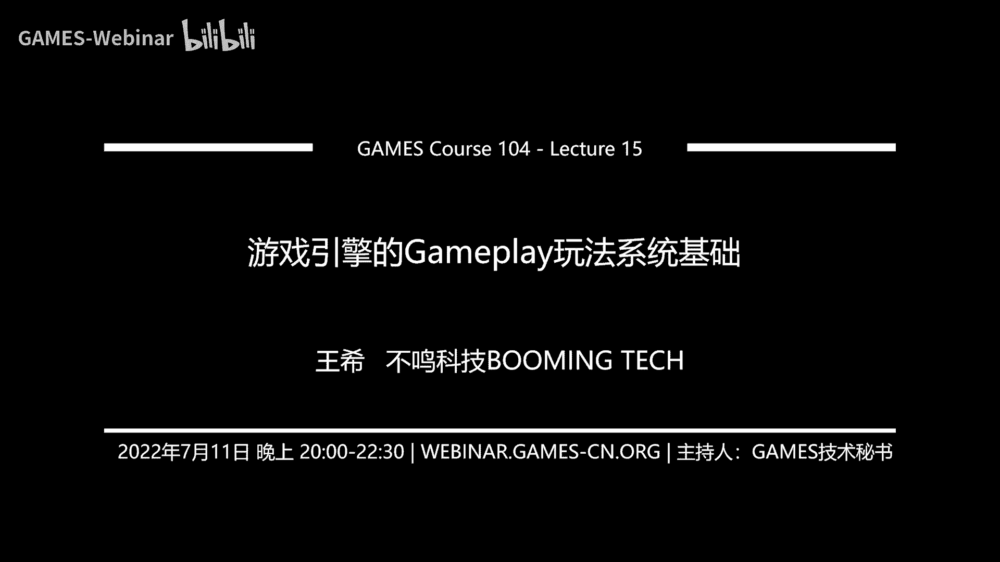
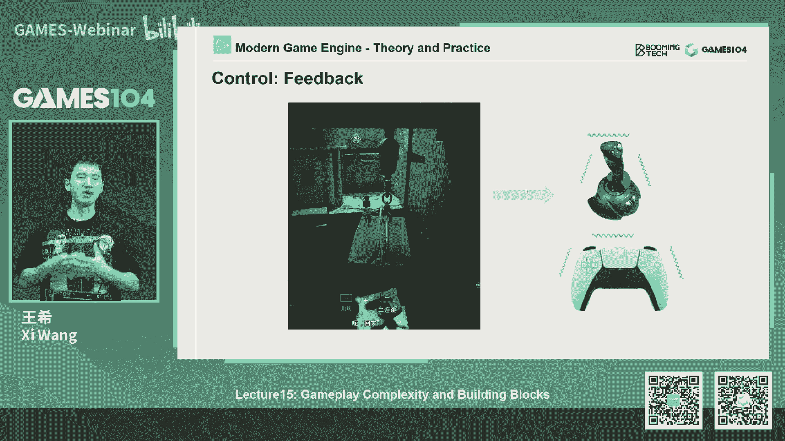
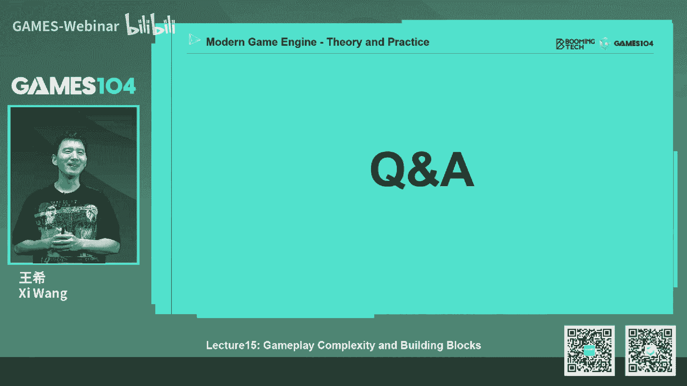
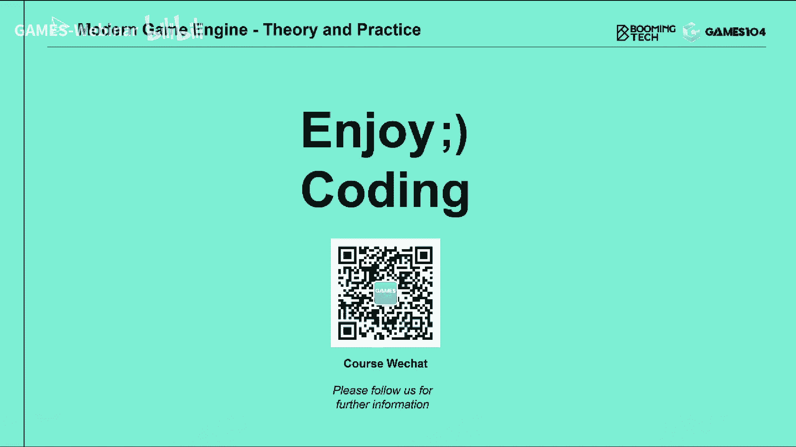

# 课程15：游戏引擎的Gameplay玩法系统基础 🎮 | GAMES104-现代游戏引擎：从入门到实践

在本节课中，我们将要学习游戏引擎中Gameplay玩法系统的基础知识。我们将探讨事件系统、脚本系统、可视化脚本以及著名的3C系统，理解它们如何共同构成游戏互动体验的基石。

## 课程概述与社区反馈

在开始课程之前，首先对社区反馈进行说明。

第二节课和第三节课的作业提交截止日期统一延长至8月31日，与第四节课作业一同提交。同学们可以根据兴趣选择完成部分作业。

作业提交失败的一个常见原因是，在课程网站上上传附件后，未点击最终的“提交”按钮。课程官网文档的第九页已更新提交指南。如有困难，可通过微信联系课程组协助。

关于Pika引擎是否加入脚本系统，这属于本节课要讨论的内容。脚本系统的架构设计复杂，目前课程组专注于课件准备和引擎核心功能完善。待基础课程结束后，可与社区共同探讨为Pika引擎设计脚本系统。

关于Pika引擎使用CMake而非XMake的问题，选择CMake是因其在开源社区中流行、功能完善且文档丰富，便于实现跨平台目标。未来若有兴趣，可以探讨支持XMake版本。

关于未修改代码却触发重新编译的问题，这与反射系统有关。每次编译都会调用反射编译器生成代码，即使源文件未改动。优化此问题需要处理增量编译，是大型引擎的复杂工程挑战之一。

## 什么是Gameplay玩法系统？

上一节我们处理了社区事务，本节中我们来看看课程的核心主题：Gameplay玩法系统。

Gameplay可翻译为“玩法系统”，它涵盖游戏内几乎所有的互动逻辑，是一个非常庞杂的体系。

我们将玩法系统分为两大块：**基础玩法系统**和**人工智能系统**。本节课聚焦于基础部分，包括事件驱动、脚本系统、可视化脚本和3C系统。AI系统将留待下节课专门讲解。

## 玩法系统的核心挑战与要求

要理解如何构建玩法系统，首先需要了解它面临的挑战。

**第一个挑战是跨系统协作。** 一个简单的打击感效果，就涉及动画、特效、音效、控制、UI、渲染等多个系统。玩法工程师需要与所有系统打交道，是个“杂学家”。

**第二个挑战是玩法多样性。** 同一款游戏中可能包含战斗、卡牌、探索等多种截然不同的玩法机制。玩法系统的架构必须具备高度的可扩展性。

**第三个挑战是快速迭代。** 玩法的设计和验证周期通常很短，可能只有几天或几周，远低于渲染或动画等系统以月为单位的开发周期。因此，引擎必须支持玩法的快速原型设计和迭代。

综上所述，玩法系统要求能够**与各系统高效通讯**、**具备强大的扩展性**以支持多样玩法，并**支持快速迭代**。

## 事件系统：游戏对象通讯的基础

在第二节课中，我们提到游戏世界由无数GameObject构成，它们之间需要“对话”。硬编码的`if-else`或`switch-case`会导致代码难以维护。

解决方案是采用**事件/消息机制**。这是一种**发布-订阅模式**，包含三个核心要素：
1.  **事件定义**：描述发生了什么。
2.  **回调函数**：定义接收到事件后执行什么操作。
3.  **事件分发器**：负责将事件传递给已注册的接收者。

### 事件定义与扩展性

最简单的事件定义是使用枚举类型。但在实际游戏中，事件类型往往由设计师在开发过程中动态定义，因此引擎需要支持在核心代码之外扩展事件定义。这可以通过工具链生成代码、支持动态语言接口或脚本语言来实现。

### 回调函数与对象生命周期管理

回调函数的注册和执行是分离的，这带来了对象生命周期的管理难题。例如，一个对象注册了回调函数后，可能在下一帧被销毁，导致回调函数调用野指针。

为了解决这个问题，需要引入引用概念：
*   **强引用**：表示拥有关系，只要存在强引用，对象就不能被销毁。适用于父子物体等包含关系。
*   **弱引用**：表示依赖关系，对象可以被销毁，调用前需检查有效性。适用于临时性的引用，如“所有可见的敌人列表”。

在回调函数注册中，通常更常使用弱引用来避免内存无法释放的问题。

### 事件分发与消息队列

事件分发并非简单的“来一个处理一个”。立即执行模式存在调用链过深、阻塞主线程、难以并行化等问题。

现代引擎通常采用**事件队列**模型：
1.  将一帧内产生的所有事件收集到一个队列中。
2.  在下一帧开始时，再统一进行分发和处理。

事件队列在内存中通常使用**环形缓冲区**管理，以避免频繁的内存分配。同时，为了提升效率，事件会按大类（如网络、战斗、动画）进行分组，由不同的分发器处理。

然而，事件队列也引入了新问题：
*   **执行顺序不确定性**：同一队列内事件的执行顺序可能不符合业务逻辑预期。
*   **延迟**：所有处理都延迟到下一帧，对于需要即时反馈的体验（如打击感）不利。

因此，一个成熟的引擎通常需要支持三种事件处理时机：**立即执行**、**下一帧开始前**、**下一帧结束后**。程序员需要根据业务逻辑谨慎选择。

## 脚本系统：实现灵活的游戏逻辑

有了事件系统，就可以开始编写游戏逻辑了。直接用C++等编译型语言硬编码虽然效率高，但存在三大问题：**每次修改需重新编译**、**难以热更新**、**对非程序员（设计师、艺术家）不友好**。

脚本语言是解决这些问题的关键。它的优势在于：
*   **易学易用**：语法通常更简单。
*   **支持热更新**：解释执行特性允许在运行时替换逻辑代码。
*   **安全沙箱**：脚本运行在虚拟机中，崩溃通常不会导致整个引擎崩溃。
*   **面向非程序员**：设计师和艺术家也能参与逻辑编写。

### 脚本系统的工作机制与对象管理

脚本本质上是文本，通过编译器生成字节码，由虚拟机执行。当脚本系统接入引擎时，一个核心问题是：**游戏对象的生命周期由谁管理？**

主要有两种流派：
1.  **引擎管理**：C++内核负责对象的创建和销毁。脚本通过接口访问对象，每次访问需检查对象有效性。优点是引擎控制力强，内存管理严谨；缺点是脚本层业务逻辑创建对象需绕行引擎，不够灵活。
2.  **脚本管理**：脚本系统负责对象的创建、交互和销毁，引擎只引用这些对象。脚本通过**垃圾回收**机制自动清理不再使用的对象。优点是符合脚本层业务逻辑，创建销毁灵活；缺点是GC可能带来性能开销，且需精心优化。

选择哪种方式取决于游戏类型。对象数量少但表现精细的游戏（如动作游戏）可能倾向引擎管理；玩法复杂、对象动态生成频繁的游戏（如MMORPG）可能倾向脚本管理。

### 脚本语言的选择

常见的游戏脚本语言各有特点：
*   **Lua**：轻量、高效、内存占用小，与C++接口性能好，但标准库功能较少。
*   **Python**：库丰富强大，面向对象，但虚拟机较重，内存占用大。
*   **C#**：借助Mono或.NET环境，性能较好，生态强大，学习成本低（尤其对C/C++程序员），Unity引擎的成功证明了其可行性。

引擎需要根据目标游戏类型、团队技术栈和性能要求来选择合适的脚本语言。

## 可视化脚本：降低创作门槛

尽管脚本语言已经降低了门槛，但对于完全没有编程背景的设计师和艺术家来说，文本编程仍有困难。**可视化脚本**系统应运而生，例如虚幻引擎的**蓝图**和Unity的**Visual Scripting**。

可视化脚本将编程元素图形化：
*   **变量**：用不同颜色/形状的引脚表示类型和作用域。
*   **表达式与语句**：节点表示加减乘除或具体动作（如打印文字、震动屏幕）。执行流通过连线表示。
*   **控制流**：实现条件分支、循环等逻辑。
*   **函数与类**：可以将一系列节点封装成可复用的函数或类。

它的优势在于**直观**、**错误预防**（类型错误的连线无法连接）和**调试友好**（运行时高亮显示执行流和数值）。

然而，可视化脚本也有缺点：**多人协作时合并困难**、**大型图表难以阅读和维护**。因此，在实践中，可视化脚本常用于快速原型设计，而在工业化生产阶段，可能会转为用传统脚本或C++实现核心逻辑。

本质上，可视化脚本是一种**图形化的脚本语言**。其底层可以将图形逻辑编译成脚本代码或直接编译成字节码执行。

## 3C系统：角色、控制与相机

3C系统是构成游戏直接体验的核心，包括**Character**、**Control**和**Camera**。

### 角色系统

角色系统远不止模型和动画，核心在于**移动**和**与环境的互动**。优秀的角色移动包含大量细节：上下坡、跨越障碍、不同地面材质（冰面、沙地）的反馈等。这通常通过**状态机**来实现，结合动画树和大量的脚本逻辑，定义角色在各种情境下的行为。

### 控制系统

控制系统负责将输入设备的信号转化为游戏内的操作。它不仅仅是简单的映射，更致力于提供**舒适的手感**。例如：
*   **瞄准辅助**：在主机游戏中，通过轻微的“吸附”效果帮助玩家瞄准，以抵消输入延迟和操作精度问题。
*   **多态输入**：同一个按键在不同游戏状态下（行走、驾驶、瞄准）可以触发不同操作。
*   **反馈**：通过手柄震动、键盘RGB灯光变化等，增强操作的代入感。

### 相机系统

相机系统决定了玩家的视角和主观感受。它不仅仅是固定在角色身后的一个点，而是包含复杂逻辑：
*   **弹簧臂**：防止相机穿墙，平滑移动。
*   **相机轨道**：设计师预先定义角色在不同状态（奔跑、瞄准、驾驶）下的相机参数（位置、FOV），形成平滑的过渡。
*   **相机效果**：实现屏幕震动、击中特效等，增强打击感和沉浸感。
*   **相机管理**：管理多个相机（第一人称、第三人称、驾驶视角等）并在它们之间平滑切换。

一个设计精良的相机系统能极大地提升游戏的电影感和操作体验。

## 课程总结

本节课我们一起学习了Gameplay玩法系统的基础架构。

我们首先回顾了**事件系统**作为游戏对象间通讯的基石，探讨了其发布-订阅模式、事件定义、回调函数的安全性和事件队列的分发机制。

接着，我们分析了**脚本系统**如何为游戏逻辑提供灵活性和可扩展性，解决了编译型语言在快速迭代和热更新方面的不足，并讨论了脚本与引擎间的对象管理策略。

然后，我们介绍了**可视化脚本**如何进一步降低创作门槛，让设计师和艺术家也能参与逻辑构建，同时也指出了其在工程化管理上的挑战。

最后，我们剖析了构成游戏直接体验核心的**3C系统**，理解了角色控制、输入处理和相机设计如何共同塑造玩家的主观感受和游戏手感。

Gameplay系统边界模糊，涵盖极广，是游戏引擎中与“创意”和“体验”连接最紧密的部分。引擎的任务不是提供一个万能解决方案，而是提供一个足够灵活、开放的基础平台，支撑开发者去实现丰富多样的游戏创意。