# 15.逆问题建模与ADMM算法求解 ｜ GAMES204-计算成像 - P1 - GAMES-Webinar - BV1j8411Y7zY

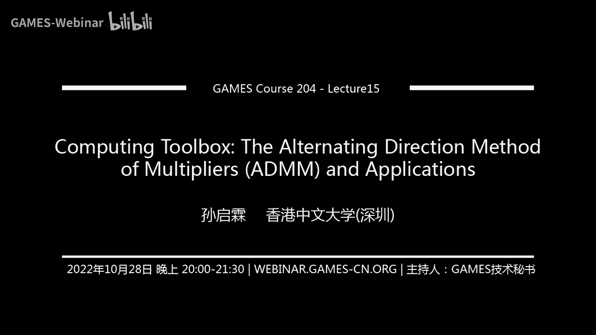

好今天给大家分享了一个主题是ADMM，这个是很有意思的一套算法哈，它是早些年在这个大数据分析的时代，这个特别是那个在我们神经网络出来之前，这个DMF是大放异彩，因为它又简单又实用，收敛速度还比较快。

最后结果还比较好，所以说那个时候唉这个很多大家做计算摄影啊，做computation啊啊，还包括像很多数据优化呀，哪怕像operation in search，在这些地方。

都会把ADM当成一个非常好用的一个工具，大家把这个ADM快速的来总结过来，诶这套一下那套一下发了非常多的论文，所以说那个年代大家觉得这个ADMM啊，简直就是神器，它本身这个东西呢是一个叫交替乘子法。

它算是机器学习中比较广泛的一个，约束问题的最优化方法，这个ADM本身是arm算法的一种延伸，只不过是他把那个无约束的一个优化部分，用块坐标下降，也就是block curtain descent。

或者是alternative minimization来做优化，这个当年在那个我们非常有名的一个做优化的，一个老师啊，斯坦福的一个stephen boy诶。

他在一个他的一个文章叫disputed of an，Optimization and statistical learning by alternating direction。

Method of multiple，也就是DM最早出现的这么一个方法，这种方法本身，它的出现是主要是为了，弥补我们二次乘方向的一个缺点，特别是在一些问题中，我们用二次惩罚项来近似的约束问题。

在最优点附近，需要惩罚项的一个系数趋近于无穷，这个时候就会使我们的一个海森矩阵，变得非常非常大，而且因为这个海森矩阵变得非常大的时候，这个时候它近似的目标函数就不是很稳定，所以为了解决这么一个问题吧。

就我们sting board就引入一种叫线性逼近的部分，通过线性系数不断的接近它的最优解，也就是我们所说的一个duality的一个上升，使得二次乘方像在系数很小的情况下，也能得到满足精度的解。

这DM目前是已经变得非常成熟的一个啊，求解带有约束问题的一个通用的优化框架，这个如果大家啊同学有兴趣的话，也可以去翻一翻这个steam boy的这个原文，在我们课前先扯一扯这个DIMM历史。

但这个交替乘子法确实是一种非常简单实用，又性能优越的一种呃，求解分布式图优化的一个问题，就是它主要是通过分解协调，也就是decomposition coordinate，一个过程。

把很多的全局问题分解为啊，一个个的小的一个容易求解的局部子问题，唉，然后再协调这些子问题之间的解，来得到一个全局的一个解，这个也很有意思哈，也大家推荐一下，大家读一下最早最早的这个论文。

这个求解这个问题呃，之后哈就是大部分大家把这个理解透之后，大部分这种带约束的一个图优化问题，其实都可以得到一个比较好的一个解，而且这个时候呃，其实大家构建一个image formation model。

也通常是构建这么一个带约束的一个优化问题，这个还是建议大家精读一下这一部分，这个很有意思，今天要给大家通过这么一个ADM，结合两个例子吧，第一个我们是结合一个非常简单的一个叫single。

pixel camera的一个例子，也就是我们所说的一个压缩感知，这个压缩感知是怎么样通过一个单点的像素，来恢复出来这么大一张图像呢，大家有没有想到我测量我就一个像素点。

我只能到感受到这个图像光强弱的变化，我这个是怎么样才能恢复出来这么一张图呢，诶这个时候我们就需要构建，像我们最开始说的，我们要构建我的image formation model。

也就是构建AX减B这么一个问题，这里面的B呢就是我们的一个观察observation，我们在传感器上就是一个像素点嘛，就拿到一个BA，这个我们就可以变成一个调制矩阵，变成调制矩阵，后面这个。

当然这个时候，因为我们最后只能听到一个强弱的微小变化，这个时候我们是非常非常多的解哈，这个时候我们就需要加约束，也就是我们image prior。

这个我们会以这个single pixel camera为例子，再给大家讲解ADMM这个实现的过程，那除此之外啊，给大家举了一个嗯一个高维的一个例子，就是我们怎么样实现一个阵列啊，或者是一个阵列。

再加上一个三维的一个slice和4D，这个情况下我们怎么做一个压缩感知，怎么样去有效地解它来，这篇论文是我当年就上读博二时候写的，一个4D的一个呃，这个压缩感知的一种呃套路吧。

这个希望大家同学也可以了解一下，这个举一个基本的例子，再举一个比较高级的例子，这样的话大家对整套的一个逆问题怎么构建，还有我怎么样通过我们今天讲解的这个算法，叫ADMM去来去解它，这个呃就慢慢慢慢。

大家就对整个就成像的一个嗯就是问题的抽象，再到问题的解决，有了一个完整的印象，这个时候啊，大家也就具备，初步的具备和构建和解决问题的能力，啊这个，还差一分钟，我们到八点整正式开始，这个先给大家测测背景。

这个背景也确实是非常有意思，好那我们现在正式开始诶，亲爱的同学们，大家好，欢迎回到games204，今天给大家继续讲解，我们的一个计算的一个工具盒，诶，上一上一节课。

我们通过一个DECONVOLUTION的例子来给大家分享了，Half quadratic eting，如何求解一个带约束优化问题，今天呢我们会通过两个例子吧，就是single pixel camera。

特别是压缩感知这个例子来给大家讲一个呃，更加通用实用一些的算法，也就是非常广泛应用的一个算法，叫the alternating direction method of multiple。

大家通常就是简称DMM，想必这个算法大家也听过很多回了，诶这个到底是怎么实现的啊，本来大家开始想是先从duality给大家直接讲，后来想了想，就只讲数学，太枯燥了，还是结合一些实例来给大家分享。

这个算法到底是怎么解的，然后到底是怎么用的，然后我们也可以有一个构建我们这个成像模型，然后再加上我们需要的约束，然后再去求解这个问题，一个完整的一个闭合的回路来培养大家嗯，真正的抽象。

就从物理世界中的现实问题，抽象出它一个带有模型的问题，然后再去求解它啊，要经历这么一个过程，首先呢呃今天的我们分为四个方向来讲，这个问题刚开始是给大家介绍一下。

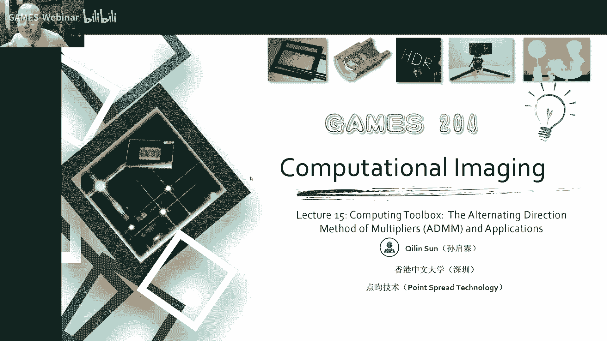

什么是逆问题，我们这个逆问题到底是怎么回事哈，这个呃大家需要了解一下，然后给大家分享的是通过我们single pixel camera，也就是单像素的一个相机，通过压缩感知，我们怎么样通过ADIM。

实现这么一个单向素的一个相机，我们这个整个的实验构架构啊，实验构想啊到底是怎么实现的，这是一个非常有意思哈，这个最早是零四还是05年，这个single pixel camera问世。

想必大家同学们新闻上也会看到，我们对这个问题求解完之后，要给大家分享一下，我们这个问题本身它的一个bin perspective，就是我们这个用概率图模型来去，怎么样去表示我们这一个问题。

它到底有什么样的意义，这个啊也是非常有意义的，那最后我们把这个inverse problem，升级到一个高的维度，这个高的维度嗯，大家有时候一看就非常棘手，但实际上它解起来。

跟你一尾二维并没有任何区别啊，并没有任何区别，啊这个从gotten那暴露了很多surprise，这个credit属于golden re，首先我们说到文艺问题嗯，大家想一想我们成像中的逆问题大概有哪些呢。

就是在大家的一些呃正常的一些印象里面，就我们有哪一些呃，相机问题是可以直接嗯想象得到的呢，就举个例子哈，大家生活中可以遇到的，比如说我们拍CT这个T是咋实现的呢，T实际上它是通过在这个轴。

通过下面发出一个平平行光平行的X光诶，我这边有一排探测器，哎我这个探测器在这一个面上扫那么一圈诶，就会得到这整个它的一个投影的一个频谱图，然后再通过一个render transform一个逆变换唉。

就可以把这一层的一个啊形状解析解析，就是信号解析出来，就解析出来之后，我们再通过在Z轴方向的运动很多层层析嘛，如果说叫tomography，就是断层成像，一层一层的把这个slice切出来。

最后形成一个三维的一个模型，这个时候就是我们大家拍这个要看到内脏啊，或者是脑子里有啥缺陷呢，当然脑子可能看不太清，分辨率不够哎，这个时候我们就通常用competition table graphy。

这是一个非常经典的一问题，这也是成像领域第一个诺贝尔奖，应该是第一个诺贝尔奖，但是我相信后面还可能成像，会有非常非常多的一个诺贝尔奖啊，也希望大家是其中拿奖的一员，那除此之外。

在医疗中还有一些其他的应用，比如像我们的一个MR，也就是电磁波成像，这个原理其实大致跟cg差不多，也都是一个投影到一个分裂分裂域来实现它，还有像我们啊，比如说这种不是很常见的一个高光高光谱。

好像一般的高光谱，是直接通过一个光栅进行扫描，唉这就形成一个呃XY，然后在一个多通道的颜色的这么一个data cube，但这个地方是用了一些呃。

binary Python一个调制来获得了一个多光谱的逆问题，因为我们最后的传感器啊，要么是大家用的黑白的，要么就是RGGB彩的，顶多顶天了，大家都多光谱九个通道，这个呢我们拿到的通道数量是非常有限的。

但是我们的高光谱我要获得一个，比如说像几百个通道，上千个通道诶，我们怎么样通过这么少的数据来，恢复出这么多的一个通道的一个数据，这个时候就出现了一种逆问题啊，就我们要信息有损失，但我要逆回去。

这个怎么逆回去呢，这是一个高光谱的例子，但除此之外，我们本身的一个competition photography，还有像我们的光场成像啊，像我们的热成像啊，很多地方都是要求解这么一个逆问题。

因为本身我们信息有损失，这个是我们recall一下，第一节课讲了这么个问题啊，像我们很多啊计算摄影的问题，都可以通过这么一种方式来表示，这个方式是什么呢，就是ax减B唉，再加上一个约束。

我们假设这个B是我在一个图像传感器，我哪哪怕是一个单点的一个光电传感器吧，就是我们传感器上捕捉到的一个信号，就是BX呢是我本身要求的那个信号，也可能是我们干净的一个图啊。

那xx呢实际上就是我们最后要求得的解，这个时候我们整个无论是前面的整个成像的，一个前面的一个系统啊，包括我们的光学系统，我们的科学照明，包括我们前面有可能会自己加调制系统，这些部分啊，哪怕我有。

也有可能是在呃这个传感器表面加一些pattern，来做调制，或者在嗯app上做调整，或者在前面做调整，都有可能，我们统一把这个调制用一个matrix a来表示，我A来调制我们这个X。

所以实际上就是最后因为调整完之后，我们在图像传感器上拿到的东西就是B吧，这个时候我们第一步要保证，经过我们的这个呃真实这个模型A啊，我们这个图像会变换成B。

这个要保证它的data就是data fability，要正确，后面呢因为通常啊我们从这个成像过程A啊，通常是有信息损失的，这个时候我们通常是有一个高维向低维的映射，比如说我们物理的世界。

首先我们生活是一个三维的世界，我们有各种各样的光源啊，光源不一样的光谱啊，光谱不一样的形状，物体自己的形状有自己表面的一些材料性质啊，比如说我们啊图形学里面，通常把它描描绘成BRDF和BSDF。

还有运动啊，还有观察者呀，有这么多的，还有甚至还有偏振，还有不一样的光谱，哎这么多的因素都可以在一起，我们要举一个例子，就是普通的流量传感器，这个时候只是拿到一个二维的图，对不对。

这个时候我们的imazing model a是有信息损失的，它是一个高维向低维的映射，但假设我们要恢复出来一些，其中一些维度的信号，这个时候你要符合这个ax等于B的这种情况，那就太多了。

这说明我们有很多很多的一个解空间，来符合我们这一个ax等于B的情况，这个时候呢，为了让我们得到最优的一个，符合我们要求的一个解，我们就需要根据我们要求解的性质，来给我们这个最后要求的图像做一个约束。

也就是我约束过的解空间，举个例子哈，这个图像A这个因为这个model加上，就是不让我把这个图搞糊了，一个PSF，我在图像传感器上拿到的一个观察，就是一个bad image，我们记为B。

这个时候我们通过后面比如说加一个啊，total viation的一个regular，Or，我们就可以求解这么一个x sharp image，假设这个是呃这个tomography的问题呢。

比如说A这个时候就变成一个projection matrix，然后B呢就是我们在投影的这么一个观察，这是B，然后X就是我最后要重建的一个三维的volume，当然你这个这种套路啊。

就可以基本上往任意的这个图像的一个模型上，就成像的一个模型来套，然后再去加不一样的regular rider来求解它，这个是通用的一个套路啊，怎么样解这个问题呢，实际上就是到了今天的一个主角。

就是我们所说的ADMM，这通常啊像我们这个image formation，他除了在我们我们的这个图像传感器上，拿到了这个b observation，除了像经过啊这个这个image model a本身。

它还会受噪声的影响，这个也就是这里即为这个一塔，但是它会受到一个噪声的影响，这个时候，比如说，假设我们到一个遇到一个压缩感知的问题，这个压缩感知我们观察到的一个数据量。

是远远小于我最后要恢复出来的信息量的，这个时候就像刚才讲到，就符合ax等于B的这种解，那基本上就是无穷无尽，对不对，这个时候我们通常把这个问题描述为病态问题。

也就是you post problems要求解它，就需要一个合适的一个约束项，来把这个解约束在一个我们想要求解的范围内，像一般的一个啊求解问题啊，比如说我们要求解这个ax等于B。

我们可以是把它当成一个求解一个list square，的一个problem，就我们知道这个a a transports本身是一个，就是半正定的一个矩阵，我们这个时候，就可以通过。

这么一个求解一个list square problem，来去把它这个整个的一个解直接解出来，当然这个时候，我们通常是用嗯minimize这个X的一个r two norm。

然后它要符合ax等于B的这么一个人说项，当然这是一般的一个就是L2的一个嗯，我们假设一个ATGA就是这个X的值啊，实际上就是尽可能的一个小吧，但这些也不是特别好哈。

后面我给大家讲一下这个single pixel的一个问题啊，这个我们用这个问题描述呢，就是我们我们假设要直接求解，这个list square的一个问题的时候，假设这个时候我们要做压缩感知，哎。

我们要压缩到两倍，就是图像XY方向各压缩到一倍的时候，哎我们发现这个这个least square求解的问题，好像这个PSNR不是特别高，特别是当四倍的时候，我这个图基本就看不清了，八倍的时候。

那更是找不到了，就是也就是说在这种直接求解一个list square，的一个problem的时候，我们的解，他收敛到了一个我们不是很喜欢的一个地方，就是它是一个本身是一个非凸的问题哦，简约非常多。

诶这个地方我不是特别喜欢这个说，因为这个结果不是符合我们真实的一个要求，这个时候怎么办呢，诶这个时候这个图像里面就是聪明的，经过几十年的发展啊，这些科学家们就发现我图像自己啊，有非常多的一些性质。

就比如说我们的稀释性，图像边缘的梯度的系属性，这都是非常经典的一些就是图像的一些性质，这个时候我们可以把我们的一个正式的，就出现了我们这个AX减B的一个l two norm。

也就是前面这一块data fidelity，这个要保证这个时候后面再加一个约束，这个时候整个的一个啊优化的一个，objective function就构成了，当然有时候之前人们开玩笑哈。

如果你能求解这个问题，基本上你就是可以求解，任何在计算成像之中的问题啊，当然这个不是特别严谨，这也说明了就这个问题啊，真的是有非常普遍的一个普适性，为啥说不是很严谨的。

因为有很多时候这个image model a啊，他他搞不清，他搞不清哈，他不一定是可以直接描述出来，比如说我那个一个普通的一个单透镜，这个相差啊，随着深度跟视野都不都在不断变化。

你这个有时候这个一个简单的一个matrix a，可能就搞不定，所以这两年就大家有干过啥事儿呢，就有一些呃组啊，就是通过一个小神经网络来模拟这个相差，哎，这个A啊不光是一个matrix啊。

我可以用一个小神经网络来表示啊，对不对，这也是完全没有问题的，然后再去求解这整个的一个呃约束的，在约束的一个优化问题，当然我们要求解这么一个问题。

上上节课我们讲了一种方法叫half coretic spleeting，这个是怎么样呢，我们可以把这一个优化的问题，通过half coredis bleeting的一个方法。

来把它重写成这种B减ax加了一个regular tom，然后再把后面的这一个约束，然后拆解成一个嗯，subject to dx等于Z这一个问题，然后这个时候我们就可以，在我们的拉格朗日函数写出来的时候。

加了一个判别项，判决项叫penalty term，哎，来通过交替的求解，这个X跟Z我们就引入一个Z哈，这引入通过引入这个Z来优分别的优化，这个XNZ，这个时候直到它收敛到一个比较好的一，个结果为止。

当然这个求解的过程上节课也给大家呃讲过了，就是我们是通过啊不断的变化它的一个鬼脸，Decent，在XZ分别求解它的一个鬼脸descent，来最后啊收敛到一个比较好的结果。

这个我们要遇到一个比如说LYLOL，我们就可以用一个呃soft啊，stress to的这个方法，来求解这个l one norm的一个极值，r two呢，那直接啊AX减B吧。

就是control gradient这个事就解决了，基本上这两大套路哈，Control gradient，还有一个soft threshold，这是你求解每部的一个啊好用的一些方法。

当然我们最后整个问题通过求解之后，其实X啊就是呃一个N啊，信号一个长，我们把一个image配拍成长条A，实际上就是嗯比如说一个模糊吧，上节课讲的模糊就是一个condition对吧。

这个时候我们要比如说我要恢复它的一个边缘，我可以还可以加一个total，variation的一个REGUIER，这个时候就是对XY方向分别求导，我们假设它的gradient是稀疏的。

这个时候可以加一个TV的regular x，我要去造呢，哎就是可以用一个DC matrix来做一个RIRATHER，就是对它进行简单的一个趣造是吧，当我们再回顾一下这个x update。

就是我们要优化X我要求它的一个PROXIM，这个时候我们这边有两个，你看我们这个时候X是变量，把Z当成常数，这个地方我们就实际上就求解了一个啊，也是一个X等于B吧，大a hat小AB这么一个问题。

我们有一个简单的control gradient，就可以非常快速的求解这个问题，这个有库哈，有库这个Python这个spicy sparse里面有一个control，电影库。

大家有兴趣的话就不要有兴趣了，这个作业里面会会会有的，这个大家一定会解决这个问题的，当然我也推荐大家自己写一下，这个CONTROB的鬼脸，当然我们这个可以做要求，可以做一个要求。

这个他这个规定的本身自己还是要实现一下的，然后UPDZ呢这个就好办，这个更好办，这个是一个l one norm，加一个l two norm，这个时候我们用一个soft threshold。

就可以非常快速的求解它的一个值，那这个TV跟啊这个OY这个问题都不大，这个就是把这个项目换换掉就可以了，当然这个时候就不知道我们这节课的主题，一个单像素的相机是怎么实现的呢。

来我们先回顾一下这个单像素相机的一个，实现的一个过程啊，它是怎么样构建它的一个成像装置呢，首先我们一个场景，假设是我们一个自然的场景哈，我们通过一个透镜在我的透镜的下面，这个时候我先不放一个图像传感器。

我先通过一个叫DMD，你甭管这个DMD叫什么，这个DMD本身是叫地质图，Mac minor array，也就是数字微透镜阵列啊，这个说到DMD，大家就先说一下吧，这个DMD本身哈是在做投影仪里面。

那个投影的一个仪器器件，它是一个可以零一开合的一个数字微透镜，就是我们把透镜通过max的工艺，做成一个可以开合的零一的，这个时候就可以调这个光，有还是没有DLP啊，就是以前就得录仪器。

这个公司叫texas instrument，经过了十几年的研发，砸了几10亿美金，从80年代一直到零几年诶，最后终于成功了，当时很多时候就觉得这个德语经，这个公司已经挺不住了。

就其他的业务已经没办法支撑这个公司发展了，他还是继续投钱在这个点MD上，因为之前呢我们投影里面通常都是用l cos，后来呢这个DMB问世之后，就发现我们这个用透镜就微镜啊做反射，亮度可以做得非常高。

我可以承受非常高的光强，也就是很多高端的投影仪里面，特别是亮度非常高的一些投影里面，通常是用DMD就是它的核心器件，这个它是有一个像素的阵列，每个像素都可以零一开合就可以是亮是暗，大家就可以这么理解哈。

所以这个时候05年，那时候DMB也刚出来没多久，就通过这个DMD，在我的相面上进行一个零一的一个，随机般的调制对吧，我然后我再通过另一个透镜，把这个经过随机的，就是我这一个像素嘛，这是0101。

我成了一个mask，相当于，再通过一个单像素的一个，就是一个感光元器件嘛，叫photo die，这个时候就可以捕捉到这个经过调制的信号，当然我们经过一系列的这个这个这个这个，首先这个先先静止哈。

假设这个场景不动，经过一系列的不一样的一个随机的斑调制，我们就可以拿到一个vector，就是记录了N个观测值，这个时候我们通过这个观测值来结合。

我们之前我们TMD上呈现了一个binary pattern，来恢复我们这个场景，当时大家是想有非常多很贵的一些探测器啊，比如像我们的这个光电倍增管，很灵敏，速度很快，但是非常贵。

这个时候不大能做成一个很大的阵列，当时大家都觉得诶，这种single pixel camera就可以实现一个阵列的成像，但是只用一个成像的一个起点，这个是怎么做的呢，这个是当年他们搭的第一套装置。

好这跟刚才大家看那个原理是实际上是一样的，这个物体经过透镜打到DMB上，一个DMB上会呈现随机的斑，然后再经过一个被一个射手大的，然后来捕获的，然后不断变换这个DMD上，这个Python就可以。

直到捕捉到一个足够的一个N个MANAGMENT位置，啊实际上就是我们你看我们这个图像，假如它是一个R，而点乘上这么一个这个一个随机班。

然后再加到一起，拿到一个绘图纸诶，换一个随机的一个码点成这个图像值，哎又获得了一个新的值，直到就是我们这个叫M的merriment吧，就是积分的这个值吧，加起来这个这个值。

我的managment matrix是啥呢，就是我是怎么样对这个图像传感器，朝向信号进行调制呢，实际上这个就很简单，就我们就是这个binary map，就我们这个二值图啊。

就是对我这个图像的一个调制是吧，我这个里面A就把这个二值图，这个二维的图拍成一个长条了，那一样的拍成一个长条一样的哎，我们这个M的值，然后就有M个marement matrix。

要构成一个大managment vector吧，就构成一个这么多vector，构成一个marim matrix，就是呃这个A等于B，有位同学说，这不就是奇函数的图像吗，还有一些mal Python啊。

这这很多机G图像都是这大差不差，本质上就是大家可以想一想，为什么我通过这么一个binary map，就可以把不断的调制，就可以把这些信号诶完整的记录下来了，大家可以想一想啊，确定方程，这个我不是很清楚。

但本身确实是u pose，什么叫签定方程啊，这个没听，以前没听说过，然后这个因为我们这个随机班本身啊，它不断变换，这种，实际上是我对整个图像信号，在不同频率下的一个采样，这个大家想一想啊。

就是在不同频率下的采样，我们现在已经构建了这么一个，ax等于B的一个问题了，这以前呢大家也试过用这个half correct lippt，加上一个TV来解这么一个问题哈。

这个时候我们比如说我们最后的一个信号，是M的值，但是我们实际的观测值只有N个，这个到时候那时候大家去恢复二倍啊，TSNR可以恢复出来，3737。33。7个分贝，那就是在TV的约束下。

然后呢啊后面是后来加了一个deny的，一个DCN的一个约束，这是后来的四倍，八倍的时候，我们发现这个half cos x pet加TV，这个rap非常厉害，这就是整个图像变换的特别厉害。

恢复的不是特别理想，当然这个DSN这时候就变得稍微好一些，但也没有好太多，就是我们这种half correct expedition，在那个时候，对我们这一个压缩率非常高的一种情况，就是四倍啊。

四倍就是十六四乘46，八倍就是886 14，压缩率64了，这个有点太大，这个时候恢复的不是特别好，说先在讲这个ADL详细之前，我们就直接从这个half corec splitting，过渡到ADMM。

其本质上求解的问题都一样哈，就1as减B加上一个约束对吧，然后这个时候我们去怎么样，我们看一下区别啊，本身啊我们这个拉格朗日从拉格朗日上看，我half corey是不in的一个拉格朗日函数。

我是引入了这么一个变量Z，因为通过隐居的一个penalty method，就penalty项就判逆向，来构建这么一个拉格朗日函数，但是ADMADMM呢，它是构建了一个增广型的一个拉格朗日函数。

叫AUGMENTITY，拉格朗，它是引入了这么一个变量Y来，通，过把这所有的这些约束，都写到一个拉格朗日函数里面，这个时候就是我们就是希望加强我们本身的，这个就是这个我们这个函数目标函数吧。

目标函数的一个凸性啊，就让它更容易啊求解到一个global mining里，但是不大可能global嘛，但是他收敛的会更好一些，这个时候我们想构建了这么一个增广型钢，拉格拉格朗日函数啊。

我们可以看到后面这个项目本身都是一个凸的，这么一个像，对不对，它的一个凸性会比一个panic term本身是更强的，然后我们构建了这个增广贤的拉格朗日诶，这个时候我们去怎么去解它呢。

当然我们这个该不知道的，这个X还是不知道matrix a还是这个A，而TV啊就可以就是XY方向，gradient deoy可以加一个ISP就没问题，这个怎么解它呢，啊这个套路是差不多的。

这个时候我们有XZU这三个变量对吧，我们要对这三个变量分别的啊，进行交替求解对吧，我们这个X把X当变量，X当变量，这个有的像就是第一项和第三项，这个X变量是有的对吧，我们第一步就求解X的PROXIM。

也就minimize这个函数，那第二步呢把这个Z提出来，也就是第二项和第三项里面有这个Z对不对，这个时候我们就可以把这个Z提出来，然后去minimize就是求解这一步的一个pro。

然后第三步实际上就是把我们的U提出来对吧，U我们知道这个实际上就是一个L2的一个，这个这个就很简单了，大家一求一求导，然后等于零，就发现这个AU就等于一个U加上DX减Z是吧，这个是嗯比较容易理解的。

当然我们这个整个update的一个套路，跟half codec cppt也没有太大区别，基本差大差不差，这第一步呢，实际上我们就是一个list square problem吧对吧，我们就可以求导之后。

让这个导数等于零，这个时候我们就可以构建出一个AHAT等于AX，ha hat x等于B唉，实际上就是一个control CD，规律性的解了一个线性方程是吧。

那第二步呢实际上也跟half project exceppt，一样对吧，只是我们之前这里边有个不是很常见的一个U，对吧，这个时候也是要，假如说我们是一个TV的regular rather。

这个时候很简单，我们用一个呃threefold，就叫这个soft threshold，一个method来去求解这么一个问题，然后要是遇到其他的REGUIZON呢。

比如说像denzing base rearm，哎，这个时候我就可以把这个通过DNOTION，这个regular or来把它这一步求解到这一步，这个基本上这两步哈。

跟那个half project meeting就一样对吧，基本上就没有，基本上没有任何区别，大家一看到他的一个伪代码哈，这两个比如说TV的伪代码跟这个DNOISE，伪代码本身就是两步。

King half correct，就是两步变三步哎，求x proximal，求Z的proximal，然后再把这个new update一下，然后知道他我们满足我们收敛的一个条件，其实大家看来看去哈。

这个就发现这个无论是half codec，SPEETING还是ADMM，基本上都是非常非常简单的一个问题，每一步第一步求它的program，要么就是求一个list square，Problem。

list square呢我们求解的问题就用CTRL鬼链子，要么就是一个TV的一个约束，TV约束呢我们就可以用一个soft rice holding，要么就是一个noise约束。

我们就可以用我们列入这个noise的一个problem，来求解，它基本上就套路就这几个，然后两三步一拼，这么一个复杂的一个带约束的优化问题，就求解了，大家觉得是很神奇，其实这个真的是非常简单。

但我们可以看到这个ADMM跟TV的比较好，我们发现这个ADM，因为我们对这个拉格朗日函数进行了增广，它的凸性变强了，这个时候我们就可以很明显的运行到，凸性变强了，我求解的效果应该是会变好哈。

大家可以看到这个ATMM加上一个TV的一个约束，相比half cox beeating加一个TV的约束，我们可以提高将近十个分贝的一个PSNR，当然也没啥约束，就listen square。

基本上就是解不出来了，就基本上解不出来了，然后呢就哪怕你压缩率很高的时候，呃，这个是压缩率很高的时候，这个也不行了，这ADM这个也贵了哈，所以后来就同学们加了一个DM，加一个DNCN的一个约束。

这个时候就可以对A这个压缩率非常高的时候，也可以啊，这个拿到一个非常高的一个啊，这个就输出图像吧，大家有兴趣的话可以看一下，就是北大张健老师的，有一个叫east net，那个就是用神经网络呃。

就是一步一步的一个神经网络来一个几，定定了几部的一个小神经网络来去呃，恢复了这么一个压缩感知的问题，这个在呃这个video的compression里面，就比较有大的一个优势吧。

DCC就是一个deep network嘛，就是一个小神经网络，但这个时候让我们来分析一下，我们通过概率的一个方式来分析一下，我们这个东西到底是打球解，这个inverse problem到底是咋回事。

我们还是回到这个image formation model，就是我们这个B就等于一个ax加上一个noise，Image formation，乘一个来tt max加上一个noise。

我们这个整个的一个中文，poverty的一个观测是什么呢，我们这个我们已知我们这个大概噪声啊，噪声的一个幅度是西格玛，然后呢，我们在这个X的情况下观测到B的一个概率，实际上就是我们每个像素点。

然后在一个像素xi观测到B的bi的一个，当然他要这个时候要符合的一刻哎，随着B减AX为中心的一个分布，当然我们这个整个乘起来之后，就符合了一个E的一个负B减ax平方除以二。

西格玛方对这个是呃它造成水平决定的，然后呢我们就这个前面的系数咱就不管了，这个咱要优化啊，后面这么这么一项对吧，我们把这个通过一个呃白定理把这个拆开是吧，我们把这个我们要实际上要是观测。

这个是观测已知X观测B，但实际上我们要观测到的是B啊，我们要求这个X啊，也是在这个噪声sigma的一个情况下，我们把这个用by定理去把这个拆开，然后PBX西格玛px over pb。

这个时候我们就可以把这个拆开，当然这里面有一部分这个这不这回是长，这个可以把它当成一个常数哈，这个时候这个observation已经，因为我们是已经知道这是啥了，这个就可以当成一个常数不管了。

忽略它的系数，那么只看后面上面这两项和X相关的这两项，这个时候我们是要求一个就是最大，似然估计对吧，就是map的这么一个问题，我们叫maximum，我们要使这个概率达到最大化，要求这个让这个概率最大哈。

但这个时候我们搞点小trick，我们加一个负号，实际上就是求这么一个负的一个最小，但我们知道这个logo本身就这里面有个E嘛，这个这个expectation这个很烦，我就取个logo。

因为log本身不影响它的凸性凹陷，这个解它的优化方程，这个没问题对吧，我们把这个logo本身套在这是吧，然后再加个负号，实际上最后就变成了一个AAX减B，加上一个约束的一个问题。

这个绕来绕去实际上就绕回来了，这说明这个是符合我们的一个概率分布的，一个模型的，就是我们已知观测B在一个啊，noise sigma的一个情况下，我们要求X对吧。

实际上啊最后跟我们本身构建的那个啊image formation，model是一样的对吧，但这个时候，比如说像这个破损问题是咋办呢，我要观测了一个噪声，破松噪声，这个是怎么办呢。

来来再给大家详细的掰扯一下，这个破损噪声啊本身是跟这个信号相关的，对不对，他也不再是一个高斯，刚才我们看到的是一个高斯模型，就直接就是它的一个petition，但是破松本身我们已知一个X。

我们观察到B的时候对吧，它是一个符合泊松的一个随机过程的一个函数，那我们要所有的像素加在一起，这个时候我们把这个每个点的一个破松分布，乘起来对吧，然后就拿到了一个这么A这个真是复杂哈。

这又又是带logo呀，又是带这个E的负X2，又在这个就是就是在这个阶层啊，这个我最后拿了这个很复杂，咋办呢，这个复杂我们就怎么把它一步步抽象拆解，然后拆解到我们可以优化的问题，但我还是老一样的套路哈。

还是用by定理把这个再拆回去，这个B还是已知的，我们最后要求的还是PBXA西格玛，然后X这么一个问题，然后我们这个时候求max lo就求这个呃，它的最大自然估计也是老套路，求个log。

但中间有一些就是这个地方啊，这个这个有一些呃这些常数啊，像这些地方就可以忽略掉了，咱不管，就咱看看后面这个，因为后面这两项哈，我们取个log之后，这两个就可以乘就变成加了对吧，乘就变成加了。

我们就干脆就写到后面去，成就变成加了，然后我们最后我们整个的一个问题啊，就直接，归结为这个求解的这么一个概率图，概率的一个最大四人估计，然后第二项就是本身他带了一个ax那个项，然后再加上啊。

我们最后想要加一个约束，对不对，然后我们把这个我们前面那几项哈，就是ADI这个这边这几项都组合在一起，形成一个K这个好好表示哈，就是写成KX等于Z哈，因为我们最后要求解的时候。

基本上都是要一个contributed，就是一个contribute gra链往里套，我们把这个形式叫reformulate，一下就拿到了一个我们想要的一个，就是增广型的一个拉格朗日，这个拉格朗日啊。

那还是老套路哈，咱把这个再继续套一下，这个我们还是XZU分别的一个update，然后我们这个就看X的时候，X只有这一项诶，更简单对吧，我们把这个一套，然后求一个呃gradient，然后再让等于零。

GRADIA等于零，这个时候就可以很轻松的用一个Ctrl gradient，把这个这一步X的proximal求出来，然后第二步呢我们要求Z的一个proximal，这个时候要前两项哈。

我要minimize这个关于Z的这么一个变量，然后第三步还是老套路，这个update一下这个U就可以了，然后关键就是这个这一步来怎么求呢，我们来怎么样求这个ZI呢，实际上这个求ZR哈。

这个这个这里没写哈。

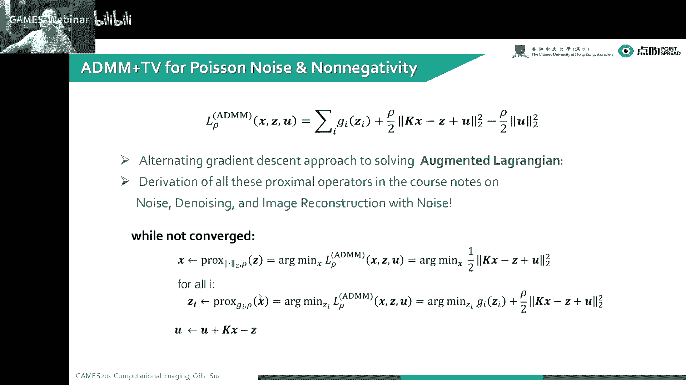

这个就基本上我们遇到的情况，也就是还是要么是啊加个约束TV的约束了。

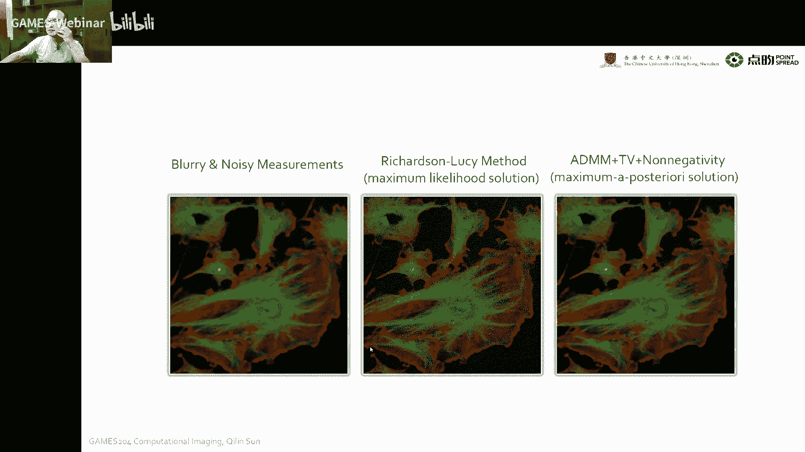

这个还是呃soft rice coding，或者是我们一些dony prior，这些都是老套路，往里带都一样的，那我们就可以看到我们的total variation，加上ADM之后。

我们对一个破损噪声的去除。

我们把这个破损噪声的一个概率，通过这个概率模型把它的一个呃问题写出来，再通过ATM去求解它，我们以前哈，这个我们直接用一个max拉力后的一个solution，就是RICHARD的lucy method。

有时也简称叫RL method，大家可以解出来诶这个这个噪声挺大对吧，但是我们通过一个呃一个TV加上一个ak mm，加上一个呃非正非负，好像这个没有负的。

然后就是max a poster solution，最后发现我们可以解到一个比较清晰，然后又比较小噪声的一个图像，但有时候嗯像求解这么一种问题。

也会用一些呃skill gradient projection来去求解它，这个可能会稍微复杂一些，稍微复杂一些，会比ADM或者多一些，这个以前我也上过当，就是以前我们导师wolf on就给我布置作业。

就让我们去一个破损噪声哈，那个时候有没有给任何指示，也没有给一个参考文献，当时就随便找了一个呃，效果看着很好啊，有skill gradient projection method。

然后最后发现这个解起来是挺困难，其实挺困难，当然最后也解出来了，但后来在实现先发ADMM，就发现这个ADM是真干净利索快啊，求解的效果也不错，所以说这个A点M这个工具啊，大家要学好，就总共就两三步。

就很简单。

在刚才给大家举了一个例子，是一个嗯单个的一个像素，然后一个阵列，这个实际上就是一个非常简单的一个，低维度的一个问题哈，二维映射到一个点，但我们很多情况下，我们是要遇到一个高维度的一个，压缩感知的问题。

这个我们遇到了一个high dimensional的一个inverse，Problem，我们这个时候怎么办呢，但我就曾经遇到过一个问题啊，他一个要解决一个高维的压缩感知问题，就是15年还是16年的时候。

就那个时候不知道从哪弄了一台，就是spider camera，就是一个单光子雪崩光电二极管阵列，这个雪崩光电二极管阵列呢，有很多很多比较好的性能啊，比如说它这个响应频秒级的。

当时我手上拿的那台是20匹秒，然后呢，他就可以对单公子的一个，就是它可以对单公子有能力进行响应，然后呢比上我们那种光电倍增管，要PPT或者是调控相机super camera，唉，在一样的情况下。

我又变得又小又便宜，但是当时我们遇到一个什么问题呢，这个speed camera自己分辨率非常低，这个时候我们想到了这个分辨率非常低的时候，这不就是一个压缩等质的问题嘛，对不对。

他这个就是维度会比较高哈，我要减到这个XY分别是一个阵列，然后再加上一个时间轴，T本来成一个二维变成三维，变成四维，就是四维解解个四维的问题啊，当然这个除了这个啊低分辨率的问题。

本身还有一个laf factor的问题，就few factor就采样哈，采样问题就我一个图像，我采用压缩感知，没有办法汇集到一个点，那这个我们就需要用光学的办法来解决它，大家来看一看当时是怎么做的。

但为了把这个图像调制过的一个小，图像的一个小块诶。

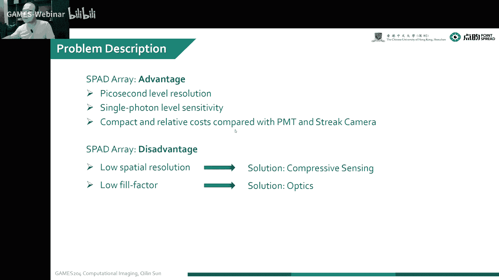

完整的捕捉到传感器上，那个时候1617年那会吧，就我们自己做了一个就是演示的微透镜阵列，当时为啥做这个衍射卫生间之列呢，就因为折射的不会做，你知道吧，就当时那个这个是我们没有那个做折射的工艺。

但其实做折射会更简单一些，当时就第一个提出了，当然这应该是全世界第一个提出了，做演示的微透镜金链，那个时候我们就有一台光刻机啊，一台光刻机，然后刻了一个四层的一个mask，来形成的这么一个演示经典。

当然大家看的很刻的很粗糙哈，因为分辨率的问题，这个就这个衍射环都出来了，这些大家可以看到这个这个采样了，这个班ALLAZING的一个班都已经出来了，但这个效果还不错，效果还不错。

这个最后就是加工出来了一个四层光，四层套课，每一层就是二的二次方，四层总共就是二的16次方，但这个理解一下就行了，这个实际上就是一个小透镜，把光汇聚一下，但也做成方的方的这个透镜呢，它的效率会高一些。

我把整个图像这一小块儿的，这个全都收集过来了对吧，然后最后哎这个对齐很麻烦，当时就找这个传感器厂家找了做了一个alan walker，我们就把上下跟那个抽氧传感器对齐，这是第一次对这个spy的传感器。

这有史以来第一次，就他用一个衍射的一个麦克莱瑞，进行它的一个填充率的提升，但也提高了很多光的一个效率哈，但还是很复杂。

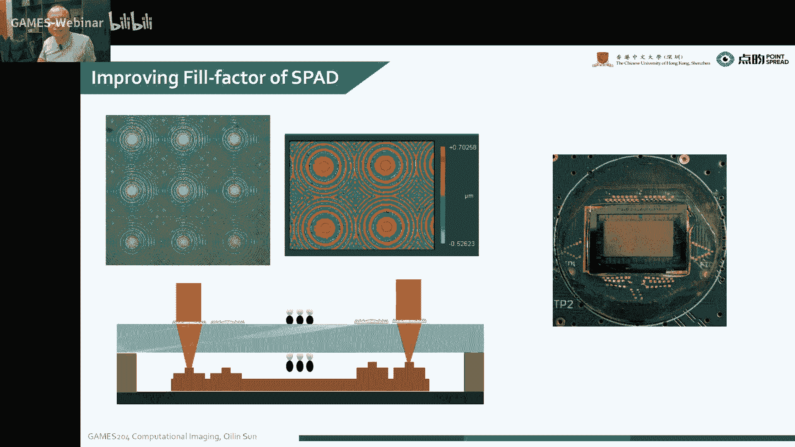

套路还是一样，我们要在一个焦平面上，我们相面上放一个binary，一个map来进行调制，但这个时候有一些情况不一样哈，就刚才是一个像素点，现在是我一个XY的一个阵列，然后第二个不一样是什么呢。

我们要捕捉它的时间序列，就是我在一个频秒量级下的一个时间训练，我最后拿到的是一个4G的一个DQ，我在一个4D的一个MANAGMENT下，就是你看我的我的采集是啥呢，第一个维度相机的XY，那这两个维度哈。

前两个维度X相机的XY，第二个维度我们这个DMD的一个随机班，这是第二个维度，第三个维度就是时间轴T的维度不对，这是第四个，总共是XY随机班，然后还有一个时间T4个维度。

我们捕捉到的信号就已经是四个维度了，我们要求解的呢是一个XYT的一个DT的阵列，这个告诉大家怎么去啊，构建这么一个函数来去求它，但这个中间遇到的问题还是非常多的哈，因为这个SPA传感器本身啊。

它是有一些hot pixel的，就是就是坏点哈，他这是当然这个这可能是初期啊，这个这个图像传感器有一些工艺上的缺陷呃，它会有一些坏点，这个没有办法，我们要先把对这个坏点进行去除，然后去传完之后呢。

就然后这个是我拿到了一个原始的，一个就是DMD调制过的图像，然后去除，这是去除之后的一个电BL图像，然后最后，我们还要标定一下，这个，当时还要我们就是每个像素块对一个。

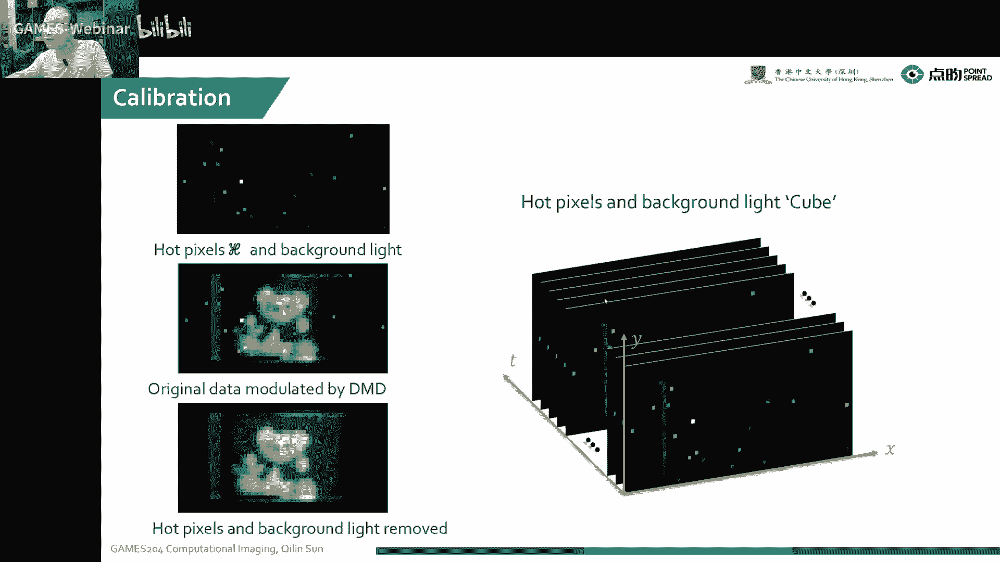

对应一个随机班，就每个像素点对应一个随机班，这一个像素就相当于一个小的single pig cha，但是它会有一个更高的一个维度，像这个celebrate这个问题很麻烦很麻烦。

当时这个我们叫微米级对齐啊，这个还是有故事的，这有故事的，像最早我们我们在cost这个VR computer center，那个地方，当时我们的实验室，我们那个实验室不知道为啥啊，也不是实验室。

整个办公楼办公楼地下都是空调，就我地板都是空的，当时哎呀这年轻啊，我们把这个光学平台啊，就放在那个地上，结果就发现我们这种在这种微米级对齐的时候，这个走过人，这个人走过去蹦一蹦。

这整个对齐全都不能工作了，哎这个时候我这个倒腾这个实验，倒腾了好几个月，就发现这个对齐怎么实验结果老是不出呢是吧，这个仿真早就过了，最后做实验就是做不出来，最后发现这个B在抖，后来就换到了一个实验楼。

我们把这个桌子搬到了实验楼，这个才完成了对齐啊，这个标定做了好几个月，接近大半年，那我们要恢复的是一个高分辨率的，一个XYT的这么一个这个这么一个data cube，但我的MAGIMENT本身。

那我们就把这个每个小块儿，通过一个像素来去捕获对吧，然后每一层也是通过一个像素进行捕获，然后最后观测到的就是一个嗯嗯，4D的一个就是一个managment matrix，就是XYT。

再加上了我一个不一样的一个班的一个调制啊，这一个啊这一个这一个就是二级的一个随机班，调制了整个的一个XYT的一个高维图像是吧，但这个matrix也变得非常庞大啊，这个从F1到FT当时后来是用卷积解决的。

这个太大了，没办法去解这个management，我们拍了一个场景，就是mt，然后这个观测矩阵就是mt乘以NT，这么一个大的一个矩阵啊，我们最后想办法用就是一个for循环。

或者是一个很LUTION来解决掉，这是我们实际的观测值对吧，实际的观测值，啊这个这个同学问一个T，是不是对应好几个DMD的mask，呃实际上你可以这么理解哈，就是这么一个我们要观测的一个XYT啊。

这是我们最后要求解的一个CLEIMAGE，我在一个cube本身受一张mask调制完，然后再来那么一个循环，再调制完，再来一个循环再调制完，你也可以也可以这么说吧，没问题。

对你只是这个怎么组合的一个问题啊，这个dimension的变化这都一样的，最后我们最后搞来搞去，这个套路发现还是一样的，还是一个X减B的问题，只有我的规定，可能可能要在一个三维空间中进行约束。

也是3D的一个TV，但这个嗯没没有太大区别哈，没有什么本质区别，其实我最后我操作的时候，就这个操作这个FX减Y这个data formation的时候，它是一个变成一个高维的了。

那本质上其实解的问题没有任何本质区别，但这个时候我们那个augmented lagrange，可以写成啥呢，就可以通过我们这个引入这么一个，西格玛德尔塔这么一个变量，然后把这个增强它的凸性哈。

增强它的凸性，那最后把这个拉格朗日，然后分别求解这么四四部吧，就是第一步还是这个update这个XK，然后第二步我们把这个omega固定住，然后对这个呃拉格朗日函数进行一个规定。

design求解来update这个X，然后第三步呢我们就通过一个呃就是soft，因为这个时候有TTV的一个约束嘛，就是鬼点的一个约束，这个时候我们就通过一个啊。

这么一个简单的一个soft rinking，soft soft啊，stressful的一个也叫SHRINKY的一个方法吧，也求解这么一个呃l y norm的一个约束问题，第四步哎。

分别对两个就拉格朗日的橙子，就是德尔塔跟西格玛和德尔塔分别去update一下，这个很简单很简单，这个套路跟a dim没有任何区别啊，这个有有时候这个也，这个就说这个时候就叫TVSRA这个。

但实际上跟N上面没有任何区别，都是这么一个套路，这是我们当时做了一个圆形，当时搭这个光路搭的我们真是心力憔悴啊。

心力憔悴，在这个那时候刚来啥也不会，那个时候自己也做了，因为这个光路哈前面套了个透镜，他自己用当时用solid word，现学的画了这么一个啊，这个叫这个这个这叫turn prem。

可以从这个方向进这个方向出，因为我们直接大家要通过，因为这个电B很烦，还有一个12度的角度，你在一个光学平台上对你怎么对你都对不好，对你不大好，调出来一个12度的角度，干脆就搞一个七零部件，既然不见了。

这个组里呢就大家都不会，这个都是新人啊，只能靠自己，只能靠自己，最后先画了一个呃，这个我们这个透镜的一个套筒，然后再对新我们要对这个12度的一个角度哎，对完12度角度。

我们把这个t presume怎怎么变化，最后我们要再留在出口的地方，要给这个要给这个就是日立镜，日立镜留一个就是一个接口，这样好好接到一个更好一些，但像这种过程中，特别害怕我们砸光的出现。

他这个为了搞这个杂光问题呢，我们这自己又搞了一个这个套筒来，直接也是3D打印的，最后接到这个SPD传感器就搞，搞了这么一个封闭式的一个光柱带调制的，当然这个很烦哈。

这个歌手当时那DMD呢就自己就是没有那个线，不够长了，那当然自己当时那个时候闲着没事，就画了一条这种延长了这种线啊，这个高速信号线当时也是现学现画，这也是第一次画嗯，好赖是能能能管用。

这是我们当时做了一些结果，这是比如说我们在一个2D的intensity上，做一个压缩感知，上面是一个64×32的一个分辨率，诶，下面这是我们经过恢复出来的，一个啊高分的一个intensity。

这是一些它在深度上的一个压缩感知的应用，也是XY方向的一个像素的变化，那最后我们也闲着没事儿哈，就记了一下这个光线到底是怎么汇聚的。

因为光在空气中走，你是看得不到的，当时我们就搞了这么一个这么一个。

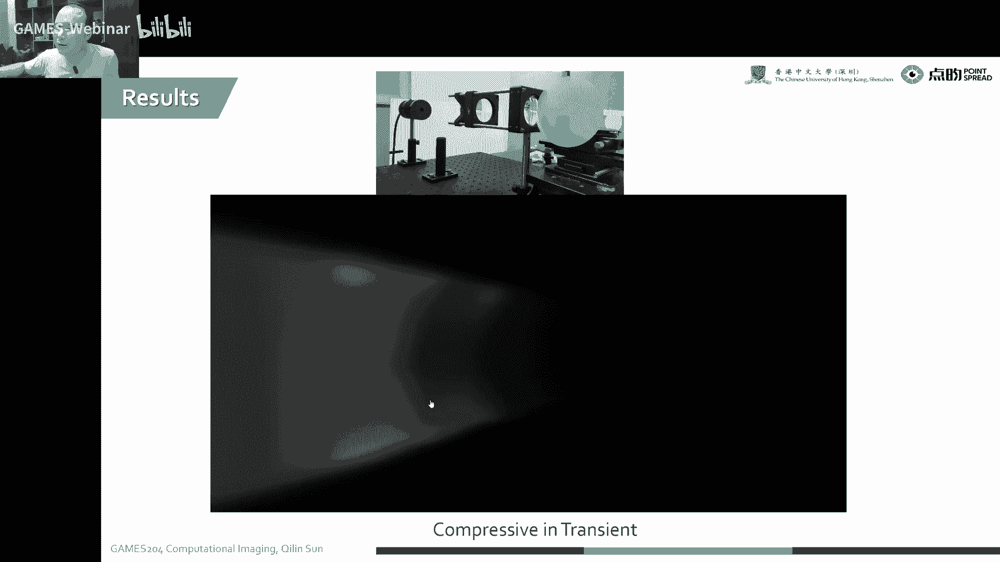

当时是哎当时可能是比较有钱。

那个时候是搞了这么一个玻璃的一个对，他是就增加了一个拉格朗日的一个橙子，来增强了它的凸性，实际上它是可以啊，比较好的收敛到一个更好的位置，所以说这个ABM结果比这个HQS好。

再回到这个当时可能是比较有钱，当时就拿了这么一个WIFI，就一个field的CD卡的一个wafer，这一片有好几百美金啊，好几百美金，然后把这个喷了一层白漆，搞一点斜斜的角度。

让这个光线可以有这么一个角度汇聚过来，大家可以看到这个光线汇聚的一个过程啊，当时做计算摄影呢。

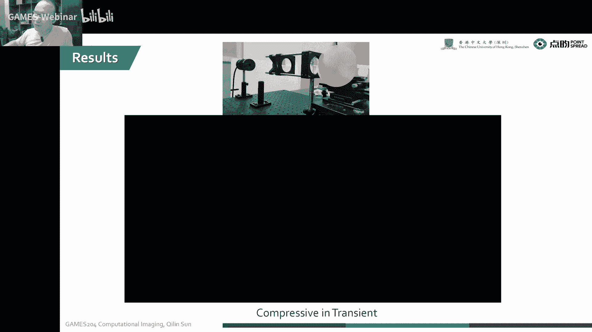

这个是实验步骤啊，其实就是很很很很困很困很困惑哈。

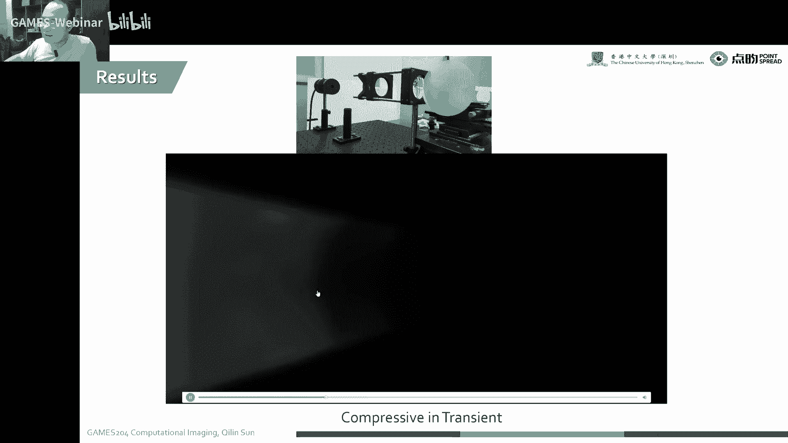

大家这个经常会遇到各种各样的问题。

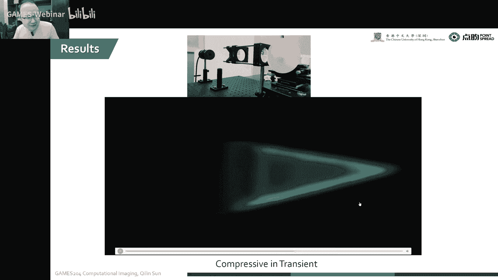

当然这个正是因为我们整个计算摄影领域，有这个实验验证，也就是我们比起码比其他领域是可以有一个呃，更强的一个倾向应用的一个点，就是我们已经验证了自己，已经验证了这个东西是work的。

所以说做计算摄影的同学，为什么在市场上啊这么容易找到好工作啊，这么容易被市场认可，也都是嗯需要有一定一定的动手跟计算能力的，培养，各方面的能力啊，今天的课程就到这里，也欢迎大家读一下这些参考文献。

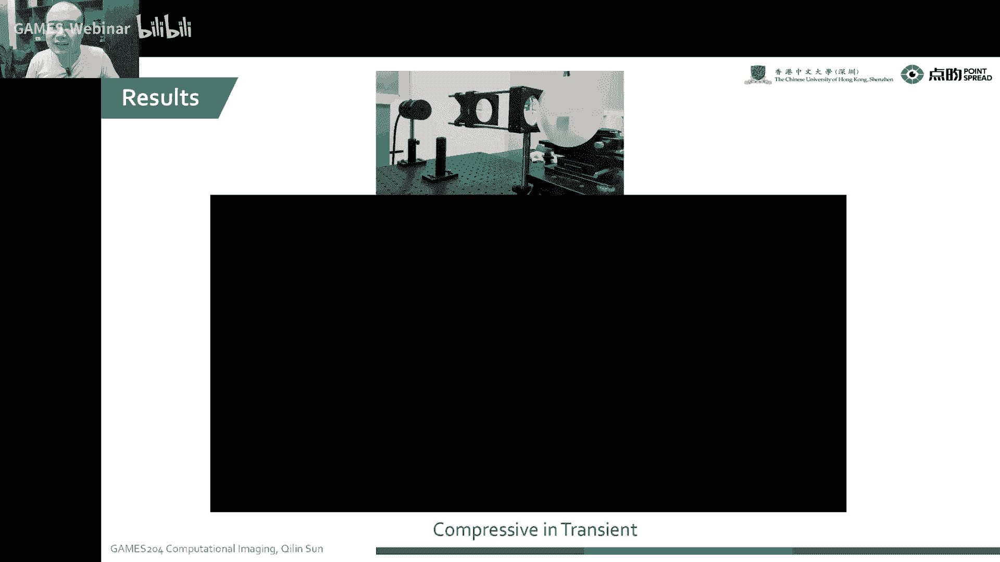

今天就主要给大家分享了一下这个inverse problem，然后以ADMM为目标，我们通过这个single pixel camera为例，同时我们也啊分析了一个他的一个半身的一个。

Perspective model，然后包括像高斯的一个噪声模型，还有一个破损的噪声模型，它的概率啊，表示我求他一个最大三人估计的时候，哎，这个时候他最后我们发现。

跟我们最后要FORMATE一个image model是一样的哈，解的时候就结套路，Ctrl t gradient加上RINKAGE或者deny the power，这个呃大部分问题都是可以求解到。

实际上本质上就是两三步，第一步写拉格朗日，然后通过把那个橙子加上去，然后呢第二步就是求解，求解里面就分三小步，update你的U这个地方就解决了，就非常稳，非常简单哈，当然这个时候既然简单。

就是要求大家写一下，这个要实现一下，写完之后才会有一个更清晰的印象，这个作业的时候会布置给大家好，今天的课程就到这里，同学们还有什么问题吗，好既然同学没有问题，那今天课程就到这里。

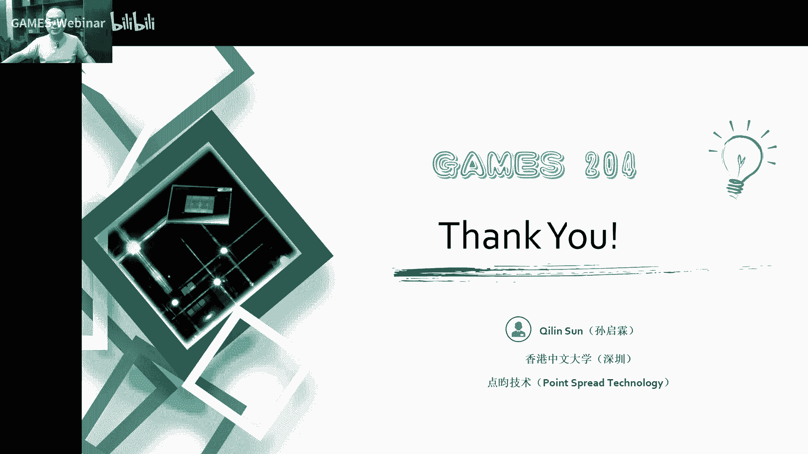