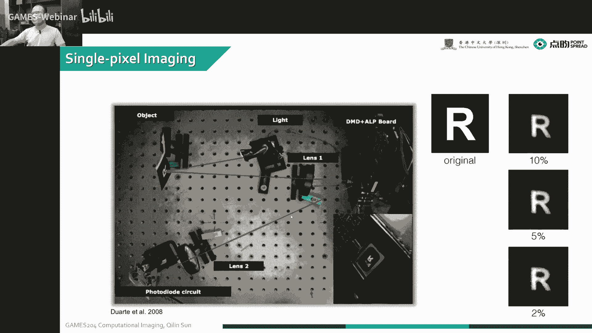
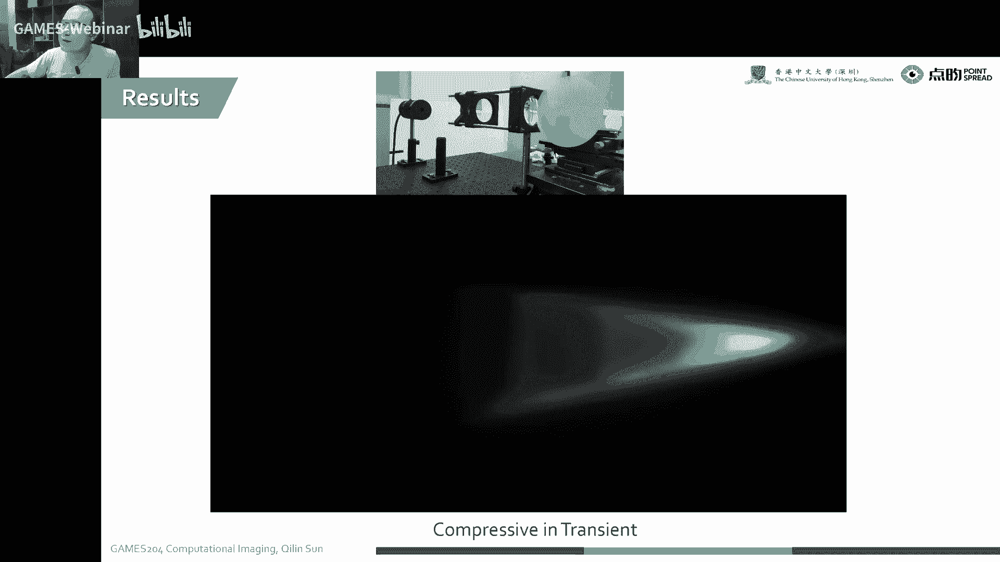

# 15. 逆问题建模与ADMM算法求解 ｜ GAMES204-计算成像 - P1 - GAMES-Webinar - BV1j8411Y7zY

## 概述

在本节课中，我们将学习逆问题建模和ADMM算法。我们将通过两个例子来展示如何使用ADMM算法解决逆问题，并了解其背后的原理。

## 逆问题

逆问题是指从观测数据中恢复出原始信号或图像的问题。在成像领域，常见的逆问题包括：

* **断层扫描**：通过X光投影重建物体的三维结构。
* **磁共振成像**：通过电磁波成像重建物体的内部结构。
* **高光谱成像**：通过多个光谱通道的成像重建物体的化学成分。

逆问题通常可以表示为以下形式：

**A * X = B**

其中，A是成像模型，X是待恢复的信号或图像，B是观测数据。

## ADMM算法

ADMM（Alternating Direction Method of Multipliers）是一种求解带约束优化问题的算法。它将优化问题分解为多个子问题，并交替求解这些子问题，直到收敛到最优解。

ADMM算法的基本步骤如下：

1. **引入辅助变量**：将约束条件引入拉格朗日函数，并引入辅助变量。
2. **分解问题**：将拉格朗日函数分解为多个子问题。
3. **交替求解**：交替求解每个子问题，直到收敛到最优解。

## 单像素相机

单像素相机是一种利用压缩感知原理进行成像的设备。它通过一个单像素传感器和一个数字微透镜阵列（DMD）来获取图像信息。

**单像素相机的工作原理**：

1. DMD在图像传感器上呈现随机的二值图案。
2. 光线通过DMD和物体，并投射到图像传感器上。
3. 图像传感器记录下经过调制的信号。
4. 通过分析观测数据，恢复出原始图像。

## 高维压缩感知

高维压缩感知是指将压缩感知技术应用于高维数据，例如视频、光场图像等。

**高维压缩感知的挑战**：

* 数据维度高，计算复杂度高。
* 需要设计高效的算法来处理高维数据。

## 总结

本节课介绍了逆问题建模和ADMM算法，并通过两个例子展示了如何使用ADMM算法解决逆问题。我们了解到，ADMM算法是一种简单有效的方法，可以用于解决各种带约束优化问题。