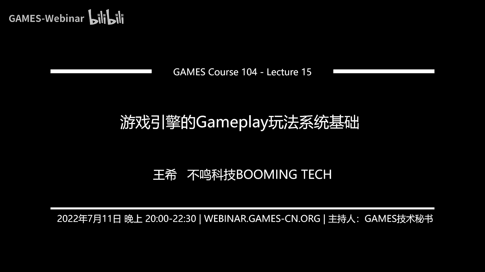
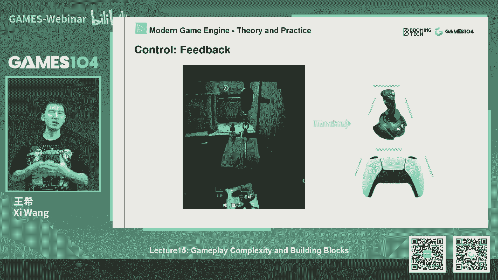
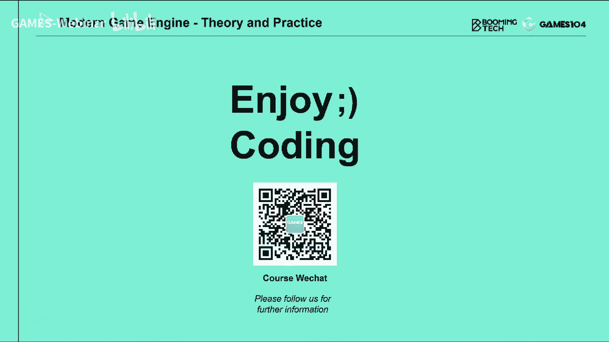

# 15.游戏引擎的Gameplay玩法系统基础 ｜ GAMES104-现代游戏引擎：从入门到实践 - P1 - GAMES-Webinar - BV1u34y1H7jd

大家好，欢迎大家回到games104，现代游戏引擎的理论与实践，我是王希，那个过去的两周大家休息的怎么样，我是终于又可以得一个星期的假期，然后可以出去玩一玩，然后那个现在又被拉回来。

开始给大家上我们的games104，那么在开始课程之前的话呢，首先给大家那个反馈一下，我们社区女同学们的那个各种声音，首先的话很多同学说，我们现在第二节课的作业，和第三节课的作业还来不及做。

比如说第二节课的作业是什么，大家记得吗，就是我们那个啊用LUT去做各种各样，后期的效果对吧，我们还做出那个叫什么那个，那个那个叫音节模式的视觉效果，然后呢第三节课的话呢是有动画。

作为一个最简单的动画的混合，实现人走走向跑，然后呢还有一个简单的control效果，那么就是说课程组同学们商量了一下的话呢，因为考虑到每个同学进入我的课程的时间，有先有后。

然后呢还有一些可能有些东西很难，所以我们把整个提交时间统一到啊，下个月的月底就是8月31号，这样的话和我们第四节课的作业的话一起来收，这样给同学们更多的时间去准备，而且大家如果觉得很难的话。

你也不用所有的作业都做，你可以选择你选你觉得能上手的作业可以做，因为很少有人能写全部的游戏引擎对吧，你每个东西的专家也实在是太厉害了，所以说哎我是做rendering的，我是做动画的对吧。

你可以选一个自己感兴趣的题材去做，那么另外一个的话呢，就是哎这个是大家反映比较多的一个问题啊，就是我们作业的提交好像老是失败，然后呢，我今天才跟我们那个课程组的小伙伴一起，在在商量。

然后现在我们猜测的主要的原因，就是那个在那个games的课程提交网站，因为那个不是我们课程组做的是games课程组，games课程做的那个网站，当大家提交完自己的作业的时候呢。

还要单独再去点一下那个提交按钮，所以很多同学是上载完附件，但是呢就没有去点那个小按钮，导致这个作业提交就失败了，然后呃后来我们想了一个办法，就是在我们的课程的那个官网上，又写了一个文档。

在那文档的第九页的话呢，就是专门教大家怎么去提交作业的那个地方，我们告诉大家注意这件事情，所以同学们如果还有什么作业提交的问题的话，也及时跟我们课程组联系，然后我们课程组的小姐姐真的很好。

她那个大家好多同学提交失败的朋友，把通过微信传给他之后，他帮大家一一的就提交上来了，所以的话，哎，我觉得这里面真的要给我们科室的小小姐姐们，小伙伴们点个赞，然后所以大家如果课程提交作业。

提交还有任何困难的话，就及时跟我们联系，反正我们会尽我们所能给大家提供帮助，那么最后一个同学们也问我们一些问题了，这些问题我觉得蛮好玩的，就比如说有同学问我们说。

哎我们的pick a引擎要不要做这个scripting，脚本系统，这个这个东西其实呢是我们这节课要讲的，就这节课我们讲那个game play会讲脚本系统，那其实游戏引擎接入脚本系统还是蛮复杂的。

就是包括啊他你是怎么去架构接口，怎么去设计，包括你是不是要实现一个，就是比如像graph这样的visual scripting，那这件事情，其实目前的话，就整个课程组会很专注的把课程准备好。

就像大家跟大家汇报过，就是说实际上我们写这个课件，是非常非常压力很大的，因为我们没有任何参考资料，所以每节课都要临时现写现编，然后确定提纲，所以这是个巨大的工作量，然后我们最近连开发任务都受了一些影响。

那所以的话呢，我觉得可能在9月份课程结束之前的话，我们会专注于把课程打造好，同时和大家一起把PUI引擎本身的一些问题，功能做完善，可能是等我们90月份这个基础课程做完之后，我们会和大家一起商量。

如果同学们有兴趣的话，要么我们课程组来写，要么我们和社区的小伙伴一起来写，看给我们的这个皮UI引擎设计脚本系统，但同学们提的这个问题是对的，就是说如果真的要做一个好的游戏引擎的话。

那一定是要有脚本系统的，否则的话它很难去做它的扩展性，那么另外有同学也在问我们说，诶那个为什么皮克AI引擎用的是c make up for x Mac，那个实话实说，我自己没有用x Mac。

然后呢我今天还专门向我们的小伙伴们请教，我说x max是什么东西啊，然后那个他们给我看了一下，然后我说哦原来是这样的，好像Mac确实是比c Mac简单一点，那但是呢当时我们为什么选用c make呢。

就是说实际上课程组觉得，c Mac是现在开源社区里面应该来讲是最popular的，就是说最大家广泛接受的一个build的工具，那么它本身的话宫内比较完善，也比较强大，而且支撑的文档也足够多。

确实当时我们在做皮卡小引擎的时候，就有一个小小的野心，就是我们一上来就想跨平台，所以一上来就选了一个最标准的一个解，但是呢其实未来如果同学们有兴趣的话，大家有人说哎我要做个更简单的AI Mac版本的话。

如果有这个想法的话，我觉得我们也会帮助大家支持大家来做这个事，但目前的话呢就是说我们会先集中精力，把一个版本搞好，因为就算c Mac的话，很多同学理解起来啊，学习起来还需要花一点点时间。

那么如果大家觉得有问题的话，c Mac其实有官方的网站呢，大家可以去查一下，如果大家找不到那个网址的话，我们到时候会在微信上把这个网址给大家，就是c Mac在哪查找他的资料。

那最后呢有同学也在问我们说诶，为什么这个小引擎每一次都没改代码，但每一次编译都要重新编译一下，这个其实是我们目前也是我认为小引擎，我们还有很多事情要做的地方，因为虽然一行代码没有改。

但是呢我们不是有那个反射系统吗，就是他每一次编译的时候，首先会调那个反射的compiler，他会首先渲染出很多的这个generate code，那这个code的话，你会编译器当成一个脏code。

他又开始重新编译了这个地方，其实我们未来是可以优化的，就是如果你的这个数据的，就是schema的定义没有改的话，我们可以不触发变异，但这个写起来讲起来很简单，写下来需要很多的处理和编译的处理的。

这里面需要花一点点时间，所以其实就这样，大家也能意识到就是一个大型引擎，它就挺复杂的，有的时候叫自己要做自己的预编译，然后呢这个预编译本身呢。

它的比如说怎么样实现incremental compiling啊，实际上是比较复杂，我记得以前我在做那个就是hero引擎的时候，我们当时最痛苦的一件事情是，我们那个引擎编译一下。

大概要花掉呃半个小时左右，然后呢，后来我们专门找了一个一个一个很厉害的，技术的老哥，大概花了有一年的时间，终于把我们的编译时间从半个小时，减到了10分钟，实际上你会发现就在写这个引擎的时候。

有很多的include对吧，这个include1大堆的类，那结果有些文件啊，你基本上一编译的时候，会被编译几百甚至上千次，就会导致整个编译速度特别的慢，所以其实当引擎做到最后的时候。

当你面对几百万行代码到上千万行代码的时候，如何能够实现分布式的IMPLEMENTAL的编译，实际上是个很重要的工程问题，否则的话整个引擎开发组的话，大家每天可能有一半的时间在等编编译了。

那个过程是怎么说呢，既可以划水，很快乐，但同时又会觉得很痛苦，太无聊了对吧，所以说同学们问的这几个问题，我觉得都蛮有意思的，所以我在这里也给大家做一些我们的回答好，那今天跟大家的社区互动的部分就到这了。

接下来我们就开始我们今天课程的正题了，今天课程讲什么呢，讲这个game play，game play这个翻译成中文叫什么呢，我我想了半天啊，我其实脑子我今天上课之前。

我都不知道game play中应该怎么说，后来我想了想，应该叫玩法系统对吧，这个听上去翻译起来还是有点信达雅的，这个小小的给自己自夸一下，然后这个玩法系统其实是个很庞杂的，很庞杂的系统了。

就真的是你想到游戏里面几乎都almost everything，它都叫玩法系统哦，所以这一节课准备起来，我们的那个团队真的是觉得头疼肚子疼，就是该讲啥呢。

好像这个玩法系统有一部分好像在render也讲过，好像有些东西在物理也讲过对吧，有些东西在其他地方都讲过，那到底什么东西属于玩法系统呢，然后我们花了很长时间，把这个玩法系统分成了两大块。

第一大块呢大家可能也比较熟悉了，就是玩法系统的基础，我们会讲A真正更详细的event系统是怎么驱动的，就是整个这个世界里这些game object互相怎么去通讯，怎么去互动对吧，这是做玩法的基础。

然后呢，诶你怎么去用scripting写你各种各样的玩法规则，对不对，比如说打砍一刀上去，这个血量到底怎么扣对吧，这些东西都属于玩法系统，那这东西也是属于那个scripting系统，一个重要发挥的地方。

那还有大名鼎鼎的，就是可视化的这种挂那个script系统，比如说像大名鼎鼎的BLUPIN的蓝图系统，那这里面的话我们可以去讲，然后最后呢会给大家讲，这个也是非常这个这个如雷贯耳的，叫著名的3C系统。

如果大家同学们那个稍微浅强一点，游戏的设计的话，都知道啊，要做一个好游戏，做一个好的动作游戏对吧，你一定要理解什么叫3C啊，3C是什么呢，Character control and camera。

就是角色控制已相机，那3C系统到底是什么，今天给大家做一个简单的科普，那这些就是杂七杂八东西，讲完的话，基本上就是玩法系统的一个骨架了，但其实玩家系统里面有很多的细节啊。

我们今课程上是没有办法跟大家一一展开的，那么这节课呢我们这就这个玩法系统，我们是准备了两节课嘛，那另外一个第二节课的话，哎只讲一件事，就是AI对人工智能怎么样，AI还是比较霸气吧，就我连提纲都写不出来。

我就觉得我用了我蛮喜欢的，斯皮尔伯格的那部电影就是AI，大家如果没没有看过的话，一定要看亚洲眼，因为他非常的有深刻，他就讲了一个小机器人，小男孩，每天想着自己能变成一个真实的real boy。

也就是一个真实的男孩的故事是吧，那其实的话那个就是我我哎呀这个跑题了，我在想我以前看那个AI那个电影的时候，后来我玩那个底特律变人的时候，我记得我就一下子戳中了我的灵魂共鸣对吧，我就觉得哇。

很能理解这些机器人为什么要变成人，那么其实AI系统的话呢，讲起来就有很多很有意思的东西，而且呢你说讲的很浅，也可以讲的很深也可以，所以我们想想专门做一节课，跟大家好好的去玩玩一下AI系统。

所以说整个我们的玩法系统就分成这两趴，那么大家的话呢可以根据自己的喜欢对吧，你如果很感兴趣AI，你可以跳过这节课不听的，但是相信我，你如果只听AI了，你这个玩游戏玩法一定做不出来。

为什么你没有前面的这些系统的支撑的话，光有个AI这个游戏也是跑不起来了，所以此处给你们挖一个小坑好，那我们就回到今天我们课程的主题了，那我们就基础的玩法系统是怎么来的，首先玩法系统呢。

实际上啊大家觉得做一个游戏一定要玩吧系统，但文化系统其实挺难做的，为什么呢，他的第一个挑战就是说它实际上就是叫设计师，动动嘴，程序员跑断腿，因为一个玩法，它实际上会和游戏里面的各个系统都会打交道。

比如说对吧，我们这个这个这个就是武林至尊对吧，可那个我们的卡圣人，他们做的这种动作和打击感，那简直是这个，其实我很期待这款产品，我今天一直在问说这游戏今天上线了没有，他们告诉我没上线。

哎呀我我我就只能默默的等待了对吧，因为我是他的这个铁粉，那么好，那其实像我们的这个就是说这种一个动，很有动作打击感的这样一个游戏的话，你要做他什么，你首先要跟动画系统起作用嘛，对不对。

动画系统呢你还要跟特效系统对，打击感的核心是什么，特效嘛，对不对，还有什么呢，生效对吧，你一定要跟some effect起作用，你还跟那个control控制的那个那个那个。

无论是手柄还是鼠标键盘都要起作用，对不对，还有各种UI的提示对吧，double kill什么暴击对吧，这种东西它它在屏幕上啪啪啪弹出来，那么还有什么呢，还有大家著名大名。

大名鼎鼎的叫动作感的那个要素叫卡针，叫打击针，你要把那个画面啪啪啪整个卡住，所以你还要跟渲染系统起作用，所以其实我作为一个非常简单的一个玩法，就是一个有打击感的东西。

实际上你作为games play的engineer，就作为玩法工程师的话，他虽然这些每个系统都不需要他写作animation，animation系统的工程师对吧，做sound effect系统。

有sound effect系统工程师，做这个UI系统，UI系统工程师等等等等等，但是我们的game play的engineer，他要和所有人在一起talk，然后呢他才能够满足我们设计师的需求。

否则的话啊他就是做不出来，所以说其实啊game plan engineer，他很多时候都是个杂学家，就是什么东西都得懂那么一点点，这是做game play的第一个挑战。

那么做game play的第二个挑战是什么呢，就是说其实啊在游戏里面，game play真的是多种多样的，我们不要说不同的游戏类型啊对吧，你一会儿有RTS，一会儿又是这个FPS。

一会儿又是ACT游戏对吧，就算在同一个游戏呢，比如说大家去玩巫师的时候对吧，核心战斗是这个样子的，我看见怪我就砍我卡斯特，我的魔法，我的各种技能特效打的砰砰砰，打到怪物上很有打击感，对不对。

但是你玩昆特牌的时候，你发现啊，这又是一个很好玩的一个游戏，我一直认为巫师是一个被动作耽误了的一个，昆特牌游戏对吧，那很多人都觉得昆特牌比这个巫师本体好玩，当然这个有点夸张了，但是我们再想象一下。

就是如果我们想做一个像，比如说像荒野大镖客这样的游戏，你想这个事件里面你能做的丰富的玩法，机制类型有多少，比如大家如果玩网游的话，那真的网游里面是什么什么能搞，比如说你在里面可以抛绣球，可以踢足球。

可以这个大家一起玩吃鸡，还有大家还可以一起去什么打牌，下五子棋，还有什么还可以参加这个什么啊，科举你还可以考状元，所以这些所有的东西我们都要统称玩法啊，这些玩法的话呢。

哎我们很多时候要把它做进一个游戏里面去，音响，这个时候玩法系统的架构，包括玩法系统的这种叫做可扩展性，其实要求是非常高的，这也是玩法系统一个很挑战的一个东西，那么第三个的话呢就是玩法系统。

我们认为比较有意思的东西是什么呢，叫快速迭代，大家知道这个这个这个four night堡垒之夜很厉害，对不对，但是不知道堡垒之夜最开始的时候，他不是现在这个吃鸡模式，它是一个mo对吧。

当时最早EPIC是想把它做成一个，就末世题材的生存类mo，但是呢有一天这个就是我们的team同学，叫team smiai，就是那个EPIC的老大，他觉得哎好像这种重度的mm好像没有什么市场。

我们还不如做个轻量的，以吃鸡为题材的这样的一个游戏对吧，就出现了PUB啊，不是PVG啊，就是那个for night对吧，battle royal这样的一个一个模式，好，从老大下定决心到团队搞出来。

给的时间多久呢，两个月，所以说其实你在做game play的时候，你想这么大一个游戏两个月就搞定了，真的就两个月搞定，为什么就game play系统还有一个很大的特点，他和我们做rendering。

做animation不一样，比如说rendering，我一个feature对吧，像我之前讲的叫sky啊，讲的那些，比如说TURING啊，一个系统从决定要干到他做下去，很多时候是半年以上。

甚至有的系统要做一年以上，因为它的算法很复杂嘛，你就一步无数的敌它迭代调整，然后呢跟美术去磨整个流程，所以这个过程是一个很怎么说呢，很漫长，很专注，但是呢又是相对稳定的过程。

但是gap edge near他面对的情况是什么，前两天设计师跟你讲说，哎我们要做这个玩法好，大家一起做出来了，诶，出来玩了两天之后，大家觉得不对劲了，好马上要改，我有了一个新的想法。

好两天之后又要变出一个新的玩法，所以其实game play它是整个游戏系统里面，迭代速度最快的一趴，所以当我们设计这样的一个game play系统的时候，我们在引擎侧一定要支持它快速迭代的功能。

所以说回想一下，就是说我们要做game play怎么样，第一它是要有能力和各个系统进行talk对吧，它是能够把各个系统的AI功能全部能调用，第二个是什么呢，就是说哎它具有很强的玩法扩展性对吧。

你在这里面可以玩一个非常叙事性的内容，也可以玩一个打击感对抗性很强的内容，对不对，也可以玩一些哎比较有意思的探索性的内容，这都是跟UI系统我们要支持支撑的，第三个就是这么多乱七八糟的玩法诶。

都是要求相对快的速度，可能是比如说几几天几周对吧，一般很少GAMEPLAY会做几个月以上，那是非常难的那种games play，但是那种game play都是迭代一个几个月以上的。

game play的研发都是拆成很多很多的那个小的，这个sprint就是小的一个突击，我们把它做出来，然后再看它的效果好坏，再去迭代它，所以这其实就是game play系统的一个要求。

就是说他就我我我总结一下叫做，就是他就要求第一要砸血，第二个什么呢，要价格便宜，量又足对吧，这才能支撑我们一个丰富的游戏体验，那么怎么去做game play呢，那首先的话回想一下。

我记得我们在第二节课跟大家讲说，哎游戏系统怎么搭的，其实我一直在想说，如果你想理解游戏引擎，那个第二节课听完之后，你就可以出去跟人吹了，我大概知道游戏引擎咱们加了，因为在那节课里面呢，我们就讲到了。

说这个游戏世界是有无数的机油object，game object构成的对吧，那game object之间的话呢，其实如果能让他玩起来，首先他们彼此是要能talked的对吧，我一个炸弹能告诉你们说。

不好意思，我要炸了你们对吧，我一个坦克发射一个炮弹对吧，我会告诉你们说一只炮弹正在飞来，那么这些game object之间的话呢，我们认为要能talk，但是talk的话，如果你把它写死成我的代码中的话。

那是不是就像我们的第二课，第二节课讲的就是说你就是一堆if else if else哇，这个或者是switch case对吧，这样的一个branch的一个循环，那这个代码写到后来肯定不是给人看的。

基本上就崩掉了，整个系统都不知道怎么维护了，所以呢在第二节课我们就讲了，就说哎其实你应该用event message的一个机制，就是把所有在这个事件发生的事情，变成一个event或者叫message。

其实我自己很多时候很迷乱，虽然我们经常一直叫它event系统，但实际上呢在游戏引擎写的时候，我们会经常把它写成message，好像觉得message很有感觉，我记得我在第二节课讲了。

这个男女朋友要分手的那个例子对吧，就是那个你们家门口有个邮箱，互相递那个分手信，其实我觉得message很有感觉，就很有那种物理的实体感，确实就是在游戏世界里面，在每个tick我们的co之间诶。

互相给对方写信，然后呢收到信的人，每个人做出自己的响应，这其实就是个最基础的诶，我们对这个世界的互动的一个方法，就相当于我们之间建立了这样的一个通讯协议，那今天的这节课里面我们讲game play系统。

那我会稍微讲的细那么一点点，就是说如果你真的想做一个玩法系统，你想做一个能够应对相对复杂的，一个游戏机制的话，我们的引擎测疑问的系统它该怎么去做，那在这里面的话呢，其实我们上升一个相对高的一点高度啊。

其实这个模型啊它是一个它的设计范式，叫做publish，Subscribe pattern，就是说发行者和这个注册者，Secreation，就是那个注册者的这个pattern。

就相当于就是说有人负责发布信息，另外一群人注册一些信息，就这些信息来的时候我就注册了，就是这个这个叫发行或者订阅吧，中文应该叫订阅，订阅可能更好一点，就相当于是说每个人都出自己的校园小报。

但是我喜欢那几个同学的文笔，我就订订阅那几个同学的小报，所以它是这样的一个标准的一个pattern，那在这样的一个pattern里面的话呢，实际上它有几个很重要的元素。

第一个就是我扔出去的各种各样的events对吧，各种各样的事件，第二个呢这event需要有一个系统，这个系统叫什么呢，叫event dispatcher，你可以认为它是个物流公司。

就是你每天这个你在淘宝上订的东西，那那那个就是商家把东西都发出来了，就是你买的东西，然后呢这个物流公司它其实很强大，大家不要千万不要低估物流啊，物流行业其实是一个技术密度很高的一个行业。

但因为他的这些信息的分拣派送，实际上是很在乎效率，而且要进行一些算法的，所以event dispatui它就像物流公司一样，他做好这个信息的分拣派送，然后呢，唉再到我们各个的接收者进行相应的动作。

这个我们叫什么叫QUEBEC，所以呢其实在一个poption subscription model，就是发行者和订阅者的这个pattern里面的话。

三个key component就是第一个就是消息的定义，你的event definition，然后呢你的所有的哎这种消息来的时候，我该怎么去处理呢，对不对，这个处理的函数我们叫做call back。

call back呢，我们在第二节课讲的都很简单，实际上call back呢是有一个注册的过程呢，就是说你得告诉别人说，当有这类消息来了之后，你调我这个动作对吧，这个是要有一个注册关系，注册在这儿了。

然后呢，另外一个的话呢，就是我一每一帧会产生几百甚至上千的，各种各样的消息，那这个event这个DISPUI就像物流公司一样的，他要把消息送到各个对应的那个机构那边去，所以这三个要素呢。

实际上是我们一般系统的核心好，这里面有什么坑呢，第一个就是event呢，首先你要去定义它，就event definition对吧，那最简单的就是说首先每个一般它有个type。

大家能想到最简单的方法是什么，诶，我定义一个枚举类型，就用数字对吧，这枚举类型是字符串，你看起来像磁场，它实际上是一个唯一的标识号，那这个东西呢实际上在系统里面，有的时候在早期引擎的时候呢。

是这个程序员自己手打的，我定义了100种不同的event，根据我们的策划的需求，但是你会发现到后来，连even的type都是需要这个交给设计师去创建的，然后呢每个event呢它还有很多很多什么呢。

它的它的数据叫event arguments，或者叫有的时候叫payload，就是说产生这个event了，比如说发生了一个爆炸，那你得告诉我说你爆炸的地点在哪里呀对吧，你给我带来的伤害是多少啊。

伤害什么类型啊，那这些东西它又变成event的数据好，那最简单的解决方法是什么，如果大家学过面向对象的话，是不是觉得哦这很简单，我知道怎么写对吧，那我就是第一个event的鸡肋对吧，然后呢。

其他所有的event都派生自他在这上面的话呢，我会去定义他各自独自的这种数据类型，这个呢其实没有问题的，如果你整个游戏引擎game play都是用C加加写的，或者用某种面向对象语言去写，就是可以的。

但是呢就像我前面讲的就是做游戏，它最复杂的情况是什么，90%的情况下，玩法不是由我们程序员决定卡，所以说当我们决定在做一个游戏之前的话，我们基本上不知道这个游戏，会产生多少种类型的这种event。

因为很多都是在我们的设计师在研发过程中，他们觉得诶我需要有一个比如说大boss残血之身，那个一半，大boss，马上要切到他的这个这个第二段状态的时候，这样的一个消息对吧。

那这个时候不可能你写代码的时候知道了，所以呢诶我们要允许就是设计师去定义，各种各样的event类型，所以呢，这里面我展示了一个荣耀里面的一个定义，定义这个event的数据的方法其实非常简单。

就是你去定义A你的event这个inner是什么，当然它会形成一个唯一的引导，这个这个算法其实并不难，然后呢，A你在定义A我需要有哪些不同数据结构，然后用我们前面的方法。

大家还记得我们在上节课讲工具的讲过什么诶，讲过代码渲染对吧，现在大家看到这个大家就知道了，我用这个方法其实很容易的，就可以渲染出一个诶引擎的代码，就把这些这些新的这些event类型，把它定义进去了。

但因为其实啊我讲的是一个最简单的做法，但实际上大家想想看，如果我这么做的话，是不是要求设计师每改一次这样的event，我的整个引擎的代码需要重新编一遍，这样是不是很麻烦，大家想，对不对。

所以实际上呢在真实的游戏设计中的话，我们有一个很重要的能力，就是允许设计师在我的核心引擎代码之外，能够扩展它的event的定义，所以有些event它可能是通过纯数据的方式定义。

在我的工具链和我的游戏的game play系统里面去，所以game play他的这个东西很有意思啊，他就是说呃，我觉得在作为引擎做玩法系统的时候，很多我们只是提供一些最基础的工具。

但是game play，经常写着写着就写成具体的游戏系统了，那我们在这个设计中的话，就是引擎这个侧要提供的功能是什么呢，就是说你在这个游戏相关的引擎呃，游戏代码中或者游戏相关的数据中。

都能去扩张我的gay系统，但这里面怎么做到的，其实讲起来就比较复杂了，我举个简单的例子，比如说像AI里面的话，这个event你可以这样去定义，你用这个可视化的方法去定义。

然后呢它实际上还是生成CCR的代码，但是呢它的引擎架构就可以允许说，在这引擎运行时的wrong time，他可以把这一段新编译出来的一个C加代码，当成一个DIAI，我注入进去，那这件事情。

他就是花了很多功夫去解决这个问题嘛，但有有的引擎它用什么方法呢，哎我的上层做了一层，比如说其他语言，比如像C12F这样的接口对吧，它很容易动态的挂件和扩展，还有的语言，还有的引擎怎么办呢。

哎我用脚本语言对吧，我在脚本里面定义一些event，所以各自都有各自的方法，但是这个东西我就不展开，但是其实光event的定义就是具有一个可扩展性的，event的定义，这件事情其实不简单的。

就大家如果真的有兴趣去研究引擎的时候，你会发现这一趴很值得你去设计，而且这个东西呢也关系到我们后面的东西好，那当我们有了这样的一些event之后呢，接下来我们要注册我们的响应函数了，对不对。

我们要call back了，那么QUEBEC这个东西呢，其实这个名词很有意思啊，叫回调函数，其实说实话当时我听到这个名字的时候，我就觉得啊这个翻译的这个这个不能怪翻译，翻译，我看到这个英文名。

我也觉得叫毁掉，但是我总觉得这玩意像是一个，其实我蛮喜欢他另外一个叫法叫invoke，就是说哎我去激活它，我去这个这个这个就是触发这种感觉，其实我一直觉得回调不是回调，是触发。

就相当于我提前准备好了一堆堆的小的，piece of code对吧，一些小的功能模块，你不是回调的，我还是说你把我激活了，但没关系，这个是这个既然游戏行业已经这么。

这不仅是我们整个计算机行业都已经这么定了，那我们就follow这个paradise对吧，我们叫做回调函数，但是我更喜欢的叫invoke这个词，就是说当有一个什么消息来了之后。

你把我一段处理方法这个激活了就赢过我了，那这个回调函数呢你是需要提前注册好的，就是比如说我收到一个damage的这个event，那我就毁掉一个就damage这个handle对吧，Handler。

那我去handle这个AI的事情，比如说我遇到了一个叫做什么，这个这个这个什么color change，或者说我的status change，比如说move on change。

或者说reloading这样的一个消息过来之后诶，那我就调动我reloading这个装，重新装弹这样的一个操作，那这个事情也是对的，都很简单诶，有意思的事情就来了，就是说其实啊在这个回调函数里面。

有一个特别容易踩的坑是什么呢，就是说你会发现回调函数的注册和它的执行，不是在一起的，这很好理解，对不对，一般来讲我们都是先注册后执行，但是在这个中间间隔里面，其实各种幺蛾子都会发生。

这就相当于你跟你朋友约好了，说哎那个等什么时候有空，我们俩一起喝茶对吧，好女朋友说好，我把这个喝茶的这个这个这个这个这个时间点，什么那个预约全部定好了，但是呢到那个礼拜六的时候。

你那个朋友可能会发生各种各样很奇怪的事情，对吧，他会突然说我有事好了，你那个手上那一张这个入场券，是不是就等于白买了，其实在我们的引擎里面，最复杂，最容易出问题的，就是说一个对象的生命周期。

和它回调函数的安全性，就经常你注册了一个回调函数，如果这个东西我没有设计好的话呢，哎就会导致整个系统就是在那边就会犯错，甚至会导致整个系统的崩塌，为什么，比如说你毁掉了一个东西，它的物体不存在了。

这里面举个例子吧，比如说我们注册了一个函数对吧，这个函数呢就专门收这种，就是对我的这个血量有伤害的，这样的一个一个一个处理好，那这个函数呢注册都没有问题，但是如果在下一帧的时候。

这个对象他可能已经死亡了，这个对象已经被销毁掉了，诶这时候如果有个手雷在旁边爆炸对吧，这个回调函数你再去调它的时候，它可能就掉到了一个野指针，那这个东西它就会出问题，那大家会说那没关，没关系啊对吧。

你的回调，你这个这个对象的回调还是注册在这，如果你对象删除掉我这个回调函数也一并删掉，对不对，这个方法是有没有问题的，有问题没问题，你可以这么做，但实际上的话你会发现，当你一个游戏引擎里面。

管理的几千上万个机油对吧，就是游戏object，你又注册了相近，可能是他十倍以上的这样一个call back函数的时候，他的这种管理就会变得非常的复杂，而且很多时候很容易写出bug，那东西怎么办呢。

其实这里面其实，就引入了一个很重要的一个概念，这个概念其实大家如果去学习C加11的时候，就学到了诶，我们最早以前讲指针对吧，指针非常简单，就是一段地址嘛，但是呢A在现代C加加语言。

其实很多现代语言里面都会引入这个这个pointer，有什么叫weak pointer对吧，还有各种各样的什么reference啊，还有什么各种各样的这个还有什么。

我忘了好几个好几种那个reference，他其实都在解决一个问题，就是一个对象的生命周期的问题，有些概念比较复杂，我先在这里面我就讲两个非常简单的概念，就是说第一个就是强引用，什么意思。

就是说我的回调函数注册在这儿了，不好意思，你这个对象就不能删除掉，为什么因否则我下次调到了之后，你删除了我怎么办对吧，这个做法呢会保证就是说整个饮用的安全性，但是的话呢它会导致一个问题。

就是说有些对象真的应该被销毁了，但是呢因为你有一些函数注册了引用了，我就不能被销毁，那这个做法就会导致系统的内存就会越来越大，越来越大越来越大，所以现在已经很少这么做。

但这个这种reference在游戏中有没有用的，其实还是有用的，就是说其实这个词strong reference，我个人觉得呃就是他跟你语义我，我比如像我当时在学引擎的时候。

我会把它定义成叫persisted，就是说你拥有它控制权，比如说我一个小的一个房间里面对吧，这个房间里所有的物体，那我对他的关系是个拥有关系，就是包含关系，那好只要我这个房间不要销毁。

那我这里面的物体就不能被销毁对吧，随便你物体就算被那个依赖一句怎么样，我都不销毁你，除非我这房间整个offload了，但是呢还有一种reference呢，他就做的诶，相对来讲就没有那么霸道。

我们叫做wake reference，什么意思，就是说这个游戏对象唉，我这个回调函数确实要依赖于这个对象，但是呢我你如果要删除，你就真的删除，但是呢当我去调这个reference的时候。

其实我只要加额外的一步，就是判断一下你那个物体，这个那个对象有没有被删掉对吧，其实简单来讲，就是说其实大家如果学过那个C加11啊，或者一些其他的，比如像我记得。

好像很多smart pointer干的就是这个事儿对吧，就是说你会检验一下，我的这个pointer到底有没有效，比如说我的owner已经没了，那我的pointer就无效了。

那么我首先下面所有的处理我都不做了，而且把自己制成无效，这样大家都知道了，那这个做法呢，实际上就会使得肌肉的释放会变得比较的easy，比较高效，那么其实呢我们在游戏世界里面，就是物体之间的引用关系。

包括函数call back函数和物体引用关系，两种引用都是非常有用的，比如说经常物体和物体之间，如果像刚才我举的那个例子，就是比如说在游戏中啊，GO期间是可以形成一个嵌套关系的对吧。

那么如果我的父物体没有被销毁的话，我的子物体就不能被销毁，那这种就是一种strong reference，我其实表达了一种内存的锁定关系，那么但是呢机油之间，比如说唉我想存一下现在我所有能看见的人。

那这种reference的话呢，我们一般就用wake reference，什么意思，就是说这个人我觉得我应该可以看见的，比如说我便利我现在所有能看见的敌人，我选择其中一个去攻击我。

如果是下一帧或者前几帧算出来这个值的话，这一帧我决定要发起攻击动作，但那个时候的reference的话呢，我们就用micro，为什么呢，因为也许那个人在你前几帧里面，你觉得好像他还在你面前，对不对。

你还想攻击他，但是这个时候那个人其实已经死了，已经GC就是那个garbage collection，已经把它们那个内存释放掉了，那你实际上就可以知道说这个对象已经无效了。

所以真在你真实的在写一个游戏引擎的时候，其实strong和weak reference都是非常重要的，一个支撑性的一个功能，而且这个东西的话呢事实上是一定要用对，千万不要用错。

那么对于call back function的话呢，其实很多时候我们WAKRAFT用的比较多一点好，这个其实是啊一个非常重要的，就是当我们注册我们的call back函数的时候，特别要注意的一件事情。

因为你很多时候会遇到整个环境的不确定性，其实在真实的游戏引擎中特别做玩法的时候，我们的一个游戏对象，有一个游戏对象放在那儿，实际上有几十个系统，用各种不同的逻辑对它进行操作，一会儿让他生，一会儿让他死。

所以呢你在任何一个系统里面去应用它的时候，其实你就不能假设那个物体一定是有效的，但是呢你要是做大量的这种判断，诶，你又会让你的这个引擎速度变得很慢，所以这是个很两难的一个问题，Anyway。

这就是我们讲QUEBEC的注册，那么其第三个系统呢，就是那个我们的消息分发系统，这个情况大家觉得应该很简单对吧，那我反正就是来了什么消息，我就问你们所有人都去，比如说我每一帧产生100个消息，然后呢。

我每个机油就依次的根据我注册的quebec function，然后呢把所有的消息去扫一遍，然后呢少到了相应的函数，我就去分发，对不对，大家想想这样可不可以，事实上这样的你写也可以的。

但是呢他的问题是它的效率非常非常的低，这里面有很多的问题了，比如说假设我每一帧产生N个消息，然后呢每个机油假设我产生NM个，这个这个这个就是这个这个就是它的那个，call back函数。

然然后呢我有K歌这个GO，那你这个计算辅导的多少呢，就M乘N乘K，大家想想这个是不是很麻烦对吧，还有一个就是你的内存，是不是当这些消息过来的时候，这个这个这个消息比如一开始放一个去存。

那以后使用包括这个消息释放掉，那这个每一次都从头这样扫的话，是不是会就会变得非常的慢，所以实际上的话呢就是说在我们的消息分，事实上是有一个分发机制的，最简单的分发机制就是我消息来了，马上就去扩扩别人。

但这样会出一个什么问题呢，就会出现你前面一个函数执行中间会打断出来，来一段，它就会形成一小段，中间的这个这个这个就相当于你得等别人，就是大家如果学过那个KROUTINE的话。

就知道那个时候哎我的主线程要停下来，我要等另外一件事做完，我再回来，我的还是在继续继续执行对吧，但是如果你是单线程的话，那也真的就等在那儿了，等他回来，那这个地方的话呢，它就会产生一个很有意思的问题。

就是说假设我们这个世界在发生一个爆炸，比如说一个手雷炸了，他把旁边的另外一些手雷引爆了，那个手雷再去引爆，那你就会一个手雷产生那个引爆的event，就会触发另外一个另外几个手雷的，这个爆炸的这个疑问。

然后就一层层一层层掉下去，最后你去看那个codex的时候，你就会发现它深不见底，我不知道大家有没有有没有这个debug，一些比较大型系统啊，就是比如说我们一个大型系统部署出去之后，然后呢他如果宕机了。

你去看他的cost，有些时候如果系统架构都不好，你会发现你cos AI非常非常深，你就一路掉下去，而且呢同样名字的函数，它只是因为对象不同，在疯狂的在被重新扩，那个时候debug起来其实是非常的痛苦。

所以呢就是如果你想立即执行这些，call back函数的话，它其实就有这样的一个问题，然后另外一个呢他还有一个很有意思的问题，就是刚才我讲的就是说你的每一个操作，如果他瞬时能完成对吧。

这个动作我觉得还可以，问题不大，比如说我减一下血量，无非就是你的heal什么加减一个数值的事情，这个执行起来也非常的快，对不对，但是这个时候说哎因为我手雷要炸了，所以我现在要加一个爆炸的烟雾的效果。

我要AI effect，那么在前面我们讲过离子系统，对不对，那么大家知道离子系统这个玩意儿，可是很费的对吧，我要创建的几百个particle，要算它的运动，而且要把它渲染出来。

这个东西它实际上是并不能够瞬间做完了，但是呢其他所有的游戏逻辑，都在等着这个离子系统做完，那就会导致什么问题呢，就是在有些时候，你的游戏的帧率会突然一下子很不稳定，所以这样的架构呢。

其实啊在游戏引擎很早的时代，大家就觉得不能这么干了，所以直接派发，其实它在这个地方产生的问题是蛮深，蛮蛮严重的，那么这个时候呢还有一个问题是什么，就是说我产生大量的事情。

它在时间轴上不停的产生不同的event，这样就会导致就是说我我的调用是一层套一层，一层套一层，我没有办法把这个运算把它整个并行化对吧，大家还记得我们在前面讲过，就是其实后面会跟大家讲一些最简单的。

比如说面向数据编程的架构，实际上在现代计算机，我动辄就是八个核甚至16个核，那如果我依次就是像串珠串一样吊在一起的话，那这个调用的话，它是很难形并行化的，所以这都是就是immediate调用。

产生了一个很大的问题，那么所以呢，其实在现代的这个游戏引擎架构中的话呢，我们要做这样的一个叫这个这个event系统的话，一定要构建一个叫event q，就是我们会把所有的event全部。

这一帧的event全部catch到一起，变成一个Q，然后呢我下一帧开始的时候，我各个机构依次来处理它，但这里面我要一个分发的过程，那么这个event q呢其实啊蛮有意思的，他首先呢大家会想象在内存中。

或者说在我的引擎中，我们要有一个小小的，这个就是叫序列化和反序列化的系统，因为刚才讲的就是每个疑问它的类型不同，它的数据都不一样，对不对，但最后我的内存内存中存储的时候呢。

我们是希望给他分一个叫block of memory，就是一一大块内存对吧，每一个疑问的邦邦邦邦邦，一个连一个的连起来连起来，所以这个时候我去把几百个event拍成一块内存块，然后呢拿到这个内存块之后。

我要把它反向的拆成几百个event，其实这里面是有一个小小的，序列化和反序列化的过程的，那这个过程怎么实现的呢，以前大家会觉得很难对吧，那我要用无数的C加类型去派生和继承。

但大家学过了我们讲的那个反射对吧，我们就知道每一个数据结构它的内存是多少，所以我只要拿到event它的描述结构的话，实际上我们就知道它内存有多大，所以这个时候你看反射就起作用了。

那好我知道每个event的反射描述的话，其实你给我一段二进制的空间，一个一一段空间，我也可以反向的填回去，我一个C加的结构，所以其实event这里面对反射要的那个，就是用的地方是非常非常多的。

那么我有了这么多event之后，接下来我怎么去管理内存，这里面大家一定要注意，就是我们一般用的是一个rain buffer，这个rain buffer的概念，大家这个在学数据结构的时候没有学过。

其实非常的简单好用诶，你会发现我们在读书的时候，学的所有的数据结构，其实当我们去做大型工程的时候，它一定是有用的，所以像event这个事情就完美的适合这个ring buffer。

就是说我们会假设说我每一帧最多，比如说我同时要存1000个一半的，或者是5000个一半的，那我就分配个rain buffer，这样的话呢我就不用每次再去申请新的内存。

而我直接一直在重用这个rain的内容，这样我每次一个一般的处理完之后呢，其实我就可以把它head往前移一步对吧，如果我后面再去要加薪的疑问，我把它tell往后移，当然hit tell重合在一起。

说明我的buffer已经overflow了，已经炸掉了，但这种情况的话，在游戏中很多时候都是你写出bug的一个标志，比如说你有一个机，错误的在不停的发出这个疑问的，这是有的。

但是呢这个时候我们就会把这些U穷截断，这样的好处是什么呢，就是你的游戏逻辑可能会错误，甚至错只错误那么几帧，但是你整个引擎不会崩崩塌掉，所以的话呢，就是一般我们会推荐用ring buffer的方法。

去管理这个event的这个这个这个池子好，那么其实呢就刚才讲的，就是说真正在这个现代游戏里面啊，你问的数量是蛮高的，那么如果我们不假思索的，把所有的event都放到了一起。

那这个处理就是它便利的过程就很麻烦很费，我们讲过就是说A计算机是图灵机结构对吧，我们要把一秒钟就一帧里面，我要把几百个甚至上千元1万的过过滤完的话，而且给他根据在表里面去查收哦，因为你是这种疑问的。

所以我要叫你那个call back，这个来回的调用其实是比较慢的，那怎么办呢，其实在游戏引擎架构中的话，我们一般会把event跟着几大类分掉，比如说网络event其实非常的多对吧。

但是它的处理和其他的event没有什么关系，那我们就把所有的network event全放到一起，有单独的一个rain buffer来管理，单独的一个DISPU处理诶，所有战斗相关的。

一般我们也把它放在一起，然后呢动画系统它有的时候也是个独立系统，我们也要放到一起，那这样的话实际上我们相当于把一个大的数据，把它分而治之了，这个呢在实践中，其实无论是对于提高我们的引擎的效率。

还是提高我的引擎的这个DEBUGABILITY，就是说当你写这么复杂的引擎的时候，很多时候你会写错，那当你把消息呢这样分成几大类之后，再去追踪再去处理的话，实际上这个你一旦出错之后，你查起来真的很轻松。

因为你很多时候就发现诶，此处应该有一个动画消息怎么没有产生，那你就不会买这个event q的去寻找，你只需要在那个就是说动画那个科研寻找，所以这个实际上是一个非常好的一个架构，所以同学们。

我们在加我们的引擎的event系统的时候，会强烈的推荐大家，就是把这个消息分成几大类对吧，虽然理理想上原则上是这样，你是不需要分类，但是呢它会导致效率下降很多。

那么其实呢event q呢它是还是有蛮多的问题的，就是刚才讲了哎，虽然我一上来就讲了，这个直接处理模式有很多的坏处对吧，大家也想是啊，这个简直就是一拍脑袋嘛，来了一件事，我就马上处理对吧。

然后这样的话我一件事产生另外一件事，我就形成一个链式反应，最后这个东西很麻烦，所以还不如全部收集好，下一帧，我一起来处理，这个听上去是非常好的，但是呢它产生一个比较大的问题。

第一个就是你这个消息执行的顺序，我是不能保证的，为什么呢，举个例子啊，比如说啊我动画系统对吧，我的AI系统，我的战斗系统，其实在很多游戏引擎里面，它的执行顺序都是固定死的，但是有的时候我的有些业务逻辑。

我是希望先处理动画再去处理物理，再去处理战斗，有的有的人呢我是希望先处理战斗，再去处理动画对吧，有的时候我是战斗行为决定了我的动画行为，但是的话呢你的event系统去处理的时候，他统一到下一帧了。

下一帧之后同一类的消息全集中到一起，其实你并不能保证它的这样的一个执行的效率，而执行的顺序，这时候当我们在写这样的逻辑的时候，我们就要保证这个逻辑具有一定的健壮性。

其实这也是很多游戏特别容易产生bug的地方，其实这个问题说句实话，在现在游戏引擎里面，一直都是一个非常难以解决的问题，甚至有时候我们为了解决这个问题，我们会hard扣的一些东西。

所以其实在引擎里面有的时候有些疑问，我们甚至保留立即处理的能力，但这里面都是要很精心的设计过的，比如说我会有一个疑问，我故意塞在那边，还有就是有些函数我故意放在里面，我会去去安全性的改一些数据。

所以其实真正的一般在TK的时候比较复杂的，就是我记得有三种，一种是啊，正常的就是你下一帧一上来就处理完对吧，还有一种呢是你在我这一帧TIK完之后，在我的post tik的地方，我把它处理完。

所有的有的有的一般是在叫post tik处理，有的在critic处理，有的呢就是真的是immediate的处理了，所以实际上一个现代游戏引擎的话呢，它三种方法都要支持的，但这三种方法怎么去用。

其实是要求这个程序员，他对这个系统的调用方式非常的理解，这个地方就特别特别容易产生bug，其实到目前为止，我觉得还有一个很难的问题，我自己也没想明白，就是说啊我作为一个程序员，我是能理解诶。

什么时候该用那个PRE，什么时候用post，什么时候用media immediate，但是的话我怎么把这件事情告诉我们的设计师，让我们设计师非常用错，设计师很多时候是很蛋疼的，觉得这个是很麻烦。

那么另外一个的话呢，就是这个啊event这种处理机制呢，大部分情况下，所有的行为都会是在下一帧再处理，所以呢当我一个复杂的，这个就是说递进关系的逻辑，就是因为EVA触发了even的B。

even的B出问C他整个过程都是一次要慢一帧，所以在有一些你希望时时能发生的事情的时候，诶这个疑问那就比较麻烦了，我举个例子吧，比如说我们做打击感对吧，你这一刀在这一帧检测到。

我这刀砍到了那个我们的敌人，唉那个时候你希望比如说正品，你希望标选一个效果，几乎在同一帧渲染到你屏幕上，这样你的打击感才能到最好，对不对，但是呢如果按照event的方法的话呢。

很多时候比如说你这一针砍上去之后，诶，你下一帧可能先是health系统，去这个线下一帧那个particle能够出来了，你看到飙血这个时候在这个这个时候，health系统也能检测到说哦这是这是一次暴击。

好，那我再发出疑问的说，我要屏幕抖一下好，再下一帧屏幕抖一下，你想这个一刀砍上去，我看到飙血是一针之后了，然后呢在我看到那个屏幕抖动的时候，已经是两针之后了，那么两帧是多少呢。

两针几乎是100ms之后了，那其实你的打击感是不是感觉就不对了，这其实也是就是event的系统，当我们在用的时候，要非常小心地规避这个问题，所以很多时候你这个地方需要hard code直接绕过去。

这个就是他的latency对吧，所以这是invent q在用的时候，在真实的做做游戏引擎中，大家一定要小心的东西，但是呢不妨碍invent q是一个非常重要的一个，Game play。

就是玩法系统的基础系统好，那么其实这个地方相当于，我们把第二节课提的这个概念，就是这个消息分发处理的逻辑，这次算彻底跟大家讲清楚了，就是你要做一个游戏文化系统，你首先需要有这样的一个消息处理机制。

作为你的foundation，那么大家现在也能大概能明白，就是说消息的处理其实有三种方法，一种是就是叫马上处理，另外一种呢就是这个下一帧处理，下一帧处理呢又分为两种叫PRE和post对吧。

更细节的东西呢同学们自己去掌握了好，那么有了这样一个东西之后，接下来就说诶，那我们是不是可以开始写游戏的逻辑了，游戏的玩法了对吧，我就可以按照我的想法设计各种各样，我想要的游戏了呢啊原则上是可以的。

那最简单的写法怎么样呢，我就直接用C加写死了，对不对，那么在早期的游戏开发中，还真的就是这么干的对吧，因为那个时候说实话游戏还是蛮简单的，我们可以做的，就像你做一个FPS游戏。

实际上你用C加加写真的能写出来，而且它的效率肯定是最高的，那么我自己在当时读高中的时候嘛，那时候我刚刚在学习编程，我印象特别深，就是我用汇编写了个俄罗斯方块哇，这个我当时还记得那些代码大概是几千行代码。

那个汇编写下来，然后我就觉得哇，这个汇编语言真的是世界上最工整的语言，因为汇编语言每一行的指令它的长度都差不多，不像你写高级语言，就是像狗啃的一样，一会长，一会短，一会长，一会短。

汇编语言看起来非常非常工整，然后一段一段一段一段哇，这个感觉特别好，所以特别有成就感，但是呢大家知道这样的东西它是难以为继的，因为当我们的游戏变得越来越复杂的时候，那这样的高级语言的话。

或者是这样的编译语言，它其实是有非常多的问题了，那么最大的问题是什么呢，就是说你每改一点点的游戏的这个game play，你的整个游戏引擎就得重新编一次对吧，这个是很蛋疼的，很头疼的一件事。

那么第二个很头疼的问题是什么呢，就是说其实啊当我们的游戏真的发布出去之后，大家知道最容易出的问题是什么，有各种各样的bug对吧好，你经常玩买了一个游戏有bug，特别是你玩网游有个bug对吧。

我这个跳起来暴击别人始终达不到，这个肯定是游戏系统写了bug，或者说一个装备掉落总是错的，这种情况怎么办，诶如果作为游戏开发者，你说他急不急，他很急的，但是他再给你推一个新的版本吗，把这bug修好嘛。

那这个事情你肯定不愿意，对不对，那怎么办，其实有个很重要的东西叫做hot update，叫热更新，其实大家如果现在在玩网游啊，就几乎所有的网游，他们都是一个刚需的东西，叫做热更新。

就是你为什么会经常玩一游戏，玩着玩着玩的过程中间，你突然发现诶官方推了一个东西，你的bug就好了，其实这个东西就是用热更新的机制，而所有的编译语言，比如像C加加，它就非常难以热更新。

但是你真的硬生生的要hack其实也是可以的，但那个就会变得非常的麻烦对吧，所以其实编译型语言的话呢，在热更新方面的这个挑战是蛮多的，而且每一点改动都要重新编译，甚至把整个游戏宁可一遍。

就像我刚才讲的时候，宁可不好，你肯定要link半小时过去，那对开发的效率影响非常非常的大，所以这个时候呢，这个天降这个，这个这里面还有一个第三个挑战是什么呢，就是说那个在游戏开发中啊。

我们总觉得玩法是我们程序员去想的对吧，我们做过玩法系统，但实际上它的最大的用户不是程序员，是设计师，而设计师呢，他本身并没有受过非常良好的这样的一个，就是编程训练，你让他去写C加代码对吧。

人家设计师学的不是这个东西，人家学的是如何设计一个好玩的游戏，那么好，那设计师的话，他需要有能力自己去定义各种各样的玩法，各样的东西，那其实你如果让他直接改那个C加代码，这件事情也是很痛苦的。

包括有些艺术家，他也需要去定制一些游戏的功能，一些玩法，那怎么办，你怎么去驱动这个事情，所以呢诶这个时候就天降猛男了，就是这个脚本语言，脚本语言呢诶这个时候真的是就是特别特别好。

他首先的话呢就是非常简单易学易上手，第二个的话呢它热更新很方便，很多消费语言都是这种解释知识性语言，所以说你把代码一更新，诶，他的整个这个逻辑全部就变了，反正他代码是走到一步看一步嘛。

大家以前有没有学过那个有个语言叫basic语言，对吧，这是最简单的语言，现在我不知道现在应该在vb了，那么basic语言就是我以前印象特别深，我以前学pasta学C的时候，他告诉我说这是编译语言。

basic语言就是个解释语言，所以解释言的好处是什么，就是内行函数执行之前你把函数换掉了，它可以继续按照新的逻辑去运转，所以非常的方便，另外一个呢就是说它非常适合是什么呢。

就是说脚本语言它一般运行在一个虚拟机上面，所以其实它是在一个沙箱里面运行，所以脚本语言很多时候他可以自己crush，但是呢他不会把你的引擎的本体crush掉，就很多时候你会发现。

比如说我写了一个脚本的逻辑，但这个逻辑如果crash掉之后的话呢，哎我大不了再重新rise这个东西有逻辑就好了，我给大家举个例子啊，比如说这个东西在什么地方特别有用呢。

就是在写非常复杂的网络游戏的服务器端，大家可能不能想象，就是我们一个大型的M游戏的话，它一旦跑起来，背后可能是几百个这个进程，同时在启动，做各种各样的工作，有的人专门负责聊天，有的有的人专门负责发邮件。

这几百个进程或者县城在各个机器上，其实随时都有可能会挂掉，但是为什么你们去玩那些大型网络游戏，好像很少宕机呢，实际上我们背后都会做这样一个系统，就是我们一旦发现某个服务挂掉了之后。

我们会把那个服务重新启动，重新通过脚本重新把它接入进去，所以说这个其实也是脚本语言很核心的一个，一个好处，就是它能够就是说A不会把本体crush掉，所以这个呢其实是诶，刚才我们抛的问题的一个很好的解。

那么脚本语言呢它是怎么工作的呢，其实也蛮简单的，就是说你写出脚本，它本质上就是一些文文本对吧，文本通过他的自己的编译器编译成一堆的bad code，那个这个bad code呢。

其实一般来讲都是他们自己定义的，非常的简单，就比如说每个instruction，就是诶我到底做过什么操作，然后呢我的这个这个这个到底是哪些数字，相加相乘，然后内存应该怎么移动，非常非常简单。

然后变成一段那个二进制的一个blog，然后呢它有一个就是虚拟机，虚拟机呢就去执执行他自己编出来bad code，然后呢就可以这样整个run起来了，所以你可以认为就是它整个是在，你这个怎么说呢。

可以说是在游戏操作系统之上，又跑了一个虚拟机，这就是为什么它本身可以变得非常的鲁棒，当然了，它也是有代价的，代价就是它速度可能会比较慢，那么其实呢当脚本语言，它提供了这样所有的服务之后呢。

它其实就可以把很多的业务逻辑移到脚本里面，比如大家现在去看很多的那个游戏啊，特别是网游，他的脚本语言用的特别特别多，比如说大名鼎鼎的这个魔兽争霸对吧，那么他就用一己之力，带带带来了整个中国游戏行业。

大家都喜欢用UI这个脚本语言，对不对，所以我们的脚本语言你就会写很多很多逻辑，比如说啊开宝箱对吧，大家最恨的开宝箱的东西，比如说我打装备，打个东西刷装备对吧，这个东西我一个玩法。

比如说我交一个任务会触发什么什么事情，这些东西很多时候都是用脚本去写的，那么而且脚本还有个好处，就是策划也可以写，那这里面的话呢就是作为引擎测，我们去想，就是在脚本语言和我们的引擎之间。

一个最难最难的一个问题是什么呢，是对象的管理，就是游戏里面的一个机诶，我们一直在讲游戏引擎里面都是有机油，对不对，但这节课你们就会讲到一个有意思的问题，就是机油到底归谁管，比如说在我的脚本语言。

你比如UI里面，我每一个游戏里面的NPC诶，我都有一个他的肌肉对象，对不对，然后呢我在引擎里面的每个NPC呢，它也有一个自己的机会对象好，那这个NPC是谁负责管理他的整个生命周期，谁负责去销毁它。

这件事情其实并没有那么简单，原因很简单，就比如说你走出了一个主城对吧，你走进一个主人，你面前蹦蹦蹦出了这个几十个NPC好吧，你看他交任务对话完了之后，你走出去之后，这NPC是不是要被销毁掉了。

否则你的内存一直不得占用了吗，哎问题就来了，到底是咱们C加代码写的游戏引擎呢，还是我们交给这个就是脚本，你的系统去管它，其实这件事情，在游戏引擎设计的时候是非常关键的，那么这里面有两种不同的流派了。

比如说有一类人认为我的这个引擎代码，C加写的效率是最高的，而且呢我做了大量的这个安全性测测试，那我把这些机油呢，全部把它放到这个就是引擎内核去管理对吧，我100个NPC我玩好了，NPC逻辑坏了。

你给我发个指令，我把它删掉，这种做法呢其实是啊，应该来讲是没有什么太大问题的，但这些要求我的脚本里面，每一次去访问这些机油的时候，我得问问这个对象有没有销毁掉，而且呢就是引擎写这个对象的管理的时候。

他要写得相对比较严谨一点，那么因为大家知道，就是很多引擎是用C加加写的嘛，那C加引擎它的内存管理一旦做不好之后，就很容易造成内存泄露对吧，那么这个它它但是产生的问题是什么呢，就是说。

其实随着我们在脚本里的业务逻辑越来越复杂，很多机构的创建消亡，实际上是由游戏玩法决定的，打个比方，比如说你扔出了一个什么道具，啪啪啪，他突然变成了三个小怪物出来对吧，三个小怪物呢。

它还能向你去砸那个什么这个石头，打个比方，那这个三个小怪物它是不是G对不对，那这个机构的创建我还需要到引擎再绕一圈吗，好吧，而且这个创建的逻辑，其实在小本里写的最简单的对吧好，这小怪物开始看见你了。

就不停的打，你就变出石头来砸你变出来的石头，它又是机油对吧，这个机油又是脚本系统自身产生的那好，那难道这些小石头也要在我的引擎里的，整个转一圈吗，那这个过程它就会变得非常非常的麻烦。

所以你会发现一个很有意思的事情，就是说在一些玩法非常丰富和复杂的，游戏里面的诶，大家会说我把机油它的创建和管理，交给脚本系统，就脚本系统来负责创建这些对象，这些对象并且去交互，然后呢。

引擎呢只是引用到这些脚本系统创新的机构，但是它本身不负责他生命收集的管理，那脚本系统怎么去销毁这些东西呢，哎这里面就讲了一个大名鼎鼎的系统，就前面已经提到了叫GC。

GGC的英文全称叫garbage collection，就是垃圾回收器对吧，它会就是几乎所有的脚本系统都有这个GC系统，就是说如果我发现我的这些对象，没有人再需要用它了，好。

我就专门找个时间把这个对象给清掉，那么大家如果写过c#语言的对吧，写过java语言的，写过其他所有脚本语言，都知道这个GGC系统，cc系统是一个让大家又爱又恨的一个系统，爱它就是真的省事。

不会像C加加对吧，动不动会遇到什么野指针啊，动不动会遇到什么这个内存泄漏这种问题对吧，真的是无脑的创建对象，无脑的用它，然后呢用完就扔，不用管，过一段时间期，最后把你处理掉。

但是GC会产生的问题是什么呢，就是他这个算法特别的慢对吧，他每一次要整个扫描这个这个context，里面的引用关系，所以大家如果去分析一下，比如说举个例子，像UI你去看，如果你的脚本写的非常的复杂的话。

那个GC系统运转的效率会非常低的，甚至在一些复杂的游戏产品里面，GC本身要吃掉整个游戏时间的，可能是1/10左右，我去收集这所有的那个这个资产，其实我跟所有的错，那个就是说这种就是重度脚本型的游戏的。

这种特别复杂的MO的这种游戏的团队，交流的时候，大家很核心的在一起聊的就是如何优化GC，让这个GC不要占用我太多的时间，所以这两种方法呢都有各有利弊，但是完全取决于你的游戏类型。

那么我觉得就是取决于你的引擎，如果我们的引擎是做的本身啊，对象没有那么多，没有那么复杂，但更多的是一种很重度的这种啊，角色细节的表现，比如说我相信你就这么几十个对象，但是呢它有很多很丰富的动作。

AI的这种细节，那这个东西的话呢，我会倾向于把它的生命周期用引擎去管理对吧，那这样的话呢，就是说他其实在欧美单机游戏动画，很多时候对象他都是在这个引擎里面管理的，但是对于比较复杂，就是业务特别特别复杂。

而且经常会因为玩法会产生大量的新的GO的，这样的一个游戏，比如说像最典型的就是MRPG对吧，那这里面的对象都特别多，而且非常多的系统，各种各样的玩法，那一般来讲的话呢。

哎我们会把生命周期放在脚本里面去管理，这样的话呢在玩法系统里面，我们可以很容易地创建和销毁，各种各样的物体对象，所以其实我很难说哪个方法好，其实各有利弊，那我也非常希望就是在下一代的引擎设计中。

这个问题呢彻底的解决，但目前真的是如果我们引入脚本的时候，这个对象到底归谁管，其实是一个两边会打拉扯的一个东西，那么其实还有更有意思的问题，就是说大家想象一下，如果我们今天去用脚本系统，在我们的引擎中。

大家最自然的想法是什么，哎我的引擎写的很厉害，很牛逼对吧，我的引擎每每一帧都是tick，当我到有些业务逻辑的时候，本来比如说我想写的这个AI系统，我想写的一个玩法，比如说我走过去把门一开。

这个门上会有些灯去闪一闪这些东西诶，我可以把它变成一个脚本，所以是引擎去调用脚本，到了某个特定特定的，比如说component的时候，我把那一段它相应的处理写成脚本对吧，这个逻辑是成立不成立成立的。

比如像unity引擎里面就是这个啊，它的原生态，就是说哎你每个component可以扩展成一个脚本，然后用c#去写写的就可以了，但其实啊还有一类这个引擎非常有意思的架构，就是它是用脚本包引擎。

这个架构呢现在大家谈的不多啊，但是我一直觉得，这也是值得大家去思考的一个东西，就是说实际上你可以把引擎变成一个SDK库，就是引擎提供了各种各样基础的服务，然后呢唉是由脚本来控制整个tick的flow。

到了那个时候调侃说tick animation好，引擎傻乎乎的把所有的机构animation tik1遍，脚本说嗯你们这些animation可以，这些机构可以休息了，那就应该干掉。

然后呢他给一个名名单过去，引擎把这些机构给干掉，所以其实呢还有一类架构，就是说我有脚本反过来的去爆音擎，现在具体的游戏我已经不记得了，但是我记得在早期的游戏游戏产品，而且是很著名的大作里面。

他用的架构还真的就是交不爆音情，但是现在的话呢这种结构我记得已经有点少了，就是说但这两种思路的话呢，我觉得大家都可以考虑，其实如果你走方法二的话，实际上你就把引擎变成了一个什么呢，变成了一个啊。

我可以认为是个SDK集吧，就是用用脚本反过来去扩他的service，各种各样的服务，所以这两种架构的话，大家在做自己的引擎架构的时候可以考虑，如果你想走方案二的话，其实你引擎暴露出什么接口。

是要认真的设计过的，那么其实呢今天要讲的就是说，脚本有个很重要的特性，就是它能够热更新，那这里面我就不展开复杂了，就讲个非常简单的点，就是热更新怎么去实现呢，其实讲透了是非常的简单。

就是脚本语言的热更新，很多时候他就是把那个函数时间给修改掉了，就是说他以前老的函数有个函数指针对吧，我我扩这个函数的时候，那我就到这个指针执行这个函数，诶，你来了一个新的函数的时候。

我把它指成重新指向我的新的视线，那我的热更新就已经实现了，但注意一点，就是说在引擎在那个脚本里面有很多的local，variable啊，或者是函数里面的这些vb，有些人你viable，它是这个全局变量。

那这些变量的话，当我们在写脚本的时候，热更新的时候，这些变量注意一定要重置，或者一定要把数据这个进行必要的处理，所以否则的话呢你热更新不好，就会导致整个游戏的崩塌，那大家会觉得哎我去写热更新的时候。

我肯定会小心了，对不对，写错了，我大不了重新启动一下，大家在所有在做游戏引擎的同学都会这么讲，一开始入行的时候，但是我要跟大家讲，就是当这个引擎，真正作为一个商业级的游戏引擎的时候，你就没有那么快活了。

因为音响啊就是你的一个游戏，现在有上百万人同时在玩对吧，然后的话呢很多人在做很重要的操作，比如有人正在做充值操作，有的人正在点开他的那个时装箱，对不对，有人正在打一个很重要的boss。

你老人家这个地方假设热更新把人家搞坏了，那这可能就有几千甚至上万人同时找你，讨要我的装备对吧，讨要我那个boss，那个boss我已经快打完了，突然你把我的引擎崩掉了，所以其实在游戏引擎架构的时候。

特别考虑的就是工程上的一种鲁棒性，这个也是当我们就是从，其实今天我们讲的这个脚本系统，实际上就已经讲了，游戏引擎一个很有意思的概念，就是很多人在问我说，哎你们的游戏引擎是用什么语言去写的呀。

然后我每次就很尴尬，我说这个很难讲啊，因为我们会用到十几种完全不同的语言，就是在每一个不同的场景下，肯定有个语言更适合他，比如说服务器你会用go语言对吧，那么你在这个就是说呃脚本那个地方。

你可能会有UI，你可能用CSHUI，你还会有一些地方你管理服务器，你可以用Python，对不对，然后你有的地方用CC加加对不对，然后包括也会用一些java，包括你前端还要用一些语言。

所以其实一个真正的现代游戏引擎啊，它是一个复合体，各种音调在一起混合去编程，所以当我们去实现我们的引擎和脚本系统，对接的时候，其实就是大家第一次能感受哎，这个脚就混合编程，做这种大型系统这种概念。

所以反过来讲的话，就是在我们今天开课的第一开始，同学跟我们说，AIKA要不要实现脚本系统，我我刚才也在讲的，就是说这件事情的话呢，其实支持一个简单的，比如UI脚本，其实难度并不大的，但是呢我会觉得。

就是等我们这个PUI本身做的再稳定一点之后，同学们有兴趣的话，我们一起可以来设计一下，就是哎对PUI这么小小的引擎，它的脚本系统该怎么接入，该怎么去开放哪些接口，包括那些接口函数怎么去注册。

这些地方有很多很有意思的小细节，那我们大家一起探讨，所以说你想把一个脚本系统和引擎，结合的好的话呢，哎真的是要花那么一点点的时间去好好想想它，它的架构，那么其实呢脚本语言有很多好处了对吧。

但脚本语言最大的坏处其实也非常明显的，就是第一个也是最这个大家最诟病的是什么，就是它的这个效率太低对吧，大家知道就是比如说啊C车哪个哪个圆最快，C加肯定是最快的，对不对，那你java肯定会慢一点的。

c#其实速度还可以，但是你如果用了UI的这种语言的话，它的速度就会比那个原声语言慢很多，但是呢就是这个有一种很有意思的东西，叫什么呢，叫jet，就just in time。

就是说像ui jet是大名鼎鼎了，就是说诶我虽然是解释执行的，但是呢我可以一边解释，我一边编译，等下一次的时候，我就直接run那个机器码，其实jet这个这种方式啊，其实本身是非常好的一种方式。

就是呃我记得以前我们以前讨论过一个问题，就是到底是编译语言快还是js in time的语言快，大家会说那肯定是编译好的语言快，对不对，CAI写好了肯定是最快的对吧，但事实上呢。

就是JAI语言有一个很厉害的一个属性，就是说他一边运行一边编译的时候，他可以知道你代码执行的路径，比如说假设我代码中有大量的if else if else分支，你会发现有些分支，在99%点几的情况下。

他都不会出道，就把可能你整个这个脚本乱完之后，那个分支都会出不到，唉，借他他就知道，他就会直接把那些分支全部优化掉，所以理论上讲的话呢，就是在很多情况下，jet如果做得好。

他理论上是可以超过你的编译语言的，但是我没有那么贪心的要求啊，就是我觉得啊，你只要比那个解释执行快就可以了，但实际上这一点gt我觉得做的还是挺不错的，就是现在的比如像ui jet这个语言的话。

它实际上比原生态的UI大概能快一个数量级，是没有什么太大问题的，所以的话呢其实这个脚本语言的话呢，这个问题其实解决的还是蛮好的，就是像UI1些简单语言，那接下来还有个很有趣的问题是什么呢。

就是说哎我们在写C语言或c#，这种语言的话呢，它面向对象的结构做的非常的好，但是的话呢就是像很多的脚本语言，他们是这个叫wk type的，就叫弱类型语言，比如像UI里面，你创建一个对象，它是没有类型的。

你根本不知道什么东西对吧，它的好处就是什么东西都往里面塞对吧，你无论是一个结构还是一个函数，还是什么东西都往里面塞，意思，反正都都可以调用，但是它的坏处就是说，哎你去反射它里面真正到底什么数据的时候。

还是挺麻烦的，你得去抠到UI里面的结构，你是能抠出来的，但这个可能效率会比较低，所以这也是我们在用脚本语言的时候，有的时候会遇到一些比较头疼的一些问题，那么其实呢所以说不同的引擎啊。

它会根据自己的选择选择引擎，比如说刚才提到的，就是说比如说这个我们一般挑语言的时候，我们看它自身的这个build的feature是不是足够好，比如有的语言它的内裤非常的丰富。

很多操作一行指令就就处理完了，对不对，那么有些的话呢就是它的效率非常的高，很轻量，内存占用很低，那么还有一些脚本语言的话呢，就是说哎它的面向对象封装的特别好，这样你不用自己再去分。

这些比较复杂的数据结构，所以其实我们再去这个寻找这个游戏引擎的，脚本语言的时候，这些因素都要去考虑，对面举几个例子吧，比如说像这个魔兽世界对吧，他用一己之力把这个UI这个语言，介绍给了整个中国游戏行业。

那么UI语言它的最大特点是什么呢，就是轻量，它的虚拟机真的非常非常的轻，非常的节约你的内存，然后呢效率也很高，因为它和C加加的接口效率也做的非常高，但是它的特缺点是什么呢，就非常的啊。

基本上的内裤都没有，就是各种各样的这个扩展都没有，很多东西都需要你自己去写，那么这里面的话呢，另外一个语言就反其道而行的就是Python，对大名鼎鼎的Python那个我印象特别深。

就是我以前学Python的时候，那本书上面画了一条巨大的舌音，Python的意思就是大蛇嘛，那么Python语言大家如果现在去学一些，我忘了，前段时间大家特别火，都要学Python了。

人人都要学Python，对不对，学数据处理，学大数据你都要用Python，对不对，因为Python的好处就是什么，他的库特别的强大和丰富，但是它的缺点是什么呢，就是说哦他还有object。

它是面向对象的，我记得当时我们在最早在接UI，这个这个脚本的时候，我们还犯了一个错误，就是我们觉得UI哎呀这个弱类型对吧，实在是太难管理了，作为程序员的小故事，我们把UI整个改造成了面向对象。

最后出了什么问题呢，就会导致UI的GC就是那个垃圾回收特别的慢，后来我们上了ui jet之后，发现哎呀这个BGT基本上不能加速，因为你没有按照他最原生态的那个方法去写。

那这一点反而Python是做的很好，Python面向对象天然的对吧，而且呢有非常强大的扩展库去支撑它，但是Python的问题是什么呢，就是非常的重对他虚拟机一旦跑起来之后，你可能几百兆内存就没有了。

所以只Python的问题，那么现在在引擎里面呢，大家也开始慢慢的，因为有mono这样的库，包括当net现在也官方的支持这样的库，就是说我们可以把c#，这种原生态的编译语言变成一个脚本语言。

那么C72P有很大的好处，就是学起来成本非常的低，基本上你学过C加加和C语言之后，其实你会非常容易理解C12，第二个的话呢就是说cc sharp的话，它本身的社区各种库的支撑也是非常强大的。

所以其实现在已经有越来越多的这个团队，也在考虑用c#作为它的扩展语言，那么最大名鼎鼎的就是unity对吧，unity就是完全依托于CJB的可扩展性，这里面其实我认为是选这个选择。

还是很smart的一件事情，那么其实各种语言的话，你会发现当我们去比较它的时候，诶比较它的性能对吧，那这里面毫无疑问，UI一般是比较最慢的，Python也好不到哪去，Python有时候也慢。

但是c#的话呢，他去执行的时候效率会高很多，但是呢在以内存为基的话，诶这个UI是最省内存的，那么Python还是一样很费内存，那是CCCHP呢，相对来讲中间找到了一个平衡。

所以说呢我们在设计游戏引擎的时候，我们确实要非常仔细的寻找，我们的脚本语言应该是什么，所以到时候同学们可以投票啊，就是我们如果PULLA后面开始，决定做他的脚本语言的时候。

大家会选说我们到底是用UI还是用Python，还是CH对吧，说不定我们可以根据大家的投票，选择我们PICOLA的脚本语言，那讲完了脚本语言，大家基本上知道了脚本之后呢。

就知道怎么去写各种各样的游戏玩法了，因为你已前面有一个max系统，然后脚本就相当于是你可以对各种各样的玩法，对吧，写坏了也没关系，大不了一个热更新，重新再更新上去，所以这是脚本语言很棒的一个东西。

那接下来就再讲一个大家更加喜闻乐见的，就是visual scripting，就是说哎可视化的脚本语言对吧，可视化脚本，那什么叫可视化脚本呢，那其实就是这个大名鼎鼎的blueprint蓝图系统，对吧啊。

还有什么呢，就是现在UI现在也要退的，就very scripting这个系统对吧，那这些东西其实不只是两个引擎了，其实基本上现在的游戏引擎，都要提供这种可视化的这个脚本功能。

那为什么我们需要可视化的脚本功能呢，其实很多时候是我们忽视了一件事情，比如像我我自己是程序员出身，我很多时候不太理解，说哎呀明明写一个加减乘除，写个if else判断对吧，我用语言写起来不是很快嘛。

很方便嘛，实在不行，我写脚本嘛对吧，程序员其实蛮喜欢写脚本的，但是为什么我们要做一个这么复杂的一个，就是可视化的这个编程系统的，其实后来我我们才意识到说，因为对于很多非程序背景的游戏开发者。

比特别像设计师和艺术家，那么你让他去编程这件事情其实成本非常的高，而且你可以想象一个设计师，他想写一行，写几行代码，真的能编译，通过这个事儿就已经哭爹喊娘了，很多时候他根本不知道变量的声明啊。

不知道变量的生命周期管理呀，实际上这件事情就变得非常的不可控，而且呢就是说我们写代码经常会写错对吧，逻辑写错了，因为你比如说对象内心用错了呀，函数这个调的不对呀，这些问题你在写这个五写这个代码的时候。

其实你看不出来的，你只有执行的时候知道，但是的话呢可视化的这种脚本的话，实际上通过各种提示，各种关系锁定，把这些所有的error提前给你屏蔽掉，这样的话又会极大的方便，我们的艺术家和设计师。

来创造他想要的游戏玩法，所以说这就是为什么在现代引擎中，可视化的脚本变得越来越这个受欢迎，也就是这个道理，那么可视化的脚本是怎么去做的呢，接下来我们讲一下这个它的设计设计结构，OK稍等，我先喝点水。

好嗯然后呢其实怎么去理解可视化的脚本呢，其实啊你就把它想象成一种编程语言，大家如果学过任何一种最简单的编程语言，你知道编程语言有哪些要素呢，首先你要定义一个变量，对不对，然后呢你要去写函数。

你要去写表达式对吧，表达式是什么呢，就加减乘除含一些函数，是不是函数啊，就是比如说一些一些语句，这些语句什么执行一些动作，比如print在屏幕上打印一个东西对吧，或者在屏幕上画画一条线。

那么这些这个这些语句还有什么呢，还有这个控制流对吧，If else，对不对，我要控制他整个行为还有什么呢，诶我把一一大堆的操作，把它包装成一个包体，包装成一个函数，这样的话方便我以后更加多次的。

方便的去调用它，然后呢，类似的功能和它的这个，就是说数据我打成一个包，变成一个类的定义，那么其实就是我们很多，几乎是所有的现代语言的一个定义吧，但这个是一个呃不是这个叫面向函数编程。

就是我们传统的就是传统式的编程，我们就有这些要素，对不对，那这些要素呢，其实就是当我设计一个可视化编程系统的时候，你要对对抗，你要看这个要素，那这里面的话呢。

我们接下来就举用unreal的blueprint为例，因为BOEPRINT我个人比较下来，我认为是做得最成熟的，也是最老牌的这样的一个可视化脚本语言，所以它里面很多概念基本上是完整的实现了。

那么首先你看一个变量，那其实变量呢最核心的就是说诶，我每个变量它到底是什么类型的对吧，它是个布尔型，它是个int型，它是个还是个颜色对吧，还是一个向量，还有一个是什么呢，诶这个变量的作用域。

这个听起来有点复杂了，对不对，这个变量是在我这个本地自己算算的，还是我的变量是来自于外面的，比如说A啊，这个角色的血量是跟这个角色相关的，对不对，那么整个世界的温度，那是整个世界的相关的。

所以每个变量它实际上是有自己的作用域的，对吧，你一个角色的血量的变化，不会影响其他角色的血量，更不会影响世界的温度，所以每一个变量有自己的scope，所以其实呢在这个就是编程语言里面。

就是在这个这个script语言里面，那个这个graph那个图里面的话呢，哎我们就通过拐角的方法去定义了，各种各样的变量，那这里面变量之间它会进行赋值吗，其实几乎所有的可视化的编程语言。

它都会用不同形状或者颜色的拐角，来定义数据类型，这样就避免你把错误的数据接入到他的输出了，当然这里面还有一个特殊的处理，就是说比如说有些可以直接进行类型转换的，比如说你float可以直接转成int对吧。

int可以转成float，那像AI你们的做法是什么呢，诶他会给你直接加一个类型转换器，但这个都是细节了，所以其实这个拐角的设计啊，实际上对艺术家来讲非常的方便，为什么呢。

因为它只要看到绿色就绿色蓝色蓝色就好了，它就不用再去管其他的事情了，那么包括它的鼠标移上去的时候，如果你正在运行的时候，debug的时候，你能看到它的数值到底是多少，大家想想，这个时候大家的理解就是说。

为什么可视化编程态度它有很大的一个优势了，因为我们以前在写C语言的时候，经常会把数据的类型复杂，当然了，编译器会告诉我们这个事错了，但现在你用这种就是可视化编程的话，它直接就不让你连了。

这样就更简单对吧好，有了这个变量之后呢，其实我们就可以进行语句或者是表达式，那其实表达式呢其实相对比较简单一点，就是说比如说加减乘除，包括现在所有的visual script语言的话，他会都给你。

会给你highlight，说你是做个加法，你还是做个大小比喻，那个比较你还是做个乘法，就是都有一个巨大的一个符号的明显显示，那这里面的话一个很重要的节点，就是这个语句就是做一个动作。

其实在几乎所有的steam machine啊，或者说蓝图啊这种语法里面，你会看到一个类似三角形的这样一个符号，这个符号就表示说这个地方我要执行的语句，这个语句是个动作，我这个动作做完了之后。

我再回去做下一个动作，像刚才我举个例子，就比如说我想我想在屏幕上打印出一行字，这是什么，这是一个动作，对不对，那我指向去那边，Excement print as a string。

然后呢这里面你可以输出一个变量，你的你的这个string，就是你这个字符串到底是什么东西，哎你这个语这个语句执行完之后，可能在游戏上面的那个就是控制面板，会打印出一行字出来，当然我们可以做的更复杂一点。

比如说我这个动作是让屏幕相机抖三抖对吧，一样的抖三抖完了之后，我再去走下一个flow，所以说statement就是说在我们的整个这个可创一年，你实际上真正的执行的flow是用这个语句走。

但是呢还有很多的就是说进行这种表达式运算，那么在可视化引擎，另外一类呢就是我们的control flow，就各种各样的control flow，那其实呢也比较简单，比如说哎比较大小对吧。

然后的话呢我们要求你们就比如说依次执行，那这里面其实他就用刚才那个语句，那边的那个三角形的符号，你会发现control flow里面很多时候，有的时候是数据的比较，有的时候是执行的比较。

这两种东西呢都会区分开来，所以大家去理解这个，就是说可视化种编程语言的时候，实际上你把这些东西能够串起来的话，你基本上就能形成任何一种你想要的逻辑，那这里面我选的全是blue处理为例啊。

但是如果你真的理解这个基础结构的话啊，实话实说，你做一个简单的类似于那个不print系统，其实难度并不像大家想的那么大对吧，特别像现在你有了WPF非常方便的帮你做UI，然后呢你又懂脚本语言的话。

其实你用这些东西呢，形成一个基本上一个简易的可视化编程语言，其实比如说像有些游戏引擎啊，我见过比如说当我们做这个叙事结构，做了个叫store flow，那其实也可以用这种方法去形成它的整个flow。

其实也是类似于一个脚本，那么在实战中的话呢，我们也会发现就是两个问题，第一个就是诶我有很多的运算，我把它我会经常会调用它，而且呢我希望他有更清晰的输出和输出，那我们在高级语言中引入了一个东西叫做函数。

大家想象一下函数出来之前的话，我们写一段代码，是不是从头写到尾，几千行就一路写下来，对不对，然后呢我不能执行的时候，我就降不过去，那么后来大家引，我就在汇编里面引入了函数的概念，那好那函数的话呢。

它就可以很方便地把一系列的这种这个操作，打包到一起，然后呢它就会抽象出哪些是我的输入，但是呢我还注意函数的执行入口只有一个对吧，然后呢A函数的执行出口可能有很多个，然后呢进入到我的函数的外面的东西。

那这样我的函数就可以形成一个接电单元，那么再往后的话就是说，诶如果我希望这个数据和我的这个这个处理，形成一个闭包，那形成一个整个打包在一起的体验，就类似于像我们高级语言的类这个概念。

那其实呢这就是这个在大家如果学习这个，就是像unreal的这样的一员的时候，它的一个blue print其实非常就像一个类，而且你会发现到blueprint里面会定义很多诶。

只属于local variable对吧，就是我这个类自己用的viable ui web，我可以变成private，我只能自己看到，有些val变成别人看到，所以其实比如说我举个例子，比如像虚幻引擎。

是一个非常深受C加思想影响的这么个引擎，其实我们去看他的blue print，这个体系结构的设计啊，就非常像把C加的一些概念用，这个就是说脚本化的，用这个图形化的方法把它表达出来了。

所以你一旦有这样的一个基础之后，理解它的难度就并不大了，那么所以这里面就点出了这个，当然了，他有很多这种辅助性的设置，就比如说哎你移上去，给你进行一种非常快速的帮你测试这些节点。

包括当你的一个点拖出来之后，他直接给你提示，这一点，我个人觉得是unreal做的非常好的东西，如果大家在做自己引擎的这个系统的时候，如果你做完基础的功能，你再做一些这些功能的话，我认为是非常有必要的。

因为它会极大的提高你的使用者的效率，就是我们一直讲引擎是什么吗，很多人很多很多人认为引擎是一些高深的算法，但是呢我们自己做引擎的，这个这个行业从业者的话，我们会认为引擎的本质它是生产力工具。

就一个引擎的好坏不是由你多少种功能决定的，而是由什么呢，由别人用起来的效率决定的，其实这一点你就是如何做一个让别人用起来，效率很高的引擎，这件事情是门槛非常高的一件事情，真的他这里面有很多很多事情。

需要我们学习和努力的，所以那你有了这样的一个scripting的话，那接下来的话其实很重要的一个东西，就是说你要去debug debug起来，其实他就因为你把整个逻辑全部变成，可视化之后。

当我的任何一个对象在什么状态的时候，那个节点就会被highlight，然后呢你鼠标一上去，它会告诉你各种web，我们程序员也非常习惯于第八个，对不对，我们是习惯于什么呢，加一个断点。

在那个时候通过print数值，我能看到他所有的东西，但是大家想想看，对于艺术家来讲，对于这个设计师来讲，这件事情是很难，那么唉你一旦变成了这个可视化的语言的时候，它就变得非常的简单了。

很直觉我确实观察过，就是说艺术家他怎么去用这个这个，这个就是说不UI这样的系统的时候，我会发现确实虽然作为程序员来讲，我们会觉得BLUPRINT系统特别的麻烦对吧，没有写代码写的那么舒服。

但是对于一个没有编程基础的人，他真的符合他所有的直觉，包括第八个这个过程好，那么其实可视化编程系统呢，它也不是就是特别好啊，就是没有问题的，事实上我们在工程实践中发现，这个东西问题也是挺多的。

比如说对于一个大型游戏产品来讲的话，如果这个脚本或者这个这个可视化脚本，不是一个人去改的话，那么几个人同时改的时候，他们之间的merge就会变成一个很痛苦的问题，因为如果是代码之间。

merge其实是比较简单的，大家如果写过这种，比如说一些beond compare这些软件的时候，你用过的话，你就知道还是挺方便的对吧，但是而且你很容易理解，就是说这一行代码加上去语义的变化。

但是对于一个图来讲的话，这个节点添加删除，包括移动之后，他们之间的merge，实际上就算你可以merge，默认出他的语音已经没有一个人能讲的清楚了，这也是我们在跟很多就是啊。

做国内大型商业产品的团队去交流的时候，你会发现一个很有意思的特点，就是说大家在用虚幻引擎，就这种就是我们只是举个例子啊，就是用这种有可视化编程的，这种语言的那个引擎的时候，他做PTAP阶段。

用这种啊visual scripting系统非常的快，能快速put type，但是他一旦进入了产业化生产的时候，他们的这个工程师一定会把它变成，就是要么用C加代码原生态去写。

要么就用其他的脚本语言替代掉，这样的话方便他们进行管理，进行merge，但是还有一个考虑，就是说那个早期的VIUI语言执行效率比较低，他们希望用更快的语言去写，这样效率更高一点。

但这其实呢也反映出了就是威尔斯克T系统，它的本身的一个问题，那么另外一个的话就是risk，UI系统的一个比较大的问题，就是代码它是线性的，你可以依次读下对吧，我们这么多年的眼镜的话呢。

就是说A代码它的就是分块性，比如说函数的定义类的定义，分成不同的文件上下文，你能看得非常的清楚清晰易读，但是当你面对一个真正的商业级游戏的，这个这个这个这个就是说reception的结果的话。

他真的有的时候就像一团乱麻一样的，那么除非创作者就是写这个脚本的人，自己就画这个的人，自己他是知道怎么回事，很多时候比如别人接手的时候，是一下子根本看不清楚是怎么去用的，所以这也是这个就是可视化脚本的。

一个很很很难的一个问题，所以说它是一个非常好的，给这个设计师和艺术家做put type的工具，但是你真的到工业化应用的时候，它还是要用很多方法把它变成一个可规范的，可追踪的，而且可第八个的这么一个东西。

那么讲到这儿的话呢，其实我觉得就是威尔UI系统的话，大家仔细看，其实他并没有大家想象的那么神秘和复杂，但是呢它到底和脚本什么关系，其实这里面我想大家只要记住一个概念就好了，实际上啊。

VIOUI系统和脚本就是一模一样的东西，大家想象一下，就今天我们看到了一个，比如说一个比如像unreal的蓝图，或者是unity rescripting，你可以直接把它编译成一个LUA脚本。

你可以把获了一个c#的脚本，就大家可以完全先写一个脚，你自己的脚本系统，然后呢，你再去做一个，你的这个就是可图形化的这个逻辑系统，然后呢其实你只要做一件事情，就是把你的这个图形化的逻辑。

这个这个这个就是vo graph的这个东西，把它就是渲染成一个脚本的代码，然后呢你前面所有的逻辑都不用动，那这两个东西就可以直接去执行，当然现在的这个就是很多的引擎，它不再去走脚本这一步了。

他直接把图编程这个机器码变成bad code，这样效率会更高一点，但是如果你想增加这中间的第八个，第八个ability，甚至少写一些代码的话呢，其实你可以把一个图编译成一个脚本。

然后再用脚本编译成机器码再去执行它，其实效果是完全一模一样的，所以这个呢实际上就是这个visual graph的本质，它本质上其实就是一种可视化的脚本，所以同学们讲到这1part的话，大家就知道了。

就现代引擎最引以为傲的可视化编程系统，它的底层是这个问题，但这东西讲起来非常简单，入门你你去理解它的基本概念也很简单，但是呢大家如果真的去做它，包括把里面很多的小细节处理完的话，其实它的复杂度蛮高的。

比如刚才我讲的一件事，你就说诶我在我这个可视化的系统里面，我可以定义各种各样的新的event，扩展各种各样游戏的功能，我还可以兼容其他的一些脚本，一些额外的功能，那这个就要求你系统做的非常的复杂了。

所以说就像我刚才讲的是，你实现一个简单的可视化编程系统啊，我觉得大家做几个月应该能做得出来，就一个人做，做几个月是真的能做出来的，但是呢你想做一个商业级可用的，那可能是一群人干个一两年是很正常的。

那你比如说像荣耀的blue print，已经迭代了这么多年了，那现在他们还在快速的演进中，这里面其实我们自己去分析的话，就会发现这里面有很多很有意思的东西可以带，值得大家去去理解和学习，基本上讲到这儿。

我们的游戏逻辑的核心基本上就讲完了，那为什么讲到这儿就不讲了呢，因为很简单，就是再往下讲，就是太碎太杂了，就是已经基本上怎么说呢，就是今天我讲了，你真的要做个game engineer的话。

你其实要掌握的东西还是蛮多的，很多很细碎的东西，那所以最后呢我们在这一趴，因为今天这节课内容比较多啊，我们就讲一个比较简单的东西吧，就是叫3C系统，因为这也是游戏玩法里面大名鼎鼎的，就很心动。

那首先呢在讲这1part之前呢，哦我就像一个我一个很认可的一个游戏，去致敬嘛，就是这个意思，takes two对吧，双人成行，因为我觉得如果大家去理解，什么叫3C系统的话。

我觉得双人成行是一个最好的案例，可以说做的非常的极致，很多时候我觉得他比很多3A大作做的都到位，那么就是什么叫一个3C系统呢，简单来讲就是角色控制和相机，那么它基本上是最重要的。

这个element对于我们的游游戏的体验，就是玩家对游戏世界的感知，其实就是通过角色，然后你通过控制这个角色，然后你怎么看到这个角色感知的角色，你是通过相机的，所以这三个东西形成了我们游戏的。

很多体验的核心，它不是所有玩法的核心，玩法有很多东西对吧，那么但是的话呢，就是说这个体验的最直接的体验，是来自于这个3C系统，那首先讲角色，角色大家会觉得哦是不是讲角色的模型，角色动画其实不是的。

就角色它是讲什么呢，就是讲这个角色的移动，你怎么让他动起来，你怎么让角色战斗起来对吧，包括就是他的这个各种各样的，就是A他的healthy啊，他的放出魔法的各种技能这种体系啊，那么这些东西。

这些feedback系统对你对游戏的感知是最直接的，这个影响，那么举个最简单的例子，就是最容易大家忽略的就是它的移动哎，这里面举个例子就是我们举一个巫师的例子，大家看到就是说。

如果大家还记得我们在讲小引擎的时候对吧，移动诶它无非就是向前走，向左走，向右走，然后呢也有一个加速，有个减速，对不对，但是如果真的我们去看一个，就是啊3A游戏的一个角色移动的时候。

你会发现它的细节非常的多，因为在很多时候你会碰到障碍物，你会上坡，你会下坡，你会这个时候走着突然就停了，然后呢你会穿穿过一道门或者怎么样，你会面前有个小坎儿，这时候角色的移动就会有很多。

很多的细节需要你去响应，因为你如果不这样做的话，这个角色你看起来就很僵，因为没有人喜欢玩一个游戏，整个角色就很像robot一样，就这样永远这样走，然后的话看见山也是这样走，看见这个平地也是这么走。

那你的感觉就很奇怪，所以说角色的移动实际上对于好的游戏来讲，有无数的细节，那么另外一个的话呢就是说其实角色的话呢，它实际上是要和游戏世界里的各种环境，各种物体进行互动的，比如说诶我走着走着。

我突然抓一个东西吊起来对吧，比如说我走着走着，我走到一个冰面上，诶我是时候开始变成滑冰的这个效果了，那这个动作是不是整个就完全变掉了，对不对，那还有比如说我跳到水里面了对吧，我的行为又会不一样。

所以其实角色的这个就角色的这个运动的话，实际上是非常非常复杂的，那么另外一个的话呢，就是说角色的话呢它和环境各种互动，比如说你要和你的这个terrain系统，你地面上是一个沙地对吧，你还是个雪地。

那么还有就是说我在不同的环境下，我要产生各种各样的音效，各种各样的这个这个particle效果，实际上都是要角色系统跟这个环境产生了互动，那么另外一个的话呢就是说其实角色的移动呢。

很多时候它和物理系统系关系，比如说当我去滑翔的时候对吧，我要去模拟空气的flow，所以这个时候我既要有我的控制，又要有物理的输出，所以真实的在游戏中的一个角色系统的话，怎么去做呢。

一般来讲我们都是用状态机的方法去做，那这里面随便举个例子，这里面这个这个例子不算复杂，这不是个3A游戏的一个结果，这是unity的一个案例，但这个其实都已经算是很简单的，一个角色系统的一个控制。

实际上在我们就大家还记得，我在讲动画系统的时候讲过，就是说现代动画系统，比如动画树的这个这个设计，它有个叫AISM动画状态机，对不对，其实动画状态机里面你点进去，你会发现它每一个节点。

它又可以是一段脚本系统，这就是说，当我在各种各样的动画之间去切换的时候，实际上它上面还挂载很多很复杂的业务逻辑，所以说当我们再去写一个游戏的时候，一个好的游戏啊。

它的character系统实际上是用大量的动画的，这个这个这个script或者是graph，在内嵌了大量的逻辑的script tograph，形成了这样一个综合的结果，所以我们在做引擎的时候。

我们怎么去想这个问题呢，其实做引擎很多时候我们也做不了太多的事情，我们可以做物理系统对吧，我们可以做动画系统，我们也可以做这个脚本系统，但是呢最核心的是说，我们在设计的时候。

要允许这些系统互相之间的状态，都可以互相通讯，然后呢这个通讯具体发生什么，逻辑的话，我们要把它开放给我们的设计师，让他们来定义，这个时候它才能产生一个我们想要的，这样一个丰富的角色行为系统。

其实后面讲的这个就是说control和camera也是一个道理，那么control是核心是什么呢，就是哎最简单的第一条，就是他要处理各种各样的输入设备，大家可能有时候意识不到，就是在游戏里面。

这个行业里面，我们遇遇到的输入设备是很多很多的，比如说可能是这个方向盘，手柄对吧，鼠标键盘对不对，各种各样奇怪的，还有那个你那个飞行控制模拟器的这些东西，那么你各种各样的，这个包括那个做VR的时候手势。

其实这些输入和游戏并不是直接关联的，而control系统就是要把这种输入设备的input，变成我们真正的game play的这个device，就变成我们游戏的game play。

而且不同的game play你的感受还不一样，所以control系统就干这个事儿，听上去是不是很简单诶，但是其实你真的做到一个好的CTRL系统，它的细节特别多，这里面就举这个例子。

就比如说我射钉子这个例子对吧，这个例子很多同学应该有感觉诶，做的真的是很舒服，那为什么你会觉得这个操作就那么的舒服呢，难道他用的鼠标对吧，用的手柄已经跟我们不一样吗，肯定是一样的，对不对。

不同的游戏用的都是一样的手柄，一样的鼠键盘鼠标，但为什么他做的让你感觉好，这里面讲几个细节啊，比如说哎当你去鼠标右键按下去，我要瞄准诶，开始移动它，左键按下去，我要输出的时候。

它是上在前面的一定系统讲的时候，我会产生一个AAI和shoot的这样的event，对不对，然后我的行行为就发生变化了，这个听上去很简单的，但实际上这里面的细节就在魔鬼，那魔鬼就在这个细节里面。

那么当我们去一按这个瞄准的时候，其实这个时候我的状态就变掉了，就这个时候我的相机就会UI就会说诶，把这个更加聚焦，大家记得我们在讲render的时候，怎么去做这个望远镜的效果，就是把FA变小。

而且相机的位置也会发生变化，这个时候我们就会更加的聚焦，看我们标点好，当我们的鼠标开始去移动寻找的目标点的时候，实际上大家注意到没有，它其实有一个小小的吸附的效果，这个吸附效果大家千万不要小瞧它。

其实这个地方我们在引擎这一侧是要开放一个，就是说编辑系统交给设计师和艺术家去编辑的，这个时候，当你的这个curse移移动到你的目标点的时候，首先我要的定义哪些东西是我的目标。

然后我要能判断说我的脚本系统，能判断说我和他之间的夹角小于多少度的时候，我就触发这种吸附系统，而且这个吸附不是一瞬间的，它上市也有一个过程过去了，其实这件事情对你游戏的手感，影响是非常非常大的。

给大家举个例子啊，比如说嗯嗯射击游戏，其实大部分的在主机上的射击游戏，都会带或多或少的吸附系统，这就是为什么你在主机上玩一些，做的不是特别好的设计游戏的，你的感觉就是我很难瞄中人，为什么呢。

如果我完全依据你手柄的输入去移动你的鼠标，左右移动的时候，你那时候玩起来其实是很难受的，你基本上套路中的，你很多时候你觉得你要套住这个人的时候，你会发现这个角色你你那curse就划过去了，为什么呢。

因为你眼睛看到那个东西和你反映到你的手上，然后呢再到这个手柄传输到那个主机，主机再去处理，这个中间的latency可以达到将近一两百毫秒，这个数据是大家很敬业的，大家没有想到这个延迟有这么大。

所以因因为那个东西移动它是有惯性的嘛，所以很多时候如果不做吸附处理的话，你是基本上套不中任何一个人的，更不要说我去枪枪狙瞄苗头了，而这种AI assistant这个系统的话就是CTRL系统。

一个非常核心的一个设计，而这个系统的话就需要我们在前面工具也好，包括我们的脚本也好，都要提供相应的数据编辑功能，教给我们的艺术家，那么另外一个的话呢就是反馈，那反馈的话就这里面的话。

比如像双人成行里面那个剧的感觉，对不对，大家觉得太想去了，它实际上通过什么呢，诶通过让你的手柄有那种震动感，当然这里面我们要小小的提示一下，那些用鼠标键盘的同学，你们是感受不到那种快乐的对吧。

那么中反馈只有手柄有吗，其实没有诶，比如说那个我们的那个就是，如果你把那个模拟飞行，你用那个飞行手柄，其实手柄很多好，高级手柄是有力反馈的，比如说你要玩那个赛车游戏，你插入的是那个高级的。

这个赛车的键盘和整个座套，其实那个很多那个车车的方向盘，有的游戏是有力反馈的，就感觉非常好，所以其实control的一个很核心的点，就是给你的反馈感诶，我这边反过来问大家一个问题，那如果我就是鼠标键盘。

那我有没有反馈可以做呢，大家想想有没有，其实这里面是有的，有是什么东西呢，哎就是大名鼎鼎的RGB啊，大家是买一些就是游戏本的时候，你发现有一个特点，就是说当你打到游戏紧张的时候。

那个游戏键盘或者是个那个那个游戏本身，那个背光就会发生变化，对不对，当你残血的时候，突然变成了一片血红之色，就什么东西，只要上了RGB就变得很高级了，是的，其实在实在没有办法做力反馈的情况下。

其实有些游戏都用最新最简单的光效，也让你觉得有一点点那么的这个代入感，所以反馈对于control来讲非常重要，其实我一直在讲游戏和电影行业最大的区别，这也是同学们的喜欢做游戏引擎啊，我想讲的一件事。

就是为什么我这么热爱做游戏引擎，就是说我一直觉得就是做电影艺术，也是个视觉艺术对吧，但是呢他是个我叫做被动媒体，叫papal media，什么意思，就是说我做了，你们也不要给我有任何的这个反馈。

你们就看吧，我做啥你看什么呀，但游戏的特点是什么，就是根据用户的输入，我会跟他有各种互动和反馈，所以游戏是一个proactive，是一个主动媒体，就是说它最核心的精髓。

就在于游戏世界和我的行为之间的互动，所以control呢就是解决了这个互动最核心的一个。

一个一个系统，所以control系统其实本身并不简单，那么他真的我们要去做这样的CTRL系统的话，实际上它还要区分，比如说你在不同的环境下对吧，同样一个案件，它可能产生的操作是完全完全不一样的。

那这个地方设计又是，你觉得我们程序员能控制吗，程序员肯定控制不了，对不对，那怎么办，我们只能在引擎里面提供这样的一个接口，让设计师让艺术家可以去定义它，通过什么定义呢。

通过刚才前面讲的visual scripting，通过那个脚本系统来定义他，各种各样不同的行为，所以在这里面的话呢，就是我们去定义用户的输入的时候，它其实一定是多肽的，其实很多用户的输入它可以是组合键。

对吧，叫CORE，也可以是一串按键，大家以前如果玩过街霸的话，就应该知道那个按键的那个序列，那可是我们反复苦练的东西，对不对，所以所以说其实这也是control系统，一个很核心的一个东西。

所以其实呢就是说呃哦所以说control系统的话呢，其实我一直认为就是很多时候会被大家低估，大家都觉得做过游戏，是不是就鼠标键盘按下什么键，我就做个什么东西，其实不是的，如果这样直接的翻译。

它不是不会上升到一个系统，但是如果你真的做到一个3A游戏，那种感觉的东西的话，其实control系统反而是你丝滑手感的由来，它它实际上是真的决定了你整个游戏的手感，包括刚才我讲的feedback对吧。

那么现代游戏的设备会越来越注重于，就是反向对用户的多生态的这种反馈，比如说像那个像PS5的手柄上还带了个小喇叭，我经常玩恐怖游戏的时候，玩着玩着突然小喇叭就想起来了，把我吓了一跳。

哼然后而且那个小喇叭上还有麦克风，经常一不小心突然发现那边有一个，就是那个其他的玩家在跟你说话，然后你然后你又很想跟他说话，所以这种感觉，其实这种control系统是蛮有意思的一个东西，好啊。

最后今天也是最后一个系统，就是我们的camera系统了，其实相机系统大家会觉得我们讲了rendering，相机系统不就有了嘛，对不对，不就是这个相机系统想起来非常的简单。

就是说哎你设定一个相机的位置叫POV对吧，然后再设定一个FOV相机的张角，我的一个相机系统就有了，是的它就是这么简单，但是呢，其实相机很多时候是要和你的角色绑在一起的，但是大家如果仔细观察。

一个有好的游戏的相机啊，你观察它并不是固定死在你身体后面的，某一个固定长度，只是由你的视角决定了，实际上一个是当你角色在跑动走动，这个相机的距离远近都会发生变化，而这个才是相机系统一个很精妙的东西。

那么其实在相机系统的话呢，有个很著名的东西叫弹簧臂，大家可能也听说过，就是说当我这个左右动的时候，如果是第三人称视角的游戏的话，我会保证我的相机尽量不要穿墙，但是很多游戏做不到对吧。

今天我有这样的bug，其实这个东西大家也会知道，处理起来还是挺麻烦的，因为各种各样的情况都要，有的时候是你不能穿墙，有的时候呢你还可以穿墙，但是把那个墙要透明度，这里面有很多的小细节在处理。

那么包括呢就是当你进入focus模式的时候，诶这个相机要变得更加聚焦一点，这都是我们经常很熟悉的东西，但其实呢就是相机真正有意思的东西是什么呢，就是说呃当我在不同的速度，在我不同的游戏模式下。

当我看到不同方向的时候，它相机的远近大小都要发生变化，这个时候呢其实有一个很著名的东西，叫做camera cage，什么意思，就是说或者叫camera track。

就是设计师会设计我这个角色在什么状态下，我的相机的参数，包括它的位置都要精心的定义过，他最后在空间上可视化出来，就像一个很奇怪的形状的一个一个笼子，那为什么这东西这么重要，因为相机啊，实际上在游戏里面。

表达的是一种非常强的人的主观感受，你你的眼睛瞳孔是会放缩的，比如说我们恐惧的时候对吧，瞳孔会放大，然后呢你看的东西会更，其实你的FV会变缩小，你会更聚焦在你眼前的敌人，当你在放松的时候。

你的瞳孔会A会缩小，你看的地方会更更宽泛，然后那个时候的话呢，你可能就会看的面更广一点，让很多周围的事情你能看得到对吧，当然还有各种各样的状态，所以所以相机，它其实是一种非常非常强的主观感受。

而所谓的相机系统的话，就是让设计师有能力，精准的去表达人的主体感受，因为实际上我们在打游戏的时候，我并不是真的在那个游戏世界里面对吧，但是的话呢我隔着那个屏幕也能感受到，如同身临其境的紧张感或者代入感。

所以这就是相机系统很核心的一个，一个解决的问题，那么其实相机系统的话呢，它还会触发很多的相机的效果，比如最著名的抖屏，其实大家我们在讲经常游戏讲叫打击感吗，打击感其实这里面用到了很多相机系统的技术。

比如说屏幕的震动对吧，打到一下屏幕的震动，比如说我打了一下屏幕，突然就全屏的那种诶一下子白掉了，或者一下子黑掉的这种效果，那这种或者camera effect这种效果，其实这也是相机系统很核心的一个啊。

功能要开放给我们的设计师，那还有卡相机桶是什么呢，就是说哎其实在真实的游戏里面，它有很多很多的相机，但是呢每一次你你以为你只能看到一个相机，其实它会在很多的相机之间来回切换，比如说举个例子啊。

比如说啊一款设计游戏，当我端起枪的时候，我进入了FPS模式对吧，那个时候哎我就看到了一个FPS，我看不到我，其实我那个相机是用了一个，那个就是说一个FS第一认真设计的游戏，但这个时候我把枪装起来。

然后呢我这个角色开始走的时候，有的游戏他就会切回到第三人称诶，当我在地上捡到了一颗加特林重机枪，我把重机枪拎在手上的时候，诶你看发现那个相机的位置又发生了变化，它当你拎着向左看右看的时候。

它的相机视角又会发生变化，其实在这么一个简单的过程中，已经切换了三次套相机了，比如说我急喷的时候，又是一条相机，比如说我开车对吧，我我端起把枪，我开始狙击镜的时候，我的相机就变掉了。

当我进入了一辆赛车里面，诶，我的相机位置和它的逻辑又会发生变化，所以其实在真实的游戏里面的话，你会发现你有很多很多的相机，根据你游戏不同的状态，而且呢所谓的他就需要一个camera system。

就camera manager去管理它，而且呢kai major还有一个很重要的任务，就是什么呢，在这些相机里面来回的让你去实现它的差值，所以一个camera的话，实际上比大家想象的要复杂得多。

那么这个camera system的话呢，其实它要解决的一个非常重要的一个东西，就是这个我们叫subjective feeling，就是说主观感受，比如说像这里面你要去表达一个滑道的时候。

其实我那个时候通过我的motion blur对吧，就是那个运动模糊，通过相机的这种抖动抖动，包括他的视视野的放缩，就给你形成一种非常强的，身临其境的这样的一种代入感，速度感和代入感，而这件事情的话。

其实都是相机系统设计所实现的，那另外一个的话呢，就是说比如说我们去表达一个角色，在跑动的时候，其实相机并不是机械的绑在角色身上，它实际上相机会有自己的惯性，自己的逻辑。

这样你会觉得这个角色的运动感觉是活的，如果相机只是机械地绑在角色身上，你不会觉得相机死，你会觉得那个角色很僵，包括相机，有的时候也会负责产生一种电影般的画面，所以说其实相机呢其实对于游戏的这种表现力。

的影响是非常非常大的，所以说我我记得我在讲render时候讲过，就是说哎后处理的look up table，这个方法是一个性价比很高的系统，让你游戏一下子上档次，对不对。

那这里面我们在讲游戏玩法系统的时候，我要跟大家讲的就是说camera系统，其实是我认为一个性价比非常高的，让你的游戏有这种大作感的这样的一个系统，那其实呢就是说camera系统，那刚才讲的那些细节。

大家听到更像是讲游戏设计，对不对，是的，我讲了很多游戏设计的东西，但是呢作为游戏引擎来讲的话，我们在设计camera系统的时候，就要考虑到就是说我们的任何一款游戏产品，它可能有很多的相机。

而且我在定义相机行为的时候呢，它实际上是有很多的功能的对吧，各种各样的状态，我要读取角色的速度，我要去调用各种各样的camera的效果，我要调整相机的FOV，我要是相机抖动起来。

那么这些所有的功能呢要允许用一个脚本系统，或者是一个very good scripting，就是说可视化的这样的一个，比如像BLUPRINT这样的一个可视化的图，图形编程系统。

能对这个相机的行为进行编辑，那你引擎测必须要提供这样的一个camera，系统的功能的话，别人才能在你上面开发一个高质量的游戏，所以这也是引擎对于相机系统的一个，重要的一个支撑吧。

所以这就是大家去理解什么叫3C，这样大家听我讲完之后是不会意识到诶，其实3C为什么对现代游戏这么重要，而且现代游戏引擎也是一个非常重要的一个啊，要支撑这个复杂的散热系统，才能决定我们游戏产出的质量。

现在大家就只能理解这里面的很多，很有趣的妙处了，其实很多同学听完我们这门课呢，并不一定会做游戏引擎，比如说你们是做游戏的，但是呢大家听了这些东西之后，再结合引擎开放的功能就能理解哦。

如何做一个操作感体验感很强的一个游戏好，所以呢讲到这一趴，基本上game play基本上讲完了，就是所以其实我在准备这节课的时候哈，其实我记得是昨天下午的时候，我跟我们课程的小伙伴们有个对话。

我我在说我准备完这门课，我觉得好像我也没有讲什么高深的东西，像我们之前很多课都有很多很高端的，这种高屋建瓴的提炼对吧，好像跟play系统讲的都是一些很工程实践的东西，很很很简单，好像每个东西都不是很难。

我说game play系统，玩法系统到底它的本质是什么东西，然后我们课程的小伙伴大家讨论了半天，最后的结论是什么呢，就是说其实game play真的就是一个everything。

就是游戏玩法的几乎所有东西都是game play系统，它确实就是一个很难被定义边界的，这么一个系统，它不像物理，不像这个rendering对吧，它的边界特别的清楚。

game boy系统它的边界其实并不清楚，那么其实我们整个行业总结了这么多年，好像也就提炼了这么些东西，比如说我们要用event系统对吧，用这个模式去统一游戏内机构之间的communication。

这样的话让这些肯定开始变得更加有序可管理，那我们知道很多逻辑，我没有办法在引擎里把他写死，那怎么办，我只能开放出这个scraping的系统，让大家去让设计师也好，让艺术家好。

可以定制这个游戏各种各样的玩法，那么那screaming系统又太难学了，怎么办，那我们就用VSCOT系统对吧，让大家更加方便地掌握这些，各种各样玩法的开放，但是今天我真的要做一个SG。

我真的要做个卡牌游戏，我真的要做一个PS游戏，我真的要做一个RTS游戏，实际上它的game play差别还是非常非常大的，他的很多上层代码，包括引擎有些东西都要被改，所以这也是就是大家在这个理解玩法。

系统的时候，要有这个敬畏之心，就这里面的话，至少以我的经验和浅见的话，我很难找到一个叫做一招鲜，就是一个架构，能够把所有的游戏全部都能够cover住的，这么的一个一个系统。

所以的话呢基本上每一个优秀的作品，他在跟play系统上都会有自己的一些想法和突破，所以的话呢这也是为什么，游戏引擎其实很多时候啊并不能够是万能啊，大家很多人会认为我能不能做一游戏引擎，支持所有的游戏。

理论上可不可以可以的，但是在现代实践中，你会发现就是很多不同类型的游戏，他会有自己的引擎的preference，也是这个道理也在这个地方，所以的话呢这也是就是GAI系统，它非常美妙。

非常值得大家去思考的一个东西，好的，以上呢就是我今天关于玩法系统的第一节课，帮助大家建立我game play系统的一个基础的概念，好那今天的课程我们先讲到这部分，那就是那个再次感谢一下。

我们的课程组的小伙伴，就是同志们还是非常的辛苦，就是哈，这个虽然说我们上一节课到现在有两周时间啊，但是这两周基本上大家都没休息，都在这个，我到昨天前天全部都在加班，然后我们就在这大家一起弄。

然后今天我大概是最后到五点才，把今天的课程全部准备完成，所以的话呢就是希望能够帮助到同学们，那接下来又到了我们传统时间，就是大家有没有什么问题，关于游戏玩法系统，好好的，第一个问题。

同学问我说接入了可视化脚本之后，是不是就不需要用传统脚本了啊，原则上来讲确实是可以这么干的，但是呢实际上游戏的开发者很少会这么做，其实我们看到很多工程实践中的话，可视化脚本的话呢。

大家会作为早期的PTAP，特别是开放给艺术家，开放给设计师用，但是的话呢脚本一般大家都会留，其实你们看到比如举个例子吧，这个可视化脚本做的最好的是虚幻引擎对吧，但是很多虚幻用虚幻引擎的团队。

一定会再开发一套自己的脚本系统，作为自己的开发的需要，所以其实可视化脚本和脚本之间呢，它不是一个替代关系，就是在有些时候脚本写起来效率更高，而且更好维护，在有些时候呢可视化脚本就够用了对吧。

而且我可以方便很多其他人都用起来，所以这两个在引擎实践中的话，我会觉得就是说如果你想支持一个可视化脚本，我都会非常建议第一步，你先把脚脚本系统给支持了，我你有了脚本系统的知识，你再去支持可视化脚本。

然后呢你有了可视化脚本之后，也不要这个喜新厌旧，我建议两套系统都要保留啊，哇这个问题好难啊，有同学问我说，未来平台是不是趋向于禁止热更啊，这个实际上是很专业了，其实在传统的比如说PC游戏的时候。

那真是个快乐的时代，就是我们会非常方便的热跟所有的游戏，特别是对于大家经常玩的，比如像魔兽世界啊，像那种大型的MRPG，它没有热根，基本上这个游戏是没法运行的，因为这种复杂产品它一定会有很多的问题。

大家想象不到的，但是呢我们也看到，就在现在的一些平台上举个例子啊，比如说像控制的比较严的IOS平台，就是我们想像手机上的移动端平台对吧，IOS平台，那他为了防止呢，你就是在他的这个一审核完的游戏内容后。

又在注入一些他不受审核的新内容，他就不是不想让你去热根，所以这个时候其实很多开发者，特别是做这种online game的开发者就非常痛苦，那么包括像做主机游戏，举个例子，Plain xbox。

我记得我们花了很久时间，试图跟这些爸爸们沟通，说其实如果我们做个online gaming是非常需要热更的，但是呢他平台有很多安全性的问题，举个例子。

比如说PLAYSTATION他的那个那个你看到的游戏，它是被加密过的，那这个加密过程呢不受我们控制，只受平台来控制，那这个时候热更起来就很麻烦，所以啊我不认为，就是未来的游戏平台都一定会禁止热更。

这件事情，实际上是对开发者来讲，是非常不方便的一件事情，但确实现在有很多平台真的不让我们热梗，但是未来到底大家是越来越封闭，说OK大家都不知干了对吧，还是说大家都明白了，没有热根。

那我对一个超复杂的游戏是没法做的情况下，大家都慢慢的想一个方法打开你授权去做，我觉得这是两种可能发生的未来，但我作为一个游戏开发者，作为一个引擎开发者的话呢，那我肯定是希望平台将来要开放。

越来越方便的热梗了，因为热根对于游戏来讲真的非常的重要，哇这个问题好难啊，这个这个问题是有点难，同学问我说，就是有可能采取逻辑和表现分离的方法，开发游戏吗，实际上在游戏开发中。

大部分时候逻辑和表现是分离的，特别是它其实取决于你的游戏的类型，比如说啊像传统的MRPG游戏，比如说哎我们这种呃，大家知道那种修仙练级打怪这种游戏，那么他的表现其实相对来讲比较简单。

就是说我的各种技能啊打出去对吧，要打出多少伤害结算，那其实很多时候，游戏的逻辑就可以由我们设计师团队单独去写，然后呢产生各种各样复杂的业务结算，那么其实它的表现那一块和逻辑这块，分的是非常非常开的。

那么包括就是有的时候，我觉得他的策策划，就像跟那个我们的艺术家下订单一样的说，我要这几个特效，每个特效打多远对吧好，这个依次从低级到高级怎么样，然后他去配数值，他去配结算，配各种音质的东西。

然后呢相应的这些数据配好了之后，下面的表现直接调用，你就能产生你的效果，这样它的玩法开发效率是非常非常高的，所以在这样的类型的游戏里面的话，逻辑和表现分的还是挺开的。

而且这是有的时候团队规模可以做的很大，一般来讲在产品研发中的话，我们认为就是如果组织里面的这种啊，就不同工种的同学，这个分离的越快，就decoupling越好的话，它的开发效率就越好。

确实这种游戏里面这种效率是很高的，但是对于现代游戏来讲，大家现在玩游戏，很少有人在玩，喜欢玩那种纯素质的游戏了对吧，大家要求的是打造打击感动作的表现，整个角色和环境的互动越来越多的这种细节。

特别像3A游戏这种游戏，那这个时候的话呢，其实你会发现，这个逻辑和表现之间的关系就会越来越密切，因为你会发现，就是说对于现代游戏玩家来讲的话，他会越来越讲究，就是他不再是简单的说哎我递上一个装备。

啪就到我背包里面，背包那个旁边那个背包里面出现了一个装备，你希望看到这个人攻下身来捡起这个东西，捡起东西看两眼，嗯不错，然后呢要放到我的包里面对吧，然后这个东西它如果有发光，有什么东西的时候。

我身上还有一些效果会出来，然后呢这个角色身上背的这个东西有点重，我走路的姿态好像发生了一些变化，但我这讲的有点夸张了，但实际上对于现代游戏发展来讲的话，我们的用户其实对于这种这个这个角色的。

细节的要求已经是越来越高了，这个时候呢客观上就要求引擎，它能越来越方便的，让我们不同工那个工种的同学，就设计师也好，艺术家也好，包括程序也好，能够合力在一起，去把一个玩法和他的这个表现糅合在一起去做。

那这里面的话呢其实无论对游戏开发团队，对引擎来讲都提出了更高的要求，所以我个人觉得的话呢，就是在未来的这种类型的游戏里面，特别是大家如果做主机游戏的话，那基本上来讲的话，游戏玩法和表现比较难以分开。

这是我自己个人的一个实践，如果有更好的架构能分开，我觉得我会非常乐意尝试，因为这样的效率会更高嘛，但是在实操中的话，就像刚才我讲3C系统一样的话，其实他的表现和玩法其实高度相关，因为3C不仅仅只是表现。

他实际上跟玩法也很有关系，对所以的话那个这个的话呢是现在开发中的话，大家一定要注意，包括引擎架构的时候也要注意的，就是我建议是保持这种开放性，就像刚才第一个问题，同学跟我说，脚本和可视化的脚本。

两个是不是那个可以彻底的，这个这个这个一个是替代一个的关系，我个人觉得是有点难，他两个都有作用，其实大家如果理解现代游戏引擎啊，他就明白，它并不是一个大家想象中一个完美的理想架构。

它实际上是一个呃大量的妥协，然后呢保持了各种可能性的一个工程基础平台，然后根据某种各种类型的游戏，你可以去选取其中的一些模块去强化，去表现你游戏的内容对，所以这个问题我的答案是这样的，好的。

今天好像一下子又讲了将近两个小时，那我们今天要不先到这样，那再次谢谢同学们，然后呢就是休息了两个星期，我感觉我也回血回的非常多了，然后呢下个星期我们同学们再见面，那个时候我跟同学讲什么呢。

就会讲特别可爱的，特别有趣的AI系统。

那我们下周见，谢谢大家好。

