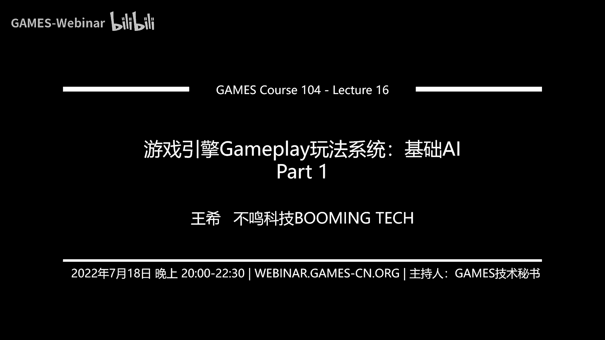
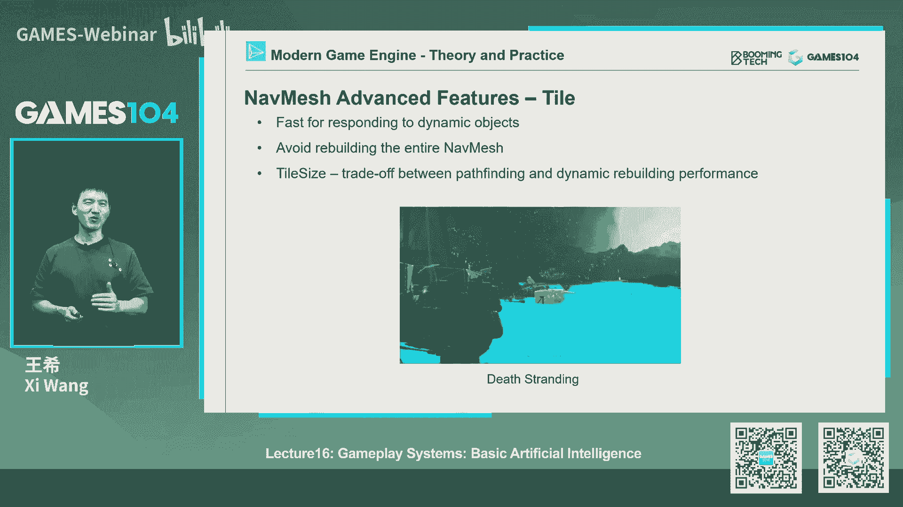
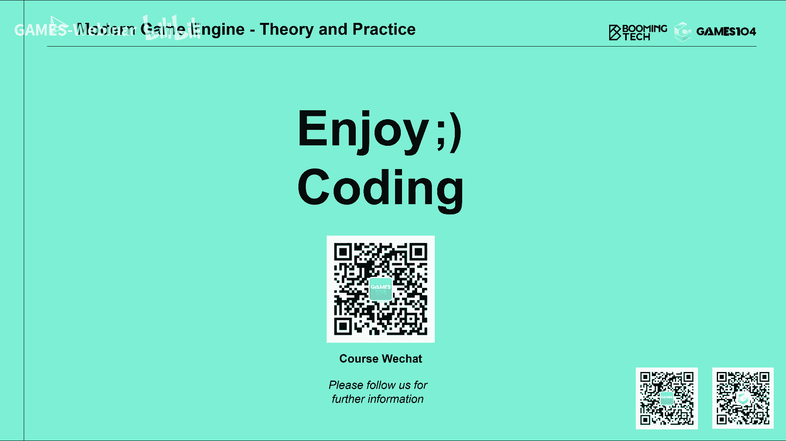

# 16.游戏引擎Gameplay玩法系统：基础AI (Part 1) ｜ GAMES104-现代游戏引擎：从入门到实践 - P1 - GAMES-Webinar - BV19N4y1T7eU

嗨，欢迎大家回到games4104，现代游戏引擎的理论与实践啊，我是王思，那个就是很高兴得了一周边大家见面了，那么首先的话呢就是在今天开课之前的话，跟大家讲一个好消息，我们的社区的T恤终于设计出来了。

那么这个T恤的话，我设计我还是非常喜欢非常喜欢的，因为我觉得这个T恤特别能代表，我们games104课社区的精神啊，我觉得大家到底为什么要学这门课对吧，我们不是为了找一份更好的工作。

也许吧找一份更好的工作，也许是这个我就是喜欢，那其实当时我们在想设计这些衣服的时候，我们想表达什么东西，我觉得我们就是游戏引擎的探索者，Gaimaging explorer，就是说我们只是出于好奇。

我们希望能够在一起去，进入到这个巨大的未知的世界，所以的话呢这些小引擎的那个logo，设计的这个这个T恤设计的非常有意思，比如说啊我们这两款这一款在这一款的话呢，我们在这个我们小引擎的logo上面。

是选了我们很多小引擎的代码，把这些代码放在上面，而且今天我们程序员还很认真的检查了一下，代码有没有写错哈，然后很怕上面写错了代码，然后呢还有另外一款是这样的，上面写的是说我很忙，不要打扰我。

我现在正在构构造世界，I'm building the word，那么我觉得这两件都蛮好看的，很干净，那么大家到底想要哪一件呢，对吧，那我们games104社区的精神是什么，就是永远是大家去挑选。

所以呢，到时候等我们的B站的那个视频上上传之后，我们会让大家那个弹幕你投票对吧，大家那个如果喜欢第一款的就扣个一，喜欢第二款的扣个二，然后呢我们会根据大家最喜投票投票是最高的。

我们去选择哪一款T恤做出来对吧，希望大家都很喜欢我个人，其实我两个都要，但是的话他们告诉我说必须得选一款啊，当然我会保密，我会我会告诉大家，我会选择什么，其实我哪件都很好。

那么就是说这些T恤做好之后的话呢，首先第一个就是说，我们之前参与我们小引擎命名的小伙伴，我们不是选了十个幸运的投票者嘛，那我们会给同学们寄过去，到时候麻烦大家联系我们课程组的小伙伴。

然后我们会把它的地址啊，这个通讯方式留下来，这样的话我们还把这个印好的T恤给他寄过去，另外一个的话呢，就是在我们每个星期的B站的那个视频下面，同学们留言，然后的话呢就是哎记得注意啊。

不要只是在抠这种无效留言，最好要写内容，就是说还是有点信息量的，比如大家有什么问题啊，或者对课程有什么反馈啊，然后呢我们会把这些就是有效的留言筛选出来，然后呢在中间会抽出十个我们的幸运的，咱们的同学。

然后呢也把小T恤送给大家，就以后就争取每一节课吧，我们都能给大家送出时间T恤出去，因为怎么讲呢，咱们经费有限，只能应时间，大家原谅我们，然后但是的话呢，我觉得就是说我们104课程的，每一件T恤的话呢。

都会就是呃怎么说呢，表达我们自己对大家的这个啊想法和意见，那么另外一个的话呢，就是说我们也希望未来能够偶尔，或者是什么时候我们会再做新的T恤，我们一件一件的小T恤呢，积积积攒起来时间久了。

其实已经也能形成我们自己的一个啊，一个小的这样的一个一个就是社区，也有我们一个很多很多自己的纪念品，所以的话呢这个是我今天特别开心的事情，因为我今天看到这些设计图的时候。

我的第一反应就是我也想要一件对吧，所以拜托大家选一件好看的，一定要选中我心目中那件最好看的T恤，然后的话我们一起把它拎出来，但是啊老规矩我是不能干预大家的选择的啊，然后呢第二个的话呢，就是也回答一下。

今天社区里的同学问我的一个问题啊，第一个问题的话，其实同学们在我们的那个学习群里面有满足，满足的问题，然后课程组的小伙伴还是蛮认真的，挑了三个问题，那我在里面给大家做一个我们的回答。

第一个就是有同学问我们说，诶，是不是现在的游戏逻辑，都是用这个component base的这样的一个架构，有没有其他更好的结构，那实际上的话呢就是写游戏逻辑的话，还真其实有很多种写法。

就像我们讲的时候，你硬生生的用C加加语言去写，你甚至用汇编去写也是可以的对吧，你完全用脚本也是可以的，但是你会发现就是说现代游戏引擎的话呢，很多时候大家会不依不谋而合的，都会选择这种组件化的方法。

因为这种组件化的方法呢本身也非常符合，就是说我们人类对这个世界的认知，就是我们看到很多东西，我们都认为这个东西有几大属性，几大特点对吧，每个人有几个不同的身份，比如现在我们很多同学都是什么斜杠青年对吧。

我我我又是一个这个程序员，那我又是一个个人的这个吉他手对吧，我又是一个什么户外摄影爱好者，所以说其实像这种component方法的话呢，它非常符合我们人天然的对世界的认知，然后呢我就可以自由的去组合。

另外一个呢它有一个很大的好处，就是说当我们的CPU，计算能力越来越并行化的时候，因为你把一个物世界的逻辑，拆成一个个组件的时候，它就特别方便并行化的同时执行，所以其实今天最主流的引擎。

无论是这个像虚幻引擎还是unity引擎，包括很多啊，就是3A大厂的引擎，都不约而同的采取了这个component base的方法，所以这件事情的话呢，就是说啊，就是我觉得这是一个行业的大家一个共识。

但是同学们如果有更好的想法，比如说嘿我们的下一代引擎该怎么去做，那我觉得会更好，我反正我个人会非常有兴趣，跟大家一起去学习和探讨这件事情，因为确实每一种结构它都有它的局限性。

computer其实它也有很多他自己的决心局限性吧，比如说它的效率就没有集成在一起的，效率要足够高，对不对，但是的话呢就是说呃，我觉得也许未来10年之后，又有新的结构会成为这个世界。

就游戏引擎结构的主流，那么第二个同学问我的问题是什么呢，就是说哎这个如何实现blue print的多人协同，我当时看到这个问题，就是我的第一反应就是一下子抓脑袋，我说哇这个问题太难了啊。

首先呢这个问题是一个好问题，因为确实蓝图会越做越复杂，然后大家真的想多人协同，但是我记得我在上一节课就讲过蓝图这个方法，就是visual graph的这个方法，有一个最大的问题就是他别说协同了。

连mg都很难，那么就是说因为你几个人做的蓝图，对它进行修改在一起很难merge，因为它是一种图的表达嘛，就像艺术家三个不同艺术家画了三幅画对吧，都说我们画一个，比如说这个这个这个画一个蒙娜丽莎。

然后说能不能把这三个画家到蒙娜丽莎妹，集到一起，形成他们三个人共同的作品，大家想想知识有多难，其实这就是高尔夫很难的一个问题，那么另外一个的话呢，就是其实在我们的现代游戏引擎里面。

很多东西他都是可以协同，举个例子，比如说我们认为像场景编辑，未来协同起来就很容易，但是的话呢就是说对于蓝图来讲的话，协同可能就非常的难，那为什么呢，就是说那个就是说，因为蓝图它跟场景有一个很大的区别。

是场景你把它做好了，放在这，就比如说我在那边放个房子，其他人就能看到一个房子，所以说所见即所得，所以大家协同就是我在做我的工作的时候，我能看到别人的工作，一眼就明白他在做什么对吧，你在那边放了一个房子。

他好那好，如果我觉得没有意见，我会在你的房子里面种棵树，我种树的时候，你我另外一个artist马上就能看到，对不对，那么他就会知道哦，我的房子的这个摆放被认可了，它是一个就是所见即所得的过程。

但是蓝图不一样，就蓝图我在这边拖一个控制节点，我拉出一个信号，其实除了做那个蓝图的人，本人知道是什么作用的话，其实另外一个比如说设计师，他很难知道它是什么意思，所以蓝图你要看到它的效果的话。

不是说看那个图本身知道的，你得执行它，而且呢你还得执行到那个特定的那个，那个那个那那个区域，而且呢还要在特定的环境下，你才能理解那句话是什么，所以的话呢回答回答这个问题的本身的话。

就是呃有我目前的理解是，我还没有想到一个方法，就是包括我在行业里面，好像也没有看到一个方法能够实现蓝图的协同，包括现在很多的这个就是优秀的游戏团队，他们普遍都在解决这个困难，就是说别说这个蓝图的协同啊。

就是一个人做蓝图，我今天做的，明天做的和一个月做的这个版本，时间怎么去管理对吧，好比如张三李四修了个bug要改一下，我怎么知道他改的东西到底是什么，都已经非常的困难，所以说呢。

这是现代蓝图系统一个很难的一个挑战，那么第三个的话呢，同学们问，所以这个问题我的回答就是，目前这个目前我们还没有找到一个好的方法，让蓝图的开发可以协同起来好，那第三个问题也很有意思，他就说诶。

我们能不能给我们的游戏逻辑的1event系统，设置优先级，哎这个想法非常的巧妙，其实设置优先级呢，在我们所有这种消息类型处理上面，都是一个很常用的方法，但是的话呢这个方法比较最常见的是。

比如像网络消息对吧，我一下子用过了很多消息诶，我有些消息要高优先级的处理掉，有些消息我要第一优先级的，这是一个很合理的方法，但是呢这就是目前在我们的游戏，game logic里面的话。

我们一般就是至少我个人的经验是，不要再给消息系统定义定义优先级，为什么呢，因为是这样的，就是说其实啊当我的一个TIK下去，我所有的game object产生了很多的消息，如果我们对它定义为一优先级。

其实就假设了我们这些消息先后处理的顺序，但是原则上来讲的话呢，就是这个就是那个publisher，SUBSCRIPTOR这样的一个pattern的话，当publisher发出消息的时候。

他不应该去假设谁来处理它，它也不应该假设哪些人应该在提前处理它，因为这样一旦假设之后，你的逻辑的耦合度就会非常的高，那么你一开始，如果你定义了这样的一个执行或处理顺序的话，那这样反过来就是说。

当我们把这个那个就是游戏逻辑，把它变得非常的并行化的时候，诶其实你大家都知道吗，就B性化，那个就是比如说我们的用B性化语言，开发一些一些算法的时候，你会发现它最难的地方是说，我并不知道同样一段函数是谁。

在谁之前去执行的，如果我们是单线程的话，大家很清楚的知道，执行完执行完函数A再去执行函数，B再去执行函数C，对不对，如果你想象的是ABC3个不同的event的话，那么一旦你的游戏逻辑开始并行化之后。

其实你并不能知道ABC的event是在那谁在先，谁在后续执行，所以当我们今天在架构，这个就是游戏逻辑系统的时候，我们一般不会假设，或者说我们希望他对这个order是independent。

就是说无论我的所有的event按什么，那个就是顺序执行它的结果必须是一致的，否则的话呢这就是我的系统设计的有问题，但真实的情况呢就是在游戏引擎结构中的，我们很多component是有一个。

有的时候会有个先后关系的，比如说我们假设游戏系统会把动物理系统，先去TIK对吧，然后呢再去TIK动画系统，对不对，然后再去tick什么AI系统，在早期的就是游戏引擎架构的时候。

有的时候我们会假设这样一个顺序，那事实上就会导致，就是比如说你一个物理系统的信号，那个会比动画系统，会比AI系统要略高那么一点点，但是呢在现代引擎架构里面的话呢。

我们也在探讨说这种order是不是都能打乱，因为当你扔给那个，就是就有那么多的核去处理的时候，很多时候你做这样的假设的话呢，是有点危险的，但是呢其实在现代引擎。

有些有些真实的这个practice里面的话呢，我们确实会做这样的事情，比如说我们要等所有的物理跑完了对吧，我们先fork出去很多很多的这个这个这个job，然后全部收回来，然后我们再让动画系统举报。

有的是什么，但是这个我个人认为呢，这还是一个不够彻底的一个B性化架构，所以回到刚才同学问我的问题，就是说你问的系统要不要收优先级，优先级收计算机本身是没有问题的，就是你但是的话呢如果你的整个系统。

它的这个就是它的正确性，是依赖于优先级去保证的话，那它会让你的系统就是它的1event，the publisher和他的subscriber，就是他的处理者之间的耦合关系过强。

这样不方便你的引擎继续扩展和结构，所以呃我们只能假设说，所有的event在下一个tick会全部处理完，但是呢他先后处理的顺序尽量不要做假设，那这样的话这个引擎的结构就相对比较鲁莽了。

这当然这是我个人的一家之言，实际上有可能有一些团队的时间是要加加，那个就是priority，实际上我们最早在设计一般的系统的时候，我们有过这个讨论之后，我们的结论就是还是不要设优先级。

因为一旦设了优先级，你就隐含了大量的假设，OK这其实啊这这这第三个问题，我觉得问的水平还是蛮高的，就是说当我们在设计一个，像游戏引擎这么复杂的一个系统的时候，你会发现你可以做的技术选型特别的多。

但这里面有一个原则是什么呢，就是就是decoupling，就是耦合度越低越好，也就是让系统各个系统的工作尽可能的剥离，为什么呢，因为这是个超级复杂的系统，所以的话呢如果彼此之间都不是黑盒。

就彼此之间都知道对方是怎么处理的话，那么这个系统它为来了可维护性，可扩展性，包括它的鲁棒性，实际上都会受到影响，OK好，那今天的话呢就是我们的社区的互动环节，到到这到这好。

接下来就回到我们今天的课程的这个正文了，就是game play系统的第2part就是这个人工智能诶，大家有没有注意到，今天我们的标题好像有一点点小的变化。

我们在artificial intelligence前面加了一个basic，哎今天这个玄妙在这地方，所以呢接下来我给大家介绍一下，为什么有这个玄妙，首先的话大家跟大家讲一个既是好消息，也是坏消息。

就是说我们在准备人工智能这一节课的时候，我们发现就是说我们写了180页，大家想想就是我们一直我们的口号是什么，Game，104的特点，就是这个课程组跟咱们的同学们比赛，谁更干对吧。

所以最近我们又干出了新高度，就是我们居然写出了180页的课件，干嘛，按照我们传统的经验，就100页的课程，我们要讲两个小时，那么180的课程我们要讲四个小时去了，对不对，那么更重要的一点，当然了。

我们有办法可以把180页的课件，压缩成80页或者100页的课件，但是当我仔细的读完了这个所有的内容之后，我发现唉真的是太有意思了，就是你大家知道，就是说我们前辈讲引擎讲了这么多节课对吧。

比如说我们讲物理，讲渲染，讲这些很多复杂的数学动画，其实啊，这一切都是为做一个有趣的游戏做基础的，那么做游戏引擎，做游戏最有趣的是什么呢，至少我个人是最喜欢的是什么，做这个AI这一部分特别好玩。

特别有意思，特别具有想象力，所以我看了所有的内容之后，我的感觉是什么呢，哇爱不释手，哪一个我都舍不得放掉，所以呢我就没有征得大家的同意，上上次做了一个主张，就是说我决定把AI拆成两节课。

就第一节课呢跟大家讲一些AI基本的东西，比如说如何做寻路，如何做导航，如何做这个CROSSROMULATION，就是群体模拟，如何做，这个就是环境的感知，包括一些基础的决策的算法，那么第二节课。

我想跟大家讲一些比较有意思的东西，就是现代的这个游戏引擎里面，那些一些更复杂的AI系统是怎么架的对吧，基于目标的这个这个这个AI系统啊，基于这个计划的AI系统，那么当然也要讲到。

我们大家特别关心的一个问题，就是说哎我们用人工智能深度学习对吧，能不能做我们游戏的AI这些话题，其实我自己也非常的感兴趣，我也会很喜欢，所以我在这里面我就决定夹带私货。

就是我想把AI这节课好好的准备拆成两节课，所以的话呢这个希望大家这个对我们有不原谅，我们的这个擅作主张对吧，希望求大家这个有这个不杀我们，我们的话呢就是说把这一部分分成两派，两派来讲。

因为确实AI它实际上是游戏性，一个非常核心的一个东西，那么就是说我觉得两节课讲一讲啊，还是里面有很多有意思的东西给大家去分享，所以的话这个是我们课程的安排，所以的话呢我们基本的课程安排可能会这样。

就是说这节课讲AI的基础，因为没有这些基础的话，你后面那些高级的AI系统，它全部是跑不起来的，那么下一节课呢，我跟同学们讲一些比较有意思的，比如说大家想了解一下。

比如说那个以前DeepMind是怎么去打星际争霸的，对不对，我相信同学们很关心这件事情对吧，那我们在下一节课，争取跟同学们讲一讲这件事情，那么这两节课讲完的话呢，我们相当于用整整一个section。

三节课讲完了gap的系统，然后呢在下下周的时候我们缓一周对吧，让让那个就是课程组稍微回点血，然后我们就进入到后面更有意思的，比如像网络啊这些东西了，怎么样，这就是我们课程组的安排。

到时候我们官网上的话也会及时的更新好，那前面这个解释对吧，解释就是掩饰，我已经解释的太多了，反正也就这么决定了，大家那个有砖头啊，有有有什么那个什么鸡蛋，西红柿就可以砸过来了，好那接下来我们言归正传。

就讲我们AI的基础，那么其实AI大家想想我在做一个AI系统对吧，我我要把我的小人做的特别的厉害，但其实啊你做AI的最基础的东西是什么，你要让这个小人在这个世界里面动起来。

大家想想看我们人在这个世界怎么动呢，我们觉得哦我看一看前面有条路，我就可以走对吧，我看见那个有上门挡着，我就过不去了，对不对，对于我们来讲，这一切都是非常的自然和本能，但实际上在游戏的这个虚拟时间里面。

比如说我们学完了所有的物理physics，我们学完了所有的rendering，我可以把这个世界的几何high five全表达出来，我也学完了所有的animation动画，我能让角色动起来。

但是其实呢这里面这个角色他如果想要有智能，他第一件事情是说我要能在世界怎么去运动，就哪些地方我可以去，哪个地方我不可以去，所以呢这就是AI的第一个foundation，就是navigation系统。

就是导航系统，那么navigation系统的话呢，实际上在游戏中是非常重要的，比如这里面我举了一个刺客信条，奥德萨的这个例子对吧，你可以看到就是当你从A点跑到B点，地上出现了一条导航线。

你就可以双手离开键盘，看着他走了，我记得以前我在大概是56年前吧，我们在这个，我有一次我记得我在看CDC的时候，有个老外设计师跟我讲了一个观点，但是让我非常的震撼，他说所有这个在游戏中有自动寻路的游戏。

都是垃圾网友对吧，他是我们的好的游戏，都是开放世界，都是你自己要探索的，然后呢我当时听完之后，我说哦明白了，懂了对吧，但是当我在那做navigation系统的时候，我觉得我必须要按照垃垃圾网格的做法。

就是说我必须要让AI它能够自动寻路对吧，你可以让玩家不自动寻路，但是我的AI总是要自动寻路的，AI是怎么聪明的知道在这个世界里面，我能找到一条路线的呢，这个事情看上去很简单。

但实际上它有很多的底层系统去支撑着的，那么其实讲这个navigation系统的话呢，你去理解它，它实际上有三个步骤，第一个步骤呢其实也是大家最容易忽略的，就是说这个世界我看见了。

并不代表我的AI能理解他，所以对这个世界的话呢，我们需要有一个表达对吧，你是用一个一个一个的小格子表达它，还你还是用一些点线面表达，他其实这个表达非常的重要，因为你只有了有这样一个表达的时候。

你才能够输入一个诶，我现在站在这儿，我要去哪儿，然后呢我在这个表达上面形成我的路径，Pass finding，那么但是这种寻路呢，他很多说理论上能找到最短的距离。

但实际上这个pass finding的话呢，它生成的结果很多时候是我们叫做ZC，就是说哎一折一折的，这里面的话呢接下来又有更复杂的算法了，就是叫past motion，就是把这个路径变得更加的顺滑。

看起来就像我们人，或者是诶一个小动物走的这个样子，所以说其实几乎所有的寻路系统，它都是由这三个部分构成的好，那我们先从这个怎么表达这个世界开始，那么其实啊这个世界的表达，我觉得最简单的一个表达是什么。

就是workable area，就是大家想一想，我我在这个地图上放了很多的NPC对吧，NPC在这个世界哪个地方可以走，那其实呢这个WORKPAI就是可通行的区域，是AI活动的这个场景，就是他的舞台。

所以这个舞台不是说我的美术把一个关卡，他就有了，不是的，实际上是要这个时候不是artist了，是我们的designer说诶，我们认为这个角色可以在哪儿走，那么它最基础的输出是什么呢。

哎比如说物理的碰撞对吧，你总不想看着NPC没事顺着墙，这就直接上去了，对不对对吧，还有就是说哎，但是呢有的时候你不是说遇到一个台阶，他就挡住了，其实有的NPC他可以还可以爬墙对吧。

它是有个climb的高度，比如说一米以下他都能直接越过去，对不对，那这个时候你要设一个可以爬的高度，还有什么呢，就是说有的地方有些小gap对吧，有些小沟其实NPC如果足够聪明，他可以跳过去的。

你想想知识是很复杂，我再讲一个更复杂的情况，就今天课程中我不会去讲知识，比如说在面前有一条沟，这条沟的话呢，它对于一个不行的NPC来讲，可能是不可通过了，但是如果这个NPC他骑了一匹马马可以冲过去的。

大家想一想，这个时候work for area，它是不是针对不同属性的这个那个NPC的话，是完全不一样的对吧，就像我们说一辆车它能通行的去和一个坦克呢，通行的去和一个士兵的通行区域，其实都是不一样的。

所以大家想想，就是如果想做一款好游戏啊，包括你想让AI跑的漂亮，它其实你们的细节特别的多，那么当然了，就WORKAREA，真的完全由这些基础的物理和行为的原则，决定吗，也不是。

比如说其实有的时候设计师会干什么一件事情，我知道我讲到这儿，很多同学们会觉得哦，我知道了，就是那个我最痛恨的叫空气墙对吧，就是我们玩很多游戏的时候，大家最恨的就是我本来想在这个城里面转转的。

结果你做了很多空气墙，包括我自己也很醉过，我自己做游戏的时候，我也被迫做了很多空气墙，我每次每每自己走到空气墙面前，当那行字告诉我说那个地方我过不去的时候，无论你跟我做什么动画表现，我心里面都很不开心。

对是的，没有办法，现在游戏引擎的话，就是至少在过去吧，他以很多时候很难把空间做的足够大，但是大家也看到了，就是现在做游戏最喜欢讲的一个概念，叫什么叫开放世界对吧，我们希望就是下一代的游戏。

再也没有空气墙了，所以说呢这些东西都是我们的一个期许了，但是就是对于寻路系统来讲的话，它首先要把我在这个地图上，所有能去的区域搞清楚，这个区域就是啊workboard area好。

当你知道了所有可以去的区域，那只是你设计师中间那个感觉，但是你没办法告诉计算机，对不对，计算机说啊，这张地图给你了，那哪些地方可以去哪家，哪些地方不可以去呢，计算机你没办法跟他交流对吧。

那计算机没办法跟他交流，我AI就没办法在上面跑，所以这个时候呢就来了，第二件事情就是你到底是用什么样的一种format，去表达这些workable area，那这里面的话呢其实有这个很多经典的做法。

那这后面我会详细的展开讲，比如最近比较经典的像微point network，就是路点的网络图对吧，包括你用网格的方法去表达，你也可以用这个navigation mesh的方法去表达。

那么就是这个寻路网格，寻路网格我待会给大家去讲这个东西是什么，还有什么呢，就是用A空间上的这个析出的八叉树来表达它，每一种方法呢都有它的优势和劣势，所以当我们去做一个引擎的时候，很多时候。

你可能被迫要支持一种以上的寻路算法，哎这个事情是不是发现做引擎就很麻烦对吧，当然你也可以偷懒说，我大引擎我不管这件事，你全部交给游戏开发组来解决，这件事情行不行呢，其实也是可以的对吧。

早期的引擎很多时候就是个渲染器对吧，他把那个机构管管，把渲染换汇出来，然后这里面AI怎么做，比如说如何确保这个NPC不掉到地下去，全是游戏开发组自己的事，这也是可以的，但是呢基本上来讲。

现代游戏引擎这个寻路的这个表达，是他一个标准的服务之一，好那我们接下来就仔细的去讲，就是说我怎么去用什么样一种格式去表达，这个workable area，怎么样对吧，AI首先把这个这个叫什么。

把这个这个地形搞明白对吧，都很麻烦好这第一种做法是什么呢，就是用露点的网络，其实它也很简单，这个方法其实在早期的游戏引擎里面，用的特别多，就是说有设计师说诶我放很多的关键点对吧，比如说这是一个桥梁。

这是门口，这是一个通道的走廊的两端，好在这些关键点中间呢我会插值很多的过路点，这个有一些算法可以自动生成一些过路点，然后呢包括一些就是说啊，我们可以在中间的话呢还加一些。

就是因为你的WORKERROR有的时候它不是一条线，我们可以再往两边再扩散一点点，这样的话我插入了这些点之后，形成一个网络，这个网络之后呢，当我任何一个这个点从起点到终点的时候，他的做法怎么样了。

首先哎从起点找一条这个路网中最近的一条边，我往那走，就是我要先走到这个路网上去，接下来我就顺着路往走，然后呢等我走到离那个终点最近的时候，我就啊终点也是反向投影，然后呢我去找那个点。

这个这个方法很像什么呢，它非常像这个地铁的网络图对吧，大家发现我要用地铁去交通的时候，是我的方法，我的solution是什么，首先所有的地铁站是不是连成一个个点，点和点之间，它会形成一个网络。

但是比如说我要从我的家去我的工作的地方，比如说我要去学校，那是可以直接对着路网去做吗，其实是不可以的，你首先得找到一个最近的地铁站，对不对，然后接下来顺着这个地铁的线路去走对吧，然后呢，等你走到一个。

就是离你那个就是学校最近的地铁站之后，你出来再从地铁站走到你的学校，所以这里面的话就是传统的路网的方法去生成，那么这个方法呢其实啊很古老，非常的经典，它的好处是什么呢，非常好的实现。

我觉得基本上我们所有的这个学过，computer science的同学对吧，有基础编程能力的同学都会写这个代码，然后呢，就是说它呢即使对它的运行效率也非常的高，因为它可以把一个很复杂的地图。

抽象的表象成一个网络结构，但是它其实一个最大的一个缺点，我认为就是你得艺术家，这个我们的设计师得上手，比如说这个地图经常会变化，但每次都得更新那个路网的图，有的时候做不好的时候，那个还经常就会出现。

路网和真实的那个图跟不上去，所以呢在现代的游戏中的话呢，路网的方法已经越来越少见，还有一点就是路网会产生一个问题，就是说你会发现NPC的行为，他老是会往路的中间去走。

就是你本来有很大的这个work for AI，但是呢除非你的路网的点撒的足够密对吧，但是这里面的话不可能靠手工伞，它可能有别的方法去撒，但是这个会让寻路又会变得特别的麻烦。

那么所以的话呢we point，这个network在早期的要求比较低的游戏里面，会经常用得到，但现在游戏中呢用的其实没有那么多了，但是你如果做一个简单的，比如说这个这个回合式战斗战斗游戏啊。

你这种用路网的方法其实也是可以的好，那么第二种方法呢也是非常自然的，就是诶既然路网把空间抽象成一个个点对吧，就相当于你表达一个人，你只是表达了骨头，他的血肉你表达不来了，那怎么办。

我就用一个个的这个这个grade嘛去表达他，很自然的，对不对，那grade的话大家想到最简单的方法怎么样，就是哎画方格嘛，虽然说你其实也可以用传统，但其实用传统的方法去表达，这种就是细密的传狗去表达。

这个可以寻路的方法，其实我现在非常的少，但是呢有的游戏里面他用那个六边形对吧，比如说像那个大家喜欢的文明文明，你们很多时候就用六边形表达寻路，但是呢我我它的底层我不知道怎么写的。

但是实际上六边形表达的时候在那个数据库里，就是在那个计算机存储去了，其实挺麻烦的，因为用那个square存储的时候，用一个array就可以很很容易成来了对吧，你表达六方形的六边形的。

它每次都要调一个一半一个，反正呢你说奇数行，偶数行，奇数行，偶数行，你稍微要做一个小错位的处理，但是这个我相信总是有办法可以处理的，所以的话呢那grade表达呢，它就非常的简单和直接了，对不对。

那我只要把所有的workable area，我用足够细密的小格子把它一盖上，诶，这个时候我其实就就可以在这个格子里面，去寻找我的路线，那么这个grade的方法呢它其实有很多好处。

它一个最大的好处是什么呢，你会发现就是你有任何的环境的物体，它只要做一个，我们叫其实很像render里面的光栅化，对不对，我就变成了一个个的ZAC的格子，然后我就把它可以通行的区域大致表达出来。

这个有个很大的好处是什么呢，就是我这个世界假设发生了改变，我去更新这个grade，其实非常的简单对吧，大家看一下，这里面我增加了一个障碍物诶，只是寻路网格瞬间就可以发生来了一个变化。

所以这是国内的一个非常大的好处，就是说它可以动态的更新，也非常好实现，而且呢非常好，第八个，其其实在我最早写游戏的时候，我每次都很倾向于把这个寻路用grade去写，太好debug了。

打印出来时间可以看得一清二楚，比如说可通行的用绿色，不可同频的用黄色，对吧啊，用红色，然后呢我走到哪儿，把那个格子标来了，一条线一条就连起来了，特别好debug，但是呢GRA的方法呢。

它其实也有它的问题，第一个问题呢，就是说它的存储空间是比较浪费的，那么包括呢因为它的格子呢，如果你想表达的世界比较密的话，你的格子的尺寸是不是比较小，比如说你很纠结。

说我这个寻路到底是一米乘一米的格子呢，还是这个这个2米乘2米的格子，还是半米乘半米的格子，如果你要表达方圆几十平方公里的地方的话，你会发现那个格子的数量，它本身就已经达到了上千万。

那么这个上千万的这个格子数据啊，你在这里面进行任何的操作，比如说你觉得你是往下走了一格，但实际上如果是上千万个格子的话，大家想想看它在内存中啊，其实是跳了很大的一步。

我记得我在前面讲RANDO时间跟大家讲过texture，对吧，为什么texture如果很大，它的访问效率就很低，不是说大了之后这个数据访问被困难了，实际上是因为一个我们在计算机里存储数据。

是一个线性的存储的，所以呢你如果是个二维的一个map的话，我往下走一格的时候，有可能在内存中跳了很大的一步，所以这个时候会让我们的各种cash很容易miss掉，所以grade的哈做寻路的时候。

无论是数据的访问，包括那么多格子去寻路对吧，一一个一个的寻路，它其实效率是比较低的，那么还有一个问题是什么呢，就是用great的方法，我很难去表达这种层叠结构，比如说举个例子，像死亡搁浅里面对吧。

那个诶你突然架了一座桥，那么桥下面你其实也可以走过去了，对不对，那桥上面你也可以走，那你用grade他就没办法表达，因为你知道这个地方可通行，但是你并不知道你是从桥上走过去的，还是从桥下走过去的。

所以这个时候呢就引入了大名鼎鼎的这个navigation，Mesh，就是寻路网格，这个navigation mesh呢实际上是一个啊，在现代游戏引擎中的话，一比最普遍的一个寻路的方法。

这个可以说是个标配吧，就是说啊基本上我们知道的很多的游戏，就是有一大部分嘛，其实用的就是这个方法，这个方法呢其实想起来非常的简单，就是说我把整个地图上所有可通行的区域。

用一个一个的polygon把它连起来，有的时候用STRANGO，有的时候是用一个那个就是突凸的多边形，把它表达出来，这样的话我在这一个个的凸的多边形中，走来走去，我就能完成寻路。

因为多边形对这个区域的覆盖啊，它不是一个点状或线状的覆盖，刚才讲的v point的方法是它的问题是什么，它对所有可通行的区域，是用一个点状或者现状的表达，对不对。

但是的话呢就是啊navigation mesh的话呢，它是一个面覆盖，所以这上面AI体的行为就可以更自由，比如说我一个一个小兵看见敌人过来了，他可以左右前后这个闪现啊，绕绕后啊，可以呀。

但如果你在微point时间，你会发现那个小兵就像机器人，就这样，哎哎哎哎就在往前就直走了，所以你可以是mesh的话，大家一简单一看，而且它还能解决刚才我讲的那个规则的方法，有很大的问题是什么。

就是说哎我如果这个就是啊，上面有两层结构的话，我只要在上面构建一层拓扑的，这个这个这个就是说连接过去的网，那个网格就可以了，当然了，这里面一旦有这种层叠结构的话呢，在几何学上有个说法，这叫非流行吧。

就当是流行manifold这个词就更有意思了，就是当时在我们寻路网格，大家注意它不是流行，它首先不是封闭的，第二个就是它有那种形状的结构对吧，大家如果学过几何学，就知道那里面讲流行的定义好。

那么其实navigation mesh的话呢，它真的是非常的直观，比如举个例子啊，这里面我看到一个地形是这样，中间你看到有几个凸起的高台，哎我们用navigation mesh生成算法。

它就能生成这些彩色的可通讯区，你会发现就是说上面那些高台，它好像就过不去了，这个其实就是它的很很妙的一个地方，那么negation mesh呢有一个小小的细节，就是说他可以是三角形。

也可以是个polygon对吧，因为就是polygon的话呢，实际上比三角形更省，因为你会发现很多可通行区域啊，它是一个类似一个矩形的区域，那你用三角形表达的时候，有的时候会拉出那种很长很细的三角形。

所以polygon是个好东西，但是呢polygon有个要求，就是当你寻路完之后，它会形成一个polygon的一个corridor，就是一个那个叫多边形走廊，那么这里面每个POLYON呢。

其实我们一个要求就是说它必须是凸的，那为什么是秃的呢，其实下面这个图就看得非常清楚，如果我们这个navigation mesh用的是凹多边形的话，那有可能就是说哎我认为这个A点到B点走过。

学习穿过这个破烂，但实际上它可能穿在这个可通讯区域，之外的地方，因为凹凸变形没有这样的一个属性，其实凸多边形还有一个好处是什么呢，就是你不是形成了一个多边形的走廊吗，大家看这个图上。

其实当我当我知道说这个人从起点到终点，他经过以下的1233号，三个的这个多边形的话，那么每个多边形时间它有且只有一个共享的边，那个边是什么呢，我们一般叫做portal。

就是说这个POR这个词中文怎么翻译呢，叫过道通道对吧，大家知道那个著名的游戏叫portal，对不对，也就相当于是说你从polygon1到polo2的时候，你有一个唯一的PO可以通过。

那么它不会出现第二个，如果凹的话，我就不能保证这件事情了对吧，那么到第三个也是一样的，所以说这样的话其实会让我们很多的寻路算法，包括后面我们会提到就是这个路径，这个smooth就是绕路径。

光光顺化的算法，都有很多地方可以利用到这个属性，所以这也是个很有意思的一个细节好，那么其实呢就是navigation mesh的话呢，其实是一个非常好的，现在也是比较成熟的一个方法。

那么它可以支持在3D的这样一个workbook，的一个space中间可以overlap，而且呢，因为他对很多可通行地区的表达效率很高，因为大家想象一下，比如说我有一个直直的走廊，比如说长100米。

宽50米，如果你用navigation grade，你用great去表达的话，你就算是这个1米1个精度，你想想看我们要用几万个grade呃，呃几千个grade表达它。

但是呢如果你有navigation mesh的话，很可能就是一个polygon，就把它全表达了，所以这样你寻路的速度就会快很多对吧，而且的话呢就是说呃他有很多的这个灵活性。

但是呢navigation mesh其实有两个我觉得比较有意思的，这个可以说是他的一个小小的短板吧，第一个是什么呢，就是说其实navigation mesh的生成是非常复杂的，今天在这节课上的。

我会简单的给大家讲一下，这个东西是怎么生成的，为什么我会跟大家讲这个算法，实际上现在有很多开源的库可以做这件事情，但是我还是希望大家知道它的基本原理，因为真实的在游戏过程中。

你的navision mesh其实你会就是它的生成，你会有很多的干涉的，就是你要确保它能够符合你的游戏的意图，所以的话呢很多时候就是开源库生成的结果，你要进行一些修改，你甚至要调整你们的参数。

所以我觉得你需要知道一些原理，才能让引擎变得更加的自由，那么第二个它的难点是什么呢，这个其实是怎么说呢，这个真的是给他找麻烦，就是说大家想想看，无论刚才我讲的v point的方法。

还是这个grader的方法，还是这个navigation mesh的方法，它都有个缺点是说假设我是一只小鸟雀，在天上飞，或者我是一架直升飞机的AI，是不是完全不能表达了对吧，大家想想看。

就是说比如说我做一个空战游戏对吧，我做一个比如说可以导航的自动机器人的游戏，那可以飞的这个无人机的机器人游戏，其实navigation这个前辈讲的三种方法，它都不能表达，这个当然不能怪它了。

因为你生成的就是一个二维空间的，一个可以通行的区域，你可以想象成我只能做蚂蚁，在贴着地走的情况对吧，那如果你可以飞怎么办呢，哎这里面只是简单提一下，就是说其实呢用这个就是sparse的这个OCTREE。

Walks the space，就是说我对空间进行八叉树的划分，把所有可通行的区域用一个八输出结构，就是八叉树的结构，大家知道就对空间不停的进行这种一分八，一分八，对不对。

但是呢如果这个区域整个都是连通的，那我就用一个很大的这个一个一个WORKO去表达，那如果那个地方是它的边界的话，那我就不断地对它进行细分对吧，大家想象下，这是一个非常简单的一个八叉树结构。

其实我是能够表达一个3D空间的一个课程序，所以今天如果我们要做一个，比如说那个太空空战游戏，或者说一个你操纵的无人机，在一个大峡谷或者大隧道里面，我去这个进行空战模拟的话，包括我的AI有很多行为的话。

其实那个时候你对空间的表达，可能需要用这个技术，比如这里面取的是著名的eve的，这个这个1V1对吧，eve的这个案例，那么义务里面很著名的很多太空的空战的话，它就需要这样的一个表达，当然当然对啊。

这应该不是义务的主体，但是意思就是说，很多时候你对这种空战游戏的话，我们可能需要这样的一个表达，OK但是呢这个space walks treat的话呢，实际上它的算法并没有那么复杂。

就是你就不停的去求教，然后呢如果发现哎，在这个walker里面有其他的这个ACLUDE，那你就对他进行进一步细分，直到它要么就没有了，要么就是它的误差度，小于你给的一个阈值就可以了。

但是这个它的这个这个算法的，一个很大的问题是什么呢，就是说他的这个就是存储的，其实是挺废的，那么另外一个的话呢，就是说啊在上面寻路的话其实也挺麻烦的，OK在这里我们就不展开了，好。

那么其实当我们对这个世界啊，有了一个表达之后，下一步是什么呢，诶我没在上面寻路了，那就你们刚才讲了，说我们又有grade的表达对吧，我们又有这个v point的表达。

我们又有这个navigation mesh的表达，但是呢其实大家会发现一件事情，就是说无论你用什么一种方法，这三种表达都有共同的点。

其实他无论是navigation manimesh里面的每一个POLYG，还是grade里面每个grade的点，你把它的中心点放在这，你会发现它和它周边的连接关系，其实会形成一个graph。

所谓的寻路呢其实就是在graph上去找一条路径，就是我知道了一个起点，我知道了一个终点，然后我知道他每个连接关系我要走多远对吧，比如说navigation mesh里面。

我从a polygon走到BPOLC，加装简单一点都都是从他们的中心去走，那我其实可以知道它的距离对吧，那好那这样的话我们事实上就可以算出来，说这个他们的那个路上的这个距离是多少。

那所谓的寻路问题是不是就解决两个问题，第一个问题就是说我要找到一条可通达的道路，让我从起点能够走到终点对吧，这是一个must的一个问题，就必须是准确的告诉我yes和NO，那么第二个问题是什么呢。

我要尽可能的少走弯路，少走回头路，对不对，我要尽可能的就是找到一条相对近的路，那为什么这里我要讲一个词叫尽可能呢，哎这个就是游戏设计或者游戏引擎，一个很有意思的一个点，就是说在数学上。

我们很多时候会追求一个叫最优解对吧，但是呢在游戏的这样一个交互事件里面，很多时候我们希望它的行为看上去正常，那么这个时候也许一个看似合理的解，就可以被接受，这就是我后面会讲到它的具体的算法的时候。

会会讲到这个点，那么首先的话这个问题啊，他就是个标在一个标准的叫做这个就是双向的，就是没有方向性的，这样的一个有环的这样一个图上面，我怎么去寻找这个一个寻路问题，这个问题实际上是一个非常的这个研究的。

非常通透的一个问题，这里面的话呢就要这个以，它本质上是个搜索问题，那么我们在学数据结构的时候，我们学搜索的话呢，其实有两大这个门派对吧，一个叫做深度搜索，对不对，深度搜索就是找到一个时间点，一头扎下去。

直到我扎到这个底了，发现我还没有到我的目的地，怎么办，我退回来一层层再往上一层倒着地归来退，就是要深度优先，我们以前我记得我在大学学数据结构的时候，会告诉我说深度硬件是什么，是要用时间换空间。

那接下来另外一个跟他这个对应的什么，就是广度优先对吧，就是我就不停的扩散开来，把我的每一个时间点全变了，让时间点再往他的孙子节点去便利，这样的话我用空间换时间，但其实我觉得这里面也是有问题的。

好像我没觉得时间一定要长，但是呢广度搜索呢，它可以就是说啊，感觉上能够尽快的找到那个最优解，所以的话呢就是，所以说其实整个搜索的核心就是两个算法，但是这两个算法能不能解决，刚才我提出的那个问题呢。

其实是可以解决的，但这两个方法都有一个共同的特点，就是他们其实是比较费，在很多时候我们会找出很多没有必要的路径，而且的话呢，就是说我们要要找那个最优路径的时候，其实广度优先算法是可以保证的对吧。

但是的话呢深度优先算法，因为它可以把所有的路径全找了一遍，那么深度优先的话呢，其实你先找到了一条通路，并不代表你能走过去，如果你整个便利一遍的话呢，你才能够比较受很多所有可行的通路，中间最短的这条路。

那这个就是说所有的available，就是说所有符合我要求的路径的比较，本身无论是深度优先算法还是广度优先算法，本身都是比较废的，所以这个时候呢，就引入了这个大名鼎鼎的这个迪杰斯塔算法，对吧。

这个这个老哥的还是非常厉害的，是我们的算法大神吧，就是我都不知道他自己怎么会想到，这样一个算法，就是说哎对于这样的一个就是A点到B点，最短路径的方法，他提出了一个便利方法，是非常有意思的。

就是说他首先把所有从A点出发的，这个其他的零点，都就是到那个就是A点的距离都设成无穷大，然后呢这个算法讲起来就比较比较细了，但今天我在这里不展开它的核心的想法，我给大家复述一遍。

就是说他先把所有的顶点看成是没有访问过的，然后呢从起点开始把他所有的邻居全访问一遍，然后呢跟邻居看，就是这个邻居如果以前被人访问过，他会告诉那个上面会存储，说哎我当前知道从A点到那个我的这个。

比如说我们到C点的话，我的目前找到的最短的距离是多少，他如果只要有人反问，他肯定就不是无穷大，对不对，那么他就比较说我从我新的这个点出发的话，到你的距离是不会变得更短一点，如果是更短好。

那我就把你那个路径只更新一下，然后呢把你的这个previous引擎的上节点指向我，然后呢，这个时候我的这个点我做完所有的扩张之后，我现在在所有的没有被访问过的点里面，去找一个这个距离值最小的那个点。

再从那个点开始去访问所有的点，这样的话以此反复循环反复循环，直到我把这个destination那个点给他做了一次，这个一直到那个destiny那个点，destiny点也要做一次这个explore。

然后我就知道了，就是从十几点到终点之间的最短距离，这个算法其实很有意思的，就是我我今天在这个备课的时候呃，我自己看这个伪代码是非常好理解的，但是我在每一次尝试去讲它的时候，我就发现讲起来很抽象。

但是这个算法呢你仔细看这个，我给大家看一段视频啊，这个视频可能会讲的更清楚，就比如这时候你从A点出发，然后呢，他把他邻居DC点和F点都比较了一下距离，然后他这个时候发现的最小的，这个没有访问的点是F点。

它是二，我再从F点出发，我去把所有的我能访问的凝聚点全访问一遍，这个时候呢我就会把我的A0聚点G点对吧，零基点这个B点，你看B点其实是终点，但因为B点的时候没有被访问过，所以呢B点还不能够认为。

这个这条路径是最短的路径，然后呢我再比较下C点，C点也没有问题，这时候再比较一下，就是所有这些剩下的点中的话，距离最近的是C好，从C点再出发，然后呢我再去找我C点周边的点，你会发现哎我就知道到地点。

目前我能找到最短的距离是7~1点，我会发现从C过去一会儿是更近的，我就呃我就会说我就意识到，就是说其实从C到E是E跟进的一条路，这时候我就把E调成四了对吧，这时候我其实找到了一条路径，就是到E来讲的话。

最近的是四，然后呢这个时候我发现距离最近的是这个E，然后啊然后我从E出发的话，我发现B这时候可以更新到六，好，没问题好，这时候我的终点呢其实是B，我从B点再去一看的话。

发现这个距离其实已经没有什么再扩张了，这个时候我就知道我既找到了我的终点，同时呢这个算法它可以保证，就是说你找到的距离它是最短的距离，但这个算法呢它有一个小小的一个注意点。

就是说我们每一次去访问的时候啊，我们存的都只是他到这个，就是说起点我们知道的最短的距离，其实你并不知道是来自于哪一个方向的，这个距离，这个路径是最短的。

所以呢你要存一个东西叫previous vertex，就是说我这个时候我F上记录的，我最小到起点的距离是二，但是呢我的前导节点是A对吧，那么E我到A的最短距离呢是四，但是呢我的前导节点是是C对吧。

你顺着这个就这个这个这个有向那个无，应该是个有向无环图吧，那么你其实就能规划出整个路径去来了，这里面是这个算法的一个小小的细节，其实这个算法的话并不难，大家对着这个动画。

其实很快就能理解到他的这个这个方法，甚至你自己可以写一段代码就可以实现了，这是我们在学图论的时候对吧，学计算机数据结构的时候，一个最经典的一个寻找最短距离的算法，这个方法好不好好呀。

而且他肯定是比盲目的深度优先算法，和广东学习算法的话效率更高一点，但是诶这里面有一个有意思的问题就来了，就是说对于我们的游戏这个case里面的话，我们并不需要找到那个理论上的最优解，有的时候。

甚至你会觉得那个最优解看上去不真实，比如说我把你放到一个城市里面，我给你一个起点，给你一个终点，你觉得我们人会像计算机一样，很精准的算出他所有的作业路径吗，其实我们人做不到的对吧。

我们只能是说按照大致那个方向去走，这个时候呢，我们其实脑子中一直运转的是什么呢，是个启发式算法对吧，就大家如果以前在学这个数据结构的时候，会经常知道这种叫启发式算法的用处，那么其实这里面的话呢。

就引入了大名鼎鼎的A星算法对吧，那么A星算法呢它的特点是什么呢，它其实啊，它就是基本上是基于这个低阶的算法去做的，但是呢它引入了一个启发函数，就是说当我走到一个点的时候。

我不仅考虑我过去花掉了多少的这个路径成本，我还猜一下说从我现在这个位置到我的目标点，这个还要走多少距离，但因为你那边，你从你现在出发到你的这个destination，其实这个路径你并没有搜索过。

所以你你你算不出来，对不对，怎么办，你是猜诶，这里面这个启发函数就非常重要了，再举个就是，所以说所以说呢刚才我们在第一时段上网里面，我不是算了一个cost吗。

那实际上这个cost就是以前是用那个经典算法，算出来的那个实际距离之后，再加上一个启发的距离，所以这两个距离合在一起就形成了每一个点，就是比如说我现在找到了，比如说啊有六个到七个。

我们的顶点还没有被export过，那么当然它的值呢都不是无穷大，那我会优先选择那个，就是现在已经走了距离，再加上我的这个我估计要走的距离，这个更这个就夹在一起，最近的那个点由从他那个点开始优先搜索。

而且呢它A星还有一个特点是说，我只要走到了目的点，哥们儿我就不干了，不会像那个，就是就是不会像那个那个就是低速大，传统算法是说诶我虽然explore到了我的目的点，但是呢我只要啊。

我虽然已经reach到了这个目的点，但是我只要那个点没有被这个explore，那我就还是要继续搜索这个算法，它就完美的在这中间找了个平衡点，那么其实它非常的简单和直觉，举个例子。

比如说在一个网格状的这样的一个世界里，比如像曼哈顿的地图这种这种情况下，那启发式算法的话，那就用最简单的这个棋盘格的距离对吧，从我现在走到这一点的XY对吧，到我的目标点的XY时间，算X1减X2的绝对值。

加Y1减Y2的绝对值就是它的距离，这个距离一定是理论上最短的距离了，不会跟进了，对不对，那么如果你是一个navigation mesh呢，这个问题就比较复杂了。

因为在navigation mesh里面的话，我想是虚寻路，出来了一个叫polygon的走廊的时候，这个大家去想一想，其实我现在找到了，说我要从这个我要从A点到B点对吧。

我这个起始点终止点我已经走过这些POLA，但我的路径到底是怎么通过呢，大家最直接的做法是什么呀，我会把他的那个所有polygon的终点，中心点连起来，对不对，但是呢大家会意识到一件事情，就是说。

当你把所有polygon的中心点连起来的时候，你会出现一个情况，就是它的连接线可能会超出那个破灵感的距离，所以在工业界里面大家会普遍用什么呢，用polygon和polygon之间的那个棉公共边。

就是刚才我讲的那个什么portal，我把所有POR的终点诶连接起来，形成了一条路径，那这个路径连到一起的距离是什么呢，诶就是我当前的这个我的成本是多少，好，那接下来说我当前到了这个POLYGA。

我到了这个点了，那我从这个点出发，我再到那个目的点有多远呢，大家想想，如果刚才说grade都要去算一个XY的偏移对吧，那在这个这个navigation mesh上我怎么算的诶。

这个时候就有一个很流氓的算法了对吧，首先给它取了一个非常高大上的名字，这时候他的启发算法就是一个欧拉距离，就是我假设你能直线过去，大家发现这这是不是很不讲道理对吧，你看刚才我举的两个例子。

是你搜索到这两个端点，然后呢你算那个它的H的时候，你直接用两点之间的连线了，对这个算法是很粗暴，但是呢确实因为在navigation match里面，如果没有阻碍物的话。

你真的就是走直线就可以直接走过去了，所以呢因为对未来的事情我并不知道，所以我只能做这样的一个假设，因为它本身就是个启发式的算法，但是呢他确实会引导你尽可能的去避免，比如像这个图上的例子对吧。

上面那个点和下面那个点很明显的，就是下面那个点他已经走过的路径，再加上我启发算的那个路径的话，他应该会进一点，对不对，所以说你会优先的去走，从下面那个点去出发，去往外去搜索，大家凭直觉去感觉一下。

是不是这个A星算法收敛的速度会更快，所以这也是为什么，就是在这个就是现在的这个游戏中间啊，A星算法是一个最经典的算法，就是无论你是用grade，你还是用navigation mesh。

你还是用其他的表达对吧，包括微point的表达，其实A星算法都是大家最普遍采用的一个算法，那么这里面的话呢，就是有一个，我们用direction Mac做了一个小小的例子。

大家可以看到就是说诶我从起点出发的时候，我会尝试所有的neighbor的这样的一个POLA，然后呢我去找那条感觉方向最正的，然后我再继续往前捅，那这样的话其实你就会很快的逼近你的几点。

而且在游戏的这个场景中啊，很多时候A星它真的几乎让你没有展开，没有迭代的一根线，直接就冲向目的地去了，因为在游戏中很多时候你从起点特别是AI吧，很多时候从A点到B点的时候呢，它们中间没有障碍物的。

大家想想看，有障碍的情况其实不多的对吧，所以的话呢，这个时候A星算法的效率，会远远的超过那些经典的算法，这也是让大家理解，就是说游戏引擎它在做算法的时候。

他永远是在效率和结构时间找到一个balance好，那么其实呢这里面讲一个一个很有意思的，一个别人的经验承担这个这个经验，说实话啊，我自己用下来，我感觉是我用的经典的算法都还差不多，但是呢有人分析过。

他说呢就是说如果A星算法，你假设对这个就是啊heuristic，就是对未来这个距离的估计，估计的过低的时候呢，你的这个算法的迭代速度的，会这个就是说比较慢，但是呢你很更倾向于找到它的最短路径。

如果你对未来的这个古迹呢趋向保守，就说我总是要走很远的路的话呢，这时候迭代的速度会比较快一点，但是呢他的这个就是说，你不太容易找到最短的路径，但这个结论说句实话。

我没有看到任何的scientific的证明，所以说呢这个地方只给大家做个分享，这也是就是说，也就是说，其实大家在我们知识的游戏引擎时间中的话，我觉得用刚才我讲的那两个方法基本是够用的。

也能得到你想要的结果好，所以这是寻路的最核心的机制，想到这儿的话，大家基本上就形成一个闭环了对吧，我知道怎么去构建一个great v point的那个network。

或者是一个navigation max，然后呢我用A星算法，我基本上就能解决，我在这个课程一开始抛出的问题，就是我一个小机器人，在这个世界里面到底该怎么动，我是知道了诶，这里面的话呢我就这个再讲。

他的下一步就是你觉得你找到了一条路径了，对不对，这个机器人动起来的时候会让你特别在great上，这个机器人给你的感觉是什么，就是ZIGZAC，就是这样呃呃呃就是就是大家想想看，如果他沿着七哥走。

是不是这样的，那么如果沿着这个navigation match的中线走呢，它是不是好一点的，会稍微好一点，但是大家看这时候行车的路线，你是不会觉得有点怪，对不对，明明我们人如果要从A点。

从那个起始点到终点的时候，我们看到那个corner，我们会贴着那个那个拐角转过去，对不对，但是你会发现那个机器人很笨，他会往前走那么一点点，突然转了一个将近90度的弯，再转上去。

这个时候你觉得他是不是很像机器人，所以这个时候呢就要引入到我们的寻路的，第三个也是很重要的一趴，叫什么呢，叫pass mooth，就是让那个机器人用起来走起来，好像是它就像一个弦一样，我把它绷紧。

就是把很多无效的运动尽可能的把它给踢掉，那么这个算法pass moon怎么做呢，其实无论是grade还是这个negation match，其实他用的方法都有个很经典的算法，就是那个final算法。

final算法，final这个词是什么意思啊，叫烟囱算法对吧，这个这个名字非常有意思，很形象，但是算法其实本身比较复杂，有很多的细节，那我这边呢跟大家去讲一个，就是它最简基础的原理是什么。

就是说其实呢你当你在你的起点的时候，你看像你下一个连接的那个这个那个POLYGA，或者是grade都没问题，你们肯定有一条公共的那个portal那个边，那你用那个公共的边呢，你就形成了一个扇形区域。

对不对，好，你就去看说诶，我下一个polygon，是不是完全的在我的上行区域的包围里面，如果是yes的话，说明什么问题，说明就是说从我这个点出发呀，我一定要找一条捷径去逼近我下一个坡头，否则的话呢。

如果我沿着这个边走，或者沿中间走这个路径是不是最优的，这个时候呢你就开始去看，说诶我我这个port之后呢，因为你的polly can corrido，就是那个多边形走廊里面它是有顺序的嘛。

1234567对吧，所以PTO其实有顺序的，你现在看PO1啊，我形成了一个扇形，对不对，如果port1形成的扇形，把这个POLLY感二全包括进去了，那好我就看port2，那坡道的话呢。

你就左右的尽可能贴近它，就这里面的数学上描述起来比较复杂，但仔细给大家从这个图上看出来，就是说我把这个扇形的区域变得更窄了，所以就意味着什么呢，就是从我的这个点出发的话。

他一定是走那个上行这个阴影区域的一条路径，肯定是最最直接的，对不对，好，我们再去比较说，通过这个pola portal2去收缩了这个烟囱之后，这个新的这个扇形的烟囱，它能不能覆盖我的POLYGM3。

那么这个时候你显然会发现诶，好像我已经覆盖不了了，那这时候就说明什么呢，说明你已经要拐弯了，因为你如果不用拐弯的话，那你可以直接再往下走好，这个时候我们就要在这个两个夹片中，选一条边去贴近。

那这个方法其实也很简单，就是说我们去看这个pol3的话，到底在我这个烟囱的左侧还是右侧，它注意这里面，因为你是凸凸变形，它只可能在你的左侧右侧，比如像这个case里面，它在我的这个左侧。

所以你会发现我沿着绿色的边走，它的距离是最近的大，所以这个算法大家如果看算法描述，会非常的复杂，但是呢用几何学算法去理解它的话，就会比较直观一点，其实呢这个时候你就可以从新的点出发，继续往下走。

那直到呢你这个时候，比如说你现在当前的这个点，你又形成了一个新的这个漏斗，这个烟囱你发现终点就在你的烟囱里面的话，这个时候说明什么呢，说明你已经不用care，你这个时候还要经过多少个polygon对吧。

你可以直接在你当前的这个拐角点，连一条直线到那个终点去，那你这条路径就是你能找到的最优路径，所以大家看在这个例子里面的话，你要经过多少个polygon对吧，122 3456789十。

将近十几个POLYG，但是你会发现当我经过了pass moon之后，我的整个路线只拐了一次弯，我就可以直奔我的终点，所以这就是final算法的一个很精髓的东西对吧，很有意思，这个写起来的话呢。

实际上啊不像我讲的这么简单，是特别容易写出各种各样的bug的，我再给你们讲一个比较有意思的东西，是这样的，其实我们在给大家画这个，final算法的示意图的时候，很多时候我们画的是个二维的对吧。

大家看得很清很清楚，对不对，但是大家记得我们讲navigation mesh，一个很大的好处是什么呢，诶它能表达三维空间的top结构对吧，那么所以呢这个算法。

当你真的在游戏引擎的这个DEBUSHMASH用的时候，你是需要作为一点小小的优化和改进的，因为那个这个时候，这些三角就之前navigation的polygon的话，它们实际上是不共面的，对不对。

那这个具体怎么展开，怎么预算的话，同学们如果有兴趣的话，可以去研究，但是呢基本这个大的方向，这个大的方法没有什么太大问题，它实际上我们是要把那个东西给拍平的，那这个具体具体算法的话，同学们可以推演。

大家可以先从2D的写起来，这个算法其实蛮有意思的，就是你写完之后啊，你一步步的假设你会简单的open jdx，把它VISU来了，你感觉就会非常有意思，而且很像你的小机器人走一步。

然后呢你面前有个小雷达射线去扫描，发现我左边有个墙，有个拐角，右边有个拐角好，我开始选择贴一边去拐，然后最后我寻寻出了我这条路，所以虽然我今天给大家讲的是，一些非常数学的一些东西啊。

但其实它已经越来越隐隐的逼近于，我们要这个讲的这个就是我们的这个游戏里面，NPC的一个智能行为，因为整个智能行为的基础，其实是基于这些数学的表达好，那接下来呢就跟大家讲一点点高能的东西了，对吧。

我们其实从rendering结束之后，是我我的印象中，好像没有讲过特别复杂的数学问题哦，好像在讲物理的时候，讲了一些比较复杂的数学问题，那这个地方呢会讲一点点的，这个比较复杂的问题。

就是说我给你做了一张地图，我们做了一张地图，它的navigation mesh到底是怎么生成的对吧，比如说像我们的游戏团队，就今天我讲的这节课的话，其实我觉得不只是对于我们的这个就是游戏的。

这个就是程序写游戏引擎的这个技术的同学，其实对于很多策划同学都是很有帮助的，那么就是大家会很奇怪，就是为什么我们很多游戏里面有很多的bug对吧，比如说你经常可以看到一些机器人，一些NPC或者一些bot。

我们叫bot就是智能体傻在那了，其实因为navigation的mesh生成这件事情，其实是很复杂的，因为当我们的艺术家在构建这个世界的时候，他看的是美，看到了很多的这个视觉啊，转转角对吧。

但是交给计算机的时候，我怎么样呢，生成这个navigation match，那么对于一个小的关卡，当然我们可以说我们的地策划，自己去拉这个网格对吧，其实在最早期的引擎的时候。

真的会让设计师在美术的帮帮助下，在那个3D max maya里面，把这个寻路网给拉出来了，但是呢，现代游戏引擎基本上都是用自动化方法生成，那么最著名那个开源库叫什么叫recast，这是一个啊。

我如果没记错，是个MIT的一个同学自己写的，这个这个库其实在行业里还挺有名的，那么它的基础是怎么工作呢，为什么，其实它分成这么几步，第一步呢，他把整个世界先vocalization变成体式化了。

然后这个时候呢，你整个世界变成了，像一个MINECRAFT这样的世界的时候，我的预算才开始变得可以进行下去，那这个时候呢它的第二步是什么呢，就是我要在这上面标记出我的NPC。

或者我的bot能够通行的区域，就像这个图上面的，你会发现我把空把这个世界提速化之后，那些蓝色的WORKO就表示我可以workable error，那这个workboard error怎么算出来了。

其实就像我们前面讲的原理，就是说哎它相邻的那个worker，时间的这个垂直的距离不要相差过大，比如说你向上向上爬坡的时候，它有个叫maximum slope，就是说你的这个坡度不能太大。

大家还记得我们在讲物理的时候，讲那个control的时候讲过，就是说当我们控制自己的角色爬坡的时候，它有一个叫最大的一个爬坡角度对吧，有的时候你会设置成60度，有的时间设置成45度对吧。

其实各种角度你都可以设置，但是呢这个maximum slope又会在寻路中有作用，因为寻路中我要知道哪些地方是峭壁，我上不去，哪些地方，中间它又断开来了，那这样的话。

我们把这些所有的WORKPA是给给它标记出来，而这个时候的话呢哎有个很有意思的算法了，就是我们会把这些所有的WORKBOARD的这些WORKO找到，所有的age worko，什么叫age worko呢。

就是说它不是上下左右都有地方可以到达，它中间只要有一个邻居，我是不可到达的，那好，那我就认为这个H那个H是不是很容易就DK，这其实叫age detection对吧。

我把很多都在边缘的这些vol给给识别出来了，然后呢，我在这里面的每个WORKO去生成一个什么呢，生成一个叫distance field，distance field这个概念，我在前面好像讲过好多次对吧。

这个其实是在现代游戏引擎里面，非常重要的一个概念，无论是做rendering对吧，你做这个啊这个这个这个animation，包括做这个particle对吧，包括今天我们讲了这个做这个这个AI寻路。

其实包括一些AI的行为，这个东西都是非常有用的一个概念，他这个想法很简单，就是我在里面每一个WORKO，去找离他最近的那个A级WORKO，就是最最近的边，那么你会发现就是说越靠近中心区域的话。

那个地方它的距离是不是越大对吧，那好我们呢就用一个很简单的一个洪水算法，就是我把这些所有的local的这个距离，最远的点找到，以它为种子，就有点像我们之前讲的warning算法一样的，往外扩散。

这样扩散扩散，大家在一起交叠的时候，是不是就完成了对所有worker area的一个空间，的一个婉儿，你划分了对吧，这个算法其实你会发现，就是说所有的算法它其实都是通的诶，这个时候呢你就可以得到了。

这样的一个对空间的划分，大家看来了，这个是不是很很很那个很自然，但实际上他好呢，这里面其实还有一个小小的细节，就是说当我发现我这个在扩散的时候，诶，如果他的有一个WALKO和我的那个WORKO。

时间的话呢，它出现了flipping，什么意思呢，就是说啊我转着转着转着，我自己转到自己的下面去的时候，这个时候我要对它进行打断，其实这里面还有很多更细节的一些处理啊，但简单来讲的话呢。

我们会尽可能的把这个空间分成一块一块的，看起来像凸的这个区域，然后呢，我们基于它生成一个个的POLYGTO的POLA，但这个从这一个个的这个就WORKO的区域，变成这个POLYON了。

其实这个算法是比较复杂的，我本来我们课程中准备了，后来想想哎呀，这节我们的104的课程，核心不是讲那种硬核的数学算法，所以我们就不展开，但是同学们知道，就是说如果这个东西写起来的话，会稍微有点小麻烦。

但是呢很感谢有开源库，帮我们把这个问题给解决掉，所以说大家可以看到就是说我们给你一个地图，我们很人眼，可以很快的在几秒钟之内找到，所有的这个就是workable area，并且我们可以快速的就是把这些。

用polygon的方法把它大概表达出来，但是交给计算机做的时候，这里面有很多部算法一步步的做，而且每一步啊它其实都很可能出错，所以其实大家在做这个navigation mesh的时候。

很多引擎它是作为一个标准操作，但是呢我们一般都会讲，就是说你还是要提供一个工具，让设计师能够修复它，能够万一里面有些错误，但这里面有个更有意思的一个问题是什么呢，就是说哎当设计师修好了一个寻路之后。

当美术这时候又说哎，我对地图进行了一个小小的更新，你要把这个整个navigation mesh要重新生成一遍，对不对，那好了呀，那你上次那个修复就整个彻底失效了。

这其实也是navigation mesh一个很大的一个挑战，就是说他的每一次generate他没有办法继承，他只能够就是说重新生成一遍，那这个时候如果人上手的任何一次，这个修复的话都会无效。

所以呢这也是这个方法，它的一个很大的一个周边，OK好，那你其实这个这个方法，其实navigation mesh是一个非常有用的方法，可以大家可以认为就是说，在现在的很多游戏里面，这就是个标配。

而且这个方法为什么还好用，它还有一点，就是说你不是生成了一个个的三角形吗，其实我可以对这个region进行一些更多的控制，比如说我可以把不同地表材质的这个region，可以区分开，比如这是个草地对吧。

这是一条河流，或者这是一个沙地，那我可以在上面加上一些，polygon的一个flag，就是说我可以打上标签，这样的话走上去我可以让它产生不同的生效，不同的这个粒子效果，甚至我寻路的时候。

我可以选择什么优先，比如说啊，我假设这个水陆两栖的这样的一个一个，一个一个生物对吧，那我可以直接沿着河就直接过去了，走直线，假设呢我只能在路上走的生物，我寻路的时候，我可以把那些所有表达河道的。

就或者浅河滩的那个区域，把它直接变那个区域变成不可不可通行，所以说呢其实在真实的游戏里面的话，一般设计师都会去标记很多的polon flag，但这个flag的话其实就比较复杂了。

很多时候我们不会直接让设计师，在生成的navigation mesh上标，我们一般会让它在地图上标，标好之后呢，我们会把它映射到这个navigation mesh上去，那么还有一个用处是什么呢。

还有一个很有趣的特点，就是说当我给你一个，比如说这个几平方公里大的区域，我们生成了navigation mesh，对不对，那其实在游戏中啊，很多时候场景的寻路会发生动态的变化，比如说有些墙体的倒塌。

比如说有一些大型的这个车辆挡住了去路对吧，那所以说我就要对这个寻路进行更新了，那大家想想看我的游戏在跑对吧，我把整个刚才那么一整套复杂的算法再算一遍，那是不是特别的费。

而这个时候呢其实有一个方法叫tie，什么意思，就是说我们把空间分成一个个的，比如说64米乘64米，或者是128米乘128米，一个个的快，我的寻路呢是在这个快一面去生成，这样的话。

当有一个物体他要去改变寻路的时候，我们只需要把这个太重算一遍，但这个讲起来很简单，实际上它处理起来有很多很细节的东西，比如说我在这个套里面生成的navigation的这个那个。

mesh和另外一个tan AI mesh的话，它在边缘上的顶点是要对齐的，所以在那个很多的这样一个，就是看这个就是说生成的vacation match的库里面的话，他都要处理这件事情。

但这件事情的话呢其实真的非常有用，就是说对于很多现在的3A游戏来讲的话，它的场景的互动性是要求很高的，比如像这里面这个这个就是死亡搁浅里面对吧，那当我这样111个巨型车放在那的时候。

其实很多AI的行为就要发生变化，为什么他的寻路那个地方就要被更新掉对吧，大家看看，好像你平时在游戏中学的一个，很简单的一件事情，真的到我们的引擎这一侧的时候，就会变得非常的复杂对吧。

刚才那套算法如果有同学不怕高能的话，也可以自己去写一遍，我我的判断，反正就是说你的第一遍写出来，一般是很难直接work的。

要调很久，那么最后一个呢navigation mesh呢，还有一个很重要的细节，大家也要注意，就是说前面我们讲的所有的方法，它都是自动算法，它实际上不能表达游戏里面真实的复杂性，举个例子。

比如说啊在游戏里面我们有很多地方对吧，我们专门设置了一个攀爬点，可以让NPC可以去爬的，或者说我们设置那种叫teleport的点，比如像死亡搁浅里面对吧，我们找到了那个电线杆对吧，爬上去了哇。

顺着电线杆一滑很爽，对不对，很刺激，但这个的话呢你用自动化的navigation Mac生成算法，它是它是没办法处理的，这个时候就需要人上手，可能在一些POLYON里面。

我们建立一些就是手动的连接点和连接线，这就会让整个寻路变得更加的复杂，这就是啊，所以的话呢，我这里面为什么跟大家讲这样的东西，就是说当我们做一个实战型的一个，游戏引擎的时候。

我们很可能不能直接用它最简单的，最基础的算法，我们的系统一定要支持这种开发性，这样才能适应一个真实的结构，我们叫做商业级游戏的复杂度，这就是我们一直在讲，就是什么叫游戏引擎。

就是说呃你必须要能支撑一个商业级的游戏，你呢而且还相对比较复杂的游戏啊，这个时候这个引擎才是基本上是能work的，就是基本体系是完备的，所以讲到这的话，我们的navigation基本上就讲清楚了。

大家发现没有，你看从我们开始讲到现在，差不多讲了将近有啊，50分钟左右，就是讲到这儿，我们的小机器人，还只是知道在这个世界是怎么行动啊，那具体我我的目的是什么对吧，为什么要这么行动，现在还没有讲。

