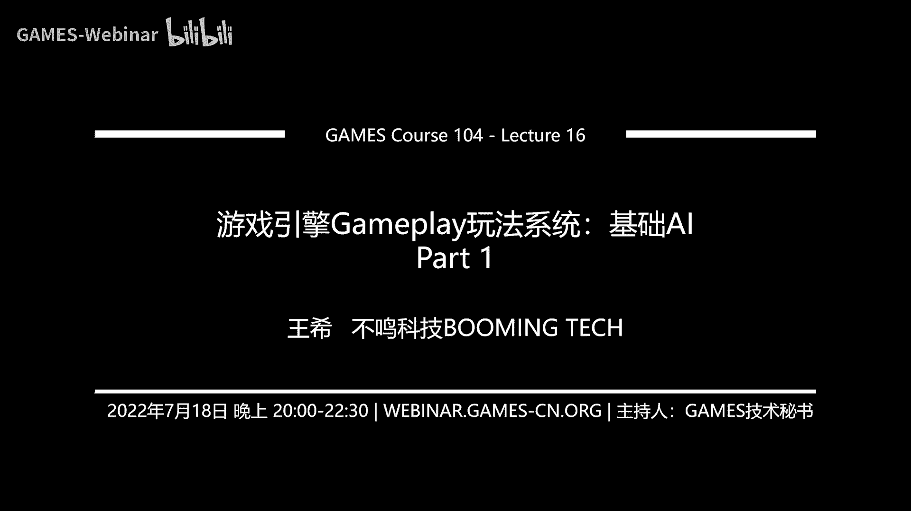
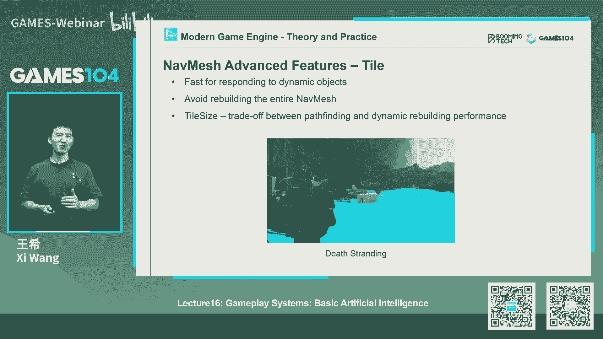
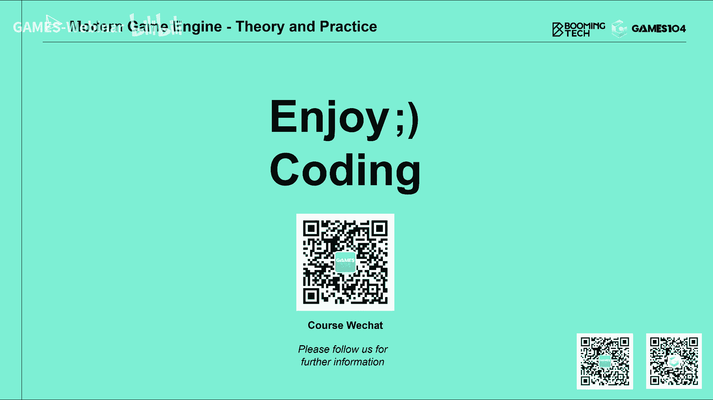

# 课程16：游戏引擎Gameplay玩法系统：基础AI (Part 1) 🧠

在本节课中，我们将要学习游戏人工智能系统的基础知识。我们将从最核心的导航系统开始，了解AI角色如何在虚拟世界中理解环境、规划路径并平滑移动。这是构建任何智能行为的第一步。

---

## 社区互动与课程安排调整

在开始今天的课程正文之前，首先分享一个好消息：我们GAMES104社区的T恤设计完成了。设计体现了“游戏引擎探索者”的精神，共有两款供大家选择。社区成员可以通过投票决定最终款式，幸运参与者将获得纪念T恤。

接下来，回答几个来自学习群的问题。

第一个问题是关于游戏逻辑的架构。现代游戏引擎普遍采用**组件化架构**。这种方法符合人类对世界的认知方式，也便于利用现代CPU的并行计算能力。虽然它可能存在效率上的局限，但仍是当前行业的主流选择。

第二个问题是关于蓝图系统的多人协同开发。这是一个公认的难题。蓝图作为一种可视化图表，其修改和合并非常困难，因为它不像场景编辑那样“所见即所得”。目前行业内尚未找到成熟的蓝图协同解决方案。

第三个问题是关于事件系统的优先级设置。虽然为消息设置优先级在网络通信中很常见，但在游戏逻辑的事件系统中，我们通常避免这样做。因为定义优先级意味着假设了事件的处理顺序，这会增加系统模块间的耦合度，不利于并行化扩展和系统维护。设计原则是尽量让事件处理顺序独立。

---

## 为什么是“基础”AI？

在准备人工智能这节课时，我们发现内容非常丰富，达到了180页。为了更深入、更清晰地讲解这个有趣且核心的领域，我们决定将AI课程拆分为两部分。

本节课是**基础AI**，将涵盖寻路、导航、群体模拟、环境感知和基础决策算法。这些是构建任何高级AI系统的基石。

下节课将探讨更复杂的现代AI系统，例如基于目标的AI、基于计划的AI，以及大家可能感兴趣的深度学习在游戏AI中的应用。

---

## 导航系统：智能移动的基石 🗺️

AI要表现出智能，首先需要能在游戏世界中自如地移动。这就像人类需要知道哪里可以走、哪里是障碍一样自然。在游戏中，这由**导航系统**负责。

一个完整的导航系统通常包含三个步骤：
1.  **世界表达**：将游戏世界转化为计算机可以理解的数据结构。
2.  **路径查找**：在数据结构中，计算从起点到终点的可行路线。
3.  **路径平滑**：优化计算出的原始路径，使其看起来更自然、平滑。

### 世界的表达方式

计算机无法直接理解美术关卡，我们需要用特定的数据结构来定义“可行走区域”。

以下是几种常见的表达方式：

*   **路点网络**
    这种方法在早期游戏中很常见。设计师手动放置关键点并连接成网络，AI像乘坐地铁一样，先走到最近的路点，再沿网络移动，最后离开网络走向终点。其优点是实现简单、效率高；缺点是维护麻烦，且AI行为容易显得僵硬、只沿固定路线移动。

*   **网格**
    将世界划分为均匀的方格，用格子标记是否可通行。其优点是易于实现、调试和动态更新；缺点是数据存储和访问开销大，且难以表达多层结构。

*   **导航网格**
    这是现代3D游戏中最主流的方法。它将所有可行走区域用一系列**凸多边形**覆盖。AI可以在多边形内部自由移动。其优点是能高效表达大面积区域、支持3D层叠结构；缺点是自动生成算法复杂，且动态更新时需要技巧。

*   **空间八叉树**
    对于飞行单位等需要在3D空间自由移动的AI，可以使用八叉树来划分空间。它能精细地表达复杂的3D可行走体积，但存储和计算开销也更大。

无论采用哪种表达方式，最终都会在内部形成一个**图**数据结构，其中节点代表位置，边代表连接关系。

### 路径查找算法

在“图”上寻找路径是一个经典的搜索问题。我们需要找到一条连通且尽可能短的路径。

以下是核心算法：

*   **迪杰斯特拉算法**
    这是一个能保证找到最短路径的经典算法。它从起点开始，逐步探索所有可能的方向，并不断更新到达每个节点的最短距离。虽然准确，但在游戏这种往往不需要绝对最优解的场景下，可能显得效率不足。

*   **A* 算法**
    这是游戏寻路的事实标准。它在迪杰斯特拉算法的基础上，加入了一个**启发式函数**来估算当前点到终点的剩余距离。算法会优先探索“已走距离 + 预估剩余距离”总和最小的方向。这使得它能更快地导向目标，在游戏这种障碍相对稀疏的环境中效率极高。
    *   启发函数示例（网格）：`H = |当前点.x - 终点.x| + |当前点.y - 终点.y|` （曼哈顿距离）
    *   启发函数示例（导航网格）：`H = 当前点与终点的直线距离` （欧几里得距离）

### 路径平滑算法

通过A*等算法找到的路径往往是折线状的，AI沿之移动会显得不自然。我们需要进行平滑处理。

**漏斗算法**是常用的平滑算法。其核心思想是：在由一系列凸多边形构成的“走廊”中，尽可能拉直路径。
1.  从起点开始，将其与第一个“门户”（连接多边形的边）的两端相连，形成一个扇形区域。
2.  检查下一个门户是否完全在此扇形区域内。如果是，则收缩扇形区域。
3.  如果不是，则意味着需要拐弯。选择拐弯点（通常是当前扇形的一个边界点），并以此点为新起点，重复上述过程。
4.  当终点落入当前的扇形区域内时，即可用直线连接当前点与终点。

经过漏斗算法处理后，曲折的原始路径会被优化为一条更贴近障碍物拐角、更自然的平滑路径。

### 导航网格的生成

导航网格通常由工具自动生成，其中最著名的开源库是**Recast**。其生成过程大致分为以下几步：
1.  **体素化**：将3D场景转换为类似《我的世界》的体素网格。
2.  **标记可行走区域**：根据最大爬坡角度、跳跃高度等规则，在体素中标记出可行走的部分。
3.  **划分区域**：通过计算距离场等方式，将连通的可行走体素聚类，划分成不同的区域。
4.  **生成凸多边形**：将每个区域转化为一个或多个凸多边形，最终形成导航网格。

在实际项目中，自动生成的导航网格常需要设计师手动干预，例如标记特殊区域（沼泽、公路）、添加攀爬点或传送门连接等，以应对游戏玩法的特殊需求。

---

## 本节总结

本节课中，我们一起学习了游戏AI系统的基础——导航与寻路。

我们首先了解了为什么需要将AI课程分为两部分，并明确了本节课的基础定位。接着，我们深入探讨了导航系统的完整流程：从**世界表达**（路点、网格、导航网格）到**路径查找**（迪杰斯特拉算法、A*算法），再到**路径平滑**（漏斗算法）。最后，我们简要介绍了导航网格的自动生成原理。

掌握这些基础知识，是让AI角色在游戏世界中实现智能移动的前提。在下节课中，我们将基于这些移动能力，探讨AI如何感知环境、做出决策，并构建更高级的智能行为系统。