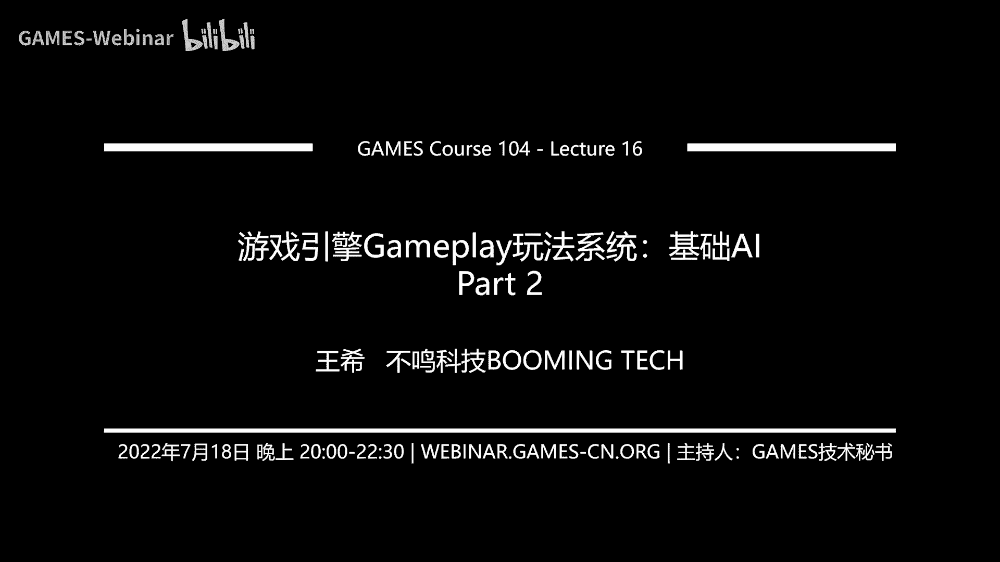
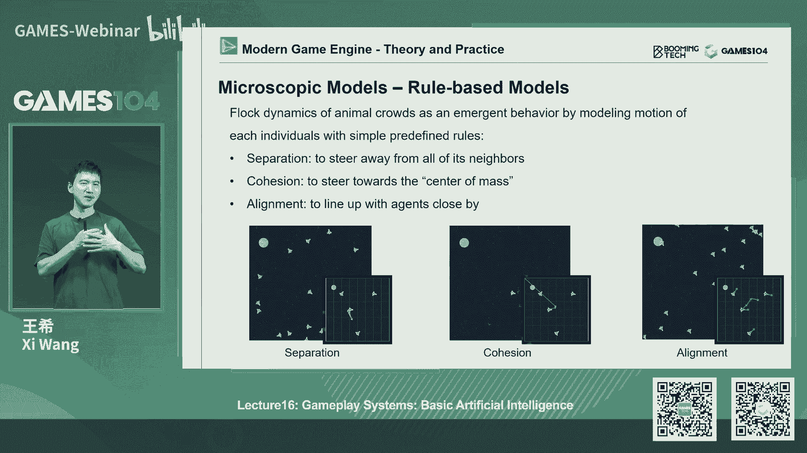
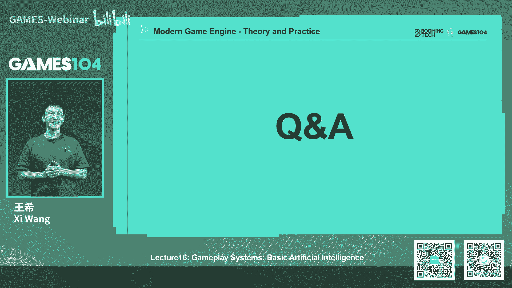
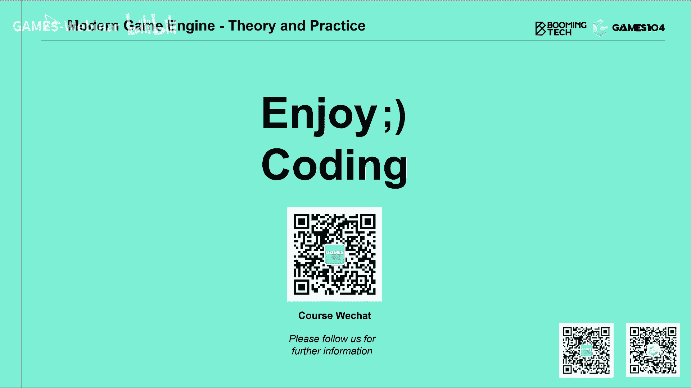

# 16.游戏引擎Gameplay玩法系统：基础AI (Part 2) ｜ GAMES104-现代游戏引擎：从入门到实践 - P1 - GAMES-Webinar - BV1r34y1J7Sg

那这个巡目讲完之后，接下来就讲叫steering，Steering，这个东西很难呃，我他他表达的是什么概念呢，我觉得讲这个词很抽象，其实他讲的实际中是非常的简单，就是我们刚才在寻路中。

我们不是找到了一条路径吗，在路径好像一般来讲，我们能找到最优的那个路径，对不对，但是说如果今天我给大家一辆车的时候，他真的能够严格的按照，我们的自由路径去行走吗，其实是不可能的，对不对。

大家知道车它有一个加速度减速度，它有个最大加速度，最大减速对吧，它不能瞬移，第二个是什么呢，它有个转弯半径，它不能瞬间的改变它的角度，所以我们在路径寻路上找到了一条直线。

但是这个车如果车头朝另外一个方向的话，它其实是沿着一条弧线走过来的，诶这个地方就跟大家讲一个很有意思的问题了，就同学们有没有发现我们在玩很多游戏的时候，你会发现那个就是有些NPC，特别是载具类的。

这个NPC的话会卡死在一些点，其实这种卡死很多时候都是这个原因导致，就是我寻不寻的，也是严格的在WORKBAREA，但是呢有的时候因为我要加入这种诶，更加符合物理实际的这样一个STERY系统的时候。

他可能就走到了一个以前没有规划的区域，那个区域如果很不幸啊，比如说我的这个比如说物理模拟的某一帧tick，它不长大了那么一点点，他就呆在了一个那个unworkable area之后。

接下来所有的曲目对他来讲就失效了，有的时候那个经常你会发现有些角，比如说一个一个角色，它被卡死在一个corner里面，他在里面就会反复的抖动，来回转来回转，但不管怎么转。

它的steering都转不过来对吧，但现在游戏中这种问题已经越来越少了，但是呢其实在就是五到10年前的游戏中，大家经常可以用这种方法去玩弄这个NPC好，那么这个steering的话呢，实际上啊很直觉。

它实际上呢，基本上我们把它归类归类成几个几大行为，一个是second fly，就是说哎追或者是逃对吧，第二个是什么呢，叫做velocity alignment。

就是说我我把velocity那个那个那个matching，就是我要把速度对齐，这个C开的福利，大家很好理解对吧，就是我有个目标点，我去追他，或者说有敌人追，我要总要逃，总是背着他逃跑，对不对。

这个好像很直觉对吧，那么第二种，这个就是说为什么叫velocity，这个matching的这件事情很重要的，大家发现没有，就是如果我一个东西，它是一个加速和减速的过程的话，我知道我的起始点。

我知道我的目标目标点，但我知道我从知识点出发的时候，我是加速速度越来越快，越来越快，但是我到目标点的时候是什么，我得去减速，而且呢当我减速到零的时候，最好你恰好停在了你的目标点。

大家想想这件事情在数学上简单嘛，其实数学上你是要处理一下的对吧，这个这个地方如果是一条直线还可以，但如果是一个弧线的运动呢，是不是更复杂，这个东西特别让我想起，以前我我我以前在看那个航天的时候嘛。

就是那时候我才懂一个道理，比如说今天我们要发射一个，比如说我们的火星探测器发射到火星上，不是说你的火箭足够大足够猛，速度足够快，我把这个发射器送上去就了事了，其实大家知道。

就是当一个就是飞行器到了火星之后，他最难的一件事情是什么呢，那个时候我我我上面已经没有多少燃料了，这个时候我还要浪费我宝贵的燃料，开始减速，要把我的速度变得跟火星的那个绕的那个太阳，公转的速度差不多。

当然我我绕着火星自转对吧，我还要保证一定的这个这个不掉下来那个速度，所以这件事情其实是非常非常的难，其实这里面的计算机很复杂，但是它非常像我们的velocity matching的问题。

就是说你把这个点送到之后，你还要确保你到了目的地的时候，你的速度几乎跟它几乎是一样的，但这时候我的目标点是静止的，对不对，如果我的目标点是动的呢，对不对，他自身就在动，那我要追上他的时候。

哎最后我的速度跟他要一致，大家想想这个问题是不是有点意思了，这个就是最后一个就是我的alignment，就是我保证我的这个朝向一致，这也是很正常的对吧，比大家想象一个鱼群对不对。

头鱼在那边有其他的鱼都会自觉地跟他并行，比如说我一个飞机编队出去的时候，诶，大家会自然而然就形成一个同向的那个编队，那我一开始的速度可能是不一样的，方向不一样的，但我要跟它AI到一起。

所以说其实steering行为的话呢，这三种行为我们认为是最基本的一个行为，那具体给大家讲一下，就是说c can复利，其实呢它要解决的问题，就是说当我的目标点在那边，无论是静止或者动的时候。

我会不断地根据我自己的位置，根据我的目标的位置，然后呢确确定我的加速，让我要么就追着那个目标去，要么我就远离那个目标，那这个这个东西讲起来其实也并不难，但大家可以想到就是我在游戏引擎里面。

我一个tick，一个tick就tick，你也能得到你想要的这个行为，但这里面second的福利呢其实也有些变种了，比如说这个我们经常讲的pursuit追踪，是一个行为对吧，还有一个是什么呢，叫巡逻。

巡逻的话呢，我永远在我前面找一个地方，让他去随机一下，包括这里面呢，我觉得最有意思的行为，是在一个叫速度场或一个方向场里面，一个物体的运动，就是说假设我在空间能够形成一个方向上。

方向上叫什么叫victor fw，我把任何一个质点放进去之后，它会沿着方向盘一直在动，诶这个东西其实非常的有意思，其实大家去看一些这种大型的这种群体的运动，模拟的时候，他很多时候是用这种方向场来做的。

所以这其实也是一个second fleet的一个变种，所以这个地方比较简单，所以我就不展开讲了，那么另外一个呢就比较有意思的，就是velocity mesh。

那实际上的话呢他其实是有一个target的那个速度，我的目标点的速度对吧，我还有什么呢，我的这个我什么时候去那个matching它，我要追上他，这个时候呢，我要反向的用一个一点点积分的方法，反向算出来。

我这时候加速了什么，因为这个时候我会根据我目标点，和我的相对速度决定，我靠近它的时候，我要反向去减速，这里面如果目标点它是静止的，或者是匀速直线运动的话呢，这个计算其实是比较简单的，大家想想看。

这不就是呃，二分之1T平方等于对方的那个点距离对吧，我就可以开个根号，我能算出来我的加速度是多少，基本上我能保证我能稳稳的停在那个点，但是的话如果对方也是在动，而且是一个非直线的，在动的时候。

其实这个we lost the machine的话就非常难了，但其实我自己认为啊，这是你可以假设对方是沿着直线运动的，然后算出一个结果，然后你TK完下一帧的时候，根据它的变化，我再去重新算一个加速度。

其实你会形成那个结果呢，基本也能符合你的需求，为什么呢，因为真实的人在世界上行走，比如说你要你的朋友在前面一通乱走，然后呢你试图跟他去AI，跟他matching在一起的时候，你也不会一上来就全部算出来。

你也算不出来，对不对，你根据你的经验，根据他现在的速度，你大概感觉自己一个一个速度该怎么走对吧，然后的话呢你走了大概比如说半秒钟，一秒钟之后发现他有变化了，你身体你会下意识的。

你的小脑会告诉你有相应的变化，只是我们人的这种计算全是在电光火石之间，但是呢有一点我们非常确信，就是说人类不会算一个复杂的计分方程，我们只是在做一个就是一个小步长的计算，然后呢根据下一个步长来的时候。

情况发生的变化，我们会调整而已，所以呢用这种就是叫分布式的这种算法的话呢，你也能得到一个你想要的一个，基本看上去非常自然的这么一个结果，因为我们是在做AI嘛，所以我们只是希望AI体的行为。

看上去像像真实一样，那么最后一个呢其实更简单的就是alignment，Alignment，这里的细节是什么呢，刚才我们讲它的速度对吧，是一个叫加速到最大速度，然后呢快接近目标点的时候。

或者跟着目标点的速度逐渐一致的时候啊，那我就开始进行减速了，其实online的地方的话，你要做的真实的话，实际上也是就是角速度方面，也有一个叫加速和减速的过程，这样就证明这个案例的时候。

我把方向跟它对齐的时候，一开始我要角速度，角加速度对吧，快到我的目标角度的时候，我要有一个角减速度，这个细节其实非常的重要，为什么，就这也是就是我待会我想的就是。

其实啊steering这个系统是一个大牛，在很早就提出来了，这个大牛是后面做那个就是swarm，就是封这个这个这个群体系统，群体行为系统的这个这个开开山鼻祖，那么这个东西为什么这么重要呢。

其实我在我早期在写这些，这个AI行为系统的时候，我们也很容易犯这个错误，如果大家没有做这个角色，align的这个角加速度和角减速的过程的话，你会发现你的AI的行为是什么，就是这样，它会突然N嗯。

就像那个机器人瞬间的转向，当当当，就是你感觉他很不自然对吧，因为我们做的一切的行为都让它自然了，所以说其实你如果发现这个问题的时候，你会发现哦，肯定是align这个steering算法我也没写好。

我没有把它记做足够的这个角加速，角减速的处理对吧，所以这也是一个非常有趣的一个东西，基本上的话STERING算法的话比大家想象的要简单，其实这三类基本上囊括了我们steering的重点。

但是呢为什么这个同学们单独拎出来讲呢，因为你会发现啊，如果一个人他没有受过系统的游戏，引擎的训练的时候，他很容易在引擎架构中，把这个系统给给那个漏掉，就是他做完了寻路对吧。

但做完了比如说AI的决策系统对吧，然后呢让这个东西就比如环境感知系统，这个角色技能动起来，但是呢你会发现他做出来的这个游戏，或者是角色看上去都很僵硬，就像机器人一样。

因为他没有加入一个让它更符合人自然行为的，这个steering系统，特别是你在做载具的时候，做这个人类体型为的时候，做生物的时候，这个其实很重要，比如说你模拟一个快速奔跑的一个，这个生物的效果的话。

它的惯性对吧，它的最大加速度和它的最大的这个转向速度，其实都是他一个约束条件，基本上这些呢就是我们的series系统，那在这个地方呢我们要荡开一笔，就是说这个系统它的一个大客户是什么呢。

就是这个群体系统，就是或者叫做授权系统啊，Crowd simulation，就是说我有很多的东西在一起运动的时候，你该怎么去处理，大家会觉得这件事情好像AI，我们今天不是讲AI吗。

为什么上来就讲crowd呢，因为实际上现在AI在很多时候，在游戏中处理的情景，我们是要处理这个群体运动的东西，举个例子，比如说我们做一个三游戏，比如说我一个我的主角走到一个广场对吧。

这个广场上你会发现什么，有很多鸽子在地上，你走过去的人的鸽子会啪一下受惊飞起来，那这个鸽子飞起来的行为呢，其实它就是crow的行为，那我们去做我们的环境，大家看到现在所有的游戏里面。

我们都会把这个城市会越做越丰富对吧，很多人走来走去，对不对，你可以在一些好的这个demo里面，你可以看到成千成百上千的NPC走起来，而这些人呢走来走去的时候，他其实不是一个一个的个体。

他是用一个crowd系统去做出来的，那么这种群体性的行为，在很早以前就以为大牛对吧，RENO的这个这个大牛他就开始研究了，其实他也是提出了stein系统的这个开山鼻祖，他就说其实对你这种群体性的行为。

一般我们有三种处理方法，一种是用微观的方法去解决，就是用一个从底向上，就是我定义每一个群体的行为，他们合到一起就实现了我的目标，还有一种方法呢是马就是宏观的，就是我宏观上定义一种大的运动趋势。

你们所有人呢按照我的趋势运动，你的结果也是好的，但第三种就是hybrid，就两种方法都有，就是说既有宏观的控制，又有个体的行为，那这个的话呢就是说能解决一些更特殊的情况。

那我首先跟大家讲一下这个微观算法，微观微观算法其实呢比大家想象的要简单，实际上就像一个鱼群一样的，他的行为是什么呢，或者我们人吧，其实他无非就这么几个行为，第一我看我离一个人太近了对吧。

我要我们之间要产生一个斥力对吧，我们要彼此推开了。

我们不要撞到一起，那么呢如果呢我发现我离人群太远了，特别像鱼群的时候，他会说嗯，我好像也不能太那个离群了，那我要加上一个引力，大家发现这个事情很有意思吧，这个我们在以前在学那个弹簧的时候。

是不是很像一个弹簧，就是压缩的时候产生视力，拉远的时候产生吸引力对吧，其实就是个弹簧，然后呢，诶还有更复杂的就是你们既然都头朝那个方向，我也希望跟你一起同样的头朝一个方向。

其实你用这么一个简单的这个规则啊，你去把很多的AI体放进去之后，他呢就能形成我们想要的这种鱼群的效果，比如说像这里面的这个案例对吧，潜水艇过来的时候，诶我可以看到这鱼群形成这样一个行为。

OK其实这个呢就是一个非常简单的基于规则的，这个就是这个这个就是那个群体crowd simulation，那么宏观的算法的话呢，其实就更害了我，他说因为微观的算法呢，它好处是规则很简单对吧。

但是它产出的结果确实是不可控的，他也不太受人的影响，他自己你他很适合表演出一大群的东西，自己走来走去很随机，但是比如对于一些更有规则体系上，比如说这个demo就是虚幻五的那个max AI的demo对吧。

那我要展示一下在城市的街道里面，他很多的行人走来走去，我希望因为人在大街上是不会乱走的，对不对，我不能像鱼群一样，就是看见人就撞开，就让开，然后呢随机找方向走，那这个行为就很奇怪，那他是怎么做的呢。

诶他首先会定义一个，比如说我的一个一个一个一个一个lab对吧，我的各种land的意思就是说各种人行道，或者是那个就是高速上的一条车道，对我定义很多的车道。

然后呢我把这个区域分成很多zone graph对吧，然后呢我生成了很多人的形体的时候，他会在这个空间的沿着这个line line去行走，它其实是一套规则体系，那这样的话呢。

我会让整个AI的行为会更加的可控，但这里面还有很多其他的处理的，比如说我怎么样避免就是一个一个个体，它会在line之间快速的切换，比如说它本来是往左边走的，他走了，因为避让一个别人，他要让开一点点。

结果呢他一下子切到了，就是逆向的那个烂对吧，那就很奇怪了，对不对，他要保持一致性，但是呢我在十字路口，我要让他有有有这个就是分叉的选择，那这个烂之间的话就是怎么去连接，怎么去分叉。

它有一套简单的规则体系，但这些都是宏观控制了，然后这时候我把几千上万个A技能，放上去的时候，它其实是follow了我这个line去进行行走，那么这种宏观方法的话，其实在现代游戏引擎中用的还是非常多的。

特别是我们的表达这个人类行为的时候，用这个系统会比较多，因为人类的行为真的不像我们叫做无头的苍蝇，那样对吧，他们其实还是隐隐的按照一套规则去走的，那么像这个就是这两种方法结合的方法呢。

就是这个microscope吧，那这个其实很简单，他的当时这个提出来，其实我认为也是一个特殊情况，就是他解决，就是说我把这种蜂群或者这种群体，分成一个个小族群，让小族群呢它受一个大的这个指向。

比如说我要往左走，我要从那个那个到对方的出生点对吧，我们有一个目标，但是呢每个小个体的自己行为的话呢，还是follow那个rule base的方法生成我们的结果，这个这个里面最典型的一个应用是什么呢。

其实就是我们以前玩的那种RTS游戏，比如说大家玩过星际对吧，玩过帝国时代那么经典的游戏，那么你圈出一圈小兵的时候，你会指定一个目标点，说诶我要打那个点，对不对，在这个过程中。

你会发现那些小兵他都往那个方向去走，因为它有一条烂控制它，但是每个小兵的移动的话呢，他又是自主决策的，就是基于他自身的入，比如说他看起来债务，每个小兵是自主决策，我怎么去让他的，而不是整体去决策。

所以呢这也是一个群体的一个行为，那么这里面的话呢，其实要跟他讲一个很有意思的东西，就是说其实在座所有的虚拟行为，包括STERING系统里面，我们一个很重要的东西，就是我们要避免去碰撞对吧。

我们不希望这些小的crowd会overlap在一起，这样看上去非常的不真实，那怎么样去避免碰撞的一个最简单的方法，就给它加力嘛，这个力怎么加，其实很简单，就是说前面讲过了吗，两个东西靠得太近。

我就给它产生斥力，对不对，远了我产生吸引力，只要有斥力在的话呢，很多时候你是不会撞到一起了，但是呢我们一般force space的方法呢，其实还有一个很重要的应用，就是说假设我给你一个环境。

这里面其实有很多障碍物对吧，大家会说我会用寻路，但是你假设有几千个东西，你同时寻路的话，那个速度是不是会非常的费啊，大家还记得刚才我讲的寻路算法吗，你要去做这种这个A星算法对吧，每一个小个体都算一遍。

这个太废了，对不对，然后呢，我要再对他这个这个这个再进行这个pass moon，想想那个烟囱算法是不是也很费诶，这个时候其实有个非常廉价的方法。

就是说我对所有的障碍物加一个就是distant field，就是一个距离，想怎么样，这个地方又来了distant field对吧，当我的每个个体，离那个离那个某个账户最近的时候，越来越近的时候。

这个distance field的值就会变得越来越小，我产生的这个反向的斥力就会越来越大，这个时候呢你给一个大致的方向啊，这个群体会能模拟那种真实的A人类的，这种移动的行为，所以这件事情呢。

在这个模拟这种人类的这个行为，其实非常的有用，这个东西我给大家讲一个游戏之外的意义嘛，就是啊我们经常讲游戏引擎不是在很多地方，这个不只是游戏嘛，比如在数字孪生里面有个很重要的用是什么呢。

就是我们设计好了一座城市，或者一个巨大的一个比如电影院对吧，一个办公场所，办公楼，我们要模拟说，当这个电影院或者办公楼发生火灾的时候，人群该怎么去逃跑，那么其实这里面的很多逃亡的模拟。

就是用这种force space的方法，就是模拟人群的应用，而且这个模拟的结果呢跟知识的情况下，真的很接近，因为我们人在那种慌乱的情况下的寻目，真的就是看见墙我就不会撞他对吧。

看见人我会让一让我尽可能往那个方向去走，所以能形成这样的一个结果，那这个算法呢其实它很粗暴了，这里面的话我要简单的讲一下，一个很高级的算法，叫叫那个就是那个velocity based model。

就是基于这个那个就是基于速度对，就是速度的叫那个velocity obstacle，就是速度障碍法的算法生成的这样的一个碰撞，检测，这个方法其实呢我本来我们准备了十几页。

但是呢最后我觉得还是不要展开了它，它其实核心的想法是什么呢，就是说哎当我两个物体在运动的时候，我看到别人走过的物体，它会在我的速度域上形成一个障碍，然后呢我要调整我的速度，尽量避开这个障碍。

那么它的方法呢，其实VO的方法其实想法非常的简单，就是说我看到一个东西对吧，那如果我判断我在沿着当前的速度，我就会给你形成速度，你和和你形成一个RBO，就是速度障碍产生这个碰撞，那我就赶快调整我的速度。

比如往左边调一点，那么RVO呢就real spect的那个呃，那个voice of st奥斯特的这个方法的话呢，实际上就是不仅我让你也得让这样，我们两个相互是公平的，我们一起就让一下。

那这样的话呢就是说其实最简单的做法，就比如说这个时候A发现我要撞上B了，A决定往左拐，B呢这时候意识到说诶你也要撞上我了，那我也亡往应该是往往左拐，这样的话我们两个对吧，行人车辆都靠左行啊。

靠左行还是靠远，应该是靠靠左行，这样我们彼此就完美的让开了，但是这个方法呢其实讲起来是不是很简单对吧，但实际实现起来很麻烦，然后呢这个方法它会出一个问题，就是说当这个我们参与的个体不止两个的时候。

刚才我们讲的你要处理蜂群对吧，那我们就是A对B的，必然可能会对A对C的必然产生冲突了，就是说你虽然让开了B，但是你可能和C撞到一起了，所以这个时候的话呢，他要做一个整体的优化。

这时候就提出了一个著名的叫ORVO，就是optimal，这个方法讲起来就非常复杂了，就是他把空间上的就是这个所有的速度，假设一个时间里面形成了一个就是速度空间的，一个像羽毛球形状的一个一个一个锥形区。

那一个区域的话呢，每个人的区域之间，他用那个明可复合求了他们一个和，然后求它里面一个最小的一个，对大家所有最公平的一个时机点，这个听上去是不是很数学，说实话这个地方的数学还是蛮深的。

但是呢我要跟大家讲的一件事情，就是说，其实在我们在做引擎的早期的时候，我们把全套的RVO和OO的算法，我们都实现了一遍，但今天我们会发现一个很有意思的事情，就是说RO算法首先在实现上非常复杂。

很容易做错，第二件事情呢他处理的不好，计算复杂度其实非常的高，但是呢他确实可以在理论上找到一个最优解，就像刚才那个一上来给大家看的那个视频中，这些小球的运动就是给大家看一下啊，就是这个小球的运动。

就是说如果你有这样一个围成一圈的小球，他怎么穿过彼此到各自的目的地，这个优化问题其实是蛮难的，那么就是用OOOOO算法的话呢，基本上能得到一个理想解，但是的话呢其实在真实的游戏引擎中。

至少我自己现在的实践，我会更推荐用force space的方法，非常简单，非常好调，但是呢它的结果没有这么漂亮，没有这么elegant对吧，所以的话呢就大家在实现自己的游戏心的时候。

你们可以根据自己的选，根据自己的那个判断，那比如说在现在的商业引擎里面的话呢，一般这两种方法都会提供，那大家会觉得很奇怪了，为什么这个东西会变成一个引擎的标配呢，因为在引擎里面。

我们真实的支撑游戏产品的时候，我们一般都会有大量的NPC个体，就是你的AI系统会有大量NPC，然后呢这个NPC在运动的时候，我们希望他们有一些群体的行为的合理性，同时的话呢我们又不希望他们彼此产生碰撞。

但他会说我不希望那个就是说产生碰撞的时候，那我们是不是会就是说哎用AI来解决呢，其实AI是能解决，但是AI解决这个问题效率是非常非常低的，所以我们需要一个专门的叫clean avoidance。

就是碰撞避免系统，来帮助我们AI来解决这个问题，大家看有点意思了吧，就是讲到这个地方已经讲了将近一个半小时了，我们还没有讲到决策算法，因为这些东西其实是决策的一个基础好，那这个我们就不卖关子了。

同学们还在讲，我还我还想学AI，对不对，那我接下来给大家讲一个，就是当我们去做AI的最后一个这个基础，就是他的AI的foundation叫做对环境的感知叫森林，那么SENORING的话呢。

其实我觉得有我自己喜欢交流词叫perception，就是说感知世界，就是我们人在做所有决策的时候，其实它的基础是什么，要根据我看到的东西，我听到的东西，包括我对自己的感觉，比如说我现在感觉很好。

感觉良好对吧，或者感觉不好，那么基于这所有的信息，我才能做出我的行为，我的决策，所以今天我们在所有的游戏引擎里面，看到这AIT的所有的行为，他最重要的一个就是说决策的依据，就是说而且这个依据是动态的。

就是对世界的感知perception，那么perception的内容呢，它会分为就是由内到外，累的话就是我自己的状态，比如说我的血量对吧，我现在的速度对不对，我是我的手上的武器里面还有没有子弹对吧。

这些东西，那么还有什么呢，还有就是说环境，比如说这个A点到B点到底能不能到达对吧，比如附近有没有一些有意思的点，还有就是说敌人在哪里，有没有敌人对吧，所以这就是很重要的这个AI决策的依据。

perception系统不像大家想的那么简单，就是说它实际上的话就是啊，是需要我们整个game play系统，去在设计上去支持好这件事情，那么perception的话，首先的话呢我要能拿到我自己的信息。

对不对，我的血量，我的这个装那个armor的这个状态，那么其实呢这个对自己的信息的访问是非常快，非常廉价的，但是大家还记得我们在前面，game play统讲了一件事情是什么懒，比如说像那个蓝图对吧。

像visual scription这个系统，它最重要的就是我能读取很多环境的变量，其实这里面有很大的一块变量，就是我自己的状态，那么这个东西为什么他要能支撑论文，因为你没有这个东西的话。

其实我后面所有的AI决策都是随机的，它是没有任何基于这个环境的依据的，那么另外一个的话呢，我们还这个要获取的是什么，就是空间的信息，那空间的信息呢，第一种是静态的空间信息，这件事情非常的重要。

大家一定要理清楚，比如说我可以是那个navigation，可以这个巡逻的这个我可以动的这个区域，就刚才我讲work by area，对不对，还有是什么呢，就是我的战术地图这件事，这个概念的话。

他前面没有介绍过，就是说其实在一个真实的游戏的关卡里面，比如说我形成生成了所有的这个通路区域啊，实际上对AI决策来讲是不够的，举个例子，比如说我的整个这一个，比如说一条河中间有座桥。

河桥的两岸都是开阔地，那么它可通行的区域是不是很大，那今天如果我们去深设计一个AI，这个AI后来要来去这个跟你去对抗的时候，我们的人是不会天然就会意识到说，那个连接河两岸的那个桥的两头。

是一个重要的战术点，对不对，那个所以呢这个时候呢在AI系统里面，我们就会要求设计师形成一个叫text map，你要手动标记那些地方，是一个更具有战术价值的点，那么AI在做决策的时候。

他会优先去控制和那个区域，优先消灭那些虚拟的敌人，那么这个txt map的话当然真的展开比较复杂了，就是说它存的数据的维度是非常多，另外一个的话呢就是在这个游戏的世界里面。

我们的设计师会放放很多可以交互的东西，比如说我们一般叫smart object，比如说那个地方有个梯子，AI就知道到，那我会把这个梯子支起来对吧，或者说那个地方有一座墙，那个墙是可以被打破的。

那我AI就知道说我可以，如果我想去达到某个战斗，结果我可以用我身上的某个武器把那个墙打破，给我的给人类玩家提供一条通路，对不对，那么还有什么呢，还有就是说啊我们有一些就是说在游戏中。

其实周边那个txt map也重要，就是我会标记说有些地方是你可以掩护的，掩护点对吧，就大家最著名，大家记得以前那个就是最早我印象最深，就是最早做的很好的，让我非常impressive的一个游戏。

就是战争机器，因为那个时候我们在做FPS的时候，AI都是跳来跳去，跳来跳去，战争机器里的AI都会躲在树洞后面，拿着枪这样去去打别人对吧，然后你会觉得哇这个AI看上去很智能。

因为我们人类很多时候进入到一个战场的时候，我会首先去找掩体对吧，所以说其实在游戏地图上，有很多分散的这个special的information，空间上的这些信息，这些信息都是由我们的设计师预先构建好。

那么接下来呢还有很多动态的信息，这个信息的话呢实际上也是AI的foundation，那么这里面有一个很著名的一个，也是一个很重要的概念，叫做influence map，就是这个影响力图或者叫热力图。

或者叫叫叫什么因子图吧，就是说其实我们的AI，在对于战场态势进行感知的时候，他的基于的就是这个influence map，举个例子，比如说当那边有很多敌人，当敌人越来越多的时候。

我们可能会把那个地方的敌人比较危险系数，那个维度会逐渐的提的很高，然后呢这样的话，当我的AI如果发现自己哎我残血了对吧，他就会下意识的让自己避开，那怎么知道我要避开那个区域呢。

它其实是要query这个inference math，说我要去的目标点，比如从A点到B点，但这个地方的话，有一个就是威胁系数很高的区域，我会想办法绕开它，如果威胁威胁，那是中等，我可能选择消灭它。

如果位置很低的话，我就选择直接闯过去，其实这个东西的话是对那个AI，在整个战场的行为影响是非常大的，另外一个的话是什么呢，就是这个诶动态的寻路，前面讲的就是为什么寻路要动态。

因为当游戏里面的这些就是其他的玩家也好，或者是其他的AI好，产生了一些行为之后，或者游戏里发生了一些重要的event，一些事件的时候，那么就是说你会发现就是说我的AI的行为，决策就会发生变化。

那么我的AI对这个世界的动态的感知，也非常重要，否则的话你会发现AI，他永远是按照一个套路去打对吧，它不会根据我们真实在这个世界里发生的行为，有变化，那么包括呢就是我的视野，就是在这个世界里面的话呢。

其实这个视野也会发生很多的变化，所以其实啊就是动态的空间信息，也是他的感知，也是我们AI运算的一个基础，所以这几个概念我今天因为时间的关系，我没有展开，但是大家会发现讲到这儿的时候。

其实呢引擎会提供一部分的功能，但是呢很多时候是根据你不同的游戏，有游戏开发者自己来设计，但是引擎这边的话呢是要提供一个开放的接口，就是当我们在设计AI角色系统的时候。

它一定要有一个通用的方法访问这些数据，比如说前面讲到的哎，我的各种自我的变量或者环境的变量对吧，包括你其实在根据game play，我会更新很多的这种influence map。

一般来讲infant map是非常复杂的，它有很多的维度，就是对这个世界的状态进行表达，那么我们在这个AI系统里面对吧，要提供一个通用的接口包，让我们的决策树能够访问这些数据，所以这个地方的话呢。

也是各个游戏团队的一个功力，就是你的AI做的好，做的坏，这个地方的设计是很重要的，但是呢引擎测也要提供你的功力，就是说你的这个接口扩展性要足够强好，那么其实呢另外一个很重要的动态的空间信息。

就是这个游戏里面的物体对吧，那最简单的就是说我现在站在这儿，我得看到说有多少人在我面前，我要感知到这些人存在，同时的话呢我在判断哪些人是我的敌人，因为我只有知道我的敌人有没有，敌人在哪里。

敌人跟我的距离的远近，还有什么呢，哎敌人对我的威胁度，他拿了什么武器，是不是我打不过他对吧，所以这个时候你要干嘛呢，你要找到那些物体的id，你要判断他是不是可见了，甚至你需要知道他是不是看得见你对吧。

包括你最后一次这个探测他用的什么方法呀，这些东西都会影响到我AI的决策，其实这个东西为什么叫CSIN呢，就是对世界的感知呢，因为你会发现，我们这个为AI系统构建了这个，基础感知体系的话。

它在这一趴的话非常像我们人类对世界的感知，那么这里面的话呢就就这里给大家一定要强调，就是在我们做做AI的时候，经常会犯一个错误，就是有两种错误，第一种错误呢，我们会认为我们的AIT整个世界是开图的。

就是没有战争迷雾的，比如说大家作为一个RTSS的AI的时候，最早的时候做的时候就会有一个假设，就是地图上发生的一切我都知道，比如说大家最早以前玩那个啊，比如说像那个啊cs的这个AI bot的时候。

早期做的比较傻的时候，那个bot他是全图全开的，就是机器人永远知道你藏在哪儿，这会让你很绝望，你做所有的战术的躲藏动作，对他来讲都是无效的，人家就直直勾勾的冲着你扔雷，冲着你打枪，对不对。

这种AI你们觉得好玩吗，不好玩对不对，那么我们希望的AI像什么AI像人一样，那人对世界的感知就比较有趣了，第一个是视觉，很自然，对不对，我们可以机器人，它比如说一个bot，它背对你的时候。

你居然会觉得我可以从背后偷袭他，对不对，为什么，因为机器人他的朝前他是有视野的，但是呢我是不是可以冲过去偷袭他呢，哎这件事又不行，为什么呢，因为他还有听觉对吧，就是说它的听觉是360度的。

那么这个听觉呢又是一个很重要的感觉，如果讲的更更加精细一点，就是说你这个听觉的范围，还不是一个完整的语言，为什么你隔着一些障碍物的时候，可能声音有一个阻碍的效果对吧，比如说你躲在草丛里面。

你的声音传播的就会受影响，所以当我们想做一个非常好玩的一个，战术游戏的这个AI的时候，实际上你会让AI模拟这个很像人类的行为，但这里面讲的更夸张点说，我们要模拟一下AI对嗅觉的感知呢，理论上是可以的。

但是呢好像现在游戏中用的这个很少，但是说不定将来以后有个什么游戏，就是里面有一个嗅觉特别灵敏，比如说一只狗对吧，他可以听到很轻的声音，能够顺着你留下的味道一直闻下去。

那么这个里面也会做这样一个无感的东西，所以说这个其实啊对世界的SENSELLING，是我们的AI系统的一个foundation，这也是一个啊非常重要的游戏统，那当在在做的330的时候呢。

你做最基本的算法其实并不难，但是比较容易出问题的一个地方，就是在引擎里面比较容易出的地方是什么呢，就是说如果我们给每一个bot都在，每一帧都在做这个世界的perception的话。

perception本身会成为世界的性能瓶颈哈，所以这个事情是当我们在做引擎的时候，其实这个地方我们一般会开放两件事情，第一个就是说开放给这个游戏产品，你会选择不同的情景下，你对世界340的精度。

你340的范围，这样的话，能够把这个计算机的这个成本压到最低，另外一个的话呢，也就是说，我们实际上会尽量的把一些对世界的感知，如果临近的那个bot的话，我们会共享，这样避免就是说对吧。

一群小也就一群boss，在那时候大家每个人都算一遍，那这个世界就会变得非常的麻烦，但是这里面就是一些工程上的细节了，但是的话呢这个340系统的foundation。

也是游戏引擎系统做AI的一个重要的基础，讲到这一趴的话呢，我们就可以终于进入了，也是我们今天课程的最后一排，就大家会发现就是我们讲AI的话，实际上我的课程百分之啊，可以说是70%到80的部分。

并没有讲大家最想听的，如何让电脑这个让那个bot变得聪明，大家只听到一大堆的基础系统，但是就像我前面讲的，就是如果没有这些foundation的话，其实AI是不能做任何事情的。

所以这就是AI的foundation好，那接下来这一趴的话呢，我们就会讲一些经典的decision making算法好，其实角色算法呢是AI算法的核心，就是前面讲的所有东西都是它的基础，那么决策算法呢。

最基础的最最常见的一个东西是什么呢，就是这个有线状态机对吧，我相信这个是大家的一个老老朋友了，因为在那个就是我们讲动画呀，讲前面的很多系统的时候都讲到这个概念，那么今天重点会跟大家讲的是一个叫行为术。

行为术也是一个AI最核心的一个体系，那其实在现代游戏中，还有很多其他的这个角色算法，比如说这个HTN对吧，就是那个层次这个任务，这个网络还有那个就是GP，就是那个就是基于目标的目标驱动的。

这样的一个就是行为的计划系统，就是go orange的那个action planning系统，就是GP，还有什么呢，蒙特卡罗那个那个那个搜索数，这也是非常经典的一个架构。

包括大家很关心的这个deep learning，基于现在人工智能这些深度学习的方法，我们能不能做AI，但是呢今天这节课，我想这这些算法在我的理解中，但是这些里面完全是我的一家之言啊。

我会认为就是说像状态机也好，像行为术也好，它更像是一种forward planning，就是说就是从前往后，慢慢就是这个我叫做脚踩西瓜皮，走到哪是哪了，这种决策过程，那么像后面要提到，比如像HTM。

像这个GP，像这个就是蒙特卡罗的方法，像那个deep ne，更像是一个就是以目标为驱动的一个反向算法，就是因为我要完成一个目标，所以我要做以下几个动作，所以这些算法会更有意思一点。

所以呢我今天就卖个关子，就是说我把这些最有趣的东西，放到我们的下一节课，而今天呢我先把最经典的前项的这样的一个，决策算法给大家讲清楚，那么首先的话呢让大家见识，来来再温习一下我们的老朋友叫状态机。

其实状态机非常的简单，也是非常符合人类的直觉，就是我们认为就是整个一个AI的行为，不就是在状态一状态二之间来回切换嘛，对不对，当条件满足的时候，我就从状态机切到张张二，或者说条件满足的时候。

我就做一个动作，把我自己从状态一变成状态二对吧，中间有个叫什么transition，transition里面的话，它有个condition，当condition满足的时候，我就做一个动作。

把我的状态切换掉，那我这个时候进入进入到新的状态的时候，我在判断我有其他的，有多少个这个这个这个这个肯定是，只要中间任何一个满足，我就从从这个状态再去transition到下一个状态。

那这里面举个很简单的例子，就是比如说像吃豆人对吧，我们要写一个吃豆人的这个AIT行为怎么写诶，大家发现没有，用状态机其实非常的好写，他的逻辑是这样的，就是我呢先乱走一气对吧，这个时候呢。

如果我发现我前面有一个ghost出来的时候，我怎么办，哎我这样做，我其实有两条通路，第一条通路是这样的，就是说如果我发现我这个时候就是普通状态，我干嘛，我该怎么办，赶快逃命啊，逃跑对不对。

但这个时候如果发现其实我已经吃了药丸，现在进入无敌状态的时候，哎我倒过来去追那个ghost，直到我这个状态结束对吧，那么这个时候如果我在闲晃的过程中，我发现有药丸的话，那我该怎么办，直接上去吃啊对吧。

所以其实用一个简单的三个状态，用六条边，我其实就可以做出一个最简单的吃豆人AI，而且我猜测大概率这个吃豆人这个游戏，PARKMAN的话，他的AI最早其实真的是这么写的，换，因为我以前玩过这个游戏。

我觉得他的AI是非常predictable，我觉得我们在学那个就是啊计算机那个编程，包括AI的时候，我们第一个作业，我经常记得做AI的作业有这么几个，第一个就是啊写一个吃豆人，AI跟要战胜电脑对吧。

还有一个作业是什么呢，就是挖雷，你要自动写个AI算法挖雷，我不知道，同学们，如果有同学们在大学里学computer science，如果学到那AI的时候，最开始的时候很可能会被布置这两个作业。

很有意思的好，那这个算法呢其实是非常符合人的直觉，也很经典，但这个CINEMACHINE呢，它其实有个很大的一个问题，什么问题呢，就是说，当我们真的要做一个商业级的游戏的时候。

你会发现这个角色的state是非常非常的多，然后呢你每加一个state的时候，你都要去考虑说，它和其他的那些state是个什么关系，你一开始只有七八个十几个的时候，你好好管理，但是想象一下。

如果你有几十个上百个state的时候，那些像一团麻花一样的连线，你是不是能够真的搞得清楚怎么连对吧，但是呢你又没有办法，因为你我我们state最复杂的什么叫叫transition。

就是说当我发生了一个事情，当一个条件满足的时候，我要迅速的迁到另外一个点去对吧，这就是我因为我要让这个网络非常的reactive，就是反应速度非常的快，那么这里面有没有办法解决呢。

其实有的就是那个hierarchy finished in the machine，就是就是层次有限，状态机，就是说我把状态机呢分成很多层，然后呢每一个状态机之间它有一个接口对吧。

然后他跟别人都是用有效的接口去跟别人联系，内部维持一个相对可控复杂的状态，这样的好处是什么呢，就是增加了我们状态机的可读性，但是呢它的坏处就是说不好意思，在各个这个这个这个子状态数。

那个子状态机里面加很多的非线对吧，我们希望它的出口总是那么几个，所以呢有的时候当然有些情况，比如说我在这个大的这个这个这个这一块里面，如果发生这些情况，我想迅速地跳到另外一个那个那个紫图啊。

子状态机里面的某个节点的时候，你除非跳飞线，否则的话呢这个过程其实是比较慢比较慢，所以的话呢虽然说就是hierarchical的，这个FSM的话呢，能不分解决状态机不好维护的问题。

但实际上它的反应速度其实是有点问题的，那其实呢这些方法是最古老的，大概是我如果我没记错，大概在15年前那个时候啊，很多时候AI系统还真的是用这个方法去做的，但是呢哎这个差不多在halo20代。

黑龙20代，如果我没记错，应该是两千两千零几年，应该2003年还是04年，玩的很早以前了，有一个方法横空出世了对吧，Be ai tree，因为这个方法我是很有感情的，因为我以前做的就是halo。

然后当时我在写自己的引擎的时候，当我写到AI这一块的时候，我就打电话问我以前的同事，我说诶状态这个比瑞REE到底是怎么写的，它的要点是什么对吧，真的是就是包着跨洋的电话粥。

把这个BEAIREE给他整个湿透了，那么其实行为术这个东西，我相信很多同学们如果对游戏引擎关心的话，都听说过这个大名对吧，那行为术它到底为什么有道理呢，我在before我再去讲行为术这个很细节的时候。

我会我会讲一个就是我自己很high level的一个认知，这也是我们课程组的小伙伴，在这一周里面我们准备的时候，我们总结出来的，我们认为其实状态机呢，它是对这整个这个AI的逻辑的一个抽象。

他确实我们也可以认为整个世界里面，我们AI的行为就是在状态里面来回切换，但是它并不符合人的真实的世界的思考范围，它不是一个像一团乱麻一样的跳来跳去，而是说我先看看情况嗯，我现在这个当我在这个时候遇到了。

没事可干的时候对吧，我遇到了一个，我看看我前面有没有敌人，如果我前面有敌人怎么办，我要判断一下我的状态，我的状态假设是无敌的，那我就去追他，如果我假设我的状态是这个没有Buff的，我马上去掏。

你发现没有，当我用语言描述这句话的时候，是不是像一棵棵的树在展开，对不对，其实behavior tree它的设计最核心的一个逻辑，就是他把我们对一个人类的行为的pattern，用状态之间的这种跳转飞线。

变成了一个就是一个树状的分支，其实比REE或者叫decision tree吧，这个概念在决策学很早就提出来了，就如果大家真的去研究这一套方法论的，这个历史的时候，其实在啊如果没记错。

大家如果学NBA学商务决策的时候，大家可能会学到一个概念叫decision tree，就大家发现，就是说在一些复杂的商业决策的时候，大家之间说诶你为什么做这个角色，你能把你角色的依据输出吗。

很多时候大家想一下，比较简单的方法是说我写我的条件12345，所以我的结论是什么，其实这个东西是不科学的，因为这个决策过程是不可以分为什么，条件123你就能得出你这个结论呢，那么在一个更加专业化的。

就比如说啊打个比方，比如说军队对吧，我们要有一套作战的，这个我们叫做sop标准作战条例，那么这里面的话呢，其实你在战场上遇到的情况非常的复杂，我如果是这个总参谋部，我想定下来一套作战标准。

要求我每一个连排营的指挥官都要这样去，做的时候，他其实就要用一套形式化的这个决策语言，把它表语，把它表达出来，所以人类研发了一个叫decision税的东西，叫决策树的东西。

其实就是用这样的一个形式化的分支逻辑，把你该做的动作，各种情况下做的动作把你表达出来了，那么其实呢behavior tree的设计，就是我以前在学习的时候。

我认为他的祖宗其实是decision tree，就是决策树好，那么行为术的话呢，你真的去理解它，其实也没有大家想象的那么复杂，那么它的node第一种的话呢就是execution node。

就是执行的node，那么执行node你可以认为它全是业界点，那么执行他能做的动作有哪，有哪几种呢，第一种很简单，我做个条件判断，比如说哎，我现在是不是这个有这个ghost在逼近我对吧。

或者说我现在是不是在一个powerful的状态里面，对吧，这就是一个判断，在刚才那个书里面，我们会在这边去判断一下，说诶ghost是不是靠近我了，如果ghost靠近我，那我接下来就做一些的动作，对不对。

还有就是比如说我发现ghost靠近我了，我问我现在是不是在powerful的状态，如果是yes的话，这是干嘛，我就要做一个动作叫cheese ghost对吧。

所以呢接下来还有个什么叫做action node，就是我做一个动作，那么action，但这里面要注意一个细节，就是说我们遇到connote的话，我会瞬间做做成这个判断，我很快就会完成这个判断。

但是呢当你做一个动作的时候，比如说我追那个构思的时候，大家想想看我能TIK到这一帧的时候，我就说我要追你好，下一帧的时候我就追到了，不会吧，我这个时候是不是要调用我前面讲的那个。

什么navigation系统，我首先要在我和他之间寻个路，对不对，我要去追他，第二个呢我还调用我前面的什么呢，steering系统对吧，要确保我能够这个这个始终正确的，朝着他的方向去加速减速，去逼近它。

对不对，那么其实呢这里面我刚才讲的就是ghost，是不是靠近我，就是is close close close的话，实际上是用了什么呢，前面我讲的那个CSIN或者perception系统。

帮你告诉你说这个ghost是不是在靠近你，所以呢比AI try的两个业界两种类型的业绩点，一种是条件节点，一种什么呢，是动作节点，但动作节点这里面大家一定要注意一件事情，就是说他是有三种状态。

就是说动作成功了对吧，success动作还有什么情况呢，叫失败了，Failed，对不对，FID也很重要，血色素在行为树里面试失败，也是一个很重要的状态，那么第三种是什么呢。

诶我们叫做这个i'm running，哥们儿，我正在忙呢，不要打扰我对吧，所以这个是行为树的第一个基础性节点，就是可被执行的node，那么第二种呢就是控制它flow的，其实那个就是行为树的话呢。

是一个非常经典的一个就是系统，所以你会发现它的图示都已经标准化了，比如说它能控制它flow呢，有这么四种啊，有三种，其实最经典的其实就三种，第一种是什么呢，叫sequencer，就是顺序执行。

你看到的这个箭头，它的意思是什么呢，就是当我走到这个条件的时候，我要依次把我的次数全部执行一遍，诶这个很有意思吧，就顺序执行，那么这个时候如果他此时中间有些人返回，在running的时候。

那那个sequence的节点，别人问他，你现在状态怎么样呢，哎我still running对吧，那么这个sequencer他有这个有什么好处呢，它就会让策划，而让设计师非常容易的定义一个计划。

就比如说我们从这个就是说，我们要做一件事情的话，那我其实是会依次去做的对吧，待会我会举个更详细的一个例子，那么第二种呢叫selector，selector是什么意思呢。

就是根据条件我去尝试我所有的这个子节点，那么我会优先执行在前面那个节点，那这个意思是什么呢，就是说这个前面的最前面的几点，只要执行成功了，我这selection就成功，就相当于是说我到了一个状态的时候。

我有三种选择，但三种选择优先级是不一样的，比如说一个士兵，他遇到一个问题，他有三个选择，第一个是消灭敌人对吧，第二个是什么呢，是那个就地这个这个掩护保护自己，第三个什么逃跑。

那按照一个士兵的AIT的行为，假设我们讲一个勇敢的士兵的话，他是不是优先的，是要去攻击别人对吧，就是消灭敌人，其次呢是保保存自己，最后才是逃跑，那其实selector这个决策的时候是有就有优先级。

那他根据什么决策呢，这里面你可以加入一些判断，比如说我的血量够不够对吧，敌人的武器是不是够强对吧，这些因子在我的书上都可以进行描述，那么第三种呢叫parla parlor呢，就是并行的去执行一件事情。

那这里面的话呢，就是说这也是行为树一个很重要的特点，就是说行为树不同于状态机，状态机，你在任何时候你只能在一个状态，但是行为树呢它很强悍的地方，也是适合真实事件的情况，就是我们一个AIT。

一个bot可以同时处理很多件事情，我待会会详细的展开，那这里面还有一种control notes，就是我们的decorator，好，我们依次来讲，首先讲什么叫sequencer sequency呢。

它实际上就是要求我所有的子节点，依次的去执行它，然后呢当我每一次去问他的时候，我的子节点中间有任何一个人在running，你我我正在跑运动啊，我正在正在运行，那我这个你问我这个sequence的时候。

我就是我，我现在下面肯定有我的一个任务，就我一个任务没完成，就怎么去理解这个SEQUENCI，我觉得它就是一个最简单的一个task in系统，就这里面举一个更简单的例子，比如像这里面你看一个AI。

它会他要完成一个剧情动作的时候，他首先干嘛，他要给你开门开门，这个动作讲起来很简单，其实比较复杂，你要拆解成第一，我要首先我面前有没有门，对吧，我要做个判断，意思多look at locker。

就是门现在是不是锁上，有没有门，门锁上了，第二步是什么，诶，我其实这里面才写的还不够，想更相信的是应该是我走到这个门前，第三步是什么呢，我要unlock这个do，把这个多解锁完，这个任务完成之后呢。

我接下来干嘛呢，我要open the door，把这个do打开来，最后一个是什么呢，诶我要首先身先士卒冲冲进去，你会发现没有，就是说如果我们用behavior tree去写的话。

用一个sequencer，它其实是可以非常naturally的去表达，这样的一个planning的东西，所以sequence是在BHTREE里面，是个非常重要的基础控制节点，但这里面要注意一个细节。

就是说一个sequence节点它最后往上面去反应，就是说它也是三个状态，刚才我讲过第一个啊，我失败了，第二个是什么，我成功了，第三个是我正在running running，好理解。

我在这中间任何一个过程，因为比如说一个NPC他去解开一个门，他去推开一个门，他走进去它都不是瞬间完成的，对不对，所以这个时候呢，它实际上都是有一个就是持续时间，在这个过程中呢。

只要这些过程没有fail掉，我们都认为你是成功的，但是呢什么时候会fail掉呢，就是这中间的这个这些这些子节点中，只要有任何一个节点反应说我fail掉的话，那这个sequence就非要的。

比如说我一上来发现这个门已经开了对吧，install lock的这个东西返回来force，那我接下来所有功能全部不要执行了，那我这个six or直接就跳回去了，你有没有发现这个如果大家想象一下。

如果我要去写一个状态机的时候，我依次串了这四个节点对吧，依次去四个state去执行，但是这个state里面，每一次它产生的结果状态主要是force的时候，我是不是要连条飞线回去。

到他那个force的处理地方，那你这时候看这个拓扑结构图啊，它其实就比较乱，但是你用一个sequence的节点的话，你会发现他非常的自然和符合人的直觉，那么当我所有的子的子的这个指数。

执行返回都是成功的时候，这个时候哎，我就说我这个sequencer顺便成功的完成了，那如果你成功完成之后，那上面的AI也会发生一些其他的变化，好这是sequencer控制节点，很好理解。

第二个呢就selector selector，就像我前面讲过的，就是说在这些子节点中的话呢，我们就是说找一个他的这个排放的顺序，你第一个任务完成不了，没关系，我就是第二个对吧，第二个任务完成不了。

我就是第三个，但是只要第三个如果完成得了，那好我就是第三个钻下去，只要第三个任务完成之后，我基本上很多大部分selector的话，只要完成一个我就弹回去，但是有些select说我要至少完成两个。

但这个其实呢有的时候是不一定的，他们很多时候在这里面的话，我给你们讲一个selector的例子，比如说这里面那个白色的，大家注意看这里那个白色的就是一个小智能体，大家去理解一下，他现在第一步的话。

它会判断，就是说哎，我首先判断在我的眼前有没有敌人对吧，如果没有敌人，我做我做一件什么事情呢，我如果有敌人，我做这件事情就是attack，所以我作为一个士兵，勇敢的士兵，我的最高优先级是什么，是打别人。

消灭敌人对吧，但如果这个时候这个select的时候，第一个任务失败掉了，就是我没有发现敌人，或者是我attack失败了，怎么办，我就进入了我第二个节点是什么呢，就是我就开始来回巡逻。

我就来回走来回走的时候，我这就问问一个问题，就是说我眼前有没有看见敌人，如果敌人是已经看见了，这个时候呢敌人并不哦，不好意思，第一个条件是我的我的可攻击范围里面，有没有敌人对吧。

如果攻击范围内有敌人的话，因为我是个近战英雄嘛对吧，那我就马上打他，但是呢，假设这个条件就是在我的晋升没有定点的时候，我就看过第二个条件，就是说我是不是能看见敌人，如果我能看见敌人。

那我就进入了我的第二个陷阱，什么呢，我就去追他，我就chase他对吧，那么嘿如果前两个条件都满足，我就进入我的第三个状态是什么呢，我就去patrol去循环，你们去看那个小白人就很有意思。

就是他一开始自己来回走对吧，来回走哎，当那个玩家靠的足够近的时候，大家仔细看啊，哎他这时候就打他人，玩家开始逃，玩家逃难，如果因为玩家的速度比他快嘛，当玩家逃出了他的视野的时候。

他这时候selector就没事干了，他就进入了他的第三个状态叫patrol，其实这个案例是非常干净和经典的，一个讲select的案例，大家想象一下，反正我是想象过。

就是如果这套逻辑让我不用behavior tree，用状态机去写的话，我觉得那个那个状态机做出来的话，其实就算我做对了，它的可读性是很差的，大家仔细想，包括前面我们跟大家讲动画的时候对吧。

大家看到那个状态机其实就算一个简单的人呢，走跑跳这个idol的状态的变化，那个状态机就已经很复杂了，那么当我们去定义一个人的行为的时候，其实状态机表达的时候非常的不直观，这个时候大家就能很强烈地感觉到。

为什么就行为树这个模型，它其实真的很好理解，但是大家仔细读这个案例，就到时候我们会把这个课程作业给大家，就大家仔细的去看这个案例的时候，你们就能感受到，就是说笔记TRE，它在人类的阅读角度上。

是非常的符合我们的认知的好，那最后一个control呢就是说我们叫做PARALA，叫B性化节点，这个事情很有意思诶，不是说状态机要求我们很多时候都在一个状态，为什么这个时候我们能让这个行为树。

同时执行两棵子树呢，这就会让我的执行变得非常的混乱，对不对，但这里面也是行为树一个非常重要的一个啊，一个一个一个是我觉得是个很天才的设计，就是说我们观察人类的行为啊，其实人类的行为很多时候它是多线程的。

什么意思呢，就是说我们在很多时候，我们的AIT的行为它并不是单一的，他可能是从A点一直走到B点，我在赶路对吧，赶到门口，但我的枪可能会不停的左右循环，如果这个时候我发现有个敌人的时候对吧。

我可能用枪开枪，但是呢我的任务是要从A点左边，所以其实我同时在直线两件事情，比如说我现在AI进入的状态是什么，就是说我要赶快去支援我的队友，队友在那个地方，但是呢我要沿途如果发现了敌人。

我要开枪去射击对吧，就是要保护好自己，大家想想这是不是我们人的正常的反应，对不对，所以其实这就是behavior tree，它非常符合人类的这个认知，就是说知道我们人其实是一个多线程的，这个物种。

但其实所有的bot也是这个逻辑，所以PARALA就这么理解，所以这里面呢就引入了这个，这就是我们的行为术吧，就是大概可以总结一下，这几个几几类节点的这个分布，这里面我就不展开了，因为前面讲的比较细。

但是呢这里面我要讲一个很重要的一个点，就是说行为术，他在每一个tick就这里面讲的是引擎的，同学们要注意了，就每个tick的时候，你怎么去TIK，在前面我们讲到的动画树也好，讲的很多的树也那个蓝图也好。

它它其实更像状态机，就是它总是会停在一个状态对吧，下一次TK来的时候，我会从当前这个状态开始继续往后去找个个的，就是condition，说这个我的边，我的连出去的边的。

肯定是只要满足了我的状态机发生切换，对不对，那么这个效率是很高的，但是行为树这个时候他的问题就来了，就是行为术，你要去taking他的时候，要像人一样，他每一次都会从根节点重新开始去TIK。

因为这个时候当你现在在做一个任务A的时候，在做一个action a的时候，假设这个时候出现了一个新的情况，你action a其实没有做完，比如像刚才那个那个，就是那个啊小吃豆人的案例，比如说你那个小人。

你现在还在巡逻，但是下一帧的时候，你突然发现你面前出现了一个敌人对吧，你这个时候应该要把那个巡逻的那个action要打断，不是把它做完，因为那个那个任务可能是无限循环的对吧。

那个action是无限循环的，你要把它打断，然后呢进入到我行为树的下一个分支，有的时候那是相当的像polo的话，他有的时候是什么，会同时执行两个行为树啊，两两个行为次数。

所以说行为术大家始终牢记一个一个关键点，就是说啊其实两个点，第一点就是说每一次tick它的时候，你要从根节点重新去TIK它，否则你肯定会写出很多AI的bug，第二件事情是什么呢。

就是说行为术同时在running的节点，可以可能不止一个，可能它激活激活的节点有很多个，同时在激活，只要符合你的规范，当然了，我们会看到有些游戏引擎，它对这个事情做了一个优化，因为这个电话产生一个问题。

就是说使得我们行为术每一次契合的时候，成本非常的高，你得反复的对吧，你想想如果这个这个AIT的行为很大，是一个很大的数，你结果每一次每一帧的时候要从头开始tick，所以呢像有些引擎里面他做了个优化。

就是说你还是从当前这些激活的节点去去tick，但是他做了一些event，就是当这些event发生的时候，有一些此树会直接被激活，甚至是直接整棵树被激活重新替换一遍，但这个呢。

其实我认为是对传统的行为树做了一个优化，这个优化本身我认为也是非常合理的，但是他这边产生的一个小问题，就是说设计师呢他必须对这个东西很清楚，否则的话他如果没有做这些激活的event的话。

这个行为树的行为可能就会出错，你会发现你的bot在很傻的在做同一件事，你明明发现诶，这个比如说这个你在这个bot在前面前面砍人，这个时候主将已经发出指令了，说你要跟我来。

但是那个那个那个那个bot还在傻乎砍，因为他要把那个人砍完，这个任务完成，就把那个敌人砍死，任务完成之后，他才跟着主角跑，但是我们人类的行为认知是说，虽然你现在砍人了，对不对。

但是你听到你的这个呃主将发出指令说，跟我走的时候，他应该是尽快的这个把刀收起来，撒腿就跟着你跑对吧，所以其实他那个行为是要被打断的，而且他前面一整套角色的话，要从前面开始跑起来。

所以的话呢这是行为树的一个在ticking的时候，很重要的一个点，OK好，那么其实呢行为术其实传经典的定义啊，其实五类节点基本上就够了，但是呢这里面要跟大家讲一下，就行为术其实后面大家都做了很多的优化。

刚才我讲的就是在效能上大家有优化，就是说可以用event去驱动部分，但其实还有一个重要的东西叫decorator戴AI，他很多人做什么呢，他就是说加上一些我们很常用的东西。

比如说我希望这个action还会loop对吧，我希望这个action呢稍微等一下，不要马上就发生对吧，我希望呢这个action呢能够修改一些环境变量，这些这些杂七杂八的零碎的东西的话。

我们用一个decorator能解决，它，就是一个DEXTER，你挂上去之后，你可以做各种几类不同的动作，这里面给大家举个简单的例子，比如说我们希望一个一个人在巡逻，一会儿是A点，一块是B点对吧。

那大家想想这个东西很简单，是一个sequencer对吧，A到B，但是呢我们希望它到每个目标点之后呢，它能够先停个一秒，那如果用传统的这个行为术去做的话，我们要加四个节点C课程，比如说等一秒。

然后呢移动到A点好呢，到了A点之后，再等一秒移动到B点，我以此循环，对不对，哎，但是如果用DECORA就很简单，我在这个物的A的B前面我加一个小小的修饰，说兄弟仅等一秒我们再来，就决定往前走。

所以其实DECORA很多时候就是，它并不是一个什么新的这个数据结构，它只是让我们的这个行为树的话呢，读起来更加的简洁，包括行为术后来很多的优化，比如说我们给每个行为加一个precondition对吧。

就是A其实会把很多的不必要的那个条件，分支给它省掉，就相当于这个分支，我的下去是你的precondition满足了，我就我就直接往下走，如果不满足的话，我直接返回一个false。

这样这个数看上去更简洁了好，所以呢就是说哦我我这边已经提前讲到了，实际上这个地方讲的就是precondition的概念，就是说如果引入了一个precondition的话，刚才像那棵比较复杂的树。

就是那个啊吃豆人的这个案例嘛，你就会变得这么简单，就是说哎我一个selector，就是说我面前有没有看见那个ghost对吧，如果ghost完全没有看见，直接跳到后面，那个就是说我这个就是啊去找药丸去。

如果这个时候我看到这个ghost的话，判断第一我现在是不是在proper状态，如果是的话，我就去追ghost，如果我不在post，我就直接逃跑，你看看刚才那么一个补起来还是有点那么小，费劲的那棵树。

现在变成了它的可靠性是不是高了很多，所以我们在讲什么叫行为树，这个这个这个数据结构它的核心是什么，就是说在数学上，我个人认为呢啊他没有什么特别的，这个就是特别的地方，但是他最了不起的一个地方。

就是说他真的把设计师设计这个AIT的行为，变成一个人类好去理解好去维护的东西了，所以说这个这个地方实际上有很多，很巧妙的设计思维，另外一个，我觉得它的设计美学上有个很美的地方。

就是说他只用了这种五类节点对吧，就能够几乎把我们想到所有的这个AIT的行为，都能给它定义出来，其实你们会发现我们人类在做很多事情的时候，它就是一个分支决策，分支决策的行为，其实大家如果有机会学那个战略。

比如说啊企业经营啊，或者是军事的那个部队的军事训练上，也是一种叫军事决策的话，其实他们用的也是一种决策树模型，其实跟我们的行为术模型是还蛮像的好，那么在行为树里面的话，还有一个很重要的概念。

就是那个BLACKWORD，就是个黑板，什么意思呢，就是说其实这个在我们的这个前面讲的，game play系统里面已经隐隐的提到，就是说其实在整个游戏跑的过程中间，它会产生很多的环境变量。

就是说当我做了一个行为，我可能会修改这个环境变化，比如说我下一个行为我是攻击了别人，那这个别人到底有没有被杀死呢，如果我现在返回，我是一个这个我现在还在running，但是呢我想告诉别人说这个是敌人。

我其实已经杀死了，那我下一次AI角色的时候，可能根据说我刚刚杀死一个敌人，我这是干嘛，我要做一个庆祝动作对吧，那我心中动作播完之后，我要把我杀死的那个状态给清洗掉。

那这在这个分支数的两个不同的分支的时候，我们怎么去交换信息呢，哎这时候我们会做个黑板，这个黑板的话呢，其实非常像我们之前讲的event系统一样，就是说他用一个IDE，用一个名字和他各种多态的数据去表达。

然后行为树的不同节点，他去消费这些数据，所以呢这是这个就是你行为术，我们认为最后一个building block基本上讲到这儿的话，同学们想想看是不是已经有点急不可耐了。

我终于学完了navigation对吧，我终于学完了这个寻路，那个那个pass finding的寻路，我学完了这个就是说对环境的感知，我学完了steering，然后呢。

终于老师教我了这个这个这个要么用状态机，要么用行为术，其实这个时候实话实说，你可以作为一个简单的很好玩的游戏了，包括为什么我对讲AI讲的这么热心啊，就是因为我觉得这个地方是真的是很好玩，真的是非常好玩。

就是如果大家不想写那么复杂的渲染对吧，那么复杂的这个动画系统，那么复杂的物理系统，还有游戏逻辑体系，光就AI这一块写起来是非常游戏，而且你可以根据自己的想象，构建各种各样的游戏，那么所以说呢呢。

行为术是一个非常好的一个系统了，就像我们前面讲了，它的好处特别多，就是特别符合人类的认知，而且呢很好维护，另外一个很大的好处，就是它DEPAR也很方便，因为它真的是就是可以你观察一个AI的行为。

我可以直接告诉你说哪些节点被激活了，这里面我展示的这个虚幻的行为术，的一个案例吗，就是他会这个有的行为术，比如说它是从左向右的对吧，有的行为术呢是从上向下，这都不重要，这都是细节，重要的是它基本的逻辑。

是符合这样的一个结构的，那么但是行为术的一个它其实也有一个缺点，这个缺点的话呢就是这样，我们前面讲到的就是说啊，他每一次tick如果不做优化的话，都从根节点开始，那这个东西的话呢其实是这个比较废的。

好行为术是不是完美的呢，包括为什么我们AI讲完这么多了，我们还要再讲下一节课呢，这里面就是我也算留一个，就是这个最last word吧，就是给大家讲一句，为什么我们要讲。

下节课给大家讲一个非常high level的东西，其实大家有没有发现啊，无论是状态机也好，行为术也好，有一种叫什么呢，叫做神挡杀神，佛挡杀佛，就是我遇到这个情况，所以我就怎么怎么干。

我干到一半又发生了新情况，所以我就又怎么怎么干，其实这种感觉就像什么呢，就像是我是个robot对吧，其实我没有思想，没有灵魂，我只是遇到情况，主人告诉我说我该怎么处理，我就怎么处理。

所以它的好处是什么呢，确定性非常高，但是它的坏处是什么呢，There's no purpose，就是没有目的，但是我们人类在思考所有的问题在说什么，我们是有目标的对吧，那么所以呢在下一节课。

我们我们会跟大家讲的一系列的，其他的这个前沿的决策算法，包括就是基于深度学习的一些方法，其实这里面有一个跟这个算法，它有很大的一个转变是什么呢，就是说他会把我们现在所有可以做的动作，变成就是一个选项。

然后呢我根据世界的状态，我要形成我的什么呢，我的目标，我要我的目标，比如说我的目标是要做一个优秀的战士，所以我要杀足够多的敌人，那所以呢我的规划就是要在战场上，寻找到敌人最密集的地方。

其实我要打得过对吧，这个时候我要保护好自己，把敌人消灭，大家听一下，这个东西是不是更像我们人的人去思考，所以你会发现就是当AI研究到这一步的时候，我们会发现传统的无论是状态机也好，还是行为树算法。

它更像像像我刚才讲他是个forward的方法，就是脚踩西瓜皮，走到一步是一步推导的方derive算法，但是的话呢其实我们人类在做很多动作的时候，我们是个逆向的过程，因为我有个目标对吧，我为了考上大学。

所以呢我要好好学习，我要我好好学习呢，我就必须要学完数理化对吧，数学要从最低级的高级的开始，中间我要做习题，我要做很多动作，所以这里面就有一个go目标和planning的问题。

所以这就是我们下节课要讲的一些前沿的AI，算法的话，他的设计思想，所以这里面就会有一些搜索，就会有一些planning，就是规划的问题对吧，包括我们要用一些深度学习的算法，能解决我们部分的东西。

所以下节课的话呢，我个人还是非常的期待，我觉得非常的有意思好，那今天讲到这儿的话，我今天已经讲了哇，我又创了个新纪录，今天我们讲了两个小时，差不多15分钟，那今天我们课程的主题到此结束，到此结束。

那再次呢就是这个这些的话，是我们今天的那个所有的参考论文，那同学们都会发现，就是说哎，这一节课的参考论文的数量是比较多的，确实是基本上每一个算法，大家的话呢如果想深度了解的话。

你会发现这里面有很多的文章，大家可以去读，这就是游戏引擎的魅力，就是说它确实是一个很深的一个东西，那再送我们要感谢一下我们的课程组，其实我们课程的小伙伴已经绝对不止这些同学，对吧。

大家这段时间你想我们能写出180页的PPT，这简直是这个我我觉得我们的概率还是很大的，那么好，那最后的话呢就进入我们的QA环节了，同学们有什么问题，好的OK好，我看到了啊，第一个问题来了。

就是说啊行为术和if else有什么区别，这个问题问的太太厉害了，就是说就行为术和我们在写高级语言的，这个if else的这个分支有什么区别，其实呢一大家如果去理解这个if else的话呢。

其实它就是一个最简单的行为术对吧，它实际上你可以认为它完全是由这个，就是叫selector构成的一个数，就是我往下走，if条件满足了，我就做什么动作，如果不满足，我就选择下一个，对吧好，我就往下钻。

每一次都这样，你可以认为if else是行为术的一个特殊情况，但是就像我刚才讲的，就是如果你用if else的话呢，你很难去写一个planning，当然你可以说衣服这个条件满足了，我。

请一一次执行下面的动作，这个动作过程中间我说衣服发生了什么事，这个时候我们该怎么办，诶这个时候大家如果学习高级语言，有一个指令叫做其实不是高级语言，汇编里面就有这个指令叫什么呢，叫go to对吧。

或者叫jump，其实行为术它的设计，如果你真的强行的用if else去模拟的话，你会发现你的代码中有很多的衣服，什么条件满足了我，go to或者降不到一个什么地方，所以这就讲我就讲语言的美妙的地方。

就是说他在数学上大家都是等价的，但是的话呢行为树的这个表达，会更符合人类的这种规划感，人类的这种就是说啊就这种条件来了之后，我会各种反射或者中断的那种感觉，所以说啊这是我理解啊。

就行为术和衣服else的区别好，希望这个回答让同学们满意啊，然后第二个就是说同学们问我的是说是不是AI，怎么去这个就是sensing，就是从环境里提取数据，其实这个问题如果从很专业的角度上讲，就是说呃。

当我们做一个真实的游戏，或者游戏引擎的这个AI系统，其实对环境的perception，这件事情并不像大家想的那么简单，其实他会他有两个大的挑战，第一个挑战呢就在我的课程中已经提到。

就是说来自于环境的数据真的是异构的，多种多样，有的时候你读的是一个变量对吧，有的时候你读的是一个数值，有的时候你读的是一个true false，有的时候呢你读的是一个空间上的坐标点。

有的时候你读的是一串数组，比如说我当前所有可见的敌人是不是一串数组，对不对，就几人的id，哎有的时候你读的是什么呢，是一张图，比如说我读的读进来的一张infant map。

我要对这个图还进行query对吧，所以这些异构数据怎么在我的AI体系里面，用一套统一的语法去表达和获取，其实这对于你的引擎设计是有一点点挑战，但是其实在前面大家如果听到我们讲反射呀。

去讲到这个event系统的这个payload设计啊，其实隐隐能感觉到，其实用这套其实我们是能解决的，那么第二个是什么呢，就是第二个阶段，就是说其实AIT在获取环境的数据的时候。

实际上的话效率比他想象的要低很多很多，为什么，比如说我们做一群能战斗的AI at，它真的在一个几百个就是战场里面，有几百个AIT在一起的时候，我眼睛看过去，其实每一个AI at它都能看到至少几十个敌人。

对不对，这个数量其实还是比较保守的，那我有几百个AIT看到几十个敌人的时候，这时候你发现没有，我要读上万个G的数据到我的AI里面去，然后呢这AI呢我不仅是只是读他的id啊，我还读什么呢。

读他的tm id，就是说他跟我是敌是友啊，第二个就是说诶他现在是什么状态呀对吧，他现在是不是有武器啊对吧，包括那个他现在离我的距离远近啊，我现在能够得着它，比如说他现在是不是残血还是我残血啊，对不对。

你会发现就是当我真的做一个AI决策的时候，我要不大量的复合数据，那这些数据的从系统中query，实际上是一个很废的事情，所以说我们在做AI行为的时候，我们很多时候是要对世界的这个数据的。

perception的话，是要做指令的规划和处理的，所以的话呢这是我认为就是AI读指令的，这个行为的话，两个设计上的一个难点，就是也供大家去参考，那第三个问题我看有什么问题啊。

如何处理垂直零界面的novation mesh的生成，哎呀我的天呐，这个就是很难的一个问题了，首先这个垂直零界面他讲的，如果你讲的是这样的一个一个直倒角的话。

呃按照那个比如说一些经典的navigation，match的算法的话呢，他要么就直接越过去了，比如说你的垂直面不是特别高，他就直接越过去，认为你是可以直接通行的，如果是特别高的话呢。

他会认为这个地方就断掉了对吧，他就在下面形成了一个navigation mesh，上面也会形成一个navigation mesh，如果大家讲的是这个问题，那么就所以说的话呢。

其实反正我们自己用这个navigation mesh，生成算法的时候，一般到种垂直零界面，都是我们觉得最痛苦的一个问题，那么当然如果比如说啊就像我讲的，就是我们有的时候会处理一些像攀爬的问题。

在引擎里面这个地方我们一般的做法是什么呢，就是说在引擎里会提供一套工具，让这个设计师能够标记一些可攀爬的点，这些点我会标把标记它的端点，就是说你在无论你在下面还是在上面，你都可以知道到这我就可以攀爬。

当然到这儿的话，整个寻路的行为，包括这个人物的动作，它都会发生变化，比如说你在平地上走，那你的这个比如说NPC它是正常走的背，但一到那个地方变成攀爬的时候，它可能要把武器背到背上对吧。

这个手开始开始抓着墙，开始爬，爬到顶上的时候，还要做一个诶翻身上墙的这么一个动作，那你上去是一组，对不对，下来还是一组，而且呢这些数据就是说垂直面的零界面的话，如果我是用这种方法生成的话呢。

我们一般会把这个数据不要存在navigation mesh里面，我直接存在这个word space的坐标里面，这样的话呢当我的环境，比如说其他人去改的时候。

因为他每一次生成的vacation mesh都会不一样，所以这些信息是没办法保留的，所以我只能把它存在世界坐标系里面对吧，然后这样每一次NEC版生成之后，我那个地方再给他补一下。

要么用NAVI把它连上去，要么我加一些，就刚才我讲的那个就是特殊的这个江湖point，把它跳过去，所以这个地方的话呢是一个就是真实在实战中，大家用的gsh mesh的话，就会遇到很多很恶心的case。

这些其实也是很做游戏引擎很挑战的一件事，就是玩家玩的时候天天会骂，说你的AI有很多的bug，但是我们真的在做系统设计，做这个底层技术的团队，就知道你想把它做到符合大家的期望，其实有很多的技术挑战，好的。

那今天的话呢就是说呃我先回答了这么多问题，因为今天时间确实有点长了，那再次谢谢大家，就是说能够那个就是那个听完我们这么长的课，那下一节课呢我们会讲高级的AI的一些技术，那么争取的话呢。

我们用三节课的时间，把整个玩法系统和AI系统给大家讲透好。

