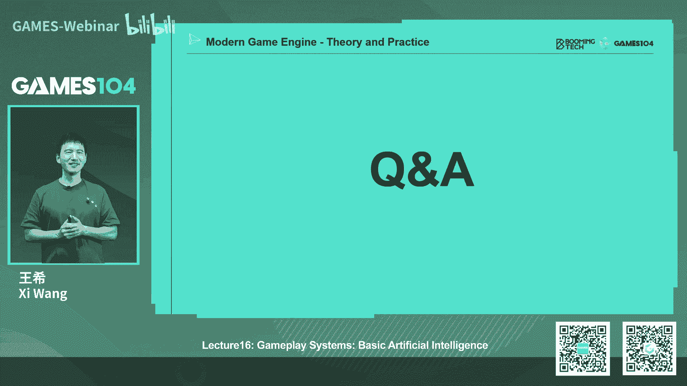
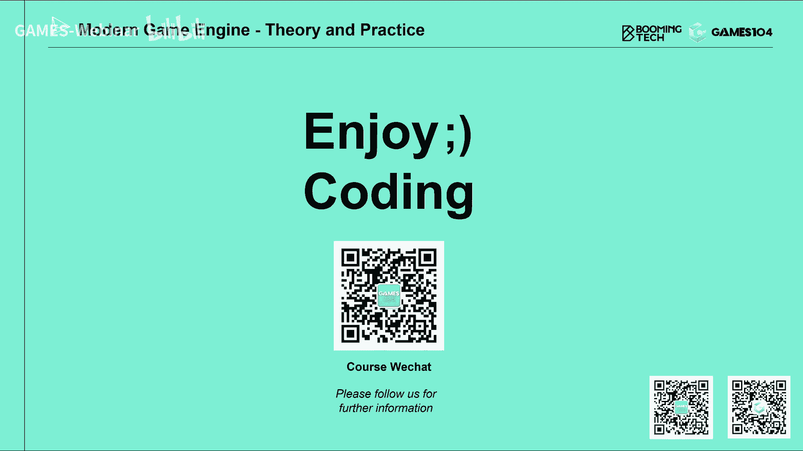

# 课程16：游戏引擎Gameplay玩法系统：基础AI (Part 2) 🧠

在本节课中，我们将要学习游戏AI系统的核心组成部分，特别是寻路之后的行为控制、群体模拟以及AI决策的基础。我们将深入探讨转向行为、群体模拟算法，并重点介绍经典的AI决策方法——有限状态机和行为树。通过本课，你将理解如何让游戏中的角色行为看起来更自然、更智能。

## 转向行为 🚗

上一节我们介绍了寻路系统，它能为角色找到一条从起点到终点的路径。然而，在实际游戏中，角色（尤其是载具）并不能像瞬移一样严格沿着这条直线路径移动。它们受到物理规律的限制，例如加速度、减速度和转弯半径。因此，我们需要一个**转向**系统来处理这些动态调整。

转向行为主要解决角色如何平滑、自然地沿着路径移动，并避免不自然的“卡死”或抖动现象。其核心可以被归纳为三大基本行为：

以下是三种核心的转向行为：

1.  **追逐/逃离**：角色根据目标点的位置，计算加速度以接近或远离目标。
2.  **速度匹配**：角色不仅需要到达目标点，还需要在到达时与目标的速度（包括静止状态）相匹配。这类似于航天器对接时的复杂速度调整。
3.  **朝向对齐**：角色调整自身的朝向，以与目标或群体的平均朝向保持一致。这模拟了鱼群或飞机编队的集体行为。

具体来说：
*   **追逐/逃离** 会根据角色与目标的相对位置动态计算加速度。它还有一些变种，如**巡逻**（在路径点间移动）和在**矢量场**中运动（角色沿着预设的方向场移动）。
*   **速度匹配** 更为复杂。当目标静止或匀速直线运动时，可以通过物理公式（如 `s = 1/2 * a * t²`）计算。当目标非匀速运动时，可以采用分步计算的方法：在每一帧根据目标的当前速度和位置重新计算所需的加速度，通过多次迭代逼近理想结果。这种方法虽然不精确，但能产生足够自然的效果。
*   **朝向对齐** 同样需要考虑角加速度和角减速度，以确保转向过程平滑，避免机器人般的瞬间转向，这对于提升角色行为的真实感至关重要。

转向系统是提升角色行为自然度的关键，特别是在处理载具、人类或生物角色时。如果没有它，即使有完美的寻路和决策，角色行为也会显得僵硬。

## 群体模拟 👥

讲完转向行为，我们来看看它的一个重要应用场景：**群体模拟**。在现代游戏中，我们经常需要处理大量NPC的集体运动，例如广场上的鸽群、城市中的行人或RTS游戏中的士兵军团。

群体模拟主要有三种处理方法：

以下是三种群体模拟方法：

1.  **微观方法**：定义每个个体的简单规则，群体行为自下而上涌现。例如，每个个体遵循三条规则：离邻居太近时产生**斥力**，离群体太远时产生**引力**，并尝试与邻居的**朝向对齐**。这种基于规则的模拟非常适合表现鱼群、鸟群等自然群体。
2.  **宏观方法**：预先定义整个群体的运动趋势或路径网络，个体遵循这些宏观指令移动。例如，在城市模拟中，设计师会预先绘制人行道、车道等**路径图**，NPC沿着这些固定路径行走，这使得人类群体的行为更加有序和可控。
3.  **混合方法**：结合宏观指导和微观规则。例如在RTS游戏中，玩家指定一个宏观目标点，士兵群体整体向该点移动（宏观），但每个士兵在移动过程中会根据微观规则（如避让友军）自主调整位置。

在群体模拟中，避免碰撞是一个核心问题。除了简单的斥力模型，还有一些更高级的算法：
*   **力场法**：一种廉价有效的方法。为环境中的障碍物生成一个**距离场**。个体在移动时，会感受到距离场产生的斥力，从而自动绕开障碍物。这种方法不仅用于游戏，也应用于数字孪生中的应急疏散模拟。
*   **速度障碍法**：更复杂、更精确的算法。其核心思想是，每个运动物体都会在其他物体的速度空间中形成一个“障碍区域”。个体通过调整自己的速度来避开这些障碍。其优化版本**ORCA**算法可以在理论上为密集群体找到最优的避让路径。虽然结果优雅，但实现复杂、计算开销大。

在商业引擎中，通常会同时提供力场法和速度障碍法，开发者可以根据性能需求和效果要求进行选择。一个专门的**碰撞避免**系统对于处理大量NPC的群体行为至关重要。

## 环境感知 🎯

在进入具体的决策算法之前，AI系统还需要一个基础能力：**环境感知**。AI的所有决策都必须基于对游戏世界的动态感知，这类似于人类依赖视觉、听觉等信息做出判断。

环境感知的信息可以分为以下几类：

以下是环境感知的主要信息类型：

1.  **自身状态**：例如血量、速度、弹药数量等。这些信息访问速度快，是AI决策的直接依据。
2.  **静态空间信息**：
    *   **可行走区域**：即导航网格。
    *   **战术地图**：由设计师手动标记的关键战术点（如桥头、掩体），AI会优先争夺这些区域。
    *   **智能对象**：环境中可交互的物体，如梯子、可破坏的墙、掩护点等。
3.  **动态空间信息**：
    *   **影响力图**：一种动态的热力图，用于表示战场上不同区域的威胁值、友军密度等。AI通过查询此图来决定行动（如避开高危区域）。
    *   **动态寻路信息**：因其他角色行动或事件发生而改变的路径信息。
    *   **视野与听觉**：AI应像玩家一样，只能感知到视野内或听觉范围内的目标。模拟视觉（有方向性）和听觉（360度，但受障碍物衰减）能大幅提升AI的真实感和游戏的战术深度。

实现感知系统时需要注意两点：一是提供统一的接口供AI查询各种异构数据（数值、布尔值、数组、空间坐标等）；二是性能优化，避免大量AI每帧进行全范围感知计算，可以通过调整感知精度、范围或共享感知结果来优化。

## 经典决策算法：状态机与行为树 ⚙️

有了导航、转向和感知作为基础，我们终于可以探讨AI的核心——**决策算法**。本节将介绍两种经典的前向决策方法：有限状态机和行为树。

### 有限状态机

有限状态机是一种非常直观的模型。AI的行为被定义为一系列**状态**，以及连接这些状态的**转换条件**。当条件满足时，AI就从当前状态切换到下一个状态。

一个经典的例子是《吃豆人》中的幽灵AI：
*   **状态**：闲逛、逃跑、追逐。
*   **转换**：闲逛时看到玩家 -> 逃跑；逃跑时吃了能量丸 -> 追逐；追逐时能量丸效果结束 -> 逃跑。

FSM的优点是简单直接，但当状态和转换非常多时，会变得难以维护和理解（“面条代码”）。为此，人们引入了**分层有限状态机**，将大状态机分解为多个子状态机，通过标准接口交互，提高了可读性，但可能会牺牲一些反应的直接性。

### 行为树

行为树是更符合人类规划思维的决策模型。它将AI行为组织成一棵树，节点类型主要包括：

以下是行为树的主要节点类型：

1.  **控制节点**：控制执行流程。
    *   **序列节点**：按顺序依次执行所有子节点。如果任一子节点失败，则整个序列失败。常用于定义一系列连续动作（如：走到门前->解锁->开门->进入）。
    *   **选择节点**：按优先级从左到右执行子节点，直到有一个成功为止。常用于定义决策优先级（如：优先攻击->其次寻找掩护->最后逃跑）。
    *   **并行节点**：同时执行所有子节点。这使得AI可以“多线程”处理任务（如：一边向目标点移动，一边警戒并攻击沿途敌人）。
2.  **执行节点**：实际执行动作的节点。
    *   **条件节点**：进行逻辑判断（如：敌人是否在视野内？）。
    *   **动作节点**：执行具体行为（如：移动、攻击）。动作节点有**运行中**、**成功**、**失败**三种状态。
3.  **装饰节点**：修饰其他节点行为的节点，例如让一个动作循环执行、延迟执行或增加前提条件。

行为树的美妙之处在于，它用少数几种节点类型，就能清晰、可维护地表达复杂的AI逻辑。它通常**每帧从根节点重新开始评估**，这保证了AI能及时响应环境变化（打断当前行为）。为了优化性能，一些引擎会引入**事件驱动**机制，只在相关事件发生时重新评估部分子树。

行为树还常与**黑板**系统结合。黑板是一个共享的数据存储，行为树的不同节点可以在黑板上读写数据，从而实现信息交换（例如，一个节点记录“已杀死敌人”，另一个节点读取后执行“庆祝动作”）。

与 `if-else` 语句相比，行为树提供了更高层次、更结构化、更易于设计和调试的抽象，特别适合描述具有中断、并行和层次化特点的复杂行为。

## 总结 📚

本节课中，我们一起学习了游戏AI系统的三大基础支柱：

1.  **转向行为**：让角色的移动更符合物理规律，自然平滑，涉及追逐、速度匹配和朝向对齐。
2.  **群体模拟**：处理大量NPC的集体运动，包括微观规则、宏观控制和混合方法，并探讨了碰撞避免算法。
3.  **环境感知**：AI获取自身状态、静态与动态环境信息的能力，是决策的依据。
4.  **经典决策算法**：深入讲解了**有限状态机**的直观与局限，以及**行为树**如何通过序列、选择、并行等节点，以更优雅、可维护的方式构建复杂AI逻辑。

这些系统共同构成了AI的“基础设施”。没有它们，再聪明的决策算法也无法在游戏世界中有效执行。在下一节课中，我们将探讨更前沿的、以目标为导向的AI决策算法，如HTN、GOAP以及基于深度学习的方法，看看AI如何从“反应式”思维迈向“规划式”思维。

---
*本节课内容基于GAMES104课程《现代游戏引擎：从入门到实践》第十六讲整理。*

