# 16.计算照明 (I) ｜ GAMES204-计算成像 - P1 - GAMES-Webinar - BV1HP4y1U7QV

今天给大家分享一下照明系统吧，像之前我们已经讲到了啊。

从最开始的呃整个的一个脉络哈，然后光学系统就是整个成像的正向过程，然后随后也大致给大家讲了整个image的一个tbs，然后再往后就是computing，就是计算的一个computing，一个tops。

其实讲到了就是上节课我们已经啊完整的cover到了整个的一个嗯，就是整个模型的一个建立，我们怎么样把这一个成像的模型建立，然后根据我们一个物理学的约束去解一个这样的问题。

但实际上本身呃原本是想给大家介绍一下神经网络去解这些逆问题的，但是后来因为看到了网上有很多教程啊，而且这个东西它比较简单啊，用神经网络去解决这些逆问题的时候，基本上就是我主要任务就是造数据队，就造数据。

对这个地方就跟本身我们就是求解禁问题的关系不是特别大，我们其实实际生活中面临的很多就是计算摄影的问题，就是大部分时间是没有这样的数据的，所以说这个时候啊这个东西在工业界应用的也不是很多。

就是它只是在一些啊极少的一些环节里面，我们可以用一个小神经网络替代，所以说这一块咱就不讲了，因为讲起来就实在是没有内容，它还是比较简单，因为整个计算摄影里面能用到的神经网络基本上就是看unit呀。

nf呀，这些整个的一个思路就是decoder，encoder，就是特征的提取跟特征的重建，所以说这个就是神经网络这部分是呃比较无聊，所以说就给大家直接进入到下一个阶段。

就是我们真正的从我们计算成像的一个四个新开始入手，我们新的光学系统，还有新的传感器，还有新的算法，这个时候今天就给大家正式步入一个新的照明系统，就叫competitional illumination。

这个应该这节课应该会持续个3~4节课，我们会从呃整个照明的一些特性分析啊，就整个计算成像问题的分类，空间呀，嗯光谱啊，或者是加上编编码呀，加上偏振啊。

整个所有的光学特性都会反映在这个competitional一个illumination，这里面，就是这个照明啊，其实啊对我们当下的一个成像系统其实已经变得非常重要啊，举个例子哈。

就是已经大规模应用的一个叫top成像，time of flight camera啊，这个就光这里面就有好多种的一个呃，对对时，对时间啊也好，还是对空间也好的一个调制。

比如说我们一个连续播的一个time of flight，就continuous wave的time of flight，这个就是我们发射一定的连续波，然后去测，然后呢这个连续波发射回去之后。

我们有一个参考的一个波，我们用在我们的一个像素传感器里面做一个相关，就是做一个就是自相关网，就correlation，这个时候我们就可以通过检测，就是这个correlation的一个相关性。

然后在不同的相位下的相关性，这个时候就可以算出来我们的深度是多少，那简单粗暴一点的呢，我们可以用一些像direct time of flight，就发射脉冲光，我直接测这个光与光之间的一个就是时间差。

但这个技术目前来说工业界还不是特别成熟，玻璃倍增管叫p m p，这个就太贵了，而且做成阵列成像不大现实啊，另一个就是spa的期间，spa期间这个这几年变得非常热啊，像单光子探测。

这个spa是可以做成阵列的，但现在工业界并没有说呃真正的大规模应用，当然这个因为它有很多难点并没有被克服，比如说这个随温度的变高，它的一个就是叫黑暗技术吧，就是我们就counting时候的噪声会变大。

但热稳定性就不是特别好，本身的封装工艺测试工艺也没有特别成熟，所以说这个目前工业里面应用的还是以像双目结构光啊，还有呃他们flash为主，这个就是对时间的一个调制，但还有一些很奇怪的哈。

今天呃就正式给大家讲一下，competitional illumination，这个非常有意思，大家可以仔细听一下这节课。

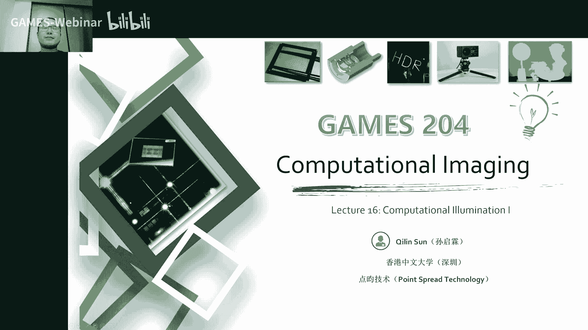

就今天因为这个ination这个课程内容会比较多哈，就今天可能能覆盖的内容不多，所以说我们会拆成把这个整个拆成几节课去讲，今天就可以讲就是前1/4的部分呃。

第一部分就是duration has intensity，就是我们在拍摄照片的时候，或者是avideo的时候，没珍它的一个持续的一个时间就曝光了时间，还有他的一个intensity强度的一个问题。

然后第二个课题我们今天会讨论到的就是我们光源的位置，还有光源的一个嗯，就是照明的一个方向吧，就我们会给大家讲一下，这个通过两个例子啊来举个例子，像reliant这种，就大家做那个拍电影。

我这个人在摄影棚，但是我想要拍到这个像星际穿越哈，我们要拍到另一个星系那种感觉哈，这个时候我们这个天上那个太阳可能一个太阳就变成两个太阳，这个时候我们那个照明咋办呢，但实际上拍的大家都是摄影棚哈。

我们这个时候那就需要有一个reliant的一个工具，像传统的一些摄影里面，这个reliance通常都是先捕捉到一个目的地的一个光源，就是我要拍，比如说我要把这个人在摄影棚。

我要拍一个比如说洛杉矶的一个背景，我先把洛杉矶那儿放一个摄像头，我把他的一个我用一个呃反射的一个球啊，把他的一个lighting，一个condition捕捉到，这个时候在我的一个摄影棚里。

我有一个呃大一个球形的一个光，可以编程的光源，然后可以根据我捕捉到了一个关心的情况来给他做了重照明，而这几年这个技术变得先进了哈，这个大家可以很多时候会用一个小神经网络的办法。

就是直接把这个reaction给做了，当然这个时候还会有很多artifacts没有很完美，然后再一个例子就是呃我记得我们深度深度图像的一个边缘，这个是怎么捕捉的。

这个是用一个multiflash的一个方式来，今天就给大家正式讲一下这个lighting的一个，但我们想到照明的时候，其实是最古早的一个照明的话，一八几几年的时候。

那个时候其实没有很多一个符号广泛关注照明这个问题，其实大家那个时候只是我能拍到这个就可以了，所以说对照明不是很关注，哪怕到了今天啊，就是大家可能拍照的时候也没有特别留意这个照明的一个情况。

就这大部分的一个，而同学们都没有注意到这个照明的情况，但实际情况就对一些比较专业的一些选手，我们会选一些就是光线情况比较好的时候，比如说大家喜欢啊做直播，这个要显得脸皮肤比较好，就打的比较光比较强。

显得比较白，这个也跟舞台相关，没有影子，这个我们足球场我们也需要呃几个方向的灯，同时达到这个足球场来避免这些影子对球员的一个干扰，那么还有各种各样的打光的光源，像我们摄影棚里面会有各种各样的一些光源。

当然我们这个照明的一些设备也变得就更加聪明，就是现在照明的设备还是又可以调时间，也可以调它的一个色温，所以说这个但这种可以编程的一些光源还是比较贵哈，一般好一点的光源还是要几万块。

和今天刚买了一个这个光源，就很很高兴哈，花了几万块钱买了一个光源，但是这个是真的是十分有必要，而我们在这个照明的时候，我们有哪些参数可以去调节呢，我们第一节就讲的是我们曝光的一个时长duration。

还有它的一个光的强度，intensity，然后第二个章节我们讲的是就光的一个位置，我们光源的位置，还有光光源照射的角度，然后第三个呢我们是要考虑这个就是光源的一个背景啊，就是就是背景光。

背景光是什么样子，当然本身光源自身啊，还有一些它的颜色啊，它的一个波长啊，还有它的一个偏振啊，这些因素统统都要搞定进去，他除此之外，其实呃近期的这这近几年的一些文章啊。

大家通常会对一个空间跟时间的一个调整会比较多，举个例子我们空间的一个调整哈，比如说我们的最早的一个connect的一个3d相机散班结构光，当然还有现在这个条纹结构光诶。

通过这种结构光的一个方式来把一个三维的，一个呃形状重建出来，这是一个应用，举个例子怎么调时间呢，比如说像hdr modation，就是我们嗯要曝光不一样的时间，然后把这个光线强度调的不一样。

这个呃比如说hdr，比如说像刚才讲到了一个time of flight image，这些参数是我们列出来的，就是大部分的一个嗯参数我们可以调节的，那说说这个还有so啊啊这些参数。

下面来看一下这些到底是怎么应用的，首先第一节我们讲到的是一个duration intense的一个问题。

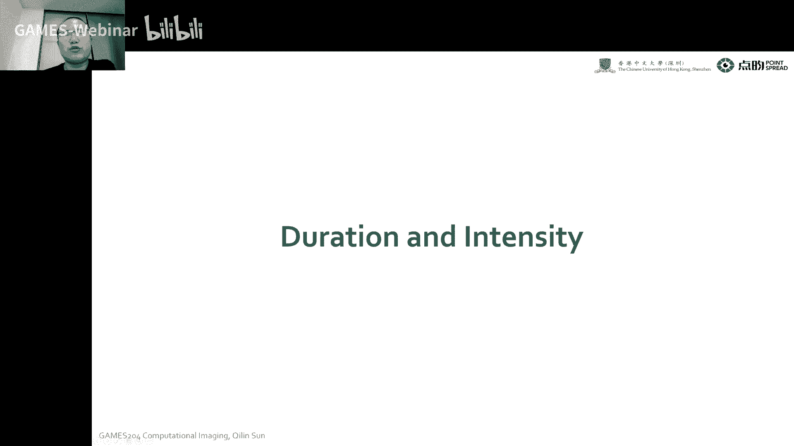

当我们回想到一个高速摄影，比如说我们在呃1930年代这个时候叫这东西，叫啊sos scopy，这个shop，就是呃就是闪就是那个闪光的那个意思，这是那个时候就是在上个世纪的时候。

人们就已经可以通过电信号呀，或者是声信号或者光信号来同步，我们在一个高速的一个摄影，就是我们要拍到这个子弹穿射这个苹果这个视频，因为我们不想要太大的数据量嘛，这个时候我们就需要一个精准的一个时间同步。

时间同步之后，因为这个速度非常快，这个我们这个本身相机感光度有限，还是我们目前啊我们用到的一些像ccd啊或cmos啊，这种数码相机，这个时候，我们都需要一个很强的一个闪光灯来保证在我极短的时间内。

我可以捕捉到呃一定的进光量，这个时候啊这个intensity本身就变得非常重要，所以说呃通常大家是用一个强闪光灯来跟这个枪做一个同步，这个时候大家就可以嗯拍到了这个整个子弹穿过苹果的这么一个过程。

嗯还有一种有意思的玩法就是叫multiflash screenshoal photograb，这个我们在你看我们下一行，下面那一行是整个相机曝光开启了一个时间段，唉这个时候我们在全局曝光。

然后我们的一个flash我们可以看到那个黑色的部分，flash开启的部分，这个时候就可以拍到诶，我们挥舞球杆的这么一个过程，这个很有意思啊。

当然这个我们之前课上还讲到过，像flash and not flash grab，再举个例子哈，我们再recall一下，我们捕捉到了一个呃，这个没有flash的情况下。

我通常不会觉得这个背景实际上是比较真实的，这个是我们我们啊实际上就可以看到的这么一个呃情况，当然我们在有flash这个情况下，这个因为在没有flag的情况下，整个光线会比较昏暗，比较弱。

这个时候它的图像的信噪比不是很高，但是它有个特性就是比较真实，就是它真实的环境就是这个样子，这个时候会有细节的丢失，但是我想通过flash来弥补这个不足，但是，flash拍照的图像又是什么样子呢。

我们可以看到下面这一部分这个flash拍照的图，它有非常多的一个高频的细节，对不对，而且整张的那个图的信噪比是比较高的，因为它光线比较强，它的信噪比比较高，这个时候。

但是这个时候跟我们真实拍摄的到这个昏暗的场景是不一样的，我们想把这两张图的一个优势的信息也融合在一起诶，最后我们通过一个flash and not flash的一个融合就可以拿到右边的那张图。

它既摆脱了噪声的影响，同时也保住了一些像高频的边缘啊，这些信息，他有兴趣的可以话，可以读一下这几篇论文啊，这个表有兴趣了。

这个这节课讲完，这个新作业就布置下去了，这个论文肯定是要看的，那具体是怎么实现的呢，我们这个有两张图哈，一张就是没有flash的一个图，还有一张在flash的情况下拍的图。

我们是用了一种方法叫重by letter future，这个地方对这个没有flash的image，我们呃先对先用一个bt future把他的一个intensity给它提取出来，我们叫a base啊。

把它叫dels，叫a base，然后我们的这个这是它的一个低频成分啊，这个低频成分很重要，然后第二个部分是我们通过一个种子by letter future，把它的一个颜色信区啊，这个颜色信息啊提取出来。

他对flash imaging，我们是想要得到这个flash image的一个details，就是它的一个细节上细节的一些边缘的一些东西，当然这个开那个flash会有很多问题啊，比如说像我们这个影子呀。

还有这种闪光，有很多耀斑啊，那个点，这个时候我们对这些影子跟这个speker的地方通常是加一个mask，把这个给扣掉啊，这个就这个加一个人工的一个mask，把这个给扣掉。

这个只能影响我们最后呃融合的一个结果，到最后我们就可以通过下面这么一个式子，来把这个呃左边的一个diy的一个information，就把他的一个真实的背景环境，光跟右边的细节融合在一起。

就得到了我们又干净又，符合真实人眼观测到的一个环境下的啊，这么一个呃融合过的一个flash，not flash amazing，这个我们要得到这个details。

首先我们要因为我们拿到的是一个intensity，在一个y u v月哈，我们这个外通道达到一个intensity，经过一个filter之后，我们拿到一个低频的一个largesgo的图。

我们把这个两张图按像素一除，这样就拿到了整个它的一个细节的一个分布。

那除此之外啊，这个flash跟not flash photography通常还用到这个flash hdr也没几，就是有时候在我们夜间啊，比如说像左边那个场景，就是他比较昏暗，远处的地方比较昏暗。

进去的地方呢面有一个灯的影响对吧，它这个动态范围差的比较大，但是这个差的有点太大了，远的地方近的地方这动态范围差太大了，这个怎么办呢，就哪怕我这个对就我这张图进行了一个mtt的图者，把它few在一起。

但是这个动态范围差太大了，就很多暗的地方还是有点暗，就是我做tomap的时候，也没办法对这个很大的动态范围进行一，个很好的压缩诶。

这个时候人们就想我可不可以把一个flash我既变化我的export time，同时也调整我的一个flash的一个就是illumination time，这个时候我们通过两个维度的一个调制诶。

来获得这么一个flash的hdr美景，是啊，左边这个是我们调曝光时间，调不同的曝光时间融合到了一个hdr图对吧，右边我们是调不一样的一个flash的一个亮度来融合到了那么一个图诶。

把这两个图结合在一起就可以拿到了一个呃又保持到细节。

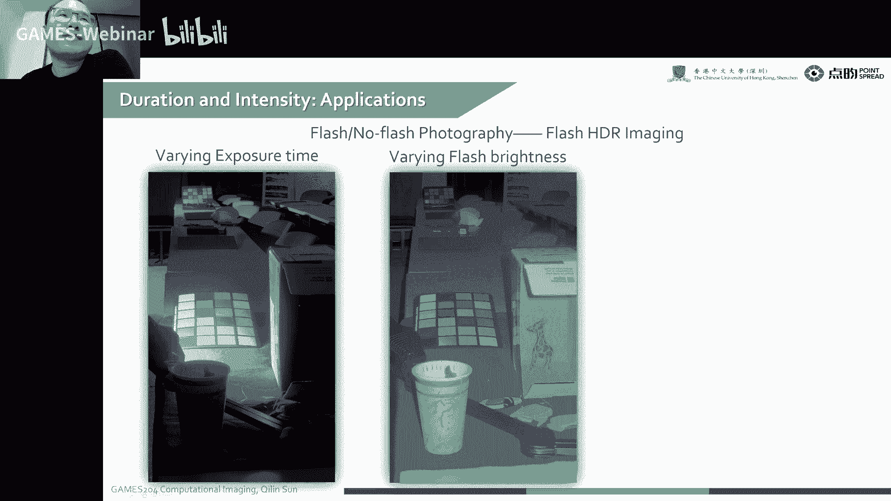

然后呃背景啊，前景的细节都保持得比较好的一个呃这么一张flash nor flash融合的一个hdr，图像啊，这个是呃flash fhdr一面镜的一个应用，但我不知道现在手机上有没有用到，这个可能有哈。

大家可以呃，我估计可能那个google pixel 7可能会有，大家可以搜一搜哈，这不是很确定，那这个是我们课上讲到的哈，这个是我们可以去通过啊。

flash can not flash hotogra费来去除啊，我们这个flash上的一个这个一些反光的一些artifacts，这个原理呢就是大家刚才也讲过，他就是对一个规定的一个投影，通过这个投影。

因为我们知道这背景光跟这个闪就是闪光灯闪出来这个光，它那个鬼点子一个方向应该是一致的，对不对，所以说但是整个这个reflection的一个layer，就是我们这个鬼点。

它就跟我们这实际上这个画了这个detail这个规定，它它应该是不一个方向的，所以说通过这一个矢量的方式，我们就可以，很轻松的把这个呃背景跟这个反光是分离啊，拿到一个比较好，像这的一个呃，再放一张画。

然后第二部分我们讲到重点了哈，这个叫light position，还autation，也就是我们光线的一个位置跟照明的一个方向啊，这个是比较重要的一个课题。

嗯很古早的时候就是1992年啊，paul hair valley，这个时候嗯大家想搞一个呃synthetic来听，就是我们合成的一张光源的一个图像，当然这个问题就变得非常简单，这个非常简单的一种玩法啊。

左边一个灯照亮了整个c的一个左边，右边一个灯照亮了整个c的一个六，右边诶，这两张图一减，我就拿到了，像最后下面这一张人工合成的那么一张图像，诶这个是很古早的一个工作哈。

但到了2000年左右的时候，这个是当时啊paul that week，那时候最早是在uc berkeley做国货的时候，就开始了他的一个listage的工作，但现在可能已经到了好多代了哈。

已经到了七八代十几代了，到x代了，这个是什么样呢，他是做了一个programble的一个啊灯箱就是我们这一个很大的一个大球啊，还有啊很多个相机，还有很多个这个呃可以编程的一个光源。

但同样的这个工作大家也可以参考一下这个我们上课大的余景逸老师，他那也有一台，他们自己搭了一套非常大的一个设备，这个很有意思，哎这个有什么作用呢。

比如我们想要实现这个一个image base relion，我们要实现一个纯打光，我们面临这么一个场景啊，比如说我们我们的一个actor在他的一个摄影棚，比如说我们在洛杉矶。

他在一个摄影棚里面要拍摄这么一个场景，但是我想要的背景啊，实际上是不是在意大利的米兰对吧，然后这个我们要怎么样在摄影棚里面拍出来，跟在米兰一样的这个灯光的一样效果呢。

就是我们想要这个人完美的融合在这个背景里面，而不是简单的把这个人扣进来，然后再放进去，对不对，就我们之前我们讲到过呃，这个pom blinding，也是pos融合。

这个泊松融合是可以把人比较好的融合到这个背景里面，但是比如说我们人脸面部的这个光，怎么样才能跟背景的自然光去完美的就是融合在一起呢，所以说这个时候这炮台这个listage就起到了一个很关键的作用。

这怎么实现呢，比如说我们第一步我们要背景是在米兰哈，我们要捕捉到一个米兰的一个光线，怎么办呢，还是用一个足以写比较常见的办法，我们用这个光球就一个呃镜面的一个球吧啊这个地方还做了hdr。

我们就不同曝光性方面下了一个这个a c r的这个，光球这个时候是捕捉到在米兰那个地方的一个呃光的一个背景对吧，这个时候啊这是抠图，但是在抠图啊，这个土豪妹同学问这一步也是抠图，这是抠图不假。

但是在抠图之前，我们要先把这个就是我们背景图像的一个光线情况，来反映到这个模特身上，就是比如说我这头顶上照着这个脑袋是吧，这个我们要跟后面的背景一样，在头顶上照着这个脑袋对吧。

所以说第一步我们是要捕捉在这个比如说在米兰的这个地方，它的一个光线的一个情况对吧，我们知道这个光线的情况之后，然，后我们在摄影棚里面就可以通过这么一个大的一个这个，对这个小伙说的很对。

这个live cg就模拟一个天空盒，这个想法就很对，哎我们就可以通过这么一个光球诶，根据这个捕捉到了这个这个光线情况来给这个actress，就是个演员来做一个realizing。

这个时候对这个演员的一个照明，就感觉跟这个呃在我这个米兰这个本身的这个环境里面是一样的是吧，但这个本身也是经历一个抠图再放进解决过程，那这样的情况下，整个光线啊，像这个我一定中奖同学说的一样。

就是它的光光源保持了一致，唉这个是就是20年前的一种玩法，到今天可能变得更先进了，但我不知道这个电影里面用没用，但是这个像我们今天讲，这个是已经在电影里面得到应用的。

当然现在有一些更先进行一些与拉近的方法，就是直接我们先把这些图采回来，要通过gpu搞一个假的光源，再给他做reaction，有时候也通过神经网络给他做一个reacing啊。

这种啊很多玩法都有的哈，对这个是的，那我们可以看到像我们比如说不知道这么一个图吧，当然我们对这个呃不好意思，我这个，卡了，诶，这段剪掉，所以这个跟服务器联系联系不上了，但这个时候效果可能还是不如真的好。

还是这个搞个大的盒子比较好，像这个东西啊，以前像最早是在berkeley，那时候叫paul rc，后来pvc就去了别的地方了，当然这个东西一直在做，到现在可能还在继续做，一共可能有20年了。

但后来像这个last stage这个东西也慢慢的发展，因为我们除了光源自己啊，我们还是可以呃加很多相机的，这个加了很多相机之后，我们各个视角的相机，我们就可以把它当做一个工厂。

实际上它也是一个广场捕捉的一个东西，它可以对人脸啊或者人体啊进行一个很高精度的一个三维建模，因为我们都可以用4k8 k相机嘛，这是没有问题，然后做个同步，可以对这个人脸进行很高精度的一个建模。

这个建模之后呢，我们就可以根据这个模型，然后再用graphic方式给它做relighting诶，这个时候也可以把这个数字能完全重建出来，这个呃多得了一些比较广泛的应用诶。

这个给服务器联系上了，我们继续。

当然我们可以看到我们这个整个人头放在上面，反对这个光源的反应。

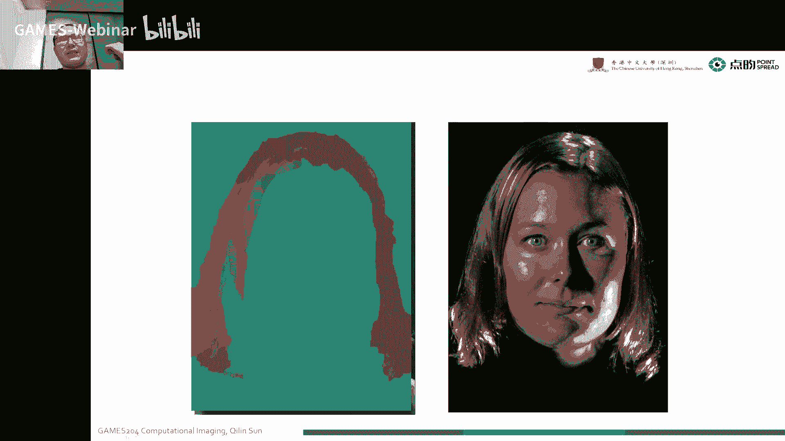

唉我们用一个呃，就是mask把这个标标记出来哈。

当然这个像这种东西就变得会比较昂贵，但是我们后来哈有有一个叫叫bobby，bobby，跟这个cindy这几个人就做了一个非常便宜的一个table top的composition lighting。

就是什么背景呢，我们要呃捕捉到一个呃非常清晰啊，像右边那个图哈，我们可以看到每个地方的细节都捕捉的非常清晰，它没有一个明显的阴影对吧，也没有一个明显的一个specular。

我们怎么样获得这么一个呃干净清晰，不受背景影响的一些图呢，这个我们一项之前比如说我们要规定一个很大的一个listage，这个是非常昂贵的，就我们知道可能之前上课大内余俊逸老师，可能那一套叫超几百万啊。

这个很贵，一般人大家都搞不起啊，这搞不起咋办呢，这个就有便宜的办法哈。

在我们拍到一张图的时候，通常我们看到这这么一张图上面这个地方过曝，我们想要把这个上面这个地方加暗一点对吧，他是受到一个呃有一些就是specter的反光的一个影响，然后这个地方呢又又有阴影的影响。

诶本身这个就是茶壶啊，它的一个壶体有点太暗了，它本身这个呃也是受到了一个呃shadow的一个影响，就是一个影子的一个影响。

但我们这个时候就可以通过一个sketch做一个sketch的optimization，来把这些地方都抑制住，然后亮的地方优化上来，按亮的地方优化下去，按地方优化下来。

是不是这个时候通过一个target这个sketch是可以把这个呃都优化掉的。

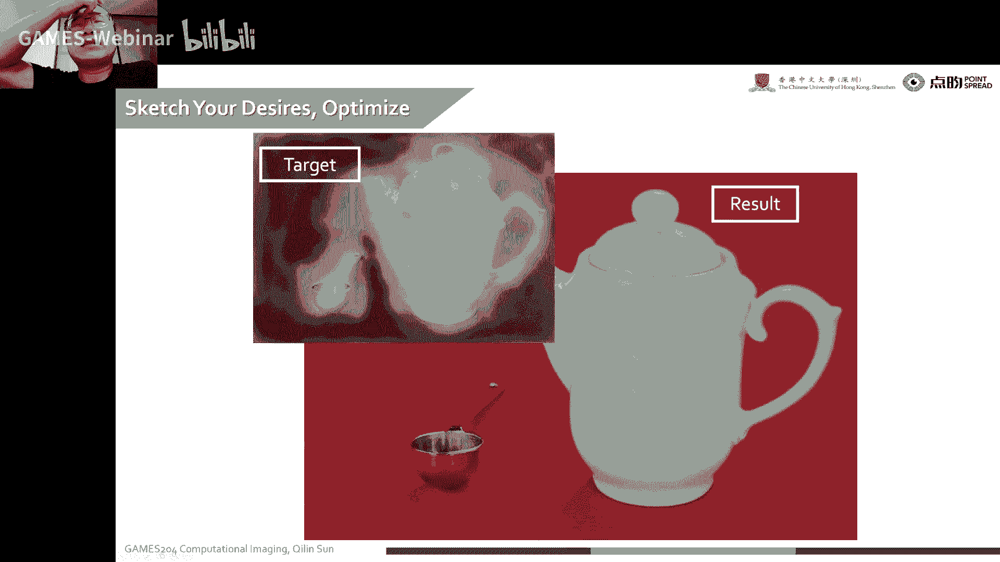

当然这个时候也要结合我们的一个照明，首先我们要对这个这几个方向啊，就拿到这么一个照明来，拿到一组就是basis mage，叫基图像，基图像的一个一组基图像。

每一组基础项我们是已知这个光源照明的一个呃位置的，比如这四个变化就是照明就对应的啊，这12344个位置啊，这个也很明显，这个横着的地方影子越长啊，这个很明显。

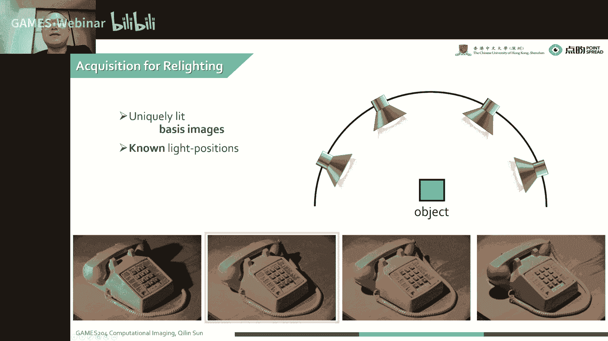

但比如说像我们像像刚才那个情况，我们要避免我们像一些speculate的一个反光呀，其实呃像这个top的image实际上就是用一个模拟了，一个用一个模拟了，就打到一个天花板上。

让一个天花板的一个漫反射来做一个公园，然后再通过我们不一样角度的一个呃调节调节吧，最后再把这个图fs起来，就可以拿到一个像我们刚才看到了各个地方都非常清晰的这么一张图。

我们可以看到这个我们这个照明这个打光这个东西是可以，也就是我们上面这个面光源是可以呃，不买各个地方的啊，这个就比我们搞一个大的一个呃last stage，这么一个照明阵列就会便宜非常多。

便宜非常多，那这个右边这个好，这个看着像机器人这个东西啊，它不是机器人，它实际上就是就我们刚才讲的那个光源，关于达到天花板或者墙上各个位置诶，我们这儿摆了一个相机。

然后我们就可以对我的一个目标物体来进行，就比较便宜啊，这个比alice day还是便宜很多。

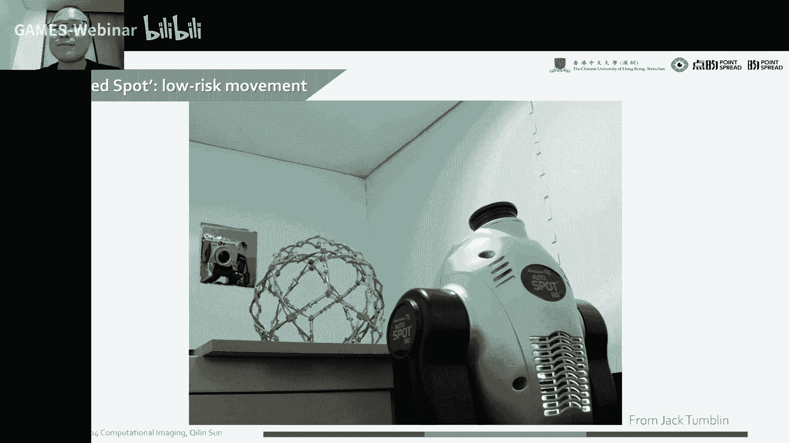

它本身哈假如说我们要用一个点光源的时候对吧，我们要假如说我们呃特别是我们嗯早期哈，早期我们做这last stage时候，他有很多很多的点光源，点光源打断一个物体的时候。

我们就它的一个影子的边缘是非常锐的，影变也非常锐，这个时候我们就挺不喜欢这个，我们其实是想模拟的一个这么一个面光源，shadow也比较soft，面比较大的时候呢，比如说360度的一个完整的一个面光源。

照出来这个图像就是非常完美的一个弹射好，所以说像刚才那种玩法，就是通过，墙面的漫反射来造成一个比较大面积的一个面光源，来实现一个更smooth，哎这个东西慢慢的也被大家就是玩出花了哈。

这个这个东西叫light wi，就当时人们在拍摄这么一个车的这个场景，大家把像这像头固定住，然后这个呢有一个老哥就拿了这么一个就是光源，然后他挥舞的这个光源，然后在这个车各个角度给它进行照明是吧。

这个时候我们然后这个同桌人看了，通过这个东西干了什么呢，我们在这个挥舞的时候不断的拍摄图像，就拍摄了好多好多张，我们就可以，我们人类是通过这个东西啊，实际上是啊恢复了整个光线的一个角度哈。

就是大家直接把这个照明的这个每个点的位置直接给估出来了，这个这个时候就变得非常有意思，实际上是拿到了一个比较完美的一个就是多角度，一个就是lighting box吧。

就是我们在一个各个方向都拿到了一个照明，就把它合成起来，那同时我们也可以把这个啊光线照明的一个角度来给恢复出来。

当然我们本身我们这个competition 1 ation叫计算照明，有时候我们还是想要实现一些嗯4d的一个ation，比如我们新型的相机啊，就是这个比如就是说白了就是拉黑的camera，就光场相机诶。

这个时候我们实际上是想对我这个光线的一个角度进行捕获啊，同时我们还是想希望有一个light to display来把这个角度来呈现出来，哎这个时候我们就可以直接a观测到我们这个裸眼的一个3d。

假设我们屏幕可以啊，实现这个广场的一个显示，我们跟各个视角都有不一样的一个观察，这个时候我们就可以看到一个裸眼3d效果，这种就是比较小高话题的一些产品，比如像google的一个style。

这个就是大家一边放了几个3d相机，然后我们这边放一个裸眼3d显示器，重建之后诶，比如说咱同学们在家里也摆了一个裸眼三的一个显示器诶，再摆一个三维重建的一个实时三维重建的一个设备。

这个时候在上课就可以那种面对面的交流一样，就不再有一个呃屏幕录像的这么一个隔阂，当然这个是怎么做的呢，实际上像这种我们可以对像除了对，因为以前很多玩法，或者是一个叠层的lcd。

但这个时候我们是可以通过调这个4d的一个illumination来实现的，一个这个light fi的一个capture，实际上我们就是对4d一个4d的照明的一个厂的一个嗯，就是一个调制。

再加上时间的调整，加上波长调制，哎我们这里又拿到一个8d的一个remodator是吧，我们拿到的信息是8d的，有啥呢，xy对吧，时间xy俩了俩俩维度了呃，时间第三个维度rgb诶，六个维度。

光线角度fda，这个又是两个角度，哎，这个时候我们捕捉到一个八维的一个图像啊，这个很很很恐怖的，对不对，但是我们可以把这个八维图像通过like to play就可以给大家呈现出来。

它是一个很高纬度的一个信息，这是给大家科普一下，后面，会给大家专门讲到一个let field呃，eming and display，这个地方非常有意思，这个广场其实很多时候就是做计算摄影和计算成像的啊。

同志们经常会把这个that field当成一个整个计算成像的一个，灵魂性的一个东西，就哪怕到了今天也不是很完美，就和相机阵列呢就是像素密度像素太多，大家上动用light field，用用一个呃。

像maplex array呢摆在一个胶面上，这种会便宜，但是它的分辨率有限，那这个就没有很令大家完美的一个事儿。

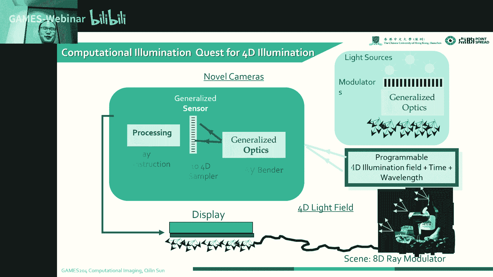

那么有很多呃4d lis是一个呃例子哈，比如说像我们这个pol demic，2000年就是最早的一个last stage工作，但后来这个这当那个时候古早时期大家反色都比较简单哈。

就是通过手拿着这个照明啊，然后来在拍摄，然后还有后来就慢慢达成一个一个小阵列了，一个各个方向的一个小阵列，这个时候我们可以解释它的aido哈，我们是可以对他的abele进行recover。

到了后来就有last stage 3，这个2000年作为一个last day 3，但后来后来也有非常非常多的工作，到了今天，就是这个时候，摄影棚里面已经是真正的得到了，一个工业化产业化的一个应用。

哪怕它的市场不是很大，但是也是做到了一个产业化的应用，那除了这个之外，我们举第二个例子讲，now forealistic camera，这个时候我们是想捕捉到我们深度信息的一个边缘是吧。

我们怎么样捕捉到一个深度信息的边缘呢，就是像我们这么一个装置哈，我们通过四个flash，我们再看看这个看这张图啊，12344个闪光灯，我们把这四个闪光灯分别的放在我们这个相机的四周。

这个是为了解决什么问题的，因为我们现在好，我们捕捉到一张图，我们可以用一些像就是图像处理的办法，比如像呃sober filter或者是呃高级一点。

我们用candy canny算子是可以把它的边缘提取出来的，但是这个边缘只是它强度信息的边缘，它深度信息的边缘是怎么提取呢，就是很多时候我们没有一个深度相机啊，一个专业的深度相机。

我这个深度的边缘不是很好提取，所以说这个时候通过这种呃四个就是方向的照明的地方，我们是可以把深度图像的一个边缘来提取出来的，这个时候也可以，结合一些深度相机一起用啊，这个两个这个边缘应该是挺好的。

就可以结结合在一起的，来举个例子，哎这个东西我们之前rua起了个名字叫depth age camera，就是我们现在我们的灯右边那个闪光灯亮的时候，我们照明到这个物体上。

我们可以观测到诶这个地方有些影子，这个方向就是给它嗯，顺着这个光线照过来，这个后面那个方向是有些影子的，对不对，我们换一个方向，发现影子变了，变到下面这个地方，诶，我们再换一个方向。

把这个灯下面这个灯亮起来的时候，我们可以到这个影子变化就在这个地方，同样的原理，我们把这个放到最左边，椅子就会变到了右边，我们可以看到这个影子的产生，阴影的产生啊，就在边缘，这个阴影的产生。

它是会随着光线照射角度的变化而变化的，而且这个并不是跟他强度相关的一个东西，这个是这个影子是随着它的一个深度变化而变化的，对不对，所以说这个时候我们就建立起了这个光线照明跟这个深度图像呃。

深度信息它边缘的一个关系叫depth camera。

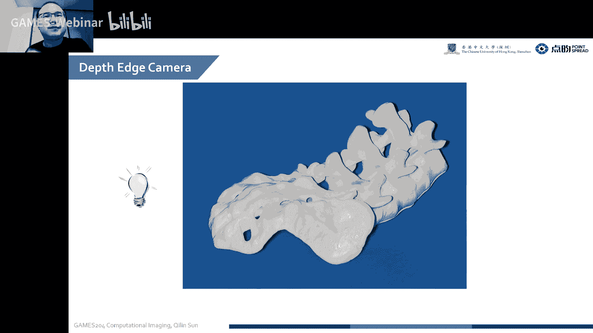

这个时候我们通过把这四张图像然后一起合成起来，通过这个internal external的一个呃，就形状的一些边缘啊，这个时候我们就可以提取我们整个深度信息的一个边缘的一个部分。

这个其实我们可以看到这个边缘还是比较完美的哈。

因为这种在不一样方向的照明，我们可以实际上得到的是啊，就是深度的一个就是随着物体有深度变化位置的一个投影对吧，我们可以看得到上下左右诶，四个方向不一样的照明，把它的边缘提取出来。

就可以得到depth的一个age。

我们其实对比一下我们以前常见的一个概率算子啊，就第一张图是我们把这个看这扇子里面的西格玛调到九的时候，就是把这个滤波器调的比较强哈，这个是这个时候我们拿到了一个边缘，但这个边缘跟deft边缘是对应的吗。

实际上我们可以说是不是的，我无论看西格玛a9 啊，西格玛a5 啊，和西格玛一，西格玛一可能造成多一点，边缘会多一些，假设我们这个拍的这个石膏石膏模型，它是一张图，我这个时候用ky算子。

到时候我们这图里面的那些纹理啊，这是完全不知道的，对不对，跟这个我们这种方法呢，我们这个用四个照明来提取边缘，这个方法假设它是一张图的话，图里面的纹理就不会影响我最后实际上得到的边缘，我无论怎么照明。

也不会有一个阴影的感觉，他说这是一点提升好，这个时候是ky sans做不到的一个深度边缘的一个提取的，这是ky sans本身做不到的。

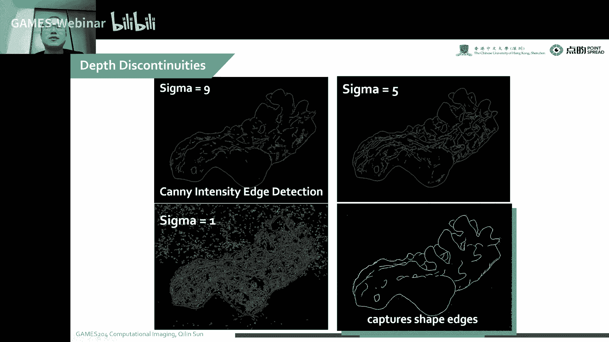

这个是源于一个det的一个discontinuity，就是deft的一个不连续的一个问题，大家可以看到ky算子，无论这是一个图啊，还是一个真正的物体，我都可以把这些就是边缘的地方就是都给搞出来。

但是啊要是这种四个灯泡给它照，照明不一样方向照明的时候，诶这个是实际上就是他真正的一个deft的一个边缘，就我们现在有很多深度的一些图像传感器哈，它的一个边缘不是很好。

其实这个地方就是可以对这个边缘进行一个引导，来给他做一个增强，诶这个大家有兴趣有兴趣的同学可以联系我给大家。

可以搞篇论文做一做，像那除了这个之外，我们depth camera还有什么用呢，比如像我们这么一张发动机舱，就我们可以看到这个这是很油哈，这又有线啊，又有这些油啊，他这个是很复杂的哈。

这个乱七八糟我们并不知道里面的信息是什么样子，哎这个时候我们可以看到，当我们用这种depth camera，就可以很清晰的把这里面的一些边缘的信息都提取出来，这个就可以把他的sketch。

实际上就把它的一个sketch提取出来，像candy算子呢，我们也可以看到这么复杂，这么乱对吧，我们这里面的一些呃秀班啊什么的，这个看那扇子还是都给他，提出来的这个非常多的一些杂乱的信息，我都不想要。

假设我们看到右下角这张图，我们又看见扇子的一个提出来一张图，我们还能知道它的内容是什么呢，我们恐怕很难知道这里面究竟描述了一个什么东西，但是我们只是对它的一个depth进行提取。

实际上这个就是从一个搜索变成一个sketch，就这2年可能大家看到的论文有很多啊，像craft的论文就有很多，像sketch到一个photo的一个变化，那当年这个photo是怎么变成sketch呢。

哎这就是其中一种比较呃有意思的一种方法吧，就是它可以真正的把sketch里面想要的描述的信息提取出来，也就是我们深度的一，个边缘信息，但除此之外，大家都看到这个发动机舱了。

还有没有想到有其他的一些应用呢，那我们的说明书对不对。

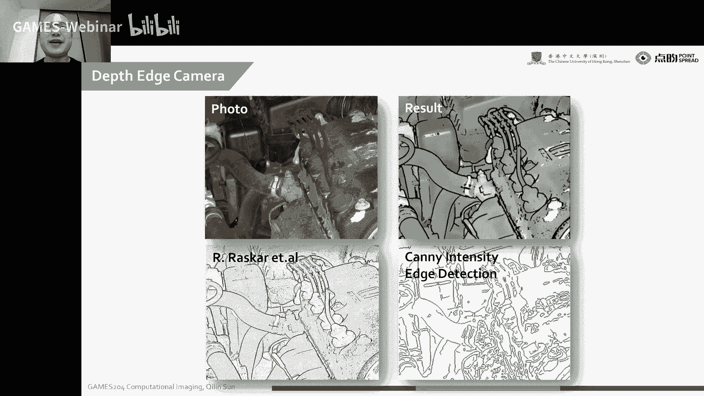

我们说明书想要表示有用的信息，那我们先看一下这个呃depth这个图是怎么获得的，你看我刚才那个还是那个相机哈，左右上下四张图，把它变化的部分诶，通过这个呃dex提取出来。

这个时候我就可以拿到一个很清晰的一个sketch mac，当我们看到这个时候，我们就恍然大悟，对不对，像左边这个左边这个发动机舱对吧，这么乱，要给用户看呢，其实是很难看到我们这个到底是怎么个情况的。

哎我们想要诶，我右边这个图我们就可以通过我们这个decamera一个方法，这是他的一个比如说我们要怎么样灌机油，我们这个这是机油哈，不好意思，我们把这个位置标出来。

我们就需要一个比较好看的一个sketch，跟我们的这个图像是相对应的，我们拍一张照，把它转换一个sketch对吧，这个时候现在这种方，法就变得非常的管用，这个这我是土豪米，同学是咋感觉完全改变了。

这是什么意思啊，这个是这个举个例子哈，这不是完全对应的，这是只是部分对应的，这个管子的地方还是对着的。

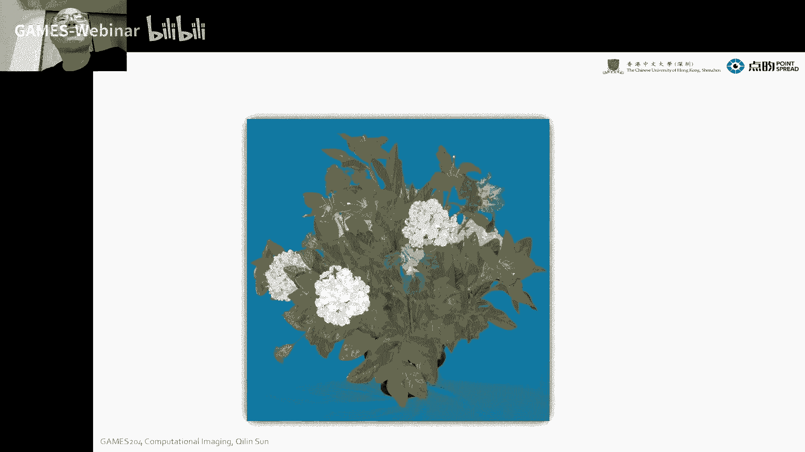

那还有一些用法，比如像我们拍这个花的时候，诶，我们想把这个花的一个sketch，就是它的一个草图提取出来，对不对，当然我们要用传统的kenny下提取这个草图是非常非常困难的。

那这个东西实际上原理上是比较简单哈，就它是我们捕捉到一个shadow的一个呃位置来重现的这个嗯，把这个shadow的位置提取出来，来，把这个边缘就直接复现出来，这个很简单。

就我们整个我们可以看到camera啊，比如说这个是图形学的模型，这是我们一个点，我们图像传感器这个ik啊，我们这这是一个典型的一个图像reaction的一个模型哈，我们在这个就是把这个光线往前追的时候。

追到这个object的时候，诶，这个它的这个shadow就是可以沿着它的一个呃这个极限的这一个，这一个方向，但我们可以看到这个图像上在不一样方向打光的时候，我们就可以看到整个shadow。

就整个的阴影沿着这个我呃深度变化的一个边缘，它的一个分布，也就是我的一个极限跟我的一个呃阴影是在时间23嗯，一个相相相对的一个呃边缘哈。

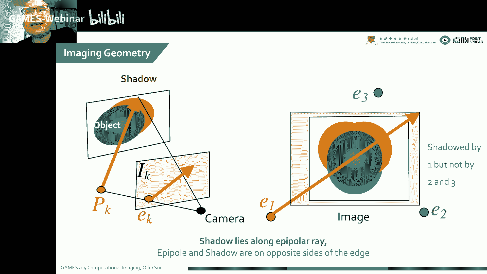

对这个大家可以啊想一想这个最后啊，这个就是整个一个depth edge开放的一个模型，就是我们在相机四周放四个闪光灯，然后这四个闪光灯呢交替曝光啊，交替曝光，然后最后把这四张图像融合在一起。

其实这个整个算法是非常简单，这个西瓜论文啊，这是2000几年的时候，这个大家同学们可能也会感慨一下，这个出生的晚了，这个整个论文变得越来越复杂，2000年初的时候呢，这个就已经可以发c graph了。

但是到现在整个发c graph就变得非常困难啊，越来越困难了，这个是比如说大家偷偷懒，要想有两个光源，这不left flash跟ruflash诶，我们对这个拿到了这个边缘进行一个先归一化啊，先归一化哎。

我们这个变化的一个位置，我们要把这个变化的位置换出来，这个边缘实际上就是我们呃depth age的一个位置，我们把实际上把这个下降沿提取出来就可以了，就把第一个下降沿提取出来，那最后一个上升沿提出来。

这个时候也呃也是没有问题的，就就是我们left就是我们从左边照明的时候，我们就提取这个图像左边的这个边缘，右边照明的时候，我们就提取这个右边这个边缘。

因为本身我们这个可以看到这个shadow是非常粗的对吧，我们不可能把这整个这么粗的一个阴影去当他的一个呃，当它的一个整个deft的边缘，实际上它我们可以看到从左边照明我们这个阴影的这个整个的左边。

就是它的，一个depth age对吧，所以说我们嗯把整整这个信号打成一维就提取出来，看我把这个边缘左边那个边缘就当成呃这个depth age，然后从右边照明呢，就把右边的边缘到depth age啊。

这两个都提取出来之后，一相加就是整个呃出现了一个depa，当然这个换成四个方向，就是原理也是一样的啊，这个就非常容易理解，啊这个也有很多一些就是很多场景就是不是很好实现，比如说我们像户外特别亮的时候。

我们这个闪光灯比这个很亮的场景差很多的时候，这个就不大好把这个边缘提取出来了，但还有一些呃就是比较困难的那些场景，比如像透明的物体啊，像一些低照度的一些物体啊，还会像镜面。

这个都是一些比较困难的一些问题，还有像一些特别薄，特别窄的一些问题，比如说纸片，纸片或者竖着拍，这个就不行了，这个会有问题，但我们要解决还要解决一些问题的。

就是我们这个flash跟这个camera的贝斯坦的一个问题，它是大了小还是小小的好，这个时候我们要斟酌一下，还有像一些反光呀，speker的反光呀，嗯还有一些呃面光源的一个问题啊，这个总队要考虑。

因为闪光灯本身它不是一个点哈，它那个整个边缘它不是特别的瑞丽啊，这个问题我们都需要考虑，就是有时候如果不是很锐利，我们这个边缘它就会变得糊了哈，就是边缘就是变化不动距离了，这个时候提取的时候就不准了哈。

这个t恤的时候就不准了，说大家要真的做这么一个东西，干脆就自己做光源，直接用四个点儿是吧，这四个点就可以了，当然我们这个呃我们可以在就是不一样的一个方向这个照明啊，这这这个图会选择这个，有点冒犯了。

冒犯这哥们了，不好意思啊，没啥问题，哎我们就可以看到，诶这个sketch的一个提取，就是深度变化边缘的一个提取，实际上我们也是呃对这个左右上下左右照明的。

顺着这个方向的一个规定词来把这个depth的一个edge来提取出来，这个其实就可以很容易地得到它的一个sky一个图像。

今天给大家讲了一个competition of illumination的第一课，这个问题就是我们举个例子啊，这些例子，还有啊像hdr capture的例子啊，还有一些像啊。

刚才讲到一个light position，还有oranorientation，还有刚才非常有意思的一个depth camera，这个怎么样是提取一个sketch，这是今天的课，比较简单比较简单。

大家可以很容易地理解到底做了什么，这个后面我们会逐渐的讲到我们这个illation怎么在实际里面做调制，然后面我们这个模型这个成像的模型会变成什么样子，然后在空域的调制，或者模型又会变成什么样子。

它会牵扯到非常多的一些逆问题，这个也非常有意思，也会有一些工业的应用来做这块的人呃，是是比较少哈，是比较少，这个也需要大家啊好好的去掌握一些专业知识，今天的课程就到这里，同学们有什么问题吗，升华。

好既然同学没有问题，那再次感谢大家来到kim 204啊，今天的课程就到这里。

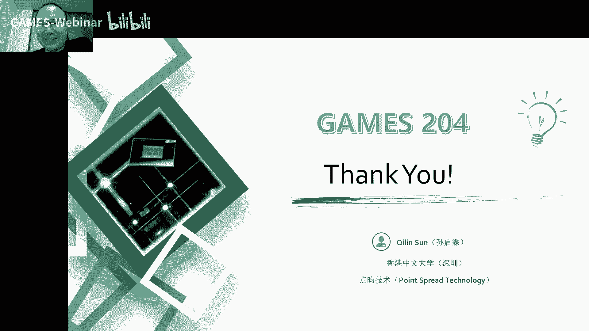