# 16. 计算照明 (I) ｜ GAMES204-计算成像 - P1 - GAMES-Webinar - BV1HP4y1U7QV

## 概述

在本节课中，我们将学习计算照明的基本概念，包括曝光时长、光强度、光源位置和照明方向等参数对成像系统的影响。

## 曝光时长和光强度

### 曝光时长

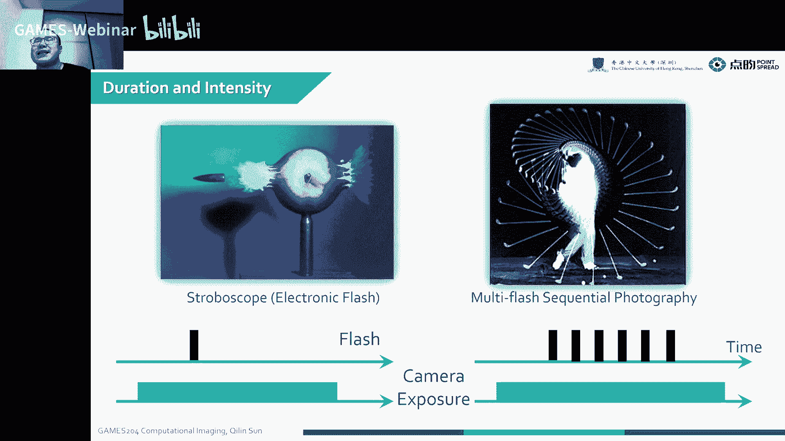

曝光时长是指相机感光元件接收光线的时间。它对图像的亮度和清晰度有重要影响。

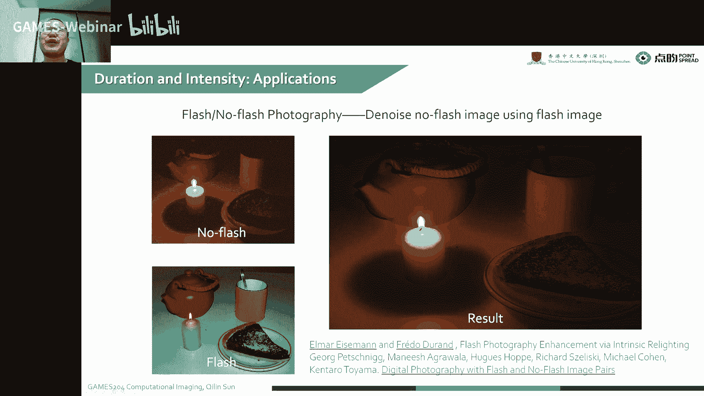

* **短曝光**：可以捕捉快速移动的物体，但容易产生运动模糊。
* **长曝光**：可以捕捉静态物体，但容易受到环境光的影响。

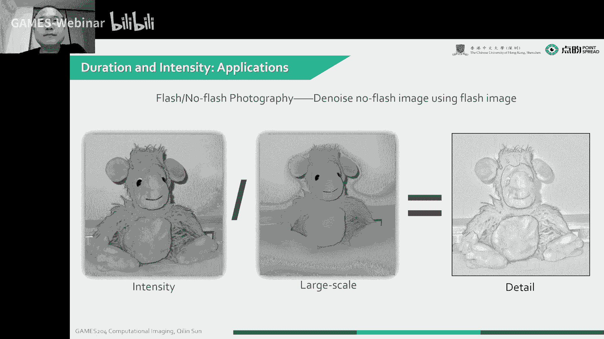

### 光强度

光强度是指光线的亮度。它对图像的亮度和清晰度有重要影响。

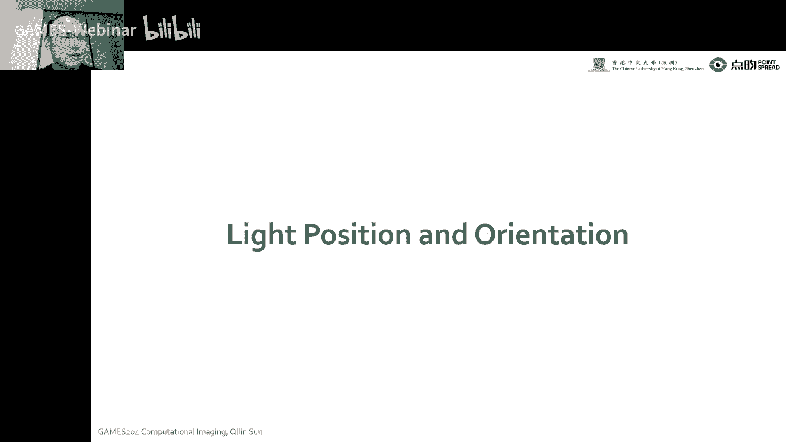

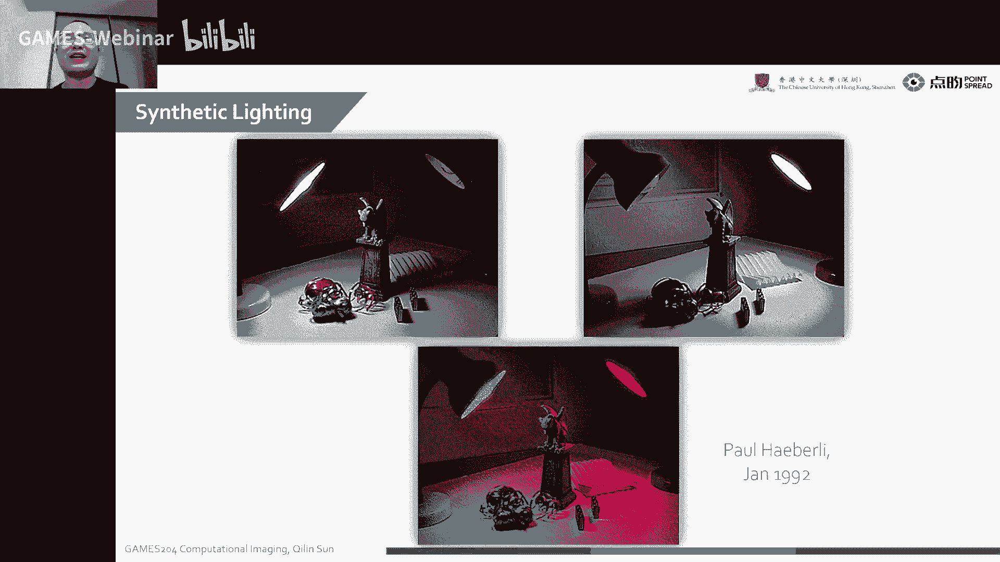

* **高光强度**：可以使图像更亮，但容易产生过曝。
* **低光强度**：可以使图像更暗，但容易产生噪点。

## 光源位置和照明方向

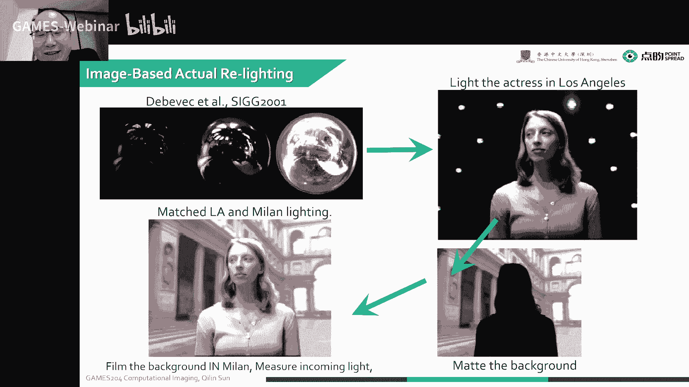

### 光源位置

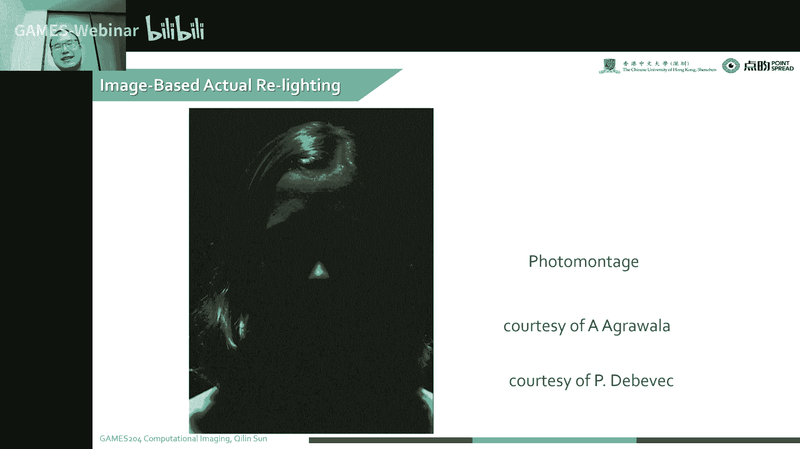

光源位置对图像的阴影和光照效果有重要影响。

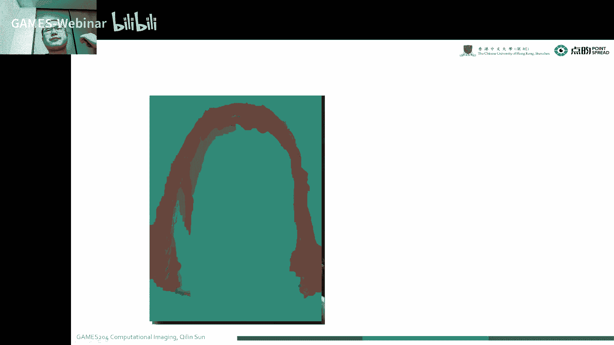

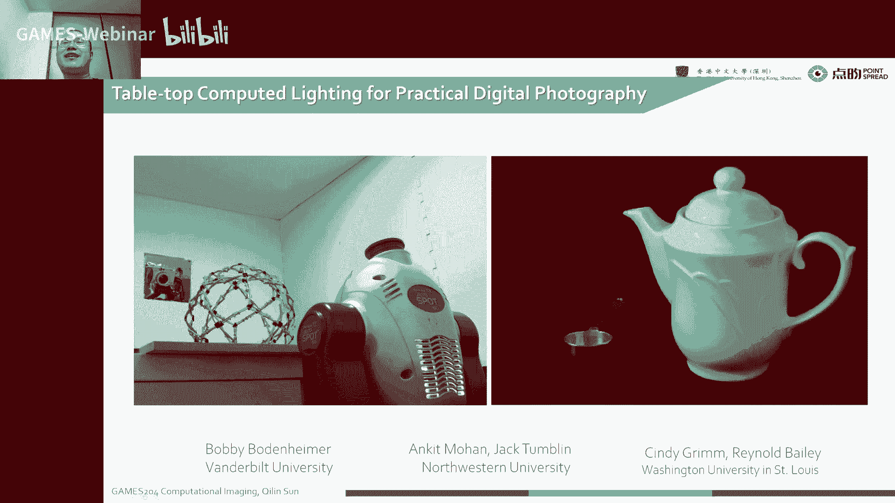

* **前向照明**：光源位于相机前方，容易产生明暗对比强烈的图像。
* **背向照明**：光源位于相机后方，可以使物体边缘产生柔和的阴影。
* **侧向照明**：光源位于相机侧面，可以使物体产生丰富的阴影和光照效果。

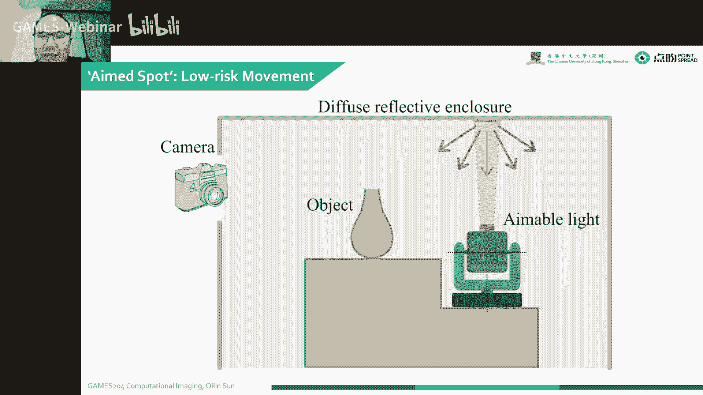

### 照明方向

照明方向对图像的阴影和光照效果有重要影响。

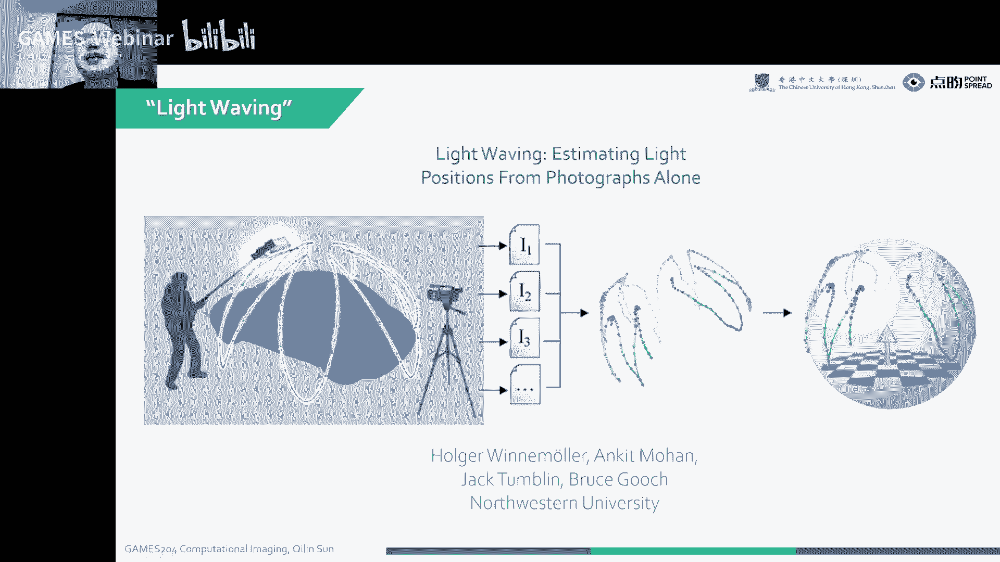

* **直射照明**：光线直接照射到物体上，容易产生明暗对比强烈的图像。
* **散射照明**：光线经过散射后照射到物体上，可以使图像更柔和。

## 应用案例

### HDR 捕获

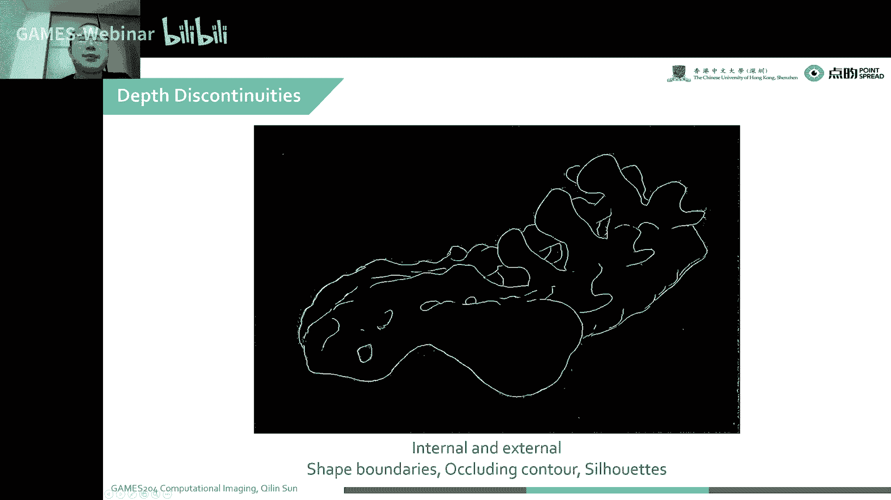

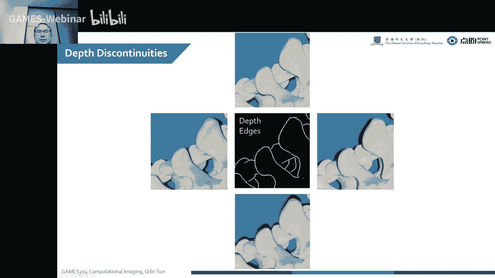

HDR 捕获技术可以通过调整曝光时长和光强度来捕捉不同亮度级别的图像，从而获得更丰富的细节和更低的噪点。

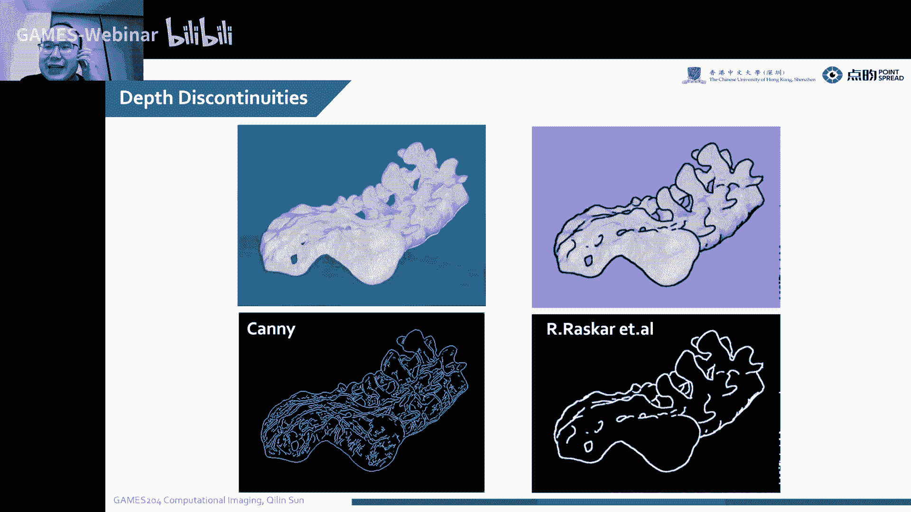

### 光照合成

光照合成技术可以将不同光源和照明方向下的图像进行合成，从而获得更真实、更丰富的光照效果。

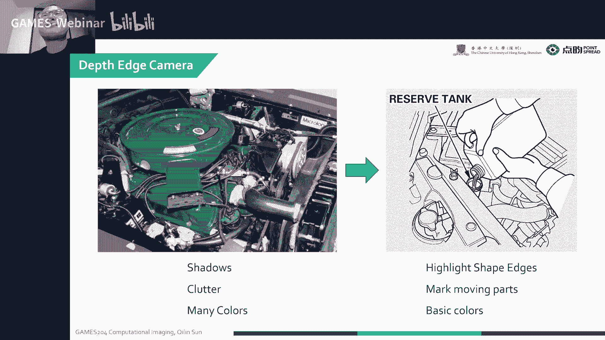

### 深度相机

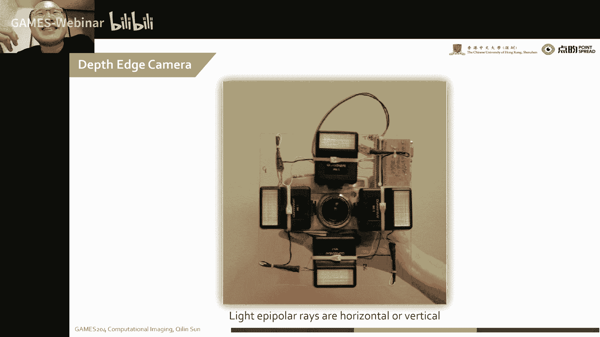

深度相机可以通过多角度照明来提取物体的深度信息，从而实现三维重建和深度感知。

## 总结

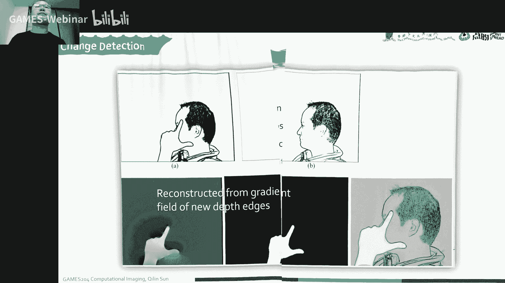

本节课介绍了计算照明的基本概念和应用案例。通过学习这些内容，我们可以更好地理解照明对成像系统的影响，并掌握一些基本的照明技术。