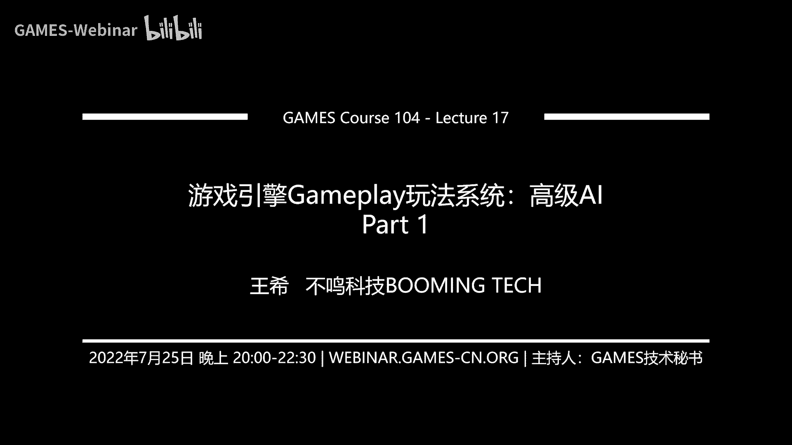

# 17.游戏引擎Gameplay玩法系统：高级AI (Part 1) ｜ GAMES104-现代游戏引擎：从入门到实践 - P1 - GAMES-Webinar - BV1iG4y1i78Q

Hello，大家好，欢迎大家回到games104，现代游戏引擎的理论是理论与实践，我是王熙，那个首先的话一周过得非常的快啊，然后这一周的话就是啊，应该来讲是我们压力很大的一周，待会再跟大家讲。

为什么压力很大，那首先的话呢很开心啊，上一周我们决定要给大家送我们的T恤，有的同学说我们是不是以讲课为名，实际上走上了带货的道路啊，这个帽子贴的还是挺好的，我们可以考虑一下。

将来以后我们要不要靠卖T恤为生对吧，支撑我们开games104这门课的这个经费，毕竟我司经费很紧张，然后的话呢然后呢因为这个要给大家发T恤，就骗了大家很多的社区，你的留言，然后就发现哇都是人才啊。

我觉得特别有意思，我这里面选几个比较好玩的，比如说有同学告诉我们说现在自己是准妈妈，然后的话呢，正好利用这个假期去这个学104课程，这就是算法胎教对吧，我们游戏引擎算法胎教。

还有同学说哎我们就是哎呀这个设什么来着，不好意思说那个词了，我们叫社会人吧啊说说实话确实是这样的，因为我已没有当过老师，所以我就是个程序员，那我就把我自己写程序遇到的所有的痛苦啊。

包括我发现我不懂的知识就跟大家一起去分享，所以相对来讲就比较真实一点，比较实战一点，然后很有意思的一个同学跟我们讲，说，他那个开始学104肢的时候啊，还是一个在学校里面有毕业这个课程，上着上着。

现在已经变成了社会青年一枚了，所以的话呢，就是说我觉得其实社区的同学们反馈，真的很好玩啊，还有人说要把很多我们游戏引擎的黑化，打印到我们的这个就是这个T恤上来，对此处的话。

我觉得我们我们get的这个商机的点子了对吧，我们后面的话就继续走在这个什么，以课程为为名卖T恤的这个不归路上，继续往前走，那么接下来就跟大家隆重的宣布，我们就是我们的T恤最后选择的是什么对吧。

那此处应该有什么当当当的效果音了，但实际上的话在B站上，同学们已经看到我们投票的结果了，其实两款T恤的这个就是选择是非常的接近的，真的说明什么说明都很好看，真的我自己也是很难挑的，我两个都想要。

那么最后的话大家选择了我们的第一款，那么这里面的话呢，就是说，希望同学们在我们每一节课的后面去留言，然后呢，我们每一节课我会选十个我们的幸运的同学来，我们会把T恤送给大家，到目前为止的话。

我们还没有任何的商业计划，怎么去卖这个T恤，我们都不知道怎么去收费，所以我们只能采取送的方式送给大家，那就是其实非常喜欢，就是同学们那个跟我们一起玩一起互动的，这也是我们104的精神。

我觉得真的有一个地方，就是让大家一起很开心的去一起学一些，我们觉得感兴趣的东西，因为真的创造这样的一个虚拟世界的感受，真的很快乐，非常的快乐，包括我这次准备我们这节课的时候，我一直在说，哇真的很好玩。

太太有意思了，我恨不得马上就去写代码了，所以其实呢我们从社区里面，其实真的有的时候蛮感动的，比如说啊有些同学他不会在社区里发音，但是他会给我们发那个笔记，他们自己会把每一节课的东西记下来。

然后我看了之后，我觉得哇太棒了，我一直在想说，我们花了这么大的心血准备了104的课程，将来以后能不能把它整理成一本书，这样的话就把我们说的内容整理成册，这样方便大家去看，那这也是我们后面可以想做的很多。

有意思的事情，而且就是说我觉得这真的就是社区的感觉吧，那我们为此呢，就是我们稍后我们的课程组小伙伴们商量，就是我们专门申请了一个新的邮箱，这个邮箱的话，你就大家如果有一些就是课程相关的。

一些就是非public的问题的话，比如说你做了一些有意思的建议呀，或者是一些好的这种笔记啊，大家可以发到这个邮箱里面，扣了引擎专用的邮箱里面就发给我们，然后的话呢我们这边的话，同学们的话如果看到了。

就是诶我们可以做什么的话，会给大家一些反馈，反正就是说我们这个community，对我们来讲是其实是最重要的，然后最后呢就是回答一下同学们的一些问题吧，我们发现这个这个星期的话，同学们的问题还是蛮多的。

第一个同学问我问题，就是说啊这个问题其实是蛮蛮蛮，怎么说呢，我觉得蛮黑暗的对吧，就是老头环里面，这个AI去读了这个玩家的书对吧，据说有rumor是这么讲的呢，这个玩意儿到底算不算AI未来主流的发展方向。

那说实话呢，这个从就是真正的就是叫经典教育上的游戏，AI来讲的话，我们会认为他是作弊的，因为很简单嘛，就是游戏AI的核心的一个，就是我们叫做一个啊叫道德规范，就是说你不能够超越玩家获取额外的信息。

否则你的那个行为看上去就是啊作弊的，就像我们比如说我们做啊cs的AI的话，我们不会说让AI知道整个地图，你必须是你能看见一个什么人，你只能通过你听到的脚步声，这样的话那个AI体的行为才像是我们的期待的。

这个就是人工智能体的行为，但是的话呢其实对于那种就是说动作打击，交互要求很敏感的这样的一些AI bot的话，确实你如果只是从玩玩家的这个最后的行为，比如说同他的位移啊，从它的位置变化。

你去反向推导它的intention的话呢，这件事情确实是很难的，如果你真实做过AI的话，就知道这件事情非常难，所以作为一个practice，就是说作为一个游戏研发者的话。

我认为就是老头环的这个选择是完全合理，可以接受的，因为这样会让他的AI更加的灵敏，更加的反应敏捷，其实是增加了我们的游戏乐趣，但是不是所有的游戏AI都这么做的话，那我认为这道大可不必。

比如说我们做个RTS游戏的话，我不要读对吧，玩家每一秒的这个双击操作，因为你做RTS游戏，大家知道就是我有大量的无效的点击，对不对，我就是手手抖，抖得很开心，我就点了，你怎么样嘛对吧。

那这个时候我要把这些input，放进我的AI体系里面的话，那肯定AI就疯掉了，都不知道你要干什么了对吧，所以的话这是我的观点，那么第二个的话，有同学问我们说，这个AI计算机的游戏引擎。

到底给多大的budget啊，这个问题其实啊是一个怎么说呢，我认为是一个呃仁者见仁，智者见智的问题，因为根据你不同类型的游戏产品来讲的话，我们给AIF的budget其实真的不一样。

你比传统的我们会给AI大概比如说一毫秒，2ms的计算时间，对不对，但是实际上如果你这个游戏的话，它就是一个策略游戏，打个比方，我是一个呃很复杂的一个那个。

比如说turn base的strategy game，就是回合制的策略游戏，它你有一个很大的世界，需要你模拟你上百个君主的这种行为，那么这个AI的话我就可以把这个给的高一点，让他大量的去进行精细的计算。

让这些那个那个就是说每一个NPC的王国的，那些君主的行为看上去很像人类一点对吧，那这个我的AI的bug就可以的非常的高，那么这里面做A我讲了之后，大家就能想象到什么什么游戏了，对不对。

什么著名的什么什么社对吧，他们的很多游戏好像跟这个都有点像，但是的话呢如果比如说比较real time，比如说像我们的，比如说这种射击游戏啊，或者是更快的这种设计，应该已经非常快了嘛。

那其实我们有的时候会给AI的8G的，相对小一点，比如像单机游戏里面，有的时候啊我们的AI体数量并不是特别多的话，我们的bug呢点的呢，对于每个单个的AIK的会比较高，所以你会发现。

其实为什么你们打网游的时候，经常会发现很多AI显得有点笨，但是你玩单机游戏的时候，你会发现AI很聪明，那实际上的话就是预算给的是不一样的，所以呢包括像这里面有一个小细节，就是同学们如果做AI系统的时候。

他的ticking并不需要每秒钟30帧，60帧，它跟rendering是彻底的分离掉的，所以AI可以相对低频的进行更新，比如说一秒钟几次问题也不是很大，甚至有一些比较复杂的运算。

你一秒钟更新一次策略也问题不是很大，所以的话呢就是说真实的一个游戏引擎，AI系统的话呢，它的架构实际上是分很多层的，然后有一些更宏观的东西，我会低频一点的更新它，有些这个就是啊低调的东西。

我会高频的更新它，而且呢这个后面会讲的，就是说其实很多的算法可以混合着用的好的，然后第三个问题的话，同学们就问我们说这个就是说稍等啊，我看看就是能不能用分布式的这个系统，把AI从客户端把它分离出去。

就因为AI里面做那个客户端里面做AI很费嘛，我能不能比如说把它放到服务器上，甚至放到云上去做这件事情，其实在现代的游戏里面，已经是很多的一个实践了，practice了，比如说在很多的网游里面。

我们已经可以把AI变成一个，独立的这样的一个服务器了，就AI服务器对吧，包括像那个pitch这种东西已经很成熟，那我们完全可以把AI，直接预购于我们的游戏引擎之外，它就变成一个服务在那。

然后呢我通过Python接口去调用它都可以，所以这个事情呢，我认为是未来的一个比较大的一个发展方向，但是呢这个也很难以一言以蔽之，因为什么呢，比如说我们假设玩一个手游，那手游它所有的计算。

它就在那个小小的那个那个那个那个方寸之间，那么你可能就要用手游自身的那个，就是AI推理芯片对吧，所以的话呢但是呢对于一个复杂的，比如说多人的mm或者是一个网上的虚拟世界。

我们确实是可以把很多AI变成一个独立的服务，那这里面的话呢就是这肯定是它的好处，因为这样的话，我的AI可以做的非常的丰富和复杂，但是呢他带来的坏处是什么呢，因为AI能计算它有个很大的前提是什么。

我们前面的课程讲的叫我要做perception，什么意思，就是说我要不断的从当前的这个世界里面，抓取各种各样的状态对吧，那这些状态从各个世界里抓取出来，然后呢，通过比如说网络那个transfer。

到我的AI的server的话，这个过程其实是比较废的，就是有的时候你计算本身可能还可以，但是你把这些这个perception的这些data，就what state status。

就是世界的状态那个packaging，然后serialize到DISCIALIZED到我的AI服务器，可能有的时候是很麻烦，而且如果你是分布式的AI服务器的话，我还得同时穿很多很多份，但这个事情的话呢。

就是这都是一个balance，就是说如果你的AI的计算本身真的是足够，expensive的话，我们认为这件事情还是值的，你要是问我，大家问我个人的观点的话呢，我我会比较喜欢这种架构，因为这种架构的话。

它很符合我们做引擎架构的一个叫decoupling的，一个一个一个原则，就是说我把各种那个就是说计算变成一种服务，那这个每个服务它都是独立的maintain，足系的独立的维护。

他彼此之间的话是通过一个数据协议去交换，这样的话大家想象一下，如果对于一个超复杂的一个虚拟世界的架构造，来讲的话，比如说某个AI服务器坏了对吧，那我的游戏还在玩怎么办，诶我可以重新再起一下这个服务。

把这个东西再pick up，把整个链接全部建立起来，那这样的一个架构，它是不是一个很鲁棒的架构呢对吧，所以我个人是很pro这个方向了，所以我觉得问这个问题的同学应该是蛮专业的。

因为这是个很专业向的一个问题，好OK那就是今天的话呢，我就挑了几个问题跟大家去回答一下，其实这个问题是我们课程组，课程组的小伙伴们挑的，但是我觉得他们挑的质量真的很好，OK好，那接下来的话呢。

就回到我们今天的课程的主题了，叫什么这个高级的AI系统对吧，这个也是我们这一次这个跟大家准备的很久的，这门这个这个这个section就是AIAIAI好，那其实呢实话实说啊，这一节课准备的啊。

它的惨烈程度远远超过了我们的想象，就是本来不是说我们AI本来只讲一节课，然后我们准备了一个180页的PPT，后来我们把最后的大概40页到50页摘出来，说我们单独讲吧，因为一节课实在讲不下去。

然后等我们开始再去准备，这一节课的内容的时候，发现它又涨到了150页，160页的PPT，而且的话呢我又内心产生了一个冲动，我说哎要不要把这个AI分成两趴，一趴，我们就讲一些传统的，比如说HTN啊。

GP啊，这些方法，包括蒙特卡罗方法，然后deep learning单独再去讲一讲一他，但是这个告诉大家一个坏消息，最后我还是克制住我的冲动了，因为实在是干不动了，所以呢我们这次今天的课程密度会非常的大。

就是我们会在一节课的时间里面把从传统的，比如说HTN呐，GP这些方法，然后呢，再讲到A蒙特卡罗的蒙特卡洛树的搜索的方法，然后再给大家讲a machine learning，那实话实说啊。

我这节课准备到后来，我的状态是什么状态呢，就是呃我写到就是我合到后面的PPT了，我已经忘了我前面在说什么了，包括我今天在上课之前的话，我在整个过这个PPT，我发现我已经忘了好多东西了。

就是那一页我到底在讲什么东西，所以同学们如果在课程中发现，我已经开始神情恍惚，然后开始去找我，为什么要写这些PPT的时候，请大家提前给我一个免死金牌，因为确实这个感觉是好几个不同的universe。

我们在一起来回的跳跃，但是没关系对吧，我们games104的课程是什么，就是互相比干嘛对吧，我们就是这个内卷到卷到极致，所以今天我们开卷好，那今天我们就卷一个比较硬核的，这个就是高级的AI系统。

怎么去做呢，首先的话呢我们来个开胃小菜叫HTM，就是说层次任务网络对吧，就是hierarchical task network，那这个东西呢实际上大家在上一节课，我们学过什么。

我们学过behavior tree对吧，行为数，行为数其实真的是个很好的东西啊，而且我对他的感情非常深，因为我以前是在BANGESTUDENT，我今天穿的就是halo reach的这个这个T恤对吧。

然后的话呢那那个时候呢，biai tree当时也算是班级给行业做了一个贡献，那么好，you try其实很好，但是呢它有没有问题，其实它有一个很有趣的小问题，就是说当我们的设计师在一个一个的构建内。

一个个的节点，比如说selector a sequencer对吧，我就依次规划我的行为，其实它更像是一个就是反应机器，叫reaction machine，什么意思。

就是说当这个世界给我各种各样的输出的时候，我要做出各种各样的反应，它更像就像我们讲的，就是我是一个呃，怎么说呢，我是一个无脑的条件反射的，像巴甫洛夫这样的一那只狗，我看见了闻到了什么东西。

我就做出以下几个动作，但是我们的人类的行为实际上什么是consciousness，就是我们有意识的，那意识最重要的是什么呢，就是我要有一个主观意图对吧，我想让我自己变得更好，我为什么要健身。

因为我想让自己的这个身材更好一点，我其实是有一个目标的好，实际上当我们的设计师在构建那个，behavior tree的时候，你看着他做的是一个一个节点的展开，但其实他更多的是说。

我希望这个AI能够完成这么一件事对吧，他能保护好自己，他能够成为这个战场上最猛的那个AI，能够让所有人都恐惧它，它它是有够的，那这个时候其实在hierarchy，就是大家就会发现。

be AI tree实际上是有一个很大的一个局限性，就是它不直观，但是今天大家如果真的去看一个，be AI税的这样的一个编辑器的时候，你会发现大家会做很多事情，在上面打个框，上面写个注释。

说哎我这一棵子树是做什么用的，这个时候是通过什么方式表达的，是通过注释的方式告诉大家说，你别看我这边一会儿用selector，一会用sequence，但实际上我做的一件事情。

就是说确保我的这个啊NPC不会饿死，或者确保我的NPC不会这个中毒之后，他自己知道把自己治疗的好对吧，我是有够的，那么HTN的话呢，实际上就是从另外一个角度来解决这个问题，他是从这个任务目标出发的。

那么HD这个东西呢其实用的人其实蛮多的，就是说比如像最新的那个horizon对吧，像这个就是说啊这个duck so对吧，这些大作产品都用了HTN这样的一个架构，那HN的话它的核心思想是什么呢。

其实就像人类一样去做一个计划，比如说今天我要去这个学一个东西，就是我要去学一门课，那我首先做一件什么事情呢，我首先要去查资料对吧，我的第一步我要准备学习资料，那这个时候呢。

他首先是他要把我要上这门课的东西，分解成好几部，第一个就是诶我要去准备资料对吧，我要到这个教室，我要开始学习，然后呢我要去在课程之后回答很多问题，做一些q and a，你看这是不是很科学合理，对不对好。

那我在这个准备这个学习资料的时候呢，其实我的选择有很多，对不对，我可以去选择去图书馆查资料，我也可以上网去冲浪查资料，所以这里面我们会出现一个selecting的过程。

所以你看这个行为是不是很像一个behavior tree，对吧，但是它的整个这个寓意感是完全不一样的，就是包括这一棵树状结构的东西，大家理解起来其实非常符合人类的知觉，这就相当于是说。

我们对任何一个AI体的行为的话，我们把它表述表述成若干个我要完成的任务，以及为了完成这个任务，我需要完成多种的子任务，包括每个子任务有哪些选项，这样的逻辑就清楚了，那么HTN的框架是什么样子的呢。

实际上它基本上你可以翻成这么几大块，第一块呢就是叫一个叫worst days，就是这个世界的状态，还有一个什么呢，感知器，感知器呢非常像我们之前讲的这个perception。

这个地方我是真的是要小小的吐槽一下，就是这两个名词呢，实际上是作者就是原文你们定义的这个东西，但是说实话这两个东西都非常的confusing，比如说worth state，我自己的感觉。

就是我觉得初学者特别容易犯的，一个错误是什么呢，就是说大家会觉得worth state，是对世界的这个状态的一个真实的描述，比如说哎这个我面前有几个敌人呢对吧，这个战场的情况。

比如说我在这个关卡什么阶段呢，包括我自己的这个血量，但实际上这里的worst days，并不是真正的一个客观的世界的一个表达，是一个主观，就是在我AI体的大脑里面，我对这个世界认知。

你看这个做这个书算法的老哥，我感觉是有点哲学性思维的，就是说我们在那个就是在学哲学理论的时候，不是有一个叫什么主观唯心主义是吧，什么客观唯唯物主义嘛，对不对，主观唯心主义认为什么呢。

认为整个世界都是假的，都是在我的大脑里面，就是我就是我的认知里面构造了逐这个世界，它让我怀让我相信外面有个客观世界的存在，但这都是一个幻想，你看这么深奥深奥的哲学原理，就这么偷偷摸摸的。

就塞到了HTN的架构里面了，而这个地方是特别容易犯错的，就是说其实worst并不是真实世界的访问，而是在这个AIT大脑里面，他对这个世界的一些关键要素的一个一个思想，或者是一个一个提炼。

那么sensor呢更像是perception，就是他负责从游戏的整个环境里面，抓取各种各样的状态，这两个概念一定要分得很清楚，因为待会再算算法的时候，他他俩就会起作用，那么接下来的话呢。

就是说在这个TM的这个框架里面的话呢，我们有一个就是那个H键多M，这个多面里面的话呢，其实放的就是一个我们的很多的就是层次化的，像树状结构的task以及它之间的关联关系，这个待会展开，然后呢。

当他这个就是树状task全部在里面规划好之后，根据现在就是AIT看看到的这个，他感知到了这个世界的状态，然后呢他会做一个计划，比如说我会当然了，我首先会选择一个task，比如说我的task是上课堂。

那我接下来就会规划，我要做12345很多的这个task这个事件，这些task就是通过一个planner把它放到这，就make a plan，当你的一个plan有了之后。

接下来有一个就是plan那个runner，他就会依次的执行这个task，但这里面有个细节，就是说我们做好一个计划，我们去执行它的时候是不会一帆风顺，应该不会对吧，中间比如说整个世界会发生很多变化。

或者说我高估了自己的能力，比如说我觉得我三天可以学完高等数学，想想哎呀，等我考试前学到第二天的时候，明天后天就要考试了，其实我已经放弃了，因为我觉得高数这门课算了，我放弃吧，对不对哦。

我在我在我在大学的时候，我经常是这样子，我最后三天准备一门考试，但是学到第二天的时候，我觉得啊算了，我放弃治疗了，这门课学分我不要了对吧，那其实TX在执行之后，你自己也会产生很多的问题。

比如说血量不允许了，对不对，你本来觉得你可以干掉那个小怪，但是呢这个时候突然背后冒出了一个小怪，他背后射了你一箭，你血量其实已经不够了，你本来觉得你能干得过他，但你干不过他，对不对。

那这个时候实际上ta runner，它会监控所有在执行的这个task的状态，如果发现你干不了的时候，诶他会告诉你，接下来会启动另外一个课程，后面会详细的展开去讲，叫做replay好。

所以同学们的话首先理解这个HTN，它是这么一个架构，这个架构很有用，因为待会我会跟大家去讲另外一个算法叫GP，就是面向那个目标的这样的一个优化算法的话，其实这个架构这两个架构非常的接近。

那么这个时候诶我们怎么去构建这个事件呢，那你首先要构建的东西是什么呢，是task任务到底是什么，在HTN里面的话呢，它定义了两种task，第一种task叫primitive task。

它是最简单的用task，它更多的就是一个动作，而第二种呢我们叫做compound task，叫符合任务，符合任务的话，它其实是HTN的核心破，它或者是它的精华好。

我们先讲最简单的这个primitive task，那么这种原子形的这种任务啊，它跟我们之前halo trade里面的话，有一些小小的不同，大家还记得我们在别墅区里面的话。

我们并没有强制要求说每一个立业节点，我一定会给他加一个precondition，对不对对吧，包括我们一个动作做完之后，对世界有什么影响呢，其实在B车里面并没有明确的去讲，对不对。

但是在这个就是HTN里面的话，我们每个premiere task，我们实际上是有三个关键要素的，第一个当然是你动作本身，动作本身怎么办呢，你写个脚本执行也好，写个什么执行都好对吧。

但是你要给你的这个动作要加一个precondition，就是说你在你的word里面哪些state满足了我的条件，哎我这个task才会真的去执行，否则的话我会返回一个force。

第二个这个task执行中间的话，我肯定也有可能会失败，并不是所有task他一定会成功，虽然你就算所有的PREGENTATION全部满足了，这一点大家一定要注意诶。

最后做完之后我呢还会去修改这个世界的状态，对不对，我做了动作的目的，为什么不就是改造世界嘛，对不对，所以当我们去构建一个HTN的网络的时候呢，哎我们这三个东西要素一定要有，这三个要素呢其实是有妙用的。

但是呢这里面大家注意一个事，就是它的前置条件，它其实是对stage的一个毒的操作，就世界状态的一个毒的操作，对不对，那么effect或者叫EFFECTURE，就修改就叫修改器的话呢。

它是对这个世界的一个反向的一个写的操作，这里面举一个例子，比如说我们第一个print task就是这个啊，我们要用这个解药对吧，那它的前提是什么呢，我首先要有一瓶解药对吧，那我最后如果这个用解药。

就是我这个喝完这个解药这个动作成功了之后，我对世界的修改是什么呢，诶第一个，我现在这个我的这个这个，这个就是说我的解中毒的状态，会被我解消解除掉，对不对，第二个呢很悲催的是。

我的那个解读药水数量得减个一，你看这个是不是很简单对吧，那么包括就是说诶，我们假设用一个超强的这样一个解药的话，我们会发现，就是说第一我首先要确保这个药物是有的对吧，但是呢哎我这个万能药我用完之后。

首先我万能药很悲催的要减掉一个对吧，但是呢我无论是被中毒了呀，还是被这个什么sleeping玩家，这个状态我全部给解掉对吧，你看很简单吧，但是的话你会发现就是刚才刚才我们讲的。

就是说PREGNITION是读取世界的一个状态，确保我这个动作是最基础的条件是能满足的，我能执行的这个动作，假设执行真的成功了之后，我会去写这个世界，这跟我们人类一样的。

我们人类perception感知世界，然后我的consciousness，我的主主观意识让我做出很多行为，但我的这些行为最后产生的结果是什么，我们又会改造这个世界对吧，否则的话这个世界就太无聊了嘛。

一定是要我们来改造的嘛，好那primitive task就很好理解了，那接下来就来了一个最有趣的了，就是哎符合任务，其实符合任务啊，他我觉得一个最简单的一个解释是什么呢。

就是首先首先跟他讲原书上的定义啊，他就讲说哎一个符合任务呢，他首先是有很多的method构成的，那么每个message有一个一组precondition，就是那这个method的。

其实他从上到下本身暗含的是什么呢，叫priority，就是说当我一个任务过来的时候，我每一个message，你可以认为完成这个任务的一种方案对吧，那么我有三种不同的方案。

那最后我会让你优先的选择第一种对吧，如果第一种的precondition不满足的话，不好意思，那你就选择第二种吧，对不对，如果第二种不满足的话，那你就尝试第三种呗，那么如果三种你都不满足怎么办。

我就算我失败了呗，所以这里面是个什么东西呢，大家如果回想一下，上节课你看隔了一个星期，其实说实话我已经忘了，但我希望同学们不要忘了，就是上节课我们讲了什么，讲了behavior tree对吧。

halo里面那个东西叫什么叫selector，对不对，那其实就component task里面的，它的method之间的话，它更像是构建了一个selector，诶，更有意思的东西就来了。

他每个method叫我完成这个task的任务，我们完成这个task5的方法，实际上呢它不是指向一个单一的task，它可以放一串task，那为什么他要放1tron task呢，这个是什么呢。

就是说哎我这个完成这个任务的目标啊，其实我要做很多次任务，这些子任务你必须要依次成功地执行完，我这个方法才是真的成立的，诶这个地方像什么东西了，是不是很像我们上behavior tree里面讲的。

那个叫sequencer对吧，依次执行，所以其实你去理解他的common task，就是有的时候你就觉得很生气啊，你说你写HDN的文章的老哥，你非定义了这些东西。

如果你给我做一个behavior trade analogy的话，我不就秒懂了吗，说实话我当时读那个paper，我读的很透很透的，我们团队讨论了半天啊，就大家就是各种细节的讨论。

但最后的结论是他两个东西，它就是一个这个selector，再加上一个sequencer，形成了一个组合，当然这里面肯定不一定准确，还是有很多细微的差别，但是呢作为大家去理解这个符合任务的话。

这个大概也明白了，说你很多后面的算法你就大致能看得明白，但是我这边要提醒大家，就是说真的同学们实现一个自己的HTN的话，还是有很多小细节了，大家千万别为我这个就是简单的类比，给带到坑里面去了。

好那么这个逻辑的话呢，实际上我们去看这个就是诶，我们构建刚才那个案例里面，是不是变得很简单了，比如说我想要解读的这个任务，那我首先就问说啊，你有两个选择，看见要我就先喝解药，我就先喝下去。

但是说实话这个我们都是小气的人对吧，那我首先干嘛呢，我优先看看我能不能造出药，这样的话减少我要的损失对吧，所以呢我的第一个选项就是诶，我是不是有足够的材料，如果有足够的材料，我干嘛我开始造谣啊。

那怎么去造药呢，我的我的，我的这个方法里面的第一个task是什么呢，Make a portion，就是我先造解药，那造解药的话呢，就是哎你以为你的挑战，其实这个地方写的不够严谨啊。

实际上make a potion，那个power，前面preparation还可以再去check一下你的材料够不够，这个时候哎如果我材料够的时候，我把材料给它剪掉，然后呢哎我的药数量就会增加。

第二步是什么呢，诶我来去use a portion对吧，就是我首先再次确认一下我是有药的，然后呢接下来我把我的状态，整个我假设我的喝完药水之后，这个动作做完之后，那我的状态肯定会恢复吗，对不对。

然后我的破损数量减一嘛，但是呢如果这个时候诶，我第二个选项哦，这讲错了，第二个选项是什么呢，我实在没有材料怎么办呢，我去买一个破损对吧，你看这个这个这个NPC是很小气的，他身上有药水，死活不用，他。

首先是要么去造，要么去买，实在不行才用自己的好，这个时候我就去买，那买的话呢，我的我展开的第一个方法，就是说我先去买一个portion，然后我才去用它，但这里面再展开就很多的细节了，大家会发现诶。

实际上用这种方法去展开一个行为，书的话，展开一个行为，就是这个这个NPC行为的时候，是不是非常符合人的这种直观的理解，这也是我个人觉得，我对HTN的一个很好感的一个地方，就是说他确实就是非常方便。

就是设计师去构筑他自己的逻辑体系，因为别说去的话，包括我们之前跟设计师一起讨论的时候，会发现，其实理解和陪，就是大家训练起来还是比较抽象的，很多人是要花很多时间去理解。

就是这为什么我用怎么用selector sequencer，去构建一个比较合理的逻辑，20天的话，在我的理解中更像是把这个东西直接打包了，你呢就不用理解什么select a sequencer。

你就理解成就是单一任务，就是原子任务和复合任务，原复合任务里面它它永远只有这一个策略，就是你有一组的选项，你可以优先选择谁，选择之后，那接下来你就12345，依次完成这个任务就完了。

那么之间它到底是用selector还是用sequencer，这些抽象的名词，你就不用去记了，因为其实理解select sequence，这两个抽象名词本身也是很费时间的好，这就是我们这个HTM的两大。

这个这个就是HDMDM，就是我们DM就是它最核心的这个这个空间里面，两两大核心，这个这个这个怪神兽，一个叫primitive task，一个叫compound task。

那其实这个时候我们有了这两大神兽之后，我们就可以这个构建就像零一样的，我们用零一就可以构建整个HTM的这个DAI，就是它的空间，那么这里面的话呢，有唯一一个特殊的东西是什么呢。

哎我们需要把一个task定义成一个叫root task，就是我的根节点的task，那所谓的root task其实想想也是很简单的，就是说一大概率他应该是一个component task，对吧。

是一个符合task，然后他就定义了我作为一个，比如说我作为一个精英小怪，我最核心的几大行为是什么，我作为一个精英小怪，我首先是要砍人的，对不对，但是呢如果我血量不行不行了，比如说我中毒了怎么办。

我得救自己对吧，如果我看见一个一个一个老哥，我打不过怎么办，我得逃，对不对，然后实在不行，如果什么敌人也没有对吧，我也没什么状态干嘛，我在那得闲晃对吧，所以说其实root task他是核心的。

就是是非常方便我们的设计师的理解，就是我从最high level去定义，我的这个老哥的几个关键行为，然后呢你再一次一次的把它展开，直接涨，一直展开到什么呢，Premium task。

所以说呢HTN的这个网络的话，就是其实那个树看上去蛮干净的，蛮好看的好，那么其实呢就以刚才那个为例的话，比如说我们一个就是小怪的行为，他首先是什么诶，首先确保自己的活命，所以首先如果发现我中毒了。

我首先优先保证自己不要被这个中毒了，如果看到一个牛逼的精英怪，我首先干嘛呢，我要逃跑对吧，保命要紧，如果发现是个普通小怪干嘛，我要去进攻它，你如果按这个逻辑，你看这是一个很简单的一个bot的AI体系啊。

你就可以这样把它recover，怎么去保密的地方，我们就展开了，对不对，这个地方他的就是你从这个就是啊解，就是解读这个这件事情呢，这个任务来讲的话，诶我会把它分成三个选项。

第一个选项是说第一种可能性是说如果有药水，我优先使用药水，如果没有药水，我去找一个药水对吧，如果这个药水也找不到怎么办，我就用我的万万能药对吧，那接下来依次展开了，比如说我怎么样子去这个找一个坡式呢。

那我首先的话去造一个，造一个的话就要找材料，要不要去造，但是呢如果我造不了怎么办，我去买，那我买的第一件事情干嘛呢，诶我要先去跑到那个npc store，怎么样，很好理解吧。

就是其实这个s ti我觉得它设计的巧妙的地方，就是其实我拿着一颗behavior tr，跟一个这个怎么说呢，非游戏行业的同学去解释我想干什么的时候，很多时候大家会懵掉，但是HTR它已经简化到叫做。

我觉得我跟一个就是啊就怎么说呢，这个中学生小学生去讲这个游戏是怎么设计的，他才能告诉我说我AI就这么设计了对吧，所以我觉得这个事情还挺牛逼的，已经一个一个一个点好，诶。

当我有了这样的一个就是tn多man之后，接下来我干嘛，哎我要开始做规划了，做planning了，这个plan的过程其实刚才讲完之后，大家就会觉得已经不难了，对不对。

那我首先的话呢根据现在的worst state，你不是有一个root task吗，那我实际上就可以根据你们的priority，我就知道咱们优先选一个我的go，就是我的当前的目标的这个task对吧。

那第二件事情呢，就是哎我既然你有了目标的task，那我就从你的method开始，去把你所有的task开始去展开一层的展开，对不对，一直长到你的primitive开始，但这里面呢有一个细节来了。

这个细节是特别容易犯错的，就是说其实我在这个展开的推演过程，这个过程呢是电光火石之间呢，就是我现在脑子中产生的一个概念，叫做我要去啊解读，那这个解读我现在想到了，说诶我就要去买这个这个解药。

那买解药的时候，这时候我就需要去这个去找到那个NPC多，其实这里面的话呢，我的每一个premium task的话，它都会有一个effect，就是如果我这个任务完成了，假设成功了。

我对这个世界的状态是不是有个修改，对不对，所以呢你会发现，如果你脑子中只是这样在展开，实际上你的这个对世界的修改它不会存出来，但是呢你接下来的计划就没法做，为什么呢，因为你比如说你去买到一个解药。

实际上是你后面用解药这件事情的precondition，那你后面的这个计划过程就会失败，所以呢他在这里面有个细节，就是说他把worst day做了一个，在大脑中的一个拷贝。

你可以想象成就是我把世界的状态变成一张，抄下来，放到另外一张草稿纸上，然后我脑子中就在推荐说，我如果按照你的这个HTN的这个计划，去展开的时候，我做的第一件事我找到那个NPC。

那个shop可能会成功对吧，如果做完了他就成功了嘛，那我就可以找到那个NPC好，第二件事情就是好，我mp我已经在那个那个shop里面了，这个时候我开始进行买的新闻，买了新闻之后，我假设成功了之后。

我就会把药水数量加一好，又是钥匙数量加一的话，那我就可以启动下面的使用药水这个操作，所以呢实际上他在做计划的时候，他会假设所有的action都会成功的，诶这个地方就有看了，对不对，大家会发现怎么可能呢。

你这个比如说因为你这个计划做完之后，你真的执行，他可能需要几秒钟甚至是几分钟的时间啊，在这个几秒钟或几分钟的时间里面，会很多事情发生啊，对不对，但是呢他在计划的时候，他是假设一切一切成功的。

接下来我们会讲到一个细节，叫做REPLANNING的话呢，他就在解决这个问题，所以此处呢大家暂且认为他所有的计划都能够，Task，都能不被成功地完成，那这样的话呢实际上就是说。

但是呢我们在计划的时候也是会发现，就是说这个precondition他是没办法满足的，那怎么办，或者说啊，因为有些PREGNITION是整个世界的环境不允许，怎么办，那我只能返回一个force了。

就计算机中间他钻钻钻钻钻到某一步，task说诶你要去买解药，你就必须比如说你要有一个坐席吧，他之后发现其实此时本人已经没有作息了，而那个时候NPC的那个那个那个商店，是在另外一个城市。

你没有办法那个teleport，没有办法那个飞跃，那怎么办，那你就怂了呗，所以那这说明什么呢，他就把这个错误的信息一路往回返，一直就是只要错了，他就往回跳，跳了之后呢，如果发现每一次都没有更好的选择。

他可以一路打回到这个root task的，打回到root task的时候，这时候说哦，那就意味着我的第一个task就是整个失败了嘛，那我就依次往下去走嘛，但这里面有个细节是什么呢。

就是当我们的设计师去构建这个root的时候，有一个细节就是，千万千万要设置好足够鲁棒的default task，你千万不要让NPC不适合看，否则的话，你如果想的所有的task都是那么有挑战，那么有意义。

有可能当世界的条件不满足的时候，你看到的NPC干嘛就傻站在那儿了，就是诶这时候是不是系统出了bug，其实系统没出bug，只是因为现在的很多环境变量并不满足，所以的话呢NPC没有任何输出了。

告诉他该干什么了，所以一般来说我们会配一个什么，比如说default idol啊，比如NPC在那边实在没事干，干嘛，搔首弄姿啊，对不对，给你打打招呼，挥挥手啊，这个这就是很多我们在设计一个。

好的游戏的时候要注意的一些细节好，那这样的话呢，其实当我们去这样的依次的去traverse，就是我们这时候当那个task不行的时候，我们去找下一个task，这样我们就依次循环做完，那到最后的话呢。

实际上我们就会把整个这个数渲染，那个整个整个traverse1遍，那最后的话呢一般来讲，只要你设计师没有做坏的话，我们会输出一串的，我要完成的原子形的task，注意啊。

到最后你HTN它实际上是有component task，和permit task构成，但是这棵树你traverse完之后就是按这种方算法，你整个便利完之后，形成你的这个那个你的这个task序列的话。

它一定是一串premiere task，那这样他就依次执行完，在接下来的话下个什么呢，交给plan runner，就是说A计划执行者开始愉快地执行，我现在定好了这个这个计划了。

英文中有个词叫sounds like plan对吧，听上去我们好像有个计划了，那我们就开干嘛，好，这个这个时候这里面举个案例吧，就是比如说还是刚才那个案例，你会发现就是我一开始去找解读。

解读之后发现第一个use portion那个地方坏了，搞不定怎么办，我就要found a portion对吧，因为我现在没有portion好，那这个时候我就去看看能不能首先优先选择，能不能造一个破损。

造一个破损的话呢，这时候我发现我的第一个message的话呢，是这个就是啊我就好，这个就是我去make a portion，这个事情我也失败了，因为我没有材料，那怎么办。

我我选择了就是bia portion，那这样的话你看那个链路，最后它就形成了几个，最后输出的其实是BIOPPORTION，use portion那个task列表，就是你首先要去买一个portion。

然后呢再去用这个portion，这个是一个极其简单的例子，如果刚才我讲的那个分解的话，你得先跑到NPC，那然后再怎么做一大堆很奇怪的事情对吧，跟他做一些很奇怪的对话，你才能完成，但是呢这不重要。

这都是细节，你只要理解了这个HTN的这个基础结构的话，作为一个设计师，我们可以把这个东西变得无无比的复杂，所以这个呢就是HTI的一个基础的运作模型，那么其实呢当这个时候呢。

我们就会依次的有了这个计划表之后，我们plan runner就会依次的去执行这个计划，但这里面有很重要的点，就是当我们在写这个东西的时候，你会发现诶我的这个这个task可能会失败。

刚才我已经反复解释过了，就是说因为整个AI at它在游戏世界里面，游戏世界是个非常动态的对吧，AI体会对世界有很多的假设会执行，但是玩家也好，其他的AI也好，他们都对这个世界形成这样一个输入。

大家听说过著名的三体理论，对不对，当这个世界的参与者，不再是单一的一个个体的时候，这个世界是个什么东西呢，它其实是个混沌系统，哎这里面我就讲游戏AI非常有意思的地方，就是说你可能每个AI的算法。

是一个非常简单的算法，但是呢如果我给你放入足够多的AI，然后呢放在一起，我既是一个最简单的AI模型，其实整个这个系统的output它其实是不可预计的，诶这个很有意思了吧，所以说我觉得做游戏引擎做到后来。

你真的有的时候会对这种，就是这种这种很玄学的东西很感兴趣，因为你会发现你真的在做世界的模拟，那真的就像我我有的时候比如说我做，我，因为我个人蛮喜欢AI这个东西嘛，就是做完一个AI之后。

你会静静的看着你的AI互打互殴，你可以看一个小时到两个小时，真的这个这个大家如果有机会，你们自己做游戏的AI的时候，你就能体会到我讲的这个乐趣，就是你做了一个bot对吧，然后你就看那些bot在一起打架。

你可以看一个小时，一点问题都没有，觉得很有意思，然后呢打着打看着看着就觉得不过瘾，就开始改它的参数，再让他们再打，直到这个这个这就有点像养蛊的感觉一样，所以其实呢就是说在这样一个混沌的KOS。

这样一个系统里面的话呢，实际上你很多的task他可能都会失败的，那么这个失败的时候，那我们这个task，其实实际上的话就是他就会，我们认为整个这个计划就失败了，对不对。

但这个时候就要启动我们很悲催的行为来，叫什么呢，叫REPLANNING，我们要重新计划了，所以的话呢一般replay一般是这么几件事，第一个就是呢哎我们的这个现在没有计划对吧，还有一个是什么呢。

我当前的计划已经成功地执行完了，或者执行到一半我失败了，还有一个很重要的东西，这个东西其实也是arguable，就是说如果在我的主观意识里面，这个世界已经发生了一些改变，就是sensor告诉我说。

诶比如说你现在做的所有的计划，是假设现在在游戏的前期没有，你比如说我方没有丢掉任何一个夺气点对吧，但是这个时候假设说我的，你现在做的所有的计划是什么，诶我要去抢一个补给点，去支撑这个这个A点的夺取。

打个比方啊，但是这个时候呢，你突然发现世界的状态发生变化了，就是A点丢了，所有人都向B点去冲了，那怎么办，诶这个时候你的计划需要重新制定，所以这个也是很重要的一个细节，就是说就是其实我做的任何一个计划。

你不能僵化的执行，就是我们经常讲就是我虽然永远是有计划，但是呢并不代表我会避，而就是闭目塞尔，就是不关心外面发生的事情，如果外面的情况就是大的格局，大的变量发生了变化的时候，我的计划必须要重新制定。

所以REPLANNING，实际上是HTN网络的一个，非常重要的一个体系，就是很多系统做的好不好，其实REPLENTY这个东西影响非常大，好那讲到这儿的话，基本上我们把这个HTN的这个东西啊讲完了。

那么HDN实际上呢，我认为就是说它是一个非常好的一个东西，就是它跟BT很像，我个人觉得是对BT一个非常好的抽象和总结，那么很容易让人去理解，然后呢，他非常方便的。

让我们的设计师能规划一些长期性的这些行为，那更重要的一点是什么呢，就是说它执行效率其实比BT高，因为BT大家记得我上次讲过一个细节，就是BT他在每一次就是AI被唤醒tick的时候。

他都要从root全部跑一遍对吧，实际上你会发现90%的时候，从root那边TK1边是没有意义的，因为它最后就是停在了那个节点，跟上一次tick没区别，上次那个action没做完。

你这次还等着action做完，但是呢你去把BEAIREE，整个tick和一片那个事儿本身就非常的费，这个地方的话，我们自己做引擎是有血泪的教训的，就是说把那棵树整个traverse1片。

它本身可能吃掉你70%到80的，这个计算的这个那个budget，那么实际上的话呢就是说HTN的话，他就很聪明，他就说哎除非世界发生改变对吧，除非那个你之前的那个task失效了，或者没做完。

我这个HTI我就不用再算了，所以它其实是比那个就是比halo train更高效了，但是我在上节课也讲的就是比AI，却很多时候他们也会做一些优化，但这里面就不会再复述了，但是呢就是说我觉得。

其实这个就是说HTN的话，它有它自己的一个缺点吧，就是说我认为就是第一个呢，他去配置很多的precondition，和他的这个condition和他的effect的时候，它实际上形成了一个。

就是我们叫做一个逻辑链路，就是说我前面规划的动作，他对这个世界的改变，正好能够符合我后面的某一个动作，可能不是紧邻的，可能隔了几步的动作，它的正好的precondition，那么当我有这么多task。

依次的在修改这个世界状态的时候，有可能你这个task本身啊，他很可能形成不了，但是呢设计师当你面对就是说几十个，上百个这样的一个primitive test10设计的时候。

实际上很容易会出现一些小的错误，就是说诶实际上我的这个计划是没办法形成的，这样的话呢，其实说HTN的话呢，至少我自己会认为说，我们需要做一些静态检查工具，帮助设计师的话，能够及早的发现这样一个错误。

就比如说很容易出现的一个错误，就是我设计了一个premiere task，但是我忘记了给它加上一些effect，结果当我这个HM跑起来的时候，这个任务老是生成不了诶，不是说好了吗。

这个上一个任务执行完之后就要执行下个任务，但是呢他自己进行这种可行性检查的时候，他总是发现那个有个state的满足不了，所以他就跳过去了，所以这个事情就很麻烦对吧，那么包括呢。

就是说对于一个长期的一些行为事件的时候，其实呢这个task呢就是你做了一个plan啊，这个plan他链路很长，其实很容易在中间fail掉了，那么你们想一想一个事情，就是说。

假设我们在一个高度不确定性的一个环境里面，我们一个同学他特别的勤奋，他总是做他的这么比如说一年的规划对吧，每一次他会花一晚上时间写出一年规划，但是呢因为环境发生了变化，他每一次执行个不到呃。

几天一个星期这个计划就失效了，他被迫又开始重新做计划了，那么从从他自己来讲的话，他很辛苦，很勤奋，对不对，总是在不停的更新他的计划，但是的话呢站在一个外人的角度，你有没有发现这个这个家伙的行为。

是不是好像很不靠谱啊，今天说了，我要练成一个什么这个世界冠军的肌肉，明天说我要当游泳冠冠军，后天我要说我要做数学小能手对吧，因为一会儿大家觉得这个这个目标好，一会儿觉得那个目标好。

那你会觉得他的行为就很怪异，所以说在一个高度不确定性的，这个环境里面的话呢，实际上HTN这个网络的话，如果你做的计划过过于长，过于缜密的话，反而会导致这种就是AI的行为。

一种我可以称为叫震荡或者叫不稳定性吧，所以这个也是他HTN本身可能有的，这样的一个问题，好讲到这儿，我们H点讲完了，我们第一趴好，那接下来呢给大家讲个更有意思的东西了。

叫go oriented action planning啊，这个呢就是基于目标的，这个就是action planning诶，这里面讲了一个planning这个词，大家对planning这个词怎么理解。

刚才我们讲了planning叫计划对吧，这个地方的话呢，我觉得实际上它最好的一个一个翻译是什么呢，规划大家学过动态规划吗，我相信所有学过数据结构，学过算法的同学，提到这个规划这个词。

是不是突然觉得背后这个汗毛一竖，因为规划问题，动态规划问题是个np hard问题对吧，几乎所有的算法神坑，都在这个动态规划问题里面，那么包括那确定性的规划还好，如果是加上一些随机变量的规划。

那简直就是哎呀欲生欲死，所以呢唉这帮人就想着说哎我们不怕，我们算盘很牛逼，我们就是要把这个就是记忆目标的，我把你的action全部给你规划起来，所以这就是构图的这个这个算法的这个产生。

那首先的话呢科普这个算法，实际上还是一个很很厉害的一个东西，像很多大作，比如像tom reader啊，刺客信条的奥德赛里面，他都是用GP这个结构，那么其实呢它实际上的话呢，他做出来的这个AI的行为啊。

我个人觉得确实更会更加动态，而且更加具有环境的适应性，而且呢它并不需要我们的designer，做很多的这个预先的这些啊，action的这个梳理，待会我会讲到细节，为什么好，他构图的这个。

它整个基础的算法结构是什么样子的，诶大家看这个图，为什么我刚才说我们讲HT n的时候，那个大家一定要记住这张图呢，因为你会发现GP的结构图，好像和HT n好像好像啊，对不对。

你上面还有个sensor对世界的感知，对不对，然后呢我旁边有个什么呢，我旁边有个worst day，我主观上对这个世界的认知好，我旁边我中间的那个H原来的HTN多man，被换成了一个叫goat。

就是那个我的目标集为AI said，我的动作集，然后呢这个时候我通过计算，我会产生我的plan对吧，然后呢生成我的plan之后，我plan就开始被执行一个plan renner。

几乎你看是这个一母所生啊，事实上我一直高度怀疑，就是GP这个东西可能和那个HTM是一个，怎么说呢，是一个同门师兄弟吧，师兄和师弟的关系，确实这里面有很多的思想是很接近的，但是呢这里面接近的东西我就不讲。

我就讲他们的区别诶，这里面很核心的三件事，就是在GP里面的话，第一个你有一个目标题，就是说我所有可以达成的目标，那大家会发现就是刚才我们在讲HTN的时候，不是讲说每一个task，它其实是个目标。

你看我讲的时候经常不小心把task讲成目标，但是呢那个在HT里面的话，那个目标并没有显示的被定义出来，实际上是通过那棵树的结构，你能看出那个目标，所以那个目标是怎么样，那个目标是写在注释里面的。

它还不是真正的目标，但是呢在这个GP里面的话，这个目标我们是要有非常严格的数学定义的，待会我会去讲，哎，你说就是说把所有AI能够完成的事情，我要把它定义成一个一个，可以用数学的方法表达的目标。

第二个呢就是我的action，就是我能做很多的动作，这个听上去和刚才讲的那个premiere task，里面的诶，中间那action不是很接近，确实很像，但是有不同，那最后呢我们有一个叫规划问题。

就是说如果我有了个目标之后，我怎么规划出一个序列的action去完成这个东西，这个里面这个planning不是做计划了，它其实是规划问题，待会儿会讲这个规划，这个地方还是有蛮多小坑的。

那其实go set的话呢，在GP里面的话呢，我觉得有跟大家之前讲的那个HTM有相似的地方，比如说首先它扔到这个go set，这个里面的话，很像一个HTN的compound的那个task。

它是有priority的，就是说你第一个塞进去的go诶是你最想达成的，然后第二个是你其思想达成的对吧，我形成了这样的一个prioritize，这样的序列，此处是不是很像诶，第二个呢。

我每个go呢我一般会设一个precondition对吧，那为什么就是这个go我想优先达成呢，是因为当这个条件满足的时候，那我就肯定优先这购，比如说我最优先的go是什么，保命对吧。

如果我发现我的第一个prefect，是说我现在中毒的话，那我最优先的go是解读，而不是杀死敌人，对不对，那么如果我发现我没有中毒的时候，我才会说诶旁边有没有敌人，我的第二个才是我去争取杀人得分啊。

杀死敌人得分对吧，那依次展开了，所以说这个precondition就形成了一个有效的这个，prioritize的这样的一个一个一个序列，但是呢最不同的地方是什么，其实它每一个go。

它是要用一系列的状态去定义的，什么意思，就是说我希望你做一系列动作，你做完这个动作之后，这个世界的以下比如说五个state要满足我的设定，比如说我希望比如说啊我的存活是true对吧。

然后呢我现在中毒状态为false对吧，等等等等等等，他这个一般来讲的话呢，都会用一些布尔值去表达，因为你其他的比如说用比如说变量大于等于，或者一些其他的没有办法表达的变量的话，实际上比较复杂。

所以这是GP系统一个很高的要求，但是我在解释，为什么这个东西它你要做的这么紧致，但其实你可以做的更广泛，但是它会给你的系统添加很多不必要的复杂度，所以这就是和前面无论是behavior tree也好。

还是HT好，我认为这个本质的区别就是，在BEAIREE也好也好，在那个H也好，你的目标，很多时候是隐含在你的树状结构里面的，虽然我们认为你可以表达，但是你只是写在注释里面，但是在这个GP里面。

这个算法里面的话，你的目标就是用一系列，你期望最后世界上的达成的状态，去定量的去表达的对吧，所以这是一个很核心的一个点，而且呢注意它不是一个单一的一个，世界状态的要求。

它是一个就是connection of the states，或者说一个combination of the state，就是一个世界上，我我认为我目标状态的一个组合。

那接下来的话呢就是说其实这里面举了个例子，就是说哎我如果用构图的方法去表达，我们的游戏AI的时候，刚才一样的例子就是说诶如果我发现我中毒了，我第一件事情我要我最高目标是要解读。

如果这个时候我发现是个精英怪，我最高目标是什么呢，就是逃跑，如果我发现这个小怪干嘛，我要去攻击它对吧，那这个简单的就是用这个方法去表达了好，那么action set的话呢。

跟那个primitive task非常的像，对不对，我每个action我首先有个precondition，因为只有pk肯定是满足我才能够去执行它，然后呢我做这个action的时候是我的动作。

但是呢我最后的结果我还有一个affect your，这个世界状态的改变对吧，就是我对世界状态的毒和对世界状态的血，但是这里面加入了一个额外的东西是什么呢，就是cost，就同样。

比如说因为在整个构图这个算法里面的话，我们不会有一个有一个树状结构，或者是图状结构，把所有的action串在一起对吧，我没有这个东西，那最后当我一个目标放在这的时候。

我是选择a action这个方向去做呢，还是选择b action方向做呢，那是不是有一个好坏的评价，所以这个时候我们的设计师就起作用了，设计师会说你现在呢这个造草药，这个cost是最便宜的。

但是呢你现在如果要去买草药，你要干嘛，你要徒步走到那个这个这个这个要那个那个NPC，商店那边去，要花很久，而且中途你可能会被会被冒出来的，这个怪怪物给打对吧，那他的cost是高的。

所以这个地方就是设计师的一个经验输出，告诉你说这个action set到底是啊有没有作用，所以这里面就引入一个量叫cost，唉大家想想为什么地方要cos呢，因为想象一下我们几乎所有的动态规划问题。

是不是都要考虑cost对吧，从最简单的最短路径来讲，不就是要希望我们的这个成本最低吗，cos最低吗，这个地方planning的这个词又被激活了一下，那其实呢我有了这个一组的整个的这个目标，对吧。

我随便我我选一个最高优先级的，我又有很多的可选的动作集，接下来就看我怎么演出了呀对吧，那我有了目标，我怎么演出了，这个里面的话来去理解构图啊，其实有一个最简单的理解方法。

就是想想我们人类是怎么思考的对吧，人类去达成一个目标的方法是什么样的，很少有人就是正确的做法，一定不是正向的推导，一定是叫什么叫以终为始，就是以你的目标倒着去推，我怎么来，比如说我将来就是要什么什么。

这个这个这个什么成为社会精英，我要什么怎么怎么样，那怎么办，那我要成为社会精英，那我就得获得一份好工作，对不对，我要获得一份好工作，那我就得要读个好学校，对不对，我要读个好学校，我现在在学校里。

我就得认真读书，对不对，我认真读书的话，那我怎么办，我就得需要这个先去图书馆找找几，找几本书来看，看起来对不对，那你看你会发现你，然后最后你的就你的最后的决定是说，OK我放下我手头正在打的游戏。

赶快这个和这个这个合集，我的电脑跑到图书馆开始读书去了，就为了10年之后我能成为社会的精英对吧，那么但是的话呢，这个其实这就是人类的思维决策方式，而构图系统它最核心的一个点。

也是这个就是我是倒着去计划我的每个action，比如说在这里面就是说我们的目标是什么，我中毒了，所以我要解读，那第一件事情是什么呢，我知道我要解读，我必须要做的动作是我要去喝解药。

所以呢我的最后一个action一定是喝解药，对不对，好，我找到了喝解药这个action，那接下来的话我就会说你要喝解药，你得怎么办，你的首先你得有解药，对不对，那你有两个选择了。

比如说你去喝那个万能药对吧，你也可以和专门的解毒药，OK好，这个action我也能找到，就是我要去获取一个这个解药水，好，我为了获取这个药水的话，我要干嘛，我要去先走到那边的一个NPC商店去买它对吧。

所以说你看这样的一个gop planning，它是不是很像我们人类的倒叙的思考方式，这个就是它的算法的一个核心点好，那么接下来我们就想当我有了一个目标之后，大家注意啊，知识目标它很复杂。

因为目标一般来讲都不是单一的state，那我这个时候呢就在我的整个action set里去寻找，那我先选择第一个，我先把我的GP的这个这个state就是我的gold。

这个这个state和当前的设计是不state进行比较，你会发现有些state它已经满足了，那我不管它了，ok great我我成功了对吧，但是呢会有一些state不满足，那说明什么。

说明我的这个go没有达成，那怎么办，我这个时候就会在整个的这个action set里面，去寻找哪一个action，它的precondition现在其实是能满足的，同时他的effect or。

正好又能把我想要达成的那个state给他写过来，这个时候呢我就去找这样的state，那哦对是在这个地方，那么这个时候我就去找到这样的一个这个action，去满足他。

但是呢你大家注意这名action就很有意思了，就是action他会把state改掉对吧，但是他会满足我的一些需求，但是呢这个action本身他可能本身要求也很高。

他说我需要你的worst states的话，这个这个应该是下一步了，就是说我我需要，我要为了我为了执行这个action的话呢，我实际上还需要一些precondition。

如果这些precondition本身不满足怎么办，我把它反向的加回到一个列表里面，这个列表是什么呢，我们叫做unsatisfied state，所以说其实我会构建一个堆栈。

我把现在所有不满足的这些这个go，你们把词放进去，然后呢我选择了一个action，满足了你部分的这个stage之后，我会把它移出去，但是呢因为我为了完成这action的话呢。

我又要需要这个action本身需要一些precondition，那我把这些这些state呢又加到这个stack里面，我的目标是什么呢，就是我要不停的去往后面加加加加这action。

最后使得所有的这个这个这个unsatisfied，这个就是那个state stack的话呢全部清零，这其实就是我们的目标，这件事情讲起来有点抽象，但实际上的话呢，这也是GP系统最复杂的一个地方。

就是说如果任何一个go它是个单一的state，然后呢每一个action呢，它都是一个单一的state的一个一个链路，比如说PREDICTATION只有一个，那我的那个factor只有一个的话呢。

它其实就是一个很简单的图图的问题，对不对，我们只要沿着图一路寻找就可以了，但是的话它比较复杂的是什么呢，就是我的go本身是要五六个不同的state，然后呢我每个action的话。

它可能有几个precondition，它的affection也会有几个，他这个东西最后怎么去解这个问题，这个地方的话实际上在我们在学习GP的时候，我们是踩了很大的坑的，就是哈哈我们争论了很久。

而且也也在研究，那这里面我跟大家分享一个，就是我们对知识的理解，其实这个地方其实有点抽象，我们再讲一遍啊，这也是学构图特别容易踩的一个坑，就是首先的话呢我们选择一个go对吧。

这个go的话是对这个世界我们的一个需求，OK那么跟接下来的话，我们会把这个go里面的所有的state，和世界的state进行比较，如果已经满足了，我们就不管它，但是对于那些没有满足，就这里环伺的部分。

我会把它扔到一个，就是stock of unsatisfied的那个st，就是所有未满足的这些state的这样的一个，一个堆栈，我把它放进去好，这个时候呢我们就会比较第一个没有满足的state。

我们去找有没有action，他的effect or正好是能满足我这个state，如果这件事情的话，假设我们找到了的话，那我们就假设我们这个planning的时候，我们就说那我们就选择这个action。

那么好，那这样的话呢，我们就会在那个没有满足的这个C里面，把第一个那个state给它移掉，因为我以我的假设就是我执行这个action的时候，我就可以满足你这个条件了，对不对。

但是呢假设这个action的话，它本身就需要一个PREGNITION，怎么办，哎我们就会把这个precondition的话呢，就是反向的再写回到没有满足的目标，就为了就这个解释。

就是说我为了完成你的任务，所以我要做这个动作啊，但是呢我做这个动作又需要一个前提条件，这个前提下又变成了一个我需要满足的东西，所以这个stack of unsatisfied state的话。

是一个一直动态维护的东西，那我最后核心规划的问题是什么呢，我要规划出一条路径，当你按照这些action一次去执行的时候，哎我最后会让这个ANCESTIFY的这个stay的话，这个站全部清空，当然了。

我另外一个额外的非常，这个就是说过分的一个要求是，我还希望这些所有的action cost加在一起最小，这其实就是构图问题，算法中最核心的两个目标，我同时要达到，当然了。

我优先肯定是能够完成你的目标对吧，在完成你的目标的前提下，我再去找代价尽可能少的目标，这就是一个动态规划问题了，好，所以这个地方呢如果大家理解的时候，大家就会理解下面这个很核心的一个算法了。

就是说对于这个问题怎么求解对吧，其实大家仔细想这个问题求解起来非常的复杂，比如比如说我现在知道一个够了，对不对，那我这个够有五六个state，然后呢我就在整个的action set。

就是我的动作空间里去寻找，那我假设有100个state对吧，我每走一步，我要展开100种可能性，然后呢再往下展开100个100个100个，大家想想看这个是不是疯掉了对吧。

那这个就这就是为什么我们讲动态规划问题，它是个mp HT的问题，就是这一点，所以的话呢这里面有个非常重要的一个变换，就是说我们要把这个构图的问题啊，把它变换成一个图的问题，这个图构建起来怎么构建呢。

就是大家会很自然的一个想法是什么，我们会把这些啊就是state，把一个state作为他的note，就是这是我要达成的目标对吧，那我的AI是什么，这里面就会讲一件事情。

就是说其实这是购物系统非常巧妙的地方，他把state动作和cost构建了一个有效的图，这个图呢它的特点是什么，第一个讲它的node是什么，node就是我们的state的一个组合，注意啊。

这里面最容易犯的一个错误，就是说大家会认为node表达的是EXCE不行的，它是一个node的组合，比如说我的优化的起点，比如说我的go就是我的起点，刚才讲了我们这个逆向了，对不对。

所以我们的优化的起点是我们的目标，哎这个有点意思对吧，然后我优化的终点是什么呢，是我当前的state，所以呢在这个图里面的每一个node，它实际上是一组state的combination。

就是比如说我的go里面，我最需要的那个五个状态都是true好，那把五个状态都是竖写进去好，接下来按照刚才的原则，我们假设他所有在这个状态下，在当前思想我能做的action，注意啊。

不是所有的action都是有效的，为什么呢，有些action在当前这个倒叙的状态里面，它的PREGNITION是不能满足的，大家能理解吧，诶我把所有的可能的状态。

我延长出这个所有可能做的这个action，变成它的一条条的边出去，那么这个action的话本身是有一个什么有个cost，就是它的distance，对不对好，但是你这个action如果做了之后。

其实整个state就被修改了，对不对，它会产生一个新的state，哎我就新的state这个BC就在里边了，那么以此类推啊，实际上我可以根据我的目标，根据我的这个终点。

我可以把整个action展开成一个巨大的一个图，而这个图的话，我们核心的任务是什么，是不是就是在这个图上去寻找一个从go，就是从你的目标到我们当前状态之间，一条最短的路径，那这个地方的话呢。

如果这个图假设我们构建出来了，那这个动态规划问题，是不是变成了一个非常简单的一个，最短路径搜索问题，那这个问题我们的上节课讲过了，很简单啦，那我们就用这个大名鼎鼎的A星算法嘛对吧，那证明A星算法的话呢。

它实际上就是说他是个heroic算法，它本身的话就是对于世界的探索，但是这里面的话呢其实有个小细节，就是诶我的heuristic part在哪里，比如说同样两个分支，我优先选择哪个。

那这里面的话呢就是在GP的那个放算法中，他会说哎你就优先选择那个，就是假设你的这个current那个状态和，那个就是这个这个你的目标状态，和，你的这个就是说当前状态，就是最接近的那个状态。

那如果往这边走的话，你会发现实际上是你的current state，就是跟current最接近的state，我就有优先认为给他一个那个权重，说那个权重给的比较高，那这样我的算法就会优先的往那个方向去倒。

但是大家可以看出来，就是说A星算法它第一个能保证你，如果这条通路真的存在的话，它一定是能找得到的，但是呢它其实只是说约莫的可能是最近的路径，但并不能保证其实这种的不能保证最优路径啊。

实际上我们认为是个好的东西，为什么呢，当这个世界的状态一直在变的时候，其实NPC他也不会永远做那个最优选择，因为就像一个人一样的，如果一个人他如果做所有的角色，他都是最优选择的话。

你会不会觉得这个人像个机器人对吧，极度的冷血，极度的理性，这个人就觉得不好玩，其实我们在做游戏AI的时候，我们有时候也会这样，我们希望他有的时候会做一些很合理，但是看似很笨的啊，就是有点傻傻傻傻的。

这样的角色会让这个行为看上去更natural一点，所以我觉得这就是GP这个算法，有的时候你会觉得诶，他的AI有的时让你觉得很惊艳，很活的一个原因，那么所以呢其实GP这个算法呢。

我个人认为它其实跟NHTN其实是蛮接近的，但是的话呢它会让这个环境啊，就是让这个AIT的行为变得更加的动态，而且呢他第一次真正的把就是你的目标，和你的行为decoupling了分开来了。

因为无论是从有限状态机也好，到这个behavior tree也好，甚至到HTN也好，其实啊我们的行为通过一个拓扑结构，本质上就锁死成了一个目标，但是购物系统的好处是什么呢，因为环境一直在变。

即使是同一个目标，你会发现它的执行路径是完全不一样的，而且这个路径很多时候它会beyond，就超过我们的设计师的想象，所以有的时候你用go做的AI的话，他的行为有的时候会让设计师都觉得哇很精彩。

他居然会这么干，当然了，那个所以的话呢包括它能规避，就是说HDN那个算法的话，有的说如果我们设计师数据没有配好的时候，他会陷入一些思索的状态，但是它的缺点呢其实啊也是很明显的，就是什么呢。

我个人觉得其他的东西都不用讲，最核心的缺点是什么，就是他比较废啊对吧，大家想想刚才那个图的构建是不是很复杂对吧，然后的话呢也要做那个A星算法动态规划，其实那个东西是挺麻烦的，所以说这个他从计算量上的话。

实际上是会大于这个传统的BT和HTN算吗，尤其是HT，我觉得HTN的效率还是蛮高的，所以第二个一个很大的一个挑战是什么呢，我不能讲是缺点，其实你可以认为是一个挑战，就是说当我们用GP的方法。

真的把整个决策交给计算机的时候，事实上的话，我们需要对整个是游戏的这个状态，变成一个很定量的表达，如果你不你不去用一堆的布尔值，true force去表达游戏的状态的时候，实际上你的go是没办法定义的。

那你所有的action也是没办法定义的，但是呢对于一个高度复杂的游戏来讲的话，这件事情其实很复杂，大家想象一下，我假设用购物系统，我做新机的时候，那心机里面这个现在这个状态哇，我的天呐。

我怎么能用一堆true force表达我现在这个状态呢，我说实话我现在想想，我好像也没想明白该怎么做，所以说其实对于一些比较确定性比较高的游戏，比如说啊1V1对抗的时候，或者说几个小的AI对抗对吧。

我每个关节的环境我大概知道，比如说我关注的变量就是我是不是残血啊，我是不是中毒了呀，对手的是个什么类型的怪物啊，那么这些比较确定性的这些量，我能够把它量化成布尔值的时候。

我认为这件事情构图是个很好的东西，但是如果对一种比如像RTS这种超复杂的环境，多多维度的博弈的环境的话呢，其实构图它还还是会比较吃力，所以这也是就是说GP这个系统。

你会发现它apply的游戏很多时候是一个单机的，就是说顺序性的，我刷关这种游戏好，这个时候呢也是传统的，我们的这个人工智能的方法，对吧好，那既然讲了这么多有趣的算法了，你又讲了他们的不足。

那谁是这个世界的终极解决者呢，那就进入了我们今天课程这个最有趣的部分了，诶我们就哦不对，这个地方我跳了一下，这个地方我们课程中还在讲最有趣的部分之前，我们先讲一个啊，也是一个比较硬核的部分了。

就是蒙特卡洛树research对吧，Mcs mc t s，那么这个蒙特卡罗方法的话呢，也是一个比较经典的游戏AI的方法，但这个地方蒙特卡罗吹search啊，其实它已经有一点跨界了。

因为大家知道我今天课程要讲的，这个最有趣的东西应该是基于机器学习的方法，对吧，让我们的那个AI更加智能，但是诶这个蒙特卡拉吹测试的，它就介于这两者中间了，好哎呀，我已经讲了快一个小时了。

已经一个小时10分钟，所以今天我觉得有可能会超过两个小时啊，那要不这样，同学们都先小小的休息一下，我先喝一口水，然后接下来下半场的话，就跟大家讲一下蒙特卡罗的方法。

再讲一下我们的machine learning的方法，其实我会发现这两盘很有意思，就是说一个是讲这个阿尔法go的算法，一个是讲什么呢，一个是讲我们阿尔法star，就是一个是下围棋，一个是打星际怎么样。

好玩吗，好那不管了，因为今天的课程实在是量太大了，所以我怀疑可能两个小时我搞不定了，那我们就那个还是抓紧时间跟大家讲，就蒙特卡罗的tracer是这个方法，那么首先的话呢，就是蒙特卡罗推测这个方法的话呢。

实际上是非常了不起的一个一个算法了，就是说实际上他在很多很著名的系统，你都用到的，最大名鼎鼎的就是这个阿尔法go，就是这个我们做下围棋，把人类的这个就是所有的下围棋的，这个顶级高手。

全部打翻了的这样的一个算法，说实话我我我小时候蛮喜欢下围棋的，然后我我觉得我我其实挺难受的，我觉得这么好的一个一个一个一个东西，居然被AI给毁掉了，现在围棋学围棋界，整个就大家士气很低迷对吧。

那么另外一个的话呢，比如说像有一些呃大型的，比如turn base的游戏，比如说像全站他的几乎的最近的几座里面，基本上都是用摩托卡罗出色的方法，形成它的策略，其实后面我会讲，为什么像全战这样的游戏。

它非常适合用这个蒙特卡的吹四个方法，那么蒙特卡罗这个方法呢，其实呃他其实他从逻辑上来讲，很像人思考的方法，就是我们怎么去下一个围棋的时候，我怎么去决定我的下一步做什么呢，哎这个地方我是不是稍微科普一下。

围棋的规则啊，我们那个课程中有没有同学不会下围棋啊，啊我觉得可能是有的吧，我跟你讲围棋真的是世界上最神奇的一个C，就是包括我自己觉得就是如果大家想学棋类，我个人推荐啊，学两个习就可以了，一个是围棋。

因为围棋的规则非常的简单，但是很精妙，第二个是什么呢，是国际象棋，但是很不幸的是，这两个象棋两个棋类全部被AI打败了对吧，但没关系，我们可以假设AI不存在，那么一切的规则其实非常简单。

就是黑子白子轮流下，那么如果你只要你的子被对方围住了，然后呢你没有就没有，我们叫做气，你不能透气的时候，你的死就被人吃掉了，最后下到最后就看黑棋白棋谁占的空间，大规则其实非常的简单。

基本上一一小页纸就讲完了，但是它的变化是精妙无穷的，就是这里面空间有多大呢，就是它的测试空间应该是三乘，一个380一次方这样的一个空间，就大概是十的170一次方，那么大的一个search space。

就是以前呃好像我们的pony爸爸曾经说过一句话，他说你看我们的AI很厉害对吧，我们解决的问题比宇宙中的原子都要多，对他说的没错，因为宇宙中的原子数量是十的80次方，而围棋的变化是十的170一次方对吧。

所以当然了，这没有那么玄学，实际上我哈哈，那个我们的AI确实能handle这样的一件事情，那么其实蒙特卡罗推测是，它的核心精髓是什么呢，就是说我在选择每一步下的好坏的时候，我在脑子中推演了几百种。

上千种，我和对方在下棋的路数，最后选择一个我方胜利最大的方法，然后呢就说我再决定我的下一步怎么走，这个方法是非常像人类下棋的这个思路好，那么这个方法的源泉是什么呢。

首先我们得这个不得不说这个我们的大神啊，就是那个费米对吧，他在研究研究这个这个这个就是new的核聚变，核衰变应该用的裂变的时候诶，他研研研用了这个方法，就是蒙特卡罗方法，就随机采样，蒙特卡罗的话。

大家如果知道的话，就是欧洲的一个啊著名的赌城，我还去过那个地方，那个地方有个著名的F1赛道，特别有意思，就是那个城市就是那个一条主路，就是F1赛道，所以我一直在想象。

就是如果F1的那个时候我在那边住的话，可以听到那种喧嚣的F1赛车的声音，但是据说那个地方消费非常高啊，大家没事别去，那简直不是我们老百姓能消费的东西，我觉得反正我我是敬而远之的，看看可以了，然后呢。

那么蒙特卡洛吹测试这个方法呢，实际上是差不多在2006年左右吧，是有这位老哥，就瑞米这位老哥，他提出来的非常有意思的一件事情，就是说他是就是他其实这个工作不是他第一个，就是开创的。

其实在之前有很多前任做了很多工作，但这个方法他第一个要解决的问题是什么呢，哎就是下围棋，就是因为实际上大家知道在人工智能领域里面，我们一直认为围棋是人工智能的圣杯，就是在很长一段时间里面。

人工智能领域会认为围棋人工智能是搞不定的，因为就像他刚才讲了，他的search space太大了，他是这个三的这个380一次方，十的177次方，而国际象棋呢大概是十的50次方吧。

所以当时深蓝去beat了，这个人类的国际象棋冠军的话，实际上是一个暴力搜索法，本质上是这么个做法，而这个就是围棋的话，因为变化量太大，围棋的AI在很长一段时间里面，连业余选手都打不过，而这位老哥的话呢。

他是最早提出了用蒙特卡罗try search的这个方法，能够基本上达到了人类的业余选手的水平，当然到后面阿尔法go的时候，诶这个这个大力出奇迹对吧，最后能够干掉了人类的职业选手，那只是后话了。

但是呢我们不得不承认，就是MCTS的话是一切的foundation，那么这也是我们可以看到，就是说，当你面对一个巨大无比困难的问题的时候，他是一个非常复杂的，这个一个推荐和和演算的问题的时候。

其实你用随机的方法也能给你一个非常好的解，特别是对于复杂系统，那么其实蒙特卡罗推测是他的思想呢，实际上是非常简单的，就是说当我面对这样一个棋局的时候，我的白子要落的时候，其实我的棋谱会告诉我说我有以下。

比如说五种甚至更多种的落子的地方，注意啊，这里面不是不to force落实，实际上它还是有一些基本规律的，就是说包括像alpha go的时候，他不是说每一步棋，他都要想380一个可能落子的点，那不得了。

那个测试空间是实在太大了，而且它推荐出来的结果是没有什么意义的，所以它其实还是要follow1些落子的规则，那假设这里面我们规则告诉我们说，我们有以下几种落子的方法，那我到底落在哪儿呢，那人类的想法。

他其实啊至少我们下棋的人会知道哎，你的脑子中会做很多的演算，我漏了这个字，对方会落什么字对吧，对方有几个选择，他这样选择的时候，我到底是主动被动的，但是像我这种非常菜鸡，菜鸡菜鸡的这个下棋的选手。

我一般想到啊对方的两三步，我脑子中的这个memory已经不够使了，但是据说高手啊他可以下盲棋，下很多，那都是高手的非人类，我们不那我们大脑结构跟他不一样，那么当人类大脑中，其实推荐的过程真的就是过程好。

那这个时候呢，其实我们就想办法怎么样的，用一种诶数学的方法表达它呢，对吧，你看我们在计算机里面，其实计算机里面我做所有的东西，我首先要建模，这里建模不是那个建3D模型啊，这个建模指的意思。

就是我要把一个问题抽象成一个数学模型，因为计算机它只能处理数学模型，所以有的时候我们一直在讲，就是说为什么我们对宇宙那么感兴趣，我一直认为上帝他就是个他就是一个怎么说呢，我们的世界是去模拟出来的。

那么上帝他就是什么，他是个数学家，所以他是用一个数学model represent了，我们整个这个universe，你的everything，因为确实是这样，就是说当我们在计算机里面。

我们去表达一个东西的时候，我们能解决一个问题的时候，首先我们要把一个现实中一个非常模糊的问题，表达成一个定量的数学模型，所以大家很多同学我看过，就是在大学的时候参加过一个比赛，叫什么叫数学建模比赛对吧。

我相信现在还有，我最近看到好多同学都参加了数学建模比赛，其实数学建模比赛啊，真的是一个非常非常好的training，因为这是大家未来在工作中，在系统中你们最需要的一种能力。

就是我能抽象这个就是建模定量化处理论能力，那么对于刚才那个情况的话，我们就要对它进行建模，那首先的话呢我们要定义两个东西，一个叫什么呢，叫状态，一个叫动作诶，这个好像跟刚才讲的那个很像，对不对。

但这里面在MCTS里面的话呢，状态和动作是有更精准的定义的，第一个状态是什么，就是我这场博弈的现在所有的子的分布，这个状态你可以认为我take a snapshot。

就是我对整个局面take了一个快照对吧，那么action是什么呢，就是现状是这样了，唉我的动作比如说我要落子落在哪个点，那这个时候如果是围棋中的话，那就是XY坐标嘛对吧，我就落这个词嘛。

那好那假设我现在有一个state，那我根据我不同的动作，我是不是就形成了这样一个连接关系对吧，那我就形成了这样一个，一个只有一个子节点的一棵树，那如果我有很多很多的这个动作的选择。

我现在是这个state，就是起始的这个initial state，那我有十个不同的action可以选择对吧，那我这个数据可以展开好，我做了这个动作动作之后，对方有十种不同的action选择。

我继续展开对吧，那这样你会把整个这个棋盘上可能发生的情况，就变成了一个巨大的空间，这个叫什么呢，叫state space，但这个我一直认为state space这个词不是特别的准确。

我觉得更像是space train，因为在space很多时候我们只表示一个空间，就是所有的变量的可能性，但是这些state呢它不是一个就是只是支撑在那，它其实之间是有个拓扑结构的。

这个拓扑结构是一个树状结构，所以我我我会觉得它可能是一个，就是更准确一点，所以我我在描述的时候，我故意加了一个叫AI tree structured state space。

它是一个用tree structure去连接起来的一个state好，这其实就是我们的蒙特卡罗啊，这个算法就是或者说我们人在下围棋的时候，如果我有无限的算力对吧，我经常讲这个词，如果我有无限的算力。

我有无限的内存，那很简单，你肯定下不过我为什么，因为我把所有的这个情况没落子的时候，全部展开了，那我就可以选择出来，这个我该走什么一步，我记得好像在博弈论，还是那个某一个理论里面做了个推演。

他说对于所有的这种确定性规则的游戏的话，一般来讲它都有必胜策略的，好像是一个好像是个数学理论吧，但是就是因为这个search space过大了，所以呢我们没有办法完全对他的全搜索。

所以我们打不出这种必胜策略，好像他是有这么一个说法，所以啊这个整个space的话，如果全展开的话非常的大，但是呢理论上他一定能给你最优的解，而这个就是说在这个蒙特卡罗算法里面呢。

有一个细节是大家很容易会这个犯晕的，就是我构建了一个蒙特卡罗这个tree啊，它成本非常的高，对不对，那么但是的话呢，一个经典的蒙特卡洛吹测试方法的话，他根据当前的棋局的状态。

他就开始重新的去构建这个蒙特卡罗的这个，train来进行整个search，这是大家很容易犯迷糊的，因为我到最后只是决定我的下一步走什么对吧，所以呢我只要去找我下一步的目标就可以了。

但这个地方实际上呢啊如果你有足够大的内存，包括你不介意把算法写的足够复杂，实际上在两次蒙特卡罗的try searching之间的话，其实是可以reuse很多的node，但这里面就是。

所以我们我们今天在课程给大家讲的是，最古典的蒙特卡洛树的推测试的这个方法，但实际上呢我在很多那个就是前沿的一些工作，包括很多的实践中，他会对MCTS进行很多的优化，但是呢我们今天大家先记住简单。

就是每一次你的根节点就是你当前的状态，它是你的root，然后你就开始去探索所有的可能性，往后去展开，那所有的MCTS的核心是什么，就是我去探索这所有的可能性，我选择一个对我来讲最有利的一个做法好。

那怎么怎么样判断对我有利呢，这里面我要首先给大家介绍一个概念，这个概念其实非常的有意思，叫什么呢，叫simulation模拟模拟这个词大家都很熟对吧，我就模拟这个一个什么世界的什么什么东西。

但但在但是在蒙特卡罗的这个这个算法，你们这个模拟是什么呢，叫我要把这盘棋快速的下完，诶，这很有意思吧，就是比如说它的一次模拟的概念是什么呢，就是比如说现在局面已经是这样了，我决定在棋盘的左边。

那个这个比如说第十七十九这个位置，我下一个词好，接下来的问题就是我要让这个就是计算机，快速的用一个相对合理的方法，它叫default policy，诶，把我的棋下完，然后告诉我说这次模拟大哥你赢了对吧。

所以呢，这个模拟里面，其实有很多随机性的东西在里面的，而且呢它下的过程中呢，这里面有个细节，就是说它实际上不能够乱下的，它实际上是有一个就是下棋的基础的，这个操作手册，这个待会解释。

但是呢它的一个假设是什么呢，就是说当我这个从下一步走的这个状态之后，我往下做足够多次的这样的一个模拟的时候，诶是不是好像如果我做了很多次模拟，我好像这一步都赢了，面都很大的话。

这是不是一个很好的一个一个步骤呢，哎整个蒙特卡罗推测时的核心假设，其实就是基于这个假设，那么这里面的话呢就引入一个概念叫default policy，其实policy这个词在AI也好，在这个控制论也好。

其实是一个很重要的一个理论，就是大家这个我待会儿给大家提到，就是待会我们不会讲那个machine learning，机器学习嘛，其实机器学习的很多基础概念，并不是来自于我们的这个计算机。

也不是来自于我们的游戏引擎，是来自于什么呢，来自于机器人学，就机器人学他常年研究的几十年前，人家研究的就是这种控制理论，所以policy是什么呢，是一套操作的基础方法，举个例子。

比如说我们今天下围棋的时候，所谓的default policy是什么呢，就是我预先输入电脑的，人类的可能是几百张上万张的棋谱，就是AI，他在这个时候就是看到你走了这一步之后，他直接从谱子里面掉出来说哦。

因为你是这个局面，所以谱上告诉我要这么做对吧，这样的话就是它的好处是什么呢，就是他不用再去search了，它速度很快，第二个呢它的它的下棋的这个指点，其实相对来讲比较合理，第三个的话呢。

它其实可以非常快速的从头下到尾，所以这个policy其实你可以认为就是一个策略，就是我一个缺省的策略，但是呢真正你去做这个比较复杂的，比如像像那个阿法go这样的东西的时候。

其实在default policy里面有很多有意思的东西，比如说你是被捕的呢，还是你自己训练好的一个神经网络啊，这里面就很讲究，但这里面我们不展开，但是你可以解释成就，我就做一次SIMATION。

从头做到尾，那么最后他告诉我说，如果你走了这一步，我给你随机模拟完，我给你模拟完之后，我告诉你说这这一次模拟中诶，我到底是赢了输了，但这里面注意，有一个有一个概念上很容易混淆的地方。

就是说我这一次模拟了成功了，比如说我赢了并不代表我就一定会赢，大家知道吗，它只是代表了，因为你知道就是这个在这个就是围棋的这个，树状展开的时候，它有无数种可能性对吧，但后来他的数字就大的惊人。

所以它只是中间一个很小的一条链路，他表示我赢了，所以你再看蒙特卡罗，这个tracer是MCTS的，这个论文中的话，你经常会发现就是模拟它用一条小这个不折线，像条小蛇一样，就表示说那个就是一次探索而已。

并不代表我这个节点下面的所有的state space，它都是成功的，哎这就是模拟的一个核心的点好，那我怎么去判断我现在这个这一步，下一步走的到底是好坏呢，诶它这里面就引入了一个非常定量的东西。

叫一个是Q是什么呢，就是从我这个点出发，我做的，比如说先讲吧，就是说从我这点出发，我到底做了多少次模拟，比如说我做了100次对吧，那好那我的N就是100，那我这100次模拟完之后，到底有几次我下赢了呢。

哎我就有个Q，那可能是Q是50或者是这个60，那实际上我们通过Q除以N的话，我们是不是就可以算出来说我这个state，我的成功率是多少对吧，所以说这一对pair就是Q和N的话。

是蒙特卡罗MCTS算法的一个，很核心的一个数值，后面几乎所有的东西都需与它展开，那么好，那我们既然知道一个C的好坏的时候，我们其实在每一次进行模拟的时候，比如说我找到当前这个绿色的那个节点诶。

我对它进行一次模拟的时候，假设这次模拟诶我得到的结果他是失败了，那是不是我只在修改这个节点的，他自己的这个QN值呢，唉其实不是，这里面有一个很重要的概念叫什么呢，叫back propagation。

反向传导，那因为什么呢，因为你这个节点，你说我自己的这次simulation，我输了棋对吧，所以我N你要加一我的Q的话要加零对吧，我变了，同时呢你的父亲那个节点实际上也跟那边，为什么呢。

站在他的立场上看，它确实又等于又多做了一次模拟，对不对，所以呢你的父节点，所有的数值也依次的往上去调整，就是Q也往上加，N往上加，所以这些数值要往上去propagation。

这样的话当你做了足够多次模拟的时候，你会发现就是比如说你做了这个1000次模拟吧，那那个root节点上就会显示说诶，我当前是1000次模拟，然后呢我经过无数次分支的话，我发现我的我我当前这个状态。

我的肾区率可能是五五开，比如说是500，一杠1000诶，我接下来有我有七部选七种不同的选择，对不对，我七种选择里面，比如第一种选择，我模拟了这个100次，我的胜率是多少呢，比如说70，另外一个节点呢。

我可能是模拟了这个一百两百次，我的胜率是多少呢，是170多对吧，我这个Q也大，N也大，但是我会解释这两大有什么好处，所以其实你整个模拟做完之后，你会发现你对整个这个state space的话。

没所有你探索过的这些state，他都有这样的一个Q和N值，告诉你说我探索了多少次诶，我的是我胜了多少次，这个数值很关键，那其实呢你有了这样一个基础的，就是SIMATION是什么。

这个就是说那个我怎么去evaluate，这个这样的一个节点，那包括怎么做back back propagation，其实这个时候我们就可以跟大家讲MCTS，它基础的这个迭代步骤步骤了。

因为所以我在讲MCT书的时候，他上来就给你讲框架，其实很多人看了这个就会觉得很晕，这个selection到底是什么，expansion是什么对吧，然后呢simulation是什么。

然后back propagation是什么，那现在有了这个概念，就是大家可以知道，其实我们在MCTS的话，它实际上是一个一直在做的这个循环，它首先选择一个最有可能，因为你这时候走到一半。

你这个数已经展开来了嘛对吧，但是它展开了可能就有几十个节点，或者是只有啊那个几个节点，这个时候呢，我先选择一个最有希望，且没有被完全展开的节点，也就是没有完全展，就是所有的可能性都没有完全展开完。

接下来呢我要对它进行展开一下，再加一个新的探索，好新的探索之后干嘛呢，我要做一次simulation，看看这个探索的方向到底是好还是坏对吧，最后得出一个结果之后。

哎我把这个数据再反向的property回去，把所有的数据就全部更新一遍，这就是mc ts的话呢一次的这个迭代，那么它就会这样一直迭代下去，一直迭代下去，那他什么时候停呢，我待会再讲。

但是呢这就是MCTS的核心好，接下来的话呢给大家讲拿一个具体的案例，就是拿一个围棋的案例跟大家讲一下好，那么其实的话呢就是说这样的一个逻辑，按照mt s的话。

你会发现你要展开的这个state space是无限大的，这个实际上是啊，大家可以想象这是一个围棋里面，大家看到这个空间有多大对吧，你想想看这才推荐的几部啊，我要是往下一直推荐下去的话。

这个内存也不行了啊，算力也不行了，对不对，那MCS它的巧妙之处就在解决这个问题好，首先的话呢我们要定义一下，什么叫做可以被扩张的node，就expable node，它本质上讲的是说这个node。

它所有的可能性并没有被重进，也就是说啊我这个note下面我下一步可以走，其实按照七步告诉我可以走十步或者走20步，20种选择，但是呢我现在只试了，比如说十种，那意味着的话另外十种没有被探索。

那这个note呢它就是一个expment node，好，那我拿到一个这个就是状态，当前的状态的时候，其实我随着一次一次的迭代，我会慢慢的把这个树啊给扩张开来，那这个时候呢。

但这里面有一个非常有意思的一个点，就是说我们每一次选择一个点，从哪开始探索，那么其实有两种策略，选择，一种叫exploitation，什么呢叫开发，一种叫exploration探索诶。

这个听上去是不是这个好像有点，这个就是奇怪对吧，但这其实是在整个是那个深度学习，那个就是machine learning，包括像MCTS里面的话，一个很关键的一个概念，就是就是说我在进行探索的时候。

我是优先去找那个胜率最高的点，我去探索它，还是优先去探索那些我没有探索过的点，哎大家觉得有没有意思，其实你这个东西听上去有点抽象对吧，但实际上的话呢在我们的真实生活中，这个东西是很常见的。

比如说同学们看我们每天都在决策，对不对，比如说我今天决定吃什么，有些人策略是说我希望我去花了这笔钱，我得到的这个享受一定是确定性的，那我的选择是什么，一定要去我最喜欢且最熟悉的餐馆，我反复验证。

反复吃那个地方肯定都是最好的对吧，有些人就他就是这个倾向，就是他叫exploitation，就是说开发型的选手，那么还有一类选手是什么呢，它叫exploration，我是探索型选手。

就是我总是会逼着自己这个餐馆，我也不知道好不好吃，但是呢因为我没有吃过，所以我就冒着一次这个砸锅的风险，我也要去吃它一顿，万一它好吃呢，对不对，那其实我们人生的很多选择。

就是在这个开发和探索之间做一个balance，那么反应到这个数值上，你会发现就是说如果是exploitation的话呢，我会优先选择什么呢，第一个这个地方访问的次数足够多，就是模拟的次数足够多。

且胜率最高的那个点对吧，那我很多时候就选一个比首先N要比较大，同时呢我的Q和N的话比值也比较高，那么如果我是一个探索型选手呢，我就会优先选择那种叫做哎，我的这个就是N的那个数值比较小。

我就是去给他一个相对高的权重，所以其实整个MCTS算法的话，他在这中间找一个平衡好，那现在的话呢就是说这个探索节点的选择，其实有一个很著名的理论叫USB理论。

这个叫apple confidence bts，这个其实是一个很好的一个，一个一个数学工具啊，就是说啊它实际上叫上肢性空间，什么意思呢，就是说我对一个随机的世界进行采样的时候。

如果我的我已经采来的一些数值了，说这个概率，比如说他一直这样分布，但是因为我采样的数数量特别特别少，我并不认为这时候我采来的数值是偏低的，是因为它真的低，很可能只是因为我采样的数量不够，不够不够不够多。

所以呢他有一套数学方法，比如说你满足了我们的大数定理，或者满足我的高斯分布对吧，大数据基本已经满足高斯分布，那这个时候我可以有一套数学方法告诉你说，这个它的上肢性空间，就是说它的大概能大到什么样子。

我有个方法，这个方法这个工固定理呢其实本身很复杂，但是呢在我们的这个就是，就是蒙特卡罗这个方法里面的话呢，其实它很简单很纯朴，第一个我优先选择是什么呢，还是开发，就是说你如果Q和N的值比较高。

比值比较高的话，说明你的胜率比较高对吧，所以Q除N是我第一个考量的点，那么这就是满足你的开发的一部分，那么这里面我们就以那个建那个节点为例啊，但是我会跟你的父节点的整个次数进行比较。

如果发现你的那个你的复节点，说我已经完成了100次的探索，但是呢我自己发现我只有两次和三次，那他又做了个公式，就是取了一个自然对数的，你的这个附节点的访问次数，产生二。

除上一个你的这个这个你自己访问次数诶，我就相当于对他的这个置信空间，给出了一个up bd，这里面的话，如果这里面没有一个那个常数C啊，它其实是一个相对比较严格的数学定理对吧。

假设你的随机变量永远在零一之间波动，我做了几次采样之后，我算出了你的这个你采样玩家的期望，假设是比如说0。7，但是因为你采样数量足够小，那么你的附近电采样那个你的更大，更上一个信号系统。

采用那个次数很高，那我知道你可能这个数值你往上跑的时候，可能性，但是呢哎我们搞游戏引擎的人，或做一个这个计算机开发的人，其实很多时候我们是hack的对吧，那我们会怎么办呢，我们会在前面加个C这个常数。

这个世纪精妙就精妙在这个C这个地方，就是说如果你希望你的这个蒙特卡罗的策略，更加的aggressive一点，就是更多的我要去探索的话，你就把C给的大那么一点点对吧。

那就意味着什么那些被访问比较少的那些节点，它就会更大的可能性被这个select被选中，如果你希望我的这个策略更保守一点的话，我就把C给的小那么一点点，你看此处就有hack了对吧，那没关系。

但是呢其实这就是为什么我有时候开玩笑，我就想说做这个做这个人工智能，有的时候跟炼丹一样，就是说你要是很多地方需要上手，根据自己的scenario去调，但是呢他的基础思想还是蛮成立的。

就是说它实际上是做好了这样的一个平衡，那我们有了这个USB算法的话呢，其实我们就可以进行selection了，就是说当我这个每一次MCST的话，MCTS的话啊，不好意思，这里我给大家讲。

我每次讲MCTS主要讲的方便，MCTS就是蒙特卡罗ree search对吧，这个简称这样讲起来比较简单一点，就MCT的话呢，他再去selecting我下一个要探索的节点的时候。

实际上就是用这个USB形成的，这样的一个这样的一个一个一个数值进行比较，它具体算法的话呢，第一步是首先你每一次啊，就是你每一次整个这套迭代做完之后诶，你下一次再找新的一个节点去探索的时候。

一定要从root开始，注意啊，这个是这个细节，很有意思，你一定要从root开始，然后呢你先比较你的第一圈的，你的所有的这个child notes，然后呢，你去看第一个他们的USB的值到底怎么样了对吧。

那USB的值最大的那个，你就会作为你的下一个探索的方向，好，你再去问他所有的这个节点的这个它的子节点，你就往下走，一直走到什么呢，走到第一个可以，Expable，就是说没有被完全探索过的这个啊。

没有没有没完全展开过的这个节点，其实这里面不叫探索，应该叫expand的这个节点，找到那个节点的时候，你就把那个点作为你的current，就作为你的select node去展开，这个地方其实有点抽象了。

就是说所以我我我我我们内部在讨论的时候，我们在想这个MCDS让大家怎么去理解它，最好的一个类比是什么呢，我讲了一个非常不科学的说法，我说这感觉像是个广度优先搜索对吧，只是我这个数的数据一直在变。

但是我每一次选择下一个要展开的探索的时候，我还是从根节点一次一次的很公平的比较，我所有的child对吧，我的child如果我选中它，我觉得它诶本身是USB值最高的时候，我再去钻下去，他找他的这个子节点。

那这个大家会说，那我的假设我的child已经被封了，expend就完全被展开了，那我会不会就死掉了呢，实际上是不会，为什么呢，大家想象一下像阿尔法go的这种情况对吧，这个十的177次方。

就我们那么点可怜的计算机内存对吧，你把这个计算机算爆了，任何一个分支下去，其实你都是不可能探索完的，大家发现这个事情是很有意思对吧，所以的话呢这个时候我一定能找到一个。

就是没有被完全探索过的这样的一个节点，按这个算法，大家放心，这个肯定能找得到的好，那这个时候呢我们对它进行所有的可能的，就对它进行一次探索，这里面有个细节。

就是说其实呢你可以选择我从select node，我只往外去expand1种可能性，也可以expand1组可能性，这都是可以的，但是我一如果你真的算力允许的话，我觉得探索一种可能性可能会好一点。

但是呢这就意味着什么呢，每一种可能性诶，你要是不是要做一次simulation呢对吧，你的内存消耗这个快速增加速度也会更快，对不对，那但是呢这个你会让你这棵树更加的balance对吧。

那这个这个探索这个expand我就做完了，好expansion做完之后呢，接下来我们对于接下来我要尝试的，落子的这些方向之后，我每一个做它的一个simulation。

这里面大家看到我们画的那个小波浪号对吧，那我假设从这个点select，红色的那个select那个state去出发，我给出了三种探索的这个方向之后哎，做三次simulation。

那比如说第一次submit的结果是我们输了，第二种semi，结果呢是我们赢了，第三个，我们输了，那这个时候我们会把它的输赢的这个数值，就是它的每一个节点的Q值和N值，一层层的往上去传递。

大家仔细比较一下这两分数的点的数值，你发现没有，就是A比如说你现在select node，现在是零和一，就是这个这个点之前是被探索过一次的，他是零对吧，它它也失败了，但这个时候它就变成什么呢。

零要加上个加上个一，它就变成了一了，而它的N值的话，以前是一，现在加上个三，因为你探索四次三次嘛，就是要加上个三，其实以从他网上去找它的附件点，每个节点的Q值都是加一，N值就是加三。

所以整个竖的这一趴的，这条链路的数值全部被更新了，那你就这样呢就不停的去探索啊，探索啊探索你每一次探索，你本质上就是进行一次有效的，蒙特卡罗的simulation，但是这件事情你能不能一直做下去。

实际上是可以一直做下去，只要你的那个state space足够大对吧，现在我讲了，如果你想把围棋的state space探索关的话，那我相信把全世界的计算机加在一起，可能都不够，那所以呢你就必须要停止。

那怎么去停止呢，所以他的这种探索呢，会有一个就是这个bug的预算，比如说你的内存，因为这个数越变越大，越变越大，内存会炸掉对吧，那内存超过了一定的限额，我们就开始不探索了，或者是什么呢。

就是说哎我的simulation的次数，比如说我规定好每一次对于每一步的思考，我最多simulation一千一千次对吧，就是说我脑子中推荐1000次，把这个棋下完的情况，你想这个计算量其实并不小。

所以说其实你用蒙特卡罗推荐的方法去做这种，比如像围棋这种复杂运算的话，它的计算量还是惊人的，就是说它的内存消耗量也很大，而且它计算量也是惊人的，那么好，你设定一个competition的时间啊。

或者是那个simulation的次数，反正whatever，你只要你喜欢，你就让这个蒙特卡罗的这个搜索就整个诶停掉，停掉之后你会得到什么东西呢，诶你会得到这样的一棵树，这棵树那时候已经很大了。

接下来你要做的事情是什么呢，大家记得我们讲过蒙特卡洛吹search的话呢，它它的根节点就是你当前的整个棋盘的状态，这个状态大概率是你的对手下给你的，对不对，你这时候你其实你的选择只有一个。

就是我的下一步走什么，那你的下一步是什么，是不是就是你的所有从根节点下来的第一个，第一环的子节点，其实其他下面下面展开的那些东西，对你都是没有用处的，对不对，诶这个地方就很有意思，对吧好。

这个时候有意思的地方，黑科技就来了，就是说那我现在已经算已经测试过1000次了，那我接下来有十步可行的方案，那我到底选哪一步呢，这里面就这个就开始展开了，我们的各种玄学的东西来了，就是你个人所好了。

比如说我可以选择这个就是max child，什么意思，就是我最好的孩子什么，就是我的Q值最高，就是从我这一科分支走下去，我剩的盘数最多对吧，这个听上去好像有点道理，对不对，诶但是呢这个地方就有个问题了。

就是你Q值是高，但是你甲是N的很多呢，比如说你这个直接点对吧，被测试了100次，但你Q值是最高，你你最后达到了，比如说呃55次，但另外一个老哥他比如说测了80次，但人家的胜率是赢了70盘。

那你到底你这个选这个50次啊，不是40版吧，那假设你这个是不是选的就有问题，哎另外一种策略叫什么叫robust child，就是说最多被访问的子节点，我认为是最鲁莽的，也不是最充分测试过了。

那大家就觉得很奇怪的说，哎不最直觉的一个比较不是应该是Q比N嘛，就是我的胜胜利值对不对，但是的话你为什么说你敢选robustness，这里面其实就隐含了一个小细节，就是说大家发现没有。

刚才我在每一次selection的时候，我其实不是随机展开的，我是用一个UCB算法对吧，或者那个也叫UCT算法，就是你用UCB的这个公式去做research，有的人也有人也叫UT。

实际上他已经综合考虑的，你的Q和N的这个比值，所以呢一般来讲你被反复的试的那个节点，其实说明在整个前面数的这个展开过程中，他一直都被认为是很有这个希望的一个节点，所以访问次数本身。

也代表了这个节点本身的靠谱程度，诶这个节点也是靠谱的，而且因为它simulation的次数足够多，其实它很robust，有的时候你单纯按Q值其实不一定考诶，那另外一个人就说哎呀你们两个就别吵了对吧。

到底是Q值大还是N值大，是这个谁说了算呢，对不对，我的要求是最高的，就是Q值和N值都要大对吧，我要找到那个最大的Q值，最大的N值那个节点，那个节点才是我要走的步骤，你看这个这个就是小孩子做选择。

成年人什么都要哎，这个事情其实是有道理的，但我自己也认为，就是如果你要做MCTS的话，那这个这个这个max robust child，一定是最好的选择，但是他就说了，那这个大哥。

你这个跑完之后内存都吃光了对吧，那我这个这个已经没有了，这个这个找不到这个节点怎么办，诶他说我不管，如果你发现现在没有一个你直播的那一环的，child那个note满足我的需求怎么办，再继续跑。

跑到这个节点出现为止，你看很不讲道理对吧，但是呢诶他这个方法确实是个方法，那当然了，还有最后一种方法就是比较折中了，就是其实我们不是有这个USB吗，哎我们这时候把它反过来搞。

叫LCB上刚才讲的叫上肢性区间，对不对，现在我们讲我们来设计一个叫下肢性虚线，什么意思呢，就是说我综合考虑，第一个你的胜率就是Q除上N肯定要考虑，对不对，第二个我还考虑一件事。

就是说如果你的采样次数不够大，那我要给你一个下调，所以这个时候你看那个公式刚才是加号，这时候变成减号，意思就是说，那你采样次数高的那个那个那个节点的话，他在这个时候它的优势就会大一点。

唉这个其实是非常有意思的一件事情，但这里面老老问题又来了，这个C怎么设置，它又是个玄学问题对吧，但其实你会认为就是说，实际上这个这个secure chat，他用的LCB的这个公式的话呢。

是把max child和robot chat结合在一起，考虑了，给了一个神奇的数学变化，再加上了一个权重，两个都解决了，所以这其实呢是一个，就是我觉得在大家在写蒙特卡洛，TRISHA的时候呢。

会自己根据自己的萝卜白菜各有所爱对吧，你自己去试一下，看哪个更靠谱，你选哪个，然后你也不用长篇累牍的向别人证明，你这个东西是有道理的，反正只要work了就可以了，所以呢其实讲到这MCTS就讲完了。

那么我觉得MTTVS它有个好处是什么呢，它会让整个A镜的行为啊还是满灵活灵动的，因为大家知道这里面是有随机数的好吧，其实只要有随机数知识的这个事情，这个世界就开始变得有趣了，对不对。

然后呢就是说agent的这个决策呢，基本上是自己决策的，实际上你会发现就是一个你用MCTS设置的，一个这个AI的行为啊，其实已经超出了设计师的想象了，因为就像阿尔法狗样，下到最后人类已经下不明白了对吧。

他就不知道他为什么会这么下了，那么其实呢，就是说我们对于一些非常复杂的测试，space的问题我都能解决，那么它的缺点呢，其实就是说啊对于一些比较复杂的游戏的情况，你其实很难那么精确地去表达。

他到底是赢还是输，而且呢你很难精确的定义这件事情，我做了之后对这个世界的影响，所以的话呢，其实而且呢它本身的计算复杂度很高，那这个答案从我的这个算法描述中能看得出来，对不对，那么这里面我特别想多说一句。

就是MCTS我自己啊对他的理解，就是说我不认为它能够适合所有的游戏类型，就比如说比如说今天我做一个啊MOBA游戏对吧，我去做用它MCTSMOA，游戏的这个这个AI的时候，如果直接硬做的话。

其实是有问题的，我必须要对世界进行一个转换，那么实际上当然也有人用MCS做那个，有木板游戏的，你们的AI包括我们像一些回合制的战斗游戏，我自己的感觉，就是说如果这个游戏它是一个turn base。

就是说是你一下我一下的这样游戏，第二个呢，他每一个动作，他的就是输出和结果是非常明确的，比如说我们假设这个回合制战斗游戏，那么我输出一个技能，那么我可以精准的计算出来，对方会被我打掉多少多少的血对吧。

我自己会改变什么一个状态，所以它就像下棋一样的，就是你一下我一下嘛，那这种情况下，我觉得MCT其实是一个很好的框架，但是如果我们在做一些更high level的一些，就是更复杂的一些游戏环境的时候的话。

那实际上你会发现，就是你不能够纯用MCTS了，你实际上是把MCT和比特吹啊，或者是GP啊，或者是HTN呢，大家结合在一起用，那么其实到最后你可能下面会放一个S就，有限状态机都是有可能的对吧。

所以这个呢哈实际上是啊，我觉得就是大家真的在用它的时候，一定要把每一种算法放到他合适的地方，所以我们这里面举的几个案例的话，我自己个人是我能理解的，比如说我非常的理解。

就是比如像全站里面我用MCTS能做什么，比如说我要做这个大世界上各个NPC的事例对吧，那些那个那些领主，那些君主，他看这个世界不就是我这个时候该刨冰，我这个时候该去宫里的一座城，还是跟你结盟吗。

对他来讲就是我可以选择的action嘛，那每个省城的结果我其实是比较好的去估算嘛，所以他其实也是个turn base的游戏嘛，大家如果玩过旋转就知道，那这个它的战斗是实时的。

但是呢他大世界的策略真的就是turn based对吧。

