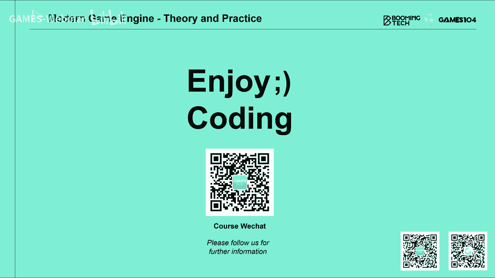

# 课程17：游戏引擎Gameplay玩法系统：高级AI (Part 1) 🤖

在本节课中，我们将深入探讨现代游戏引擎中的高级AI系统。我们将从传统的层次任务网络（HTN）开始，然后介绍基于目标的规划（GOAP），最后触及蒙特卡洛树搜索（MCTS）的基本思想。这些方法构成了构建复杂、动态游戏AI的基础。

## 课程概述与社区反馈

首先，我们回顾了上一周社区的热烈反馈。许多同学分享了学习心得，例如利用假期学习课程进行“算法胎教”，或从学生转变为社会人后继续学习。这些互动体现了社区的价值。

我们宣布了T恤投票结果，选择了第一款设计。我们将继续在每节课后选取幸运同学赠送T恤，以感谢社区的参与。此外，我们设立了一个专用邮箱，用于接收课程相关的非公开建议或优秀笔记。

接下来，我们回答了社区提出的几个问题。

**关于AI“读指令”**：有同学询问《艾尔登法环》中AI读取玩家输入是否代表未来方向。从经典游戏AI设计角度看，这通常被视为“作弊”，因为AI不应获取玩家额外信息。然而，在动作要求极高的游戏中，为了提升反应速度和游戏乐趣，这种做法是合理且可接受的。但这并非所有类型游戏AI的通用做法。

**关于AI计算预算**：AI的预算分配因游戏类型而异。例如，策略游戏可能分配较多时间进行精细计算，而实时射击游戏则预算较少。AI的更新频率（ticking）也与渲染分离，可以进行低频更新（如每秒几次），其架构通常是分层的。

**关于分布式AI系统**：将AI计算从客户端分离，部署到独立服务器或云端，已是现代游戏的常见实践。这种架构符合解耦原则，使服务独立维护，通过数据协议交换，提升了系统的鲁棒性。但对于手游等场景，仍需在设备本地进行计算。

回答完问题后，我们正式进入今天的核心主题：高级AI系统。本课程内容密度很大，涵盖了从传统方法到机器学习基础的多个领域。

## 层次任务网络（HTN）📊

上一节我们介绍了行为树（Behavior Tree），它是一种反应式机器。本节我们来看看层次任务网络（HTN），它从任务目标出发，更符合人类制定计划的直观思维。

HTN的核心思想是像人类一样制定计划。例如，“学习一门课”可以分解为“准备资料”、“到教室”、“学习”、“课后问答”等子任务。每个子任务又可能有多种完成方式（如查资料可选择去图书馆或上网）。这种结构非常直观。

### HTN框架组成

HTN框架主要由以下几部分组成：

1.  **世界状态（World State）**：这不是客观世界的真实描述，而是AI体主观认知中对世界关键要素的提炼。
2.  **感知器（Sensor）**：负责从游戏环境中抓取各种状态，类似于之前讲的感知（Perception）系统。
3.  **HTN域（HTN Domain）**：存放层次化的树状任务（Task）及它们之间的关联关系。
4.  **规划器（Planner）**：根据当前感知到的世界状态，在HTN域中制定一个可执行的任务序列计划。
5.  **计划执行器（Plan Runner）**：依次执行计划中的任务，并监控执行状态，在任务失败或世界状态发生重大变化时触发重新规划（Replanning）。

### 任务类型：原子任务与复合任务

在HTN中，任务分为两种基本类型：

*   **原子任务（Primitive Task）**：是最基本的任务单元，通常对应一个具体动作。它包含三个关键要素：
    1.  **动作（Action）**：任务执行的具体内容。
    2.  **前提条件（Precondition）**：检查世界状态，只有条件满足该任务才能执行。
    3.  **效果（Effect）**：任务成功执行后，对世界状态的修改。
    例如，“使用解药”任务的前提是“拥有解药”，效果是“中毒状态解除”和“解药数量减一”。

*   **复合任务（Compound Task）**：是HTN的核心，代表一个需要分解完成的高级目标。它由多个方法（Method）构成：
    *   每个方法都有一组**前提条件**。
    *   方法之间具有**优先级（Priority）**，系统会按顺序尝试满足条件的方法。
    *   一个方法内部包含一个需要**依次执行**的子任务序列（可能是原子任务或其他复合任务）。
    可以这样理解：复合任务中方法的选择类似于行为树中的**选择器（Selector）**，而方法内子任务的依次执行则类似于**序列器（Sequencer）**。

### HTN的运行流程

1.  **定义根任务（Root Task）**：设计师首先定义一个复合任务作为AI行为的最高层目标，例如“生存”可能包含“解毒”、“逃跑”、“攻击”、“闲逛”等子目标。
2.  **制定计划（Planning）**：规划器从根任务开始，根据当前世界状态，按优先级选择方法，并递归地将复合任务分解为原子任务序列。这个过程会在一个世界状态的“副本”中进行推演，假设所有任务都能成功，以验证计划的可行性。
3.  **执行与重规划（Execution & Replanning）**：计划执行器按顺序执行原子任务。如果任务执行失败，或感知器发现世界状态发生了重大变化（如战略目标改变），则会丢弃当前计划，触发重新规划。

### HTN的优缺点

**优点**：
*   **直观易懂**：以目标为导向，非常符合设计师的思维模式。
*   **支持长期规划**：能方便地规划一系列连贯行为。
*   **执行高效**：只有在需要时才进行全局规划，相比行为树每帧遍历效率更高。

**缺点**：
*   **配置复杂**：需要精心配置大量任务的前提条件和效果，容易出错，需要工具支持静态检查。
*   **环境适应性**：在高度不确定的动态环境中，过于长远和缜密的计划容易频繁失效，导致AI行为出现“震荡”，显得不靠谱。

HTN是对行为树的一种很好的抽象和总结。接下来，我们将探讨另一种强大的规划方法。

## 基于目标的规划（GOAP）🎯

上一节我们介绍了HTN，它通过树状结构隐式地表达了目标。本节我们来看看基于目标的规划（GOAP），它显式地用数学状态定义目标，并通过逆向搜索求解规划问题。

GOAP与HTN架构相似，都包含感知器、世界状态、规划器和计划执行器。但其核心组件不同：

1.  **目标集（Goal Set）**：所有AI可能追求的目标，每个目标都**显式地定义为一组希望达成的世界状态**（例如：`{存活: True, 中毒: False}`）。目标具有优先级，通过前提条件来排序。
2.  **动作集（Action Set）**：所有可执行的动作。每个动作包含：**前提条件（Precondition）**、**动作（Action）**、**效果（Effect）** 和 **成本（Cost）**。成本由设计师设定，用于评价动作的优劣。
3.  **规划问题（Planning Problem）**：给定一个目标，如何找到一系列动作，使得执行后世界状态满足目标要求，并且总成本尽可能低。

### GOAP的核心思想：以终为始

GOAP采用逆向规划。例如，目标“解读”要求状态`{中毒: False}`。系统会寻找效果能满足该状态的动作，比如“使用解药”。然后，“使用解药”的前提条件（如`{拥有解药: True}`）成为了新的待满足子目标。接着寻找能达成`{拥有解药: True}`的动作（如“购买解药”或“制作解药”），以此类推，直到所有子目标都能被当前世界状态满足。

### 将规划问题转化为图搜索问题

GOAP的巧妙之处在于将规划转化为图搜索问题：
*   **节点（Node）**：表示一组世界状态的组合。
*   **边（Edge）**：表示一个可执行的动作，其权重是该动作的成本。
*   **起点**：是**目标状态**。
*   **终点**：是**当前世界状态**。

规划器的工作就是在这样构建的图中，寻找一条从目标状态到当前状态的路径，并且希望路径总成本最低。这可以使用A*等搜索算法来解决。启发函数（Heuristic）可以设计为当前状态与目标状态的“距离”。

### GOAP的优缺点

**优点**：
*   **行为动态**：即使同一目标，在不同环境下也会产生不同的执行路径，常常能产生超出设计师预期的智能行为。
*   **目标与行为解耦**：目标被显式、定量地定义，与具体行为逻辑分离，提高了灵活性。

**缺点/挑战**：
*   **计算开销大**：构建状态图和进行图搜索的计算量通常大于HTN或行为树。
*   **状态量化要求高**：需要将复杂的游戏世界状态抽象为一系列离散的、最好是布尔值的状态，这对于高度复杂的游戏（如RTS）来说颇具挑战性。

GOAP非常适合于环境相对确定、状态可以量化的单机或顺序性游戏。接下来，我们将目光投向一种更“跨界”的算法。

## 蒙特卡洛树搜索（MCTS）简介 🌳

前面我们讨论了HTN和GOAP这类基于符号逻辑的规划方法。本节我们简要介绍蒙特卡洛树搜索（MCTS），它介于传统算法与机器学习之间，并通过随机模拟来评估决策，在复杂博弈中取得了巨大成功（如AlphaGo）。

MCTS的核心思想是模拟人类棋手的“推演”过程：面对当前棋局，在脑中快速模拟未来多种可能的走法序列，然后选择胜率最高的那一步。

### MCTS的基本概念

1.  **状态（State）**：对当前博弈局面的一个快照（如棋盘上所有棋子的分布）。
2.  **动作（Action）**：在某个状态下可以采取的操作（如在围棋的(x,y)点落子）。
3.  **状态空间（State Space）**：所有可能状态通过动作连接形成的树状结构。由于组合爆炸，该空间极其庞大。
4.  **模拟（Simulation）**：从某个状态开始，使用一个**默认策略（Default Policy）**（如基于棋谱的规则）快速地将棋局进行到终局，并得到一个结果（赢/输）。
5.  **节点评估**：每个树节点维护两个值：
    *   **N**：该节点被访问（模拟）的总次数。
    *   **Q**：从该节点出发的模拟中，获胜的总次数。
    `Q/N`可近似看作从该节点出发的胜率。

### MCTS的迭代步骤

MCTS通过不断迭代来构建和更新搜索树，每次迭代包含四个步骤：

1.  **选择（Selection）**：从根节点（当前状态）开始，使用一种权衡“开发（Exploitation）”与“探索（Exploration）”的公式（如UCT算法），递归地选择子节点，直到找到一个**可扩展的节点**（即该节点还有未尝试过的合法动作）。
2.  **扩展（Expansion）**：为上一步选中的节点，添加一个或多个新的子节点（代表新的动作）。
3.  **模拟（Simulation）**：对新增的节点，运行一次默认策略的快速模拟，直到终局，得到胜负结果。
4.  **反向传播（Backpropagation）**：将本次模拟的结果（胜/负）沿着被访问过的节点路径反向更新，增加它们的访问次数N，并根据胜负更新Q值。

### 决策与策略

经过一定时间或迭代次数的搜索后，算法停止。此时，需要根据构建的树来决定下一步动作（即选择根节点的哪个子节点）。常见策略有：
*   **最大胜率子节点（Max Child）**：选择`Q/N`值最高的节点。
*   **最稳健子节点（Robust Child）**：选择访问次数N最大的节点。
*   **最大稳健子节点（Max-Robust Child）**：寻求Q和N都较大的节点。
*   **最大下限置信区间子节点（Max-LCB Child）**：使用一个考虑胜率和访问次数置信区间的公式进行选择。

### MCTS的适用性与思考

MCTS能产生灵活、智能的行为，其决策一定程度上超出了设计师的预设。但它计算复杂度高，且要求能对动作结果和最终胜负进行明确评估。它非常适合**回合制（Turn-based）**、**动作结果明确**的博弈问题（如棋类、某些策略游戏的大地图回合）。对于更复杂的实时游戏，常需要与其他AI架构（如行为树）结合使用。

## 课程总结

本节课我们一起学习了游戏引擎中三种高级AI系统的基础知识：

1.  **层次任务网络（HTN）**：以目标为导向，通过树状结构分解任务，直观且高效，适合设计师构建长期行为规划。
2.  **基于目标的规划（GOAP）**：显式定义目标状态，通过逆向搜索和成本计算生成动态规划，行为灵活，适合状态可量化的环境。
3.  **蒙特卡洛树搜索（MCTS）**：通过随机模拟和树搜索来评估决策，擅长解决复杂的博弈问题，计算开销大但能产生超乎预期的智能。

每种方法都有其适用的场景和优缺点。在实际游戏开发中，常常需要根据具体需求混合使用这些技术，甚至结合我们即将在下一部分探讨的机器学习方法，来构建真正强大而有趣的游戏AI。

