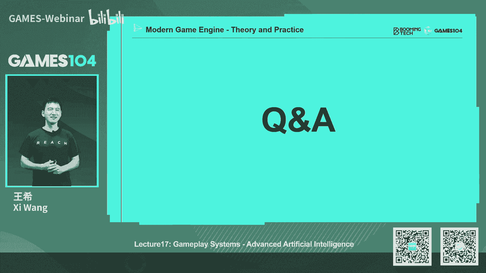
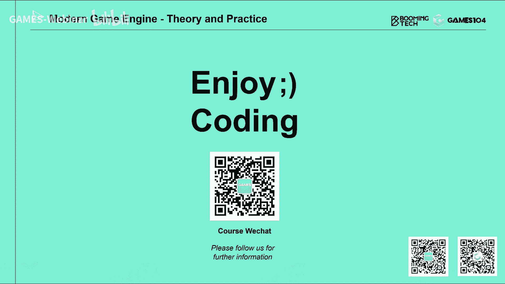

# 课程17：游戏引擎Gameplay玩法系统：高级AI (Part 2) 🤖

在本节课中，我们将深入探讨机器学习在游戏AI中的应用。我们将从最基础的机器学习概念讲起，并通过著名的AlphaStar（星际争霸AI）案例，了解如何将深度强化学习框架应用于复杂的游戏场景中。课程内容力求简单直白，让初学者也能理解这些前沿技术的基本思路。

---

## 概述

本节课的核心是介绍机器学习，特别是强化学习，如何被用于构建更智能、更具适应性的游戏AI。我们将避开复杂的数学推导，聚焦于基础概念和实际应用框架。

---

## 机器学习基础概念

上一节我们介绍了传统游戏AI技术，如行为树和HTN。本节中，我们来看看如何利用机器学习让AI“自我进化”。

机器学习是一个宽泛的概念，主要分为几个大的应用方向：

以下是几种主要的机器学习类型：

*   **监督学习**：本质是一个分类器。人类提供带有标签的数据（例如，1万张标注了“有猫”或“无猫”的照片）进行训练，之后AI就能对新数据（如100万张新照片）自动分类。
*   **无监督学习**：本质是聚类。给定大量无标签数据，AI自动在其中发现规律并进行分组。例如，在用户画像分析中，AI可以将海量用户数据自动分成不同类型。
*   **半监督学习**：结合了少量标签数据和大量无标签数据进行学习。这类似于人类的“小样本学习”能力，是当前AI研究的重要领域。
*   **强化学习**：没有监督者告诉AI对错。AI通过与环境互动，根据“奖励”和“惩罚”信号，自我优化迭代，最终形成自己的行为策略。这是游戏AI中非常关键的技术。

强化学习可以被理解为一种“试错搜索”。其难点在于奖励常常是延迟的。例如，在“老鼠走迷宫”游戏中，只有走到终点（获得奶酪）或掉入陷阱时，才会获得明确的正向或负向奖励，而在迷宫中的每一步本身可能没有即时奖励。

---

## 马尔可夫决策过程

为了数学化地描述强化学习问题，很早就有了**马尔可夫决策过程**这个框架。

想象一个智能体在环境中生存：
*   **智能体**：做出决策的实体（如游戏中的角色）。
*   **环境**：智能体所处的世界（如游戏地图）。
*   **状态**：在某一时刻，环境与智能体的具体情况。
*   **动作**：智能体可以执行的操作。
*   **奖励**：环境根据智能体的动作和状态给予的反馈。

这个过程形成一个循环：`状态 -> 动作 -> (新)状态 -> 奖励 -> 状态 -> ...`。

马尔可夫决策过程的核心数学表达涉及几个关键概念：

*   **状态转移概率**：在状态 `s` 下执行动作 `a`，转移到新状态 `s'` 的概率。这是一个概率函数，而非确定值，因为环境存在不确定性。
    > **公式**：`P(s' | s, a)`
*   **策略**：智能体的决策核心。输入一个状态，它输出应该执行各个动作的概率分布。
    > **公式**：`π(a | s)`， 例如在超级马里奥中，策略可能输出：`{左移: 0.7, 右移: 0.1, 跳跃: 0.2}`。
*   **总奖励**：智能体从当前时刻开始，未来能获得的所有奖励之和。由于未来奖励不确定，通常会乘以一个折扣因子 `γ` (0 < γ ≤ 1)，使得越远的奖励权重越低。这平衡了短期收益与长期目标。

---

## 在游戏中应用机器学习

了解了基础概念后，我们来看看如何在游戏里构建一个基于机器学习的AI框架。这并没有想象中那么神秘，关键在于将游戏世界转化为AI能理解的数据。

以下是构建此类AI系统的关键步骤：

1.  **定义状态**：将游戏内所有相关信息定量化表达。例如，在RTS游戏中，状态可能包括：资源量、单位位置/血量、战争迷雾地图、威胁度分布图等。
2.  **定义动作**：明确AI可以指挥游戏单位做什么。这需要非常具体，例如：“命令ID为X的单位移动到坐标(Y, Z)”。
3.  **设计奖励函数**：引导AI学习的方向。最简单的是只设置胜负奖励（赢+1，输-1）。更精细的设计会加入中间奖励（如击杀敌人、采集资源给予小奖励），以加速学习并塑造特定行为风格。
4.  **选择网络架构**：根据游戏状态数据的类型（图像、序列、数值），选择合适的神经网络进行处理（如CNN处理地图，Transformer处理单位列表，LSTM处理记忆）。
5.  **制定训练策略**：如何高效地训练AI。常见策略包括：先用人类玩家数据进行监督学习（模仿），再进行自我博弈的强化学习（进化）。

游戏AI的挑战比围棋等棋类游戏更大，因为游戏通常信息不对称（有战争迷雾）、动作空间巨大且结果具有高度不确定性。

---

## 案例分析：AlphaStar

接下来，我们通过DeepMind的AlphaStar项目，具体看上述框架如何落地。

AlphaStar的目标是训练能玩《星际争霸2》的AI。

**1. 状态表达**
*   **地图信息**：如地形高度图、战争迷雾图、可通行区域图、威胁度图等，这些被处理为多层图像数据。
*   **单位信息**：所有可见单位的类型、阵营、血量、位置等，这些是结构化的列表数据。
*   **统计信息**：玩家当前的资源、人口等，这些是简单的数值数据。

**2. 动作定义**
明确“谁对谁做什么”，例如：选择一组单位，命令它们攻击某个特定目标或移动到某个位置。

**3. 奖励设计**
AlphaStar主要以最终胜负作为奖励。但它也引入了一些辅助奖励项，例如，使AI的动作分布与人类高手的动作分布尽可能接近（通过KL散度衡量），以引导其学习更接近人类的策略。

**4. 网络架构**
AlphaStar采用了一个复杂的编码器-解码器架构：
*   **编码器**：一个“大脑”，由多个子网络组成。它接收所有状态数据（地图、单位列表、统计信息），分别用CNN、Transformer、MLP等网络处理，再通过LSTM层融合并产生记忆，最终输出一个代表当前决策的抽象向量。
*   **解码器**：将编码器输出的抽象向量“翻译”成游戏能理解的具体动作指令。

**5. 训练策略 - 联盟训练**
这是AlphaStar最精妙的部分之一。为了克服AI自我博弈容易陷入“局部最优”和“风格单一”的问题，它采用了“联盟训练”法：
*   **主AI**：不断自我进化。
*   **历史对手池**：主AI不仅和当前最强的自己打，还会随机和过去版本的自己打，防止“忘本”。
*   **剥削者AI**：专门训练一些AI去寻找主AI和历史AI的弱点并加以针对。这就像军队中的“蓝军”，迫使“红军”主AI必须发展出更全面、更通用的策略来应对各种不同风格的挑战。

这种多角色、多风格的训练体系，有效提升了AI的泛化能力和策略深度。

---

## 实用考量与总结

本节课我们一起学习了机器学习，特别是强化学习在游戏AI中的应用框架。

最后，我们需要从实用角度进行总结。在游戏开发中应用这些技术，必须考虑**费效比**。

*   **监督学习 vs. 强化学习**：
    *   如果拥有大量高质量的玩家数据，**监督学习**是快速获得一个表现不错AI的捷径，成本相对较低。
    *   **强化学习**潜力上限更高，能产生令人惊艳的突破性策略，但训练极其复杂、耗时且昂贵（例如AlphaStar训练成本高达数亿美元）。
*   **混合架构**：在真实游戏中，不必全盘采用深度学习。一种实用的方法是**混合架构**：
    *   **宏观战略**：用轻量级神经网络或传统AI（如行为树）制定高级目标（进攻/防守）。
    *   **微观操作**：用简单的规则或小型网络控制单位的具体行为。
    *   这样既能获得智能的决策表现，又能将计算和训练成本控制在合理范围内。

游戏AI没有“银弹”，本节课介绍的所有算法（包括本系列的Part 1），都应根据游戏的具体需求、预算和期望效果，在正确的场合选择使用。它们共同构成了现代游戏智能的工具箱。

---
**本节课中，我们一起学习了：**
1.  机器学习（监督/无监督/强化学习）的基础概念。
2.  描述强化学习问题的马尔可夫决策过程框架。
3.  在游戏中构建机器学习AI的五个关键步骤。
4.  通过AlphaStar案例深入了解了深度强化学习的实际应用与精妙的训练策略。
5.  在实际游戏开发中权衡不同技术方案的实用主义观点。

希望这节课硬核的内容，能帮助你打开游戏AI与机器学习结合的大门。