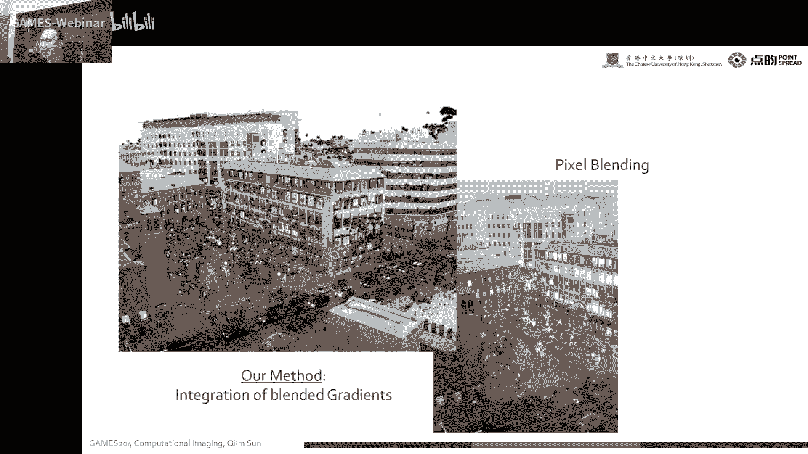

# 17. 计算照明 (II) ｜ GAMES204-计算成像 - P1 - GAMES-Webinar - BV1B24y1y7K4

## 概述

在本节课中，我们将继续探讨计算照明的不同方面，包括光颜色和亮度、合成孔径照明和摄影、时间调制以及自然光照条件下的图像增强。

## 光颜色和亮度

### 光颜色

光颜色可以通过波长或色彩来表示。例如，1997年的一项研究使用色彩进行水平方向编码，通过将图像投影到SHSV空间中，并使用彩色相机捕捉彩色条纹，可以精确地恢复人脸的3D信息。

### 亮度

亮度可以通过曝光时间来调节。例如，粒子图像测速技术（PIV）使用不同的颜色来表示不同的深度，从而通过颜色变化来估计粒子的运动，从而估算流体的运动。

## 合成孔径照明和摄影

合成孔径成像技术可以通过多个摄像头阵列来提高远距离成像的分辨率。例如，使用45个摄像头的阵列可以拍摄到30米远的目标，并清晰地捕捉到细节。

## 时间调制

时间调制可以通过改变光线的闪烁频率来获取信息。例如，动作捕捉相机使用闪烁的灯和相机来标记点的位置，从而实现动作捕捉。

## 自然光照条件下的图像增强

在自然光照条件下，可以使用图像增强技术来提高图像质量。例如，白天和夜晚融合技术可以将白天和夜晚的图像融合在一起，从而在夜间监控时提供更清晰的背景。

## 总结

本节课介绍了计算照明的不同方面，包括光颜色和亮度、合成孔径照明和摄影、时间调制以及自然光照条件下的图像增强。这些技术可以应用于各种场景，例如动作捕捉、粒子图像测速和图像增强。