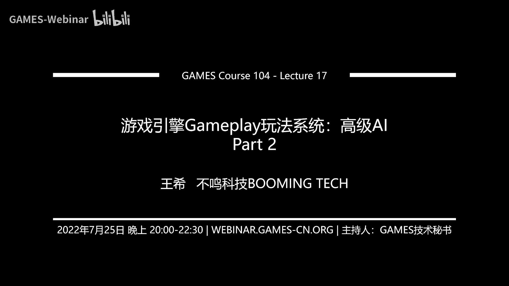
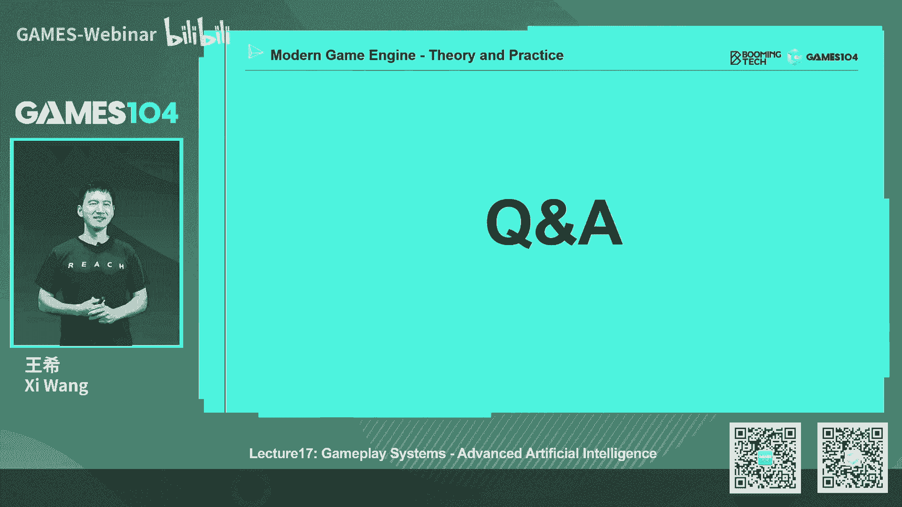
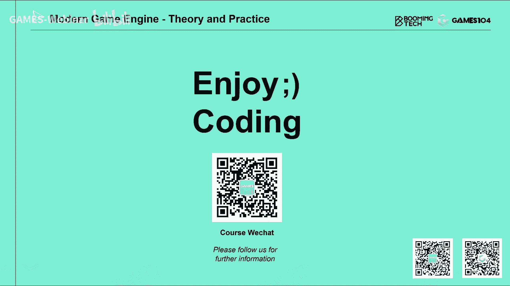

# 17.游戏引擎Gameplay玩法系统：高级AI (Part 2) ｜ GAMES104-现代游戏引擎：从入门到实践 - P1 - GAMES-Webinar - BV1ja411U7zK

这个终于到了我们这节课，我自己个人觉得啊，应该来讲是最最最硬核的一部分了，其实也不叫硬核吧，就是说我觉得料很足，但是呢实话实说啊，我给到我要告诉大家一个坏消息，就是说我们在准备这节课的时候。

我们第一part要讲mercy learning对吧，机器学习啊，积极的基础，其实呢我们这关于这一这个东西，准备了大概三三十多页，三四页，在最后上课之前，最后几分钟，我把最后那些最难的部分全部给删掉了。

因为那个实在是太这个这个太太太怎么说呢，这个对大压力太大了，所以呢我觉得在这一节课里面，我们作为games104课，我们核心讲的是游戏引擎，所以呢我们只会跟大家讲一下。

machine learning的最基础的结构和应用，而更多的去跟大家讲的是什么呢，就是说在这个游戏的这个scenario里面，我怎么去用machine learning这个方法。

我们举的例子就是alpha star，就是著名的这个就是google的DeepMind，用那个AI去打这个星际争霸的案例，我们从这个案例可以着手推荐大家去讲。

所以的话呢真正真正复杂的machine learning的，基础的算法理论，其实那是一个需要专门的课程去讲的，真的其实machinery真的是非常非常深的一个东西，而且很值得大家去系统性的去学习。

所以呢很遗憾，就是说在这个课程我实在没有办法展开对吧，而且包括很多概念，我觉得我自己掌握的都不是很好，所以的话呢也不能够慢慢弄斧，所以我这边就给大家讲一些，最基础的一些概念好。

那么首先much learning的话，毫无疑问啊，就是现在是当下最火的东西，我们认为AI几乎改变了我们整个时代，那么在我们的生活所有的地方，大家都看到machine learning了，对不对。

就基本上是无处不在，你基本上每时每刻他都在为你服务，只是你意识不到而已，好那么其实machine learning呢它是一个大的概念，你从它最基础的概念出发的话呢，它实际上几个大的应用场合。

第一个呢就是它会分为，就是比如说surprised learning对吧，Unsuprised learning，还有呢simon surprised learning。

还有reinforcement learning，强化学习，前面的是监督学习，非监督无监督学习对吧，半监督学习，最后一个是什么呢，哎强化学习，那这个概念听上去很高端啊，高大上，但实际上概念也很简单。

就是说所谓的监督学习本质上是个分类器，什么意思，就是说人类打好了标签或者whatever，什么数据告诉你这个东西，比如说这是给你1万张照片，告告诉AI说这是那里面有猫，那你们没猫。

然后我再给你100万张照片的时候，因为有那1万张照片的training，它就能够自动对照片进行分类，说啊这是有猫的，这是没毛的，这个其实在啊很多年以前就是有一个比赛，很有名的AI比赛。

他每天打的就是叫照片识别成功率，最早以前没有那个那个神经网，deep deep neural dn的时候，实际上哈那个真的是仁者见仁智者见智的算法，但一旦这个是那个那个那个那个深度神经网络。

CNN这些东西出来之后，这个这个比赛现在已经变得有点没有意思了，对吧，但是呢确实就是深圳那个就是说suprise learning的话，它最核心的基础其实就是就是一个分类器，包括他做很多回归的这个预测。

就是它的基础，那么对于enterprise learning是什么呢，我觉得是一个classroom，就聚类什么意思呢，就是我记得我记得小时候，我们学过那个一些基础的算法。

是我记得好像还有个叫fisher什么算法吧，就是给你一堆散乱点，让你找一条线，把它们分成那个两两趴，我好像有点不太记得了，但是呢其实就是给你很多数据，你对它进行聚类，那么就无深度学习的话呢。

它自动可以在数据中找到规律，对它进行聚类，这个东西其实是有用的，比如说我们在很多推荐算法中，我们要对用户进行画像对吧，用户画像有几百个上千个维度，那你就你没有办法，任何人可以告诉你说。

诶我怎么去定义什么什么类型的用户，最后呢他只能把这些海量呢，比如上一集的上10亿级的用户，这几百个上千个维度输入到这个AI系统里面，AI自动的用无监督学习，把它分成各种类型的用户画像。

然后呢人类看了之后说哦，你好像讲的是这种类型的用户吧，最后我们人类用我们的这个匮乏的语言，给他贴了个标签对吧，所以有的时候你会发现，AI是能帮你发现很多这个世界的规律的，也是用这种无监督的学习。

那么这个就是半监督学习呢，这个其实讲起来很高大上啊，但实际上他做的事情也蛮简单的，就是我们人类不用给你那么多案例，是简单的告诉你几个案例诶，接下来你就可以基于这些有限的信息，我对这个世界进行氛围。

就相当于你给这个无监督学习，做了一点小小的影子，这件事情有没有用处呢，实际上还是非常有用处的，因为这也是AI现在研究的一个，很重要的一个领域，就是叫小样本学习嘛，就是说我们人类是很聪明的。

就是说有的时候一个小朋友你跟他说那是老虎，他只见过两次，但是呢你给他看动物世界的时候，或者看什么东西，他马上跟你说，那是老虎对吧，它就是几个样本，人类就能学会，那是个老虎。

但是的话呢如果你交给如果监督学习的话，你可能要上万张照片，确定他说啊，这是老虎，这是老虎，那不是老虎诶，我们的监督学习才有结果，所以其实小样本学习的话呢，也是现在人工智能一个很重要的领域。

特别是我们未来如果走向那种叫强人工智能吧，我们其实很需要这个这样的一种能力好，那么最后一个也是最重要的东西叫做强化学习，Reinforcement learning，那么这个强化学习其实非常的重要。

就是说在这里面的话，没有一个监督者，也没有人告诉你这件事情是对的还是错的，但是呢他对这个世界呢，它有一个叫rewarding激励的这个函数，就是你做对了，他给你一点甜头吃。

做错了给你点那个那个反向的惩罚，那么这个AI算法，它能自己的去不断的优化和迭代，最终形成自己的一个什么呢，哎叫策略，叫policy，大家还记得我讲了policy这个词对吧，那么形成自己的策略。

最后能够使自己的结果达到最优，而强化学习这件事情呢其实是非常重要的，那么这里面就是很多时候，我们现在讲这个机器学习，很多时候都认为说，是不是最近几年神经网络的高度发达，所以我们这些概念都出来了。

事实上并不是，其实强化学习这个概念，在这个机器人学里面很早就提出来了，真的这个这件事情真的是非常了不起的，就是说我一直这样，就是如果我们对知识掌握得足够多的时候，你会意识到，就是说这个是我们非常感恩。

这个星球上产生了很多很优秀的聪明的前辈，他们真的给我们奠定了基础，就是在那个时代，就是大家就在提出各种算法和理论框架，就是怎么样的，让机器形成一个自我不断强化学习的能力，这种能力。

我后面再讲到这个心机的这个案例的时候，大家会意识到这玩意儿几乎就是你左脚踩右脚，一开始笨得要死，然后自己左脚踩右脚，最后让自己越来越聪明的这样一个神奇的过程。

所以我很我觉得reinforcement learning这个词，选的也是特别的好，那么其实reinforce learning的话呢，它本质上是一个就是try and error search。

就是尝试以及给你反馈错误的，这样的一个一个一个一个搜索，但这里面有个很难的一件事情是什么呢，就是说你你对这个系统的学习呀，很多时候他对你的rewarding是delay的，我举个例子。

比如说老鼠走迷宫的这个案例对吧，我们在迷宫的终点处放一个那个cheese，放一个奶酪，那对于老鼠来讲，我最后吃到那个奶酪，我肯定很高兴嘛，对不对，我在这个迷宫中间呢，我再放几个陷阱，你掉进陷阱里面。

你命都没有了，对不对，好这个时候我怎么去训练这个AI，让他去指挥这个老鼠的行动的策略，这里面一个很难的问题是什么呢，就是说老鼠它在每一步走到迷宫中，任何一个点的时候，我到底是向左走，向右走。

向前走的时候，其实他的rewarding并不会发生的，对不对，他如果如果我们设计说，我希望老虎老鼠尽快的走，那你每走一步，我会认为给你一个惩罚叫简易，你掉到悬崖里，我给你直接减个1万。

但是的话实际上最重要的，比如说到达终点的奖励是1万的奖励，那个掉进陷阱扣掉1万的这个惩罚，实际上都是非常deferred，他是delay的，那这个时候我的学习系统，怎么样能学习到这样的东西。

实际上这也是强化学习一个很难的一个问题好，那么其实整个这个就这这一类的问题的话呢，其实很早以前就数学上给出了一个定义，就是马尔可夫链对吧，马尔可夫决策过程，那么在这个就MDP了，这个东西的话。

我相信很多上过大学的同学，好像都理工科，计算机的专业都应该学过这件事情吧，就是说实际上在这个很早以前，我们就把这个概念已经给你抽象清楚了，首先呢我这个世界是什么呢，有一个AI t agent。

就是他呢会做出一个角色动作，然后呢会形成一个状态，这个状态的话，在和这个世界这个environment的形成互动，所以environment就是我们这个AIT所生存的，整个世界的总额。

比如像老鼠迷宫这个案例里面，老鼠就是那个agent对吧，老鼠脑子里面是有一套什么东西呢，我们叫做policy，叫策略，待会我再讲，就是他我很难按照这个PPT讲，因为你会发现当你讲这个AI的问题时候。

他真的都在一起，然后呢这个世界是什么呢，这个environment是什么呢，就是那个迷宫，对不对，这个迷宫里面这个environment会包括那个cheese，也包括那些陷阱，对吧好，那么好。

那其实呢在任何一个时候，我们的agent和这个世界会构成一个东西叫什么呢，叫做一个状态对吧，状态就是当前这个A键在感知到的一个世界，和这个整个这个环境，在游戏里面就是这个我们人类设计的环境。

比如超级马里亚里面这个state，就是我马里亚输出，现在到底站在哪个坐标点对吧，我的世界上各种比如金币在哪里，我的前面的小怪在哪里，对不对好，我有这样的一个state，接下来呢我有我行动的选择。

比如说以超级马里奥二为例的话，那我的action其实非常的简单，只有三个选择，往左走，往右走，往上跳对吧，所以你会发现诶他的整个动作空间很小，只有三个，但是的话呢当我在当前的状态，我做了一个动作之后。

诶我就会什么呢，我会形成一个新的state，所以你会发现马尔可夫过程它是个循环，它就不断的循环，所以呢他就会啊形成这样的一个，就是说一个就是他有的时候说一个叫tuber，就是一个一个三元数吧。

就是说啊哦这三样书里面还有一条，我待会再讲好，最后一个什么呢，就是奖励，比如说我吃了一个金币，你还给我加一分，对不对，如果我赢了这个游戏，你给我加1万分，但是如果我碰到了这个小怪，我被吃掉了怎么办。

那我就要扣1万分，我就游戏是失败了嘛，如果我只是在做一些无效的移动怎么办，你给我说的是零嘛，对不对，我就一来一去，其实你用这个就是说state action和和那个和reward。

其实就构成了一个这个世界的一个完整的表达，而所谓的马尔可夫的这个决策过程的话，就是无限的在这循环，就是你现在有个叫啊SSA，还有二的一个状态，这个时候我做出了一个A键呢，做出了一个一个一个一个一个策略。

我决定做下一个动作，下个动作之后我的状态就被更新了对吧，然后呢我的rewarding也会变化了，然后呢唉这个时候我又决定我下一个action是什么，所以他就这样来回循环循环循环好嗯，那么其实在这样的话。

我们就可以得到一个就是马尔可夫过程的一个，数学表达，这个地方，我其实已经把很多很复杂的数学公式，全部摘掉了，这个我我真的大家一定要那个理解我们的痛苦，因为我们发现就是这节课程。

我们不太可能会把这个machine learning的，基础的理论给讲明白，所以我们只会给大家讲一些最基础的数学概念，首先的话呢其实呃在这个过程中的话，其实它最核心的一个数学表达是什么。

就是一个叫一个词，一个叫测这个possibility，一个概率函数，就是说当我在当前的策略的S的情况下，我去take一个action，比如说A，那我达到一个新的状态的possibility多少诶。

这个很有意思啊，他不是说我在当前策略下，我就是做了动作，A我就一定能到S1撇的那个状态，但这里面其实可能是一个概率，这个是有道理的，因为在很多我们在决策的过程中，就是说我们康是我们的主观上。

会有很多我们自己的判断对吧，我认为这个事情我怎么做了，我就可能会赢，但实际上环境是不受你控制的，所以环境一直在变化的话，他有可能会让你的一些动作可能会成功，可能会失败，对不对。

比如说我假设让AI做一个我决定射箭的动作，对吧，我决定要打掉前面的小怪，但是大家仔细想想，我如果那个下一个状态是那个小怪，被我打掉的话，如果我是百分之百能把那个小怪打掉吗，或者AI来设计。

你觉得AI决定设计他就百分之百能卖你社死呢，其实不会对吧，玩家他会有很多的行为，所以我在设计这个马尔可夫过程的时候，实际上是个概率函数，比如说我精英怪准头很准对吧，我有八成的概率一枪秒了一箭秒了你。

但是呢我的我的我的这个其他的小怪的话，我可能经常设的设法不准，我只有1/10的概率能秒到你，所以说这里面的这个possibility of transform的话，transition的话。

of state实际上是非常重要的一个一个一个函数，这问题，所以其实其实我们在讲，那个我们内部在讨论这个事能力的时候，我们经常互相被我，我经常就被K说，王鑫你又搞错了，这个地方不是一个不是个函数。

不是一个量，它是一个，它是个什么呢，它是个随机变量对吧，它所有的可能性都有，我把我惹急了，我就说嗯好像我用量子力学可以理解一下对吧，就是这个原子对吧，它只是一个状态，它只是它是不函数。

他在这个1430之前的话，它的真正的值你是不知道，你只能知道他在这个点出现的概率是多少对吧，所以这个地方是个possibility，一个函数，第二个东西呢也是个非常重要的概念。

同学们要去理解的就是policy policy，那这个policy是什么呢，就是我们的AI系统的核心，你可以简单把它理解成，就是说我的，无论你是用neural network还是用有限状态机也好。

你还是用一个最土的一个表格也好，它呢它就会形成一个policy的一个黑箱，诶，它的策略黑箱，当你把一个状态输入进去之后，他给你输出什么东西呢，输出我现在该做什么一个动作，诶，这个地方最简单对吧。

我一个状态A进去，我就出来我做什么动作，这个地方听上去是不是很好理解，但是这个地方我讲的是错的，实际上呢它输出的是所有可能动作的概率，什么意思，就是说当我一个状态输进去之后。

我会说比如说以刚才超级马里亚为例的话，那么他有三个马里奥，他有三种可能的这个动作，对不对，他应该输出的是向左移动，概率可能是比如说0。7向向向右移动，可能是0。1，那向上跳可能是0。2。

它当然这个地方规划，所以其实呢我们状态之间的transition，它是一个possibility，是一个随机变量的随机函数，变量的函数的话，那其实这里面policy就是我的这个策略的话。

它也是一个随机变量，对这个听上去是不是很深奥，没关系，这些东西呢大家听听就好，因为今天我们不展开这个machine learning的细节，但是同学们一定要知道这个概念。

就是说因为其实我们无论是用神经网络，用各种各样的东西，它核心优化的就是这个policy的这个机制，这个函数你可以认为他这个函数，你是用那个神经网络，你还是用这个就是状态机，还是用刚才我们讲的一个。

当然我们前面讲的所有的东西，比如说构图也好，我们的HTN也好，那个有限状态机也好，be a tr好，你把它整个封在一起啊，你可以把它理解成他就是一个policy的，这样的一个就是一个policy。

它有一个输出状态的输出啊，输出它就会有一个动作的输出，大家想想是不是这样的好，那么最后呢就是我们要去算他的这个total reward，对吧，就是a total reward这个东西呢。

实际上有一个很巧妙的东西，就是因为你是一个马尔可夫的一个过程，马尔可夫课程最核心的讲的意思是什么，就是说我们要把这个世界上发生的事情，变成离散的，Step by step，那么而且因为未来的更多的步骤。

其实是没有被发生的，对不对，所以我是对未来的世界的一种预测，那么你对未来的reward预测最简单的直接是什么，就是说从我当前的这一步走了这个动作的reward，到我后面所有的reward加在一起。

是不是就是我的总reward加在一起，就是我的game对吧，但是的话呢马尔可夫的有一个就很多，在很多AI系统有一个假设是说，因为未来有大量的不确定性，所以呢我认为我走这一个动作之后。

我做了这个action之后，我到了下个state的，我获得的奖励是靠谱的，我能把握得住的，再走一步的奖励的话呢，他就有那么一点点不靠谱了，那我乘上个什么呢，诶我乘上一个系数与伽马，我可能设计成比如说0。

99对吧，0。999没关系，但是呢当你走了100步之后，你那时候说的是version的话，就是0。99的100次方，你会发现它很小了，它已经不起作用了，所以其实它就是一个就是这个东西是有合理的。

其他就平衡一件事情，就是说我们当时在讨论这个东西的时候，我们我们的AI的老同学们说了一个比方，特别有意思，他就说你看啊，你今天这个要好好读书，你将来以后就能够特别特别的成功，这件事情重不重要。

当然重要了，我将来能赚一个亿对吧，我就完成了我的人生的小目标，但是你现在会发现，你这个时候如果不去吃饭，你今天晚上那个几天之后你就会饿死，那所以你将来赚一个亿的目标的权重，有那么高吗，没有那么高。

所以你现在最重要的事情是什么，赶快找到一个地方把肚子填饱，否则你会饿了对吧，所以呢其实这个这个权重呢，那个函数它就在平衡，就是短期收益和长期收益之间的一个一个目标，所以当你做AI it的时候。

如果你希望它更加的就是长期的目标追问的话，那你就把伽马设置的尽量的靠近一，甚至就设成一也没有关系对吧，其实在不同的AI系统中的话，有的时候他真的就设成E了，但是你希望这个就是这个这个AI体呢。

更加的responsive，就是说更加的顾眼前，更加的响应速度快，那你会发现你把伽马设的稍微激进一点，比如说设计个0。99990。98对吧，甚至你可以设置成0。95也没有问题。

那这个时候你就不可能太太太低了一点啊，那么你这个时候就可以去引导这个行为，所以说其实你会发现，其实马尔可夫决策课程中间的话，它最核心的几个元素就是这个元素。

第一个就是说我动作就是我的state transition，它的这个possibility这个分布，实际上就是你可以理解成是一种，概率上的一种graph，第二个呢就是我核心呢我的policy。

我反复迭代和优化的就是我的policy，是我的策略方程，那么最后呢，我的策略方程优化的这个指引者是什么呢，实际上是我的就奖励设计，我的奖励设计的话，你可以设计成一种就是更加的平的。

也可以设计成随着时间衰减的都可以，所以这是MDP的一个数学的核心表达好，那么其实policy的话呢，在我们的很多的这个就是deep in里面，我们都会写成一个巨大的一个派函数。

他们他的核心的输出输出就能看到，我讲的是你给出一个状态的时候，我会告诉你说你做下一个动作的，做那个动作的possibility，比如说以马里奥问题，你看到没有，就是往左走，我们设成0。2了。

但我讲的不太好，但是没关系，那往右走是0。1，我这个时候往上跳是0。7，但实际上我觉得这个例子举得，为什么上上上上跳0。7呢，因为这个时候我的状态里面你发现没有，我头顶上有一只金币对吧，我前面什么呢。

前面有只小乌龟，如果我的AI没有做错的话，这是我的AI的策略，应该是跳起来吃金币，而且躲过那个小乌龟对吧，那说明这个这个policy这个系统，这个pad做的还是不错的，那么讲到这儿的话呢。

其实在这一页之后，大概还有六七页，我们给大家讲什么呢，讲这个叫V函数，Q函数什么意思，就是在每个state上面，我们有个微函数会说，告诉你说这个state到底是不是好的还是坏的，那么这个CD有了之后。

我们还有一个叫Q函数，告诉你说在这个世界上你做这个一个动作，它到底收益是好的是坏的，然后基于V和Q函数呢，我们有两种优化方法，一种是基于这种叫做policy gradient的。

这个这个这个就是SIRI，就是说哎我是用这个就叫做什么呢，我的这个梯度优化法对吧，如果我这个这个这个策略网络是一个可微的，那我找他的梯度，那我去优化我的整个这个策略。

那或者是呢我整个在全局的就是policy，整体的去优化它啊，这个想起来就什么actor actor critical啊，什么很奇怪的一些东西了，那这个地方听上去就是各种，这个不是讲人话的东西了。

所以呢其实我们最后在上课之前的话，决定写到这一趴就结束了，就不要再讲了，就是说因为这其实就是machine learning的一个，很核心的基础概念，但是他这些东西他具体怎么做，数学上它是怎么去证明的。

实际上那是一个很深的一门课，那门课一讲肯定是讲不完的，就大家如果学过一些那个B站上一些，非常好的一些，就是那个就讲那个深度学习的一些方法的话，我觉得你们会讲的非常的好，但是呢做AI做游戏AI的话。

我们知道这些基础的概念，接下来更重要的事情是，怎么把这些东西用在我们的游戏里面去，好那这些，所以接下来就讲一个非常有趣的东西，就是哎我们怎么利用这个machine的这个行业的发展。

来benefit我们游戏游戏AI，这里面注意啊，我讲的是游戏里的AI，不是用deep learning的方法去做，比如说游戏的内容生成，比如现在一个很火的方向叫PCC，就是基于这个AI的。

比如说基于算法的这个内容生成对吧，其实还有很多的，比如说我生成动作啊，生成这种让人物的行为更加自然，这些都是很多很优秀的方向，但今天的话呢我们focus会非常specific的讲。

就说我怎么让游戏里面的这个AI变得更聪明，那为什么这里面我们要在游戏里面考虑，使用像much learning这样的东西呢，其实有一点就是说他会发现，我们过去所有的前面讲的AI算法比。

无论是HTN的还是GP的话，它实际上都是人类的设计师设计出来的对吧，人类设计师一切对于比如说你的动作能做什么，你有哪些动作，包括你该以什么一种关系串在一起，已经一切了然于心了，所以这就意味着什么呢。

这就意味着就是说这个AI的行为，应该也不会超过我们人类的预期，而且他很可能我们的想象力，就直接决定了这个AI的上限，但是呢那么是learning的方法是什么呢，特别是强化学习，它是可以AI自己去进化。

不断的去创造各种可能性，所以它实际上就把游戏的这个行为，变得更加的无限可能，那这件事情为什么对游戏特别重要呢，因为想象一下，我们我们认为未来的游戏的发展。

它是给人类构建一个更加的就是believable的，一个像真实世界这样的一个无限可能的世界，那我们想象一下，为什么我们人类旅游，为什么我们喜欢结交新的朋友，就是因为当你面对这些新的世界，新的朋友的时候。

他会给你带来完全不一样的体验和感受对吧，让我们有新鲜感，所以说其实一个好的游戏，这是我至少我个人的believe啊，就是我认为未来的游戏，它一定是当我每一次登录游戏的时候，他要给我带来一些新东西。

我不想去，每次去主城主持人的NPC都跟我说同样的话，对不对，很讨厌对吧，那么但是大家回想一下10年前的游戏，是不是NPC永远的repeat the same words again again。

但是大家想象一下，荒野大镖客这样的大表哥的游戏，一进去之后发现诶，这NPC的行为好像看上去好像很human like的，对不对，但是呢我记得好像有一个B站上的一个up主。

他去跟了那个大表哥里的NPC更了好像是一天吧，他后来发现说诶，已经发现这里面有些repeat了对吧，但没关系，我不知道它里面是不是用了这种，我是能力的方法，但是我认为这已经push for了。

但确实在我们这个领域里面的话，我们确实在思考，就是用这种深度学习的方法，包括一些那个机器的这些人工智能的东西，让这里面的游戏AI真的会思考，会探索无限的可能性，这也是我们一直一个梦想好。

那么我们怎么样在一个游戏里面去构建一个，基于machine learning的这样一个firm work呢，这里面的话呢其实没有大家想象的那么fancy，其实在游戏里面你想构建这个它的。

比如说人工智能的东西的话，其实最重要的一件事情是构建这个游戏的这个，Observation，就是说你把游戏里所有的状态，能够定量化的表达出来，就以你作为一个游戏而言的话。

就是说你要把这个游戏里面所有的状态，用state表达出来，这样你这时候才能变成一个电脑可以感知的，这样的一个世界，那么你有了这样的一个世界之后，你反复优化的是什么呢，是你的policy对吧。

这里面policy又来了，就是说当我的世界在这个状态的时候，我这个时候我的AI应该做什么样的一个动作，然后呢这个世界会发生改变，而且对我会更好，所以它其实是这样一个大的循环，那这里面我就举一个例子。

哎这里面就讲一个更具的，因为这个问题讲的非常的抽象，其实如果我们用deep reinforce learning，就dire是stands for deep reinforce learning。

深度强化学习这样的一个框架去构建一个，比如像星际争霸的这样的一个游戏的话，我该怎么做，这里面的话呢，你会发现你有这么很重要的几步，第一步就是对这个世界状态的描述，我们叫做state对吧。

就是你大家想象一下我们打星际的时候，你看到的是什么，是一个一个的像素，对不对，那我们人会怎么样，我们的大脑会把这些像素抽象成各种语义，对不对，这是我的基地，只是敌人的冰，那是敌人飞在天空上的航母对吧。

这是我的机枪兵，这是我的那个那个那个医疗兵，然后小地图上红的点蓝的点，对不对，资源点看得一清二楚，对不对，那等等，还有我的血量各种状态，所以这些state实际上是需要有一个量化的方法。

表达给我们的AI系统，第二个是什么呢，哎我的我有了这个世界的表达之后，我要定义说电脑AI到底指挥我的这个这个游戏，做什么，你要定义你的action，其实action这件事情并不简单，因为大家想象一下。

我如果我的电脑控制的输出，叫鼠标的点击拖动是吧，这个就很奇怪了，对不对，其实比如说如果我让小兵让电脑打星际的话，实际上呃，他很可能是直接给那个小兵发一个移动指令，当然这里面有作弊的嫌疑啊。

所以实际上在真实的这个AI与人类对抗的时候，他甚至会模拟人类的手速，都是都需要去模拟的，但anyway，就是说其实action的话也是需要被定义好的好，第三个呢其实也很有意思，就是说大家想象一下啊。

我去打一场像星际这么复杂的游戏，那我一场游戏要打大概将近一个小时吧，长一点，短一点，30分钟，20分钟，那在这么漫长的时间里面的话，我每隔比如说一秒钟思考三次，我去做他的角色的话。

那我其实会产生几千步上万部，但是我怎么去知道这个东西胜负，是有道理的对吧，我要设计它的rewarding激励，最简单的revolting很简单，就是剩剩了给一分对吧，输了给零分，那个啊输了给一分。

假如评论给零分对吧，有的游戏是没有平局的，但是这个rewarding设计的就很粗暴，但是这个rewarding能不能work work，但是你如果希望这个AI更加聪明，更加有效的话。

实际上你要设置它很多的动作的奖励，后面我们会讲到那么好，第三第四件事情是什么呢，就是说根据你要做的这个，游戏的本身的结构和逻辑，你要构建你的这个neural network的这个拓扑结构。

和它的网络选型，这件事情其实是非常考验这个团队的基本功的，那么这件事情对于每一个不同的游戏，根据它的游戏的核心机制，你的设计方法确实不一样，最后呢就是哎你有了这个，你把世界抽象成了这个状态了，对不对。

你定义了所有AI可以指挥小兵做这个，指挥这个bot做的状态，然后呢你也设计了非常合理的几样零函数，你也设计了一个非常贴切的这个，这个网络拓扑结构好，你是不是都work了，哎没有那么简单。

你还要设置一个训练的策略，因为假设你不认真的设计训练策略的话，你的这个I其实也很笨，待会我们讲到那个阿尔法star的时候，大家会发现这里面很微妙，好，这其实他开发现就是说。

虽然听上去大家觉得这个人工智能，那个那个深度学习好像很强大，但是你把这样一个强大的工具用在游戏的一个，具体的scenario的时候，你会发现这个事很复杂，这里面我再多说一句。

就是说其实大家刚才我们第一个案例，讲蒙特卡的research mc t的时候，我们讲的是阿尔法go的例子，就是下围棋的例子，我们讲过围棋多复杂对吧，pony爸爸说他比宇宙的原子还要多。

但是我跟大家讲一件事情，就是说其实对于围棋这样的一个博弈来讲的话，计算机用这个方法，计算机用蒙特卡洛吹测试方法，再加上一点那个深度学习的东西，现在已经完胜人类了，那为什么呢，因为对于项棋类运动啊。

他的信息第一个是对称的，就是所有人看到的奇迹是一样的对吧，而我们真正打游戏的时候，什么我们有个叫战争迷雾，大家想想看，所以它是一个叫信息不对称的这样的一个博弈，第二件事情的话呢，围棋的规则你每走一步。

它的步骤是非常明确的，所以接下来我讲了，如果我有无限的算力，和无限的这个存储空间的话，理论上是有必胜策略的，好在这样的一种博弈里面的话呢，目前啊好像是人工智能已经干过了人类了对吧。

大家都知道围棋最近发生的事情对吧，但是在像游戏，比如像星际争霸这样的游戏里面，到目前为止，全世界还没有AI能够完善人类的player怎么样，我们人类的最后的尊严还最终保住了。

对对于这种超复杂系统的博弈来讲，我们人类的大脑，毕竟我们有1000亿个神经元嘛对吧，我们还是勉强苟延，残喘了我们人类的荣光，所以其实我这句我讲这句话的意思是什么呢，我想告诉大家。

就是说其实游戏的这个scenario里面，如果构建一个这样的一个人工智能的话，实际上难度还蛮大的，而且呢你很你真的想做的很好，其实非常的挑战好，接下来就讲一下这里面的很多的细节好，我们这里面的话。

我们就举个例子，我们就不叫举个例子，其实这也是我们发现的最好的例子，就是alpha star，阿尔法star就是我们的DeepMind，在几年前用这个就是它的这个神经网络，这个技术构建的。

是跟人类打星际的这样一个例子，那么他首先第一步是什么呢，我要对游戏的整个状态进行表达，那么第一个，那么整个一个星际界面打开了，你会发现没有，里面是有很多的哎，很多的图，很多的map小地图也好。

我一眼看见的东西也好对吧，然后呢我还有很多游戏的统计数据对吧，我还有很多单位在地图上跑，怎么样呢，我还有什么呢，还有我自己的各种数据都在里面，所以这些东西的话呢，是实际上就是我对世界的state。

那state的具体怎么去表达呢，这样的东西其实AI是不知道的，那我们就要对各种state进行定量的表达，第一种是什么呢，就是各种各样的map，比如说我的整个地形的高程图对吧，什么地方是高地。

什么地方是平地，如果打过星际的小伙伴，就知道高地的意义是很不一样的，比如说我的飞行单位可以去攻击任何高地上，高地上的目标，但是的话呢，我的地面单位如果没有条通很多高地，我上不了。

比如说我们以前那个星际地图，可以自己编辑的时候，有人会做个非常变态的图像，这个图像有无数的高地，都是都是孤岛对吧，就地面单位永远上不去，所以我必须要用航母啊，或者是那个就是那个飞行飞龙啊。

去攻击那些地方，第二个的话是什么呢，我的战争迷雾，它本身是不是也是一张图对吧，还有什么呢，诶我这个比如说地面地表的各种状态的变化，比如说在那个就心机里面有个叫重组重塑，它要在那个地方去渐进任务。

它首先什么要把那个地方先感染了对吧，他那个地方需要被感染掉，那么还有什么呢，就是我什么地方发生了警报，还有呢我什么地方可以寻路的，这个这个图还有什么呢，就是说哎其实很多的在AI这种设计中。

我的叫inforce map，就是比如说威胁图像这些东西在里面也会协同，在上一节课的时候，我们讲了game play的时候，也讲到了这个东西，所以其实啊我对一个游戏的态势的表达。

可以用很多层的这样的一个map去表达，这些东西呢，我们人类看起来是很抽象的，你看不明白的，但是你交给计算机，不妨碍计算机，它能够去读懂这些信息，所以你可以把整个战场博弈的态势。

转化成一层层的map传给他，那么第二点是第二种数据是什么呢，就是各种各样的unit的information对吧，你的哎你面前unit的type是哪些，对不对，是什么类型的，比如说是机枪兵。

护士兵还是这个什么坦克对吧，然后呢这些人到底是敌方友方还是盟友对吧，你还有这些人血量怎么样了，对不对，还有他们的现在的位置在哪里，这个我就不一一展开了，但实际上是让这些信息是什么呢。

它不是一个map信息，它是一个离散信息，一串一串串的数据过来好，你有了这样的一些信息之后，我们接下来干什么一件事情呢，我们要定义说我到底能做什么一件事情，比如说以星际这样的游戏为例的话。

我们就要定义说哦，你是moon attack build对吧，三个最核心的问题，但是呢这问题听上去很简单，你能做什么，但是你要知道who对吧，是谁去做这件事情对吧，因为心机里面你同时给个指令的时候。

有的时候给的不是一个单位啊，你给的实际上是一群人对吧，第二个就是你要攻击的对象也可能是个人，你到底攻击谁呢，你是攻击一个建筑物，还是攻击对方的一个，比如说飞龙，你还是打掉对方的一个什么。

这个就是一个一个一个坦克对吧，你自己决定那么打去，比如说你如果是木的话，你到底要去哪个点，因为有的时候我我去的点是只是个坐标嘛对吧，所以说其实包括你后面的，比如说如果我们有一定的planning的话。

我可能输出的动作不是只有一步，我可能好几步，比如说我要求你先移到那个点，接下来你在那个地方给我建一个基地，新一个分基地建起来，所以说其实action的定义对于游戏去做这个AI来说，非常的重要。

你要定义的非常非常specific，非常非常的清楚好，接下来的话呢我们要设置奖励，那么这里面的话还是有很神奇的事情的，比如说像我们去读那个阿尔法star的文章的时候，我们就很惊奇的发现。

就是说他说我的奖励设计的非常的直接，就是我只设置win and lost，就是win我给你加一一分，书就减一分，但其实呢它这里面还做了一个小小的这个，这个优化，他说呢就是说他会把游戏中很多的一些状态。

比如说这些啊，一些比如distant agent，agent之间的这个这个就是就是电脑算出来的，这个就是大家记得policy，对不对，我用我的我的电脑，给出了我下一步操作的这个动作，和人类。

如果在这种情况下，他做的动作我做过比较，如果他两个不一样的话，我对他有一个反向的惩罚，如果一样，我做过这样的惩罚，我我做一些的一堆的CRITERI去引导我的做法，就这个地方我们就看傻了。

我们就说哎呀大哥，你这个地方对吧，胜负只按正一去给，那你这东西到底给多少呢，你是给这个100还是给1万，如果你给100和1万的话，那显然胜负这件事就没有意义了，对不对，那如果给的太小，它也不起动了。

为此的话我们还专门请教了国内的一些大牛，他们告诉我说啊，因为我们自己没有实践过阿尔法star这边paper嘛，就是我们就去拜托他们，他们跟我说，他说哎，其实他们的大致的给了这个数值加了权重。

让这些所有的这一项的一些叫做relevant，这样的一个sudo relevant，Sual reward，叫伪基地的话呢，它的总加在一起的范围，大概值域范围大概在正一之间。

就是跟那个VR的loss基本匹配，但是呢就不会超过它，但这里面的权重怎么设置，怎么算，就是他们自己的黑科技了，但是呢这个是阿尔法斯的方法，但我个人觉得其实有很多其他方法，这里面举举另外一个例子。

这个例子就是那个OpenAI five，这个open范围也是很有名的一个AI系统，就大家如果喜欢打DOTA的人，肯定都听说过，就是这个是OpenAI做的一个就是啊就是打DOTA的AI。

那么打的应该是DOTA2，那么这里面很有意思的事情，他为什么叫five呢，因为大家想想DOTA上上场都是五个英雄对吧，那么他呢就设计的非常符合我们玩家的理解，比如说对吧，你胜负当然会给你分数了。

但是哎你偷了个塔对吧，你干掉了一个英雄，比如说你被人家这个，你你你你被人家砸中了一个一个技能，你受到了伤害对吧等等，所有的事情他都给你一个小小的激励，这些小小的机理在一起。

就形成了一个非常高频的一个rewarding系统，这样的话而且他还有一个很巧妙的地方，就是说因为你设置了这么多的小奖励，实际上你比如说把击杀英雄这件事情，他的reward给的足够高的话。

你实际上就能够定义他的AI的行为，就是非常的aggressive，他会更加的想去砍人对吧，如果呢你把它胜负看的这个特别重的话，这个AI就会怎么样呢，他会非常的这个这个非常的保守，非常的安全。

他就优先把这设计做，就这他就优先以胜负大局为重对吧，很有格局，那所以的话呢，其实我就可以通过这些变量的调整，就这些rewarding调整，让我的AI有各种各样行为的变化，那么其实跟新机一样。

就是到现在为止的话，open a f好像还是打不过人类的top tier的玩家，哎这个我们人类最后的荣誉还是保持住了啊，但这句话我觉得这个flag还是不能立得太早，说不定再过几年AI的发展。

真的把我们又摁在地上摩擦了我，我突然觉得有种莫名的荣誉感，你看啊，这个围棋这么古老的一个运动被AI碾压了，但是我们这么新兴的一个运动，电竞，到目前为止还是人类的圣光。

保持保持在我们的这个没有没有熄灭对吧，那这个灯塔的话，我们希望我们人类选手保持的越久越好，所以呢这里面单单从回到我们这个这个课程，算法里面讲的话，就是说其实当我们用这个啊。

就是deep deep reinforce learning的方法去做游戏的AI的时候，其实rewarding的设计，包括它是高频和低频呢非常的重要，就它直接会影响到你最后这个系统产出。

那么你有了这样一个东西的时候，诶，我们就开始要构建我们的这个训练的这个，这个神经网络系统了，大家看到这张图是不是有一点，这个非常的这个密集恐惧症啊，唉不好意思啊，这真的就是这个阿尔法star的。

它这个体系架构图，这几乎就是从原文上扣上来了，然后我们唯一做了一个工作干嘛呢，我们画了两个框，所以告诉大家，就是说它下面是一堆的各种各样的输入对吧，其实我们讲了stay的输出，比如说你各种各样的图对吧。

然后还有各种各样的游戏的数据，比如说有些数据是游戏的统计数据，有些数据是这个玩家的unit的数据，它扔到了不同的这个架构的这个神经网络里面，有的是用这个就是RESNET对吧，处理各种各样的图。

有的呢是用这个就是说啊transformer对吧，处理连续的数据，有的呢就是用那个MRP对吧，就这最简单的神经网络处理它，然后最后扔到了一个LT那个TM对吧，那这个听上去很高端了。

待会我们会解释整个这一段全部做完之后，干了一件什么事儿呢，他计算机就是这个这个AI，就做了一大堆很奇怪的运算，最后他encode了，形成了他自己这样的一个角色，但这个角色呢人类是读不懂的对吧。

他输出了一串的数字，水鬼没有人知道他在讲什么诶，它上面也做了一层网络，这种网络相对就比较简单了，他干了一件什么事情呢，它叫叫decoder，Decoder，就是呢把这一这一堆大脑算完的结果。

把它翻译成我们人类能理解的，他的整个行动，这里面就会说诶我有些有些decoder，有些行动就是说我到底要不要空兵，有些行动是我到底要移动对吧，各种东西它就控制好了，所以其实它的整个你去理解它的结构啊。

已经分成两层就好了，第一层就是神秘的角色，课程产生了一个谁也读不懂的一些数字，就像一个对大家如果看那个玄玄疑小说的时候，有一个极其聪明的，比如说这个智囊，他分析了整个这个这个天下局面。

然后呢给那个就是这个这个这个主公，在墙上写上了一行字，然后一般人看到强子完全看不懂他在说什么，但是呢主公再找一群模式，把那几个字逐字逐字的去解读，去理解，然后最后形成了韬略说啊，这个什么张将军。

你带5000人去杀到什么地方去，李将军，你赶快固守我的这个陈强诶，这个decoder就干了，这个事，然后呢最后我这个AI就可以行动起来了，怎么样，听上去是不是呃一下子觉得没有那么高大上了。

确实是你如果这么去理解的话，好像也没有那么难对吧，那其实最有意思的就是这个encoder，就是他怎么去决策的这事呢，说实话，就是这也是我一直以来对这个深度学习的一个，怎么说呢。

也是我个人不成熟的一个理解，就是因为我有很多朋友，就是应该是全球顶级的这样的一个，人工智能专家，这个地方小小的凡尔赛一下，是他们很优秀，不是我很优秀啊，这个说实话，我每次对他们的敬仰之心都滔滔江水。

然后当我每次呢因为有酸葡萄心理嘛对吧，我又我又做的不够好，所以我就开始酸他们了，我就说我说你们做的事情，就是一个那个炼丹的过程对吧，你们设计个丹炉，然后呢把各种材料往里面加面，多加水，水多加面对吧。

然后的话呢就是然后呢各种什么朱砂呀，什么这个什么铜铜铜须啊，什么都往里加一通火，烧完之后最后练出一个东西，哎这东西就好了就work了，那这个当为什么练出来的原理是什么呢，你也不知道。

大概猜猜可能是这个原因，但其实你也不能给出一个非常scientific的一个，数学证明对吧，那其实今天就是我们深度学习，有个很重要的一个研究方向，就是说为什么这个深度神经网络它就是work的。

虽然我能够用一些简单的概念解释它为什么work，但是其实在数学上，我去演绎他的work这些事倒还是挺难的一件事，但是确实有很多很优秀的科工作者在做这个事，所以的话呢其实我们去理解这些大佬们构建的。

这个就是这个各种各样的训练的模型啊，其实你就把它想象成这玩意儿就work了，而且他能处理什么样人类的问题，然后呢我们就像拼搭积木一样的把它搭起来，只能解决好我们的问题就可以了对吧。

所以很多东西你是不能深究的，至少深究已经超过了我们的智力范围，所以如果按照这种不求甚解的思思路的话呢，诶我们好像就能够把这个这一张神奇的图，就给他解释清楚了，那比如说大家看到其实我们的输入啊。

它其实有三类，第一类是什么呢，就是我们讲过的诶这个游戏的基础状态，比如说我的资源量对吧，我各种各样的气呀，我的这个这个各种人口啊，各种资源量在这边，对不对，这就是一个很确定性的，就是定场的一个数据。

对不对，他一个游戏中你就那么些数据，第二种是什么呢，各种各样的map对吧，我对游戏态势的感知不就是小地图对吧，我的各种各样的influence map对吧，这种map过来诶，我要对这种图像数据进行处理。

对不对，那第三种是什么呢，唉我现在目力所及看到了多少的敌方单位，敌方单位的坐标是什么，我方单位的种类坐标位置，但是这里面有个挑战是什么呢，它的长度是变长的，而且一直在变呢，对不对，你开发现没有。

就是说你很难说我现在只看着前1000个，但是如果你真的设计个maximum，然后的话你只用maximum的这个东西，就是所有的没有的，就是成林可不可以可以的，但是呢这个他的这个这个行为表达就很诡异。

那这个你的实践网络其他的要求就很高，那么对于这种三种不同类型的数据啊，其实我们的这个这个这个deep learning的先贤们，已经给出了非常好的AI的训练的方法，他怎么说呢。

比如说对于你定场的这些数据，我用什么呢，我用MLP，MLP全称叫multi layer perception，它其实就是最简单的多层神经网络对吧，然后呢你你给他一个输出，他就给你一个输出对吧。

这样的话你就反复的去反向训练它，它就可以去给出一个你想要的一个结果，所以对于所有的这种固定的环境资源类的数据，我就这样放下来，那么第二类的是什么呢，唉就是各种各样的图，那这个图就很好办了。

就用CNCN是什么呢，就convolutional neural network，就是卷积神经网络，那么这里面最大名鼎鼎的叫什么叫RESNET，RESNET的话呢，其实是那个就是孙健博士这道题了。

这个很不幸啊，孙健博士最近刚刚去世，其实他生前是我的一个好朋友，就当时我真的是我很敬重他，然后就是他提出了什么，哎我在就是因为因为以前CN还是一层层的嘛，他recenter提出来说。

我把前面的那一层的数据我一直往后跳，直接给他们，这样的话，当我就是看那个那个就是我的CN到后面的时候，很多高频的细节的数据都丢掉了，但是因为我有这样的一个跳的话，我很多细节能够传到前面去。

那这个像这种CN的东西，它有很大的好处是什么呢，它可以把一个图像数据直接囫囵吞枣，包括我们现在几乎所有的图像识别，都是基于CN的，那比如说我们假设作为一个RTS游戏，模拟人类去看这个世界的感觉的话。

其实你应该输出的是什么呢，是人类视角的这个深度图，然后用CNN去识别出来，那边有小怪，那边有敌人，这才是一个公平能力，如果那个人直接点标出来的话，那其实是不公平的，因为我们人类的时候在远处。

比如说对方穿了个迷彩服，你就很难发现了，对不对对吧，它或者它只有一个像素，但是如果你假设不用这种，就是啊一米几base的方法的话，你其实很多是在作弊，你说啊1000米之外有一个小怪，它只是距离很远。

那你说到底你算你知道还算你不知道呢，对不对，但是呢其实对于这个就是，比如说解决星际的这种图的，星际是一个很典型的RTS游戏嘛，它这个策略游戏，其实在这些各种各样的小地图也好，包括war fog。

它本身也是个图对吧，就是战争迷雾也是个图，包括就地球地图上的高低分布，还有地图上的这个我是否探索过的区域，我刚刚探索的区域，这些全部都可以用图来表达，那事实上就是你这些图就可以扔进我们的一个。

CNN网络进行处理，产生我想训练的结果，那么接下来第三种呢，就是大量的时间上的不定长的这个数据，那这里面的话就进入了一个著名的transformer，transformer本身是蛮复杂的。

就是但他基础思想实际上是在LP里出现的，就是说大家想象一下，我出了一个文本对吧，没头没尾，无穷无尽，第二个呢你很难把它归咎化成一个，比如说一个一个一个一个啊，一个表格或者是一个2D的东西。

所以呢transformer的好处，就是说它一直能叠在一起，然后你把数据一直一直一直往里面灌，但是它能够处理这种continues的，没完没了的这样一个变量，那么在这个那个就是那个那个那个。

alpha star里面的话，我们对这个世界上的这种，比如说unit这些不正常的东西的话，我们用transformer送进去好，那这三个东西揉到一起之后，他都是离散的，没有处理，对不对。

你只是各自好像扔到神经网络，做了一堆其实没有意义的计算，哎接下来怎么让它变得有意义呢，哎我上面再加一层东西，就是LSTM，那这个东西就非常了不起了，就是这个是最早大家提出来。

就是说我怎么样让这个神经网络，像人类一样思考，人类对一个信息的处理啊，它不是单纯的说你给我一个东西，我就处理完就出去了，不会的，我们人类还有个东西什么的，我们有个叫反馈和记忆，就是说我上次做了一个决策。

这个决策假设是好的或者坏的，其实我会把这个决策记下来，记下来之后呢，我就会影响到我下一次角色，比如说一个东西反复出现，那我认为这个东西可能是高频的，我可能会有些其他的处理模式，对不对。

第二就是说我的记忆不会一直持续，我的记忆可能会需要一段时间，我就是假设有不断的新的数据过来之后，那么我可能有些记忆会忘记，所以ASTM的讲起来比较复杂，但是你仔细看那个通路，这里面很有意思。

就是说你的信号S进去之后，它会产生一个结果，就H上一次那个H结果那个H那个结果呢，他又反向的回来去修改你的那个你的记忆，那记忆在哪里呢，就是你的cc是什么呢，就是你的脑细胞。

所以我们的大脑实际上比大家想象的复杂，就是说它不仅具有计算功能，它还有一个记忆功能，而且我们的记忆我一直认为是一个flash memory，就是闪存对吧，万一断电了，我的记忆就会失意。

你看很多那个时脑创伤的病人，如果缺氧之后，他就会有很多东西失忆了，说明什么呢，这个像上次一样断了个电，那你的信息就丢掉了，我们什么时候把我们大脑换成磁盘，可能就很牛逼了，但这个没关系。

这不是我要研究的范围，所以其实那个LSTM的话呢，它就像一个这个综合的大脑，它会把这三个不同的，比如说从你的这个就是那个mp，你的那个就是说CN和这个transformer，处理完的数据。

最后在我这汇总，但我这个时候建的就会比较复杂，它会具有一定的记忆功能，让我的这个AI能跑起来，那为什么记忆功能很重要，我给大家举个简单的例子，就是说比如说我们在在星际里面打策略的时候，对吧。

我前面看见了一个敌人，过一会WOLFA把它盖住了对吧，包括我前面我对方可能变化了一些策略，比如说刚才打五台，现在又跑了，那在当前的状态里面，实际上你并不一定知道他刚才打你的这件事情。

但实际上你有了一些记忆功能之后，你就知道说我这些人可能刚才被打过，你想很多是不是很像我们人类思考的过程，所以你用这样的一个东西的话，其实就构建了一个完整的，他这样一个决策的链路。

那么decode我们就不展开了吧，就是说实际上的话呢，我们在用deep learning的方法去构建，我们的一个游戏AI系统的时候，其实最重要的就是你选择不同的，neural network的架构。

而且呢这些neural network在一起，又本身就构成了一个architecture在一起工作，比如说就再重复一遍，就是比如说对于定常数据的话，用MRP基本上就够了对吧，对于不定长的数据的话呢。

我们会用LSTM或者是transformer来处理，那么对于图像相关的数据，我们用这个RESNET，但其实呢这里面还有一些更复杂的数据输出，比如说像recast的数据，大家会觉得为什么我们作为一个游戏。

i show recast呢，我给大家讲一下，比如说最前沿的一些游戏AI的研究，比如说我要模拟一个AIT向人类行为的话，我可能像人一样，我发出一系列的射线，我会获取对这个世界的采样。

然后我再去决定我的AI的行为，因为这样的话这个AIT它就会很真实，他会就是说他有些人看不见，而且他看不见背后的东西对吧，那这个游戏我就不点名什么游戏了吧，就是做的非常好的一个游戏，那么其实的话呢。

这个也是会作为我们AAI的输入，那么像整个mesh也可以作为输，所以这里面的话我就选了个open a f的这个例子，就是说他这个网站做的非常有意思，就是你可以看到在AI的实验里面选中每个单位。

你可以看到他所有的这个参数，所以我一直蛮喜欢open a fi，他的做事的方法就是非常的可爱，非常的符合，就是由gamer的这种认知好，那么其实呢，其实这个时候我们就训练我们的AI了对吧。

就比如刚才我们加了一个这么复杂的，这个这个这个这个神经网络的架构，不好意思放回去啊，那么好，那我要开始训练它了，那训练它呢，其实大家想想看最理想的方法是什么，不就是大家一直很敬仰的像阿尔法zero对吧。

阿尔法go背谱子的不值钱，没有本事，alpha zero只告诉你基础规则，你就可以去打了，这件事情听上去是非常的高大上，但是呢对于游戏这么复杂的一个情况的话，如果你真的像这个阿尔法zero方法。

就是你不去不给他任何的先验知识，直接去训练它那个神经网络，那又在这么漫长的reverting的这个链条下，那这个网络能收敛，能给出一个meaningful result，这个时间应该是极其漫长的。

时间漫长，你说没关系，我可以等，但是这里面还有一个东西是什么呢，诶是钱money，就是待会我会提到，就是说其实做这个就是基于深度学习的，这样的一个人工智能，其实成本是非常高的。

那所以的话呢一个reasonable的解法是什么，就是诶我们先把大量的人类的行为把它放进去，就是用监督学习的方法，首先衬出一个相对OK的这样的一个神经网络，哎这里面就很有意思了，那也就意味着什么呢。

就是我先让AI去模仿人类，就是说我把一个state的输进去之后，你如果AI就是因为我们有大量的游戏，有大量的历史数据，对不对，好把这四类数据后，如果你的AI不不去，按照我们人类的一样的去操作。

我就打你一下，说你错了，你要学我对吧，那这个时候就像小孩子一样学东西，他有样学样啊，那我想问大家一个问题，就是说你这时候要注意两个东西是什么呢，就比如说你更应该选择什么样的数据去测试呢。

唉很多人就这时候想到了，就是说我要什么呢，在人类的玩家的这个数据中，我要挑选那些积分比较高，排名比较靠前的人类玩家作为输出，对不对，这个事情这样做是对的，为什么呢。

因为就是说叫这个这个叫shooting the the the mars，黑田的墓，就是说你如果想让这个AI聪明一点，你真的要去找人类最低的这些玩家的行为，去训练它，但一般来讲你训练出的AI的话。

不会比这个原作者更聪明，一般都会比他笨那么一点点，但是这不妨碍我们这个AI已经有，就是相当于是能beat一个业余玩家的水平了，那么这里面的话就有一个有一个取舍。

就是说如果你选择最top tier的玩家的话，这个数据肯定是最好的，对不对，但是你的数据集比较少，那所以有的时候，我们会选择一个相对平衡的一个点，就是比较优秀的玩家数据输出来就可以了。

那这里面再讲一个有意思的概念，就是说，其实像那个那个那个阿尔法star的训练的时候，他用了一个叫kr divergence，就是这是个数学，这个这个数学解释起来就比较比较，比较比较高端了，叫什么呢。

叫叫就叫数值差伤吧，就他是用上entropy双商的概念，他就讲两个分布之间诶，他其实会形它两个差会形成一个伤，我要让这个商尽可能的少商为零的时候，就这两个分布基本一致，但是如果伤比较高。

说明我们两个的这个决策就差异度比较大，但我就认为这是个不好的网络还是优化的，所以其实在像阿尔法star这样的东西的时候，他一开始是用了大量的人类玩家的行为，去训练出它的基础的这个，网络的这个这个结构啊。

接下来的话呢诶我们要进行这个监督学习啊，那个真那个那个就是那个就是那个增强学习，reinforcement learning对吧，那么强化学习让AI开始进行自己互补，这里面其实他用了很多很高端的一些。

就是reinforce learning的一些方法，这里面我就不展开了，但是这里面讲一个很有意思的东西，就是说我怎么样子，让这个强化学习能够越学越强，其实呢你有一套强化学习算法。

你可以反复的优化你的policy，对不对，但是这种优化它本身还是有上限的，所以呢alpha star它有一个非常了不起的一个方法，这个方法我觉得就是如果我们去做这个嗯。

那个就是machine learning的方法做游戏的话，一定可以很很有参考意义，就是他研发了一套叫就是双手互搏的策略，他首先定义了就是它一个叫主a agent的，假设。

我缩写为A那么他每天呢是他还跟自己打架的，你就知道了，他这他要双手互搏，他每次都要想办法自己把自己打赢对吧，因为没有人类跟他打嘛，他只能自己打，一天要打个几10万局，上上百万局都没有问题，那么好。

那么他这里面不是永远只跟自己打，因为他一旦只跟自己打的话呢，它的这个AI就到一定程度，它就会诶卡在一个点上了，就是其实做deep learning的人都知道，就是你最怕的就是你的这个AI。

优化到一个局部最优解，而不是一个全局最优解，他就设计了这样一个策略，就是说首先呢我跟自己打35%对吧，那我剩下的呢我要跟另外一种卷的，我们就是跟所有过去的其他的agent的。

比如说啊这里面我们定义了两种选择，一种叫league这个exploiter对吧，还有一个呢叫main exploiter，这个待会我会解释就是是另外的两个agent的，两狼人类agent的。

我跟我跟他所有的过去去打，然后呢我还跟我所有过去的自己的A技能去打，打15%，这你们就觉得很奇怪了，就说哪有那么多的AI简易打的，但实际上并不是的，就是AI你就训练出一个版本，假设你只有一个版本。

你确定一次它形成第一个版本对吧，那我再确定一段时间，我就生成第二个版本，那我过去可能会生成100个历史的，就是阿尔法star的版本，原则上来讲的话，越早期的阿尔法star版本是不是越笨，对不对，好。

我就往下走，我现在是训练我的101了，那这个时候呢，那如果我跟只跟我101水，跟101打，他很容易被自己啊形成一个最优解，所以呢他怎么办呢，所以你先跟自己打35%，你应该知道就是知识它它自进化对吧。

就是双手互搏，自己跟自己下棋，但是呢他还和过去的100个过去，自己100个历史也去打，这是最后一版15%，但是呢因为这100个自己呢，也是他一路眼睛过来了，其实也并不能代表这个最高实力。

他还要逼着自己又开了另外两个分支，一个分支呢叫做这个legal exploit，什么意思呢，就是说他这一个这一组的agent，他专门就是跟自己和周边的最man的东西去对抗，他，说白了他他就要去找。

就是那个啊就是所有的这个其他几个agent的弱点，而且他是跟他们的历史去打的，是专门training的一个一个一个叫做legal，那个ELOITER，另外一个是什么呢，叫max por。

它的核心目的是什么呢，他就专门去找那个就是当前这个主分支的，这个agent的缺点，这个听上去有点抽象，比较复杂，但实际上你可以理解成，就是说因为真实的我在训练游戏AI的时候。

我其实可以训练出很多种不同的版本的，那么AI这个人工神经网络它有个特点是什么呢，你越确定它它就越强，但是呢他的某种能力越强的时候，他的能力就会越来越不通用，他就会越来越专门化。

大家去想象一下生物进化中是不是有这个特点，其实你去理解这个东西，你可以理解生物进化，就是说他如果在一个岛上，永远只跟自己去竞争啊，他会有些特征就会呃变得非常非常的强，但其他方面的特征就会变得非常的弱。

你看似他很强大，但实际上任何一个外来物种，什么叫外来物种，比如说呃假设有其他的人类玩家，人类因为人类玩家的风格多种多样嘛，那这个AI的话，如果正对位，他打起来很厉害，对不对，但是如果风格一旦不对的话。

他马上就输呗，失那个失败的其实就跟进化一样的，就是说那就这个生物也是一样，它进化的很强很强，比如说它的飞行能力非常强对吧，它所以跟自己的竞争中，他永远是有优势的，但是他一旦碰到了一个诶。

不按常理出牌的这个外来物种的话，他可能当场就没有，所以我们在以warning，就进化这个像阿尔法star这样的AI的时候，我会给他做三个完全不同的分身，而且每个分身都有完整的链路，第一个是主分身。

就是这是我最终输出的，他会和所有的人类去打，那么还有一类呢是专门去跟所有的其他的这些，分身去打的人，就是立刻立刻的意思，你可以联盟的这样的一个竞争对手，他这个东西相对能力会综合一点。

那么还有一个呢就叫做叫may exposure，就是他专门去找当前的这个主分身的弱点呢，他专门针对的去打，这什么意思呢，就是说呃有哎这个确实有点抽象，但是大家去理解一下啊，比如说我们去训练我们的军队。

那我们就会设计什么呢，叫红军和蓝军，大家都听说过红军和蓝军的故事，对不对，那这里面你们知道，我们中国有一支中一个重要的兵种，就是蓝军部队，他专门去找我们我军战法中的所有的弱点。

所以我们的红军呢自己跟自己会对抗对吧，但同时的话呢我们也会跟蓝军对抗，但大家注意你这边有个细节，就是说如果红军只和红军对抗，大家知道是有问题的，近亲繁殖对不对，但是呢如果红军只和蓝军对抗。

有没有有没有问题呢，其实也有问题，为什么呢，他们彼此就会针对性地做优化，那这样假设我碰到的敌人，他是用红军自己的打法打你的，你很可能会打失败，所以你为了让自己足够强的话。

你要故意造出几种不同类型的这个对手，天天去找找你的麻烦，所以这个架构其实很巧妙，真的很巧妙，就是我们这个看每每看到这一段，我就觉得r for a star的这帮人真的是不容易。

就是因为你又不可能找到那么多的高水平的，人类玩家去吹你，你的AI这个东西又不像围棋对吧，他的这个解空间，那么确定，他深深造出了三种不同的style的这样的一个选手，然后每天双手互搏，我们叫做左脚踩右脚。

最后好不容易把这个阿尔法star的AI，打到了人类这个相对高的这个水平，所以当我们用deep in的方法，去做这个游戏的AI的话，其实这一点真的是非常的重要，这个这个架构的话，大家有机会可以慢慢的理解。

就是其实读这个文字能够读得更清楚一点，好可好，那么其实呢就是在做游戏A的时候，我们真正这里面做个summarize，就是说其实核心的选择就是，你到底是选择用这个增强学习还是用监督学习。

其实对于有大量的玩家数据的情况下，我们会建议首先用那个监督学习，因为它会让你的training快速的收敛，而且呢如果你的数据量足够大，而且数据质量足够好的话，其实你可以达到一个人类相对不错的水平。

这里面取一个阿尔法，阿尔法star这个概念的话，就是他早期的用监督学习的话，已经达到人类相对高的一个，就是比如说业余选手的水平，但是后来再加上一个增强学习的时候，诶，他可以在网上去突破。

达到半职业玩家的水平对吧，那么reverse learning的话，它的好处就是说诶他真的这个上限足够的高，真的能产生很多让你觉得非常惊艳的，一些用户的行为，但是它的缺点是什么呢，就训练非常复杂。

而且成本真的非常的高，那么什么时候选择reinforcement learning，什么时候选择这个就是suprised learning呢，其实我们自己有一个不成熟的一个认知。

就是我们认为就是说如果这个游戏里面，你的奖励是足够密集的，就是说你每做一步，你就知道它的奖励是什么，比如说刚才我们讲的，像那个啊，像这个就是以TRA上的游戏为例，就是你每一步你的球拍的运动没几下。

你就能知道能不能打中一个目标的话，那这样你用增强学习，其实是很容易训练出一个好的AI，但是如果像这种比较复杂的什么探索解谜啊，但是你一个动作和你最终的结果之间的关联，非常的不直接。

就是他的奖励非常sparse的话，其实这个时候那个reinforcement learning，其实效果是比较难的，除非像那个阿凡达那样，你就真的花了很多功夫，才能达到一个比较好的结果。

如果是一个小游戏的话，你这样做实际上是很划不来，那么实际上的话呢，这个时候我们会认为supervised learning，可能是个更好的一个结果，那么所以的话呢，这个是我觉得我们觉得就是说啊。

这两个方法你一定要综合的来看，综合的去选择，那么其实这一点的话，这也是我们今天讲的这个machinery最后一节课，这节课这个PPT呢，实际上是我们这个在看那个帝国时代四，在tb c上的一个talk。

我觉得他这个就是作者总结的非常的好，他就说啊，其实当我们真的把这么好的一个，就是深度学习的技术用在游戏里面的话，大家千万要注意，这时候一定要考虑费效比，他举了个例子。

就是说DeepMind为了做这个alpha star，花了2。5个亿美金对吧，但是这里面肯定，我觉得不不应该是纯机器的费用，可能还有些人工费用，但是呢他说他每一次对这个策略进行探索。

他还额外的花1300万美金，我的天呐，这就是全是钱，其实现在大家讲的深度学习的时候，我们有个玩笑，就是说深度学习真的是个算法竞争吗，好像目前看好像没有那么可怕，其实真正重要的竞争是什么呢。

第一个是你的这个啊，应该来讲你的数据对吧，你有没有足够大的数据，第二件事情是什么呢，哎就是你的算力，就是你的钱，比如说像著名的gp three对吧，这个训练一次好像是几千万美金。

所以很多那个AIG的同人就去诟病，他说你这个算法没有什么了不起，就是你算力足够大对吧，所以其实当时我们在做这个游戏的，你们AI的时候，我们确实需要考虑这个成本，所以当时呢就是在这个就是呃。

就是那个微软的同学们，他在做那个帝国时代的时候，他就总结，就是说实际上你们在不同的架构里面，其实可以考虑把几种算法混合用，就是说比如说你用这种深度神经网络的时候，你可以在微观层面。

你外面套的是behavior tree f那个有限状态机，这种方法里面的话呢，我用一些一些小量的角色，我用这种neural network，让他有一些更human like跟人人性化，但他训练也好。

它的整个这个就是演这个就是说演义也好，其实成本非常的低诶在宏观层面的话，诶我首先用那个neural network做宏观的战略决策，为什么呢，因为他这样会让这个行为看上去，更加的具有这种策略感对吧。

其实如果你用这个，你把整个局面转化成各种各样的map，你用神经网络说决定，比如说我是要战争还是和平，这种角色很多时候还很真的很像人，但是你真的决定了战争之后，你做了什么动作，比如说我决定出兵。

决定造多少兵的时候，其实策划用BEHABREE，用有限状态机做起来可能会比AI做的更好，但如果你真的有无限的实力的话，你AI做也可以，所以的话呢这一点实际上也是。

这个就是当我们真的在游戏通用AI策略的时候，要综合的考虑，所以我一直这样讲，就说这节课中，就这两节课中讲的几乎所有的算法，其实在我们真实的一个游戏里面，可能都是有用的，就无所谓高下之分吧。

都是看你要用在正确的场合，那这就是我们这节课的内容，那这节课呢啊真的很硬核，我发现时间已经快三个小时了，那这节课硬核的一个另外一个例证是什么呢，就是我们终于创造了史无前例的reference。

这个案例就是参考文献，我们列了整整的七大页啊，大家可以欣赏一下，这几天是讲这个HTN的对吧，那这几篇呢是讲GP的，大家可以看一下，然后啊这几篇是讲MCTS的对吧，就是蒙特卡罗TRSEARCHING好。

这集也是讲什么呢，讲machine learning的，你看我们基本上把最近的GDC上的machine learning的文章，全部给扫了一遍，这个确实这节课的肝度绝对是感人的对吧。

包括就是machine learning在game行业里面的一些应用，我们都扫了一遍，确实为了准备这节课的话，我们的小伙伴我们有个小同学，有个同学跟我说，他已经连续21天没有休息了。

只写了我们游戏里面这里面的一个章节啊，所以希望这个这节课的内容的话，能够对大家的就是学习也好，对游戏引擎的掌握好有帮助，好的，那我们今天的课程的话基本上到此了呢，同学们有没有什么问题，我们留几分钟。

留几分钟的时间，大家有问题的话，我们可以尝试回答一下哇，这个问题问的太尖锐了，有同学问我说AI除了在游戏里应用，还能用在哪个地方，这个问题实际上是AI能用在很多地方，顺便手benefit了我们的游戏。

因为AI实际上是真的，今天生活的很多机会，所有的方面吧，比如说你上网搜搜索呀，你打开你的淘宝都是AI的支撑吧，那么就是说游戏的话，实际上是啊，但是游戏和AI的关系其实非常的，明明就是非常的密切。

为什么呢，因为AI是需要它首先需要training的，而在现实世界中的training的话，它成本很高，而且他很多输出输出是不明确的，但是游戏是一个模模拟事件嘛，所以的话其实未来的话。

我一直认为就是有用游戏引擎的技术，其实我们可以做什么呢，做对整个世界的模拟simulation，那么我们有了这样的一个simulation之后的话呢，其实我们可以train出更好的AI。

比如说像我们的无人驾驶对吧，它的training很现在有一个很重要的一部分，就是在我们的游戏引擎里面进行training，所以这就是一个相互就是帮助的这样一个过程，包括我我想象一下未来的家居机器人对吧。

一个复杂的家庭环境的模拟，包括这里面有很多人人类行为的模拟，那这些东西我们可以交个游戏引擎来做，那这里面训练出的AI的话也会更加的聪明，它反向的也会让这个游戏看上去更真实对，所以说我觉得就是这两个关系。

还是非常的密切哇，这个问题问的很专业了，就是AI游戏中的AI到底是在CPU上跑，还是在GPU上跑，那其实在现在的游戏引擎AI，因为就是那个演艺这件事情，并不是特别的计算量很高，因为在游戏的真实游戏中。

我不会在现场游戏中去training这个AI，所以呢很多时候我们都是用一些，就是现成的框架，那么其实现在的游戏AI呢，在CPU上跑问题也不是很大，就是利用ca芯片啊，利用将来的一些。

就是说像手机上还有很多tensor CORE啊对吧，这些在CPU上直接就是在CPU或GPU上，甚至是AI的芯片是直接加速这件事情啊，他应该就是个工程的问题，就是完全是取决于我们的工程选择啊。

第三问题还有有没有学习玩家输入的先例啊，这个我猜可能是有吧，就是我自己现在已经问我，我一时想不起来，因为学习玩家行为就是其实是很常见的，就是我们经常会把玩家的这个操作学下来，就是这个指挥啊。

动作啊决定成本，但是玩家的输出，比如说这个上上下下左左右右，这个东西有没有学习的先例，我猜大概率有举个例子啊，比如说我要去做一个，比如像拳皇这样的游戏的这个AI的话，我有可能就直接学玩家的手柄输入了。

这样的话我学出来AI看上去应该更聪明，更有意思，所以的话呢我认为这件事情应该是大概率有的，但只是我们可能没有找到这些相关的资料，好的，那我们今天创造了新纪录，整整三个小时对吧，我们终于又卷出了新的高度。

那我们接下来的话呢，就是在下一周我们可以好好的休息一下了，我要我要偷个懒嘛对吧，我下周我要好好休息一下，然后我们争取在下下周我们在新的章节再见好。

