# 17.计算照明 (II) ｜ GAMES204-计算成像 - P1 - GAMES-Webinar - BV1B24y1y7K4

好，今天我们就啊正式给同学们，大家讲解一下这个competition，immolation的一个点讲，我们这么计算照明，哎我们之前上节课讲到了计算照明，就包括啊计算照明的一个就是intensity。

还有一个就是曝光的一个时长啊，后面还有讲后面又讲到了一些其他的内容，今天为大家继续讲解，我们其他可以调制的一个照明的一个参数啊。

包括我们第一个部分就是a light color and wareness，也就是我们对啊光线的一个波长，或者是或者你也可以说是光线的色彩啊，这个不是很等价，但是在这个时候可以理解写在一起没问题。

这个举一个古早的例子，1997年的时候，哎，这同志们用了一个色彩，去做一个水平方向的编码，大家可以理解为是一个呃用色彩做的一个结构，光是怎么做的呢，我们把这个图像用在SHSV的空间里面。

表示我们把这个saturation饱和度啊，还有我们这个intensity强度固定住，这个时候我调我的这个Q，那我们这个Q随着水平，这个X这个方向连续变化连续变化诶，我们就可以观测。

我们当我们的这个摄像头，放到我们这个物体的正上方，我们用一个投影仪诶来投出这么一个呃波长啊，这就是他的Q色彩，随着啊空间X轴变化的这么一个图案，实际上就是一个个数的一个彩色条纹了对吧。

这个时候我用一个彩色相机来捕捉，这么一个彩色条纹来调制的这么一个信号，诶，我通过计算这个结构的偏移，是可以比较精确的恢复出来，人脸的一个3D情况的，大家想象到这个捕捉到3D有哪些方法。

包括我们下节课要讲到了一个探望flight image，也就是光飞行时间，也包括啊直接光啊，间接光这两种方法，还有一些像呃呃那个strike light，就是我们的结构光，还有一些像呃我们这个啊双目呀。

或者是abeles read，也就是光度立体，这个实际上就是应该算是结构光的一种啊，就是我们彩色的一个结构光，哎，我们这个通过打出一竖一条条的，竖着了一个彩色的条纹，来实现一个呃快速的一个。

三维物体的一个重建啊，当然这个会随着一个距离，这个结构光有大的问题啊，也包括像这种彩色调制的结构光，就是它会随着距离的变化而精度不断变小，唉这个也是呃比较困难的一个点，然后举个例子哈。

这第二个就是之前讲到的，之前我们组有个叫熊俊晖的一个老兄啊，这个他们做了一个叫rap particle image volymi，这个核心思想是什么呢，啊首先给大家讲一下什么叫PRV吧。

就是我们要检测一下流体的运动，流体的运动的时候，我本身我这个比如说水怎么流过这个水管诶，或者是那个嗯火箭啊，或者导弹它周围的一些啊空气啊，到底是怎么流动的，我只是用普通的图像传感器，我没有办法观测到。

比如说导弹周围啊，或者是啊这个水管里面，它这个水流啊，或者是空气是怎么流动的，这个时候我们就应用一些例子来作为标记，就我把这个空气里面或者水里面，插一些跟它密度差不多的粒子诶。

我相机可以观察到这个粒子的运动，然后通过估算这个粒子的运动，来估算我们这个流体到底是怎么动的，这个背景是这样的，这个particle image symmetry，就是为了标记我们流体怎么运动。

当然一些传统的一些呃这个PRV啊，就是我们粒子标记的，这个就是测这个厂的时候，就是他因为我们都是用一个军医的照明光，这个时候我们通常只能不知道，这个粒子的二维运动，因为我们的相机不知道这个粒子是朝远了。

还朝近了，对不对，诶，这个之后用了一个color code information，也就是在我不一样的深度的情况下，就不一样的距离，我用不一样的颜色作为照明，实际上就是为了这个粒子赋予了这个例子啊。

通过颜色赋予了这个例子一些深度信息，这个时候我的相机就不只能观测到我粒子，随XY方向的一个移动，同时也能观测到这个粒子，随深度方向的一个移动，对不对。

唉这就是一个啊经典的一个啊color codillumination，就是我们对波长或者是颜色，进行编码的一个情况，但我们可以看到最后我捕捉到了一帧帧图像，每一帧图像哈。

当时是用了一个4K还是8K的一个red camera，来拍了这么一个东西，我们看到这个中间这个彩色的一个例子，就每一帧XY方向，也就是我这个例子会有它自己的运动方向，诶。

这个我们普通的光流啊去跪下就可以了，Z方向呢就是我用这个颜色的变化来去做一个，估计，我们可以看到这里面不一样的颜色，就代表不一样的距离，这个时候我们就可以把这整个粒子的一个，三维场诶，那就算出来。

这个就变得很有意思了，当然我们会这这里面还会遇到非常多的问题，我们会讲到这个问题是什么，然后又怎么解决的，这是当时的一个PV的一个set up，像传统的一个PV，就就是我们这个粒子测速。

我有一个普通的一个激光啊，我顶多是把它扩数哈，搞成一个light sheet，我照明这么一个呃这么一个切面，这么一个切面，我在这个切面里面，哎我可以观察到这个粒子运动。

这个时候就是我们刚才说到了一个痛点，它只能观测到XY方向的一个运动，对不对，但那个时候对光学系统要求也不是很高，因为诶我用一个，因为我这个例子还有一个问题啊，就是我们这个例子啊，经过照明之后。

它的光线还是非常弱的，所以对我们的摄像头要求来说，就是我们相机也要求更灵敏，而且我们对我们的镜头，我们需要这个镜头有非常大的口径，也就是我们的F数非常小，唉我们知道像之前我们课程里面学到的。

这个F数小的时候，这个景深啊就会变得比较小，对传统的PRV我们这个景深小是没问题啊，我就只拍一个面对焦在这个面上对就好了，对不对，当我们要处理一定深度的时候，就像我们这这个这节课讲的这个。

color code的illumination诶，不一样的颜色有不一样的深度，这个时候我就要求我这个相机，在有一个比较小的一个数的情况下，哎我又能比较啊，保持一个比较大的一个景深范围。

所以说这个哎就变得有点困难了，对不对，右边这个我们可以看到这个，当时哈是用一个白光哈，白光作为一个照明，然后通过一个透镜把这个白光变成一束平平光，然后呢再用一个这个linear future。

也就是我们随着就是这一个方向，线性变化的一个future，来产生这么一个平行的一个彩色照明光，哎这个时候还有非常有意思的故事哈，哎当时就是我们在SRAM开会的时候。

就是当时下面有一个呃不记得是哪个大佬了，当时就质问我们组织，这个为什么要一个linear filter，这个linear future是吸收光啊，本身我这个PRV就已经非常弱了。

这个时候再加个linear filter，把光进一步吸收了，这个时候不就影响了我们这个成像的亮度，当然这个确实是一个问题哈，因为你要想产生一个均匀的这么一个呃，颜色的变化，你要想用其他的方法。

你很难产生这么一个均匀的颜色变化，颜色变化不均匀呢，你这个每一个就整个会有变化的时候，你这个hero变化的时候，这个深度就会变得不准，这个时候一就变得很难受了。

所以说当时选零点future应该也会有这一层原因啊，我没有具体问，应该是有这一层原因，就我们需要像我们整个hill，它的变化是一个连续的，唉当时为了解决这个谨慎问题，那时候是怎么办呢。

当时呃组里的那个几位同学啊，就是应该用的是一个DOE，用一个衍射元件的办法来扩展这个啊，拍摄这个particle的一个景深，最后我们可以看到，通过这么一个due来做一个透镜。

它既可以获得一个比较大的一个口径啊，就是比较小的一个F数，同时呢也可以保证它的一个PSF，在一定范围内就是保持比较好的军性，这个时候对我们后面做一个处理啊，做一个deep乐啊，啥玩意呢啊。

就会更友好一些，更友好一些，我们可以看一下这个是怎么整的，当然除了这个刚才讲到了一个呃color encoding，我们还会讲到一个special encoding。

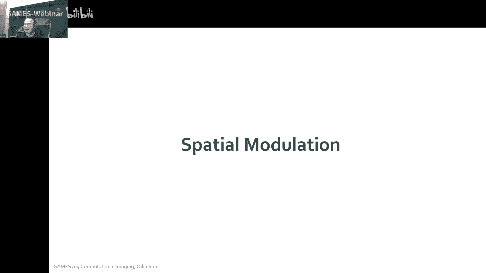

我们在时域里面是怎么调制，就是举个例子哈，这个是一个呃relying with fty inslight field，也就是呃4D的一个广场的一个就是illumination。

就是我们比如说左边的是一个摄像头，唉我们这里有一个投影仪，你通过这个移动这个投影仪，唉，然后也可以移动这个旋转这个物体啊，当时这个实验装置会比较糙啊，当时就用了两个木板，中间打了个洞来去旋转这个物体诶。

这个时候我们就可以获得不同角度，然后不同方向的一个照明诶，这个时候哎就可以合成了一个4D的，一个large field的一个generation啊，这是一个例子，西瓜202003年的一个paper。

但重点来了，这是今天我们要讲到的。

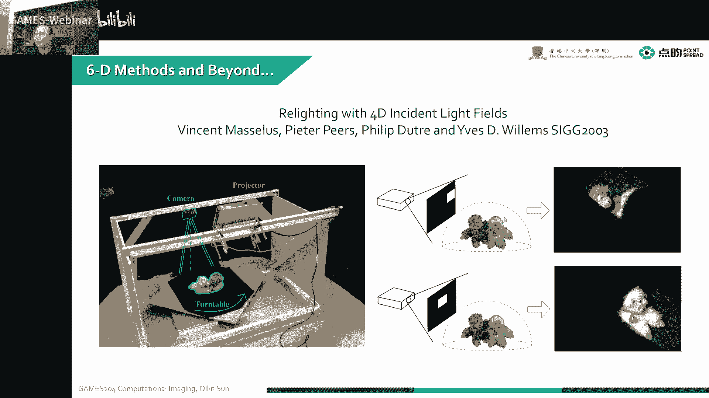

第一个重点，就是synthetic aperture nomination，说到这个synthetic app apinformation，我们可能会想到啊，这个长距离的一个合成孔径的一个成像。

就包括我们以前啊，大家用一个摄像头的一个阵列，就我们知道每一个摄像头的口径，每个山上的特殊口径它很难做大，因为我要做大了之后，我整个透镜的一个设计加工，还有这个传感器成本都会变得非常高。

当然为了想要拍到非常远距离的一个嗯，这个我远距离的一个高，提高这个远距离的高分辨率，然后人们呢就想到用一个摄像头的阵列，来做一个合成孔径的一个光学成像，这是一个嗯，就是长距离合成孔径成像的一个例子啊。

当时这个呃这套系统是用了45个摄像头，我们可以看到这是3×15，45个摄像头，然后整个的一个exture size呢，就是我们这个口径的一个呃，等效口径的一个size是六个六，六个feat就是六步哈。

大概是啊3米左右，3米左右哈，那每个每个这个这个摄像头之间的间距，大概是五英寸，五英寸啊，整个摄像头的一个field view是4。5度，这是当时嗯比较古早的一个啊。

synthetic aperture photography一个例子，但国内大家如果对这些方向感兴趣的话，可以关注一下呃，这个清华的丹琼海院士和方璐老师的团队啊，他们对啊，整个合成孔径。

还有摄像头阵列啊，这个光场成像这一块啊，有个比较深的比较前沿的研究啊，大家可以关注一下，有有个好像是tga pixel amazing啊，这个也是可以实现很清晰的。

在远距离的一个呃这个photography啊，这个也就是也是用了这种合成孔径的办法，一个摄像头阵列的一个办法，唉这个我们可以看到，通过这种合成孔径的方式诶，我们可以看到在一个嗯哈110这个fit。

这个情况下，也就是30米左右的一个情况下，诶，我们可以看到这个在125feat这一个target，我们可以还是可以很清晰的拍到这里面，这个细节的还可以非常清晰，当然这个合成孔径大家想一想啊。

就是我先给大家就是讲解一下，这个什么是合成孔径这么一个东西，说到合成孔径，我们想嗯先从一个呃说到合成，可能之前我们先讲一下呃一个background吧，所以在这个这个这个这个paper里面。

涉及了两个技术，一个是comfort的一个技术，一个是合成孔径的技术，这个合成孔径本身啊，啊我们实际上就可以理解为我在我的频域里面，比如说我的一个呃冲击冲击响应啊，冲击响应啊，不是冲击响应不太好。

就一个boss一个box的响应嘛，就是一个box的响应，我经过了一个孔径之后，哎，比如有线的孔径，就相当于在我的相片上做了一个分裂变换，对不对，这个时候我们有一些高频的一些呃情况，会被展开。

这个合成孔径呢，实际上就是呃我在我这个频域里面，它的一个采样面扩展了，对我在我本来是一个地方，一个下面上采样，现在换了多个地方采样，是不是，这个时候就相当于我等效的一个孔径就变大了。

这个时候就说明在我们频率里面，我采样的频率更高了，这个时候就对应着我实际上，空间的分辨率的一个提高，对大家可以理解一下哈，本身我这么小一个孔径诶，我做一个分裂，这个孔径做一个分裂变换。

是不是就到了下面了，这个时候会有一些频率的损失，然后我换成很多个点采样的时候呢，这个时候实际上就是啊在我的频域里面，有多个地方可以采样，这个时候我们整个采样一个频率，频率采样的频率就是频率采样率就高了。

这个时候我们分辨率空间分辨率也就提高了，然后另一个技术要先给大家掰扯一下，子，就是一个CONVOCAL的一个问题啊，这是举个例子，这个最早是在一个呃共聚焦的一个显微镜里面，得到了应用。

这个显微镜拍到了一张图，但像我们这个CFCS，这个map pa本身是是怎么工作的呢，比如说像这个spaceman，我们这有个样本对吧，我这有个D半透半反镜，哎我这也有个detector。

就是我们的啊传感器是吧，我们这这个地方有一个光源，像传统呢，就是我们用一个啊军医的一个范的一个照明，来去照明这个样本，然后然后整个的通过这一个detection，把这个项目直接乘出来，对不对。

但是共聚焦成以上是啥意思呢，就是我在我的这个照明光源前面，先放置这么一个小孔，唉，放着一个小孔呢，然后我通过这个照明系统，这个透镜经过B，然后就照到我这个找到我这个样品的这一个点，这个叫G上。

然后这个被照明的这个点，然后经过唉经过这一个半透半反镜，然后就可以哎，通过给它对应的这一个move的一个拼凑，然后到达detector，是不是，这个就是我们就是最经典的一个。

confocal scanning的一个MICROP，就是共聚焦扫描的一个啊显微镜，但这种情况下就是嗯非常慢哈，就我们每次只能看到一个点，就是这个时候极大了啊，困扰了大家这个观测的一个速度。

那后来呢嗯大家又把这个速度进行提高了，我们可以用很多个口来一起去完成这个事儿，就是叫这个叫correlation microscopy啊，这个就是看focal mascope的升级，这个时候是可以呃。

很大的程度的提高这个样本拍摄的一个清晰度，就是提高我的一个啊极限的一个分辨率，大家很多时候这个超越衍射极限啊，就是这么来的对吧，很多时候超越衍射极限就是这么来的，当然除了这个还有一种方法。

就像那种纳米探针的一种方法，我直接通过一个光纤，然后作为一个捕捉器，我这每次光纤头非常小，每次移动的位置非常小，诶这可以啊，做到这个几纳米或者十几纳米的，这么一个光学分辨率啊。

这也是通过一种扫描的一种方式，今天要讲到的是一个啊synthetic aperture，Illumination and photography。

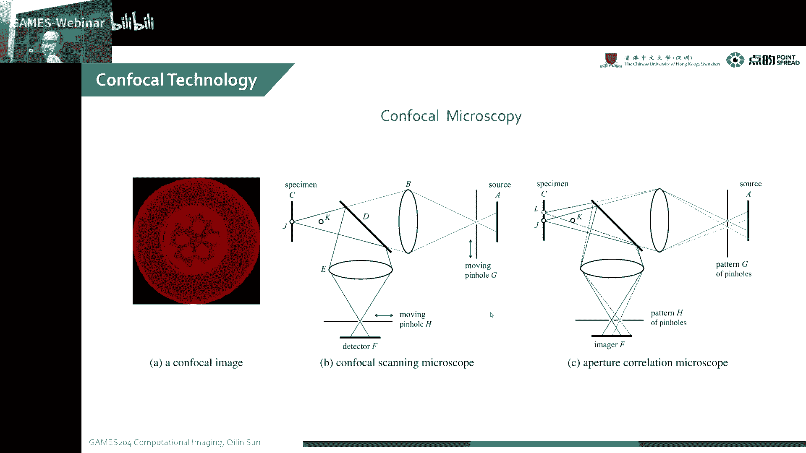

这是一个嗯合成孔径共聚焦照明的一个装置，这是为了干啥呢，这是我们像有很多啊叶子呀，比如说我们这个就拍到，比如说士兵啊或者是坦克呀，我们在这个隐藏在这个丛林丛林里面，这种叶子呢。

就是他会有对这个目的有一部分遮挡，但是有些地方诶他会哎又能看得到，就是我在各个视角里面有立方遮挡，有立方又能看到对吧，而这个时候我们想要呃把这个半遮挡呢，就半遮面的这个士兵啊。

或者是藏在后面的一些坦克啊装置啊，哎拍摄出来这个时候怎么办呢，他从类似的事情还发生在我们水下，就我们做水下成像的时候，有些会有一些非常浑浊的一些情况，哎就因为水下边那有散射嘛。

如果特别是海水经常比较容易脏，容易脏的时候，我就很难拍摄到一个很远距离的，一个清晰的一个图像，这个时候哎，那个时候就Mark ley在2004年的时候，当时还有那个叫美国的那个五，什么海洋研究所啊。

这是呃很战略的一个海洋研究所，这个中国也在啊，像这个海洋大国这个战略向迈进，所以说啊大家搞一搞这个方向，还是挺有意思的哈，这个装置哈是用了啥呢，当时为了当然也是为了便宜啊。

我们这个光源就用了一个镜子阵列，来去做了替代啊，但是我们整个装置是什么样子，我设置有一个单反相机对吧，我在正中央视野的时候有个单反相机诶，我们这里面放一放了一个镜子的一个阵列，镜子的一个阵列。

然后实际上诶，这个我们可以看到，这是一个4K的一个单反相机，然后呢我们用了一个22个透镜，22个透镜，然后这个大概这个整个相机的视野，是刚好能拍到这个唉透镜上的一个反射啊。

然后呢这些透镜每个小透镜上面就没有，这是反射镜哈，每个小反射镜上面都会有一个，我们这个目标的一个子图像对吧，大概总共是22个主子图像，每个子图像对应了一个750×750的。

750×500的这么一个像素的啊，这么一个小块，这是我们的一个实验装置，当然最后这个是target，这就是我们模拟这个丛林的一个情况，我们这里有一个绿植，唉，后面比如说我又放了一个什么东西，诶。

你这个一般的情况下，我们这个直接看到这个东西就被挡住了，对不对，就没有办法观测到诶，这个后面到底是什么东西，然后然后我们看就接着接着来看，这个东西到底是怎么被拍出来的，这本身我们这里面用到的技术啊。

其实啊也就是用一个array of projector。

也就是我们刚才讲到的一个镜子的阵列，这个镜子又当呃像的一个反射，又当照明的一个反射，同时我们也要要是有钱了，就可以做一个micro project的一个阵列，对不对。

当然我们最便宜的就是一个projector，然后加一堆镜子，这样的话整个成本可以控制到最低，当然我们先说到这个这整个的一个synthetic，合成孔径的一个照明到底是什么样子。

我们实际上嗯是打了一些就是随机的一些班，也有可能是正弦的一些啊，这个这个班哈我们打到这个工具胶面上，我们就你看我们可以看到右边这个装置啊，我这一个projector a对不对。

project a达到这些啊，镜子上就是这个E啊，右边这个这个E是镜子上，唉，我们这些镜我们这些镜子上在这个project pattern，也就是我们现左下角这个随机班啊。

随机班每个镜子都对应了一个project pattern，然后这些Python然后又共同的聚焦在这个样本上面，对吧，这个样本我们就是叫做F就在这个样本上面，也就是说说我们在整个焦点对焦点呢。

把这个各个随机班，也就是左下角这个二维，这个大家可以理解为二维的随机码了，就投影到这个F上对吧，我们可以看到这个F上，这个时候就得到了一个他的一个focal plan，在这个focal plan上。

我们啊每一个就是反射镜反射过来，那个呃，这个反射反射镜反射过来的这个pattern，都是聚焦到了这个复刻plan上，对不对，大家可以看到左边这张图上，我们在这个这一条线上是完美的聚焦了，对不对。

这是整个照明系统到底是怎么做的，大家这个地方可能会有疑问哈，现在这个过程大家理解吗，就是我嗯一个透一个镜子的阵列，把每个镜子对应的一个pattern，然后就打到了我这个物体的表面是吧。

这是一个呃就是整个照明的一个过程，这个地方大家应该理解一下这个这不难理解哈，这个不难理解，实际上我们也可以看到，然后与此同时呢，我们这个相机哎。

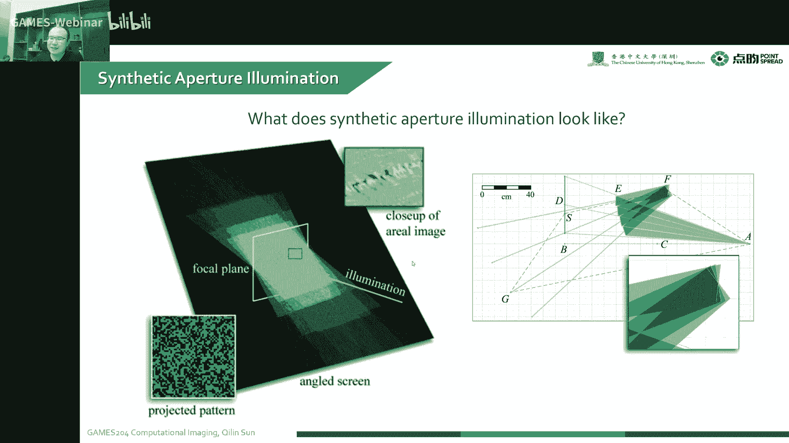

我们可以用一个半透半反镜哈，半透半反镜，把这个照明跟那个相机这个光路对齐，这个时候我们就可以通过这个半透半反镜，然后顺着这个整个projector，这个逆的光路来拍摄到哎，我这个投影过后的一个图像。

是不是我们把这个投影过的图像拍摄回来，我们就可以拿到这么一组，每次就可以拍到一张图对吧，这一张图就是对应的，在这个就是呃调制Python的一个情况下的这么一组，比如说你这里面是4×4的。

4×4乘四的一个小阵列对吧，这是我们四层是一个小阵列，当然我们会不断的变换这个投影的pattern，不能变换这个投影的Python，直直到我们捕捉到了N个一个cody trails。

也是最后我们拿到了一个N乘44，这么多张图，当我们对这些图啊，根据这个角点，然后把这个先整成一个长方形，先整成一个长方形，哎我们可以把这个通过整成一个rectify，整成一个长方形。

然后呃再找到给它对应的一个mask，然后再把这个整个sum起来，然后给不一样的位置，唉我们就可以看到一个normalize的一个SAM对吧，然后同时呢，嗯我们本身呃它本身我们这个图像啊。

可以找到一个嗯就是我们不打这个pattern，就是完全的就是啊照明的情况下，这是一个搞到一个floodlit，这个时候我们把这两个相减，就可以得到它的一个CONVOCAL，也是共聚焦的一个情况下。

实际上就是我code的减掉背景对吧，这个code的简单背景就可以达到方，就共聚焦的一个情况下，当然我们呃也可以啊，对这个通过这个convocal image。

然后估算出了一个GREDIENTS的一个correction，然后再给一个threshold，就可以达到这个东西的一个MATT，也就是它的一个呃mt一个mask，这个是过程，大家可以理解一下哈。

我们本质上就是我拍照跟我的照明，共用一个光路啊，共用一个光路，然后呢我这个投影仪，投出来N张图，就是每每个在这个44对应44个pattern，然后再捕捉N次，看这个pattern。

每次拍的时候要换一下啊，这个就拿到了N乘44张图，然后把这个每一张图整形一下，整成长方形，然后再根据这个对应的一个mask，就是对应的一个投的一个pattern，搞一个mask哎。

把这些mask some，把这些东西散不起来，再给个with，就得到一个normalize的一个SMISSION啊，这个是很清晰，那同时呢我们也可以减掉它的一个背景，减掉背景啊。

就可以拿到一个共聚焦的这么这么一张图，工具胶，这个图就可以拿到这个radiance一个correction，同时也可以拿到这个mate，这是呃一个呃另一种玩法哈。

这个就是我们可以看到哈，这是我的一个projector对吧，我们这整个叶子后面藏了一个人，我们可以看到中间是我们这这个这个一个叶子，后面藏了一个人，然后再往后面是一个背景，本身呢。

我这是一个projector，然后这是我的一个camera，我整个公路就是我的projector，打到这个半动态环境，唉这个直接就穿过去了，打到这么一个镜子阵列上，这个镜子阵列。

然后把这个每个就是镜子所反射的一个pattern，达到我们这个这个达到这个物体上，达到这个物体上，然后呢整个光入物体反射的光，经过呃这个镜子的阵列，再反射到这个像这个半透半反镜。

再反射到这个camera里，诶这个我们时候就可以的，照明光跟这个成像的一个光路是统一的，然后呢我们就换一个pattern，然后再拍一次，换一个pattern再拍一次来。

直到拿到我们就是足够的一个结果为止啊，当然每一张图我们是看不到这个后面，这个到底是什么样的，但是我的目标啊，目标就是拍到我这个遮挡后面诶，到底是有什么东西，大家可以看到啊这个一个水下的应用。

当我们在比如说传统的我们要拍摄的，对一个水下的一个情况进行照明，我们观测到一个点，在它一个正上方，我们又斜着一个光可以做照明，比如说在这个水下，我们很难的把这个字去拍清楚对吧，这很难拍清楚。

然后呢换一种方式，我们用不一样角度的一个光，对我这个样本进行照明，当然这个会比刚才那一种方法好一些哈，但是我们还是可以看到，虽然它更均匀一些，但是还是有一些非常强的一些反光的地方。

我们没有办法把这些地方的细节来给它拍清楚，对不对，但是呢我们这个用这种共聚焦照明的方式对吧，我们这个每次就就缩小，每次只拍摄了这么一小块对吧，只照明的其中一小块，然后我去扫描的整个面。

我们可以看到每个小块都可以拍得比较清晰，再把这些小块拼起来诶，就可以在一个水下比较远的距离拍出来啊，一个比较清晰的一个图像，我们可以看到右边这个是浑浊的一个水下，我们就可以拍到啊。

在一个比较远的距离可以清晰地拍到这个啊，这个远距离的这个成像结果，当然我们可以看到这个有叶子遮挡的情况，情况下哈，就是我们刚才那个场景的一个。

我从单一的一个viewpoint，是单一的一个观测点来看诶，我们后面那个人就完整的被这个叶子给遮住了，我们并不知道唉这后面这个人的细节是啥，当然我们用一个合成孔径来拍照呢。

我们是可以在各个角度来观测到这个图像，来合成出来，但是这个时候我们很容易受到这个在不同啊，焦平面上的一个成像的，一个这个照明的一个影响啊，有没有看到整个成像，它会受到一个他这个不不再看复合面的。

这个光也进来了，就是我们上人能大概知道这后面这个东西是啥，但是我很难拍清楚啊，很难把这些杂散功啊都干扰掉，都去掉，像本身有的一个convocal image呢，就是我共聚焦成像呢。

我是可以把那个人的一面拍的比较清楚啊，这个叶子就因为他不在那个公交面上，这个就已经成mt了，成mt了，所以说呢我们就把这个合成孔径成像，和这个工具胶成像诶一起利用。

那么在多个视角拍他了一个convocal image，唉最后合成了一个图像，我们可以看到诶，就我们有很多像这种C很多C哈，很多C在不一样的视角，会在不一样的口径上拍到诶，把这个合成起来就可以哎。

看到这个眼鼻子啊，还有这些东西都可以拍的比较清楚，这是一个呃有遮挡的一个情况下啊，这个大家有兴趣的话可以嗯结合着做一做啊，比如说像大家给大家解放军丛林作战呀，或者是这个地方提供一些参考性的一些设备。

大家也可以有兴趣可以搞一下哈，但这是一个呃synthetic，app trillnation的一个microscopy，就是为了实现一个超负面诶。

这个跟传统的一个泛光照明不一样的地方是，就我先说一下这个系统吧，这是一套4F系统，我们这个sample这是一个浇面对吧，然后我这个通过物镜，然后就物镜后面的一个焦点，跟我的一个目镜后面的一个焦平面。

两个在一个平面上共用一个焦平面，唉，这就构成了一个cf系统，cf系统，然后通过一个l e d array，就把一个军医的就精一光照明，换成一个l d d array，然后去分时诶去打打到这个样品上，唉。

我们就可以看到它，可以可以看到观测这个分辨率吧哈，在不一样的视角看，拍出来做一个合成孔径的一个麦克斯scope，我们是可以把这个分辨率提到一个，比较清晰的一个状态哈，这是一个比较呃简单快捷。

实现一个超分辨率的一个呃microscopy的一个方法，那就跟会比刚才我们讲的那些问题，稍微简单一些，因为我们拍一个大的一个泛的一个场景。

特别是把这个convocal image跟那个synthetic，TRUMMATION结合在一起的时候啊，这个系统比较大哈，比较大比较困难嗯，大家可以试一试，搞那么一个镜子阵列。

然后搞一个啊成像跟照明一起的一个公路啊，这个大建议大家试一试，有条件的试一试，然后我们讲到第二个重点啊，这今天可能会拖堂，这个是temporal modulation啊。

这节课就不给大家讲那个time on flat mai了，因为后面我开两节专题课啊，就是我们在我们temporary encoding的时候。

会给大家分别讲这个in direct time of flighting image，还有这个direct time of fighting image，今天就讲一个temple modulation。

的一个比较传统的一个应用，当说到一个temporal demoliation，我们还有一项demolily camera，这个是啥，像我们动捕设备，我们很多啊标记了一个点啊，传统的动捕设备啊。

这些光在闪，我们就需要一个camera给他做一个DEMI雷霆，来标记这个点的位置，这是一个啊VZ4000的一个checking system，我通过啊，这个是这个标记物的一个闪。

还有一个啊相机的一个demo，我就可以把这个嗯整个动捕来实现，当然除了像这种呃自带闪的这种装置啊，还有一些像我用一些红外的一些球，就是正常拍摄的时候就是正常了，然后上面加一些小白球，哎。

这个时候拍的就是他一个在红外线下的一个球，的一个位置，这个时候也是可以进行动捕的，当然现在也有啊，呃之前那个由他的，有一位嗯叫叫叫叫陈赫的同学，然后做了一个随机码的一个衣服。

然后通过识别这个每个地方随机码来进行，实现一个高精度的动作啊，这是比较先进的动捕设备，但最传统的时候大家是用一个闪的一个灯，然后结合了一个camera来做一个DEMODI，来实现了这么一个动物。

这是一个嗯face space的一个demolition camera啊，这些装置会比较贵哈，因为我们这个呃灯在闪，所以说对我们这个整个相机的拍摄频率比较高，而且它本身的这个分辨率也比较高。

所以说这个处理压力也是比较大的，比较大的哈，这是一个比较经典的一个temple，encoding的一个应用，唉这是整个啊demodeling camera的一个原理。

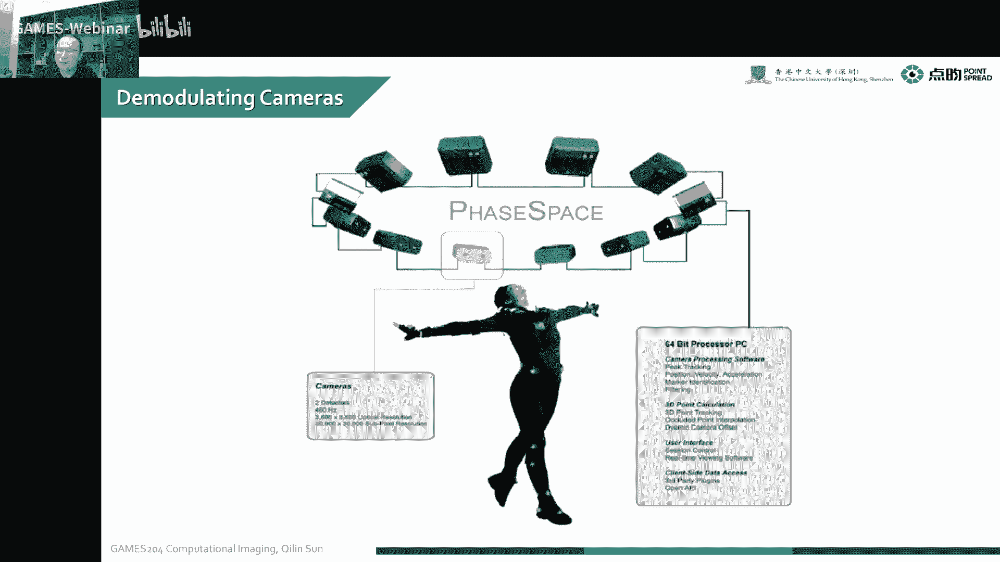

就是我们本身我们标记物呃，是在闪的两个灯，比如说这个颜色可能会不一样，闪的两个灯对吧，我这每一个像素，这是我的CMOS像素，每一个像素它就你可以理解为它是一个smart pixel。

他这个pixel又可以拿到他的一个intensity，又可以跟这个闪的这个灯对应，然后一个嗯data LCK，当然我们这个闪这个灯跟这个像素的一个clock，对应的时候，唉。

这个时候我们就检测为这个位置，在这个在这个点，在这个位置是有的是吧，也可以这个也可以把这个时间记录下来啊，把这个时间记录下来，这个时候我们就可以检测到这个整个点的一个，三维的一个位置。

当然我们这个时候想给大家搞一些，贴近大家生活实际的一个应用哈。

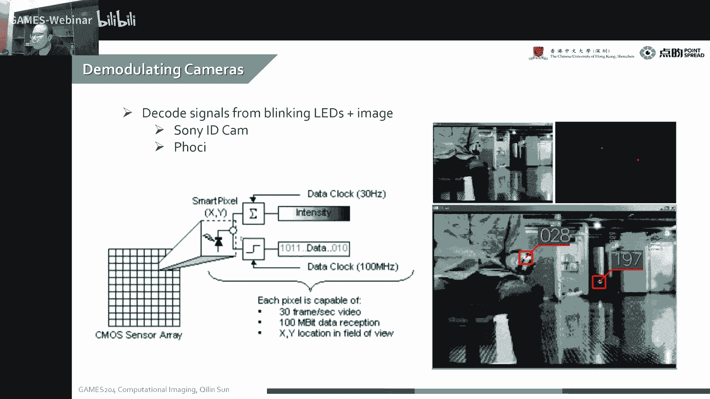

这个我们就是在我们物流物流领域啊，物流领域，特别是我们这些大型的一些仓储，再比如说京东，我们这有很多仓储，我们通常就是我们有一个呃，按FID叫你就是一个radio。

一个identification的一个tag，就我们是通常用无线电来实现的，就我们每一个这个箱子上面，作为一个IFID的一个标，IFID的一个标，我可以通过我这一个手持的一个。

IFID的一个reader，来去读取我这个标的一个内容，就我一次可以读取这一个墙面的，一整个墙面的内容，当然这个时候再面临一个痛点，比如说我已经读取到这个墙面上，有各种各样的货物。

我已我已经读取到这整个墙面的，一个货物的信息对吧，因为我这个通过电磁波，都可以跟那个tag去进行通信，但是我并不知道这个哪个箱子是什么东西对吧，这个时候不知道哪个箱子是什么东西。

比如说哪个箱子里面东西要过期了，或者是我要把这个东西分解到什么地方，哎，这个时候传统的IFID，就没有办法来完成这个任务，所以说同学们想通过这种光电成像或者，光电编码的一种方式。

来给这一个IFID的一个内容，进行一个定位啊，进行一个定位，这是怎么做的呢，也是我最后想实现的是我这个手持这个设备，往往这个货架上一照，我就知道哪个货物是OK的，哪个货物不是OK的。

这样的话就可以把那些坏的，一些过期的一些东西啊，快速的拿出来，快速拿出来，怎么做的呢，比如说像传统的一个IFID，它是一个radio frequency actification text。

这个可以非常便宜哈，它的一个小线圈诶，加一个小芯片，这个几只要几分钱的一个成本，所以说呃像大家的一个什么就银行卡呀，或者是呃门禁啊，或者或者还有一些箱子上贴了一些嗯，那个比如说像我们机场那个箱子上。

也会贴一个FAD的一个tag，这样的话大家也可以很快识别了这个箱子里面，或者是卡里面的一些信息，而且这个东西啊它是直接靠我来过来的，电磁波就可以供电了，我就不需要啊一个电池再进行供电啊。

也是整个成本可以做到几分钱，所以说这个已经广泛的用在我们生活里面，各行各业，但这种传统的RFID呢有个什么问题，这个用的领域也非常多哈，包括像wire housing，大型的仓储啊，像图书馆呀。

就每本书啊里面都会放一个fid tag和标记，这个书的一些呃书号啊，或者是整个书名啊，作者啊这些信息唉，像我们这种分解呀，就是机场的包裹呀，其实是我们这个牛上面可能都会贴着，还有这些钱。

钱币上面都会贴一个FID的tag是吧，它的几个整个的基本原理就是我的一个线圈，后面有一个就小了一个MCU，小的MCU他有自己的memory啊，记录，还有读取交互，这里面的信息，就是每个商品上面。

我们贴这么一个IFID的一个小标，然后记录他的信息，然后本身呢我要读取的时候，我就发射一个电磁波，这个线圈会响应产生一定的电流来供电，来给后面的小模组供电，哎，小模组就可以通过这个供电。

来把这个信息读取出来，再发射给这个reader啊，发射给这个reader，当然这个时候我们就可以很快速的，把这一定范围内的一个I，这个tag里面的内容都读出来啊，这是嗯阿尔法D本身的一个呃就是性质。

但是呢这个东西有个什么样的一个问题呢，就我们比如说一个图书馆为例，我们可以非常容易的就读取到我在这个嗯，用这个手持的FID设备读取到他们里面的内容，但是我们没有办法对这个内容进行定位对吧。

因为整个电磁波我们那个不太好算，他的一个时间反射，它定位精度会比较低，你比如说这个书是在上面下面左边右边哎，不知道我也没有办法去精确的找到这本书，然后聪明的人类想到一种什么办法呢。

但是实际上就是像这种场景，我们想要读取整个的货物，但是我不知道哪个东西是过期了，要把它挑出来诶，很难这个地方就没办法定位啊，所以说呢聪明的人类就加了一个PHOTOCIN的，一个f f tag。

就与传统的一个FID呢有什么区别呢，它加了一个photo c，这个时候我们就可以通过用一个projector，来达到一个编码到这个PHOTOSENSOR的一个编码照明。

比如说呃一个打的我的一个大projector，这个projector呢，然后我对应这个像素project上，这个像素达到这个full session上诶，我就可以知道这个就project。

是我们这个投影仪XYZ像素的一个编码信息，这个像像素的编码跟这个fid tag，photo生子的相互作用相互读取，我就可以，然后再通过这个就是电磁波再传回到这个reader上。

我们就知道是投影仪上哪个像素对应的啊，这么一个FID的tag，这个时候就可以实现一个定位，比如每个投影的一个闪光，然后跟这个PHOTOSENSOR相匹配，就拿到了这么一个，他一个XY方向一个位置哈。

这个时候就可以很轻松的对这个商品，或者是书本啊，主要就是对这个tag进行定位，它整个的一个流程就是我有一个projector，然后我在每个project就是我这个投影仪，每个像素点都会给他一个编码照明。

这个编码就是这个像素点的一个XY信息，那我这个tag上面呢，这个PHOTOSENSOR，对这个这个点的一个编码信息进行进行解码，解码之后再通过这个RF传给这个reader。

也是这个时候我的位置信息就已经有了，当然为了我们更容易，就是人们在操作或者机器在操作的时候，我可以更容易的就是观测到这个货物到底在哪，我可以把这个编码的位置投出来之后。

我再通过这个project给它做一个标记，唉比如说标一个差，在这个像素点周围，我就可以知道，比如这个货物过期了啊，这个货物过期了，在一个非常有意思的一连串的一个呃成像，叫编码的一个过程。

所以说我们第一步就是，通过这个PHOTOSENSOR，就是RFD上面来获取我投影仪投过来的编码，然后这个时候我们就知道这个啊，编码了一个XY了，就是我们这个编码了一个X2的位置。

然后这个呢我们这个再把这个X的位置，通过这个RF传给这个这个i for reader reader，上面这个投影仪呢再投影一个，这个都OK啊，或者是oration，就一个标记。

在这个XY像素周围投影这么一个标记，就可以证明哎我这个货物过期了啊，我就可以很快速的实现了这个识别和定位哈，但我现在不是很清楚，这个东西有没有得到商业应用，当然这个东西是呃感觉是比较有商业价值的。

比较有商业价值，当然整个的一个区别哈，就是我们多了一个嗯PHOTOSENSOR，来编码了一个几何的信息啊，这是一个计算照明的一个经典案例，经典案例它既可以读取这个啊。

radio frequency的一个id，也可以啊对这个商品实现快速定位啊，同时呢大家又通过这个projector，把这个读取的这个XY信息诶给它显示出来，诶，这个时候就变得非常有实际价值的意义啊。

变得非常有实际价值意义，这是一个当时他们做的一个呃就是圆形嘛，就是当然最上面还有一个i is transmitter。

那这个原型做的比较粗糙，还用了一个电池，然后用了一个PHOTOSENSOR，这个PHOTOSENSOR呢就可以接收到我这个projector，上面的一个编码啊，project上的一个编码。

然后这个PHOTOSENSATION上就可以把这个编码的，SY信息读取出来，再通过IP trans transformer，把这个传回那个我那个reader本身啊，这个就可以形成一个闭环的。

一个信息的一个交互，但这个也很便宜啊，一个PHOTOSENSOR有几分钱几分钱，就我们这个编码的一个东西，投影个啥呢。

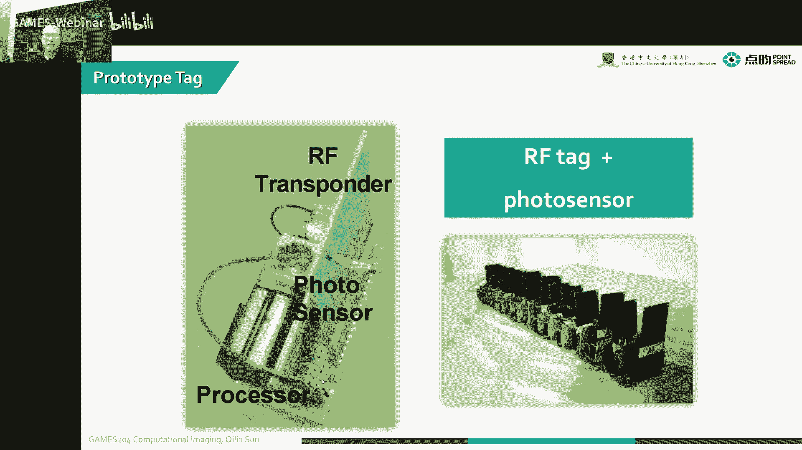

就是我们可以投影这一系列的一个，MSB的一个pattern，MS的pattern，这里面编码这个XY的一个信息，我们把这个投影仪跟这个aff reader集成在一起，做成一个一体化的一个东西。

这个时候我们就可以把这个编码投出去哎，每个XY的方向都对应一个MS，EB的一个pattern啊，这个时候我们就可以很轻松的，把这个位置定出来，大家可以看到这整个A我们在随着时间变化。

这个pattern也在一直变化，A，是吧，直到最后我们这个比如说哦，编码的这个情况就是0101啊，这个最后啊，直到我们有一个足够的一个编码对吧，但对我们每个tag来说。

就是我们通过这个light quence，就是随着projector每个像素点的变化，来抵扣的这个XY的一个位置，最后然后再通过把这个XY的位置传给这个reader。

在在production上把这个位置标记出来，诶，这个是整个对project的双重利用啊，双重利用来实现了这个信息的交互与定位，这是当时做了一个呃。

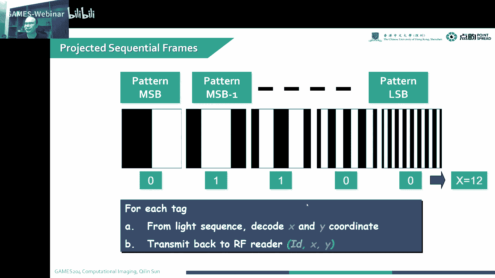

就是vero feedback的一个实验啊，实验我们可以对这个这个好的一个物体，变成一个红的，然后不好的物体标成一个白的，坏的物体变成一个红的，就可以实现唉快速的读取跟定位，这个tag就在这个位置。

那本节课的一个第三个课题是给大家分享一下。

这个explosion and control，Nature lighting condition，这个nor like condition呢，就是在我们很多日常生活中，特别是很多监控领域啊。

或者是嗯可以用到的这些图像增强的一种办法，就是还是回到我们之前讲到一个day day and night fusion，可当时没给大家讲清楚这个啊，diannine fusion到底是干什么的哈。

这个哎可能上课的时候总马观花听了一下啊，但是并没有给大家交代清楚啊，我这个in that fusion到底是做什么用的，当然可能大家只看到这个拍这个图是怎么回事，但是呃具体里面有什么实际用途。

可能没给大家交代清楚啊，今天再给大家呃重新的啊细细的梳理一遍，就是我们在拍金夜景的时候，我们可以看到像这个dark building啊，还有这个reflection on the building。

还有像这些比较黑的地方，我不知道这个东西到底是什么东西，是不是我们很难判断，我这些暗的地方是什么东西，就拍不清楚，这个时候特别是在监控的地方，我们有一些啊，现在在国内这个监控也越来越多了。

我们很多啊监控摄像头都是固定的，固定的一个角度的一个监控对吧，诶固定的角度的监控诶，这个时候我们想要啊，知道本身我在这个夜景下拍摄的内容，跟我就是通过一个人白白天的一张图像，来对这个夜景的图增强。

哎这个时候我们就可以实现一个deadline fusion来，比如说把这个啊我们刚才这些黑的一些地方啊，把它完美的呈现出来，同时又把这些页里面拍摄到的信息保留住，比如我啊做监控的情况下。

诶我夜里拍的乌漆嘛，黑的只有灯照亮的地方，我才知道，这个时候人们对这些黑的地方很难理解，是一个什么样的场景啊，所以这个时候我们就可以用一个day and night fusion，来实现啊。

这么一个很清晰的一个background，比如说这个时候呢就是我们实现通用一个net image，就是我们夜里面一直在监控着这么一张图啊，页里面一直在监控的一个动态画面，诶。

每一帧我都可以跟我一个daytime的一个image，来进行融合啊，要进行融合，然后呢我们就可以拍到一个背景增强的一个video。

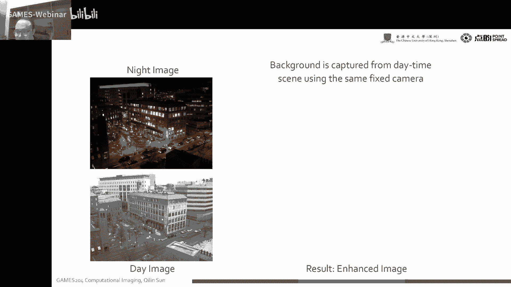

背景增强了一个video啊，实际上这里面收一个image，实际上它是可以做成一个video，大家可以想想，我们在那个监控室看到这一个背景增强，或者一个a video。

是不是比我们直接观测到这个nt image，可以看到更多的一个信息呢，是不是大家在这个做监控的时候，就可以变得非常清晰，这个时候是怎么做的呢，我们在这个首先我们在这个夜景的图里面，把这些比较亮的地方哦。

通过这个mask哎来把这个搞出来，通过mask来把这些信息搞出来，比如在这些地方我最后融合之后，这些地方的信息要保留啊，然后这个黑的地方呢，就我就用一个daytime的一个信息，来对这些细节进行填充啊。

然后最后通过融合就可以把这个夜间的信息哎，同时也可以得到这些黑的地方，就得到了一个增强，让人们更容易理解，就是在夜里到底发生了一个什么样的情况，这个时候啊。

当然这个以前传统的大家在那就只是用simple，pixel blending啊，这个效果会比较差，所以说给大家也讲过一些啊，抛松不能定的一些办法哈，对这个是左边。

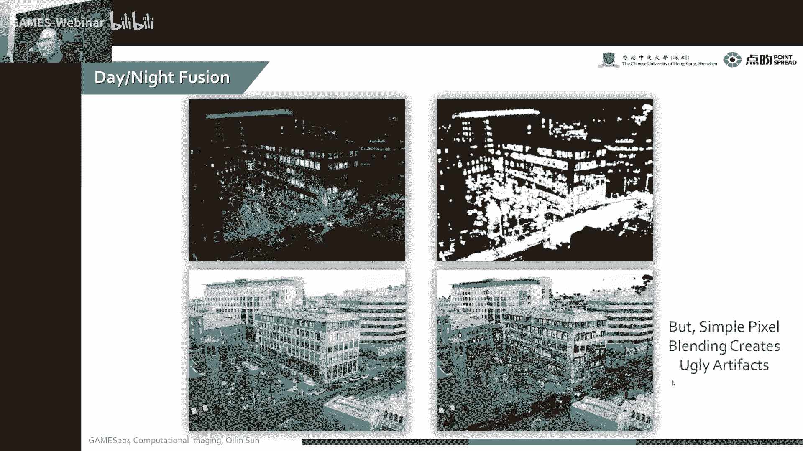

这个是pixel blinding，右边这个是这个新的一个method。

就integration with blendy的一个鬼链子，这个是我们在国内那一节已经讲到了，我们可以看到这个一个nt image，然后我们把这个gradient提取出来诶。

X方向的一个GRADIY方向的一个gradient，然后呢我们在嗯对这个daytime image，把它的X方向的gradient，Y方向的一个gradient的分别提取出来，再把这个嗯夜间的一个图像。

像它那个亮度啊，通过这个亮度把这个importance image which，提取出来是吧，这个时候我们可以通过这个gradient的field，两个两组规律的field。

这个夜间和白天呢通过这个important with哎，得到一个mix的gradient field，对我得到一个mix gradient field。

然后在这个通过这个gradient integration的方法，把这个融合起来，就可以实现诶，我们在夜间监控的时候啊，只有一张参考，白天参考图像的时候，也可对夜间的video进行一个很好的一个增强。

啊这是一个本身的一个reconstruction的一个方法。

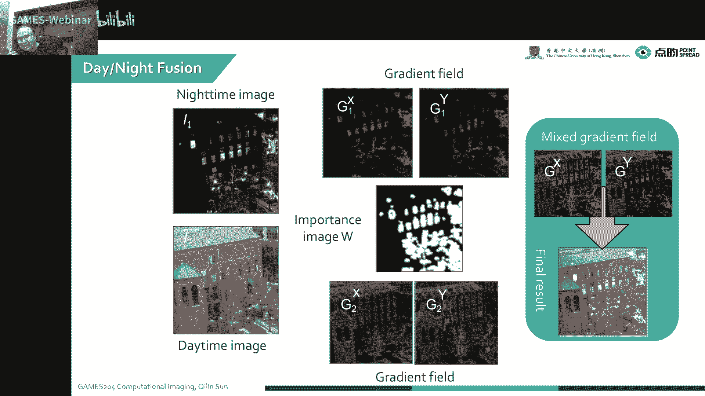

我们就怎么样从这个规定的field，来进行一个reconstruction，实际上我们最后的一个TOIMAGE，我们要minimize的一个error，就是我最后的一个融合过程。

tag image跟我这个融合的gradient，哎我们要minimize它们之间的一个error，同时呢就是我们这个嗯要保证它的一个破松，一规则，就是我二阶的一个规定的趋势啊，让它让它相同啊。

让他二阶规定的趋势来相同，然后我用这个MASQUARE的一个server，就可以把这个呃这个新的r prime来给他解出来，这个举个例子哈。

对我们这个夜间啊，夜间我们这个original一个video frame，我们可以看到这个走廊啊是非常暗，这个左右大家都不知道是啥对吧，这个时候我们很难观测到，我们这个环境到底是一个什么样的环境。

对不对，但是我们想用这一个嗯白天的一些信息，把这个很暗的地方给它填充出去，让大家更容易理解诶，这个时候我们把白天那个图像，跟这个当前的这个夜晚这一帧融合在一起诶，就可以很清晰的。

大概知道我们这个拍摄这个图像的一个环境，到底是什么哈，到底是什么，这个就变得啊整个对整个监控更容易，大家让大家理解并接受，啊这是一个例子哈。

就我们本身夜间的图像那个contract会很低，然后细节也很低，这个时候呢，我们就可以在白天拍一张静态的一个图，把夜间的video跟白天的这张图去融合，唉最后我们可以就可以啊，把这两个融合之后诶。

就可以得到一个enhance的一个night video，这个举个例子，这是我们夜间监控的一个马路上的一个行车诶。

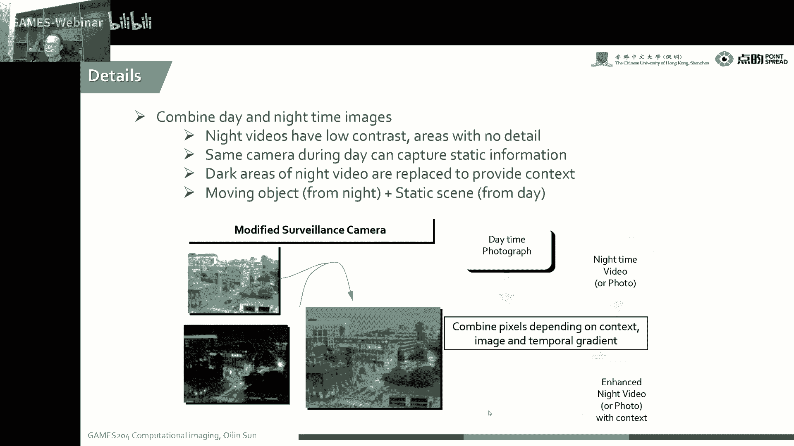

右边是我们白天的一个场景哈，这个是场景，是我在白天每隔五秒钟拍拍一张图，然后再把这个平均起来，因为固定场景平均起来拿到一张背景，那在很亮的地方呢，就很照亮的地方，我们知道这个执行度是比较高的。

就产生了一个mask，然后通过这个mask with，把这个两张上面这两张就是video，还跟这个右边这张参考图融合在一起就可以啊，对这个很多安卓的细节进行增强啊，这个最后融合出来的监控图像。

这会变得非常清晰，非常好看，啊这是一个啊对它的一个呃那个，大家可以看到这个最后的结果，是变得非常清晰啊，啊这个原理跟刚才那个是一样的。

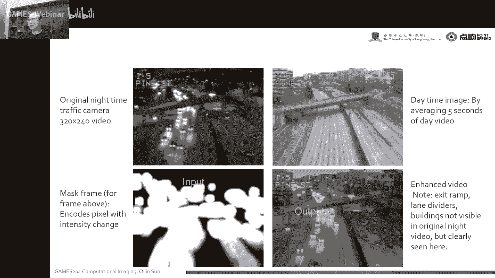

就是我把嗯就是一两张图的融合变成一张图。

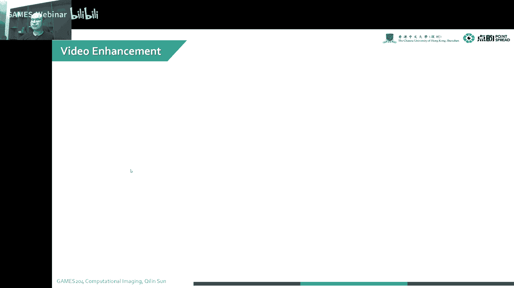

跟每一帧video的一个融合，同样的也是呃两个frame，然后找到他的一个mask，找到它的gradient field，然后daytime gradient field。

然后再这gradient mix在一起，然后再用mesh grade把它融合在一起，对这个是可以看到啊。

当然我们其实嗯目前还有一些嗯很smart的一个，Lighting equipment，比如像我们dannt fusion，其实上也是啊，用白天的自然光，给一夜间的图像做了一个lighting啊。

这个是嗯你可以这么理解哈，这个是比较有意思的，我们的整个啊也可以我们去不断调制啊，整个图像的一些WAVELENGINTENSITY啊。

还有一些像后面我们要讲到了一个time of flight image，就是整个持续的调制，来算一个它的相位跟它的一个深度，我们也可以像LISTAGE那样啊，来调一些不切不一样光线的一个角度。

同时我们也可以趁着我们这个光线，照明角度来算它的ABELE哎，通过他的ABEL来计算它的一个3D诶，这个是啊非常有意思的一个东西来计算照明哈，整个照明系统是我们计算摄影里面，非常重要的一块啊。

它会有非常非常千奇百怪的应用，可能今天大家听到了今天啊会发现啊，整个计算摄影计算计算成像这一块，这个涵盖的内容啊，这是包罗万象，包罗万象，它整个涵盖的知识也是非常多，就从你的物理啊，光学啊。

你复利大礼包啊，你最后的DISP啊，包括最后解的算法，我们也讲到了一些古典的方向上的算法，ADMM啊，可能后面还会有一些deep learning啊，还有食欲调制，空域调制唉。

各种各样的方法都会出现在我们计算成像里面，说为什么在整个计算成像会变得非常有意思啊，也就是由我们各种各样的自由度，各种各样的解法，各种各样的有意思，跟大家生活接近起来也可以啊，涉及到我们的空间啊。

海洋探测唉，这个它的用处真是非常广大，而且这个时候呃，也是刚刚整个计算摄影也算是一个开端，跟一个上升期啊，这个大家呃这个时候加入计算摄影，计算成像这么一个领域啊，对大家以后的一个发展还是非常有益处的。

对，今天就给大家讲到了整个呃计算照明的第二讲，就包括我们light color wiens的一个条件。

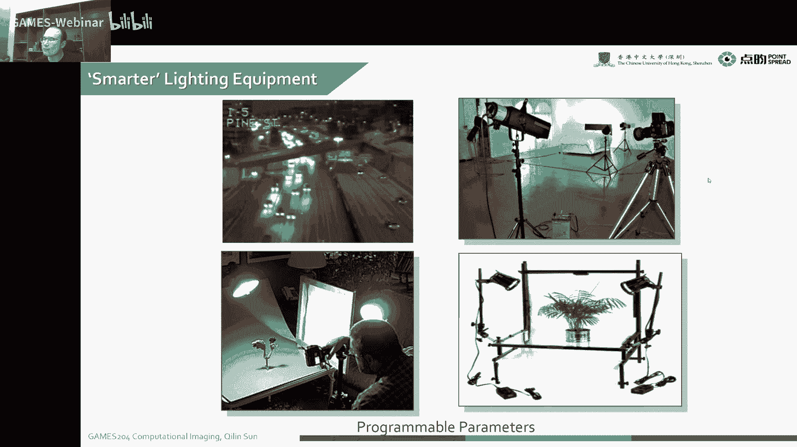

我们讲到了两个例子，第一个就是color code destructure，light等一个RAINBOPIV啊，我们可以对啊，通过这个呃不一样的一个颜色，就是连续称职了一个Q来标记它的一个games。

或者标记了一个special的一个位置，这个很有意思啊，还有像我们的一个啊special modulation，就是我们讲到了一个synthetic or illumination啊。

当然也会涉及到一个synthetic photography，这个地方可能比较难，这个大家呃没有讲太细哈，这个表大家可以自己稍微下去多去嗯，了解一下这个合成孔径的这么一个知识，这个是比较有意思的。

然后第三个地方呢，就给大家讲一个temple modulation的一个，两个简单的例子哈，就包括像一个motion tracking，还有一个带有光电，三星定位的一个I发G的态度。

最后再给大家讲一个就UNCONTROL，一个nature lighting condition，就是把白天的一个嗯，白天的一个场景当做一个照明去给这个，那就给这个夜晚的场景进行增强，当然下节课啊。

我会想给大家讲一下一个非常热门，非常重要的一个话题，就是tom flat image，就是光飞行时间怎么怎么通过这个连续的波，还有一个脉冲的波来获取我们想要的信息啊。

这个时候我们可以从整个就是从电路到算法，到整个成像的过程，还有到最后的解法，形成一个完整的完整的一刻了，包括我们对三维成像，三维成像的校正，还有最后我们可以用这个多普勒的一个。

Time of flight camera，或者是一个polarization time of flight camera，下节课会给大家讲一下啊，从我们先从这个间接光飞行时间法，来开始讲解吧。

这个是temple modulation的一个呃，照明加上成像一体的一个技术啊，这个会比较有意思，也比较重要，当然现在大家做的研究也慢慢慢慢开始了，所以说啊这个时候大家开始这方面的研究，会比较有意思哈。

嗯好了，今天的课程就到这里，今天给大家讲了计算啊，计算照明的第二课，下面会给大家呃。

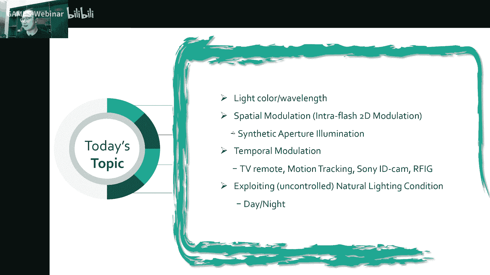

分别的讲解，我们整个temporal encoding的一些方法啊，这个special encoding的一些方法，还有就是polarization，camera like you camera啊。

这些啊专题的应用跟一些场景啊，这个后面涉及的技术会越来越有意思，他得到了应用也会越来越有意思啊，这个课程目前为止已经进行了一半多一点了，就是后面的这个每个都是一个非常经典，非常经典的一个案例啊。

大家通过这个案例就可以学习里面啊，到底用了哪些技术啊，这个是啊非常有启发性跟非常有意义的好，今天的课程就到这里，大家有什么问题吗，啊扩充如何让那个位置呢，那是他的一个位置，就是啊，比如说我这个就是。

就是白天跟夜晚做融合的时候，白天做跟夜晚夜晚做融合的时候，这个嗯夜晚比较亮的地方，我就给他搞成这么一个mask，它的位置就比较重要啊，这个时候我们对他，这是他的第一个造成的两个鬼点，进行FING的时候。

你就可以通过这个位置来给它呃，这个把这个鬼点的融合在一起，那么还有别的问题吗，嗯没有问题，我们今天的课程就到这里，再次感谢大家来到games204啊，这个第四次作业嗯，下周应该会放出去。

这个会给大家呃讲一下这一部分的内容啊，这个同学又问了一个IPHD的光如何穿透纸箱，它不穿透纸箱，这个FIDID这个C是放到外头的，就贴在最外层的这个tag能看到就可以了，好嘞，再次感谢大家。

今天的课程就到这里好。

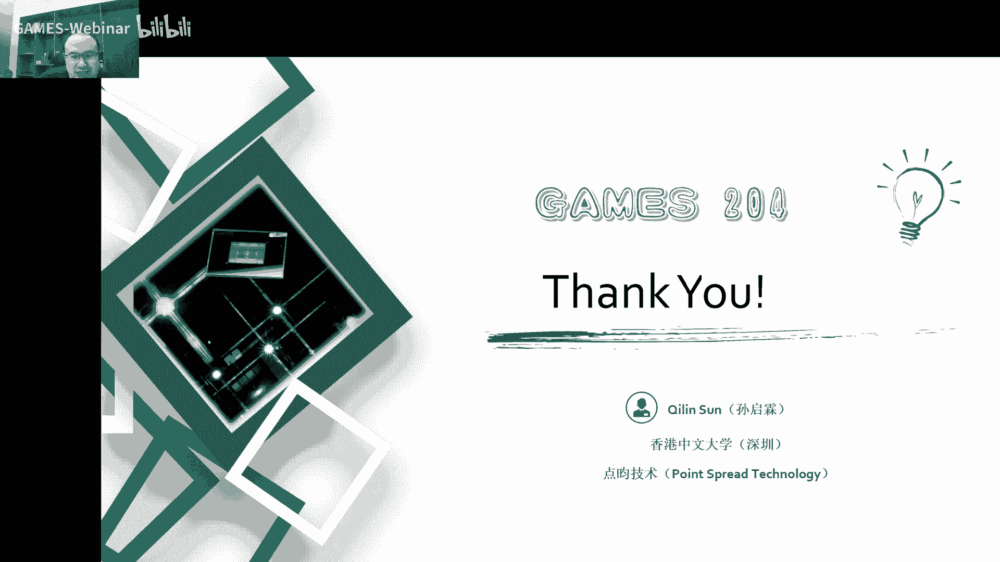