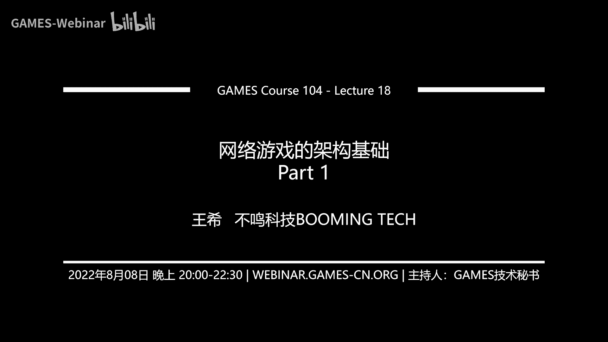
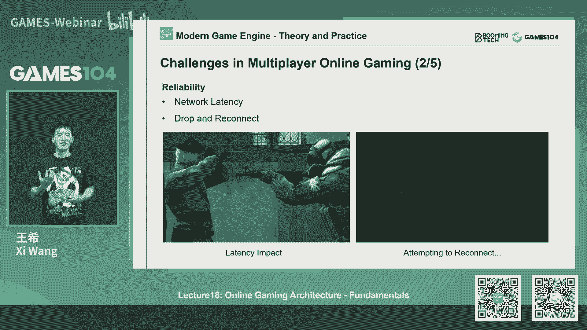
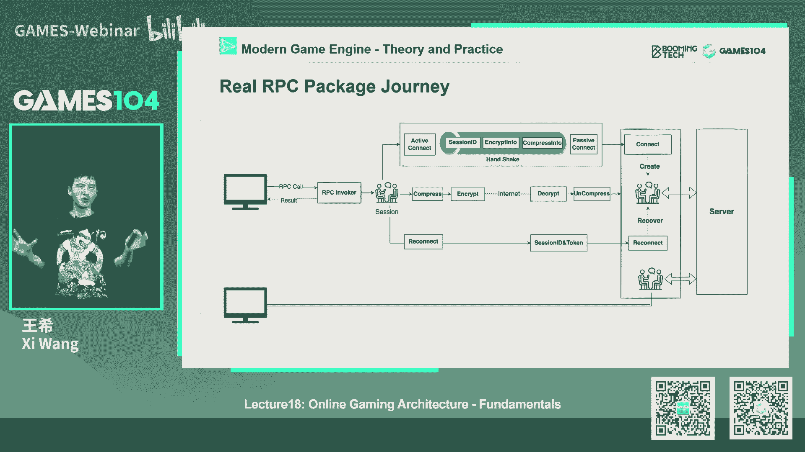
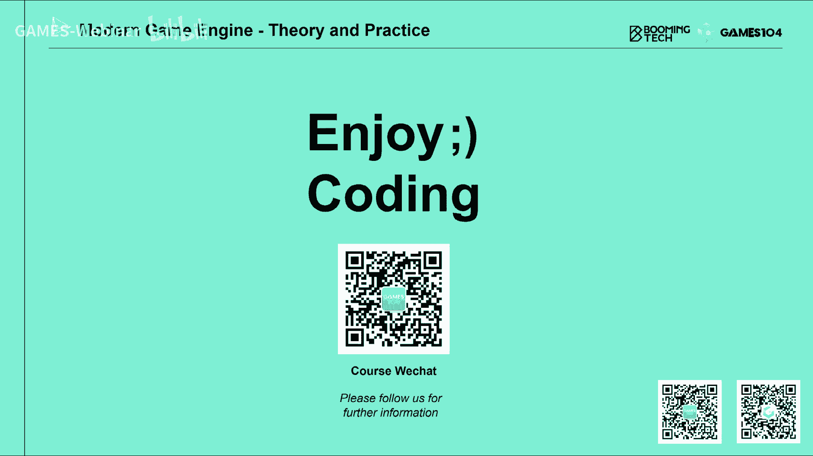

# 课程18：网络游戏的架构基础 (Part 1) 🎮🌐

在本节课中，我们将要学习网络游戏架构的基础知识。我们将从理解网络游戏相对于单机游戏的独特挑战开始，逐步深入到构建网络游戏所需的核心技术概念，包括基础网络协议、时钟同步以及远程过程调用（RPC）。这些是构建任何在线多人游戏体验的基石。

---

## 网络游戏的独特挑战

上一节我们介绍了课程概述，本节中我们来看看网络游戏面临的核心挑战。网络游戏的核心是让玩家在任何时间、任何地点都能与他人一同游玩。这带来了几个单机游戏不存在的复杂问题。

### 1. 世界状态的一致性
游戏引擎可以被视为在模拟一个宇宙。在网络游戏中，每个玩家客户端都运行着自己的“宇宙”实例。最大的挑战在于，如何确保这成百上千个平行宇宙中发生的事件是同步和一致的。例如，不能在一个玩家的世界里瓶子是完好的，而在另一个玩家的世界里它已经碎了。


### 2. 网络的不可靠性
现实世界的网络连接充满了不确定性，例如延迟、丢包、拥塞甚至断线重连。这与“上帝视角”下拥有无限且可靠带宽的理想情况截然不同。游戏必须能够优雅地处理这些网络波动。

### 3. 安全性与反作弊
网络游戏本质上是一个经济系统。保护玩家数据、防止作弊（如锁血、修改内存）和信息泄露至关重要。在单机游戏中，玩家修改本地数据影响有限，但在网络游戏中，这会彻底破坏其他玩家的体验和游戏的公平性。

### 4. 设备与环境的多样性
网络游戏需要支持各种设备（PC、手机、主机）和操作系统，并且要能在游戏运行中进行热更新以修复漏洞或调整规则，而不能强制所有玩家下线更新。



### 5. 高并发下的复杂度
构建一个支持成千上万玩家同时在线的世界（如《头号玩家》中的“绿洲”），其复杂度会随着玩家数量呈指数级增长，对网络架构是极大的挑战。

---

## 网络基础协议

理解了挑战之后，我们需要掌握应对这些挑战的工具。本节我们将回顾构建网络连接的基础——网络协议。

互联网的基石是TCP/IP协议栈，它通过分层模型（如OSI七层模型）屏蔽了底层硬件的复杂性，让开发者可以专注于应用层开发。对于游戏开发者，最常用的是传输层的两个协议：**TCP**和**UDP**。

### TCP协议
TCP提供可靠的、面向连接的、基于字节流的传输服务。
*   **核心机制**：通过“三次握手”建立连接，并通过确认应答（ACK）和重传机制保证数据可靠、有序地送达。
*   **流量与拥塞控制**：TCP会自动调整发送速率以避免网络拥塞，但这会导致带宽波动，在高延迟或不稳定网络中可能造成卡顿。
*   **包头大小**：相对较大，通常为20字节。

### UDP协议
UDP提供无连接的、尽最大努力交付的数据报服务。
*   **核心特点**：无需建立连接，直接发送数据。不保证可靠性、顺序性和流量控制。
*   **优点**：延迟低，响应快，包头小巧（仅8字节）。
*   **缺点**：数据可能丢失、重复或乱序。

### 游戏中的协议选择
不同的游戏类型会选择不同的协议：
*   **TCP**：适用于对实时性要求不高的场景，如卡牌游戏（《炉石传说》）的回合操作、登录认证、聊天系统等。
*   **UDP**：适用于对延迟极其敏感的场景，如第一人称射击游戏（《守望先锋》）中的玩家移动和射击指令。

现代大型网络游戏通常**混合使用**TCP和UDP，例如用TCP管理连接和关键业务，用UDP传输实时的游戏状态更新。

---

## 构建可靠的UDP连接

上一节我们了解了UDP速度快但不可靠。对于需要低延迟又必须保证部分指令可靠送达的游戏场景，最佳实践是**在UDP之上自定义一个可靠传输层**。

我们的目标是结合TCP的可靠性和UDP的高效性。这主要依赖以下几个机制：

### 1. 确认与重传机制
以下是实现可靠性的核心算法：
*   **自动重传请求（ARQ）**：接收方通过发送确认（ACK）或否定确认（NACK）来告知发送方数据接收情况，触发重传。
*   **滑动窗口协议**：允许发送方在未收到确认前连续发送多个数据包，充分利用带宽。
    *   **回退N帧（Go-Back-N）**：若某个包丢失，则重传该包及之后窗口内的所有包。实现简单，是推荐的基础策略。
    *   **选择重传（Selective Repeat）**：仅重传丢失的特定数据包，效率更高，但需要NACK机制支持。

### 2. 前向纠错
为了减少重传延迟，可以采用前向纠错技术，在原始数据中加入冗余信息，使得接收方在少量丢包时能自行恢复数据，无需重传。
*   **异或算法**：将多个数据包进行异或运算，生成一个校验包。丢失任一原始包时，可用剩余包和校验包通过异或恢复。类似于RAID 5磁盘阵列的原理。
*   **里德-所罗门编码**：更强大的算法。通过构造一个生成矩阵，将数据包编码为带冗余的数据块。即使同时丢失多个包，只要收到的包数量足够，就能通过矩阵运算精确还原所有原始数据。适用于丢包率较高的移动网络环境。

通过组合ARQ策略和FEC算法，开发者可以基于UDP定制出满足不同需求（如高可靠、低延迟）的私有信道。

---

## 时钟同步

在多个“宇宙”间同步事件，第一步是**统一时间**。网络延迟使得精确对时成为一个难题。

### 网络时间协议原理
最基础的算法是网络时间协议。其原理如下：
1.  客户端在时间 `T0` 发送请求。
2.  服务器在时间 `T1` 收到请求，并在 `T2` 时刻发出响应。
3.  客户端在时间 `T3` 收到响应。

假设网络往返延迟对称，则客户端与服务器的时钟偏差可估算为：
**Offset = [ (T1 - T0) + (T2 - T3) ] / 2**
往返时间可估算为：
**RTT = (T3 - T0) - (T2 - T1)**

### 游戏中的实践
由于网络延迟并不对称，单次NTP计算误差较大。游戏中的实践方法是：
1.  进行多次（如5-10次）NTP对时。
2.  舍弃那些RTT异常（如超过平均值50%）的样本，因为它们很可能是在网络波动期间测量的，不可信。
3.  对剩余样本计算出的时钟偏差取平均值，并以此调整客户端时钟。

尽管无法做到绝对精确，但这能显著减少因时钟不同步导致的逻辑错误（如判定攻击是否命中）。客户端与服务器建立连接后，对时通常是第一步操作。

---

## 远程过程调用

当我们需要在客户端和服务器之间通信时，直接处理网络消息的打包、解包、序列化非常繁琐且易错。RPC技术解决了这个问题。

RPC让开发者能够像调用本地函数一样调用远程服务器上的函数，所有底层的网络通信细节被隐藏起来。

### RPC的工作流程
一个典型的游戏RPC调用路径如下：
1.  **客户端调用**：程序员调用一个本地函数（实际上是RPC存根）。
2.  **序列化与打包**：RPC框架自动将函数参数序列化为字节流，并进行压缩和加密。
3.  **网络传输**：通过定制的可靠UDP或TCP信道发送。
4.  **服务器处理**：服务器端接收后，解密、解压、反序列化数据，并调用对应的实际函数。
5.  **返回结果**：如果需要，服务器可以同样通过RPC将结果返回给客户端。

### 接口定义语言
为了生成客户端和服务器端的RPC代码存根，我们会使用IDL来定义接口。
例如，一个ProtoBuf的IDL定义：
```protobuf
// 定义一个RPC方法
rpc PlayerShoot (ShootRequest) returns (ShootResponse);
// 定义消息结构
message ShootRequest {
  int32 player_id = 1;
  Vector3 position = 2;
  Vector3 direction = 3;
}
```
通过IDL编译器，可以自动生成不同语言（C++、Go、C#）的序列化/反序列化代码和网络存根，保证了跨平台通信的一致性，并让程序员能专注于游戏逻辑本身。

---

## 总结

本节课中我们一起学习了网络游戏架构的基础知识。

我们首先探讨了网络游戏在状态同步、网络可靠性、安全性、多样性和高并发方面面临的独特挑战。接着，我们回顾了TCP和UDP协议的特点及其在游戏中的应用场景，并深入讲解了如何在UDP之上构建兼具低延迟和可靠性的自定义传输层。然后，我们学习了时钟同步的重要性及NTP算法的基本原理与游戏中的优化实践。最后，我们介绍了RPC技术，它通过IDL定义接口，将复杂的网络通信抽象为简单的函数调用，极大地提升了开发效率和代码可靠性。





这些概念是构建任何网络游戏引擎的基石。在下一节课中，我们将基于这些基础，深入探讨游戏状态同步的具体策略（如快照同步、状态同步）、玩家移动预测与补偿、以及大型MMO游戏的服务器架构设计。