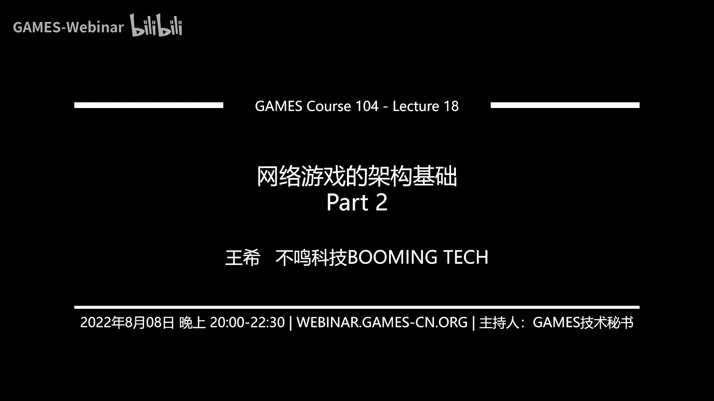
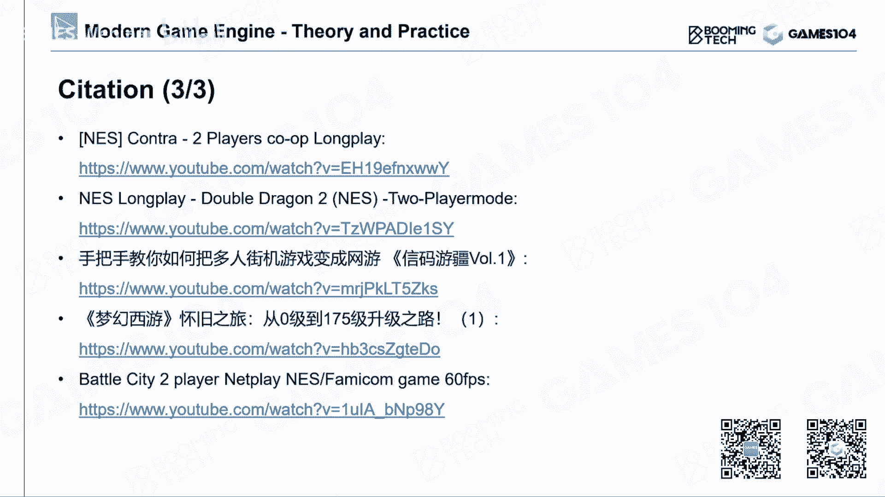

# 18.网络游戏的架构基础 (Part 2) ｜ GAMES104-现代游戏引擎：从入门到实践 - P1：GAMES104_Lecture18-Part02-4 - GAMES-Webinar - BV1HN4y157Zq

那接下来的话呢，我们就讲讲真正跟游戏相关了对吧，大家最关心的就是，我怎么去做一个对战游戏呢，哎首先大家了解一下对战游戏呢，它其实有很多的这种架构，比如说最经典的就是这个p two p的架构，唉注意啊。

此处的p to p不是大家以为的那种p to p，对不对，我们的p two p是很正经的p to p啊，就是这个peer to peer，的这样的一个网络网络架构，那么p to p的架构呢。

其实现在游戏用的已经比较少了，但是其实早期的游戏，基本上都是用这样的一个架构，就是说所有的客人连到一个游戏里面之后，我们可以所有的人去通讯，大家彼此通讯，把我的状态broadcast给所有的人。

那个时代的话呢都是局域网游戏，大家如果啊差不多十几年前，20年前，如果那时候你还在什么机房或者网吧里，玩过游戏的时候，诶你们都知道这种p to p游戏的特点，那么现在用的最多的是什么呢。

比如说你有一个能通透ds对吧，你和另外一个小伙伴能ds，你们一起想打怪猎连联机对战的时候，唉你们其实用的就是p to p连接，你们就可以一起连到一个世界里面，b41 般来讲p to p现在用的多。

人比较少了，很多时候就是点对点，两个人直接联网，对战的时候，用一些啊进场的一些通讯的协议，我们就可以就是说去玩，那一般讲p to p的这种连接的话呢，我们基本上认为就是作弊啊什么的，我都不管。

反正你们自己玩的开心就好对吧，而且这个这个连接呢，相对来讲也会做的比较简单，比较鲁邦，所以早期的最早的这种对战游戏的话，用的p to p的还是蛮多的，那么后来呢就大家会发现，我还是有很多的业务逻辑。

是需要集中到一起的，比如说有些校验啊，有些胜负啊对吧，不然你每个人都是自己投票，对不对，说了算，那这个时候呢就会出现，我们会在这么多机器中选一个，说老哥你作为hoster对吧，好我们所有人连到你这来。

我们就可以进行这样的网络游戏，这也是一种特殊的比特币，这个东西的话呢，啊其实大家以前在机房里面，或者在网吧里面玩过一些早期的，比如像cs啊这种对战游戏的时候，比如说你打那个魔兽的时候对吧。

我讲的不是魔兽争，那个不是那个魔兽世界啊，是魔兽争霸这种游戏的时候对吧，星际争霸的时候，你就满局域网的去搜诶，有人开服务器吗，开了好，我连上你呀，大家一起连上你，那那那都是我小时候最快乐的时光。

就是说那个我们就这样的，去连接到一个游戏里面，这里面的话呢，其实已经隐隐的有这个专门的游戏，服务器的雏形了，但这种架构呢它的好处是什么呢，就是作为游戏研发商来讲的话，我不需要花钱去维护一个巨大的。

复杂的服务器对吧，你们自己作为玩家，就可以把你的电脑变成一个服务器，然后你们就可以玩，实际上的话到现在为止有一些游戏，比如说举个例子啊，比如说像沙盒类游戏，他们会允许一群玩家自己开一个小房间。

其实现在欧美还有很多游戏采用这种架构，就是由各个玩家自己在社区里面开发，自己的这个把自己的电脑贡献出来作为host，然后呢其他人找到他的服务器对吧，那有时候官方会nice一点。

就是提供一个叫全球服务器搜索，你可以搜索亚洲服务器啊，美洲服务器啊对吧，哪个离离你那个延迟最低的服务器啊，同学们如果经常玩一些steam的游戏的话，应该知道我在讲什么对吧。

比如说你们玩一个那个就是那个lost，ark的话，你就会知道你要哦不是losk，是那个就是说方舟，你就会需要去找到一个自己的服务器，在里面，去构建你自己的这个世界和城堡对吧。

其实呢这个就是基于这个玩家自己贡献的，host server的话也是一个非常popular的一种架构，它一般适用于什么呢，比如说一群人构建一个小世界，比如说几十个人对吧，不超过100人的。

我在这个世界里每个人去构建，比如说那个minecraft，好像也是这样的一个架构，所以呢这种架构也是这种top也是很常用的，那么其实呢就是说其实p图，p的游戏还是非常多了对吧，他就是说它的好处。

就是说对游戏开发者来讲的话压力很轻，但是呢很多时候那个host的那个server的话呢，有的时候他会它的性能啊，会影响它大家所有人的体验，但这个事情这个传统艺能就是，这不怪我对吧，我作为游戏研发商。

作为游戏引擎研发商跟我有什么关系呢，这一定是你家的电脑和你家的网络不好嘛，对不对，对不对，你的女朋友正在下片，所以你是说你跟小伙伴真的这一局，这个魔兽可能就没得打了对吧，这个事情只能你自己想慢慢解决了。

跟我们游戏引擎研发商是没有关系的，对所以说p to b的这种架构呢，我觉得是个甩锅利器吧，就是对这个引擎研发者来讲，是很爽的一件事情，但是呢对于更加的复杂的游戏，特别像现在的这个大型的mo rpg。

或者一些更加的这个非常专业的，这种电竞向的这种对战游戏来讲的话呢，现在一般都会用的是delicate server，就是专用的这个服务器，那么它实际上一般是有产品研发厂商，自己去提供这样服务器。

这种服务器架构呢，它的好处是什么呢，就是说它会在一个服务器端，维护一个一致的游戏世界，而且呢它能保证尽可能保证啊，就是说所有的用户能获得，相对公平且稳定的这个连接，所以的话呢嗯这个呢也是就是说啊。

这个架构的一个很大的好处，所以这两个架构呢，其实很多时候你很难讲谁好谁坏，但是的话呢，我觉得如果你作为一个小型的对战游戏，只是一个大家自己玩得开心的话，那我认为p to p或者说p to p里面。

你加个whole server，是我认为还是个好的结构，但是如果你真的想构建，一个非常大的一个世界，或者是一个非常高水平的一个竞技向游戏，或者你想赚钱的话，你要做的是delicate server。

就反正所有收费的游戏大部分都是这个，当然是这个时间收费，道具收费，这种游戏的话一般用的都是delicate server对吧，你都要在服务器上充值，你才能变强，对不对。

但是现在这个大家会骂你是pato v对吧，但是的话呢，你的基础架构用的应该是这样的，一个服务器，那其实呢这里面再多说一句，就是说实际上呢真实的一个网络，游戏的引擎架构的话，它实际上的话呢是比较复杂的。

因为大家如果看全球的这个互联网的，这个top结构其实非常的复杂，而且全世界呢有成千上万的这个，网络接入商，也就是说，我们全球有大概几10亿的网络人口，对不对，大家都要打游戏。

但是呢大家并不是直接连到互联网，它是通过一级级的这个网关的这个接入，那个网网网端的接入商接入进来，那么每一个人的网络信息都不太一样，其实当你作为更复杂的一个，一个网络结构的时候，你会遇到一个问题。

就是说其实这个用户之间，到你服务器的通讯会变得非常的慢，这个我举个例子，比如说我们把服务器假设放在啊，比如说韩国好，那么有可能这个就是，比如说亚洲的西亚的玩家连过了，他就会非常的慢，这种情况是很常见的。

那你怎么办呢，其实这里面有一个trick，就是说我们在各地各个区域，我们设置一个接口，一个一个像一个pto一样的，就是所有在当地的人呢，都连到你的这个po上来。

而这个po呢我会建一条cast speed internet，高速的专线，直接连到你的服务器，一般来讲的话他直接走一些光缆的专专线，这样它的延迟最小，而且也是最稳定，然后呢连到你的这个服务器来。

其实大家如果看，现在有些比较好的电竞游戏啊，比如说像league of legend英雄联盟的话，他们花了最大力气，就是在全球构建这样的一个骨干网络，这样的话形成一个更复杂的一个拓扑结构，拓扑结构。

所以大家想看就是top结构，其实不像大家想的那么简单，其实你作为一个真正的一个商业，经营情的时候呢，你就需要提供这样的一个服务，就是说允许别人设立各种各样的photo。

然后photo到你的这个服务器之间，建立高速的链接啊，网用户呢它是无感的，他连到的都是你的po对吧，他根据我比如在南美，我是在西亚，我还是在这个这个这个南亚，我有各自的接入口能连接进来。

这个的话呢是一个非常重要的一个，网络体验优化的一种方法，ok讲到这儿的话呢，基本上大家就对做游戏的这个那个online game，有一点那么一丢丢感觉了啊，接下来这一part呢我们要讲一下诶。

到底游戏是怎么同步的，这也是今天呢我们的课程中，跟online game好像是最相关的这一part，因为这也是online gaming的最核心的一个东西，那么其实游戏同步啊，我们首先去看游戏的分层。

大家还记得，我们在104课程一开始的时候讲过，游戏引擎分为很多很多层对吧，大家觉得哦一层层的，我现在已经学会了，我理解了什么叫工具存，什么叫core，什么叫这个这个这个feature层对吧，我们都知道。

但是其实这个架构它有一个假设，就是说这所有的游戏都是在single player，在我一个人玩的世界里面去完成的，这里面的话用户的输入也好对吧，它全是放在一个主体去运营。

当我们真的去做一个online game的时候，你会发现这个世界就不再那么简单了，就是说我们实际上每一个终端，大家都会有什么呢，都会有输入，都会有各种各样的game states，然后呢。

这个世界上面一系列的游戏复杂的逻辑呀，状态呀，他到底是应该放在客户端的，这个游戏引擎的这一层呢，还是应该放在服务器呢，哎这件事情好像就没有那么简单了，实际上大家去想一个最理想的游戏引擎的。

就是做一个对战游戏的通用方式，是不是说我在客户端只需要解决，说我的输入输出对吧啊，就是输入就是我的controller，比如手柄啊，键盘鼠标的输入输出是什么呢，就渲染渲染到我的屏幕上，其他的逻辑。

我希望最好全部交给服务器来做这件事情，对不对，这件事情还真的是对的，他去做我们这个这个叫地球模拟器的时候，我们这个叫宇宙universe模拟器的时候，我猜他老人家就是这么做的对吧。

他的他的物理模拟是一致的，我们每个人只是看了一个view而已，所以呢我们只是每个人负责输入我们的，我们的主观意志负责输入了，然后呢，我们的眼睛负责收集他老人家生成的光子，然后我们就形成了我们的view。

但是呢在游戏里面，这件事情其实没有那么的简单，那么其实呢在游戏世界里面，如果这里面是一个我们实时拍出来的，这种效果，就是说你看到了就是自己的操作，和别人看到你的操作，彼此之间是有一个延迟的。

其实你们是在两个完全不同的universe里面，但是我要感觉让你们感觉，你们是在一个世界里面，那么就是说这个游戏世界同步，的基础架构呢一般有三种，第一种呢我们先讲最简单的，也是最古老的。

就是那个step shot，就是我对这个游戏的状态不停地照顾，照的方法，那么这个的话其实现在用的人比较少的，但我会提一下，第二种呢就是大名鼎鼎的叫真同步，但是虽然现在有人在争论说。

这个东西到底叫不叫真同步，但我觉得这不重要，就是细节对吧，如果大家很纠结，我们叫lockstep，对不对，叫锁不同步，这个听上去好像有一点点高大上，不明觉厉对吧，但是我觉得真同步大家都能明白。

那么还有一个呢就是状态同步对吧，这也是现在用的最多的一种，也不叫最多吧，就是用的也是非常普遍的一种同步方法，这种这三种方法呢，基本上是现在游戏中最主流的几种，这个就是网络游戏状态同步的方技术架构。

先从最简单的这个step shot dation开始讲起，这个方法呢其实很古老啊，从最早的这个quick时代开始，它的基础思想是什么呢，其实很简单，就是说，客户端只负责把自己的收入发给服务器。

让服务器那边呢进行整个游戏世界的模拟，他把整个世界游戏世界模拟的一清二楚，五之后呢，他把这个这个整个游戏世界的状态诶，生成好，生成一个快照，就相当于把这一刻把每个人的血量，你的位置。

你现在应该是什么样的一个这个速度，什么样的一个一个朝向对吧，全部生成好之后，客户端拿到这些所有的信息之后，好，接下那个，你可以把每一个客户端的小人，想象成一个提线木，那个在那个虚幻引擎里面。

有个词儿叫poem对吧，我觉得这个pom这个词我觉得是蛮喜欢的，就是起子好，你就把那个你的客户端，各个小人放到服务器告诉你的位置，你就把它放到这样一个位置，诶，你这时候你无论用什么视角去渲染它。

那是你的事，你看到的东西它就是这样的一个东西，就这个结构啊，它非常的干净，非常的漂亮，就是说它保证了这个大家的状态的，绝对的一致性对吧，所有人只是把书同步给server server一片，模拟完之后。

整个世界的状态是高度一致的，你不用担心同步的问题，然后呢客户端它也很轻松，他只是在渲染，只是在在最后的一个绘制和表现而已，那么这样的方法的话呢，其实就是说啊，一般来讲我们在做服务器端。

那个状态模拟的时候呢，我们会希望他的这个就是说不要吃掉，我太多的这个计算的带宽，那怎么办呢，诶我会把它的帧率稍微下降一点，比如服务器端，我们很多时候说时针是不是就可以了对吧，但客户端的话。

我们可能希望更丝滑一点，我们希望是30帧，60帧，大家如果玩个quick的人，就知道那个简直是晕的晕头转向嘛对吧，这个打quick可以把你打吐为止对吧，那所以的话呢这个时候呢你就会发现诶。

好像如果我的服务器端的这个，因为你每次照照快照其实成本还是很高的，快照同步条的成本也是非常高嘛对吧，所以这个时候呢我们一般会怎么办呢，哎我们会在客户端那边的话，在两个snapshot时间做一些差值。

这样看上去更加丝滑一点，这个也是一个，就大家自然能想到的一个方法，就是然后呢，另外一个很有意思的事情是什么呢，就是说其实我每次照快照的话，实际上是不是会非常的，这个这个数据量会非常的大对吧，那怎么办呢。

诶我们可以，其实你会发现在一个游戏世界里面，假设我有100个a i t对吧，每个i t有这个，比如说20个到30个参数，其实很多参数啊它其实是不变的，比如说你在两针之间，1/10秒之间。

可能90%的小怪的血量，是没有发生变化的，对不对，甚至有30%啊，百分之五六十的小怪的，比如说它的位置啊，它的朝向有没有发生变化对吧，或者游戏你的激光有没有发生变化，那怎么办，这些变化就没有变化怎么办。

我就存一个地府嘛对吧，这个dif的话其实就是一个delta，那么用delta就能传过去，这里面的话我们举个例子，就比如说这个例子使用用的不是特别妥当，但现在确实很难再能找到这种快照。

基于快照的这种同步的方法了，这种游戏了，反正我已经找不到了对吧，所以我们就选了这个物理引擎的概念，就是说诶我假设要做个online的物理引擎的话，那么你会发现，就是说它这里面这个作者给出例子，就是说。

如果你使不使用这个delta的方法的话呢，你同步的可能是每秒钟4。5兆对吧，因为每一帧都要同步，它其实数据量很大，比如说我同步十次的话，我这个一个staff的数据量，比如说450k的话，我就要让它乘十。

但是呢如果我用delta的话，我传回去的话，你会发现诶你只要600多k就可以了，你可以数据量可以下降将近一个数量级，其实这都是一些很淳朴的一些方法，那么这样的一个方法的话呢，实际上就是说他有什么好处呢。

刚才我已经讲了，它的好处就是第一个它非常的简洁干净，因为这个大家如果写代码，你就知道这个server端的代码，写起来非常的清晰，然后呢so stay的一个快照下去，客户端全部通过就完事了。

但是的话呢他呢就是说客户端，有很多的算力就全部被浪费掉了，因为早期啊，就是大家知道最早的电脑的时候，很多时候我记得我在啊，很早以前看那个有些架构的，他会讲叫tm的架构，就是他认为服务器是算力中心。

然后每个客户端只是一个terminal，就是说你只是一个显示和你的鼠标，键盘input，但是真实的情况是，现在在客户端的算力是越来越强对吧，我们现在买一台，用ccr，买台pc，那不要算力太强爆棚。

对不对，服务器其实没有像大家想的那么充裕，尤其是你一拖11拖100的时候对吧，甚至有的服务器一拖一外，那么服务器其实算力根本就不够，所以的话呢这样的话有大量的客户端，算力全部被浪费掉了。

第二个的话呢就是说server那边的话呢，就是说它生成这个快照之后传递下来，这个数据量很大，因为你如果连接的人不多就好了，如果你连接的人多，你想想看，就以假设一个链接吃掉你500k的。

这个kb的这个snapshot这个带宽的话，假设有100个链接下来，你就是你知道吗，你的上行贷款要达到这个呃50兆左右，那就很吓人了，对不对，大家知道有上行带宽是很昂贵的嘛。

那其实很容易就会导致服务器那边的话，整个是用筛掉，所以最早的quick的话，我猜也应该也是局域网内部的游戏，他也很难在公网上去连，为什么，因为在公网上这么大的带宽传起来，大家会很很崩溃对吧。

所以说的话呢，这个其实是这个早期的这个，基于快照的方法进行同步的一个它的缺点，但这个方法呢，我个人觉得就是说他真的是非常的干净，非常的elegant对吧，我我一直认为就是说如果有无限的带宽。

我一定会这么干对吧，因为他从从最基础的原则上来讲的话，它的计算量是最低的，因为为什么呢，是就是说你十个人连起来也好，100个人连起来也好，我对这个世界的模拟，我只要去模拟一次，对不对。

而其他的价格后面会讲的就是，其实每个人都有点浪费的，第二件事情的话呢，就是它保证大家绝对的意志对吧，不可能这里面有作弊的空间，对不对，你只能改你的input的其他其他的状态，我决定了你，你怎么作弊呢。

对不对，所以所以说呢，而且的话呢就是说所以的话呢，它实际上是非常优美的表达，但是它的一个基础假设，就是我的带宽是无限的，才能做这件事情好，这就是最简单的一种最快照的同步的方法，那么第二种方法呢。

就是我们叫做真同步的这个方法，lock step，synchronization，首先lock step这个词的意思是什么呢，步调一致的往前走对吧，就是大家随着这个这个121的声音，同步的往前走。

感觉就是大家整齐划一，其实这就是locks about的原则，就是大家实实现某种那个某种程度上的，一种高度的一致性，那么其实这个呢，它的另外一个很有意思的解释是什么呢。

我觉得更像我们我们玩的这种回合游戏，打个比方，大家如果下棋的话，它是有一个round的概念，就是说你出一下你的动作，我必须要跟你确认之后，我才会有我的动作，我的动作你确认之后对吧，你才会有你下一步动作。

这样的话大家不会无序的出东西，这样的话我对整个这个游戏的状态，就这个game的，因为其实下棋打牌，打牌也是属于博弈嘛对吧，这个game game的话它是有序的，大家想象一下，如果我们研究一种这个发明。

一种打牌的方式，大家不需要依次出牌，大家凭感觉一通乱出，谁手快的人，谁牌砸得快，那你想看这个游戏基本上就很难设计，它就乱掉了，其实lock step的话呢，它的核心思想就是说大家别闹对吧。

我不管你每个人电脑是什么样，但是大家所有的信息都是以一致性的，同步的传给我，然后我一次一致性的去处理它，其实这就是lock step的最核心的一个思想，那他具体怎么去做呢，其实在游戏的这个引擎里面。

当我们去构建这个服务器架构的时候，它的核心想法就是说，无论你有多少客户端过来，你把你们的输入统一的交给我，然后呢我再统一的分发给你们，你们去做一致的sima，那你们得到的结果就应该一样对吧。

所以呢我的服务器很多时候就是做好，这个叫信息的汇总，同步转发的这种处理就可以了，这是最简单的locbd，那个真同步的一个思想，那这个的话呢最早的话呢就是啊。

用这个lock star这个思想的人就是doom，你看这都是大牛对吧，大牛总是大牛，对不对，就是quick用了这个step shot的方法，诶，杜姆人家又用了这个lock step，哪一个都是经典对吧。

而且到现在log step这个算方式算法的话呢，还是我们在现代竞技游戏对战，又是里面最经典的一个架构之一，对好那这个lock它去用它的时候，第一步是什么呢，哎你得itialization。

待会儿我们会讲的更深的原因，为什么这个步非常重要，就是这里面给大家举个例子，比如大家玩的这个王者荣耀对吧，大家linuleon应该也是这样的，就是呃我我我我我确认一下，反正王者荣耀我记得好像是真同步的。

那么首先呢，唉当你看到那个加载条在加载的时候，实际上他在initialize很多游戏内部的状态，这个时候，游戏里面几乎所有的这个核心的逻辑数据，必须是高度一致和对齐的，不能够有任何的不同对吧。

比如说就像你打王者荣耀，对不对，你对方出了什么英雄对吧，你出了什么英雄，那是必须是一模一样的啊，然后整个状态初始化的，是没不允许有任何的问题，为什么呢，这个东西就是这样的，就是我们各自在十几十台。

不同的终端上去模拟对吧，我们彼此只能同步的，我们彼此的输入，那你要是一开始的状态，有那么一丢丢的偏差的话，大家知道有个东西，什么叫butterfly effect对吧，就是蝴蝶效应。

那么对于这种复杂的游戏系统，你只要初始条件有那么一丢丢的，这个不同的话，那到后面最后最终的结果，可能就天壤之别了对吧，所以说呢就是lock step的话，它的初始化非常的重要。

我们要确保每一局开始的时候，大家的状态必须是高度一致的，诶光有这个够不够不够，后面还要讲的更复杂的东西好，那这个时候的话呢就很简单了，那说好，那我们怎么办呢，我的server很简单，我很公平。

每一帧你们所有的客户端把你的书交给我，我确认收到了所有人的客户端的输入之后，诶，我统一的把它发给你们所有的人，你们所有人拿到了这个客户端车，这个这是其他人的输入之后，你们同时开始模拟下一站。

应该发生了什么事情对吧，这个听上去极其的公平，就跟我们那个什么来着，就跟那个呃啊这个还很难类比，在生活中，这种东西有没有还是其实又满足的，比如说大家一起做个决策对吧，不要七嘴八舌的去说。

每个人把自己的决策全部写好，交给一个老师，老师全部收起来，然后呢，诶他把这个收起来的东西，直接写到黑板上一贴，你们看到了啊，几个人说左，几个人说右，你们自己看自己的角色是什么对吧。

其实也是这样的一个方法嗯，那么这个方法的话呢，其实就是说它有一个很好处，就是说非常简单而且极为的公平，但是它有一个非常明显的缺点是什么，就是说如果有个同学特别的拖拉对吧，大家就跟下棋一样的。

就是诶有一个骑手，他他出招总是很慢，或者有一个同学交作业总是很慢，结果你的课代表作业总是没有办法交上去，然后老师说本来要布第二第二天的作业了，或者下一个作业的时候，或者下一道题的时候，他死活不出来。

所以呢在这种这个lock step的最基础的实践中，你会出现一个问题是什么呢，就是说那个交作业最慢的同学，会拖慢所有同学的进程对吧，这样大家那个去玩那个就是啊，我记得好像玩所有对战游戏，今天我有。

就是我们所有人加载都已经加载完了，诶有一个同学他是小霸王，加载特别慢，我们就卡了，他这个还算了，我我能忍对吧，你是小霸王，但是我最不能忍的是什么呢，我打的很痛快的时候，马上要上，我要上塔了。

我要五杀的时候，诶突然这个一个老哥，突然就这个他的网络混合的东西，就出问题了，那我们所有人就等着他了，那这种现象的话呢，其实在那个比如在dota里面对吧，在那个星际里面，我们是经常常见的一件事情。

就是突然蹦出个对话框，告诉你说哎呀有人断线了，你要去等等等等等等，我也傻在那你也傻在那儿，但是呢他确实非常的公平对吧，所以所以的话呢，对于早期的局域网游戏的时候，我们很多时候就采取这样的一种啊。

真童工的策略，但实际上效果还是不错的，因为在那种局域网里面的话呢，这种链接都是可以保证的，那么但实际上当我们到了公网的时候，那么很多时候链接它就变得不稳定了，那怎么办呢，哎我们会对这个算法呢。

作为一个小小的优化，叫bucket synsynchronization，他的想法其实更淳朴了，就是说哎呀我为什么要一直傻等着你呢，对不对，我设定一个上限，我每隔100ms我要收一次信息。

我服务器没收到了，你本金就算做了操作怎么样，我不说对吧，我说我算你没做成，那我接下来我每隔一方面，我就是把现在已经交上所有的同学，他的结果发给大家就好了，那就意味着说如果你的你的操作没有输入。

没有被传上来，那是你的过失，我不管对吧，你要么就放到下一帧去处理，要么你就你就把它扔掉，其实这个东西呢相对来讲也是公平的，这个这个其实啊，这个在我们在做网络游戏策略的时候，我们有两个策略非常有意思。

一个策略叫做啊，我记得好像是叫网络差者获利，就是你网络差，你反而获利可以这个收益，但这个听上去不合理，对不对，还有一种策略是什么呢，叫网络好者，他有优势，其实当我们在做一些比较复杂的。

网络游戏策略的时候，这这两个原则，是非常要花很多时间去思考的，比如说如果你做的不对，你做成了网络差值获利的话，就会出现什么情况，就是小伙伴发现自己打架打不过了怎么办，拔网线拔网线对吧。

或者有人专门写了一些中间的那个那个，就是那个那个那个那个啊，一些一些黑客工具，就是说我故意的把我网络的这个p值啊，什么东西弄得特别不稳定，让服务器误以为我是网络拥塞了，其实实际上的话。

那个时候我只是给我自己争取，更多的瞄准时间啊，更多的这种移动的这个决策时间啊等等，这里面就讲起来就很深了，但是的话呢就是这个bucket liation，这个思路呢，我个人认为他就是说网络好者不吃亏。

网络差者你倒霉对吧，是这个策略，你好，你再快他也没办法，他100ms就在那个地方，你快了也没有用，但是呢如果你100ms你都赶不上的话，那是你自己的过失，所以说呢服务器是不管你的。

那么这样的一个策略的好处呢，它其实就是一个balance，就是说其实这里面确实它会产生一些，可能潜在的bug，或者是一些就是用户的输入变成无效的，这样的一些问题，但是的话呢。

实际上当我们在做这个网络架构的时候，我们永远是一个tradeoff，就是说我们不会在这种，就逻辑的高度的一致性，就是我严格的还原了用户的，所有的操作意图，和我的实时性之间做一个平衡。

那么如果你用最古典的这种，你其实是能保证它的高度的一致性的，但是呢就是这个如果你假设是用这个，就是啊bucket的方法的话呢，它其实更多的是为了这个实时性对吧，打的爽去妥协一些他的意志性。

但是如果我作为对战玩家的话，我肯定是选择这个这个，这个就是说这个实时性的，对不对，打游戏不就图个爽吗，我为什么要等你的小霸王呢，对不对，大家如果仔细看，现在很多对战游戏的服务器。

它的延迟优化到了20ms之内了，所以说其实体验是很舒服的，我才不要打那种小霸王的那个游戏呢，所以我我毫无疑问会选择这个这个，这个实时性的这个选择好，那其实这里面的话呢就是做真同步啊。

大家想起来原理都非常的简单，大家想想是不是几句话就讲完了，很简单对吧，但是这里面最难的一个问题是什么，你的整个游戏的核心逻辑，它都要具有deterministic，就是确定性。

而确定性这件事情其实是非常难的，哎大家什么在哪个地方，我们讲到了确定性了，我们在讲物理引擎的时候，讲到了确定性，对不对，那么当时就讲了那个物理引擎对吧，我一样的物理输入，我经过那么多复杂的迭代运算对吧。

跟几个雅克比矩阵，简称的结果还是一模一样的，大家想想看这玩意儿靠谱吗，我觉得这玩意其实挺难的，那么但是的话呢，如果这个东西会影响到游戏的逻辑的话，诶不好意思，或者叫我们我们更专业的说法，叫游戏的结算嘛。

就transaction，就真的它是有一次业务结算的时候，你还真的要保证它的确定性，而这里面传统的问题就来了，比如说浮点数它能不能保证一致性，对不对，你的rua number随机数能不能保证一致性对吧。

你的各种各样的数字数字与容器，比如vector呀，比如说那个list呀，各种tree啊，对不对，就是说说那个计算的action，这些算法它能保证一致性，对不对，你的数学库能不能保证一致性对吧。

更难的是什么，你的物理是mation，能不能保证一致性，对不对，还有就是说那个你的整个逻辑的执行顺序，就是因为大家知道就是我的component，打个比方，比如说我们的游戏引擎是component。

对不对，come on，我有几百个物体，每个物体的话有几十个con，那我有几千个这个组件，我要保证它的执行顺序是高度一致的，为什么他如果不一致的话，它的结构可能会产生不一样，哎呀完了，这个，这里面。

你这些所有东西都要保证一致的情况下，对吧，就保证这种deterministic确定性的情况下，你的真同步才是合理的，因为大家仔细想想，真同步这件事情是不是很微妙，就是说我们彼此是完全隔绝的宇宙。

我们只是设定了一样的初始条件，诶，我在用一样的这个输入变量，然后经过了比如说几千次，上万次的这种迭代，我们最终的结果都是一样的，这就是确定性的一个很难的一个地方，但这件事情在。

如果你要实现真同步的游戏引擎的话，你还真的需要实现这个东西，而这个确实确实非常的难，这个里面大家又回到了民间科学部分啊，就是大家想想看这个啊，我们的宇宙满不满足这个属性。

大家都至少以我们现在已知的物理学原理，我们认为这个这个事情是不能满足的，为什么哎呀，那么一点点的地方，因为什么呢，因为我们又叫不那个那个叫什么，不确定那个原则对吧，这个量子里面。

它很多东西它真的是真随机的，所以说它你就是一模一样的输入条件，它的输出就会有那么一点的差别，那想想想我们伟大的三体问题对吧，发生的时候，那这里的运动就是完全不确定的，那在宇宙星空中最多的恒星的组织模式。

什么是星团对吧，像太阳这种单核心的星系是极为少见，大部分都是双星啊或者三星或者星团，所以我们知道这个宇宙是一个混沌系统，高度不确定的诶，我们在但是在我们的游戏引擎里面，如果我们要实现真同步的话。

我们将要构建一个确定性的universe，哎这么一说就听上去很高大上，我们要构建一个确定性的宇宙好，那确定性怎么保证呢，那首先第一个更让大家很头疼的是，什么是浮点数对吧。

在计算机里面我们表现一个二的倍数，比如说整数是没有问题的，但是我只要保持表表示小数的时候，二的这个倒数倒数幂是可以的，14/2分之1/18都没问题，或者他们的组合也可以，但是我让你二除一个30。

666666，你就没有办法去表达了，对不对，这个时候那简单的解决方法是什么呢，你要符合i o p e的这个754的，这个负电数的标准，那么它从标准上严格上来讲，它是能保证你的浮点数运算的这个高度。

一致性的对吧，这个可能是我们最后的救命稻草，那么好，那这里面的话呢，其实你要意识到一件事情，就是说其实在我们刚才提到，就是在做网络游戏的时候，其实我们会面对各种各样的平台，比如说我们作为一个王者荣耀。

你手上拿的是个android对吧，那边拿的是一个ios，他两个的这个芯片的完全不一样，操作系统也不一样，但是呢我要保证，你们所有的运算结果是高度一致的，所有的数学库越好，你们的第三方库也好，就大家知道。

就是说比如说啊你那个第三方库来讲的话，其实在不同的平台上，它的实现都是有区别的对吧，那么所以说这个时候我们要保证，所有的数学库，所有的浮点数表达所有的这个啊数学运算，它都要符合我们的这个确定性原理。

这件事情就非常的挑战的，那么接下来还有什么呢，诶还有就是说我们的这个，就是说很多的数学运算，打个比方，大家经常在写逻辑的时候，比如说做动画的时候对吧，做一些这个反向动力学结算的时候。

我们要写这个三角函数，对不对，sin cos对吧，或者写一个e的多少次方对吧，log这些东西怎么办，你要用查表法，这个数值必须是精准的锁死的，否则的话，如果你真的交给他们，各自去算算出来的精度。

可能就非常的不一样，所以这个时候的话呢，其实这里面有很多的挑战，当然这里面还没有提到，就是哦随机数对吧，随机数我们必须要求啊对随机数，而我们前面有提到随机数啊，随机数内页在哪里哦，我会不会提到单独提到。

那么还有一点是什么呢，就是说其实啊在现在的游戏引擎里面，有一派同学在座的引擎叫做定点数引擎，其实如果大家是专注于做真同步的话，其实定位收引擎也是一个，现在大家特别热热门的一个研究方向。

就是说我们尝试用定点数fixed point，不要用floating point，然后呢用固定定场的整数和小数，它能做出整个的数学库，整个的这个物理的引擎，能够保证整个的游戏逻辑的。

他的deterministic，这一点的话呢，也是现在一个非常热的大家一个方向，但是很遗憾的是说，主流引擎大家很少用定点数这个去解决，但是的话呢，确实在很多特定的游戏场合里面，我们需要定点数这件事情。

大家听上去很可怕对吧，说哦天呐，我那么复杂的一个游戏，我要保证它的确定性，是不是非常挑战这件事情呢，啊好消息是说啊，严格来讲，你并不需要把整个游戏变成具有确定性的，因为这件事情几乎是不可能。

那你呢是把你最核心的业务和逻辑，把它变成就是deterministic的，就是说比如说角色的移动，角色的位置，角色的血量，角色的伤害结算对吧，这些全部都是deterministic。

但是呢比如像渲染这个东西，说实话你多一点少一点，问题也没有那么严重对吧，所以说呢一般我交给显卡，显卡那个时候我就已经没有要求，所以game state，我们要把它尽可能地做成确定性的东西。

那么另外一个的话就是随机数，这也是大家这个可能觉得唉，这个事情一没有想到，说连随机数这个东西我都要保证确定啊，确实真的是要举个例子吧，比如说你们玩所有游戏里面的话，我们打一个暴击对吧。

比如说我有30%的概率，打出一个三倍伤害的暴击，诶，不好意思，这个暴击1/3的概率真的触发了，比如说我在我这边，我一刻这个砍出去一刀，对方的那个状态的时候，我出我能够成功地砍出了个暴击。

你在你那边那个universe里面，我不会告诉你说我暴击了一个谁谁谁，你在那边，你用你的随处就是掷骰子，我一直我想说掷骰子，但有人告诉我，我们就叫织骰掷骰子吧，那一样的输入的情况下。

支出的投资就是一模一样的，那么诶我这边筛子啊啊，还是这个骰子舒服一点啊，骰子出来它是暴击了，你那边掷出的骰子，居然也毫无疑地翻到了一个巨大的六处，在上面，哇，我又暴击了，你想想这事就很有意思了。

所以说呢，随机数实际上也是要求严格的同步的，所以这个宇宙里面这个就是测不准，原理是完全不起作用的对吧，这个符符合水哪个哪个老人家的观点呢，符合这个牛顿老老爵爷的观点，老爵爷当年就在想说。

哎呀你看我宇宙三大定理对吧，整个宇宙，如果我知道现在宇宙中所有的原子的状态，我就可以倒推宇宙的过去，有可以顺延宇宙的未来对吧，所以那个时候整个物理学界最头疼的问题，是说谁给了这个世界的第一推动。

所以牛顿老爵爷整个后半生都在正在思考，这个精密的仪器怎么去运转的对吧，那么这个在我们的游戏的引擎的，这个世界里面，我们可以满足牛顿老爵爷的幻想，所以说如果我们把牛顿老爵爷，放到我们的元一周里面的话。

我们一定把它扔到一个真同步的，deterministic的这个游戏引擎的宇宙里面，他肯定爽的不得不要不要的，他发现这个世界太有确定性了，很开心对吧，所以呢render number这件事情。

其实是游戏引擎的精髓，就是其实游戏里面很多的运算，都要基于这个随机数，随机数是我们很重要的一个点，那么这这里面的话呢，它实际上是一个确定性的过程，所以呢在游戏引擎，客户端和服务器同步的时候。

他们首先要把随机数的种子给统一不好，而且呢随机算法也要高度一致，所以你会发现诶无论你是windows的还是linux的，你一次生成的一串随机数，它必须是一致的，诶这里面我再荡开一笔，就是那个啊。

大家知道就是我们讲量子力学的不确定性，里面有一个很著名的实验是什么呢，就是讲那个啊就是那个叫爱因斯坦嘛，他差了几十个事，他说你们是这个世界不是真随机的，这里面有个隐变量，只是我们不知道而已。

但是呢唉后来有个很著名的那个那个实验，双光子的实验，他证明了说这个这个这个东西，它这个概率分布是符合真随机，而不是伪随机的，诶这个我们爱因斯坦通知，当然他没有活着见到这个实验的结果。

所以呢这件事情的话呢，其实跟我们这个世界又不一样对吧，还是那个不确定性的，但是呢在游戏引擎的世界里面的话，我们真的有一个隐变量，这个隐变量是什么呢，就是随机数种子。

这个隐变量在我们的每一个人的一个neverse，构建的时候，我们同步好，所以呢在游戏里面的这些这些角色，这些pm他看到的世界他觉得是随机的，我们知道那是伪随机对吧，一切都在我的掌握之中。

怎么样想象一下很快乐，所以有的时候我前段时间看一部电影，忘了叫什么名字，应该很有名，就是那个头号玩家，后面的另外一部电影叫什么什么玩家来着，他就讲那个游戏世界里的m p c，突然觉悟了。

他有产生了自我意识对吧，然后开始跟那个你们的玩家，这个谈恋爱那个电影叫什么来着，我有点忘了叫什么，超能玩家是什么玩家来着，其实我在想，如果有我们构建的游戏世界里面，有一天我们的npc觉悟的时候。

他会突然他们会研究说，这个事件里，随机性是个真随机还是伪随机呢，也许他们做完了相应的实验会告诉我们说，诶你们骗我，这个世界里面的随机全是伪随机，它里面有隐变量，甚至他们可以反向的猜出这个随机数。

种子数值是多少，并且能够预测预测这个世界里发生，所有未来的事情，如果将来我们的游戏引擎，能够走到这一步的话，非常的兴奋吧，好ok，那所以的话呢就是说deterministic这件事情。

其实是我们认为真同步，是一个非常重要的一个基础构建，你可以认为它是一个基础，就是如果你不能保证游戏的state的，它这个这个就是说确定性的话，其实真同步的算法基本上是不能成立的。

这是一个很挑战的一个东西，那么其实呢，就是对于这么复杂的一个游戏体验，大家想象一下现代游戏引擎啊，那这个时候呢，其实你很容易一不小心就会写出一个bug，就是本来a这个输入就是一一个一局游戏。

大家想想看啊，双方都有几千上万个输入过来对吧，那么就是几千帧上万帧的模拟接触之后，诶，可能在比如说d500 多帧的时候，两边这个系统就有细微的差别，到这个就七八百帧的时候，你就很明显地发现。

两个人已经在不同的位置上了，而且有的时候，你看见这个人打出了一个大招，但是呢在那边他打中了一个，这个在一个科幻的那边，他是打中了对面的一个龙对吧，而另外一边他把你打了那个一个空气了，对不对。

这个事你就知道错了，但是作为一个游戏引擎，你或者说你基于你的引擎开发的游戏，你该给上面的开发者提供什么样的服务呢，其实对于真同步来讲的话，就是bug的tracking和debug其实非常的重要。

那这里面最重要的一个一个，一个一个原则是什么呢，其实你要去不停地去把你游戏的整个状态，把它存下来，比如说你整个memory的状态，你整个c的状态，这里要用到一些技术。

比如说你要用那个check on的技术，check on技术，比如说我把现在所有的变量在一起，我算一个md five，一个一个编码把它传出去对吧，然后我会把游戏里面所有的关键的函数的。

扩和the parmeter，把它变成一个哈希值存在，那那么这个地方的话我就不停的，就是当然不会是每一帧每一帧太废了，可能每隔五帧到十帧，大家都锁定好，我会把它内存中把它game存一下，这个快照。

我也存下快照，这件事情为什么这么重要，就是当我在一开开发期间，我一旦发现我的真同步失效了的时候，我至少可以根据这些memory的快照的check的比较，我我可以知道在哪一帧错了。

然后呢我再详细的去追下去，就会知道说哪一步的运算错了，所以这件事情的话呢，实际上对于开发真同步的游戏来讲，非常的重要，但这里面具体的怎么样的去生成，一个能够帮助你去debug这种确定性。

这个这个这个这个的，这个就是说login的系统的话，在这节课上我们就不展开，但实际上大家如果去写一个真同步的游戏，引擎的话呢，一定要注意这一点，否则的话啊大概率你会开发很久，但是呢你总是发现你跑不通。

因为你总会发现什么地方，有个地方你没考虑到光机意向，整个世界发生了蝴蝶效应，最后结果你完全不知道了对吧，那么其实这里面的话呢，其实在正同步的话呢，它虽然用了bucket这个方法。

但实际上我们还是会遇到很多的，网络的延迟啊，突然抖动这样的问题，那这个方法怎么解决呢，其实也比较简单，就是说真正的游戏中，我们很多时候啊把服务器传过来的真，我们会开始几帧，比如说一针两针三针对吧。

当我就是说a服务器那边出现了一些延迟，就是他没有及时的把那个针传下来的时候，我这边的逻辑帧，我本地的帧还是可以从八分，你取个数据，你可以认为它有个小小的蓄水池，这个思想其实是非常常见的，大家举个例子啊。

就是说啊，我们经常在网上看那个就是那个视频，比如说大家看到的艾伊藤对吧，你们看的电影是不是觉得都很流畅啊，觉得这个a这个帖子从高位看着很舒服，对不对，但实际上你们知道吗，如果你们去分析它的网络上。

网络肯定抖得都不像话了对吧，那为什么你们会看到那个电影，非常的稳定和流畅呢，实际上他们在各个节点cash了很多的数据，就是前后很多真的cash在那，这样的话，当你在本地发生的一些抖动的时候。

它实际上都会把你给smooth掉，所以用buff的机制去解决，网络的legging的问题，是一个非常经典的一个策略，所以说呢当我们在做真同步的时候，因为我们没有办法规避，这个就是说啊网络的legg的话。

那没办法，我们就诶做一些小小的buffer，把这些这个这些针我们把它catching在这儿，那么另外一个的话呢，就是说其实在做镇痛步的时候，一般服务器，我们并不会要求那么高的更新率，大家想想看。

现在游戏我们的刷新率到60，甚至到120了对吧，然后我我们一个网络的r7 t，就是将近100多毫秒，对不对，那我肯定跟不上你的速度嘛，网易网络波动一下，我突然一下子增加到100ms，也是很正常的。

对不对，那怎么办，哎我的服务器其实就是差不多十帧左右了，但是呢我会在中间插入很多渲染帧，这样的话，我如果发现你的相机在移动的时候，那我不会出现这种当当当当当当，这样一动对吧。

我其实这个相机的位置可以插值吗，这样的话，我在中间插入很多的渲染帧的时候，这个世界的状态其实没有变化，但是呢你会觉得这个整个游戏的感觉，看上去非常的smooth，但这里面有一些更加细腻的一些差别。

比如说我甚至对一些动作的可以差值对吧，这个人的动作，我可以把它从游戏状态剥离出来，那么我可以让他整整个这个状态，变得更加的平滑，也是一种方法，那这样的一个很大的好处，就是说，当我的这个网络。

出现了各种各样的问题的时候，我的逻辑真和渲染针，我的我的画面不会因此出现，这种各种各样的抖动，还有一点就是在前面讲渲染的时候，大家有没有记得我们讲一个概念，就是说哎we think。

就是现在我们的显示器对吧，它你的free buffer生成的东西，它的一帧帧的刷到那个就是显示器上，如果显示器刷新的频率，和你的这个巴菲尔更新的频率不同步的话，你就会出现一条线，对不对，诶，但是呢。

如果你把逻辑帧和你的渲染帧剥离开的话，渲染针可以相对稳定的工作的话，你就不会出现那种，就是那种中间有一条线的，这样的一个一个问题，所以呢这也是他我们把逻辑和渲染，在真同步这种算法里面。

分开了一个很大的好处，那么还有一点很有意思的一件事情，就是说诶，当我们这个真的不做个游戏的时候，大家想想做对战游戏，我们最容易出现的情况是什么，是我们会断线对吧，断线大家打个游戏对不对。

我正好在上上分或者上塔的时候对吧，突然我就断线了，那时候很着急，对不对，我得赶快去连啊，大家想想这个时候实际上无论是你的书，我肯定没输了，这我接受，但是别人没有停啊。

我的其他的小伙伴还在那一通操作猛虎啊，那这些这个世界已经发生变化了，那我怎么跟他去同步呢，诶这个你们就讲一个，很有意思的一个一个一个事，事实就是说，当我们在做这个真同步的时候啊。

我们的客户端不是那种只是大米的，就是很笨的，从那个server那边去接受各种输入，它其实每隔多少帧的时候，它有个kf，就是呢他会把当前这里面所有游戏的状态，我take一个快照。

而且呢我会把这个快照呢存在我本地的，比如说内存或者是我的磁盘上，这样的话保证我这个游戏机是崩溃了，我这个snapshot快照还在，这样的好处是什么呢，比如说今天从游戏开始，就现在从游戏开始打。

已经到了1万张了，对不对，我中间断线了，大概十几秒，我丢了的丢了，比如说几百帧，我现在9500帧等对吧，比如说我丢了十几秒，这是我回来的时候呢，我发现我上一个快照可能是九，就是9000。

比如说啊400帧，那我实际上等我回来的时候，诶，我发现整个大家已经走到了1万帧的时候，我其实只要追这100帧了，我不要去追那个1万帧的结果，那个1万帧的结果，你追着看下来追死你对吧，这个时候。

所以快照实际上就能避免，我们每一次从头开始追你整个游戏状态，因为大家知道这个里面的它的，就是整个游戏世界的这个这个变化，实际上是根据你输入的一个积分量，对不对。

每每一个frame make friend，这样积分上去的好，那这个时候呢就有一个很有趣的设备，叫什么呢，叫quick catch up，那么举个例子，比如说我们的游戏的正常逻辑。

诶当我发现我要追的时候，其实我可以干一件什么事情呢，刚才讲了一个很有意思的架构，就是说我把渲染真和逻辑针不分离到了吗，我渲染成可以跑得更快，对不对，诶这个时候你反过来了，说渲染你给我停了，不要渲染了。

没有意义，反正我已经落后了，对不对，我把渲染的所有的算力全部关掉，我就开始疯狂地跑，我的逻辑，这样我以十倍的速度，我总是能追上你现在正在游戏的进度，而且我前面又照了一个快照，所以我总是能追得上。

大家想想看，这里面这个策略就非常的重要了，这样我就能追上那个，这样我就不怕掉线了，掉线了，我可以再重连，其实啊实际上的话呢，在对于有些游戏来讲的话，我不仅会在客户端找一个快照，如果我在服务器端。

我也对整个游戏的state进行模拟的时候，实际上我也可以在服务器端，在某些key frame都在照快照，那这件事情为什么有用呢，照样说我客户端断线重连对不就好了吗，实际上这里面有个很有意思的东西。

是什么呢，就是说，当有的玩家太长时间没有醒来的时候，服务器可以给你一个更新的快照，这样的话能够帮你把这个游戏的状态给你，去set up，所以这一点的话呢其实很有用，那么它有更有用的一个应用场景是什么呢。

就是这个诶观战模式对吧，大家打那个对抗竞电竞游戏，都知道那个不能关照的电竞游戏，怎么叫电竞游戏呢，我一定要关照，其实关照这个事情就非常有意思，就是说它实际上跟断线重连，用的底层技术是一模一样的。

所以说如果服务器那边把现在当前，前面那个关键帧的信息发给你，然后呢，再把你miss掉的那些选手的input，一通传给你之后，你就可以追上来了，但是大家这里有个细节，就是说一般来讲观战防止大家用它来作弊。

都会故意的船慢，大概比如说呃几分钟的数据给你对吧，这样的话你就算爆点也没有用，因为那个就是这个，这个别人早就已经不在那个地方了，但是呢其实大家这里面就理解一下，游戏引擎的底层架构里面。

就会说它的观战模式，实际上适合这个断线重连用的是一套技术，尤其对于真同步呢来讲的话，它实际上就是用一个就是这个snapshot，就是对几个关键帧，我们照一些快照，这个快照是照在你本地也好。

招待服务器也好，其实都是一样的，那么然后呢再通过就是说一种cup的机制，能够迅速的追上去，大家如果看到有些游戏的这个观战模式，假设你是中途进去的时候，你反而可以看到之前的选手的这个，什么快进模式对吧。

看到整个游戏的过程，其实呢这个呢既是一种炫酷的feature，实际上也是他真实的因素，就是他真的是把前面的那个simulation，全跑了一遍对吧，给你看了一遍，那么如果有了这样的一个基础的话呢。

其实大家就又进到了一个，更有意思的一个东西了，就是这个啊回放对吧，所有的对抗对战游戏大家都想要回放，其实回放也是一个道理，就是我对游戏的过程中的一些关键帧，存下来之后，诶。

我就可以在各个节点之间来回拖动它，就是往后拖，其实就是时间有更多的input的进去往回拖，你没有，就是你只要没回到那个节点，其实呢我就是少少少去计算几个输入，那如果你越过了那个step shot的话。

我就退回到前面的那个kfc，去生成我的这个这个游戏的世界，所以其实有了这样一个基础的时候，大家就能理解，就是说基于真同步的基础结构，其实我们做观战，做动线，断线重连，做回放，他用的都是一套机制。

其实这就是一个非常有意思的一套体系，ok那么其实呢就是说啊，基于这种那个真同步的模式呢，它实际上还是会有一些问题的，比如说假设有人作弊怎么办对吧，因为最原始的架构中的话，服务器就是发给大家。

你们各自演算，那其实客户端可以作弊啊，他说我赢了，或者我杀死了谁谁谁，但是大家知道这里面其实很可能这个状态，他是不听你的，对不对，那么但是呢不排除有人，比如说在游戏里面进行一些作弊改。

修改一些必要不必要的一些状态，比如说我说我突然移动到一个，什么奇怪的地方去了，那么这里面的话呢，一个基础的机制是什么，投票机制，就是说诶我们每个人过一段时间。

都会把自己的游戏里的状态的那个check on，就是我的那个校验码发过来，如果有一个老哥跟他其他人都不一样，我就知道你的作弊了，那我就把你脚给踢掉，但是呢如果只有两个player怎么办。

哎这个叫服务器就比较麻烦了，其实服务器里面它会有一套游戏state，他把游戏的state的算出一个check之后，跟你去比较，如果发现不一样，我就把你踢掉，但是一般来讲，如果只有两个漂亮的情况的话呢。

呃有的时候大部分这种游戏啊，其实用p two p的价格就完事了，而且它也不是那么强的电竞属性，但是对于一些电竞属性很强的游戏的话，他确实要这样去做对吧，所以呢这是一个真同步。

经常遇到的一个就是反作弊的问题，但这个问题其实难度并不大，真正比较难的一个问题是这样的，就是说其实真同步啊，它实际上啊把所有的信息和状态，在你的客户端全部都有原则上来讲，比如说今天你去打一个。

就是比如说像呃这个这个moba游戏对吧，实际上的话呢你应该是有战争迷雾的，你只能看到你自己自己的这个区域，其他人我是看不见的，对不对，这样的话我们每个人不知道对方的声音。

我去那个就是说我去那个做任何操作的话，我要用我的判断预判，对不对，但是实际上你可以很容易地放入一个插件，然后呢把整个地图全开，你知道对方所有的状态，所有的数据对吧，因为这个每个人在各地都是全模拟的。

所以呢这个如果大家用最经典的，真同步的架构的话，其实就会有这样的一个问题，所以大家，这就是大家，为什么看到早期的很多真同步的网游的话，它很容易出现一种就是外挂，这个外挂会让你看到所有的东西一清二楚。

对吧，但是其实现在的这个真正的游戏里面，中同步用的不是那么单纯，他其实有很多方法策略会规避这件事情，但是的话呢如果大家实现一个最简单的，真通过游戏的时候，一定要去考虑，就是说别人外挂的可能性。

比如说我们假设作为一个呃，这个这个的动作游戏一样也好，那其实对方的小怪在哪里，敌人在哪里，别人在哪里，我其实都是一清二楚的，那么就是说lock step的话呢，这个方法的话。

实际上是一个非常好的一个一个方法，它就是对带宽的要求其实是最低的对吧，你只需要同步指令，那么第二个的话呢，就是说他的那个，就是说从开发的这个效率上来讲的话。

如果你解决了他的deterministic的开发，效率其实非常的高，然后呢就是说其实真通过游戏一个，我认为个人认为是最大的一个，好处是什么呢，这个引擎就是说它可以做一些，对打击操作非常敏感的游戏。

为什么，因为我们的世界是公平的对吧，后面会讲到那个状态同步的时候就会出现，你现在在哪儿，我现在哪，他两个是并不完全一致，比如说我现在就打你个爆头对吧，我现在就是一个cao，打出去特别帅，正好压着你去打。

那不好意思，如果不是真同步的话，其实很多时候这种判定啊，是有很多灰色的成分在里面的，所以的话呢，这是真同步的一个非常大的优点，所以大家可以发现就是对一些动作，打击感要求非常高的这种对抗游戏的时候。

那么另外一个的话呢，就是这种阵痛步的话呢，非常好做游戏录屏对吧，大家想想这个技术原理就明白了，我把所有的错输入指令全部录一遍，不就完事了嘛，对不对，所以非常简单，但是呢他的问题呢。

就是说诶保持这种意见一致性，其实是非常非常难的一个问题，而且刚才我讲了那个全图挂这个问题，其实对镇痛步来讲也是很头疼，因为他确实毫无保留的，整个游戏世界的状态，促使化是一模一样，大家的输入你的全部一样。

因为我是在每一个人university，模拟的是一个全宇宙，所以的话呢这个宇宙里发生的一切，你都应该知道的对吧，所以说，那么但是还有一点就是说正同步的话呢，就是当我们断线充电的时候。

如果不使用服务端的这个staff shot，这个机制的话，其实他的这个追赶，如果到游戏这个时间比较长，比如说打了一个小时的那种对战的话，哎呀那个追起来就比较蛋疼了，对不对。

你想要模拟多少个tik的操作呢对吧，所以说呢这是真东部的一个小小的缺点嘛，但是我我觉得瑕不掩瑜，真通部，其实还是一个非常了不起的一个架构，其实我们两种方法都用了，比如说我们在做cp模式的时候。

就是两个人联网打单机的时候，我们用的就是正同步对吧，但是我们在联网打这个大家pvp对战的时候，是6v 16的时候，那我们啊8月八的时候，我们就用了另外一种技术，这种技术是什么呢。

诶就是我们今天的最后一趴叫做状态同步，这个算法，那么首先状态同步呢，现在其实在网游中，用的已经应该是越来越多了吧，就是说很多对战游戏用的是状态同步，就是那个m r p g对吧。

就是那个大型多人在线游戏的话，这种就是生活类社区类这种游戏的话，基本上用的也都是状态同步很少，我听说有人用真同步做，那你们的战斗系统如果有的话，那只能说是我孤陋寡闻了，那么ok那么其实的话呢。

就是状态同步的话呢，实际上就是把用户的这种状，态信息给同步出去了，比如说你用户的输入对吧，我比如说我开枪了，我跳了，我怎么样，但这里面并不是，直接把玩家的按键给传出去了，他很多是把你的一些指令。

比如说我去跳一下，我去攻击了，我就向前移动了，这种状态去同步过去，那么的话呢，比如说发生了爆炸，发生了什么什么死亡，这些东西的话都会去进行必要的同步，而状态同步的话呢，它最核心的一个思想是什么呢。

就是说它实际上啊他不会把一个全宇宙，全世界彼此间同步，其实每一个玩家只是提交自己，部分的信息和部分的状态，每个玩家自己在模拟自己的世界，但是呢在这个server端，他会去模拟一个完整的全宇宙哎。

这就是状态同步，和其他前面两种算法一个很大的区别，就是server端那边它会进行，根据你们每个人的状态输入，它会模拟一个全的这个完整的世界，然后呢，他只会把部分的信息跟你相关的信息，发给你的客户端哎。

这就是非常有意思的一个点，就是状态同步它的很大的好处就是什么，就是说他防作弊的能力要好，那么一丢丢对吧，那么嗯所以的话呢你可以理解成，就是说每个每个人都说诶，我我在做一件什么事，我在跳了。

我再我再去干了些什么事对吧，我开了个枪对吧，我觉得我打中我打中什么人，一般叫做服务器判定了，对不对，哎服务器呢那边有所有的信息，但是呢比如说我在这个地图的东南角，服务器。

只会把跟我周边的这些相关的信息发给我，太远的信息，他不发给我了，这个时候我想做做弊器的时候，哎很多时候我做回不了，但是呢我周边的人，我想开一个透视挂还是可以的对吧，但是远处的话就比较麻烦了。

ok那么这里面的话呢大家去理解状态，同步的话，首先要学几个这个叫黑化，什么叫authorize，什么叫replicate，这几个概念的话呢，其实在且state synation转动同步里面非常常见。

首先大家理解server，我今天讲中间的那个server服务器，服务器是跌对吧，服务器是authorized server，就是任何事情，服务器说你不对，那你就得承认就不对了，这是一个做状态同步的。

这个文案架构的一个基础假设，那么对于这个客户端来讲的话呢，其实很多事件很多state的有一个客户端，它是有发言权的，比如说我自己操纵我自己向前移动开枪了，那肯定是我说了算，对不对，所以我是auths端。

那我呢就是说是我一个player自己的一个client，我说我但是别人看到我的时候，在那你没看到的，我其实是一个什么呢，是我的一个replicate，是我的一个复制品而已对吧，哎这个有意思了吧。

这样就是在你的university看到的，我其实是我的复制品，而这个时候的话呢，很多时候它是依赖于服务器端告诉我说，诶往西在地图的什么什么坐标，它面向哪儿啊，你在那边把我的一个replicate放在那。

所以其实这个authorized replicate also server，是当我们去写这个state ciralization，最核心要理解的这个核心的概念，这也是可以假设说我们认为就是这个啊。

states connection的话呢，最容易出问题的地方在这里面举个案例，我这边本来是个哦视频可以播放，那其实呢从player一角度来看，他是author的短袖，诶，我开火了。

它实际上是replicated的，它实际上是他是看见了玩家一开火，是player一把自己的一个动作fire发给了服务器，服务器呢说player 1 fire了。

并且把这个player 1 file的这个状态，注意啊，是发给了所有的client呢，除了player以自己之外，但是有的时候他也会发表的自己，那就是confirm，它有的时候会确认，这没关系。

这都是细节，但是呢他会发给尽可能发给所有的client，而player作为这个class之一，他收到了，他说好，那行，我把这个在我那边，你的replicate作播放一个开火的动作。

然后你就开始去战斗了对吧，而这个时候呢，诶这个普雷一打出的这个导弹，他就开始去模拟了，对不对，在服务器端，客户端都在模拟，就是这个时候，大家没有必要同步那么多的细节。

反正但基础的发射参数定向定在那儿的话，一个基础的物理弹道呢，不会有太大的区别啊，反正你看到的轨道基本上都是一样的，这个时候server，假设那边说，你小子好像正好打中了远处的一枚军舰，哎这注意啊。

这个时候不是你自己说，普player一说我打中了一个军舰，你觉得你打中了不算数的，是服务器说我觉得你打中了一个军舰好，这个时候他就会给所有人发个广告，说诶你把这个炸弹给我销毁掉了。

播放一个巨大的爆炸特效，然后呢呃这个就是说你有个hit event对吧，然后那个军舰被打得很惨，炸掉了好所有的客户端，收到这个消息之后，他们就播放一个那个军舰那边爆炸，冒烟的这样的一个效果。

其实这里面就是这个，非常简单的一个example，但这个example的话就完美的解释了，就是station，它的核心思想，就是说每一个人提出他自己的动作动作，但是整个世界的核心业务逻辑。

是由server来完成的，而其他的很多其他的观众就是，你是表演者对吧，你有一堆的围观者对吧，其实围观者他自己也是个表演者，那我们只是把自己的动作提交个server server，最后判定你的动作是有效。

无效和动作什么结果，然后呢server那边也会产生很多新的一些结果，他会反向的把这些结果，同步给各所有的客户端，当然了，你的动作也会被同步过去，所以听上去有点复杂，所以说这其实就是那个状态同步的。

这个思想的核心，那么这个思想它有一个很大的好处，就在于就是说它并不要求所有的客户端，要保证就是deterministic，因为你就像物理模拟不太一样，没关系对吧，最后的结果只要一样就好了嘛对吧。

你打没打中巡洋舰，巡洋舰，比如从天上掉下来，然后呢，这个这个这个你在半空中被你炮弹打中，这个听上去很玄乎对吧，但是的话呢在服务器端他认为你打中了，ok你就算打中了，你在每个客户端，它那个巡洋舰的位置。

都有那么一丢丢的区别，甚至你觉得那个导弹已经miss掉了，但没关系，不妨碍，只要你收到服务器的一个消息，说你被命中了，你就被命中了，你不要跟他争论。

因为他是那个authorize the server对吧，他是爹，你们都要听他的，所以他又避免了这你们的歧异性，那么这里面就有一个很有，所以这个这个c程式的核心算法就是这样。

非常核心思想就是这样非常的简单对吧，它不像真同步那么的苛刻，它又不像step那个shot synation那么多，那么的粗暴对吧，把整个状态同步，它只同步每一帧，是同步些关键性的变量的信息。

它天然的就带了德尔塔特性，就是状态没有变的东西，它不同步的，对不对，你这一个一个n p c站在那没没任何反应，那就不同步呗，还有一点什么呢，它天然自带的裁剪属性，就是说跟你这个客户端没有什么关系的东。

西，它也不痛苦，其实在下一节课，我们会讲一点点简单的这个a o i的算法，就是area of interest，就是说对于每个客户端，我们服务器会算说诶哪些信息你是关心的，哪些信息你是不关心的。

就不同步了，所以这里面再讲一下民科的东西，如果是状态同步的话，我觉得也是有可能的，所以我们每个人看到的世界，只是这个universe的子集对吧，像我们人类只能看到什么呢，致敬那个900多亿光年的。

这样的一个一个一个一个球体对吧，900亿光年之外的世界跟我们没有关系，所有的信息给我们就可以了，其实所以这么讲的话，又是个状态同步的一个架构对吧好，所以的话呢就是说这是针筒啊。

状态同步的最简单的一个思想好，那么这里面就会产生一个，很有意思的问题了，就是说你想看看我是author端对吧，我决定我自己怎么走，但是呢真实的情况是我决定我往前跑，我这个往前跑的这个鼠标。

往前按的这个动作对吧，或者是往前走这个动作，他要先同步给服务器，服务器confirm了我的这个这个动作，然后呢把我的位置往前移了那么一丢丢，然后呢诶再等他再回来，我一看到说哦我往前移了，比如说0。

5米哈，我这个角色往前移了0。5米，但是这个时候你会发现啊，就是因为有个有一个网络延迟的情况下，比如说100ms，200ms，我会觉得这个角色很傻对吧，这个问题是什么。

这叫dumb client problem，就是这个愚蠢的客户端的问题对吧，就是你会觉得这个角色特别的笨，你按下键盘鼠标没反应，过一会儿它突然就动了，你想想这个感受是挺难受的，所以呢这个问题呢。

实际上需要当我们做状态同步的时候，这个问题是非常严肃的一个问题，这个问题呢你要做两件事情，第一个是什么呢，你在客户端，既然你自己说了算，对不对，那你要做个预测好不好对吧，我假设我这个操作是合理的。

那我就知道我下一步应该移到哪去，第二件事情是什么呢，你觉得你合理不算数啊，服务器会觉得你可能是错了呀，那怎么办呢，服务器一旦发现跟你不一致的时候，你们两个在和解。

所以呢有个叫server reconciation conciliation nation，就是说我们两边要去和解这件事情好，那client prediction呢，它的基本思想呢其实是非常的简单。

就是说当我在authord client端，我放了一个向前的移动的时候，我本地呢就往前移动半步，这时候等我server来了，消消息的时候，确认往前移动的时候，我再去跟server那边对齐。

如果我已经完全移到了，那我就不去动它好，那么其实这里面的话呢，就是很著名的一个守望先锋的例子了，就是说你会发现那个绿色的条，就是我的authors client对吧，你会发现我在我的author里面。

我的世界总是跑在前面的，为什么呢，因为我告诉我的世界发生了什么事儿的时，候，到服务器那边的话，我要发过去，他那边就已经比我慢了，等他再回来的时候其实是更慢，所以呢在这个守望先锋里面的话呢。

他先做了个策略，就是说他对这个rtt是有个古迹的，假设r t t是这个160ms对吧，大家想这个其实很可观啊，将近接近于1/6秒左右了吧，他说我以前我我去往前预测什么的，一个half rtt。

就是半个rtt的时间，再加上呢一个kt frame，就是一个come on frame，一般是60帧每秒，因为那个守望先锋在追求爽感，照新率特别高，就是60帧，那么好，16ms，那我就永远往前预测。

大概是96ms的动作，然后呢我等服务器端那边的东西回来之后，我再去跟他去对齐，然后这个对齐过程其实是个差值的过程，它不是一瞬间把人移到那个点，肯定是在下一帧里面我去往前移动啊，尽可能让我们的移动去平滑。

我在下一站下一节课，你们会给大家仔细的去讲，就怎么样的去进行这样的一个，就是这个啊这个平滑的差值算法，其实这里面有很多细节的东西，但这里面不重要，就是细节，所以说其实啊，就是大家看到游戏里面。

那种丝滑的操作的爽感，你是要用本地的这样的一个预测，才能够达到这样的一个结果，当然这是or watch的自己的一个策略了，其实不同的游戏不同策略不同对吧，我个人看到这边有，我一想这个策略挺好。

我想我们自己做引擎的时候，是不是也用一下这样的一个策略，那么其实呢当我这个时候自己做完之后呢，实际上siri那边的话它是要进行一个和解的，那怎么去做呢，其实啊我们在看一段的话。

我其实server我一个消息一个动作发出去，从server回来的话，这个周期其实蛮长的，可能100多毫秒，我本地的话可能已经跑了好几针了，那我怎么办，我这个时候呢，就会把我本地的每一次预测和每一个状态。

全部把它八分到一个，这个就是一个一个一个序列站里面去，这样的话呢，当server的每一个信息回来的时候，我就会跟他那个过去的信息去去检验，这里面有个细节是什么呢，就是说往回退啊。

就是当server告诉你说你现在在位置，这个比如说x点的时候，实际上是server在比如说零点啊，50ms之前的认为，假如你们rt d是100ms，为什么呢，因为server算出来说你现在在x点对吧。

其实你你在你这时候已经跑到x一撇，点x一撇，假设不等于x是不是说明你的预测错了呢，其实不一定的，为什么，因为server回来的消息他还要走半个rtt，对不对，所以你要回溯到前面那个饭卡t t。

看一下我的位置是不是跟server讲的一样，如果我跟server讲的一样，那我明白了，我跟server的世界其实是同步的，只是因为他把这个信息传递给我的时候，产生了延迟，所以说这个时候呢。

你就要你就是不是只能不是，只存你当前的状态，你还要把你在之前一丢丢的时间的状态，全部算好，这个地方听上去有点抽象了，但是呢大家去理解一下，我是一直讲到说信息的传递是要有时间的，对不对。

然后呢我们的时钟永远无法对齐的，我收到一个信息，就像我收到一封信一样的话，我其实不知道你是什么时候寄给我的，对吧我当，但是我可以根据邮邮政的这个，就比如说从北京到上海，寄封信的这个平均时间。

我会知道说哦，我是7月8号收到了邮邮件，那我预估你这个邮件是7月5号发的，那你告诉我说7月5号我此时应该在河北，我看看我的状态，在河北，如果我的状态河北说明我是对的，我就不用动了，但如果我发现诶。

我那时候其实已经到了那个就是天津啊，北京的近郊了，那我就知道这里面有东西可能搞错了对吧，这其实就是so server，可和解的一个一个一个一个重要的点，那么这个时候的话呢。

就是说如果我们发现我们我们在那个server，那个时间点跟他的状态不一致的时候，那不好意思，我们就会必须要按照server的要求，反向的去校正我的行为，因为sa那边我们永远认为是他对的。

这件事情为什么特别的重要的，举个例子，就比如说你在你你对面有个玩家在你面前，比如说施了一个魔法，生成了一堵墙对吧，他可能觉得在那个0。1秒前试了富强，我们两个，因为我也不知道那个玩家的时间。

因为玩家给我传来的数据时间会更长，那这个时候我认为我已经一步跳过去了，但是呢server那边判定我跳不过去，这个时候如果你们俩的状态，一般来讲，大家在正常移动的时候，不会有什么太大的问题。

但是呢一旦就是这个游戏世界，因为其他用户的输入，或者是游戏机制发生了一些变化，产生了一些变化的时候，我们可能会跟server产生冲突，而这个时候的话呢，这个处理机制比较复杂，但是它最核心的一点就是说。

我们必须要跟server进行一个和解，那和解的方法只有一个，其实就是客户端跪地求饶，说server，你对的，我错了，我一定改对吧，这里面出现一个就是比较有意思的案例，就比如说你面前突然出现了一座墙。

比如说一个魔法与魔法墙之后，客户端不知道自己觉得我已经出去了，然后你会发现你身后就在你本地看，你觉得你身后有勉强，你觉得自己特别的厉害，但是呢the server端判定是说在你启动的一瞬间。

对方已经把这个魔法相册，你们先挡起来了，不好意思，你被挡回去了，所以说大家看那种状态同步的游戏啊，经常会发现这样一件事情，就是你觉得好像我穿过了一个什么障碍，我的门在关上的一瞬间，我已经穿过去了。

但是你过一会儿又被拉回来了，大家想想看，我们以前玩一些游戏，游戏有没有被拉回来的感觉，其实基本上就是你跟server进行，reconciliation的时候，得到了这样的一个结果。

所以呢其实这个东西的话呢，实际上在那个server那边的话呢，其实我们是需要一个ring buffer去存储，这个就是我们在过去几成存在这样的东西，然后当我们出现了这样的一个问题的时候。

我们这些reber之后的无效数据全部会无效，全部重新算一遍，这个听上去很尴尬对吧，但是没办法，server是跌，你就去听他的，这里面举个有意思的案例吧，给大家举个有意思的案例。

就是这里面这是守望的一个案例对吧，玩家本来做了一个快速喷气，往前冲的这样一个动作，诶，当然对方一个玩家放了一个空墙，你就被挡住了对吧，你就过不去了，那这个其实就是一个啊很典型的一个。

就是这个server conciliation的这样的一个结果，那么这个在online游戏里面其实是非常常见的，就这里面的话呢，其实又回到我刚才提的那个问题，就是这里面到底对谁不利对吧，到底是对对。

那个就是叫啊速度慢的玩家不利啊，那个网网速不好的玩家不利呢，还是对网速好的玩家不利，这里面呢是一个很典型的，就是对网速不好的玩家不利，因为你对这个世界，获得的更新是比别人慢的，如果别人的网速好的话。

能够及时的收到server的各种状态，他又及时的把一些新的状态，input输给sofserver的话，那实际上它能快你一步作出反应，所以这个时候就是说给家里换个好网卡，有的时候可能是你的选项之一对吧。

这也是我们在游戏引擎架构上的话，这个有意要做的这样的一个策略，那么其实的话呢就是更复杂的问题，因为其实你客户端发出去的很多操作，特别是你以前往前按就往前跑，大家想一下我玩cs的时候对吧。

我去拿个小匕首还是冲锋的时候，我是不是一路按着w往前冲啊，对不对，但是呢其实这样高频的往前移动的，这样的一个信号，他有的时候在网络环境下会丢掉，那这个丢掉怎么办，其实呢server有一个非常简单的策略。

就是说它首先会把用户的这个输入，有一个buffer rain buffer把它存起来，就是他不会只存你一帧的数，它会存好几年的数，所以他也做了一个小小的buffer，保证server的逻辑它是流畅的。

第二个呢，如果他在一定时间里面，他已经收不到你的任何输入的时候呢，他有的时候会自动的，把你过去的最后一次操作可以duplicate，所以说比如说你断网的时候，我们大家经常打网游里面发现一个情况。

就是你其实这边已经断网了对吧，你已经双手离开键盘了，但是你在你看你朋友那边，你自己的话是在那边一直跑跑跑跑跑，直到跑到血压处摔死或者被人爆头了，其实呢这就是一个server里面处理，但这个东西呢其实啊。

它是每一个游戏都会有自己的选项吧，但是的话呢我觉得啊，这也是一个大家很常用的一个practice，就是还是回到那个，你，当我们一旦从单机游戏变成网络游戏的时，候，你发现你面对的是一个。

极其不稳定的一个世界，你需要做各种各样的策略，确保大家感觉大致一致，的这样的一个游戏体验，那基本上的话呢就是讲到这儿，我们的状态同步的核心要点讲完了，因为这是104课嘛，所以我们没有讲的特别的深对吧。

那么其实的话呢就是状态同步和lock step，同步的话，现在是两大主流的这样的一个一个体系，那作为我自己个人来讲的话，我刚才我也讲过，就是我一直认为，真同步呢是一个非常好的东西，它特别适合那种对抗。

抗打击感特别强的游戏对吧，然后呢，竞技游戏，我也觉得就是用真同步是个蛮好的选项，但是他对网络的要求是蛮高的，那么另外一个他对你引擎的要求也很高，因为要求你引擎核心逻辑，业务确定性是非常高。

而且他也非常的鲁棒，那么状态同步它比较适合处理那种什么的，就是网络本身比较复杂，不太稳定，而且游戏业务也比较复杂，另外一个的话呢，就是说我的整个游戏参与者特别特别多，游戏业务也比较丰富的情况下。

其实状态同步是一个比较主流的一个选项，就比如说我们构建一个几百人，上上万人在一起的这样一个游戏世界，我不可能把这上万人在一起进行的，这种战斗全部在一起，就是每在在每个客户端都模拟一遍。

这个其实你根本跑不动对吧，那这个时候你可能真痛，不是状态同步是你唯一的选项，但是两个方法的话呢，完全趋于大家的一个一个自己的决策，实际上的话呢就是啊，我看到现在的很多引擎啊，打个比方。

比如说呃现在商业引擎，就是说呃很多以及缺损的，它都是能实现状态同步对吧，rap cde啊，这个我信号我这边r p c调用都很简单，但是呢，你如果要把这个引擎改造成真同步的话。

一般来说都要求团队很小心地写很多自己，hq的代码，然后呢把这个阵痛过去实现好，好像现在真正的就是专门为真同步游戏，做的这种有性情啊，我好像没有见到，但是有可能有可能就是说我接触的不够多。

但是很多时候真痛苦的游戏，都是要自己去改引擎，能实现这样的一个效果，但这两个都非常的有用，好讲到这一part的话，基本上就讲完了对吧，那我的问题就是学了这么多东西，我们今天讲了两个半小时对吧。

那我们是不是能够做一个online游戏的呢，那实际上呢我的答案是非常悲观的，学了这么多，其实大家还是不会做一款对战游戏，为什么呢，因为关于位移怎么去同步对吧，大家的这个这个射击判定怎么去保证。

我们的判定都是一致的对吧，更细微的，比如说这个这个这个一个大型，真正的网络游戏该怎么去架构对吧，我的信息怎么去分布，这些问题如果不解决的话呢，其实一个对战游戏还是做不出来的。

所以呢这些东西我们放在下一节课，给大家去讲，今天的话把这个online游戏的基础的foundation，告诉大家了，对我们从最基础的协议开始讲起，这也是啊就是大引擎的快乐，你会发现做引擎。

连基础的协议都要自己去架构好，ok那今天就是我课程的主题，最后呢是我们这节课的，这个就是同学们的课程组的小伙伴们，其实团队还是非常努力，非常那个用功的做了，准收集了很多很多的资料，那么另外一个的话呢。

就是这是我们的各种各样的参考资料，比如说网络协议的啊，这个就是网络基础的网络同步是怎么做的，对吧，还有就是这个各种同步的东西哇，这真面文章蛮多的好，ok最后到了我们的q a环节，同学们也没什么问题啊。

ok这个第一个问题，同学问我说，单纯的真同步不能做战争迷雾吗，呃首先第一个肯定是可以做呀，正同步肯定可以做战争迷雾，因为就是说啊，你在那个就是根据每个玩家的位置，甚至画一个战争迷雾都是没有问题的。

但是呢我刚才讲的就是说原则上来讲的话，如果你的游戏客户端被别人破解了，比如游戏里的state的被人读到了之后，那么他很容易写个外挂，把你游戏战争迷雾盖住的，那些东西的状态和信息全部可以拿到。

其实这个地方我自己也在思考，就是我相信很多游戏已经做了一些处理，但具体什么方法的话呢，啊我也回去研究一下，有可能有解法，但目前就我的知学识的话，好像我还没想到这么一个好的办法。

就是说在真同步的引擎里面怎么样避免，就是怎么去藏住，那些我不想让别人发现的信息，这里面其实有一些方法，就是说其实在有些游戏的，就是那个就是防作弊，它有一个叫加壳，它可以对一段一段指指定的内存进行那个。

比如说内存扰乱扰乱啊，乱序啊，加密啊，但是这种算法的话呢，我不知道他是不是足够鲁棒，如果啊就是假如黑客黑客的话，是不是有可能也可以攻击进去，如果黑客不能攻击进去的话，那确实是可以实现。

我们讲的那种战争迷雾的效果，而且也不怕别人的外挂，ok好，第二个问题是什么啊，第二个问题很有意思啊，同学问我说暴击不能在服务器算好，就发给客户端嘛啊这句话呢其实是对的，为什么呢，这取决于你用的什么同步。

比如说你如果用staff shot同步，或者说state同步的话，大概率这个暴击是在那个服务器端算的，但是其实今天我们我们讲的有一个细节，就是说其实在状态同步里面。

就states connection里面的话，有一个方法，就是我们如果能保证，那个服务器和客户端的随机数一致的时候，有的时候我们可以允许客户端预测，自己触发了暴击，这个时候呢先把ui打出来，让你爽到。

然后过一会儿服务器那边再给你确认一下，当然了，这里面你如果自己写个，自己骗自己的作弊器也是可以的。

但是呢对于真同步来讲的话呢，啊，那应该基本上都是在这个客户端自己算的，而且我要保证算的是一致的对吧，那服务器没必要再算一次，但是我们讲的生动部里面还有一种实现，就是说其实服务器那边。

我也模拟了一整套状态，那他其实呢只是做一个校验的作用，没有必要把这个状态在反向的同步，也和无端，因为这样的话实际上啊它就没有必要，因为输入是一样的话，产出应该也是一模一样的对。

所以这取决于你用的是哪种同步策略，如果你用的staff shot，sychization或者csonzation的话呢，一般来讲是服务器算出来的，特别是暴击这种对吧，高度结算敏感性的这样的一个业务。

它一定是在服务器算比较安全一点，哇这个这个问题就比较挑战了，他问我说，语音游戏和快照同步有哪些区别啊，首先这个语音游戏的引擎架构，现在还是个open question，就是说大家有很多的流派的讨论。

所以呃怎么说呢，就是如果你让我去拍脑袋去想一下，就是未来完全跑在云端的这样一个，online的世界的话，我还觉得他真的有可能像快照那样的，一个世界，就是说其实我只是在那个服务器端。

模拟一个one universe对吧，所有的客户端只是观察这个世界的窗口，你看到的只是一个有限状态的一个同步，那这里面的话呢，最狠的就是说连渲染都不用你渲染了，我直接推流下去。

你看到我的这个视频就好了对吧，可以一个互动的一个视频，那就这次云游戏最经典的概念，那如果再狠一点的话呢，就或者说我做的更多一点，实际上是我是把这个世界结算好的状态，反向的推下去，在客户端那边的话。

还是构建一个这个世界的subset，然后渲染出来给你看对吧，那是第二种选项，所以说我觉得确实跟快照的基础思想，是有点像的，你看如果这件事情假设真的成立啊，我觉得这个啊camark还是很厉害的。

总是在旋转的，对不对，然后螺旋上升，说不定过了30年后，诶，我们的快照的这个sima zation，又会成为下一代这个云游戏引擎的，这个主流架构了对吧，也是有可能的，ok好的。

那要不今天那个我们先到这儿，今天的话就是我们把网络的基础，那给大家分享了，那下一节课的话呢，我们就讲一些网络游戏的，更高级的一些功能，好的谢谢大家。

