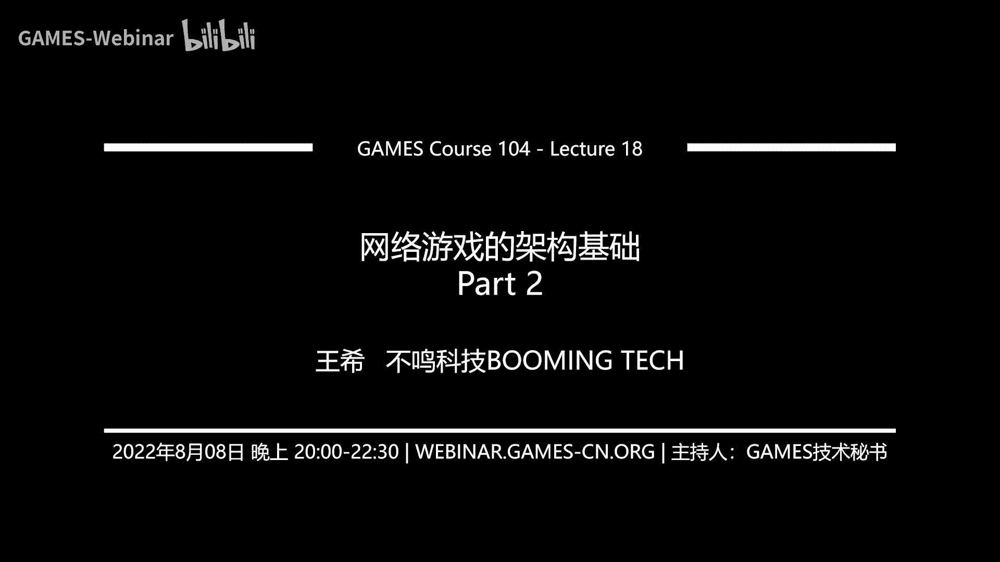
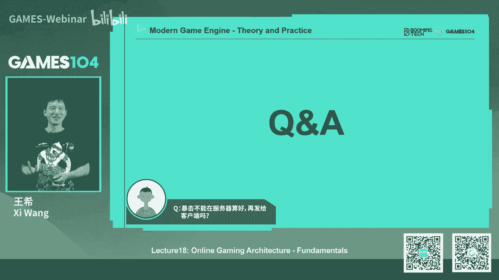
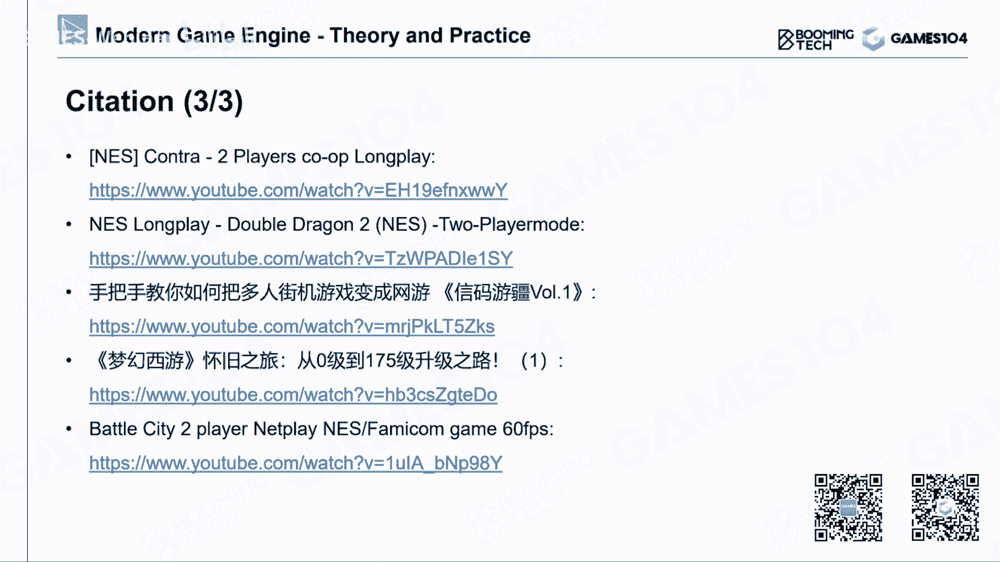
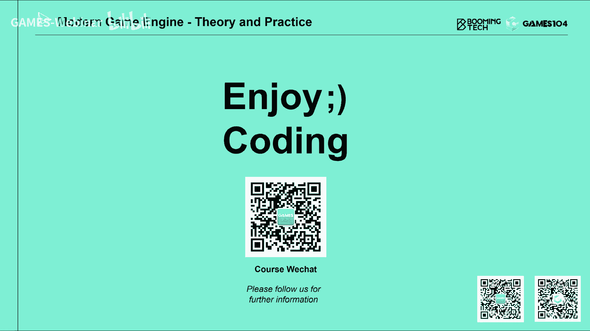

# 🎮 课程18：网络游戏的架构基础 (Part 2)

在本节课中，我们将深入探讨网络游戏的核心架构，特别是游戏世界如何在不同玩家之间保持同步。我们将介绍几种主流的同步技术，分析它们的原理、优缺点以及适用场景，帮助你理解现代在线游戏是如何构建的。

---

## 🌐 网络游戏架构概览

上一节我们介绍了网络基础，本节中我们来看看游戏如何利用这些网络连接来构建一个共享的虚拟世界。网络游戏的架构主要决定了数据如何在玩家和服务器之间流动。

以下是几种经典的网络游戏架构：

*   **P2P (Peer-to-Peer) 架构**：所有玩家客户端直接相互连接，彼此广播状态。早期局域网游戏（如《星际争霸》、《魔兽争霸3》）常用此架构。其优点是开发者无需维护中央服务器，但对网络稳定性和玩家主机性能依赖度高。
*   **客户端-主机 (Client-Host) 架构**：从众多玩家中选出一台性能较好的机器作为主机（Host），其他玩家连接到这台主机。这可以看作是P2P架构的一种特例，在《反恐精英》等游戏中常见。优点是降低了开发商的服务器成本，但主机的性能和网络状况会影响所有玩家。
*   **专用服务器 (Dedicated Server) 架构**：游戏厂商提供专门的服务器来运行游戏逻辑。这是目前大型多人在线游戏（MMORPG）和竞技游戏的主流选择。它能保证游戏世界的强一致性和相对公平的网络环境，但开发和运维成本高。

对于大型商业游戏，网络拓扑结构会更加复杂。为了优化全球玩家的体验，游戏公司会在世界各地部署接入点（PoP），玩家就近接入，再通过高速专线连接到核心服务器，形成一个高效的骨干网络。

---

## 🔄 游戏同步技术

理解了基础架构后，我们来看看游戏同步的核心技术。当多个玩家处于同一个虚拟世界时，如何让他们看到的状态保持一致，是网络游戏引擎面临的最大挑战。

游戏同步主要有三种技术方案：

### 1. 基于快照的同步 (Snapshot Synchronization)

这是最古老、最直接的方法。其核心思想是：**客户端只负责发送输入和接收渲染**，所有游戏逻辑的模拟都在服务器端完成。

**工作原理**：
1.  所有客户端将本帧的输入（如按键、鼠标移动）发送给服务器。
2.  服务器收集所有输入，在一个逻辑帧内模拟整个游戏世界。
3.  服务器将模拟后整个世界所有对象的状态（位置、血量、速度等）生成一个“快照”。
4.  服务器将这个快照广播给所有客户端。
5.  客户端收到快照后，简单地将所有游戏对象（可视为提线木偶）摆放到快照指定的位置，然后进行渲染。

**优化**：为了减少数据传输量，通常只发送状态发生变化的部分（Delta），而非完整的快照。

**优点**：
*   架构干净简洁，服务器逻辑清晰。
*   客户端作弊空间小，因为所有状态由服务器决定。
*   理论上计算总量最低（世界只模拟一次）。

**缺点**：
*   严重浪费客户端强大的计算能力。
*   网络带宽要求极高，尤其是玩家数量多时，服务器上行带宽压力巨大。
*   客户端体验不“跟手”，因为操作需要等待服务器往返。

**公式/代码概念**：
```
// 伪代码：服务器生成快照
GameSnapshot generateSnapshot(WorldState world, List<PlayerInput> allInputs) {
    world.simulate(allInputs); // 用所有输入模拟世界
    return world.captureSnapshot(); // 捕获世界状态
}
```

### 2. 锁步同步 / 确定性同步 (Lockstep Synchronization)

这种方法的核心是**保证所有客户端在完全一致的初始条件下，根据完全一致的输入序列，进行完全一致的模拟，从而得到完全一致的结果**。服务器只负责转发输入指令。

**工作原理**：
1.  **初始化**：确保所有客户端游戏初始状态（随机数种子、角色属性、地图等）绝对一致。
2.  **收集输入**：每个客户端将本帧的输入发送给服务器。
3.  **同步转发**：服务器等待收集齐所有客户端的输入（或超时），然后将这包输入广播给所有客户端。
4.  **本地模拟**：所有客户端收到相同的输入包后，在本地独立进行游戏逻辑模拟。
5.  重复步骤2-4。

**优化 - 桶同步 (Bucket Synchronization)**：为避免因个别玩家网络延迟卡住所有人，服务器设定一个时间窗口（如100ms），只收集该窗口内的输入，超时未到的视为无效操作。这牺牲了部分一致性，换取了实时性。

**核心挑战：确定性 (Determinism)**
锁步同步要求游戏逻辑具有高度的确定性。这意味着相同的输入必须产生完全相同的输出。这在包含浮点数运算、随机数、复杂物理模拟和不确定执行顺序的现代游戏中极具挑战性。

*   **浮点数**：不同平台、编译器的浮点数运算结果可能有细微差异，需要使用符合标准的数学库或改用**定点数 (Fixed Point)**。
*   **随机数**：必须使用相同的随机数种子和算法。
*   **执行顺序**：所有可能影响状态的系统（如组件更新顺序）必须严格一致。

**优点**：
*   带宽需求低（只同步输入指令）。
*   非常适合操作敏感、要求绝对公平的竞技游戏（如MOBA、RTS）。
*   易于实现录像和回放功能（只需记录输入序列）。

**缺点**：
*   实现确定性逻辑非常困难，调试复杂。
*   所有客户端拥有全游戏状态，反作弊（防“全图挂”）难度大。
*   断线重连后，需要追赶大量模拟帧，体验可能不佳。

**公式/代码概念**：
```
// 伪代码：确定性模拟循环
void deterministicSimulationLoop() {
    Random.setSeed(globalSeed); // 设置全局随机种子
    WorldState world = initializeWorld(); // 确定性初始化
    while (gameRunning) {
        InputPackage inputs = receiveInputsFromServer(); // 接收同步的输入包
        world.simulateFrame(inputs); // 用相同输入进行确定性模拟
        render(world);
    }
}
```

### 3. 状态同步 (State Synchronization)

这是目前大型网络游戏最常用的方法。其核心思想是：**服务器是权威（Authoritative），维护唯一正确的游戏世界状态；客户端是部分状态的拥有者，并预测自己的行为，但最终以服务器裁决为准。**

**核心概念**：
*   **权威服务器 (Authoritative Server)**：服务器是游戏世界的“上帝”，所有关键判定（如是否命中、伤害计算）由服务器说了算。
*   **复制 (Replication)**：客户端看到的其他玩家或物体，是服务器权威状态的一个“复制品”。
*   **客户端预测 (Client-side Prediction)**：为了消除操作延迟感，客户端在发出操作指令时，立即在本地预测结果并呈现。例如，按下“前进”键，角色会立刻向前移动。
*   **服务器调和 (Server Reconciliation)**：当服务器权威状态返回后，客户端将本地预测状态与服务器状态进行比对和调和。如果预测错误，客户端需要“纠正”自己的状态（如被拉回原地）。

**工作原理**：
1.  玩家A（权威端）执行“开火”操作，客户端立即本地播放开火动画（预测）。
2.  同时，“开火”指令发送给服务器。
3.  服务器进行权威判定：是否命中目标B。
4.  服务器将判定结果（命中/未命中）以及相关状态更新（A的开火事件、B的掉血）广播给所有客户端。
5.  所有客户端（包括A）根据服务器指令更新世界状态。如果A的预测与服务器结果不符，则进行调和。

**优点**：
*   服务器拥有完整状态，防作弊能力较强。
*   天然支持状态裁剪（AOI），只同步玩家感兴趣区域的信息，节省带宽。
*   不要求客户端逻辑完全确定性，开发相对灵活。
*   适合复杂、玩家多的游戏世界（如MMORPG）。

**缺点**：
*   网络延迟会导致“预测错误”和“状态拉回”，影响体验。
*   架构比锁步同步复杂，需要处理预测与调和。
*   “愚蠢客户端问题”需要精心设计预测算法来缓解。

**公式/代码概念**：
```
// 伪代码：客户端预测与调和
void clientMove() {
    // 1. 用户输入，立即本地预测
    Vector3 predictedPosition = localPlayer.predictMove(input);
    // 2. 发送指令到服务器
    sendToServer(new MoveCommand(input));
    // 3. 将预测状态存入缓冲区，用于后续调和
    predictionBuffer.save(predictedPosition, currentTime);
}

void onServerStateUpdate(ServerState authoritativeState) {
    // 4. 收到服务器状态
    // 5. 调和：查找缓冲区中对应时间点的预测状态
    PredictedState myPrediction = predictionBuffer.find(authoritativeState.timestamp);
    if (myPrediction.position != authoritativeState.playerPosition) {
        // 6. 预测错误，以服务器状态为准，平滑纠正
        correctPosition(authoritativeState.playerPosition);
    }
    // 7. 丢弃已处理的预测缓冲区
    predictionBuffer.clearUpTo(authoritativeState.timestamp);
}
```

---

## 📊 同步技术对比与总结

本节课我们一起学习了三种主流的游戏同步技术：

*   **快照同步**：概念优美，一致性最强，但对带宽要求苛刻，已较少用于实时对战游戏。
*   **锁步同步**：追求极致的公平性和确定性，是高端竞技游戏的理想选择，但对游戏引擎和逻辑的确定性要求极高，实现和调试难度大。
*   **状态同步**：在一致性、实时性、开发复杂度和反作弊之间取得了良好平衡，是目前大型多人在线游戏和许多对战游戏的主流方案。



选择哪种同步技术，取决于游戏类型、设计目标、团队技术栈和运营资源。动作竞技游戏可能偏爱锁步同步，而大型开放世界游戏则必然选择状态同步。





理解了这些基础，我们知道了游戏世界如何“同步”，但要让一个网络游戏真正流畅运行，还需要解决更多问题，例如：位置如何平滑插值？技能判定如何精确？大型世界的数据如何分发？这些将是我们后续课程探讨的内容。