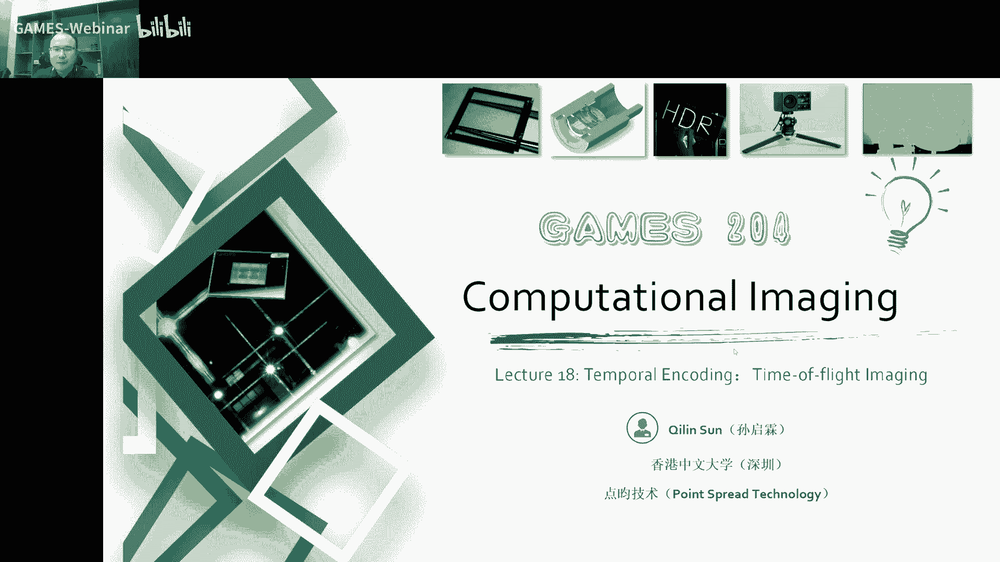
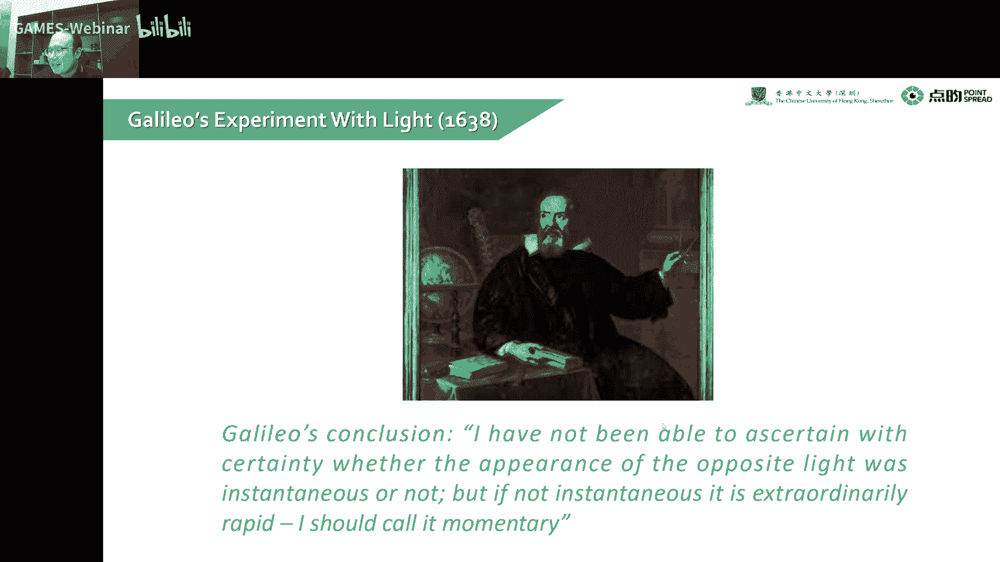
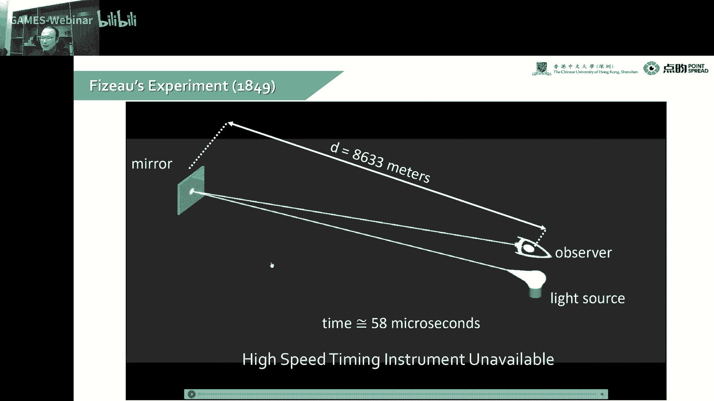
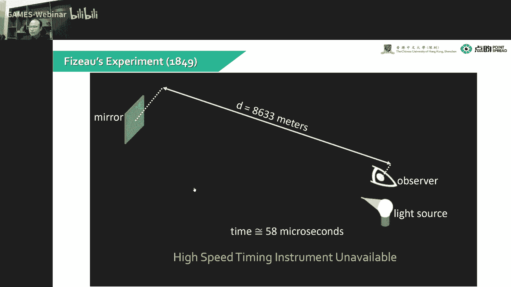
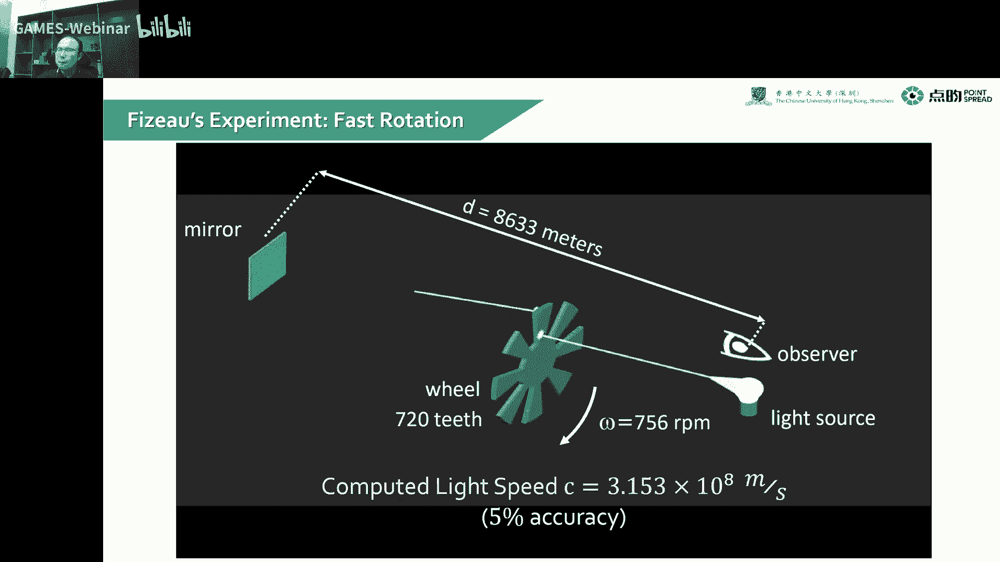
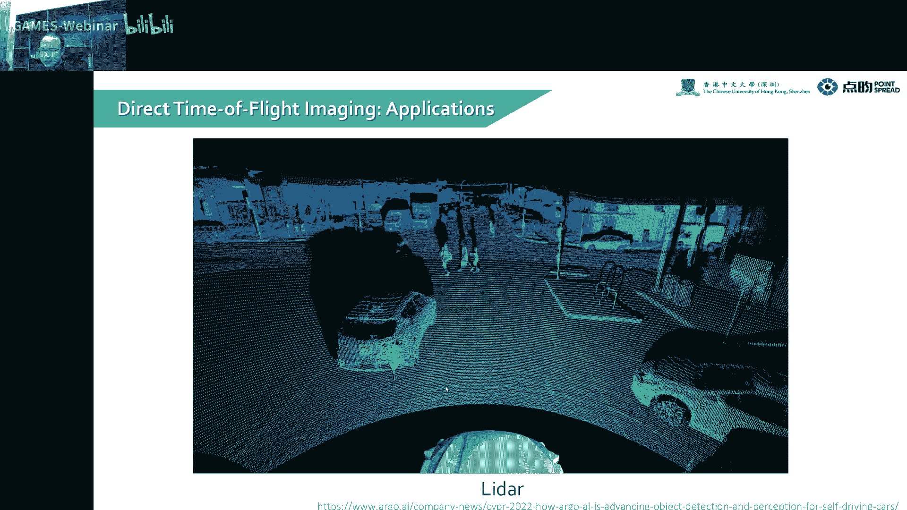
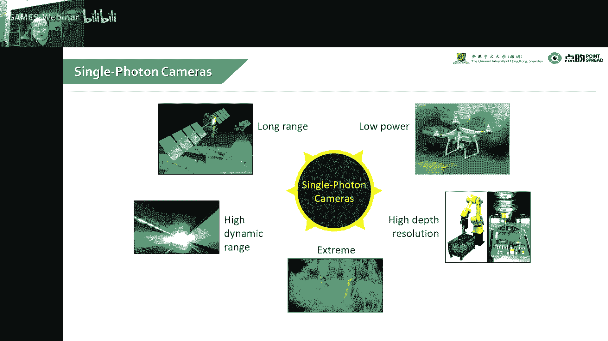
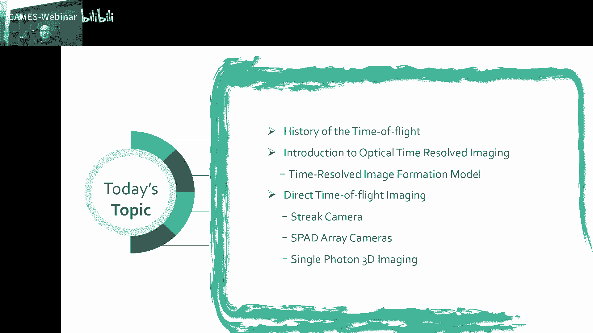

# 18.时域调制、飞行时间法 ｜ GAMES204-计算成像 - P1 - GAMES-Webinar - BV1se4y1g7zt

好了啊，这个时间到了时间，欢迎亲爱的同学们来到gp 204，今天要给大家分享了一个主题是temple encoding的第一课就是time of flight，里面积。

我们整个呃temporary coding大概分几个part，第一个大的part就是嗯我们这种呃调制波主动发光了一个，他们flat image。

然后我们下节课会涉及到一些induct time flies，就是我们所说的continuous with time flies，当然这个continuous wave的time fly会比较复杂。

无论是从原理上到最后的处理上会比较复杂啊，这个可能会分两节课到三节课给大家详细的讲解这个time of flight image嗯，这里面到底是涉及一些哪些技术，到底需要哪些纠正，才能真正的运用到我们。

比如说车规啊，或者是工业的场景里面，因为我自己也做这个他们flaming的相机，所以说啊对这里面整套的链路会比较熟，这个是会给大家啊深刻的讲解一下这个整个他们flat imaging这一块。

也做了很多director flight，time of flight跟indeer flight的一些内容啊，今天就给大家分享一下这个temple encoding的第一课，但这个主动光发射照明之后。

我们还会讲到一些像，coded coded bucket camera，这个叫to bucket camera或者modebucket camera，或者是一些食欲的一些调制啊。

那个会是那一部分的一个temple encoding的课程的部分。

呃首先呢这一课会给先给大家呃介绍一下整个time fly的历史，然后再给大家就是从头推一遍，我们这个optical time resolve imaging的一个啊物理的一个模型。

我们通过这个物理的模型，我们知道这个基本的一个成像的一个模型，我们我们就可以去解决一些比如说dirt fly image的一些问题，然后呢说到这个飞行时间的一个成像啊。

我们就不得不再给大家设计一些相关的一些探测设备的呃，一些基础知识，还有一个现在的目前非常热门，非常主流的一个spider arcamera，就是single photo avenue的r啊。

翻译成汉语就是单光子雪崩光电二极管阵列啊，这个大家学光电的朋友可能会对这个啊，这个雪崩光电二极管会有一些印象，当然像那个光电倍增管呃，也是呃可以呃做到一个单光子响应。

但是国内边总管很难做成一个相机的一个呃二维的一个阵列，这个是非常困难的，然后会给大家讲一下整个呃单光子3d成像的一个案例，这个是一个非常经典的一个案例哈，首先呢说到这个探索fly成像的历史。

就是它的一个基本原理，就是我们啊比如说这个从这个物体a这个人a啊，然后到这个人b我这个时候因为以前我们把做光学成像，并没有考虑整个光飞行的一个速度问题，当然这个时候我们就认为光的速度是有限的啊。

这个时候今天我们就把这个光的速度啊，就认为它是有限的，它就是一个常数，虽然它很快啊，但是今天我们是有办法把它给测出来的，我们这个光诶这个从a发出去，然后经过了一段时间，唉。

我们这个最后这个光在这个t时间走的距离就是我们的v乘以t啊，这个v是考虑到介质的，就可以认为是c。

然后说到这个他们fly的美景，我们考虑到我们自然的情况，就是很多波呀，比如说我们这个可爱的这个小蝙蝠发出一速通，这个发出一束超声波，然后我探测比如说前面有没有昆虫啊，来探测这个回拨。

通过来这个回拨可以刺探到这个昆虫的一个三维位置，这样的话我们可爱的小蝙蝠就可以对这个昆虫来进行快速的捕食，但同样的一个呃就是超声成像的原理也发生在我们的呃水下，特别是海洋里面，比如说我们的啊。

这可爱的这个小海豚也是可以发出超声波啊，发出超声波啊，这样水下这个还是有一个问题一定的问题啊，水下因为它光学很难在水下传播，我们无论是激光啊，嗯还是有一些传统的光，因为我们之前上课也讲到过啊。

一个共聚焦的一个照明的一个kiss，就在水下成像啊，受到水体啊，特别是浑浊的影响，水下的光电成像是非常困难的，所以说嗯后来大家就是比如说大家的潜艇啊，鱼雷啊，都是通过仿生原理。

我们利用声波来进行物体的探测，当然这个声波也有它自己的局限性，就比如我们分辨率不高啊，就探测速度不够快，因为声波啊水里面大概就几百米的一个水平。

这是我们呃time of flight in nature的一个表现啊，这个他们fly不只是生，不只是啊光博啊，还有很多声波，但你其他的波地震波也是啊，大家很多啊，学那种地质的朋友啊。

会可能会经常用f t t t来去探测我们地质的结构啊，这个本质上也算是成像的一种啊，只是它不是光学成像。

当然说到这个整个我们测光的这个过程，但不得不得不提一个啊伟大的先驱者呢就是伽利略，那伽利略也是最早的呃，想办法去测这个光足的飞行速度哈，那个时候人能意识到这个光速光的速度是有限的，已经啊非常困难了。

因为我们并没有任何的知识呃，来去证明我们这个光是有它的速度是有限的，所以说这个呃伽利略当时就做了一个非常大胆的一个假设。

当我们到了1849年的时候，我们在fl都做了一个实验，他是怎么做实验，它是通过诶把一个镜子放到了8。633km之外，我们有一个光源，然后在一个观察者这，我们可以用手去掐这个表哈，去掐这个表。

然后来呃最后算一下这个往返的这么一段的一个时间，当然那个年代哈我们就是心虚了算了，我来回8。3km这么一个需要花大概58ms的一个时间啊，那个时候这个大家设备非常简陋啊，就是无论是秒表啊，还是观察者呀。

还是我们触发的这个啊是非常简陋的，那个时候嗯就没有办法很精准的测量，我们这个呃8。3km来回的这么一个时间哈，这个时间差是非常难测的。

后来啊就是这个老哥对这个整个实验进行了一个升级。

因为我们很难去控制这个开关的一个嗯就是精准的计时吧，我们就是以前的那些表啊，要记到呃毫秒微秒是非常困难的，不像现在我们点一下就可以记得非常精确，那个时候他用了什么办法呢，他用了一个呃比较密的齿轮。

对我们知道这个齿轮转一周大概是什么速度诶，我这个光打出去被这个齿轮的一个叶片遮挡，然后再返回来被观察者知道诶，我们就可以通过这个齿轮来放大时间的精度，好放放大时间的精度。

通过这样呢我们就可以拿到一束一束pose的一个light，就是我们呃这种pose的light，诶这个时候通过这个齿轮啊，大概当时用了720个齿的一个齿轮，然后欧米伽速度是256转，756转每分钟。

最后大家算得了一个呃3。15乘以十的八次方的一个速度，当然这个速度已经是非常接近真实的光速了，可以达到5%的一个accuracy，当然这个要说到这个测这种嗯就测光速这个实验哈。

就是以前呢可能大家做过那个物理竞赛的同学们可能看到过这个题啊，它是通过一个旋转的一个八棱镜啊，也不是八棱镜八倍镜了，诶我通过这个八面镜的一个旋转来去精确地放大我们这个时间的弧度。

时间的这个呃计时的一个精度啊，当然那个时候也都是比较古早的一些做法，测试时间不是特别精确，我们可以到5%的一个光速的一个误差。

当说到我们呃要本身哈，我们要回顾一下这个整个广场的一个方程。

当然我们前几节课我们讲到了，我们这个全光函数，就我们自然的一个光大概是有九个维度吧，我们目前认为是九个维度，将这个全国函数到底有多少维度，一直大家都没有一个定论，我们课上就认为是九个维度。

我们可以看左边这张图，我们他们resolution就从最早的古早的毫秒级呀，到微秒级啊，到纳秒级啊，到今天呢我们的测量精度可以到皮秒级，就有一些产品嗯，像pico count啊。

叫叫叫什么count都想不起来了，欧洲的一家公司，它的一个spy的传感器是可以做到50秒的一个呃，就是tom jor就是50秒的一个误差，当然我们通过一些算法优化。

可以做到一个sao second的一个呃，一个呃小people sep的一个精度啊，就我们知道一个皮秒光只走了0。3个毫米，一个来回时间不是0。3mm，一个来回时间是0。15mm。

这个精确度是非常高的哈，但为了我们获得有时候获得更多的维度，我们有时候经常会用到multiview，比如像双目啊或多木啊，双目经典就是双目立体相机诶，多目就是我们之前看到的一些呃光场相机的阵列啊。

这个就属于多目的一个范畴啊，唉我们最后实际上呃是想把更高维度的一个信息恢复出来，当然我们今天讲到了一个碳膜，fly体面积是通过时间的维度来获取我物体的呃就是每个点啊，在三维空间中的一个呃深度信息哈。

我们可以直接测量就是一个呃光的来回来测量这个深度信息，咱说的方法上我们就五花八门啊，我们可以通过物理学的方法呀，或者是就optimization的方法诶。

各种各样的东西来把我们最后想要的一个啊三维模型来呈现出来，哎这个图接力了，最早最早就是像伽利略啊，roman啊，牛牛顿呢就发现了这个光在物理传播中的性质诶。

到了father le计算了一个啊那个光的一个传播速度诶，到了爱因斯坦发现了光电效应，我们就可以通过这个光电效应来来做我们的光学传感器，1969年就是70年代初的，那时候。

c c d跟cmos技术出现了，就我们真正的呃有了图像传感器，当然到了最近这20年吧，就是2000亿以后，我们就有了一些高精度的一些带有计时功能的这个图像传感器啊，还有一个time flix ming。

这是一个失败的，这个我们后面会呃从一些物理原理上来给大家深度的剖析，我们这个今天就开始给大家正式的去讲解这个optical time resolve imaging啊。

就是我们通过呃光学的一个方法来测量光的一些呃，在时间维度上的调制与解调哈，就这是我们目前为止呃一些呃常见的一个time of time resolve imaging hardware。

我们git camera，这是一个phoenix做了一个git camera，它通过一个快速的一个g，快速的一个ga来实现这个我们在呃时间维度上的检测，当然啊这是一种传统的一种啊摄像机啊。

它只是它的那个呃这个git速度会比较快，我可以在某一个瞬间打开，然后在一个很短的一个时间内关上那另一种常见的器件呢，但现在也不是特别成熟，没有大规模产业化啊，这个就是sparr。

就是single photo ma lei do，single photo mileage do的a也就是呃所谓的光电倍增管啊，不对，这个雪崩光电二极管啊，把它做成阵列。

就是一个image sensor，他是工作原理是什么呢，是我的一个呃这个photo die的公司都在反向击穿区诶，我一个光子来了，我去触发这个啊血崩管诶，触发他的血崩效应，一个光子来了，然后产生两个电。

产生一个电子，一个电子在触发两个电子，三个电子，然后像那种链式反应一样，我就因为他是工作在反向击穿区嘛，它非常容易雪崩诶，这个时候一个光子就可以触发它雪崩诶，我整个电路就击穿了。

击穿了就可以产生一个非常强的一个电流脉冲，这个时候我们可以通过后面的一个电路来把这个脉冲给记住，这样的话我们就可以把一个模拟的一个光子的检测，比如说像我们传统的一个摄像机。

它是对电荷对在那个就井里面去积分，但是这个spidery就是来一个光子产生一个技术诶，这个时候我们就有了技术型相机，这就也就是从模拟到数字的一个月变啊，这是一个呃这是一个伟大的时代的进步哈。

它类似的原理哈，大家可以关注一下，还有一种呃类似于这种spider的，它也是一种脉冲型相机啊，当然跟这个原理不是特别一样，他是用这种传统的呃这个呃这个cmos或ccd的一个传感器。

我们后面再跟着一个快速的比较器，这个时候也是有一个就也是一种技术型相机啊，当然这种呃也有这种spa的呃，做不到的地方，比如spider，我们有死去时间呀，像这种呃通过这种比较气的，就没有这种死去的问题。

这个是呃北大的黄铁军老师有一个叫sparking camera，大家可以关注一下那个技术哎，挺有意思的，大家同学感兴趣的话，也可以联系黄老师去做一下这一块的，有search啊，比较高级的一些传感器哈。

就是这个光电倍增管，这光电灯管一经问世就惊为天人啊，他是通过一个什么原理呢，它有一个阴极射线，一个阴极，我一个光子打到这个阴极上，就会产生一对电子，然后我们中间会有很多的电极。

然后又产生更多的一些电子诶，再轰击那个电极，产生更多的电子哎，最后这个东西就形成了一种叫光电倍增管的东西，当然这个光电绿灯管就是我们上学那会儿还只有日本的这个哈巴玛索，也就是日本的冰松诶。

可以生产这种光电倍增管啊，当然这个是比较难做成阵列的哈，目前大部分的一个光电倍增管都是单个的一个呃，作为一个单管使用好，但这个玩意儿也比较容易坏，所以后来呃这个spider array就占据了上风了。

这个光电倍增管本身呢，它的一个响应速度跟它的一个噪声水平都是非常出色的，呃但是就是因为它很难集成的一个问题啊，就渐渐的被spa的呃占据了上风，此外本身还有一个大cos，就是我黑的时候也是会有黑暗技术的。

但是他有他就是呃体积小，易于集成，我随着工艺的不断进步，哎我的造成水平也可以不断的向光电倍增管去迈进，然后另一种东西呢就叫呃log in sensor。

也就是我们所说的一个continuous wave，他们fly sensor，唉，这是我们自己做的一款产品啊，这应该是目前深度相机里面的一个呃比较呃高段位的一个产品。

这个是通过一个呃光飞行的一个相位的测量来去估算它的一个深度，这个我们下节课会讲到这个lock in sensor，也就是continuous wave sensor的一个原理。

那最后一种a这种是非常非常昂贵的一种相机，诶，这个叫rike camera，这个我最早以前看过一篇论文啊，就是呃mit的romance russia的一个就是我们测这个猫可能大家还有印象哈。

就是一个光打过了一个可口可乐的瓶子啊，那个过程就是一个street camera记，就是记录下来的，我们后面会讲到这个条纹相机到底是怎么工作的，这是一个非常有意思的一个啊，这个人类的伟大发明了。

当然我们的整个的一个time resd，这个formation model就是我们本身光线它有自己的一个传播方程，我们即为pt这个光线打到我们的场景啊。

就是无论是啊一个你的就是你的发射出来的光源p t是什么样子诶，我们它会有一个呃场景对它的一个响应，我们记为ht跟t prime，经过我们这个reflectance，就是经过我们这个场景的一个反射哈。

表面的材料性质啊，我们这个就可以把它记为rt，这个时候就经过我们的一个镜头，再到我们的传感器，我们本身的镜头加上传感器啊，本身这个是有一个呃叫device response function。

我们记为f t t prime，这个是我们还是停留在我们就是传感器内部的情况诶，我们这个时候就可以通过a d c啊，就拿到一个management，就是也不是a d c啊，就是我们最后一个模拟信号。

而我在经过我的一个呃这个传感器，无论是spa呀还是一个a d c，你就可以把它量化拿到一个数字的一个嗯就是采样的一个结果哈，我们在通过这个数字采样的结果来经过一定的一个呃重建的一些算法。

我们就可以把这个same response function，也就是我们最后想要的重建的一个场景的一个情况来来对它进行恢复，这是整个的一个完整的一个tamara soft image的一个基本链路哈。

基本上所有的他们resolve image都是要follow我们这整个的一套流程，当然虽然他最后的处理方法啊会打通，会就是很不一样，说到这个problem function呢。

也就是我们最后发出来的光源到底是个什么样子，其实啊这个我们其实最后我们的激光器啊，其实发出来的光它不好说哈，他不好说，就我们通常认为就是简单一点，就是我们比如说一个一毫瓦峰值功率的一个皮秒激光器。

我通常工作在就是正常的工作区间的时候，我们可以认为它是一个近似的高斯模型啊，它还有自己的半高宽哈，我们要呃这个给不一样的功率，它会有不一样的半高宽，当然我们比如说这个皮秒激光器激光功率特别高的时候。

我们看右边哈，看到一些虚线，比如说我们这个这个这个3。7毫瓦哈，3。7毫瓦，这个功率最高的，这个时候诶，我这个整个的光功率高了，但是我的峰值功率并没有高太多。

因为我的整个的这个发出去这个激光的一个promise function，他受到这个本身半导体工艺啊，或者是呃你这个锁模调q啊，那种固体激光器啊，或者是气体不行哈，气体那个速度太慢了。

受到它的本身半导体或固体激光器的一个工艺问题，它的那个它的那个波形啊，就会有很多次刺激的一些调刺激的一些波哈，这个叠加在一起诶，这个时候我们整个形状就不是高斯了嘛，我们觉得高斯挺好，高斯挺好。

但是你最后你做不到是吧，这个时候咋办呢，这个没有办法，大家无论怎么样，还是要把这个波形记住，因为这个是你呃最基本的一个最基本的一个啊，那个就发出去的一个problem嘛，当然我们最后描述的时候哎。

通常是可以，你可以用一个be plan来去描述它，然后呢我们这个基本上我们有一个高斯的底儿，也可以用一个multi高深或者是一个高深。

expotential mixture的一个model来描述我们的一个probing function啊，这个一旦出面没有出面，同学问了一个continuous wave。

怎么解决face working的问题，诶这个我们还真搞过哈，这个大概有两种方法，第一种方法就是那么降低频率啊，就比如说100Hz的100兆的一个100兆的一个这个光波，我们打出去之后。

我们能测量的范围是1。5米，哎你要是偷个懒呢，你把这个频率降低，你降到十就是十兆赫兹，这时候我们可以测量的一个wpp的范围就是15米，但另一种方法就是我们选取两种不一样的频率。

我它的最小公倍数就是它的测量范围啊，我们这个比如说选到60兆等100兆，一个是2。5米，一个是1。5米，他俩那个最小公倍数啊是7。5，也就是说我们这时候测量范围可以到7。5米啊。

这个是可以解决face market的问题啊，这个ping function是怎么测得的啊，这个是可以用嗯，一般是用一个非常高精度的一个spa或者是一个管理民族管去测它，这个是用一个单点的去测。

当然你要是时间分辨率特别高的话，也不好测，所以说我们拿到了profile，通常就是嗯几10p秒到几百平秒的这么一个啊这么一个分辨率，当然如果大家有钱的话，可以搞个条纹相机哈。

这个可以是到零点几几秒的一个呃，这个这个时间分辨率哈，它是牺牲了一个空间维度来换取时间的一个思想，这个我后面会讲到，那she says restaurant function，这个有时候也掉sf啊。

这个没啥，它就是一个这么个响应，来我们来说到关键的地方，就是我们发射出我们这个先考虑这个direct flag，面镜通常是打出一个pose，就我们现在都假设高斯哈回来发出去是高斯回来还是高斯。

但是举个例子啊，我们当我们遇到了墙角呢，我们俩会经过两次反射，或者是就一根光哈，只能说就光用根说这是不对，一根光线诶，我打过去再经过另一个墙面再反射回来。

只有我整个传感器是接收到了直接光和间接光的一个叠加，这个时候我们就可以看到这是两个高斯的一个叠加，但还有一种情况就是我的墙角比较小，诶，这个时候诶就会有一个这么尾巴的那种感觉哈。

这个也会产生尾巴一个感觉，然后下面进入今天的一个正式的主题，叫direct time of flight image，假设我们有一个光源哈，这一个光源就一般是激光，可能是皮秒激光呢，也可能是纳秒激光。

就产生一个pose哈，诶我就产生一个pose，这个pose飞飞飞飞到这个场景上，哎，经过反射，我们最后在我们的一个图像传感器上就测到了这个pose是吧。

本身呢实际上我们这个emit的一个light pose经过一定的时间传播，诶，我飞飞飞，直到被这个呃这个这个就是图像传感器诶捕捉到，就是我们相机捕捉到诶。

这个时候我们这个假设这个source跟这个参数行系在一起哈，这个画出来画到b块也没问题啊，这个光总共飞行了，从出发到回来这么两对，所以说我们到这个点的一个场景上，这个点的一个就是深度哈，叫depth。

实际上就是c a除以二套，对不对，这个就是它的一个呃这个它的一个深度好，这个套是他的那个周，这个周期f实际上就是f就是频率，就是光的一个调制频率，你可以就是只能理解为t分之一哈，t分之一哈。

诶这个时候我们就可以拿到诶这个最后的深度啊，这个写错了哈，这个应该是2c乘以套哈，大家注意一下，这个写错了，direct time fly image。

最基本的一个应用就是我们今天所谓的拉达好，还是flash的lia也好，都是一个呃基于直接time fly imaging的一个case，唉，这是我们一个呃比较好的一个叫叫阿狗的这个这这这个这个宅公司啊。

这不是这是cvpr的一篇论文哈，来做了一个lider才可以比较好的获得一个大范围空间内的一个点云，direct time flat imagine。

说起原理是非常简单的，但是考虑到我们器件本身诶，这个简单的问题就会变得复杂一些哈，我会讲到这个器件到底是为什么会变得复杂，首先我们考虑到直接方的时候。

我们这个sensor是可以拿到一个最短的第一个pose，基本上第一个pose最近的地方就是它的一个direct path，对不对，然后呢这个光还会被漫反射开，大家学会图形学的时候呃，会学到这个材料表面。

我们用一个b r d f function或者b s s d f function来描述这个呃，材料本身表面反射的一个性质哈，经过这个多次反射诶。

多次反射我们这个光啊就会收到一系列的啊这么一种多次反射的光啊，这个就很烦哈，也就是我们最后，收到了直接反射的一个光，我们可以记为这个红色的这个pose，这是我们直接测量的第一个intensity。

那这是模拟信号，没有量化，这个大家注意一下，后面多次反射的光通常是会产生一个呃非常这个形状也不确定啊，但是跟场景啊直接相关的一个播报哈，这个播报是会十分影响我们的这个距离的测量哈，这个怎么影响的呢。

说到这个打他们flaming，首先我们要说一下如何才能实现这个直接光的一个测量，首先哈我们要有一个比较好的光源，就是要拿到一个非常呃expensive的一个laser。

就是我们需要一个短波的一个pico second laser，同时呢这个它的峰值功率他一个一个脉冲啊，通常要一个到一个叫米卡，周二周二就叫赵焦耳级的一个量级哈，这个它的峰值功率是非常非常大的哈。

所以这个时候他是第一个要求，第二个要求呢是需要我们的测量设备，也就是我们的相机或者是一个啊一个条形的一个相机哈，那种便宜一些，这个它需要一个非常高速跟高高度的范围的一个呃测量能力哈。

高速就是因为我们时间分辨率越高，这样的话我们深度才可以测得更准，比如我一个p秒的一个呃一个p秒的一个抖动哈，我们的这个分辨率差的是0。3mm除以二，我一个纳秒抖动，这个好家伙就是呃0。

3乘一个1000哈，那就是30个厘米啊，30个厘米主要是15cm的误差，这个误差是非常吓人的，诶这个同学问到model deption影响大了呃，这个影响还是非常大的哈，这个呃需要大家后面的算法去处理。

要不处理的话，要简单的用个什么执行法啊，这个影响会非常大的，这个说到这个他们flat major，你换个说法，有时候也可以叫trinity，main，叫顺态成像哈。

就是我们最有名的例子就是一个light in flight image，就是我们记录光线是怎么在空间中飞行的啊，这个实验我以前也做过，是用我们自己的一个spider阵列啊。

跟自己的皮秒激光器一起来记录啊，这个光线到底是怎么飞行的啊，当时我是记录了一个诶这个光线聚焦的这么一个过程啊，本身呢就是我们这个超快速成像啊，就是它是一个非稳态的一个成像，这个我们是要记录到这个非稳态。

就是这个光在这个空间中传播到底是什么样子诶，我们也可以用这种原理来track，我们去来追踪我们这个播的一个拨弦在什么地方，就是我这一束波，我最前面那个波在什么地方，因为我光已经非常快了嘛。

当然这个就是等效于你对这种非常短的一个pose，短的lipose进行成像，我们的城乡基建本身也没有办法做到皮秒哈，我们可以用各种各样的一些啊啊idea啊，去实现这个更高的时间分辨率。

哪怕我们的七件诶顶多就到呃几个g啊，或者是几十个g啊，这个水平啊，我们电子器件比光的器件，那比光学的那个速度是差很多嘛，但是我们可以用各种各样的方法来来提升我们这个测量的一个，最小的时间分辨率能力哈。

但说到这个传送的e美景，其实最早的时候。

这个news and anderson这个人家最早是用那个干涉的办法来记录这个拨弦哈，这是比较古早的一个传送点，image，然后呢98年的时候他又用了一种干涉的办法来测这个transition v。

实际上就是测了一个物体的一个depth啊，这是我们用干涉早期，因为我们成像器件没有那么快，我们可以用啊这种呃眼干涉啊，或者是嗯好了，过税的方法来记录这个波前到了12年的时候啊。

这个mton就搞了一个这个looking around the corner这么一个论文哈，这个当时没引起了轰动，我记得我上高哎，不是我上大二大一大二大二吧，那年我上大二大二那会儿大家就看到一个新闻。

我这一个东西怎么能看到墙拐角后面的东西呢，是吧，这个怎么能看到全国卷后面的东西呢，当时呃就觉得非常不可思议啊，现在想想哎这个自己搞搞也可以，哈哈哈，然后到了13年啊。

这是我们组的一个叫菲利克菜的一个呃一个师兄哈，这个现在在普林斯顿做老师，当时我们是提出了一个用continues wave来做了一个time of flag，main的一个例子哈。

这个比那种three camera会便宜很多，我这个几百块钱的旗舰哎，就可以记录这个transition imaging，这个这个光到底是怎么传播的。

那这里面这些trick我们会后面再讲这个continuwave的地方，会讲到这个非常有意思，到了15年的时候，graphy就开始用spider旗舰哎来捕捉这个光线是怎么传播的了啊。

当然这个这个这个这个图是骗人的哈，这个图是后期渲染过去的，因为这个本身在呃在这个空气中，你这个光线怎么走是看不到的哈，就是看不到的，这个时候是用了它本身在光空间中激发那些粒子是非常弱的，你很难捕捉到哈。

这个是已经后期做了加工的，来给大家示意一下，然后到16年大家就可以把这些呃，spider器件进行了一个三维的一个成像，就是叫first phone image啊，印象很深。

那个时候我最早开始入门做科研的时候，用的就是这种spa相机，当然这个direct time flat美景还是有非常多的应用。

比如说我们最经典的应用就是looking around the corner，就是我们呃这个怎么样看到这个墙后面的一个东西啊，这个那大家感兴趣的话。

我会给大家专门开这么一节课来补一下这个look around the corner，到了后来呢到12年这个中的conner大家不满足，一直看到后面什么东西了，哎想要看到后面的三维场景是什么样子。

诶这个是looking around the corner in 3 d哈，到了18年哈，就是当时有一个师兄叫mt or two，诶。

那个时候他在斯坦福那会儿就做了一个real time的一个real time的一个look，around the corner的一个呃一个问题啊，一定要开哈，这个那就给大家讲一下。

look around the corner上，因为这个那就下节课给大家讲吧，这个直接就是属于这个direct time flat这一章了，但这玩意儿还是可以用于b2 d还是个测量哈，这个也很有意思诶。

我们这个sample经过一个define wall啊，这个经过一个光啊，经过这个一个漫反设备墙，再经过这个三口，再经过一个底层生活，我们通过这个来测诶，我们材料表面的一个b2 df。

当然还有一种就是我们这个光线传播的一个呃分析哈，这个也是一种啊，其中应用当然这个非常多哈，再给大家今天给大家讲这个3d好，然后这个在讲这个3d成像之前呢，还是想给大家就是说道一下这个条纹相机啊。

叫street camera，就是他这个思想啊，让我当时觉得非常惊艳，非常惊艳，本身呢就这个street camera这玩意儿，它一次只能捕捉到一条条纹，但是他用的是一个2d的一个相机。

我先给大家就是掰扯一下它这个整个相机的结构，最前面这个相机啊，它是一个就是一个铁片儿哈，一个铁片，铁片开了一道缝，也就是说我这个相机一次只能捕捉到一个送过来的一个信息啊，就一个一个条状的信息。

所以说这个也是这个street camera的一个名字的一个由由来哈，它叫条纹相机哈，因为他真的一次就只能捕捉一个条，后面呢条后面就是我们正常的透镜哈，然后本身呢我们这里面做了一个管子。

这个管呢也只开了一个缝，也就是说我能保证我进来的光啊，进来的光只能从这么一条缝啊，这么一条缝进到我们后面的一个装置，对这个缝进来之后啊，我们这个比如说这个光子，这一连串的一个光子哈，在12344根光哈。

四个光子按时间序列分别的去进入到这个缝啊，进入到这个缝第一个地方，这个地方就拿到了一个我们类似光电倍增管的一个阴极的一个地方，诶，打到这个阴极上，我们可以把这个光子变成电子。

同时呢我们这个地方用到一个呃，这个叫集，就是一个感光元件嘛，后面会跟一个c c d哈，这是对电子的一个响应的，一个就是类似于啊类似于我们那种嗯荧光的一种片子嘛，就是荧光的一个涂抹荧光的一个薄片。

这个时候我们加了一个高速swap的一个电厂啊，快速高速swap一个电厂，然后我们用这个电子，就是我们这是连续变化线性线性加压的一个变一个电厂，我们这12344个光子，每个依次按顺序变成电子诶。

我在不一样的时间上，我家的电厂的偏压不一样对吧，我们就是这个这个电厂啊，这位同学说的挺好啊，就是把通过电场把这个电子撕开行，撕开到另一个c c c开到一个空间维度上，然后呢通过撕开这个空间的维度。

我们最后用一个二维的相机，一个二维的原本沿着这个调的方向诶，还是这个调的一个维度，但是就比如说记为x，但是y的方向他就是记了我这个跟这个电场电压线性相关的一个啊，空间维度，大家仔细琢磨一下。

这就是我们牺牲了二维图像传感器的一个维度来换取他的时间啊，比如说这个时候我们用了一个672诶，乘以672的这么一个图像传感器，我通过电场呢把这个另一个维度转换成672个小份哈。

这个时候我们就拿到了一个x乘t的这么一个图像啊，对吧，这个就是这个基本的原理，就是牺牲了一个空间维度来换取时间分辨率啊，这个最后我们也可以扫描嘛，这个我们可以扫描这个二维的空间哈。

最后拿到一个xy t的q，那我每一刻我只捕捉到这么一个条文哈，这个这个非常有意思啊，这是一个假说，我们这个最后这玩意儿本身哈我可以做到啊，比如说是100平米的一个分辨率啊，我们电子没有那么快吗。

到实际到头了100平米的一个分辨率，你把它分成672分啊，你就是100平秒再除以600，你可以做到诶，零就是几百个飞秒的一个时间分辨率好，这个就诶非常非常有意思哈哈非常有意思。

这个就极大地提高了人类对时间的一个探测能力，当然我们讲一下我们的主角哈，因为这个呃spa才是呃这个spa，一个才是一个它的这个应用的一个范围更广泛的一个器件嘛，哎这位同学问电场的时间分辨率是多少啊。

这个一般哈，我们目前的电子器件嗯，大概几十个g到几百个g啊，大概是这么一个量级哈，当然这个你要线性变化的过程，它那个变化过程的一个斜坡啊，这个我们变化没问题啊，唉说到这个spa的传感器呢。

本身它有什么优点呢，它也是像关节倍增管一样，可以有单光子响应的能力哈，当第二个地方就是它可以有p秒量级的，大概是50秒到27秒的一个时间分配哈，这个然后第三个优点这个点也没写啊。

它是可以做cmos集成的，就是我们可以用cmos的工艺把它做成一个图像传感器，这款就是我用的第一款这个m p d的意大利啊，这个就叫米兰诺，好像是这跟米兰诺那个那那那个合作的一起的一个spider场景。

当时我用的可能是他们家的第三排，我非常清楚的记住他那个编号是第三台，买过来那个传感器连封装都没有，就裸片哈，裸片直接打线，打到电路板上的，这个非常早期本身呢跟我们一般的这个cmos图像传感器不大一样的。

是这个spider呢本身我们可以看到这个感光区域非常小哈，周围都是电路，我们要有时间转换电路啊，啊还有一些寄存器啊，这都是挺占地方的一些东西，也就导致了我们这个spider阵列想要做非常大的一个氛围。

也是非常困难的，哪怕到了今天啊这个e p f l的那个carbon，那老哥他们现在也就做到了1024x2024，这个分辨率还是四个五二拼起来的哈，这个呃很难做大。

本身它这个呃我们用cmos这个silicon cmos工艺加工出来之后，它这个过程啊就像一个雪崩的一个过程，诶，一个光子产生一个电子，一个电子触发其他电子，其他电荷，其他空穴再采用电子空空血。

然后像一个雪崩一样啊，就就把这个反向击穿在一个就是反向偏置的一个就是光电二极管，就把它给击穿了啊，就产生脉冲，它的一个timer solution可以大概是55~50匹秒。

本身呢这个spa器件啊其实还是有一个比较低的一个呃，dark countrys叫黑暗计数率，这个要给大家科普一下什么叫黑暗计数率哈，就是你这个相机，你这个技术型相机哈，你把前面那个相机盖给盖上了。

就是官方在全黑的情况下，它还是会有一定的信号输出啊，这个就是呃叫dark count，这个类似于我们cmos传感器的一个大current层，这个是一直会有的，但这个现在的基建啊。

这个大countries都比较低了，本身呢我们也可以对这个speed器件加一个git，也就是我在这个我在这个我在这个，然后加一个就选选通，在什么时候，是因为这些工艺的缺陷。

就是我经常我在工作在反向计算区的时候，我受到各种因素的影响，会产生一个就不是因为光子影响的雪崩，比如说有一些嗯不起眼的一些哪些地方的一些额蟹复合呀，呃或者一些电子空穴对的一些变化扰动啊。

或者加工的缺陷都会引起呃这种大胖子，而且每个大家买这个spider阵列的时候要注意哈，你最后用的时候，每个像素点的大counts可能不一样哈，这个大家用的时候一定要特别注意哈，就可以大家提前标定一下。

这个一般出厂完之后就定死了，就是每个pixel的一个dht race，这个是不一样的哈，然后本身最后呢要有一个给大家科普的地方，就是它会有一个死去时间，因为本身我们这个spa的器件啊工作在反向击穿区。

我是有一个电，有一个电容在给它供电，我击穿之后，我这个电容里面电荷就释放光了，结果把电容的一个电压给拉下去了，我想要再使这个器件控控制在反向击穿区，这个时候我就要求我对这个电荷进行充电。

在这个充电的过程中，我们这个本身这个这个speed器件呢就失能了，在这一时段叫不工作诶，这个时候大概充了这个时间需要到1~100纳秒之间，这段时间呢又叫死区时间啊，叫dead time。

这起的名字也非常形象哈，这叫dead time，speed器件本身呢相比于cmos呀，还有现在的一个event camera，还有一个就是quantuimage sensor。

quantuimac跟speed，就是我没有后面的技术电路哈，这个这个这个大家记住就好了，这个spa器件就现在它的动态范围可以做到非常大的，因为是我们是呃技术型相机嘛，它理论上理论上是无限的。

但实际上是有限的哈，这个因为非常high flag的时候，我们这个你死去就饱和了嘛，就饱和了，时间分辨率也可以做到非常高，但是而且可以对极暗的环境下都会有响应，因为我单公子就可以响应吗。

但是他这个数据复杂，他这每次都要出来一个time his gram，这个处理起来会非常困难，那这个耗电量也是比较大哈，也是比较大的。

cmos呢本身就是局限于这个wc range这个timer solution啊，当然对这个暗光情况下也不是很好，像我们这几年流行的一个叫event camera。

event camera本身呢呃呃它是只能捕捉到边缘动态范围很好啊，时间分配比较快，因为数据量少嘛，然后这个cos跟cmos也差不太多，因为这个都是面积钱啊，都是面积前就processing也还好啊。

本身呢但是他对这个暗光响应也不好，也不好，这个这跟cmos都是因为都是都是一家子哈，这都不是很好，这quarter image sensor呢就其他优点基本都有，但是就是cost也是非常高。

但是他那个时间分辨率还是不如spd，大家记住这几个啊，旗舰的区别本身呢我们传统的一个图像传感器啊，就是比如说100~1000个photo，我在经过这个光电二极管转化成电荷，我在这个井里面去积分啊。

但是单光子呢就是我来一个就产生一个脉冲，来一个产生一个脉冲，但说到这个speed我们要说一下，当然我们知道刚才讲到了，我们有1~100个纳秒的一个死去时间哈，就是我们一般可能呃遇到了七间。

大概是50纳秒的死去时间，但是就是我这工作一下，我50纳秒就不能工作了，这个时候我们怎么样来保证我们这个时间的测量精度呢，就我器件还是不是特别快哈，就哪怕现在最快最快的一个g最快的gg宽度也是呃。

我们之前用过最快的宽度，可能就是大概100个皮秒的一个gay的宽度啊，100个皮秒，我们这个光都走了嗯，100个平方光走了大几个厘米啊，这三四个厘米了，这分辨率不行啊。

所以说这个时候聪明的人类又想到了一个非常非常惊人的一个阿迪，这个是借鉴了，就是我们示波器里面借鉴了我们示波器里面有个叫等效采样，叫equivalent time，产品等效采样的一种原理。

就假设我们测量一个周期性的信号啊，就是下面这个input sign，我的器件没有办法做的特别快啊，但是我的相位延时可以做到非常精准，就我没有办法在一个周期内对我的这个信号进行一个完整的测量，怎么办呢。

怎么办呢，就我第一个周期测量这个信号的一个点，因为我是这个信号是周期性的，是可以重复的，第二个周期对这第一个周期产生一个微小的相移，再测一个点，再下一个周期再乘一个微小象一，再加一个点。

直到我经过足够多的周期啊，我把这一个周期性的信号的每一个点都凑过来了，最后形成了这么一个等效的一个波形的采样，这个我们也可以用诶，比如说我们示波器里面就可以用一个嗯。

大概几个g的带宽来获得上百g的一个等效材，大家比如说可能用到便宜点的那个示波器，100兆的一一百兆带宽，当然等效采样率是可以到实际的，就是我们可以到100倍左右的一个呃，就是等效时间的一个采样能力。

类似的原理，也就是我们今天讲到了一个呃time cosle搜索counting，这个跟等效采样的原理基本上是类似的，我们通过这种周期性的测量来精准的，就是但是我虽然时间分辨率到不了特别高。

但是我相位可以做到非常精准，它通过锁相环啊就可以产生一个大概20几秒精度的一个相移，这是我们本身器件所向环就可以做到的，我就牺牲时间，就是重复测量来换取时间的一个分辨率。

这也跟刚才是一camera呃不太一样，这是一种也是一种思想，一种相互牺牲的思想，刚才是牺牲一个呃空间维度来换取时间，这个是形成一个时间来换取时间来重复测量，这个呢我们是重复的打出来这个光波对吧。

我这个开启的时候诶，我这个光子可能在这个时候到了下一个周期，我就产生一个向移，这个git可以产生一个向仪诶，最后我可以把这个整个就是这个要采样了，这个像不断向移。

就是我最后的这个呃实际上就是我们的一个c的一个响应的一个方式，这样的话就可以极大的提高啊，我们这个时间上的一个分辨率啊，它思想就是重复测量，然后每个地方产生一个微小的相移。

但目前为止就是我们最高的一个起点哈，就是实验室的可以做到啊，100万像素就是1k乘以k的一个1024x1024啊，这个比较便宜点，商业化应用的就是iphone来的，大概就是一两百，大概这个分辨率好。

但这个来的还还还有一个小trick和当年拆解过哈，拆解过他是用他那个发光器件哈，是那种可以调制那种b的那个发光器件，嗯这个同学问这个周期性的信号是否可用，这个是没问题的，因为这个信号是你主动打出去的。

这个没问题的，compressive sensing，这个也没问题，这个你这个你就是一直在打这个光网，这个你这个pattern固定住，你一直在打这个光，也就是测量在这个pattern下的一个相机。

你换下一个binary python，你还是这么打光，它本身是嗯，你就相当于多形成一个位置，就是呃本身也就是在一个固定pn下的一个相仪嘛，然后你下一次测量再换一个python。

下一次测量再换一个python，把整个相位全部再扫一遍，这个compressive city是没有问题的，哎说到这个single photo的3d页面镜哈。

就我们呃大家要直接测量的这个来回呢也没啥意思哈，那我给大家说一下，这个直接测量这个来回有什么问题啊，就我们最简单的就直接诶一来一回，我一个stop watch来测量这个回拨的这个时间。

就我们这个time shift，比如说是这么多，我这个你这个来了这个光子就收回来的，光子呢就是这个样子，我们这个第一个光子产生一个脉冲的时候，我就第一个脉冲诶，我就想象到了好理论，好好。

这个就是我最好的一个位置哈，这个直接可以算深度，但这个玩意儿是有非常非常多的问题啊，这是理想的情况下是这个样子，但我们外面是不是有环境光呢，本身是不是有死区的，这些都是一个问题哈。

假如在我这个gate开启的时候，你的光线比较弱，光线比较弱哈，哎你这个第一个触发的这个光子，但是有可能是你你这个你就不知道你这个get开起来是哪个那个pose，导出去pos是哪个光子，触发这个嗯。

触发这个血崩哈，这个时候是第一个问题，当然是特别是光线比较强的时候哈，就我发出去这个pos的这个光线比较强的时候，我这个git开启，我基本上就是第一个光线非常强哈，我这个上升沿的过程中。

我这个就已经响应了，这个时候产生一种问题叫pull up，也就是光子堆积的这个响应，这个时候会让你的一个深度图像看到会有一种阶梯状的一种感觉哈，有没有办法呢，大家可能简单点的办法就是加个滤光片哈。

让他光想降下降下来，但本身这个你降下来会降低信噪比啊，玻璃门这个美好了，这个这个是真没办法，但除了像这种刚才讲到的这个pile up的问题啊，这个这个up本身也是死去的一个问题。

你这好家伙趴get期间第一个检测完之后，后面传说光子全都检测不到了哈，还有一个问题就是今天我们讲到的问题，环境光的问题哈，就哪怕你加一个很好的滤光片，我这个环境光始终是不可避免的啊。

到底是你的信号触发了这个雪崩呢，还是这个环境光触发了雪崩呢，这个时候你没有办法判断哈，没有办法判断，这个时候会对你的深度造成一个非常大的一个误差，然后怎么办呢，coherence getting。

这个有优势，但是就不如今天讲这个优势大哈，就是今天讲这个非常有意思啊，大家可以看一下，哎我们最基本的就是打出一个比较弱的一个光哈，经过一个人time shift，第一个pose唉在这个侧。

第二个pose，在这个测n个pose，我把这个统计出来一个他们his gram理想的情况下，我这个是不是飞行时间就是他理想的一个飞行时间呢，哎对理想的情况下是哈。

我就最后哎套乘以c除以二就拿到了我最后的一个深度啊，这个是理想的一个方向，但这个当我们遇到这种情况。

就是我们在非常黑的情况下是这么玩，是没有问题哈，是没有问题，它基本上就接近理想，没有环境光干扰，但是你想想我们要遇到这种问题啊，比如说就是白天啊，白天这个激光雷达这个跪了咋办哈，这个就很难。

还有就是我们对面来个大灯哈，你说没影响，但是你看那个大灯，激光雷达，看个大灯还是会受到影响，怎么办呢，这个时候我们的情况就变成什么样了。

我们还是本身我的信号还是这么一个波，但是我这个时候要受到一个环境光的干扰，我整体会有一个呃光线的偏执哈，我来了这个incident，除了我这个信号这个脉冲这个框子哈，还会有非常多的一个sunlight。

但是我这个时候get已经开启了，get已经开启了，他你这个环境光，太阳光这个光子一下就产生这个水波，计算了，后面的信号全都测不到了，是不是这是你环境光的一个干扰，这个时候你不好处理好，这个就非常难处理。

最后你拿到了一个你经过这n次测量，拿到一个time his gram，就拿到好家伙，是这么一个explential decay的一个模型哈，这个地方你看很肉眼看到还能看到这个信号。

但是你能判断这个信号到底是不是你的这个pose的这个来回，这个时候就变得非常困难，非常困难，这个时候来我们这个信号就完全淹没在我们这个环境，光的一个音响里面了，本身呢我们这个peek就非常定位了。

非常难定位，这个时候深度就就比较难以估量好，这是当时这古普塔仿了一个啊，这个仿了一个这个环境光的一个影响，没有太阳光的时候，我们可以看到这个三维测量是非常准的哈，非常准比较准哈，也不是说非常准比较准。

有了这个在2000多赫兹的一个强光源下，诶，我最后的这个最后的这个图像呢就会受到这个太阳光的影响，我前面有很多的点哈，就是我这个是离这个真实深度更近的一些点啊，更更就会产生一些更近的一些误差。

这就是太阳光带来的误触发行，这个通常是离你的一个相机呃，就是是是会使深度值偏小，然后这个error就变得非这个error非常大哈，这个这个大家可以明显的看到这个深度的一个error，那怎么办呢。

这个问题出来了，是不是得要办法解决呢，好这个诶，这个我们可以看到我们太阳光产生这个风筒，这即为白的哈，然后我们的主动光源，这个即为黑的，我们简单一点intuitive的方法。

我们降低这个我们增强我们增强哈，增强这个光源的一个强度，来降低太阳光的一个强度，然后再加一个absorption filter，加一个，那就是衰减衰减片哈，这个时候诶我加加了光源，这个成本变高了。

大家不高兴，同时这个激光对人眼安全是会有影响的，但这个时候呢它会有一定的提升，但是你这个太阳光被block了，你这个发射出的光也被block了，对不对，这个时候呢就会导致你的一个sn r非常低。

你最后测量出来了一个his gram，就是你也不知道哪个地方到底是不是是噪声啊，还是有太阳光，这个还是没有办法精准的定位，我这个深度这个咋办呢，这个同学们有没有思路呢。

这个想一想我如何解决这个太阳光的干扰呢，这个想给大家抛出来一个问题哈，这个如何诶这个降低这个太阳光对这个git的一个太阳光，光子对它的一个干扰，有没有思路。

这个我们就是现在讲到了今天的一个非常关键的一个地方，叫异步的一个单光子的一个3d成像啊，pollation这个搞不定的，这个太阳也是全片的嘛，对不对，你顶多是呃你你你这个偏振啊，这好多同学说偏振。

你这个给他一个，比如说你打了一个激光是偏振的，你加一个偏振片，你顶太阳光顶多削一半吧，这个也不行了是吧，特殊频率也不行，你本身打了这一个，比如说你你这个太阳光谱挺全的哈，你用特殊频率。

你还要考虑器件的问题，器件的响应你归基本上到1100就到头了，你有那种呃像那种三五组化合物啊，你到了这个一点几微米的一个频率，但是那个气垫不好集成造成大，但这个问题就是我们有真正的一种方法。

就是异步的一个弹弓子3d成像，用这种方法来解决对环境光的干扰，像我们呃他的这种他起了个名字叫k observation哈，这个也没有汉语翻译，我就不翻译了哈。

本身我们最后拿到了一个统计的一个his gram，就从我们这个sensor开始测量的时候，它会嗯不断的衰减诶，对不对，这是我实际的，我要在这个时候给它开启，然后我最后实际测量的模型可能这样哎。

中间这个还不能是光线特别强的时候，光线这个特别强的时候，那这就是一个直线，这后面就没了，我就我就第一个刚开的时候就被响应了，这个情况更坏，这个时候还是稍微好一点的哈，这个时候咋解决呢。

因为我们之前在做处理的时候，总是在这个这个位置开启这个g，我就是n次测量，每次都是在这个地方开启gate，我能不能第一次测量在这个地方开启git，然后第二次测量在这个地方开启gate呢。

因为我们这象仪是可以控制的嘛，对不对，唉利用这个思想就我们知道哈，在这个时候开启这个gate，然后最后测到了这个信号的概率非常低哈，但是我们在离这个信号非常近的时候，我们是有很大的概率来测到这个呃。

我们发射数据信号返回来的波的，对不对，这个时候但是我们又没有办法知道我这个sensor到底是啥时候该开，啥时候不该开，是不是大家没有办法知道我这个sr什么时候该开启，什么时候该给这个get。

是能这个不知道哈，不知道不知道，咱就咱就扫呗，在这整个时间都干预哈，当然我们这是第一个pose，就是我们第一次测量的时候，诶是这个样子对吧，诶我把这个这个时候我把这个相位，比如说整个测量周期。

我一个搞一个像一哈，搞一个像仪，第一个时候它的一个啊，这是受完全太阳光的影响啊，这是一个太阳光衰减的一个过程哈，然后第二个第二次测量诶，他是从这儿开始衰减，而最后离这个pose也很近。

测到的概率是不是大一些哈，我们再分直到分个n份上，从sister start到这个呃pose非常近的时候，但整个的一个过程是什么样子呢，给大家看，不要眨眼诶，惊喜就在眼前，这是三次测量哈。

我们三次测量加在一起哈，这整个信号啊我们就统计出来his gram就变成这个样子哈，诶这是三次向移搞十次相移呢，哎大家有没有感觉到奇迹的发生哈，十字相移诶这个距离就越来越小，越来越小，越来越小。

100次呢我们刚看到诶，这个信号相比于我这个本身这个呃get的shift是变得非常明显了，这个时候信号到1400，哎基本上我到最后我要用1000次shift这个get产生shift啊。

哎这个时候我们这个最后的这个波发出来，这个波啊就非常容易的探索到了，对不对，这个奇迹发生了，我们就可以解决到这个太阳干扰的问题，这样他本质的思想是非常简单，就我把重复测量的时候。

每次的gate在一个位置，诶，我就干脆把这个g做一个扫描，呃，这个不是分段禁止降噪哈，这个是实际上是啊，这个叫异，这种叫异步异步的来，就是我们把这个太阳光的干扰把它干干扰成一个平均。

因为我太我我知道我们的环境光，它在一段时间内是一个固定的一个值嘛，这个时候我控制这个get it开启的时间，也就是呃控制在每一个时刻进来的光，对不对，有这个pose的时候，这个g就有这个pose的时候。

这个get开启了它整体的光强是比这一段只有太阳光要高的，我通过这样不断的shift就可以把这个time gram绘制出来之后，就可以拿到一个非常清晰的一个呃，pk就可以把这个深度值来提取出来。

好这个也是这2年的一个最近的一个工作哈，咱俩以前可能见到那个spider，肯定产品里面肯定没用上，这肯定是比较新的哈，我我也敢保证这个目前为止大部分的一个激光雷达也是没有用上的，这个同学们呃。

搞这个搞这个激光雷达以后可以试一下这个方法啊，这很有意思，这个类似hdr融合思想嗯，这个说像也像，说不像也不像，他本身是多个相位的一个测量，就是通过相位来把这个太阳光的干扰，通过相位的这个get的相机。

来把太阳光的干扰跟这个pk的这个信号信噪比之间的一个差异变大啊，他是这个思想，这个思想，当然这个相比我们之前哎这个传统的一个获取方法诶，这个信号就明显的变得非常有意思哈。

就是一个异步的一个菜单的一个方法，当然本身哈大家可以观测到一个测量的过程，哎每次产生一个相移行，产生一个向移，这个时候那第一段这个第一炮测完，这个就进四区了哈，这个就是等着哈，对吧，每次产生一个相仪。

每次产生一个相仪，最后我那个信号就可以跟环境光相比哈，就在那一个小的短的时刻内，我这个信号是比或者这个太阳光强的，最后就产生一个非常好的一个测量，最后通过实验呢，我们可以看到就左边这么一个场景诶。

通过这种传统的一个测量，我就简单的一个长曝光，哎我就看哎这个太太差了哈，这个它的m s e啊就很吓人哈，4。5cm就差了一个拳头的距离，然后呢就是传统的一个短曝光呢。

就是我就是刚才像刚才讲到了一个加一个删减片啊，这个摆的地方很好，那黑的地方更不行啊，这个地方全都是洞哈，也不好，m s变得更大了，误差变得更大了，4。7个厘米，通过这种异步测量的方法，就可以做到1。

2cm就可以做的比较精细了，但这个是太阳光下的一个实验哈，这是一个实际的时间在2万勒克斯的一个实验诶，传统的一个长一次长曝光5。6个厘米，像这种异步的就可以做到0。65cm。

但是大家注意到这个时候还是有问题哈，还没是没有解决这个公子堆积的问题哈，就我这个pose特别强的时候，我是第一个光子该触发他呢，还是第二个光子在触发他们，是不是理论上应该是我峰值的时候来触发这个呃。

这个这个g get就是这个spd信号来产生脉冲，这个时候我的时间是准的，对不对，但是我只要git开启，我前面那些呃，比如说这个上升期间。

这个上升延期间的光子也会触发我们最后这个spider 7年的一个工作号，这个时候你的相位就会不准了，也就是大家其实这个是我们可以做到大概毫米级的，就一两个就是一个毫米或者0。1mm一的一个精度的。

但是你要是不考虑这个公子堆积的问题，大概是零点几个厘米的一个精度好，这个大家可以注意一下，大家大家做科研的时候可能会遇到这种类似的情况，这个所以说这个direct flat major原理上比较简单哈。

但是这个里面这坑还是非常多的，你要能做出来越容易，但你要想做好的话呃还是挺困难的，所以说要鼓励大家多在这个方向去多研究一下哈，这个有非常多有意思的一些方法啊。

这个就给大家就是说了一下整个高精度的一个3d测量的一些呃，这种办法，比如现在很好的话，可以做到在1百米做到1mm的一个精度，这个这个表已经不准了，其实像我们自己做可以做到1mm左右的一个精度哈。

像triangular就是三角法，可以做到一个非常高的精度，就是0。1mm，但是它会随着距离的一个变长，它的精度会迅速的下降，这个single footo 3 d呢，这个是可以做到比较远的距离。

做到一个毫米的量级，当然现在continues wave，这个我们也可以做到，也可以做到传统雷达大概就是几厘米的一个进度吧，就当大家看的比较远哈，这个这个single风头这种异步的一个获取方法。

是可以提高一个数量级到两个数量级之间的一个精度的哈，大家搞雷达的同学可以试一试哈，我这个也很也很好奇哈，这个到底这个放到一个工业里面应用到底行不行啊，这个大家可以试一试好吧。

但这个就是那除了这个单光子成像呢。

除了像我们刚才讲到了一个呃这个这个异步的一个3d获取，我们还是可以有很多像lucnn corner，像这种玩法的，就是我们看到怎么看到一个墙后面的一个东西，那除了这个之外，就是生物荧光寿命成像。

怎么样成为成像这个荧光激发与衰减的一个过程，还有可以我们怎么样在一个scattering的一个media里面去采集哈，那个同学说呃。

cg同学说这个对这个look around the corner很感兴趣，那我们下节课就先不讲这个content view time fli，这个先讲这个啊。

先讲这个这个这个look around the corner这部分啊，这个鱼蛋粗面同学问两个top相机对照会有影响吗，这要看你两个相机有没有做处理哈，一般的话我们需要做同步来避开两个同时照射的时间。

但是如果两个top相机本身的频率就是他用的光的频率不一样，就没问题啊，比如一个941850没问题，那都是850的时候呢，这个就需要对相机进行同步，我们来控制两个相机有一个微小的时间差。

让这个光源开启的时间错开哈，这个时候就可以避免之间相互影响，但一般的话可能还好哈，这个这个影响还好，哪怕不同步的话也还好，那你不同步就没有办法，哎这个不好说哈，这个看谁家的，看谁家的相机了。

每个品牌这个最后做出来这个感觉都不一样，呃同波长的两个对射呃。

可能会有影响哈，这个，br df是具体测量过程，这个想听吗，想听可以，后面在那个special modation地方给大家加一下哈，这个属于另一个章节的一个课程，哎说到了今天收到了。

最后就给大家说一下这个single photo的一些camera哈，最经典的像switch speed，就i是做那个1024x1024的一个嗯，1024x104的400相机。

现在市面上可以卖的只有5月2x512号，就我们用的比较古早的，但这个是gate的比较门控的比较快的一个呃，比较快的一个就是我们这个可以做到20几秒，可能swiss bad不是门口的嗯，就慢为是门口的。

就是他那个可能精度没那么高，但是它的分辨率可以做很大，当时我们用这个m p d的大概是32x64的一个分辨率，好像这个oster la它是线扫的一个嗯，spa价钱大概是什么范围呢，嗯这个我知道啊。

但是我不太好给你们报价，因为这个当时我们买这些东西的时候，都签了保密协议的，大概就是几万欧元的一个价格，还有像这种vocal啊，放ja jo的，就vocal是一种spect j gj。

这个sweat不一样，它是一个框架，image sensor啊，这cos mage sensor，然后这个东西呢这个这个dot本身是嗯就没有后面的一些技术电路哈，没有技术电路。

这photom force也是一个唉，这个sweat做的很很很很很难受啊，用起来非常难受，还是sweet sweat跟mp d好用一些，啊这个同学问讲event camera。

event camera之前有讲过一阵的看法，没有讲底层原理是吧，这个可以借temple encoding讲一讲哈，这个可能后面会多拖两节哈，这个还要做心理准备，因为内容实在是太多了。

对最后我们single phone camera本身是个非常非常多的应用的。

像呃长距离的一个成像啊，像一些low power的成像，高端端范围的成像啊，还有一些极限的一些极暗的环境啊，比如说军事里面去用啊，也可以做到非常高精度的一个deft solution。

当然这里面的研究问题又非常多哈，嗯对这个做这些硬件不光是比较烧钱，他还是需要你各方面的人啊，比如说像你们组里需要做光学的呃，做电路的啊，做嵌入系统的，有时候可能要写写pg，要会会点vlog，唉。

算法你还得精通哈，你看这个组里面人都有，起码人员配置是要有的，然后第二个地方就是做实验是比较烧钱的哈，这个是真比较烧钱的，这个很多地方是没有条件做这些东西啊，但是大家没关系啊，大家想做的话。

可以联系我哈，我可以给大家做一些，啊这个今天我们讲的内容比较丰富哈。

这个讲了一下整个基本的一个light program function，还有个time resolve imaging formation model，最后给大家讲了几种啊相机哈。

它的一个基本原理就是以呃牺牲一个空间维度换时间，而第二个就是spa的相机，它是牺牲时间换时间，最后给大家讲了一个single photo，imaging的一个异步的一个3d成像的一个案例。

来解决这个环境光干扰的问题，对这个同学只是试一些对，所以说这个还是建议大家就专注一个领域好，就不要做太多哈，做太多这个他可能觉得做到1/3啊，这个花光了，这个也是经常事儿啊，就专注一个领域呢。

就是你这些设备啊啊软件硬件都经过长期的积累啊，你这个整套都搭齐了，但你要每个领域都涉及，这个就是比较海量的一个经费了，比如说我们以前做的那种d e啊，d o e，但那个时候条件比较好。

我们比如说上午呃设计完这个远程元件，我们下午就可以自己去那种超级店去流片哈，但是现在可能回国之后啊，这些条件可能没有那么好啊，因为这个确实是比较贵，大概一次要要真要算算钱的话，大概是几万美金的一个量啊。

这个slides链接的问题，我会待会下去检查一下，然后让人把这个slides更新一下，但你要做这种大型设备就更贵了哈，这个更贵了哈，所以说这个我的建议是让大家整个学术圈里面的资源就可以共享啊。

就大家尽量软件硬件啊，加工设备啊啊，能共享就尽量共享一下，这样的话每个人都可以专注每个人的问题啊，来不要这个嗯，每个人都每个学校每个人都搞一摊，就是浪费国家的一个资源，就是浪费国家很多钱。

这个就可以相互借鉴一下，就是把空闲的时间相互share一下啊，没问题，这个就是今天晚上回去，我就让他们给上传了，好今天的课程就到这里，同学们还有什么问题吗。

那下一次课就先啊，咱先讲一个那个就是looking around the corner a，这个我也挺想讲一下这个的，这个你说原理吧，还真挺简单的，它就是一个墙哈，你可以把墙作为传感器。

这是一个核心的思想，你就把墙造成传感器就好了，然后你那个本身透镜成像的一个过程，就是把你的墙变换到你的cs上，这个时候你墙就是你的传感器，好那同学没有问题，那今天的课程就到这里。

再次感谢大家来到games 204。

