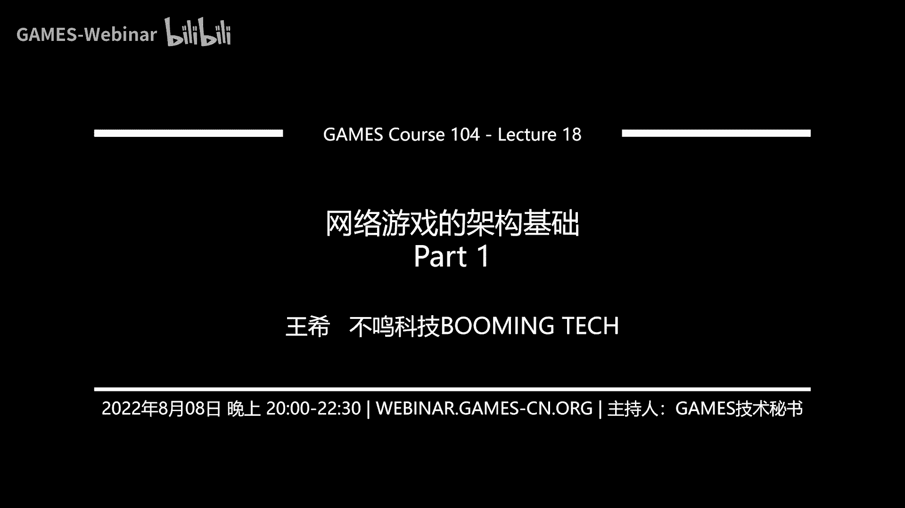
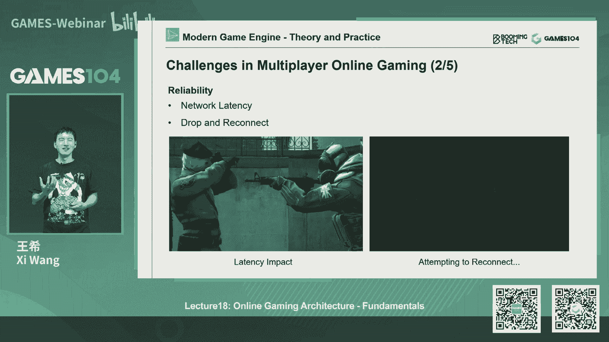
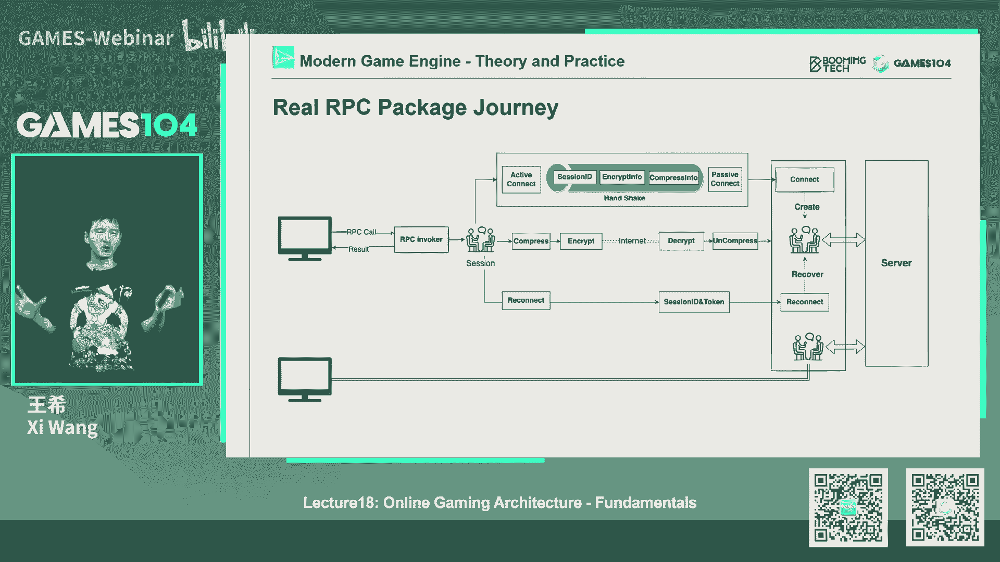
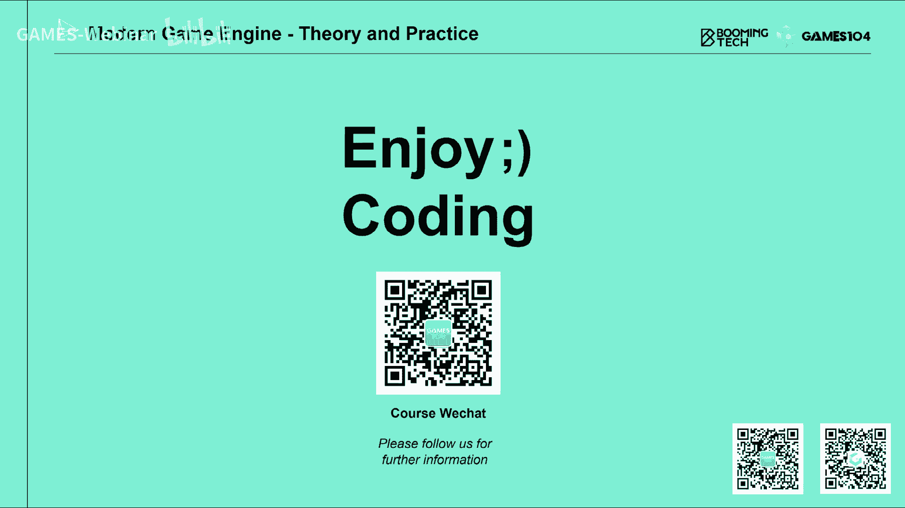

# 18.网络游戏的架构基础 (Part 1) ｜ GAMES104-现代游戏引擎：从入门到实践 - P1 - GAMES-Webinar - BV1La411o7kG

Hello，大家好，欢迎大家回到games104，现代游戏引擎的理论与实践，我是王希，哪个终于两周之后又和大家又见面了，哪个休息的很不错，然后呢，但是最后课程准备还是非常的，这个这个很多的事。

突然发现网络也是很复杂的，没关系，我们每一节课开始的时候，最近都是用我们的哪个T恤作为我们的开场了，对吧，这个T恤大家都很期待，告诉大家一个好消息，就是我们这个T恤的话呢，现在已经送去生产了。

大概可能还需要三周左右，所以大家千万要稍安勿躁啊，然后呢同学们哪个另外一个就是同学们的话，我们上一次上两次，我们哪个就是在我们的评论区里面，我们的留言的同学们，我们哪个已经挑出了我们幸运的小伙伴。

然后的话这是我们的名单，然后同学们都能找到我们课程组呢，就是在群里面加入我们的小秘书AMANDA对吧，然后他会把你的联系方式啊，你的地址告诉他，然后呢他我们会等这个T恤记好啊，打哪个印好之后。

我们就给大家寄过去，另外一个的话呢，就是说我们再想了一下，就是不只是在咱们B站课上留言，包括我们同学们做我们的作业，如果连续能做完两次作业，就做完两次作业的同学的话，我们课程组商量一下。

说也给大家发一个T恤做个纪念，因为其实每一个作业都比较难，它不像那么简单的一个算法对吧，然然后呢，因为考虑到大家现在时间，就是前一段时间特别的忙，要准备期末考试，所以呢我们非常贴心的把我们的课程的。

所有的deadline全部设到了8月31号，那8月30号第二天是什么，9月1号，也就是在开学前，大家把作业做好就可以了，那么大家加油啊，争取能够拿到我们的哪个课程组的T恤，那么OK另外一个的话呢。

其实自从我们开始这个稍等诶，我的这个翻译器好像有点坏了，稍等，那我要用鼠标了，稍等一下啊，啊完了完了，我今天哪个翻译器好像有问题没事，那然后的话呢，就是说其实呢最近这段时间我们开哪个开始。

我们的这个就是B站小留言的活动时，通讯给我留言留的蛮有意思的，包括有同学跟我们讲说我们这PKO的引擎的话，好像跟红猪宫崎骏的动画，红猪哪个你们的哪个一模一，哪个哪个哪个修飞机的飞机场一模一样，诶。

其实我听到这个留言之后，我自己今天下午还把哪个，宫崎骏的动画也看了一下，因为宫崎老爷子的动画片一直是我最喜欢的，我觉得真的他能给我们激发，我们心里面非常美好的东西，所以我觉得一如既往吧，还是那么感动。

然后的话呢其实同学们的留言中，我能感受到一种温暖温暖吧，因为其实我们在做这个104课程的时候，很多时候呢我们也不知道我们的目的是什么，说实话我也没有刻意的去想过，我们2014课程是目的是什么。

但是我觉得我希望同学们真的能够享受，这样的一个104课程的这样的一个快乐，也就是说呃大家的话呢在这个课程中的话呢，就是说真的能享受作为一个游戏引擎，做这样的一个就是说能够享受一下上帝的感觉。

你可以自由地创造这个世界，我并不一定要成为这个世界上最牛的游戏引擎，引擎的研发者对吧，如果我做那么一个小小的功能，诶，天空因为我变得很蓝，我看到了绚丽的彩霞，我看到我的小人按照我的方式去动起来了。

甚至开始跟我互动，那种快乐真的是发自内心的，我记得我在读书的时候，那个时候就开始去写游戏嘛，很小的时候在大学的时候，然后我记得那时我写了一个足球的AI游戏，然后我就看着他两边AI在踢足球，可以看一晚上。

就每天其实很无聊的，你就看左边右边啊，A队赢还是B队赢，当时我还特别有意思的说，这是中国队，这是美国队对吧，那我肯定会很很下意识的，把咱们中国队的这个球技调的那么强，那么一点点，虽然事实上是反的对吧。

那么其实这就是做游戏引擎的一个快乐，就是说你真的能够去创造这个世界，那另外的话呢就是说，所以我希望我们的同学们的话呢，能够真的尽情的享受这个过程，就是keep it simple，就是说不用太多的功力。

我学这门课的目的是什么啊，我我一定要怎么样对吧，相反就是说你真的享受这你们知识的乐趣，包括我自己在准备这个104课程的时候，我和我们的课程组，其实从一开始觉得压力满满啊，到现在其实已经变成了一种享受。

或者变成了一种生活状态，就是大家每个星期在一起就说诶，这一周我们要讲什么，那我们一起把所有这方面的知识都自己学一遍，然后我们一起讨论会，就问哎这个知识为什么是这样呢对吧，这个东西源头是什么呢。

其实我们也是在准备这个课程，一边准备一边跟大家一起去学习，所以啊我觉得做什么都是这样的，就是你去享受它就好，那么好好啦，那废话不多说，那还是回到我们同学们的关心的问题吧，其实哪个我们课程组选了几个。

同学们几个问题特别有意思，他就比如说有同学问我们说哎我们怎么看，就是这个deep learning和这个reinforcement learning的未来，就是这个深度学习和这个增强学习的未来。

其实这个问题它本身呢就是怎么说呢，我觉得呃有点微妙，因为深度学习只是一种方法对吧，我猜这个同学主要问的是说诶，你是无监督的学习，还是这个有监督的学习是为了，其实这个从呃目前来讲的话呢。

我觉得很多的大家都在debate，就是说比如说同样对AI大佬，比如说我们像demand的话，他其实用的还是有监督的学习多一点，那么比如像哪个就是哪个这样子OpenAI的话。

它更像是这种就是增强学习多一点，那么其实这里面大家到现在还在，很多的方法都在讨论，但我个人看啊，就是说其实大家都会去想，就是我们的人类的智商，比如像我一直在思考，说什么时候。

有一天我们人类真的能实现强人工智能对吧，那我觉得最好的一个类比就是我们人类自己嘛，那我们人类的学习知识，是有监督的还是无监督的呢，其实很难讲，因为大家会觉得我们人类很厉害。

我们大部分时候都无监督自己去学会了，对不对，但实际上我觉得上天在我们的大脑中，其实不对应了很多东西，比如说小时候我们做错了事，我们的爸妈会对我们说啊，你这做的不对，你通过他的表情。

通过他的哪个哪个不开心的脸，我们就知道我们可能做错了对吧，他很开心的，暂时我们我们就知道我们做对了，其实我觉得我们的智力是有至少在早期吧，是有很强的监督学习让我们形成的对吧。

那么未来再往后的话是不是无监督学习呢，我觉得这是另外一件更有意思的事情了，比如说我们学会了下围棋呢，很多时候我们自己就会慢慢的，摸索很多的技术了，所以我觉得这件事情的话呢，呃我作为一个非常业余的。

这个就是说深度学习的这个，这个业余观察者的话，我认为就是说我们很难给出判哪个判断，但我认为就是说同学们可能对这件事情，要保持一定开放性，就是很多时候大家会在想说，就是有一种心态，就是我们要押宝押。

对对吧，但其实我觉得在很多时候，我们可以保持一种开放性，什么知识我们的学一点，而且呢就是其实大家看下，我们游戏引擎课有个特点是什么呢，就是实用主义，就是对于我这个specific的问题。

他用哪个方法是最好最快的，能帮我解决，我就用哪个方法，就像我们上次讲讲，哪个就是哪个游戏AI这个课的时候，我们就讲的就是说虽然像deep learning啊，像哪个就是监督学习，无监督学习。

其实非常的强悍，也非常的美妙，对不对，但实际上在解决很多游戏里的问题啊，有有的时候你可能用一些最基础的一些AI的，算法和工具就能解决了，所以那个时候你就不要上，不需要上那么复杂花哨的东西，对好的。

那么另外一个同学也在问我们，就是说呃就是游戏的AI模块，那么就是当游戏这个就是说版本更新的时候，AI模块是不是也是要相应的剧情版本更新，那实际上的话呢就是说这个问题不一定。

那因为就是首先AI确实和游戏逻辑，游戏业务深度绑定的，原则上来讲，就是说如果游戏的逻辑发生变化的话，AI有些东西需要发生变化，但实际上的话呢AI跟这个世界的连接。

我们很多时候是用他的perception，就是你对世界的认知对吧，观察你对世界观察多少个变量，这些变量如果没有发生变化的话，你的决策依据其实不会发生太大的变化，除非你决定修改他的行为，那么第二个就是说。

你反向的作用于这个游戏世界，就是说我能做多少种动作，如果AI体能做的还是这种70种动作，不会有变化的话，那其实游戏版本更新的时候，AI原则上其实是可以不用更新的，但是现在在现代游戏引擎中的话呢。

很多时候我们的游戏的AI，比如说我们用数据或者是我们用脚本去配置好，那么实际上的话呢，这些数据和脚本它并不需要，每次游戏版本升级了，我就要更新一次对吧，除非你像我刚才讲的说。

哎我对世界的这个state的表达发生了变化，或者说呢唉我能做的动作增加了或者减少了，那有些脚本可能相应的更新，那么包括如果我是用这个深度学习的方法，那假设我实质性的战场策略发生变化的时候。

我这个AI系统本身也会升级，但其实呢现在的很多游戏里面啊，我们的这个游戏上线之后，我们一边会用AI指导电脑打游戏，其实一方面我也没觉得，不停的抓取真实游戏的数据。

然后呢用它来training我们的那最后一个问题，就是同学问我一个，这应该是很很有趣的一个问题啊，就是哪个DLSS这个算法到底是怎么回事，首先的话呢本来我们想的高级课游戏讲的东西。

但这东西其实非常的复杂，就是DRS的话，那就是deep learning super sampling对吧，那么其实就是基于深度学习的超采样，这个东西为什么很有用呢，就像我们前面讲的。

就是说我们现在的rendering对吧，比如说我们一个4K屏，8K屏，那上来将近8K屏多少多少哪个像素了，应该是超过接近上亿的像素了吧，那这样大家就很郁闷了对吧，那我就一个个的渲染这个显卡都崩掉了。

那DRS这个算法好处是什么呢，就是你可以用一个比如说呃，比如说720P或者1080P的东西，我能够把它upscale成4K甚至8K的画面，它的技术原理是什么呢，就是最近大家在哪个B站上特别火的一个。

一类视频是什么，就是叫啊老照片，黑白照片对吧，高清还原，现在还有什么高清AI修复数字版，其实他用的都是类似的原理，就是说我其实因为人都很聪明，就是如果我找一个有经验的画师，我给你一个模糊的老照片。

他可以去想象和修补，那你们他的光影和那些细节，包括人的，比如说皮肤的肌理，衣服的肌理，人的动作的细节，那这样就把这个画面修复起来了，它其实就是知识深度学习最强的一个东西，那么第二次的话呢。

它实际上是对这个游戏的画面，不仅是在空间域上进行采样，就比如说你虽然像素很低诶，我从你周边的整个情况猜出来，你大概表达的是一片树叶，你大概表达的是一个人脸的皮肤，或者是一个石头的纹理对吧。

或者大理石什么东西，那么也可以还要从时域上叫temporal上去采样，就是在这一帧和下一帧之间，我去找你的关联关系，其实DRS的话现在已经好像是如果没记错的话，已经是2。0了吧。

就是这套算法实话实说做的是非常非常的强，就是说我们和很多哪个做rendering的朋友，去交流的时候，他们说其实第一代的算法，其实很多人都应该能够模拟出来，做出来效果差不多。

但是第二代算法什么他做到了什么呢，做到了，就是说哎我已经跟特定游戏没有太大关系了，这里面就讲一下深度学习，有一个很有意思的点，就是说你把比如说我是一个花里颜色，花里胡哨的FPS游戏对吧。

比如像OVERWATCH，我训练出来的这种超采样的东西，和我做一个非常写实风的，比如说哪个上古卷轴这种诶，我选出来的哪个超采算法，是不是有那么一丢丢区别呢，对吧，是完全不一样，但是呢DLSS2。

0的话呢，他做到了，就几乎你不用专门为某一个特定产品，去调你的算法，这一点我说实话我也觉得非常的牛啊，我也不知道他怎么去做的，但是确实就是说啊，就是现现在深度学习的算法基于随着硬件。

它本身就带了很多tensor CORE，就是那个就是那个演绎的这样的一个这个C，这些算算力在哪个在核心上就已经有了之后，实际上真的是越来越强了，所以呢这个算法的话呢，呃其实目前为止的话。

最基础的算法其实有很多人在讨论，包括有些公开论文，但是最新的算法的话，目前好像还没有看到公开的资料，所以我也没办法讲太多，但是呢我们只知道说诶这个算法还挺牛逼的，包括其实全球很多的企业都在竞争这个算法。

我认我个人是非常看好这个方向的，因为我认为未来的渲染的话，不应该是主像素的渲染，因为这个太慢了对吧，我认为基于DEPIN的base的算法的话，其实有很多很了不起的应用，比如现在现在特别火的。

大家知道google的哪个earth做的哪个NERF对吧，这样的一个一个渲染，它能够把整个环境给你重建起来，记几张照片，这个其实也是就是人脑能做的事，也许未来这个深度学习就能做，OK好，言归正传。

我这个回答我们社区的问题的部分，到此言归正传，到我们今天的课程的主体，今天课程讲什么呢，也包括接今天和接下来的两节课，我们讲什么呢，讲再online游戏这个词很难翻译啊，我这个网络游戏是不是更好一点的。

叫网络游戏架构，这个一听呢在我们中国大家一讲网络游戏，大家就觉得这是个坑钱啊，或者什么什么的游戏对吧，所以哪个也叫联网游戏，我觉得嗯好像有点土对吧，那没关系吧，我们就不在这在乎这些细节。

我们就叫做网络游戏的架构。

那么这节课呢我们会讲一些最基础的一些概念，那么网络游戏呢，其实它是相对于单机游戏而言的，就是说其实在早期的游戏，很多时候就是你对这台电脑自己玩就可以了，对吧，玩的很开心。

我们叫single player单人游戏，那么网络游戏的核心是什么呢，就是说让你在任何时候和任何人可以一起玩，就像以前我还记得小时候，我们在街机时代的时候，那我们物理的就会和别人站在一起打游戏对吧。

一边打一边讨论很愉快，包括现在大家有能撑到DS的人联网的时候，也是享受这种快乐，但是呢这个不是一个终极解决方案，终极解法就是只要我有套设备，只要有网络，我就要和任何一个小伙伴能够连在一起，去一起战斗。

那么其实呢就是说网络游戏，它本身呢又很挺复杂的，因为就像我们最早在最开始我在讲games co视频，就跟大家讲过，说，其实做游戏引擎，有一个我们讲的游戏引擎很复杂对吧，但其实呢他那所有的复杂。

只考虑了一个人的情况，如果我们考虑两个人的情况，他这相当于什么呢，就是如果大家理解游戏引擎，是我们在做上帝的活儿，我们在模拟整个universe，整个宇宙，那么它比较麻烦的是什么呢。

就是我看到的宇宙和你看到的宇宙，不是一个世界，哎这个有点像现代物理学的概念了对吧，我们讲平行宇宙，或者说这个这个客观性的言言，哪个讨论，就是说我看到的真实是不是你看到真实，这个问题在我们的游戏引擎里面。

就是很这个切身的感受到了，所以我说游戏引擎的研发者，都都都会成为物理的民科啊，如果大家研究的都研究的比较深的时候，你们一定会变成哪个物理民科，就是说因为我们很深切的很直观地理解到。

就是说100个人联网进入到一个虚拟世界，他们一起战斗的时候，其实他们每个人看到的世界都是不一样的，他们以为彼此看到的是同一个世界，所以说其实怎么样的，再有那么多的复杂的网络的延迟啊。

信息的不完整传递的前提下，我们把这个让彼此之间的世界能够实现同步，保证我们世界之间的发生的事情是一致的，就不要在我的世界里面，这个玻璃瓶是好的，在你的世界里的玻璃瓶已经打碎了对吧。

那你我看到你拿着一个碎的玻璃瓶，起来喝水的时候，我肯定知道说这个世界出了问题，上帝一定我们生活在一定的虚拟世界里面，我记得我小时候看很多电影里面讲，一个人怎么突然意识到我生活在哪个matrix。

就是黑客帝国里面，就是我突然发现天空中出现了巨大的哪个，哪个什么三角形POLYG，或者说我发现了一件不可思议的事情正在发生，这就是我们生活在matrix里面的真实的证据，对不对哈，再讲下去。

就是我们变成这个，哪个什么超自然科学的范畴了，那我们还是回到民科这个范畴，就是说其实啊游戏，网络游戏第一个挑战其实也是最大的挑战，就是说怎么样在那么那么多的universe里面。

我们保持它的一切的事件的一致性，这件事情其实是非常的难，那么第二个难点呢，就是说其实网络世界他最恐怖的一件事情，不仅仅是延迟，而是它它的传输是不可靠的，在这个世界里面其实有很多的。

比如说网络的这个这个丢包啊，或者大大面积delay或者拥塞啊对吧，甚至你会出现断线，你会重连啊，这个大家会觉得很正常，比如说你哪个网游，你觉得诶我掉线了，我回去继续能打，这不是我一个基本的需求嘛。

但其实今天这节课里面我跟大家讲一下，大家就知道这件事情其实挺麻烦的，那我们以前玩过很多网友，我们可以看到，就是对方突然在做一件很逗逼的世界，比如对方突然傻在那了，动不了了对吧。

我们就知道诶这哥们是不是掉线了，那么其实在我们去加一个真正的游戏，online games的这个server或者our client architecture的时候。

这是我们必须要面对和思考的一个问题对吧，上帝彼此之间是不会丢包的，是不会有这个latency的，但是不好意思，在我们的游戏世界里面，我们面对的这个连接其实是经常会丢包。

所以我经常讲说我有时候会羡慕上你就上帝，它是有无限的带宽对吧，而且这个不会丢包，这个还是很牛逼的一件事情，但说不定我一句话说错了，说不定如果我们真的生活在黑客帝国里面，说不定是我们的价格。

是老人家解决了丢包的问题，让我们这些凡人还是感觉不到。

我们生活在一个虚拟的世界好，那么第三个问题呢，其实也是在网络世界里面，大家一个共同面对的问题，就是说大家其实可能没有意识到，就是说其实online games，它本质上是一个巨大的经济系统。

所以的话那么其实在online game里面的话，如何反作弊，反这个就是信息的泄露是一个很重要的责任，就大家意识到就是信我们每个用户，哪个玩家登录到游戏里面，你的个人的IP，你是个人所有的信息。

包括你能不能被人家这个陌生人突然加为好友，或者是别人能hiking你的电脑，或者说去做一些作弊的行为，那么这些的话呢，其实当我们一旦做一个online game的时候，我们就要花很多时间去想这个问题。

为什么呢，如果你做单机游戏对吧，你要hack我们也没有办法，我记得以前哪个啊，我玩单机游戏的时候，我经常会游戏打不过去怎么办，我可以拿一个，就是啊我忘了叫什么哪个软件叫什么来着。

就是你可以找到比如说我的粮食值，或者说我的血量的这个数值，然后呢我可以把那个哪个那个内存地址找到，然后把它数值锁死，这样小怪怎么打我，我都不会掉血，然后我就可以直接强行就过关了对吧。

其实它的原理非常的简单，就是你的啊，你的哪个数值，只要你看见了，你搜三次对吧，他把哪个数字都对上了，就知道是哪个数值，然后再把哪个内存地址给给给给锁死，但是对online game的话。

这件事情就完全不可以接受，你怎么能接受对面来了一个人对吧，你对他一通输出，一通操作，然后对方的血动都没动，你肯定当场就摔键盘，对不对，所以说这其实是online game一个很大的一个挑战。

那么第四个挑战呢其实是多样性，其实大家可能没有意识到，就是我们的online game啊，实际上它面对的设备是非常复杂的，比如说你可能是一个IPAD，可能是个IPHONE对吧。

可能是android base，可能是iOS based，你可能还是PC，那对方可能还是对我们的服务器，可能是一个linux space的服务器，那这么多多样的设备，他们都要能连接在一起。

而且呢都要能跑一样的逻辑，而且online game还有一个很很恐怖的一件事情，这也是啊大家在做游戏引擎的时候，很多说他意识不到的一件事情，就是说我们经常讲的一个词叫热更新对吧。

其实当我们做一个online游戏出去之后，你很多时候会犯很多错误，这个没关系对吧，但是呢大家会说没关系啊，我就推个新版本，但是你想想看，当我的游戏上线之后，很多的小伙伴此时正在玩对吧。

有人正在打的正嗨呢，你怎么办，你其实要有一个办法，就是让大家神不知鬼不觉的把这个bug fixed掉，你要能够快速的去迭代对吧，有的有的时候是游戏的逻辑，有些关键的游戏的一些啊，这个规则都要发生变化。

那这样包括大家想象一下，就现在的网络游戏非常的复杂，大家想象一下，比如说像新世界，像最终幻想对吧，像魔兽这样的世界，它里面有多少的系统，多少的玩法，这么多东西都在这样的一个网络的一个包里面，去彼此连接。

实际上的话这种多样性其实非常的恐怖，所以这也是online，我们在做这个就online gaming的时候很头疼的一个问题，但确实你要去面对的一个问题，那么最后一个的话呢，也就是真正的复杂度吧。

比如说如果我们要构建一个，像头号玩家里的绿洲这样的世界的话，大家想想看，我们要上万的人对吧，在同一个世界里一起去战斗，打枪的打枪拿刀，这个砍小怪的砍小怪，那么这么高的并发度，其实你会发现啊。

就是如果我先两个人在一起连接的，这个操作其实还比较简单，但是我一旦变成了两两百个人对吧，变成了2000个人，变成了2万个人的话，它的复杂度是以N平方在急剧扩张的，而且这里面的话呢。

实际上这些人的网络链接会越来越复杂，所以其实像这种的复杂度的话，实际上是现代哪个online gaming的话，一个非常有挑战的一个价格问题，但我不知道这节课我们有没有时间，本来我们计划有有有计划。

先讲一下这个这个这种架构，但是呢等我们PPT准备完之后，发现我们第一节课就讲了200页，准备了200页的PPT的时候，我们想嗯我们第二节课再看吧对吧，那我们啊。

所以呢这是但确实我我想就是所有有兴趣学games，104的同学的话应该要知道，就是这其实是啊下一代游戏引擎很质，很重要的一个挑战，就是我们觉得这是未来世界，我们一直梦想的那样一个。

games世界的一个一个一个一种起源，我已经受够了，让我进到一个小房间里面，和几个小伙伴在一起的，这个只能你看着我看你的世界，我希望真的有一个让无限进无限出啊，我看到无数的人在一起的那样的一个虚拟世界。

这是我的职业梦想吧，好所以说其实这就通过这几点，我相信同学们就有感觉了，就说诶其实online game还是蛮挑战的，那么好，那今天的话呢，我们就开始了我们online game的第一节课。

这节课呢我们会告诉大家一些最基本的东西，比如说最基础的网络协议是什么，大家会觉得诶，这一趴是不是要教我，这个最基础的叫计算机网络基础啊，大家在大学的时候，有没有学过这么厚的一本，叫计算机网络基础对吧。

那有可能我们会有些内容跟那里面去重的，但确实你会发现当你要做网络游戏的时候，不好意思，大学的时候可以逃课对吧，可以这个这个作业找别人代写，但是你到了自己一些引擎的时候。

那些基础的知识该复习的还是要复习的，那么接下来我给大家讲一些很基本的一些概念，比如时钟怎么去对齐对吧，比如说RPC到底是个什么东西，包括我要做一个网络游戏，我网络拓扑结构到底应该下成什么样子。

那最后呢会给大家讲几个最主流的，就是说网络哪个游戏同步的机制，比如说从快照同步啊，到这个真同步啊，到这个就是状态同步啊对吧，这些都是最basic的，然后呢下一节课会给大家讲一些有意思的东西。

那就是比如说哎听了这么多，其实一个角色在网络环境里面，它的移动怎么同步，大家其实并不知道对吧，这个听上去有点让人沮丧啊，比如说我一个射击打中了，到底没打中，怎么去对齐这件事。

也其实大家并不知道网络有波动的时候，我怎么去补偿对吧，包括一个标准的一个M游戏的网络服务器架构，该怎么去架构，当然了，还有一些更详细的一些概念，比如AI啊，怎么去反作弊，当然了，也许我们有时间。

还可以提一些更有趣的一些东西，所以我们每节课都是这样，就准备之前每节课准备的时间，我们都会觉得哇操这个时间，这个这个这个这个讲啥呢，哪有那么多好讲，当我们开始真的下手去准备的时候。

总发现课程这个时间不够，那么今天的话呢，我们就啊，先把最基础的概念跟同学们讲清楚对吧，这个基础概念也是好像是今天的课程，好像也是一百一百四十页左右吧，但是我争取不要再创造哪个三个小时的记录了。

OK好那我们先给大家讲这个网络的基础的协议，诶，这个很有意思啊，就是说其实首先的话呢，我们传统的节目就要拜神对吧，我们要确实要拜我们的两位大神，就是说是他们最早这个winter和哪个ROBERT。

他们最早去创立的，这个我们的哪个互联网的概念，然后呢他发明了TCPIP协议，人家很厉害，人家一上来就能实现，就是实验室通过电话线，通过卫星的这个所有的链接，当然这是美国军方的一个项目。

所以有的时候我们不得不承认，就是说唉，军事总是能推推进人类科技的发展对吧，那么其实你会说，就有的时候你当我们去研究下去，TCBAP协议的时候，我们还真的很佩服老人家。

就是很早就能够把这几个概念呢分得那么清楚，然后呢，能够让我们能够在上面能很轻松的去做，我们的开发，所以说这确实是我这个就是整个前任，哪个什么前人挖井，后人吃水吧，我们就享受这种快乐。

那么其实的话呢它核心解决的问题是什么呢，就是说我们如何在两台电脑之间传递数据，那么首先的话大家想想，两台电脑之间物理传输是不是特别的粗暴，比如说到底几幅算零，几幅算一呢对吧，我传了0101出去之后。

哪个算偷，哪个算伪呢，对不对，然后的话呢就是这个这些所有的这些信息的话，实际上如果没有这些political的话，实际上我们没有办法穿的，那这个时候呢其实我们就会发现，就是说当我的协议站是很复杂的。

我的硬件连接也是非常有，又有同城电缆电缆对吧，又有无线路由器，又有哪个就是网线光纤，那其实这里面，如果我们不做一个特殊的处理的话，你会发现我们要处理很多很多很奇怪的情况，但是呢。

同学们如果自己去学一些简单的T和电脑知识，我们知道说哎很多事情不需要我们去发愁了，因为我们在中间加了一层中间的layer，这层layer的话，其实把所有的硬件的这种复杂性全部隔绝掉，所以大家各种协议。

只是直接往里面去写东西对吧，然后呢由他们来负责各种分发，大家如果有机会啊，去到哪个机房去啊，我我我因为我工作的原因嘛，我经常去机房嘛，我每次对我们的IT的同学就特别的崇拜。

因为你当你看到哪个一个一个路由器，就真正专业级的路由器，那分出来那些线的时候，你会觉得我的天呐，就是跟大家讲一下，就机房里面盘哪个电缆线的，哪个就是哪个哪个cable的，哪个人都是一门技术活。

它11cm的线都要有编号，然后接上这么粗的这个电缆柱，这样走起来很足的电缆线，所以说你会发现在这里面无数的比特在交换，无数的比特在算法，但是呢，今天当我们去写一个网络的这个程序的时候。

我们其实根本不需要去在乎这样的一些复杂度，对吧，这就是要感谢我们的前任，把这个分成分的非常好，所以这里面的话呢就是要感谢一下我们的前人，著名的OSI模型，对不对，那么其实这个模型的话呢。

就是我们最经典的这个网络的七层模型，一层一层的下来，那看了那么多，对不对，从最最基础的physics层到哪个数据连接层，到网络层，到这个传输层对吧，到网上绘画层，到我们的这个就是表达层和我们的应用层。

实际上我们一般用不到那么深，我们大概一般都在应用层，各种鬼混就完事了，然后呢接下来就往上传数据，但是这种分层结构这种思想其实非常的有用，而且我待会儿后面还跟他讲的，就是我们在定义很多协议的时候。

其实我们需要对这东西有一些基础的理解，比如说为什么这件事情很重要，举个例子，比如说你要做一个应用，假设你做一个啊，比如说啊哪个，比如说CDN对吧，就是一个给人家提供各种下载服务的东西。

你需要对着七层协议非常理解，那么你会发现，这七层里面有大量的冗余的数据拷贝，对不对，你可以直接对这个协议底层进行优化对吧，那这当然这是一些非常高端的一些东西了，那么在往我们做游戏的时候呢。

有的时候我们不用那么深，但是不代表，在未来最前沿的一些产品研发的时候，我们有可能对这个协议都要进行优化好，那么其实呢，对于大部分的这个游戏引擎开发者来讲的话，我们不需要那么复杂。

我们说OK我们用一个socket编程，对吧，socket多方便，对不对，你只要提供一个IP地址，提供一个就是说哪个port端口号，我就可以跟对方建立我想要的链接了，但其实你们仔细看所有的网游。

它本质上你下载好你的客户端，你怎么去找到人家的服务器呢，实际上是在客户端你就写死了，说你就到这个IP地址，你就到哪个port已经在连到我的服务器，当然了，这里面没有那么简单，因为如果就是那么简单的话。

比如说我用最简单的一个DDOS攻击，就可以把一个游戏给黑掉，但其实呢大家在网络游戏啊，以前至少最怕的一个东西是什么，就是被别人恶意攻击，就是啊因为有你，因为你的服务器地址必须必须是开放的嘛。

如果他本身不具有一定的，就是说这个这个抗DDOS的能力的话，其实你可以很容易地写一个东西，把一个比如说别人在运行的好好的游戏，给他攻击掉，但现代网游的话呢，一般会做了很多的相应的处理。

就是没有那么简单了，同学们标示啊，这个是违法的，好不好，哈哈这个所有这个你觉得有趣的事情，很可能就是旁边就是有东西在等着你，所以我只是跟大家讲一个这样的一个，技术原理啊，这个不好意思，教小朋友学坏了啊。

然后呢，其实socket的话呢本身也是比较简单，很明确的对吧，就是说它实际上就是说，你通过这样的一个简单的接口，你就可以跟另外一台机器间的连接，然后呢你确定好你的协议。

就可以持续不断的往对方去传输你这样的东西，那这里面的话，我想给大家分享一个很有意思的东西，就是说其实在socket建立的时候，大家会说哎我是到底是IPV4，IPV6对吧。

我到底走的是TCB还是UTB协议，对这些东西大家的标准哪个选项，我这边讲有意思的东西，就是我们在中国，我们做很多在线应用的时候，我们一般用的是IPV4G多一点，当然大家如果注意到。

就是如果你要做一个真正的通用游戏引擎的话，我会建议大家一定要考虑IPV6，因为什么呢，因为在全球有很多国家，我如果没记错的话，好像是德国吧，我记得德国就是其中一个，就是他们已经大面积的在使用IPV6了。

所以你你的做了一个服务器的话，如果你不进入FPV6的话，有可能很多用户连接不上你的服务器，所以说你要做一个提供服务器的游戏，引擎的时候，A不好意思，这就是你要考虑的内容了，对吧好，那么其实这里面的话。

当我们有了socket之后，我们就要理解什么叫大名鼎鼎的游戏了啊，有那个哪个哪个pole了，就协议了，那最著名的就是TCP协议了，TCP协议其实是一个最最经典的一个，互联网的协议。

可以说互联网上传递的绝大部分信息的话，其实都通过TCP来去传输，大家怎么去理解TCP协议呢，就具体的细节我就不展开了对吧，那么TCP协议呢它首先是一个就是通过三次握手，建立了一个牢靠的这样的一个连接。

所以TCP连接是一个比较稳的，那么另外一个的话呢，就是说它的确保我的发的包一个一个一次一次，它是有顺序的，就是前面的包不会和后面的包去冲突，另外一个呢TCP呢还有一个很厉害的属性，就是什么呢。

它会进行流量控制，也就是说当网络发生拥塞啊，或者各种阻塞的时候，它会自动的降低我发布的效率，所以说这也是为什么很多啊，比如说网关配的策略的时候，对TCP都相对比较友好，如果这个是这个就这么说吧。

如果互联网上跑的都不是TCP协议的话，很可能今天我们大家用的网络都是非常的这个，拥塞不堪，因为每一个人都是玩着命的给别人发消息对吧，就跟我们讲这个，比如大家每个人都是玩命的发电邮，反正呢也不用管你。

邮票也不花钱，结果你很容易就会把这个就是说这个一个邮，邮件服务器给轰炸掉对吧，以前我们知道有垃圾邮件，其实TCB这一点的话，它其实是有流量控制的，说如果每天这个网，我们的网络上下行链路传输的量。

超过了我的上限的时候，我会相相应的进行一些控制，那么PCB的包头呢比较长了，它可以达到20个BT，就20个字节那么大，其实还是有点有点有点有点重的，但是的话呢它一旦建立链接之后呢。

它就会持续不断地传传这个信息，那么它能够保证这个信息的一致性，其实TCB啊，它的核心原理实际上就是一个叫rich Mission，Mechanism，就是非常的简单。

就是这里面它实际上就当我的任何一个接收者，收到一个信息的时候，诶我给我的3DER发一个ACOLOGMENT的，就是一个告知，就A4简称ACK，那么我的center呢只有收到了ACK之后。

我在持续的网上发报，当然这是最基本的原理啊，其实在后面我们会讲到一些更多的细节，但是大家知道这个基本原理就可以了，就是说如果我却没有得到确认，说我的内容被你收到之后，那我就会持续给你发对吧，这个当然了。

这个本身也会导致一些网络拥塞，那另外一个的话呢，就是说其实TCP呢它有一个很有趣的叫做，这个就是拥塞控制，它，实际上就刚才刚才，大家看到我们塞的这么多包啊，它不是真的一个一个散，它是一次一次一批批散的。

它是有个有个窗口的，但是呢他一开始窗口很小，然后呢我就开始传传传，如果我每次都很顺利传过去，很快我就收到别人的ACLACK，就ACCLASSMAN的话呢，我说ok fine。

那我就把我的窗口变得更大一点，我就一次性多传一些对吧，但是呢当我一旦发现我的这个ACCLASSM的，这个包出现丢包的时候，哎我就开始把我的哪个窗口往下滑，就我一次就少散的一点。

这样的话当我们去大家想象一下，如果在一个不是特别稳定的网络环境下，比如说有可能是因为网络真的有丢包了，或者说他只是因为波动对吧，大家知道网络其实是会经常波动的，为什么呢，大家想想看你们家小区的网络。

当你们家小区现在有部很火的这个电影，哪个比如说大电影网络网，大电影上线的时候，你会发现你们小区的网络就一定很差，为什么大家所有人都在抢哪个贷款，那么同样在一个不稳定的一个公网上的情况下。

其实TCB的链接给你看到的整个带宽的波动，就像这张图这样，就是诶一会儿快，一会儿慢，一会儿快，一会儿慢，所以当我们做一些应用的时候，特别是对游戏这种对时间特别敏感的时候，我们就会觉得有点难受对吧。

这是但是呢它实际上也是TCP，很多时候导致大家的延迟的一个原因，但同时又是我们互联网上就是能够保证，就是互联网没有炸掉的一个很大的一个保障，因为美如果每个人都遵守这个TCP协议的话。

实际上我们有一个动态的，就相当于就像就像马路上开车，你发现哪个这个车前面车很多的时候，你可以自觉地把速度减慢对吧，你会自觉的不去挤上哪个高架，那个高架最终还是能通行的，如果所有人都不管不顾的往上冲的话。

那高架很快就堵牢了，堵牢了之后，大家全都走不了，所以说这我我要讲的就是TCB的这个，congestion control的环，实际上对互联网是落立功了了，但这件事情的话呢，唉为什么在讲一个游戏引擎课上。

会讲的那么那么细呢，因为这东西跟我们的关系还是蛮大的，好，另外一个的话呢就是要讲到这个TCP的问题的话，就要讲到另外一个大名鼎鼎的协议了，就UDP了对吧，UDP哪个老哥其实非常有意思。

其实他实际上也是TCP的发明者之一，但是他在10年之后吧，就发明了这个就是UDP这个协议，它本质上哪个端端端的协议，大家想想TCP也很万能对吧，它能够在整个哪个互联网上去广播啊，去找东西。

但是呢UDP他的想法很单纯，就是如果我只有两个设备，我们彼此之间传数据怎么传，那我肯定希望越简单越好，对不对，我也不要那么多复杂的哪个约束了对吧，我也不要求你的order有什么东西，那么其实呢。

所以这个老哥就发明了UDP这个协议，其实UDP这个协议呢，其实我个人还是蛮非常喜欢的，就是说第一个呢，他就是说不需要建立长时间的链接，就是我们不要没事握手对吧，我看你顺眼，我就直接发给你了，你爱收不收。

那是你的事对吧，第二个的话呢，就是A我其实也不是要求你一定要稳定，然后呢也不要求你保证一定order，就像你发电影一样的，我我你这个邮件早收到这个几分钟，晚收到几分钟也死不了人对吧，那我就不停的这个发。

我就发给你就行了，第二个的话呢，我没有这个flow control，也没有这个congestion control，就是流量控制，我也不管，这就是UTP，实际上是个很祸害的一个一个一个协议。

就是说呃怎么说呢，就是如果你想用UDP干坏事的话，UDP其实很容易干坏事，就是他反正也没有流量控制，你就往上塞就好了，那么因为他的协议非常的简单啊，所以UDP它的包头就会比较的轻，如果我没记错。

应该只有四个字，四个BT，就是说四个字节32位，我就能存一个UTB的包头，这样看看是不是诶，我的包头就比TCP轻了五倍左右，所以这是UDP一个很大的一个优势，那么好，那所以呢其实呢在现代游戏里面。

你可以发现就是说不同的游戏他的选择不同，比如说你看像哪个我们的炉石选用的就是TCP，对吧，打打打炉石用于TCP，然后呢比如像守望啊，像其他的游戏，我们用的是什么呢，我们用的是TCUDP。

但实际上呢这两个协议诶真真实的，在游戏中的话，举个例子啊，比如说一个大型的MV里面，我们到底选哪个呢，这里面我只能分享一下我个人的一些经验，我们没有不一定按照这个课件去读，给他他课件的东西。

大家可以读一读，这些话说的也是有道理的，但是的话呢实际上我的理解就是说，比如像你打炉石这种对吧，你对延迟，比如说0。2秒，0。3秒，你真的那么介意吗，好像没有，那么介意对吧。

对于那种时间并没有那么特别敏感的操作，我们会选择用TCP协议比较好一点对吧，它它连接是稳定的，那么但是的话呢，对于比如说快速的这种射击游戏啊，我要响应特别特别快啊，尤其是在这种不稳定的网络的情况下。

特别公网上的话，其实大家现在越来越多的会有UTB这个协议，因为它是非常responsive的，反应比较快，但是真正的对一个大型的，就是这个这个这个mo来讲的话，实际上它用的一般都不是单一的协议。

他会用组合协议，比如说我有的时候用TCP协议来进行签名认证，确定你的登录啊，建立你的账号链接啊，而且这个这个有的时候我们心跳也会用，就是哪个心跳包也会用TCP一直给你维持住，但有的时候我们也用UDP。

但是呢游戏真的战斗啊，进入到这个世界的时候，我又会UDP，但是呢说不定我到了聊聊天啊，我到了那个什么别的，比如说邮件啊，我可能又走了哪个TCB的通道，其实我们一般会看哪个通道更合适，我就走哪个通道。

所以简单来讲的话呢，就是这个又回到了我们104的这个精神，就是说游戏引擎，实际上它是一个没有任何的教条主义的这样，一个一个一个工程科学，所以一切的一切的这个，这个就是说人类智慧的成果。

对我们来讲都是工具，我们更重要的是要构建那样的一个黑客帝国，这样的世界，所以的话呢对每个技术，我们都要有一个比较清晰的定位和理解好，这就是一个最基本的哪个网络的协议，哎如果故事讲到这儿。

我们就结束了对吧，大家知道了TCPUDB，那我们就凭着自己的感觉去用吧，但实际上的话呢在现代游戏里面，我们很多时候并不会直接的用原生态的引擎，我们会对啊，原生态的这个就是说协议，我们会对协议进行改造。

那么这个为什么要改造呢，其实这个问题其实在前面已经讲的比较清楚了，就是大家没有发现就TCP的问题是什么，哎呀这个老人家磨磨磨唧唧的对吧，它非常的好，很很很稳健，很可靠。

但是呢它的带宽一会儿上一会儿下对吧，而且呢前面的消息只要没有收到确认，后面的消息似乎不发，其实有的时候打游戏的时候，你有的时候有些消息丢了不就丢了嘛，无所谓，对不对，我我现在我这个输出。

我这个操作我就特别想打出去对吧，我一通操作，把对方就想这个直接给哪个血给磨没了，对不对，你这时候不让我发出去，就是因为我前面一个移动这个消息没有传过去，那我觉得作为玩家是不是很难受对吧，那那肯定TCB。

这个时候大家就会觉得有点难受了，那怎么办呢，哎我们用UDPUT意识很好，他非常fast，而且它能满足我的要求，就是今天我打出了一个输出，我前面一个向左移动，我一个连跳没传过去，拉倒无所谓对吧。

但是的话UDP实际上是真的是非常的不reliable，也是某种意义上来讲的话，我们根本不知道这老哥到底有没有传到，对吧，那那这个问题就比较麻烦了，对不对，你发出去的包，这个这个这个打出去就不管了。

对不对，那我服务器客户端之间最起码的信任都会没有，所以其实这个时候就会有聪明人说哎，我能不能把两个学期的优点给结合起来，这其实就是在现代游戏引擎里面，就是这也是我会推荐大家，如果你们在做自己的游戏引擎。

特别是做online联名的时候，我会非常推荐大家，就是要么去采用第三方的，让我们自己定制一个啊，基于UDP的一个可靠链接的协议，这件事情其实啊难度并不像大家想的那么大。

而且这里面的很多很有趣的一些数学原理，大家也可以在里面去自己应用，所以呢这就是我们104课要讲的就是，A如何构建一个可靠的UDP连接，那么就是说这里面的话呢，其实前面已经讲的比较清楚了。

就是说为什么定制一个自己定这个协议，这么重要的，其实我们去看哪个游戏的服务器开发，和网络的服务器，就是标准的web服器开发其实有很大的区别，游戏你会发现，比如说我们要总是要保持活着的链接。

这个看听上去有点像TCP对吧，然后呢，我们最好呢要保证这些消息传递，还是有一定order的，我们真的乱序，其实我们也受不了对吧，我们有些动作，比如说我要先给自己喝个草药对吧。

然后我的我的我的这个这个魔法之上了，然后我再去打一个技能对吧，我的魔魔法就够了，我的蓝够了，那这个还是有顺序的，对不对，那么所以呢我们还是要保持一定的这个order，在里面。

这两个需求听上去好像挺7CP的对吧，但是的话呢我们又要非常高的，这个就是responsive，非常快，而且最好没有延迟，还有一个的话呢就是经常我们要群发对吧，就像我们讲了，这个上帝如何能够实现多个宇宙。

multiverse之间的信息同步，是不是我经常要send all对吧，就是这个服务器说收到一件事，我马上就要send or send send，所以我经常有broadcasting这样的需求。

那么其实这两个呢其实又很符合UDB的特征，所以呢我们就很贪心地说，我们能不能定制一个协议，把这两大协议的这个优点都结合在一起，那么实际上的话这里面先讲一个基本的概念，就是说哪个前面其实前面已经提到了。

OLOGAN的ACK对吧，就是说我收到一个包，我给你确认收收过了，其实ACK呢还有一个他的孪生兄弟，叫n AC k neck，就是说negative AC k什么意思呢，就是说我除了能告诉你说。

我收到了某某的包之外，我还能告诉你说哎什么包我没收到对吧，那这样的话是不是一样也有信息量传递下来，其实你会发现做网络很多时候，我觉得跟信息学的一些技术理论很接近，就是我们在一个彼此不可靠的链接下。

怎么样建立一个可靠的彼此信任的通讯，它本质还是这么个原理，其实我们在人类古代大家想想看啊，因为我以前很喜欢读历史嘛，就很有意思，你会发现古代，比如说A地到BD两个指挥官之间，他们要协同作战。

但是他们知道我传递的所有的这个传信的，这样的一个通讯者，他们都有可能会半路上被人截杀对吧，而且也有可能被人compromise，就是被人俘获并且叛变，然后呢，而且呢这个中间会有个latency。

就有很多的延迟，对不对对吧，那么好，那怎么样的，在两支协同作战的军队之间，建立这种可靠的通讯，其实也是一个非常有意思的一个问题，这个问题其实跟我们在网络的问题上，解决的问题一模一样，那么另外一个的话呢。

就是我们要加入这个序列号，那这个其实大家知道，我给哪个包哪个编号对吧，那么呢还有一个time out，就是说诶过期的时间就有些时间时间过长了，我们就不理他了，其实当我们去基于UDP。

构建一个相对稳定的这样的链接的时候呢，你又要用到这些概念，这些概念呢实际上啊你说他陌生吗，他其实不陌生，大家如果去学习TCP的真正的底层实现的时候，你会发现这些就是我们的老朋友对吧。

那首先的话呢这里面的话要提出一个概念，就是这个ARQ对吧，就是说自动的这个回复的这个哪个重复的要求，它实际上是个简单的例子，就是说当我建立一个就是网络链接传播的时候，如果我丢包了，或者我没有收到的时候。

我能够有个方法能告诉你，你能自动给我传发包，所以我所有的算法都要实现LRQ这样的效果，那LUQ呢有很多算法，所以呢我们在这里跟大家简单讲几个基础，基础概念，那么第一种概念呢。

就是说哎我们要有一个叫sliding window pole，就是滑动窗口协议，就是说当我的包体啊，一大块很多很多的数据我要传输的时候，其实我有个窗口的，我一次性会把窗口你的数据全传过去。

这个时候当我收到了诶，是那个接收方发返回来的ACK包的时候，比如说我收到了第2号包回来的时候，我就知道了，哪个345就是3号包啊，哪个2012已经传传输出到位了，因为我只要顺序的确认嘛。

那我接下来就把3456传过去，那因为三我已经传了，我就把456传传过去对吧，直到我收到了后续的这个ACK这个包，过来之后，我这个窗口游戏需求也往下滑，这个原理是不是非常的简单对吧。

那么这里面的话呢我们就有很多策略了，比如说最简单stop and the weight a r q，什么意思呢，就是说我这个窗口是三零，我每个包放完之后，我都在都要等你的这个确认了，包收到，我再往上走。

那这个的话呢，这个方法其实是最古典的一个方法，这个方法从来就没有用过，为什么呢，因为它特别笨，你想想看，比如说我有很多的上行带宽对吧，但是呢我传完一个包，传完之后，我就等等等。

网络的延迟至少一个来一来一回的话，一两百毫秒至少过去对吧，那这一两百毫秒的话，我们所有人都在等着呢，所以这个带宽其实没有被充分的利用，所以呢这个呢是一个最简单的方法。

那么还有一个就是go back and aq，什么意思，就是其实刚才那个窗口里面，就是说如果我发现我一个包丢了之后，我其实只是把一个窗口，你的包再重新传一遍，那这个的话呢。

策略呢其实是一个非常实用的一个策略，实际上在我们的这个就是，如果我们做自己的reliable，这个UDP的协议的时候，诶，我会推荐大家用这个策略。

那么更有意思的就是selective repeat a r q，这个地方的话，其实它是用了哪个negative l q l ark，就是说我告诉你是说什么包我没有收到，你就继续往下传，但是我告诉你说。

比如说我哪个包我丢了，比如在这里面的话，2号包丢了，那好那你把2号包再给我再传一次就好了，那这样的话呢其实它的链接可以更稳定，而且呢也能节约一些不必要，不必要的哪个贷款的浪费。

但是他有个额外的那个就是哪个a logy的类型，就是NARK，就是告诉你说这个包我没有收到，这里的算法讲讲起来的细节其实是非常的多，但这个呢不是我们这节课的重点，其实我我想跟大家讲的，就是说。

同学们如果要去构建一个自己的，就是for游戏引擎的这样的一个网络，底层的时候呢，确实要非常认真的去考虑，你下面要构建一层，基于UDP的一个可靠的网络连接，但这种东西的话，其实现在啊有很多的开源库。

也在解决类似的问题，就是说他能够就UTB给你构建一个唉，你要保证顺序一致啊，你要保证这个非常可靠啊，你要保证哪个非常低延迟啊，这样的一个一个一个一个包装，所以我觉得UDP是个很好的协议。

就是它提供了一个很基础的构建模块，上面的策略完全用我们自己去配置，那么其实的话呢就是说还有一点就是说诶，其实在UTP传输的时候呢，我们还经常会遇到一个问题，就是丢包对吧，UTP说了丢包我不管对吧。

我只管发出去，但是他可以不管，我们得管，那这个怎么办，诶，这里面有一个很重要的策略，就是这个forward error correction，这这个策略的话呢，也是我们在构建的底层会用到的东西。

就是说如果你丢包了之后，我能不能说在丢包率，比如说只有5%啊，10%的时候，我不要没事就让你重传一遍，大家知道重传这个事情很麻烦对吧，我第一个我要等你的ACK收到，收到之后呢。

我然后再把那个老早以前的包拿来，给你重传一遍，而且如果是一个滑动窗口的方式，其实我后面的所有的包都得卡在那儿，对不对，所以说其实如果有一个方式是说你的包丢了，我也不管我继续往前走的话，那是不是岂不美哉。

所以的话呢，其实聪明的人类就想出了很多方法说诶，我能不能有一个方法，就是说我收到了包，我知道这个数据丢了，但是我一样能够把你正确的数据给找到，这里面的话呢就有一个非常有意思的策略了，我们叫做。

我们以前在学这个计算机体系结构的时候，经常讲的一句话，叫什么叫空间换时间对吧，那我我就是用额外的数据传输量，来解决这个问题，那大家说怎么办，我把数据再传一遍，对不对，我哪个数据传两遍行不行啊。

当然可以了，但这个方法实在太笨了对吧，我们还是要用一点稍微高级的方法，其实呢这个其实是VC，这个这个算法就是for的哪个哪个error correction，哪个算法实际上比大家想象的要简单。

这里面我给大家介绍两种很简单的算法，第一种方法就是什么呢，抑或降盐味的算法对吧，第二种呢就算哪个介绍哪个啊，就是SOLOMON的一个算法，Solomon codec。

这也是计算机信息里面最经典的一个算法吧，OK那首先讲异或吧，抑或其实大家知道什么叫异或运算，对不对，就是说当给你两个beat，那么他们如果是一样的话，那么它的异或值就是零，就表示你们俩一通我不喜欢对吧。

你们两个是不一样，比如说A是零，B是一，或者是A是一，B是零，他们两个就是哪个异或运算结果就是一对吧，如果两边都是一异或运算，120这个算法提上去哎，就那么回事，对不对。

好像我们在学计算机组成原理的时候，我们经常会用到这个这个算法，那异或运算它巧妙在什么地方呢，哎大家看看我们这里哪个有意思的东西，就是当我给你数据，假设有ABCD4个数据。

我把ABCD的异化算出来的结果是E的话，你得到了这个值呢，其实就是一个校验位，这个校验位呢不仅可以校验你这个值，对不对，他其实也不算校验嘛，但是他其实确实可以教研，但是他更厉害的是什么呢。

就是当你的ABCD中间任何一个丢掉的话，我可以把你的剩下的地方，和我的E在一起做异或运算，得到的结果就是你原来的值，哎这个数学让大家可以自己推演一下，其实很简单，但是呢这个定理是可以被证明的。

他一定对的，但是大家会问说，那如果E自己被丢了怎么办，那也无所谓了，反正我的信息是ABCD嘛对吧，E丢了就丢了，拉倒了这个东西其实是什么呢，就是大家哪个如果学过哪个硬盘的，存储阵列的时候。

大家知道有个概念叫red five，对不对，就是哪个rate对吧，就是我们的存储，哪个磁盘存储的哪个数据的冗余，其实就是这个算法对吧，就是我五块硬盘，四块硬盘存数据，一块硬盘存它的异或值。

这样的话这四块里面其实五块里面坏了，任何一个哎，我都能迅速的把这个数据pick up对吧，这其实就是这个道理，所以其实这个简单的原理的话呢，就可以用在我们的计算机里面，所以这里面大家可以算个概率。

就是说如果我的丢包率大概只有12%，或者是5%的时候，其实你这个预算在这的话，你可以极大的减少，你的这个就是重发的这个概率，但是如果你的丢包率接近于10%，到20的时候，诶。

你会发现哎呀你又浪费了我20%的贷款，其实很多时候你还是救不了我的命对吧，但这里面要有一个比较严格的一个概率运算了，这里面我就不展开了，那么这个方法呢其实还是挺不错的。

那有没有就是说诶我可以同时丢两个数据，甚至更多的数据我都不会丢掉的，算法呢，这里面的话就要讲著名的这个RESOLOMON的这个，codex算法，这个其实是一个计算机的哪个高级。

哪个就是体系结构里面一个很重要的一个算法，这个算法其实不止用在我们的网络重输，他的简单，他的思想其实是非常的巧妙，就是说我对于我任何一个codex的信息，比如说D我去构建一个。

就是说哪个王尔蒙德的这个这个这个矩阵，这个矩阵的特点是什么呢，就是说我的上半部分是一个对角阵对吧，全是一下半部分呢，这个是我构造出来的哪个矩阵，它的特点是什么呢，就是说我从中间的任何任意抽调。

比如说若干行，这13行哎，比如说我我玩玩延拖了三行，我中间任意抽到三行，这个矩阵都是可逆的，那这个可逆性为什么这么重要呢，大家看这个情况啊，比如说我现在把这个矩阵构建好了之后。

比如说我构建了一个矩阵叫B，然后呢我把这个信息D跟这个B进行一个乘法，那我得到了我这个我codex出来的这个信息记，大家发现没有，记得上部分跟原来的数据是一模一样的对，但下部分好像出现了一些荣誉的信息。

比如说我现在呃五个信息里面我加了三个荣誉，对吧，好，这个时候假设我非常不幸的在传输的过程中，我丢了大概啊123，我丢了三个包对吧，这是最最坏的情况，就是啊我八个包中我丢了三个，这个丢包率接近于百分之。

应该就快要接近30%了吧，哦不止了，30%到35%左右了，好这种情况下，我能不能把信息给它恢复，大家看这个时候呢，你会发现这个矩阵运算是这样的，就是实际上你把你所有丢掉的哪个信息的哪个。

哪个哪个哪个那行啊，那那应该是那一行对，把它全部移掉，你就可以从B矩阵收缩成B1撇矩阵，而且这个BP矩阵的话呢，它一定是一个就是一个一个一个一个一个，就是长宽一样的这个矩阵。

然后呢他实际上你现在得到了质量，不是相当于说B1撇乘上了原始信息，然后得到了你现在拿到这个信息吗，那这里面就有一个非常简单的一个数学变化了，就是说如果这件事情成立的话，我把B1撇给他求个逆对吧。

那我让他去乘上这个我拿到的这个信息的话，其实它就等于这个，我就等于说把原来的数据给重建出来了，这里面其实本质上原因是什么呢，就是这个矩阵呢它本身你任意抽调三行，它都能够得到一个可逆的矩阵。

所以呢它这就意味着什么，意味着你的信息其实是没有丢掉的，所以你通过一部数学的逆运算，就可以把原来的信息给重建出来，所以这个算法的话呢，实际上是一个非常啊无proven，就是已经被证明了非常好的一个算法。

而且实际上在网络传输中，我们用的其实非常多，包括就是如果大家想建议，建立一个鲁棒的这种网络链接，打个比方吧，比如说你大家做的是手游对吧，那么在手游的话，移动端下的话。

这个网络链接其实很多时候都是不稳定的，那么用这个RESOLOMON的这个算法的话呢，实际上是能够非常好的帮助你解决丢包的问题，因为有的时候在手机上丢包率，甚至可以超过10%到20都有可能。

因为你家里加了又有WIFI，又是手游对吧，这个就很麻烦，所以的话呢我们不能老是要断线重连，老是在等新的包，因为我每一次等于他的ACK的话，200ms就过去了，那其实这个游戏就没法玩了。

所以说这个东西其实不是，大家会觉得这里面数学是不是很抽象，其实数学非常的简单，就是你构造一个矩阵，中间任意抽掉他的哪个哪个若干行之后，诶，他还是一个可逆的矩阵，这样的话我拿到的信息之后。

只要乘上哪个抽掉对应行的哪个矩阵的逆，我就可以把原始的信心恢复了，其实就这么个简单的道理，但是的话呢它实际上真的是非常的有用，所以其实啊今天我们讲，就是说，我们要构建一个自己的可靠的基础链接的话。

实际上我个人的理解就是，你只要对OORQ的基本算法有所理解对吧，你可以选择性的使用说诶，我用这个就是哪个slide windows的方法，去一个PO去传输我的数据对吧。

我确定我的这个就是说resin的策略，RETRANSMIT的策略，其实RETR视频策略其实完全可以，自己很多的小小技巧可以去定制，然后呢我再加上一定的FEQ的这个算法。

这样保证即使在一定的丢包率的情况下，我这个包体还是能正确的收到，这样的确保我的ACK的话总是成功，尽量的成功，不要老是丢掉，那么当这两个东西在自由组合的时候，其实啊你就可以定制自己的独立的UTB策略。

所以大家会发现，就是说在很多的游戏引擎底层的网络链接，假设它是用UDP包装过的话，它一般当你建立链接的时候，一般我们会建立很多链接，就是说我们的客户端和服务器，会建立各种各样的链接。

然后呢诶你可以选择策略，比如有些东西我就是要求他高稳定性对吧，但我对延迟并不是那么敏感，那我可能诶策略中会向稳定性那边切清，哪个轻的更多一点，这个地方的话呢，其实我要求的是low latency。

就是我要响应特别快，但是丢几个包问题不大，比如说玩家那种左移右移的那种操作对吧，丢了两个也无所谓，对不对，那没关系，那我就可以追求哪个，就是说highly response对吧。

对于这种就是说他的哪个就是丢包啊，这些东西我并没有那么敏感，所以其实这就意味着，就是说当我们把这个没有用包装好的TCP协议，而是要用自己的UDP自己去组合的时候，你会发现特别适合游戏的这种复杂的情况。

我可以自由组合各种我们想要的这种体验对吧，这个定制化DIY总是开开心的，所以讲了这么多，其实跟大家讲的就是，我们作为一个网游的最基础的东西，首先你怎么建立一个网络链接，大家发现没意思。

就是说作为一个引擎，连底层的链，底层的哪个传输协议都需要我们自己定义定制，确实是这样，如果大家如果做一些更复杂的这个，这个网络游戏的话，甚至有可能哪个连底层的协议账我们都要去改，当然哪个就更更复杂了。

我们今天就不展开了，那么好了，有了这样的东西的时候，诶，我们是不是就开始可以写我们心爱的小网游了，对不对，我们可以做个对战游戏了对吧，大家都很想做对战游戏，诶，这里面有一个大家以前可能根本想不到的东西。

就是说我们的在做网游之前，在做对战游戏之前，第一件事情是什么，我们得把彼此的时钟对准，大家可能没有想到对吧，为什么要做对战游戏，为什么要把时钟对准呢，因为很简单，就是我现在说我这个player。

这个玩家A说，我在这个13秒零五打了一个一发子弹对吧，普莱尔B说我在13秒零六做了一把躲闪动作，我到底算是这个躲过了还是没躲过的呢，如果你们彼此的时间是没有对准的时候。

你们觉得是不是大家彼此之间都不再说什么了，对吧，所以其实啊就这就是网络这个世界非常复杂的，就是还是哪个我用哪个MTUNIVERSE，就是多重宇宙的概念，就是在不同的宇宙里面，我们的时间都是不同步的。

你看明天科民科又起作用了对吧，所以说相对论讲的所有东西，在我们游戏里面都会遇到，就是说每一个人的世界坐标系都是相，都是叫做什么，就都是相对坐标系，只是以以自我为中心的，那么多个universe之间的话。

他们第一步就要把时钟序对准，那么好时钟怎么去对准呢，那么这里面就要理解，在网络上我们产生各种各样的问题，第一个呢大家知道有个概念叫RTT，叫round trip time。

就是说我从我发一个包给对方多久时间，我能收到一个回报，诶，大家在哪个就是网络操作系统的时候，以前经常学的一个值叫什么叫ping值对吧，我们经常没事ping一下别人，然后收到别人的这个这个叫TTL对吧。

这回回来一个值，那么RTT和ping值到底有什么区别呢，其实他们两个实际上非常的接近，但是呢如果你严格的死抠的话呢，是有那么一丢丢的区别，就是说ping值更底层一点，因为它是你的这个网络协议。

这OS更底层可能是在传输层那一层，可能更下面一点，他们去做的所有的自我的检测，他们也通过上面的这个应用层和哪个表达层，但RTT呢很多时候是我们应用层自己写的，比如说我们一个游戏对吧。

我的客户端发一个包过去给服务器，服务器多久回给我，我就能测试我的RTT，那么我可以就可以知道现在的网络的延迟情况，和他的latency，但是呢其实在游戏引擎这里面的话呢。

很多时候你这两个字不用区分的那么的严格，而且对我们更有用的可能是RTT多一点，怎么去对视，其实这个问题啊是一个非常will sa problem，也不叫WILSON，是很重要的一个问题，大家想想看。

其实这需要对时间这件事情啊，在全世界，这是一个极为关键的应用，为什么你可以比如说我们大家经常用的GPS对吧，GPS的本质原理是什么呢，就是在天上飞了24颗卫星，每个上面都装了极其准确的电子钟。

然后呢你要你的GPS接收装置，你需要跟这些原子钟去收它的信号，然后他彼此之间呢是要对时的，然后呢你要有一个很精准的就是时间的相位差，你用三角定位法，就是你能算出你和他们彼此之间，距离的差是多少。

这个时候你就可以算出我在地球表面的位置，所以其实我们在很多的系统，以免都要去定时的问题，但定时问题它最难就对时间这个问题对对，世界问题最难的一件事情是什么呢，就是说任何的信息传输是不能超过什么。

不能超过光速的，对不对，当我北京的一个中说，现在是北京时间七点整，你拿你的表掏出来跟人家对的时候，我且不说你的反应速度，各种各样的速度吧，那你就这个北京，这个这个从北京时间七点整传到你这来的时候。

你已经过了，大概可能是零点几百毫秒了对吧，所以说其实啊当然你会觉得我们在现实生活中，这个钟的话有这误差问题不是很大，但是对于这种GPS这种精密仪器来讲，这个影响是非常非常大的。

所以呢其实有人专门研究这个东西，那么最经典的一个算法叫什么呢，叫NTP叫network time ple，就是哪个网络的时间的哪个协议，这个协议其实呢非常的简单，给大家讲一下。

就是怎么去理解这个对视问题呢，哎这里面再讲个概念，就是对时，它很多时候是一层层的，它有个叫stratus，就是就像地层一样的，但这个就比较比较比较比较比较比较形而上了。

就比如说我们有一个北京紫金山天文台啊，南京紫金山天文台最精准的一个天文钟对吧，那我们一层层的去对，一般来讲你好，原则上讲是这个据说超过了15层之后，这个这个钟就对的不准了，但是我们不用管那么细。

其实在我们的网络游戏中的，很多时候，我们的STRATTON只有一层，就是你跟服务器对就好了，那你跟服务器怎么去对时间呢，啊这里面的话呢就跟大家讲一下，NTP算法的一个最基础的东西。

它其实的基本原理非常的简单，就是说我从我的客户端在这个T0C的时间，就是C上面表示是client对吧，零就表示T0发出一个东西，就是这个T0C是什么，是我本地的时间，我发给谁呢，我发给服务器。

服务器收到我的时候呢，就收到了，就TES我收到了，服务器根据自己的中枢哦，我在TE收到了你的这个时间，S stands for server，就代表server，那么过了一会儿，服务器说我给你再回一个。

当然服务器经常会，它会在T这个二这个S的server的时间，把这个时间发给你，然后呢发给哪个包，然后呢你在什么呢，你在T3C的时候，就是在你本地的T3C的这个line的时间。

就是你的科莱的这个密码收到这个包，当然在你这个包里面的话呢，实际上你的作为这个客户端，我这四个时间我都拿得到对吧，我这个包里把这四个时间都都扩大进去了，那这个时候呢，其实就有一个非常简单的一个算法。

就是大家看到这个offset这个公式了对吧，这个公式的话其实就是一些简单的加减乘除，但这里面其实是有一个假设的，就是他会认为就是这个延迟的话，上行和下行基本是对称的对吧，然后呢你没有什么网络的波动。

然后呢其实我可以根据你的上行和下行，我会估算出什么呢，估算出你的这个RTT是多少对吧，那我可以估计，因为我又知道你在服务器，在那边耽误了多少时间，其实我可以反向的算出来说。

我跟你的这个就是说服务器之间的时差是多少，我这里举个更具体的一个例子啊，就大家比如说看到这里，比如说我在客户端，假设我在15。01分，17：01分哪个零零秒，我发个信息出去了，诶。

服务器收到的时候说他是说诶，他是无哪个17：01：32，我收到了这个时间，你看好像这个消息不应该要走30分30秒，对不对，这大概率就是我的客户端给你的服务器，这个好像不太对付对吧，我们时间是不对的。

好诶服务器说我在过了一秒钟之后，我在这个就是1分33秒给你传过来了，好客户端哪个时候过了一段时间我就收到了，但客户端这边显示什么呢，我这边显示的是什么呢，是这个这个时间是零五秒好了。

这里面就是其实有些概念就非常有意思了，比如说我怎么算这个路途上的这个延迟，Delay，其实很简单，就是我发出去的时候，零一秒五秒钟后收到，让服务器告诉我说呢，他收到我的包和他发回来这个包之间。

他花了一秒钟，所以呢我把服务器那边里面，消耗的时间给它剪掉，这样的话我可以算出来，说我在路上的弹幕就是五秒减去那个一秒，得到了四秒，好根据这个值我再看，如果有四秒的延迟，我理解。

但是为什么到最后我这边显示的是零五秒，您这边告诉我，你发送的时间是33秒，对吧，我不可能你就是你不可能在未来发给我的消息，这时候我就要算一个offset，这个公式呢就是用前面那个公式，你会发现。

就是说我的客户端那边的延迟和你相比的话，整整差我的钟跟你差了30秒，所以呢他基本能骨酸到一件事情，就是说如果按照这个延迟，比如说RTT是四秒的话，那我收到这个包的时间是什么呢。

应该是你服务器时间的33+4除以二，就是7。35分，而我这边的话显示的是啊，那个那个1分35秒，而我这边显示的是1分05秒，我就知道了，我跟你差了30秒，我得赶快往前拨，追上你。

所以你看到这个公式算出来你的offset是30秒，就算出来我的这个这个时间表，这里面其实这个公式非常好理解，很很容易解释，但是这里面其实有一个很危险的假设是什么呢，就是说诶。

第一我认为网络的环境是整个稳定的对吧，我不会一会快，一会慢，第二个呢我假设什么呢，这个我发过去的这个延迟的时间，和他发过来的时间实际上是对等的，这件事情成不成名的大概率其实它是不成立的，为什么呢。

因为大家想想看，就是在我们家里的网络，大家如果仔细看我们家的网络，哪个家庭网络里面有个特点，就是说你的下行带宽给的是很很高对吧，你下载片子时候非常快，对不对，你看的什么东西很快。

但是呢你的上行带宽呢一般都比较窄，但是呢延迟的话，那就是真的不一定，有的时候是下行带宽延迟比较大，上限的话反而比较快对吧，所以你的上下两路它其实不一定是对等的，所以说其实这个NTP的。

这个最基础的算法的话，他是要假设置两边是对等，它是用哪个RCT除以二，就估算了它的延迟，所以这也是这个算法呢它不太准确的地方，当然他肯定比你没有对的时候好很多，那真的对于我们的游戏引擎来讲的话。

我们怎么去对视呢，其实这里面的话呢实话实说，这个就是信息论会告诉你，就是说在一个不可靠的链接的前提下，我们是无论你做多少次校对，你都没有办法把始终对准哎，这个东西大家如果有兴趣的话。

可以用数学去证明一下，反正这件事情确实是你们要对准，但是呢我们可以尝试去猜，去逼近它，它怎么做呢，其实很简单，第一步我们把这个NTP算法跑一遍对吧，我们算出来说哎，我的客户端和服务器之间的差别。

但是服务器是是跌，所以我跟他的时间对准，那这个时候呢唉我们会做一件什么事情呢，我先赶快把我的客户端的时钟给调一下，这个时候呢我就快速的，比如说做三次做啊，做五次做十次，多少次都可以。

你只要愿意你跟他继续跑哪个NTP算法，你就算出一系列的offset，这里面就很有意思了，对吧对吧，就是你在前面第一步做完之后，如果假设这个网络符合我前面的假设，就是说它是一个稳定的上下行的呃。

这个这个延迟都是对的呢，那我的钟就已经对准了呀，但实际上没有那么理想，网络数波动了，对不对对吧，你鬼才知道什么时候有种波动，没关系，我多做几次，每一次我都算出一系列的offset这个值。

然后这个时候呢我去做一件什么事情，这件事情其实是非常hack了，就是说哎我把这里面所有的offset的值啊，包括这里面有RTT值，我也能算得出来，对不对，我把RT值最高于我平均值50%的这些。

这个这些教时准校准的话呢，我们把它给扔了，诶，有意思吧，比如说我做五次或者做十次，中间有两三次，他的RT d值比我们RT平均值要高个50%，我就不认为它不可置信了，我就把它扔掉，这其实是个统计学的思路。

对不对，那为什么RT t值高的值就被我扔掉了，其实很简单，就是因为这时候很显然网络在波动嘛，所以你这时候算出来offset就不可靠嘛，好他把这些可靠的这些RTD的情况下。

我算出来的offset这个值呢做一个平均，再用它最后对这个中进行一次调整，那这个时候我就跳就完成了一次对表，所以其实啊这个方法，他其实用了一些统计学的概念，大家其实它的原理也很好理解。

但是呢我们在做一个游戏，比如说我们任何一个客户端，开始跟服务器建立链接的时候，当握手成功的时候，一般你的第一件事情就是要把钟对起来，唉这件事情，所以说我们在讲这个游戏引擎课的时候。

这我也是想变变成哪个online games，online games的第一part去讲，就是因为我个人觉得这件事情真的很重要，我因为我以前我们在做游戏引擎的时候。

我们很多的bug可能是这个中配有对好导致的，就大家以后在处理一些比较对时间，敏感性的业务逻辑的时候，你会发现这件事情真的非常的重要，所以的话呢第一件事先把中队好，那么用这个NTB的算法。

再加上这个简单这个策略的话，其实你能得到一个基本可靠的这样一个重，但实际上我们自己实践下来会发现还是误差，就这个误差呢，嗯有的时候还可能还不是那么容易被去除掉，但是这这已经没有办法了。

其实我们已经没有办法去那个解决这个问题，因为真实的世界里面，这个网络链接比大家想象的要复杂得多得多，就是后面我们会简单提到，但实际上在这边的话呢，我们会只是让大家知道有个算法好。

那么有了这样的一个中队又整了之后，接下来就看我们怎么去彼此通讯了对吧，那么这里面就讲个很有意思的概念呢，就是说其实呢这个前面讲的就是说，虽然OSI模型很复杂，七层模型对不对。

我记得我在那个时候大学的时候学这个网，哪个计算机网络，这个这个这个架构的这门课的时候，那本书我记得是这么厚，然后我就觉得哎呀我的天呐，就做过网络怎么那么复杂呢，后来学着学着就发现我真的很复杂。

考试的时候觉得哎真的好难对吧，但其实呢你有了socket编程之后也就很简单了，对不对，我们就找到彼此的这个IP地址嘛，找到pot嘛，然后一通数据传不就完事了嘛，对不对，一通塞数据嘛。

但实际上当我们真的去写游，戏的这个业务逻辑的时候，我们就会发现这事儿真的不好使，就是为什么不好使呢，就是说其实啊我们再去表达一个，就是业游戏业务逻辑的时候，很多时候跟我们的人对话一样。

就是说A服务器我想做一件什么事情，服务器说好，那我去做好，做完之后告诉过一会，告诉我说我已经做完了对吧，那你想想看，如果我们要用哪个，就是socket写这个网络消息的时候，其实呢我们会定义很多的消息。

然后呢我经常代码写，写到一半说OK，我这个地方要send的一个消息出去了，好过下载完之后这个函数我要结束了，过段时间啊，等什么什么消息过来，我就一个回调一个函数。

这个消息呢还他不它不仅仅是这个消息本身啊，消息里面还有很多的参数对吧，他要payload your parameter，然后我要对the parameter进行解析，那这里面的话呢就很蛋疼了。

因为大家想想看，就是说当我们在写这个游戏逻辑的时候，你会发现就是说你要把这么多的，比如说我一会儿一个float，我一会儿一个vector4，就是我们一个空间的vector，一会儿是个颜色。

一会儿可能是个矩阵，一会儿可能是一个哪个怪物的血量值对吧，一会儿是这个怪物的一个一个一样的一个类型，各种各样很奇怪的数据，我要把它打包成一个网络的协议发给别人，而且要把这个协议定义好，你想想看。

作为一个程序员，你写到这一趴的时候，你就会觉得很难受，哎，反正我是很不喜欢写这个东西的，因为你会发现，如果就最早我们在最古老的时候，大家去理解游戏引擎那种，会想象。

游戏引擎会定义一个巨长无比的消息列表对吧，但实际上的话这个列表是非常难以维护的，那么另外一个还有一个问题是什么呢，就是说其实啊客户端和服务器之间，他们的操作系统都是不一样的，比如客户端。

很多时候我是在这个android的这个机器上，或者是IOS的电脑，是IOS的这个pad上面对吧，服务器一般是跑在LINUX上面，我们的这个这个语言都不一样，比如说我现在哪个。

就是我们的哪个操作系统都不一样，那么有的时候呢，比如说举个例子啊，比如说我做一个主机游戏可以联网，Export the place playstation，大家知道这两个平台最反人类的地方是什么。

就是我们前面已经提到过的，就是big ending，small ending的问题，就是说我的这个数据就是到底是高位在前，还是低位在前，对吧，我的packing都不一样。

那这个网络传输的数据是不是就不一样了，对不对，那这里面就很麻烦，那包括就是说我有很多的数据我要去对齐，我要去把它packing在一起，因为在网络的时候，有的时候我们都尽量希望四个by的一一层嘛。

那我一学primary传过去的时候，如果你只是顺序的压的话，哪个数据的话其实会很麻烦的，会形成像哪个狗啃的一样，就是数据一会长一会短，比如说我要把一个array传出去，那你这个消息怎么去定义呢。

因为array是变长了对吧，那就很麻烦，你甚至有可能你要传一个数据，他可能要把很多东西拆下来，那等等这些所有的问题，其实啊当我们去写一个游戏业务逻辑的时候，你发现这些都在你的面前。

而且你让一个写业务逻辑的程序员，去定义各种各样的消息，解决这些网络在传输的各种困难的事情的时候，你会觉得你让他做了一件，他其实特别不喜欢做的事，而且是特别容易做错的一件事情，因为你就想一个消息定义错了。

那边收到了整个解析就乱七八糟的之后，那整个这边不就全，这个整个底层逻辑全部会炸掉，就是说大家想想看，就是我们在客户端和服务器通讯的时候，其实有一种攻击，就是我们会给服务器发出来各种各样的。

就是乱码的数据，然后服务器呢它首先它要解谜，和它要解dio deck嘛，包括还有的时候是哪个，就是说description就是说解密，然后它可能会导致它会浪费大量的算力，解解码出来一个无效的信息。

但是他又很难判断这个信息无效，这里面其实有很多很有意思的东西，在要去解决了，简单来讲的话，就是说其实这个地方是特别特别容易犯错的，所以呢这个时候就是RPC就remote procedure call。

就横空而出，变态就是那么他的核心想法是什么呢，就是让程序员就像写自己的日常代码一样，我只是做一个函数的扩，然后呢我把我刚才传的参数传进去，剩下的事情，你是怎么把这个这个这个东西变成一个消息，去打包的。

去package怎么去THALIZATION，然后你在网络怎么样的路由，到哪个对方的服务器，然后对方服务器怎么去接到这个消息，怎么去，就依次去处理，其实处理一个消息都很复杂，不是收到消息马上处理。

他像是有个cash，有个pool对吧，然后再下一站pick up，然后呢再去怎么去处理它，怎么去distortion，这一系列所有复杂的东西跟我都没有关系，我一个RPC扣完之后，哎我该干嘛干嘛去了。

然后呢你这边做完了之后，你再把我一个call回来，然后我来处理就完事了，所以这其实是一个非常了不起的发明，这里面举个简单的例子，就是用go语言的例子对吧，你会发现RPC的阔气很简单。

就是你告诉我说诶我要扩server，比如说我的函数名是什么，我的parameter是什么，在server那边的话也有相应的函数诶，你只要这样一扩完之后，它通过一系列的这个消息的数据的准备传输。

我也不知道你下面走的是什么协议，没关系，你就走走走走走走走，走到那边哎，到最后哪个函数就被激活了，很神奇吧，非常简单，但是呢，这个会极大地释放我们的程序员的开发效率，同时的话它不会出错。

因为最怕的就是你的逻辑写错了，而且最怕的是你的数据进行packing的时候，数据一旦packing错之后，其实到那边就会非常的麻烦，所以的话呢就是说这是RPC一个非常重要的，就是说一个特性。

而且RPC我个人的感受就是说，因为程序员他不需要再去向定义，哪个是structing structure，那样的去定义那种复杂的网络暴体结构，然后呢。

他也不用担心这个ATIONDIRALIZATION的这个工作，因为在网络上很多是我们的数据都是加密的，对吧，还有很多加密和反加哪个解密解码的一个过程，实际上这些东西你全部都不用管。

而且整个后台怎么处理的，全部对你透明了，所以这就让很多程序员能够专注的去写游戏，游戏逻辑，所以RPC呢是现代引擎最标准的一个practice，对好，那么这样一个东西你看上去很好用。

那你怎么这里面就出现一个很有意思的东西了，叫什么呢，就是哎我们叫做interface definition language，就是那个就是叫界面定义语言idea，其实这个东西大家仔细想想。

我们这里面举举个例子，比如像哪个google的political buffer这个概念对吧，它实际上大家我们在什么地方讲过，这个同样的东西，就是在工具哪个地方对吧，我们讲过schema的定义。

这个地方它非常像schema的定义，就是说其实大家看我们的小引擎啊，你们定义的时候，其实很多时候这些比如说一个component的接口，是不是跟这个语言特别的现象，其实他们都是共通的东西。

就是说其实为什么反射这件事这么重要呢，也就是说它不不仅在我们的工具侧，在我们的数据的THALIZATIONDISORATION上很有用，其实对于component也很有用对吧，对于网络也是非常用的。

就是说其实我们所有网络的通讯，都通过这个idea的语言把它定义好之后，那接下来我们有一整套的这个东西去解决它的，就是函数指针的存储啊，解决了他这些数据的这个这个这个就是packing。

哪个serialize和DISCIATION，所有的问题它全部给你处理好，所以这里面的话就会引入一个很有意思的概念，叫做rpc steps，stars呢，你简单来讲就是票据存根。

就是说当我的一个客户端起来之后，当我哪个服务器起来之后，我们彼此会告诉对方我们的存在，然后呢我们就会注册一大堆的RPC，然后呢这样的话你的函数就知道了，说啊我有这么多的RPC可以调用对吧。

而且你每次扣RPC的时候呢，它可以在这个RPC的存根里面去查，就是说如果这个RPC没有的话，系统还可以给你报错，很多系统做的比较好的，比如像游戏引擎的话，一般我们不会允许这个系统crush掉。

我们只会给你报个错，说老哥你call了一个不存在的RPC对吧，你这个你这个哪个你回去查查一下去，但是呢我其他的业务逻辑该怎么走就能走，不会出问题，因为对于一个复杂的游戏来讲啊。

实际上它的RPC非常的复杂，比如说动辄就是几百个以上的这个，RPC的这种各种的扩，那么而且呢游戏引擎的版本，游戏的版本一直在更新，所以很容易出现一个，比如说没有来得及更新的旧的这个比如说脚本。

一段脚本哪一段代码对吧，他扩了一个错误的RPC，但是的话呢一般现代游戏引擎，它不会让你的游戏crush掉对吧，因为很多时候你说错了之后，只是某一个特定业务没有发声而已，但这件事情对于一个大的游戏来讲。

它不会是个大问题，所以的话呢就是当我们定义了一堆的这种，RPC的接口之后，通过id定义的时候诶，我们有一个stop compiler对它进行编译，大家不是前段时间对哪个。

就是那个我们的消引擎里面的schema的系统，很感兴趣嘛，其实schema系统，它本身也可以作为一个stop compiler对吧，但是呢如果你用的开源呢。

比如说political buffer这种东西的话，它的compiler是现成的，对不对，所以这件事情其实是一个非常啊怎么说呢，大家解决的非常好的一个系统，所以其实它的基础的设计思想是非常通的。

所以我就想你游戏引擎为什么特别有意思，就是你学到后面你会发现很多的设计思想，很多的方法它都是通的都在一起，所以这样的话就是说我们有了这个就是说id，我们就可以定义各种各样的RPC，而程序员的话。

这个时候再去写各种各样的网络应用的时候，就可以像写本地代码一样的对吧，就可以扩很多远程的这样的应用就很方便，那么其实的话一个真实的RPC啊，才游戏引擎里面的路径没有那么简单，其实就像刚才我提到的。

就是首先的话呢你的数据你跟RPC扩完之后，我要把你所有的参数给你进行THALIZATION，而且呢我还会对你进行压缩，很多时候我们需要压缩的，因为网络贷款很珍贵，所以我们要压缩一下，然后呢我们还加密。

因为在就是在游戏里面的话，如果游戏就是客户端和服务器端的通讯，不被加密的话，那黑客就很容易去攻击的对吧，他可以在里面注入很多他想要的逻辑，所以的话我们一定要加密，所以的话呢就是说这样的话。

到了服务器端的话，诶我们也是一样的过程，道路来一遍对吧，我想要解密，然后呢我要去解压缩，然后呢我还要再进行这个DISCIALIZATION，这样我那边的所有的相应的函数就被扩了，当然有些RPC呢。

它是通过我们讲的这种a reliable ud p出来的，比如说游戏业务相关，有的有的有的哪个就是那个就是RPC呢，他可能是通过什么呢，哎通过TCP连过来，就像我们前面讲过很多时候，比如说账号登录啊。

这些东西，我们去保证我们哪个握手，就是客户端和server端的握手成功，所以这个呢是一个真实的RBC在底层走的，这样的过程怎么样，讲了大概差不多一个小时20分钟了，同学们会会不会很着急，说哎。

为什么到现在还没有教我一点点怎么去做游戏，讲了半天，我只是学了一些网络协议，怎么架构对吧，知道一个RPC的东西，还知道了怎么去对对表，对时钟知道这么多，为什么游戏我还不会做，唉对你没有这些基础的话。

说实话作为一个游戏引擎的，这个就是online gaming，游戏引擎的话呢，你还真是做不了。

