# 19.时域调制 (II) ｜ GAMES204-计算成像 - P1 - GAMES-Webinar - BV1d8411V7ZT

我们再稍微等一下这些同学们。

这个给我们带来了几十年的一个深远影响啊，这个是啊对大家整个生活呀，或者是经济形势都有一个非常积极的影响哈，这个可能大家比较年轻，没有感受到这个时代的一个变化，但我们这一代人士都深深切切的感受到了。

带来的一个不断的高速发展，好啊，时间到了，就今天我们给大家定正式开讲一个新的课堂啊，这我们temple，temporal encoding的第二课叫nonset mei，也就是大家所说的一个非视域成像。

上节课给大家讲到了啊，我们这个director timer flat image，我们上课讲到了几个核心的几个点哈，我们是通过两种思想啊，第一种思想就是street cam那种。

我们可以通过牺牲一个空间分辨率，来换取时间分辨率的这么一种做法，第二种就是像啊tcs p c spy的成像里面，我是通过牺牲一个时间维度，就是通过时间来换时间精度，重复测量来换时间精度。

哎就是以时间换时间的这么一种思想啊，就通过这两种思想，我们可以到皮秒甚至是亚皮秒的一个啊，测量精度，今天呢我们是基于上节课的一个direct time flag，image啊，给他一个应用。

呃其实本身这个nononsentimeting啊，不只是可以用这种pose的这种方法也可以做好，这个也是嗯可以通过这个continuous wave，tea flight来实现的。

呃这个我想那我们讲到哦，这节课首先覆盖的还是一个direct time flaimage，来实现这个非视域成像，后面的话我会想有时间的话可以给大家讲一下。

我们如何通过一个简单的便宜的这个continue，wave的一个top相机来实现我们的非智与成像，它是一个通过扫频扫向的方式来构建一个嗯，image formation model啊。

最后来把它这个正向的模型，然后写出来之后，我再通过一个dm去把它给解出来哈，这个也是可以实现的。

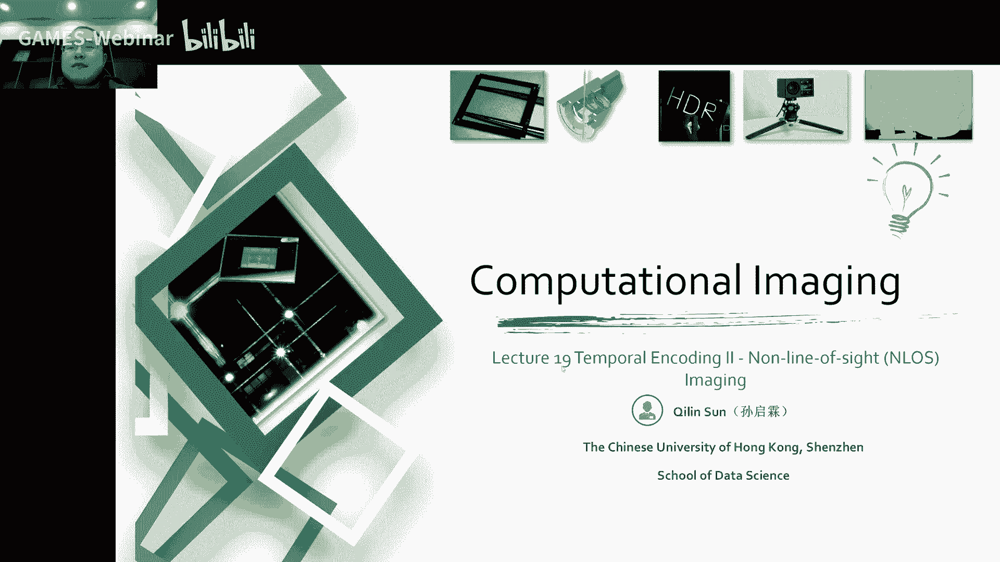

今天啊首先给大家讲到的是一个，什么是非实际成像，我们是怎么样实现这个非式与成像的呢，啊然后再给大家讲一下这个啊，nonset mage的一个image formation model。

我们这个怎么样来描述这个成像的过程啊，其实像我们嗯之前上课，从最开始的一个像嗯人眼的分析啊，呃相机模型啊，最后再到相差噪声，其实呃前面的一些课程，是给大家做一个成像系统的描述。

因为我们最后要构建这个嗯系统，求解的一个优化问题，我首先要把这个系统描述出来，诶，描述出来这个图像系统之后，哎我们就可以解，通过这个已经描述出来的方程来解，我们想要知道的一个未知量啊。

这个思想就在我们这整个课程设计的时候，就已经体现出来了，到今天就嗯以大家一些实例哈，因为这formulation model最后解出来，它也给大家一个实战的一个机会，嗯因为像我们刚才讲到了。

我们这个null set没经过嗯，一个一次发射反射再反射再反射再回来，哎这总共是一个啊五个维度的一个传播方程诶，这个时候对我们实际的想捕获这个非视域成像，是非常困难的，我们要解了一个五维的一个dq 5。

你想这个这是多大的一个这个方程啊，是不是这个就非常困难，后来呢就是mo two就是一个师兄啊，后来在斯坦福发了一篇nature，就搞了一个confocal nonsite mei。

这个我可以给大家详细的讲到哎，这个什么是cfocal啊，后面呢呃我们会发现我们在这个墙上测到了，这个是呃d等于零的一个位置，我们是，但是我们是要实际想要测到的，这个呃墙后面的一个三维物体。

是一个t等于零的一个位置，我们通过一个波动方程啊，来把这个整个f k k就是frequency the wave number，两个之间建立一个关系，来整个做一个迁移，来最后来实现一个啊。

通过一个叫sk migration的一种方法，来把这个后面的一个墙，后面的一个三维物体重叠出来哈，这个就是今天大概主要覆盖到的内容，诶这个首先就是什么是非视域成像呢，大家想一想这个问题啊，非世玉啊。

从这个名字来说，就是诶我本身我自个儿看不见他，它是藏在一个墙后面的一个东西是吧，其实有时候也叫looking around the corner，这个场景是这样的，我们这是呃，我们这边有一个激光啊。

激光，然后在激光旁边是放着我们的相机，这个放着我们放着我们的相机，这个激光发射这么一个点光源啊，或者一线光源，我们这里以点为举例吧，一点光源达到这个diffusion的一个过程，这里有物体啊。

被一个墙挡住了，我是想通过这个上面这个decision wa，通过这里面的漫反射信息，来恢复出来我们最后的一个呃，墙后面的一个场景是什么样子，大家我们可以看到哈，激光发射到达这个墙面是第一次传播。

他这是第一次的传播方程，我这一个点呢，然后又啊变成一个球面波哈，这个点发出球面波诶，每一个球面波又开始往外往外传播，这是第二次，然后呢，这个这也是这被墙漫反射的波，然后打到这个物体表面，物体表面诶。

每个点又产生一个球面波，对不对，然后到达这个墙，这是123对吧，到了这个墙啊，这个反射，呃问题本身反射已经是第三次的变化了哈，然后再到啊强就算是第四次的一个反射，这个墙再经过一个到达detection。

总共是带一个五维的一个方程号，就在我们墙上所观测到的呢，实际上是这个物体表面，这是我在我墙上的一个呃点了这一个位置，对不对，取其中一个像素，取出一个像素。

我去分析它的一个呃时域的一个time his gram，大家想象一下，这个我在墙上看到了这个球面波的叠加，我他这个点的黑gram，它具有什么意义呢，对不对，其实嗯可以想象一下我们最短的一个路径。

最短的一个路径哈，就是我最前面这个他们cos的最前面这个音，实际上就是我真实的一个三维物体的一个信号，的一个问题，对不对，大家可以仔细的斟酌一下，这个几次反射带过来什么样的影响。

当我们在正式讲这个nl 3 min之前，要给大家掰扯一下，这个非视域成像到底有哪些难点，首先呢我们知道啊，我们的一个光强哈，特别是呃一个像那种球面波，我的一个光强是随着r方分之一。

也就是距离平方分之一哎来去衰减了，对不对，然后我经过两次墙面的一个defi，再加上物体表面的一个def，我这个最后有三次的一个scattering，对不对，这个时候他衰减的速度是远远大于这个。

随着平方向衰减的一个速度的，对不对，也就是我们一束激光打到墙面上，然后最后再经过墙面的一个散射，再经过物体的散射，再经过墙面的散射，这个时候能够到达我们的一个传感器，的一个光子数是非常少的。

也就是说我们现在啊，实际上能探测到的有效信号它是非常微弱的，这个时候就给大家带来了挑战，给大家带来的挑战，说一般我们是用一些单光子器件啊，下面spd传感器啊，或者换台卫生管来实现嗯这么一个高速呃。

微弱的一个测量，这个它的一个solution通常就是非常高的一个hdr，或者一个git single for tdetector，诶这个是第一个挑战哈，第二个挑战呢。

就是本身它是一个非常eu condition的一个inverse，problem，我们要恢复墙后面的一个三维的一个场景，就我们不知道嘛，最后拿到的是一系列一个球面波的一个叠加哈，而且是经过叠加在弹射啊。

这个时候整个一个这个是变成uu，condition的一个问题，这个是怎么解决呢，一般我们是首先我们需要有一个，皮秒量级的一个时间分辨率啊，时间分率，我们可以解析我们这个波前的一个下位。

那第二个呢就是我们用一些像数学的一个，先验知识，或者是一个呃图像的一个先验知识，来做一个啊upose的一个约束哈，嗯或者是应用一些其他，unconventional的一些approach。

比如说后面我们讲到一个fk migration本身呢，第三个挑战是啥呢，第三个挑战就是我们这个要求的一个逆问题啊，是非常巨大的一个matrix，我们经过几次传播，我们会拿到一个五维的一个向量哈。

五维的一个向量，这个数据量是非常庞大的，所以说呢，我们需要一些构建一些新型的一些算法呀，或者是一些新型的set up来解决这个效率的问题，这个时候人聪明的。

人类就发现了一个comfortable的一个问题，我把这个反射区的一个pad跟回来的pass相重叠哈，这个就可以啊，实现这个问题的一个客服啊，总之哈我们是要实现一个非视域成像，面临的三大挑战。

首先b信号很微弱，第二就是它是一个airpods的问题，第三就是我们这个啊matrix managment，是非常大的一个managment。

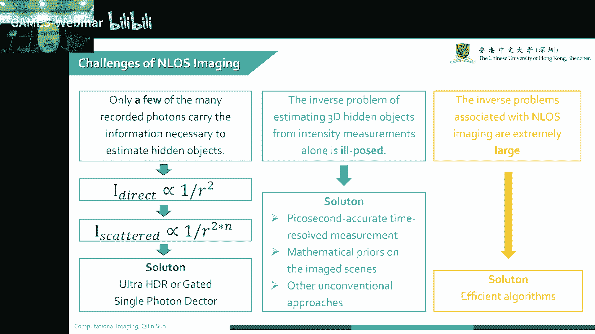

这是一个呃最早的一个呃，looking around the corner的一个工作啊，这个是应该是mit啊，这是welton，就是在welton在ross卡组里做的一个工作，诶。

这个时候我们可以看到诶，直接的一个managment by project intensity，诶，跟最后recover的一个这个一个图像啊。

这个是怎么实现的呢，我们那个时候我们通常是用一个啊，gao来做扫描，gao来做扫描，哎，来每个点在墙上不断的去扫，然后去恢复出来，这个回拨完，最后通过一个高时间分辨率的一个一个detector。

来把这个拨弦重建出来，然后呢，后来就是因为这种方法就比较比较老笨哈，做了一个呃这个nonset min setup，这是一个线扫描的，一个可以做到每秒一帧左右的一个呃，一个那个时间分辨率哈。

这个是速度呃，这个帧率就比较快的哈。

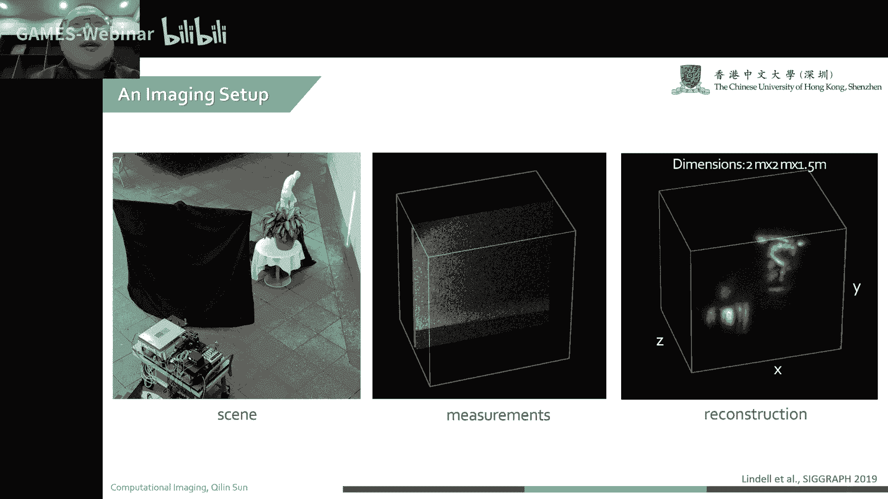

然后呢呃讲了这个那什么是非视域成像，接下来要给大家啊，从这个源头分析一下，我们这个非视域成像的一个基本模型哈，通过构建这个基本模型，会让大家理解这个非区域成像是怎么实现的，然后我们去怎么提升。

这个非日语成像的一个系统。

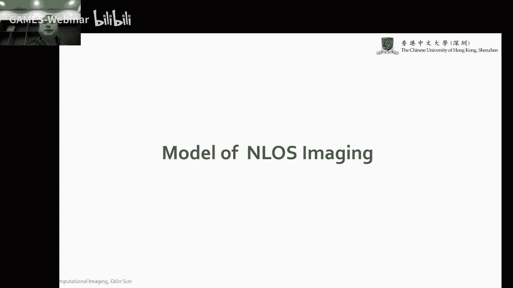

一。

这个大家都播放了啊。

首先呢我们可以看到我们的一个，light source跟这个sensor我们共用一套光路哈，然后通过一套gvg在x y方向去扫描啊，去扫描，然后这个光呢经过这个经过这个咖附近。

去打到这个decision的一个墙面上，decision的一个墙面上，然后呢在defuse到我们这个后面的一个objects，对吧，这个时候我们再通过一个，比如说我们要再回到这个pass。

这个这个这个小body哈，body再反射出来这个光，再回到我们的detector，这个时候呢我们在我们的一个传感器上，就拿到了一个这么一个his time，his gram。

这个time his grand就分为两个部分，第一个部分就是我们的一个啊，直接就是直接一个direct reflection，就是我们刚开始达到那个点的一个，direct reflection。

然后第二个呢就是一个inner，发音是我们最后想要测到的信号哈，我们通过不断的做三维扫描诶，把这个indireflection提取出来，这个时候嗯就是一个就是一个，这个时候就是一个那个完整的一个构建。

一个完整的信号哈，就是通过二维扫啊，这同学问的什么叫ga镜，那不叫ga叫jo g a l v o啊，那个g a l v v那个是嗯，就是一个扫描的一个镜子哈，你可以理解为可以xy扫描的一个镜子。

按角度扫描的一个镜子，这干活镜啊，这个是啊，我来给大家科普一下哈，这gao镜是可以实现一个比较高精度的一个角，度扫描了一个七点，然后更精确一点的一个叫pizj p o，就是通过嗯这个苹果就是压电。

就是压电效应哈，我们不同的电压来产生不一样的一个位移哈，或者是就是拿到rap这种高精度的一些嗯，微操作的一些台面上来使用的一些技术，这个把这些gb镜啊，这个时候是已经拿出来做一个扫描用哈。

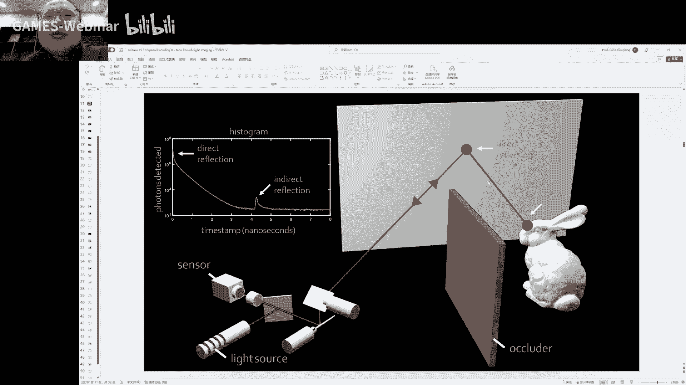

诶我们实际上我们可以看到的，就是当我们的laser点上，然后这是我们的一个探测的一个点上，就是传统的一个呃，none of that meeting，他是一个non computer的sample。

就是我们的这个激光打过去，这个点给我们测量这个点哈，它不是重叠的，不是重叠的，这个时候在我们detection上观测到了一个，观测到了一个time his gram，就是啊这么一种情况就是很大。

然后再衰减n有个信号，然后在不断衰减，这个是nonconforcl的一个supreme，这个时候我们啊，光光线传播会有非常多的维度哈，这个时候大家不是很喜欢，因为维度太高了。

对我们计算来说是有非常大的压力的哈，非常大的压力，这个是怎么办呢。

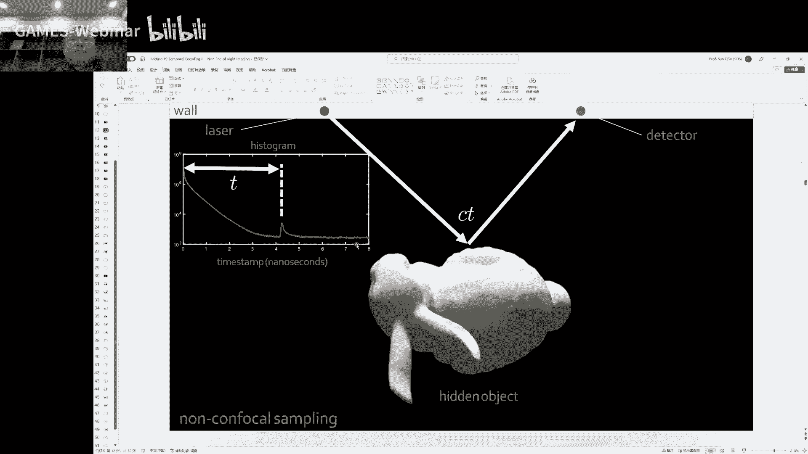

这mc o two就搞了一种叫comfort的一种办法，也就是我们最后测量的时候，我不把这个测量点跟这个激光点分开，我就把这个测量点跟激光点去重合诶，这个时候我们就发现这个激光点，激光照亮这个点。

它在反射出来一个球面波，打到这个物体表面，这个物体表面再反射回来，再反射回来了一个球面波诶，又会达到这个点，就是这两个light path就重合了，实际上我们最后拿到一个五维的一个这个dlc。

我就变成一个三维了，因为我们其中两个维度已经相互cans掉了啊，相互看透掉了，这个时候我们就发现我们实际要解决的问题，仅仅是一个简单的一个，three d d convolution的一个问题。

这个就变得非常有趣非常有趣啊。

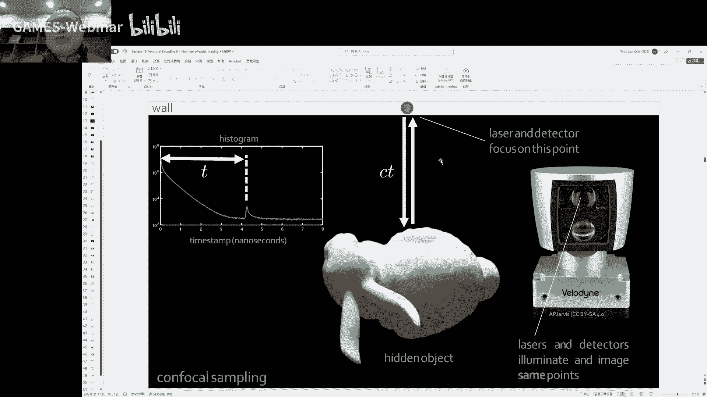

而且可以极大的提高我们这个啊，nonset mage的一个效率哈，啊这是一个the same path to the object，就是我们这个光来回的这个路径是一样的啊。

这个时候也叫convocal sai，在cfl 30会有什么问题呢，csol one sam本身啊，他那个光啊，实际上是会受到这个，就本身照明那个激光的一个点的影响，这个时候我们就需要一个git的办法。

这滤掉就滤掉，这个时候就要求我们的器件会比较快哈，当然啊，现在今天的器件已经完全可以达到，这种confil的一个set up，我们这个时候通过这个comfort的办法，就是带来了两个好处。

第一个就是我们两个来回的一个life path重合了，极大的简化了，就从五维一个问题简化到一个三维的一个测量，哎，同时因为我们这个维度维度的减少，我们可以极大的提高，我们这个非智与成像的一个效率啊。

实际上到最后我们啊，就只是仅仅是做了一个sdd tion啊，就可以实现我们这个分式与成像。

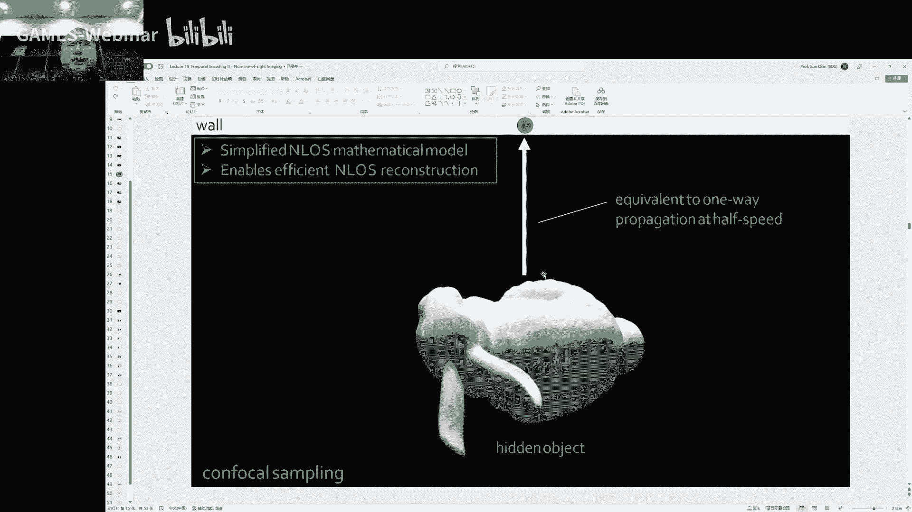

这是一个console的一个呃，就是set up，哎，我们通过每次测量这么一个点，然后在这个xy撇y x撇，y撇这个二维的一个地方做扫描诶，每次我们一个点是一个拿了一个time his gram。

对不对，然后我在这个x撇y撇两个方向分别进行扫描，诶，就可以拿到了一个x撇，y撇t的一个3d的一个data q啊，3d的一个dq 5，最后我们就拿到了一个三维的一个measurement。

实际上我们是呃很简单，就是拿到了一个三维management，我们把这个三维的managment记为套啊，它是一个有关于x撇，y撇和t的一个啊三维的一个测量。

唉这个时候让我们来正式的去写一下，我们这个image formation model，本身呢我们知道我们这个时候，我们的一个测量哈，它是一个三个维度的，就是要买什么，我们知道x撇y撇t对吧。

我们的transport matrix，我们可以知道这个我给大家画一下啊，我们来本身的这个transport matrix，sorry我给大家直接在这个上面画一下，这个画一下会更清晰一点哈。

我们可以看到诶，换个颜色吧，对，诶这个时候光第一次发射，诶第二次反射，啊被物体表面诶再来一次，一般是再来一次反射哈，这个就是，第一次123，四五，然后六一，三，四六总共是经过了一个六维的一个。

transform matrix，然后我们要重建的呢，重建实际上是重建我们最后的一个，x，t的一个data cube，它是一个三维的一个data cube，这个时候遇到问题。

这是一个传统的一个none of smain model，我们这个时候就可以看到这个transport matrix，我们经过几次传播哎，加上反射呀，加上cheering啊。

它是一个非常非常大的一个matrix哈，比如说我举个例子哈，比如说我们要仅仅测量100个点的时候，我们就会有一个啊train的一个elements，我们这个要是1000个点呢。

我用spss h做了一个representation的时候，它就需要一个p p t bt，一个就是一个memory才可以装得下，这么大的一个传送文matrix，这是对大家来说是非常难以处理的。

这么大一个超行去超巨大的一个方程哈，就是哪怕我们是用一些matrix three，像卷积啊来做也是非常困难哈，这时候我们最早的像valon啊，像嗯bot sava 15年的工作。

他整个的一个计算的工作量，都在一个n的五次方这么一个维度上，memory消耗呢也到了一个n的三次方，那个时候大家啊经过这么多一个测量，他可能当时测光测就测个几个小时哈。

最后通过一个解个十分钟才能把这个match解出来，然后呢直接做这个interactive inversion，这个也是需要这个五个维度的一个呃，五个五个维度的一个测量，当然这个时候嗯。

当时head用的是一个etf来实现了一个，用了一个etf来实现了一个啊这个null set成像啊，这个维度也是非常高的，所以说那个时候无论是采集还是到计算，我们都会花花非常多的一个时间啊。

来才能实现这么一个非视域的一个成像，所以说对我们来说，这个整个东西就是一个非常难以计算的，这么一个超大的一个matrix，所以说呢这个18年的时候。

这个mac o two就搞了一个convocncmei，这个我们呈现的模型呢，我们刚才讲到了呃，我们刚开始上课，讲到了这个，x y x撇y撇p撇的一个measurement，哎这个就是fish，本身呢。

我最后因为是cfo的一个模型，我就可以每个拨弦哈，它是这样，就一个3d的一个black ko 3 d blolo啊，这个也会变得非常简单，大家发现了吗，这个时候我们要解决一个问题啊。

实际就是一个3d的一个d convolution，这个就变得非常简单，无论是从我们set up来说，还是到我们最后的系统理解来说，还是到我们最后把这个东西解出来，说，我们仅仅要解的就是一个3d的。

一个节卷机的一个问题，这个时候呢我们的整个计算的一个量，就到了一个n3 log n的一个情况，mary consumption也是只是n的三次方诶，这个时候也可以实现接近的一个real time。

当时啊我们这个当时发完nt之后啊，这个mate也把这个套系统拉到了，这个cpr的现场啊，当然也可能18年3年考cpr的那个同学们，可能会对这个有印象哈，在现场展示了这个非视域成像的一个。

实时的一个重建哈，当然这个时候我们都是基于假说的，就是一个我们这个scattering的一个medium，都是一个呃各项同性的一个scattery哈，没有考虑像嗯这种表表面的一些小经历啊。

或者是这种镜面的一些反射啊，没有考虑这些问题，这个时候我这个共聚焦的一个扫描呢，然后就会获得这个x撇y撇，p撇的这么一个madam，实际上就是一系列的拨弦的叠加。

我们最后拿到的信号就是一系列拨弦的叠加啊，唉我们要实现这个恢复，我们第一步就是要对它进行重采样，然后在我们那个t的时间轴上啊进行一个停留，因为我们知道他整个播前啊，第一个拨弦中心的第一个点。

实际上就是我们想要的信号，但是现在都是叠加在一起了，所以第一步我们是做了一个嗯，resample跟attenuation啊，然后我们这个completion kernel呢，基本上就是已知的哈。

我们可以直接测量这个diffusion wall啊，来把这个conversion kerne诶，这个写错了，不好意思，ctrl的kd来这个直接的展示出来，这个时候我们把这个resample的一个信号。

直接进行一个呃deconvolution啊，我们就可以很快速的恢复出来，这个我们的target，就是x y u这么一个三维的一个target，诶那不好意思，刚才这个把信号断了哈。

这个时候第一步实际上就是resample和tedation，along tx对吧，我们知道这个信号的第一个位置哈，信号第一个位置，实际上就是我们信号那个地方啊。

本身呢一个conclusion kernel啊，他就是啊，他就是可以直接通过测量或者是仿真，都可以得到哈，这conclusion kne把他这个做成一个inverse filtering。

作为一个dd conclusion哎，就可以直接恢复出来，我们想要的一个xyu的一个三维的一个信号，这个是可以呃，非常简单轻松的来获取，我们这个嗯nonset amazing，这个是一个巨大的进步。

从此之后啊，这个非实际成像啊，就慢慢看到了，有实际应用的可能性，因为我们真的可以把这个问题简化到，一个简单的一个3d的一个抵抗motion，诶，最后我们再呃，通过这个resample。

就可以直接拿到这个x y z的一个，三维的一个图像啊。

这个是可以变得非常快速而且清晰，这是当时啊他们做了一个实验哈，这个分辨率是64x64，然后整个曝光的时间只需要0。1秒哈，这个我们可以看到back projection的一个方法。

我们可以可以这个很难看到里面是啥，然后用future back projection呢，也是很难恢复出这个三维形貌啊，就可以用l c t的啊方法去进行恢复。

然后或者是我们做deconversation的时候，再加一个约束，就可以更好的恢复我们这个想要的信号。

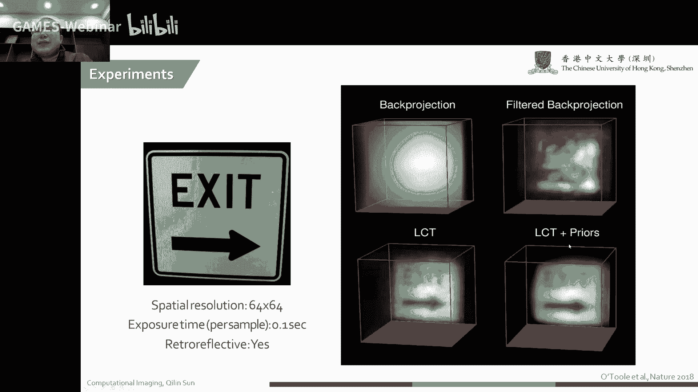

这个是我们恢复出来的一些结果。

但到了后来哈，人们还是不能满足这个重建的结果，到了19年srah的时候啊，这个斯坦福的一个golden也是我师兄啊，他们组里就做了一个frequency web number。

也就是从频率到波数的一个迁移的一种办法，来实现一个啊高速，然后高质量的一个啊非视域成像，这个sk migration本身，这个思想是从这个通信领域借鉴过来的哈，通信领域借鉴过来也是从电也是分。

可以说是从电磁波领域借鉴过来的，那首先呢我们可以回顾一下，我们物理学里面的这个波动方程啊，就在我们的一个自由空间里面，我们这个波的一个方程，还有波的传播，在自由空间里面的传播。

也可以通过这个rf round平方，等于y减去个c方分之一，然后right方跟run t这么一个约束，我们这是我们的波动方程，我们的任务是什么呢，我们要测量的东西是在这个墙面反射过来的。

我们需要把这个boundary condition，也就是在z等于零，也就是在墙面上，我们可以认为是z等于零，然后迁移到另一个bug condition，我们通过这个波动方程来迁移到另一个帮助。

condition，也就是t等于零的情况下，t等于零上，实际上就是这个信号本身的一个，表面的一个东西。

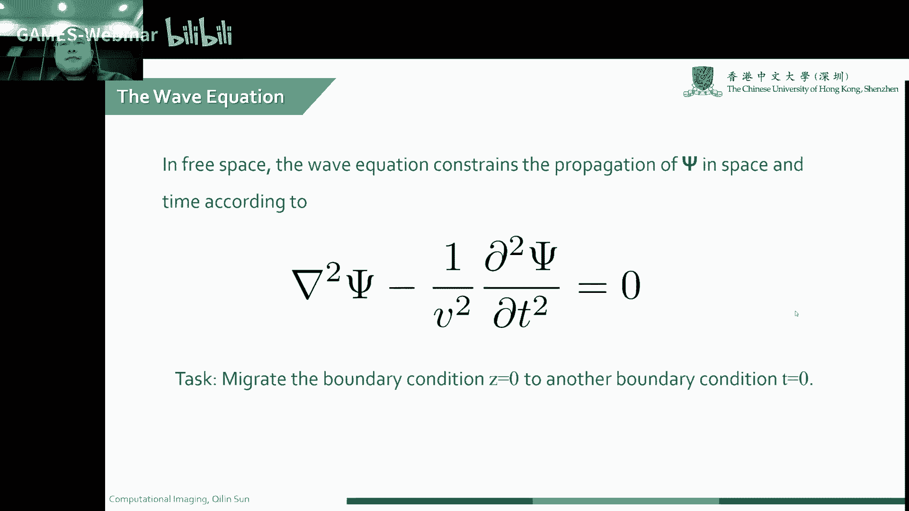

所以这是一个呃本身它的一个set up。

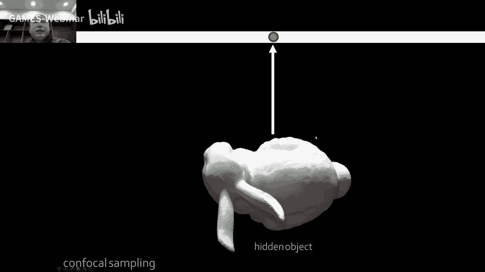

这个时候我们的image formation model变成什么呢，我们它的一个本身，我们这个波传播的一个方程啊，就记为f然后x z t哈，我就记为简单记为fx z t啊，我们这个强啊。

我们就设为z等于零这个位置哈，然后呢我们confer measurement，实际上就是我们要直接在这个墙上，测量的这么一个位置，也就confile manager呢实际上就是z等于零的一种情况。

当我们要借助这个波动方程，来把这个z等于零哎，迁移到这个t等于零的情况下，就可以复制出来这个bu表面，一个三维三维表面的一个形态啊，这是我们的一个comforty minimal。

它实际上就是一系列的一个波形的叠加，方波形的叠加。

本身呢就是我们要解决这个问题，还是比较困难的，所以说啊大家学过物理的同学，也就是我们说说f c d e啊，我们通过啊，这个对波动方程进行有限元的一个差分啊，我们知道啊。

刚才我们可以已经知道了这个波动方程哈，波动方程是这样的啊，混合方程式，sorry，这是v哈，我步骤方程实际上是这样的，这个时候我们想要得到这个参数，这个参数我们是可以通过有限差分的方法。

因为我们这个managment是已知的，我们是通过这种有限元的方法来，可以来逐步的获取我们这个round five比rt是什么，这是获取这个five的一个完整的一个方程哈。

然后我们就可以通过不断的迭代哎，通过前面的一个step不断测量迭代，然后去update这个fine，在这所有的一个great cell来after you define。

当然我们这个时候通过这种测量方法，是非常慢的，非常慢的，我们要通过不断的有限源差分分析，不断的迭代来去啊，恢复我们最后表面的三维形貌，最后实际上跟扫描也差不太多哈，差不太多，这个时候大家不喜欢怎么办呢。

我们现在我们的task呀，实际上就是想做了一个frequency wave的一个迁移，我们是想要把从频域从频率迁到了一个view number，上面一个问题。

也就是把我们的帮助condition从z等于零，变成t等于零啊，这个过程哈，这个大家可以简单的想一想，我们这个我们要实现这个帮助condition的迁移啊，首先我们第一步要做的事情是什么。

大家有没有这种感觉哈，就是要我们要知道这个实际上要做的。

这个事情是什么哈，就是我们从这个bug condition z等于零，哎我们变换到这个bug condition t等于零这种情况，这个时候大家怎么做呢，怎么做呢。

这个时候就有非常关键的一个点哈，来首先还是从一个set up来给大家，先把这个过程先讲明白好，还是我们传统的set up，这个是这个时候我们可以右右边看到。

我们有很多诶这个cfo management啊对吧，这个时候我们是已经得到了，这个d z等于零的这么一个信号，z等于零的x y t的一个management。

但是我实际的一个managment是比较弱的哈，这个是我们刚才那个是我们恢复出来的。

这整个的一个从频率到波数的一个迁移，是怎么搞的呢，我们的这个测量到这个场fxy t是我的magiment，因为这个时候我们的z等于零的这一个，fix y t哈，首先呢我们要把它变到频域啊，把它变到频域。

这个时候我们就得到波数kx，波数k y跟我们的一个频率f对不对，这是我们的第一个频率，然后我们再在这个频率里面，这个我们叫做fb，我们在在这个频里面进行一个spectrum的一个。

interpolation，我们把这个频率啊，频率就是这个f这个地方，也就是这个f我们要迁移到在第三个波数上，也就是大家所谓的f k migration哈，这个f k memory的一个迁移的过程。

然后我们再通过一个e的一个分裂变换，再把它变到我们的一个新的一个，关于f的一个方程哈，就是关于也就是t等于零，这个时候就可以把这个fx 2 z的一，个波数解出来，实际上就是我们要最后想要解到了一个。

三维空间中的一个信号，好最后这个sk migration的一个过程是什么呢，首先我们要把这整个的一个波动方程，要把它搞出来哈，波动方程要搞出来，我们要因为这个波动方程本身是关于这个。

xyz跟t的一个函数哈，我们怎么样通过我们测量到的一个呃信号好，我们测量首先测量的信号是fxy，我们要把这个信号诶变过来对吧，本身呢我们可以看到这个把它变到平，这个实际上是对这个频谱的一个变化哈。

实际上也就是我们所说的一个f f t哈，这是我们的一个频谱，我们这个频谱是关于是有关xyz，还有t的一个函数x y z t的一个函数，我们怎么样实现这个从f到k的一个迁移呢。

首先我们要对这个这个函数这个式子里面，这个t把这个t设为零啊，把这个t设为零设为零之后呢，我们就可以把这个函数这一项简化掉，这一项简化掉，我们就得到了一个fxy t，fx y z t等于零的一个函数。

这个时候实际上就是我这个spectrum，k x k y k f，然后对ksk y k z这个波束上的一个积分，这个时候我们还是没有完成，从f到k z的一个迁移，对不对。

我们这个我们时刻牢记我们的使命哈，我要每刻要牢记我们的使命，是要实现从f到k z的一个迁移哈，怎么签怎么办呢，这个我们继续，我们这个时候因为我们刚才讲到了，我们要实现从f到kz的一个迁移，对不对。

这个时候我们就可以用到物理学里面，一个叫色散方程的一个东西啊，色彩方程也就是f我们要换元啊，对这个对这个式子进行换元，f就等于一个v，然后根号下k x k y k z的平方啊。

在这个里面k x y已经是啊，我们知道这个时候已经等于零了哈，实际上因为他这个confil的一个过程啊，它是一个去的一个path跟回来的pass是相符，overlap，这个时候我们就可以诶。

对这个f进行一个替换啊，直接进行一个替换，当然这个时候就带了一个v哈，f这个时候我们要把这个k z替换掉呢，实际上就是也很简单对吧，我们最后fk x k y k z实际上就是v k z啊。

这个这个是我们加了一个绝对值符号，是因为我们不知道这个解了这个平方之后，是不是啊还一样啊，这个时候实际上就是我们的这个，kz，build up的这啊f k s k y k z，跟这个f撇的一个关系哈。

这是首先就是f啊f，用这个新的一个式子来表示哈，诶，这个时候我们就可以，对上面这个式子来实现换元，把他这个地方来实现换元，这个方法呢是叫george提出来，这是还是还不是挺远挺远的。

这是2000几年叫还是199几年，这个叫gorge，提出了一个叫scout interlation的一种办法，我们来实现这个对这个频谱，k x k k k y f这么一个方程进行换元哈。

换完之后我们就拿到了这个five，关于，x y t的一个方程，实际上我们可以看到，通过这个啊dispersion relationship，我们拿到了实现了对f对k z的一个迁移哈。

我们本身我们的频谱信号，频谱信号，拼图信号f撇啊，fib啊，k x k y，来实现对这个fk x k z，k y k z的一个迁移哈，这个时候我们通过这个scout interlation啊。

来实现了啊，对我们这个频谱的一个重采样，对啊，这个实际上也就是对我们这个f，把它变换成k z了啊，总是对频谱的进行冲采药，这个时候我们就完成了，从频率到波束的一个迁移，好到波数的一个迁移。

大家可以看到我这个整个迁移的一个结果，就基本上就是一个inverse的一个分列变换，就是一个逆的一个数列变换了，对我们通过t完之后，实际上本身呢这个算法就变得非常简单，第一步f f t把它变成频谱。

然后通过一个sk migration，然后里面很重要的是一个叫scout，one day interpolation的一个办法，然后再把它做一个简单的一个逆列变换诶，这个时候就可以非常轻松地获取一个。

我记得上大学的时候，老师就讲过哈，这个十余里干不好的事呢，大家就放平日里看诶，这频域里干不好的事呢，大家就放到十余里去干，这个时候就会往往算一个呃域哈，就可以比较好的解到一个呃这种结果。

这个时候我们就实现了，从t到从z等于零到t等于零的一个迁移，我们就可以很轻松的获取，我们就是物体表面的一个波前的信息，来重建这个物体表面的一个三维结构，这是我们整个fk mhy的一个伪代码哈，首先呢。

也就是我们对我们的信号，进行一个简单的预处理啊，就做一些简单的ping啊，诶，然后这个时候再对我们的一个信号，进行一个快速的分裂变换，我们就拿到了一个关于fibk x，我们可以看到这个地方。

就是这是我们拿到了第一个挺好，我们这个时候要把这个f迁移到k z，f迁移到k z，然后呢通过这么一个简单的一个嗯叫stolation哈，我们就可以对在频谱里面，对我们的信号进行了一个重新的采样哈。

来实现f对k z的一个迁移，然后再做一个简单的一个inverse fly变换诶，再安排一下，在post processing下，就可以快速的恢复，我们这个f关于x y z的一个场，其实这两个问题啊。

从convocal native setting mage到我们的fk migration，整个的思想都是对这个问题进行简化，我们看到它里面操作也不多，前面一个confusion 3里面。

把问题简化成一个3d conclusion啊，这个问题就把问题简化到了一个呃，在评语里面做一个简单的一个重采药哈，这个大家就会发现诶，这个问题原来是这么的简单哈。

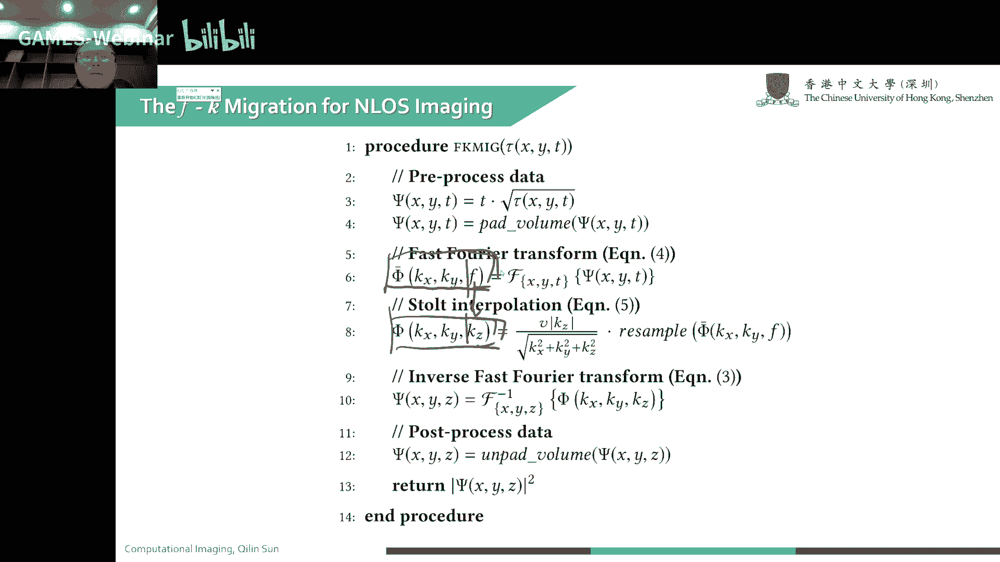

这是一个呃当时拍摄的一个结果，这个曝光时间是挺长的哈，大家这个可能踩了，当时踩了有180分钟，三个小时，然后呢这个算是也挺快啊，90分钟就把这个migration给算完了。

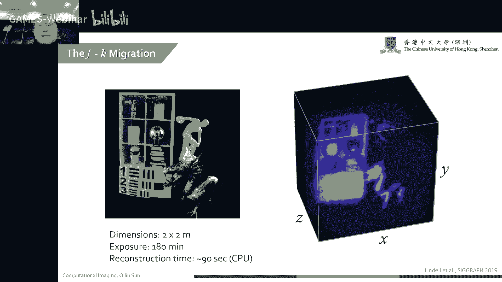

就是啊一个confession confession，这是一个back projection的一个结果，也就是啊当年是welton那种哪里if的一个做法啊。

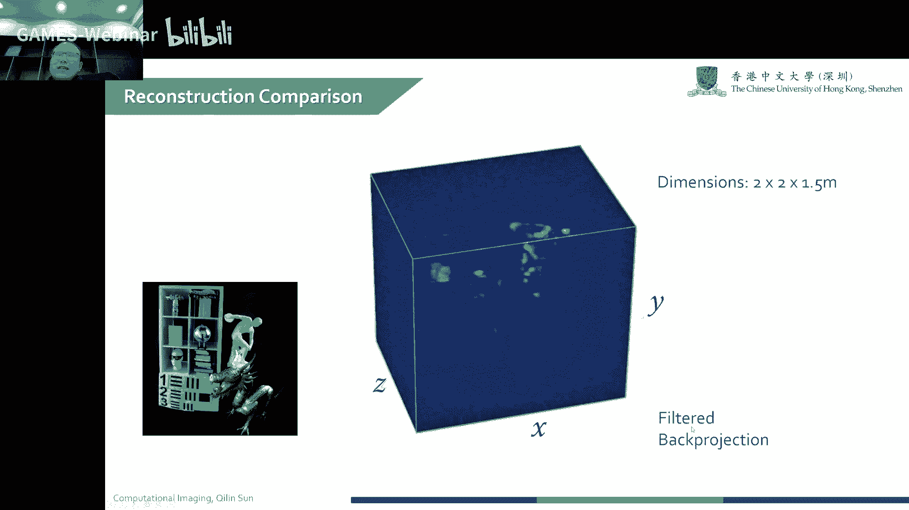

back projection filter一下，这个是通过african migration来实现的一种办法，所以大家会发现这个对以前的办法，有一个长足的一个清晰的进步啊。

我们这周围这些杂散光基本上都给去掉了。

基本上都给去掉了，然后下面呢再给大家介绍一下其他的work，这是2020年啊，要等人搞了一个direct like home transform，这是我们藏到后面的一个场景。

这是一个recover的一个surface，后来呢这个method呢，这这这几个老哥又把这个非视域成像，又拓展了一下哈，这个是直接就搞到锁孔里面去了，这个大家知道大家开门还是挺不容易的哈，这大灰狼来了。

这很难让大家开门，这我干脆就直接一个激光通过这个锁孔打进去，来看到你这个房间里面到底是什么个样子哈，这种就把这个我问题变得很实际哈，我们的大家这个大家锁里面都有锁孔，锁孔是可以透光的。

我们是可以通过这个锁孔，来把这个里面的三维形貌来做一个窥探啊，窥探啊，这是当时啊恢复出来一个结果啊，虽然这结果会比较差哈，因为我们set up是比较econdition的，会比较差。

但是诶这个也是告诉大家，哪怕你藏在这个屋里，也是可以看到那里面到底发生在什么的，今天呢就给大家讲了一下什么是非视域成像，然后给大家讲了一下，传统的一个非视域成像的model哈。

我们的一个transport matrix是一个呃，就像蓝衣服的一个setup，就是一个六维的一个matrix，我们传播呢啊就是最后一个managment，是一个五维的一个managment。

这个时候就变得非常困难，所以说啊，18年macbook to就搞了一个confucnasset mage，把其中的一个墙面照亮，那个物体的一个life path，跟物体反射回来。

life path所重合时间，就把维五维度变成一个三个维度的一个managment，实际上我们要解的问题就变成一个简单的一个，sdd convolution的问题。

再后来呢我们就要通过一个波动方程的方法来，通过这对这个frequency到wave number的一个迁移，来实现一个呃frequency到wave的一个迁移。

来实现一个帮助condition t等于零到帮助condition，帮助condition z等于零到我们帮助condition啊，t等于零的这么一个啊搬迁哈。

这个时候我们就可以因为这个rt等于零的位置，就是我们实际物体表面反射波前的一个，三维形貌的一个位置，哈哈这个是大家就可以直接重建出来，这个三维的一个结果。

这个light com transform这篇文章我没看好，这个我还没真没怎么看，这个文章应该是，应该是也是一个setup，应该是都是一样的哈，这个具体是怎么做的，我没仔细看。

大家可以有兴趣可以看一下啊，好今天的课程就到这里啊，同学们有什么疑问的话，诶可以啊，直接在这直播间里去问啊，今天这个是临时加了一节课，可能做的会比较短哈，因为这个本来这节课是想讲这个。

当然同学们就可能比较想听这个，非斥与成像的一个东西啊，实际上啊，一非是与城墙这个东西实际上是比较简单的哈，就比其他课题会简单很多，只是他设计一些嗯要快速的测量啊，这个做实验可能会不好做啊，会不好做。

就从原理上来说是非常简单了，空间分辨率这个起码得有几十乘几十吧，这个空间分辨率这个主要看你要测量时间，你要想测的点多了，其实就可以快很多啊，就可以就点少就快很多，点多的话嗯，那就卖了，这个没办法。

这个就是跟你测量的一个点的速度有关，这个一般大家就测个可能64x64啊，这么一个64x64是多少个点，六六三十六，3600多个点，同学们还有问题吗，好现在同学没问题了哈，再次感谢大家来到gx 204嗯。

今天是给大家插播的一节课哈，这个嗯，同学们也是对这个分析成像，有一定的一个认识啊，好再次感谢大家，今天的课程就到这里。

